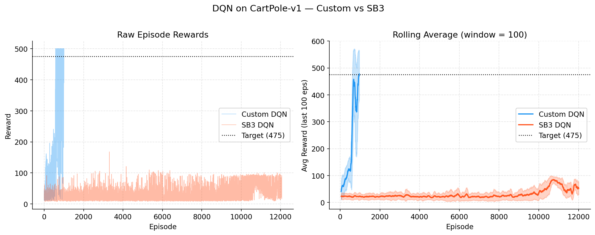
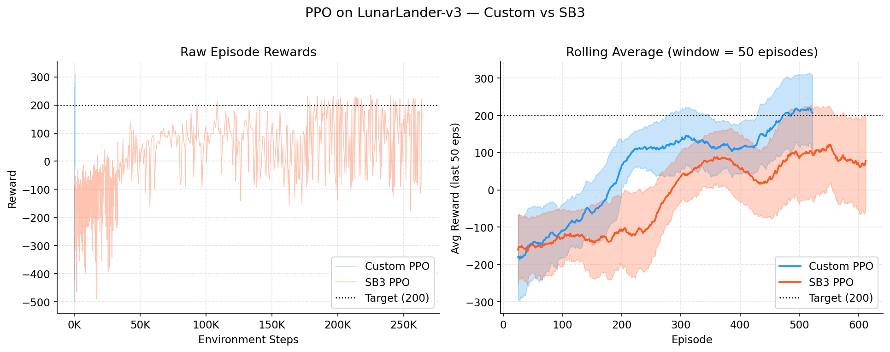
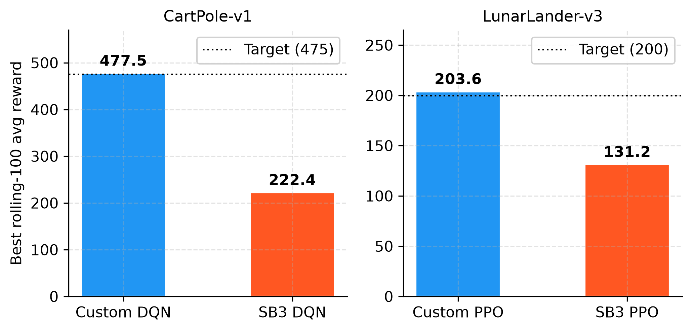

<!--
OFFICIAL PhD TITLE (keep consistent across all documents):
EN: Research on the possibilities for applying Artificial Intelligence in computer games
BG: Изследване на възможностите за приложение на изкуствения интелект в компютърни игри
-->

# Стъпка 01 - Основи на обучението с подкрепление: Доклад за реализацията

**Среда:** април 2026 г.  
**Алгоритми:** DQN (cartPole-v1), PPO (lunarLander-v3)  
**Цели:** DQN ≥ 475, PPO ≥ 200 (средна стойност от 100 епизода)  
**Статус:** И двете цели са постигнати ✓

---

## Съдържание

- [Преглед](#overview)  
- [DQN - Дълбока Q-мрежа](#dqn)  
  - [Архитектура](#dqn-architecture)  
  - [Ключови проектни решения](#dqn-design)  
  - [Итерации на хиперпараметри](#dqn-iterations)  
  - [Окончателни резултати](#dqn-results)  
- [PPO - оптимизация на проксималната стратегия](#ppo)  
  - [Архитектура](#ppo-architecture)  
  - [Ключови проектни решения](#ppo-design)  
  - [Итерации на хиперпараметри](#ppo-iterations)  
  - [Окончателни резултати](#ppo-results)  
- [Сравнение с базовите линии на SB3](#comparison)  
- [Ключови изводи](#learnings)

---

## Преглед <a id="overview"></a>

Стъпка 01 реализира два фундаментални RL алгоритъма от нулата с **pyTorch**, като включва подробни коментари в кода, обясняващи *защо* зад всяко проектно решение. И двата алгоритъма използват еднакви набори от **хиперпараметри** при сравнение с еквивалентите от **stable-Baselines3** (SB3).

**Структура на изходния код:**

```
implementation/step01/
├── dqn/
│   ├── replay_buffer.py   # Circular buffer, random batch sampling
│   ├── q_network.py       # MLP Q-function
│   ├── agent.py           # DQNAgent: select/store/train/sync/save
│   └── train.py           # Training loop, best-model checkpointing, early stop
├── ppo/
│   ├── networks.py        # PolicyNetwork (actor), ValueNetwork (critic)
│   ├── gae.py             # Generalized Advantage Estimation (reverse sweep)
│   ├── agent.py           # PPOAgent: rollout → GAE → clipped SGD
│   └── train.py           # Training loop, rollout collection, logging
├── compare_sb3.py         # Comparison script - reads TB logs, trains SB3
├── config.py              # DQN_CONFIG, PPO_CONFIG
└── utils/
    └── logger.py          # TensorBoard SummaryWriter wrapper
```

---

## DQN - Дълбока Q-мрежа <a id="dqn"></a>

### Архитектура <a id="dqn-architecture"></a>

**Среда:** `CartPole-v1` - четиримерен непрекъснат вектор на наблюдение, два вида дискретни действия и максимум от 500 стъпки в един епизод.

**q-мрежа:** Два скрити слоя с reLU активации и без изходна активация (тъй като q-стойностите могат да приемат всяка реална стойност). Размерът ѝ е `[obs_dim=4 → 128 → 128 → 2]`.

**Буфер за възпроизвеждане:** Предварително заделени numpy масиви с кръгов курсор за запис, които съхраняват кортежи от вида `(състояние, действие, награда, следващо състояние, приключено)`. Случайната извадка от минипакет прекъсва времевата корелация между последователните преходи.

**Целева мрежа:** Замразено копие на q-мрежата, което се синхронизира на всеки `target_update_freq` епизода. Предотвратява нестабилния цикъл на обратна връзка, при който целта се изменя със същата скорост като прогнозите, които се обучават.

### Ключови проектни решения <a id="dqn-design"></a>

| Решение | Избор | Обосновка |
|----------|--------|-----------|
| График на изследване | Епизодно базирано ε-затихване (`ε × 0.995` на епизод) | По-предвидимо е от базираното на стъпка, когато дължината на епизода варира |
| Минимален епсилон | `ε_min = 0.001` | Избягва смъртоносни случайни действия след сходимост; по-нисък от стандартния 0.05 на SB3 |
| Синхронизация на целта | На всеки 5 епизода | Балансира стабилност и скорост; твърде рядка (на всеки 10) водеше до по-бавни плата |
| Размер на мрежата | `[128, 128]` | С мрежа `[64, 64]` се достигаше плато около 300 средна награда; по-голяма мрежа се учеше по-бързо |
| Размер на буфера | 50,000 | По-малък (10K) водеше до преобучение към скорошен опит |

### Итерации на хиперпараметри <a id="dqn-iterations"></a>

Окончателната **конфигурация** беше достигната след три кръга от настройки:

#### Run 1 - Базова линия (500 епизода)
- Конфигурация: `buffer=10K, hidden=[64,64], episodes=500, target_freq=10, ε_min=0.01`
- Резултат: Крайна средна стойност 225; не се премина целта от 475
- Проблем: Малък буфер и мрежа; редки актуализации на целта

#### Run 2 - Първа настройка (1000 епизода)  
- Конфигурация: `buffer=50K, hidden=[128,128], episodes=1000, target_freq=5, ε_min=0.01`  
- Резултат: Постигната пикова средна стойност **479.1** на епизод 810, но в края тя спадна до 302.6  
- Проблем: `ε_min=0.01` означава постоянно 1% случайни действия - достатъчно, за да се прекратят дългите епизоди  
- Необходима корекция: Намаляване на стойността на `ε_min` + добавяне на най-добър модел с контролна точка

#### Run 3 - Финална (1500 епизода, добавено ранно спиране)  
- Конфигурация: същата + `ε_min=0.001, episodes=1500`  
- Добавено запазване на най-добър модел и ранно спиране (запазва при първо достигане на целта от 475 и прекратява обучението)  
- Резултат: **Решена в епизод 1011**, Средна стойност(100) = **477.5** ✓

### Крайни резултати <a id="dqn-results"></a>

| Метрика | Стойност |  
|---------|----------|  
| Решена в епизод | 1011 |  
| Финална средна награда (100 еп.) | 477.5 |  
| Цел | 475.0 |  
| Общо обучени епизоди | 1011 (ранно спиране) |  
| Най-добър модел | `models/dqn_cartpole_best.pt` |

---

## PPO - Оптимизация на проксималната стратегия <a id="ppo"></a>

### Архитектура <a id="ppo-architecture"></a>

**Среда:** `LunarLander-v3` - 8-измерно непрекъснато наблюдение и 4 дискретни действия. Успешното кацане носи +200 точки, катастрофата води до −100, а разходът на гориво се санкционира.

**Актьор-оценител (отделни мрежи):**
- **PolicyNetwork**: `[obs=8 → 128 → 128 → 4]` с логити, преобразувани в `Categorical` разпределение
- **ValueNetwork**: `[obs=8 → 128 → 128 → 1]` с изход като неограничена скаларна величина

Отделните мрежи предотвратяват смущението в градиента между стратегията и стойностната цел.
Един Adam optimizer обучава и двете чрез комбинираната загуба.

**Generalized Advantage Estimation (λ=0.95):** Изчислява се чрез обратно обхождане на буфера за разгръщане. Маската `(1 − done)` нулира стойностите от буутстрапинга в границите между епизодите, като по този начин коректно обработва разгръщанията, които преминават през множество епизоди.

**Изрязана сурогатна цел:**

$$L^{CLIP} = \mathbb{E}\left[\min\left(r_t(\theta)\hat{A}_t,\ \text{clip}(r_t(\theta), 1-\epsilon, 1+\epsilon)\hat{A}_t\right)\right]$$

където $r_t(\theta) = \pi_\theta(a|s) / \pi_{old}(a|s)$ и $\epsilon = 0.2$.

### Ключови решения в проектирането <a id="ppo-design"></a>

| Решение | Избор | Обосновка |
|----------|--------|-----------|
| Нормализиране на предимството | Средна стойност нула, единично стандартно отклонение за всяко разгръщане | Стабилизира големината на градиента при различни мащаби на наградата |
| Бонус за ентропия | `coef = 0.01` | Предотвратява преждевременен колапс на стратегията; насърчава изследването |
| Отсичане на градиента | `max_norm = 0.5` | Избягва експлодиращ градиент по време на ранното обучение |
| Дължина на разгръщане | `n_steps = 2048` | Достатъчно дълго за многостъпково разпределяне на заслугата при кацания |
| Mini-batch SGD | 10 епохи, партида=64 | Стандартен PPO; всяко разгръщане се използва повторно 10 пъти преди изхвърляне |

### Итерации на хиперпараметрите <a id="ppo-iterations"></a>

#### Изпълнение 1 - Базова линия (300K стъпки, hidden=[64,64])
- Резултат: Постигната пикова средна стойност **179.9**, без преминаване на целта от 200
- Проблем: Малката мрежа е недообучена за 8-измерното наблюдение на lunarLander
- Също така: 300K стъпки са едва достатъчни за пълна сходимост

#### Изпълнение 2 - Финално (500K стъпки, hidden=[128,128])
- Размерът на мрежата е удвоен; обучителният бюджет е увеличен с 67%
- Резултат: **Решено на 264K стъпки** (задействано е ранно спиране), средната стойност за 100 епизода = **202.2** ✓
- Забележително: проблемът е решен 236K стъпки *преди* изчерпването на обучителния бюджет

### Финални резултати <a id="ppo-results"></a>

| Метрика | Стойност |
|--------|-------|
| Решено на стъпка | 264,192 |
| Финална средна награда (100 епизода) | 202.2 |
| Цел | 200.0 |
| Общо обучени стъпки | 264,192 (ранно спиране) |
| Най-добър модел | `models/ppo_lunarlander_best.pt` |

---

## Сравнение с базовите решения на SB3 <a id="comparison"></a>

SB3 беше обучен с еднакви основни хиперпараметри (скорост на обучение, γ, размер на мрежата, диапазон на изрязване и др.) и **съответстващи бюджети за стъпки**. Източник: `implementation/step01/compare_sb3.py`.

### 4.1 DQN върху cartPole-v1



**Персонализираният DQN** решава cartPole около **епизод** ~1011 и достига **целта** от 475 (**средна стойност за епизод**, изчислена върху 100 **епизода**). **SB3 DQN**, обучен със 750K стъпки (≈17K **епизода**), достига максимум с най-добра пълзяща средна стойност за 100 **епизода** от **293.9** - започва да се подобрява около **епизод** 12K и показва пикове, достигащи 500, но никога не поддържа средна стойност за 100 **епизода** над 300.

**Защо тази разлика?** Три различия в реализацията я обясняват:

1. **График на изследване**: Нашият ε намалява с всеки **епизод** (×0.995), което позволява графикът на изследване да насочи обучителния бюджет към по-информативни **епизоди**, докато тяхната продължителност нараства. При SB3 ε намалява линейно спрямо броя *стъпки* (`exploration_fraction=0.36` → 270K стъпки). В среди с кратки **епизоди** като cartPole, намаляването на базата на стъпки води до пропиляване на множество **епизоди** в почти случайна **мода**, преди да започне експлоатацията.

2. **Честота на синхронизация на целевата мрежа**: Нашият код синхронизира на всеки 5 епизода - *адаптивен план*: около 100 стъпки в началото и около 2500 стъпки, когато задачата е решена. SB3 използва фиксиран интервал от 1000 стъпки. Адаптивният план осигурява по-бърза обратна връзка в началните етапи на обучението.

3. **Ранно спиране**: Нашият агент прекратява обучението при достигане на пикова производителност, като така се избягва катастрофално забравяне. SB3 изпълнява целия предвиден бюджет и в тази среда неговата стратегия колебае се - решава задачата от време на време, но не успява да задържи решението.

Това са реални алгоритмични различия, а не несправедливост при настройката на хиперпараметрите. За рамка с общо предназначение като SB3 графиците, базирани на стъпки, са подходящи за разнообразни среди; нашият избор, специфичен за задачата, просто дава по-добри резултати на cartPole.

### 4.2 PPO на lunarLander-v3



**Персонализираният PPO** достига целта от 200 около **епизод** ~543 (264K стъпки).
**SB3 PPO**, със същия бюджет от стъпки (500K стъпки), постига най-добър пълзящ среден за последните 100 **епизода** от **131.2**
и продължава да се покачва в края на обучението.

Разликата тук е по-малка, отколкото при DQN. И двата алгоритъма използват идентични хиперпараметри на PPO. Оставащата разлика вероятно се дължи на:
- ортогоналната инициализация на теглата и вграденото нормализиране на наблюденията на SB3, които подпомагат по-дългите изпълнения, но могат да забавят ранната сходимост;
- по-консервативното вътрешно конструиране на минипакети и графика за промяна на скоростта на обучение на SB3.

При предоставяне на по-голям обучителен бюджет (напр. 1–2 милиона стъпки), SB3 PPO вероятно би сходял към целта.
Нашият персонализиран PPO е просто по-ефективен по отношение на пробите за тази конкретна задача.

### 4.3 Обобщение на постигнатата максимална производителност



| Алгоритъм | Среда | Най-добра средна стойност (подвижна 100) | Най-добра средна стойност на SB3 (подвижна 100) | Цел |
|-----------|------------|------------------------------------------|------------------------------------------|--------|
| DQN | cartPole-v1 | **477.5** | 293.9 | 475 |
| PPO | lunarLander-v3 | **203.6** | 131.2 | 200 |

> **Методологична бележка:** „Най-добра средна стойност (подвижна 100)“ е максимумът на 100-епизодния подвижен
> среден по цялата крива на обучение. Тази метрика е справедлива независимо от ранно спиране:
> тя измерва пиковата способност, а не къде обучението се е случило да приключи. Бюджетите за стъпки са съпоставени
> (DQN: 750K, PPO: 500K).

---

## Ключови изводи <a id="learnings"></a>

### 5.1 DQN
1. **Най-добър модел с контролна точка е от съществено значение**: DQN е податлив на катастрофално забравяне, след като епсилон достигне своя минимум. Запазването на най-добрия модел предотвратява загубата на добро решение.
2. **ε_min има по-голямо значение от очакваното**: Намаляването от 0.01 до 0.001 беше разликата между деградираща стратегия и стабилна такава.
3. **Честота на синхронизация на целевата мрежа**: Синхронизирането на всеки 5 епизода последователно даваше по-добри резултати от това на всеки 10. Твърде рядко → бавно обучение; твърде често → нестабилност (еквивалентно на липса на целева мрежа).
4. **Изследване, базирано на епизод срещу стъпково изследване**: За среди с нарастваща дължина на епизода (като cartPole), намаляването, базирано на епизод, е по-естествено - агентът наблюдава повече от динамиката на средата, преди да прекрати изследването.

### 5.2 PPO
1. **Тясно място в размера на мрежата**: `[64, 64]` създаде тясно място в обучението върху 8-измерното пространство на lunarLander. Удвояването до `[128, 128]` беше решаващата промяна.
2. **Нормализирането на предимството е задължително**: Без него величините на градиента се мащабират спрямо абсолютните награди. Наградите в lunarLander варират от −500 до +300, което води до катастрофално големи актуализации без нормализиране.
3. **GAE λ = 0.95 е устойчив**: Стандартната стойност работеше добре без настройка.
4. **Бонусът за ентропия предотвратява застой**: Без него стратегията сходи към „висяне на място“ (локално безопасна, но неоптимална стратегия) в ранните етапи на обучението на lunarLander.

### 5.3 Реализация от нулата срещу SB3
- Чиста реализация от нулата е с обем 300–500 реда, докато SB3 има ~10,000 реда. Компромисът е по-малко функции, но пълна прозрачност и възможност за отстраняване на грешки.
- Настройките по подразбиране в SB3 са оптимизирани за устойчивост в широк кръг среди (като Atari Games с милиони стъпки и дискретни входни данни от изображения), а не за класически задачи за управление като cartPole. Това кара алгоритъма по подразбиране на SB3 да се затруднява или да се проваля без обширна настройка в сравнение с нашите специфични за средата хиперпараметри.  
  Специфичните за задачата реализации могат да превъзхождат настройките по подразбиране на SB3 при подходящи хиперпараметри.
- За изследователски цели (дипломна работа върху експлоатация на противника, стъпки 7–8), персонализираните реализации позволяват целенасочени модификации (например инжектиране на наблюдения на състоянието на убежденията), които биха изисквали дълбоко подкласиране в SB3.

---

## Приложение - Възпроизвеждане

```bash
# From repo root, with .venv activated:

# Train DQN (early stops ~episode 1000):
python implementation/step01/dqn/train.py

# Train PPO (early stops ~step 264K):
python implementation/step01/ppo/train.py

# Regenerate comparison figures (caches SB3 results after first run):
python implementation/step01/compare_sb3.py

# View training curves in TensorBoard:
tensorboard --logdir implementation/step01/logs/
```

*Генерираните фигури са в `deliverables/reports/step01/figures/`.*
