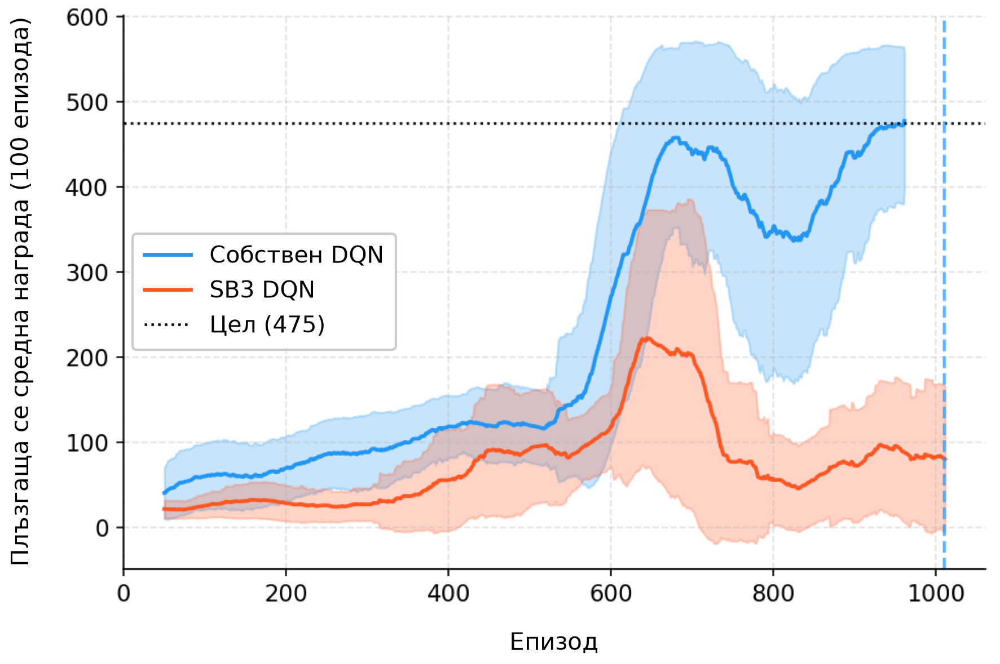
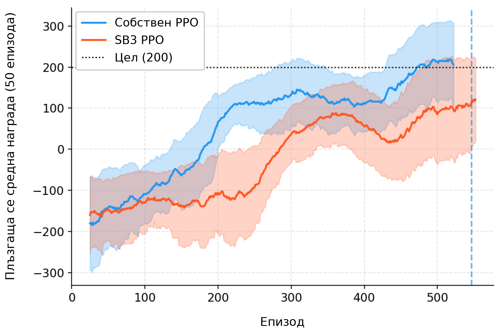
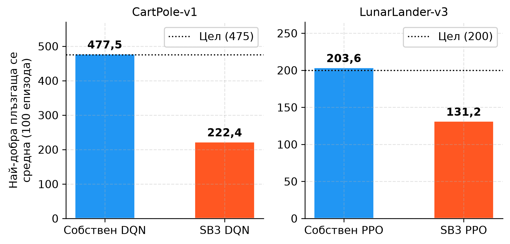

<!--
OFFICIAL PhD TITLE (keep consistent across all documents):
EN: Research on the possibilities for applying Artificial Intelligence in computer games
BG: Изследване на възможностите за приложение на изкуствения интелект в компютърни игри
-->

# Глава 01 – Основи на обучението с подкрепление: Доклад за реализацията

**Среда:** април 2026 г.  
**Алгоритми:** DQN (CartPole-v1), PPO (LunarLander-v3)  
**Цели:** DQN ≥ 475, PPO ≥ 200 (средна стойност от 100 епизода)  
**Статус:** И двете цели са постигнати ✓

---

## Съдържание

- [Преглед](#overview)  
- [DQN – Дълбока Q-мрежа](#dqn)  
  - [Архитектура](#dqn-architecture)  
  - [Ключови проектни решения](#dqn-design)  
  - [Итерации на хиперпараметри](#dqn-iterations)  
  - [Окончателни резултати](#dqn-results)  
- [PPO – оптимизация на стратегията с ограничение на близостта](#ppo)  
  - [Архитектура](#ppo-architecture)  
  - [Ключови проектни решения](#ppo-design)  
  - [Итерации на хиперпараметри](#ppo-iterations)  
  - [Окончателни резултати](#ppo-results)  
- [Сравнение с базовите решения на SB3](#comparison)  
- [Ключови изводи](#learnings)

---

## Преглед <a id="overview"></a>

Глава 01 реализира два фундаментални RL алгоритъма от нулата с **PyTorch**, като включва подробни коментари в кода, обясняващи *защо* зад всяко проектно решение. И двата алгоритъма са сравнени със Stable-Baselines3 (SB3): PPO – с нашите хиперпараметри, DQN – с настроените за CartPole стойности от RL Baselines3 Zoo (вж. [Сравнение](#comparison)).

**Структура на изходния код:**

```
implementation/step01/
├── dqn/
│   ├── replay_buffer.py   # Circular buffer, random batch sampling
│   ├── q_network.py       # MLP Q-function
│   ├── agent.py           # DQNAgent: select/store/train/sync/save
│   └── train.py           # Training loop, best-model checkpointing, early stop
├── ppo/
│   ├── networks.py        # PolicyNetwork (actor), ValueNetwork (critic)
│   ├── gae.py             # Generalized Advantage Estimation (reverse sweep)
│   ├── agent.py           # PPOAgent: rollout → GAE → clipped SGD
│   └── train.py           # Training loop, rollout collection, logging
├── compare_sb3.py         # Comparison script - reads TB logs, trains SB3
├── config.py              # DQN_CONFIG, PPO_CONFIG
└── utils/
    └── logger.py          # TensorBoard SummaryWriter wrapper
```

---

## DQN – Дълбока Q-мрежа <a id="dqn"></a>

### Архитектура <a id="dqn-architecture"></a>

**Среда:** `CartPole-v1` – четиримерен непрекъснат вектор на наблюдение, два вида дискретни действия и максимум от 500 стъпки в един епизод.

**Q-мрежа:** Два скрити слоя с активации ReLU и без изходна активация (тъй като Q-стойностите могат да приемат всяка реална стойност). Размерът ѝ е `[obs_dim=4 → 128 → 128 → 2]`.

**Буфер за повторение на опита:** Предварително заделени numpy масиви с кръгов курсор за запис, които съхраняват кортежи от вида `(състояние, действие, награда, следващо състояние, приключено)`. Случайната извадка от минипакет прекъсва времевата корелация между последователните преходи.

**Целева мрежа:** Замразено копие на Q-мрежата, което се синхронизира на всеки `target_update_freq` епизода. Предотвратява нестабилния цикъл на обратна връзка, при който целта се изменя със същата скорост като прогнозите, които се обучават.

### Ключови проектни решения <a id="dqn-design"></a>

| Решение | Избор | Обосновка |
|----------|--------|-----------|
| График на изследване | Епизодно базирано ε-затихване (`ε × 0.995` на епизод) | По-предвидимо е от базираното на стъпка, когато дължината на епизода варира |
| Минимален епсилон | `ε_min = 0.001` | Избягва смъртоносни случайни действия след сходимост; по-нисък от стандартния 0,05 на SB3 |
| Синхронизация на целта | На всеки 5 епизода | Балансира стабилност и скорост; твърде рядка (на всеки 10) водеше до по-бавни плата |
| Размер на мрежата | `[128, 128]` | С мрежа `[64, 64]` се достигаше плато около 300 средна награда; по-голяма мрежа се учеше по-бързо |
| Размер на буфера | 50 000 | По-малък (10K) водеше до преобучение към скорошен опит |

### Итерации на хиперпараметри <a id="dqn-iterations"></a>

Окончателната **конфигурация** беше достигната след три кръга от настройки:

#### Изпълнение 1 – Базова линия (500 епизода)
- Конфигурация: `buffer=10K, hidden=[64,64], episodes=500, target_freq=10, ε_min=0.01`
- Резултат: Крайна средна стойност 225; не се премина целта от 475
- Проблем: Малък буфер и мрежа; редки актуализации на целта

#### Изпълнение 2 – Първа настройка (1000 епизода)  
- Конфигурация: `buffer=50K, hidden=[128,128], episodes=1000, target_freq=5, ε_min=0.01`  
- Резултат: Постигната пикова средна стойност **479,1** на епизод 810, но в края тя спадна до 302,6  
- Проблем: `ε_min=0.01` означава постоянно 1% случайни действия – достатъчно, за да се прекратят дългите епизоди  
- Необходима корекция: Намаляване на стойността на `ε_min` + добавяне на запазване на най-добрия модел

#### Изпълнение 3 – Финално (1500 епизода, добавено ранно спиране)  
- Конфигурация: същата + `ε_min=0.001, episodes=1500`  
- Добавено запазване на най-добър модел и ранно спиране (запазва при първо достигане на целта от 475 и прекратява обучението)  
- Резултат: **Решена в епизод 1011**, Средна стойност(100) = **477,5** ✓

### Крайни резултати <a id="dqn-results"></a>

| Метрика | Стойност |  
|---------|----------|  
| Решена в епизод | 1011 |  
| Финална средна награда (100 еп.) | 477,5 |  
| Цел | 475,0 |  
| Общо обучени епизоди | 1011 (ранно спиране) |  
| Най-добър модел | `models/dqn_cartpole_best.pt` |

---

## PPO – оптимизация на стратегията с ограничение на близостта <a id="ppo"></a>

### Архитектура <a id="ppo-architecture"></a>

**Среда:** `LunarLander-v3` – 8-измерно непрекъснато наблюдение и 4 дискретни действия. Успешното кацане носи +200 точки, катастрофата води до −100, а разходът на гориво се санкционира.

**Актьор-оценител (отделни мрежи):**
- **PolicyNetwork**: `[obs=8 → 128 → 128 → 4]` с логити, преобразувани в `Categorical` разпределение
- **ValueNetwork**: `[obs=8 → 128 → 128 → 1]` с изход като неограничена скаларна величина

Отделните мрежи предотвратяват смущението в градиента между стратегията и стойностната цел.
Един оптимизатор Adam обучава и двете чрез комбинираната загуба.

**Обобщена оценка на предимството (generalized advantage estimation, GAE; λ=0,95):** Изчислява се чрез обратно обхождане на буфера за разгръщане. Маската `(1 − done)` нулира стойностите от буутстрапинга в границите между епизодите, като по този начин коректно обработва разгръщанията, които преминават през множество епизоди.

**Изрязана сурогатна цел:**

$$L^{CLIP} = \mathbb{E}\left[\min\left(r_t(\theta)\hat{A}_t,\ \text{clip}(r_t(\theta), 1-\epsilon, 1+\epsilon)\hat{A}_t\right)\right]$$

където $r_t(\theta) = \pi_\theta(a|s) / \pi_{old}(a|s)$ и $\epsilon = 0{,}2$.

### Ключови решения в проектирането <a id="ppo-design"></a>

| Решение | Избор | Обосновка |
|----------|--------|-----------|
| Нормализиране на предимството | Средна стойност нула, единично стандартно отклонение за всяко разгръщане | Стабилизира големината на градиента при различни мащаби на наградата |
| Бонус за ентропия | `coef = 0.01` | Предотвратява преждевременен колапс на стратегията; насърчава изследването |
| Изрязване на градиента | `max_norm = 0.5` | Избягва експлодиращ градиент по време на ранното обучение |
| Дължина на разгръщане | `n_steps = 2048` | Достатъчно дълго за многостъпково разпределяне на заслугата при кацания |
| SGD с минипартиди | 10 епохи, партида=64 | Стандартен PPO; всяко разгръщане се използва повторно 10 пъти преди изхвърляне |

### Итерации на хиперпараметрите <a id="ppo-iterations"></a>

#### Изпълнение 1 – Базова линия (300K стъпки, hidden=[64,64])
- Резултат: Постигната пикова средна стойност **179,9**, без преминаване на целта от 200
- Проблем: недообучение – малката мрежа не успява да обхване 8-измерното наблюдение на LunarLander
- Също така: 300K стъпки се оказаха малко недостатъчни за пълна сходимост

#### Изпълнение 2 – Финално (500K стъпки, hidden=[128,128])
- Размерът на мрежата е удвоен; обучителният бюджет е увеличен с 67%
- Резултат: **Решено на 264K стъпки** (задействано е ранно спиране), средната стойност за 100 епизода = **202,2** ✓
- Забележително: проблемът е решен 236K стъпки *преди* изчерпването на обучителния бюджет

### Финални резултати <a id="ppo-results"></a>

| Метрика | Стойност |
|--------|-------|
| Решено на стъпка | 264 192 |
| Финална средна награда (100 епизода) | 202,2 |
| Цел | 200,0 |
| Общо обучени стъпки | 264 192 (ранно спиране) |
| Най-добър модел | `models/ppo_lunarlander_best.pt` |

---

## Сравнение с базовите решения на SB3 <a id="comparison"></a>

PPO на SB3 беше обучен с нашите основни хиперпараметри (скорост на обучение, γ, размер на мрежата, диапазон на изрязване и др.) и същия бюджет от 500K стъпки. DQN на SB3 беше обучен с настроените за CartPole-v1 хиперпараметри от RL Baselines3 Zoo за 100K стъпки (изпълнение от 6 април 2026 г., начално число 42). Източник: `implementation/step01/compare_sb3.py`; наградите по епизоди на SB3 са в `sb3_results_cache.json`.

### 4,1 DQN върху CartPole-v1



**Собственият DQN** решава CartPole около епизод ~1011 и достига целта от 475 (средна награда за последните 100 епизода). **DQN на SB3** (настройки на RL Zoo: скорост на обучение 0,0023, `[256, 256]`, синхронизация на целевата мрежа на всеки 10 стъпки, `train_freq=256` със 128 градиентни стъпки, ε → 0,04 през първите 16K стъпки) е обучен 100K стъпки (1 255 епизода). Най-добрата му плъзгаща се средна за 100 епизода е **222,4**, при епизод 695 (≈51K стъпки), а крайната – 134,3. Фигурата показва първите му 1 061 епизода.

> **Заменено изпълнение.** По-ранно изпълнение на DQN на SB3 (3 април 2026 г.: 750K стъпки, 17 176 епизода, нашите основни хиперпараметри с `exploration_fraction=0.36` и `target_update_interval=1000`) достига най-много 293,9. На 6 април то е заменено с горното; резултатите му остават в историята на `sb3_results_cache.json` в git (commit 4a173d2).

**Защо тази разлика?** Не е установено. Тъй като SB3 използва настроени хиперпараметри, а не същите като нашите, сравнението не е равностойно. Две различия не са проверени:

1. **Изследване в показаните епизоди**: наградите са от епизоди на обучение, в които SB3 все още избира случайно действие в 4% от случаите (крайно ε = 0,04), докато нашият ε (×0,995 на епизод) е около 0,006 към момента на решаването на задачата.

2. **Обновявания на стъпка**: SB3 прави 128 градиентни стъпки на всеки 256 стъпки на средата – наполовина по-малко обновявания на стъпка от нашия агент, който обновява мрежата при всяка стъпка.

Всяка реализация е изпълнена веднъж (нашата – без фиксирано начално число), а Zoo обучава тези настройки 50K стъпки, така че неуспехът на SB3 при 100K трябва да се провери с второ начално число, преди да се тълкува като свойство на SB3.

### 4,2 PPO на LunarLander-v3



**Собственият PPO** достига целта от 200 около епизод ~543 (264K стъпки).
**PPO на SB3**, със същия бюджет от 500K стъпки, постига най-добра плъзгаща се средна за 100 епизода **131,2**
и продължава да се покачва в края на обучението. (Прозорецът на плъзгащата се средна във фигурата е 50 епизода; числата в текста са за 100.)

Разликата тук е по-малка, отколкото при DQN. И двата алгоритъма използват идентични хиперпараметри на PPO. Оставащата разлика може да се дължи на:
- ортогоналната инициализация на теглата в SB3;
- нормализирането на предимството в SB3 във всяка мини-партида, а не в цялото разгръщане;
- случайността: всяка реализация е изпълнена веднъж.

При предоставяне на по-голям обучителен бюджет (напр. 1–2 милиона стъпки) PPO на SB3 вероятно би достигнал целта.
В това единствено изпълнение нашият собствен PPO използва данните по-ефективно от SB3 при тази задача.

### 4,3 Обобщение на постигнатата максимална производителност



| Алгоритъм | Среда | Наша най-добра плъзгаща се средна (100) | Най-добра плъзгаща се средна на SB3 (100) | Цел |
|-----------|------------|------------------------------------------|------------------------------------------|--------|
| DQN | CartPole-v1 | **477,5** | 222,4 | 475 |
| PPO | LunarLander-v3 | **203,6** | 131,2 | 200 |

> **Методологична бележка:** „Най-добра плъзгаща се средна (100)“ е максимумът на плъзгащата се средна за 100 епизода
> по цялата крива на обучение. Тази метрика е справедлива независимо от ранното спиране:
> тя измерва пиковата способност, а не къде обучението се е случило да приключи. Бюджети за стъпки: PPO – 500K
> и за двете реализации; DQN на SB3 – 100K (нашият DQN спира при епизод 1011). Нашите стойности са от записите
> на окончателните изпълнения, прочетени на 3 април 2026 г. (самите записи не са запазени); тези на SB3 се
> изчисляват от `sb3_results_cache.json`.

---

## Ключови изводи <a id="learnings"></a>

### 5,1 DQN
1. **Запазването на най-добрия модел е от съществено значение**: DQN е податлив на катастрофално забравяне, след като епсилон достигне своя минимум. Запазването на най-добрия модел предотвратява загубата на добро решение.
2. **ε_min има по-голямо значение от очакваното**: Намаляването от 0,01 до 0,001 беше разликата между деградираща стратегия и стабилна такава.
3. **Честота на синхронизация на целевата мрежа**: Синхронизирането на всеки 5 епизода последователно даваше по-добри резултати от това на всеки 10. Твърде рядко → бавно обучение; твърде често → нестабилност (еквивалентно на липса на целева мрежа).
4. **Изследване, базирано на епизод срещу стъпково изследване**: За среди с нарастваща дължина на епизода (като CartPole), намаляването, базирано на епизод, е по-естествено – агентът наблюдава повече от динамиката на средата, преди да прекрати изследването.

### 5,2 PPO
1. **Стеснение в размера на мрежата**: `[64, 64]` създаде стеснение в обучението върху 8-измерното пространство на LunarLander. Удвояването до `[128, 128]` беше решаващата промяна.
2. **Нормализирането на предимството беше използвано навсякъде**: без него големината на градиента би зависела от абсолютните награди, които в LunarLander варират от −500 до +300. Изпълнение без него не е записано, така че ефектът му тук е очакван, а не измерен.
3. **GAE λ = 0,95 е устойчив**: Стандартната стойност работеше добре без настройка.
4. **Бонусът за ентропия предотвратява застой**: Без него стратегията клонеше към „висяне на място“ (локално безопасна, но неоптимална стратегия) в ранните етапи на обучението на LunarLander.

### 5,3 Реализация от нулата срещу SB3
- Чиста реализация от нулата е с обем 300–500 реда, докато SB3 има ~10 000 реда. Компромисът е по-малко функции, но пълна прозрачност и възможност за отстраняване на грешки.
- Базовият DQN на SB3 използва настроените за CartPole стойности от RL Zoo и в едно-единствено изпълнение при 100K стъпки достига най-много 222,4; това трябва да се провери с второ начално число, преди да се тълкува като свойство на SB3. Нашите реализации, съобразени със задачата, достигат и двете цели.
- За изследователски цели (дисертационната работа върху експлоатацията на противника, глави 7–8) собствените реализации позволяват целенасочени модификации (например инжектиране на наблюдения на състоянието на убежденията), които биха изисквали дълбоко подкласиране в SB3.

---

## Приложение – Възпроизвеждане

```bash
# From repo root, with .venv activated:

# Train DQN (early stops ~episode 1000):
python implementation/step01/dqn/train.py

# Train PPO (early stops ~step 264K):
python implementation/step01/ppo/train.py

# Regenerate comparison figures (caches SB3 results after first run):
python implementation/step01/compare_sb3.py

# View training curves in TensorBoard:
tensorboard --logdir implementation/step01/logs/
```

*Записите в TensorBoard от собствените изпълнения не се пазят в хранилището, затова `compare_sb3.py` не може да начертае отново кривите на обучение, докато изпълненията не бъдат повторени. Фигурите тук са запазените изображения (DQN – от 6 април 2026 г., PPO – от 3 април 2026 г.); `deliverables/reports/step01/summary/make_comparison_panels.py` изрязва от тях панела с плъзгащата се средна и превежда надписите.*

*Генерираните фигури са в `deliverables/reports/step01/figures/`.*
