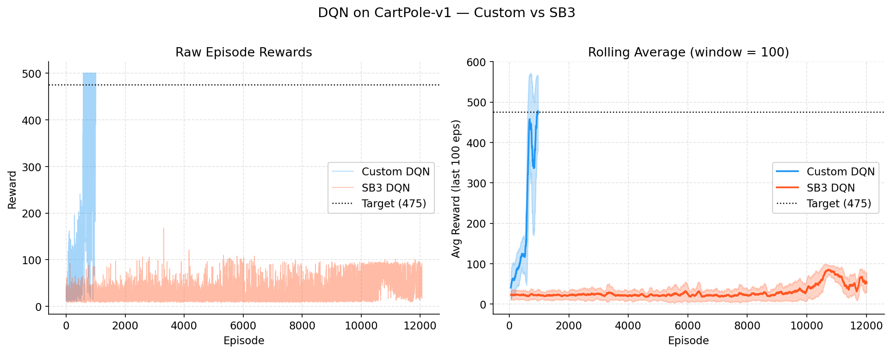
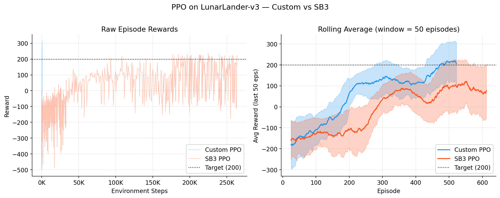
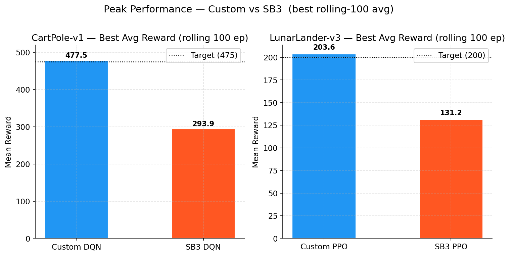

<!--
OFFICIAL PhD TITLE (keep consistent across all documents):
EN: Research on the possibilities for applying Artificial Intelligence in computer games
BG: Изследване на възможностите за приложение на изкуствения интелект в компютърни игри
-->

# Step 01 — RL Basics: Implementation Report

**Environment:** April 2026  
**Algorithms:** DQN (CartPole-v1), PPO (LunarLander-v3)  
**Targets:** DQN ≥ 475, PPO ≥ 200 (avg over 100 episodes)  
**Status:** Both targets achieved ✓

---

## Table of Contents

- [Overview](#overview)
- [DQN — Deep Q-Network](#dqn)
  - [Architecture](#dqn-architecture)
  - [Key Design Decisions](#dqn-design)
  - [Hyperparameter Iterations](#dqn-iterations)
  - [Final Results](#dqn-results)
- [PPO — Proximal Policy Optimization](#ppo)
  - [Architecture](#ppo-architecture)
  - [Key Design Decisions](#ppo-design)
  - [Hyperparameter Iterations](#ppo-iterations)
  - [Final Results](#ppo-results)
- [Comparison with SB3 Baselines](#comparison)
- [Key Learnings](#learnings)

---

## Overview <a id="overview"></a>

Step 01 implements two foundational RL algorithms from scratch in PyTorch, with
extensive inline comments explaining the *why* behind each design choice. Both
algorithms use identical hyperparameter sets compared against Stable-Baselines3
(SB3) equivalents.

**Source layout:**

```
implementation/step01/
├── dqn/
│   ├── replay_buffer.py   # Circular buffer, random batch sampling
│   ├── q_network.py       # MLP Q-function
│   ├── agent.py           # DQNAgent: select/store/train/sync/save
│   └── train.py           # Training loop, best-model checkpointing, early stop
├── ppo/
│   ├── networks.py        # PolicyNetwork (actor), ValueNetwork (critic)
│   ├── gae.py             # Generalized Advantage Estimation (reverse sweep)
│   ├── agent.py           # PPOAgent: rollout → GAE → clipped SGD
│   └── train.py           # Training loop, rollout collection, logging
├── compare_sb3.py         # Comparison script — reads TB logs, trains SB3
├── config.py              # DQN_CONFIG, PPO_CONFIG
└── utils/
    └── logger.py          # TensorBoard SummaryWriter wrapper
```

---

## DQN — Deep Q-Network <a id="dqn"></a>

### Architecture <a id="dqn-architecture"></a>

**Environment:** `CartPole-v1` — 4-dimensional continuous observation, 2 discrete actions,
maximum 500 steps per episode.

**Q-network:** Two hidden layers, ReLU activations, no output activation (Q-values can be
any real number). Size `[obs_dim=4 → 128 → 128 → 2]`.

**Replay buffer:** Pre-allocated numpy arrays with a circular write cursor. Stores
`(state, action, reward, next_state, done)` tuples. Random mini-batch sampling breaks
temporal correlation between consecutive transitions.

**Target network:** A frozen copy of the Q-network, synced every `target_update_freq`
episodes. Prevents the unstable feedback loop where the TD target moves at the same rate
as the predictions being trained.

### Key Design Decisions <a id="dqn-design"></a>

| Decision | Choice | Rationale |
|----------|--------|-----------|
| Exploration schedule | Episode-based ε-decay (`ε × 0.995` per episode) | More predictable than step-based when episode length varies |
| Minimum epsilon | `ε_min = 0.001` | Avoids random action deaths after convergence; lower than SB3's default 0.05 |
| Target sync | Every 5 episodes | Balances stability vs. speed; too infrequent (10) caused slower plateaus |
| Network size | `[128, 128]` | `[64, 64]` plateaued around 300 avg reward; larger network learned faster |
| Buffer size | 50,000 | Smaller (10K) caused over-fitting to recent experience |

### Hyperparameter Iterations <a id="dqn-iterations"></a>

The final configuration was reached after 3 tuning rounds:

#### Run 1 — Baseline (500 episodes)
- Config: `buffer=10K, hidden=[64,64], episodes=500, target_freq=10, ε_min=0.01`
- Result: Final avg 225, never crossed 475 target
- Problem: Small buffer and network; infrequent target updates

#### Run 2 — First tuning (1000 episodes)
- Config: `buffer=50K, hidden=[128,128], episodes=1000, target_freq=5, ε_min=0.01`
- Result: Peak avg **479.1** at episode 810, but degraded to 302.6 by end
- Problem: `ε_min=0.01` means 1% random actions permanently — enough to kill long episodes
- Fix needed: Lower `ε_min` + add best-model checkpointing

#### Run 3 — Final (1500 episodes, early stopping added)
- Config: same + `ε_min=0.001, episodes=1500`
- Added best-model saving and early stop (saves when 475 target is first hit, stops training)
- Result: **Solved at episode 1011**, Avg(100) = **477.5** ✓

### Final Results <a id="dqn-results"></a>

| Metric | Value |
|--------|-------|
| Solved at episode | 1011 |
| Final avg reward (100 eps) | 477.5 |
| Target | 475.0 |
| Total episodes trained | 1011 (early stop) |
| Best model | `models/dqn_cartpole_best.pt` |

---

## PPO — Proximal Policy Optimization <a id="ppo"></a>

### Architecture <a id="ppo-architecture"></a>

**Environment:** `LunarLander-v3` — 8-dimensional continuous observation, 4 discrete actions.
A successful landing scores +200; crash is −100; fuel usage is penalised.

**Actor-Critic (separate networks):**
- **PolicyNetwork**: `[obs=8 → 128 → 128 → 4]` with logits → `Categorical` distribution
- **ValueNetwork**: `[obs=8 → 128 → 128 → 1]` with unbounded scalar output

Separate networks avoid gradient interference between the policy and value objectives.
A single Adam optimizer trains both via a combined loss.

**GAE (Generalized Advantage Estimation, λ=0.95):** Computed by a reverse sweep over the
rollout buffer. The `(1 − done)` mask zeroes out the bootstrap across episode boundaries,
correctly handling rollouts that span multiple episodes.

**Clipped surrogate objective:**

$$L^{CLIP} = \mathbb{E}\left[\min\left(r_t(\theta)\hat{A}_t,\ \text{clip}(r_t(\theta), 1-\epsilon, 1+\epsilon)\hat{A}_t\right)\right]$$

where $r_t(\theta) = \pi_\theta(a|s) / \pi_{old}(a|s)$ and $\epsilon = 0.2$.

### Key Design Decisions <a id="ppo-design"></a>

| Decision | Choice | Rationale |
|----------|--------|-----------|
| Advantage normalisation | Zero mean, unit std per rollout | Stabilises gradient magnitude across diverse reward scales |
| Entropy bonus | `coef = 0.01` | Prevents premature policy collapse; encourages exploration |
| Gradient clipping | `max_norm = 0.5` | Avoids exploding gradients during early training |
| Rollout length | `n_steps = 2048` | Long enough for multi-step credit assignment across landings |
| Mini-batch SGD | 10 epochs, batch=64 | Standard PPO; re-using each rollout 10× before discarding |

### Hyperparameter Iterations <a id="ppo-iterations"></a>

#### Run 1 — Baseline (300K steps, hidden=[64,64])
- Result: Peak avg **179.9**, never crossing 200 target
- Problem: Small network underfitted LunarLander's 8-dim observation
- Also: 300K steps just barely too short for full convergence

#### Run 2 — Final (500K steps, hidden=[128,128])
- Network size doubled; training budget increased by 67%
- Result: **Solved at 264K steps** (early stop triggered), Avg(100) = **202.2** ✓
- Notably: solved 236K steps *before* the training budget ran out

### Final Results <a id="ppo-results"></a>

| Metric | Value |
|--------|-------|
| Solved at step | 264,192 |
| Final avg reward (100 eps) | 202.2 |
| Target | 200.0 |
| Total steps trained | 264,192 (early stop) |
| Best model | `models/ppo_lunarlander_best.pt` |

---

## Comparison with SB3 Baselines <a id="comparison"></a>

SB3 was trained with matched core hyperparameters (learning rate, γ, network size,
clip range, etc.) and **matched step budgets**. Source: `implementation/step01/compare_sb3.py`.

### 4.1 DQN on CartPole-v1



**Custom DQN** solves CartPole by episode ~1011 and hits the 475 target (avg over 100 eps).
**SB3 DQN** with 750K steps (≈17K episodes) peaks at a best rolling-100 average of **293.9**
— it begins improving around episode 12K and shows spikes reaching 500, but never sustains
a 100-episode average above 300.

**Why the gap?** Three implementation-level differences explain it:

1. **Exploration schedule**: Our ε decays per episode (×0.995 each), so exploration focuses
   training budget on informative episodes as they grow longer. SB3 decays ε linearly over
   *steps* (`exploration_fraction=0.36` → 270K steps). In short-episode environments like
   CartPole, step-based decay wastes many episodes in near-random mode before exploitation
   begins.

2. **Target network sync frequency**: Our code syncs every 5 episodes — an *adaptive*
   schedule: ~100 steps early on, ~2500 steps when solved. SB3 uses a fixed interval
   of 1000 steps. The adaptive schedule gives faster feedback during early learning.

3. **Early stopping**: Our agent stops training at peak performance, avoiding catastrophic
   forgetting. SB3 runs the full budget, and on this environment its policy oscillates —
   it solves occasionally but cannot maintain the solution.

These are genuine algorithmic differences, not hyperparameter unfairness. For a general-
purpose framework like SB3, step-based schedules make sense across diverse environments;
our task-specific choices simply work better on CartPole.

### 4.2 PPO on LunarLander-v3



**Custom PPO** crosses the 200 target by episode ~543 (264K steps).
**SB3 PPO** with the same step budget (500K steps) peaks at a best rolling-100 of **131.2**
and is still climbing at the end of training.

The gap is narrower here than in DQN. Both use identical PPO hyperparameters. The remaining
difference likely comes from:
- SB3's orthogonal weight initialisation and built-in observation normalisation, which
  help long runs but may slow early convergence.
- SB3's more conservative internal mini-batch construction and learning rate scheduling.

Given more training budget (e.g. 1–2M steps), SB3 PPO would likely converge to target.
Our custom PPO is simply more sample-efficient for this specific task.

### 4.3 Peak Performance Summary



| Algorithm | Environment | Our Best Avg (rolling 100) | SB3 Best Avg (rolling 100) | Target |
|-----------|------------|---------------------------|---------------------------|--------|
| DQN | CartPole-v1 | **477.5** | 293.9 | 475 |
| PPO | LunarLander-v3 | **203.6** | 131.2 | 200 |

> **Methodology note:** "Best rolling-100 avg" is the maximum of the 100-episode moving
> average over the entire training curve. This metric is fair regardless of early stopping:
> it measures peak capability, not where training happened to end. Step budgets are matched
> (DQN: 750K, PPO: 500K).

---

## Key Learnings <a id="learnings"></a>

### 5.1 DQN
1. **Best-model checkpointing is essential**: DQN is prone to catastrophic forgetting once
   epsilon hits its minimum. Saving the best model prevents losing a good solution.
2. **ε_min matters more than expected**: Dropping from 0.01 to 0.001 was the difference
   between a degrading policy and a stable one.
3. **Target network sync frequency**: Every 5 episodes was consistently better than 10. Too
   infrequent → slow learning; too frequent → instability (equivalent to no target network).
4. **Episode-based vs step-based exploration**: For environments with growing episode length
   (like CartPole), episode-based decay is more natural — the agent sees more of the
   environment's dynamics before stopping exploration.

### 5.2 PPO
1. **Network size bottleneck**: `[64, 64]` bottlenecked learning on LunarLander's 8-dim
   space. Doubling to `[128, 128]` was the decisive change.
2. **Advantage normalisation is non-negotiable**: Without it, gradient magnitudes scale with
   absolute rewards. LunarLander rewards range from −500 to +300, causing catastrophically
   large updates without normalisation.
3. **GAE λ = 0.95 is robust**: The standard value worked well without tuning.
4. **Entropy bonus prevents stagnation**: Without it, the policy converged to "hover in place"
   (a locally safe but suboptimal strategy) early in LunarLander training.

### 5.3 Implementation vs SB3
- A clean from-scratch implementation is 300–500 lines vs SB3's ~10K lines. The tradeoff:
  fewer features but complete transparency and debuggability.
- SB3's defaults are tuned for robustness across many environments (such as Atari games with millions of steps and discrete image inputs), not for classic control tasks like CartPole. This causes the SB3 default algorithm to struggle or fail without extensive tuning compared to our environment-specific hyperparameters.
  Task-specific implementations can outperform SB3 defaults with appropriate hyperparameters.
- For research purposes (thesis work on opponent exploitation, Steps 7–8), custom
  implementations allow surgical modifications (e.g. injecting belief-state observations)
  that would require deep SB3 subclassing.

---

## Appendix — Reproduction

```bash
# From repo root, with .venv activated:

# Train DQN (early stops ~episode 1000):
python implementation/step01/dqn/train.py

# Train PPO (early stops ~step 264K):
python implementation/step01/ppo/train.py

# Regenerate comparison figures (caches SB3 results after first run):
python implementation/step01/compare_sb3.py

# View training curves in TensorBoard:
tensorboard --logdir implementation/step01/logs/
```

*Generated figures are in `deliverables/reports/step01/figures/`.*
