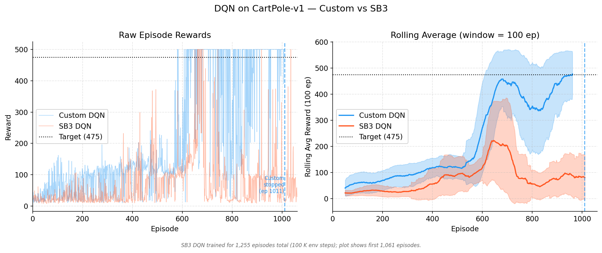
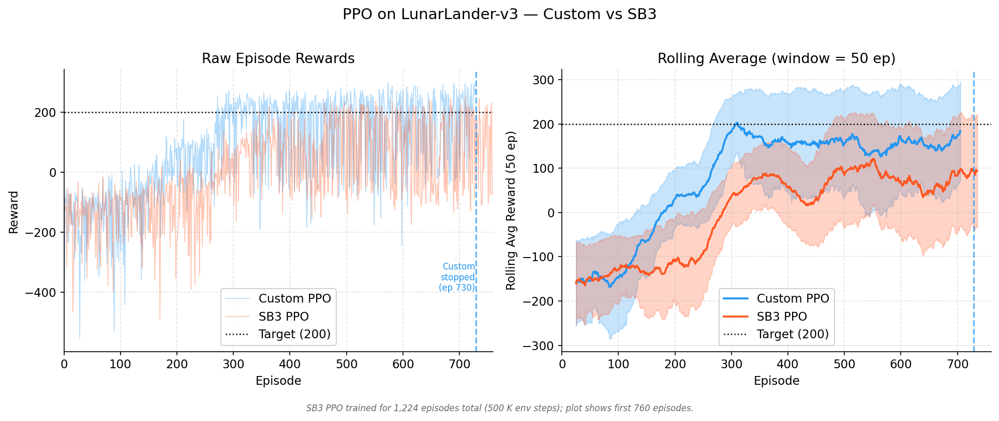

# Стъпка 1 — Основи на обучението с подкрепление (Reinforcement Learning)

Това е съкратено резюме на основните материали по обучение с подкрепление, разгледани в Стъпка 1. То служи за две цели: като бърз справочник по време на преминаването към следващите стъпки и като основен източник за финалния доклад в Стъпка 15.

---

## 1. Как обучението с подкрепление стана дисциплина

Обучението с подкрепление не се появи изведнъж. Корените му се простират в няколко области, които до голяма степен не са знаели една за друга в продължение на десетилетия.

Най-ранната нишка идва от **животинската психология** в началото на 1900-те — „Законът за ефекта“ на Торндайк (1911) предполага, че действията, последвани от удовлетворяващи резултати, стават по-вероятни. Това по същество е идеята за сигнала за възнаграждение. Паралелна нишка минава през **теорията на оптималното управление** (optimal control theory) през 50-те години на миналия век, когато Белман разработва динамичното програмиране за решаване на последователни задачи за вземане на решения. Той въвежда функцията на стойността (value function) и принципа на оптималността, които стоят в основата на съвременния RL. Трета нишка идва от **ученето чрез проби и грешки** в ранните изследвания на изкуствения интелект — програмата за дама на Самюел (1959) се учи, като играе сама срещу себе си, коригирайки своята оценъчна функция въз основа на победи и загуби.

Тези клонове остават разделени до 80-те и 90-те години. Докторската работа на Сътън върху обучението по времеви разлики (temporal-difference learning, 1988) преодолява пропастта между теориите за учене при животните и динамичното програмиране на Белман. След това Уоткинс формализира Q-learning (1989), давайки на областта нейния първи изчистен алгоритъм за управление без модел с гаранции за сходимост. До момента, в който Сътън и Барто публикуват своя учебник през 1998 г. (актуализиран през 2018 г.), обучението с подкрепление (RL) се консолидира в разпознаваема дисциплина със собствена нотация, таксономия на задачите и набор от алгоритми.

Революцията в дълбокото обучение засегна RL през 2013-2015 г., когато алгоритъмът DQN на DeepMind се научи да играе игри на Atari от сурови пиксели. Тази демонстрация показа ясно, че RL алгоритмите, съчетани с невронни апроксиматори на функции, могат да се справят с многомерни реални проблеми. PPO последва през 2017 г. като практичен метод за градиент на политиката (policy gradient) и оттогава RL се разшири в роботиката, игровия ИИ, системите за препоръки и настройването на езикови модели (RLHF).

Важният извод е, че RL не е просто „машинно обучение с награди“. Това е отделна рамка за последователно вземане на решения в условия на несигурност, със собствени теоретични основи, извлечени от теорията на управлението, психологията и статистиката.

> **Прочетете повече:** Sutton, R.S. & Barto, A.G. (2018). *Reinforcement Learning: An Introduction*, 2nd edition — Chapter 1.  

---

## 2. Основни принципи — Агент, Действие, Среда

Цялата рамка на RL се основава на един прост цикъл. Един **агент** наблюдава текущото състояние на дадена **среда**, избира **действие** и получава сигнал за **награда** плюс ново състояние. След това повтаря. Целта на агента е да научи **стратегия** (policy) — съпоставяне от състояния към действия — която максимизира кумулативната награда във времето.

Няколко термина, които трябва да са ясни:

- **Състояние** ($s$): описание на средата в даден момент. При CartPole това е позицията и скоростта на количката, и ъгълът и ъгловата скорост на стълба. В покер би включвало раздадените карти и историята на залозите.
- **Действие** ($a$): това, което агентът може да направи. 
- **Награда** ($r$): скаларен сигнал за обратна връзка. 
- **Стратегия (Policy)** ($\pi$): поведението на агента. 
- **Функция на стойността** ($V^\pi(s)$): очакваната кумулативна награда.
- **Фактор на дисконтиране** ($\gamma$): число между 0 и 1, определящо тежестта на бъдещите награди спрямо текущите.

Изключително важно тук е **компромисът между изследване и експлоатация** (exploration-exploitation tradeoff). 

Две широки семейства от алгоритми съществуват: базирани на стойността (value-based, като DQN) и базирани на политиката (policy-based, като PPO). 

---

## 3. Математическа формулировка (MDP)

**Марковският процес на вземане на решения** (Markov Decision Process, MDP) е формалната математическа рамка, върху която са изградени повечето RL алгоритми. Състои се от: $S$, $A$, $P(s'|s,a)$, $R(s,a,s')$ и $\gamma$.
Уравнението на Белман (Bellman equation) лежи в основата на намирането на $V^\pi(s)$.

---

## 4. Информационни множества — Когато не виждате всичко

Стандартните MDP предполагат напълно наблюдаемо състояние. Реалните проблеми често нарушават това (покер, стратегии в реално време) - което води до **несъвършена информация** (imperfect information).
Тук използваме **информационно множество** (information set), обединяващо всички състояния на играта, които играчът не може да различи едно от друго въз основа на това, което е наблюдавал. 
Например алгоритъмът за свеждане до минимум на контрафактуалното съжаление (Counterfactual Regret Minimization, CFR) оперира над информационни множества.

---

## 5. Динамично програмиране и Времеви разлики

Динамичното програмиране (DP) работи, когато познавате модела. 
Обучението по времеви разлики (Temporal-Difference, TD learning) обаче работи без модел и учи стъпка по стъпка, изчислявайки TD грешката между предвиждане и получена награда + бъдеща стойност чрез bootstrap. 
Q-learning е метод извън политиката (off-policy) за управление.

---

## 6. DQN — Deep Q-Networks
DQN замени Q-таблицата с невронна мрежа. Поддържа се от две иновации:
1. **Буфер за преиграване** (Experience replay). 
2. **Целева мрежа** (Target network).
DQN работи най-добре за дискретни пространства от действия. 

---

## 7. PPO — Proximal Policy Optimization
PPO учи направо стратегията. PPO задържа стъпката на обновяване малка чрез съотношение на вероятностите, ограничавайки го в интервал (клипинг, clipping). PPO има естествена способност да се справя с непрекъснати и дискретни действия и е алгоритъм вътре в политиката (on-policy).

---

## 8. Практическо валидиране — Собствени имплементации срещу Stable-Baselines3

За да проверим, че имплементациите ни от нулата работят, ги сравнихме срещу Stable-Baselines3 (SB3). 

### DQN на CartPole-v1

Собственият ни DQN "научи" CartPole до епизод ~1011 (достигна средно над 475). DQN от SB3 при предвидения бюджет не успя да конвергира и остана на ниво 30.
По подразбиране SB3 са настроени за игри на Atari с милиони стъпки и дискретни визуални входове, а не за задачи от класическо управление (classic control) като CartPole, където са необходими бързи ранни настройки. Това е причината стандартният SB3 алгоритъм да изпитва трудности тук без значителна настройка. Нашите реализации ползват график, адаптиран спрямо специфичните дължини на епизодите и по-честа синхронизация на целевата мрежа, заедно с ранно спиране.

### PPO на LunarLander-v3

Нашето решение пресече поставената граница от 200 точки при епизод ~543 (264 хиляди стъпки). При същите стъпки SB3 PPO постигна 131.2 и все още покачваше представянето си. За по-дълга тренировка SB3 със сигурност ще конвергира, но нашата имплементация ползва по-добра ефективност по отношение на данните за тази конкретна задача.
