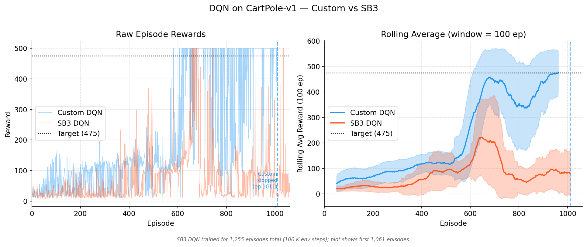
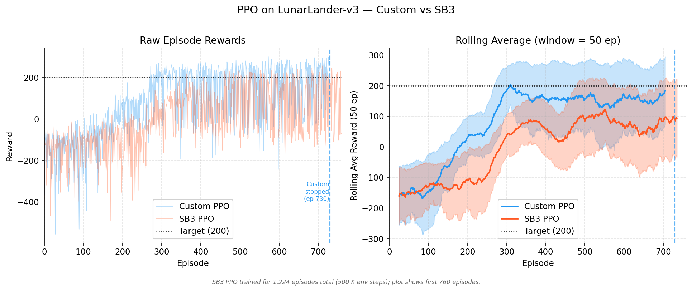

# Стъпка 1 — Основи на обучението с подкрепление

Това е съкратен преглед на фундаменталните материали по обучение с подкрепление, разгледани в Стъпка 1. Той е предназначен за две цели: като бързо опресняване при преминаването през следващите стъпки и като основен източник за синтеза на публичния доклад от Стъпка 15.

---

## Как обучението с подкрепление се утвърди като самостоятелна дисциплина

Обучението с подкрепление не възникна изведнъж в завършен вид. Неговите корени се простират в множество области, които дълги десетилетия до голяма степен са съществували изолирано една от друга.

Най-ранната нишка идва от **животинската психология** в началото на XX век — „законът за ефекта“ на Торндайк (1911) предлага, че действията, последвани от удовлетворяващи резултати, стават по-вероятни. Това, по същество, е идеята за **сигнала за награда**. Успоредна нишка преминава през **теорията на оптималното управление** през 50-те години на миналия век, където Белман разработва **динамично програмиране**, за да решава последователни проблеми с вземането на решения. Той въвежда **функцията на стойността** и **принципа на оптималност**, които и двете са в ядрото на съвременното обучение с подкрепление. Трета нишка идва от **обучението чрез проба и грешка** в ранните изследвания в областта на изкуствения интелект — програмата за дама на Самюел (1959) се е учела, като играе срещу себе си, коригирайки своята **оценъчна функция** въз основа на победи и загуби.

Тези нишки останаха отделни до 80-те и 90-те години на XX век. Докторската работа на Сътън върху обучението с темпорална разлика (1988) запълни празнината между теориите за животинското учене и динамичното програмиране на Белман. След това Уоткинс формализира q-обучението (1989), предоставяйки на областта първия чист, безмоделен алгоритъм за управление със сходимостни гаранции. Към момента на публикуването на учебника на Сътън и Барто през 1998 г. (актуализиран през 2018 г.) обучението с подкрепление вече се беше консолидирало като разпознаваема дисциплина със собствена нотация, таксономия на проблемите и инструментариум от алгоритми.

Революцията в дълбокото обучение достигна до обучението с подкрепление през 2013–2015 г., когато DQN на DeepMind се научи да играе Atari Games от сурови пиксели. Тази демонстрация показа ясно, че алгоритмите за обучение с подкрепление, комбинирани с невронни апроксиматори на функции, могат да се справят с високоизмерни проблеми от реалния свят. PPO последва през 2017 г. като практичен метод на градиента на стратегията и оттогава обучението с подкрепление се разшири в роботиката, игровия изкуствен интелект, системите за препоръки и подравняването на езиковите модели (RLHF).

Важното е да се подчертае, че обучението с подкрепление не е просто „машинно обучение с награди“. То представлява самостоятелна рамка за последователно вземане на решения при несигурност, със собствени теоретични основи, произтичащи от теорията на управлението, психологията и статистиката.

> **Прочетете повече:** Sutton, R.S. & Barto, A.G. (2018). *Обучение с подкрепление: Въведение*, второ издание — Глава 1.  
> Безплатно: <http://incompleteideas.net/book/the-book-2nd.html>

---

## Основни принципи — Агент, Действие, Среда

Цялата рамка на обучението с подкрепление се основава на прост цикъл. Един **агент** наблюдава текущото **състояние** на една **среда**, избира едно **действие** и получава сигнал за **награда** заедно с ново **състояние**. След това процесът се повтаря. Целта на агента е да научи една **стратегия** — съпоставяне от състояния към действия — която максимизира **натрупаната награда** във времето.

Няколко основни термина, които трябва да се разграничат:

- **Състояние** ($s$): описание на **средата** в даден момент. В cartPole това включва позицията на количката, скоростта ѝ, ъгъла на пръта и неговата ъглова скорост. В покер биха били раздадените карти и **историята на залозите**.
- **Действие** ($a$): това, което агентът може да извърши. Може да бъде дискретно (например бутане наляво или надясно) или **непрекъснато** (прилагане на конкретен въртящ момент).
- **Награда** ($r$): скаларен сигнал за обратна връзка, който агентът получава след всяко действие. Наградите могат да бъдат редки (само в края на играта) или гъсти (на всеки времеви отрязък).
- **Стратегия** ($\pi$): стратегията на агента. Тя може да бъде **детерминистична** ($\pi(s) = a$) или **стохастична**, като $\pi(a|s)$ предоставя **разпределение на вероятностите** върху възможните действия.
- **Функция на стойността** ($V^\pi(s)$): очакваната **натрупана награда** от състояние $s$ нататък, ако агентът следва стратегия $\pi$. Тя показва колко добро е едно състояние в дългосрочен план, а не само непосредствено.
- **Коефициент на дисконтиране** ($\gamma$): число между 0 и 1, което определя доколко агентът отдава значение на бъдещите награди спрямо непосредствените. Стойност $\gamma = 0.99$ показва търпелив агент, докато $\gamma = 0.5$ означава късогледство.

Критичното предизвикателство при проектирането в обучението с подкрепление е компромисът **изследване–експлоатация**. Агентът трябва да изследва непознати действия, за да открие потенциално по-добри стратегии, но също така и да експлоатира текущите си знания, за да събира награда. Прекалено многото изследване губи време, а прекомерната експлоатация води до заседналост в локален оптимум.

Съществуват два основни класа алгоритми. **Методите, основани на стойност** (като DQN) научават стойността на състояния или двойки състояние–действие и от тези стойности извеждат стратегия. **Методите, основани на политика** (като PPO) научават политиката директно. И двата подхода имат своите предимства; значителна част от областта на обучението с подкрепление е посветена на тяхното ефективно комбиниране.

> **Прочетете повече:** OpenAI Spinning Up — „Ключови концепции в обучението с подкрепление“  
> <https://spinningup.openai.com/en/latest/spinningup/rl_intro.html>

---

## Формулировка на MDP

Марковският процес на вземане на решения (MDP) представлява формалната математическа рамка, върху която се основават повечето алгоритми за обучение с подкрепление. Той включва пет основни компонента:

- $S$: множество от състояния
- $A$: множество от действия
- $P(s'|s,a)$: функцията на преход — вероятността за преминаване в състояние $s'$ при дадено състояние $s$ и извършено действие $a$
- $R(s,a,s')$: функцията на награда
- $\gamma \in [0,1)$: коефициентът на отстъпка

Частта „Марков“ означава, че бъдещето зависи единствено от текущото състояние, а не от историята на начина, по който е достигнато то. Това е силно предположение — и такова, което не е валидно в много интересни случаи (като **покер**, където историята на залозите има значение). Разглеждаме това в раздел 4.

Целта е да се намери стратегия $\pi^*$, която максимизира очакваната дисконтирана възвръщаемост.

$$\pi^* = \arg\max_\pi \mathbb{E}\left[\sum_{t=0}^{\infty} \gamma^t r_t\right]$$

Ключовата рекурсивна връзка е **уравнението на Белман**:

$$V^\pi(s) = \sum_a \pi(a|s) \sum_{s'} P(s'|s,a)\left[R(s,a,s') + \gamma V^\pi(s')\right]$$

Това означава, че стойността на едно състояние е равна на очакваната непосредствена награда плюс дисконтираната стойност на следващото състояние. Цялото динамично програмиране, TD learning и дълбоко обучение с подсилване се основават на вариации на това уравнение.

> **Прочетете повече:** Сътон и Барто (2018). *Обучение с подкрепление: Въведение*, Глава 3 — Крайни марковски процеси на вземане на решения.  
> Безплатно: <http://incompleteideas.net/book/the-book-2nd.html>

---

## Множества от информация — когато не можете да видите всичко

Стандартните MDP предполагат, че агентът може напълно да наблюдава състоянието. В действителност обаче реалните проблеми често нарушават това условие. Например в покера не виждате картите на опонента, а в стратегиите в реално време е налице мъгла на войната. Това са **частично наблюдаеми** среди.

Формалното разширение е **Partially Observable MDP** (POMDP), което включва функция за наблюдение — агентът получава наблюдения, представляващи шумни или непълни изгледи на действителното състояние. Но POMDP са печално известни с това, че оптималното им решаване е изключително трудно.

В теорията на игрите тази идея се изразява чрез **информационни множества**. Информационно множество обединява всички състояния на играта, които играчът не може да различи едно от друго въз основа на получената информация. В кун покер (3 карти, 2 играчи), когато държите Поп и все още не е имало залагания, вие се намирате в информационно множество — знаете своята карта, но не и тази на опонента си, поради което не можете да различите дали действителното състояние е „Аз имам Поп, опонентът има Дама“ или „Аз имам Поп, опонентът има Купа“.

Алгоритмите, които работят в тези среди — като CFR (минимизиране на контрафактичното съжаление, разгледано в Стъпка 2) — оперират върху информационни множества, а не върху отделни състояния. Това представлява фундаментално различен изчислителен проблем в сравнение със стандартното RL и именно поради тази причина изкуственият интелект за игри изисква собствен набор от инструменти, които надхвърлят възможностите на DQN или PPO по подразбиране.

Разбирането на информационните множества вече е от значение, тъй като следващите стъпки (5–8) са посветени изцяло на игри с **непълна информация**. Алгоритмите се променят, но **ядрото** на концепцията остава същото: вземате решения въз основа на това, което можете да наблюдавате, като разсъждавате върху онова, което не можете.

> **Прочетете повече:** Shoham, Y. & Leyton-Brown, K. (2008). *Многоагентни системи: Алгоритмични, игровотеоретични и логически основи*, Глава 5.  
> Безплатно: <http://www.masfoundations.org/download.html>

---

## Динамично програмиране — Когато имате модела

Динамичното програмиране (DP) е най-старият метод за решаване на MDP. То се прилага, когато разполагате с пълна информация за средата – вероятностите за преход $P(s'|s,a)$ и функцията за награда $R(s,a,s')$. На практика това означава, че познавате отлично правилата на играта.

Двата основни алгоритъма в динамичното програмиране са:

**Политно-итеративно изчисление** редува две стъпки. Първо, *оценка на политика*: при дадена фиксирана стратегия се изчислява стойността на всяко състояние чрез многократно прилагане на уравнението на Белман до постигане на сходимост. Второ, *подобрение на политиката*: стратегията се актуализира така, че да бъде алчна спрямо новоизчислените стойности. Процесът се повтаря, докато стратегията спре да се променя. Гарантирано е, че ще сходява към оптималната стратегия.

**Итеративно изчисляване на стойността** е пряк път. Вместо да се оценява напълно една **стратегия** преди нейното подобряване, то комбинира оценяването и подобрението в една единствена актуализация. На всяка стъпка, за всяко **състояние**, избирайте **действието**, което максимизира очакваната едностъпкова възвръщаемост плюс **дисконтираната стойност** на следващото **състояние**. То сходява към **оптималната функция на стойността**, от която се извлича **оптималната стратегия**.

Динамичното програмиране е полезно, защото осигурява точни решения и чисти гаранции за сходимост. Неговият недостатък обаче е очевиден: изисква се пълният модел, а сложността на изчисленията нараства с броя на състоянията. При кун покер с 12 състояния динамичното програмиране е тривиално, но при Го със $10^{170}$ състояния то е невъзможно.

Причината динамичното програмиране да има значение, въпреки че рядко го използваме директно, е, че всеки следващ метод — метод Монте Карло, tD learning, DQN, PPO — може да се разглежда като приближение на решението от динамичното програмиране, когато моделът е неизвестен или пространството на състоянията е твърде голямо. Динамичното програмиране представлява теоретичният таван, към който практическите алгоритми се стремят да се доближат.

> **Прочетете повече:** Сътон и Барто (2018). *Обучение с подкрепление: Въведение*, Глава 4 — Динамично програмиране.  
> Безплатно: <http://incompleteideas.net/book/the-book-2nd.html>

---

## Обучение с темпорална разлика — Обучение без модел

Обучението с темпорална разлика (TD) е пробивът, който направи RL приложим на практика. За разлика от динамичното програмиране, то не изисква модел на средата. За разлика от методите на Монте Карло, то не е необходимо да чака края на един епизод, за да се учи. То актуализира стойностните оценки след всяка стъпка, използвайки буутстрапинг: текущата оценка на стойността на следващото състояние замества истинската бъдеща възвръщаемост.

Основната актуализация на **TD(0)** за **функцията на стойността** е:

$$V(s_t) \leftarrow V(s_t) + \alpha \left[r_t + \gamma V(s_{t+1}) - V(s_t)\right]$$

Терминът в скобите е **tD грешка** — разликата между настъпилото (награда + оценена бъдеща стойност) и предвиденото. Ако tD грешката е положителна, състоянието се е оказало по-добро от очакваното; ако отрицателна – по-лошо.

Контролният вариант на тази идея е **Q-learning** (Watkins, 1989):

$$Q(s_t, a_t) \leftarrow Q(s_t, a_t) + \alpha \left[r_t + \gamma \max_{a'} Q(s_{t+1}, a') - Q(s_t, a_t)\right]$$

q-обучението усвоява стойността на двойките състояние-действие и използва оператора max, за да бъде **извънполитиково** — то се учи за оптималната стратегия, дори когато следва изследователска такава. Именно това го прави толкова практично.

tD learning е предимство спрямо DP, тъй като не изисква модел. То е предимство и спрямо метода Монте Карло, защото се осъществява онлайн (на всяка стъпка, а не на всеки **епизод**) и има по-ниска **дисперсия**. **Самоподкрепянето** въвежда известно **пристрастие**, но в практиката тази размяна е изключително благоприятна. tD методите са основата, върху която се градят DQN и повечето съвременни алгоритми, базирани на **стойност**.

**SARSA** е аналогът на q-обучението от типа **политика на работа** — то актуализира стойността си, използвайки действието, което агентът реално предприема след това, вместо най-доброто възможно действие. Това го прави по-консервативно и понякога по-безопасно на практика, но не позволява да се научи оптимална стратегия, докато се следва под-оптимална изследователска политика.

> **Прочетете повече:** Сътон и Барто (2018). *Обучение с подкрепление: Въведение*, Глава 6 — Обучение с темпорална разлика.  
> Безплатно: <http://incompleteideas.net/book/the-book-2nd.html>

---

## DQN — Дълбоки Q-мрежи

DQN (Mnih и др., 2015) е алгоритъмът, който доказа, че дълбоките невронни мрежи могат да служат като апроксиматори на функции в обучението с подкрепление при голям мащаб. Преди DQN q-обучението се ограничаваше до таблична среда или ръчно създадени характеристики. DQN демонстрира, че може да се научи да играе 49 Atari Games директно от суров пикселен вход, като постигна резултати, надминаващи човешкото представяне в много от тях.

**Как работи.** DQN заменя q-таблицата с невронна мрежа, която приема състояние като вход и извежда q-стойности за всички действия. Мрежата се обучава чрез минимизиране на квадратичната TD грешка – разликата между предсказаната q-стойност и целта (награда плюс дисконтирана максимална q-стойност на следващото състояние). На всяка стъпка агентът избира действието с най-висока q-стойност (експлоатация) или произволно действие с вероятност $\epsilon$ (изследване).

Два ключови трика осигуряват неговата стабилност:

1. **Повторение на натрупан опит.** Вместо да се обучава върху последователни преходи (които са силно корелирани), преходите се съхраняват в голям буфер и се извличат на случаен принцип в мини-партиди. Това прекъсва **корелацията**, намалява **дисперсията** и позволява всеки опит да бъде използван многократно. Принципът е аналогичен на разбъркването на данните при **обучение с учител**.

2. **Целева мрежа.** Поддържа се отделно копие на q-мрежата, което се обновява само периодично (на всеки няколко хиляди стъпки или епизода). tD target се изчислява с помощта на това замразено копие. Без него целта се измества при всяка обучителна стъпка — преследвате подвижна цел, което води до колебание и разминаване. Целевата мрежа разделя процеса на обновяване и стабилизира обучението.

**Защо DQN е важна в сравнение с това, което я предшества:** табличното Q-обучение не може да се справи с високоизмерни състояния (изображения, непрекъснати наблюдения); апроксимацията на функция само с Q-обучение беше известна като нестабилна („смъртоносната троица“ от извънполитикова + приближение на функция + самоподкрепяне). Двата трика на DQN — повторение на натрупан опит и целеви мрежи — се справиха с нестабилността, правейки дълбокото обучение, базирано на стойности, практично за първи път.

**Ограничения.** DQN работи само с дискретни пространства на действията. Тя може да надценява q-стойностите (решено от Double DQN). Тя е извънполитикова, което я прави ефективна по отношение на пробите, но може да доведе до остаряла информация в буфера за възпроизвеждане. И фундаментално, тя научава алчна детерминистична стратегия — няма естествен начин да се изразят стохастични стратегии, което е от значение в игри, където смесените стратегии са оптимални.

В нашата реализация от Стъпка 1, DQN реши CartPole-v1 (постигайки средна стойност за епизод от 477,5 спрямо цел от 475) след около 1000 обучителни епизода. Най-влиятелните хиперпараметри бяха размер на мрежата, минималната стойност на епсилон и честотата на синхронизация на целевата мрежа.

**Бележка относно невронните мрежи в тази стъпка.** q-мрежата в DQN е стандартен многослоен перцептрон (MLP), използван тук като практичен инструмент — функция, която съпоставя състояния към q-стойности. За Стъпка 1 вътрешните елементи на невронната мрежа (инициализация на теглата, поток на градиента, активационни функции) бяха разглеждани като „черна кутия“: използвахме настройките по подразбиране на pyTorch и се съсредоточихме върху самия RL алгоритъм. По-задълбочено изследване на архитектурите на невронните мрежи и взаимодействието им с методите за намиране на равновесие ще бъде представено в Стъпка 5 (Невронно приближение на равновесието).

> **Прочетете повече:** Mnih, V. и др. (2015). „Контрол на човешко ниво чрез дълбоко подсилващо обучение.“ *Nature*, 518(7540), 529–533.  
> arXiv: <https://arxiv.org/abs/1509.06461>

---

## PPO — Оптимизация на проксималната политика

PPO (Schulman и др., 2017) прилага фундаментално различен подход към RL в сравнение с DQN. Вместо да изчислява стойността на действията и да извежда **политика** въз основа на тези стойности, PPO **научава политиката директно** — невронна мрежа генерира разпределение на вероятностите върху възможните действия, а мрежата се обучава да увеличава вероятността за действия, които водят до високи награди.

**Проблемът, който PPO решава.** Методите на **градиента на стратегията** са мощни в теорията, но печално известни с нестабилността си на практика. Основният алгоритъм **REINFORCE** страда от **висока дисперсия** и може да предприема разрушително големи стъпки, които развалят добра **стратегия**. Trust Region Policy Optimization (**TRPO**, Schulman и др., 2015) се справи с това, като ограничи колко може да се промени **стратегията** при всяка актуализация, но **TRPO** изисква скъпа **оптимизация от втори ред** (изчисляване на **хесиана**).

**Как работи PPO.** PPO запазва идеята за стабилност от TRPO, но заменя ограничението с много по-прост механизъм: **отсичане**. Ключовото количество е отношението на вероятностите $r_t(\theta) = \pi_\theta(a_t|s_t) / \pi_{\theta_{old}}(a_t|s_t)$ — колко повече (или по-малко) вероятно е новата **стратегия** да предприеме същото **действие**, което старата **стратегия** е предприела. PPO отсича това отношение в диапазона $[1-\epsilon, 1+\epsilon]$ (обикновено $\epsilon = 0.2$), което означава:

- Ако едно **действие** се окаже добро (положително **предимство**) и отношението надхвърли $1+\epsilon$, **градиентът** се анулира — на **стратегията** не е позволено да стане прекалено „жадна“ за това **действие**.
- Ако едно **действие** се окаже лошо (отрицателно **предимство**) и отношението падне под $1-\epsilon$, **градиентът** също се анулира — предотвратявайки на **стратегията** да прекали с корекциите.

Това е **изрязаната сурогатна цел**, която осигурява функционирането на PPO. Тя постига стабилност, сравнима с тази на TRPO, като използва единствено градиенти от първи ред (без хесиан), което значително намалява изчислителната мощност и улеснява имплементирането ѝ.

**Архитектура.** PPO е актьор-критик: **мрежа на политиката** (актьор) извежда вероятности за действия, а **мрежа за стойности** (оценител) оценява стойностите на състоянията. Мрежата за стойности позволява прилагането на обобщено изчисляване на предимството (GAE), което осигурява оценки на предимството с ниска дисперсия за градиента на стратегията. И двете мрежи се обучават едновременно.

**Защо PPO е важен в сравнение с DQN:** PPO естествено работи както с дискретни, така и с непрекъснати пространства на **действията**. Той може да усвоява **стохастични стратегии**, което е от решаващо значение в игрови среди, където **смесените стратегии** са необходими. Като метод **политика на работа** (използващ пресни данни от текущата **стратегия**), той избягва проблемите със застарели данни. А благодарение на изрязаната сурогатна цел е забележително устойчив — днес PPO е предпочитаният избор за повечето RL приложения, включително и за RLHF при езикови модели.

**Ограничения.** Като **политика на работа**, PPO е по-малко **ефективен по отношение на пробите** в сравнение с **извънполитикови** методи като DQN (всеки опит се използва само за няколко епохи на обновяване, преди да бъде отхвърлен). Той изисква внимателно настройване на изчисляването на **предимството** (**GAE Lambda**), **бонуса за ентропия** и архитектурата на **мрежата**. Освен това все още може да среща трудности при оскъдни награди — ако **агентът** рядко постига успех, има малко сигнал, от който да се учи.

В нашата реализация от Стъпка 1 PPO реши lunarLander-v3 (средна стойност за епизод 202,2 при цел 200) на около 264K стъпки на средата. Решаващите фактори бяха капацитетът на мрежата (удвоен от [64,64] на [128,128]) и нормализацията на предимството.

**Бележка относно невронните мрежи в тази стъпка.** Подобно на DQN, мрежите за **стратегия** и **стойност** тук са стандартни многослойни перцептрони (MLP), чиято вътрешна структура не беше във фокуса на тази стъпка. Приехме прагматичен подход „ако работи“ към невронните компоненти и се концентрирахме върху разбирането на логиката на алгоритъма PPO (**отсичане**, **GAE**, структура на **разгръщане**). По-задълбоченото изследване на взаимодействието между дизайна на **невронната мрежа** и **сходимостта** на RL — особено в контекста на агенти за играене на игри — е отложено за Стъпка 5.

> **Прочетете повече:** Schulman, J. и др. (2017). „Алгоритми за оптимизация на проксималната стратегия.“  
> arXiv: <https://arxiv.org/abs/1707.06347>

---

## Практическо валидиране — собствени реализации спрямо stable-Baselines3

За да проверим дали нашите собствени реализации функционират коректно, ние ги сравнихме със Stable-Baselines3 (SB3) — широко използвана и добре тествана RL библиотека. На нашите реализации и на SB3 бяха зададени еднакви хиперпараметри и еквивалентни бюджети за обучение.

### DQN върху cartPole-v1

Нашият собствен DQN решава cartPole около епизод ~1011, като достига 100-епизодна плъзгаща средна от 477,5 (над целта от 475). DQN на SB3, даден с 750K стъпки на средата (17 176 епизода), не успява да се сближи — неговата плъзгаща средна остава около 30 и никога не достига целта.

Разликата се дължи на три различни **избора** в имплементацията:

- **График на изследване.** Нашият епсилон намалява с всеки епизод (×0,995), като по този начин концентрира изследването там, където е най-необходимо. При SB3 епсилонът намалява линейно спрямо броя стъпки, което в среди с кратки епизоди като cartPole води до загуба на много епизоди в почти случайна мода.
- **Синхронизация на целевата мрежа.** Нашият код синхронизира целевата мрежа на всеки 5 епизода — адаптивен график, който осигурява по-бърза обратна връзка в ранните етапи на обучението. SB3 използва фиксиран интервал от 1000 стъпки.
- **Ранно спиране.** Нашият агент запазва най-добрия модел и прекратява обучението при достигане на пикова производителност, като по този начин избягва катастрофално забравяне. SB3 изпълнява целия определен бюджет от стъпки, в резултат на което стратегията започва да се колебае.

Това представлява реални алгоритмични решения, а не несправедливост при **хиперпараметрите**. Настройките по подразбиране на SB3 са проектирани за надеждна производителност в разнообразни домейни с дълго обучение, като **Atari Games** — а не в класически среди за управление с кратки **епизоди** като **cartPole**; нашите специфични за задачата избори просто работят по-добре при **cartPole**.

### PPO върху lunarLander-v3

Нашият персонализиран PPO достига целта от 200 около 543‑ия епизод (264K стъпки). PPO на SB3 със същия бюджет от 500K стъпки постига най-добра плъзгаща се средна стойност за 100 епизода от 131.2 — все още нараства, но не е сходим.

Разликата тук е по-малка в сравнение с DQN. И двата използват идентични хиперпараметри на PPO. Останалата разлика вероятно се дължи на ортогоналната инициализация на теглата и вградената нормализация на наблюдението в SB3, които подпомагат по-дългите изпълнения, но могат да забавят ранната сходимост. При предоставяне на по-голям обучителен бюджет (1–2M стъпки), PPO на SB3 вероятно ще достигне целта.

### Извод

Чиста имплементация от нулата е с обем 300–500 реда, докато тази на SB3 е около 10 000. Компромисът е по-малко функционалности срещу пълна прозрачност и възможност за лесно отстраняване на грешки. За изследователски цели — по‑специално работата по експлоатация на противника, планирана за стъпки 7–8 — персонализираните имплементации позволяват целенасочени модификации (например инжектиране на наблюдения от състояние на убеждение), които иначе биха изисквали дълбоко подкласиране в SB3. Именно тази практическа гъвкавост е причината да разработим наша собствена имплементация.
