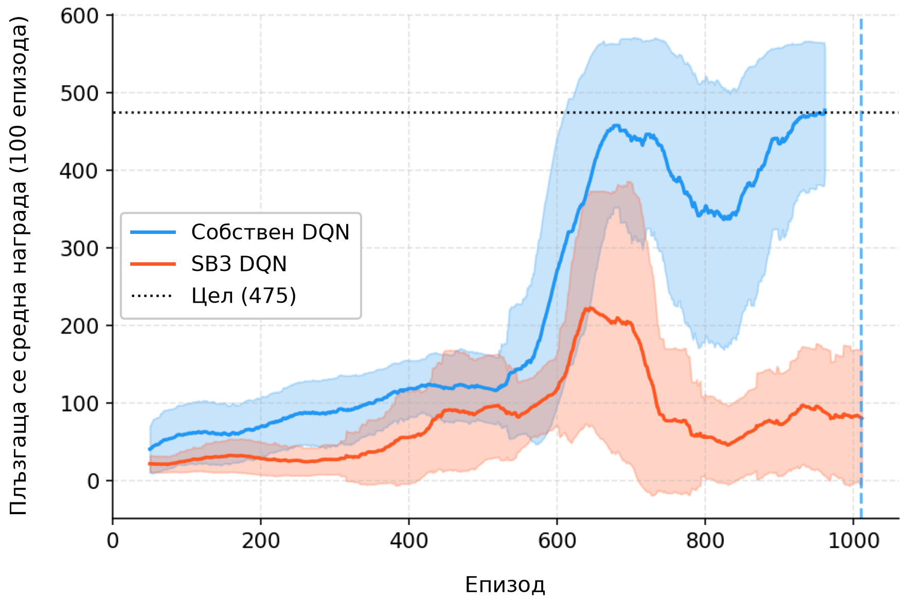
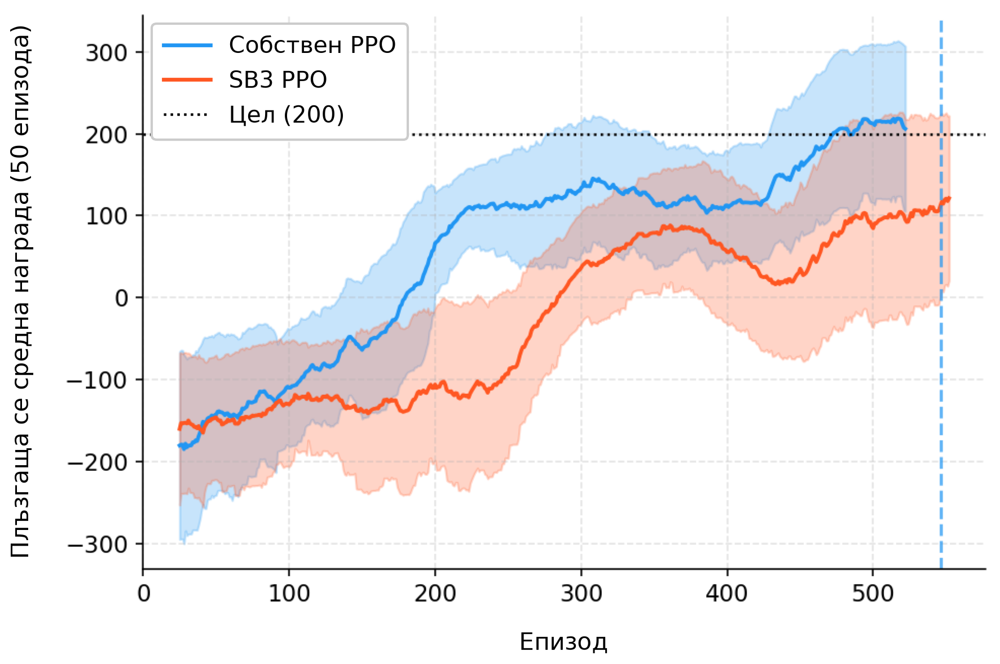

# Глава 1 – Основи на обучението с подкрепление

---

## Как обучението с подкрепление се утвърди като самостоятелна дисциплина

Обучението с подкрепление израства от три нишки, които дълги десетилетия почти не са били свързани помежду си: обучението чрез проба и грешка от животинската психология,[^thorndike1911] динамичното програмиране и функцията на стойността от теорията на оптималното управление[^bellman1957] и методите на темпоралната разлика.[^samuel1959][^sutton1988] Q-обучението на Watkins (1989)[^watkins1989] окончателно ги обединява и към учебника на Sutton и Barto (1998 г., актуализиран през 2018 г.)[^suttonbarto2018] обучението с подкрепление вече е самостоятелна рамка за последователно вземане на решения при несигурност, а не просто „машинно обучение с награди“. DQN въвежда дълбоките мрежи в областта през 2013–2015 г.,[^dqn] а PPO се появява през 2017 г.[^ppo]

---

## Основни принципи – агент, действие, среда

Цялата рамка на обучението с подкрепление се основава на прост цикъл. **Агентът** наблюдава текущото **състояние** на **средата**, избира **действие** и получава сигнал за **награда** заедно с ново **състояние**. След това процесът се повтаря. Целта на агента е да научи **стратегия** – съпоставяне между състояния и действия – която максимизира натрупаната награда във времето.

- **Състояние** ($s$): описание на средата в даден момент – в CartPole позицията и скоростта на количката и ъгълът и ъгловата скорост на пръта; в покера – раздадените карти и историята на залозите.
- **Награда** ($r$): скаларна величина за обратна връзка – редки награди (само в края на играта) или чести (на всеки времеви интервал).
- **Стратегия** ($\pi$): детерминистична ($\pi(s) = a$) или стохастична, като $\pi(a|s)$ дава разпределение на вероятностите върху възможните действия.
- **Функция на стойността** ($V^\pi(s)$): очакваната натрупана награда от състояние $s$ нататък, ако агентът следва стратегия $\pi$ – колко добро е едно състояние в дългосрочен план, а не само непосредствено.
- **Коефициент на дисконтиране** ($\gamma$): стойност $\gamma = 0{,}99$ означава, че агентът е търпелив; $\gamma = 0{,}5$ – че е късоглед.

Критичното предизвикателство при проектирането на системи за обучение с подкрепление е **компромисът изследване–експлоатация**: агентът трябва да изследва непознати действия, за да открие потенциално по-добри стратегии, но същевременно и да експлоатира наличните си знания, за да събира награда. Прекомерното изследване води до загуба на време, а прекалената експлоатация може да доведе до заседналост в локален оптимум.

**Методите, базирани на стойност** (като DQN[^dqn]) научават стойността на състоянията или двойките състояние-действие и извеждат стратегия въз основа на тези стойности; **методите, базирани на стратегията** (като PPO[^ppo]), научават самата стратегия директно.[^suttonbarto2018]

---

## Формулировка на MDP

Марковски процес на вземане на решения (Markov decision process, MDP) представлява формалната математическа рамка, върху която са изградени повечето алгоритми за обучение с подкрепление: множество от състояния $S$, множество от действия $A$, функция на преход $P(s'|s,a)$, функция на наградата $R(s,a,s')$ и коефициент на дисконтиране $\gamma \in [0,1)$.

Частта „Марков“ означава, че бъдещето зависи единствено от текущото **състояние**, а не от историята на пътя до него. Това е силно предположение – и такова, което не е валидно в много интересни ситуации (като **покер**, където историята на залозите има значение). Раздел 1.4 разглежда този въпрос.

Целта е да се намери стратегия $\pi^*$, която максимизира очакваната дисконтирана възвръщаемост.

$$\pi^* = \arg\max_\pi \mathbb{E}\left[\sum_{t=0}^{\infty} \gamma^t r_t\right]$$

Ключовата рекурсивна зависимост е **уравнението на Белман**:

$$V^\pi(s) = \sum_a \pi(a|s) \sum_{s'} P(s'|s,a)\left[R(s,a,s') + \gamma V^\pi(s')\right]$$

Това означава, че стойността на едно състояние е равна на очакваната непосредствена награда плюс дисконтираната стойност на следващото състояние. Динамичното програмиране, обучението с темпорална разлика (temporal-difference learning, TD) и дълбокото обучение с подкрепление се основават на вариации на това уравнение.[^suttonbarto2018]

---

## Информационни множества – когато не можете да видите всичко

Стандартните MDP предполагат, че агентът може напълно да наблюдава състоянието. В действителност обаче често това не е така. В покера например не виждате картите на опонента, а в игрите със стратегия в реално време действа т.нар. **мъгла на войната**. Това са **частично наблюдаеми** среди.

Формалното разширение е **частично наблюдаемият марковски процес на вземане на решения** (Partially Observable MDP, POMDP)[^kaelbling1998], който включва функция за наблюдение – агентът получава наблюдения, представляващи шумни или непълни изгледи на истинското състояние. Но POMDP са печално известни с това, че оптималното им решаване е изключително трудно.

В теорията на игрите същата идея се изразява чрез **информационни множества**. Информационно множество обединява всички състояния на играта, които играчът не може да различи едно от друго въз основа на направените наблюдения. В Кун покер (3 карти, 2 играчи), когато държите Вале и все още не е имало залагания, вие се намирате в информационно множество – знаете своята карта, но не и тази на опонента си, така че не можете да определите дали действителното състояние е „Аз имам Вале, опонентът има Дама“ или „Аз имам Вале, опонентът има Поп“.[^shoham2008]

Алгоритмите, които работят в тези среди – като CFR (минимизиране на контрафактичното съжаление, разгледано в глава 2) – оперират върху информационни множества, а не върху отделни състояния. Това представлява фундаментално различен изчислителен проблем от стандартното RL и е причината игровият изкуствен интелект да се нуждае от собствен набор инструменти, различни от тези, които DQN или PPO предоставят по подразбиране.

---

## Динамично програмиране – при наличие на модел

Динамичното програмиране (DP) решава MDP, когато разполагате с пълна информация за средата ($P$ и $R$) – на практика, когато правилата на играта са ви напълно известни. **Итерацията по стратегии** редува оценка на фиксирана стратегия чрез уравнението на Белман и подобрение, при което стратегията става алчна спрямо новите стойности, докато престане да се променя. **Итерацията на стойностите** комбинира оценката и подобрението в една-единствена актуализация. И двата алгоритъма дават точни решения с ясни гаранции за сходимост, но изискват пълния модел, а изчислението нараства с броя на състоянията. Всеки следващ метод – методът Монте Карло, TD обучението, DQN, PPO – може да се разглежда като приближение към решението на DP, когато моделът е неизвестен или пространството на състоянията е твърде голямо.[^suttonbarto2018]

---

## Обучение с темпорална разлика – обучение без модел

Обучението с темпорална разлика (TD) е пробивът, който прави обучението с подкрепление приложимо на практика. За разлика от динамичното програмиране, то не изисква модел на средата; за разлика от методите на Монте Карло, не чака края на епизода. То актуализира стойностните оценки след всяка стъпка, използвайки самоподкрепяне (bootstrapping): текущата оценка на стойността на следващото състояние замества истинската бъдеща възвръщаемост.

Вариантът на тази идея за задачата за управление е **Q-обучението** (Watkins, 1989):[^watkins1989]

$$Q(s_t, a_t) \leftarrow Q(s_t, a_t) + \alpha \left[r_t + \gamma \max_{a'} Q(s_{t+1}, a') - Q(s_t, a_t)\right]$$

Изразът в скобите е **TD грешката** – разликата между настъпилото (награда плюс оценена бъдеща стойност) и предвиденото. Ако TD грешката е положителна, състоянието се е оказало по-добро от очакваното; ако е отрицателна, то е било по-лошо. Операторът max позволява на Q-обучението да се обучава **извън текущата стратегия** (off-policy): то научава оптималната стратегия дори докато следва друга, експериментална стратегия. Самоподкрепянето въвежда известно отместване (bias), но TD обучението се учи онлайн и с по-ниска дисперсия от метода Монте Карло; то е основата, върху която се градят DQN и повечето съвременни алгоритми, базирани на стойности.[^suttonbarto2018]

---

## DQN – Дълбоки Q-мрежи

DQN (Mnih и др., 2015)[^dqn] е алгоритъмът, който доказа възможността дълбоките невронни мрежи да се използват като апроксиматори в обучението с подкрепление в голям мащаб: той се научи да играе 49 игри на Atari директно по суровите пиксели на екрана.

**Как работи.** DQN заменя Q-таблицата с невронна мрежа, която приема състояние като вход и извежда Q-стойности за всички действия. Обучението на мрежата се извършва чрез минимизиране на квадратичната TD грешка – разликата между предсказаната Q-стойност и целта (награда плюс дисконтираната максимална Q-стойност на следващото състояние). На всяка стъпка агентът избира действието с най-висока Q-стойност (експлоатация) или произволно действие с вероятност $\epsilon$ (изследване).

Апроксимацията на функция само с Q-обучение беше известна като нестабилна („смъртоносната триада“[^suttonbarto2018]: обучение извън текущата стратегия + апроксимация на функции + самоподкрепяне). Два ключови похвата осигуряват достатъчна стабилност, за да работи DQN:

1. **Повторение на натрупан опит.** Вместо да се обучава върху последователни преходи (които са силно корелирани), преходите се съхраняват в голям буфер и се извличат на случаен принцип в минипартиди. Това нарушава корелацията и позволява всеки опит да бъде използван многократно. Принципът е аналогичен на разбъркването на тренировъчните данни при обучение с учител.

2. **Целева мрежа.** Поддържа се отделно копие на Q-мрежата, което се обновява само периодично. Целевата стойност на TD се изчислява с помощта на това замразено копие. Без него целта се измества при всяка тренировъчна стъпка – вие преследвате подвижна цел, което води до колебания и дори до разходимост на обучението.

**Ограничения.** DQN работи единствено с дискретни пространства на действията и може да надценява Q-стойностите (проблем, който Double DQN[^vanhasselt2016] решава). И най-важното – той научава алчна детерминистична стратегия, без естествен начин за изразяване на стохастични стратегии, което е от значение в игрите, където смесените стратегии са оптимални.

В нашата реализация най-влиятелните хиперпараметри бяха размерът на мрежата, епсилон минимумът и честотата на синхронизация на целевата мрежа.

---

## PPO – оптимизация на стратегията с ограничение на близостта

PPO (Schulman и др., 2017)[^ppo] **научава стратегията директно** – невронна мрежа генерира разпределение на вероятностите върху действията и се обучава да увеличава вероятността на действията, които водят до висока възвръщаемост.

**Проблемът, който PPO решава.** Методите на градиента на стратегията са печално известни с нестабилността си на практика: основният алгоритъм REINFORCE[^williams1992] страда от висока дисперсия и може да предприема разрушително големи стъпки, които провалят добра стратегия. TRPO (Schulman и др., 2015)[^trpo] ограничи колко може да се промени стратегията при всяка актуализация, но стъпката му от втори ред е сложна за реализиране.

**Как работи PPO.** PPO запазва идеята за стабилност от TRPO, но заменя ограничението с много по-прост механизъм: **изрязване**. Ключовото количество е отношението на вероятностите $r_t(\theta) = \pi_\theta(a_t|s_t) / \pi_{\theta_{old}}(a_t|s_t)$ – колко по-вероятно (или по-малко вероятно) е новата стратегия да предприеме същото действие, което старата стратегия е предприела. PPO изрязва това отношение до диапазона $[1-\epsilon, 1+\epsilon]$ (обикновено $\epsilon = 0{,}2$), което означава:

- Ако едно **действие** се окаже добро (положително **предимство**) и отношението на вероятностите надхвърли $1+\epsilon$, **градиентът** се анулира – **стратегията** не трябва да става прекалено „алчна“ за това **действие**.
- Ако едно **действие** се окаже лошо (отрицателно **предимство**) и отношението на вероятностите падне под $1-\epsilon$, **градиентът** също се анулира – така се предотвратява прекомерна корекция на **стратегията**.

Това е **изрязаната сурогатна цел**: стабилност, сходна с тази на TRPO, само с обикновени стохастични градиентни стъпки от първи ред.

**Архитектура.** PPO е актьор-оценител: **мрежа на стратегията** (актьор) извежда вероятности за действия, а **мрежа за стойности** (оценител) оценява стойностите на състоянията, които позволяват оценки на предимството с ниска дисперсия чрез обобщената оценка на предимството (generalized advantage estimation, GAE).[^gae2016]

**Защо PPO е важен в сравнение с DQN:** PPO работи както с дискретни, така и с непрекъснати пространства на **действията** и може да усвоява **стохастични стратегии**, което е от решаващо значение в игрови среди, където прилагането на **смесени стратегии** е необходимо. Тъй като се обучава **по текущата си стратегия** (on-policy), той избягва остарелите данни, но използва данните по-малко ефективно от DQN, изисква внимателна настройка (параметъра $\lambda$ на GAE, бонуса за ентропия, архитектурата на мрежата) и все още може да среща трудности при редки награди.

В нашата реализация PPO успя да реши LunarLander-v3 (средна награда за последните 100 епизода 202,2 при цел 200) след приблизително 264 хиляди стъпки на средата. Решаващата промяна между двете записани изпълнения беше капацитетът на мрежата (удвоен от [64,64] на [128,128], при по-голям бюджет).

---

## Практическа проверка – собствени реализации срещу Stable-Baselines3

За да проверим дали нашите реализации от нулата функционират коректно, ги сравнихме със Stable-Baselines3 (SB3)[^raffin2021] – широко използвана и добре тествана RL библиотека. При PPO на SB3 бяха зададени нашите хиперпараметри и същият бюджет от 500 хил. стъпки. При DQN показаното изпълнение на SB3 използва настроените за CartPole хиперпараметри от RL Baselines3 Zoo[^rlzoo2020] и бюджет от 100 хил. стъпки, така че там сравнението е с настроен базов агент, а не при еднакви настройки.

### DQN върху CartPole-v1

Нашият собствен DQN решава CartPole около епизод 1011, като достига плъзгаща се средна за 100 епизода 477,5 (над целта от 475). Показаното изпълнение на DQN на SB3 (от 6 април 2026 г.) използва настройките на Zoo с бюджет от 100 хил. стъпки – два пъти повече от 50-те хиляди, за които Zoo ги обучава. През своите 1 255 епизода плъзгащата му се средна достига най-много 222,4 при епизод 695 (около 51 хил. стъпки) и завършва на 134,3, без да се доближи до целта.

Тъй като SB3 използва настроени хиперпараметри, а не същите като нашите, сравнението не е равностойно и причината за разликата не е установена. Две различия не са проверени: показаните награди са от епизоди на обучение, в които SB3 все още избира случайно действие в 4% от случаите (крайно ε = 0,04), докато нашият ε е спаднал под 1%; и SB3 прави наполовина по-малко обновявания на стъпка на средата от нашия агент. Всяка реализация е изпълнена веднъж, нашата – без фиксирано начално число, така че неуспехът на SB3 трябва да се провери с второ начално число, преди да се тълкува като свойство на SB3, а не на това изпълнение.

### PPO върху LunarLander-v3

Нашият собствен PPO преминава целта от 200 около епизод 543 (след 264 хил. стъпки). PPO на SB3 със същия бюджет от 500 хил. стъпки достига най-добра плъзгаща се средна за 100 епизода 131,2 – все още се покачва и не е достигнал сходимост.

Разликата тук е по-малка, отколкото при DQN, при идентични хиперпараметри на PPO. Оставащата разлика може да се дължи на ортогоналната инициализация на теглата в SB3 и на това, че SB3 нормализира предимството във всяка мини-партида, а не в цялото разгръщане; при едно-единствено изпълнение на всяка реализация тя може да е и случайна. При 1–2 млн. стъпки PPO на SB3 вероятно би достигнал целта.

### Извод

Чиста реализация от нулата обхваща около 300–500 реда код, докато тази на SB3 достига приблизително 10 000. Компромисът е по-малко функции срещу пълна прозрачност и лесна възможност за отстраняване на грешки. За изследователски цели – особено при планираната работа върху експлоатацията на противника в глави 7–8 – собствените реализации дават възможност за прецизни модификации (например добавяне на наблюдения на състоянието на убежденията), които биха изисквали значително подкласиране в SB3. Именно тази практическа гъвкавост беше причината да изградим решение от нулата.

<!-- Бележки към източниците. Дефинициите могат да стоят навсякъде на най-горно
     ниво; държим ги заедно тук, за да остане текстът четим и двойката EN/BG – лесна
     за сравнение. Заглавията на чуждоезични източници не се превеждат (правило 7). -->

[^thorndike1911]: Thorndike, E.L. (1911). *Animal Intelligence: Experimental Studies*. Macmillan.

[^bellman1957]: Bellman, R. (1957). *Dynamic Programming*. Princeton University Press.

[^samuel1959]: Samuel, A.L. (1959). "Some Studies in Machine Learning Using the Game of Checkers." *IBM Journal of Research and Development*, 3(3), 210-229.

[^sutton1988]: Sutton, R.S. (1988). "Learning to Predict by the Methods of Temporal Differences." *Machine Learning*, 3(1), 9-44. Докторска дисертация: Sutton, R.S. (1984). *Temporal Credit Assignment in Reinforcement Learning*. University of Massachusetts Amherst.

[^watkins1989]: Watkins, C.J.C.H. (1989). *Learning from Delayed Rewards*. Докторска дисертация, University of Cambridge. Сходимостта е доказана в Watkins, C.J.C.H. & Dayan, P. (1992). "Q-learning." *Machine Learning*, 8(3-4), 279-292.

[^suttonbarto2018]: Sutton, R.S. & Barto, A.G. (2018). *Reinforcement Learning: An Introduction*, второ издание. MIT Press. Гл. 1 "Introduction"; гл. 3 "Finite Markov Decision Processes"; гл. 4 "Dynamic Programming"; гл. 5 "Monte Carlo Methods"; гл. 6 "Temporal-Difference Learning"; §11.3 "The Deadly Triad"; гл. 13 "Policy Gradient Methods". <http://incompleteideas.net/book/the-book-2nd.html>

[^dqn]: Mnih, V. et al. (2013). "Playing Atari with Deep Reinforcement Learning." arXiv:1312.5602; Mnih, V. et al. (2015). "Human-level control through deep reinforcement learning." *Nature*, 518(7540), 529-533. DOI 10.1038/nature14236

[^ppo]: Schulman, J., Wolski, F., Dhariwal, P., Radford, A. & Klimov, O. (2017). "Proximal Policy Optimization Algorithms." arXiv:1707.06347.

[^trpo]: Schulman, J., Levine, S., Abbeel, P., Jordan, M. & Moritz, P. (2015). "Trust Region Policy Optimization." *Proceedings of the 32nd International Conference on Machine Learning*, 1889-1897.

<!-- Бележки към източниците. Заглавията на чуждоезични източници не се
     превеждат (правило 7 от terminology_EN_BG.md). -->

[^shoham2008]: Shoham, Y. & Leyton-Brown, K. (2008). *Multiagent Systems: Algorithmic, Game-Theoretic, and Logical Foundations*. Cambridge University Press. DOI 10.1017/CBO9780511811654. Гл. 3 "Introduction to Noncooperative Game Theory: Games in Normal Form"; гл. 4 "Computing Solution Concepts of Normal-Form Games" (§4.1 – линейната програма за игри на двама с нулева сума); гл. 5 "Games with Sequential Actions: Reasoning and Computing with the Extensive Form" (§5.2 – игри с непълна информация и информационни множества; §5.2.3 – последователната форма, механизмът под всяка линейна програма в Глава 8); гл. 7 "Learning and Teaching" – рамката за учене в повтарящи се игри, включително напрежението, че действията едновременно *експлоатират* и *обучават* опонента. Свободно достъпна: <http://www.masfoundations.org/download.html>

[^kaelbling1998]: Kaelbling, L.P., Littman, M.L. & Cassandra, A.R. (1998). "Planning and acting in partially observable stochastic domains." *Artificial Intelligence*, 101(1-2), 99-134. DOI 10.1016/S0004-3702(98)00023-X

[^vanhasselt2016]: van Hasselt, H., Guez, A. & Silver, D. (2016). "Deep Reinforcement Learning with Double Q-Learning." *Proceedings of the AAAI Conference on Artificial Intelligence*, 30(1). DOI 10.1609/aaai.v30i1.10295. arXiv:1509.06461

[^williams1992]: Williams, R.J. (1992). "Simple statistical gradient-following algorithms for connectionist reinforcement learning." *Machine Learning*, 8(3-4), 229-256. DOI 10.1007/BF00992696

[^gae2016]: Schulman, J., Moritz, P., Levine, S., Jordan, M. & Abbeel, P. (2016). "High-Dimensional Continuous Control Using Generalized Advantage Estimation." *ICLR 2016*. arXiv:1506.02438

[^raffin2021]: Raffin, A., Hill, A., Gleave, A., Kanervisto, A., Ernestus, M. & Dormann, N. (2021). "Stable-Baselines3: Reliable Reinforcement Learning Implementations." *Journal of Machine Learning Research*, 22(268), 1-8.

[^rlzoo2020]: Raffin, A. (2020). *RL Baselines3 Zoo*. Хранилище в GitHub. <https://github.com/DLR-RM/rl-baselines3-zoo>; настройките за CartPole-v1 са в `hyperparams/dqn.yml`.
