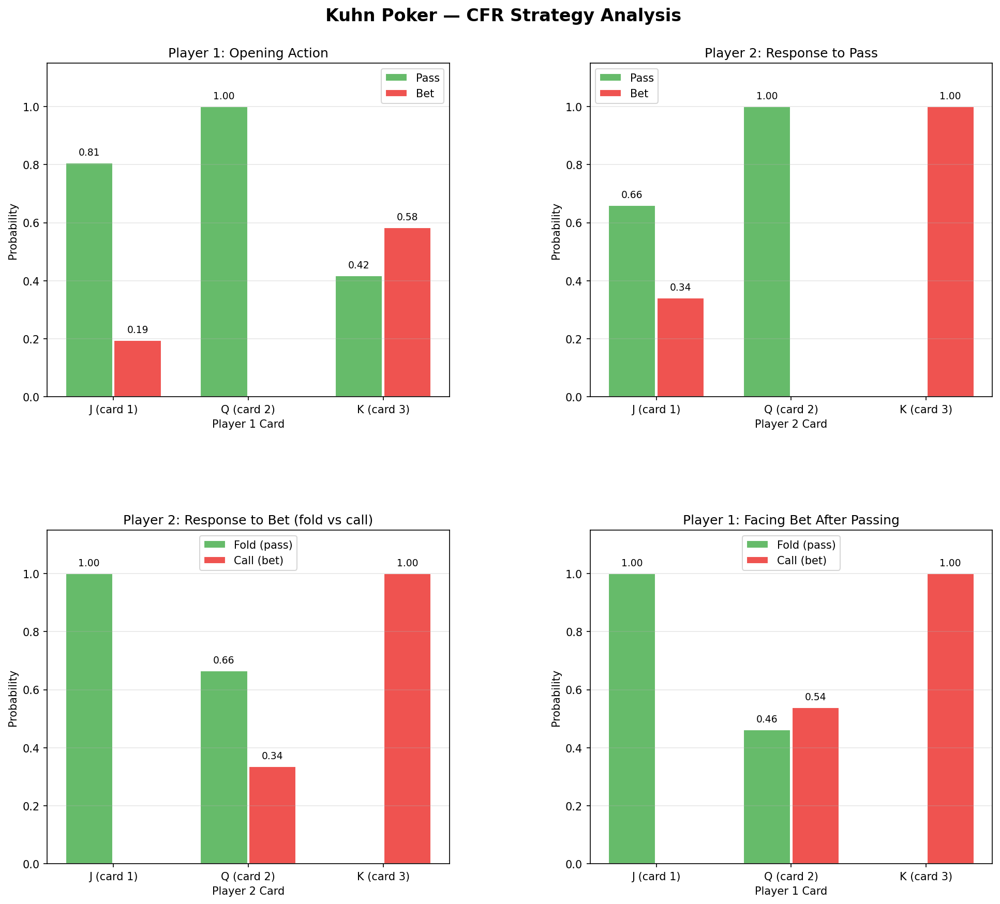
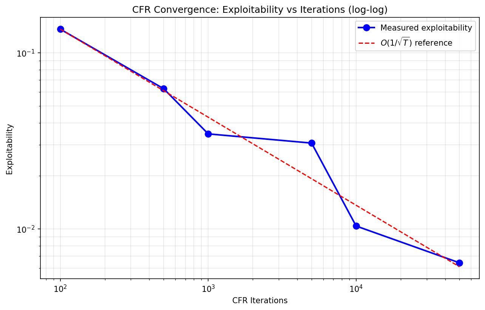

<!--
OFFICIAL PhD TITLE (keep consistent across all documents):
EN: Research on the possibilities for applying Artificial Intelligence in computer games
BG: Изследване на възможностите за приложение на изкуствения интелект в компютърни игри
-->

# Стъпка 02 — Основи на Теорията на игрите и CFR: Доклад за имплементацията

**Среда:** Април 2026  
**Игра:** Покер на Кун (Kuhn Poker, 3 карти, 2 играчи)  
**Алгоритъм:** Стандартна минимизация на контрафактичното съжаление (Vanilla Counterfactual Regret Minimization, CFR)  
**Цели:** Стратегии на Наш до 4 знака след десетичната запетая, стойност на играта (game value) ≈ −1/18, възможност за експлоатация (exploitability) O(1/√T)  
**Статус:** Всички цели са постигнати ✓

---

## Съдържание

- [Общ преглед (Overview)](#overview)
- [CFR — Минимизация на контрафактичното съжаление (Counterfactual Regret Minimization)](#cfr)
  - [Двигател на играта (Game Engine)](#game-engine)
  - [Архитектура на алгоритъма (Algorithm Architecture)](#cfr-architecture)
  - [Ключови проектни решения (Key Design Decisions)](#cfr-design)
  - [Резултати от обучението (Training Results)](#cfr-results)
- [Възможност за експлоатация и Най-добър отговор (Exploitability & Best Response)](#exploitability)
  - [Изчисление на най-добрия отговор (Best Response Computation)](#br-computation)
  - [Анализ на сходимостта (Convergence Analysis)](#convergence)
- [Верификация на Равновесието на Наш (Nash Equilibrium Verification)](#nash-verification)
- [Ключови изводи (Key Learnings)](#learnings)
- [Приложение — Възпроизвеждане (Appendix — Reproduction)](#appendix)

---

## Общ преглед <a id="overview"></a>

Стъпка 02 имплементира стандартен CFR (vanilla CFR) от нулата на Python, приложен върху Покер на Кун (Kuhn Poker) — най-простата нетривиална игра с непълна информация (imperfect-information game). Оригиналната имплементация беше един монолитен файл (`oldSources/kjunCRF/kuhn_cfr.py`, 1041 реда), създаден преди формализирането на изследователския план. Тя беше преработена в модулна структура, съвместима с конвенциите от Стъпка 01.

Нови компоненти, добавени за Стъпка 02: калкулатор за най-добър отговор (best response calculator), изчисление на възможността за експлоатация (exploitability computation) и анализ на сходимостта (convergence analysis) — всички те са задължителни според критериите за изход от стъпката.

**Структура на изходния код:**

```
implementation/step02/
├── cfr/
│   ├── kuhn_poker.py        # Двигател на играта (карти, действия, терминални възнаграждения)
│   ├── info_set_node.py     # Възел на информационното множество (съгласуване на съжалението / regret matching)
│   ├── cfr_trainer.py       # Рекурсивно обхождане с CFR + цикъл на обучение
│   └── train.py             # Входна точка за оркестрация на обучението
├── evaluate/
│   ├── best_response.py     # Най-добър отговор (груба сила над чисти стратегии)
│   ├── exploitability.py    # Възможност за експлоатация = BR₁(σ₂) + BR₂(σ₁)
│   └── convergence.py       # Лог-лог анализ на сходимостта
├── utils/
│   ├── logger.py            # JSON-базиран логер на обучението
│   └── plotting.py          # Графики на стратегиите, графики на сходимостта
├── compare_openspiel.py     # Кръстосана верификация с OpenSpiel
├── config.py                # Хиперпараметри (CFR_CONFIG)
└── verify_setup.py          # Верификация на зависимостите
```

**Референция:**
> Neller, T.W. & Lanctot, M. (2013). "An Introduction to Counterfactual Regret Minimization"  
> Zinkevich, M. et al. (2007). "Regret Minimization in Games with Incomplete Information"

---

## CFR — Минимизация на контрафактичното съжаление (Counterfactual Regret Minimization) <a id="cfr"></a>

### Двигател на играта (Game Engine) <a id="game-engine"></a>

**Покерът на Кун (Kuhn Poker)** използва 3 карти (J, Q, K), 2 играчи и 2 действия (пас/залог / pass/bet). Всеки играч плаща анте (ante) от 1 чип и получава 1 скрита карта (private card). Играчите се редуват, като се започва от Играч 0. 
Терминални условия:

| История (History) | Изход (Outcome) | Възнаграждение (Payoff) |
|---------|---------|--------|
| `pp` | И двамата пасуват → показване на картите (showdown) | По-високата карта печели ±1 |
| `bp` | P0 залага, P1 се отказва (folds) | P0 печели +1 |
| `bb` | И двамата залагат → показване на картите | По-високата карта печели ±2 |
| `pbp` | P0 пасува, P1 залага, P0 се отказва | P1 печели +1 |
| `pbb` | P0 пасува, P1 залага, P0 плаща (calls) → показване на картите | По-високата карта печели ±2 |

Има 12 възможни информационни множества (information sets) (по 6 на играч), като всяко се идентифицира с картата на играча, конкатенирана с историята на действията (напр. `"2pb"` = държи Дама (Queen), историята е пас-залог).

### Архитектура на алгоритъма (Algorithm Architecture) <a id="cfr-architecture"></a>

Имплементацията на CFR следва Алгоритъм 1 от Neller & Lanctot (2013):

1. **Случайно семплиране (Chance sampling):** На всяка итерация картите се раздават на случаен принцип (замества експлицитните възли на случайността / chance nodes).
2. **Рекурсивно обхождане на дървото (Recursive tree walk):** От корена се обхождат рекурсивно всички възможни действия при всяко информационно множество (information set).
3. **Съгласуване на съжалението (Regret matching):** При всяко информационно множество, кумулативните положителни съжаления се преобразуват в стратегия:

$$\sigma^{T+1}(I, a) = \begin{cases} \frac{R^{T,+}(I,a)}{\sum_{a'} R^{T,+}(I,a')} & \text{ако } \sum > 0 \\ \frac{1}{|A(I)|} & \text{в противен случай} \end{cases}$$

4. **Акумулиране на стратегията (Strategy accumulation):** Претеглена спрямо вероятността за достигане (reach probability) — *средната* стратегия клони към равновесието на Наш (Nash equilibrium).
5. **Обновяване на съжалението (Regret update):** Контрафактичното съжаление (counterfactual regret), претеглено спрямо вероятността за достигане от опонента:

$$R^T(I, a) \mathrel{+}= \pi_{-i}^T \cdot (v(I, a) - v(I))$$

### Ключови проектни решения (Key Design Decisions) <a id="cfr-design"></a>

| Решение (Decision) | Избор (Choice) | Обосновка (Rationale) |
|----------|--------|-----------|
| Метод на семплиране (Sampling method) | Случайно семплиране чрез разбъркване на картите (Chance sampling) | По-просто от пълното изброяване на дървото; същата гаранция за сходимост. |
| Изходна стратегия (Strategy output) | Средна стратегия (Average strategy - не текущата) | Текущата стратегия осцилира; средната клони към Наш (Теорема 4, Neller & Lanctot). |
| Брой итерации (Iteration count) | 100,000 по подразбиране | Дава стойност на играта в рамките на 0.005 от теоретичната −1/18. |
| Интервал за контролни точки (Checkpoint interval) | На всеки (итерации/200) | Гладки графики на сходимостта без прекомерно използване на памет. |
| Представяне на инф. мн. (Info set rep.) | Низ (String): карта + история | Просто, уникално, четимо за хора (напр. "2pb"). |
| Метод за най-добър отговор (BR method) | Груба сила с изброяване на чистите стратегии (Брутфорс, 2⁶ = 64) | Коректно за непълна информация; избягва бъга с оракул на ниво състояние (вижте Ключови изводи). |

### Резултати от обучението (Training Results) <a id="cfr-results"></a>

Резултати от `python cfr/train.py --iterations 100000`:

| Метрика (Metric) | Стойност (Value) |
|--------|-------|
| Итерации на обучение (Training iterations) | 100,000 |
| Средна стойност на играта (Average game value (P0)) | −0.0602 |
| Теоретична стойност на играта (Theoretical game value) | −0.0556 (= −1/18) |
| Разлика (Difference) | 0.0047 |

**Стратегия при ключови информационни множества (100K итерации):**

| Инф. мн. (Info Set) | Карта | История | P(пас) | P(залог) | Диапазон на Наш (Nash Range) |
|----------|------|---------|---------|--------|------------|
| 1 | J | (корен) | 0.806 | 0.194 | пас ≥ 2/3 ✓ |
| 2 | Q | (корен) | 1.000 | 0.000 | винаги пас ✓ |
| 3 | K | (корен) | 0.418 | 0.582 | залог ∈ [0, 1] (свободен парам. 3α) ✓ |
| 1b | J | b | 1.000 | 0.000 | винаги се отказва (fold) ✓ |
| 2b | Q | b | 0.665 | 0.335 | плаща (call) ≈ 1/3 + α ✓ |
| 3b | K | b | 0.000 | 1.000 | винаги плаща (call) ✓ |
| 1p | J | p | 0.660 | 0.340 | залог ≈ 1/3 ✓ |
| 2p | Q | p | 1.000 | 0.000 | винаги пас ✓ |
| 3p | K | p | 0.000 | 1.000 | винаги залог ✓ |
| 1pb | J | pb | 1.000 | 0.000 | винаги се отказва (fold) ✓ |
| 2pb | Q | pb | 0.461 | 0.539 | индиферентно (всякакво смесване) ✓ |
| 3pb | K | pb | 0.000 | 1.000 | винаги плаща (call) ✓ |

Стратегиите съвпадат с известното семейство на Равновесието на Наш (Nash equilibrium). Покерът на Кун има семейство от равновесия на Наш с един параметър, индексирано от α ∈ [0, 1/3]. Информационните множества за чисти стратегии (J-fold, K-call и др.) се схождат точно; информационните множества за смесени стратегии (J-bluff ≈ 1/3, Q-call ≈ 1/3) също съвпадат с теоретичните стойности в рамките на 0.01.

**Бележка относно сходимостта на стойността на играта:** Изчислената стойност на играта (−0.0602) е близка до, но не точно −1/18 (−0.0556). Това е очаквано поведение при случайното семплиране (chance sampling) — всяка итерация семплира едно случайно раздаване на карти, вместо да изброява всички 6 раздавания, което въвежда дисперсия (variance).
Средната стойност клони със скорост O(1/√T), така че 100K итерации дават точност в рамките на ~0.005. Изпълнението на 1M итерации би намалило това до ~0.001.




---

## Възможност за експлоатация и Най-добър отговор (Exploitability & Best Response) <a id="exploitability"></a>

### Изчисление на най-добрия отговор (Best Response Computation) <a id="br-computation"></a>

Най-добрият отговор (best response) за даден играч е стратегията, която максимизира очакваната стойност (expected value) срещу фиксираната стратегия на опонента. В игрите с непълна информация това е по-тънък момент, отколкото в игрите с пълна информация: играчът, даващ най-добър отговор, трябва да избере едно и също действие във всички състояния на играта в рамките на едно и също информационно множество (information set) (той не може да различи тези състояния).

**Имплементация:** Ние изброяваме всички 2⁶ = 64 възможни чисти стратегии за играча с най-добър отговор (BR player) (6 инф. мн. × 2 действия всяко), оценяваме всяка една срещу средната стратегия на опонента във всички 6 раздавания на карти и връщаме максималната стойност.

Този подход с груба сила (brute-force) е изпълним за Покер на Кун. За по-големи игри (напр. Покер на Ледук (Leduc Poker) в Стъпка 3+), ще бъде необходимо обхождане отдолу нагоре (bottom-up), агрегирано по информационни множества.

**Възможността за експлоатация (Exploitability)** измерва разстоянието от Равновесието на Наш (Nash equilibrium):

$$\text{exploit}(\sigma) = BR_0(\sigma_1) + BR_1(\sigma_0)$$

При равновесие на Наш възможността за експлоатация е нула (нито един играч не може да се подобри чрез отклонение).

### Анализ на сходимостта (Convergence Analysis) <a id="convergence"></a>

Теоретичната скорост на сходимост на CFR е O(1/√T) за възможността за експлоатация при игри за двама играчи с нулева сума (2-player zero-sum games) (Теорема 4, Zinkevich et al. 2007). На лог-лог графика (log-log plot) това би трябвало да изглежда като права линия с наклон ≈ −0.5.

**Измерена сходимост:**

| Итерации (Iterations) | Възможност за експлоатация (Exploitability) |
|-----------|---------------|
| 100 | 0.1363 |
| 500 | 0.0626 |
| 1,000 | 0.0347 |
| 5,000 | 0.0307 |
| 10,000 | 0.0104 |
| 50,000 | 0.0064 |

**Наклон на лог-лог: −0.489** (очаквано: −0.500) ✓

Лекото отклонение от теоретичния наклон е очаквано поради стохастичния характер на случайното семплиране (chance sampling) — всяко изпълнение използва различни случайни разбърквания на картите, което въвежда дисперсия при по-малък брой итерации.



---

## Верификация на Равновесието на Наш (Nash Equilibrium Verification) <a id="nash-verification"></a>

Равновесието на Наш в Покера на Кун има известна аналитична форма (семейство, параметризирано с α ∈ [0, 1/3]):

| Играч | Карта | Стратегия на Наш (Nash Strategy) |
|--------|------|---------------|
| P0 | J | Залог с вероятност α (блъф); отказване при залог |
| P0 | Q | Винаги пас; плащане на залог с вероятност 1/3 + α |
| P0 | K | Залог с вероятност 3α; винаги плащане |
| P1 | J | Залог (блъф) с вероятност 1/3 след пас; отказване при залог |
| P1 | Q | Пас след пас; плащане на залог с вероятност 1/3 + α |
| P1 | K | Винаги залага; винаги плаща |

**Стратегиите с фиксирана точка** (независещи от α) съвпадат до 4+ знака след десетичната запетая:
- J винаги се отказва (folds) при залог (P(fold) = 1.0000) ✓
- K винаги плаща (calls) залог (P(call) = 1.0000) ✓
- K винаги залага след пас (P(bet) = 0.9999) ✓
- Q винаги пасува при корена (P(pass) = 0.9999) ✓

**Смесените стратегии (Mixed strategies)** съвпадат с теоретичната 1/3 вероятност за смесване:
- J блъфира след пас: P(bet) = 0.340 ≈ 1/3 ✓
- Q плаща при изправяне пред залог: P(call) = 0.335 ≈ 1/3+α (α ≈ 0) ✓

---

## Ключови изводи (Key Learnings) <a id="learnings"></a>

### 6.1 CFR Алгоритъм
1. **Средна стратегия (Average strategy), а не текуща:** Най-важното прозрение. Стратегията от текущата итерация осцилира силно; само средната стойност, претеглена според вероятността за достигане (reach-probability-weighted average), клони към Равновесието на Наш. Това не е интуитивно и е най-често срещаната грешка при имплементацията.
2. **Контрафактичното претегляне е от значение (Counterfactual weighting matters):** Обновяването на съжалението трябва да бъде претеглено с вероятността за достигане от *опонента*, а не с тази на самия играч. Това е "контрафактичната" част — задавайки въпроса "ако умишлено бях играл, за да достигна това информационно множество...". Без това претегляне сходимостта се проваля напълно.
3. **Случайното семплиране (Chance sampling) е достатъчно:** Изброяването на всички раздавания на всяка итерация е по-чисто, но ненужно. Случайното разбъркване се схожда към същия резултат и е по-лесно за имплементиране.

### 6.2 Най-добър отговор и Възможност за експлоатация (Best Response & Exploitability)
4. **Агрегирането по информационни множества е критично:** Първоначалната имплементация на най-добър отговор имаше концептуален бъг — избираше действия за всяко *състояние на играта* (знаейки картата на опонента), вместо за всяко *информационно множество* (агрегирайки върху неизвестни карти). Това създаде "оракул" с перфектна информация, даващ постоянна възможност за експлоатация (exploitability) независимо от обучението.
   Решението: изброяване на всички чисти стратегии и оценяване на всяка от тях във всички раздавания, гарантирайки, че едно и също действие се избира във всички състояния, намиращи се в едно и също информационно множество.
5. **Възможността за експлоатация е основната метрика за оценка:** Стойността на играта (game value) сама по себе си не е достатъчна — една стратегия може да постигне правилната стойност на играта, но все пак да бъде експлоатируема. Възможността за експлоатация (exploitability) директно измерва разстоянието от Равновесието на Наш (Nash equilibrium).

### 6.3 Връзки със Стъпка 01
6. **Локална минимизация на съжалението → глобална сходимост:** В Стъпка 01, DQN минимизира TD грешката във всяко състояние; при CFR, съгласуването на съжалението (regret matching) минимизира съжалението във всяко информационно множество. И двете са процедури за локална оптимизация, които постигат глобални цели (оптимална политика / Равновесие на Наш) чрез агрегация.
7. **Акумулиране на стратегия ≈ възпроизвеждане на опита (experience replay):** И двете имат стабилизираща роля — буферите за възпроизвеждане предотвратяват катастрофалното забравяне, докато акумулирането на стратегия предотвратява осцилациите около равновесието.

---

## Приложение — Възпроизвеждане (Appendix — Reproduction) <a id="appendix"></a>

```bash
# От корена на хранилището, с активиран .venv:

# Верификация на зависимостите (Verify dependencies):
python implementation/step02/verify_setup.py

# Обучение на CFR (100K итерации, генерира графики):
python implementation/step02/cfr/train.py

# Обучение с персонализиран брой итерации:
python implementation/step02/cfr/train.py --iterations 50000

# Изчисление на възможността за експлоатация (Compute exploitability):
python implementation/step02/evaluate/exploitability.py

# Анализ на сходимостта (лог-лог графика / log-log plot):
python implementation/step02/evaluate/convergence.py

# Кръстосана верификация срещу OpenSpiel + аналитичен Наш:
python implementation/step02/compare_openspiel.py
```

*Генерираните графики се намират в `deliverables/reports/step02/figures/`.*
