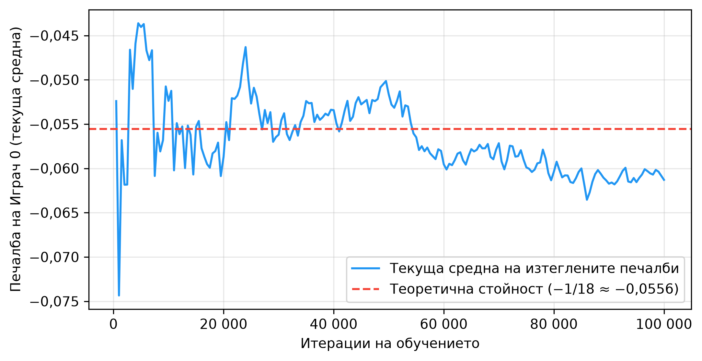
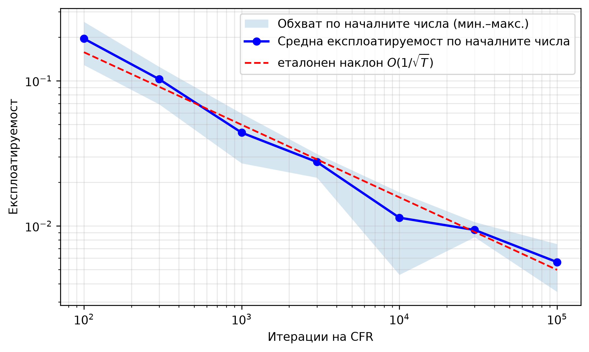

<!--
OFFICIAL PhD TITLE (keep consistent across all documents):
EN: Research on the possibilities for applying Artificial Intelligence in computer games
BG: Изследване на възможностите за приложение на изкуствения интелект в компютърни игри
-->

# Глава 02 - Основи на теорията на игрите и CFR: Доклад за реализацията

**Среда:** април 2026 г.  
**Игра:** Кун покер (3 карти, 2 играчи)  
**Алгоритъм:** минимизиране на контрафактичното съжаление (CFR) с извадка на случайните събития  
**Цели:** стратегии на Наш с точност до четири десетични знака, стойност на играта ≈ −1/18, експлоатируемост O(1/√T)  
**Статус:** Целите за стойността на играта и скоростта на сходимост са постигнати; смесените честоти са на 0.005–0.038 от затворената форма (точност до четири знака е постигната само при чистите решения с Поп и с Вале)

---

## 1. Какво беше разработено

Глава 02 реализира модулна версия на минимизирането на контрафактичното съжаление (CFR) с извадка на случайните събития, приложена към Кун покер, написана изцяло на Python. Тя демонстрира, че рамката успешно открива стратегии в равновесие на Наш в многоагентна среда с непълна информация.

**Ключови изградени компоненти:**
- **Игрови двигател:** `kuhn_poker.py` обработва крайни печалби, залагания и представяне на информационните множества.
- **Ядро на алгоритъма CFR:** Рекурсивно обхождане на дърво с извадка на случайните събития и напасване на съжалението (`cfr_trainer.py`, `info_set_node.py`).
- **Оценител на експлоатируемостта и най-добър отговор:** Брутфорс агрегиране на чисти стратегии за изчисляване на точна експлоатируемост (`evaluate/best_response.py`, `evaluate/exploitability.py`).
- **Регистратор на сходимостта и визуализации:** Помощни средства за графично представяне на метрики за експлоатируемостта и сходимостта на стратегията в хода на итерациите (`utils/plotting.py`, `evaluate/convergence.py`).
- **Кръстосана проверка с OpenSpiel:** Проверка спрямо стандартни библиотеки с отворен код (`compare_openspiel.py`).

## 2. Ключови резултати и визуализации

- **Сходимост към минимаксно оптимална стратегия:** Алгоритъмът се доближава на 0.038 до аналитичното семейство от равновесия на Наш (параметризирано с α); експлоатируемостта на средната стратегия след 100,000 итерации е 0.006.
- **Коефициент на затихване на експлоатируемостта:** Наклонът на експлоатируемостта спрямо итерациите в двулогаритмичен мащаб е −0.52 ± 0.02 (5 начални числа, 100–100,000 итерации), което съответства на теоретичната граница O(1/√T).
- **Точност на стойността на играта:** След 100,000 итерации точната стойност на средната стратегия (−0.0555) съвпада с теоретичната стойност −1/18 (−0.0556) с точност 8·10⁻⁵; текущата средна на изтеглените печалби е −0.0613.

### Сходимост на стойността на играта

### Сходимост на експлоатируемостта

### Анализ на стратегиите

