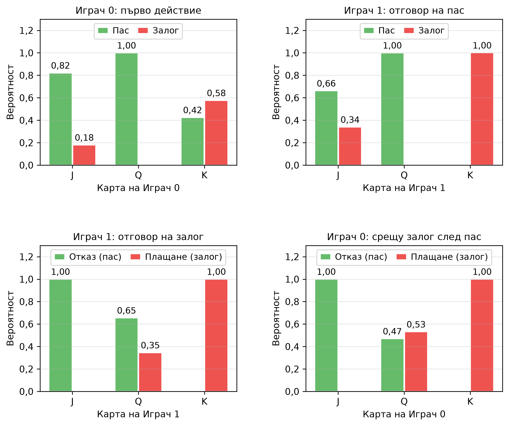

# Глава 2 – Основи на теорията на игрите и CFR

---

## От обучение с подкрепление с един агент към многоагентно стратегическо взаимодействие

Глава 1 разглеждаше средите като пасивни – количката с прът не оказва съпротива, а кацащият модул не се опитва да предизвика катастрофа. Агентът оптимизира спрямо фиксирана динамика. Глава 2 въвежда фундаментално различен проблем: средата включва друг *стратегически* вземащ решения участник, чиито действия зависят от първия.

Тази промяна нарушава MDP рамката. В едноагентна среда оптималната стратегия е фиксирана – съществува един-единствен най-добър начин за действие, независимо от това каква стратегия сте обмисляли преди. В многоагентна среда обаче „най-добрата“ стратегия зависи от действията на противника, а неговата най-добра стратегия – от вашите действия. Тази взаимна зависимост е в основата на предизвикателството, което поставя теорията на игрите.

Формализацията започва с **игрите в нормална форма** (едновременни ходове, като камък-ножица-хартия) и стига до **игрите в разгърната форма** (последователни ходове с дървовидна структура, като покер). И в двата случая концепцията за решение се измества от „оптимална стратегия“ към **равновесие на Наш** – стратегически профил, при който никой играч не може да подобри резултата си чрез едностранно променяне на собствената си стратегия.[^shoham2008]

---

## Игри в разгърната форма и информационни множества

Игра в разгърната форма представя стратегическото взаимодействие под формата на дърво. Всеки възел е точка за вземане на решение от даден играч (или „случайност“ при случайни събития като раздаване на карти). Ребрата обозначават действия, а крайните възли съдържат печалбите на всеки играч.

Ключовото разграничение е между **пълна** и **непълна** информация:

- **Пълна информация** (шах, Го): всеки играч има достъп до пълното състояние на играта. В дървото на играта няма групирани възли – всеки възел представлява отделно информационно множество. Тези игри се решават чрез минимакс и алфа-бета подрязване.
- **Непълна информация** (покер, много реални проблеми): играчите не могат да наблюдават всички аспекти на състоянието. В покера виждате само собствените си карти, но не и тези на опонента. Това означава, че множество състояния на играта са *неразличими* за действащия играч.

**Информационно множество** обединява всички състояния на играта, които играчът не може да различи едно от друго. В рамките на такова множество играчът трябва да приложи една и съща стратегия към всички състояния в него (тъй като те са неразличими за него). Именно това ограничение прави игрите с **непълна информация** фундаментално по-сложни от тези с **пълна информация** – вместо да се избира най-доброто действие за всяко отделно състояние, трябва да се подбере едно действие, което да работи добре *средно* за всички състояния в информационното множество.

В Кун покер информационното множество `"2pb"` включва две състояния на играта: „Аз държа Дама, опонентът държи Вале, историята е пас–залог“ и „Аз държа Дама, опонентът държи Поп, историята е пас–залог“. Играчът с Дама не може да различи тези състояния и трябва да използва една и съща стратегия (вероятност за плащане) и в двата случая.[^shoham2008]

---

## Теорема за минимакс

Теоремата за минимакс, установена от Джон фон Нойман през 1928 г.,[^vonneumann1928] представлява основна концепция за решение на игрите за двама играчи с нулева сума. Тя гласи, че за всяка крайна игра за двама играчи с нулева сума съществува стратегия за всеки от двамата, при която максималната очаквана загуба е минимизирана. С други думи, всеки играч може да гарантира конкретна очаквана печалба, известна като „стойност на играта“, независимо от стратегията на противника. Това създава ситуация, в която оптималната стратегия на единия играч е да максимизира своята минимална награда (максимин), докато противникът се стреми да минимизира максималната награда на първия играч (минимакс). Теоремата твърди, че при смесени стратегии тези две стойности винаги са равни; общата им стойност е стойността на играта. Теоремата е пряко свързана с равновесието на Наш: в частния случай на игрите за двама играчи с нулева сума минимаксният стратегически профил е еквивалентен на равновесие на Наш. Откриването на това минимаксно решение гарантира защита срещу всяка експлоатираща стратегия, която противникът може да приложи.

---

## Равновесие на Наш

**Равновесие на Наш** представлява стратегически профил, при който стратегията на всеки играч е най-добър отговор на стратегиите на всички останали играчи. Формално, за всеки играч $i$:

$$u_i(\sigma_i^*, \sigma_{-i}^*) \geq u_i(\sigma_i, \sigma_{-i}^*) \quad \forall \sigma_i$$

Нито един играч не може да подобри своята очаквана печалба чрез едностранно отклоняване. Това не означава, че всички са доволни от резултата (дилемата на затворника), а само че никой не може да постигне по-добър резултат, като промени единствено собствената си стратегия.

В игрите, разширени до повече от двама играчи (игри с N играчи) или игри с обща сума, свойствата на равновесието на Наш стават значително по-сложни. В тези условия изчисляването на равновесие на Наш е PPAD-пълна задача – дори при игри за двама играчи с обща сума – и затова се смята за изчислително непосилно.[^daskalakis2009][^chen2009] Освен това равновесията губят своята гаранция за безопасност: играта по равновесна стратегия в игра с трима играчи не предпазва от двама опоненти, които могат да се отклоняват от равновесие, потенциално формирайки временни коалиции, които експлоатират третия играч.[^szafron2013] Тази динамика изисква изцяло различни обучителни рамки и методи за оценка (като тези, обсъдени в глави 9 и 11), тъй като пряката еквивалентност между равновесието на Наш и минимакс оптималността вече не важи.

**Ключови свойства:**

- **Съществуване:** Наш (1950)[^nash1950] доказва, че всяка крайна игра има поне едно равновесие на Наш (възможно в смесени стратегии). Това е основополагаща теорема, но не помага при изчисленията.
- **Единственост:** Игрите могат да имат множество равновесия. Кун покер има еднопараметрично *семейство* от равновесия на Наш, индексирани от $\alpha \in [0, 1/3]$.
- **Смесени стратегии:** В много игри равновесието изисква рандомизация. В Кун покер равновесието на Наш изисква Играч 1 (вторият по ред) да блъфира с Вале в точно 1/3 от случаите – всяка друга честота е експлоатируема.

За игри за двама с нулева сума (където печалбата на единия играч е загуба за другия), равновесията на Наш имат специално свойство: те са **оптимални по минимакс**. Равновесната стратегия гарантира поне стойността на играта, независимо от действията на опонента. Това е гаранцията за безопасност, която прави равновесието на Наш базова линия за изкуствен интелект за покер.[^nash1950]

---

## Напасване на съжалението – градивният елемент

Преди CFR да може да минимизира съжалението в дърво на играта, е необходим механизъм за минимизиране на съжалението в отделна точка на вземане на решение. **Напасването на съжалението** изпълнява тази функция.

Идеята е следната: след множество изиграни рундове, за всяко **действие** $a$ се изчислява **натрупаното съжаление** – с колко по-добър резултат бихте се справили, ако винаги бяхте избирали $a$ вместо действително използваната **смесена стратегия**. След това следващата **стратегия** се определя пропорционално на *положителните* стойности на **съжалението**:

$$\sigma^{T+1}(a) = \begin{cases} \frac{R^{T,+}(a)}{\sum_{a'} R^{T,+}(a')} & \text{ако } \sum > 0 \\ \frac{1}{|A|} & \text{в противен случай} \end{cases}$$

**Гаранция за сходимост:** Блекуел (1956)[^blackwell1956] и Харт и Мас-Колел (2000)[^hartmascolell2000] доказват, че при използване на **напасване на съжалението** средното съжаление клони към нула със скорост $O(1/\sqrt{T})$ (натрупаното съжаление расте не по-бързо от $O(\sqrt{T})$). В игра за двама играчи с нулева сума, ако и двамата играчи прилагат **напасване на съжалението** в своите точки на вземане на решение, средният **стратегически профил** се сближава до **равновесие на Наш**.

Прост пример е **камък-ножица-хартия**. Ако прилагате напасване на съжалението срещу постоянен противник, който винаги избира **камък**, вашето натрупано съжаление за **хартия** нараства (тъй като хартията побеждава камъка), докато съжалението за ножица става отрицателно и не влияе на стратегията. Стратегията бързо преминава към хартия – правилният най-добър отговор.[^neller2013]

---

## Минимизиране на контрафактичното съжаление (CFR)

CFR (Zinkevich и др., 2007)[^zinkevich2007] разширява **напасването на съжалението** към игрите в разгърната форма. Ключовата идея е да се разложи общото **съжаление** на стратегията на играта на **локални съжаления** във всяко **информационно множество** и след това всяко локално **съжаление** да бъде минимизирано независимо чрез **напасване на съжалението**. Ако средното съжаление във всяко информационно множество клони към нула, цялостната *средна* стратегия клони към равновесие на Наш.

**„Контрафактичната“ част** е от решаващо значение. Във всяко информационно множество $I$ съжалението за действие $a$ не е просто „колко по-добро би било $a$“. То представлява *контрафактичното* съжаление – подобрението, което би настъпило, ако играчът умишлено бе избрал да достигне до $I$ (вероятност за достигане = 1 за играча), като останалите условия (стратегия на противника и случайни събития) останат непроменени. Формално:

$$R^T(I, a) = \sum_{t=1}^{T} \pi_{-i}^t \cdot \left(v^t(I, a) - v^t(I)\right)$$

където $\pi_{-i}^t$ е вероятността за достигане на противника, а $v^t(I, a)$ представлява контрафактичната стойност на действието $a$ в $I$ при итерация $t$.

**Защо вероятността за достигане на противника?** Съжалението в дадено информационно множество има по-голяма тежест, когато съществува по-голяма вероятност противникът да е изиграл така, че да се достигне до него. Претеглянето с $\pi_{-i}$ прави съжалението пропорционално на честотата, с която информационното множество е „от значение“ за крайния резултат от играта.

**Алгоритъм (CFR с извадка на случайните събития, по Neller и Lanctot, 2013[^neller2013]):**

1. Инициализирайте всички кумулативни съжаления и суми на стратегиите с нула.
2. За $T$ итерации:
   - а) Изтеглете случайно раздаване на картите (извадка на случайните събития).
   - б) Рекурсивно обходете дървото на играта, започвайки от корена.
   - в) Във всяко информационно множество изчислете стратегия чрез напасване на съжалението.
   - г) За всяко действие рекурсивно обходете поддървото (като смените знака на полезността, тъй като играта е с нулева сума).
   - д) Обновете кумулативните съжаления, претеглени с вероятността за достигане на противника.
   - е) Натрупайте стратегия, претеглена със собствената вероятност за достигане на играча.
3. Изведете **средната** стратегия (а не стратегията от последната итерация).

**Сходимост:** Средният профил от стратегии се сближава до равновесие на Наш със скорост $O(1/\sqrt{T})$ по отношение на експлоатируемостта, където $T$ е броят на итерациите (Теорема 4, Zinkevich и др. 2007). Границата на сходимост е:

$$\text{exploit}(\bar{\sigma}^T) \leq \frac{\Delta\,|\mathcal{I}|\,\sqrt{|A|}}{\sqrt{T}}$$

където $\Delta$ е обхватът на печалбите, $|\mathcal{I}|$ - броят на информационните множества на двамата играчи, а $|A|$ - най-големият брой действия в едно информационно множество.[^zinkevich2007] Границата е линейна по $|\mathcal{I}|$; по-късно е доказана и по-тясна граница.[^lanctot2009]

---

## Математиката на покера

Покерът е каноничният тестов полигон за теорията на игрите с непълна информация, тъй като съчетава три източника на сложност, които рядко се срещат в комбинация:

1. **Скрита информация** – всеки играч вижда само своите карти. Едно и също наблюдавано състояние на играта (информационно множество) може да съответства на много различни действителни състояния на играта.  
2. **Стохастични елементи** – раздаването на картите въвежда случайни възли в дървото на играта. Оптималната стратегия трябва да отчита всички възможни раздавания, а не само наблюдаваното.  
3. **Стратегическо заблуждение** – за разлика от игрите с пълна информация, покерът възнаграждава смесените стратегии. Играч, който винаги залага със силни ръце и пасува със слаби, е тривиално експлоатируем. Равновесието на Наш изисква **рандомизирано блъфиране с математически точно определени честоти**.

Чен и Анкенман формализират тези концепции чрез решения на опростени игрови модели, при които честотите на блъфиране в равновесие на Наш могат да бъдат изведени аналитично. Техните модели с половин и с пълен рунд на залагане (half-street и full-street) изграждат интуиция защо изходните стратегии на CFR съдържат точните съотношения между блъф и плащане – балансираният играч трябва да блъфира с честота, пропорционална на шансовете на пота, които предлага.[^chen2006]

---

## Кун покер – най-простото изпитателно поле

Кун покер (Kuhn, 1950) е стандартният минимален пример за алгоритми в игри с непълна информация. С едва три карти, двама играчи и 12 информационни множества той е достатъчно малък, за да бъде решен аналитично, но същевременно достатъчно богат, за да демонстрира ключовите явления: блъфиране, информационна асиметрия и смесени равновесия.

**Правила:** Три карти {J, Q, K}; всеки играч внася начален залог от 1 жетон и получава по една тайна карта. Играч 0 действа пръв – пас или залог. Играч 1 отговаря – пас или залог. Ако Играч 0 е пасувал, а Играч 1 е направил залог, Играч 0 има право да отговори отново. Победител е играчът с по-висока карта при разкриването.

**Равновесие на Наш (параметризирано с $\alpha \in [0, 1/3]$):**

- **Играч 0 с J:** Залог (блъф) с вероятност $\alpha$. Ако след пас срещне залог, винаги се отказва.
- **Играч 0 с Q:** Винаги пас. Ако след пас срещне залог, плаща с вероятност $1/3 + \alpha$.
- **Играч 0 с K:** Залог с вероятност $3\alpha$. Ако след пас срещне залог, винаги плаща.
- **Играч 1 с J:** След пас – залог (блъф) с вероятност 1/3. След залог – винаги се отказва.
- **Играч 1 с Q:** След пас – винаги пас. След залог – плаща с вероятност 1/3.
- **Играч 1 с K:** Винаги залага и винаги плаща.

(Стратегията на Играч 1 е една и съща във всички равновесия; от $\alpha$ зависи само стратегията на Играч 0. Стратегията, до която стига CFR, е показана на последната фигура в раздела „Емпирични визуализации“.)

**Стойност на играта:** При това равновесие очакваната печалба на Играч 0 е $-1/18 \approx -0{,}0556$. Играч 0 е в структурно неблагоприятна позиция, тъй като действа пръв. Как обучението се доближава до тази стойност, показва първата фигура в раздела „Емпирични визуализации“.

**Защо Кун е важен:** Всяка ключова концепция при решаването на игри с непълна информация се проявява тук в умален вид – блъфиране (с J се залага, въпреки че е най-слабата карта), информационна асиметрия (Играч 1 вижда действието на Играч 0, но не и картата му), смесени стратегии (точно определена честота на блъф 1/3), безразличие (с Q играчът е безразличен между плащане и отказ в определени информационни множества). Ако вашият алгоритъм не може да реши Кун коректно, той няма да може да реши нищо друго.[^kuhn1950]

---

## Експлоатируемост – мярка за отклонението от равновесието на Наш

**Експлоатируемостта** е основният оценителен показател за стратегии в игри с непълна информация. Тя измерва доколко една стратегия може да бъде експлоатирана от противник в най-лошия случай:

$$\text{exploit}(\sigma) = BR_0(\sigma_1) + BR_1(\sigma_0)$$

където $BR_i(\sigma_{-i})$ представлява очакваната печалба на играч $i$ при прилагането на неговия най-добър отговор спрямо стратегията на противника. В игра за двама играчи с нулева сума тази сума се нарича още NashConv; OpenSpiel отчита като „експлоатируемост“ половината от нея, така че стойностите по двете конвенции се различават два пъти.

В равновесие на Наш експлоатируемостта е точно нула – никой играч не може да подобри резултата си чрез отклонение от стратегията. За приблизителни равновесия на Наш експлоатируемостта измерва качеството на приближението.

**Изчисляването на най-добър отговор** в игри с непълна информация е деликатно. Най-добре реагиращият играч трябва да избере едно и също действие във всички състояния в рамките на едно информационно множество (тъй като той не може да ги различава). Наивен подход, който избира най-доброто действие за всяко състояние на играта (използвайки знанието за тайната карта на противника), изчислява приблизителна стойност, а не истински най-добър отговор. За Кун покер е достатъчно да се изброят всички 2⁶ = 64 чисти стратегии и да се оцени всяка от тях; при по-големи игри най-добрият отговор се изчислява с едно обхождане отдолу нагоре, което обединява стойностите по информационни множества.

**Скорост на сходимост:** Теоретично експлоатируемостта на средната стратегия на CFR намалява като $O(1/\sqrt{T})$[^zinkevich2007] (вж. втората фигура в раздела „Емпирични визуализации“). В двулогаритмична диаграма това се проявява като права линия с наклон $\approx -0{,}5$. При пет начални числа и контролни точки от 100 до 100 000 итерации измереният наклон е $-0{,}52 \pm 0{,}02$, което съответства на границата $O(1/\sqrt{T})$; тя е горна граница, а не точна прогноза за скоростта.

**Защо не просто стойност на играта?** Една стратегия може да постигне правилната стойност на играта, но въпреки това да бъде експлоатируема. Представете си стратегия за Кун покер, при която Играч 1 винаги блъфира с Вале (вместо в 1/3 от случаите). Средната стойност на играта може да е близо до $-1/18$, но стратегията е силно експлоатируема – Играч 0 може винаги да плаща с Дама и да печели. Експлоатируемостта улавя това; самата стойност на играта не го прави.

> **Тази метрика се появява многократно в дисертацията.** Глави 7–8 (моделиране на противника, безопасна експлоатация) използват експлоатируемостта като основна мярка. Тя е и отправната точка на методологията за оценяване в дисертацията (Принос №3).

---

## Връзки с Глава 1 и бъдещи насоки

**Локална оптимизация → глобална сходимост.** В Глава 1 Q-обучението намалява TD грешката за всяко състояние поотделно, но в табличния случай Q-функцията доказано се сближава до оптималната; DQN запазва правилото за обновяване, но с невронна мрежа губи тази гаранция. В Глава 2 CFR минимизира съжалението за всяко информационно множество поотделно, но цялостната *средна* стратегия се сближава до равновесие на Наш. И двете демонстрират един и същ принцип: локалните актуализации, когато са правилно структурирани, постигат глобални цели.

**Натрупване на стратегии ≈ повторение на натрупан опит.** CFR извежда *средната* стратегия, а не стратегията от последната итерация. Това осредняване стабилизира сходимостта, по същия начин както повторението на натрупан опит в DQN стабилизира обучението, като предотвратява преобучението на агента върху последните преходи. И двете представляват механизми за памет, които изглаждат шумовите колебания.

**Напред:** Реализацията в тази глава изтегля по едно раздаване на картите на итерация (извадка на случайните събития), но обхожда всички последователности от действия за него, така че всяка итерация пак засяга голяма част от дървото. При по-големи игри дори това е изчислително непосилно.[^bowling2015] В глава 3 се въвежда методът Монте Карло CFR (MCCFR), който обхожда само извадка от дървото, като заменя точността с мащабируемост. Глава 4 добавя абстракция на играта, намалявайки размера ѝ. Глава 5 заменя табличните стратегии с невронни мрежи.

---

## Емпирични визуализации

За да се потвърдят **теоретичните гаранции** на CFR и приложението му към **Кун покер**, в хода на обучението бяха наблюдавани няколко показателя.

<!-- Бележки към източниците. Заглавията на чуждоезични източници не се
     превеждат (правило 7 от terminology_EN_BG.md). -->

[^vonneumann1928]: von Neumann, J. (1928). "Zur Theorie der Gesellschaftsspiele." *Mathematische Annalen*, 100(1), 295-320. Превод на английски: "On the Theory of Games of Strategy," in *Contributions to the Theory of Games*, Vol. 4 (1959), 13-42.

[^nash1950]: Nash, J.F. (1950). "Equilibrium Points in N-Person Games." *Proceedings of the National Academy of Sciences*, 36(1), 48-49.

[^blackwell1956]: Blackwell, D. (1956). "An Analog of the Minimax Theorem for Vector Payoffs." *Pacific Journal of Mathematics*, 6(1), 1-8.

[^hartmascolell2000]: Hart, S. & Mas-Colell, A. (2000). "A Simple Adaptive Procedure Leading to Correlated Equilibrium." *Econometrica*, 68(5), 1127-1150.

[^zinkevich2007]: Zinkevich, M., Johanson, M., Bowling, M. & Piccione, C. (2007). "Regret Minimization in Games with Incomplete Information." *Advances in Neural Information Processing Systems 20*, 1729-1736.

[^shoham2008]: Shoham, Y. & Leyton-Brown, K. (2008). *Multiagent Systems: Algorithmic, Game-Theoretic, and Logical Foundations*. Гл. 3 (игри в нормална форма; §3.3 – най-добър отговор и равновесие на Наш, §3.4.1 – максиминни и минимаксни стратегии); §4.1 (изчисляване на равновесия на Наш в игри за двама играчи с нулева сума); гл. 5 (игри в разгърната форма; §5.2 – непълна информация и информационни множества, §5.2.3 – последователната форма); §7.5 "No-regret learning and universal consistency". Свободно достъпна: <http://www.masfoundations.org/download.html>

[^neller2013]: Neller, T.W. & Lanctot, M. (2013). "An Introduction to Counterfactual Regret Minimization," §2–3 (версия от 9 юли 2013 г.).

[^chen2006]: Chen, B. & Ankenman, J. (2006). *The Mathematics of Poker*. ConJelCo – аналитично извеждане на равновесия на Наш за опростени варианти на покер.

[^kuhn1950]: Kuhn, H.W. (1950). "Simplified Two-Person Poker." *Contributions to the Theory of Games*, Vol. 1, Annals of Mathematics Studies 24, Princeton University Press, 97–103.

[^bowling2015]: Bowling, M., Burch, N., Johanson, M. & Tammelin, O. (2015). "Heads-up limit hold'em poker is solved." *Science*, 347(6218), 145–149. С CFR+ хедс-ъп лимит тексаски холдем е решен по същество (в слаб смисъл) – първата нетривиална игра с непълна информация, играна състезателно от хора, която е решена.

[^lanctot2009]: Lanctot, M., Waugh, K., Zinkevich, M. & Bowling, M. (2009). "Monte Carlo Sampling for Regret Minimization in Extensive Games." *Advances in Neural Information Processing Systems 22*, 1078–1086.

[^daskalakis2009]: Daskalakis, C., Goldberg, P. W. & Papadimitriou, C. H. (2009). "The Complexity of Computing a Nash Equilibrium." *SIAM Journal on Computing*, 39(1), 195–259.

[^chen2009]: Chen, X., Deng, X. & Teng, S.-H. (2009). "Settling the Complexity of Computing Two-Player Nash Equilibria." *Journal of the ACM*, 56(3), 1–57.

[^szafron2013]: Szafron, D., Gibson, R. & Sturtevant, N. (2013). "A Parameterized Family of Equilibrium Profiles for Three-Player Kuhn Poker." *Proc. AAMAS 2013*, 247–254. В тройния Кун покер един играч може да прехвърля печалба от единия противник към другия, без да напуска семейството от равновесия.
