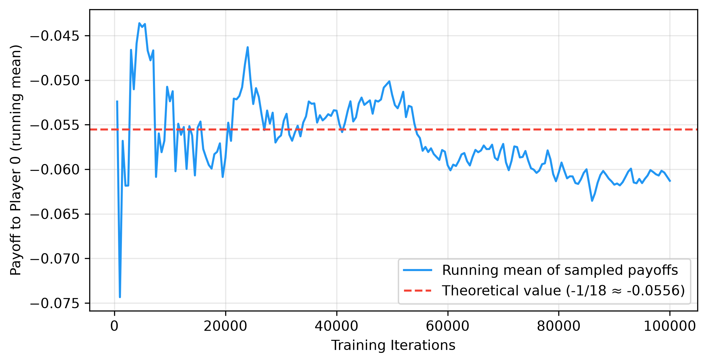

# Стъпка 2 - Основи на теорията на игрите и CFR

Това е съкратен преглед на материала по теория на игрите и минимизиране на контрафактичното съжаление, разгледан в Стъпка 2. Той има две предназначения: да служи като бърза справка при работа по следващите стъпки и като основен източник за синтеза на публичния доклад от Стъпка 15.

---

## От single-agent RL към многоагентно стратегическо взаимодействие

Стъпка 1 разглеждаше средите като пасивни - количката с прът не оказва съпротива, а кацащият модул не се опитва да предизвика катастрофа. Агентът оптимизира спрямо фиксирана динамика. Стъпка 2 въвежда фундаментално различен проблем: средата включва друг *стратегически* вземащ решения участник, чиито действия зависят от вашите.

Тази промяна нарушава MDP рамката. В едноагентна среда оптималната стратегия е фиксирана - съществува един-единствен най-добър начин за действие, независимо от това каква стратегия сте обмисляли преди. В многоагентна среда обаче „най-добрата“ стратегия зависи от действията на противника, а неговата най-добра стратегия - от вашите действия. Тази взаимна зависимост е в основата на предизвикателството, което поставя теорията на игрите.

Формализацията започва с **нормални игри** (едновременни ходове, като камък-ножица-хартия) и се разширява до **разширени игри** (последователни ходове с дървовидна структура, като покер). И в двата случая концепцията на решение се измества от „оптимална стратегия“ към **равновесие на Наш** - стратегически профил, при който никой играч не може да подобри резултата си чрез едностранно променяне на собствената си стратегия.

> **Прочетете повече:** Шохам, Й. и Лейтън-Браун, К. (2008). *Многоагентни системи*, глави 3–4.  
> Безплатно: <http://www.masfoundations.org/download.html>

---

## Разширени игри и информационни множества

Игра в разгърната форма представя стратегическото взаимодействие под формата на дърво. Всеки възел е точка за вземане на решение от даден играч (или „случайност“ при случайни събития като раздаване на карти). Ръбовете обозначават действия, а крайните възли съдържат изплащанията за всеки играч.

Ключовото разграничение е между **съвършена** и **несъвършена** информация:

- **Пълна информация** (шах, Го): всеки играч има достъп до пълното състояние на играта. В дървото на играта няма групирани възли - всеки възел представлява отделно информационно множество. Тези игри се решават чрез минимакс и алфа-бета подрязване.
- **Непълна информация** (покер, много реални проблеми): играчите не могат да наблюдават всички аспекти на състоянието. В покера виждате само собствените си карти, но не и тези на опонента. Това означава, че множество състояния на играта са *неразличими* за действащия играч.

**Информационно множество** обединява всички състояния на играта, които играчът не може да различи едно от друго. В рамките на такова множество играчът трябва да приложи една и съща стратегия към всички състояния в него (тъй като те са неразличими за него). Именно това ограничение прави игрите с **непълна информация** фундаментално по-сложни от тези с **пълна информация** - вместо да се избира най-доброто действие за всяко отделно състояние, трябва да се подбере едно действие, което да работи добре *в средноаритметичен смисъл* за всички състояния в информационното множество.

В Кун покер информационното множество `"2pb"` включва две състояния на играта: „Аз държа Дама, опонентът държи Вале, историята е пас–залог“ и „Аз държа Дама, опонентът държи Поп, историята е пас–залог“. Играчът с Дама не може да различи тези състояния и трябва да използва една и съща стратегия (вероятност за залог) и в двата случая.

> **Прочетете повече:** Шохам и Лейтън-Браун (2008). *Многоагентни системи*, Глава 5 - Игри в разширена форма.

---

## Теорема за минимакс

Теоремата за минимакс, установена от Джон фон Нойман през 1928 г., представлява фундаментална концепция на решение за двуигрови игри с нулева сума. Тя гласи, че за всяка крайна двуигрова игра с нулева сума съществува стратегия и за двамата играчи, при която максималната очаквана загуба е минимизирана. С други думи, всеки играч може да гарантира конкретна очаквана печалба, известна като „стойност на играта“, независимо от стратегията на противника. Това създава ситуация, в която оптималната стратегия на единия играч е да максимизира своята минимална награда (максимин), докато противникът се стреми да минимизира максималната награда на първия играч (минимакс). Когато тези две стойности са равни, играта достига равновесие. Този алгоритъм е пряко свързан с равновесието на Наш: в конкретния случай на двуигрови игри с нулева сума минимаксен стратегически профил е еквивалентен на равновесие на Наш. Откриването на това минимаксно решение гарантира защита срещу всяка експлоатативна стратегия, която противникът може да приложи.

---

## Равновесие на Наш

**Равновесие на Наш** представлява стратегически профил, при който стратегията на всеки играч е най-добър отговор на стратегиите на всички останали играчи. Формално, за всеки играч $i$:

$$u_i(\sigma_i^*, \sigma_{-i}^*) \geq u_i(\sigma_i, \sigma_{-i}^*) \quad \forall \sigma_i$$

Нито един играч не може да подобри своята очаквана печалба чрез едностранно отклоняване. Това не означава, че всички са доволни от резултата (дилемата на затворника), а само че никой не може да постигне по-добър резултат, като промени единствено собствената си стратегия.

В игрите, разширени до повече от двама играчи (n-играчни игри) или игри с обща сума, свойствата на равновесието на Наш стават значително по-сложни. В тези условия намирането на точно равновесие на Наш е известно като изчислително неразрешим проблем, често попадащ в класа на сложност pPAD-complete. Освен това равновесията губят своята гаранция за безопасност: играенето на нашева стратегия в 3-играчна игра не предпазва от двама опоненти, които могат да се отклоняват от равновесие, потенциално формирайки временни коалиции, които експлоатират третия играч. Тази динамика изисква изцяло различни обучителни рамки и методи за оценка (като тези, обсъдени в стъпки 9 и 11), тъй като пряката еквивалентност между равновесието на Наш и минимакс оптималността вече не важи.

**Ключови свойства:**
- **Съществуване:** Наш (1950) доказва, че всяка крайна игра има поне едно равновесие на Наш (възможно в смесени стратегии). Това е основополагаща теорема, но не помага при изчисленията.
- **Единственост:** Игрите могат да имат множество равновесия. Кун покер има еднопараметрично *семейство* от равновесия на Наш, индексирани от $\alpha \in [0, 1/3]$.
- **Смесени стратегии:** В много игри равновесието изисква рандомизация. В Кун покер равновесието на Наш изисква Играч 2 да блъфира с поп точно 1/3 от времето - всяка друга честота е експлоатируема.

За 2-играчни игри с нулева сума (където печалбата на единия играч е загуба за другия), равновесията на Наш имат специално свойство: те са **оптимални по минимакс**. Играенето на нашева стратегия гарантира поне стойността на играта, независимо от действията на опонента. Това е гаранцията за безопасност, която прави равновесието на Наш базова линия за изкуствен интелект за покер.

> **Прочетете повече:** Наш, Дж. Ф. (1950). "Равновесни точки в игри с n играчи." *PNAS*, 36(1), 48–49.

---

## Напасване на съжалението - Градивният елемент

Преди CFR да може да минимизира съжалението в дърво на играта, е необходим механизъм за минимизиране на съжалението в отделна точка на вземане на решение. **Напасването на съжалението** изпълнява тази функция.

Идеята е следната: след множество изиграни рундове, за всяко **действие** $a$ се изчислява **натрупаното съжаление** - с колко по-добър резултат бихте се справили, ако винаги бяхте избирали $a$ вместо действително използваната **смесена стратегия**. След това следващата **стратегия** се определя пропорционално на *положителните* стойности на **съжалението**:

$$\sigma^{T+1}(a) = \begin{cases} \frac{R^{T,+}(a)}{\sum_{a'} R^{T,+}(a')} & \text{if } \sum > 0 \\ \frac{1}{|A|} & \text{otherwise} \end{cases}$$

**Гаранция за сходимост:** Блекуел (1956) и Харт & Мас-Колел (2000) доказват, че при използване на **напасване на съжалението** средното **съжаление** се сближава към нула със скорост $O(\sqrt{T})$. В **двуигрови игра с нулева сума**, ако и двамата играчи прилагат **напасване на съжалението** в своите **решаващи точки**, средният **стратегически профил** се сближава до **равновесие на Наш**.

Прост пример е **камък-ножица-хартия**. Ако прилагате напасване на съжалението срещу постоянен противник, който винаги избира **камък**, вашето натрупано съжаление за **хартия** нараства (тъй като хартията побеждава камъка), докато съжалението за **ножица** остава нула. Постепенно стратегията ви се измества към игра с **хартия** с увеличаваща се вероятност, което представлява правилният най-добър отговор.

> **Прочетете повече:** Нелър, Т. У. и Ланкото, М. (2013). „Въведение в минимизирането на контрафактичното съжаление“, Раздели 1–2.

---

## Минимизиране на контрафактичното съжаление (CFR)

CFR (Zinkevich и др., 2007) разширява **напасването на съжалението** към игри в екстензивна форма. Ключовата идея е да се разложи общото **съжаление** на стратегията на играта на **локални съжаления** във всяко **информационно множество** и след това всяко локално **съжаление** да бъде минимизирано независимо чрез **напасване на съжалението**. Ако **съжалението** за всяко **информационно множество** се сближи до нула, цялостната стратегия се сближава до **равновесие на Наш**.

**„Контрафактичната“ част** е от решаващо значение. Във всяко информационно множество $I$ съжалението за действие $a$ не е просто „колко по-добро би било $a$“. То представлява *контрафактичното* съжаление - подобрението, което би настъпило, ако играчът умишлено бе избрал да достигне до $I$ (вероятност за достигане = 1 за играча), като останалите условия (стратегия на противника и случайни събития) останат непроменени. Формално:

$$R^T(I, a) = \sum_{t=1}^{T} \pi_{-i}^t \cdot \left(v^t(I, a) - v^t(I)\right)$$

където $\pi_{-i}^t$ е вероятността за достигане на противника, а $v^t(I, a)$ представлява контрафактичната стойност на действието $a$ в $I$ при итерация $t$.

**Защо вероятността за достигане на противника?** Съжалението в дадено информационно множество има по-голяма тежест, когато съществува по-голяма вероятност противникът да е изиграл така, че да се достигне до него. Претеглянето с $\pi_{-i}$ осигурява съжалението да бъде пропорционално на честотата, с която информационното множество е „от значение“ за крайния резултат от играта.

**Алгоритъм (обикновен вариант на CFR с вероятностна извадка):**

1. Инициализирайте всички кумулативни съжаления и суми на стратегиите с нула.
2. За $T$ итерации:
   а. Направете вероятностна извадка на случайно раздаване на карти (вероятностна извадка).
   б. Рекурсивно обходете дървото на играта, започвайки от корена.
   в. Във всяко информационно множество изчислете стратегия чрез напасване на съжалението.
   г. За всяко действие рекурсивно влезте в поддървото (отрицавайки полезността за игра с нулева сума).
   д. Обновете кумулативните съжаления, претеглени с вероятността за достигане на противника.
   е. Натрупайте стратегия, претеглена със собствената вероятност за достигане на играча.
3. Изведете **средната** стратегия (а не стратегията от последната итерация).

**Сходимост:** Средният профил от стратегии се сближава до равновесие на Наш със скорост $O(1/\sqrt{T})$ по отношение на експлоатируемостта, където $T$ е броят на итерациите (Теорема 4, Zinkevich и др. 2007). Границата на сходимост е:

$$\text{exploit}(\bar{\sigma}^T) \leq O\left(\Delta\sqrt{|I|/T}\right)$$

където $\Delta$ е максималният диапазон на печалбите, а $|I|$ - броят на информационните множества.

> **Прочетете повече:** Zinkevich, M. и др. (2007). „Минимизиране на съжалението в игри с непълна информация.“ *neurIPS*.
> Neller & Lanctot (2013). Раздели 3–5 (подробно разглеждане на **Кун покер**).

---

## Кун покер - Най-простото изпитвателно поле

Кун покер (Kuhn, 1950) е стандартният минимален пример за алгоритми в игри с непълна информация. С едва три карти, двама играчи и 12 информационни множества той е достатъчно малък, за да бъде решен аналитично, но същевременно достатъчно богат, за да демонстрира ключовите явления: блъфиране, информационна асиметрия и смесени равновесия.

**Правила:** Три карти {J, Q, K}; всеки играч внася начален залог от 1 жетон и получава по една тайна карта. Играч 0 действа пръв - пас или залог. Играч 1 отговаря - пас или залог. Ако Играч 0 е пасувал, а Играч 1 е направил залог, Играч 0 има право да отговори отново. Победител е играчът с по-висока карта при разкриването.

**Равновесие на Наш (параметризирано с $\alpha \in [0, 1/3]$):**

- **Играч 0 с J:** Залог (блъф) с вероятност $\alpha$. Ако се изправи срещу залог след пас, винаги пас.
- **Играч 0 с Q:** Винаги пас. Ако се изправи срещу залог след пас, залог с вероятност $1/3 + \alpha$.
- **Играч 0 с K:** Залог с вероятност $3\alpha$. Ако се изправи срещу залог след пас, винаги залог.
- **Играч 1 с J:** След пас - залог (блъф) с вероятност 1/3. След залог - винаги пас.
- **Играч 1 с Q:** След пас - винаги пас. След залог - залог с вероятност $1/3 + \alpha$.
- **Играч 1 с K:** Винаги залог, винаги залог.

**Стойност на играта:** При нашето равновесие очакваната печалба на Играч 0 е $-1/18 \approx -0.0556$. Играч 0 е в структурно неблагоприятна позиция, тъй като действа пръв.

**Защо Кун е важен:** Всяка ключова концепция при решаването на игри с непълна информация се проявява тук в умален вид - блъфиране (J залага, въпреки че държи най-слабата карта), информационна асиметрия (Играч 2 вижда действието на Играч 1, преди да вземе своето решение), смесени стратегии (точно определена честота на блъф 1/3), безразличие (Q е безразличен между залог и пас в определени информационни множества). Ако вашият алгоритъм не може да реши Кун коректно, той няма да може да реши нищо друго.

> **Прочетете повече:** Kuhn, H.W. (1950). "Simplified Two-Person Poker." *Contributions to the Theory of Games*, Vol. 1.

---

## Експлоатируемост - Мярка за отклонение от наш равновесие

**Експлоатируемостта** е основният оценителен показател за стратегии в игри с непълна информация. Тя измерва доколко една стратегия може да бъде експлоатирана от противник в най-лошия случай:

$$\text{exploit}(\sigma) = BR_0(\sigma_1) + BR_1(\sigma_0)$$

където $BR_i(\sigma_{-i})$ представлява очакваната печалба на играч $i$ при прилагането на неговия най-добър отговор спрямо стратегията на противника.

В равновесие на Наш експлоатируемостта е точно нула - никой играч не може да подобри резултата си чрез отклонение от стратегията. За приблизителни равновесия по Наш експлоатируемостта измерва качеството на приближението.

**Изчисляването на най-добър отговор** в игри с непълна информация е деликатно. Най-добре реагиращият играч трябва да избере едно и също действие във всички състояния в рамките на едно информационно множество (тъй като той не може да ги различава). Наивен подход, който избира най-доброто действие за всяко състояние на играта (използвайки знанието за тайната карта на противника), изчислява „предсказвач“ стойност, а не истински най-добър отговор. За Кун покер правилният подход е да се изброят всички 2⁶ = 64 чисти стратегии и да се оцени всяка една от тях.

**Скорост на сходимост:** При обикновен вариант на CFR експлоатируемостта намалява като $O(1/\sqrt{T})$. В двулогаритмична диаграма това се проявява като права линия с наклон $\approx -0.5$. Нашият измерен наклон беше $-0.489$, което потвърждава теоретичните предвиждания.

**Защо не просто стойност на играта?** Една стратегия може да постигне правилната стойност на играта, но въпреки това да бъде експлоатируема. Представете си Кун стратегия, при която Играч 1 винаги блъфира с J (вместо 1/3 от времето). Средната стойност на играта може да е близо до $-1/18$, но стратегията е силно експлоатируема - Играч 0 винаги може да направи залог с Q и да реализира печалба. Експлоатируемостта улавя това; самата стойност на играта не го прави.

> **Тази метрика се появява многократно в дисертацията.** Стъпки 7–8 (моделиране на противника, безопасна експлоатация) използват експлоатируемостта като основна мярка. Стъпка 14 изгражда обща рамка за оценяване около нея.

---

## Връзки със стъпка 1 и бъдещи насоки

**Локална оптимизация → глобална сходимост.** В Стъпка 1 DQN минимизира tD error за всяко състояние поотделно, но цялостната q-функция се сближава до оптималната. В Стъпка 2 CFR минимизира съжалението за всяко информационно множество поотделно, но цялостната стратегия се сближава до равновесие на Неш. И двете демонстрират един и същ принцип: локалните актуализации, когато са правилно структурирани, постигат глобални цели.

**Натрупване на стратегии ≈ повторение на натрупан опит.** CFR извежда *средната* стратегия, а не стратегията от последната итерация. Това осредняване стабилизира сходимостта, по същия начин както повторението на натрупан опит в DQN стабилизира обучението, като предотвратява преобучението на агента върху последните преходи. И двете представляват механизми за памет, които изглаждат шумовите колебания.

**Напред:** Стъпка 2 разглежда CFR с *пълно обхождане на дърво* - всяко информационно множество се посещава при всяка итерация. При по-големи игри това е неразрешим проблем. В стъпка 3 се въвежда методът Монте Карло CFR (MCCFR), който взема проби от части на дървото, като заменя точността с мащабируемост. Стъпка 4 добавя абстракция на играта, намалявайки размера ѝ. Стъпка 5 заменя табличните стратегии с невронни мрежи.

**Отворени въпроси:**
- Защо *средната* стратегия се сближава, а не текущата стратегия? (Интуиция: текущата стратегия превишава корекциите, докато осредняването затихва колебанията - същата причина като усредняването на Поляк в оптимизацията.)
- CFR е доказан за игри с нулева сума между двама играчи. А какво да кажем за $N$-ма играчи или игри с обща сума? (Стъпки 9 и 11 изследват тази граница.)
- Как се справяме с игри, които са твърде големи за пълно обхождане на дърво? (Стъпка 3 - Монте Карло CFR.)

> **Прочетете повече:** Bowling, M. и др. (2015). "Хедс-ъп лимит тексаски холдем покер е решен." *Science*, 347(6218), 145–149.  
> В тази статия се използва CFR+ (вариант) за решаване на хедс-ъп лимит тексаски холдем - първата нетривиална игра с непълна информация, която по същество е решена.

---

## Емпирични визуализации

За да се потвърдят **теоретичните гаранции** на CFR и приложението му към **Кун покер**, в хода на обучението бяха наблюдавани няколко показателя.

**Сходимост на стойността на играта**

*Графиката показва как емпиричната средна стойност на играта се доближава до теоретичното очакване от $-1/18$ при нарастване броя на итерациите на CFR, което потвърждава стабилизирането на стратегията.*

**Сходимост на експлоатируемостта**

*Проследяването на експлоатируемостта във времето показва скорост на сходимост $O(1/\sqrt{T})$. Двулогаритмичната диаграма демонстрира линеен спад, което потвърждава, че средната стратегия формира приблизително равновесие на Наш.*

**Анализ на стратегията**

*Тази визуализация представя конкретните вероятности за **действие** в различни информационни множества, показвайки как се формират оптималните честоти на **блъфиране** и **колване**, определени от семейството на **равновесията на Наш** в **Кун покер**.*
