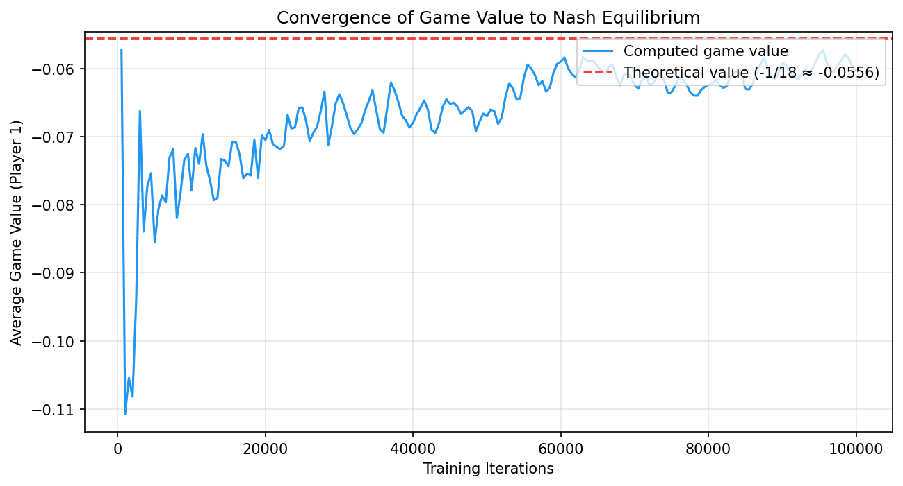

# Step 2 — Game Theory & CFR Basics

This is a condensed summary of the game theory and counterfactual regret minimization material covered in Step 2. It serves two purposes: as a quick refresher while progressing through later steps, and as a primary source for the Step 15 public report synthesis.

---

## From Single-Agent RL to Multi-Agent Strategic Interaction

Step 1 treated environments as passive — the cart-pole doesn't fight back, the lander doesn't try to crash you. The agent optimized against fixed dynamics. Step 2 introduces a fundamentally different problem: the environment includes another *strategic* decision-maker whose actions depend on yours.

This shift breaks the MDP framework. In a single-agent setting, the optimal policy is fixed — there exists a single best way to act regardless of what strategy you considered before. In a multi-agent setting, the "best" strategy depends on what the opponent does, and the opponent's best strategy depends on what you do. This circularity is the core challenge of game theory.

The formalization begins with **normal-form games** (simultaneous moves, like Rock-Paper-Scissors) and extends to **extensive-form games** (sequential moves with a tree structure, like poker). In both cases, the solution concept shifts from "optimal policy" to **Nash equilibrium** — a strategy profile where no player can improve by unilaterally changing their own strategy.

> **Read more:** Shoham, Y. & Leyton-Brown, K. (2008). *Multiagent Systems*, Chapters 3–4.
> Free: <http://www.masfoundations.org/download.html>

---

## Extensive-Form Games and Information Sets

An **extensive-form game** represents strategic interaction as a tree. Each node is a decision point for one player (or "chance" for random events like card deals). Edges represent actions, and leaves carry payoffs for each player.

The critical distinction is between **perfect** and **imperfect** information:

- **Perfect information** (chess, Go): every player sees the full game state. The game tree has no grouped nodes — each node is its own information set. Minimax and alpha-beta pruning solve these games.
- **Imperfect information** (poker, many real-world problems): players cannot observe some aspects of the state. In poker, you see your own cards but not your opponent's. This means multiple game states are *indistinguishable* to the acting player.

An **information set** groups all game states that a player cannot tell apart. At an information set, the player must choose the same strategy for all states in the group (since they cannot distinguish them). This constraint is what makes imperfect-information games fundamentally harder than perfect-information ones — you cannot simply pick the best action for each state; you must pick one action that works well *on average* across all states in the information set.

In Kuhn Poker, the information set `"2pb"` contains two game states: "I hold Queen, opponent holds Jack, history is pass-bet" and "I hold Queen, opponent holds King, history is pass-bet." The player holding Queen cannot distinguish these and must use the same strategy (call probability) for both.

> **Read more:** Shoham & Leyton-Brown (2008). *Multiagent Systems*, Chapter 5 — Extensive-form games.

---

## Minimax Theorem

The Minimax Theorem, established by John von Neumann in 1928, provides a foundational solution concept for two-player zero-sum games. It states that for every finite, two-player, zero-sum game, there exists a strategy for both players where the maximum expected loss is minimized. In other words, each player can guarantee a specific expected payoff, known as the "value of the game," regardless of the opponent's strategy. This creates a scenario where one player's optimal strategy is to maximize their minimum reward (maximin), while the opponent seeks to minimize the first player's maximum reward (minimax). When these two values equal, the game is in equilibrium. This algorithm directly relates to Nash Equilibrium: in the specific case of two-player zero-sum games, a Minimax strategy profile is equivalent to a Nash equilibrium. Discovering this Minimax solution guarantees safety against any exploitative strategy the opponent might employ.

---

## Nash Equilibrium

A **Nash equilibrium** is a strategy profile where each player's strategy is a best response to every other player's strategy. Formally, for each player $i$:

$$u_i(\sigma_i^*, \sigma_{-i}^*) \geq u_i(\sigma_i, \sigma_{-i}^*) \quad \forall \sigma_i$$

No player can improve their expected payoff by unilaterally deviating. This does not mean everyone is happy with the outcome (Prisoner's Dilemma), just that no one can do better by changing only their own strategy.

In games extended to more than two players (N-player games) or general-sum games, the properties of Nash equilibrium become significantly more complex. In these settings, finding an exact Nash equilibrium is known to be computationally intractable, often falling into the complexity class PPAD-complete. Furthermore, the equilibria lose their safety guarantee: playing a Nash strategy in a 3-player game does not protect against two opponents who might deviate from equilibrium, potentially forming temporary coalitions that exploit the third player. This dynamic necessitates entirely different evaluation and training frameworks (such as those discussed in Steps 9 and 11) since the direct equivalence between Nash and minimax optimality no longer holds.

**Key properties:**
- **Existence:** Nash (1950) proved that every finite game has at least one Nash equilibrium (possibly in mixed strategies). This is a foundational theorem but does not help with computation.
- **Uniqueness:** Games may have multiple equilibria. Kuhn Poker has a one-parameter *family* of Nash equilibria indexed by $\alpha \in [0, 1/3]$.
- **Mixed strategies:** In many games, the equilibrium requires randomization. In Kuhn Poker, the Nash equilibrium has Player 2 bluffing with Jack exactly 1/3 of the time — any other frequency is exploitable.

For 2-player zero-sum games (where one player's gain is the other's loss), Nash equilibria have a special property: they are **minimax optimal**. Playing your Nash strategy guarantees you at least the game value, regardless of what the opponent does. This is the safety guarantee that makes Nash equilibrium the baseline for poker AI.

> **Read more:** Nash, J.F. (1950). "Equilibrium points in n-person games." *PNAS*, 36(1), 48–49.

---

## Regret Matching — The Building Block

Before CFR can minimize regret across a game tree, we need a mechanism to minimize regret at a single decision point. **Regret matching** is that mechanism.

The idea: after many rounds of play, for each action $a$, compute the **cumulative regret** — how much better you would have done if you had always played $a$ instead of your actual mixed strategy. Then set your next strategy proportional to the *positive* regrets:

$$\sigma^{T+1}(a) = \begin{cases} \frac{R^{T,+}(a)}{\sum_{a'} R^{T,+}(a')} & \text{if } \sum > 0 \\ \frac{1}{|A|} & \text{otherwise} \end{cases}$$

**Convergence guarantee:** Blackwell (1956) and Hart & Mas-Colell (2000) proved that regret matching ensures average regret converges to zero at rate $O(\sqrt{T})$. In a two-player zero-sum game, if both players use regret matching at their respective decision points, the average strategy profile converges to a Nash equilibrium.

A simple example is Rock-Paper-Scissors. If you play regret matching against a fixed opponent who always plays Rock, your cumulative regret for Paper will grow (Paper beats Rock), while regret for Scissors will stay at zero. Your strategy will gradually shift toward playing Paper with increasing probability, which is the correct best response.

> **Read more:** Neller, T.W. & Lanctot, M. (2013). "An Introduction to Counterfactual Regret Minimization," Section 1–2.

---

## Counterfactual Regret Minimization (CFR)

CFR (Zinkevich et al., 2007) extends regret matching to extensive-form games. The key insight: decompose the total regret of a game strategy into **local regrets** at each information set, then minimize each local regret independently using regret matching. If each information set's regret converges to zero, the overall strategy converges to Nash equilibrium.

**The "counterfactual" part** is crucial. At each information set $I$, the regret for action $a$ is not simply "how much better $a$ would have been." It is the *counterfactual* regret — the improvement assuming the player had intentionally played to reach $I$ (reach probability = 1 for the player) but everything else (opponent strategy, chance events) stayed the same. Formally:

$$R^T(I, a) = \sum_{t=1}^{T} \pi_{-i}^t \cdot \left(v^t(I, a) - v^t(I)\right)$$

where $\pi_{-i}^t$ is the opponent's reach probability and $v^t(I, a)$ is the counterfactual value of action $a$ at $I$ on iteration $t$.

**Why opponent reach probability?** The regret at an information set matters more when the opponent is likely to have played such that we reach that information set. Weighting by $\pi_{-i}$ ensures that regret is proportional to the frequency with which the information set is "relevant" to the game outcome.

**Algorithm (vanilla CFR with chance sampling):**

1. Initialize all cumulative regrets and strategy sums to zero
2. For $T$ iterations:
   a. Sample a random card deal (chance sampling)
   b. Recursively traverse the game tree from root
   c. At each info set, compute strategy via regret matching
   d. For each action, recurse into the subtree (negating utility for zero-sum)
   e. Update cumulative regrets weighted by opponent reach probability
   f. Accumulate strategy weighted by player's own reach probability
3. Output the **average** strategy (not the final iteration's strategy)

**Convergence:** The average strategy profile converges to Nash equilibrium at rate $O(1/\sqrt{T})$ for exploitability, where $T$ is the number of iterations (Theorem 4, Zinkevich et al. 2007). The convergence bound is:

$$\text{exploit}(\bar{\sigma}^T) \leq O\left(\Delta\sqrt{|I|/T}\right)$$

where $\Delta$ is the maximum payoff range and $|I|$ is the number of information sets.

> **Read more:** Zinkevich, M. et al. (2007). "Regret Minimization in Games with Incomplete Information." *NeurIPS*.
> Neller & Lanctot (2013). Sections 3–5 (full Kuhn Poker walkthrough).

---

## Kuhn Poker — The Simplest Testbed

Kuhn Poker (Kuhn, 1950) is the standard minimal example for imperfect-information game algorithms. With only 3 cards, 2 players, and 12 information sets, it is small enough to solve analytically yet rich enough to exhibit the key phenomena: bluffing, information asymmetry, mixed equilibria.

**Rules:** 3 cards {J, Q, K}, each player antes 1 chip, each receives 1 private card. Player 0 acts first: pass or bet. Player 1 responds: pass or bet. If Player 0 passed and Player 1 bet, Player 0 gets to respond again. Showdown with higher card winning.

**Nash equilibrium (parameterized by $\alpha \in [0, 1/3]$):**

- **Player 0 with J:** Bet (bluff) with probability $\alpha$. If facing bet after passing, always fold.
- **Player 0 with Q:** Always pass. If facing bet after passing, call with probability $1/3 + \alpha$.
- **Player 0 with K:** Bet with probability $3\alpha$. If facing bet after passing, always call.
- **Player 1 with J:** After pass, bet (bluff) with probability 1/3. After bet, always fold.
- **Player 1 with Q:** After pass, always pass. After bet, call with probability $1/3 + \alpha$.
- **Player 1 with K:** Always bet, always call.

**Game value:** Player 0's expected payoff at Nash is $-1/18 \approx -0.0556$. Player 0 has a structural disadvantage from acting first.

**Why Kuhn matters:** Every key concept in imperfect-information game solving appears here in miniature — bluffing (J bets despite being worst card), information asymmetry (Player 2 sees Player 1's action before deciding), mixed strategies (exact 1/3 bluff frequency), indifference (Q is indifferent between call and fold at certain info sets). If your algorithm cannot solve Kuhn correctly, it cannot solve anything.

> **Read more:** Kuhn, H.W. (1950). "Simplified Two-Person Poker." *Contributions to the Theory of Games*, Vol. 1.

---

## Exploitability — Measuring Distance from Nash

**Exploitability** is the primary evaluation metric for strategies in imperfect-information games. It measures how much a strategy can be exploited by a worst-case opponent:

$$\text{exploit}(\sigma) = BR_0(\sigma_1) + BR_1(\sigma_0)$$

where $BR_i(\sigma_{-i})$ is the expected payoff of player $i$'s best response to the opponent's strategy.

At Nash equilibrium, exploitability is exactly zero — neither player can improve by deviating. For approximate Nash equilibria, exploitability quantifies the approximation quality.

**Best response computation** in imperfect-information games is subtle. The best-responding player must choose the same action at all states within an information set (they cannot distinguish them). A naive approach that picks the best action per game state (using knowledge of the opponent's private card) computes an "oracle" value, not a true best response. For Kuhn Poker, the correct approach enumerates all 2⁶ = 64 pure strategies and evaluates each.

**Convergence rate:** For vanilla CFR, exploitability decreases as $O(1/\sqrt{T})$. On a log-log plot, this appears as a line with slope $\approx -0.5$. Our measured slope was $-0.489$, confirming theoretical predictions.

**Why not just game value?** A strategy can achieve the correct game value while still being exploitable. Consider a Kuhn strategy where Player 1 always bluffs with J (instead of 1/3 of the time). The average game value might be close to $-1/18$, but the strategy is highly exploitable — Player 0 can always call with Q and profit. Exploitability catches this; game value alone does not.

> **This metric recurs throughout the thesis.** Steps 7–8 (opponent modeling, safe exploitation) use exploitability as the primary measure. Step 14 builds a general evaluation framework around it.

---

## Connections to Step 1 and Forward Pointers

**Local optimization → global convergence.** In Step 1, DQN minimizes TD error at each state independently, yet the overall Q-function converges to optimal. In Step 2, CFR minimizes regret at each information set independently, yet the overall strategy converges to Nash. Both demonstrate the same principle: local updates, when properly structured, achieve global objectives.

**Strategy accumulation ≈ experience replay.** CFR outputs the *average* strategy, not the last iteration's strategy. This averaging stabilizes convergence, just as experience replay in DQN stabilizes learning by preventing the agent from over-fitting to recent transitions. Both are memory mechanisms that smooth out noise.

**Forward:** Step 2 covers *full tree traversal* CFR — every information set is visited every iteration. For larger games, this is intractable. Step 3 introduces Monte Carlo CFR (MCCFR), which samples parts of the tree, trading exactness for scalability. Step 4 adds game abstraction, reducing the game size. Step 5 replaces tabular strategies with neural networks.

**Open questions:**
- Why does the *average* strategy converge but not the current strategy? (Intuition: the current strategy overshoots corrections, while averaging dampens oscillations — same reason as Polyak averaging in optimization.)
- CFR is proven for 2-player zero-sum games. What about $N$-player or general-sum? (Steps 9 and 11 explore this frontier.)
- How do we handle games too large for full tree traversal? (Step 3 — Monte Carlo CFR.)

> **Read more:** Bowling, M. et al. (2015). "Heads-up limit hold'em poker is solved." *Science*, 347(6218), 145–149.
> This paper used CFR+ (a variant) to solve heads-up limit Texas Hold'em — the first non-trivial imperfect-information game to be essentially solved.

---

## Empirical Visualizations

To validate the theoretical guarantees of CFR and its application to Kuhn Poker, several metrics were tracked during the training process:

**Game Value Convergence**

*This graph illustrates how the empirical average game value approaches the theoretical expectation of $-1/18$ as CFR iterations increase, confirming the strategy's stabilization.*

**Exploitability Convergence**

*Tracking exploitability over time shows the $O(1/\sqrt{T})$ convergence rate. The log-log plot demonstrates a linear decay, validating that the average strategy forms an approximate Nash equilibrium.*

**Strategy Analysis**

*This visualization breaks down the specific action probabilities at various information sets, demonstrating the emergence of the optimal bluffing and calling frequencies dictated by the Kuhn Poker Nash equilibrium family.*
