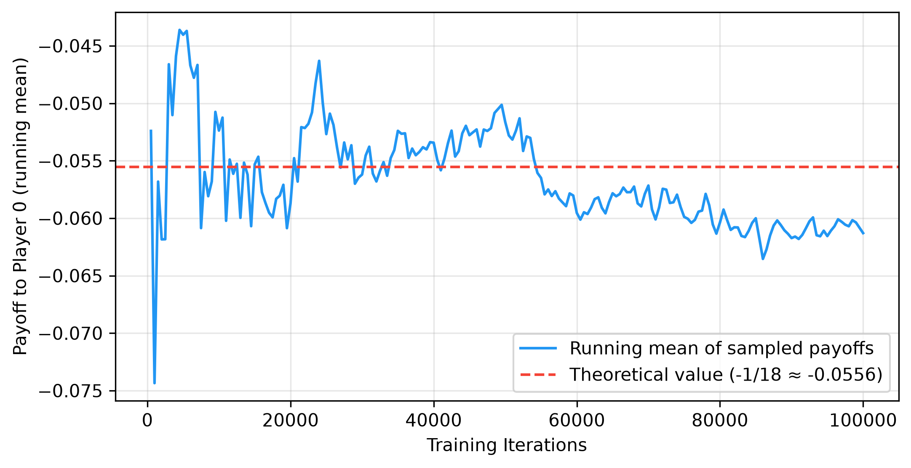
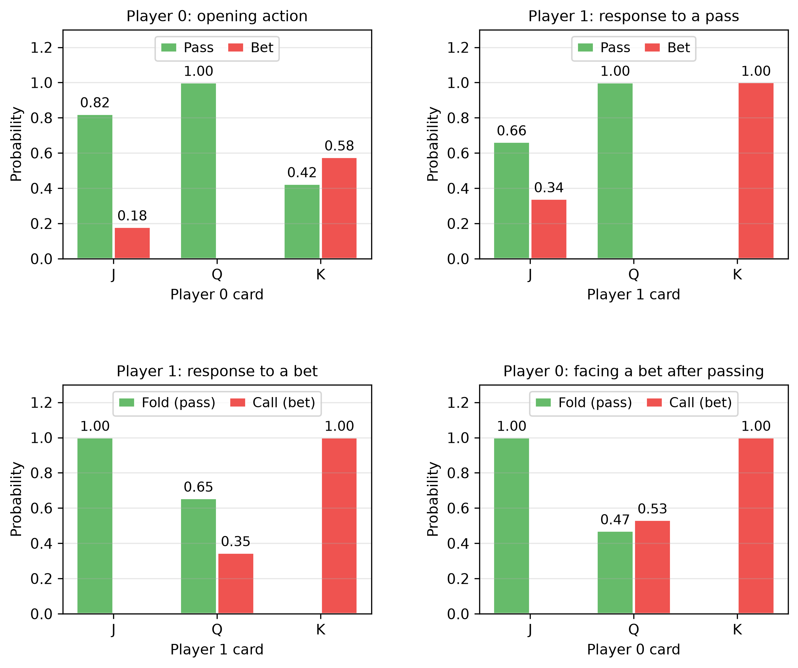

# Chapter 2 — Game Theory & CFR Basics

---

## From Single-Agent RL to Multi-Agent Strategic Interaction

Chapter 1 treated environments as passive — the cart-pole doesn't fight back, the lander doesn't try to crash you. The agent optimized against fixed dynamics. Chapter 2 introduces a fundamentally different problem: the environment includes another *strategic* decision-maker whose actions depend on yours.

In a multi-agent setting, the "best" strategy depends on what the opponent does, and the opponent's best strategy depends on what you do. This circularity is the core challenge of game theory, and it shifts the solution concept from "optimal policy" to **Nash equilibrium**.[^shoham2008]

---

## Extensive-Form Games and Information Sets

An **extensive-form game** represents strategic interaction as a tree: each node is a decision point for one player (or "chance" for random events like card deals), edges are actions, and leaves carry payoffs. In **perfect-information** games (chess, Go) each node is its own information set, and minimax with alpha-beta pruning solves them. In **imperfect-information** games (poker) several game states are *indistinguishable* to the acting player.

An **information set** (Section 1.4) groups the game states a player cannot tell apart, so the player must use the same strategy for all of them. This is what makes imperfect-information games fundamentally harder: you must pick one action that works well *on average* across all states in the information set.

In Kuhn Poker, the information set `"2pb"` contains two game states: "I hold Queen, opponent holds Jack, history is pass-bet" and "I hold Queen, opponent holds King, history is pass-bet." The player holding Queen cannot distinguish these and must use the same strategy (call probability) for both.[^shoham2008]

---

## Minimax Theorem

The Minimax Theorem (von Neumann, 1928)[^vonneumann1928] states that in every finite two-player zero-sum game, with mixed strategies, the payoff a player can guarantee (maximin) equals the payoff the opponent can hold them to (minimax); this common value is the "value of the game." In two-player zero-sum games a minimax strategy profile is equivalent to a Nash equilibrium, so discovering it guarantees safety against any exploitative strategy the opponent might employ.

---

## Nash Equilibrium

A **Nash equilibrium** is a strategy profile where each player's strategy is a best response to every other player's strategy. Formally, for each player $i$:

$$u_i(\sigma_i^*, \sigma_{-i}^*) \geq u_i(\sigma_i, \sigma_{-i}^*) \quad \forall \sigma_i$$

No player can improve their expected payoff by unilaterally deviating. This does not mean everyone is happy with the outcome (Prisoner's Dilemma), just that no one can do better by changing only their own strategy. Nash (1950)[^nash1950] proved that every finite game has at least one Nash equilibrium (possibly in mixed strategies) — a foundational theorem that does not help with computation.

For 2-player zero-sum games (where one player's gain is the other's loss), Nash equilibria are **minimax optimal**: playing your Nash strategy guarantees you at least the game value, regardless of what the opponent does. This is the safety guarantee that makes Nash equilibrium the baseline for poker AI.

In N-player or general-sum games, computing a Nash equilibrium is PPAD-complete, even for two-player general-sum games, and is therefore believed to be intractable.[^daskalakis2009][^chen2009] Furthermore, the equilibria lose their safety guarantee: playing a Nash strategy in a 3-player game does not protect against two opponents who might deviate from equilibrium, potentially forming temporary coalitions that exploit the third player.[^szafron2013] This dynamic necessitates entirely different evaluation and training frameworks (such as those discussed in Chapters 9 and 11) since the direct equivalence between Nash and minimax optimality no longer holds.

---

## Regret Matching — The Building Block

Before CFR can minimize regret across a game tree, we need a mechanism to minimize regret at a single decision point. **Regret matching** is that mechanism.

The idea: after many rounds of play, for each action $a$, compute the **cumulative regret** — how much better you would have done if you had always played $a$ instead of your actual mixed strategy. Then set your next strategy proportional to the *positive* regrets:

$$\sigma^{T+1}(a) = \begin{cases} \frac{R^{T,+}(a)}{\sum_{a'} R^{T,+}(a')} & \text{if } \sum > 0 \\ \frac{1}{|A|} & \text{otherwise} \end{cases}$$

**Convergence guarantee:** Blackwell (1956)[^blackwell1956] and Hart & Mas-Colell (2000)[^hartmascolell2000] proved that regret matching ensures average regret converges to zero at rate $O(1/\sqrt{T})$ (cumulative regret grows no faster than $O(\sqrt{T})$). In a two-player zero-sum game, if both players use regret matching at their respective decision points, the average strategy profile converges to a Nash equilibrium.

A simple example is Rock-Paper-Scissors. If you play regret matching against a fixed opponent who always plays Rock, your cumulative regret for Paper will grow (Paper beats Rock), while regret for Scissors turns negative and has no effect on the strategy. The strategy quickly moves to Paper, the correct best response.[^neller2013]

---

## Counterfactual Regret Minimization (CFR)

CFR (Zinkevich et al., 2007)[^zinkevich2007] extends regret matching to extensive-form games: it decomposes the total regret into **local regrets** at each information set and minimizes each independently with regret matching. If each information set's average regret converges to zero, the overall *average* strategy converges to a Nash equilibrium.

**The "counterfactual" part** is crucial. At each information set $I$, the regret for action $a$ is not simply "how much better $a$ would have been." It is the *counterfactual* regret — the improvement assuming the player had intentionally played to reach $I$ (reach probability = 1 for the player) but everything else (opponent strategy, chance events) stayed the same. Formally:

$$R^T(I, a) = \sum_{t=1}^{T} \pi_{-i}^t \cdot \left(v^t(I, a) - v^t(I)\right)$$

where $\pi_{-i}^t$ is the opponent's reach probability and $v^t(I, a)$ is the counterfactual value of action $a$ at $I$ on iteration $t$.

**Why opponent reach probability?** The regret at an information set matters more when the opponent is likely to have played such that we reach that information set. Weighting by $\pi_{-i}$ ensures that regret is proportional to the frequency with which the information set is "relevant" to the game outcome.

In the implementation used here (chance sampling, as in Neller & Lanctot, 2013[^neller2013]), each iteration samples one card deal, traverses the tree with regret matching at every information set, and updates regrets weighted by the opponent's reach and strategy sums weighted by the player's own. The output is the **average** strategy, not the final iteration's.

**Convergence:** the exploitability of the average strategy falls as $O(1/\sqrt{T})$ in the number of iterations $T$, with a bound linear in the number of information sets (Theorem 4, Zinkevich et al. 2007);[^zinkevich2007] a tighter bound was proved later.[^lanctot2009]

---

## The Mathematics of Poker

Poker combines three sources of complexity that rarely co-occur: **hidden information** (the same information set can correspond to many underlying game states), **stochastic elements** (card deals add chance nodes, so a strategy must account for all possible deals) and **strategic deception** (a player who always bets with strong hands and checks with weak ones is trivially exploitable, so Nash equilibrium requires **randomized bluffing at mathematically precise frequencies**, which Chen & Ankenman derive analytically for toy games[^chen2006]).

---

## Kuhn Poker — The Simplest Testbed

Kuhn Poker (Kuhn, 1950) is the standard minimal example for imperfect-information game algorithms. With only 3 cards, 2 players, and 12 information sets, it is small enough to solve analytically yet rich enough to exhibit the key phenomena: bluffing, information asymmetry, mixed equilibria.

**Rules:** 3 cards {J, Q, K}, each player antes 1 chip, each receives 1 private card. Player 0 acts first: pass or bet. Player 1 responds: pass or bet. If Player 0 passed and Player 1 bet, Player 0 gets to respond again. Showdown with higher card winning.

**Nash equilibrium (parameterized by $\alpha \in [0, 1/3]$):**

- **Player 0 with J:** Bet (bluff) with probability $\alpha$. If facing bet after passing, always fold.
- **Player 0 with Q:** Always pass. If facing bet after passing, call with probability $1/3 + \alpha$.
- **Player 0 with K:** Bet with probability $3\alpha$. If facing bet after passing, always call.
- **Player 1 with J:** After pass, bet (bluff) with probability 1/3. After bet, always fold.
- **Player 1 with Q:** After pass, always pass. After bet, call with probability 1/3.
- **Player 1 with K:** Always bet, always call.

(Player 1's strategy is the same in every equilibrium; only Player 0's depends on $\alpha$. The strategy CFR reaches is shown in the last figure under "Empirical Visualizations".)

**Game value:** Player 0's expected payoff at Nash is $-1/18 \approx -0.0556$. Player 0 has a structural disadvantage from acting first. The first figure under "Empirical Visualizations" shows how training approaches this value.

**Why Kuhn matters:** every key concept in imperfect-information game solving appears here in miniature. If your algorithm cannot solve Kuhn correctly, it cannot solve anything.[^kuhn1950]

---

## Exploitability — Measuring Distance from Nash

**Exploitability** is the primary evaluation metric for strategies in imperfect-information games. It measures how much a strategy can be exploited by a worst-case opponent:

$$\text{exploit}(\sigma) = BR_0(\sigma_1) + BR_1(\sigma_0)$$

where $BR_i(\sigma_{-i})$ is the expected payoff of player $i$'s best response to the opponent's strategy. In a two-player zero-sum game this sum is also called NashConv; OpenSpiel reports half of it as "exploitability", so the two conventions differ by a factor of 2. At Nash equilibrium, exploitability is exactly zero; for approximate Nash equilibria, it quantifies the approximation quality.

**Best response computation** in imperfect-information games is subtle: the best-responding player must choose the same action at all states within an information set. Picking the best action per game state (using knowledge of the opponent's private card) computes an "oracle" value, not a true best response. For Kuhn Poker, enumerating all 2⁶ = 64 pure strategies suffices.

**Convergence rate:** In theory, the exploitability of CFR's average strategy decreases as $O(1/\sqrt{T})$[^zinkevich2007] (see the second figure under "Empirical Visualizations"). On a log-log plot, this appears as a line with slope $\approx -0.5$. Over five seeds, with checkpoints from 100 to 100,000 iterations, the measured slope is $-0.52 \pm 0.02$, consistent with the $O(1/\sqrt{T})$ bound, which is an upper limit rather than a prediction of the exact rate.

**Why not just game value?** A strategy can achieve the correct game value while still being exploitable. Consider a Kuhn strategy where Player 1 always bluffs with J (instead of 1/3 of the time). The average game value might be close to $-1/18$, but the strategy is highly exploitable — Player 0 can always call with Q and profit. Exploitability catches this; game value alone does not.

> **This metric recurs throughout the thesis.** Chapters 7–8 (opponent modeling, safe exploitation) use exploitability as the primary measure. It is also the starting point of the thesis's evaluation methodology (Contribution #3).

---

## Connections to Chapter 1 and Forward Pointers

**Local optimization → global convergence.** In Chapter 1, Q-learning reduces the TD error one state at a time, yet in the tabular case the Q-function provably converges to the optimum. In Chapter 2, CFR minimizes regret at each information set independently, yet the overall *average* strategy converges to Nash. Both demonstrate the same principle: local updates, when properly structured, achieve global objectives.

**Strategy accumulation ≈ experience replay.** CFR outputs the *average* strategy, not the last iteration's strategy. This averaging stabilizes convergence, just as experience replay in DQN stabilizes learning by preventing the agent from over-fitting to recent transitions.

**Forward:** for larger games even chance-sampled CFR is too expensive;[^bowling2015] Chapter 3 samples parts of the tree (Monte Carlo CFR), Chapter 4 reduces the game size through abstraction, and Chapter 5 replaces tabular strategies with neural networks.

---

## Empirical Visualizations

To validate the theoretical guarantees of CFR and its application to Kuhn Poker, several metrics were tracked during the training process:

<!-- Source footnotes. Definitions may sit anywhere at top level; keeping them
     together here keeps the prose readable and the EN/BG pair easy to compare. -->

[^vonneumann1928]: von Neumann, J. (1928). "Zur Theorie der Gesellschaftsspiele." *Mathematische Annalen*, 100(1), 295-320. English translation: "On the Theory of Games of Strategy," in *Contributions to the Theory of Games*, Vol. 4 (1959), 13-42.

[^nash1950]: Nash, J.F. (1950). "Equilibrium Points in N-Person Games." *Proceedings of the National Academy of Sciences*, 36(1), 48-49.

[^blackwell1956]: Blackwell, D. (1956). "An Analog of the Minimax Theorem for Vector Payoffs." *Pacific Journal of Mathematics*, 6(1), 1-8.

[^hartmascolell2000]: Hart, S. & Mas-Colell, A. (2000). "A Simple Adaptive Procedure Leading to Correlated Equilibrium." *Econometrica*, 68(5), 1127-1150.

[^zinkevich2007]: Zinkevich, M., Johanson, M., Bowling, M. & Piccione, C. (2007). "Regret Minimization in Games with Incomplete Information." *Advances in Neural Information Processing Systems 20*, 1729-1736.

[^shoham2008]: Shoham, Y. & Leyton-Brown, K. (2008). *Multiagent Systems: Algorithmic, Game-Theoretic, and Logical Foundations*. Ch. 3 (games in normal form; §3.3 best response and Nash equilibrium, §3.4.1 maxmin and minmax strategies); §4.1 (computing Nash equilibria of two-player zero-sum games); Ch. 5 (extensive-form games; §5.2 imperfect information and information sets, §5.2.3 the sequence form); §7.5 "No-regret learning and universal consistency". Free: <http://www.masfoundations.org/download.html>

[^neller2013]: Neller, T.W. & Lanctot, M. (2013). "An Introduction to Counterfactual Regret Minimization," §2–3 (version of 9 July 2013).

[^chen2006]: Chen, B. & Ankenman, J. (2006). *The Mathematics of Poker*. ConJelCo — analytical Nash derivations for toy poker games.

[^kuhn1950]: Kuhn, H.W. (1950). "Simplified Two-Person Poker." *Contributions to the Theory of Games*, Vol. 1, Annals of Mathematics Studies 24, Princeton University Press, 97–103.

[^bowling2015]: Bowling, M., Burch, N., Johanson, M. & Tammelin, O. (2015). "Heads-up limit hold'em poker is solved." *Science*, 347(6218), 145–149. Used CFR+ to solve heads-up limit Texas Hold'em — the first non-trivial imperfect-information game played competitively by humans to be (essentially weakly) solved.

[^lanctot2009]: Lanctot, M., Waugh, K., Zinkevich, M. & Bowling, M. (2009). "Monte Carlo Sampling for Regret Minimization in Extensive Games." *Advances in Neural Information Processing Systems 22*, 1078–1086.

[^daskalakis2009]: Daskalakis, C., Goldberg, P. W. & Papadimitriou, C. H. (2009). "The Complexity of Computing a Nash Equilibrium." *SIAM Journal on Computing*, 39(1), 195–259.

[^chen2009]: Chen, X., Deng, X. & Teng, S.-H. (2009). "Settling the Complexity of Computing Two-Player Nash Equilibria." *Journal of the ACM*, 56(3), 1–57.

[^szafron2013]: Szafron, D., Gibson, R. & Sturtevant, N. (2013). "A Parameterized Family of Equilibrium Profiles for Three-Player Kuhn Poker." *Proc. AAMAS 2013*, 247–254. In three-player Kuhn poker one player can transfer utility from one opponent to the other while staying within the equilibrium family.
