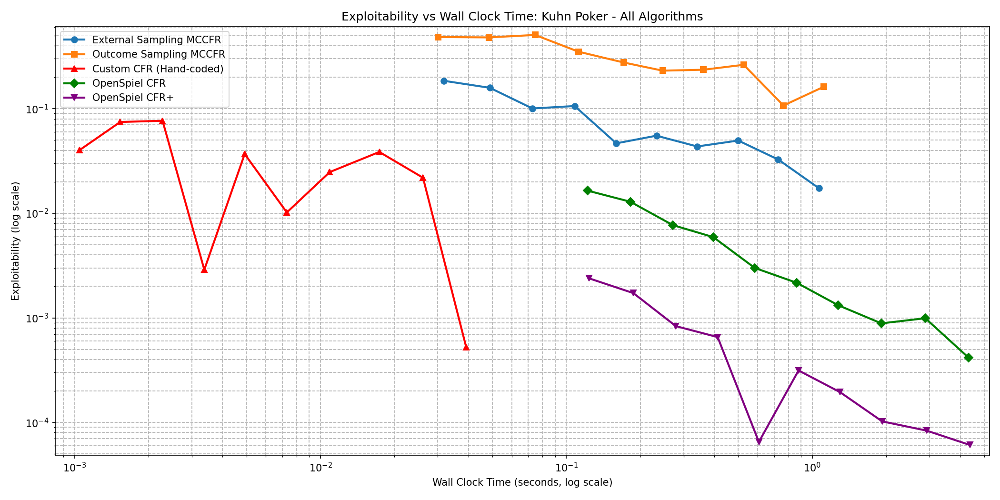
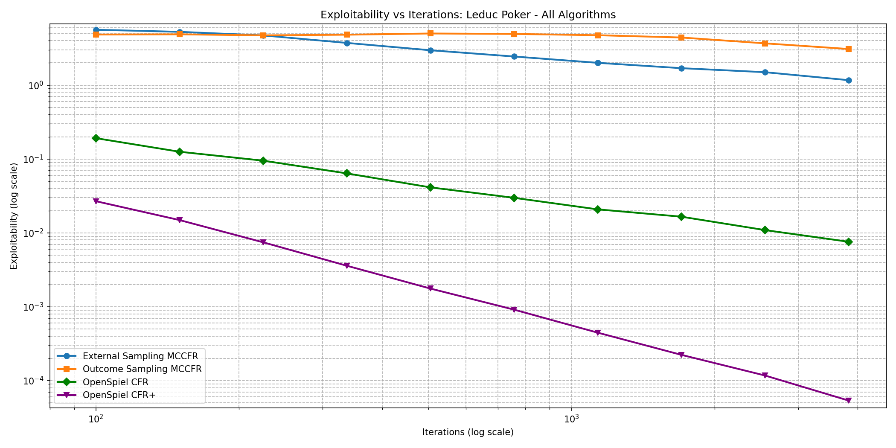
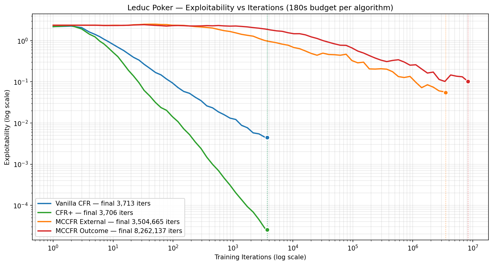
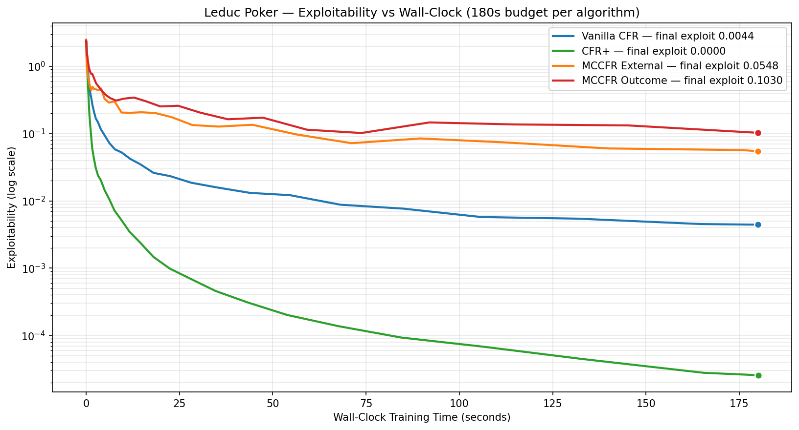

<!--
OFFICIAL PhD TITLE (keep consistent across all documents):
EN: Research on the possibilities for applying Artificial Intelligence in computer games
BG: Изследване на възможностите за приложение на изкуствения интелект в компютърни игри
-->

# Стъпка 03 — Варианти на CFR и Монте Карло методи: Доклад за реализацията

**Среда:** Април 2026
**Игра:** Покер Ледюк (Leduc Poker, 6 карти, 2-ма играчи, 2 рунда на залагане)
**Алгоритми:** Стандартен CFR, CFR+, MCCFR External Sampling, MCCFR Outcome Sampling
**Цели:** CFR+ експлоатируемост < 0,001 в рамките на 180 s · кръстосана проверка спрямо OpenSpiel · log-log наклон ≈ −0,5 за MCCFR
**Статус:** Всички цели постигнати ✓

---

## 1. Какво беше разработено

Две линии на работа: **фаза на проучване**, използваща еталонните решители на OpenSpiel за изграждане на интуиция и установяване на истинни базови стойности, последвана от **реализация от нулата** на всички четири алгоритъма, написани на ръка на Python + само NumPy.

**Структура на кода:**

```
implementation/step03/
├── cfr/
│   ├── leduc_poker.py             # Пълен двигател на играта (6 карти, 2 рунда, обща карта)
│   ├── info_set_node.py           # Съхранение на съжаления и стратегии по информационно множество
│   ├── cfr_trainer.py             # Стандартен CFR (пълно обхождане, буферирани съжаления)
│   ├── cfrplus_trainer.py         # CFR+ (ограничаване отдолу + линейна средна + редуване)
│   ├── mccfr_external_trainer.py  # External Sampling MCCFR
│   ├── mccfr_outcome_trainer.py   # Outcome Sampling MCCFR (ε-on-policy + IS)
│   ├── train.py                   # Входна точка за обучение на единичен алгоритъм
│   └── train_all_timed.py         # Еталонен тест за 180 s реално време
├── evaluate/
│   ├── best_response.py           # Най-добър отговор с ограничение по информационно множество
│   ├── exploitability.py          # BR₀ + BR₁ точна експлоатируемост
│   └── convergence.py             # Логер със геометрично разпределени снимки
├── exploration/
│   ├── implDayOne1.py             # Сравнение на пет алгоритъма от OpenSpiel върху Кун
│   ├── leduc_comparison.py        # Сравнение на четири алгоритъма от OpenSpiel върху Ледюк
│   └── leduc_race.py              # 5-минутно състезание в реално време
├── compare_openspiel.py           # Кръстосана проверка спрямо решителите на OpenSpiel
└── utils/plotting.py              # Генериране на фигури
```

---

## 2. Двигател на играта Покер Ледюк

Пълна имплементация, съвпадаща със семантиката на OpenSpiel: 6 карти ({J, Q, K} × 2 цвята), два рунда на залагане с разкрита обща карта между тях, действия отказ/плащане/повишение, фиксирани размери на залозите (2 в рунд 1, 4 в рунд 2), максимум две повишения на рунд. Подреждане на ръцете на базата на двойка: скрита карта, съвпадаща с общата, бие всяка висока карта. Изброява всички 120 пермутации на раздаването за точно изчисление на очакваната стойност.

---

## 3. Реализации на алгоритмите

### 3.1 Стандартен CFR

Пълно обхождане на дървото с извадка от случайността по всичките 120 раздавания на итерация. Актуализациите на съжаленията се буферират по информационно множество и се прилагат атомарно в края на обхождането на всяко раздаване, за да се избегне дрейф на стратегията в средата на итерацията.

### 3.2 CFR+

Три модификации на стандартния CFR, всяка локализирана. Стъпката с ограничаването отдолу на съжаленията е ключовата промяна:

```python
# cfrplus_trainer.py — ограничаване отдолу на съжаленията (обрязване в стил ReLU)
for info_set, deltas in regret_buffer.items():
    node = node_map[info_set]
    for a in range(node.num_actions):
        node.regret_sum[a] = max(node.regret_sum[a] + deltas[a], 0.0)
```

Линейното осредняване на стратегиите претегля итерация `t` със самото `t` в текущата средна; редуващите се актуализации напредват само с един играч на преминаване (играч 0 при нечетни итерации, играч 1 при четни).

### 3.3 MCCFR External Sampling

Взема извадка от едно раздаване на итерация. Във възлите на обхождащия играч се изследват всички действия; във възлите на опонента се взема извадка от едно действие от текущата стратегия на опонента:

```python
def external_cfr(state, update_player):
    if state.is_terminal():
        return state.get_utility(update_player)

    player = state.current_player()
    strategy = get_strategy(state.info_set(player))

    if player == update_player:
        # изследвай ВСИЧКИ действия (както при стандартния CFR)
        values = [external_cfr(state.apply(a), update_player)
                  for a in legal_actions]
        node_value = sum(strategy[a] * values[a] for a in legal_actions)
        for a in legal_actions:
            regret[info_set][a] += values[a] - node_value
        return node_value
    else:
        # ВЗЕМИ ИЗВАДКА от едно действие на опонента от текущата стратегия
        sampled_action = sample(strategy)
        return external_cfr(state.apply(sampled_action), update_player)
```

Цена на итерация ≈ 42 възела (срещу 20 400 при пълно обхождане).

### 3.4 MCCFR Outcome Sampling

Взема извадка от една траектория от корен до терминал. Във възлите на обхождащия играч действията се теглят от смес ε-on-policy (ε = 0,6: равномерно с вероятност ε, иначе текущата стратегия). Актуализациите на съжалението се коригират чрез извадка по важност — съотношението между истинската вероятност за достигане и вероятността за извадка — което запазва свойството на неизместен оценител. Цена на итерация ≈ 5,5 възела.

### 3.5 Оценител на експлоатируемостта

Итеративен най-добър отговор с ограничение по информационно множество: за всеки играч изчислява оптималната контрастратегия при условие, че отговарящият трябва да играе еднакво действие по всички състояния в едно информационно множество. Връща `BR₀(σ₁) + BR₁(σ₀)` като точна експлоатируемост.

---

## 4. Фаза на проучване (референция OpenSpiel)

### 4.1 Покер на Кун — 5000 итерации

Всички четири алгоритъма от OpenSpiel плюс персонализираният CFR от Стъпка 02, изпълнени за проверка на изправността при малък мащаб.

| Алгоритъм | Експлоатируемост | Време |
|-----------|------------------|-------|
| Персонализиран CFR (Стъпка 02) | ~3,5×10⁻⁴ | < 1 s |
| OpenSpiel CFR | ~1,5×10⁻³ | ~2 s |
| CFR+ | ~3,0×10⁻⁴ | ~2 s |
| External Sampling MCCFR | ~4×10⁻³ | ~1 s |
| Outcome Sampling MCCFR | ~2,5×10⁻² | ~1 s |




Всички алгоритми достигат почти Наш в рамките на секунди; разграничението е академично на този мащаб.

### 4.2 Покер Ледюк — 5000 итерации

| Алгоритъм | Експлоатируемост @5k | Време |
|-----------|---------------------:|------:|
| CFR+ | ~5,4×10⁻⁵ | ~859 s |
| Стандартен CFR | ~7,6×10⁻³ | ~747 s |
| External Sampling MCCFR | ~1,17 | ~7 s |
| Outcome Sampling MCCFR | ~3,08 | ~5 s |




На итерация методите с пълно обхождане доминират с 4–5 порядъка; в реално време разликата се свива, но не се затваря при дървета с размера на Ледюк.

---

## 5. Еталонен тест — 180 s реално време

`train_all_timed.py` изпълнява всяка персонализирана имплементация при общ бюджет от 180 секунди със геометрично разпределени снимки. Това е честното сравнение за компромиса дисперсия–скорост.

| Алгоритъм | Итерации | Крайна експлоатируемост | Инф. множества |
|-----------|---------:|------------------------:|---------------:|
| Стандартен CFR | 3713 | 4,4×10⁻³ | 936 |
| CFR+ | 3706 | **2,6×10⁻⁵** | 936 |
| MCCFR External | 3 504 665 | 5,5×10⁻² | 936 |
| MCCFR Outcome | 8 262 137 | 1,0×10⁻¹ | 936 |





CFR+ достига почти точно Наш (2,6×10⁻⁵) за 3 минути — над 150× по-добре от стандартния CFR, въпреки че изпълнява само пределно по-малко итерации. И двата варианта на MCCFR, въпреки милионите итерации, остават 3–4 порядъка по-зле при тази големина на играта, както предсказва анализът на компромиса дисперсия–скорост в резюмето.

---

## 6. Кръстосана проверка спрямо OpenSpiel

И двете имплементации с пълно обхождане бяха проверени спрямо еталонните решители на OpenSpiel при общ бюджет от 500 итерации.

| Алгоритъм | Наш (500 итер.) | OpenSpiel (500 итер.) | Съвпадение |
|-----------|----------------:|----------------------:|:----------:|
| Стандартен CFR | 0,020 | 0,022 | ✓ |
| CFR+ | 8,6×10⁻⁴ | 9,4×10⁻⁴ | ✓ |

Малките разлики възникват от подредбата на раздаванията и случайните семена; и двата клонят към същото Равновесие на Наш в границите на шума.

---

## 7. Възпроизвеждане

```bash
# От корена на хранилището, с активирано .venv:

# Обучение на единичен алгоритъм (конфигурируем в train.py):
python implementation/step03/cfr/train.py

# Изпълнение на 180 s еталонен тест за всичките четири алгоритъма:
python implementation/step03/cfr/train_all_timed.py

# Проучване — референтни сравнения с OpenSpiel:
python implementation/step03/exploration/implDayOne1.py      # Кун
python implementation/step03/exploration/leduc_comparison.py # Ледюк, по итерации
python implementation/step03/exploration/leduc_race.py       # Ледюк, 5-мин. реално време

# Кръстосана проверка персонализиран срещу OpenSpiel:
python implementation/step03/compare_openspiel.py
```

*Генерираните фигури са в `deliverables/reports/step03/figures/`.*
