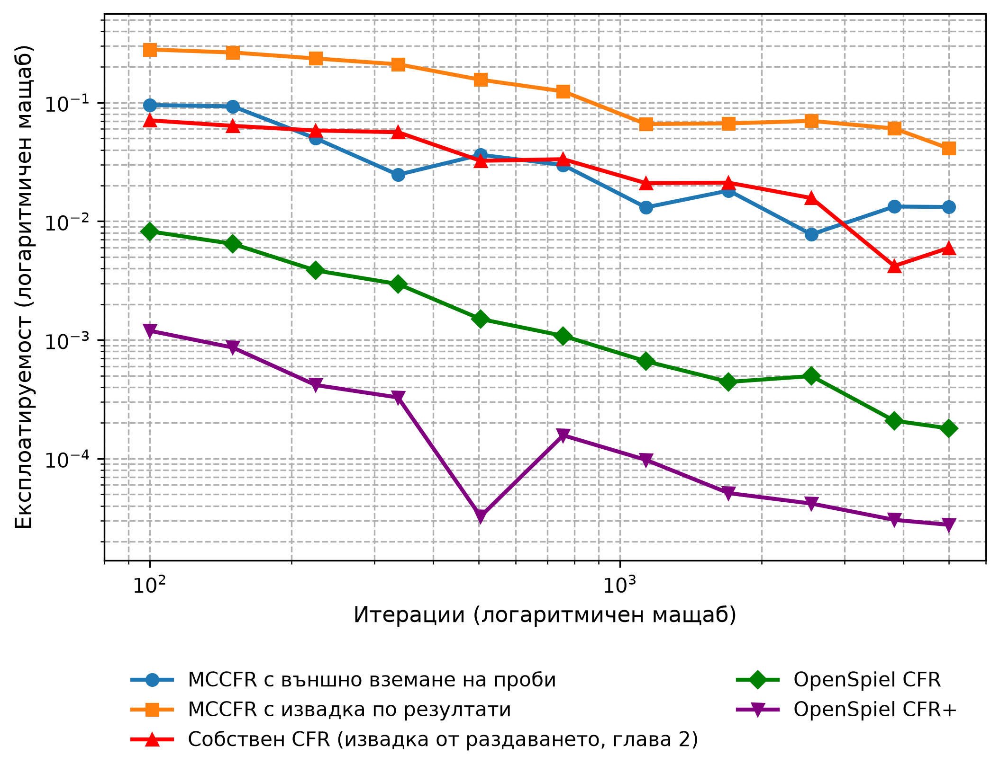
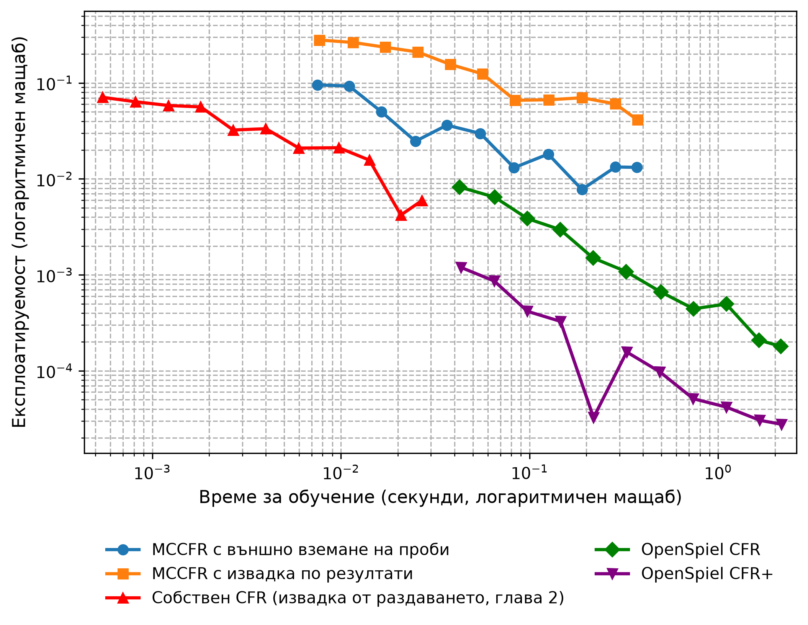
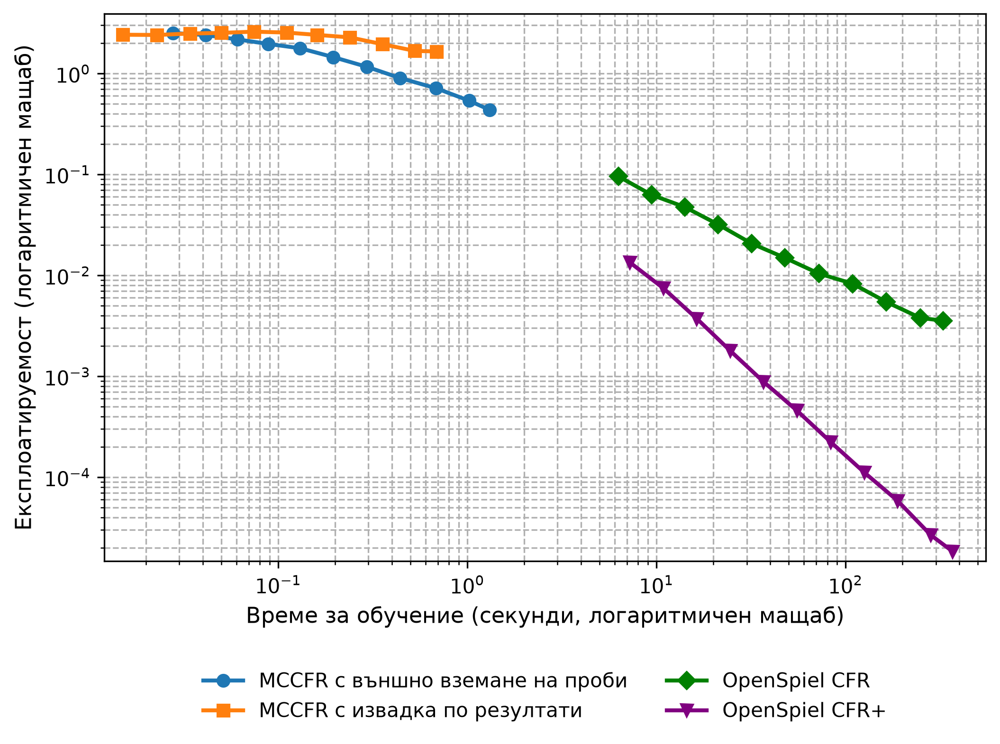
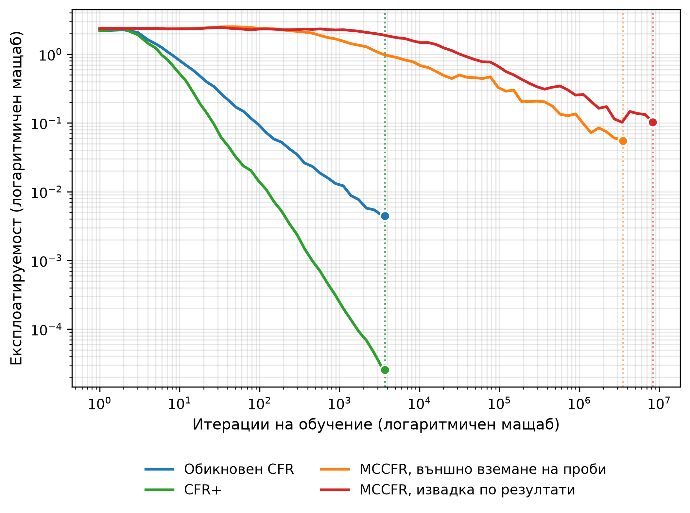

<!--
OFFICIAL PhD TITLE (keep consistent across all documents):
EN: Research on the possibilities for applying Artificial Intelligence in computer games
BG: Изследване на възможностите за приложение на изкуствения интелект в компютърни игри
-->

# Глава 03 - Варианти на CFR и методи на Монте Карло: Доклад за реализацията

**Среда:** април 2026 г.  
**Игра:** Ледюк покер (6 карти, 2 играчи, 2 рунда на залагане)  
**Алгоритми:** обикновен вариант на CFR, CFR+, MCCFR с външно вземане на проби, MCCFR с извадка по резултати  
**Цели:** експлоатируемост на CFR+ < 0.001 в рамките на ≤ 180 s · кръстосана проверка спрямо OpenSpiel · наклон в лог-лог мащаб ≈ −0.5 за MCCFR  
**Статус:** Всички цели са постигнати ✓

---

## 1. Разработени елементи

Две направления на работа: **фаза на изследване**, използваща референтните решаващи програми на OpenSpiel за изграждане на интуиция и установяване на опорни базови резултати, последвана от **реализация от нулата** на всичките четири алгоритъма, ръчно кодирани единствено в Python + NumPy.

**Структура на кода:**

```
implementation/step03/
├── cfr/
│   ├── leduc_poker.py             # Full game engine (6 cards, 2 rounds, community card)
│   ├── info_set_node.py           # Regret & strategy storage per info set
│   ├── cfr_trainer.py             # Vanilla CFR (full-traversal, buffered regrets)
│   ├── cfrplus_trainer.py         # CFR+ (flooring + linear avg + alternating)
│   ├── mccfr_external_trainer.py  # External Sampling MCCFR
│   ├── mccfr_outcome_trainer.py   # Outcome Sampling MCCFR (ε-on-policy + IS)
│   ├── train.py                   # Single-algorithm training entry point
│   └── train_all_timed.py         # 180 s wall-clock benchmark harness
├── evaluate/
│   ├── best_response.py           # Info-set-constrained best response
│   ├── exploitability.py          # (BR₀ + BR₁)/2 exact exploitability
│   └── convergence.py             # Geometric-spaced snapshot logger
├── exploration/
│   ├── implDayOne1.py             # OpenSpiel five-algorithm comparison on Kuhn
│   ├── leduc_comparison.py        # OpenSpiel four-algorithm comparison on Leduc
│   └── leduc_race.py              # 5-minute wall-clock race
├── compare_openspiel.py           # Cross-validation against OpenSpiel solvers
└── utils/plotting.py              # Figure generation
```

---

## 2. Игрови двигател за Ледюк покер

Пълна реализация, съответстваща на семантиката на OpenSpiel: шест карти ({J, Q, K} × 2 бои), два кръга на залагане с разкрита обща карта между тях, действия отказ/плащане/вдигане, фиксирани размери на залога (2 в първия кръг, 4 във втория кръг), максимум две вдигания в един кръг. Класиране на ръка по двойки: тайна карта, която съвпада с общата карта, побеждава всяка висока карта. Изброява всички 120 пермутации на раздаването за точно изчисляване на математическо очакване.

---

## 3. Реализации на алгоритми

### 3.1 Обикновен вариант на CFR

Пълно обхождане на дърво с вероятностна извадка върху всичките 120 раздавания при всяка итерация. Актуализациите на съжалението се буферират за всяко информационно множество и се прилагат атомарно в края на обхождането на всяко раздаване, с цел да се избегне отклонение от стратегията по средата на итерацията.

### 3.2 CFR+

Три модификации на обикновения вариант на CFR, всяка от които е локализирана. Основната промяна е стъпката за нулиране на отрицателните съжаления:

```python
# cfrplus_trainer.py - regret flooring (ReLU-style clip)
for info_set, deltas in regret_buffer.items():
    node = node_map[info_set]
    for a in range(node.num_actions):
        node.regret_sum[a] = max(node.regret_sum[a] + deltas[a], 0.0)
```

Линейно претегленото усредняване на стратегиите дава на итерация `t` тегло `t` в текущата средна; при редуващите се актуализации двамата играчи се обновяват последователно в рамките на всяка итерация, така че обновяването на втория вече отчита новите съжаления на първия. Обикновеният вариант тук също редува актуализациите, така че двата се различават само по нулирането на отрицателните съжаления и линейното усредняване.

### 3.3 Външно вземане на проби в MCCFR

Взема извадка от едно раздаване на итерация. Във възлите на обхождащия играч се изследват всички действия, докато във възлите на противника се взема проба само от едно действие, избрано според текущата стратегия на противника.

```python
def external_cfr(state, update_player):
    if state.is_terminal():
        return state.get_utility(update_player)

    player = state.current_player()
    strategy = get_strategy(state.info_set(player))

    if player == update_player:
        # explore ALL actions (same as vanilla CFR)
        values = [external_cfr(state.apply(a), update_player)
                  for a in legal_actions]
        node_value = sum(strategy[a] * values[a] for a in legal_actions)
        for a in legal_actions:
            regret[info_set][a] += values[a] - node_value
        return node_value
    else:
        # SAMPLE one opponent action from the current strategy
        sampled_action = sample(strategy)
        return external_cfr(state.apply(sampled_action), update_player)
```

Разходът на итерация е приблизително 42 възела (срещу 20,400 при пълно обхождане).

### 3.4 MCCFR с извадка по резултати

Тегли една-единствена траектория до край. Във възлите на обхождащия играч действията се избират от ε-микс с текущата стратегия (ε = 0.6: равномерно с вероятност ε, в противен случай според текущата стратегия). Актуализациите на съжалението се коригират чрез извадка по важност - отношението между истинската вероятност за достигане и вероятността за извадка - като по този начин се запазва свойството на неизместена оценка. Разходът на итерация е приблизително 5.5 възела.

### 3.5 Оценител на експлоатируемостта

Итеративен най-добър отговор, ограничен до информационно множество: за всеки играч се изчислява оптималната контрастратегия при условие, че отговарящият трябва да изиграе едно и също действие във всички състояния в рамките на дадено информационно множество. Връща `(BR₀(σ₁) + BR₁(σ₀)) / 2` като точна експлоатируемост (конвенцията на OpenSpiel: NashConv / 2).

---

## 4. Фаза на изследване (референция OpenSpiel)

### 4.1 Кун покер - 5000 итерации

За проверка за коректност в малък мащаб бяха стартирани и четирите алгоритъма на OpenSpiel, както и собственият CFR от Глава 2, който тегли по едно случайно раздаване на итерация. Всички решавачи започват от начално число 42; експлоатируемостта е NashConv / 2, както навсякъде в главата; времето е само за обучение (без оценяването).

| Алгоритъм | Експлоатируемост при 5000 итерации | Време за обучение |
|----------------------------------------|---------------------:|------------------:|
| Собствен CFR (Глава 2, извадка от раздаването) | 6.0×10⁻³ | 0.03 s |
| OpenSpiel CFR | 1.8×10⁻⁴ | 2.1 s |
| OpenSpiel CFR+ | 2.8×10⁻⁵ | 2.2 s |
| MCCFR с външно вземане на проби | 1.3×10⁻² | 0.4 s |
| MCCFR с извадка по резултати | 4.1×10⁻² | 0.4 s |





Всички алгоритми се изпълняват за секунди, а подредбата им вече е същата като при Ледюк: CFR+, след него CFR и накрая двата варианта с извадка.

### 4.2 Ледюк покер - 5,000 итерации

| Алгоритъм | Експлоатируемост при 5000 итерации | Време за обучение |
|----------------------------------------|---------------------:|------------------:|
| CFR+ | 1.8×10⁻⁵ | 368 s |
| Обикновен вариант на CFR | 3.6×10⁻³ | 327 s |
| MCCFR с външно вземане на проби | 0.44 | 1.3 s |
| MCCFR с извадка по резултати | 1.65 | 0.7 s |




На итерация методите с пълно обхождане водят с два до три порядъка (обикновеният CFR) и с четири до пет (CFR+). Петте хиляди итерации с извадка отнемат около секунда, така че оста на времето сравнява много различни бюджети; сравнението при еднакво време е тестът в раздел 5.

---

## 5. Сравнителен тест с бюджет от 180 секунди време за изпълнение

`train_all_timed.py` стартира всяка собствена реализация при общ бюджет от 180 секунди, като използва геометрично разположени моментни снимки. Това представлява справедливото сравнение за компромиса между дисперсия и скорост.

| Алгоритъм | Итерации | Крайна експлоатируемост | Информационни множества |
|-----------|-----------:|---------------------:|----------:|
| Обикновен вариант на CFR | 3,713 | 4.4×10⁻³ | 936 |
| CFR+ | 3,706 | **2.6×10⁻⁵** | 936 |
| MCCFR, външно вземане на проби | 3,504,665 | 5.5×10⁻² | 936 |
| MCCFR, извадка по резултати | 8,262,137 | 1.0×10⁻¹ | 936 |




CFR+ достига почти точно равновесие на Наш (2.6×10⁻⁵) за 3 минути - над 150 пъти по-добър резултат от обикновения вариант на CFR, въпреки че извършва само малко по-малко **итерации**. И двата варианта на MCCFR, въпреки милионите **итерации**, остават с 3–4 порядъка по-лоши от CFR+ (и 12–23 пъти по-лоши от обикновения CFR) при този размер на играта, както е предвидено от анализа на **дисперсията** и скоростта в резюмето.

---

## 6. Кръстосана проверка спрямо OpenSpiel

И двете реализации с пълно **обхождане** се валидират спрямо референтните решаващи алгоритми на OpenSpiel при еднакъв **брой итерации** - 500.

| Алгоритъм | Наша реализация (500 итерации) | OpenSpiel (500 итерации) | Съвпадение |
|-----------|-------------------------------:|--------------------------:|:---------:|
| Обикновен вариант на CFR | 0.020 | 0.022 | ✓ |
| CFR+ | 8.6×10⁻⁴ | 9.4×10⁻⁴ | ✓ |

Малки разлики се наблюдават поради подреждането на раздаванията и случайните начални числа; и двете клонят към едно и също равновесие на Наш в рамките на допустимия шум.

---

## 7. Възпроизвеждане

```bash
# From repo root, with .venv activated:

# Train a single algorithm (configurable in train.py):
python implementation/step03/cfr/train.py

# Run the 180 s timed benchmark for all four algorithms (--plot-only redraws the saved results):
python implementation/step03/cfr/train_all_timed.py

# Exploration - OpenSpiel reference comparisons (seed 42; --plot-only re-plots the saved cache):
python implementation/step03/exploration/implDayOne1_test.py # Kuhn (section 4.1)
python implementation/step03/exploration/leduc_comparison.py # Leduc, iteration budget
python implementation/step03/exploration/leduc_race.py       # Leduc, 5-min wall-clock

# Cross-validate custom vs OpenSpiel:
python implementation/step03/compare_openspiel.py
```

*Генерираните фигури са налични в `deliverables/reports/step03/figures/`.*
