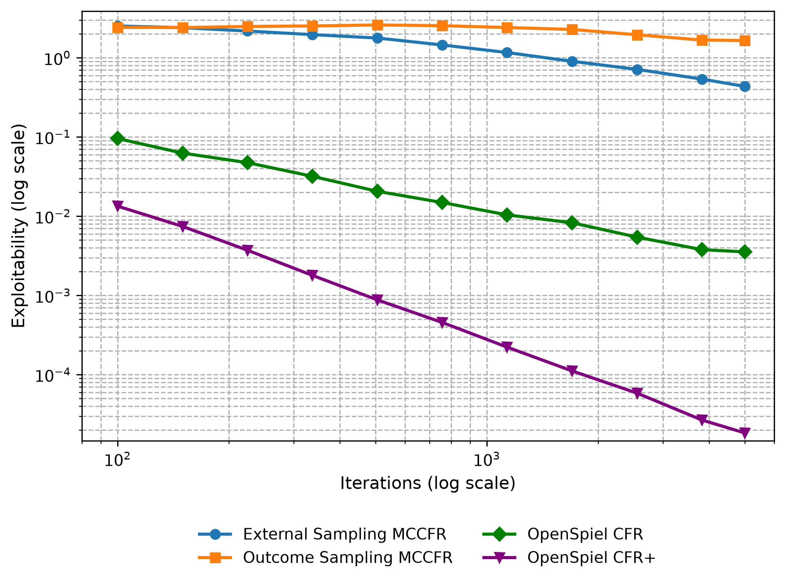
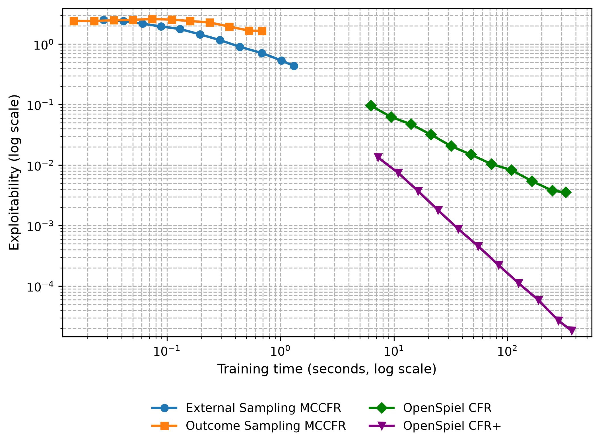
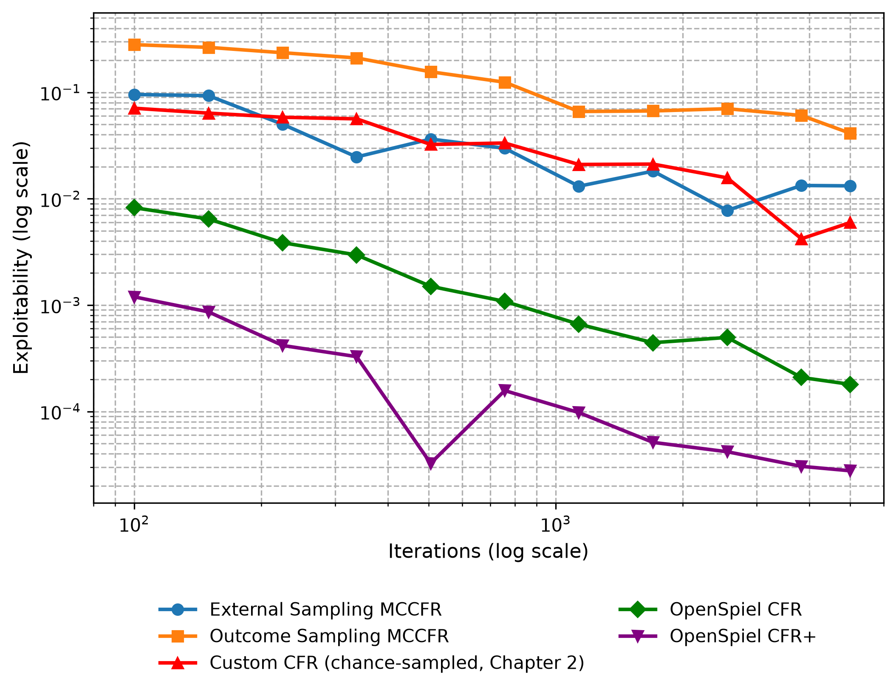
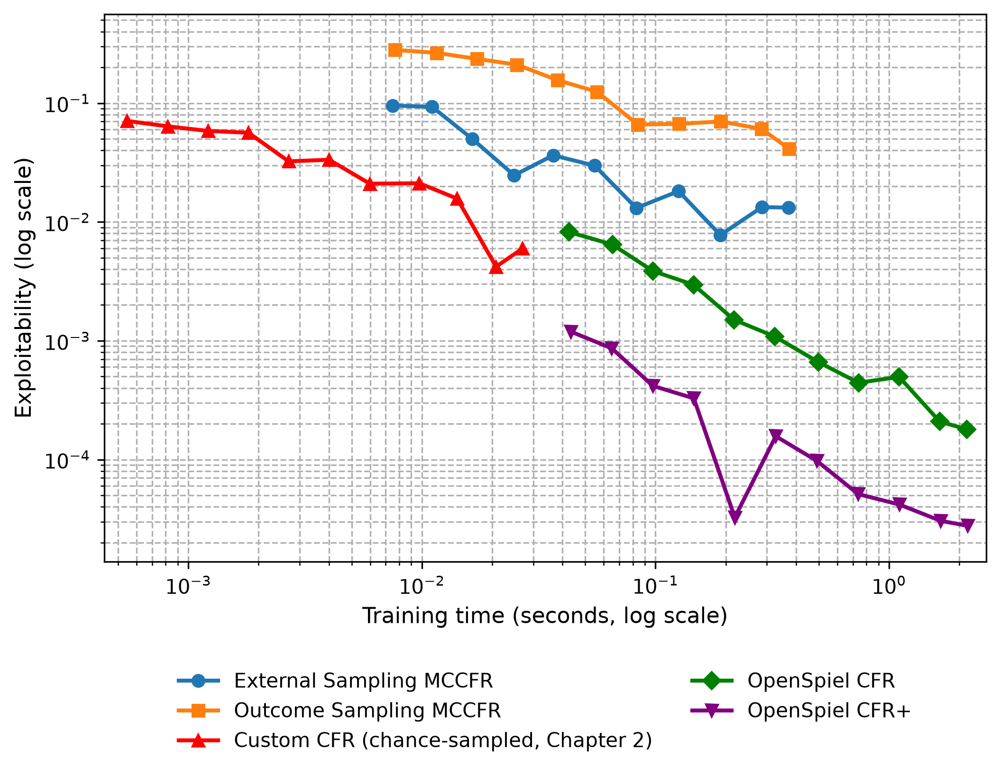
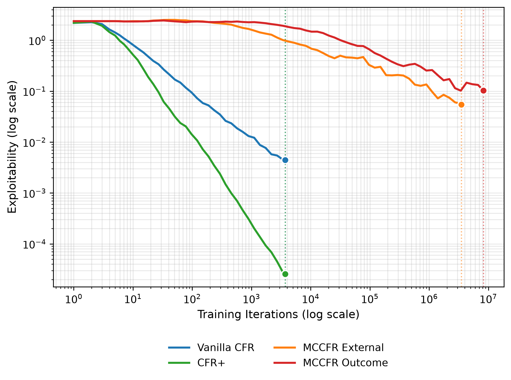
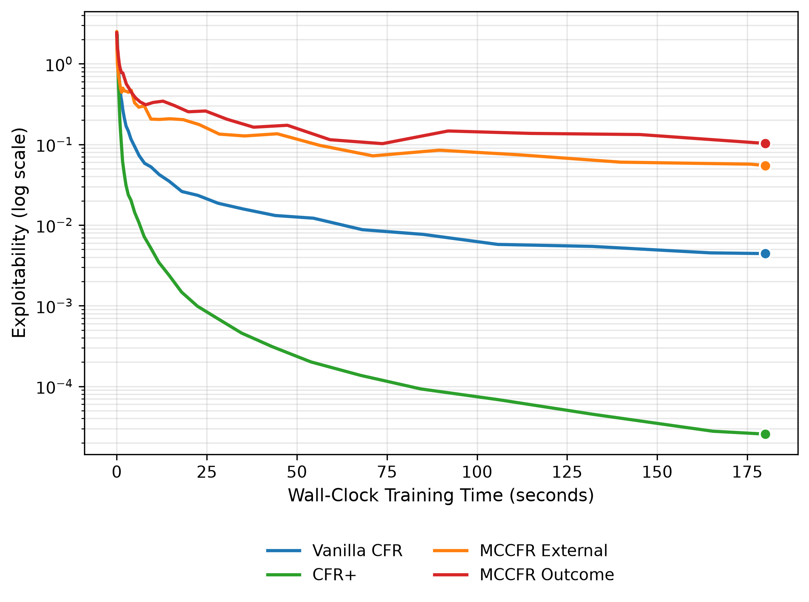

<!--
OFFICIAL PhD TITLE (keep consistent across all documents):
EN: Research on the possibilities for applying Artificial Intelligence in computer games
BG: Изследване на възможностите за приложение на изкуствения интелект в компютърни игри
-->

---
title: "Глава 3 Обобщение - Варианти на CFR и методи на Монте Карло"
subtitle: "Изследване върху възможностите за прилагане на изкуствен интелект в компютърните игри"
author: "Alexander Andreev"
date: "April 2026"
lang: bg
vars:
  research_focus: "Adaptive Strategy Learning in Multi-Agent Imperfect-Information Environments"
---

# Глава 3 - Варианти на CFR и методи на Монте Карло

---

## Защо обикновеният вариант на CFR се проваля при голям мащаб

Глава 2 установи работещ обикновен вариант на CFR решавач за Кун покер - 12 информационни множества, 58 крайни възли, решим за милисекунди. Това създава грешно впечатление. Обикновеният вариант на CFR изисква **пълно обхождане на дървото на играта при всяка итерация**, а истинските игри не са като Кун покер. Ледюк покер има 936 информационни множества (~78 пъти повече), а тексас холдем с лимит - над $10^{14}$. Нито един компютър не може да изброи това дърво дори веднъж.

Глава 3 преодолява проблема с мащаба чрез два взаимнодопълващи се механизма, разработени независимо в литературата по теория на игрите и по-късно комбинирани на практика:

1. **CFR+ (Tammelin, 2014)**[^cfrplus] - модификация на обикновения вариант на CFR, която постига значително по-бърза сходимост чрез подово ограничаване на съжалението, усредняване на линейни стратегии и редуващи се актуализации. CFR+ е алгоритъмът, който „реши“ хедс-ъп лимит тексаски холдем през 2015 г. - първият нетривиален вариант на покер, който по същество беше решен.
2. **Монте Карло CFR (Lanctot и др., 2009)**[^mccfr] - вместо да извършва пълно обхождане на дървото на играта при всяка итерация, MCCFR взема проба от малка част от него. Всяка итерация е в пъти по-евтина, за сметка на по-шумни актуализации. Това е единственият осъществим подход за игри, при които пълното обхождане е физически невъзможно.

За дисертацията MCCFR е алгоритъмът, който изчислява базовата **Нашева стратегия** - опорната точка „играй на сигурно“, от която адаптивният агент се отклонява въз основа на наблюденията върху опонента (Принос №1). CFR+ прави това изчисление осъществимо върху междинните **еталонни тестове**, използвани в глави 5–8.[^bowling2015]

---

## Търсене с метод Монте Карло в дърво като вдъхновение

Търсене с метод Монте Карло в дърво (MCTS) представлява каноничното семейство алгоритми, които използват **случайна извадка** за оценка на позиции в **дърво на играта**, без да прибягват до изчерпателно изброяване. Философията на проектирането му - „оценявай някои клонове до пълна дълбочина вместо всички клонове до фиксирана дълбочина“ - е пряка мотивация за MCCFR.

MCTS изгражда асиметрично **дърво на търсенето** чрез четири повтарящи се фази:

1. **Подбор** - слизане от корена чрез стратегия (обикновено UCB1, горна граница на доверителен интервал), която балансира експлоатацията на известни добри ходове и изследването на недостатъчно посетени такива.
2. **Разширяване** - във възел се добавят един или повече дъщерни възли към дървото.
3. **Симулация (разгръщане)** - от новия възел се играе случайна игра до нейния край.
4. **Обратно разпространение на грешката** - пропагиране на крайния резултат обратно по посетения път, като се актуализират броят посещения и кумулативните награди.

След множество **итерации**, детето на корена с най-голям брой посещения се избира за най-добър ход. Случайните разгръщания, агрегирани в хиляди **итерации**, **сходяват** към точни **стойностни оценки** - дори без никакви **експертни познания** извън правилата на играта.

Класически алтернативи като **минимакс с алфа-бета подрязване** оценяват всеки релевантен възел до фиксирана дълбочина и след това прилагат евристика в крайните възли. И двата подхода имат своите области на приложение:

| Свойство | Минимакс + α–β | MCTS |
|----------|--------------|------|
| Покритие на дървото | Всички разклонения до дълбочина $d$ | Подбрани разклонения до терминал |
| Оценка | Евристика при границата на дълбочината | Точна (крайна печалба) или чрез невронна мрежа |
| Чувствителност към коефициента на разклоняване | Експоненциална: $O(b^d)$ | Грациозна: съсредоточава се върху обещаващи разклонения |
| Необходими експертни познания | Силна оценъчна функция | Никакви (случайно разгръщане) или придобити чрез обучение |
| Най-подходящ за | Умерен коефициент на разклоняване, добри евристики | Висок коефициент на разклоняване, слаби/никакви евристики |

За Го (коефициент на разклоняване ~250, без добра оценъчна функция преди невронните мрежи) минимакс е непрактичен. MCTS беше пробивът, който направи изкуствения интелект за Го конкурентоспособен; същият принцип „извадка вместо изброяване“ се пренася към игра с непълна информация дървета чрез MCCFR.[^browne2012]

---

## Маркови вериги и законът за големите числа

„Метод Монте Карло“ в MCCFR обозначава широко семейство изчислителни методи, които използват **повтаряща се случайна извадка** за получаване на числени резултати. Наименованието произхожда от проекта „Манхатън“, където Станислав Улам и Джон фон Нойман прилагат **случайна извадка** за симулиране на дифузията на неутрони - проблем, твърде сложен за аналитично решаване.

Математическата основа се крепи на **марковски вериги** - стохастични процеси, при които следващото състояние зависи единствено от текущото състояние и не от историята на достигането му (марковска свойственост). Обхождането на дърво на играта представлява марковска верига: от всяко **състояние на играта** преходът зависи само от текущото състояние и избраното действие.

Ключовата теоретична гаранция е **законът за големите числа**: ако се извлекат достатъчно траектории през марковската верига, средната **стойност** на извадените стойности се сближава до истинската очаквана **стойност**. За MCCFR:

$$\frac{1}{T}\sum_{t=1}^{T} \hat{v}_I^{(t)} \xrightarrow{T \to \infty} v_I$$

където $\hat{v}_I^{(t)}$ представлява извадената контрафактична стойност в информационно множество $I$ на итерация $t$, а $v_I$ е истинската стойност, която обикновеният вариант на CFR изчислява точно. Тези извадени стойности са **непристрастни оценители** - тяхната очаквана стойност съвпада с истинската стойност - което гарантира сходимост към същото равновесие на Наш като при Full-Traversal CFR.

Цената е **дисперсия**. Отделните извадки могат значително да се отклоняват от истинската стойност, което налага повече итерации за постигане на същата прецизност. Този компромис между вариация и скорост е основната тема на тази глава.[^sutton2018]

---

## Ледюк покер - Разширяване на еталонния тест

Кун покер улавя същността на непълната информация в най-малкото възможно дърво на играта. Ледюк покер увеличава мащаба с приблизително два порядъка - все още решимо точно, но достатъчно голямо, за да станат значими разликите между алгоритмите:

| Свойство | Кун покер | Ледюк покер |
|----------|-----------|-------------|
| **Карти** | 3 (J, Q, K) | 6 ({J, Q, K} × {♠, ♥}) |
| **Кръгове** | 1 | 2 (префлоп + обща карта) |
| **Обща карта** | Няма | 1 разкрита между кръговете |
| **Класиране на ръка** | Само висока карта | Чифт (частна = обща) бие висока карта |
| **Размери на залози** | Фиксирани (1 чип) | Променливи (2 в първи кръг, 4 във втори кръг) |
| **Максимални повишения/кръг** | 1 | 2 |
| **Информационни множества** | 12 | 936 |
| **Възли на игрово дърво** | 58 | 10,200 |
| **Случайни изходи** | 6 | 120 |

Три нови качествени характеристики се появяват:

- **Многорундов строеж** - информацията се променя между кръговете (разкриване на обща карта), което изисква стратегии, адаптиращи се към новата информация.
- **Обща карта** - класирането на ръка вече зависи от общата карта; вале може да стане най-добрата ръка, ако вале бъде раздадено на борда.
- **По-големи залози в по-късните кръгове** - повишаването с 4 чипа във втори кръг означава, че решенията в по-късните кръгове имат по-голямо тегло.

Въпреки че е приблизително 78 пъти по-голям от **Кун**, **Ледюк** остава достатъчно малък за точно изчисление (пълно обхождане на дърво отнема около 50 ms). Това го прави идеален **еталонен тест**: достатъчно голям, за да бъдат значими разликите в производителността, и достатъчно малък, така че всички алгоритми да могат да достигнат почти пълна сходимост в рамките на минути.[^southey2005]

---

## CFR+ - Трикът с подовото ограничаване на съжалението

CFR+ въвежда три малки изменения в обикновения вариант на CFR, всяко от които е лесно за реализиране, но води до съществени резултати.

**Подово ограничаване на съжалението.** При обикновения вариант на CFR кумулативното **съжаление** може да става произволно отрицателно:

$$R^{T+1}(I, a) = R^T(I, a) + r^T(I, a)$$

CFR+ задава долна граница на съжаленията при нула след всяка итерация:

$$R^{T+1}(I, a) = \max\left(R^T(I, a) + r^T(I, a),\ 0\right)$$

Това предотвратява натрупването на големи отрицателни съжаления за дадено действие, които биха отнели множество итерации, за да се „изплатят“, преди действието отново да бъде разгледано. Аналогията с reLU активациите в невронните мрежи е пряка: и двете ограничават отрицателните стойности до нула, като по този начин предотвратяват мъртви единици (или мъртви действия) да изискват дълъг период на възстановяване.

**Усредняване на линейни стратегии.** Обикновен вариант на CFR включва стратегията от всяка итерация с еднаква тежест в плъзгащата средна. При CFR+ всяка итерация $t$ се претегля със самата нея, тоест $t$.

$$\bar{\sigma}^T(I, a) = \frac{\sum_{t=1}^{T} t \cdot \sigma^t(I, a)}{\sum_{t=1}^{T} t}$$

По-късните итерации - които се характеризират с по-малко съжаление и по-добри стратегии - оказват по-голямо влияние върху средната стойност. Ранните, шумни итерации получават по-ниска тежест.

**Редуващи се актуализации.** Вместо при всяка итерация да се актуализират съжаленията и на двамата играчи, CFR+ актуализира съжаленията на играч 0 при нечетни итерации, а на играч 1 - при четни. Това намалява наполовина изчислителната работа за една итерация и носи малка полза по отношение на сходимостта, като предотвратява едновременните промени в стратегията.

**Комбиниран ефект:** емпиричната сходимост се подобрява от $O(1/\sqrt{T})$ до приблизително $O(1/T)$. С 1000 итерации CFR+ постига резултат, за който на обикновения вариант на CFR са необходими около 1,000,000 итерации. Именно това направи възможно решаването на хедс-ъп лимит тексаски холдем през 2015 г. Забележка: макар че скоростта $O(1/T)$ се наблюдава последователно, тя няма формално доказателство - Tammelin и др. представят алгоритъма, но не и теорема за сходимост, съответстваща на наблюдавана скорост.

Емпирично, при Ледюк с 5000 итерации CFR+ достига експлоатируемост ≈ 5.4×10⁻⁵, докато обикновеният вариант на CFR все още е около ~7.6×10⁻³ - подобрение приблизително 140 пъти, постигнато чрез три малки модификации.[^cfrplus]

---

## MCCFR - Извадка от дървото на играта

MCCFR заменя пълното обхождане на дърво с частично извадково обхождане. Два варианта се разполагат върху една и съща крива дисперсия–скорост в различни точки:

| Вариант | Възли на шанса | Възли на traverser-а | Възли на опонента | Разход на итерация |
|---------|-----------------|-----------------------|--------------------|------------------:|
| **Външно вземане на проби** | Извадка от едно раздаване | Разглеждане на **всички** действия | **Извадка** от едно действие | ~42 възела (~945× по-бързо от пълното) |
| **Извадка по резултати** | Извадка от едно раздаване | Извадка от едно действие (ε-on-policy) | Извадка от едно действие | ~5.5 възела (~2,228× по-бързо) |

**Външно вземане на проби** разглежда всички възможни действия във възлите на играча, който актуализира стратегията си, но извършва извадка от възлите на шанса и възловите състояния на противника. Съжаленията за traverser-а се актуализират въз основа на извадковото поддърво. Тъй като се посещава само едно раздаване и един път на опонента, всяка итерация обхваща малка част от дървото.

**Извадка по резултати** избутва извадката още по-напред: тегли се една траектория до край. Тъй като действията във възлите на играча, който актуализира стратегията си, също се изваждат, актуализацията на съжалението трябва да бъде коригирана чрез **извадка по важност** - отношението между истинската вероятност за достигане и вероятността за извадка. Един ε-on-policy микс (с вероятност ε се избира равномерно; в противен случай се следва текущата стратегия) осигурява разглеждане на всички действия дори когато текущата **политика на работа** им присвоява нулева вероятност.

Критичното теоретично свойство и за двата подхода е, че извадковите контрафактични стойности са **неизместени оценки** на действителните стойности (Lanctot и др., Теорема 1). Това гарантира сходимост към същото равновесие на Наш като при обикновения вариант на CFR, въпреки шума от извадката. Цената, както винаги при метода Монте Карло, е дисперсията. Всяка извадкова актуализация се отклонява от действителната контрафактична стойност, тъй като отразява само едно възможно раздаване, а не очакваната стойност за всички раздавания.

Върху 12-те информационни множества на **Кун покер** и четирите алгоритъма (**обикновен вариант на CFR**, **CFR+**, двата варианта на **MCCFR**) достигат **почти равновесие на Наш** за секунди - **компромисът скорост–вариация** е невидим при този **мащаб** и изборът на алгоритъм е по-скоро теоретичен.

За да се прояви компромисът, дървото на играта трябва да бъде достатъчно голямо, така че разходът на итерация да има значение. Именно затова е необходим **Ледюк**.[^mccfr]

---

## Компромисът скорост–вариация

Всички четири алгоритъма демонстрират $O(1/\sqrt{T})$ сходимост, но стойностите на константите им се различават съществено. При изразяване на експлоатируемостта като $\epsilon(T) = C / \sqrt{T}$ и преобразуването ѝ в реално време чрез $C_w = C / \sqrt{\text{speed}}$:

| Алгоритъм | $C_{\text{iter}}$ | Скорост (итерации/сек) | $C_w$ (реално време) | Относително към обикновен вариант на CFR |
|-----------|------------------:|---------------:|-------------------:|--------------------:|
| Обикновен вариант на CFR | 0.34 | 20.6 | **0.075** | 1.0× |
| CFR+ | 0.34 | 20.6 | **~0.002** | ~38 пъти по-бърз |
| MCCFR External | 107 | 19,470 | **0.767** | 10.2× по-бавен |
| MCCFR Outcome | 245 | 45,901 | **1.143** | 15.3× по-бавен |

Константата в реално време определя представянето в практиката. Въпреки че външното вземане на проби е 945 пъти по-бързо на итерация, неговата константа на дисперсията (107 спрямо 0.34) е 315 пъти по-голяма. Предимството в скоростта **не компенсира наказанието от дисперсията**:

$$\frac{99{,}000 \times \text{more iterations needed}}{945 \times \text{faster per iteration}} \approx 105 \times \text{more wall-clock time}$$

**Защо се наблюдава дисперсия?** Обикновеният вариант на CFR изчислява **точни** контрафактични стойности чрез изброяване на всички 120 раздавания. Неговото обновяване на съжалението има нулева дисперсия. MCCFR взема проба от едно раздаване на итерация. Дори ако обходи цялото поддърво за това раздаване, пак ще се наблюдава дисперсия между различните раздавания - следствие от самата скрита информация, а не недостатък на схемата на извадка:

$$\mathrm{Var}[\hat{v}_I] = \mathbb{E}_{\text{deal}}\left[(\hat{v}_I - v_I)^2\right] \propto \frac{|N|}{|I|}$$

Формален 180-секунден еталонен тест с ограничение във времето за изпълнение на всичките четири варианта върху Ледюк прави сравнението в реално време конкретно. Гледна точка, базирана на итерациите (вариантите с извадка завършват милиони обновления, докато вариантите с пълно обхождане - само няколко хиляди):

Гледна точка в реално време - справедливото сравнение (при еднаква изчислителна мощност кой алгоритъм генерира най-добрата стратегия?):

CFR+ достига експлоатируемост от 2.6×10⁻⁵ - практически точно Нашево равновесие - за 3 минути. Обикновеният вариант на CFR следва с 4.4×10⁻³. И двата варианта на MCCFR изостават с няколко порядъка при този размер на играта.

---

## Кога MCCFR надделява - точката на пресичане

Горният модел поставя очевиден въпрос: ако MCCFR винаги е по-слаб в Ледюк, защо тогава беше изобретен? Отговорът се крие във факта, че разходът на итерация при обикновения вариант на CFR нараства линейно с размера на дървото $|N|$, докато този на MCCFR е приблизително постоянен. При достатъчно голям мащаб линейната цена надделява. Критичният размер на дървото е:

$$|N|_{\text{crossover}} = |N|_{\text{Leduc}} \cdot \left(\frac{C_{mc}}{C_v}\right)^2 \cdot \frac{\text{speed}_v}{\text{speed}_{mc}}$$

При заместване на измерените стойности:

| Вариант | $|N|_{\text{crossover}}$ |
|---------|-------------------------:|
| Външно вземане на проби | ~2.1 милиона възела |
| Извадка по резултати | ~4.8 милиона възела |

Сравнение с реални игри:

| Игра | $|N|$ | Външни победи? | Победи по резултати? |
|------|------:|:--------------:|:-------------:|
| Ледюк покер | 10,200 | Не (210 пъти твърде малко) | Не (466 пъти твърде малко) |
| Тексас холдем с лимит | ~$10^{14}$ | Да ($10^7$ пъти над прага) | Да |
| No-Limit Texas Холдем | ~$10^{17}$ | Да ($10^{10}$ пъти над прага) | Да |

Ледюк е 210 пъти под прага за външно вземане на проби и 466 пъти под прага за извадка по резултати. Пълното обхождане доминира, тъй като цялото дърво на играта се побира в паметта и може да бъде изброено за милисекунди. При реални мащаби на покера заключението се обръща напълно - дори една итерация на пълно обхождане на холдем би отнела повече време от възрастта на Вселената. В такъв мащаб MCCFR (с разширения за намаляване на дисперсията) е **единственият** приложим подход.

---

## Връзки със глава 2 и бъдещи насоки

**Същият принцип, различен режим.** Глава 2 установи Full-Traversal CFR върху Кун и доказа, че минимизирането на съжалението локално във всяко информационно множество води глобалната стратегия към равновесие на Наш. Глава 3 запазва този принцип, но въвежда две независими усъвършенствания: CFR+ променя начина на акумулиране на съжаленията (подово ограничаване на съжалението + линейно претегляне), а MCCFR модифицира начина на измерването им (среднопретеглена извадка вместо точна очаквана стойност). И двете все още извеждат **средната** стратегия, а не последната итерация - същият механизъм за осредняване, който стабилизира обикновения вариант на CFR, стабилизира всеки негов вариант.

**Скорости на сходимост.** Глава 2 измери наклон в лог-лог мащаб, близък до $-0.5$, за експлоатируемостта на играта Кун, потвърждавайки $O(1/\sqrt{T})$. Глава 3 показва, че тази скорост е свойство на цялото семейство алгоритми, а не само на конкретна реализация - единствено емпиричният $O(1/T)$ при CFR+ е по-бърз, но без формално доказателство. MCCFR остава със скорост $O(1/\sqrt{T})$, но с драстично по-голяма константа.

**Напред:**

- **Глава 4 (Абстракция на играта и мащабиране)** - атакува проблема с мащабируемостта от противоположната посока: вместо да се прави извадка от дървото, самото дърво се редуцира чрез абстракция на състоянията и действията. Комбинира се с MCCFR, за да направи реалния покер управляем.
- **Глава 5 (Невронно равновесие / Deep CFR)** - заменя табличното съхранение на стратегията с невронни апроксиматори на функции, използвайки рамката за извадка на MCCFR като двигател за генериране на данни. Свойствата на дисперсията, установени тук, обясняват защо Deep CFR изисква специфични техники за намаляване на дисперсията (мрежи за предимство, важни целеви стойности с тегла).
- **Глава 6 (Игрови изкуствен интелект от край до край)** - надгражда както върху CFR+, така и върху MCCFR за създаване на пълноценни агенти. Машината Ледюк, разработена за тази глава, се превръща в еталонна среда през Глава 8.[^brown2017]

<!-- Бележки към източниците. Заглавията на чуждоезични източници не се
     превеждат (правило 7 от terminology_EN_BG.md). -->

[^cfrplus]: Tammelin, O. (2014). "Solving Large Imperfect Information Games Using CFR+." arXiv:1407.5042. Резултатът за хедс-ъп лимит холдем е Bowling, M., Burch, N., Johanson, M. & Tammelin, O. (2015). "Heads-up limit hold'em poker is solved." *Science*, 347(6218), 145-149.

[^mccfr]: Lanctot, M., Waugh, K., Zinkevich, M. & Bowling, M. (2009). "Monte Carlo Sampling for Regret Minimization in Extensive Games." *Advances in Neural Information Processing Systems 22*, 1078-1086.

[^bowling2015]: Bowling, M., Burch, N., Johanson, M. & Tammelin, O. (2015). "Heads-up limit hold'em poker is solved." *Science*, 347(6218), 145–149.

[^browne2012]: Browne, C. et al. (2012). "A Survey of Monte Carlo Tree Search Methods." *IEEE Transactions on Computational Intelligence and AI in Games*, 4(1), 1–43.

[^sutton2018]: Sutton, R.S. & Barto, A.G. (2018). *Reinforcement Learning: An Introduction*, Chapter 5 — Monte Carlo Methods.

[^southey2005]: Southey, F. et al. (2005). "Bayes' Bluff: Opponent Modelling in Poker." *UAI*.

[^brown2017]: Brown, N. & Sandholm, T. (2017). "Safe and Nested Subgame Solving for Imperfect-Information Games." *NeurIPS* - свързва табличния CFR с декомпозицията на под-игра за реалния покер.
