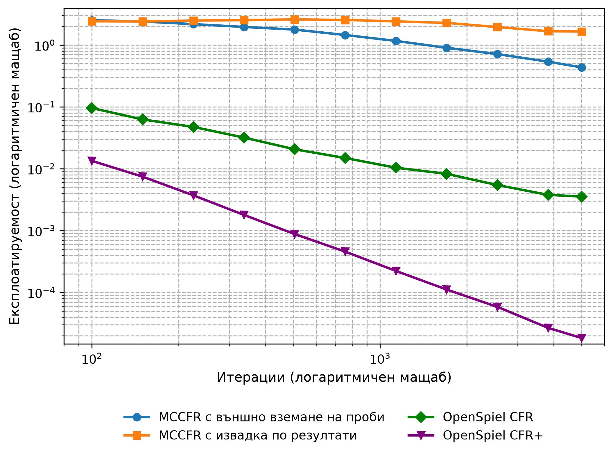
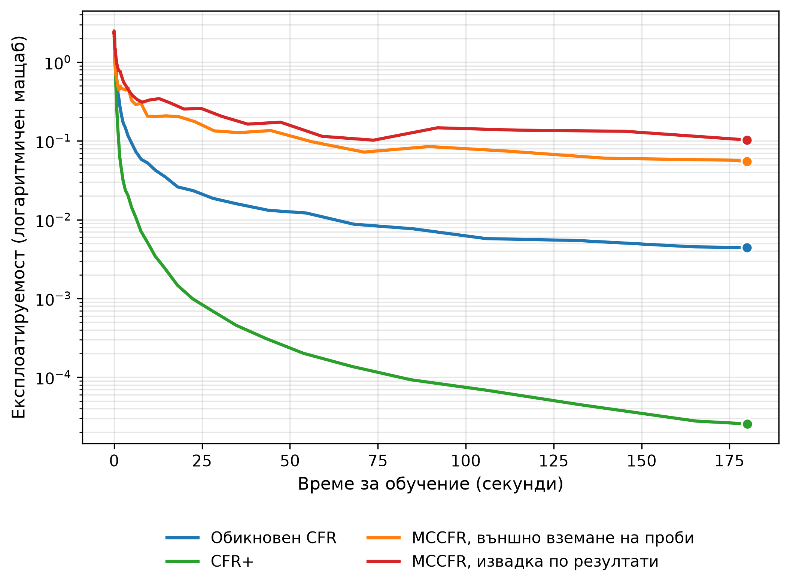

<!--
OFFICIAL PhD TITLE (keep consistent across all documents):
EN: Research on the possibilities for applying Artificial Intelligence in computer games
BG: Изследване на възможностите за приложение на изкуствения интелект в компютърни игри
-->

---
title: "Глава 3 Обобщение – Варианти на CFR и методи на Монте Карло"
subtitle: "Изследване върху възможностите за прилагане на изкуствен интелект в компютърните игри"
author: "Alexander Andreev"
date: "April 2026"
lang: bg
vars:
  research_focus: "Adaptive Strategy Learning in Multi-Agent Imperfect-Information Environments"
---

# Глава 3 – Варианти на CFR и методи на Монте Карло

---

## Защо обикновеният вариант на CFR се проваля при голям мащаб

В Глава 2 беше създаден работещ решавач с обикновения вариант на CFR за Кун покер – 12 информационни множества, 58 възела (30 от тях крайни), решим за милисекунди. Това създава грешно впечатление. Обикновеният вариант на CFR изисква **пълно обхождане на дървото на играта при всяка итерация**, а истинските игри не са като Кун покер. Ледюк покер има 936 информационни множества (~78 пъти повече), а лимитният тексаски Холдем – над $10^{14}$, като едно-единствено обхождане на дървото му е отнело около час на 4800 процесорни ядра (вж. раздел 3.8).

Глава 3 показва двата взаимно допълващи се механизма за преодоляване на проблема с мащаба, разработени независимо в литературата по теория на игрите и по-късно комбинирани на практика:

1. **CFR+ (Tammelin, 2014)**[^cfrplus] – модификация на обикновения вариант на CFR, която постига значително по-бърза сходимост чрез нулиране на отрицателните съжаления, линейно претеглено усредняване на стратегиите и редуващи се актуализации. CFR+ е алгоритъмът, който „реши“ лимитния тексаски Холдем за двама играчи през 2015 г. – първият нетривиален вариант на покер, който по същество беше решен.
2. **Монте Карло CFR (Lanctot и др., 2009)**[^mccfr] – вместо да извършва пълно обхождане на дървото на играта при всяка итерация, MCCFR взема проба от малка част от него. Всяка итерация е стотици до хиляди пъти по-евтина, за сметка на по-шумни актуализации. Това е основният подход за игри, при които пълното обхождане е физически невъзможно; другият – абстракцията на играта – е предмет на Глава 4.

За дисертацията тези решавачи изчисляват базовата стратегия на равновесие на Наш – опорната точка „играй на сигурно“, от която адаптивният агент се отклонява въз основа на наблюденията върху опонента (Принос №1). В игрите с размера на Кун и Ледюк това е CFR+ (вж. раздел 3.7), а MCCFR става необходим при по-големите игри. CFR+ прави това изчисление осъществимо върху междинните еталонни игри, използвани в глави 5–8.[^bowling2015]

---

## Търсене с метод Монте Карло в дърво като вдъхновение

Търсене с метод Монте Карло в дърво (MCTS) представлява каноничното семейство алгоритми, които използват **случайна извадка** за оценка на позиции в **дърво на играта**, без да прибягват до изчерпателно изброяване. Философията на проектирането му – „оценявай някои клонове до пълна дълбочина вместо всички клонове до фиксирана дълбочина“ – е пряка мотивация за MCCFR.

MCTS изгражда асиметрично **дърво на търсенето** чрез четири повтарящи се фази:

1. **Подбор** – слизане от корена чрез стратегия (обикновено UCB1, горна граница на доверителен интервал), която балансира експлоатацията на известни добри ходове и изследването на недостатъчно посетени такива.
2. **Разширяване** – във възел се добавят един или повече дъщерни възли към дървото.
3. **Симулация (разгръщане)** – от новия възел се играе случайна игра до нейния край.
4. **Обратно разпространение** – разпространяване на крайния резултат обратно по посетения път, като се актуализират броят посещения и кумулативните награди.

След множество итерации дъщерният възел на корена с най-голям брой посещения се избира за най-добър ход. Насочвани от стратегията за подбор, разгръщанията, обобщени в хиляди итерации, дават все по-точни оценки на стойността – дори без никакви експертни познания извън правилата на играта.

Класически алтернативи като **минимакс с алфа-бета подрязване** оценяват всеки релевантен възел до фиксирана дълбочина и след това прилагат евристика в крайните възли. И двата подхода имат своите области на приложение:

| Свойство | Минимакс + α–β | MCTS |
|-----------|-------------|-----------|
| Покритие на дървото | Всички разклонения до дълбочина $d$ | Подбрани разклонения до крайно състояние |
| Оценка | Евристика при границата на дълбочината | Точна (крайна печалба) или чрез невронна мрежа |
| Чувствителност към коефициента на разклоняване | Експоненциална: $O(b^d)$ | Умерена: съсредоточава се върху обещаващи разклонения |
| Необходими експертни познания | Силна оценъчна функция | Никакви (случайно разгръщане) или придобити чрез обучение |
| Най-подходящ за | Умерен коефициент на разклоняване, добри евристики | Висок коефициент на разклоняване, слаби/никакви евристики |

: Минимакс с алфа-бета отсичане срещу MCTS по пет характеристики.

За Го (коефициент на разклоняване ~250, без добра оценъчна функция преди невронните мрежи) минимакс е непрактичен. MCTS беше пробивът, който направи изкуствения интелект за Го конкурентоспособен; същият принцип „извадка вместо изброяване“ се пренася чрез MCCFR към дърветата на игрите с непълна информация.[^browne2012]

---

## Марковски вериги и законът за големите числа

„Метод Монте Карло“ в MCCFR обозначава широко семейство изчислителни методи, които използват **повтаряща се случайна извадка** за получаване на числени резултати. Методът е създаден в Лос Аламос през 1946 г., където Станислав Улам и Джон фон Нойман го прилагат за симулиране на дифузията на неутрони – задача, твърде сложна за аналитично решаване; наименованието, предложено от Никълъс Метрополис, идва от казиното в Монте Карло[^metropolis1987].

Математическата основа се крепи на **марковски вериги** – стохастични процеси, при които следващото състояние зависи единствено от текущото състояние и не от историята на достигането му (марковско свойство). Обхождането на дърво на играта представлява марковска верига: от всяко **състояние на играта** преходът зависи само от текущото състояние и избраното действие.

Ключовата теоретична гаранция е **законът за големите числа**: ако се изтеглят независимо достатъчно много траектории, средната стойност на извадката клони към истинската очаквана стойност. За MCCFR, при фиксиран профил от стратегии:

$$\frac{1}{T}\sum_{t=1}^{T} \hat{v}_I^{(t)} \xrightarrow{T \to \infty} v_I$$

където $\hat{v}_I^{(t)}$ представлява извадената контрафактична стойност в информационно множество $I$ на итерация $t$, а $v_I$ е истинската стойност, която обикновеният вариант на CFR изчислява точно. Тези извадкови стойности са **неизместени оценки** – очакваната им стойност съвпада с истинската. Заедно с ограничение отдолу на вероятностите за извадка това осигурява, с вероятност поне $1-p$, същото намаляване на средното съжаление от порядъка $O(1/\sqrt{T})$ като при CFR с пълно обхождане и следователно сходимост на средната стратегия към приблизително равновесие на Наш[^mccfr].

Цената е **дисперсия**. Отделните извадки могат значително да се отклоняват от истинската стойност, което налага повече итерации за постигане на същата прецизност. Този компромис между дисперсия и скорост е основната тема на главата.[^suttonbarto2018]

---

## Ледюк покер – по-голяма еталонна игра

Кун покер улавя същността на непълната информация в най-малкото възможно дърво на играта. Ледюк покер увеличава мащаба с приблизително два порядъка – все още решим точно, но достатъчно голям, за да станат значими разликите между алгоритмите:

| Свойство | Кун покер | Ледюк покер |
|----------|-----------|-------------|
| **Карти** | 3 (J, Q, K) | 6 ({J, Q, K} × {♠, ♥}) |
| **Кръгове** | 1 | 2 (префлоп + обща карта) |
| **Обща карта** | Няма | 1 разкрита между кръговете |
| **Класиране на ръка** | Само висока карта | Чифт (частна = обща) бие висока карта |
| **Размери на залози** | Фиксирани (1 жетон) | Променливи (2 в първи кръг, 4 във втори кръг) |
| **Максимален брой вдигания в кръг** | 1 | 2 |
| **Информационни множества** | 12 | 936 |
| **Възли на игрово дърво** | 58 | 10 200 |
| **Случайни изходи** | 6 | 120 |

: Сравнение между Кун и Ледюк покер: карти, кръгове на залагане, информационни множества и размер на дървото.

Появяват се три качествено нови характеристики:

- **Многорундов строеж** – информацията се променя между кръговете (разкриване на обща карта), което изисква стратегии, адаптиращи се към новата информация.
- **Чифтове** – класирането на ръката вече зависи от общата карта; вале може да стане най-силната ръка, ако и общата карта е вале.
- **По-големи залози в по-късните кръгове** – вдигането с 4 жетона във втория кръг означава, че решенията в по-късните кръгове имат по-голямо тегло.

Въпреки че е приблизително 78 пъти по-голям от **Кун**, **Ледюк** остава достатъчно малък за точно изчисление (пълно обхождане на дърво отнема около 50 ms). Това го прави идеална еталонна игра: достатъчно голяма, за да бъдат значими разликите в производителността, и достатъчно малка, така че всички алгоритми да могат да достигнат почти пълна сходимост в рамките на минути.[^southey2005]

---

## CFR+ – Трикът с нулирането на отрицателните съжаления

CFR+ въвежда три малки изменения в обикновения вариант на CFR, всяко от които е лесно за реализиране, но води до съществени резултати.

**Нулиране на отрицателните съжаления.** При обикновения вариант на CFR кумулативното **съжаление** може да става произволно отрицателно:

$$R^{T+1}(I, a) = R^T(I, a) + r^T(I, a)$$

CFR+ задава долна граница на съжаленията при нула след всяка итерация:

$$R^{T+1}(I, a) = \max\left(R^T(I, a) + r^T(I, a),\ 0\right)$$

Това предотвратява натрупването на големи отрицателни съжаления за дадено действие, които биха отнели множество итерации, за да се „изплатят“, преди действието отново да бъде разгледано. Аналогията с активационната функция ReLU в невронните мрежи е пряка: и двете занулават отрицателните стойности.

**Линейно претеглено усредняване на стратегиите.** Обикновеният вариант на CFR включва стратегията от всяка итерация с еднакво тегло в текущата средна. При CFR+ стратегията от итерация $t$ получава тегло $t$:

$$\bar{\sigma}^T(I, a) = \frac{\sum_{t=1}^{T} t \cdot \sigma^t(I, a)}{\sum_{t=1}^{T} t}$$

По-късните итерации – които се характеризират с по-малко съжаление и по-добри стратегии – оказват по-голямо влияние върху средната стойност. Ранните, шумни итерации получават по-ниска тежест.

**Редуващи се актуализации.** Вместо двамата играчи да се обновяват едновременно спрямо един и същ профил от стратегии, CFR+ ги обновява последователно в рамките на всяка итерация, така че обновяването на втория играч вече отчита новата стратегия на първия. Работата за една итерация не се променя; ползата е по-бързата сходимост.

**Комбиниран ефект:** емпиричната сходимост се подобрява от $O(1/\sqrt{T})$ до приблизително $O(1/T)$. При Ледюк CFR+ достига 2,0×10⁻⁴ след около 1100 итерации; при измерената скорост на обикновения вариант на CFR за същата стойност биха били нужни от порядъка на два милиона итерации (екстраполация). Именно това направи възможно решаването на лимитния тексаски Холдем за двама играчи през 2015 г. Забележка: скоростта $O(1/T)$ се наблюдава последователно, но не е доказана; доказана е само общата за семейството горна граница $O(1/\sqrt{T})$[^tammelin2015], чието първоначално доказателство е коригирано от Burch и др.[^burch2019]

Тук експлоатируемост означава средната печалба на най-добрия отговор срещу двамата играчи, $(BR_0 + BR_1)/2$; NashConv е сумата им, т.е. двойно по-голяма. Емпирично, при Ледюк след 5000 итерации реализацията на CFR+ в OpenSpiel достига експлоатируемост ≈ 1,8×10⁻⁵, докато обикновеният вариант на CFR все още е около 3,6×10⁻³ – подобрение приблизително 190 пъти, постигнато с две от трите модификации (и двата решавача на OpenSpiel редуват актуализациите).[^cfrplus]

---

## MCCFR – Извадка от дървото на играта

MCCFR заменя пълното обхождане на дърво с частично извадково обхождане. Два варианта се разполагат върху една и съща крива дисперсия–скорост в различни точки:

| Вариант | Възли на случайността | Възли на обхождащия играч | Възли на опонента | Цена на итерация |
|-----------------|-------------|-------------|-------------|------------:|
| **Външно вземане на проби** | Извадка от едно раздаване | Разглеждане на **всички** действия | **Извадка** от едно действие | ~42 възела (~945× по-бързо от пълното) |
| **Извадка по резултати** | Извадка от едно раздаване | Извадка от едно действие (ε-микс с текущата стратегия) | Извадка от едно действие | ~5,5 възела (~2 228× по-бързо) |

: Външно вземане на проби и извадка по резултати: от какво взема извадка всеки вариант при всеки тип възел и каква е цената на една итерация.

**Външно вземане на проби** разглежда всички възможни действия във възлите на играча, който актуализира стратегията си, но взема извадка във възлите на случайността и във възлите на противника. Съжаленията на обхождащия играч се обновяват въз основа на поддървото от извадката. Тъй като се посещава само едно раздаване и един път на опонента, всяка итерация обхваща малка част от дървото.

**Извадката по резултати** отива още по-далеч: тегли се една-единствена траектория до край. Тъй като действията във възлите на играча, който актуализира стратегията си, също се изваждат, актуализацията на съжалението трябва да бъде коригирана чрез **извадка по важност** – отношението между истинската вероятност за достигане и вероятността за извадка. Един ε-микс (с вероятност ε действието се избира равномерно, а в противен случай – според текущата стратегия) гарантира, че всички действия се разглеждат, дори когато текущата стратегия им присвоява нулева вероятност.

Критичното теоретично свойство и за двата подхода е, че извадковите контрафактични стойности са **неизместени оценки** на действителните стойности (Lanctot и др., лема 1). Заедно с техните граници за съжалението (теореми 4 и 5) това гарантира сходимост към приблизително равновесие на Наш въпреки шума от извадката. Цената, както винаги при метода Монте Карло, е дисперсията. Всяка извадкова актуализация се отклонява от действителната контрафактична стойност, тъй като отразява само едно възможно раздаване, а не очакваната стойност за всички раздавания.

Върху 12-те информационни множества на Кун покер всички алгоритми се изпълняват за секунди, а подредбата им вече е същата като при Ледюк: след 5000 итерации CFR+ достига експлоатируемост ≈ 3×10⁻⁵, обикновеният CFR – ≈ 2×10⁻⁴, а външното вземане на проби и извадката по резултати са едва при ≈ 0,013 и ≈ 0,04 (решавачът от Глава 2, който тегли по едно раздаване на итерация, е между обикновения CFR и външното вземане на проби с ≈ 0,006):

За да се прояви компромисът, дървото на играта трябва да бъде достатъчно голямо, така че разходът на итерация да има значение. Именно затова е необходим **Ледюк**.[^mccfr]

---

## Компромисът между дисперсия и скорост

И четирите алгоритъма имат гарантирана горна граница на експлоатируемостта от порядъка $O(1/\sqrt{T})$ - за CFR[^zinkevich2007], за MCCFR с вероятност поне $1-p$[^mccfr] и за CFR+[^tammelin2015][^burch2019]. Измерената скорост обаче се различава: двата варианта на MCCFR следват наклон около $-0{,}4$ до $-0{,}5$, обикновеният CFR – около $-0{,}8$, а CFR+ – около $-1{,}8$. Затова моделът $\epsilon(T) = C / \sqrt{T}$ по-долу е приближение (при обикновения CFR произведението $\epsilon\sqrt{T}$ намалява от 0,94 до 0,27), а за CFR+ не е приложим. Преобразуването към време за изпълнение става чрез $C_w = C / \sqrt{\text{скорост}}$:

| Алгоритъм | $C_{\text{итер}}$ | Скорост (итерации/сек) | $C_w$ (по време на изпълнение) | $C_w$ спрямо обикновения CFR |
|------------------|-------:|---------:|------------:|-------------:|
| Обикновен вариант на CFR | 0,34 | 20,6 | **0,075** | 1,0× |
| CFR+ | – | 20,6 | – | не следва $C/\sqrt{T}$ (вж. текста) |
| MCCFR, външно вземане на проби | 107 | 19 470 | **0,767** | 10,2× (≈105× повече време) |
| MCCFR, извадка по резултати | 245 | 45 901 | **1,143** | 15,3× (≈233× повече време) |

: Измерени константи на сходимост за четирите решавача – на итерация и по време на изпълнение.

Константата по време на изпълнение определя представянето на практика. Въпреки че външното вземане на проби е 945 пъти по-бързо на итерация, неговата константа на дисперсията (107 спрямо 0,34) е 315 пъти по-голяма. Предимството в скоростта **не компенсира наказанието от дисперсията**:

$$\frac{99{,}000 \times \text{повече итерации}}{945 \times \text{по-бърза итерация}} \approx 105 \times \text{повече време за изпълнение}$$

**Защо се наблюдава дисперсия?** Обикновеният вариант на CFR изчислява **точни** контрафактични стойности чрез изброяване на всички 120 раздавания. Неговото обновяване на съжалението има нулева дисперсия. MCCFR взема проба от едно раздаване на итерация. Дори ако обходи цялото поддърво за това раздаване, пак ще се наблюдава дисперсия между различните раздавания – следствие от извадката на случайното събитие (раздаването), а не от начина на обхождане в рамките на едно раздаване:

$$\mathrm{Var}[\hat{v}_I] = \mathbb{E}_{\text{раздаване}}\left[(\hat{v}_I - v_I)^2\right]$$

Сравнителен тест с бюджет от 180 секунди за всеки от четирите варианта върху Ледюк прави сравнението по време на изпълнение конкретно. Изглед по итерации (вариантите с извадка извършват милиони обновявания, а вариантите с пълно обхождане – само няколко хиляди):

Изглед по време на изпълнение – справедливото сравнение (при еднакви изчислителни разходи кой алгоритъм дава най-добрата стратегия?):

CFR+ достига експлоатируемост от 2,6×10⁻⁵ – практически точно равновесие на Наш – за 3 минути. Обикновеният вариант на CFR следва с 4,4×10⁻³. Двата варианта на MCCFR изостават 12–23 пъти от обикновения CFR и три до четири порядъка от CFR+ при този размер на играта.

---

## Кога MCCFR надделява – точката на пресичане

Тази закономерност поставя очевиден въпрос: ако MCCFR винаги е по-слаб в Ледюк, защо тогава беше изобретен? Отговорът се крие във факта, че разходът на итерация при обикновения вариант на CFR нараства линейно с размера на дървото $|N|$, докато този на MCCFR расте много по-бавно (при външното вземане на проби – приблизително като $\sqrt{|N|}$[^mccfr]). При достатъчно голям мащаб линейната цена надделява. Критичният размер на дървото е:

$$|N|_{\text{пресичане}} = |N|_{\text{Ледюк}} \cdot \left(\frac{C_{mc}}{C_v}\right)^2 \cdot \frac{\text{скорост}_v}{\text{скорост}_{mc}}$$

При заместване на измерените стойности:

| Вариант | $|N|_{\text{пресичане}}$ |
|---------|-------------------------:|
| Външно вземане на проби | ~1,1 милиона възела |
| Извадка по резултати | ~2,4 милиона възела |

: Размер на играта, при който MCCFR изпреварва обикновения вариант на CFR, по вариант на извадката.

Сравнение с реални игри:

| Игра | $|N|$ | Печели ли външното вземане на проби? | Печели ли извадката по резултати? |
|--------------|------:|:------------:|:------------:|
| Ледюк покер | 10 200 | Не (105 пъти под прага) | Не (233 пъти под прага) |
| Лимитен тексаски Холдем за двама играчи | ~$3 \times 10^{17}$ | Да по модела (~$10^{11}$ пъти над прага), но е решен с CFR+ с пълно обхождане | Да по модела |
| Безлимитен тексаски Холдем | до ~$6 \times 10^{164}$ | Да | Да |

: Прагът на пресичане, приложен към три реални игри.

Ледюк е 105 пъти под прага за външното вземане на проби и 233 пъти под прага за извадката по резултати. Пълното обхождане доминира, тъй като цялото дърво на играта се побира в паметта и може да бъде изброено за милисекунди. Оценката е от порядъка на величината и важи за тази реализация: константите са измерени само върху Ледюк, обикновеният CFR е моделиран като $C/\sqrt{T}$, въпреки че се сближава по-бързо, а ако цената на итерация на MCCFR расте като $\sqrt{|N|}$, същите данни дават праг около $10^8$ възела.

При реалните мащаби на покера заключението се обръща, но не навсякъде. Лимитният тексаски Холдем за двама играчи ($3{,}16 \times 10^{17}$ състояния) все пак е решен с CFR+ с пълно обхождане – 1579 итерации по около 61 минути на 4800 процесорни ядра[^bowling2015] – като авторите отчитат, че CFR+ изисква значително по-малко изчисления от вариантите на CFR с извадка. Безлимитният тексаски Холдем (до $6{,}31 \times 10^{164}$ състояния във форматите на ACPC[^johanson2013]) е недостижим за пълно обхождане; там практическият път е извадката – MCCFR в комбинация с абстракция и с разширения за намаляване на дисперсията[^schmid2019].

---

## Връзки с Глава 2 и бъдещи насоки

**Същият принцип, различен режим.** В Глава 2 беше реализиран CFR с пълно обхождане за Кун и беше показано, че минимизирането на съжалението локално във всяко информационно множество води глобалната стратегия към равновесие на Наш. Глава 3 запазва този принцип, но въвежда две независими усъвършенствания: CFR+ променя начина на акумулиране на съжаленията (нулиране на отрицателните съжаления + линейно претегляне), а MCCFR модифицира начина на измерването им (извадкова оценка вместо точна очаквана стойност). И двете все още извеждат **средната** стратегия, а не последната итерация – същият механизъм за усредняване, който стабилизира обикновения вариант на CFR, стабилизира всеки негов вариант.

**Скорости на сходимост.** Глава 2 измери наклон в лог-лог мащаб, близък до $-0{,}5$, за експлоатируемостта на играта Кун, потвърждавайки $O(1/\sqrt{T})$. В Глава 3 се вижда, че $O(1/\sqrt{T})$ е горна граница за цялото семейство, а не наблюдаваната скорост: върху Ледюк двата варианта на MCCFR следват наклон около $-0{,}4$ до $-0{,}5$, обикновеният CFR се сближава по-бързо (около $-0{,}8$), а CFR+ – значително по-бързо (около $-1{,}8$), което не е формално доказано. MCCFR остава със скорост $O(1/\sqrt{T})$, но с драстично по-голяма константа.

**Напред:**

- **Глава 4 (Абстракция на играта и мащабиране)** – атакува проблема с мащабируемостта от противоположната посока: вместо да се прави извадка от дървото, самото дърво се редуцира чрез абстракция на състоянията и действията. В комбинация с MCCFR прави решаването на реалния покер изчислително постижимо.
- **Глава 5 (Невронни мрежи за игри с непълна информация)** – заменя табличното съхранение на стратегията с невронни апроксиматори на функции, използвайки рамката за извадка на MCCFR като двигател за генериране на данни. Свойствата на дисперсията, установени тук, обясняват защо Deep CFR използва външно вземане на проби и защо неговият наследник DREAM, който преминава към извадка по резултати, добавя обучена базова стойност за намаляване на дисперсията.
- **Глава 6 (Архитектури на игрови изкуствен интелект от край до край)** – надгражда както върху CFR+, така и върху MCCFR за създаване на пълноценни агенти. Реализацията на Ледюк, разработена за тази глава, остава еталонната среда в следващите глави.[^brown2017]

<!-- Бележки към източниците. Заглавията на чуждоезични източници не се
     превеждат (правило 7 от terminology_EN_BG.md). -->

[^cfrplus]: Tammelin, O. (2014). "Solving Large Imperfect Information Games Using CFR+." arXiv:1407.5042. Резултатът за лимитния тексаски Холдем за двама играчи е Bowling, M., Burch, N., Johanson, M. & Tammelin, O. (2015). "Heads-up limit hold'em poker is solved." *Science*, 347(6218), 145-149.

[^mccfr]: Lanctot, M., Waugh, K., Zinkevich, M. & Bowling, M. (2009). "Monte Carlo Sampling for Regret Minimization in Extensive Games." *Advances in Neural Information Processing Systems 22*, 1078-1086.

[^bowling2015]: Bowling, M., Burch, N., Johanson, M. & Tammelin, O. (2015). "Heads-up limit hold'em poker is solved." *Science*, 347(6218), 145–149. DOI 10.1126/science.1259433. Използва CFR+ за решаването на лимитния тексаски Холдем за двама играчи – първата нетривиална игра с непълна информация, играна състезателно от хора, която по същество е решена.

[^browne2012]: Browne, C. et al. (2012). "A Survey of Monte Carlo Tree Search Methods." *IEEE Transactions on Computational Intelligence and AI in Games*, 4(1), 1–43.

[^suttonbarto2018]: Sutton, R.S. & Barto, A.G. (2018). *Reinforcement Learning: An Introduction*, второ издание. MIT Press. Гл. 1 (областта); гл. 3 (крайни марковски процеси на вземане на решения); гл. 4 (динамично програмиране); гл. 5 (методи на Монте Карло); гл. 6 (обучение с темпорална разлика). <http://incompleteideas.net/book/the-book-2nd.html>

[^southey2005]: Southey, F. et al. (2005). "Bayes' Bluff: Opponent Modelling in Poker." *UAI*. arXiv:1207.1411.

[^brown2017]: Brown, N. & Sandholm, T. (2017). "Safe and Nested Subgame Solving for Imperfect-Information Games." *NeurIPS* – свързва табличния CFR с декомпозицията на под-игра за реалния покер.

[^zinkevich2007]: Zinkevich, M., Johanson, M., Bowling, M. & Piccione, C. (2007). "Regret Minimization in Games with Incomplete Information." *Advances in Neural Information Processing Systems 20*.

[^tammelin2015]: Tammelin, O., Burch, N., Johanson, M. & Bowling, M. (2015). "Solving Heads-Up Limit Texas Hold'em." *Proc. IJCAI*, 645–652.

[^burch2019]: Burch, N., Moravčík, M. & Schmid, M. (2019). "Revisiting CFR+ and Alternating Updates." *Journal of Artificial Intelligence Research*, 64, 429–443. DOI 10.1613/jair.1.11370.

[^johanson2013]: Johanson, M. (2013). "Measuring the Size of Large No-Limit Poker Games." arXiv:1302.7008.

[^schmid2019]: Schmid, M., Burch, N., Lanctot, M., Moravčík, M., Kadlec, R. & Bowling, M. (2019). "Variance Reduction in Monte Carlo Counterfactual Regret Minimization (VR-MCCFR) for Extensive Form Games Using Baselines." *Proc. AAAI*, 33(01), 2157–2164.

[^metropolis1987]: Metropolis, N. (1987). "The Beginning of the Monte Carlo Method." *Los Alamos Science*, 15, 125ff. Първата публикация е Metropolis, N. & Ulam, S. (1949). "The Monte Carlo Method." *JASA*, 44(247), 335–341.
