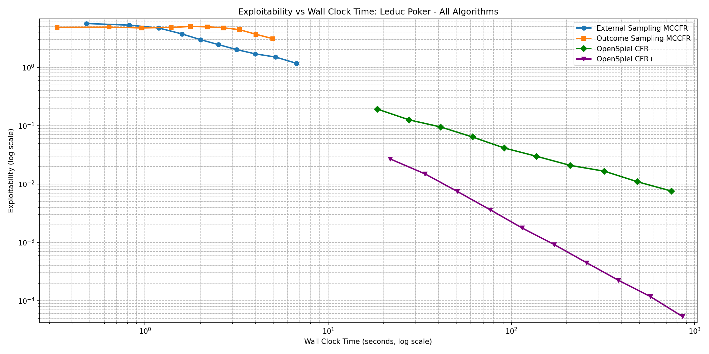
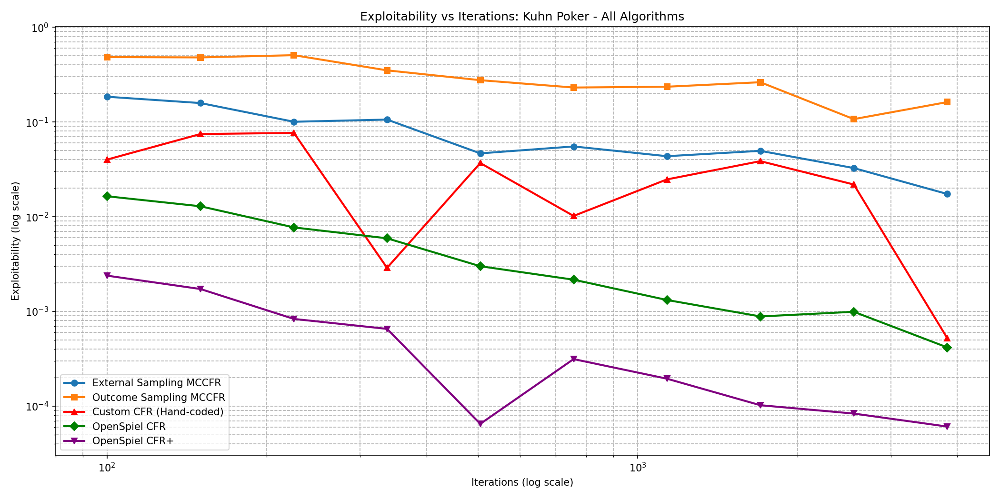

<!--
OFFICIAL PhD TITLE (keep consistent across all documents):
EN: Research on the possibilities for applying Artificial Intelligence in computer games
BG: Изследване на възможностите за приложение на изкуствения интелект в компютърни игри
-->
---
title: "Step 3 Summary — CFR Variants & Monte Carlo Methods"
subtitle: "Research on the possibilities for applying Artificial Intelligence in computer games"
author: "Alexander Andreev"
date: "April 2026"
lang: en
vars:
  research_focus: "Adaptive Strategy Learning in Multi-Agent Imperfect-Information Environments"
---

# Step 3 — CFR Variants & Monte Carlo Methods

This is a condensed summary of the scalability material covered in Step 3. It serves two purposes: as a quick refresher while progressing through later steps, and as a primary source for the Step 15 public report synthesis.

---

## Why Vanilla CFR Breaks at Scale

Step 2 established a working Vanilla CFR solver on Kuhn Poker — 12 information sets, 58 terminal nodes, solvable in milliseconds. That experience is deceptive. Vanilla CFR requires a **full traversal of the game tree on every iteration**, and real games are not Kuhn. Leduc Poker has 936 information sets (~78× larger); Limit Texas Hold'em has over $10^{14}$. No computer can enumerate that tree even once.

Step 3 closes the scale gap through two complementary mechanisms, developed independently in the game-theory literature and later combined in practice:

1. **CFR+ (Tammelin, 2014)** — a modification of vanilla CFR that achieves dramatically faster convergence through regret flooring, linear strategy averaging, and alternating updates. CFR+ was the algorithm that "solved" Heads-Up Limit Texas Hold'em in 2015 — the first non-trivial poker variant to be essentially solved.
2. **Monte Carlo CFR (Lanctot et al., 2009)** — instead of traversing the entire game tree each iteration, MCCFR samples a small portion. Each iteration is orders of magnitude cheaper, at the cost of noisier updates. This is the only tractable approach for games where full traversal is physically impossible.

For the thesis, MCCFR is the algorithm that computes the baseline Nash strategy — the "play it safe" anchor from which an adaptive agent deviates based on opponent observations (Contribution #1). CFR+ makes that computation tractable on the intermediate benchmark games used in Steps 5–8.

> **Read more:** Bowling, M., Burch, N., Johanson, M. & Tammelin, O. (2015). "Heads-up limit hold'em poker is solved." *Science*, 347(6218), 145–149.

---

## Monte Carlo Tree Search as Inspiration

Monte Carlo Tree Search (MCTS) is the canonical family of algorithms that use **random sampling** to evaluate positions in a game tree without exhaustive enumeration. Its design philosophy — "evaluate some branches to full depth instead of all branches to fixed depth" — directly motivates MCCFR.

MCTS builds an asymmetric search tree through four repeated phases:

1. **Selection** — descend from the root using a policy (typically UCB1, Upper Confidence Bound) that balances exploitation of known-good moves with exploration of under-visited ones.
2. **Expansion** — at a leaf, add one or more child nodes to the tree.
3. **Simulation (rollout)** — from the new node, play a random game to completion.
4. **Backpropagation** — propagate the terminal result back up the visited path, updating visit counts and cumulative rewards.

After many iterations, the child of the root with the highest visit count is selected as the best move. Random rollouts, aggregated over thousands of iterations, converge to accurate value estimates — even without any domain knowledge beyond the game rules.

Classical alternatives like **Minimax with alpha-beta pruning** evaluate every relevant node to a fixed depth, then apply a heuristic at the leaves. Both approaches have their regimes:

| Property | Minimax + α–β | MCTS |
|----------|--------------|------|
| Tree coverage | All branches to depth $d$ | Selected branches to terminal |
| Evaluation | Heuristic at depth limit | Exact (terminal payoff) or neural net |
| Branching factor sensitivity | Exponential: $O(b^d)$ | Graceful: focuses on promising branches |
| Domain knowledge needed | Strong eval function | None (random rollout) or learned |
| Best suited for | Moderate branching, good heuristics | High branching, weak/no heuristics |

For Go (branching factor ~250, no good evaluation function before neural networks), Minimax is impractical. MCTS was the breakthrough that made Go AI competitive; the same "sample instead of enumerate" principle carries over to imperfect-information game trees via MCCFR.

> **Read more:** Browne, C. et al. (2012). "A Survey of Monte Carlo Tree Search Methods." *IEEE Transactions on Computational Intelligence and AI in Games*, 4(1), 1–43.

---

## Markov Chains and the Law of Large Numbers

The "Monte Carlo" in MCCFR refers to a broad family of computational methods that use **repeated random sampling** to obtain numerical results. The name originates from the Manhattan Project, where Stanislaw Ulam and John von Neumann used random sampling to simulate neutron diffusion — a problem too complex for analytical solution.

The mathematical foundation rests on **Markov chains** — stochastic processes where the next state depends only on the current state, not on the history of how it was reached (the Markov property). A game tree traversal is a Markov chain: from any game state, the transition depends only on the current state and the action chosen.

The key theoretical guarantee is the **Law of Large Numbers**: if we sample enough trajectories through the Markov chain, the average of the sampled values converges to the true expected value. For MCCFR:

$$\frac{1}{T}\sum_{t=1}^{T} \hat{v}_I^{(t)} \xrightarrow{T \to \infty} v_I$$

where $\hat{v}_I^{(t)}$ is the sampled counterfactual value at information set $I$ on iteration $t$, and $v_I$ is the true value that vanilla CFR computes exactly. The sampled values are **unbiased estimators** — their expected value equals the true value — which guarantees convergence to the same Nash equilibrium as full-traversal CFR.

The cost is **variance**. Individual samples can deviate substantially from the true value, requiring more iterations to reach the same precision. That variance-for-speed tradeoff is the central theme of this step.

> **Read more:** Sutton, R.S. & Barto, A.G. (2018). *Reinforcement Learning: An Introduction*, Chapter 5 — Monte Carlo Methods.

---

## The Mathematics of Poker

Poker is the canonical testbed for imperfect-information game theory because it combines three sources of complexity that rarely co-occur:

1. **Hidden information** — each player sees only their own cards. The same observable game state (information set) can correspond to many different underlying game states.
2. **Stochastic elements** — card deals introduce chance nodes into the game tree. An optimal strategy must account for all possible deals, not just the observed one.
3. **Strategic deception** — unlike perfect-information games, poker rewards mixed strategies. A player who always bets with strong hands and checks with weak ones is trivially exploitable. Nash equilibrium requires **randomized bluffing at mathematically precise frequencies**.

The extensive-form framework from Step 2 carries over: game tree, information sets, strategies (mappings from information sets to action distributions), Nash equilibrium. The key quantities for evaluating strategies are:

- **Expected value (EV)** — average payoff under a given strategy pair.
- **Best response** — the optimal counter-strategy against a fixed opponent; the strongest possible exploitation.
- **Exploitability** — the average gain an opponent could obtain by playing a perfect best response. Nash equilibrium has exploitability zero.

Chen & Ankenman formalise these concepts through toy-game solutions where Nash bluffing frequencies can be derived analytically. Their half-street and full-street models build intuition for why CFR's output strategies contain the precise bluff/call ratios they do — a balanced player must bluff with a frequency proportional to the pot odds they offer.

> **Read more:** Chen, B. & Ankenman, J. (2006). *The Mathematics of Poker*. ConJelCo — analytical Nash derivations for toy poker games.

---

## Leduc Poker — Scaling Up the Benchmark

Kuhn Poker captures the essence of imperfect information in the smallest possible game tree. Leduc Poker scales that up by roughly two orders of magnitude — still solvable exactly, but large enough that algorithm differences become meaningful:

| Property | Kuhn Poker | Leduc Poker |
|----------|-----------|-------------|
| **Cards** | 3 (J, Q, K) | 6 ({J, Q, K} × {♠, ♥}) |
| **Rounds** | 1 | 2 (pre-flop + community card) |
| **Community card** | None | 1 revealed between rounds |
| **Hand ranking** | High card only | Pair (private = community) beats high card |
| **Bet sizes** | Fixed (1 chip) | Variable (2 in round 1, 4 in round 2) |
| **Max raises/round** | 1 | 2 |
| **Information sets** | 12 | 936 |
| **Game tree nodes** | 58 | 10,200 |
| **Chance outcomes** | 6 | 120 |

Three qualitatively new features appear:

- **Multi-round structure** — information changes between rounds (community card reveal), requiring strategies that adapt to new information.
- **Pair hands** — the hand ranking now depends on the community card; a Jack can become the best hand if a Jack is dealt on the board.
- **Larger bet sizes in later rounds** — the 4-chip raise in round 2 means decisions in later rounds carry more weight.

Despite being ~78× larger than Kuhn, Leduc remains small enough for exact computation (a full tree traversal takes ~50 ms). That makes it the ideal benchmark: large enough for performance differences to be meaningful, small enough that all algorithms can be run to near-convergence within minutes.

> **Read more:** Southey, F. et al. (2005). "Bayes' Bluff: Opponent Modelling in Poker." *UAI*.

---

## CFR+ — The Regret Flooring Trick

CFR+ makes three small changes to vanilla CFR, each trivial to implement but dramatic in effect.

**Regret flooring.** In vanilla CFR, cumulative regrets can become arbitrarily negative:

$$R^{T+1}(I, a) = R^T(I, a) + r^T(I, a)$$

CFR+ floors regrets at zero after every update:

$$R^{T+1}(I, a) = \max\left(R^T(I, a) + r^T(I, a),\ 0\right)$$

This prevents actions from accumulating large negative regret that takes many iterations to "pay off" before the action is reconsidered. The analogy to ReLU activations in neural networks is direct: both clip negative values to zero, preventing dead units (or dead actions) from requiring a long recovery period.

**Linear strategy averaging.** Vanilla CFR weights every iteration's strategy equally in the running average. CFR+ weights iteration $t$ by $t$ itself:

$$\bar{\sigma}^T(I, a) = \frac{\sum_{t=1}^{T} t \cdot \sigma^t(I, a)}{\sum_{t=1}^{T} t}$$

Later iterations — which have lower regret and better strategies — contribute more to the average. Early, noisy iterations are down-weighted.

**Alternating updates.** Instead of updating both players' regrets every iteration, CFR+ updates player 0 on odd iterations and player 1 on even iterations. This halves per-iteration work and provides a small convergence benefit by avoiding simultaneous strategy shifts.

**Combined effect:** empirical convergence improves from $O(1/\sqrt{T})$ to approximately $O(1/T)$. CFR+ with 1,000 iterations achieves what vanilla CFR needs ~1,000,000 iterations for. This is what made it feasible to solve Heads-Up Limit Texas Hold'em in 2015. Note: while the $O(1/T)$ rate is consistently observed, it lacks a formal proof — Tammelin et al. give the algorithm but not a convergence theorem matching the observed rate.

Empirically, on Leduc at 5,000 iterations CFR+ reaches exploitability ≈ 5.4×10⁻⁵ while vanilla CFR is still at ~7.6×10⁻³ — a ~140× improvement from three small modifications.

> **Read more:** Tammelin, O. (2014). "Solving Large Imperfect Information Games Using CFR+." *AAAI*.

---

## MCCFR — Sampling the Game Tree

MCCFR replaces full tree traversal with partial sampling. Two variants sit on the same variance-speed curve at different points:

| Variant | Chance nodes | Traverser's nodes | Opponent's nodes | Cost per iteration |
|---------|-------------|-------------------|------------------|-------------------:|
| **External Sampling** | Sample one deal | Explore **all** actions | **Sample** one action | ~42 nodes (~945× faster than full) |
| **Outcome Sampling** | Sample one deal | Sample one action (ε-on-policy) | Sample one action | ~5.5 nodes (~2,228× faster) |

**External Sampling** explores every action at the updating player's nodes but samples at chance and opponent nodes. Regrets for the traversing player are updated based on the sampled subtree. Since only one deal and one opponent path are visited, each iteration touches a tiny slice of the tree.

**Outcome Sampling** pushes sampling further: a single root-to-terminal trajectory is drawn. Because actions at the updating player's nodes are also sampled, the regret update must be corrected by **importance sampling** — the ratio of the true reach probability to the sampling probability. An ε-on-policy mixture (with probability ε, choose uniformly; otherwise follow the current strategy) ensures all actions are explored even when the current strategy assigns zero probability.

The critical theoretical property for both: sampled counterfactual values are **unbiased estimators** of the true values (Lanctot et al., Theorem 1). This guarantees convergence to the same Nash equilibrium as vanilla CFR, despite the sampling noise. The cost, as always with Monte Carlo, is variance. Each sampled update deviates from the true counterfactual value because it reflects only one possible deal, not the expectation over all deals.

On Kuhn Poker's 12 information sets, all four algorithms (vanilla CFR, CFR+, both MCCFR variants) reach near-Nash within seconds — the variance-speed tradeoff is invisible at this scale, and the choice of algorithm is academic:

To see the tradeoff emerge, the game tree has to be large enough that per-iteration cost matters. That is Leduc's role.

> **Read more:** Lanctot, M., Waugh, K., Zinkevich, M. & Bowling, M. (2009). "Monte Carlo Sampling for Regret Minimization in Extensive Games." *NeurIPS*.

---

## The Variance-Speed Tradeoff

All four algorithms follow $O(1/\sqrt{T})$ convergence, but the constants differ enormously. Writing exploitability as $\epsilon(T) = C / \sqrt{T}$, and converting to wall-clock via $C_w = C / \sqrt{\text{speed}}$:

| Algorithm | $C_{\text{iter}}$ | Speed (iter/s) | $C_w$ (wall-clock) | Relative to Vanilla |
|-----------|------------------:|---------------:|-------------------:|--------------------:|
| Vanilla CFR | 0.34 | 20.6 | **0.075** | 1.0× |
| CFR+ | 0.34 | 20.6 | **~0.002** | ~38× faster |
| MCCFR External | 107 | 19,470 | **0.767** | 10.2× slower |
| MCCFR Outcome | 245 | 45,901 | **1.143** | 15.3× slower |

The wall-clock constant is what determines real-world performance. Despite being 945× faster per iteration, External Sampling's variance constant (107 vs 0.34) is 315× larger. The speed advantage **does not overcome the variance penalty**:

$$\frac{99{,}000 \times \text{more iterations needed}}{945 \times \text{faster per iteration}} \approx 105 \times \text{more wall-clock time}$$

**Why does the variance exist?** Vanilla CFR computes **exact** counterfactual values by enumerating all 120 deals. Its regret update has zero variance. MCCFR samples one deal per iteration. Even if it explored the full subtree for that deal, it would still have variance across deals — a consequence of the hidden information itself, not a deficiency of the sampling scheme:

$$\mathrm{Var}[\hat{v}_I] = \mathbb{E}_{\text{deal}}\left[(\hat{v}_I - v_I)^2\right] \propto \frac{|N|}{|I|}$$

A formal 180-second timed benchmark of all four variants on Leduc makes the wall-clock comparison concrete. Per-iteration view (sampling variants complete millions of updates, full-traversal variants a few thousand):

Wall-clock view — the fair comparison (given equal compute, which algorithm produces the best strategy?):

CFR+ reaches exploitability 2.6×10⁻⁵ — nearly exact Nash — in 3 minutes. Vanilla CFR follows at 4.4×10⁻³. Both MCCFR variants lag by multiple orders of magnitude on this game size.

---

## When MCCFR Wins — The Crossover Point

The pattern above raises an obvious question: if MCCFR is always worse on Leduc, why was it invented? The answer is that vanilla CFR's per-iteration cost grows linearly in the tree size $|N|$, while MCCFR's is roughly constant. At sufficient scale the linear cost wins. The critical tree size is:

$$|N|_{\text{crossover}} = |N|_{\text{Leduc}} \cdot \left(\frac{C_{mc}}{C_v}\right)^2 \cdot \frac{\text{speed}_v}{\text{speed}_{mc}}$$

Plugging in measured values:

| Variant | $|N|_{\text{crossover}}$ |
|---------|-------------------------:|
| External Sampling | ~2.1 million nodes |
| Outcome Sampling | ~4.8 million nodes |

Compared against actual games:

| Game | $|N|$ | External wins? | Outcome wins? |
|------|------:|:--------------:|:-------------:|
| Leduc Poker | 10,200 | No (210× too small) | No (466× too small) |
| Limit Texas Hold'em | ~$10^{14}$ | Yes ($10^7$× above threshold) | Yes |
| No-Limit Texas Hold'em | ~$10^{17}$ | Yes ($10^{10}$× above threshold) | Yes |

Leduc sits 210× below the External Sampling crossover and 466× below the Outcome Sampling crossover. Full traversal dominates because the entire game tree fits in memory and can be enumerated in milliseconds. At real poker scales the conclusion reverses completely — even one full-traversal iteration of Hold'em would take longer than the age of the universe. At that scale, MCCFR (with variance-reduction extensions) becomes the **only** tractable approach.

---

## Connections to Step 2 and Forward Pointers

**Same principle, different regime.** Step 2 established full-traversal CFR on Kuhn and proved that minimizing regret locally at each information set drives the global strategy to Nash equilibrium. Step 3 preserves that principle but introduces two independent refinements: CFR+ modifies how regrets accumulate (flooring + linear weighting), and MCCFR modifies how regrets are measured (sampled estimator instead of exact expectation). Both still output the **average** strategy, not the final iteration — the same averaging mechanism that stabilizes vanilla CFR stabilizes every variant.

**Convergence rates.** Step 2 measured a log-log slope near $-0.5$ for Kuhn's exploitability, confirming $O(1/\sqrt{T})$. Step 3 shows that this rate is a property of the algorithm family, not of any one implementation — only CFR+'s empirical $O(1/T)$ is faster, and it lacks a formal proof. MCCFR stays at $O(1/\sqrt{T})$ with a dramatically larger constant.

**Forward:**

- **Step 4 (Game Abstraction & Scaling)** — attacks scalability from the opposite direction: instead of sampling the tree, reduce the tree itself through state and action abstraction. Combines with MCCFR to make real poker tractable.
- **Step 5 (Neural Equilibrium / Deep CFR)** — replaces tabular strategy storage with neural function approximators, using MCCFR's sampling framework as the data-generation engine. The variance properties established here explain why Deep CFR requires specific variance-reduction techniques (advantage networks, importance-weighted targets).
- **Step 6 (End-to-End Game AI)** — builds on both CFR+ and MCCFR for complete agents. The Leduc engine built for this step becomes the benchmark environment through Step 8.

**Open questions:**

- Why does CFR+ empirically achieve $O(1/T)$ when no proof matches that rate? The best current hypothesis is that regret flooring reshapes the trajectory of the regret-minimization dynamics in a way that classical convergence bounds do not capture.
- At what tree size does variance reduction (weighted average sampling, variance-reduced MCCFR) become essential rather than optional? The crossover formula tells us where plain MCCFR wins — but not where it stops winning without additional tricks.

> **Read more:** Brown, N. & Sandholm, T. (2017). "Safe and Nested Subgame Solving for Imperfect-Information Games." *NeurIPS* — bridges tabular CFR with subgame decomposition for real poker.
