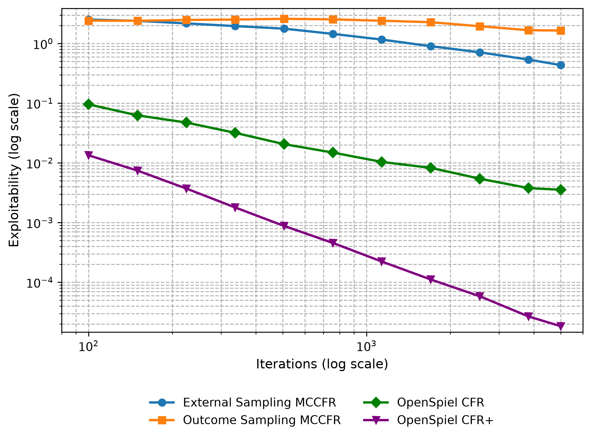
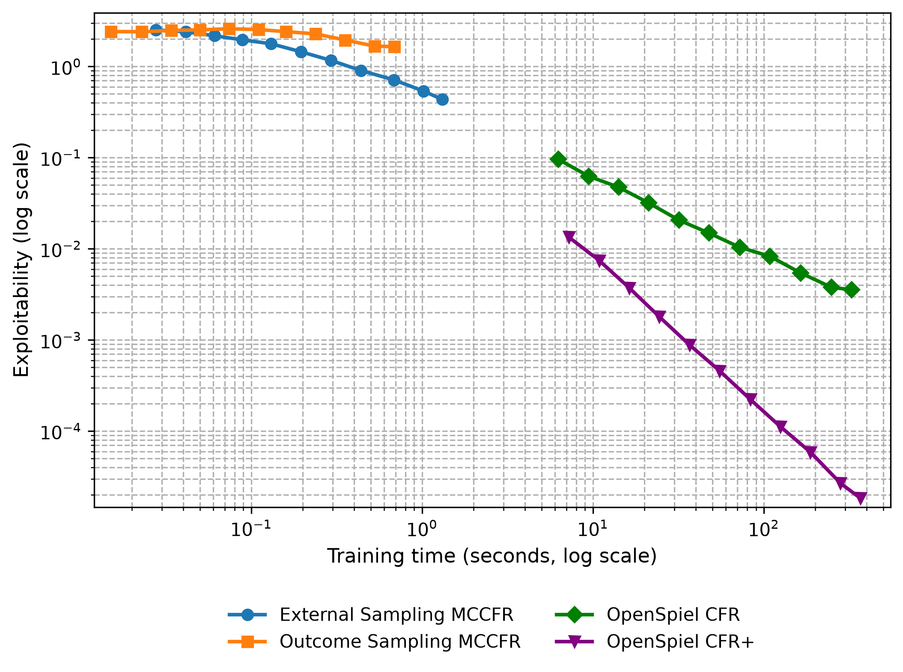
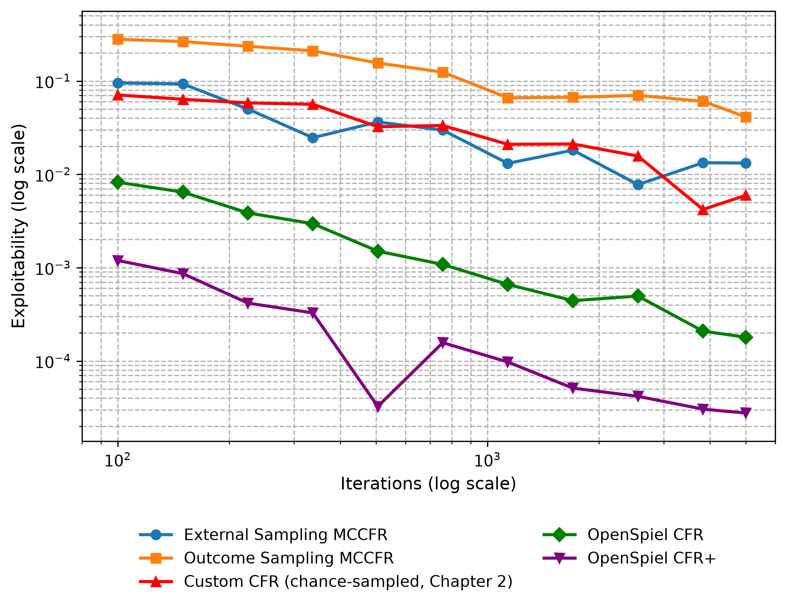
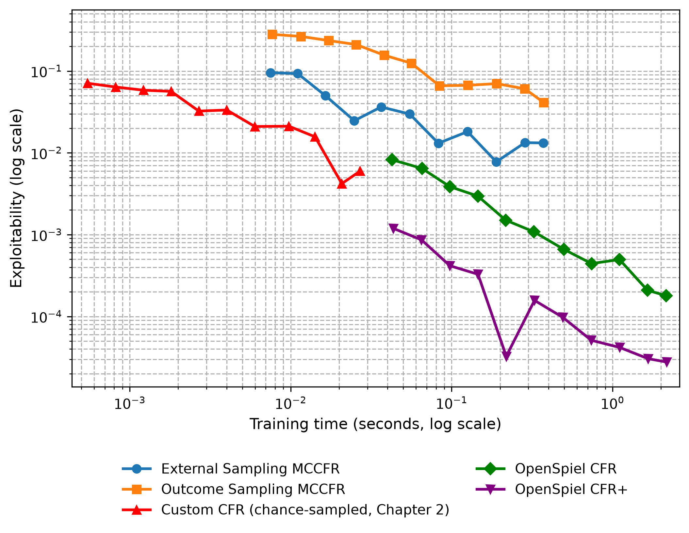
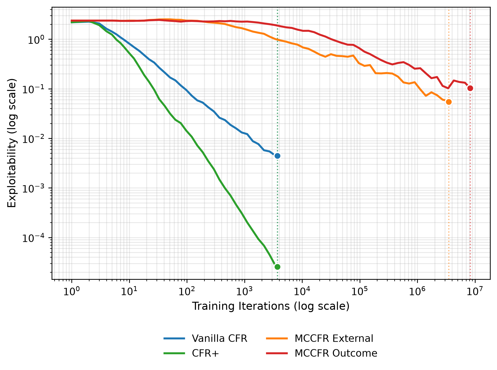
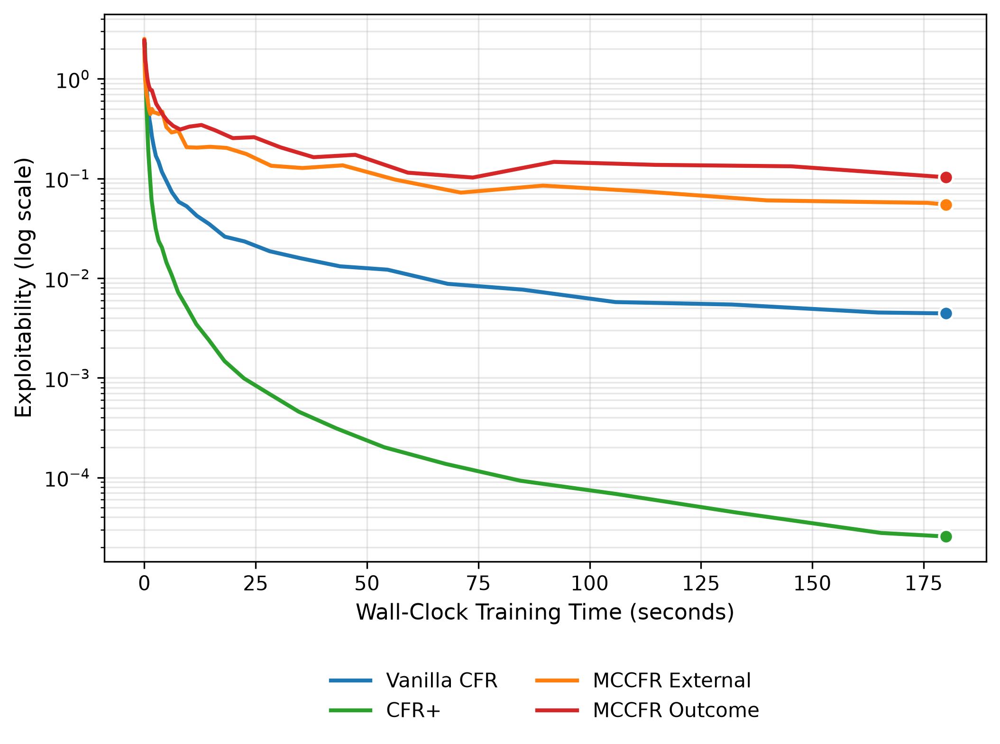

<!--
OFFICIAL PhD TITLE (keep consistent across all documents):
EN: Research on the possibilities for applying Artificial Intelligence in computer games
BG: Изследване на възможностите за приложение на изкуствения интелект в компютърни игри
-->
---
title: "Chapter 3 Summary — CFR Variants & Monte Carlo Methods"
subtitle: "Research on the possibilities for applying Artificial Intelligence in computer games"
author: "Alexander Andreev"
date: "April 2026"
lang: en
vars:
  research_focus: "Adaptive Strategy Learning in Multi-Agent Imperfect-Information Environments"
---

# Chapter 3 — CFR Variants & Monte Carlo Methods

---

## Why Vanilla CFR Breaks at Scale

Chapter 2 established a working Vanilla CFR solver on Kuhn Poker — 12 information sets, 58 nodes (30 terminal), solvable in milliseconds. That experience is deceptive. Vanilla CFR requires a **full traversal of the game tree on every iteration**, and real games are not Kuhn. Leduc Poker has 936 information sets (~78× larger); Limit Texas Hold'em has over $10^{14}$, and a single traversal of its tree took about an hour on 4,800 CPU cores (see Section 3.8).

Chapter 3 closes the scale gap through two complementary mechanisms: **CFR+ (Tammelin, 2014)**,[^cfrplus] which converges dramatically faster and was the algorithm that "solved" Heads-Up Limit Texas Hold'em in 2015, and **Monte Carlo CFR (Lanctot et al., 2009)**,[^mccfr] which samples a small portion of the tree instead of traversing all of it — each iteration orders of magnitude cheaper, at the cost of noisier updates. The other route, game abstraction, is the subject of Chapter 4.

For the thesis, these solvers compute the baseline Nash strategy — the "play it safe" anchor from which an adaptive agent deviates based on opponent observations (Contribution #1). On games of Kuhn and Leduc size that is CFR+ (see Section 3.7); MCCFR becomes necessary on larger games.

---

## Monte Carlo Tree Search as Inspiration

Monte Carlo Tree Search (MCTS) uses **random sampling** to evaluate positions in a game tree without exhaustive enumeration — "evaluate some branches to full depth instead of all branches to fixed depth." It grows an asymmetric tree, playing random games from promising nodes and propagating their results back up the visited path, whereas minimax with alpha-beta pruning evaluates every relevant node to a fixed depth and applies a heuristic at the leaves. For Go (branching factor ~250, no good evaluation function before neural networks), MCTS was the breakthrough; the same "sample instead of enumerate" principle carries over to imperfect-information game trees via MCCFR.[^browne2012]

---

## Markov Chains and the Law of Large Numbers

The "Monte Carlo" in MCCFR refers to a broad family of computational methods that use **repeated random sampling** to obtain numerical results. The key theoretical guarantee is the **Law of Large Numbers**: if enough trajectories are drawn independently, the average of the sampled values converges to the true expected value. For MCCFR, at a fixed strategy profile:

$$\frac{1}{T}\sum_{t=1}^{T} \hat{v}_I^{(t)} \xrightarrow{T \to \infty} v_I$$

where $\hat{v}_I^{(t)}$ is the sampled counterfactual value at information set $I$ on iteration $t$, and $v_I$ is the true value that vanilla CFR computes exactly. The sampled values are **unbiased estimators** — their expected value equals the true value — and, with sampling probabilities bounded away from zero, this gives with probability at least $1-p$ the same $O(1/\sqrt{T})$ decrease of average regret as full-traversal CFR.[^mccfr]

The cost is **variance**: individual samples can deviate substantially from the true value, requiring more iterations to reach the same precision. That variance-for-speed tradeoff is the central theme of this chapter.[^suttonbarto2018]

---

## Leduc Poker — Scaling Up the Benchmark

Kuhn Poker captures the essence of imperfect information in the smallest possible game tree. Leduc Poker scales that up by roughly two orders of magnitude — still solvable exactly, but large enough that algorithm differences become meaningful:

| Property | Kuhn Poker | Leduc Poker |
|----------|-----------|-------------|
| **Cards** | 3 (J, Q, K) | 6 ({J, Q, K} × {♠, ♥}) |
| **Rounds** | 1 | 2 (pre-flop + community card) |
| **Community card** | None | 1 revealed between rounds |
| **Hand ranking** | High card only | Pair (private = community) beats high card |
| **Bet sizes** | Fixed (1 chip) | Variable (2 in round 1, 4 in round 2) |
| **Max raises/round** | 1 | 2 |
| **Information sets** | 12 | 936 |
| **Game tree nodes** | 58 | 10,200 |
| **Chance outcomes** | 6 | 120 |

: Kuhn and Leduc Poker compared: cards, betting rounds, information sets and tree size.

Three qualitatively new features appear: information changes between rounds (the community card reveal), a Jack can become the best hand if a Jack is dealt on the board, and the 4-chip raise in round 2 makes later decisions carry more weight.

Despite being ~78× larger than Kuhn, Leduc remains small enough for exact computation (a full tree traversal takes ~50 ms). That makes it the ideal benchmark: large enough for performance differences to be meaningful, small enough that all algorithms can be run to near-convergence within minutes.[^southey2005]

---

## CFR+ — The Regret Flooring Trick

CFR+ makes three small changes to vanilla CFR, each trivial to implement but dramatic in effect.

**Regret flooring.** In vanilla CFR, cumulative regrets can become arbitrarily negative; CFR+ floors them at zero after every update:

$$R^{T+1}(I, a) = \max\left(R^T(I, a) + r^T(I, a),\ 0\right)$$

This prevents actions from accumulating large negative regret that takes many iterations to "pay off" before the action is reconsidered. The analogy to ReLU activations in neural networks is direct: both clip negative values to zero.

**Linear strategy averaging.** CFR+ weights iteration $t$'s strategy by $t$ in the running average, so later iterations — which have lower regret and better strategies — contribute more, and early, noisy iterations are down-weighted.

**Alternating updates.** CFR+ updates the two players in turn within each iteration, so the second player's update already sees the first player's new strategy.

**Combined effect:** empirical convergence improves from $O(1/\sqrt{T})$ to approximately $O(1/T)$. On Leduc, CFR+ reaches 2.0×10⁻⁴ after about 1,100 iterations; at vanilla CFR's measured rate the same value would take on the order of two million iterations (extrapolated). The $O(1/T)$ rate is consistently observed but unproven; what is proven is the family-wide $O(1/\sqrt{T})$ bound,[^tammelin2015] whose original proof was corrected by Burch et al.[^burch2019]

Exploitability here is the average best-response gain against the two players, $(BR_0 + BR_1)/2$; NashConv is their sum, i.e. twice as large. On Leduc after 5,000 iterations OpenSpiel's CFR+ reaches exploitability ≈ 1.8×10⁻⁵ while vanilla CFR is still at 3.6×10⁻³ — a ~190× improvement from two of the three modifications (both OpenSpiel solvers already alternate updates).[^cfrplus]

---

## MCCFR — Sampling the Game Tree

MCCFR replaces full tree traversal with partial sampling. Two variants sit on the same variance-speed curve at different points:

| Variant | Chance nodes | Traverser's nodes | Opponent's nodes | Cost per iteration |
|---------|-------------|-------------------|------------------|-------------------:|
| **External Sampling** | Sample one deal | Explore **all** actions | **Sample** one action | ~42 nodes (~945× faster than full) |
| **Outcome Sampling** | Sample one deal | Sample one action (ε-on-policy) | Sample one action | ~5.5 nodes (~2,228× faster) |

: External and outcome sampling: what each variant samples at every node type, and the resulting cost per iteration.

**External Sampling** explores every action at the updating player's nodes but samples at chance and opponent nodes, so each iteration touches a tiny slice of the tree. **Outcome Sampling** draws a single root-to-terminal trajectory; because actions at the updating player's nodes are also sampled, the regret update must be corrected by **importance sampling** — the ratio of the true reach probability to the sampling probability. An ε-on-policy mixture (with probability ε, choose uniformly; otherwise follow the current strategy) ensures all actions are explored even when the current strategy assigns zero probability.

For both, sampled counterfactual values are **unbiased estimators** of the true values (Lanctot et al., Lemma 1); together with their regret bounds (Theorems 4–5), this guarantees convergence to an approximate Nash equilibrium despite the sampling noise. The cost is variance: each sampled update reflects only one possible deal, not the expectation over all deals.

On Kuhn Poker every algorithm runs in seconds, and the ordering is already Leduc's: after 5,000 iterations CFR+ is at exploitability ≈ 3×10⁻⁵ and vanilla CFR at ≈ 2×10⁻⁴, external and outcome sampling at ≈ 0.013 and ≈ 0.04 (the chance-sampled Chapter 2 solver at ≈ 0.006):

To see the tradeoff emerge, the game tree has to be large enough that per-iteration cost matters. That is Leduc's role.[^mccfr]

---

## The Variance-Speed Tradeoff

All four algorithms have a guaranteed $O(1/\sqrt{T})$ upper bound on exploitability — CFR,[^zinkevich2007] MCCFR with probability at least $1-p$,[^mccfr] and CFR+.[^tammelin2015][^burch2019] Their measured rates differ: both MCCFR variants follow a slope of about $-0.4$ to $-0.5$, vanilla CFR about $-0.8$ and CFR+ about $-1.8$. The model $\epsilon(T) = C/\sqrt{T}$ below is therefore an approximation (for vanilla CFR, $\epsilon\sqrt{T}$ falls from 0.94 to 0.27) and does not apply to CFR+. Converting to wall-clock via $C_w = C/\sqrt{\text{speed}}$:

| Algorithm | $C_{\text{iter}}$ | Speed (iter/s) | $C_w$ (wall-clock) | $C_w$ relative to vanilla |
|-----------|------------------:|---------------:|-------------------:|--------------------:|
| Vanilla CFR | 0.34 | 20.6 | **0.075** | 1.0× |
| CFR+ | – | 20.6 | – | not $C/\sqrt{T}$ (see text) |
| MCCFR External | 107 | 19,470 | **0.767** | 10.2× (≈105× more time) |
| MCCFR Outcome | 245 | 45,901 | **1.143** | 15.3× (≈233× more time) |

: Measured convergence constants for the four solvers, per iteration and in wall-clock terms.

The wall-clock constant is what determines real-world performance. Despite being 945× faster per iteration, External Sampling's variance constant (107 vs 0.34) is 315× larger. The speed advantage **does not overcome the variance penalty**:

$$\frac{99{,}000 \times \text{more iterations needed}}{945 \times \text{faster per iteration}} \approx 105 \times \text{more wall-clock time}$$

**Why does the variance exist?** Vanilla CFR computes **exact** counterfactual values by enumerating all 120 deals. Its regret update has zero variance. MCCFR samples one deal per iteration. Even if it explored the full subtree for that deal, it would still have variance across deals — a consequence of sampling the chance event (the deal) itself, not of how the tree is explored within a deal.

A formal 180-second timed benchmark of all four variants on Leduc makes the wall-clock comparison concrete. Per-iteration view (sampling variants complete millions of updates, full-traversal variants a few thousand):

Wall-clock view — the fair comparison (given equal compute, which algorithm produces the best strategy?):

CFR+ reaches exploitability 2.6×10⁻⁵ — nearly exact Nash — in 3 minutes. Vanilla CFR follows at 4.4×10⁻³. Both MCCFR variants trail vanilla CFR by 12–23× and CFR+ by three to four orders of magnitude on this game size.

---

## When MCCFR Wins — The Crossover Point

The pattern above raises an obvious question: if MCCFR is always worse on Leduc, why was it invented? The answer is that vanilla CFR's per-iteration cost grows linearly in the tree size $|N|$, while MCCFR's grows far more slowly (roughly as $\sqrt{|N|}$ for external sampling[^mccfr]). At sufficient scale the linear cost wins. The critical tree size is:

$$|N|_{\text{crossover}} = |N|_{\text{Leduc}} \cdot \left(\frac{C_{mc}}{C_v}\right)^2 \cdot \frac{\text{speed}_v}{\text{speed}_{mc}}$$

Plugging in measured values:

| Variant | $|N|_{\text{crossover}}$ |
|---------|-------------------------:|
| External Sampling | ~1.1 million nodes |
| Outcome Sampling | ~2.4 million nodes |

: Game size at which MCCFR overtakes vanilla CFR, per sampling variant.

Compared against actual games:

| Game | $|N|$ | External wins? | Outcome wins? |
|------|------:|:--------------:|:-------------:|
| Leduc Poker | 10,200 | No (105× too small) | No (233× too small) |
| Heads-up limit Texas Hold'em | ~$3 \times 10^{17}$ | Yes by the model (~$10^{11}$× above), yet solved by full-traversal CFR+ | Yes by the model |
| No-Limit Texas Hold'em | up to ~$6 \times 10^{164}$ | Yes | Yes |

: The crossover threshold applied to three real games.

On Leduc, full traversal dominates because the entire game tree fits in memory and can be enumerated in milliseconds. The estimate is an order-of-magnitude figure for this implementation: the constants are measured on Leduc only, vanilla CFR is modelled as $C/\sqrt{T}$ although it converges faster, and if MCCFR's cost per iteration grows as $\sqrt{|N|}$ the same data put the threshold near $10^8$ nodes.

At real poker scales the conclusion reverses, though not uniformly. Heads-up limit hold'em ($3.16 \times 10^{17}$ states) was still solved by full-traversal CFR+ — 1,579 iterations of about 61 minutes each on 4,800 cores[^bowling2015] — and its authors report CFR+ needing considerably less computation than sampling CFR. No-limit hold'em (up to $6.31 \times 10^{164}$ states in the ACPC formats[^johanson2013]) is beyond any full traversal; there sampling — MCCFR combined with abstraction and variance-reduction extensions[^schmid2019] — is the practical route.

---

## Connections to Chapter 2 and Forward Pointers

**Same principle, different regime.** Chapter 3 keeps the principle of Chapter 2 — minimizing regret locally at each information set drives the global strategy to Nash equilibrium — but introduces two independent refinements: CFR+ modifies how regrets accumulate (flooring + linear weighting), and MCCFR modifies how regrets are measured (sampled estimator instead of exact expectation). Both normally output the **average** strategy, although the landmark CFR+ solve of heads-up limit hold'em used the players' current strategies instead.[^bowling2015]

**Forward:**

- **Chapter 4 (Game Abstraction & Scaling)** — reduces the tree itself through state and action abstraction; combined with MCCFR, this makes real poker tractable.
- **Chapter 5 (Neural Networks for Imperfect-Information Games)** — replaces tabular strategy storage with neural function approximators, using MCCFR's sampling framework as the data-generation engine. The variance properties established here explain why Deep CFR samples externally and why its outcome-sampling successor DREAM adds a learned baseline to control variance.
- **Chapter 6 (End-to-End Game AI Architectures)** — builds on both CFR+ and MCCFR for complete agents. The Leduc engine built for this chapter remains the benchmark environment in later chapters.[^brown2017]

<!-- Source footnotes. Definitions may sit anywhere at top level; keeping them
     together here keeps the prose readable and the EN/BG pair easy to compare. -->

[^cfrplus]: Tammelin, O. (2014). "Solving Large Imperfect Information Games Using CFR+." arXiv:1407.5042. The Heads-Up Limit Hold'em result is Bowling, M., Burch, N., Johanson, M. & Tammelin, O. (2015). "Heads-up limit hold'em poker is solved." *Science*, 347(6218), 145-149.

[^mccfr]: Lanctot, M., Waugh, K., Zinkevich, M. & Bowling, M. (2009). "Monte Carlo Sampling for Regret Minimization in Extensive Games." *Advances in Neural Information Processing Systems 22*, 1078-1086.

[^bowling2015]: Bowling, M., Burch, N., Johanson, M. & Tammelin, O. (2015). "Heads-up limit hold'em poker is solved." *Science*, 347(6218), 145–149. DOI 10.1126/science.1259433. Used CFR+ to solve heads-up limit Texas Hold'em — the first non-trivial imperfect-information game played competitively by humans to be essentially solved.

[^browne2012]: Browne, C. et al. (2012). "A Survey of Monte Carlo Tree Search Methods." *IEEE Transactions on Computational Intelligence and AI in Games*, 4(1), 1–43.

[^suttonbarto2018]: Sutton, R.S. & Barto, A.G. (2018). *Reinforcement Learning: An Introduction*, 2nd edition. MIT Press. Ch. 1 (the field); Ch. 3 (finite Markov decision processes); Ch. 4 (dynamic programming); Ch. 5 (Monte Carlo methods); Ch. 6 (temporal-difference learning). <http://incompleteideas.net/book/the-book-2nd.html>

[^southey2005]: Southey, F. et al. (2005). "Bayes' Bluff: Opponent Modelling in Poker." *UAI*. arXiv:1207.1411.

[^brown2017]: Brown, N. & Sandholm, T. (2017). "Safe and Nested Subgame Solving for Imperfect-Information Games." *NeurIPS* — bridges tabular CFR with subgame decomposition for real poker.

[^zinkevich2007]: Zinkevich, M., Johanson, M., Bowling, M. & Piccione, C. (2007). "Regret Minimization in Games with Incomplete Information." *Advances in Neural Information Processing Systems 20*.

[^tammelin2015]: Tammelin, O., Burch, N., Johanson, M. & Bowling, M. (2015). "Solving Heads-Up Limit Texas Hold'em." *Proc. IJCAI*, 645–652.

[^burch2019]: Burch, N., Moravčík, M. & Schmid, M. (2019). "Revisiting CFR+ and Alternating Updates." *Journal of Artificial Intelligence Research*, 64, 429–443. DOI 10.1613/jair.1.11370.

[^johanson2013]: Johanson, M. (2013). "Measuring the Size of Large No-Limit Poker Games." arXiv:1302.7008.

[^schmid2019]: Schmid, M., Burch, N., Lanctot, M., Moravčík, M., Kadlec, R. & Bowling, M. (2019). "Variance Reduction in Monte Carlo Counterfactual Regret Minimization (VR-MCCFR) for Extensive Form Games Using Baselines." *Proc. AAAI*, 33(01), 2157–2164.
