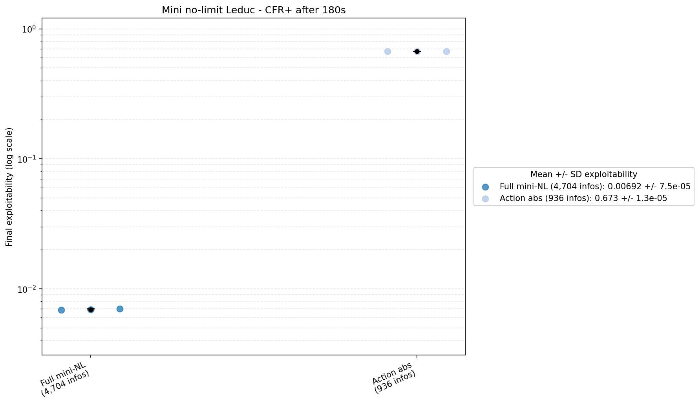
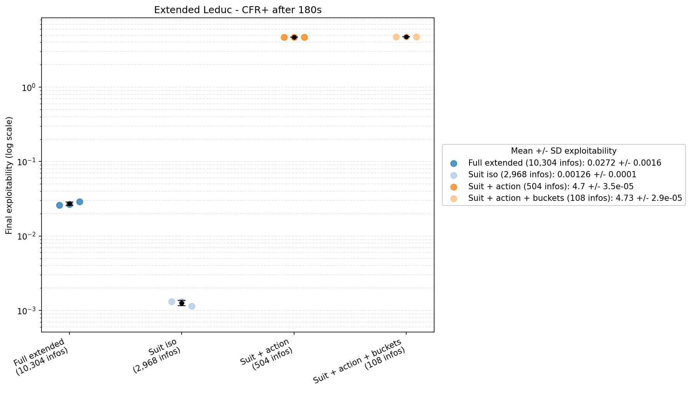
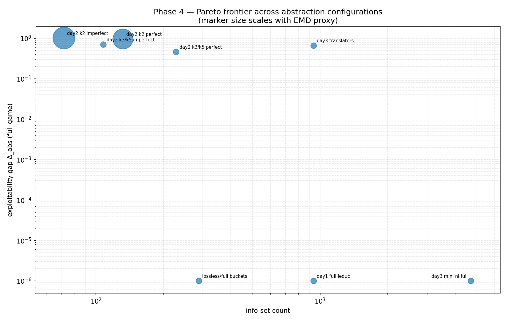

<!--
OFFICIAL PhD TITLE (keep consistent across all documents):
EN: Research on the possibilities for applying Artificial Intelligence in computer games
BG: Изследване на възможностите за приложение на изкуствения интелект в компютърни игри
-->

# Стъпка 04 — Абстракция на играта и мащабиране на игри с несъвършена информация: Доклад за реализацията

**Среда:** Май 2026
**Игри:** Ледюк с лимит (fixed-limit Leduc), Mini-NL Ледюк, разширен Ледюк
**Алгоритми:** Стандартен CFR, CFR+, MCCFR, абстракция на информацията/действията
**Цели:** Беззагубната абстракция запазва качеството на равновесието на Наш; абстракцията със загуби формира долна граница на експлоатируемостта; изготвена е Парето граница „размер на абстракцията спрямо експлоатируемост"
**Статус:** Основните цели са постигнати

---

## 1. Какво беше разработено

Стъпка 04 разширява инструментариума на CFR от Стъпка 03 с явна абстракция на играта. Реализацията изгражда конвейер за игрите от семейството Ледюк, който може да свие играта по три оси, да реши абстрахираната игра, да преведе получената стратегия обратно в пълната игра и да измери цената по отношение на експлоатируемостта.

**Структура на кода:**

```text
implementation/step04/
├── exploration/
│   ├── leduc_suit_abstracted.py       # ранен опит с изоморфизъм на цветовете
│   ├── leduc_lossy_abstracted.py      # ранен опит с групи по ранг (със загуби)
│   ├── day01_*                        # сравнителни скриптове CFR/MCCFR
│   ├── day02/mini_nl_leduc.py         # ранен вариант с променливи залози
│   └── figures/                       # фигури от проучвателната фаза
├── phase4/
│   ├── leduc_full_engine.py           # пълен Ледюк с лимит (базов вариант)
│   ├── leduc_rank_engine.py           # Ледюк, каноничен по ранг / изоморфен по цвят
│   ├── mini_nl_leduc.py               # Mini-NL Ледюк с променливи залози
│   ├── extended_leduc.py              # вариант на Ледюк с 4 ранга и 2 цвята
│   ├── cfr_trainer.py                 # обобщен модул за обучение със стандартен CFR
│   ├── exploitability.py              # оценител на експлоатируемостта в пълната игра
│   ├── day01_*                        # експерименти с беззагубен изоморфизъм на цветовете
│   ├── day02_*                        # групиране на карти, HSD, EMD, k-средни
│   ├── day03_*                        # абстракция на действията и преводачи
│   ├── day04_*                        # обединен конвейер за абстракция
│   ├── day05_*                        # пропуск в експлоатируемостта и Парето граница
│   ├── day06_openspiel_compare.py     # кръстосана проверка спрямо OpenSpiel
│   └── day07_cfrplus_panels.py        # панели на CFR+ с бюджет от 180 s
└── EXPERIMENT_RESULTS.md              # обобщение на крайните резултати с CFR+
```

---

## 2. Модули за абстракция

### 2.1 Беззагубен изоморфизъм на цветовете

В Ледюк цветовете не носят стратегическа информация, защото печалбите зависят само от ранга и от това дали скритата карта образува двойка с общата карта. Затова Стъпка 04 реализира двигатели, канонизирани по ранг, които сливат изоморфните по цвят информационни множества.

Тази абстракция е беззагубна (lossless): тя запазва качеството на равновесието на Наш, като същевременно намалява броя на информационните множества и увеличава броя на CFR/CFR+ итерациите, постижими в рамките на същия бюджет в реално време.

### 2.2 Групиране на карти със загуби

Пътят на абстракция със загуби изчислява признаци за силата на ръката, сравнява кандидатите за групи чрез разстояния в стила на EMD и групира информационните множества с конфигурируем брой групи.

Представени са два режима на памет:

| Режим | Значение |
|---|---|
| Групи със съвършена памет (perfect-recall) | Групиране само по силата на текущата скрита/обща карта, но със запазване на следата от предишни групи |
| Групи с несъвършена памет (imperfect-recall) | Замяна на част от предишната история с идентичността на групата, с което дървото се свива по-агресивно |

Целта на тази абстракция не е да бъде точна. Целта е да се измери долната граница на експлоатируемостта, която възниква при сливането на стратегически различни състояния.

### 2.3 Абстракция и превод на действията

Mini-NL Ледюк въвежда променливи размери на залозите. Абстракцията на действията ограничава множеството от допустими действия и оценява как се представя абстрактната стратегия, когато бъде разгърната в играта с пълното множество от действия.

Реализирани преводачи:

| Преводач | Роля |
|---|---|
| Към най-близкото действие (nearest-action) | Преобразува залог извън мрежата към най-близкия абстрактен залог |
| Вероятностно разделяне (probability-split) | Разпределя масата между съседните абстрактни залози |
| Псевдохармоничен (pseudo-harmonic) | Специфична за покера интерполация в пространството на коефициентите; реализиран е за сравнение и за бъдещо разширение |

### 2.4 Разширена и обединена абстракция

Разширеният Ледюк увеличава мащаба на еталонната игра до четири ранга и два цвята. Обединеният конвейер съчетава изоморфизъм на цветовете, абстракция на действията и групиране на карти, след което оценява получената стратегия в съответното семейство пълни игри.

---

## 3. Еталонен тест на CFR+ с фиксиран времеви бюджет

Финалният еталонен тест използва CFR+ с ограничаване отдолу на съжаленията и линейно осредняване на стратегията.

| Настройка | Стойност |
|---|---|
| Бюджет за обучение | 180 секунди на конфигурация |
| Повторения | 3 изпълнения, семена 1, 2, 3 |
| Метрика | Крайна експлоатируемост след обучение |
| Сурови резултати | `phase4/.day07_cfrplus_results.json`, `phase4/.day07_cfrplus_results.csv` |

### 3.1 Ледюк с лимит


| Конфигурация | Инф. множества | Средна експлоатируемост | Средно итерации |
|---|---:|---:|---:|
| Пълен CFR+ | 936 | 4,44×10⁻⁵ | 2 655 |
| Изоморфизъм на цветовете | 288 | 3,13×10⁻⁶ | 14 185 |
| k2, съвършена памет | 132 | 0,571 | 11 399 |
| k3, съвършена памет | 228 | 0,382 | 11 043 |
| Пълно групиране, съвършена памет | 288 | 4,18×10⁻⁶ | 10 806 |

Беззагубният изоморфизъм на цветовете е най-добрият резултат при Ледюк с лимит. Той намалява паметта и достига по-ниска експлоатируемост от пълния CFR+ при еднакъв бюджет в реално време, тъй като изпълнява много повече итерации. Вариантите с пълно групиране се държат подобно, защото след като случаите по ранг и след флопа се разделят, останалата компресия на практика е изоморфизъм на цветовете.

Грубите групи със загуби остават силно експлоатируеми. Допълнителните итерации на CFR+ не затварят тази разлика, защото самата абстракция е премахнала стратегически релевантна информация.

### 3.2 Mini-NL Ледюк



| Конфигурация | Инф. множества | Средна експлоатируемост | Средно итерации |
|---|---:|---:|---:|
| Пълен Mini-NL | 4 704 | 0,00692 | 439 |
| Абстракция на действията | 936 | 0,673 | 2 338 |

Играта с абстракция на действията извършва много повече итерации, защото дървото е по-малко, но крайната експлоатируемост остава висока. Това е най-силното свидетелство в стъпката, че абстракцията на действията и преводът при разгръщане могат да доминират над общата грешка.

### 3.3 Разширен Ледюк



| Конфигурация | Инф. множества | Средна експлоатируемост | Средно итерации |
|---|---:|---:|---:|
| Пълен разширен | 10 304 | 0,0272 | 111 |
| Изоморфизъм на цветовете | 2 968 | 0,00126 | 671 |
| Цветове + действия | 504 | 4,696 | 4 145 |
| Цветове + действия + групи | 108 | 4,734 | 3 694 |

Разширеният Ледюк потвърждава стойността на беззагубната абстракция в по-голям мащаб: изоморфизмът на цветовете намалява броя на информационните множества с около 71 % и достига значително по-ниска експлоатируемост при същия бюджет в реално време. Конфигурациите с абстракция на действията са полезни като примери за неуспех: агресивната компресия на действията създава компактни игри, но преведените стратегии са силно експлоатируеми в играта с пълното множество от действия.

---

## 4. Парето граница



Парето границата обобщава централния компромис в Стъпка 04: по-малките абстрактни игри се обучават по-бързо, но не всяко съкращение е стратегически безопасно.

| Семейство абстракции | Резултат |
|---|---|
| Изоморфизъм на цветовете | Най-добър компромис; по-малка игра без стратегическа загуба в Ледюк |
| Пълни групи по ранг | Поведение, близко до изоморфизма на цветовете |
| Груби групи със загуби | По-малки дървета, постоянна долна граница на експлоатируемостта |
| Абстракция на действията | Най-голям риск; грешката от превода доминира в Mini-NL и разширен Ледюк |

Следователно практическият критерий не е просто „колкото по-малко, толкова по-добре". Полезната абстракция трябва да спестява достатъчно изчислителна работа, за да компенсира пропуска в експлоатируемостта, който въвежда.

---

## 5. Кръстосана проверка

`day06_openspiel_compare.py` подравнява всичките 936 информационни множества на Ледюк спрямо OpenSpiel и проверява, че собствената реализация е в същия стратегически режим. Останалите разлики се интерпретират като различия в конвенциите за актуализация, а не като точни несъответствия в траекториите, така че това е проверка за изправност, а не доказателство за идентична динамика на решителя.

---

## 6. Ключови изводи

1. **Беззагубната абстракция е компресията с най-висока стойност.** В семейството на игрите Ледюк изоморфизмът на цветовете намалява играта значително и подобрява сходимостта в реално време, без да въвежда грешка от абстракция.
2. **Информационната абстракция със загуби формира долна граница на експлоатируемостта.** Грубите групи по карти се решават по-бързо, но не могат да възстановят разграничения, които са били умишлено премахнати.
3. **Абстракцията на действията е по-опасна от абстракцията на картите в тези експерименти.** Ограничените множества от действия в комбинация с превода породиха висока експлоатируемост дори когато абстрактното дърво беше много по-малко.
4. **Парето границата е правилният формат за представяне на резултатите.** Качеството на стратегията трябва да се представя заедно с размера на играта и типа на абстракцията.
5. **Решаването на подигри е естественият следващ механизъм.** Статичният превод е крехък; безопасното и вложеното решаване от Стъпка 6 представляват промишления отговор на действия извън дървото.

---

## 7. Възпроизвеждане

```bash
# От корена на хранилището:
cd implementation/step04/phase4

# Бързи проверки със смалени бюджети, използвани от интеграционните бележки на фаза 4:
python day01_train.py --iterations 200
python day02_train.py --iterations 200
python day03_train.py --iterations 100
python day04_train.py --iterations 20000
python day05_train.py
python day06_openspiel_compare.py --iterations 200

# Финални панели на еталонния тест с CFR+:
python day07_cfrplus_panels.py
```

Генерираните файлове JSON/CSV се записват в `implementation/step04/phase4/`, а фигурите — в `implementation/step04/phase4/figures/`.
