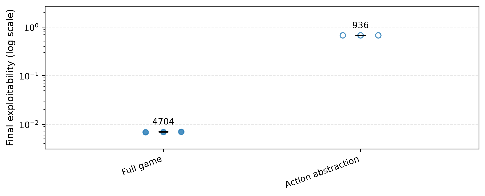
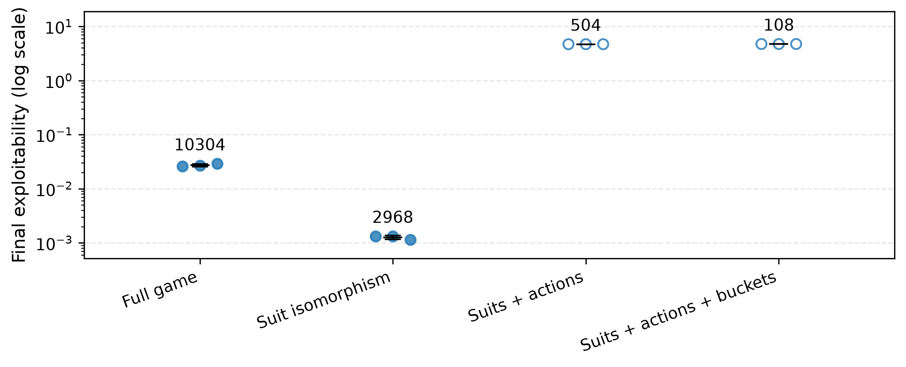

<!--
OFFICIAL PhD TITLE (keep consistent across all documents):
EN: Research on the possibilities for applying Artificial Intelligence in computer games
BG: Изследване на възможностите за приложение на изкуствения интелект в компютърни игри
-->

# Глава 04 - Абстракция на играта и мащабиране на игри с непълна информация: Доклад за внедряването

**Среда:** Май 2026 г.  
**Игри:** Ледюк с фиксиран лимит, Mini-NL Ледюк, Extended Ледюк  
**Алгоритми:** обикновен вариант на CFR, CFR+, MCCFR, абстракция на информацията/действията  
**Цели:** беззагубната абстракция съхранява качеството на Нашово равновесие; абстракцията със загуби разкрива праг на експлоатируемост; изградена е Парето граница между размера на абстракцията и експлоатируемостта  
**Статус:** Основните цели са постигнати

---

## 1. Какво беше разработено

Глава 04 разширява CFR toolkit от Глава 03 с изрична **абстракция на играта**. Реализацията изгражда **конвейер от типа „Ледюк“**, който може да свие играта по три оси, да реши **абстрахираната** игра, да преведе получената **стратегия** обратно в пълната игра и да измери **разхода за експлоатируемост**.

## 1. Какво беше разработено

```text
implementation/step04/
├── exploration/
│   ├── leduc_suit_abstracted.py       # early suit-isomorphism probe
│   ├── leduc_lossy_abstracted.py      # early lossy rank-bucket probe
│   ├── day01_*                        # CFR/MCCFR comparison scripts
│   ├── day02/mini_nl_leduc.py         # early variable-bet game
│   └── figures/                       # exploration figures
├── phase4/
│   ├── leduc_full_engine.py           # full fixed-limit Leduc baseline
│   ├── leduc_rank_engine.py           # rank-canonical / suit-isomorphic Leduc
│   ├── mini_nl_leduc.py               # variable-bet Mini-NL Leduc
│   ├── extended_leduc.py              # 4-rank, 2-suit Leduc variant
│   ├── cfr_trainer.py                 # generic vanilla CFR trainer
│   ├── exploitability.py              # full-game exploitability evaluator
│   ├── day01_*                        # lossless suit-isomorphism experiments
│   ├── day02_*                        # card bucketing, HSD, EMD, k-means
│   ├── day03_*                        # action abstraction and translators
│   ├── day04_*                        # combined abstraction pipeline
│   ├── day05_*                        # exploitability gap and Pareto frontier
│   ├── day06_openspiel_compare.py     # OpenSpiel cross-validation
│   └── day07_cfrplus_panels.py        # 180 s CFR+ benchmark panels
└── EXPERIMENT_RESULTS.md              # final CFR+ result summary
```

---

## 2. Модули за абстракция

### 2.1 Беззагубен изоморфизъм на боите

Боите в Ледюк не носят стратегическа информация, тъй като изплащанията зависят единствено от ранга и дали тайната карта съвпада с общата карта. Поради това глава 04 реализира двигатели с ранг-канонична форма, които обединяват информационните множества, изоморфни по боя.

Тази абстракция е беззагубна: тя запазва качеството на Нашовото равновесие, като същевременно намалява броя на информационните множества и увеличава броя на възможните итерации на CFR/CFR+ при същия бюджет в реално време.

### 2.2 Загубено групиране на карти

Пътят на абстракцията със загуби изчислява характеристики за силата на ръката, сравнява кандидатите за клъстери чрез разстояния от ЕМД тип и групира информационните множества с конфигурируем брой клъстери.

Два режима на извикване са представени:

| Режим | Значение |
|---|---|
| Кошчета с пълно припомняне | Групиране на текущата сила на частната/общата карта, като се запазва предишната **траектория на клъстерите** |
| Кошчета с непълна памет | Замяна на част от по-ранната история с идентичността на **клъстера**, което води до по-агресивно свиване на дървото |

Целта не е да се постигне точност в тази **абстракция**. Целта е да се измери **прагът на експлоатируемост**, породен от обединяването на стратегически различни състояния.

### 2.3 Абстракция на действията и превод

Mini-NL Ледюк въвежда променливи размери на залозите. Абстракцията на действията след това редуцира множеството действия и оценява как абстрактната стратегия се представя при прилагането ѝ в игра с пълно множество действия.

Имплементирани преводачи:

| Преводач | Роля |
|---|---|
| Най-близко действие | Преобразуване на залог извън мрежата в най-близкия абстрактен залог |
| Вероятностно разпределение | Разпределяне на маса между съседни абстрактни залози |
| Псевдохармоничен | Интерполация в пространството на коефициентите, специфична за покера; имплементирана с цел сравнение и бъдещо разширение |

### 2.4 Разширена и комбинирана абстракция

Extended Ледюк увеличава еталонния тест до четири ранга и две бои. Комбинираният конвейер съставя изоморфизма на боите, абстракцията на действията и групирането на карти, след което оценява получената стратегия в подходящото пълно игрово семейство.

---

## 3. Еталонен тест на CFR+ с ограничено време

Окончателният еталонен тест използва CFR+ с подово ограничаване на съжалението и усредняване на линейни стратегии.

| Настройка | Стойност |
|---|---|
| Обучителен бюджет | 180 секунди за всяка конфигурация |
| Повторения | 3 изпълнения със семена 1, 2 и 3 |
| Метрика | Крайна експлоатируемост след обучението |
| Сурови изходи | `phase4/.day07_cfrplus_results.json`, `phase4/.day07_cfrplus_results.csv` |

### 3.1 Ледюк с фиксиран лимит


| Конфигурация | Информационни множества | Средна експлоатируемост | Среден брой итерации |
|---|---:|---:|---:|
| Пълен CFR+ | 936 | 4.44e-05 | 2,655 |
| Suit iso | 288 | 3.13e-06 | 14,185 |
| k2 perfect | 132 | 0.571 | 11,399 |
| k3 perfect | 228 | 0.382 | 11,043 |
| full bucket perfect | 288 | 4.18e-06 | 10,806 |

Беззагубната абстракция с изоморфизъм на боите дава най-добрия резултат при фиксиран лимит. Тя намалява изискванията към паметта и постига по-ниска експлоатируемост от пълния CFR+ в рамките на същия бюджет в реално време, тъй като успява да изпълни значително повече итерации. Вариантите с пълен клъстер се държат сходно, защото след разделянето на случаите според ранга/флопа оставащото компресиране на практика представлява изоморфизъм на боите.

Загубените груби интервали остават силно експлоатируеми. Допълнителните итерации на CFR+ не успяват да преодолеят тази разлика, тъй като самата абстракция е премахнала стратегически релевантна информация.

### 3.2 Mini-NL Ледюк



| Конфигурация | Информационни множества | Средна експлоатируемост | Средни итерации |
|---|---:|---:|---:|
| Пълно mini-NL | 4,704 | 0.00692 | 439 |
| Абстракция на действията | 936 | 0.673 | 2,338 |

Играта с **абстракция на действията** изисква значително повече **итерации**, тъй като дървото е по-малко, но крайната **експлоатируемост** остава висока. Това представлява най-силното доказателство в тази глава, че **абстракцията на действията** и **преводът на внедряване** могат да доминират общата грешка.

### 3.3 Extended Ледюк



| Конфигурация | Информационни множества | Средна експлоатируемост | Средна стойност на итерациите |
|---|---:|---:|---:|
| Пълно разширено | 10,304 | 0.0272 | 111 |
| Изоморфизъм на боя | 2,968 | 0.00126 | 671 |
| Боя и действие | 504 | 4.696 | 4,145 |
| Боя, действие и клъстери | 108 | 4.734 | 3,694 |

Extended Ледюк потвърждава стойността на беззагубната абстракция в по-голям мащаб: изоморфизмът на боите намалява броя информационни множества с около 71% и постига значително по-ниска експлоатируемост при същия бюджет в реално време. Конфигурациите с абстракция на действията са полезни като пример за неуспех: агресивната компресия на действията води до компактни игри, но преведените стратегии се оказват силно експлоатируеми в по-пълната игра с действия.

---

## 4. Парето граница


Парето границата обобщава основния компромис от Глава 04: по-малките абстрактни игри се обучават по-бързо, но не всяко съкращение е стратегически **безопасно**.

| Семейство абстракции | Резултат |
|---|---|
| Изоморфизъм на боите | Най-добър компромис; по-малка игра без стратегическа загуба в Ледюк |
| Пълни рангови клъстери | Поведение, близко до изоморфизма на боите |
| Груби загубени клъстери | По-малки дървета, с постоянен праг на експлоатируемост |
| Абстракция на действията | Най-голям риск; грешка при превода доминира в mini-NL и Extended Ледюк |

Практичният критерий следователно не е просто „по-малкото е по-добро“. Полезната абстракция трябва да осигури достатъчно подобрение на изчислителната мощност, за да компенсира въведената експлоатируема разлика.

---

## 5. Кръстосана проверка

`day06_openspiel_compare.py` подравнява всички 936 информационни множества на Ледюк спрямо OpenSpiel и проверява дали персонализираната имплементация е в същия стратегически режим. Оставащите разминавания се интерпретират като разминавания в конвенциите за обновяване, а не като точни несъответствия в траекториите, така че това представлява проверка за коректност, а не доказателство за идентична динамика на решавача.

---

## 6. Ключови изводи

1. **Беззагубната абстракция представлява компресията с най-висока стойност.** В игрите от типа на Ледюк изоморфизмът на боите съществено намалява играта и подобрява сходимостта в реално време, без да въвежда грешка на абстракцията.
2. **Загубената информационна абстракция поражда праг на експлоатируемост.** Грубите клъстери за карти се решават по-бързо, но не могат да възстановят различията, които умишлено са премахнали.
3. **Абстракцията на действията е по-опасна от абстракцията на карти в тези експерименти.** Ограничени множества от действия плюс статичен превод доведоха до висока експлоатируемост, дори когато абстрактното дърво беше значително по-малко.
4. **Парето границата е подходящият формат за докладване.** Качеството на стратегията трябва да бъде представено заедно с размера на играта и типа абстракция.
5. **Решаването на под-игра е естественият следващ механизъм.** Статичният превод е крехък; методите за безопасно решаване от Глава 6 представляват производствения стандартен отговор на действия извън дървото.

---

## 7. Възпроизвеждане

```bash
# From repo root:
cd implementation/step04/phase4

# Smoke-test budget used by the phase-4 integration notes:
python day01_train.py --iterations 200
python day02_train.py --iterations 200
python day03_train.py --iterations 100
python day04_train.py --iterations 20000
python day05_train.py
python day06_openspiel_compare.py --iterations 200

# Final CFR+ benchmark panels:
python day07_cfrplus_panels.py
```

Генерираните JSON/CSV файлове се записват в директорията `implementation/step04/phase4/`, а фигурите - в `implementation/step04/phase4/figures/`.
