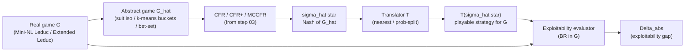

<!--
OFFICIAL PhD TITLE (keep consistent across all documents):
EN: Research on the possibilities for applying Artificial Intelligence in computer games
BG: Изследване на възможностите за приложение на изкуствения интелект в компютърни игри
-->

# Step 04 — Game Abstraction & Scaling Imperfect-Information Games: Implementation Report

**Environment:** May 2026
**Games:** Leduc Poker (6 cards) · Mini-NL Leduc (variable bet sizes) · Extended Leduc (4 ranks, 2 suits — TBD)
**Algorithms:** Vanilla CFR / CFR+ / MCCFR with explicit information & action abstraction
**Targets:** Lossless abstraction reproduces Nash exactly · Lossy abstraction quantifies an exploitability floor · Pareto frontier (info-set count vs exploitability gap) measured end-to-end
**Status:** WIP — initial pass

---

## Table of Contents

1. [What this step is about](#1-what-this-step-is-about)
2. [Why abstraction is needed](#2-why-abstraction-is-needed)
   - [2.5 Two routes to abstraction](#25-two-routes-to-abstraction)
3. [Two axes of abstraction](#3-two-axes-of-abstraction)
   - [3.1 Information abstraction (lossless / lossy)](#31-information-abstraction-lossless--lossy)
   - [3.2 Action abstraction and the translation problem](#32-action-abstraction-and-the-translation-problem)
   - [3.3 Real-time refinement (placeholder)](#33-real-time-refinement-placeholder)
4. [The exploitability gap](#4-the-exploitability-gap)
5. [Pipeline overview](#5-pipeline-overview)
6. [Algorithm catalogue](#6-algorithm-catalogue)
   - [6.1 The merging criterion (when can I collapse two info sets?)](#61-the-merging-criterion-when-can-i-collapse-two-info-sets)
   - [6.2 The error budget (how much exploitability does a merge cost?)](#62-the-error-budget-how-much-exploitability-does-a-merge-cost)
   - [6.3 The build-time pipeline (how do I actually compute the abstraction?)](#63-the-build-time-pipeline-how-do-i-actually-compute-the-abstraction)
   - [6.4 The runtime patch (what to do when abstraction is inadequate at play time?)](#64-the-runtime-patch-what-to-do-when-abstraction-is-inadequate-at-play-time)
7. [Implementation results — TBD](#7-implementation-results)
8. [Pareto frontier — TBD](#8-pareto-frontier)
9. [Reproduction — TBD](#9-reproduction)
10. [Exit checklist — TBD](#10-exit-checklist)
11. [Explicit vs implicit recap — TBD](#11-explicit-vs-implicit-recap)

---

## 1. What this step is about

Steps 1–3 built the algorithms (DQN/PPO; Vanilla CFR; CFR+ and MCCFR external/outcome). Each was demonstrated on a game small enough to enumerate exactly: Kuhn (12 information sets), Leduc (936). That toolkit is complete — but it only works when the entire game tree fits in memory.

Step 04 is the bridge from "toy games we can enumerate" to "games we cannot." The mechanism is **abstraction**: deliberately collapse parts of the game so the same algorithms can run on a smaller, structurally simpler proxy, and measure what that costs in strategy quality. By the end of this step the deliverable contains a quantitative answer to the central question of every practical poker AI since 2007:

> *How much can the game be shrunk before the abstract Nash strategy stops being a good strategy in the real game?*

That answer takes the form of a Pareto curve (§8): on one axis, the size of the abstracted game; on the other, the **exploitability gap** — how much worse the abstract strategy is than the real game's exact Nash. Both metrics are introduced formally in §4.

---

## 2. Why abstraction is needed

A game tree's size is the product of three factors: (a) the number of distinct hidden states the chance node can produce, (b) the branching factor at each decision point, and (c) the depth (decisions until terminal). Each of the three blows up independently:

- **Hidden states** — Texas Hold'em deals 2 hole cards from 52, then up to 5 board cards. The number of hand-vs-board distinguishable situations is on the order of $10^{17}$ before counting betting history.
- **Branching factor** — No-limit poker allows any bet size from "min raise" to "all-in." Even discretising to a handful of sizes pushes per-node branching from 3 (fold/call/raise in fixed-limit) to 5–10.
- **Depth** — Multiple betting rounds, each potentially with several raises, multiply.

The combined number of information sets in heads-up no-limit Hold'em is $\sim 10^{161}$ — more than there are atoms in the observable universe by a factor of $\sim 10^{80}$. None of step 03's algorithms can run on that tree.

The recipe is the same in every step-4 paper: *build a smaller game whose strategies translate back into playable strategies for the real game, run the step-03 algorithms on that smaller game, then bound the damage.* That recipe has two routes.

### 2.5 Two routes to abstraction

The word "abstraction" in this literature actually covers two operationally different things. Both are used in modern game AI; both will appear in this thesis; conflating them is a category error. This section pins the boundary, and the §6 algorithm catalogue follows it strictly: every phase has an *explicit* subsection (drawing on the four step-4 papers) and an *implicit* subsection (the Deep-RL counterpart in the same conceptual slot).

| Aspect | **Explicit / tabular** (this step's papers) | **Implicit / IB-style** (Deep RL) |
|---|---|---|
| Where compression lives | A partition over info sets / a finite chosen set of actions | A continuous latent vector $z = f_\theta(s)$ |
| Who does it | A human (Gilpin, Johanson) or a clustering pass on hand features | The optimiser, via gradient descent on a loss |
| The "knob" | $k$ in k-means buckets, the bet-set, the suit-isomorphism rule | $\beta$ multiplying $I(S;Z)$ in the loss |
| Guarantee | Bounded exploitability gap in the **same** game (Gilpin Thm 1, Kroer Thm 1, Johanson EMD bound) | Information-theoretic bound on $I(S;Z)$; **no** Nash-preservation theorem |
| When it is computed | Before solving — fixed input to CFR/MCCFR | During solving — the network *is* the strategy |
| Output type | A discrete bucket id per info set | A real vector |
| Where it appears in this thesis | This step (4) | Step 5 (Deep CFR), step 6 (end-to-end), steps 11–12 (sequence models) |

Both routes share the same **intuition** — compress while preserving value — and that intuition is best captured by the Information Bottleneck Lagrangian, with $\beta$ as the exchange rate between memory and value:

$$\mathcal{L} = \underbrace{\text{Complexity}(Z)}_{\text{memory cost}} - \beta \cdot \underbrace{\text{Value}(\pi_Z)}_{\text{strategic worth}}$$

When $\beta = 0$, the algorithm compresses the entire game into one state and plays terribly. When $\beta \to \infty$, it refuses to merge anything and uses the full game. Every algorithm in §6 is one specific instantiation of that knob:

- **Gilpin & Sandholm 2007** — corner case $\beta \to \infty$: *only* merges when $\text{Value}(\pi_Z) = \text{Value}(\pi)$ exactly (lossless).
- **Kroer & Sandholm 2016** — middle of the curve with a bound: pick $\beta$ such that $|\text{Value}(\pi_Z) - \text{Value}(\pi)| \le \varepsilon_{\text{abs}}$.
- **Johanson et al. 2013** — measures the curve itself: EMD between abstract and full distributions is a proxy for the value-loss term.
- **Brown & Sandholm 2017** — orthogonal: accept the value loss from any chosen $\beta$, then patch it at runtime via subgame solving.

The implementations done in step 4 (§7) are all explicit. The implicit subsections in §6 are forward pointers, not work performed here.

---

## 3. Two axes of abstraction

Across all four papers, every concrete abstraction technique falls onto one of two orthogonal axes. (A third — runtime refinement — appears in §3.3 below.)

### 3.1 Information abstraction (lossless / lossy)

Group together info sets that the agent will treat as the same state. Two flavours:

- **Lossless** — the merged states genuinely demand the same optimal action against any opponent. *Example (Leduc-specific):* the four suit-variants `(private=J♠, comm=Q♠), (J♥, Q♥), (J♠, Q♥), (J♥, Q♠)` all collapse into one bucket `(priv=J, comm=Q)`. The "private vs community" role is preserved; only the suit dimension is dropped. They are strategically identical because Leduc payoffs depend only on rank (pair matching) — there are no flushes, so no blocker effects, so the opponent's strategically-relevant hand distribution is the same in all four. Merging shrinks memory for free.
  - *Caveat:* this is a Leduc-specific freebie. In Hold'em the same suit-merge would be lossy: holding A♠ blocks an opponent's spade flush, so suit carries strategic information through *blockers* / card removal. The general criterion that decides "lossless or not" is *ordered game isomorphism* (§6.1).
- **Lossy** — the merged states differ strategically, but they are merged anyway because keeping them separate is unaffordable. *Example:* "treat J and Q as a single low-card bucket." This introduces an exploitability floor that no amount of training can remove (formalised in §4 and proven in §6.2 via Kroer & Sandholm's bound).

> **Note on regimes** *(deferred to §7.0):* under explicit information abstraction in vanilla CFR there is a subtle distinction between abstracting (a) the **node map** (memory only) and (b) the **traversal** (wall-clock per iteration). They are not the same; only the second produces a wall-clock speedup.

### 3.2 Action abstraction and the translation problem

Restrict the set of actions the solver considers, run CFR (or any step-3 algorithm) on the restricted game, then handle whatever the *real* opponent does that lies outside that restriction. The structure of "the restriction" depends on whether the underlying action space is discrete or continuous, and the **action translation problem** that sits between abstract and real game looks different in the two regimes.

#### Discrete action spaces

The base set is already finite. Two flavours of abstraction apply:

- **Pruning / masking.** Drop dominated or strategically uninteresting actions before solving. *Leduc fixed-limit example:* the legal set `{fold, check/call, raise}` has only three actions per node and is already so small that no information abstraction of it is needed — fixed-limit Leduc is the unabstracted baseline in this step.
- **Macro-actions / Options framework** (Sutton, Precup & Singh 1999, *"Between MDPs and Semi-MDPs: A Framework for Temporal Abstraction in Reinforcement Learning"*). Group a *sequence* of primitive actions into one abstract action — for example, "navigate to nearest doorway" instead of 12 grid-step decisions. This collapses **depth**, not breadth: planning algorithms now propagate value across one macro-edge instead of 12 primitive edges. Abel et al. (2020, *"Value Preserving State-Action Abstractions"*) frame this as the *speed-of-planning* benefit of action abstraction in MDPs. Macro-actions are most relevant in MDP/RL settings (step 1) and in the multi-agent hierarchical architectures of step 11; they appear here only as a forward pointer.
- **Translation in the discrete regime is usually trivial.** If the abstraction's action set is a *subset* of the game's legal action set, the agent's own moves are always in-abstraction by construction. Translation is only needed when the *opponent* plays an action the agent never trained on, which in a finite discrete game can happen only when actions were pruned — and the standard fix is to mask such actions to the nearest in-abstraction equivalent (or, more rigorously, to keep them legal during training and prune only at deployment).

#### Continuous action spaces

The base set is uncountable — bet amount $b \in [b_{\min}, b_{\max}]$ in no-limit poker, joint torque $\tau \in \mathbb{R}^d$ in continuous control. CFR cannot run on a continuous tree at all without first collapsing it to a finite proxy, so for tabular methods action abstraction is *mandatory*, not optional. Two routes:

- **Explicit discretisation (the route used in this step).** Pick a fixed grid of representative actions and pretend the rest do not exist. *No-limit poker example:* allow only `{fold, call, 0.5×pot, 1×pot, 2×pot, all-in}`. A minimum interesting case used here is a two-bet-size variant of Leduc (one "small" and one "large" raise per round) with a switch that drops the larger raise to recover a fixed-limit-shaped tree; both forms are needed to demonstrate translation between them.
- **Implicit / parameterised actor (Deep RL).** A neural network outputs the parameters of a continuous distribution over actions — Gaussian mean & stddev (PPO/SAC continuous control), tanh-squashed normal (SAC), or a quantile head (IQN/D4PG). The "abstraction" is the limited expressiveness of the parameter family rather than a discrete grid. No translation is needed because the policy can output any real-valued action directly. *Forward pointer:* this is how Deep CFR (step 5) and Pluribus-style architectures (step 6) eventually replace explicit bet-size discretisation in real-money no-limit play.

The translation problem is **acute and unavoidable** in the explicit-discretisation route. When the opponent plays a 0.7×pot bet but the abstraction only contains 0.5×pot and 1×pot, the agent must convert that bet to a node it has trained on before it can look up its strategy. Three translators in common use, in increasing sophistication:

1. **Nearest-action.** Round $b$ to the closest abstract bet on the linear scale. Simple, deterministic, and the worst on equity loss when bets cluster between two abstract sizes.
2. **Probability-split (linear).** Assign mass to the two nearest abstract bets in proportion to their linear distance from $b$. Deterministic from the agent's side, but the abstract strategy is queried as a mixture.
3. **Pseudo-harmonic mapping** (Ganzfried & Sandholm 2013). The same idea as probability-split, but the interpolation is in the *pot-fraction-odds* space rather than the linear bet-amount space, which corresponds to how strategically equivalent two bets actually are. State-of-the-art for poker bet translation; the form is

    $$f(b) = \frac{(b_{\text{high}} - b)(1 + b_{\text{low}})}{(b_{\text{high}} - b_{\text{low}})(1 + b)}$$

    giving the probability mass placed on $b_{\text{low}}$, with the remaining mass on $b_{\text{high}}$.

Translators 1 and 2 are implemented and evaluated in this step (results in §7). Pseudo-harmonic is left as an optional extension because its theoretical justification leans on the subgame-solving framework introduced in §6.4 (see Ganzfried & Sandholm, *"Action Translation in Extensive-Form Games with Large Action Spaces,"* IJCAI 2013, for the original derivation).

> **Why translation matters more than it looks.** Action translation errors compound across betting rounds: an opponent who detects that the agent rounds 0.7×pot to 1×pot can systematically bet just below (or just above) abstract grid points to coerce the agent into "wrong-sized" responses. This *exploitation by translation gap* is empirically where practical poker AIs lose the most equity in real-money play, and is the operational reason subgame solving (§3.3, §6.4) was developed: re-solve the actual subgame with the actual bet rather than relying on the translator.

### 3.3 Real-time refinement

The third axis is *runtime* rather than design-time. Information abstraction (§3.1) and action abstraction (§3.2) are choices baked into the abstract game *before* the solver runs. Real-time refinement accepts that whatever those choices were, the abstract Nash will have $\varepsilon_{\text{abs}} > 0$ — and patches the error live, while play unfolds, by re-solving specific subgames at higher fidelity than the blueprint.

Two patches matter for this step:

- **Subgame solving of reached subgames** (§6.4 — patch 1) — when play descends into a subgame $S$, re-solve $S$ alone with the blueprint's counterfactual values as alternative payoffs. The patched strategy carries a *safety guarantee*: it is no more exploitable than the blueprint, and strictly less exploitable whenever a *Reach* margin is positive. Brown & Sandholm 2017 establish this formally (§6.4 Theorem 1) and provide an estimates-based extension (Theorem 2) that drops the guarantee in exchange for substantially better practical performance.
- **Nested subgame solving in response to off-tree actions** (§6.4 — patch 2) — when the opponent plays an action *outside* the abstraction, re-solve a fresh subgame that includes that action rather than mapping it to a known one. This is the production-grade replacement for the action translators of §3.2; on heads-up no-limit poker it reduces translation-induced exploitability by $10$–$100\times$ depending on abstraction size.

The two together — abstract blueprint + safe + nested live solving — are the core architecture of every competitive heads-up no-limit poker AI since 2017 (Libratus, Modicum, Pluribus). Step 6 of this thesis covers those full architectures; this step provides the abstraction-and-patch primitives they are built from.

---

## 4. The exploitability gap

For a strategy $\sigma$ played in game $G$, exploitability is the standard step-3 metric:

$$\text{exploit}_G(\sigma) = \tfrac{1}{2}\bigl[v_G(\text{BR}(\sigma_{1}),\, \sigma_1) + v_G(\sigma_0,\, \text{BR}(\sigma_{0}))\bigr]$$

Step 4 introduces a derived metric, the **exploitability gap**: how much worse an abstract strategy is than the real game's exact Nash, *measured in the real game*.

Let $G$ be the real game and $\hat G$ its abstraction. Let $\hat\sigma^*$ be the Nash of $\hat G$, and let $T(\hat\sigma^*)$ be its translation back into a playable strategy for $G$ (identity if $\hat G$ is purely an information abstraction; non-trivial if it is also an action abstraction — see §3.2). Then

$$\Delta_{\text{abs}}(\hat G) \;=\; \text{exploit}_G\bigl(T(\hat\sigma^*)\bigr) \;-\; \text{exploit}_G(\sigma^*_G)$$

with $\sigma^*_G$ the exact Nash of $G$. By definition $\Delta_{\text{abs}} \ge 0$, with equality iff the abstraction is lossless (§6.1, Gilpin & Sandholm 2007 Theorem 3.4).

This is the central quantity of step 4. Every Pareto plot in §8 has $\Delta_{\text{abs}}$ on one axis. Every "abstraction quality" claim is checked by computing it.

Two complementary tools quantify $\Delta_{\text{abs}}$ before solving the abstract game outright:

- **Reach-weighted error bound** (§6.2, Kroer & Sandholm 2016 Theorem 2) — sums per-merge utility/probability errors weighted by reach probability to give an *upper bound* on $\Delta_{\text{abs}}$ from the abstraction's structural properties alone.
- **Earth Mover's Distance between abstract and real distributions** (§6.2, Johanson et al. 2013) — a *measured proxy* for $\Delta_{\text{abs}}$ that does not depend on solving anything: just compute EMD between the hand-strength distributions of merged info sets and read off how much information the merge is throwing away. Empirically the strongest predictor of post-solve exploitability.

The two are complementary: the bound is rigorous but loose; the EMD proxy is empirical but tight. §8 reports both alongside the directly-measured $\Delta_{\text{abs}}$ for every abstraction configuration.

---

## 5. Pipeline overview



Each arrow corresponds to one module of the abstraction pipeline; concrete tables and figures populate §7 and §8 once the implementation phase is complete.

---

## 6. Algorithm catalogue

The four step-4 papers cover one lifecycle in four phases:

1. **The merging criterion** — when may two info sets be collapsed?
2. **The error budget** — how much exploitability does a merge cost?
3. **The build-time pipeline** — how do I actually compute the abstraction?
4. **The runtime patch** — what to do when the abstraction is inadequate at play time?

Each section below covers one phase. The four papers are *not* sectioned by author; each is cited inline in whichever phases it speaks to. Every phase closes with an *implicit-route* subsection naming the Deep-RL counterpart that occupies the same slot, and a one-sentence "why these are not the same theorem" stating the guarantee gap. Pseudocode and worked numerical examples replace formula displays where possible.

### 6.1 The merging criterion (when can I collapse two info sets?)

> Sources: Gilpin & Sandholm 2007 (Definition 3.2 — ordered game isomorphism, OGI) · Kroer & Sandholm 2016 (Definition 1 — CRSWF games) · Johanson, Burch, Valenzano & Bowling 2013 (§4 — empirical similarity).
> Reading: <https://www.cs.cmu.edu/~gilpin/papers/extensive.JACM.pdf> · <https://www.cs.cmu.edu/~sandholm/imperfect_recall_abstraction.arxiv14.pdf> · <https://poker.cs.ualberta.ca/publications/AAMAS13-abstraction.pdf>

Three nested levels of strictness, weakest at the top.

#### Level 1 — Lossless (Gilpin Definition 3.2)

The strict criterion: two sibling info sets $I_a, I_b$ in the *signal tree* (a structure smaller than the game tree, enumerating only sequences of public + private signals) are *ordered game isomorphic* if a child-bijection preserves edge probabilities, the bijection is itself ordered-game-isomorphic recursively, and at the leaves the utilities match for *every* opponent continuation.

```python
def is_lossless_merge(I_a, I_b):
    """Recursive ordered-game-isomorphism check on the signal tree
    (Gilpin & Sandholm 2007 Definition 3.2)."""
    if parent(I_a) != parent(I_b):
        return False  # must be siblings

    # Bijection over children with matching edge probabilities
    children_a = sorted(children(I_a), key=edge_prob)
    children_b = sorted(children(I_b), key=edge_prob)
    if [edge_prob(c) for c in children_a] != [edge_prob(c) for c in children_b]:
        return False

    if is_leaf_level(I_a):
        # Base case: utility identity for EVERY opponent continuation.
        # This is the load-bearing condition.
        for opp_continuation in all_opponent_continuations():
            if utility(I_a, opp_continuation) != utility(I_b, opp_continuation):
                return False
        return True

    # Recursive case: every paired child must itself be isomorphic
    return all(is_lossless_merge(ca, cb)
               for ca, cb in zip(children_a, children_b))
```

*Concrete example (Leduc).* The merge `(priv=J♠, comm=Q♠) ≡ (priv=J♥, comm=Q♥)` passes by inspection: same edge probabilities (uniform over the four remaining cards), and Leduc utility depends only on rank + pair-matching, so utility-identity holds for every opponent rank continuation. The same merge in Hold'em fails because A♠ blocks an opponent's spade flush, breaking utility-identity for opponent continuations that include flush completions.

When this check returns `True`, Theorem 3.4 of the paper guarantees a constructive lift from any abstract Nash to an exact Nash of the original game — *zero* exploitability cost. Theorem 4.1 establishes that GameShrink (§6.3) exhausts this criterion: every lossless merge expressible by Definition 3.2 is found.

#### Level 2 — Bounded lossy (Kroer Definition 1 — CRSWF)

The criterion relaxes Gilpin's condition (3) — utility identity — to "utilities differ by at most $\varepsilon^R$ for every opponent continuation," and adds two analogous slack constants $\varepsilon^0, \varepsilon^D$ for chance-probability errors (absolute and conditional). Conditions (4) + (5) — action-sequence consistency on opponent and self moves along merged paths — stay strict.

In words: *merge $I, \tilde I$ if there is a leaf-bijection $\varphi: Z_I \to Z_{\tilde I}$ such that every leaf-pair's utility, leaf-probability, and conditional-distribution mismatch fits within $(\varepsilon^R, \varepsilon^0, \varepsilon^D)$, and the action sequences along merged paths agree.*

The four mismatch constants per merge become inputs to the error-budget computation in §6.2.

*Concrete example (Leduc, lossy J/Q bucket).* Treating J and Q as one "low" bucket: the bijection is forced to map J-leaves to Q-leaves. At a non-paired showdown, J loses to Q, so utility differs by 2 chips → $\varepsilon^R = 2$. Chance-probability mismatch $\varepsilon^0 = \varepsilon^D = 0$ because both hands are dealt with the same probability. Conditions 4 + 5 hold (the betting tree is rank-symmetric). The merge is *valid* in the CRSWF sense; §6.2 says how much it costs.

The CRSWF generalisation over Lanctot et al. 2009's *skew well-formed* predecessor is the addition of conditions decoupling absolute and conditional chance probabilities — this is what lets imperfect-recall abstractions merge info sets when chance probabilities differ "by a small amount everywhere."

#### Level 3 — Empirical similarity (Johanson §4)

When the analytical bound is too pessimistic or the inputs too high-dimensional to enumerate (Texas hold'em has $\sim 2.4 \times 10^9$ canonical river boards), drop the per-merge bound entirely and replace it with a *learned distance function* whose merges minimise empirical strategy mismatch:

- Compute a feature vector per info set — Johanson uses the histogram of end-of-game hand strengths after rolling out unseen cards (Hand Strength Distribution, HSD).
- Use Earth Mover's Distance between feature vectors as the similarity metric (definition + pseudocode in §6.2).
- Merge info sets whose feature distributions are close.

*Concrete example.* Two Texas hold'em hands with identical $E[HS] = 0.63$ — a low pair `4♠4♥` (peaked HSD near 0.63) and a high suited connector `Q♠K♠` (bimodal HSD with mass near 0.0 and near 1.0) — get distance 0 under the older $E[HS]$-only metric but a large EMD distance under HSD. The latter correctly refuses to merge them.

The empirical route does *not* come with the Gilpin or Kroer guarantees. It comes with the §6.2 evaluator (CFR-BR) that measures merge quality after the fact.

#### Picking among the three

```
                        [Sibling pair (I_a, I_b) ?]
                                   |
                                   v
          [Pass is_lossless_merge?]  --(Yes)--> Merge for free (Theorem 3.4)
                                   |
                                  (No)
                                   |
                                   v
       [Pass CRSWF with acceptable ε?]  --(Yes)--> Merge with ε_abs cost (§6.2 budget)
                                   |
                          (No, or input too large to check)
                                   |
                                   v
       [Cluster on HSD+EMD with k-budget]  ----> Merge empirically; evaluate via CFR-BR
```

#### Implicit route — equivariant + finite-memory + learned-feature encoders

The same three levels of strictness map to three Deep-RL idioms:

- **Lossless ↔ permutation/group-equivariant encoders.** A network whose architecture is invariant under the suit-permutation group $S_4$ produces identical features for J♠ and J♥ by construction. Anchors: Zaheer et al. 2017 *"Deep Sets"* (NeurIPS); Cohen & Welling 2016 *"Group Equivariant Convolutional Networks"* (ICML).
- **Bounded lossy ↔ finite-capacity recurrent / transformer policy.** An LSTM hidden state of width $d$ caps representable past at roughly $d$ floats; a transformer with context length $L$ caps attention at $L$ tokens. The Information Bottleneck Lagrangian penalises the mutual information of the hidden state with the full history to *force* forgetting at a controlled rate. Anchors: Tishby & Zaslavsky 2015 (IEEE ITW); Alemi et al. 2017 *"Deep Variational Information Bottleneck"* (ICLR).
- **Empirical similarity ↔ end-to-end-learned encoder.** Replace HSD + EMD with a learned encoder $z = f_\theta(s)$ trained end-to-end alongside the policy; cosine or Wasserstein similarity in $z$-space replaces EMD on HSD histograms. Forward pointer to step 5 (Deep CFR).

#### Why these are not the same theorem

Gilpin's lossless lift is constructive and exact on the partition; equivariance is an architectural symmetry on the function class with no Nash-preservation theorem. Kroer's bounded lossy is data-independent and instance-wise; the IB / VIB analogue is asymptotic and on the training distribution. Johanson's empirical similarity is a measured property of HSD+EMD vs $E[HS]$ on real Texas hold'em; the learned-encoder analogue inherits its quality from the training data, not from any closed-form bound.

### 6.2 The error budget (how much exploitability does a merge cost?)

> Sources: Kroer & Sandholm 2016 (Theorems 1 + 2 — analytical reach-weighted bound) · Johanson, Burch, Valenzano & Bowling 2013 (§3 — EMD as proxy + CFR-BR direct evaluator).

Three quantification tools, increasing in tightness and decreasing in formal rigour.

#### Tool 1 — Analytical bound (Kroer Theorem 2)

Given a CRSWF abstraction with per-merge constants $(\delta, \varepsilon^R, \varepsilon^0, \varepsilon^D)$ from §6.1 Level 2, an upper bound on the exploitability gap of any abstract Nash strategy implemented in the original game.

```python
def compute_epsilon_bound(merges, sigma):
    """Reach-weighted upper bound on Δ_abs for a CRSWF abstraction.
    Kroer & Sandholm 2016 Theorem 2."""
    epsilon = 0.0
    for (I, I_tilde) in merges:
        # Per-info-set contribution, weighted by opponent reach π^σ_-i(I)
        reach = opponent_reach(I, sigma)

        # Per-leaf reward + leaf-prob errors, weighted by σ-reach within I
        leaf_term = 0.0
        for s in nodes_of(I):
            within_I = sigma_reach(s) / sigma_reach(I)   # π^σ(s)/π^σ(I)
            leaf_term += within_I * (
                eps_R(I, I_tilde, s) +                    # reward error
                eps_zero(I, I_tilde, s)                   # leaf-prob error
            )

        # Distribution error (one constant per merge, not per leaf)
        merge_term = 2.0 * leaf_term + eps_D(I, I_tilde)

        epsilon += reach * merge_term
    return epsilon
```

*The reach-weighting is the key idea.* Each merge contributes to $\varepsilon$ in proportion to how often its info set is reached during play. Rare info sets can be merged aggressively without hurting overall exploitability — exactly what every practical poker abstraction since 2010 exploits.

*Concrete example (Leduc, lossy J/Q bucket).* From §6.1: $\varepsilon^R = 2, \varepsilon^0 = \varepsilon^D = 0$. There are six ordered J–Q board-card scenarios per round, each reached with chance-probability $1/30$. Across two betting rounds, plug the values into `compute_epsilon_bound`; the bound returns a positive number that *shrinks as opponent strategies make the J/Q distinction matter less*. **That bound is the $\varepsilon_{\text{abs}}$ floor §3.1 promised.** Theorem 1 is the analogous statement at the regret level rather than the equilibrium level — useful for CFR-style algorithms whose convergence bound is on regret, not on Nash distance.

*The improvement over Lanctot et al. 2009.* Their predecessor took the *maximum* per-leaf reward error rather than this reach-weighted sum; the difference can be exponential. Concretely: aces vs kings ($I_A, I_K$) become "as similar as aces vs twos" ($I_A, I_2$) under the maximum, but very different under reach-weighting because aces and kings co-occur with similar opponent ranges while aces and twos do not.

#### Tool 2 — EMD proxy (Johanson §3)

A *measured* upper bound that does not require enumerating leaves. Earth Mover's Distance between the hand-strength histograms of two info sets is the minimum work to transform one into the other:

```python
def emd_distance(p, q):
    """EMD between two 1D histograms (Johanson §3, Definition 1).

    On 1D bins this equals the L1 distance between cumulative
    distribution functions — much cheaper than the LP form."""
    cdf_p = numpy.cumsum(p)
    cdf_q = numpy.cumsum(q)
    return numpy.abs(cdf_p - cdf_q).sum()
```

In words: *imagine each histogram as piles of sand on the bin grid. EMD is the minimum total work — sand mass times distance moved — to reshape pile A into pile B.* Two strategically equivalent hands (same shape) get distance 0; an "all-strength" vs "all-potential" pair gets a large distance even when their means coincide.

*Concrete example (the four canonical hands from Figure 2 of the paper, distance pairs):*

| Pair | $E[HS]$ distance | EMD distance |
|---|---|---|
| `4♠4♥` ↔ `6♠6♥` | 0.063 | 3.101 |
| `4♠4♥` ↔ `T♠J♠` | 0.005 | 6.212 |
| `4♠4♥` ↔ `Q♠K♠` | 0.064 | 5.143 |
| `T♠J♠` ↔ `Q♠K♠` | 0.059 | 3.103 |

Two pairs of low pairs (`4♠4♥`,`6♠6♥`) and two pairs of suited high cards (`T♠J♠`,`Q♠K♠`) get small EMD distances — those are the natural strategic groupings. The cross-pair (low pair vs suited high) gets a large EMD distance, even when $E[HS]$ values almost coincide, because the *shapes* of their HSD histograms differ (peaked vs bimodal).

EMD is a *proxy*, not a bound. It correlates well with post-solve exploitability but carries no formal guarantee.

#### Tool 3 — CFR-BR direct evaluator (Johanson §3)

The strongest measurement: it returns the closest representable Nash approximation the abstraction can express, *isolating* abstraction error from solving error.

```python
def cfr_br(abstract_game, real_game, n_iter):
    """CFR-BR: converges to the closest representable Nash
    approximation in the abstraction. Johanson et al. 2012."""
    sigma = uniform_strategy(abstract_game)
    for _ in range(n_iter):
        # P1 plays best response computed on the REAL game tree
        # against P2's current abstract strategy
        br_p1 = best_response_in_real_game(real_game, sigma_p2=sigma)
        # P2 updates regret in the ABSTRACT game vs the real-game best response
        sigma = cfr_regret_update(abstract_game, sigma, opp=br_p1)
        # ... (and symmetrically for P1)
    return sigma, real_game_exploitability(sigma)
```

In experiments CFR-BR strategies show exploitability as low as $1/3$ of the corresponding plain-CFR strategies on the *same* abstraction. Meaning: a large fraction of measured "abstraction error" in the literature is actually *solving error in disguise*. The right Pareto plot in §8 reports both axes — the gap between them is itself diagnostic.

#### Empirical findings worth memorising (Johanson et al. 2013)

Two factorial comparisons on equal info-set budgets:

- **Distribution-aware vs expectation-based.** HSD + EMD strictly dominates $E[HS]$-based clustering on exploitability and on one-on-one win rate against fixed opponents.
- **Imperfect vs perfect recall.** Imperfect-recall abstractions outperform perfect-recall at matched info-set budget — the bucket-reallocation freedom that §6.1 Level 2 makes available is empirically worth more than the lost continuity.

Both are reasons the §6.3 build pipeline defaults to imperfect recall + HSD + EMD.

#### Implicit route — VIB rate–distortion + Wasserstein objectives

- **Alemi et al. 2017, *"Deep Variational Information Bottleneck"* (ICLR)** — variational tractable form of the IB Lagrangian. Test loss vs $I(z; s)$ is the *rate–distortion curve* of the encoder, structurally the same plot as §8's Pareto frontier (info-set count vs $\Delta_{\text{abs}}$): one axis sweeps "compression budget," the other sweeps "task quality."
- **Tolstikhin et al. 2018, *"Wasserstein Auto-Encoders"* (ICLR)** — replaces the KL term in a VAE / VIB by Wasserstein distance between aggregated posterior and prior. Wasserstein and EMD are the same object; where Johanson uses EMD on HSD histograms to merge info sets, a WAE uses Wasserstein on latent codes to shape the encoder.

#### Why these are not the same theorem

Kroer's Theorem 2 is constructive and instance-wise; the IB / WAE bounds are asymptotic and on the encoder's training distribution. Johanson's CFR-BR is a *direct measurement* of abstraction quality without distributional assumptions; the analogue in Deep RL would be evaluating a learned encoder against a fixed validation game tree, which the literature does not formalise as a guarantee — it reports test-loss curves instead.

### 6.3 The build-time pipeline (how do I actually compute the abstraction?)

> Sources: Gilpin & Sandholm 2007 (Algorithm 2 — GameShrink, exhaustive lossless merger) · Johanson, Burch, Valenzano & Bowling 2013 (§4 — HSD + EMD + k-means + imperfect recall) · Kroer & Sandholm 2016 (Theorem 3 + Proposition 2 — NP-hardness annotation, metric-space 2-approximation).

Two complementary pipelines, one per criterion-strictness level.

#### Pipeline 1 — GameShrink (lossless)

Exhaustive merger driven by `is_lossless_merge` from §6.1, run level-by-level on the signal tree (not the game tree).

```python
def gameshrink(signal_tree):
    """Exhaustively merge all ordered-game-isomorphic siblings.
    Gilpin & Sandholm 2007 Algorithm 2 + Theorem 4.1 (completeness)."""
    filter_F = identity_filter(signal_tree)
    union_find = UnionFind(signal_tree.nodes)

    # Bottom-up sweep: leaves first, then parents
    for level in signal_tree.levels_bottom_up():
        for I_a, I_b in sibling_pairs_at_level(level):
            if union_find.same_set(I_a, I_b):
                continue
            if is_lossless_merge(I_a, I_b):
                union_find.merge(I_a, I_b)

    return collapse_filter_via_unionfind(filter_F, union_find)
```

Runtime $\tilde O(n^2)$ where $n$ is the *signal-tree* node count (not game-tree node count). On Rhode Island Hold'em this means $\sim 6.6$ M signal-tree nodes vs $\sim 3.1$ B game-tree nodes — the algorithm runs sublinear in the game tree it is shrinking.

Theorem 4.1 of the paper states completeness: GameShrink finds **every** lossless merge this transformation can express. Practical milestone: GameShrink + linear programming was the engine that solved Rhode Island Hold'em in 2007, four orders of magnitude larger than any poker game previously solved.

#### Pipeline 2 — HSD + EMD + k-means + imperfect recall (lossy)

When the lossless merger has run to convergence and the game is still too large, switch to clustering:

```python
def kmeans_emd_pipeline(real_game, k_per_round, use_imperfect_recall=True):
    """Lossy abstraction via Hand Strength Distribution + EMD + k-means.
    Johanson, Burch, Valenzano & Bowling 2013 §4."""
    abstraction = {}

    for round_idx in real_game.rounds:
        info_sets = real_game.info_sets_at(round_idx)

        # 1. Compute hand-strength distribution per info set
        hsd = {
            I: histogram_of_HS_after_rollouts(I, n_bins=50)
            for I in info_sets
        }

        # 2. k-means with EMD as distance metric
        clusters = kmeans(
            points=hsd.values(),
            k=k_per_round[round_idx],
            distance=emd_distance,                # see §6.2
            init='k-means++',                     # Arthur & Vassilvitskii 2007
            triangle_acceleration=True,           # Elkan 2003
            n_restarts=10,
        )

        # 3. Map info set → bucket id
        for I, bucket_id in zip(info_sets, clusters.labels):
            if use_imperfect_recall:
                # Imperfect recall: bucket id depends ONLY on this round's hand,
                # not on past-round bucket ids. Frees buckets for later rounds.
                abstraction[I] = (round_idx, bucket_id)
            else:
                # Perfect recall: include past-round bucket trail
                abstraction[I] = past_bucket_trail(I) + (bucket_id,)

    return abstraction
```

Imperfect recall is the bucket-reallocation freedom that §6.1 Level 2 enables and §6.2 Theorem 2 quantifies — empirically worth more than the lost continuity (Johanson §6.2's Tool 3 result).

#### Annotation — computational hardness (Kroer Theorem 3 + Proposition 2)

*A note on hardness.* Picking the partition that minimises the §6.2 Tool 1 bound is **NP-complete**, even for a single-player height-2 game, by reduction from clustering (Kroer Theorem 3). So we do not minimise the bound exactly; we approximate.

*The metric-space escape hatch.* When the action-sequence consistency conditions of CRSWF (§6.1 Level 2) are satisfied for all candidate merges and the scaling variables $\delta_{I, \tilde I}$ are fixed, the bound function $d(I, \tilde I) = \text{cost-of-merging}$ is a metric (Kroer Proposition 2). Single-level abstraction reduces to *k*-centre clustering in a metric space — Gonzalez 1985 gives a polynomial-time 2-approximation. Multi-level abstraction (the multi-round `kmeans_emd_pipeline` above) loses this guarantee globally but recovers it level-by-level when the conditions hold per round.

This is *why* every practical poker abstraction since 2010 is a level-by-level clustering pipeline rather than a global optimiser.

#### Implicit route — end-to-end-learned abstraction (Deep CFR forward pointer)

In the implicit route the build-time pipeline is replaced by *training the encoder and policy together*: the encoder's compression behaviour is shaped by gradients from the regret loss, not by a separate clustering pass.

- **Brown, Lerer, Gross & Sandholm 2019, *"Deep Counterfactual Regret Minimization"* (ICML)** — the seminal Deep CFR paper. Two networks: an *advantage* network estimates regrets at sampled info sets, and a *strategy* network estimates the average policy. Card abstraction becomes implicit — whatever similarity the network discovers from the regret-loss signal.
- **Steinberger, Lerer & Brown 2020, *"DREAM: Deep Regret minimization with Advantage baselines and Model-free learning"* (NeurIPS)** — single-network variant with reduced variance.

The §6.3 explicit pipeline is *replaced* by gradient descent in the implicit route. There is no separate "build-time" step at all in Deep CFR — abstraction happens during training.

#### Why these are not the same theorem

GameShrink's Theorem 4.1 is a completeness statement: the algorithm finds every merge expressible under Definition 3.2. The Johanson + Kroer pipeline carries no completeness — it returns one partition that scores well, leaving better partitions on the table; Theorem 3 says finding the best is NP-hard. Deep CFR carries no completeness or optimality — its regret bound is *with respect to the network's own function class*, not with respect to all possible abstractions.

### 6.4 The runtime patch (what to do when abstraction is inadequate at play time?)

> Sources: Brown & Sandholm 2017 §4–5 (Unsafe / Resolve / Maxmargin / Reach + Theorems 1, 2) · Brown & Sandholm 2017 §7 (Nested subgame solving). PDF: <https://arxiv.org/pdf/1705.02955v3>.

When play descends into a subgame and the abstraction's blueprint is too coarse, re-solve the subgame at higher fidelity in real time. Two patches matter — together they were the load-bearing components of Libratus, the first AI to defeat top humans in heads-up no-limit Texas hold'em.

#### Why subgame solving cannot be done in isolation (Coin Toss)

The paper opens with a counterexample called *Coin Toss*. A coin lands Heads or Tails with equal probability, only $P_1$ sees the outcome. $P_1$ chooses Sell or Play. Sell's expected value is $+0.5$ if Heads, $-0.5$ if Tails. Under Play, $P_2$ guesses the side; correct guess gives $P_1$ a payoff of $-1$, wrong guess $+1$. The optimal $P_2$ strategy in the Play subgame is *not* a function of the Play subgame alone — it depends on the *expected value of the Sell action $P_1$ would have taken in the unreached subgame*. If Sell pays $+0.5$ from Heads, $P_2$ plays Heads with probability $1/4$. If Sell instead pays $-0.5$ from Heads, $P_2$ plays Heads with probability $3/4$. Same Play subgame, opposite optimal strategy.

This is the central pathology that all naive imperfect-information subgame solving walks into. The fix: solve an *augmented subgame* containing $S$ plus extra "alternative-payoff" nodes that encode what $P_1$ could have achieved by *not entering* $S$.

#### Patch 1 — Reach-Resolve subgame solving

The paper builds a four-step ladder of techniques on the same augmented-subgame scaffold:

| Technique | Augmented payoff at $I_1 \in S_{\text{top}}$ | Safety vs blueprint |
|---|---|---|
| Unsafe | none — just blueprint reach probabilities | none (Coin Toss broken) |
| Resolve | $\text{CBV}^{\sigma_2}(I_1)$ — value of P1 BR vs blueprint | margin $\ge 0$ |
| Maxmargin | $\text{CBV}^{\sigma_2}(I_1)$ + maximise $\min M(I_1)$ | margin maximally positive |
| Reach | Maxmargin + lower-bound *gifts* along P1's path | strict improvement on Maxmargin |

A *gift* at a prior infoset $I'_1 \cdot a' \sqsubset I_1$ along $P_1$'s path is the value difference between the action $P_1$ actually took and a strictly better action $P_1$ could have taken. The blueprint pays it forward; Reach lets the augmented subgame know about it.

```python
def reach_resolve(S, blueprint):
    """Reach-Resolve subgame solving (Brown & Sandholm 2017 §5).

    Theorem 1: exp(σ') ≤ exp(σ_baseline) − Σ π·M_r — strictly better
    than past safe techniques whenever any reach-margin is positive."""
    aug_S = AugmentedSubgame(root=S.root)

    for I_top in S.tops:
        # Base alternative payoff: P1's CBR value vs blueprint at I_top
        base_payoff = blueprint.cbv(I_top)

        # Reach-margin extra: lower-bound gifts along P1's path to I_top
        gift_total = 0.0
        for (I_prev, a_taken) in p1_path_to(I_top):
            best_alt = max(blueprint.cbv(I_prev, a)
                           for a in actions(I_prev) if a != a_taken)
            gift_total += max(0.0, best_alt - blueprint.cbv(I_prev, a_taken))

        aug_S.set_alternative_payoff(I_top, base_payoff + gift_total)

    # Solve the augmented subgame (Resolve = no Maxmargin pass; switch
    # to solve_maxmargin(aug_S) for the Reach-Maxmargin variant)
    return solve_resolve(aug_S)
```

Theorem 1 of the paper: the resulting strategy has exploitability no higher than the blueprint, with strict improvement whenever any reach-margin is positive.

Theorem 2: replace the conservative payoff $\text{CBV}^{\sigma_2}(I_1)$ with an *estimate* $\widetilde{CBV}^{\sigma_2}(I_1)$ of the equilibrium value, and the bound becomes $\textit{exp}(\sigma') \le \textit{exp}(\sigma^*) + 2\Delta$ where $\Delta$ is the estimate error. In practice estimates beat the conservative bound — the paper reports a $0.02\%$-of-full-game abstraction with strategy exploitability $112$ mbb/h but value-estimation error $\sim 2$ mbb/h.

#### Patch 2 — Nested subgame solving (the action-translation killer)

When the *opponent* plays an action $a$ outside the abstraction (a $0.7\!\times\!\text{pot}$ bet when the abstraction has only $0.5\!\times\!\text{pot}$ and $1\!\times\!\text{pot}$), instead of mapping $a$ to a known action via the §3.2 translators, *re-solve a fresh subgame containing $a$*.

```python
def nested_solve(off_tree_action, current_node, blueprint):
    """Inexpensive nested subgame solving (Brown & Sandholm 2017 §7).

    Replaces the §3.2 action translators with a live re-solve."""
    # Build a subgame rooted just past the off-tree action
    S = build_subgame(root=current_node.apply(off_tree_action),
                      response_set={off_tree_action})

    # Re-solve via Reach-Resolve (or any §6.4 patch 1 variant)
    sigma_S = reach_resolve(S, blueprint)

    # Append the new sub-strategy to the blueprint, extending the
    # abstraction in place. Future off-tree actions trigger the same loop.
    return blueprint.append(sigma_S, at=current_node)
```

*Empirical impact.* On heads-up no-limit Texas hold'em, Brown & Sandholm report nested subgame solving's exploitability against off-tree opponent bets as $10$–$100\times$ lower than every prior action-translation method, depending on abstraction size.

*The recursion is shallow in practice.* Most real off-tree actions do not chain — the opponent plays one weird bet, the agent re-solves, and the new abstract tree absorbs it. The §3.2 translators remain the right choice only when the latency budget cannot afford a live CFR solve (online play, embedded apps).

#### Implicit route — depth-limited search with NN value heads (ReBeL / DeepStack / MuZero)

The Deep-RL counterpart to "tabular subgame solver seeded by blueprint $\text{CBV}$ values" is "depth-limited solver seeded by a learned value head $V_\phi(\text{public-belief-state})$."

- **Brown, Bakhtin, Lerer & Gong 2020, *"Combining Deep Reinforcement Learning and Search for Imperfect-Information Games (ReBeL),"* NeurIPS** — trains a NN that maps a public belief state to an EV vector; runs CFR on a depth-limited subgame at runtime where leaves are evaluated with $V_\phi$ instead of rolling out to terminal.
- **Moravčík, Schmid, Burch et al. 2017, *"DeepStack,"* Science** — earlier and simultaneous; uses a NN to evaluate counterfactual values at the leaves of a depth-limited live solve. The first NN-augmented poker AI to beat human pros.
- **Schrittwieser et al. 2020, *"MuZero,"* Nature** — perfect-information analogue: NN learns environment dynamics + value; search expands in the *learned* model. The off-tree-action problem dissolves because the model can simulate any action.

Both ReBeL and DeepStack inherit the *structural pattern* of Brown & Sandholm's tabular form (live solve + scaffolded alternative payoffs); the NN replaces the $\text{CBV}^{\sigma_2}$ table.

#### Why these are not the same theorem

Brown & Sandholm's Theorem 1 is a conservative deterministic exploitability bound; Theorem 2 trades determinism for a $2\Delta$ slack against the true minimally-exploitable strategy. Both are instance-wise. ReBeL / DeepStack provide neither in closed form: their guarantee is asymptotic — as $V_\phi$'s training error goes to zero, the live-solve solution converges toward an exact subgame Nash. In practice excellent; in theory there is no upfront $\varepsilon$ to read off.

---

## 7. Implementation results

*TBD. §7.0 collects the exploration-phase findings (regime 1 vs regime 2, scale-invariance argument for vanilla CFR on symmetric policy buckets, lossy-bucket exploitability floor); §7.1–§7.6 cover the implementation-phase results paired with the algorithm catalogue in §6.*

---

## 8. Pareto frontier

*TBD. Plot: info-set count vs $\Delta_{\text{abs}}$ across all abstraction configurations (no-abstraction baseline → suit isomorphism → k-means buckets at varying $k$ → action abstraction → combined).*

---

## 9. Reproduction

*TBD.*

---

## 10. Exit checklist

*TBD. One row per requirement of the step's exit conditions, each linked to the section of this report that satisfies it.*

---

## 11. Explicit vs implicit recap

*TBD. Single comparison table consolidating the four implicit forward-pointers from §6 into one cheat sheet bridging into step 5 (Neural Equilibrium / Deep CFR) and step 6 (End-to-End Game AI).*
