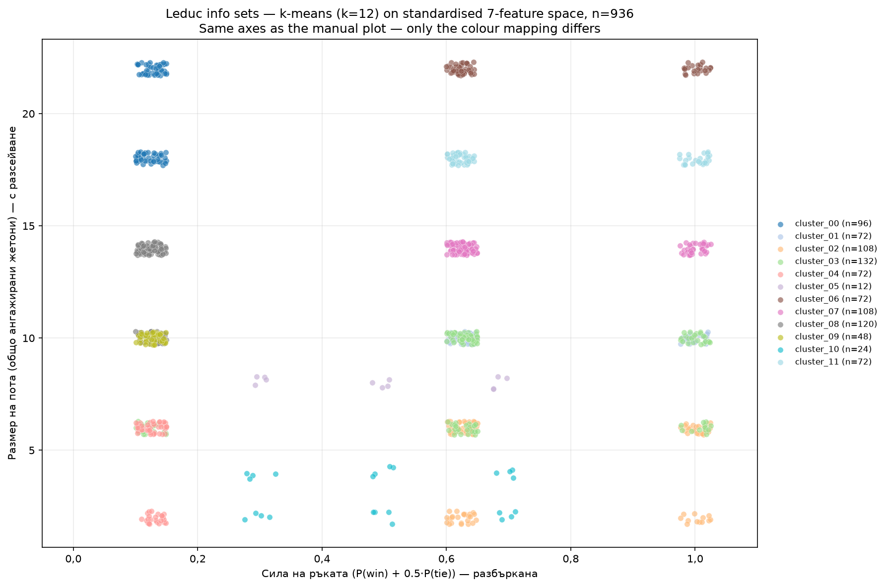
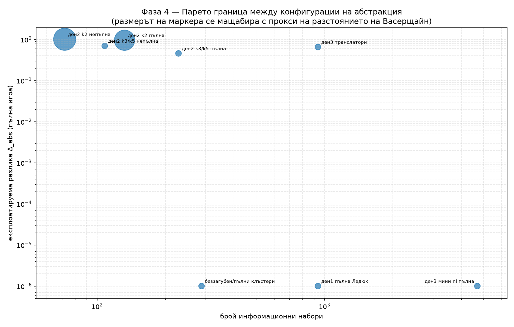

<!--
OFFICIAL PhD TITLE (keep consistent across all documents):
EN: Research on the possibilities for applying Artificial Intelligence in computer games
BG: Изследване на възможностите за приложение на изкуствения интелект в компютърни игри
-->

---
title: "Глава 4 Обобщение — Абстракция на игри и мащабиране на игри с непълна информация"
subtitle: "Изследване върху възможностите за прилагане на изкуствен интелект в компютърните игри"
author: "Alexander Andreev"
date: "May 2026"
lang: bg
vars:
  research_focus: "Adaptive Strategy Learning in Multi-Agent Imperfect-Information Environments"
---

# Глава 4 — Абстракция на играта и мащабиране на игри с непълна информация

---

## Защо е необходима абстракцията

Глави 1–3 изградиха алгоритмите (DQN/PPO; обикновен вариант на CFR; CFR+ и MCCFR външен/изходен). Всеки от тях беше демонстриран върху игра с достатъчно малък размер, за да може дървото на играта ѝ да бъде изброено точно: кун (12 информационни множества) и ледюк (936). Този набор от инструменти е завършен, но той функционира единствено когато цялото дърво на играта се побира в паметта.

Размерът на дървото на играта е произведение от три фактора: (a) броят на различните скрити състояния, които възелът на случайността може да генерира, (b) коефициентът на разклоняване във всяка точка за вземане на решение и (c) дълбочината (решения до терминал). Всеки от тези три фактора нараства независимо:

- **Скрити състояния** — Тексас холдем раздава 2 скрити карти от 52, след което до 5 общи карти. Броят на различимите ситуации „ръка срещу борд“ е от порядъка на $10^{17}$ преди да бъде отчетенa историята на залозите.
- **Коефициент на разклоняване** — Покер без лимит позволява всякакъв размер на залога от „минимално повишаване“ до „ол-ин“. Дори дискретизирането до няколко размера увеличава разклоняването на възел от 3 (пас/залог/повишаване във фиксиран лимит) до 5–10.
- **Дълбочина** — Множество рундове на залагане, всеки от които потенциално с няколко повишавания, се умножават.

Комбинираният брой информационни множества в хедс-ъп безлимит Холдем е $\sim 10^{161}$ — повече от броя на атомите в наблюдаемата вселена с $10^{80}$ пъти повече. Нито един от алгоритмите от глава 3 не може да работи върху това дърво.

Глава 4 представлява мостът между „игрови задачи, които можем да изброим“ и „игрови задачи, които не можем“. Механизмът е **абстракция**: умишлено свеждане на части от играта до по-опростен вид, така че същите алгоритми да могат да се прилагат върху по-малък, структурно опростен заместител и да се измери цената на това в качеството на стратегията. В края на тази глава резултатът включва количествен отговор на централния въпрос на всеки практически изкуствен интелект за покер след 2007 г.:

> *До каква степен може да се намали размерът на играта, преди абстрактната Нашева стратегия да престане да бъде добра стратегия в реалната игра?*

Този отговор се представя под формата на крива на Парето: по едната ос е размерът на **абстрахираната** игра, а по другата — **експлоатируема разлика** — с колко е по-лоша абстрактната стратегия спрямо точното **Нашево равновесие** в реалната игра. И двете метрики са въведени формално по-долу.

Рецептата е една и съща за всеки подход: *изгражда се по-малка игра, чиито стратегии могат да бъдат трансформирани в приложими стратегии за реалната игра, изпълняват се алгоритмите от глава 3 върху тази по-малка игра и след това се оценяват загубите.* Тази рецепта има два маршрута.

---

## Пътища към абстракцията

Думата „абстракция“ в тази литература всъщност обозначава две операционно различни понятия. И двете намират приложение в съвременния игрови изкуствен интелект и ще бъдат разгледани в настоящата дисертация; смесването им представлява категориална грешка. Настоящият раздел очертава тази граница. Всичко, което следва, реализира **явния** път от край до край; неявните съответствия заемат същите концептуални позиции, но тъй като в тази глава не се извършва работа с тях, те са обобщени в отделен раздел към края на дисертацията, вместо да бъдат разпределени помежду останалите.

И двата пътя споделят една и съща **интуиция** — компресиране със запазване на стойността — и тази интуиция се изразява най-добре чрез целевата функция на информационното стеснение, като $\beta$ е обменният курс между паметта и стойността:

$$\mathcal{L} = \underbrace{\text{Complexity}(Z)}_{\text{memory cost}} - \beta \cdot \underbrace{\text{Value}(\pi_Z)}_{\text{strategic worth}}$$

Когато $\beta = 0$, алгоритъмът компресира цялата игра до едно състояние и играе изключително слабо. Когато $\beta \to \infty$, той отказва всякакво сливане и използва пълната игра. Всеки алгоритъм в конвейера за абстракции представлява конкретна настройка на този регулатор:

- **Беззагубен** — граничен случай $\beta \to \infty$ клони към безкрайност: извършва сливане само когато $\text{Value}(\pi_Z) = \text{Value}(\pi)$ е точно.  
- **Ограничена загуба** — средата на кривата с гаранция: избира се $\beta$ така, че да бъде изпълнено условието $|\text{Value}(\pi_Z) - \text{Value}(\pi)| \le \varepsilon_{\text{abs}}$.  
- **Емпирична сходност (HSD + разстояние на Васерщайн)** — измерва самата крива: разстоянието на Васерщайн между абстрактното и пълното разпределение служи като заместител на члена за загуба на стойност.  
- **Корекция по време на изпълнение** — ортогонален подход: приема се загубата на стойност, произтичаща от избраното $\beta$, след което тя се компенсира по време на изпълнение чрез решаване на под-игра.

Съпоставени един до друг, двата пътя се различават по всеки практически показател:

| Аспект | **Явен / табличен** | **Неявен / в стил IB** (дълбоко обучение с подкрепление) |
|---|---|---|
| Къде се намира компресията | Разделяне върху информационни множества / крайно избран набор от действия | Непрекъснат скрит вектор $z = f_\theta(s)$ |
| Кой я извършва | Човешки проектирано правило или клъстеризация върху ръчно изведени признаци | Оптимизаторът, чрез градиентен спуск върху загуба |
| „Регулаторът“ | $k$ в k-средни клъстери, заложна комбинация, правилото за изоморфизъм на боя | $\beta$ умножено по $I(S;Z)$ в загубата |
| Гаранция | Ограничена експлоатируема разлика в **същата** игра (формална граница на експлоатируемостта) | Информационнотеоретична граница върху $I(S;Z)$; **няма** теорема за запазване на Неш равновесие |
| Кога се изчислява | Преди решаването — фиксиран вход към CFR/MCCFR | По време на решаването — мрежата *е* стратегията |
| Тип на изхода | Дискретен идентификатор на клъстер за всяко информационно множество | Реален вектор |
| Къде се появява в тази дисертация | Тази глава (4) | Глава 5 (Deep CFR), глава 6 (от край до край), глави 11–12 (последователни модели) |

---

## Видове оси на абстракцията

Всяка конкретна техника за абстракция се отнася към една от двете взаимно ортогонални оси — *кои състояния агентът разглежда като идентични* (информационна абстракция) и *кои действия агентът обмисля* (абстракция на действията). Трета ос, *усъвършенстване във време на изпълнение*, е независима от двете и има собствен раздел (Корекция по време на изпълнение, по-долу).

### Информационна абстракция {.unlisted}

Групират се информационните множества, които агентът ще разглежда като едно и също състояние. Това е централната операция в конвейера — всяка фаза от критерия за сливане до конвейера по време на компилиране е посветена на *как* и *кога* да се извършват сливания на информация.

Затова тази подсекция е умишлено кратка: тук се дава само *наименованието* на информационната абстракция, а нейното подробно разглеждане следва в следващите раздели (Критерият за сливане, Бюджетът на грешки, Конвейерът по време на компилиране). За разлика от нея, абстракцията на действията е разгледана изцяло по-долу.

> **Бележка относно режимите.** При изрична информационна абстракция в обикновен вариант на CFR съществува тънко разграничение между абстрахирането (a) на **картата на възлите** (само памет) и (b) на **обхождането** (реално време на итерация). Само второто води до ускорение в реално време.

> **Не забравяйте:** информационната абстракция определя кои скрити ситуации агентът разглежда като еднакви.

### Абстракция на действията и проблемът с транслацията {.unlisted}

Ограничава се множеството от действия, които решавачът разглежда, изпълнява се CFR върху получената ограничена игра и след това се обработва всичко, което реалният опонент направи извън това ограничение. Разграничават се два режима:

- **Дискретни множества действия.** Базовото множество вече е крайно. Абстракцията означава *подрязване* (премахване на доминирани или незаинтересоващи действия преди решаването) или *макродействия* (групиране на последователности от примитиви в едно абстрактно действие, т.е. времева абстракция). Преводът обикновено е тривиален: ако абстрактното множество действия е подмножество на легалното, собствените ходове на агента винаги са в рамките на абстракцията.
- **Непрекъснати множества действия.** Базовото множество е неизброимо (размери на залозите в покер без лимит, съвместни въртящи моменти при непрекъснато управление). За табличните методи абстракцията на действията е *задължителна* — CFR не може да се изпълнява върху непрекъснато дърво, без първо да бъде сведено до краен заместител (типична покерна мрежа: `{fold, call, 0.5×pot, 1×pot, 2×pot, all-in}`). Алтернативата на дълбокото обучение с подкрепление е параметризиран актьор, който директно извежда непрекъснато разпределение върху действията (PPO/SAC), елиминирайки проблема с транслацията за сметка на формални гаранции.

Проблемът с транслацията е **значителен** при изричната дискретизация: когато опонентът направи залог от 0,7×пот, а абстракцията съдържа само 0,5×пот и 1×пот, агентът трябва да преведе този залог към възел, върху който е обучен. Три преводача се използват най-често:

1. **Най-близко действие** — закръгляне до най-близкия абстрактен залог по линейния мащаб. Най-голяма загуба на стойност, когато залозите се групират между абстрактните размери.  
2. **Вероятностно разпределение (линейно)** — присвояване на маса към двата най-близки абстрактни залога пропорционално на тяхното разстояние от реалния залог.  
3. **Псевдохармонично преобразуване** – интерполация в пространството на фракциите от пота, вместо в линейното пространство на абсолютните суми. Този подход отразява много по-точно стратегическата еквивалентност между два различни залога и представлява водещия стандарт (state-of-the-art) за транслация на залозите в покера.

Грешките при превода се натрупват в отделните рундове на залагане — опонент, който открие закръглянето, може систематично да залага точно под или над точките на мрежата, за да предизвика отговори с грешен размер. Емпирично именно там практическите изкуствени интелекти за покер губят най-много стойност и това е оперативната причина за съществуването на корекция по време на изпълнение (по-долу): преизчислявам реалната под-игра с реалния залог, вместо да се разчита на преводача.

> **Запомнете:** абстракцията на действията определя кои ходове може да обмисля агентът преди превода или разрешаването.

---

## Експлоатируемата разлика

За стратегия $\sigma$, изиграна в игра $G$, експлоатируемостта е стандартният показател на трета стъпка:

$$\text{exploit}_G(\sigma) = \tfrac{1}{2}\bigl[v_G(\text{BR}(\sigma_{1}),\, \sigma_1) + v_G(\sigma_0,\, \text{BR}(\sigma_{0}))\bigr]$$

където $\sigma_0$ и $\sigma_1$ са стратегиите на двамата играчи, а $\text{BR}(\sigma)$ (най-добър отговор) е стратегията, която оптимално максимизира печалбата именно срещу стратегията $\sigma$.

Глава 4 въвежда производна метрика – **експлоатируема разлика**: с колко една абстрактна стратегия се различава от точното Нашево равновесие на реалната игра, *измерено в самата реална игра*.

Нека $G$ е реалната игра, а $\hat G$ – нейната абстракция. Нека $\hat\sigma^*$ е наш равновесието на $\hat G$, а $T(\hat\sigma^*)$ – неговата транслация обратно в играема стратегия за $G$ (идентичност, ако $\hat G$ представлява единствено информационна абстракция; нетривиален, ако включва и абстракция на действията — виж „Двете оси на абстракцията“ по-горе).

$$\Delta_{\text{abs}}(\hat G) \;=\; \text{exploit}_G\bigl(T(\hat\sigma^*)\bigr) \;-\; \text{exploit}_G(\sigma^*_G)$$

с $\sigma^*_G$ точното **Нашево равновесие** на $G$. По дефиниция $\Delta_{\text{abs}} \ge 0$, като равенство се достига тогава и само тогава, когато абстракцията е **беззагубна** (разгледано в критерия за сливане по-долу).

Това е основната величина в Глава 4. Всяка Парето диаграма в тази глава съдържа $\Delta_{\text{abs}}$ по една от осите. Всяко твърдение относно „качество на абстракцията“ се проверява чрез изчисляването **ѝ** — а когато директното изчисление е твърде скъпо, бюджетът на грешки по-долу предоставя граница и заместител вместо **него**.

> **Запомнете:** експлоатируемата разлика е цената, платена за решаване на по-малката игра вместо реалната.

---

## Разстояние на Васерщайн: Въведение

Разстоянието на Васерщайн се среща в почти всеки от следващите раздели, затова му е посветено кратко самостоятелно въведение.

**Какво измерва.** Разстоянието на Васерщайн, дадени две вероятностни разпределения върху една и съща носеща област, представлява минималното количество „работа“, необходимо за трансформирането на едното в другото, където *работа = преместена маса × преместено разстояние*. Може да си представим всяко разпределение като купчина пясък върху числова ос — тогава разстоянието на Васерщайн е най-малкото общо усилие за преоформяне на купчина А в купчина Б.

**Произход и други наименования.** Идеята води началото си от проблема за *оптималния транспорт*, формулиран от Монж през 1781 г. (преместване на купчини пръст с цел запълване на дупки при минимално усилие), а по-късно формализиран от Канторович през 1942 г. като линейна програма. В машинното обучение същото понятие се среща под няколко имена — **разстояние на Васерщайн-1**, **разстояние на Канторович–Рубинщайн** или просто **разстояние на Васерщайн**. Името „Разстояние на премествача на пръст“ е популяризирано от Рубнер, Томази и Гуибас (2000) в областта на компютърното зрение за извличане на изображения. В по-ново време то стои в основата на Wasserstein GANs и се използва широко при сходството на документи, адаптацията на домейни и всички задачи, при които е от значение сравняването на *формата* на разпределенията.

**Защо превъзхожда сравненията, базирани на средна стойност.** Разстоянието на Васерщайн отчита *геометрията* на разположението на масата, а не само средните стойности. Две разпределения, концентрирани близо едно до друго, са близки; две разпределения, концентрирани в противоположните краища, са далеч едно от друго, независимо къде техните средни стойности съвпадат случайно. Сравненията на очакваната стойност игнорират цялата тази структура.

**В контекста на тази глава.** Всяко информационно множество има *разпределение на силата на ръката (HSD)* — хистограма от вероятностите за победа в края на играта, изчислени чрез разиграване на невидяни карти. Две HSD с една и съща средна стойност могат да имат напълно различни форми: остро „стабилна средна ръка“ срещу бимодална „успех или провал“ ръка. Клъстеризацията по очаквана сила на ръката ги обединява, докато разстоянието на Васерщайн не го прави. Ето защо всеки качествен критерий, всеки заместител на грешка и всеки клъстеризационен конвейер по-долу използва разстоянието на Васерщайн между HSD като основен сигнал за сходство.

**Ефективно при 1-D хистограми.** Когато поддръжката е едномерна и подредена (бинирана вероятност за победа ∈ [0, 1]), разстоянието на Васерщайн се свежда до **разстоянието на Манхатън** между кумулативните разпределения — еднократно линейно **обхождане** на биновете. Ето защо HSD + разстояние на Васерщайн е достатъчно бързо, за да клъстеризира милиони **информационни множества**.

> **Запомнете:** разстоянието на Васерщайн сравнява формата на разпределението, а не само средната стойност — затова две раздавания с еднакви проценти на печалба все още могат да бъдат стратегически различни.

---

## Критерият за сливане

> **Допълнително четиво:** <https://www.cs.cmu.edu/~gilpin/papers/extensive.JACM.pdf> · <https://www.cs.cmu.edu/~sandholm/imperfect_recall_abstraction.arxiv14.pdf> · <https://poker.cs.ualberta.ca/publications/AAMAS13-abstraction.pdf>

Кога могат две информационни множества да се **обединят** в едно? Три вложени нива на строгост, подредени от най-слабо към най-силно.

### Ниво 1 — Беззагубен

Сливане на две информационни множества се допуска единствено когато те са *стратегически еквивалентни*: имат еднаква вероятност за достигане, еднаква рекурсивна структура и водят до еднакви последствия по отношение на полезността срещу всяко възможно продължение от страна на опонента. Последното условие е решаващо — ако дори едно действие на опонента може да ги различи, те не могат да бъдат сляти без загуба.

Когато това условие е изпълнено, сливането е безплатно: всяка оптимална стратегия в абстрактната игра може да бъде директно приложена към оригиналната игра с **нула** разход за експлоатируемост.

*Пример:* Червен вале и черен вале в игра, в която боите нямат значение (невъзможни са **флъшове**), могат да се слеят без загуба. Червен вале в игра *с* **флъшове** не може — боята мълчаливо влияе върху вероятността на опонента да събере **флъш** чрез премахване на карти от тестето.

> **Запомнете:** беззагубната абстракция е безплатна компресия: същото стратегическо значение, по-малко съхранени информационни множества.

### Ниво 2 — Ограничена загуба

Изискването за „идентични полезности“ се отпуска до „полезностите се различават с най-много $\varepsilon$“; същата идея важи и за вероятности на случайността. Цената е количествено определима грешка — всяко сливане допринася към бюджет на отпускането, който в крайна сметка определя граница върху общата експлоатируемост (използвана в следващия раздел). Последователностите от действия по слетите пътища все още трябва да съвпадат, така че това представлява *контролирано* забравяне, а не произволно.

*Пример:* Обединяването на J и Q в един „клъстер с ниски карти“ принуждава агента да ги играе еднакво, въпреки че оптимално те се различават леко. Системата поема тази грешка в замяна на значително опростяване на играта.

> **Запомнете:** абстракция с ограничена загуба е контролирано забравяне: играта се свива, но всяко сливане получава цена за грешка.

### Ниво 3 — Емпирична сходност

Когато аналитичната граница е твърде песимистична или входовете са твърде високодименсионни, за да бъдат изброени (тексас холдем има $\sim 10^9$ канонични река бордове), границата за сливане се премахва и се заменя с *научена функция за разстояние*:

- Изчислява се вектор на характеристики за всяко информационно множество — обикновено **разпределението на силата на ръката (HSD)**, дефинирано в увода по-горе.
- Използва се **разстояние на Васерщайн (EMD)** между векторите на характеристики като метрика за сходство.
- Групират се информационните множества с близки разпределения на признаци и се извършва сливане в рамките на групите.

Няма формална гаранция за експлоатируемост тук — качеството се проверява *след* решаването, като експлоатируемостта на получената стратегия се измерва.

> **Запомнете:** Емпиричната абстракция е бюджетно предположение, което трябва да бъде измерено след решаването.

---

## Бюджетът на грешките

> **Допълнително четиво:** <https://www.cs.cmu.edu/~sandholm/imperfect_recall_abstraction.arxiv14.pdf> · <https://poker.cs.ualberta.ca/publications/AAMAS13-abstraction.pdf>

Три инструмента за количествено определяне, които се подреждат по строгост и формална прецизност в обратна зависимост. Първите два съответстват на нивата на строгост по-горе — аналитичната граница оценява загубено сливане от Ниво 2 с ограничени отклонения, а проксито на разстоянието на Васерщайн оценява емпирично такова от Ниво 3 — докато третият измерва завършената абстракция, независимо как е била конструирана.

### Инструмент 1 — Аналитична граница

Дадена е абстракция със загуби с константи на отпуснатата връзка за всяко сливане, които се сумират — претеглени според честотата, с която всяка информационна съвкупност действително се достига по време на игра — и така се получава горна граница на експлоатируемата разлика.

Теглото на достижимостта е ключовата идея. Редките информационни множества могат да бъдат агресивно сливани, без това да влошава общата експлоатируемост; небрежните сливания в гъсти и често посещавани области са катастрофални. Небрежното сливане в рядък сценарий от крайната игра почти не оказва влияние върху общия резултат, което позволява на една практична абстракция да бъде агресивна, без да води до загуби в очакване.

> **Запомнете:** аналитичната граница е строга, но обикновено хлабава; най-важната ѝ идея е теглото на достижимостта.

### Инструмент 2 — прокси на разстоянието на Васерщайн

Разстоянието на Васерщайн между хистограмите на силата на ръката на две информационни множества, измерено без изброяване на листата (вижте въведението по-горе за механиката). То представлява *прокси*, а не граница — корелира добре с експлоатируемостта след решаването, но не носи формална гаранция.

### Инструмент 3 — директен оценител CFR-BR

Най-силната мярка: тя връща най-близкото представимо Нашево равновесие, което може да бъде изразено чрез абстракцията, като по този начин *изолира* грешката на абстракцията от грешката при решаване.

В експериментите стратегиите на CFR-BR показват експлоатируемост, толкова ниска, колкото $1/3$ от съответните обикновени CFR стратегии при *същата* абстракция. Изводът е, че значителна част от измерената „грешка на абстракцията“ в литературата всъщност представлява *скрита грешка при решаване* — самата абстракция е била способна на по-добро представяне, но решавачът не се е сходил.

> **Запомнете:** CFR-BR изследва какво може да изрази абстракцията, а не доколко добре се е обучил конкретен решавач.

---

## Избор на абстракция на практика

Трите критериални нива и трите измервателни инструмента оставят един въпрос отворен: към какво всъщност се обръщаме в реална игра? Три открития дават отговор на този въпрос.

**Редът на вземане на решения.** Първо се използват всички налични беззагубни сливания; след това се приемат ограничени загубни обединявания само когато бюджетът на грешки е приемлив; когато точните проверки са прекалено песимистични или твърде скъпи, се извършва клъстеризация с HSD + разстояние на Васерщайн и получената абстракция се валидира емпирично.

**Глобалната оптимизация е невъзможна.** Изборът на разделяне, което минимизира аналитичната граница, е **nP-complete**, дори за малка еднопотребителска игра с дълбочина две нива. Затова никой не минимизира границата точно — практическите конвейери я приближават ниво по ниво (един кръг наведнъж), а не глобално. При разумни условия, едно ниво се свежда до клъстеризация около центрове в метрично пространство, което разполага с приблизителни алгоритми с полиномиално време с гаранции с постоянен коефициент. Това е *причината* всяка практическа абстракция в покера след 2010 г. да бъде клъстеризационен конвейер ниво по ниво, а не глобален оптимизатор.

**Две надеждни сравнения при равни бюджети за информационни набори.**

- **Разпределение-съзнателен срещу очакваностойностен.** HSD + разстояние на Васерщайн строго доминира клъстеризацията, базирана на очаквана стойност, както по експлоатируемост, така и по процент победи в директен сблъсък срещу фиксирани опоненти.
- **Непълна срещу пълна памет.** Абстракциите с непълна памет превъзхождат тези с пълна памет при еднакъв бюджет на множеството от информационни състояния — свободата за преразпределение на клъстерите е емпирично по-ценна от изгубената непрекъснатост.

И двете са причина конвейерът по време на компилация по подразбиране да използва непълна памет, HSD и разстоянието на Васерщайн.

---

## Решения по време на компилация

> **Допълнително четиво:** <https://www.cs.cmu.edu/~gilpin/papers/extensive.JACM.pdf> · <https://poker.cs.ualberta.ca/publications/AAMAS13-abstraction.pdf> · <https://www.cs.cmu.edu/~sandholm/imperfect_recall_abstraction.arxiv14.pdf>

Два допълващи се конвейера, по един на ниво строгост на критерия.

### Конвейер 1 — GameShrink (беззагубен)

Изчерпателно сливане, което обхожда *сигналното дърво* — структура, по-малка от дървото на играта, изброяваща само последователности от публични и частни сигнали — отдолу-нагоре. На всяко ниво се проверяват двойки поддървета братя за стратегическа еквивалентност и всяка преминала двойка се слива.

Защо сигналното дърво е по-малко: дървото на играта умножава всеки отделен сигнал от скрито състояние по всяка отделна последователност от залози, която може да доведе до него, докато сигналното дърво колабира всички тези пътища на залагане в един сигнален възел. В Rhode Island Холдем сигналното дърво е около 6,6 милиона възела спрямо приблизително 3,1 милиарда възела на дървото на играта — това представлява компресия от около 500 пъти преди прилагането на каквато и да е загубена стъпка. GameShrink е *пълен* по отношение на своя критерий за сливане: всяко беззагубно сливане, изразимо чрез този критерий, се открива.

Този конвейер, комбиниран с линейно програмиране, решава Rhode Island Холдем през 2007 г., четири порядъка отвъд всяка покер игра, решавана дотогава.

> **Запомнете:** gameShrink търси в *сигналното дърво* всяко свободно сливане, преди да бъде разгледана каквато и да е компресия със загуби.

### Конвейер 2 — HSD + разстояние на Васерщайн + k-средни + непълна памет (загубен)

{width=65% fig-pos="H"}

Когато беззагубното сливане достигне сходимост и играта все още е твърде голяма, се пристъпва към клъстеризация:

Конвейерът изчислява HSD за всяко информационно множество, групира получените разпределения чрез разстоянието на Васерщайн като метрика на разстояние и съпоставя всяко информационно множество към идентификатор на клъстер. Съществуват два режима на извикване:

- **Пълна памет** — идентификаторът на клъстера включва предишната траектория на клъстерите.
- **Непълна памет** — клъстерът в по-късен кръг може да забрави по-ранната траектория, като по този начин освобождава повече клъстери за кръга, в който новата информация има най-голямо значение.

Непълната памет последователно надделява при фиксиран бюджет на клъстерите — капацитетът се използва за кръгове, които имат значение, вместо за запаметяване на историята.

> **Запомнете:** HSD + разстояние на Васерщайн определя *какво изглежда стратегически подобно*; непълна памет определя *къде да се използва бюджетът на клъстерите*.

**Резултатът.** Замразеният резултат от двата конвейера — стратегията, получена при решаването на абстрактната игра, и началната точка за всичко, което се случва по време на изпълнение — в останалата част от това резюме се обозначава като **план**.

---

## Корекция по време на изпълнение

> **За допълнително четене:** <https://arxiv.org/pdf/1705.02955v3>

Когато играта премине в под-игра и абстрактният план е твърде груб, преизчислявам под-играта с по-висока точност *в реално време*. Два пача са от значение — заедно те бяха носещите елементи на Libratus, първия изкуствен интелект, който победи най-добрите играчи в хедс-ъп безлимит тексаски холдем.

### Защо решаването на под-игра не може да се извършва изолирано (хвърляне на монета)

Прост контрапример, наречен *хвърляне на монета*: монета пада с ези или тура с еднаква вероятност, като само $P_1$ вижда изхода. Играчът $P_1$ избира между *Sell* (с печалба, зависеща от резултата на монетата) и *Play* (при която играчът $P_2$ се опитва да познае коя страна е паднала). Оптималната $P_2$ стратегия в под-играта *Play* **не е** функция единствено на самата тази под-игра — тя зависи от стойността $P_1$, която би получил, ако вместо това беше избрал *Sell*. Ако печалбата от *Sell* се промени, оптималната стратегия за *Play* също се променя, въпреки че самата под-игра *Play* остава непроменена.

Това е централната патология, в която попада всяко наивно решаване на под-игра с непълна информация. Решението: решаване на *разширена под-игра*, включваща оригиналната под-игра и допълнителни възли „алтернативна печалба“, кодиращи какво всеки играч би могъл да постигне, ако *не беше влязъл* в тази под-игра.

### Коригиране 1 — Безопасно решаване на под-игри

Разширената под-игра се основава на план-стойности: всяко информационно множество в началото на под-играта получава алтернативна печалба, равна на обещаното от плана за този играч в съответния момент от играта. Решаването на разширената игра води до усъвършенствана стратегия с гаранция за безопасност — експлоатируемостта е доказано не по-висока от тази на плана и строго по-ниска, когато локалните условия го позволяват.

Практическо усъвършенстване (*обхват*) пренася напред „подаръци“ — разлики в стойността от по-ранни точки по траекторията, където играчът е могъл да постигне строго по-добър резултат — за допълнително усъвършенстване.

На практика консервативните план-печалби могат да бъдат заменени с *оценки* на равновесната стойност. Това отпада строгата гаранция, но обикновено води до по-ниска експлоатируемост в реална игра, тъй като самите консервативни план-печалби са неточни.

> **Запомнете:** безопасното решаване на под-игри работи, тъй като под-играта не се решава самостоятелно; тя е закотвена чрез план-стойности.

### Пач 2 — Вложено решаване на под-игри (убиецът на превода на действия)

Това е директният отговор на проблема с транслацията, изложен по-горе в раздела „Оси на абстракцията“. Когато *противникът* извърши действие $a$ извън зададената абстракция, $a$ не се закръгля до познато действие чрез транслация — а *преизчислява се нова под-игра, която включва $a$*.

Нескъпата версия изгражда под-игра непосредствено след **действие извън дървото**, преизчислява я с помощта на **безопасна под-игра-скеле** и добавя новата **подстратегия** към **плана**. Ако по-късно се появи друго **действие извън дървото**, процесът се повтаря — **планът** нараства единствено там, където действително протича играта.

*Емпирично въздействие.* При **хедс-ъп безлимит покер** експлоатируемостта на **вложеното решаване на под-игри** срещу действия на противника извън дървото е **10–100 пъти по-ниска** от тази на всеки предходен метод за транслация на действия, в зависимост от степента на абстракция.

*Рекурсията е плитка на практика.* Повечето реални действия извън дървото не се верижат — противникът прави един необичаен залог, агентът преизчислява и новото абстрактно дърво го абсорбира. Статичните транслатори на действия остават подходящият избор само когато латентността не позволява live CFR solve (онлайн игра, вградени приложения).

> **Запомнете:** транслацията на действия закръгля хода на противника; вложеното решаване запазва хода и решава около него.

---

## Архитектура: План и актуализации по време на работа

Целият конвейер вече се свежда до един архитектурен модел, който всеки състезателен изкуствен интелект за покер без лимит един на един от 2017 г. насам (Libratus, Modicum, Pluribus) използва:

1. **Време на компилация** — прилагат се беззагубна и загубена абстракция за свиване на играта; получената абстрактна игра се решава с CFR / CFR+ / MCCFR; получената стратегия се замразява като план.
2. **Време на изпълнение** — когато играта премине в под-игра, която планът покрива грубо, тя се преизчислява чрез безопасно решаване на под-игри (Кръпка 1). Когато противникът извърши действие извън абстракцията, се преизчислява нова под-игра, включваща това действие (Кръпка 2).

Двете части се допълват взаимно: чрез абстракцията проблемът по време на компилация става решим; актуализациите по време на работа възстановяват прецизността, изгубена вследствие на абстракцията в онези моменти от играта, където това е от съществено значение.

> **Запомнете:** производствената архитектура е една част предварително изчислен план и една част live re-solving — нито едната половина не може да съществува самостоятелно.

---

## Практическо валидиране

Фазата на имплементация превърна абстракциите от резюмето в малък, но цялостен конвейер от типа „Ледюк“:

- **Беззагубен изоморфизъм на боите** върху ледюк с фиксиран лимит и Extended Leduc.
- **Загубено групиране на карти**, използващо характеристики за силата на ръката, разстояния от тип Васерщайн и конфигурируем брой клъстери за карти.
- **Абстракция на действията** върху Mini-NL Leduc с кодове за транслация „най-близък“, „вероятностно разпределение“ и „псевдохармоничен“.
- **Extended Leduc** с четири ранга и две бои, предоставящ по-голяма тестова среда с непълна информация.
- **Комбинирана абстракция**, съставена от редуциране на боите, редуциране на действията и групиране на карти.
- **Оценка на качеството** чрез разлики в експлоатируемостта, проксита на EMD, кръстосана проверка в OpenSpiel и Парето граница.

Основните емпирични изводи съответстват на теорията: **беззагубната абстракция** е почти безплатна стратегически и много полезна изчислително, докато **загубената** информационна и **абстракцията на действията** въвеждат постоянни нива на експлоатируемост. При бюджети от 180 секунди за CFR+, **изоморфизмът на боите** намали броя на информационните множества в **ледюка с фиксиран лимит** от 936 до 288 и достигна по-ниска експлоатируемост от пълната игра, тъй като завърши значително повече **итерации**. В **Extended Leduc**, същата идея намали броя на информационните множества от 10 304 до 2 968 и подобри крайната експлоатируемост от около $2.7 \times 10^{-2}$ до около $1.3 \times 10^{-3}$.

Загубените експерименти с клъстери показват другата страна на компромиса. По-малките игри с клъстери се обучават по-бързо, но грешката не изчезва при повече **итерации** на CFR+, тъй като стратегията решава грешната игра. В **ледюка с фиксиран лимит** грубите абстракции с клъстери останаха около експлоатируемост $0.38$–$0.57$, въпреки че завършиха повече **итерации** от пълния CFR+. Това е практическото значение на експлоатируемата разлика: грешката на абстракцията не е грешка на оптимизатора.

Абстракцията на действията беше най-рисковата част от стъпката. В Mini-NL ледюк ограничаването на множеството действия намали броя информационни множества от 4704 до 936 и позволи извършването на значително повече **итерации** на CFR+ в рамките на същия времеви бюджет, но експлоатируемостта остана висока. В Extended Leduc добавянето на абстракция на действията върху изоморфизма на боите доведе до компактно дърво, но получената стратегия беше силно експлоатируема. Поради това литературата се насочва от статична транслация на действия към вложено решаване на под-игри: действието, което опонентът реално изиграва, често е твърде важно, за да бъде закръглено.

Парето изгледът представлява окончателната и най-правилна диагноза. Всяка точка показва: с колко е намалена играта и каква цена или полза по отношение на експлоатируемостта е постигната чрез тази компресия. Беззагубният изоморфизъм на боите се намира в атрактивната част от границата. Грубите интервали и абстракцията на действията могат да намалят играта още повече, но това води до преминаване към различен режим, при който по-малкият размер се постига за сметка на качеството на стратегията.

---

## Аналози на дълбокото обучение с подкрепление

Всяка фаза на явния конвейер има аналог в дълбокото обучение с подкрепление, който заема същото концептуално място, но заменя формалните гаранции с обучение от край до край. Това са насочващи указатели — реалните реализации попадат в глави 5–6.

- **Критерий за сливане** — трите нива на строгост съответстват на различни мрежови архитектури: беззагубен ↔ инвариантни спрямо разместване мрежи (Deep Sets), ограничена загуба ↔ стеснения на информацията в рекурентни/трансформър политики, емпирична сходност ↔ латентни вграждания, научени от край до край (както при Deep CFR).
- **Бюджет на грешки** — не се задават изрични граници за всяко сливане. Качеството се проследява чрез криви скорост–изкривяване (Информационно стеснение) и наблюдение на тестовата загуба, като вместо алгоритмични гаранции се приема асимптотична сходимост.
- **Конвейер по време на компилация** — отделна фаза на компилация не съществува. Латентното пространство на мрежата изгражда собствено абстрактно представяне, оформяно директно чрез градиентен спуск върху загубата за минимизиране на съжалението.
- **Корекция по време на изпълнение** — точните решаващи средства за равновесие се заменят от евристично търсене с ограничена дълбочина, подкрепено от невронни мрежови функции на стойността (DeepStack, ReBeL).

---

## Връзки и насочващи указатели

Глава 4 продължава прогресията, започната в глави 2 и 3. Глава 2 въвежда CFR като локално минимизиране на съжалението върху информационни множества. Глава 3 прави този решавач по-бърз и по-евтин чрез CFR+ и MCCFR. Глава 4 променя самата входна игра: преди решаването, тя определя кои състояния и действия могат да бъдат обединени, без да се унищожи стратегическият сигнал.

Мостът към глава 5 е имплицитният маршрут, току-що описан: Deep CFR и неврoнното приближение на равновесие заменят ръчно изградените и изградени чрез клъстеризация дялове от глава 4 с научени функционални апроксиматори. Представянето остава компресирано, но компресията вече е реализирана в мрежа, вместо във фиксирана карта на клъстери.

Мостът към глава 6 е архитектурният план. Съвременните покер агенти първо решават груба абстрактна игра, а след това закърпват слабостите онлайн чрез решаване на под-игра. Глава 4 предоставя речника: план, транслация на действия, експлоатируема разлика, Парето граница и безопасно/вложено усъвършенстване. Глава 6 превръща тези елементи в пълни системи за игра на игри.

За дисертацията абстракцията е от значение, защото адаптацията към съперника е ефективна единствено в границите на резолюцията, която представянето на играта запазва. Ако абстракцията обедини две стратегически различни състояния, обърнати към противника, нито един последващ модел на противника не би могъл да възстанови това разграничение. Обратно, представяне, което е прекалено детайлно, може да бъде твърде скъпо за решаване или оценяване. Парето границата от глава 4 следователно се включва в методологията за оценяване: качеството на стратегията трябва да бъде докладвано заедно с размера и детайлността на представянето на играта, което я е породило.
