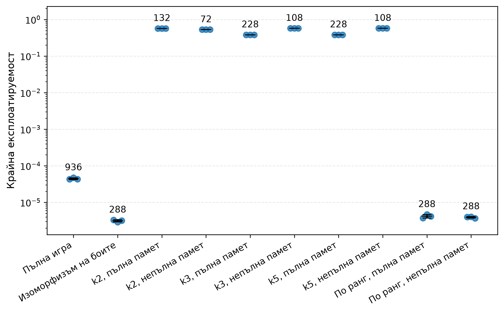

<!--
OFFICIAL PhD TITLE (keep consistent across all documents):
EN: Research on the possibilities for applying Artificial Intelligence in computer games
BG: Изследване на възможностите за приложение на изкуствения интелект в компютърни игри
-->

---
title: "Глава 4 Обобщение — Абстракция на игри и мащабиране на игри с непълна информация"
subtitle: "Изследване върху възможностите за прилагане на изкуствен интелект в компютърните игри"
author: "Alexander Andreev"
date: "May 2026"
lang: bg
vars:
  research_focus: "Adaptive Strategy Learning in Multi-Agent Imperfect-Information Environments"
---

# Глава 4 — Абстракция на играта и мащабиране на игри с непълна информация

---

## Защо е необходима абстракцията

Глави 1–3 изградиха алгоритмите (DQN/PPO; обикновен вариант на CFR; CFR+ и MCCFR външен/изходен). Всеки от тях беше демонстриран върху игра с достатъчно малък размер, за да може дървото на играта ѝ да бъде изброено точно: Кун (12 информационни множества) и Ледюк (936). Този набор от инструменти е завършен, но той функционира единствено когато цялото дърво на играта се побира в паметта.

Размерът на дървото на играта е произведение от три фактора: (а) броят на различните скрити състояния, които възелът на случайността може да генерира, (б) коефициентът на разклоняване във всяка точка за вземане на решение и (в) дълбочината (решения до терминал). Всеки от тези три фактора нараства независимо:

- **Скрити състояния** — В тексаски холдем се раздават по 2 скрити карти от 52, след което до 5 общи карти. Само комбинациите от скрити и общи карти са около $2{,}8 \times 10^{9}$, още преди да се отчете историята на залозите; с нея лимитният вариант за двама играчи достига $3{,}16 \times 10^{17}$ състояния.[^bowling2015]
- **Коефициент на разклоняване** — Безлимитният покер позволява всякакъв размер на залога от „минимално вдигане“ до „ол-ин“. Дори дискретизирането до няколко размера увеличава разклоняването на възел от 3 (отказ/плащане/вдигане в лимитния вариант) до 5–10.
- **Дълбочина** — Множество рундове на залагане, всеки от които потенциално с няколко вдигания, се умножават.

Броят на информационните множества в безлимитния тексаски холдем за двама играчи е $\sim 10^{161}$ — около $10^{80}$ пъти повече от броя на атомите в наблюдаемата вселена. Нито един от алгоритмите от глава 3 не може да работи върху това дърво.[^johanson2013size]

Глава 4 представлява мостът между „игри, които можем да изброим изцяло“ и „игри, които не можем“. Механизмът е **абстракция**: умишлено свеждане на части от играта до по-опростен вид, така че същите алгоритми да могат да се прилагат върху по-малък, структурно опростен заместител и да се измери цената на това в качеството на стратегията. В края на тази глава резултатът включва количествен отговор на централния въпрос на всеки практически изкуствен интелект за покер след 2007 г.:

> *До каква степен може да се намали размерът на играта, преди равновесната стратегия на абстрактната игра да престане да бъде добра стратегия в реалната игра?*

Този отговор се представя под формата на крива на Парето: по едната ос е размерът на **абстрахираната** игра, а по другата – **разликата в експлоатируемостта**, т.е. с колко абстрактната стратегия е по-лоша от точното равновесие на Наш в реалната игра. И двете метрики са въведени формално по-долу.

Рецептата е една и съща за всеки подход: *изгражда се по-малка игра, чиито стратегии могат да бъдат трансформирани в приложими стратегии за реалната игра, изпълняват се алгоритмите от глава 3 върху тази по-малка игра и след това се оценяват загубите.* Тази рецепта може да се следва по два пътя.

---

## Пътища към абстракцията

В тази глава думата „абстракция“ се използва в два оперативно различни смисъла; в литературата невронното приближение обикновено се представя като алтернатива на абстракцията, а не като неин вид.[^deepcfr] И двете намират приложение в съвременния игрови изкуствен интелект и ще бъдат разгледани в настоящата дисертация; смесването им представлява категориална грешка. Настоящият раздел очертава тази граница. Всичко, което следва, реализира **явния** път от край до край; неявните съответствия заемат същите концептуални позиции, но тъй като в тази глава не се извършва работа с тях, те са събрани в отделен раздел към края на главата („Аналози на дълбокото обучение с подкрепление“), вместо да бъдат разпределени между останалите.

И двата пътя споделят една и съща **интуиция** — компресиране със запазване на стойността — и тази интуиция се изразява най-добре чрез целевата функция на информационното стеснение (по аналогия с едноименния метод[^tishby1999]), като $\beta$ е обменният курс между паметта и стойността:

$$\mathcal{L} = \underbrace{\text{Сложност}(Z)}_{\text{цена в памет}} - \beta \cdot \underbrace{\text{Стойност}(\pi_Z)}_{\text{стратегическа стойност}}$$

Когато $\beta = 0$, алгоритъмът компресира цялата игра до едно състояние и играе изключително слабо. Когато $\beta \to \infty$, той отказва всякакво сливане и използва пълната игра. Всеки алгоритъм в конвейера за абстракции представлява конкретна настройка на този регулатор:

- **Беззагубно сливане** — граничният случай $\beta \to \infty$: извършва сливане само когато $\text{Стойност}(\pi_Z) = \text{Стойност}(\pi)$ е точно.
- **Ограничена загуба** — средата на кривата с гаранция: избира се $\beta$ така, че да бъде изпълнено условието $|\text{Стойност}(\pi_Z) - \text{Стойност}(\pi)| \le \varepsilon_{\text{abs}}$.
- **Емпирична сходност (HSD + разстояние на Васерщайн)** — измерва самата крива: разстоянието на Васерщайн между абстрактното и пълното разпределение служи като заместител на члена за загуба на стойност.
- **Корекция по време на изпълнение** — ортогонален подход: приема се загубата на стойност, произтичаща от избраното $\beta$, след което тя се компенсира по време на изпълнение чрез решаване на под-игра.

Съпоставени един до друг, двата пътя се различават по всеки практически показател:

| Аспект | **Явен / табличен** | **Неявен / в стил IB** (дълбоко обучение с подкрепление) |
|---|---|---|
| Къде се намира компресията | Разбиване на информационните множества / краен избран набор от действия | Непрекъснат латентен вектор $z = f_\theta(s)$ |
| Кой я извършва | Правило, зададено от човек, или клъстеризация по признаци на ръката | Оптимизаторът, чрез градиентен спуск върху загуба |
| Фактор за настройка | $k$ в k-средни, наборът от размери на залога, правилото за изоморфизъм на боите | $\beta$ умножено по $I(S;Z)$ в загубата |
| Гаранция | Формална граница на разликата в експлоатируемостта само за беззагубни и ограничени абстракции; за емпиричните (k-средни + EMD) – никаква | Информационнотеоретична граница върху $I(S;Z)$; **няма** теорема за запазване на равновесието на Наш |
| Кога се изчислява | Преди решаването — фиксиран вход към CFR/MCCFR | По време на решаването — мрежата *е* стратегията |
| Тип на изхода | Дискретен идентификатор на клъстер за всяко информационно множество | Реален вектор |
| Къде се появява в тази дисертация | Тази глава (4) | Глава 5 (Deep CFR), глава 6 (от край до край), глава 12 (модели на последователности) |

: Явният и неявният път към абстракцията, сравнени по всеки практически показател.

---

## Видове оси на абстракцията

Всяка конкретна техника за абстракция се отнася към една от двете взаимно ортогонални оси — *кои състояния агентът разглежда като идентични* (информационна абстракция) и *кои действия агентът обмисля* (абстракция на действията). Трета ос, *усъвършенстване по време на изпълнение*, е независима от двете и има собствен раздел (Корекция по време на изпълнение, по-долу).

### Информационна абстракция {.unlisted}

Групират се информационните множества, които агентът ще разглежда като едно и също състояние. Това е централната операция в конвейера — всяка фаза – от критерия за сливане до решенията по време на компилация – е посветена на *как* и *кога* да се извършват сливания на информация.

Затова тази подсекция е умишлено кратка: тук се дава само *наименованието* на информационната абстракция, а нейното подробно разглеждане следва в следващите раздели („Критерият за сливане“, „Бюджетът на грешките“, „Решения по време на компилация“). За разлика от нея, абстракцията на действията е разгледана изцяло по-долу.

> **Бележка относно режимите.** При явна информационна абстракция в обикновения вариант на CFR съществува тънко разграничение между абстрахирането (а) на **картата на възлите** (само памет) и (б) на **обхождането** (време за изпълнение на итерация). Само второто скъсява времето за изпълнение.

> **Запомнете:** информационната абстракция определя кои скрити ситуации агентът разглежда като еднакви.

### Абстракция на действията и проблемът с транслацията {.unlisted}

Ограничава се множеството от действия, които решавачът разглежда, изпълнява се CFR върху получената ограничена игра и след това се обработва всичко, което реалният опонент направи извън това ограничение. Разграничават се два режима:

- **Дискретни множества действия.** Базовото множество вече е крайно. Абстракцията означава *подрязване* (премахване на доминирани или незначителни действия преди решаването) или *макродействия* (групиране на последователности от примитиви в едно абстрактно действие, т.е. времева абстракция). Транслацията обикновено е тривиална: ако абстрактното множество действия е подмножество на допустимите действия, собствените ходове на агента винаги са в рамките на абстракцията.
- **Непрекъснати множества действия.** Базовото множество е неизброимо (размери на залозите в безлимитния покер, въртящи моменти в ставите при непрекъснато управление). За табличните методи абстракцията на действията е *задължителна* — CFR не може да се изпълнява върху непрекъснато дърво, без първо да бъде сведено до краен заместител (типичен набор от действия в покера: {отказ, плащане, 0,5×пот, 1×пот, 2×пот, ол-ин}). Алтернативата на дълбокото обучение с подкрепление е параметризиран актьор, който директно извежда непрекъснато разпределение върху действията (PPO/SAC), елиминирайки проблема с транслацията за сметка на формални гаранции.

Проблемът с транслацията е **значителен** при явната дискретизация: когато опонентът направи залог от 0,7×пот, а абстракцията съдържа само 0,5×пот и 1×пот, агентът трябва да транслира този залог към възел, върху който е обучен. Най-често се използват три транслатора:

1. **Най-близко действие** — закръгляне до най-близкия абстрактен залог по линейния мащаб. Най-голяма загуба на стойност, когато залозите се групират между абстрактните размери.
2. **Вероятностно разделяне (линейно)** — присвояване на маса към двата най-близки абстрактни залога обратно пропорционално на разстоянието им от реалния залог.
3. **Псевдохармонично преобразуване** – вероятностно преобразуване, изведено от равновесието на опростена покерна игра: залог $x$ (в части от пота) между абстрактните размери $A$ и $B$ се свързва с $A$ с вероятност $\frac{(B-x)(1+A)}{(B-A)(1+x)}$. В сравненията на авторите то е значително по-малко експлоатируемо от по-ранните евристични преобразувания в три малки покерни игри, сред които Кун и Ледюк, и е водещият статичен транслатор преди появата на вложеното решаване на под-игри (по-долу).[^ganzfried2013]

Грешките при транслацията се натрупват в отделните рундове на залагане — опонент, който открие закръглянето, може систематично да залага точно под или над точките на решетката, за да предизвика отговори с грешен размер. Такава уязвимост е наблюдавана на практика (агентът Tartanian1, 2007 г.)[^ganzfried2013], и това е оперативната причина за съществуването на корекция по време на изпълнение (по-долу): реалната под-игра се преизчислява с реалния залог, вместо да се разчита на транслатора.

> **Запомнете:** абстракцията на действията определя кои ходове агентът може да обмисля преди транслацията или повторното решаване.

---

## Разлика в експлоатируемостта

За стратегия $\sigma$, изиграна в игра $G$, експлоатируемостта е стандартният показател от глава 3:

$$\text{exploit}_G(\sigma) = \tfrac{1}{2}\bigl[v_G(\text{BR}(\sigma_{1}),\, \sigma_1) + v_G(\sigma_0,\, \text{BR}(\sigma_{0}))\bigr]$$

където $\sigma_0$ и $\sigma_1$ са стратегиите на двамата играчи, а $\text{BR}(\sigma)$ (най-добър отговор) е стратегията, която оптимално максимизира печалбата именно срещу стратегията $\sigma$.

Глава 4 въвежда производна метрика – **разлика в експлоатируемостта**: с колко една абстрактна стратегия е по-лоша от точното равновесие на Наш на реалната игра, *измерено в самата реална игра*.

Нека $G$ е реалната игра, а $\hat G$ – нейната абстракция. Нека $\hat\sigma^*$ е равновесие на Наш на $\hat G$, а $T(\hat\sigma^*)$ – неговата транслация обратно в играема стратегия за $G$ (тъждественото преобразуване, ако $\hat G$ е само информационна абстракция, и нетривиално преобразуване, ако включва и абстракция на действията — вж. „Видове оси на абстракцията“ по-горе).

$$\Delta_{\text{abs}}(\hat G) \;=\; \text{exploit}_G\bigl(T(\hat\sigma^*)\bigr) \;-\; \text{exploit}_G(\sigma^*_G)$$

където $\sigma^*_G$ е точното равновесие на Наш на $G$. По дефиниция $\Delta_{\text{abs}} \ge 0$, като равенство има, когато абстракцията е беззагубна (разгледано в критерия за сливане по-долу).

Това е основната величина в Глава 4. Всяка Парето диаграма в тази глава съдържа $\Delta_{\text{abs}}$ по една от осите. Всяко твърдение относно „качество на абстракцията“ се проверява чрез изчисляването ѝ — а когато директното изчисление е твърде скъпо, бюджетът на грешките по-долу предоставя граница и заместител вместо него.

> **Запомнете:** разликата в експлоатируемостта е цената, платена за решаване на по-малката игра вместо реалната.

---

## Разстояние на Васерщайн: Въведение

Разстоянието на Васерщайн се среща в почти всеки от следващите раздели, затова му е посветено кратко самостоятелно въведение.

**Какво измерва.** За две вероятностни разпределения върху един и същ носител разстоянието на Васерщайн е минималното количество „работа“, необходимо за трансформирането на едното в другото, където *работа = преместена маса × преместено разстояние*. Може да си представим всяко разпределение като купчина пясък върху числова ос — тогава разстоянието на Васерщайн е най-малкото общо усилие за преоформяне на купчина А в купчина Б.

**Произход и други наименования.** Идеята води началото си от проблема за *оптималния транспорт*, формулиран от Монж през 1781 г. (преместване на купчини пръст с цел запълване на дупки при минимално усилие), а по-късно формализиран от Канторович през 1942 г. като линейна програма. В машинното обучение същото понятие се среща под няколко имена — **разстояние на Васерщайн-1**, **разстояние на Канторович–Рубинщайн** или просто **разстояние на Васерщайн**. Името Earth Mover's Distance (EMD) е популяризирано от Rubner, Tomasi и Guibas (2000)[^rubner2000] в компютърното зрение при търсенето на изображения по съдържание. В по-ново време то стои в основата на генеративно-състезателните мрежи на Васерщайн (WGAN) и се използва широко при сходството на документи, адаптацията на домейни и всички задачи, при които е от значение сравняването на *формата* на разпределенията.

**Защо превъзхожда сравненията, базирани на средна стойност.** Разстоянието на Васерщайн отчита *геометрията* на разположението на масата, а не само средните стойности. Две разпределения, концентрирани близо едно до друго, са близки; две разпределения, концентрирани в противоположните краища, са далеч едно от друго, независимо къде техните средни стойности съвпадат случайно. Сравненията на очакваната стойност игнорират цялата тази структура.

**В контекста на тази глава.** Всяко информационно множество има *разпределение на силата на ръката (HSD)* — хистограма от вероятностите за победа в края на играта, изчислени чрез разиграване на невидяни карти. Две HSD с една и съща средна стойност могат да имат напълно различна форма: тясно разпределение с един връх („стабилна средна ръка“) или бимодално („успех или провал“). Клъстеризацията по очаквана сила на ръката ги обединява, докато разстоянието на Васерщайн не го прави. Ето защо всеки качествен критерий, всеки заместител на грешка и всеки клъстеризационен конвейер по-долу използва разстоянието на Васерщайн между HSD като основен сигнал за сходство.

**Ефективно при 1-D хистограми.** Когато носителят е едномерен и подреден (вероятността за победа ∈ [0, 1], разделена на интервали), разстоянието на Васерщайн се свежда до **разстоянието на Манхатън** между кумулативните разпределения — едно линейно преминаване през интервалите. Ето защо HSD + разстояние на Васерщайн е достатъчно бързо, за да клъстеризира милиони **информационни множества**.

---

## Критерият за сливане

> **Допълнително четиво:** <https://www.cs.cmu.edu/~gilpin/papers/extensive.JACM.pdf> · <https://www.cs.cmu.edu/~sandholm/imperfect_recall_abstraction.arxiv14.pdf> · <https://poker.cs.ualberta.ca/publications/AAMAS13-abstraction.pdf>

Кога могат две информационни множества да се **обединят** в едно? Три вложени нива на строгост, подредени от най-строгото към най-хлабавото.

### Ниво 1 — Беззагубен

Сливане на две информационни множества се допуска единствено когато те са *стратегически еквивалентни*: имат еднаква вероятност за достигане, еднаква рекурсивна структура и водят до еднакви последствия по отношение на полезността срещу всяко възможно продължение от страна на опонента. Последното условие е решаващо — ако дори едно действие на опонента може да ги различи, те не могат да бъдат сляти без загуба.[^gilpin2007]

Когато това условие е изпълнено, сливането е безплатно: всяка оптимална стратегия в абстрактната игра може да бъде директно приложена към оригиналната игра с **нула** разход за експлоатируемост.

*Пример:* Червен вале и черен вале в игра, в която боите нямат значение (невъзможни са **флъшове**), могат да се слеят без загуба. Червен вале в игра *с* **флъшове** не може — боята мълчаливо влияе върху вероятността на опонента да събере **флъш** чрез премахване на карти от тестето.

> **Запомнете:** беззагубната абстракция е безплатна компресия: същото стратегическо значение, по-малко съхранени информационни множества.

### Ниво 2 — Ограничена загуба

Изискването за „идентични полезности“ се отпуска до „полезностите се различават с най-много $\varepsilon$“; същата идея важи и за вероятности на случайността. Цената е количествено определима грешка — всяко сливане добавя своето допустимо отклонение към общия бюджет на грешката, който в крайна сметка определя граница върху общата експлоатируемост (използвана в следващия раздел). Последователностите от действия по слетите пътища все още трябва да съвпадат, така че това представлява *контролирано* забравяне, а не произволно.

*Пример:* Обединяването на вале и дама в един „клъстер с ниски карти“ принуждава агента да ги играе еднакво, въпреки че оптимално те се различават леко. Системата поема тази грешка в замяна на значително опростяване на играта.

> **Запомнете:** абстракция с ограничена загуба е контролирано забравяне: играта се свива, но всяко сливане получава цена за грешка.

### Ниво 3 — Емпирична сходност

Когато аналитичната граница е твърде песимистична или входовете са твърде високодименсионни, за да бъдат изброени (в тексаски холдем на последния рунд има около $2{,}4 \times 10^9$ канонични комбинации от скрити и общи карти[^johanson2013abs]), границата за сливане се премахва и се заменя с *научена функция за разстояние*:

- Изчислява се вектор на характеристики за всяко информационно множество — обикновено **разпределението на силата на ръката (HSD)**, дефинирано в увода по-горе.
- Използва се **разстояние на Васерщайн (EMD)** между векторите на характеристики като метрика за сходство.[^johanson2013abs][^ganzfried2014]
- Групират се информационните множества с близки разпределения на признаци и се извършва сливане в рамките на групите.

Няма формална гаранция за експлоатируемост тук — качеството се проверява *след* решаването, като експлоатируемостта на получената стратегия се измерва. Нещо повече, дори по-фината абстракция не гарантира по-ниска експлоатируемост.[^waugh2009]

> **Запомнете:** емпиричната абстракция е приближение в рамките на бюджета, чието качество трябва да се измери след решаването.

---

## Бюджетът на грешките

> **Допълнително четиво:** <https://www.cs.cmu.edu/~sandholm/imperfect_recall_abstraction.arxiv14.pdf> · <https://poker.cs.ualberta.ca/publications/AAMAS13-abstraction.pdf>

Три инструмента за количествена оценка, подредени така, че точността на оценката расте, а формалната строгост намалява. Първите два съответстват на нивата на строгост по-горе — аналитичната граница оценява сливане със загуби от Ниво 2 (с ограничено отклонение), а заместващата оценка чрез разстоянието на Васерщайн оценява емпирично сливане от Ниво 3 — докато третият измерва завършената абстракция, независимо как е била конструирана.

### Инструмент 1 — Аналитична граница

За абстракция със загуби допустимите отклонения на отделните сливания се сумират, претеглени с вероятността всяко информационно множество действително да бъде достигнато в игра, и така се получава горна граница на разликата в експлоатируемостта.[^kroer2014]

Ключовата идея е претеглянето по вероятността за достигане. Редките информационни множества могат да бъдат агресивно сливани, без това да влошава общата експлоатируемост; небрежните сливания в гъсти и често посещавани области са катастрофални. Небрежното сливане в рядък сценарий от крайната игра почти не оказва влияние върху общия резултат, което позволява на една практична абстракция да бъде агресивна, без средно да води до загуби.

> **Запомнете:** аналитичната граница е строга, но обикновено хлабава; най-важната ѝ идея е претеглянето по вероятността за достигане.

### Инструмент 2 — Заместваща оценка чрез разстоянието на Васерщайн

Разстоянието на Васерщайн между хистограмите на силата на ръката на две информационни множества, измерено без изброяване на листата (вижте въведението по-горе за механиката). То е *заместваща оценка*, а не граница, и не носи формална гаранция.[^johanson2013abs] В експериментите на тази глава то не проследява експлоатируемостта: за абстракциите с k = 3 и k = 5 е нула, а тяхната експлоатируемост остава 0,38–0,57.

### Инструмент 3 — Пряка оценка чрез CFR-BR

Най-силната мярка: за абстракции с пълна памет тя намира стратегията в абстракцията с най-ниска експлоатируемост в пълната игра, като по този начин *изолира* грешката на абстракцията от грешката при решаване.

В експериментите стратегиите на CFR-BR показват експлоатируемост, толкова ниска, колкото $1/3$ от съответните обикновени CFR стратегии при *същата* абстракция. Изводът е, че част от измерената „грешка на абстракцията“ не се дължи на самата абстракция, а на избора на *равновесието на абстрактната игра* за цел: CFR клони към него, но то не е най-малко експлоатируемата стратегия, която абстракцията може да изрази.[^johanson2013abs]

> **Запомнете:** CFR-BR изследва какво може да изрази абстракцията, а не доколко добре се е обучил конкретен решавач.

---

## Избор на абстракция на практика

Трите критериални нива и трите измервателни инструмента оставят един въпрос отворен: към какво всъщност се обръщаме в реална игра? Три открития дават отговор на този въпрос.

**Редът на вземане на решения.** Първо се използват всички налични беззагубни сливания; след това се приемат сливания с ограничени загуби само когато бюджетът на грешките е приемлив; когато точните проверки са прекалено песимистични или твърде скъпи, се извършва клъстеризация с HSD + разстояние на Васерщайн и получената абстракция се валидира емпирично.

**Глобалната оптимизация е практически неприложима.** Изборът на разделяне, което минимизира аналитичната граница, е **NP-пълна** задача дори за игра с един играч и дърво с височина две. Затова никой не минимизира границата точно — практическите конвейери я приближават ниво по ниво (един рунд наведнъж), а не глобално. При разумни условия, едно ниво се свежда до клъстеризация около центрове в метрично пространство, което разполага с приблизителни алгоритми с полиномиално време с гаранции с постоянен коефициент. Това съответства на практиката: абстракциите в покера се строят ниво по ниво чрез клъстеризация, а не чрез глобална оптимизация.[^kroer2014]

**Две надеждни сравнения при еднакъв брой информационни множества.**

- **Отчитащи разпределението срещу основани на очакването.** При достатъчно голяма абстракция HSD + разстояние на Васерщайн превъзхожда клъстеризацията по очаквана сила на ръката както по експлоатируемост, така и в директни срещи; при много малки абстракции очакването може да е по-добро.[^johanson2013abs]
- **Непълна срещу пълна памет.** В тексаски холдем абстракциите с непълна памет превъзхождат тези с пълна памет при еднакъв брой информационни множества – свободата да се преразпределят клъстерите се оказва по-ценна от изгубената непрекъснатост.[^johanson2013abs]

И двете са причина конвейерът по време на компилация по подразбиране да използва непълна памет, HSD и разстоянието на Васерщайн.

---

## Решения по време на компилация

> **Допълнително четиво:** <https://www.cs.cmu.edu/~gilpin/papers/extensive.JACM.pdf> · <https://poker.cs.ualberta.ca/publications/AAMAS13-abstraction.pdf> · <https://www.cs.cmu.edu/~sandholm/imperfect_recall_abstraction.arxiv14.pdf>

Два допълващи се конвейера, по един на ниво строгост на критерия.

### Конвейер 1 — GameShrink (беззагубен)

Изчерпателно сливане, което обхожда *сигналното дърво* — структура, по-малка от дървото на играта, изброяваща само последователности от публични и частни сигнали — отдолу-нагоре. На всяко ниво се проверяват двойки поддървета братя за стратегическа еквивалентност и всяка преминала двойка се слива.

Защо сигналното дърво е по-малко: дървото на играта умножава всеки отделен сигнал от скрито състояние по всяка отделна последователност от залози, която може да доведе до него, докато сигналното дърво колабира всички тези пътища на залагане в един сигнален възел. В Род Айлънд холдем (Rhode Island Hold'em) сигналното дърво е около 6,6 милиона възела спрямо приблизително 3,1 милиарда възела на дървото на играта — това представлява компресия от около 500 пъти преди да се приложи каквато и да е стъпка със загуби. GameShrink е *пълен* по отношение на своя критерий за сливане: всяко беззагубно сливане, изразимо чрез този критерий, се открива.

Този конвейер, комбиниран с линейно програмиране, решава Род Айлънд холдем през 2007 г., четири порядъка отвъд всяка покер игра, решавана дотогава.[^gilpin2007]

> **Запомнете:** GameShrink търси в *сигналното дърво* всяко сливане без загуба, преди да бъде разгледана каквато и да е компресия със загуби.

### Конвейер 2 — HSD + разстояние на Васерщайн + k-средни + непълна памет (със загуби)

{width=100% fig-pos="H"}

Когато беззагубното сливане достигне сходимост и играта все още е твърде голяма, се пристъпва към клъстеризация:

Конвейерът изчислява HSD за всяко информационно множество, групира получените разпределения чрез разстоянието на Васерщайн като метрика на разстояние и съпоставя всяко информационно множество към идентификатор на клъстер. Възможни са два режима на паметта:

- **Пълна памет** — идентификаторът на клъстера включва предишната траектория на клъстерите.
- **Непълна памет** — клъстерът в по-късен рунд може да забрави по-ранната траектория, като по този начин освобождава повече клъстери за рунда, в който новата информация има най-голямо значение.

В тексаски холдем непълната памет надделява при фиксиран бюджет на клъстерите – капацитетът се изразходва за рундовете, които имат значение, вместо за запомняне на историята.[^johanson2013abs] В малкия Ледюк от тази глава предимството не се потвърждава: при сходен размер (108 срещу 132 информационни множества) абстракцията с непълна памет не е по-добра (0,574 срещу 0,571; вж. фигурата за Ледюк с лимит в „Практическо валидиране“).

> **Запомнете:** HSD + разстояние на Васерщайн определя *какво изглежда стратегически подобно*; непълна памет определя *къде да се използва бюджетът на клъстерите*.

**Резултатът.** Замразеният резултат от двата конвейера — стратегията, получена при решаването на абстрактната игра, и началната точка за всичко, което се случва по време на изпълнение — в останалата част от главата се обозначава като **план**.

---

## Корекция по време на изпълнение

> **За допълнително четене:** <https://arxiv.org/pdf/1705.02955v3>

Когато играта премине в под-игра, която абстрактният план покрива твърде грубо, под-играта се преизчислява с по-висока точност *в реално време*. Две корекции са от значение — заедно те бяха носещите елементи на Libratus, първия изкуствен интелект, който победи най-добрите професионалисти в безлимитния тексаски холдем за двама играчи.[^libratus]

### Защо решаването на под-игра не може да се извършва изолирано (хвърляне на монета)

Прост контрапример, наречен *хвърляне на монета*: монета пада с ези или тура с еднаква вероятност, като само $P_1$ вижда изхода. Играчът $P_1$ избира между „Продай“ (Sell; с печалба, зависеща от резултата на монетата) и „Играй“ (Play; при която играчът $P_2$ се опитва да познае коя страна е паднала). Оптималната $P_2$ стратегия в под-играта „Играй“ **не е** функция единствено на самата тази под-игра — тя зависи от стойността, която $P_1$ би получил, ако вместо това беше избрал „Продай“. Ако печалбата от „Продай“ се промени, оптималната стратегия за „Играй“ също се променя, въпреки че самата под-игра „Играй“ остава непроменена.[^brown2017]

Това е централната патология, в която попада всяко наивно решаване на под-игра с непълна информация. Решението: решаване на *разширена под-игра*, включваща оригиналната под-игра и допълнителни възли „алтернативна печалба“, кодиращи какво всеки играч би могъл да постигне, ако *не беше влязъл* в тази под-игра.[^burch2014]

### Корекция 1 — Безопасно решаване на под-игри

Разширената под-игра се основава на план-стойности: всяко информационно множество в началото на под-играта получава алтернативна печалба, равна на обещаното от плана за този играч в съответния момент от играта. Решаването на разширената игра води до усъвършенствана стратегия с гаранция за безопасност — експлоатируемостта е доказано не по-висока от тази на плана.[^brown2017]

Практическо усъвършенстване (Reach) пренася напред „подаръци“ — разлики в стойността от по-ранни точки по траекторията, където играчът е могъл да постигне строго по-добър резултат — за допълнително усъвършенстване.

На практика консервативните план-печалби могат да бъдат заменени с *оценки* на равновесната стойност. Така строгата гаранция отпада, но замяната обикновено води до по-ниска експлоатируемост в реална игра, тъй като самите консервативни план-печалби са неточни.

> **Запомнете:** безопасното решаване на под-игри работи, тъй като под-играта не се решава самостоятелно; тя е закотвена чрез план-стойности.

### Корекция 2 — Вложено решаване на под-игри (заместител на транслацията на действия)

Това е директният отговор на проблема с транслацията, изложен по-горе в раздела „Видове оси на абстракцията“. Когато *противникът* извърши действие $a$ извън зададената абстракция, $a$ не се закръгля до познато действие чрез транслация — а *преизчислява се нова под-игра, която включва $a$*.

По-евтиният вариант изгражда под-игра непосредствено след **действие извън дървото**, преизчислява я по схемата на безопасното решаване на под-игри и добавя новата подстратегия към плана. Ако по-късно се появи друго **действие извън дървото**, процесът се повтаря — **планът** нараства единствено там, където действително протича играта.

*Емпирично въздействие.* В опростен безлимитен вариант (холдем, игран само до флопа) вложеното решаване на под-игри срещу залози на противника извън дървото има около 10 пъти по-ниска експлоатируемост от псевдохармоничната транслация (119–150 срещу 1465 хилядни от големия блайнд на раздаване, mbb/g).[^brown2017]

*Рекурсията е плитка на практика.* Повечето реални действия извън дървото не образуват вериги — противникът прави един необичаен залог, агентът преизчислява и новото абстрактно дърво го абсорбира. Статичните транслатори на действия остават подходящият избор само когато закъснението не позволява решаване с CFR в реално време (онлайн игра, вградени приложения).

> **Запомнете:** транслацията на действия закръгля хода на противника; вложеното решаване запазва хода и решава около него.

---

## Архитектура: план и корекции в реално време

Целият конвейер се свежда до един архитектурен модел, използван от водещите системи за безлимитен покер след 2017 г. – Libratus[^libratus] и Modicum при двама играчи и Pluribus[^pluribus] при шестима (DeepStack[^deepstack] е изключение: той не изчислява предварително стратегия за цялата игра):

1. **Време на компилация** — прилагат се беззагубна абстракция и абстракция със загуби, за да се свие играта; получената абстрактна игра се решава с CFR / CFR+ / MCCFR; получената стратегия се замразява като план.
2. **Време на изпълнение** — когато играта премине в под-игра, която планът покрива грубо, тя се преизчислява чрез безопасно решаване на под-игри (корекция 1). Когато противникът извърши действие извън абстракцията, се преизчислява нова под-игра, включваща това действие (корекция 2).

Двете части се допълват взаимно: чрез абстракцията задачата по време на компилация става изчислително поносима; корекциите в реално време възстановяват точността, изгубена вследствие на абстракцията в онези моменти от играта, където това е от съществено значение.

> **Запомнете:** архитектурата на реалните системи е наполовина предварително изчислен план и наполовина повторно решаване в реално време — нито едната половина не може да съществува самостоятелно.

---

## Практическо валидиране

Фазата на имплементация превърна абстракциите от резюмето в малък, но цялостен конвейер от типа „Ледюк“:

- **Беззагубен изоморфизъм на боите** върху Ледюк с лимит и разширения Ледюк (Extended Leduc).
- **Групиране на карти със загуби**, използващо характеристики за силата на ръката, разстояния от тип Васерщайн и конфигурируем брой клъстери за карти.
- **Абстракция на действията** върху Mini-NL Ледюк с реализирани транслатори „най-близко действие“, „вероятностно разделяне“ и „псевдохармонично преобразуване“.
- **Разширен Ледюк** с четири ранга и две бои, предоставящ по-голяма тестова среда с непълна информация.
- **Комбинирана абстракция**, съставена от редуциране на боите, редуциране на действията и групиране на карти.
- **Оценка на качеството** чрез разлики в експлоатируемостта, заместващи оценки чрез EMD, кръстосана проверка в OpenSpiel и Парето граница.

Основните емпирични изводи съответстват на теорията: **беззагубната абстракция** е почти безплатна стратегически и много полезна изчислително, докато информационната абстракция със загуби и абстракцията на действията въвеждат трайна долна граница на експлоатируемостта. При бюджети от 180 секунди за CFR+, **изоморфизмът на боите** намали броя на информационните множества в Ледюк с лимит от 936 до 288 и достигна по-ниска експлоатируемост от пълната игра, тъй като завърши значително повече **итерации**. В разширения Ледюк същата идея намали броя на информационните множества от 10 304 до 2 968 и подобри крайната експлоатируемост от около $2{,}7 \times 10^{-2}$ до около $1{,}3 \times 10^{-3}$.

Експериментите с клъстери със загуби показват другата страна на компромиса. По-малките игри с клъстери се обучават по-бързо, но грешката не изчезва при повече **итерации** на CFR+, тъй като стратегията решава грешната игра. В Ледюк с лимит грубите абстракции с клъстери останаха на експлоатируемост около $0{,}38$–$0{,}57$, въпреки че завършиха повече **итерации** от пълния CFR+. Това е практическото значение на разликата в експлоатируемостта: грешката на абстракцията не е грешка на оптимизатора.

Абстракцията на действията беше най-рисковата част от главата. В Mini-NL Ледюк ограничаването на множеството действия намали броя информационни множества от 4704 до 936 и позволи извършването на значително повече **итерации** на CFR+ в рамките на същия времеви бюджет, но експлоатируемостта остана висока. В разширения Ледюк добавянето на абстракция на действията върху изоморфизма на боите доведе до компактно дърво, но внедрената стратегия беше силно експлоатируема. Тези стойности обаче измерват текущото правило за внедряване – всеки абстрактен малък залог се изиграва като голям, а големите залози на противника се четат като малки – а не качеството на трите транслатора, които в тази реализация не се задействат и дават еднакви резултати. Те показват колко може да струва наивното съпоставяне на абстрактното и реалното множество действия; отговорът на литературата за действията извън дървото е вложеното решаване на под-игри.[^brown2017]

Изгледът на Парето е правилната крайна проверка. Всяка точка показва: с колко е намалена играта и каква цена или полза по отношение на експлоатируемостта е постигната чрез тази компресия. Беззагубният изоморфизъм на боите се намира в атрактивната част от границата. Грубите клъстери и абстракцията на действията могат да намалят играта още повече, но това води до преминаване към различен режим, при който по-малкият размер се постига за сметка на качеството на стратегията.

---

## Аналози на дълбокото обучение с подкрепление

Всяка фаза на явния конвейер има аналог в дълбокото обучение с подкрепление, който заема същото концептуално място, но заменя формалните гаранции с обучение от край до край. Това са само препратки напред – реализациите са в глави 5 и 6.

- **Критерий за сливане** — трите нива на строгост съответстват на различни мрежови архитектури: беззагубен ↔ мрежи, еквивариантни спрямо пермутации (Deep Sets), ограничена загуба ↔ информационно стеснение в стратегии с рекурентни мрежи или трансформъри, емпирична сходност ↔ латентни вграждания, научени от край до край (както при Deep CFR).
- **Бюджет на грешките** — не се задават изрични граници за всяко сливане. Качеството се проследява чрез криви скорост–изкривяване (информационно стеснение) и наблюдение на тестовата загуба, като вместо алгоритмични гаранции се приема асимптотична сходимост.
- **Конвейер по време на компилация** — отделна фаза на компилация не съществува. Латентното пространство на мрежата изгражда собствено абстрактно представяне, оформяно директно чрез градиентен спуск върху загубата за минимизиране на съжалението.
- **Корекция по време на изпълнение** — точните методи за изчисляване на равновесие се заменят от евристично търсене с ограничена дълбочина, подкрепено от невронни мрежови функции на стойността (DeepStack, ReBeL).

---

## Връзки и препратки напред

Глава 4 продължава прогресията, започната в глави 2 и 3. Глава 2 въвежда CFR като локално минимизиране на съжалението върху информационни множества. Глава 3 прави този решавач по-бърз и по-евтин чрез CFR+ и MCCFR. Глава 4 променя самата входна игра: преди решаването, тя определя кои състояния и действия могат да бъдат обединени, без да се унищожи стратегическият сигнал.

Мостът към глава 5 е току-що описаният неявен път: Deep CFR и невронното приближение на равновесие заменят ръчно изградените и изградени чрез клъстеризация дялове от глава 4 с научени функционални апроксиматори. Представянето остава компресирано, но компресията вече е реализирана в мрежа, вместо във фиксирана карта на клъстери.

Мостът към глава 6 е архитектурният план. Съвременните покер агенти първо решават груба абстрактна игра, а след това закърпват слабостите онлайн чрез решаване на под-игра. Глава 4 предоставя речника: план, транслация на действия, разлика в експлоатируемостта, Парето граница и безопасно/вложено усъвършенстване. Глава 6 превръща тези елементи в пълни системи за игра на игри.

За дисертацията абстракцията е от значение, защото адаптацията към съперника е ефективна единствено в границите на резолюцията, която представянето на играта запазва. Ако абстракцията обедини две стратегически различни състояния, обърнати към противника, нито един последващ модел на противника не би могъл да възстанови това разграничение. Обратно, представяне, което е прекалено детайлно, може да бъде твърде скъпо за решаване или оценяване. Парето границата от глава 4 следователно се включва в методологията за оценяване: качеството на стратегията трябва да бъде докладвано заедно с размера и детайлността на представянето на играта, което я е породило.

[^bowling2015]: Bowling, M., Burch, N., Johanson, M. & Tammelin, O. (2015). "Heads-up limit hold'em poker is solved." *Science*, 347(6218), 145–149. DOI 10.1126/science.1259433. Използва CFR+ за решаването на лимитния тексаски холдем за двама играчи – първата нетривиална игра с непълна информация, играна състезателно от хора, която по същество е решена.

[^brown2017]: Brown, N. & Sandholm, T. (2017). "Safe and Nested Subgame Solving for Imperfect-Information Games." *NeurIPS*.

[^burch2014]: Burch, N., Johanson, M. & Bowling, M. (2014). "Solving Imperfect Information Games Using Decomposition." *AAAI* – пререшаване и разширената под-игра.

[^deepcfr]: Brown, N., Lerer, A., Gross, S. & Sandholm, T. (2019). "Deep Counterfactual Regret Minimization." *ICML*.

[^deepstack]: Moravčík, M. et al. (2017). "DeepStack: Expert-level artificial intelligence in heads-up no-limit poker." *Science*, 356(6337), 508-513.

[^ganzfried2013]: Ganzfried, S. & Sandholm, T. (2013). "Action Translation in Extensive-Form Games with Large Action Spaces: Axioms, Paradoxes, and the Pseudo-Harmonic Mapping." *IJCAI*, 120–127.

[^ganzfried2014]: Ganzfried, S. & Sandholm, T. (2014). "Potential-Aware Imperfect-Recall Abstraction with Earth Mover's Distance in Imperfect-Information Games." *AAAI*, 28(1).

[^gilpin2007]: Gilpin, A. & Sandholm, T. (2007). "Lossless Abstraction of Imperfect Information Games." *Journal of the ACM*, 54(5), art. 25 – GameShrink и резултатът за Род Айлънд холдем.

[^johanson2013abs]: Johanson, M., Burch, N., Valenzano, R. & Bowling, M. (2013). "Evaluating State-Space Abstractions in Extensive-Form Games." *AAMAS*, 271–278.

[^johanson2013size]: Johanson, M. (2013). "Measuring the Size of Large No-Limit Poker Games." Технически доклад, University of Alberta; arXiv:1302.7008.

[^kroer2014]: Kroer, C. & Sandholm, T. (2014). "Extensive-Form Game Abstraction with Bounds." *ACM EC*, 621–638; и Kroer, C. & Sandholm, T. (2016). "Imperfect-Recall Abstractions with Bounds in Games." *ACM EC*, 459–476.

[^libratus]: Brown, N. & Sandholm, T. (2018). "Superhuman AI for heads-up no-limit poker: Libratus beats top professionals." *Science*, 359(6374), 418-424.

[^pluribus]: Brown, N. & Sandholm, T. (2019). "Superhuman AI for multiplayer poker." *Science*, 365(6456), 885-890.

[^rubner2000]: Rubner, Y., Tomasi, C. & Guibas, L. J. (2000). "The Earth Mover's Distance as a Metric for Image Retrieval." *International Journal of Computer Vision*, 40(2), 99–121.

[^tishby1999]: Tishby, N., Pereira, F. C. & Bialek, W. (1999). "The Information Bottleneck Method." arXiv:physics/0004057.

[^waugh2009]: Waugh, K., Schnizlein, D., Bowling, M. & Szafron, D. (2009). "Abstraction Pathologies in Extensive Games." *AAMAS*, 781–788.
