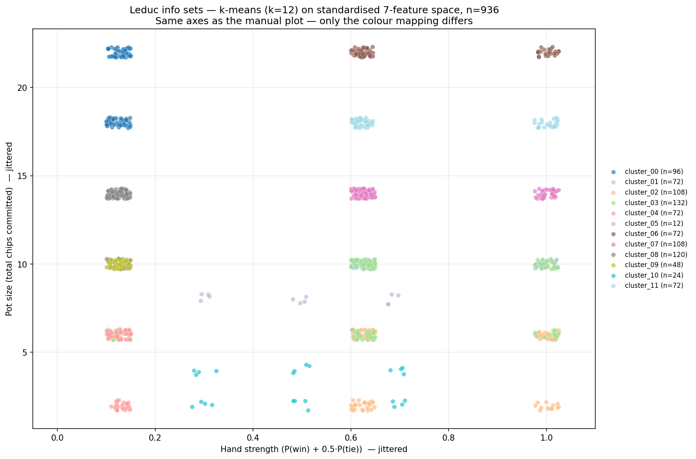

<!--
OFFICIAL PhD TITLE (keep consistent across all documents):
EN: Research on the possibilities for applying Artificial Intelligence in computer games
BG: Изследване на възможностите за приложение на изкуствения интелект в компютърни игри
-->
---
title: "Step 4 Summary — Game Abstraction & Scaling Imperfect-Information Games"
subtitle: "Research on the possibilities for applying Artificial Intelligence in computer games"
author: "Alexander Andreev"
date: "May 2026"
lang: en
vars:
  research_focus: "Adaptive Strategy Learning in Multi-Agent Imperfect-Information Environments"
---

# Step 4 — Game Abstraction & Scaling Imperfect-Information Games

This is a condensed summary of the game-abstraction material covered in Step 4. It serves two purposes: as a quick refresher while progressing through later steps, and as a primary source for the Step 15 public report synthesis.

---

## From Enumerated Games to Abstraction

Steps 1–3 built the algorithms (DQN/PPO; Vanilla CFR; CFR+ and MCCFR external/outcome). Each was demonstrated on a game small enough to enumerate exactly: Kuhn (12 information sets), Leduc (936). That toolkit is complete — but it only works when the entire game tree fits in memory.

Step 4 is the bridge from "toy games we can enumerate" to "games we cannot." The mechanism is **abstraction**: deliberately collapse parts of the game so the same algorithms can run on a smaller, structurally simpler proxy, and measure what that costs in strategy quality. By the end of this step the deliverable contains a quantitative answer to the central question of every practical poker AI since 2007:

> *How much can the game be shrunk before the abstract Nash strategy stops being a good strategy in the real game?*

That answer takes the form of a Pareto curve: on one axis, the size of the abstracted game; on the other, the **exploitability gap** — how much worse the abstract strategy is than the real game's exact Nash. Both metrics are introduced formally in the section below.

---

## Why Abstraction Is Needed

A game tree's size is the product of three factors: (a) the number of distinct hidden states the chance node can produce, (b) the branching factor at each decision point, and (c) the depth (decisions until terminal). Each of the three blows up independently:

- **Hidden states** — Texas Hold'em deals 2 hole cards from 52, then up to 5 board cards. The number of hand-vs-board distinguishable situations is on the order of $10^{17}$ before counting betting history.
- **Branching factor** — No-limit poker allows any bet size from "min raise" to "all-in." Even discretising to a handful of sizes pushes per-node branching from 3 (fold/call/raise in fixed-limit) to 5–10.
- **Depth** — Multiple betting rounds, each potentially with several raises, multiply.

The combined number of information sets in heads-up no-limit Hold'em is $\sim 10^{161}$ — more than there are atoms in the observable universe by a factor of $\sim 10^{80}$. None of Step 3's algorithms can run on that tree.

The recipe is the same in every step-4 paper: *build a smaller game whose strategies translate back into playable strategies for the real game, run the Step 3 algorithms on that smaller game, then bound the damage.* That recipe has two routes.

### Two Routes to Abstraction

The word "abstraction" in this literature actually covers two operationally different things. Both are used in modern game AI; both will appear in this thesis; conflating them is a category error. This section pins the boundary, and the abstraction pipeline follows it strictly: every phase has an *explicit* subsection (drawing on the four step-4 papers) and an *implicit* subsection (the Deep-RL counterpart in the same conceptual slot).

| Aspect | **Explicit / tabular** (this step's papers) | **Implicit / IB-style** (Deep RL) |
|---|---|---|
| Where compression lives | A partition over info sets / a finite chosen set of actions | A continuous latent vector $z = f_\theta(s)$ |
| Who does it | A human (Gilpin, Johanson) or a clustering pass on hand features | The optimiser, via gradient descent on a loss |
| The "knob" | $k$ in k-means buckets, the bet-set, the suit-isomorphism rule | $\beta$ multiplying $I(S;Z)$ in the loss |
| Guarantee | Bounded exploitability gap in the **same** game (Gilpin Thm 1, Kroer Thm 1, Johanson EMD bound) | Information-theoretic bound on $I(S;Z)$; **no** Nash-preservation theorem |
| When it is computed | Before solving — fixed input to CFR/MCCFR | During solving — the network *is* the strategy |
| Output type | A discrete bucket id per info set | A real vector |
| Where it appears in this thesis | This step (4) | Step 5 (Deep CFR), step 6 (end-to-end), steps 11–12 (sequence models) |

Both routes share the same **intuition** — compress while preserving value — and that intuition is best captured by the Information Bottleneck Lagrangian, with $\beta$ as the exchange rate between memory and value:

$$\mathcal{L} = \underbrace{\text{Complexity}(Z)}_{\text{memory cost}} - \beta \cdot \underbrace{\text{Value}(\pi_Z)}_{\text{strategic worth}}$$

When $\beta = 0$, the algorithm compresses the entire game into one state and plays terribly. When $\beta \to \infty$, it refuses to merge anything and uses the full game. Every algorithm in the abstraction pipeline is one specific instantiation of that knob:

- **Gilpin & Sandholm 2007** — corner case $\beta \to \infty$: *only* merges when $\text{Value}(\pi_Z) = \text{Value}(\pi)$ exactly (lossless).
- **Kroer & Sandholm 2016** — middle of the curve with a bound: pick $\beta$ such that $|\text{Value}(\pi_Z) - \text{Value}(\pi)| \le \varepsilon_{\text{abs}}$.
- **Johanson et al. 2013** — measures the curve itself: EMD between abstract and full distributions is a proxy for the value-loss term.
- **Brown & Sandholm 2017** — orthogonal: accept the value loss from any chosen $\beta$, then patch it at runtime via subgame solving.

The implementations done in Step 4 (the implementation phase) are all explicit. The implicit subsections in the abstraction pipeline are forward pointers, not work performed here.

---

## Two Axes of Abstraction

Across all four papers, every concrete abstraction technique falls onto one of two orthogonal axes. (A third — runtime refinement — appears in real-time refinement below.)

### Information Abstraction

Group together info sets that the agent will treat as the same state. Two flavours:

- **Lossless** — the merged states genuinely demand the same optimal action against any opponent. *Example (Leduc-specific):* the four suit-variants `(private=J♠, comm=Q♠), (J♥, Q♥), (J♠, Q♥), (J♥, Q♠)` all collapse into one bucket `(priv=J, comm=Q)`. The "private vs community" role is preserved; only the suit dimension is dropped. They are strategically identical because Leduc payoffs depend only on rank (pair matching) — there are no flushes, so no blocker effects, so the opponent's strategically-relevant hand distribution is the same in all four. Merging shrinks memory for free.
  - *Caveat:* this is a Leduc-specific freebie. In Hold'em the same suit-merge would be lossy: holding A♠ blocks an opponent's spade flush, so suit carries strategic information through *blockers* / card removal. The general criterion that decides "lossless or not" is *ordered game isomorphism* (the merging-criterion section).
- **Lossy** — the merged states differ strategically, but they are merged anyway because keeping them separate is unaffordable. *Example:* "treat J and Q as a single low-card bucket." This introduces an exploitability floor that no amount of training can remove (formalised in the section below and proven in the error-budget section via Kroer & Sandholm's bound).

> **Note on regimes** *(deferred to the exploration phase):* under explicit information abstraction in vanilla CFR there is a subtle distinction between abstracting (a) the **node map** (memory only) and (b) the **traversal** (wall-clock per iteration). They are not the same; only the second produces a wall-clock speedup.

> **Remember:** information abstraction decides which hidden situations the agent treats as the same.

### Action Abstraction and the Translation Problem

Restrict the set of actions the solver considers, run CFR (or any step-3 algorithm) on the restricted game, then handle whatever the *real* opponent does that lies outside that restriction. The structure of "the restriction" depends on whether the underlying action space is discrete or continuous, and the **action translation problem** that sits between abstract and real game looks different in the two regimes.

#### Discrete action spaces

The base set is already finite. Two flavours of abstraction apply:

- **Pruning / masking.** Drop dominated or strategically uninteresting actions before solving. *Leduc fixed-limit example:* the legal set `{fold, check/call, raise}` has only three actions per node and is already so small that no information abstraction of it is needed — fixed-limit Leduc is the unabstracted baseline in this step.
- **Macro-actions / Options framework** (Sutton, Precup & Singh 1999, *"Between MDPs and Semi-MDPs: A Framework for Temporal Abstraction in Reinforcement Learning"*). Group a *sequence* of primitive actions into one abstract action — for example, "navigate to nearest doorway" instead of 12 grid-step decisions. This collapses **depth**, not breadth: planning algorithms now propagate value across one macro-edge instead of 12 primitive edges. Abel et al. (2020, *"Value Preserving State-Action Abstractions"*) frame this as the *speed-of-planning* benefit of action abstraction in MDPs. Macro-actions are most relevant in MDP/RL settings (step 1) and in the multi-agent hierarchical architectures of step 11; they appear here only as a forward pointer.
- **Translation in the discrete regime is usually trivial.** If the abstraction's action set is a *subset* of the game's legal action set, the agent's own moves are always in-abstraction by construction. Translation is only needed when the *opponent* plays an action the agent never trained on, which in a finite discrete game can happen only when actions were pruned — and the standard fix is to mask such actions to the nearest in-abstraction equivalent (or, more rigorously, to keep them legal during training and prune only at deployment).

#### Continuous action spaces

The base set is uncountable — bet amount $b \in [b_{\min}, b_{\max}]$ in no-limit poker, joint torque $\tau \in \mathbb{R}^d$ in continuous control. CFR cannot run on a continuous tree at all without first collapsing it to a finite proxy, so for tabular methods action abstraction is *mandatory*, not optional. Two routes:

- **Explicit discretisation (the route used in this step).** Pick a fixed grid of representative actions and pretend the rest do not exist. *No-limit poker example:* allow only `{fold, call, 0.5×pot, 1×pot, 2×pot, all-in}`. A minimum interesting case used here is a two-bet-size variant of Leduc (one "small" and one "large" raise per round) with a switch that drops the larger raise to recover a fixed-limit-shaped tree; both forms are needed to demonstrate translation between them.
- **Implicit / parameterised actor (Deep RL).** A neural network outputs the parameters of a continuous distribution over actions — Gaussian mean & stddev (PPO/SAC continuous control), bounded normal distribution (SAC), or distributional outputs (like IQN and D4PG). The "abstraction" is the limited expressiveness of the parameter family rather than a discrete grid. No translation is needed because the policy can output any real-valued action directly. *Forward pointer:* this is how Deep CFR (step 5) and Pluribus-style architectures (step 6) eventually replace explicit bet-size discretisation in real-money no-limit play.

The translation problem is **acute and unavoidable** in the explicit-discretisation route. When the opponent plays a 0.7×pot bet but the abstraction only contains 0.5×pot and 1×pot, the agent must convert that bet to a node it has trained on before it can look up its strategy. Three translators in common use, in increasing sophistication:

1. **Nearest-action.** Round $b$ to the closest abstract bet on the linear scale. Simple, deterministic, and the worst on equity loss when bets cluster between two abstract sizes.
2. **Probability-split (linear).** Assign mass to the two nearest abstract bets in proportion to their linear distance from $b$. Deterministic from the agent's side, but the abstract strategy is queried as a mixture.
3. **Pseudo-harmonic mapping** (Ganzfried & Sandholm 2013). The same idea as probability-split, but the interpolation is in the *pot-fraction-odds* space rather than the linear bet-amount space, which corresponds to how strategically equivalent two bets actually are. State-of-the-art for poker bet translation; the form is

    $$f(b) = \frac{(b_{\text{high}} - b)(1 + b_{\text{low}})}{(b_{\text{high}} - b_{\text{low}})(1 + b)}$$

    giving the probability mass placed on $b_{\text{low}}$, with the remaining mass on $b_{\text{high}}$.

Translators 1 and 2 are implemented and evaluated in this step (results in the implementation phase). Pseudo-harmonic is left as an optional extension because its theoretical justification leans on the subgame-solving framework introduced in runtime patching (see Ganzfried & Sandholm, *"Action Translation in Extensive-Form Games with Large Action Spaces,"* IJCAI 2013, for the original derivation).

> **Why translation matters more than it looks.** Action translation errors compound across betting rounds: an opponent who detects that the agent rounds 0.7×pot to 1×pot can systematically bet just below (or just above) abstract grid points to coerce the agent into "wrong-sized" responses. This *exploitation by translation gap* is empirically where practical poker AIs lose the most equity in real-money play, and is the operational reason subgame solving (real-time refinement, runtime patching) was developed: re-solve the actual subgame with the actual bet rather than relying on the translator.

> **Remember:** action abstraction decides which moves the agent can reason about before translation or resolving.

### Real-Time Refinement

The third axis is *runtime* rather than design-time. Information abstraction (information abstraction) and action abstraction (action abstraction) are choices baked into the abstract game *before* the solver runs. Real-time refinement accepts that whatever those choices were, the abstract Nash will have $\varepsilon_{\text{abs}} > 0$ — and patches the error live, while play unfolds, by re-solving specific subgames at higher fidelity than the blueprint.

Two patches matter for this step:

- **Subgame solving of reached subgames** (runtime patching — patch 1) — when play descends into a subgame $S$, re-solve $S$ alone with the blueprint's counterfactual values as alternative payoffs. The patched strategy carries a *safety guarantee*: it is no more exploitable than the blueprint, and strictly less exploitable whenever a *Reach* margin is positive. Brown & Sandholm 2017 establish this formally (runtime patching Theorem 1) and provide an estimates-based extension (Theorem 2) that drops the guarantee in exchange for substantially better practical performance.
- **Nested subgame solving in response to off-tree actions** (runtime patching — patch 2) — when the opponent plays an action *outside* the abstraction, re-solve a fresh subgame that includes that action rather than mapping it to a known one. This is the production-grade replacement for the action translators of action abstraction; on heads-up no-limit poker it reduces translation-induced exploitability by $10$–$100\times$ depending on abstraction size.

The two together — abstract blueprint + safe + nested live solving — are the core architecture of every competitive heads-up no-limit poker AI since 2017 (Libratus, Modicum, Pluribus). Step 6 of this thesis covers those full architectures; this step provides the abstraction-and-patch primitives they are built from.

> **Remember:** real-time refinement patches abstraction errors where the actual game arrives.

---

## The Exploitability Gap

For a strategy $\sigma$ played in game $G$, exploitability is the standard step-3 metric:

$$\text{exploit}_G(\sigma) = \tfrac{1}{2}\bigl[v_G(\text{BR}(\sigma_{1}),\, \sigma_1) + v_G(\sigma_0,\, \text{BR}(\sigma_{0}))\bigr]$$

where $\text{BR}(\sigma)$ (Best Response) is the strategy that optimally maximizes profit specifically against the strategy $\sigma$.

Step 4 introduces a derived metric, the **exploitability gap**: how much worse an abstract strategy is than the real game's exact Nash, *measured in the real game*.

Let $G$ be the real game and $\hat G$ its abstraction. Let $\hat\sigma^*$ be the Nash of $\hat G$, and let $T(\hat\sigma^*)$ be its translation back into a playable strategy for $G$ (identity if $\hat G$ is purely an information abstraction; non-trivial if it is also an action abstraction — see action abstraction). Then

$$\Delta_{\text{abs}}(\hat G) \;=\; \text{exploit}_G\bigl(T(\hat\sigma^*)\bigr) \;-\; \text{exploit}_G(\sigma^*_G)$$

with $\sigma^*_G$ the exact Nash of $G$. By definition $\Delta_{\text{abs}} \ge 0$, with equality iff the abstraction is lossless (the merging-criterion section, Gilpin & Sandholm 2007 Theorem 3.4).

This is the central quantity of Step 4. Every Pareto plot in the Pareto frontier has $\Delta_{\text{abs}}$ on one axis. Every "abstraction quality" claim is checked by computing it.

Two complementary tools quantify $\Delta_{\text{abs}}$ before solving the abstract game outright:

- **Reach-weighted error bound** (the error-budget section, Kroer & Sandholm 2016 Theorem 2) — sums per-merge utility/probability errors weighted by reach probability to give an *upper bound* on $\Delta_{\text{abs}}$ from the abstraction's structural properties alone.
- **Earth Mover's Distance between abstract and real distributions** (the error-budget section, Johanson et al. 2013) — a *measured proxy* for $\Delta_{\text{abs}}$ that does not depend on solving anything: just compute EMD between the hand-strength distributions of merged info sets and read off how much information the merge is throwing away. Empirically the strongest predictor of post-solve exploitability.

The two are complementary: the bound is rigorous but loose; the EMD proxy is empirical but tight. The Pareto view reports both alongside the directly-measured $\Delta_{\text{abs}}$ for every abstraction configuration.

> **Remember:** exploitability gap is the price paid for solving the smaller game instead of the real one.

---

## Abstract-Then-Solve Pipeline

The operational recipe is simple: start with the real game $G$, build a smaller abstract game $\hat G$, solve $\hat G$ with CFR / CFR+ / MCCFR, translate the abstract Nash strategy back into a playable strategy for $G$, then evaluate exploitability in the real game. The exploitability gap is the difference between "solved in the abstraction" and "safe in the original game."

> **Remember:** abstraction is useful only if the strategy is evaluated back in the real game.

---

## Abstraction Pipeline: Criteria, Error, Construction, Repair

The four step-4 papers cover one lifecycle in four phases:

1. **The merging criterion** — when may two info sets be collapsed?
2. **The error budget** — how much exploitability does a merge cost?
3. **The build-time pipeline** — how do I actually compute the abstraction?
4. **The runtime patch** — what to do when the abstraction is inadequate at play time?

Each section below covers one phase. The four papers are *not* sectioned by author; each is cited inline in whichever phases it speaks to. Every phase closes with an *implicit-route* subsection naming the Deep-RL counterpart that occupies the same slot, and a one-sentence "why these are not the same theorem" stating the guarantee gap.

### The Merging Criterion

> Sources: Gilpin & Sandholm 2007 (Definition 3.2 — ordered game isomorphism, OGI) · Kroer & Sandholm 2016 (Definition 1 — CRSWF games) · Johanson, Burch, Valenzano & Bowling 2013 (Section 4 — empirical similarity).
> Reading: <https://www.cs.cmu.edu/~gilpin/papers/extensive.JACM.pdf> · <https://www.cs.cmu.edu/~sandholm/imperfect_recall_abstraction.arxiv14.pdf> · <https://poker.cs.ualberta.ca/publications/AAMAS13-abstraction.pdf>

Three nested levels of strictness, weakest at the top.

#### Level 1 — Lossless

The strict criterion: two sibling info sets $I_a, I_b$ in the *signal tree* (a structure smaller than the game tree, enumerating only sequences of public + private signals) are *ordered game isomorphic* if a child-bijection (a one-to-one mapping between children) preserves edge probabilities, the bijection is itself ordered-game-isomorphic recursively, and at the leaves the utilities match for *every* opponent continuation.

In plain terms: the two signal subtrees must have the same probabilities, the same recursive structure, and the same utility consequences no matter how the opponent continues. The last condition is the load-bearing one.

When this check returns `True`, Theorem 3.4 of the paper guarantees a constructive lift from any abstract Nash to an exact Nash of the original game — *zero* exploitability cost. Theorem 4.1 establishes that GameShrink (the build-time pipeline) exhausts this criterion: every lossless merge expressible by Definition 3.2 is found.

*Intuition:* Two situations can only be losslessly merged if they share exactly the same probabilities and consequences against all possible opponent moves (e.g., holding a red Jack vs a black Jack when suits don't matter). If one suit naturally blocks a flush while the other doesn't, they behave differently and cannot be merged.

> **Remember:** lossless abstraction is free compression: same strategic meaning, fewer stored information sets.

#### Level 2 — Bounded lossy

The criterion relaxes Gilpin's condition (3) — utility identity — to "utilities differ by at most $\varepsilon^R$ for every opponent continuation," and adds two analogous slack constants $\varepsilon^0, \varepsilon^D$ for chance-probability errors (absolute and conditional). Conditions (4) + (5) — action-sequence consistency on opponent and self moves along merged paths — stay strict.

In words: *merge $I, \tilde I$ if there is a leaf-bijection $\varphi: Z_I \to Z_{\tilde I}$ such that every leaf-pair's utility, leaf-probability, and conditional-distribution mismatch fits within $(\varepsilon^R, \varepsilon^0, \varepsilon^D)$, and the action sequences along merged paths agree.*

The four mismatch constants per merge become inputs to the error-budget computation in the error-budget section.

The CRSWF generalisation over Lanctot et al. 2009's *skew well-formed* predecessor is the addition of conditions decoupling absolute and conditional chance probabilities — this is what lets imperfect-recall abstractions merge info sets when chance probabilities differ "by a small amount everywhere."

*Intuition:* When we group non-identical hands (like throwing low cards into a single \"bad hand\" bucket), we force the system to treat them as the same. This creates a quantifiable mismatch in maximum potential payoffs, but allows for a drastically smaller game size.

> **Remember:** bounded lossy abstraction is controlled forgetting: the game shrinks, but each merge receives an error price.

#### Level 3 — Empirical similarity

When the analytical bound is too pessimistic or the inputs too high-dimensional to enumerate (Texas hold'em has $\sim 2.4 \times 10^9$ canonical river boards), drop the per-merge bound entirely and replace it with a *learned distance function* whose merges minimise empirical strategy mismatch:

- Compute a feature vector per info set — Johanson uses the histogram of end-of-game hand strengths after rolling out unseen cards (Hand Strength Distribution, HSD).
- Use Earth Mover's Distance between feature vectors as the similarity metric.
- Merge info sets whose feature distributions are close.

The empirical route does *not* come with the Gilpin or Kroer guarantees. It comes with the error-budget section evaluator (CFR-BR) that measures merge quality after the fact.

*Intuition:* A low pair and a high suited connector might have the same average win probability, but their strategic character is entirely different (one is a stable medium hand, the other is boom-or-bust). Earth Mover's Distance correctly identifies this character difference, preventing harmful merges that average strength alone would allow.

> **Remember:** empirical abstraction is a budgeted guess that must be measured after solving.

#### Picking among the three

The decision order is: first take every lossless merge you can find; then accept bounded lossy merges only when the error budget is tolerable; when exact checks are too pessimistic or too expensive, cluster with HSD + EMD and verify the resulting abstraction empirically.

#### Deep RL Equivalents (Implicit Route)

In Deep RL, these three levels map naturally to network architectures: **Lossless** abstraction corresponds to permutation-equivariant networks (like Deep Sets), **Bounded lossy** relates to information bottlenecks in recurrent/transformer policies, and **Empirical similarity** matches end-to-end learned latent embeddings (like in Deep CFR).

### The Error Budget

> Sources: Kroer & Sandholm 2016 (Theorems 1 + 2 — analytical reach-weighted bound) · Johanson, Burch, Valenzano & Bowling 2013 (Section 3 — EMD as proxy + CFR-BR direct evaluator).

Three quantification tools, increasing in tightness and decreasing in formal rigour.

#### Tool 1 — Analytical bound

Given a CRSWF abstraction with per-merge constants $(\delta, \varepsilon^R, \varepsilon^0, \varepsilon^D)$ from the merging-criterion section Level 2, an upper bound on the exploitability gap of any abstract Nash strategy implemented in the original game.

*The reach-weighting is the key idea.* Each merge contributes to $\varepsilon$ in proportion to how often its info set is reached during play. The formula combines reward mismatch, chance-probability mismatch, and conditional-distribution mismatch, then discounts them by opponent reach. Rare info sets can be merged aggressively without hurting overall exploitability — exactly what every practical poker abstraction since 2010 exploits.

Theorem 1 is the analogous statement at the regret level rather than the equilibrium level — useful for CFR-style algorithms whose convergence bound is on regret, not on Nash distance.

*The improvement over Lanctot et al. 2009.* Their predecessor took the *maximum* per-leaf reward error rather than this reach-weighted sum; the difference can be exponential. Concretely: aces vs kings ($I_A, I_K$) become "as similar as aces vs twos" ($I_A, I_2$) under the maximum, but very different under reach-weighting because aces and kings co-occur with similar opponent ranges while aces and twos do not.

*Intuition:* The error of a bucket merge is weighted by how often players actually reach that situation. A sloppy merge in a rare endgame scenario costs almost nothing to overall strategy, allowing aggressive abstraction without losing money overall.

> **Remember:** the analytical bound is rigorous but usually loose; its most important idea is reach-weighting.

#### Tool 2 — EMD proxy

A *measured* upper bound that does not require enumerating leaves. Earth Mover's Distance between the hand-strength histograms of two info sets is the minimum work to transform one into the other:

In words: *imagine each histogram as piles of sand on the bin grid. EMD is the minimum total work — sand mass times distance moved — to reshape pile A into pile B.* On one-dimensional histograms it can be computed cheaply as the distance between cumulative distributions. Two strategically equivalent hands (same shape) get distance 0; an "all-strength" vs "all-potential" pair gets a large distance even when their means coincide.

*Intuition:* Hands that play similarly (like two different low pairs, or two different suited connectors) will naturally have a small structural distance. Hands that play completely differently will have a huge distance, even if their raw win percentage is identical.

EMD is a *proxy*, not a bound. It correlates well with post-solve exploitability but carries no formal guarantee.

> **Remember:** EMD remembers distribution shape; expected hand strength remembers only the mean.

#### Tool 3 — CFR-BR direct evaluator

The strongest measurement: it returns the closest representable Nash approximation the abstraction can express, *isolating* abstraction error from solving error.

CFR-BR alternates between real-game best responses and abstract-game regret updates. In experiments CFR-BR strategies show exploitability as low as $1/3$ of the corresponding plain-CFR strategies on the *same* abstraction. Meaning: a large fraction of measured "abstraction error" in the literature is actually *solving error in disguise*. The right Pareto plot in the Pareto frontier reports both axes — the gap between them is itself diagnostic.

> **Remember:** CFR-BR asks what the abstraction can express, not how well one solver happened to train.

#### Empirical findings worth memorising (Johanson et al. 2013)

Two factorial comparisons on equal info-set budgets:

- **Distribution-aware vs expectation-based.** HSD + EMD strictly dominates $E[HS]$-based clustering on exploitability and on one-on-one win rate against fixed opponents.
- **Imperfect vs perfect recall.** Imperfect-recall abstractions outperform perfect-recall at matched info-set budget — the bucket-reallocation freedom that the merging-criterion section Level 2 makes available is empirically worth more than the lost continuity.

Both are reasons the build-time pipeline defaults to imperfect recall + HSD + EMD.

#### Deep RL Equivalents (Implicit Route)

Rather than explicit error bounds, Deep RL monitors abstraction quality purely via rate-distortion curves (Information Bottleneck) and test loss tracking, accepting asymptotic convergence over formal algorithmic guarantees.

### The Build-Time Pipeline

> Sources: Gilpin & Sandholm 2007 (Algorithm 2 — GameShrink, exhaustive lossless merger) · Johanson, Burch, Valenzano & Bowling 2013 (Section 4 — HSD + EMD + k-means + imperfect recall) · Kroer & Sandholm 2016 (Theorem 3 + Proposition 2 — NP-hardness annotation, metric-space 2-approximation).

Two complementary pipelines, one per criterion-strictness level.

#### Pipeline 1 — GameShrink (lossless)

Exhaustive merger driven by `is_lossless_merge` from the merging-criterion section, run level-by-level on the signal tree (not the game tree).

The algorithm sweeps the signal tree bottom-up, checks sibling subtrees for ordered game isomorphism, and merges every passing pair through a union-find style filter. Runtime $\tilde O(n^2)$ where $n$ is the *signal-tree* node count (not game-tree node count). On Rhode Island Hold'em this means $\sim 6.6$ M signal-tree nodes vs $\sim 3.1$ B game-tree nodes — the algorithm runs sublinear in the game tree it is shrinking.

Theorem 4.1 of the paper states completeness: GameShrink finds **every** lossless merge this transformation can express. Practical milestone: GameShrink + linear programming was the engine that solved Rhode Island Hold'em in 2007, four orders of magnitude larger than any poker game previously solved.

> **Remember:** GameShrink searches the signal tree for every free merge before any lossy compression is considered.

#### Pipeline 2 — HSD + EMD + k-means + imperfect recall (lossy)

When the lossless merger has run to convergence and the game is still too large, switch to clustering:

The pipeline computes a hand-strength distribution for each information set, clusters those distributions with EMD as the distance metric, and maps each information set to a bucket id. With perfect recall, the bucket identity includes the past bucket trail. With imperfect recall, the later-round bucket can forget the earlier trail, freeing more buckets for the round where the new information matters most.

Imperfect recall is the bucket-reallocation freedom that the merging-criterion section Level 2 enables and the error-budget section Theorem 2 quantifies — empirically worth more than the lost continuity (Johanson Section 3's Tool 3 result).

> **Remember:** HSD + EMD decides *what looks strategically similar*; imperfect recall decides *where to spend the bucket budget*.

#### Annotation — computational hardness (Kroer Theorem 3 + Proposition 2)

*A note on hardness.* Picking the partition that minimises the analytical bound is **NP-complete**, even for a single-player height-2 game, by reduction from clustering (Kroer Theorem 3). So we do not minimise the bound exactly; we approximate.

*The metric-space escape hatch.* When the action-sequence consistency conditions of CRSWF (the merging-criterion section Level 2) are satisfied for all candidate merges and the scaling variables $\delta_{I, \tilde I}$ are fixed, the bound function $d(I, \tilde I) = \text{cost-of-merging}$ is a metric (Kroer Proposition 2). Single-level abstraction reduces to *k*-centre clustering in a metric space — Gonzalez 1985 gives a polynomial-time 2-approximation. Multi-level abstraction (the multi-round `kmeans_emd_pipeline` above) loses this guarantee globally but recovers it level-by-level when the conditions hold per round.

This is *why* every practical poker abstraction since 2010 is a level-by-level clustering pipeline rather than a global optimiser.

#### Deep RL Equivalents (Implicit Route)

In Modern Deep RL (like Deep CFR), there is no separate \"build-time\" abstraction pipeline. The neural network's latent space learns its own abstract representation directly shaped by the gradient descent of the regret-minimization loss.

### Runtime Patching

> Sources: Brown & Sandholm 2017 Sections 4-5 (Unsafe / Resolve / Maxmargin / Reach + Theorems 1, 2) · Brown & Sandholm 2017 Section 7 (Nested subgame solving). PDF: <https://arxiv.org/pdf/1705.02955v3>.

When play descends into a subgame and the abstraction's blueprint is too coarse, re-solve the subgame at higher fidelity in real time. Two patches matter — together they were the load-bearing components of Libratus, the first AI to defeat top humans in heads-up no-limit Texas hold'em.

#### Why subgame solving cannot be done in isolation (Coin Toss)

The paper opens with a counterexample called *Coin Toss*. A coin lands Heads or Tails with equal probability, only $P_1$ sees the outcome. $P_1$ chooses Sell or Play. Sell's expected value is $+0.5$ if Heads, $-0.5$ if Tails. Under Play, $P_2$ guesses the side; correct guess gives $P_1$ a payoff of $-1$, wrong guess $+1$. The optimal $P_2$ strategy in the Play subgame is *not* a function of the Play subgame alone — it depends on the *expected value of the Sell action $P_1$ would have taken in the unreached subgame*. If Sell pays $+0.5$ from Heads, $P_2$ plays Heads with probability $1/4$. If Sell instead pays $-0.5$ from Heads, $P_2$ plays Heads with probability $3/4$. Same Play subgame, opposite optimal strategy.

This is the central pathology that all naive imperfect-information subgame solving walks into. The fix: solve an *augmented subgame* containing $S$ plus extra "alternative-payoff" nodes that encode what $P_1$ could have achieved by *not entering* $S$.

#### Patch 1 — Reach-Resolve subgame solving

The paper builds a four-step ladder of techniques on the same augmented-subgame scaffold:

| Technique | Augmented payoff at $I_1 \in S_{\text{top}}$ | Safety vs blueprint |
|---|---|---|
| Unsafe | none — just blueprint reach probabilities | none (Coin Toss broken) |
| Resolve | $\text{CBV}^{\sigma_2}(I_1)$ — value of P1 BR vs blueprint | margin $\ge 0$ |
| Maxmargin | $\text{CBV}^{\sigma_2}(I_1)$ + maximise $\min M(I_1)$ | margin maximally positive |
| Reach | Maxmargin + lower-bound *gifts* along P1's path | strict improvement on Maxmargin |

A *gift* at a prior infoset $I'_1 \cdot a' \sqsubset I_1$ along $P_1$'s path is the value difference between the action $P_1$ actually took and a strictly better action $P_1$ could have taken. The blueprint pays it forward; Reach lets the augmented subgame know about it.

Operationally, Reach-Resolve builds the augmented subgame, assigns each top information set an alternative payoff equal to the blueprint counterfactual best-response value plus any lower-bound gifts, then solves that augmented game. Theorem 1 of the paper: the resulting strategy has exploitability no higher than the blueprint, with strict improvement whenever any reach-margin is positive.

Theorem 2: replace the conservative payoff $\text{CBV}^{\sigma_2}(I_1)$ with an *estimate* $\widetilde{CBV}^{\sigma_2}(I_1)$ of the equilibrium value, and the bound becomes $\textit{exp}(\sigma') \le \textit{exp}(\sigma^*) + 2\Delta$ where $\Delta$ is the estimate error. In practice estimates beat the conservative bound — the paper reports a $0.02\%$-of-full-game abstraction with strategy exploitability $112$ mbb/h but value-estimation error $\sim 2$ mbb/h.

> **Remember:** safe subgame solving works because the subgame is not solved alone; it is anchored by blueprint values.

#### Patch 2 — Nested subgame solving (the action-translation killer)

When the *opponent* plays an action $a$ outside the abstraction (a $0.7\!\times\!\text{pot}$ bet when the abstraction has only $0.5\!\times\!\text{pot}$ and $1\!\times\!\text{pot}$), instead of mapping $a$ to a known action via the action abstraction translators, *re-solve a fresh subgame containing $a$*.

The inexpensive version builds a subgame just after the off-tree action, re-solves it with the safe subgame-solving scaffold, and appends the new sub-strategy to the blueprint. If another off-tree action appears later, the process repeats, so the blueprint grows only where play actually goes.

*Empirical impact.* On heads-up no-limit Texas hold'em, Brown & Sandholm report nested subgame solving's exploitability against off-tree opponent bets as $10$–$100\times$ lower than every prior action-translation method, depending on abstraction size.

*The recursion is shallow in practice.* Most real off-tree actions do not chain — the opponent plays one weird bet, the agent re-solves, and the new abstract tree absorbs it. The action abstraction translators remain the right choice only when the latency budget cannot afford a live CFR solve (online play, embedded apps).

> **Remember:** action translation rounds the opponent's move; nested solving keeps the move and solves around it.

#### Deep RL Equivalents (Implicit Route)

The Deep RL equivalent of subgame solving replaces exact equilibrium solvers with depth-limited heuristic search backed by neural-network value functions (as seen in DeepStack and ReBeL).

---

## Practical Validation

The implementation phase converted the summary's abstractions into a small but complete Leduc-family pipeline:

- **Lossless suit isomorphism** on fixed-limit Leduc and Extended Leduc.
- **Lossy card bucketing** using hand-strength features, EMD-style distances, and configurable bucket counts.
- **Action abstraction** on Mini-NL Leduc, with nearest, probability-split, and pseudo-harmonic translation code.
- **Extended Leduc** with four ranks and two suits, giving a larger imperfect-information testbed.
- **Combined abstraction** composing suit reduction, action reduction, and card buckets.
- **Quality evaluation** through exploitability gaps, EMD proxies, OpenSpiel cross-validation, and a Pareto frontier.

The main empirical lesson matches the theory: lossless abstraction is almost free strategically and very useful computationally, while lossy information and action abstraction introduce persistent exploitability floors. Under 180-second CFR+ budgets, suit isomorphism reduced fixed-limit Leduc from 936 to 288 information sets and reached lower exploitability than the full game because it completed many more iterations. On Extended Leduc, the same idea reduced the game from 10,304 to 2,968 information sets and improved final exploitability from about $2.7 \times 10^{-2}$ to about $1.3 \times 10^{-3}$.

The lossy bucket runs show the other side of the tradeoff. Smaller bucketed games train faster, but the error does not disappear with more CFR+ iterations because the strategy is solving the wrong game. In fixed-limit Leduc, coarse bucket abstractions remained around $0.38$-$0.57$ exploitability, even though they completed more iterations than full CFR+. This is the practical meaning of the exploitability gap: abstraction error is not optimizer error.

Action abstraction was the riskiest part of the step. In Mini-NL Leduc, restricting the action set reduced the information-set count from 4,704 to 936 and produced many more CFR+ iterations under the same time budget, but exploitability stayed high. In Extended Leduc, adding action abstraction on top of suit isomorphism produced a compact tree, but the translated strategy was highly exploitable. This is why the literature moves from static action translation toward nested subgame solving: the full action actually played by the opponent often matters too much to round away.

The Pareto view is the right final diagnostic. Each point asks: how much smaller did the game become, and how much exploitability did that compression buy or cost? Lossless suit isomorphism lands on the attractive part of the frontier. Coarse buckets and action abstraction can reduce the game further, but they move onto a different regime where smaller size is paid for with strategy quality.

## Connections and Forward Pointers

Step 4 continues the progression started in Steps 2 and 3. Step 2 introduced CFR as local regret minimization over information sets. Step 3 made that solver faster and cheaper through CFR+ and MCCFR. Step 4 changes the input game itself: before solving, it asks which states and actions can be merged without destroying the strategic signal.

The bridge to Step 5 is the distinction between explicit and implicit abstraction. Step 4's abstractions are hand-built or clustering-built partitions over information sets and action sets. Deep CFR and neural equilibrium approximation replace those tables with learned function approximators: the representation is still compressed, but the compression lives inside a network rather than in a fixed bucket map.

The bridge to Step 6 is the blueprint architecture. Modern poker agents solve a coarse abstract game first, then patch weaknesses online with subgame solving. Step 4 supplies the vocabulary: blueprint, action translation, exploitability gap, Pareto frontier, and safe/nested refinement. Step 6 turns those pieces into complete game-playing systems.

For the thesis, abstraction matters because opponent adaptation only works at the resolution the representation preserves. If the abstraction merges two strategically distinct opponent-facing states, no downstream opponent model can recover that distinction. Conversely, a representation that is too fine may be too expensive to solve or evaluate. The Step 4 Pareto frontier therefore becomes part of the evaluation methodology: strategy quality must be reported together with the size and granularity of the game representation that produced it.
