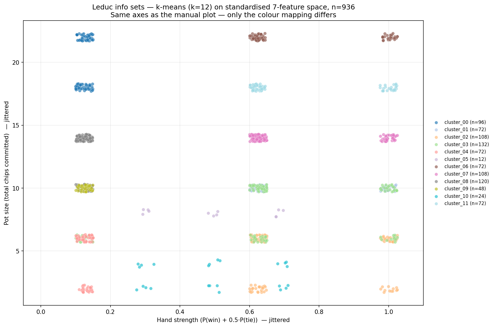
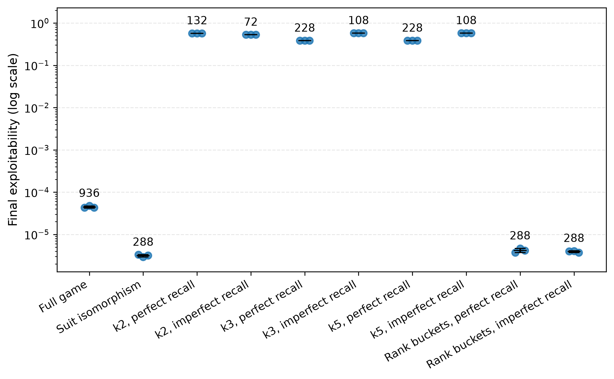
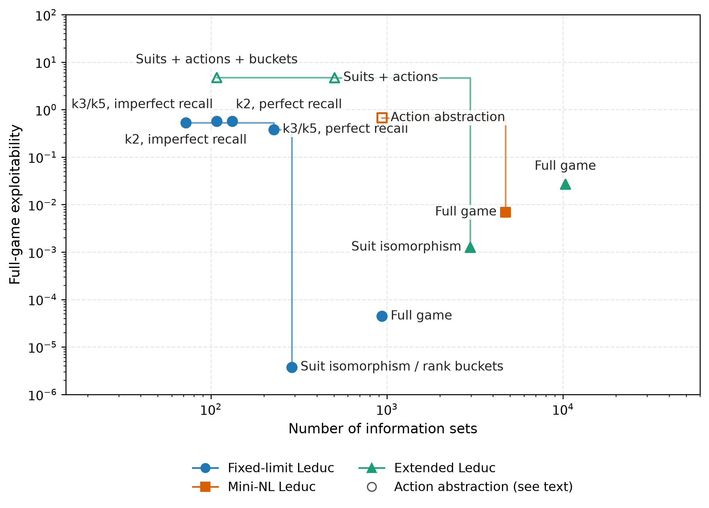

<!--
OFFICIAL PhD TITLE (keep consistent across all documents):
EN: Research on the possibilities for applying Artificial Intelligence in computer games
BG: Изследване на възможностите за приложение на изкуствения интелект в компютърни игри
-->
---
title: "Step 4 Summary — Game Abstraction & Scaling Imperfect-Information Games"
subtitle: "Research on the possibilities for applying Artificial Intelligence in computer games"
author: "Alexander Andreev"
date: "May 2026"
lang: en
vars:
  research_focus: "Adaptive Strategy Learning in Multi-Agent Imperfect-Information Environments"
---

# Step 4 — Game Abstraction & Scaling Imperfect-Information Games

This is a condensed summary of the game-abstraction material covered in Step 4. It serves two purposes: as a quick refresher while progressing through later steps, and as a primary source for the Step 15 public report synthesis.

---

## From Enumerated Games to Abstraction

Steps 1–3 built the algorithms (DQN/PPO; Vanilla CFR; CFR+ and MCCFR external/outcome). Each was demonstrated on a game small enough to enumerate exactly: Kuhn (12 information sets), Leduc (936). That toolkit is complete — but it only works when the entire game tree fits in memory.

Step 4 is the bridge from "toy games we can enumerate" to "games we cannot." The mechanism is **abstraction**: deliberately collapse parts of the game so the same algorithms can run on a smaller, structurally simpler proxy, and measure what that costs in strategy quality. By the end of this step the deliverable contains a quantitative answer to the central question of every practical poker AI since 2007:

> *How much can the game be shrunk before the abstract Nash strategy stops being a good strategy in the real game?*

That answer takes the form of a Pareto curve: on one axis, the size of the abstracted game; on the other, the **exploitability gap** — how much worse the abstract strategy is than the real game's exact Nash. Both metrics are introduced formally in the section below.

---

## Why Abstraction Is Needed

A game tree's size is the product of three factors: (a) the number of distinct hidden states the chance node can produce, (b) the branching factor at each decision point, and (c) the depth (decisions until terminal). Each of the three blows up independently:

- **Hidden states** — Texas Hold'em deals 2 hole cards from 52, then up to 5 board cards. The number of hand-vs-board distinguishable situations is on the order of $10^{17}$ before counting betting history.
- **Branching factor** — No-limit poker allows any bet size from "min raise" to "all-in." Even discretising to a handful of sizes pushes per-node branching from 3 (fold/call/raise in fixed-limit) to 5–10.
- **Depth** — Multiple betting rounds, each potentially with several raises, multiply.

The combined number of information sets in heads-up no-limit Hold'em is $\sim 10^{161}$ — more than there are atoms in the observable universe by a factor of $\sim 10^{80}$. None of Step 3's algorithms can run on that tree.

The recipe is the same across every approach: *build a smaller game whose strategies translate back into playable strategies for the real game, run the Step 3 algorithms on that smaller game, then bound the damage.* That recipe has two routes.

### Two Routes to Abstraction {.unlisted}

The word "abstraction" in this literature actually covers two operationally different things. Both are used in modern game AI; both will appear in this thesis; conflating them is a category error. This section pins the boundary, and the abstraction pipeline follows it strictly: every phase has an *explicit* subsection (the tabular / algorithmic route) and an *implicit* subsection (the Deep-RL counterpart in the same conceptual slot).

| Aspect | **Explicit / tabular** | **Implicit / IB-style** (Deep RL) |
|---|---|---|
| Where compression lives | A partition over info sets / a finite chosen set of actions | A continuous latent vector $z = f_\theta(s)$ |
| Who does it | A human-designed rule or a clustering pass on hand features | The optimiser, via gradient descent on a loss |
| The "knob" | $k$ in k-means buckets, the bet-set, the suit-isomorphism rule | $\beta$ multiplying $I(S;Z)$ in the loss |
| Guarantee | Bounded exploitability gap in the **same** game (formal exploitability bound) | Information-theoretic bound on $I(S;Z)$; **no** Nash-preservation theorem |
| When it is computed | Before solving — fixed input to CFR/MCCFR | During solving — the network *is* the strategy |
| Output type | A discrete bucket id per info set | A real vector |
| Where it appears in this thesis | This step (4) | Step 5 (Deep CFR), step 6 (end-to-end), steps 11–12 (sequence models) |

Both routes share the same **intuition** — compress while preserving value — and that intuition is best captured by the Information Bottleneck Lagrangian, with $\beta$ as the exchange rate between memory and value:

$$\mathcal{L} = \underbrace{\text{Complexity}(Z)}_{\text{memory cost}} - \beta \cdot \underbrace{\text{Value}(\pi_Z)}_{\text{strategic worth}}$$

When $\beta = 0$, the algorithm compresses the entire game into one state and plays terribly. When $\beta \to \infty$, it refuses to merge anything and uses the full game. Every algorithm in the abstraction pipeline is one specific instantiation of that knob:

- **Lossless merging** — corner case $\beta \to \infty$: only merges when $\text{Value}(\pi_Z) = \text{Value}(\pi)$ exactly.
- **Bounded lossy** — middle of the curve with a guarantee: pick $\beta$ such that $|\text{Value}(\pi_Z) - \text{Value}(\pi)| \le \varepsilon_{\text{abs}}$.
- **Empirical similarity (HSD + EMD)** — measures the curve itself: EMD between abstract and full distributions is a proxy for the value-loss term.
- **Runtime patching** — orthogonal: accept the value loss from any chosen $\beta$, then patch it at runtime via subgame solving.

The implementations in this step are all explicit; the implicit subsections are forward pointers, not work performed here.

Throughout the rest of this summary, the strategy produced by solving the abstract game (and used as the starting point at runtime) is referred to as the **blueprint**.

---

## Two Axes of Abstraction

Every concrete abstraction technique falls onto one of two orthogonal axes — *what states the agent treats as the same* (information abstraction) and *what moves the agent considers* (action abstraction). A third axis, *runtime refinement*, is orthogonal to both and lives in its own section (Runtime Patching, below).

### Information Abstraction {.unlisted}

Group together info sets that the agent will treat as the same state. This is the central operation of the pipeline — every phase from the merging criterion through the build-time pipeline is about *how* and *when* to perform information merges.

> **Note on regimes.** Under explicit information abstraction in vanilla CFR there is a subtle distinction between abstracting (a) the **node map** (memory only) and (b) the **traversal** (wall-clock per iteration). Only the second produces a wall-clock speedup.

> **Remember:** information abstraction decides which hidden situations the agent treats as the same.

### Action Abstraction and the Translation Problem {.unlisted}

Restrict the set of actions the solver considers, run CFR on the restricted game, then handle whatever the real opponent does that lies outside that restriction. Two regimes:

- **Discrete action spaces.** The base set is already finite. Abstraction means *pruning* (drop dominated or uninteresting actions before solving) or *macro-actions* (group sequences of primitives into one abstract action — a forward pointer to temporal abstraction in steps 1 and 11). Translation is usually trivial: if the abstract action set is a subset of the legal one, the agent's own moves are always in-abstraction.
- **Continuous action spaces.** The base set is uncountable (bet sizes in no-limit poker, joint torques in continuous control). For tabular methods, action abstraction is *mandatory* — CFR cannot run on a continuous tree without first collapsing it to a finite proxy (typical poker grid: `{fold, call, 0.5×pot, 1×pot, 2×pot, all-in}`). The Deep RL alternative is a parameterised actor that outputs a continuous distribution over actions directly (PPO/SAC), eliminating the translation problem at the cost of formal guarantees.

The translation problem is **acute** in the explicit-discretisation route: when the opponent plays a 0.7×pot bet but the abstraction only contains 0.5×pot and 1×pot, the agent must convert that bet to a node it has trained on. Three translators in common use:

1. **Nearest-action** — round to the closest abstract bet on the linear scale. Worst on equity loss when bets cluster between abstract sizes.
2. **Probability-split (linear)** — assign mass to the two nearest abstract bets in proportion to their distance from the actual bet.
3. **Pseudo-harmonic mapping** — interpolate in *pot-fraction-odds* space rather than linear bet-amount space, which corresponds to how strategically equivalent two bets actually are. State-of-the-art for poker bet translation.

Translation errors compound across betting rounds — an opponent who detects rounding can systematically bet just below or above grid points to coerce wrong-sized responses. This is empirically where practical poker AIs lose the most equity, and is the operational reason runtime patching (below) exists: re-solve the actual subgame with the actual bet rather than relying on the translator.

> **Remember:** action abstraction decides which moves the agent can reason about before translation or resolving.

---

## The Exploitability Gap

For a strategy $\sigma$ played in game $G$, exploitability is the standard step-3 metric:

$$\text{exploit}_G(\sigma) = \tfrac{1}{2}\bigl[v_G(\text{BR}(\sigma_{1}),\, \sigma_1) + v_G(\sigma_0,\, \text{BR}(\sigma_{0}))\bigr]$$

where $\sigma_0$ and $\sigma_1$ are the two players' strategies, and $\text{BR}(\sigma)$ (Best Response) is the strategy that optimally maximizes profit specifically against the strategy $\sigma$.

Step 4 introduces a derived metric, the **exploitability gap**: how much worse an abstract strategy is than the real game's exact Nash, *measured in the real game*.

Let $G$ be the real game and $\hat G$ its abstraction. Let $\hat\sigma^*$ be the Nash of $\hat G$, and let $T(\hat\sigma^*)$ be its translation back into a playable strategy for $G$ (identity if $\hat G$ is purely an information abstraction; non-trivial if it is also an action abstraction — see action abstraction). Then

$$\Delta_{\text{abs}}(\hat G) \;=\; \text{exploit}_G\bigl(T(\hat\sigma^*)\bigr) \;-\; \text{exploit}_G(\sigma^*_G)$$

with $\sigma^*_G$ the exact Nash of $G$. By definition $\Delta_{\text{abs}} \ge 0$, with equality iff the abstraction is lossless (covered in the merging criterion below).

This is the central quantity of Step 4. Every Pareto plot in the Pareto frontier has $\Delta_{\text{abs}}$ on one axis. Every "abstraction quality" claim is checked by computing it.

Two complementary tools quantify $\Delta_{\text{abs}}$ before solving the abstract game outright:

- **Reach-weighted error bound** (covered in the error budget below) — sums per-merge utility/probability errors weighted by reach probability to give an *upper bound* on $\Delta_{\text{abs}}$ from the abstraction's structural properties alone.
- **Earth Mover's Distance between abstract and real distributions** (covered in the error budget below) — a *measured proxy* for $\Delta_{\text{abs}}$ that does not depend on solving anything: just compute EMD between the hand-strength distributions of merged info sets and read off how much information the merge is throwing away. Empirically the strongest predictor of post-solve exploitability.

The two are complementary: the bound is rigorous but loose; the EMD proxy is empirical but tight. The Pareto view reports both alongside the directly-measured $\Delta_{\text{abs}}$ for every abstraction configuration.

> **Remember:** exploitability gap is the price paid for solving the smaller game instead of the real one.

---

## Earth Mover's Distance: A Primer

EMD shows up across nearly every section that follows, so it earns a short standalone introduction.

**What it measures.** Given two probability distributions over the same support, EMD is the minimum amount of "work" needed to transform one into the other, where *work = mass moved × distance moved*. Imagine each distribution as piles of sand on a number line — EMD is the smallest total effort to reshape pile A into pile B.

**Origins and other names.** The idea traces to Monge's 1781 *optimal transport* problem (moving piles of earth to fill holes with minimum effort), formalised by Kantorovich in 1942 as a linear program. The same quantity appears in machine learning under several names — **Wasserstein-1 distance**, **Kantorovich-Rubinstein distance**, or simply **Wasserstein distance**. Rubner, Tomasi & Guibas (2000) popularised the "Earth Mover's Distance" name in computer vision for image retrieval. More recently it underpins Wasserstein GANs and is a workhorse in document similarity, domain adaptation, and any task where comparing distribution *shape* matters.

**Why it beats mean-based comparisons.** EMD respects the *geometry* of where mass lives, not just average values. Two distributions concentrated near each other are close; two distributions concentrated at opposite ends are far apart, regardless of where their means happen to coincide. Expected-value comparisons throw all this structure away.

**In this step's context.** Each information set has a *Hand Strength Distribution (HSD)* — the histogram of end-of-game win probabilities computed by rolling out unseen cards. Two HSDs with the same mean can have completely different shapes: a peaked "stable medium hand" vs a bimodal "boom-or-bust" hand. Expected-hand-strength clustering merges these together; EMD does not. That is why every quality criterion, every error proxy, and every clustering pipeline below uses EMD between HSDs as the core similarity signal.

**Cheap on 1-D histograms.** When the support is one-dimensional and ordered (binned win probability ∈ [0, 1]), EMD reduces to the L1 distance between cumulative distributions — a single linear sweep over the bins. This is why HSD + EMD is fast enough to cluster millions of info sets.

> **Remember:** EMD compares distribution *shape*, not just the mean — that's why two hands with identical win rates can still be strategically different.

---

## The Merging Criterion

> **Further reading:** <https://www.cs.cmu.edu/~gilpin/papers/extensive.JACM.pdf> · <https://www.cs.cmu.edu/~sandholm/imperfect_recall_abstraction.arxiv14.pdf> · <https://poker.cs.ualberta.ca/publications/AAMAS13-abstraction.pdf>

When can two information sets be collapsed into one? Three nested levels of strictness, weakest at the top.

### Level 1 — Lossless

Merge two info sets only when they are *strategically identical*: same probability of being reached, same recursive structure, and same utility consequences against every possible opponent continuation. The last condition is the load-bearing one — if any opponent reaction can distinguish them, they cannot be losslessly merged.

When this holds, the merge is free: any optimal strategy in the abstract game lifts to an optimal strategy in the original game with **zero** exploitability cost.

*Intuition:* A red Jack and a black Jack in a game where suits don't matter (no flushes possible) are losslessly mergeable. A red Jack in a game *with* flushes is not — the suit silently affects the opponent's flush odds through card removal.

> **Remember:** lossless abstraction is free compression: same strategic meaning, fewer stored information sets.

### Level 2 — Bounded lossy

Relax "identical utilities" to "utilities differ by at most $\varepsilon$"; same idea for chance probabilities. The price is a quantifiable error — each merge contributes a slack budget that propagates into a bound on overall exploitability (used by the next section). Action sequences along merged paths still need to agree, so this is *controlled* forgetting, not arbitrary.

*Intuition:* Putting J and Q into a single "low card" bucket forces the agent to play them identically, even though optimally they differ slightly. The system absorbs that mistake in exchange for a much smaller game.

> **Remember:** bounded lossy abstraction is controlled forgetting: the game shrinks, but each merge receives an error price.

### Level 3 — Empirical similarity

When the analytical bound is too pessimistic or the inputs too high-dimensional to enumerate (Texas hold'em has $\sim 10^9$ canonical river boards), drop the per-merge bound and replace it with a *learned distance function*:

- Compute a feature vector per info set — typically the **Hand Strength Distribution (HSD)**: the histogram of end-of-game win probabilities after rolling out unseen cards.
- Use **Earth Mover's Distance (EMD)** between feature vectors as the similarity metric.
- Cluster info sets whose feature distributions are close; merge within clusters.

There is no formal exploitability guarantee here — quality is checked *after* solving by measuring exploitability on the resulting strategy.

> **Remember:** empirical abstraction is a budgeted guess that must be measured after solving.

### Picking among the three

The decision order is: first take every lossless merge available; then accept bounded lossy merges only when the error budget is tolerable; when exact checks are too pessimistic or too expensive, cluster with HSD + EMD and verify the resulting abstraction empirically.

---

## The Error Budget

> **Further reading:** <https://www.cs.cmu.edu/~sandholm/imperfect_recall_abstraction.arxiv14.pdf> · <https://poker.cs.ualberta.ca/publications/AAMAS13-abstraction.pdf>

Three quantification tools, increasing in tightness and decreasing in formal rigour.

### Tool 1 — Analytical bound

Given a bounded-lossy abstraction with per-merge slack constants, sum them — weighted by how often each info set is actually reached during play — to get an upper bound on the exploitability gap.

The reach-weighting is the key idea. Rare info sets can be merged aggressively without hurting overall exploitability; sloppy merges in dense, frequently-visited regions are catastrophic. This is what every practical poker abstraction since 2010 exploits.

*Intuition:* The error of a bucket merge is weighted by how often players actually reach that situation. A sloppy merge in a rare endgame scenario costs almost nothing overall, allowing aggressive abstraction without losing money in expectation.

> **Remember:** the analytical bound is rigorous but usually loose; its most important idea is reach-weighting.

### Tool 2 — EMD proxy

A *measured* upper bound that does not require enumerating leaves: just compute EMD between the hand-strength histograms of two info sets. EMD is a *proxy*, not a bound — it correlates well with post-solve exploitability but carries no formal guarantee. (See the EMD primer above for the underlying mechanics.)

> **Remember:** EMD remembers distribution shape; expected hand strength remembers only the mean.

### Tool 3 — CFR-BR direct evaluator

The strongest measurement: it returns the closest representable Nash approximation the abstraction can express, *isolating* abstraction error from solving error.

In experiments, CFR-BR strategies show exploitability as low as $1/3$ of the corresponding plain-CFR strategies on the *same* abstraction. The takeaway: a large fraction of measured "abstraction error" in the literature is actually *solving error in disguise* — the abstraction itself was capable of better, but the solver hadn't converged.

> **Remember:** CFR-BR asks what the abstraction can express, not how well one solver happened to train.

### Empirical findings worth memorising

Two robust comparisons on equal info-set budgets:

- **Distribution-aware vs expectation-based.** HSD + EMD strictly dominates expected-win-rate clustering on both exploitability and head-to-head win rate against fixed opponents.
- **Imperfect vs perfect recall.** Imperfect-recall abstractions outperform perfect-recall ones at matched info-set budget — the bucket-reallocation freedom is empirically worth more than the lost continuity.

Both are reasons the build-time pipeline defaults to imperfect recall + HSD + EMD.

---

## The Build-Time Pipeline

> **Further reading:** <https://www.cs.cmu.edu/~gilpin/papers/extensive.JACM.pdf> · <https://poker.cs.ualberta.ca/publications/AAMAS13-abstraction.pdf> · <https://www.cs.cmu.edu/~sandholm/imperfect_recall_abstraction.arxiv14.pdf>

Two complementary pipelines, one per criterion-strictness level.

### Pipeline 1 — GameShrink (lossless)

Exhaustive merger that walks the *signal tree* — a structure smaller than the game tree, enumerating only sequences of public + private signals — bottom-up. At each level it checks pairs of sibling subtrees for strategic equivalence and merges every passing pair.

Why the signal tree is smaller: the game tree multiplies every distinct hidden-state signal by every distinct betting sequence that could lead there, while the signal tree collapses all those betting paths into a single signal node. On Rhode Island Hold'em the signal tree is ~6.6M nodes vs ~3.1B game-tree nodes — roughly 500× compression before any lossy step is applied. GameShrink is *complete* over its merging criterion: every lossless merge expressible by the criterion is found.

This pipeline + linear programming was the engine that solved Rhode Island Hold'em in 2007, four orders of magnitude beyond any poker game previously solved.

> **Remember:** GameShrink searches the signal tree for every free merge before any lossy compression is considered.

### Pipeline 2 — HSD + EMD + k-means + imperfect recall (lossy)

{width=65% fig-pos="H"}

When the lossless merger has run to convergence and the game is still too large, switch to clustering:

The pipeline computes an HSD for each information set, clusters those distributions with EMD as the distance metric, and maps each information set to a bucket id. Two recall regimes:

- **Perfect recall** — the bucket identity includes the past bucket trail.
- **Imperfect recall** — the later-round bucket can forget the earlier trail, freeing more buckets for the round where new information matters most.

Imperfect recall consistently wins at a fixed bucket budget — capacity is spent on rounds that matter rather than on remembering history.

> **Remember:** HSD + EMD decides *what looks strategically similar*; imperfect recall decides *where to spend the bucket budget*.

### A note on hardness

Picking the partition that minimises the analytical bound is **NP-complete**, even for a tiny single-player game two levels deep. So nobody minimises the bound exactly — practical pipelines approximate level-by-level (one round at a time) rather than globally. Under reasonable conditions, a single level reduces to k-centre clustering in a metric space, which has polynomial-time approximation algorithms with constant-factor guarantees.

This is *why* every practical poker abstraction since 2010 is a level-by-level clustering pipeline rather than a global optimiser.

---

## Runtime Patching

> **Further reading:** <https://arxiv.org/pdf/1705.02955v3>

When play descends into a subgame and the abstract blueprint is too coarse, re-solve the subgame at higher fidelity *in real time*. Two patches matter — together they were the load-bearing components of Libratus, the first AI to defeat top humans in heads-up no-limit Texas hold'em.

### Why subgame solving cannot be done in isolation (Coin Toss)

A simple counterexample called *Coin Toss*: a coin lands Heads or Tails with equal probability, only $P_1$ sees the outcome. $P_1$ chooses *Sell* (with payoff that depends on the coin) or *Play* (where $P_2$ guesses the side). The optimal $P_2$ strategy in the *Play* subgame is **not** a function of the *Play* subgame alone — it depends on the value $P_1$ would have gotten by choosing *Sell* instead. Change *Sell*'s payoff and the optimal *Play* strategy flips, even though the *Play* subgame itself is unchanged.

This is the central pathology that all naive imperfect-information subgame solving walks into. The fix: solve an *augmented subgame* that includes the original subgame plus extra "alternative-payoff" nodes encoding what each player could have achieved by *not entering* this subgame.

### Patch 1 — Safe subgame solving

The augmented subgame is anchored to blueprint values: each top-of-subgame information set gets an alternative payoff equal to what the blueprint promised that player at this point in the game. Solving the augmented game yields a refined strategy with a safety guarantee — exploitability is provably no higher than the blueprint, and strictly lower whenever local conditions allow.

A practical refinement (*Reach*) carries forward "gifts" — value differences from earlier points along the path where the player could have done strictly better — for further improvement.

In practice, the conservative blueprint payoffs can be replaced by *estimates* of equilibrium value. This drops the strict guarantee but typically yields lower real-play exploitability, since the blueprint's conservative payoffs are themselves loose.

> **Remember:** safe subgame solving works because the subgame is not solved alone; it is anchored by blueprint values.

### Patch 2 — Nested subgame solving (the action-translation killer)

When the *opponent* plays an action $a$ outside the abstraction (a $0.7\!\times\!\text{pot}$ bet when the abstraction has only $0.5\!\times\!\text{pot}$ and $1\!\times\!\text{pot}$), instead of rounding $a$ to a known action via a translator, *re-solve a fresh subgame that contains $a$*.

The inexpensive version builds a subgame just after the off-tree action, re-solves it with the safe-subgame scaffold, and appends the new sub-strategy to the blueprint. If another off-tree action appears later, the process repeats — the blueprint grows only where play actually goes.

*Empirical impact.* On heads-up no-limit Texas hold'em, nested subgame solving's exploitability against off-tree opponent bets is **10–100× lower** than every prior action-translation method, depending on abstraction size.

*The recursion is shallow in practice.* Most real off-tree actions do not chain — the opponent plays one weird bet, the agent re-solves, and the new abstract tree absorbs it. Static action translators remain the right choice only when latency cannot afford a live CFR solve (online play, embedded apps).

> **Remember:** action translation rounds the opponent's move; nested solving keeps the move and solves around it.

---

## Architecture: Blueprint + Live Patches

The full pipeline now adds up to a single architectural pattern that every competitive heads-up no-limit poker AI since 2017 (Libratus, Modicum, Pluribus) has used:

1. **Build-time** — apply lossless and lossy abstraction to shrink the game; solve the resulting abstract game with CFR / CFR+ / MCCFR; freeze the resulting strategy as the **blueprint**.
2. **Runtime** — when play descends into a subgame the blueprint covers coarsely, re-solve it with safe subgame solving (Patch 1). When the opponent plays an action outside the abstraction, re-solve a fresh subgame containing that action (Patch 2).

The two halves complement each other: abstraction makes the build-time problem tractable; live patches recover the precision lost to abstraction at the points of play where it actually matters. Step 6 covers the full integrated systems; this step provides the abstraction-and-patch primitives they are built from.

> **Remember:** the production architecture is one part precomputed blueprint, one part live re-solving — neither half stands alone.

---

## Implicit Route: Deep RL Counterparts

Each phase of the explicit pipeline has a Deep RL counterpart that occupies the same conceptual slot but trades formal guarantees for end-to-end learning. These are forward pointers — actual implementations land in steps 5–6.

- **Merging criterion** — the three strictness levels map to network architectures: lossless ↔ permutation-equivariant networks (Deep Sets), bounded lossy ↔ information bottlenecks in recurrent/transformer policies, empirical similarity ↔ end-to-end learned latent embeddings (as in Deep CFR).
- **Error budget** — no explicit per-merge bounds. Quality is monitored via rate-distortion curves (Information Bottleneck) and test-loss tracking, accepting asymptotic convergence in place of algorithmic guarantees.
- **Build-time pipeline** — there is no separate build phase. The network's latent space learns its own abstract representation, shaped directly by gradient descent on the regret-minimization loss.
- **Runtime patching** — exact equilibrium re-solvers are replaced by depth-limited heuristic search backed by neural-network value functions (DeepStack, ReBeL).

---

## Practical Validation

The implementation phase converted the summary's abstractions into a small but complete Leduc-family pipeline:

- **Lossless suit isomorphism** on fixed-limit Leduc and Extended Leduc.
- **Lossy card bucketing** using hand-strength features, EMD-style distances, and configurable bucket counts.
- **Action abstraction** on Mini-NL Leduc, with nearest, probability-split, and pseudo-harmonic translation code.
- **Extended Leduc** with four ranks and two suits, giving a larger imperfect-information testbed.
- **Combined abstraction** composing suit reduction, action reduction, and card buckets.
- **Quality evaluation** through exploitability gaps, EMD proxies, OpenSpiel cross-validation, and a Pareto frontier.

The main empirical lesson matches the theory: lossless abstraction is almost free strategically and very useful computationally, while lossy information and action abstraction introduce persistent exploitability floors. Under 180-second CFR+ budgets, suit isomorphism reduced fixed-limit Leduc from 936 to 288 information sets and reached lower exploitability than the full game because it completed many more iterations. On Extended Leduc, the same idea reduced the game from 10,304 to 2,968 information sets and improved final exploitability from about $2.7 \times 10^{-2}$ to about $1.3 \times 10^{-3}$.

The lossy bucket runs show the other side of the tradeoff. Smaller bucketed games train faster, but the error does not disappear with more CFR+ iterations because the strategy is solving the wrong game. In fixed-limit Leduc, coarse bucket abstractions remained around $0.38$-$0.57$ exploitability, even though they completed more iterations than full CFR+. This is the practical meaning of the exploitability gap: abstraction error is not optimizer error.

Action abstraction was the riskiest part of the step. In Mini-NL Leduc, restricting the action set reduced the information-set count from 4,704 to 936 and produced many more CFR+ iterations under the same time budget, but exploitability stayed high. In Extended Leduc, adding action abstraction on top of suit isomorphism produced a compact tree, but the translated strategy was highly exploitable. This is why the literature moves from static action translation toward nested subgame solving: the full action actually played by the opponent often matters too much to round away.

The Pareto view is the right final diagnostic. Each point asks: how much smaller did the game become, and how much exploitability did that compression buy or cost? Lossless suit isomorphism lands on the attractive part of the frontier. Coarse buckets and action abstraction can reduce the game further, but they move onto a different regime where smaller size is paid for with strategy quality.

## Connections and Forward Pointers

Step 4 continues the progression started in Steps 2 and 3. Step 2 introduced CFR as local regret minimization over information sets. Step 3 made that solver faster and cheaper through CFR+ and MCCFR. Step 4 changes the input game itself: before solving, it asks which states and actions can be merged without destroying the strategic signal.

The bridge to Step 5 is the distinction between explicit and implicit abstraction. Step 4's abstractions are hand-built or clustering-built partitions over information sets and action sets. Deep CFR and neural equilibrium approximation replace those tables with learned function approximators: the representation is still compressed, but the compression lives inside a network rather than in a fixed bucket map.

The bridge to Step 6 is the blueprint architecture. Modern poker agents solve a coarse abstract game first, then patch weaknesses online with subgame solving. Step 4 supplies the vocabulary: blueprint, action translation, exploitability gap, Pareto frontier, and safe/nested refinement. Step 6 turns those pieces into complete game-playing systems.

For the thesis, abstraction matters because opponent adaptation only works at the resolution the representation preserves. If the abstraction merges two strategically distinct opponent-facing states, no downstream opponent model can recover that distinction. Conversely, a representation that is too fine may be too expensive to solve or evaluate. The Step 4 Pareto frontier therefore becomes part of the evaluation methodology: strategy quality must be reported together with the size and granularity of the game representation that produced it.
