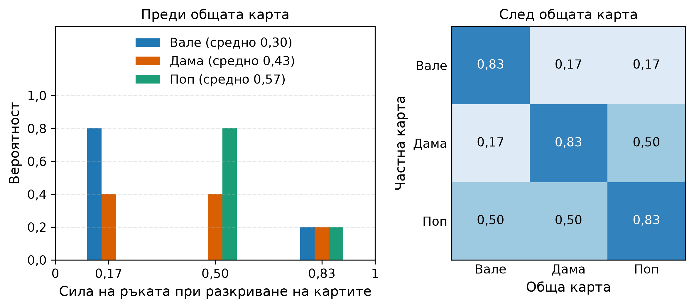
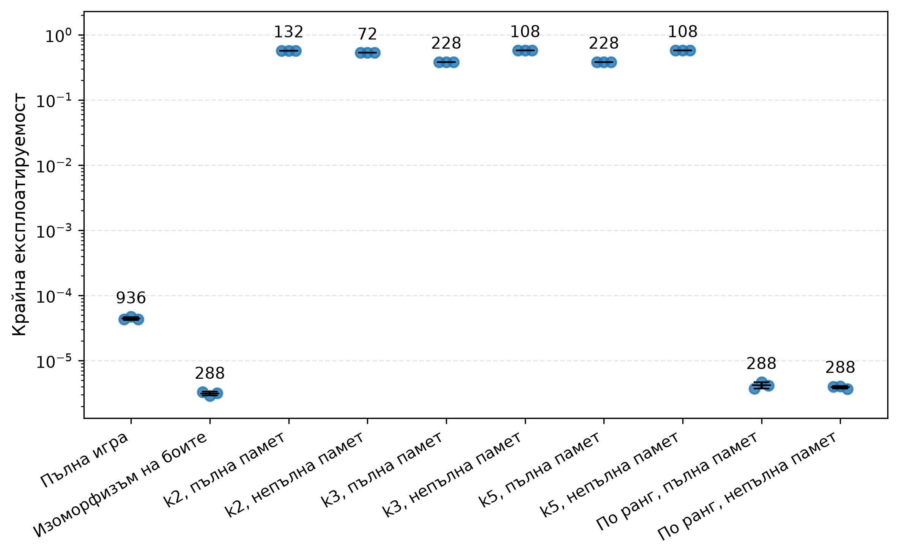
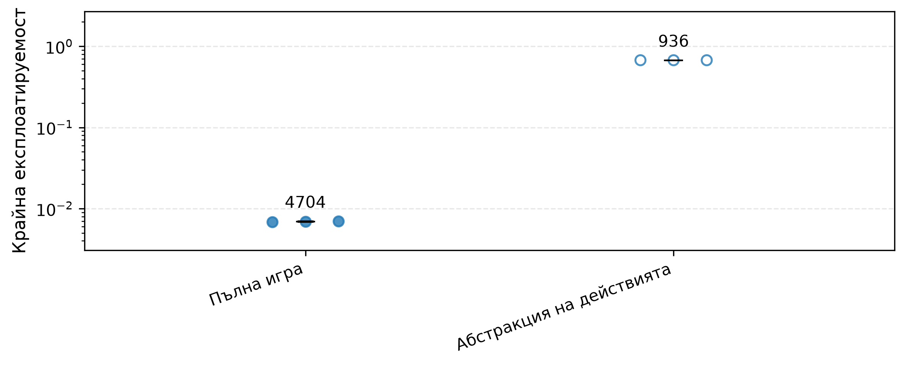
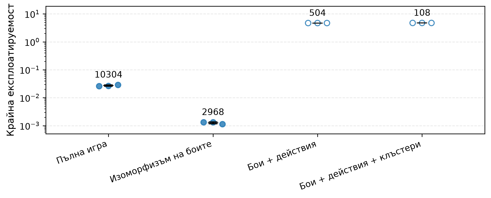

<!--
OFFICIAL PhD TITLE (keep consistent across all documents):
EN: Research on the possibilities for applying Artificial Intelligence in computer games
BG: Изследване на възможностите за приложение на изкуствения интелект в компютърни игри
-->

---
title: "Глава 4 Обобщение – Абстракция на играта и мащабиране на игри с непълна информация"
subtitle: "Изследване върху възможностите за прилагане на изкуствен интелект в компютърните игри"
author: "Alexander Andreev"
date: "May 2026"
lang: bg
vars:
  research_focus: "Adaptive Strategy Learning in Multi-Agent Imperfect-Information Environments"
---

# Глава 4 – Абстракция на играта и мащабиране на игри с непълна информация

---

## Защо е необходима абстракцията

Глави 1–3 изградиха алгоритмите. Всеки от тях беше демонстриран върху игра с достатъчно малък размер, за да може дървото на играта ѝ да бъде изброено точно: Кун (12 информационни множества) и Ледюк (936). Този набор от инструменти е завършен, но той функционира единствено когато цялото дърво на играта се побира в паметта.

Размерът на реалната игра нараства със скритите карти, с разклоняването по размерите на залога и с дълбочината на залагането: лимитният тексаски Холдем за двама играчи достига $3{,}16 \times 10^{17}$ състояния,[^bowling2015] а броят на информационните множества в безлимитния тексаски Холдем за двама играчи е $\sim 10^{161}$ – около $10^{80}$ пъти повече от броя на атомите в наблюдаемата вселена. Нито един от алгоритмите от Глава 3 не може да работи върху това дърво.[^johanson2013size]

Механизмът, който преодолява тази пропаст, е **абстракцията**: умишлено свеждане на части от играта до по-опростен вид, така че същите алгоритми да могат да се прилагат върху по-малък, структурно опростен заместител и да се измери цената на това в качеството на стратегията. Централният въпрос на всеки практически изкуствен интелект за покер след 2007 г. е:

> *До каква степен може да се намали размерът на играта, преди равновесната стратегия на абстрактната игра да престане да бъде добра стратегия в реалната игра?*

Отговорът е крива на Парето: размерът на абстрахираната игра срещу **разликата в експлоатируемостта** – с колко абстрактната стратегия е по-лоша от точното равновесие на Наш в реалната игра.

Рецептата е една и съща за всеки подход: *изгражда се по-малка игра, чиито стратегии могат да бъдат трансформирани в приложими стратегии за реалната игра, изпълняват се алгоритмите от Глава 3 върху тази по-малка игра и след това се оценяват загубите.* Тази рецепта може да се следва по два пътя.

---

## Пътища към абстракцията

В тази глава думата „абстракция“ се използва в два оперативно различни смисъла; в литературата невронното приближение обикновено се представя като алтернатива на абстракцията, а не като неин вид.[^deepcfr] Тази глава реализира **явния** път от край до край; тъй като тук не се извършва работа с неявния път, неговите съответствия за всяка фаза са само изброени в таблицата по-долу.

И двата пътя споделят една и съща **интуиция** – компресиране със запазване на стойността – изразена чрез целевата функция на информационното стеснение (по аналогия с едноименния метод[^tishby1999]), като $\beta$ е обменният курс между паметта и стойността:

$$\mathcal{L} = \underbrace{\text{Сложност}(Z)}_{\text{цена в памет}} - \beta \cdot \underbrace{\text{Стойност}(\pi_Z)}_{\text{стратегическа стойност}}$$

Когато $\beta = 0$, алгоритъмът компресира цялата игра до едно състояние и играе изключително слабо. Когато $\beta \to \infty$, той отказва всякакво сливане и използва пълната игра. Всеки алгоритъм в конвейера за абстракции представлява конкретна настройка на този регулатор:

- **Беззагубно сливане** – граничният случай $\beta \to \infty$: извършва сливане само когато $\text{Стойност}(\pi_Z) = \text{Стойност}(\pi)$ е точно.
- **Ограничена загуба** – средата на кривата с гаранция: избира се $\beta$ така, че да бъде изпълнено условието $|\text{Стойност}(\pi_Z) - \text{Стойност}(\pi)| \le \varepsilon_{\text{abs}}$.
- **Емпирична сходност (HSD + разстояние на Васерщайн)** – измерва самата крива: разстоянието на Васерщайн между абстрактното и пълното разпределение служи като заместител на члена за загуба на стойност.
- **Корекция по време на изпълнение** – ортогонален подход: приема се загубата на стойност, произтичаща от избраното $\beta$, след което тя се компенсира по време на изпълнение чрез решаване на под-игра.

| Аспект | **Явен / табличен** | **Неявен / в стил IB** (дълбоко обучение с подкрепление) |
|---|---|---|
| Къде се намира компресията | Разбиване на информационните множества / краен избран набор от действия | Непрекъснат латентен вектор $z = f_\theta(s)$ |
| Фактор за настройка | $k$ в k-средни, наборът от размери на залога, правилото за изоморфизъм на боите | $\beta$ умножено по $I(S;Z)$ в загубата |
| Гаранция | Формална граница на разликата в експлоатируемостта само за беззагубни и ограничени абстракции; за емпиричните (k-средни + EMD) – никаква | Информационнотеоретична граница върху $I(S;Z)$; **няма** теорема за запазване на равновесието на Наш |
| Съответствие на всяка фаза | Четирите фази на тази глава | Deep Sets, информационно стеснение, научени латентни вграждания; криви скорост–изкривяване и тестова загуба; без отделна фаза на компилация; търсене с ограничена дълбочина с невронни функции на стойността (DeepStack, ReBeL) |
| Къде се появява в тази дисертация | Тази глава (4) | Глава 5 (Deep CFR), Глава 6 (от край до край), Глава 12 (модели на последователности) |

: Явният и неявният път към абстракцията, сравнени по всеки практически показател.

---

## Видове оси на абстракцията

Всяка конкретна техника се отнася към една от двете взаимно ортогонални оси – *кои състояния агентът разглежда като идентични* (информационна абстракция) и *кои действия агентът обмисля* (абстракция на действията); усъвършенстването по време на изпълнение има собствен раздел по-долу.

### Информационна абстракция {.unlisted}

Групират се информационните множества, които агентът ще разглежда като едно и също състояние; критерият за сливане, бюджетът на грешките и решенията по време на компилация по-долу са посветени на това *как* и *кога* да се прави. В обикновения вариант на CFR само абстрахирането на **обхождането**, а не единствено на **картата на възлите**, скъсява времето за изпълнение.

### Абстракция на действията и проблемът с транслацията {.unlisted}

Ограничава се множеството от действия, които решавачът разглежда, изпълнява се CFR върху получената ограничена игра и след това се обработва всичко, което реалният опонент направи извън това ограничение. При непрекъснатите размери на залозите в безлимитния покер това е *задължително* за табличните методи – CFR не може да се изпълнява върху непрекъснато дърво, без първо да бъде сведено до краен заместител (типичен набор от действия в покера: {отказ, плащане, 0,5×пот, 1×пот, 2×пот, ол-ин}).

Тогава проблемът с транслацията е **значителен**: когато опонентът направи залог от 0,7×пот, а абстракцията съдържа само 0,5×пот и 1×пот, агентът трябва да транслира този залог към възел, върху който е обучен. Най-често се използват три транслатора:

1. **Най-близко действие** – закръгляне до най-близкия абстрактен залог; най-голяма загуба на стойност, когато залозите се групират между абстрактните размери.
2. **Вероятностно разделяне (линейно)** – масата се разпределя между двата най-близки абстрактни залога според разстоянието.
3. **Псевдохармонично преобразуване** – вероятностно преобразуване, изведено от равновесието на опростена покерна игра; в сравненията на авторите то е значително по-малко експлоатируемо от по-ранните евристични преобразувания и е водещият статичен транслатор преди появата на вложеното решаване на под-игри (по-долу).[^ganzfried2013]

Грешките при транслацията се натрупват в отделните рундове на залагане – опонент, който открие закръглянето, може систематично да залага точно под или над точките на решетката, за да предизвика отговори с грешен размер. Такава уязвимост е наблюдавана на практика (агентът Tartanian1, 2007 г.)[^ganzfried2013], и това е оперативната причина за съществуването на корекция по време на изпълнение (по-долу).

---

## Разлика в експлоатируемостта

За стратегия, изиграна в игра $G$, експлоатируемостта е стандартният показател от Глава 3. Глава 4 въвежда производна метрика – **разлика в експлоатируемостта**: с колко една абстрактна стратегия е по-лоша от точното равновесие на Наш на реалната игра, *измерено в самата реална игра*.

Нека $G$ е реалната игра, а $\hat G$ – нейната абстракция. Нека $\hat\sigma^*$ е равновесие на Наш на $\hat G$, а $T(\hat\sigma^*)$ – неговата транслация обратно в играема стратегия за $G$ (тъждественото преобразуване при чисто информационна абстракция). Тогава

$$\Delta_{\text{abs}}(\hat G) \;=\; \text{exploit}_G\bigl(T(\hat\sigma^*)\bigr) \;-\; \text{exploit}_G(\sigma^*_G)$$

където $\sigma^*_G$ е точното равновесие на Наш на $G$. По дефиниция $\Delta_{\text{abs}} \ge 0$, като равенство има, когато абстракцията е беззагубна. Всяка Парето диаграма в тази глава съдържа $\Delta_{\text{abs}}$ по една от осите; когато директното изчисление е твърде скъпо, бюджетът на грешките по-долу предоставя граница и заместител вместо него.

---

## Разстояние на Васерщайн: Въведение

**Какво измерва.** За две вероятностни разпределения върху един и същ носител разстоянието на Васерщайн (Earth Mover's Distance, EMD[^rubner2000]) е минималното количество „работа“, необходимо за трансформирането на едното в другото, където *работа = преместена маса × преместено разстояние*. Може да си представим всяко разпределение като купчина пясък върху числова ос – тогава разстоянието на Васерщайн е най-малкото общо усилие за преоформяне на купчина А в купчина Б. За разлика от сравнението на средните стойности, то отчита *геометрията* на разположението на масата: две разпределения, концентрирани в противоположните краища, са далеч едно от друго, независимо къде техните средни стойности съвпадат случайно.

**В контекста на тази глава.** Всяко информационно множество има *разпределение на силата на ръката (HSD)* – хистограма от вероятностите за победа в края на играта, изчислени чрез разиграване на невидяни карти. Две HSD с една и съща средна стойност могат да имат напълно различна форма: тясно разпределение с един връх („стабилна средна ръка“) или бимодално („успех или провал“). Клъстеризацията по очаквана сила на ръката ги обединява, докато разстоянието на Васерщайн не го прави.

**Ефективно при 1-D хистограми.** Когато носителят е едномерен и подреден (вероятността за победа ∈ [0, 1], разделена на интервали), разстоянието на Васерщайн се свежда до **разстоянието на Манхатън** между кумулативните разпределения – едно линейно преминаване през интервалите. Ето защо HSD + разстояние на Васерщайн е достатъчно бързо, за да клъстеризира милиони **информационни множества**.

---

## Критерият за сливане

Кога могат две информационни множества да се **обединят** в едно? Три вложени нива на строгост, подредени от най-строгото към най-хлабавото.

### Ниво 1 – Беззагубен

Сливане на две информационни множества се допуска единствено когато те са *стратегически еквивалентни*: имат еднаква вероятност за достигане, еднаква рекурсивна структура и водят до еднакви последствия по отношение на полезността срещу всяко възможно продължение от страна на опонента.[^gilpin2007] Когато това условие е изпълнено, сливането е безплатно: всяка оптимална стратегия в абстрактната игра може да бъде директно приложена към оригиналната игра с **нула** разход за експлоатируемост.

*Пример:* Червен вале и черен вале в игра, в която боите нямат значение (невъзможни са **флъшове**), могат да се слеят без загуба. Червен вале в игра *с* **флъшове** не може – боята мълчаливо влияе върху вероятността на опонента да събере **флъш** чрез премахване на карти от тестето.

### Ниво 2 – Ограничена загуба

Изискването за „идентични полезности“ се отпуска до „полезностите се различават с най-много $\varepsilon$“. Тогава всяко сливане добавя своето допустимо отклонение към общия бюджет на грешката, който определя граница върху общата експлоатируемост – това е *контролирано* забравяне, а не произволно.

*Пример:* Обединяването на вале и дама в един „клъстер с ниски карти“ принуждава агента да ги играе еднакво, въпреки че оптимално те се различават леко. Системата поема тази грешка в замяна на значително опростяване на играта.

### Ниво 3 – Емпирична сходност

Когато входовете са твърде високодименсионни, за да бъдат изброени (в тексаски Холдем на последния рунд има около $2{,}4 \times 10^9$ канонични комбинации от скрити и общи карти[^johanson2013abs]), границата за сливане се премахва: изчислява се HSD за всяко информационно множество, като мярка за сходство между тях се използва разстоянието на Васерщайн,[^ganzfried2014] и се извършва сливане в рамките на клъстерите. Няма формална гаранция – качеството се проверява *след* решаването, а дори по-детайлната абстракция не гарантира по-ниска експлоатируемост.[^waugh2009]

---

## Бюджетът на грешките

Три инструмента за количествена оценка: аналитичната граница оценява сливане от Ниво 2, заместващата оценка чрез разстоянието на Васерщайн оценява сливане от Ниво 3, а третият измерва завършената абстракция, независимо как е била конструирана.

### Инструмент 1 – Аналитична граница

Допустимите отклонения на отделните сливания се сумират, претеглени с вероятността всяко информационно множество действително да бъде достигнато в игра, и така се получава горна граница на разликата в експлоатируемостта.[^kroer2014] Ключовата идея е претеглянето по вероятността за достигане: небрежното сливане в рядък сценарий от крайната игра почти не оказва влияние върху общия резултат, докато небрежните сливания в гъсти и често посещавани области са катастрофални.

### Инструмент 2 – Заместваща оценка чрез разстоянието на Васерщайн

Разстоянието на Васерщайн между хистограмите на силата на ръката на две информационни множества, измерено без изброяване на листата. То е *заместваща оценка*, а не граница, и не носи формална гаранция.[^johanson2013abs] В експериментите на тази глава то не проследява експлоатируемостта: за абстракциите с k = 3 и k = 5 е нула, а тяхната експлоатируемост остава 0,38–0,57.

### Инструмент 3 – Пряка оценка чрез CFR-BR

Най-силната мярка: за абстракции с пълна памет тя намира стратегията в абстракцията с най-ниска експлоатируемост в пълната игра, като по този начин *изолира* грешката на абстракцията от грешката при решаване. Стратегиите на CFR-BR показват експлоатируемост, толкова ниска, колкото $1/3$ от съответните обикновени CFR стратегии при *същата* абстракция – част от измерената „грешка на абстракцията“ се дължи на избора на равновесието на абстрактната игра за цел, а не на самата абстракция.[^johanson2013abs]

---

## Избор на абстракция на практика

**Редът на вземане на решения.** Първо се използват всички налични беззагубни сливания; след това се приемат сливания с ограничени загуби само когато бюджетът на грешките е приемлив; в противен случай се извършва клъстеризация с HSD + разстояние на Васерщайн и получената абстракция се валидира емпирично.

**Глобалната оптимизация е практически неприложима.** Изборът на разделяне, което минимизира аналитичната граница, е **NP-пълна** задача дори за игра с един играч и дърво с височина две. Затова практическите конвейери работят ниво по ниво; при разумни условия едно ниво се свежда до клъстеризация около центрове в метрично пространство, което разполага с приблизителни алгоритми с полиномиално време с гаранции с постоянен коефициент.[^kroer2014]

**Отчитащите разпределението превъзхождат основаните на очакването.** При еднакъв брой информационни множества и достатъчно голяма абстракция HSD + разстояние на Васерщайн превъзхожда клъстеризацията по очаквана сила на ръката както по експлоатируемост, така и в директни срещи; при много малки абстракции очакването може да е по-добро.[^johanson2013abs] Заедно с резултата за паметта по-долу това е причината конвейерът по време на компилация по подразбиране да използва непълна памет, HSD и разстоянието на Васерщайн.

---

## Решения по време на компилация

Два допълващи се конвейера, по един на ниво строгост на критерия.

### Конвейер 1 – GameShrink (беззагубен)

Изчерпателно сливане, което обхожда *сигналното дърво* отдолу-нагоре и слива всяка двойка поддървета братя, преминала проверката за стратегическа еквивалентност. Сигналното дърво е по-малко от дървото на играта, защото колабира всички пътища на залагане, водещи до едни и същи публични и частни сигнали, в един възел: в Род Айлънд Холдем (Rhode Island Hold'em) то е около 6,6 милиона възела спрямо приблизително 3,1 милиарда възела на дървото на играта. Този конвейер, комбиниран с линейно програмиране, решава Род Айлънд Холдем през 2007 г.[^gilpin2007]

### Конвейер 2 – HSD + разстояние на Васерщайн + k-средни + непълна памет (със загуби)

{width=100% fig-pos="H"}

Когато беззагубното сливане достигне сходимост и играта все още е твърде голяма, се пристъпва към клъстеризация: изчислява се HSD за всяко информационно множество, получените разпределения се групират чрез разстоянието на Васерщайн като метрика на разстояние и всяко информационно множество се съпоставя към идентификатор на клъстер. При *пълна памет* идентификаторът на клъстера включва предишната траектория на клъстерите; при *непълна памет* клъстерът в по-късен рунд може да я забрави, като по този начин освобождава повече клъстери за рунда, в който новата информация има най-голямо значение.

В тексаски Холдем непълната памет надделява при фиксиран бюджет на клъстерите – капацитетът се изразходва за рундовете, които имат значение, вместо за запомняне на историята.[^johanson2013abs] В малкия Ледюк от тази глава предимството не се потвърждава: при сходен размер (108 срещу 132 информационни множества) абстракцията с непълна памет не е по-добра (0,574 срещу 0,571; вж. фигурата за Ледюк с лимит в „Практическо валидиране“).

**Резултатът.** Замразеният резултат от двата конвейера – стратегията, получена при решаването на абстрактната игра, и началната точка за всичко, което се случва по време на изпълнение – в останалата част от главата се обозначава като **план**.

---

## Корекция по време на изпълнение

Когато играта премине в под-игра, която абстрактният план покрива твърде грубо, под-играта се преизчислява с по-висока точност *в реално време*. Две корекции са от значение – заедно те бяха носещите елементи на Libratus, първия изкуствен интелект, който победи най-добрите професионалисти в безлимитния тексаски Холдем за двама играчи.[^libratus]

### Защо решаването на под-игра не може да се извършва изолирано (хвърляне на монета)

Прост контрапример, наречен *хвърляне на монета*: монета пада с ези или тура с еднаква вероятност, като само $P_1$ вижда изхода. Играчът $P_1$ избира между „Продай“ (Sell; с печалба, зависеща от резултата на монетата) и „Играй“ (Play; при която играчът $P_2$ се опитва да познае коя страна е паднала). Оптималната $P_2$ стратегия в под-играта „Играй“ **не е** функция единствено на самата тази под-игра – тя зависи от стойността, която $P_1$ би получил, ако вместо това беше избрал „Продай“. Ако печалбата от „Продай“ се промени, оптималната стратегия за „Играй“ също се променя, въпреки че самата под-игра „Играй“ остава непроменена.[^brown2017]

Решението: решаване на *разширена под-игра*, включваща оригиналната под-игра и допълнителни възли „алтернативна печалба“, кодиращи какво всеки играч би могъл да постигне, ако *не беше влязъл* в тази под-игра.[^burch2014]

### Корекция 1 – Безопасно решаване на под-игри

Разширената под-игра се основава на план-стойности: всяко информационно множество в началото на под-играта получава алтернативна печалба, равна на обещаното от плана за този играч в съответния момент от играта. Решаването ѝ води до усъвършенствана стратегия, чиято експлоатируемост е доказано не по-висока от тази на плана.[^brown2017] Замяната на консервативните план-печалби с *оценки* на равновесната стойност премахва строгата гаранция, но обикновено води до по-ниска експлоатируемост в реална игра.

### Корекция 2 – Вложено решаване на под-игри (заместител на транслацията на действия)

Когато *противникът* извърши действие $a$ извън зададената абстракция, $a$ не се закръгля до познато действие чрез транслация – а *преизчислява се нова под-игра, която включва $a$*, по схемата на безопасното решаване на под-игри, и новата подстратегия се добавя към плана; планът нараства единствено там, където действително протича играта. В опростен безлимитен вариант (Холдем, игран само до флопа) това има около 10 пъти по-ниска експлоатируемост от псевдохармоничната транслация (119–150 срещу 1465 хилядни от големия блайнд на раздаване, mbb/g).[^brown2017] Статичните транслатори на действия остават подходящият избор само когато закъснението не позволява решаване с CFR в реално време.

---

## Архитектура: план и корекции в реално време

Целият конвейер се свежда до един архитектурен модел, използван от водещите системи за безлимитен покер след 2017 г. – Libratus[^libratus] и Modicum при двама играчи и Pluribus[^pluribus] при шестима (DeepStack[^deepstack] е изключение: той не изчислява предварително стратегия за цялата игра): по време на компилация играта се абстрахира и решава, **планът** се замразява, а по време на изпълнение се преизчислява навсякъде, където планът е груб или противникът излезе извън абстракцията.

---

## Практическо валидиране

Фазата на имплементация изгради малък конвейер от типа „Ледюк“ – изоморфизъм на боите, групиране на карти, абстракция на действията върху Mini-NL Ледюк, по-голям разширен Ледюк (четири ранга, две бои) и тяхната комбинация – оценен чрез разлики в експлоатируемостта, заместващи оценки чрез EMD, кръстосана проверка в OpenSpiel и Парето граница.

Основните емпирични изводи съответстват на теорията: **беззагубната абстракция** е почти безплатна стратегически и много полезна изчислително, докато информационната абстракция със загуби и абстракцията на действията въвеждат трайна долна граница на експлоатируемостта. При бюджети от 180 секунди за CFR+, **изоморфизмът на боите** намали броя на информационните множества в Ледюк с лимит от 936 до 288 и достигна по-ниска експлоатируемост от пълната игра, тъй като завърши значително повече **итерации**. В разширения Ледюк същата идея намали броя на информационните множества от 10 304 до 2 968 и подобри крайната експлоатируемост от около $2{,}7 \times 10^{-2}$ до около $1{,}3 \times 10^{-3}$.

Експериментите с клъстери със загуби показват другата страна на компромиса. По-малките игри с клъстери се обучават по-бързо, но грешката не изчезва при повече **итерации** на CFR+, тъй като стратегията решава грешната игра. В Ледюк с лимит грубите абстракции с клъстери останаха на експлоатируемост около $0{,}38$–$0{,}57$, въпреки че завършиха повече **итерации** от пълния CFR+. Това е практическото значение на разликата в експлоатируемостта: грешката на абстракцията не е грешка на оптимизатора.

Абстракцията на действията беше най-рисковата част от главата. В Mini-NL Ледюк ограничаването на множеството действия намали броя информационни множества от 4704 до 936 и позволи извършването на значително повече **итерации** на CFR+ в рамките на същия времеви бюджет, но експлоатируемостта остана висока. В разширения Ледюк добавянето на абстракция на действията върху изоморфизма на боите доведе до компактно дърво, но внедрената стратегия беше силно експлоатируема. Тези стойности обаче измерват текущото правило за внедряване – всеки абстрактен малък залог се изиграва като голям, а големите залози на противника се четат като малки – а не качеството на трите транслатора, които в тази реализация не се задействат и дават еднакви резултати. Те показват колко може да струва наивното съпоставяне на абстрактното и реалното множество действия; отговорът на литературата за действията извън дървото е вложеното решаване на под-игри.[^brown2017]

Изгледът на Парето е правилната крайна проверка. Беззагубният изоморфизъм на боите се намира в атрактивната част от границата. Грубите клъстери и абстракцията на действията могат да намалят играта още повече, но това води до преминаване към различен режим, при който по-малкият размер се постига за сметка на качеството на стратегията.

---

## Връзки и препратки напред

Глава 4 променя самата входна игра: преди решаването тя определя кои състояния и действия могат да бъдат обединени, без да се унищожи стратегическият сигнал. Мостът към Глава 5 е неявният път: Deep CFR заменя ръчно изградените и изградени чрез клъстеризация дялове с научени функционални апроксиматори. Мостът към Глава 6 е архитектурният план: Глава 4 предоставя речника – план, транслация на действия, разлика в експлоатируемостта, Парето граница и безопасно/вложено усъвършенстване – а Глава 6 превръща тези елементи в пълни системи за игра на игри.

За дисертацията абстракцията е от значение, защото адаптацията към съперника е ефективна единствено в границите на резолюцията, която представянето на играта запазва. Ако абстракцията обедини две стратегически различни състояния, обърнати към противника, нито един последващ модел на противника не би могъл да възстанови това разграничение. Обратно, представяне, което е прекалено детайлно, може да бъде твърде скъпо за решаване или оценяване. Парето границата от Глава 4 следователно се включва в методологията за оценяване: качеството на стратегията трябва да бъде докладвано заедно с размера и детайлността на представянето на играта, което я е породило.

[^bowling2015]: Bowling, M., Burch, N., Johanson, M. & Tammelin, O. (2015). "Heads-up limit hold'em poker is solved." *Science*, 347(6218), 145–149. DOI 10.1126/science.1259433. Използва CFR+ за решаването на лимитния тексаски Холдем за двама играчи – първата нетривиална игра с непълна информация, играна състезателно от хора, която по същество е решена.

[^brown2017]: Brown, N. & Sandholm, T. (2017). "Safe and Nested Subgame Solving for Imperfect-Information Games." *NeurIPS*.

[^burch2014]: Burch, N., Johanson, M. & Bowling, M. (2014). "Solving Imperfect Information Games Using Decomposition." *AAAI* – пререшаване и разширената под-игра.

[^deepcfr]: Brown, N., Lerer, A., Gross, S. & Sandholm, T. (2019). "Deep Counterfactual Regret Minimization." *ICML*.

[^deepstack]: Moravčík, M. et al. (2017). "DeepStack: Expert-level artificial intelligence in heads-up no-limit poker." *Science*, 356(6337), 508-513.

[^ganzfried2013]: Ganzfried, S. & Sandholm, T. (2013). "Action Translation in Extensive-Form Games with Large Action Spaces: Axioms, Paradoxes, and the Pseudo-Harmonic Mapping." *IJCAI*, 120–127.

[^ganzfried2014]: Ganzfried, S. & Sandholm, T. (2014). "Potential-Aware Imperfect-Recall Abstraction with Earth Mover's Distance in Imperfect-Information Games." *AAAI*, 28(1).

[^gilpin2007]: Gilpin, A. & Sandholm, T. (2007). "Lossless Abstraction of Imperfect Information Games." *Journal of the ACM*, 54(5), art. 25 – GameShrink и резултатът за Род Айлънд Холдем.

[^johanson2013abs]: Johanson, M., Burch, N., Valenzano, R. & Bowling, M. (2013). "Evaluating State-Space Abstractions in Extensive-Form Games." *AAMAS*, 271–278.

[^johanson2013size]: Johanson, M. (2013). "Measuring the Size of Large No-Limit Poker Games." Технически доклад, University of Alberta; arXiv:1302.7008.

[^kroer2014]: Kroer, C. & Sandholm, T. (2014). "Extensive-Form Game Abstraction with Bounds." *ACM EC*, 621–638; и Kroer, C. & Sandholm, T. (2016). "Imperfect-Recall Abstractions with Bounds in Games." *ACM EC*, 459–476.

[^libratus]: Brown, N. & Sandholm, T. (2018). "Superhuman AI for heads-up no-limit poker: Libratus beats top professionals." *Science*, 359(6374), 418-424.

[^pluribus]: Brown, N. & Sandholm, T. (2019). "Superhuman AI for multiplayer poker." *Science*, 365(6456), 885-890.

[^rubner2000]: Rubner, Y., Tomasi, C. & Guibas, L. J. (2000). "The Earth Mover's Distance as a Metric for Image Retrieval." *International Journal of Computer Vision*, 40(2), 99–121.

[^tishby1999]: Tishby, N., Pereira, F. C. & Bialek, W. (1999). "The Information Bottleneck Method." arXiv:physics/0004057.

[^waugh2009]: Waugh, K., Schnizlein, D., Bowling, M. & Szafron, D. (2009). "Abstraction Pathologies in Extensive Games." *AAMAS*, 781–788.
