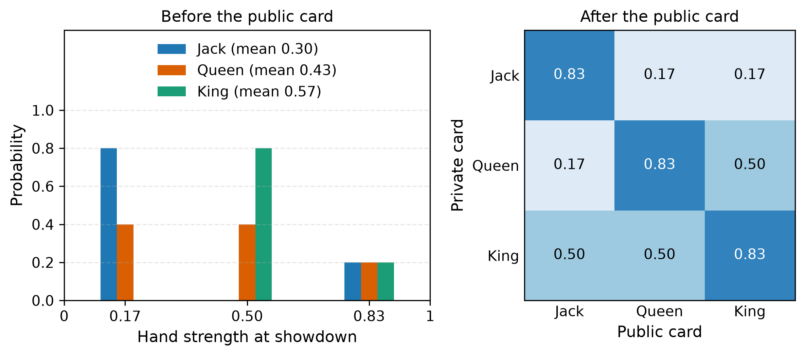
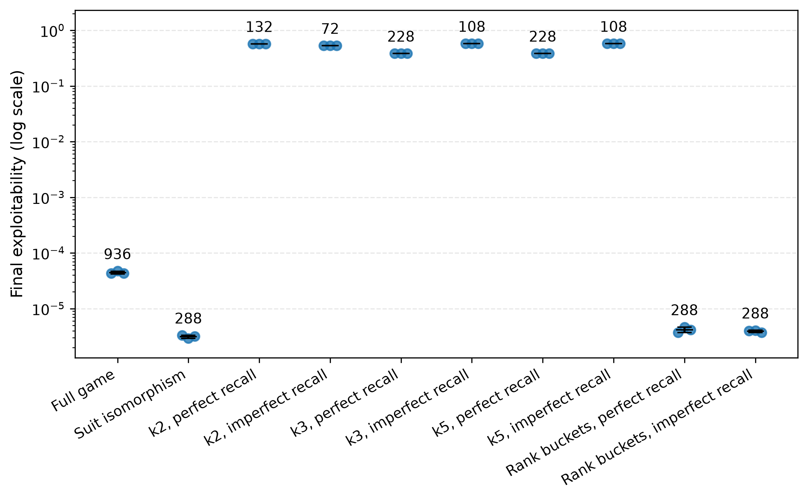
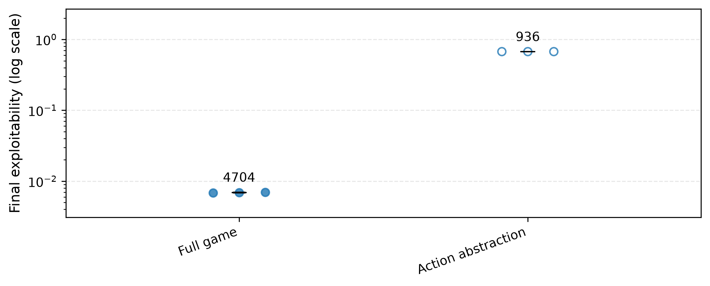
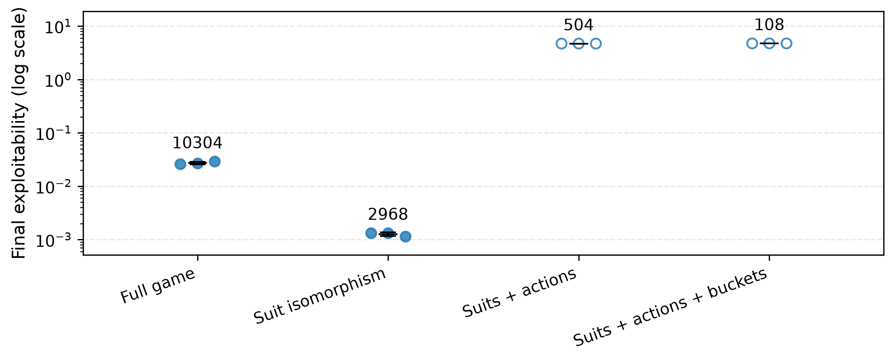
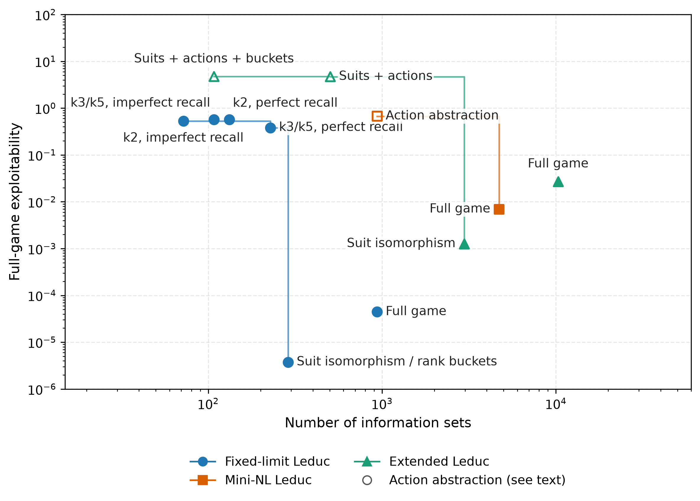

<!--
OFFICIAL PhD TITLE (keep consistent across all documents):
EN: Research on the possibilities for applying Artificial Intelligence in computer games
BG: Изследване на възможностите за приложение на изкуствения интелект в компютърни игри
-->
---
title: "Chapter 4 Summary — Game Abstraction & Scaling Imperfect-Information Games"
subtitle: "Research on the possibilities for applying Artificial Intelligence in computer games"
author: "Alexander Andreev"
date: "May 2026"
lang: en
vars:
  research_focus: "Adaptive Strategy Learning in Multi-Agent Imperfect-Information Environments"
---

# Chapter 4 — Game Abstraction & Scaling Imperfect-Information Games

---

## Why Abstraction Is Needed

Chapters 1–3 built the algorithms. Each was demonstrated on a game small enough to enumerate exactly: Kuhn (12 information sets), Leduc (936). That toolkit is complete — but it only works when the entire game tree fits in memory.

The size of a real game grows with the hidden cards, with the branching of bet sizes and with the depth of the betting: heads-up limit hold'em reaches $3.16 \times 10^{17}$ states,[^bowling2015] and the combined number of information sets in heads-up no-limit Hold'em is $\sim 10^{161}$ — more than there are atoms in the observable universe by a factor of $\sim 10^{80}$. None of Chapter 3's algorithms can run on that tree.[^johanson2013size]

The mechanism that bridges the gap is **abstraction**: deliberately collapse parts of the game so the same algorithms can run on a smaller, structurally simpler proxy, and measure what that costs in strategy quality. The central question of every practical poker AI since 2007 is:

> *How much can the game be shrunk before the abstract Nash strategy stops being a good strategy in the real game?*

The answer is a Pareto curve: the size of the abstracted game against the **exploitability gap** — how much worse the abstract strategy is than the real game's exact Nash.

The recipe is the same across every approach: *build a smaller game whose strategies translate back into playable strategies for the real game, run the Chapter 3 algorithms on that smaller game, then bound the damage.* That recipe has two routes.

---

## Routes to Abstraction

In this chapter the word "abstraction" covers two operationally different things; the literature usually presents neural approximation as an alternative to abstraction rather than a kind of it.[^deepcfr] This chapter implements the **explicit** route end-to-end; since no implicit work is performed here, the implicit counterpart of each phase is only listed in the table below.

Both routes share the same **intuition** — compress while preserving value — captured by the Information Bottleneck Lagrangian (by analogy with the information bottleneck method[^tishby1999]), with $\beta$ as the exchange rate between memory and value:

$$\mathcal{L} = \underbrace{\text{Complexity}(Z)}_{\text{memory cost}} - \beta \cdot \underbrace{\text{Value}(\pi_Z)}_{\text{strategic worth}}$$

When $\beta = 0$, the algorithm compresses the entire game into one state and plays terribly. When $\beta \to \infty$, it refuses to merge anything and uses the full game. Every algorithm in the abstraction pipeline is one specific instantiation of that knob:

- **Lossless merging** — corner case $\beta \to \infty$: only merges when $\text{Value}(\pi_Z) = \text{Value}(\pi)$ exactly.
- **Bounded lossy** — middle of the curve with a guarantee: pick $\beta$ such that $|\text{Value}(\pi_Z) - \text{Value}(\pi)| \le \varepsilon_{\text{abs}}$.
- **Empirical similarity (HSD + EMD)** — measures the curve itself: EMD between abstract and full distributions is a proxy for the value-loss term.
- **Runtime patching** — orthogonal: accept the value loss from any chosen $\beta$, then patch it at runtime via subgame solving.

| Aspect | **Explicit / tabular** | **Implicit / IB-style** (Deep RL) |
|---|---|---|
| Where compression lives | A partition over info sets / a finite chosen set of actions | A continuous latent vector $z = f_\theta(s)$ |
| The "knob" | $k$ in k-means buckets, the bet-set, the suit-isomorphism rule | $\beta$ multiplying $I(S;Z)$ in the loss |
| Guarantee | A formal bound on the exploitability gap only for lossless and bounded abstractions; none for empirical (k-means + EMD) ones | Information-theoretic bound on $I(S;Z)$; **no** Nash-preservation theorem |
| Counterpart of each phase | The four phases of this chapter | Deep Sets, information bottlenecks, learned embeddings; rate-distortion curves and test loss; no separate build phase; depth-limited search with neural value functions (DeepStack, ReBeL) |
| Where it appears in this thesis | This chapter (4) | Chapter 5 (Deep CFR), chapter 6 (end-to-end), chapter 12 (sequence models) |

: The explicit and implicit routes to abstraction, compared on every practical axis.

---

## Axes of Abstraction

Every concrete technique falls onto one of two orthogonal axes — *what states the agent treats as the same* (information abstraction) and *what moves the agent considers* (action abstraction); runtime refinement has its own section below.

### Information Abstraction {.unlisted}

Group together info sets that the agent will treat as the same state; the merging criterion, the error budget and the build-time pipeline below are all about *how* and *when* to do it. In vanilla CFR only abstracting the **traversal**, not just the **node map**, produces a wall-clock speedup.

### Action Abstraction and the Translation Problem {.unlisted}

Restrict the set of actions the solver considers, run CFR on the restricted game, then handle whatever the real opponent does that lies outside that restriction. For continuous bet sizes in no-limit poker this is *mandatory* for tabular methods — CFR cannot run on a continuous tree without first collapsing it to a finite proxy (typical poker grid: `{fold, call, 0.5×pot, 1×pot, 2×pot, all-in}`).

The translation problem is then **acute**: when the opponent plays a 0.7×pot bet but the abstraction only contains 0.5×pot and 1×pot, the agent must convert that bet to a node it has trained on. Three translators in common use:

1. **Nearest-action** — round to the closest abstract bet; worst when bets cluster between abstract sizes.
2. **Probability-split (linear)** — split the mass between the two nearest abstract bets by distance.
3. **Pseudo-harmonic mapping** — a randomized mapping derived from the equilibrium of a simplified poker game; in its authors' comparisons markedly less exploitable than earlier heuristic mappings, and the leading static translator before nested subgame solving (below).[^ganzfried2013]

Translation errors compound across betting rounds — an opponent who detects rounding can systematically bet just below or above grid points to coerce wrong-sized responses. Such exploitation has been observed in practice (the agent Tartanian1, 2007),[^ganzfried2013] and it is the operational reason runtime patching (below) exists.

---

## The Exploitability Gap

For a strategy played in game $G$, exploitability is the standard metric from Chapter 3. Chapter 4 introduces a derived metric, the **exploitability gap**: how much worse an abstract strategy is than the real game's exact Nash, *measured in the real game*.

Let $G$ be the real game and $\hat G$ its abstraction. Let $\hat\sigma^*$ be the Nash of $\hat G$, and let $T(\hat\sigma^*)$ be its translation back into a playable strategy for $G$ (identity for a pure information abstraction). Then

$$\Delta_{\text{abs}}(\hat G) \;=\; \text{exploit}_G\bigl(T(\hat\sigma^*)\bigr) \;-\; \text{exploit}_G(\sigma^*_G)$$

with $\sigma^*_G$ the exact Nash of $G$. By definition $\Delta_{\text{abs}} \ge 0$, with equality if the abstraction is lossless. Every Pareto plot in this chapter has $\Delta_{\text{abs}}$ on one axis; where computing it outright is too expensive, the error budget below supplies a bound and a proxy in its place.

---

## Earth Mover's Distance: A Primer

**What it measures.** Given two probability distributions over the same support, EMD — also called the **Wasserstein-1 distance**[^rubner2000] — is the minimum amount of "work" needed to transform one into the other, where *work = mass moved × distance moved*. Imagine each distribution as piles of sand on a number line — EMD is the smallest total effort to reshape pile A into pile B. Unlike a comparison of means, it respects the *geometry* of where mass lives: two distributions concentrated at opposite ends are far apart, regardless of where their means happen to coincide.

**In this chapter's context.** Each information set has a *Hand Strength Distribution (HSD)* — the histogram of end-of-game win probabilities computed by rolling out unseen cards. Two HSDs with the same mean can have completely different shapes: a peaked "stable medium hand" vs a bimodal "boom-or-bust" hand. Expected-hand-strength clustering merges these together; EMD does not.

**Cheap on 1-D histograms.** When the support is one-dimensional and ordered (binned win probability ∈ [0, 1]), EMD reduces to the L1 distance between cumulative distributions — a single linear sweep over the bins. This is why HSD + EMD is fast enough to cluster millions of info sets.

---

## The Merging Criterion

When can two information sets be collapsed into one? Three nested levels of strictness, strictest at the top.

### Level 1 — Lossless

Merge two info sets only when they are *strategically identical*: same probability of being reached, same recursive structure, and same utility consequences against every possible opponent continuation.[^gilpin2007] When this holds, the merge is free: any optimal strategy in the abstract game lifts to an optimal strategy in the original game with **zero** exploitability cost.

*Example:* A red Jack and a black Jack in a game where suits don't matter (no flushes possible) are losslessly mergeable. A red Jack in a game *with* flushes is not — the suit silently affects the opponent's flush odds through card removal.

### Level 2 — Bounded lossy

Relax "identical utilities" to "utilities differ by at most $\varepsilon$". Each merge then contributes a slack budget that propagates into a bound on overall exploitability — *controlled* forgetting, not arbitrary.

*Example:* Putting J and Q into a single "low card" bucket forces the agent to play them identically, even though optimally they differ slightly. The system absorbs that mistake in exchange for a much smaller game.

### Level 3 — Empirical similarity

When the inputs are too high-dimensional to enumerate (Texas hold'em has about $2.4 \times 10^9$ canonical private/public card combinations on the last round[^johanson2013abs]), drop the per-merge bound: compute an HSD per info set, use EMD between them as the distance,[^ganzfried2014] and merge within clusters. There is no formal guarantee — quality is checked *after* solving, and even refining an abstraction does not guarantee lower exploitability.[^waugh2009]

---

## The Error Budget

Three quantification tools: the analytical bound prices a Level 2 merge, the EMD proxy scores a Level 3 one, and the third measures the finished abstraction whichever way it was built.

### Tool 1 — Analytical bound

Sum the per-merge slack constants, weighted by how often each info set is actually reached during play, to get an upper bound on the exploitability gap.[^kroer2014] The reach-weighting is the key idea: a sloppy merge in a rare endgame scenario costs almost nothing overall, while sloppy merges in dense, frequently-visited regions are catastrophic.

### Tool 2 — EMD proxy

EMD between the hand-strength histograms of two info sets, measured without enumerating leaves. It is a *proxy*, not a bound, and carries no formal guarantee.[^johanson2013abs] In this chapter's runs it does not track exploitability: it is zero for the k = 3 and k = 5 abstractions, whose exploitability stays at 0.38–0.57.

### Tool 3 — CFR-BR direct evaluator

The strongest measurement: for perfect-recall abstractions it finds the strategy within the abstraction that is least exploitable in the full game, *isolating* abstraction error from solving error. CFR-BR strategies show exploitability as low as $1/3$ of the plain-CFR strategies on the *same* abstraction — part of the measured "abstraction error" is the choice of the abstract game's equilibrium as the target, not the abstraction itself.[^johanson2013abs]

---

## Choosing an Abstraction in Practice

**The decision order.** First take every lossless merge available; then accept bounded lossy merges only when the error budget is tolerable; otherwise cluster with HSD + EMD and verify the resulting abstraction empirically.

**Global optimisation is off the table.** Picking the partition that minimises the analytical bound is **NP-complete**, even for a tiny single-player game two levels deep. Practical pipelines therefore work level by level; under reasonable conditions a single level reduces to k-centre clustering, which has polynomial-time approximation algorithms with constant-factor guarantees.[^kroer2014]

**Distribution-aware beats expectation-based.** On equal information-set budgets, once the abstraction is large enough, HSD + EMD beats expected-strength clustering on both exploitability and head-to-head play; in very small abstractions the expectation-based one can be stronger.[^johanson2013abs] Together with the recall result below, this is why the build-time pipeline defaults to imperfect recall + HSD + EMD.

---

## Build-Time Decisions

Two complementary pipelines, one per criterion-strictness level.

### Pipeline 1 — GameShrink (lossless)

An exhaustive merger that walks the *signal tree* bottom-up, merging every pair of sibling subtrees that passes the strategic-equivalence test. The signal tree is smaller than the game tree because it collapses all betting paths leading to the same public + private signals into one node: on Rhode Island Hold'em it is ~6.6M nodes vs ~3.1B game-tree nodes. This pipeline + linear programming solved Rhode Island Hold'em in 2007.[^gilpin2007]

### Pipeline 2 — HSD + EMD + k-means + imperfect recall (lossy)

{width=100% fig-pos="H"}

When the lossless merger has run to convergence and the game is still too large, switch to clustering: compute an HSD for each information set, cluster those distributions with EMD as the distance metric, and map each information set to a bucket id. Under *perfect recall* the bucket identity includes the past bucket trail; under *imperfect recall* the later-round bucket can forget it, freeing more buckets for the round where new information matters most.

In Texas hold'em, imperfect recall wins at a fixed bucket budget — capacity is spent on rounds that matter rather than on remembering history.[^johanson2013abs] The Leduc runs of this chapter do not reproduce it: at a similar size (108 vs 132 information sets) imperfect recall is no better (0.574 vs 0.571; see the fixed-limit Leduc figure under Practical Validation).

**The output.** The frozen result of both pipelines — the strategy obtained by solving the abstract game, and the starting point for everything that happens at runtime — is referred to throughout the rest of this chapter as the **blueprint**.

---

## Runtime Patching

When play descends into a subgame and the abstract blueprint is too coarse, re-solve the subgame at higher fidelity *in real time*. Two patches matter — together they were the load-bearing components of Libratus, the first AI to defeat top humans in heads-up no-limit Texas hold'em.[^libratus]

### Why subgame solving cannot be done in isolation (Coin Toss)

A simple counterexample called *Coin Toss*: a coin lands Heads or Tails with equal probability, only $P_1$ sees the outcome. $P_1$ chooses *Sell* (with payoff that depends on the coin) or *Play* (where $P_2$ guesses the side). The optimal $P_2$ strategy in the *Play* subgame is **not** a function of the *Play* subgame alone — it depends on the value $P_1$ would have gotten by choosing *Sell* instead. Change *Sell*'s payoff and the optimal *Play* strategy flips, even though the *Play* subgame itself is unchanged.[^brown2017]

The fix: solve an *augmented subgame* that includes the original subgame plus extra "alternative-payoff" nodes encoding what each player could have achieved by *not entering* this subgame.[^burch2014]

### Patch 1 — Safe subgame solving

The augmented subgame is anchored to blueprint values: each top-of-subgame information set gets an alternative payoff equal to what the blueprint promised that player at this point. Solving it yields a refined strategy whose exploitability is provably no higher than the blueprint's.[^brown2017] Replacing the conservative blueprint payoffs with *estimates* of equilibrium value drops the strict guarantee but typically lowers real-play exploitability.

### Patch 2 — Nested subgame solving (the action-translation killer)

When the *opponent* plays an action $a$ outside the abstraction, do not round $a$ to a known action via a translator — *re-solve a fresh subgame that contains $a$*, with the safe-subgame scaffold, and append the new sub-strategy to the blueprint; the blueprint grows only where play actually goes. In a no-limit flop hold'em test game, this was about 10× less exploitable than pseudo-harmonic translation (119–150 vs 1,465 mbb/hand).[^brown2017] Static translators remain the right choice only when latency cannot afford a live CFR solve.

---

## Architecture: Blueprint + Live Patches

The full pipeline adds up to a single architectural pattern, used by the leading no-limit poker AIs since 2017 — Libratus[^libratus] and Modicum heads-up, Pluribus[^pluribus] six-handed (DeepStack[^deepstack] is the exception: it computes no whole-game strategy in advance): abstract and solve the game at build time, freeze the **blueprint**, and re-solve at runtime wherever the blueprint is coarse or the opponent leaves the abstraction.

---

## Practical Validation

The implementation phase built a small Leduc-family pipeline — suit isomorphism, card bucketing, action abstraction on Mini-NL Leduc, a larger Extended Leduc (four ranks, two suits) and their combination — evaluated by exploitability gaps, EMD proxies, OpenSpiel cross-validation and a Pareto frontier.

The main empirical lesson matches the theory: lossless abstraction is almost free strategically and very useful computationally, while lossy information and action abstraction introduce persistent exploitability floors. Under 180-second CFR+ budgets, suit isomorphism reduced fixed-limit Leduc from 936 to 288 information sets and reached lower exploitability than the full game because it completed many more iterations. On Extended Leduc, the same idea reduced the game from 10,304 to 2,968 information sets and improved final exploitability from about $2.7 \times 10^{-2}$ to about $1.3 \times 10^{-3}$.

The lossy bucket runs show the other side of the tradeoff. Smaller bucketed games train faster, but the error does not disappear with more CFR+ iterations because the strategy is solving the wrong game. In fixed-limit Leduc, coarse bucket abstractions remained around $0.38$-$0.57$ exploitability, even though they completed more iterations than full CFR+. This is the practical meaning of the exploitability gap: abstraction error is not optimizer error.

Action abstraction was the riskiest part of the chapter. In Mini-NL Leduc, restricting the action set reduced the information-set count from 4,704 to 936 and produced many more CFR+ iterations under the same time budget, but exploitability stayed high. In Extended Leduc, adding action abstraction on top of suit isomorphism produced a compact tree, but the deployed strategy was highly exploitable. These numbers measure the current deployment rule — every abstract small bet is played as the large bet, and opponent large bets are read as small — rather than the three translators, which never engage in this harness and return identical values. They show how much a naive mapping between the abstract and the real action set can cost; the literature's answer to off-tree actions is nested subgame solving.[^brown2017]

The Pareto view is the right final diagnostic. Lossless suit isomorphism lands on the attractive part of the frontier. Coarse buckets and action abstraction can reduce the game further, but they move onto a different regime where smaller size is paid for with strategy quality.

---

## Connections and Forward Pointers

Chapter 4 changes the input game itself, asking which states and actions can be merged without destroying the strategic signal. The bridge to Chapter 5 is the implicit route: Deep CFR replaces the hand-built and clustering-built partitions with learned function approximators. The bridge to Chapter 6 is the blueprint architecture: Chapter 4 supplies the vocabulary — blueprint, action translation, exploitability gap, Pareto frontier, and safe/nested refinement — and Chapter 6 turns those pieces into complete game-playing systems.

For the thesis, abstraction matters because opponent adaptation only works at the resolution the representation preserves. If the abstraction merges two strategically distinct opponent-facing states, no downstream opponent model can recover that distinction. Conversely, a representation that is too fine may be too expensive to solve or evaluate. The Chapter 4 Pareto frontier therefore becomes part of the evaluation methodology: strategy quality must be reported together with the size and granularity of the game representation that produced it.

[^bowling2015]: Bowling, M., Burch, N., Johanson, M. & Tammelin, O. (2015). "Heads-up limit hold'em poker is solved." *Science*, 347(6218), 145–149. DOI 10.1126/science.1259433. Used CFR+ to solve heads-up limit Texas Hold'em — the first non-trivial imperfect-information game played competitively by humans to be essentially solved.

[^brown2017]: Brown, N. & Sandholm, T. (2017). "Safe and Nested Subgame Solving for Imperfect-Information Games." *NeurIPS*.

[^burch2014]: Burch, N., Johanson, M. & Bowling, M. (2014). "Solving Imperfect Information Games Using Decomposition." *AAAI* — re-solving and the augmented subgame.

[^deepcfr]: Brown, N., Lerer, A., Gross, S. & Sandholm, T. (2019). "Deep Counterfactual Regret Minimization." *ICML*.

[^deepstack]: Moravčík, M. et al. (2017). "DeepStack: Expert-level artificial intelligence in heads-up no-limit poker." *Science*, 356(6337), 508–513.

[^ganzfried2013]: Ganzfried, S. & Sandholm, T. (2013). "Action Translation in Extensive-Form Games with Large Action Spaces: Axioms, Paradoxes, and the Pseudo-Harmonic Mapping." *IJCAI*, 120–127.

[^ganzfried2014]: Ganzfried, S. & Sandholm, T. (2014). "Potential-Aware Imperfect-Recall Abstraction with Earth Mover's Distance in Imperfect-Information Games." *AAAI*, 28(1).

[^gilpin2007]: Gilpin, A. & Sandholm, T. (2007). "Lossless Abstraction of Imperfect Information Games." *Journal of the ACM*, 54(5), art. 25 — GameShrink, and the Rhode Island Hold'em result.

[^johanson2013abs]: Johanson, M., Burch, N., Valenzano, R. & Bowling, M. (2013). "Evaluating State-Space Abstractions in Extensive-Form Games." *AAMAS*, 271–278.

[^johanson2013size]: Johanson, M. (2013). "Measuring the Size of Large No-Limit Poker Games." Technical report, University of Alberta; arXiv:1302.7008.

[^kroer2014]: Kroer, C. & Sandholm, T. (2014). "Extensive-Form Game Abstraction with Bounds." *ACM EC*, 621–638; and Kroer, C. & Sandholm, T. (2016). "Imperfect-Recall Abstractions with Bounds in Games." *ACM EC*, 459–476.

[^libratus]: Brown, N. & Sandholm, T. (2018). "Superhuman AI for heads-up no-limit poker: Libratus beats top professionals." *Science*, 359(6374), 418–424.

[^pluribus]: Brown, N. & Sandholm, T. (2019). "Superhuman AI for multiplayer poker." *Science*, 365(6456), 885–890.

[^rubner2000]: Rubner, Y., Tomasi, C. & Guibas, L. J. (2000). "The Earth Mover's Distance as a Metric for Image Retrieval." *International Journal of Computer Vision*, 40(2), 99–121.

[^tishby1999]: Tishby, N., Pereira, F. C. & Bialek, W. (1999). "The Information Bottleneck Method." arXiv:physics/0004057.

[^waugh2009]: Waugh, K., Schnizlein, D., Bowling, M. & Szafron, D. (2009). "Abstraction Pathologies in Extensive Games." *AAMAS*, 781–788.
