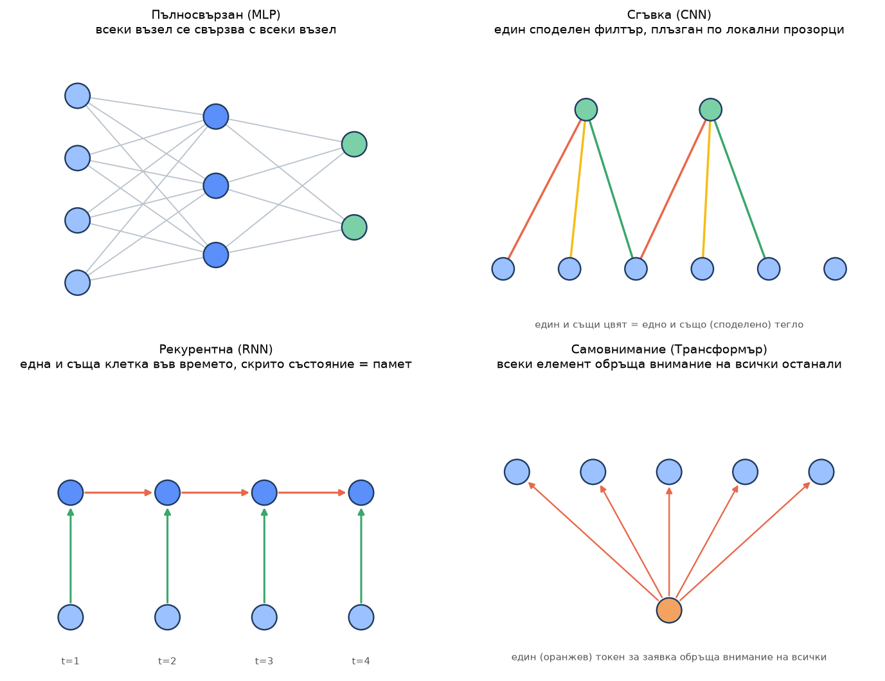
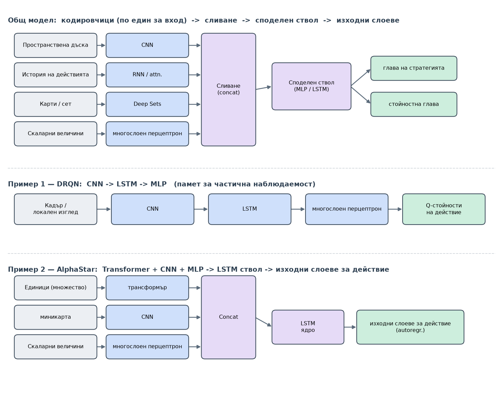
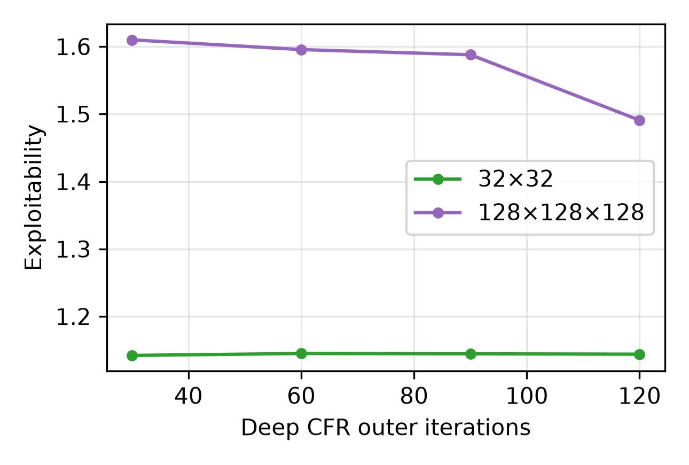
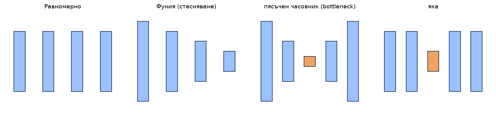
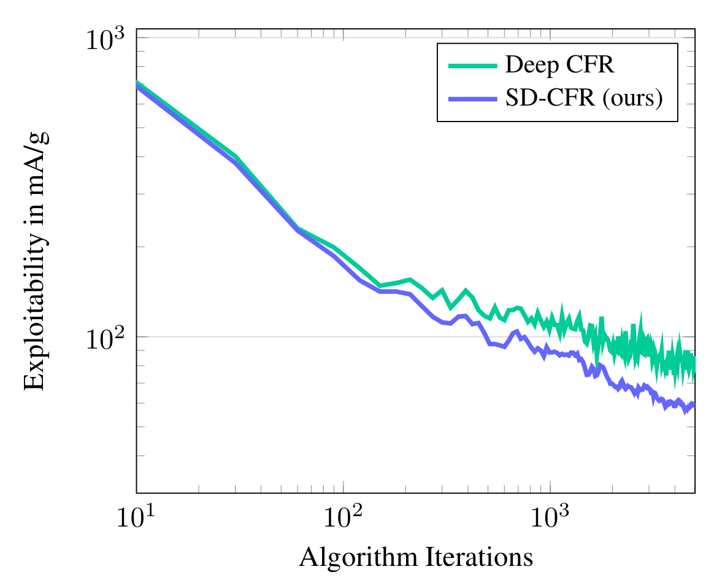
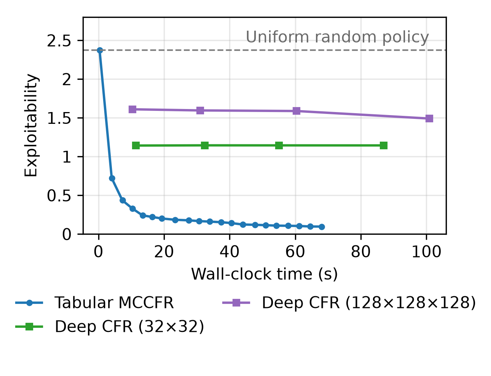
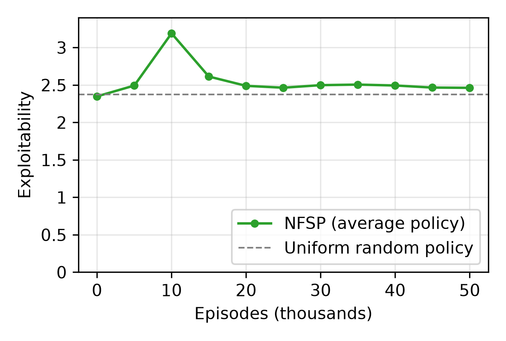

# Глава 5 - Невронни мрежи за игри с непълна информация

<!-- APPROVED-HIGHLIGHT START (temporary; remove before final build) -->

Това е съкратен обзор на невронни методи за игри с непълна информация - материалът, който Глава 5 разширява от първоначалния си фокус върху Deep CFR до по-широко разглеждане на изграждането, обучението и внедряването на невронни мрежи в игри, при които играчите не могат да възприемат пълното състояние. Той изпълнява две функции: служи като бързо опресняване при преминаване през по-късните глави и като основен източник за синтеза на публичния доклад от Глава 15. Глава 5 представлява умишлено еднократно отклонение от обичайния учебен цикъл - фазата на реализация от нулата се отлага, а вместо нея се разширява теорията - поради което този документ е карта на областта в ширина, а не запис на код. Математическите постановки са представени опростено: ключовите уравнения се посочват там, където изострят интуицията, докато извежданията и доказателствата остават в цитираните източници.

---

## Защо невронни мрежи {-}

Табличният CFR и неговите варианти на Монте Карло (Глави 2–4) съхраняват стойност на съжалението и стойност на стратегията във всяко информационно множество, така че разходът им за памет е пропорционален на броя на информационните множества, който нараства с размера на играта. Изследването в Глава 5 количествено определи този лимит върху Ледюк покер - игра, достатъчно малка, за да се побере в таблица: табличният MCCFR достигна експлоатируемост от 0.097, докато Deep CFR при сравним бюджет в реално време достигна само 1.70. В този мащаб табличната методика е за предпочитане; невронната методика не предлага никакво предимство, тъй като таблицата вече се побира изцяло в паметта.

Невронна мрежа заменя таблицата с апроксимация на функция $f_\theta$, която съпоставя характеристиките на едно състояние към стойност или разпределение на действията и обобщава към състояния, които не са били посетени по време на обучението. Това обръща структурата на разходите: паметта става независима от броя на информационните множества, за сметка на по-скъпи итерации и по-слаби гаранции за сходимост. Двата режима се срещат при пресичане в размер на играта - под него изброяването е по-евтино и точно; над него таблицата не може да бъде конструирана и апроксимация на функция е единствената възможност. Игрите, към които тази работа е насочена, са над пресичането, поради което останалата част от главата се посвещава на невронни методи.

## Част 1 - Основни положения

### Основи на невронните мрежи

Мрежа с директно разпространение представлява композиция от слоеве, като всеки слой прилага афинно преобразуване, последвано от нелинейност по елементи:

$$ h = \sigma(Wx + b), $$

където $x$ е входът на слоя, $W$ и $b$ са съответно обучаемата матрица на теглата и векторът на пристрастията, а $\sigma$ представлява фиксирана нелинейност, като например изправителя $\mathrm{ReLU}(z) = \max(0, z)$. Подреждането на $L$ такива слоя формира функцията на мрежата $f_\theta$, при която $\theta$ обединява всички $W$ и $b$. Именно нелинейностите позволяват на тази композиция да представя функции, които не могат да бъдат изразени чрез едно-единствено афинно преобразуване.

> **reLU** (rectified linear unit): стандартната функция за активация - тя пропуска положителните стойности непроменени и ограничава отрицателните до нула, което е изчислително евтино и избягва проблема с изчезващите градиенти, характерен за по-старите насищащи се функции за активация.

Обучението изисква **скаларна величина** за измерване на грешката. При задача за **регресия** - например при оценка на **контрафактична стойност** - стандартно се използва **средноквадратичната грешка**:

$$ L(\theta) = \frac{1}{N} \sum_{i=1}^{N} \big( f_\theta(x_i) - y_i \big)^2, $$

където $N$ е броят на примерите в партида, $x_i$ - вход, а $y_i$ - неговата цел. Когато целта представлява разпределение на действията, вместо това се използва кръстосана ентропия загуба $-\sum_a y_a \log f_\theta(x)_a$, като $y_a$ е целевата вероятност за действие $a$.

Обучението представлява **градиентен спуск** върху тази **загуба**. Всеки параметър се измества с малка стъпка в посоката, която води до най-голямо намаление на **загубата**:

$$ \theta \leftarrow \theta - \eta \, \nabla_\theta L, $$

където $\eta$ е скоростта на обучение, а $\nabla_\theta L$ - градиентът на загубата спрямо параметрите. *Обратно разпространение на грешката* изчислява този градиент, като прилага правилото за верижно диференциране слой по слой от изхода към входа и използва повторно междинните стойности, съхранени във всеки слой; така изчисляването на един градиент струва приблизително колкото едно преминаване напред. Автоматичното диференциране извършва тази процедура механично.

На практика градиентът се оценява от малка случайна партида, а не от целия набор от данни (*стохастичен* градиентен спуск) - по-шумен, но значително по-евтин на стъпка. Импулсът намалява този шум, като извършва стъпките с плъзгаща средна на градиентите, $v \leftarrow \beta v + \nabla_\theta L$ и $\theta \leftarrow \theta - \eta v$, където $\beta \in [0,1)$ определя степента, в която се запазват миналите градиенти. Adam, оптимизаторът по подразбиране в методите на тази глава, освен това разделя стъпката за всеки параметър на плъзгаща оценка на неговата големина на градиента, което осигурява стабилен напредък с минимално ръчно настройване на $\eta$.

> **Adam** (адаптивна оценка на моментите): комбинира импулс с размери на стъпките за всеки параметър, извлечени от плъзгащи статистики на градиента, поради което се обучава надеждно с малко настройване.

Мрежа с достатъчен капацитет може да напасне точно една тренировъчна партида, включително и нейния шум, и след това да се представи слабо при невиждани състояния - *пренастройване*. Регуляризацията противодейства на това. Отслабването на теглата добавя наказание $\lambda \lVert \theta \rVert^2$ към загубата, като $\lambda$ контролира степента, в която се обезкуражават големите тегла; отпадането произволно занулява част $p$ от активациите по време на обучението, така че мрежата да не може да разчита на нито един отделен елемент; и ранното спиране прекратява обучението, след като грешката върху задържаните данни започне да нараства.

Една идея от обучението с подкрепление се повтаря през цялата глава и си струва да бъде изразена изрично: *самоподкрепяне*. Актуализация чрез темпорални разлики оценява стойността на едно състояние въз основа на собствената оценка на мрежата за следващото състояние, а не от краен резултат:

$$ V(s) \leftarrow V(s) + \alpha \big[\, r + \gamma V(s') - V(s) \,\big], $$

където $s$ и $s'$ са последователни състояния, $r$ е наградата, $\gamma \in [0,1]$ е коефициентът на дисконтиране, а $\alpha$ е размерът на стъпката; величината в скобите представлява грешка при темпорална разлика - разликата между текущата оценка и целта с бутстрапиране. Самоподкрепянето прави обучението ефективно по отношение на пробите, а както показва следващият раздел, също така го прави и по-малко стабилно. Основният материал е представен в глави 9 и 11 от Sutton & Barto (2-ро издание); всяка стандартна литература за дълбоко обучение разглежда подробно обратното разпространение на грешката и оптимизацията.

### Обединяване на основите в Ледюк покера

Тези елементи се комбинират в най-простия **невронен решавач** за игра. Вземете **Ледюк покер**, тестовата среда от глави 3–4: неговото **информационно състояние** - **тайната карта**, **историята на залозите** и **потът** - се кодира като вектор от около тридесет числа. Малка **мрежа** картографира този вектор към **стойност** за всяко **действие**; **обратното разпространение на грешката** с **adam** го настройва спрямо **целевите стойности**, генерирани по време на игра, а леката **регуляризация** предотвратява запаметяването на шума в тези цели. Използвана правилно, мрежата предоставя две възможности, които таблицата няма: тя обобщава, така че **стойността**, научена в едно **информационно множество**, информира подобни невиждани такива, а цената на паметта ѝ е фиксирана от броя на параметрите, а не от броя на информационните множества.

Същата техника се влошава, когато бъде претоварена, а **изследването** направи режимите на отказ конкретни. Капацитетът е най-ясният пример. При **Ледюк** най-малката тествана **мрежа** - два скрити слоя с тридесет и две единици - достигна по-ниска **експлоатируемост** от мрежи няколко пъти по-големи, защото при ограничен бюджет на пробите по-големите мрежи задържаха твърде много параметри за твърде малко данни и пасваха шум, вместо структура. **Скоростта на обучение**, зададена твърде висока, дестабилизира спускането; прекомерната **регуляризация** изглажда острите, почти **детерминистични** стратегии, към които CFR се сближава, тъй като силното **отслабване на теглата** или **отпадане** дърпат изхода към **равномерното разпределение**. Общият принцип е, че капацитетът и регуляризацията трябва да бъдат съобразени с количеството и качеството на данните, а не да се максимизират по подразбиране - точка, която част 2 развива в изрични насоки за оразмеряване.

### Нестационарност и смъртоносната троица

Комбинирането на горните компоненти въвежда нестабилност. Сътон и Барто идентифицират една *смъртоносна троица*: когато **апроксимация на функция**, **самоподкрепяне** и **обучение извън политиката** се използват заедно, параметрите могат да се разминават, вместо да **сходяват**, тъй като **целевите стойности по метода „bootstrap“** за всяка актуализация зависят от същите параметри, които се променят. Всеки един компонент е **безопасен** самостоятелно; комбинацията не е. Средствата за защита са практични, а не теоретични. Една *целева мрежа* - забавено копие на параметрите, използвано само за изчисляване на **целеви стойности по метода „bootstrap“** - и един *буфер за възпроизвеждане*, който декорелира последователните проби, заедно правят дълбоките Q-мрежи обучаеми, и двата се появяват отново в **невронните решаващи средства за игри** от части 3 и 4.

Игрите въвеждат втори източник на нестабилност, който липсва при обучението на един агент. При обучението с учител разпределението на данните е фиксирано, а при обучението с подкрепление с един агент то се стабилизира, след като стратегията **сходи**. В една игра противникът също се адаптира, така че разпределението на ситуациите, които мрежата среща, се променя по време на обучението; функцията, която се апроксимира, сама по себе си е подвижна цел. Тази нестационарност не е случайна - тя е централната трудност на средата, към която това изследване е насочено. Няколко метода в следващите части са най-добре разбрани като отговори на нея: самообучението срещу замразени или осреднени във времето противници възстановява стационарна цел, популационните методи заменят подвижната цел с изричен набор от фиксирани противници, а техниките за моделиране на противника и бърза адаптация от части 4 и 5 се опитват да я проследят директно.

## Част 2 - Архитектура и композиция

### Индуктивно пристрастие: Съгласуване на архитектурата със структурата на играта

Всяка архитектура кодира предположения относно структурата на своя вход още преди да види каквито и да е данни; тези вградени предположения представляват нейното *индуктивно пристрастие*. Напълно свързаната мрежа не предполага нищо - всяка входна характеристика може да взаимодейства с всяка друга - което я прави обща, но изисква голям обем данни, тъй като мрежата трябва да научи структурата от нулата. Изборът на архитектура, чието пристрастие съответства на структурата на играта, намалява броя на параметрите и количеството необходими данни за постигане на определена точност, както и подобрява обобщаването към състояния, които не са били част от обучението. Решенията за архитектура в останалата част от Част 2 по същество представляват избор на индуктивно пристрастие.

Три съответствия покриват повечето случаи в игри с **непълна информация**. Когато **състоянието** е пространствено - дъска или мрежа - **конволюционната мрежа** предполага, че един и същ локален модел е смислен, независимо къде се появи, така че характеристика, научена в една област, може да бъде приложена към други; тази *еквивариантност спрямо транслация* обяснява защо конволюциите доминират в мрежовите области. Когато част от **състоянието** е неупотребена колекция - ръка карти или множеството от други играчи - **мрежата** трябва да бъде *инвариантна спрямо пренареждане*, като произвежда един и същ изход, независимо от реда, в който тези елементи са представени, за да не се използва капацитет за научаване на това, че редът е без значение. Когато **състоянието** представлява история, разкрита с течение на времето, както при **частична наблюдаемост**, **рекурентна мрежа** или **механизъм за внимание** позволяват на **мрежата** да обобщи последователността и да пренесе напред изводите от по-ранните наблюдения. Съгласуването на тези пристрастия със структурата на играта е разликата между **мрежа**, която се учи ефективно, и такава, която само би могла по принцип.

### Типове слоеве на практика: многослоен перцептрон, CNN, RNN, внимание/трансформър

Семействата се различават по своята *свързаност* - кои единици са свързани с кои - и дали свързващите *тегла* се *споделят* между позиции или във времето. Всичко останало (неврона, нелинейността, обратното разпространение на грешката) е идентично. На фигурата по-долу цветът на ръбовете обозначава отделно тегло, така че повтарящият се цвят маркира споделено тегло; следващите параграфи описват всеки панел.

{width=66% fig-pos="H"}

Напълно свързан слой - многослоен перцептрон, или MLP - свързва всяка единица с всяка единица в следващия слой, като всяка връзка носи свое собствено тегло. Той не предполага никаква структура и може да представи всяка зависимост по принцип, но броят на теглата е произведение от размерите на двата слоя и цялата структура трябва да бъде научена от данните. Това е правилният избор за плосък вектор на характеристики без пространствено или последователно значение, като например информационно състояние в покер.

Свръзъчен слой (CNN) свързва всяка изходна единица само с малък локален прозорец от входа - неговото *приемно поле* - и прилага един и същ малък набор от тегла, *филтърът*, на всяка позиция. От тази една промяна в свързаността следват две последствия: броят на теглата зависи от размера на филтъра, а не от размера на входа, и модел, научен на едно място, се разпознава на всяко друго място (еквивариантност спрямо превод). Подреждането на свръзки увеличава ефективното приемно поле, така че по-късните слоеве комбинират локални модели в по-големи. Това е стандартният избор за дъски и мрежи.

> **Споделяне на тегла**: повторно използване на едни и същи тегла на много позиции (CNN) или времеви стъпки (RNN). Това е, което прави тези подредби параметърноефективни и е механизмът зад тяхната еквивариантност.

Повтарящ се слой (RNN) прилага една и съща клетка последователно по дължината на последователността: на всяка стъпка той приема текущия вход заедно със *скритото състояние* от предишната стъпка и произвежда ново скрито състояние, което се предава напред. Тъй като клетката е споделена между стъпките, броят на теглата не зависи от дължината на последователността, а скритото състояние функционира като памет за всичко видяно до момента - свойството, необходимо когато състоянието представлява история, разкривана с течение на времето, както при частична наблюдаемост. Вариантите с гейтове (LSTM, GRU) добавят научени гейтове, които контролират какво да се запази и какво да се изхвърли, което им позволява да задържат информация за по-дълги интервали от време.

Слой за **самовнимание** (трансформър) позволява на всеки елемент да взаимодейства директно с всеки друг. Всеки елемент излъчва *заявка*, *ключ* и *стойност*; изходът за даден елемент представлява претеглена средна стойност на стойностите на всички елементи, като теглата се определят от сходството между неговата заявка и всеки ключ. Тъй като операцията не отчита реда на елементите, тя е **инвариантна спрямо разместване**, а редът трябва да бъде предоставен изрично чрез **позиционни кодировки**, когато има значение. Самовниманието улавя **дългосрочни зависимости**, до които повтарящ се слой достига само косвено, за сметка на изчисления, чиято сложност нараства квадратично спрямо броя на елементите. То е подходящо за истории с променлива дължина и входове със стойности от множества.

Вход, който е наистина неуреден - например ръка карти или множеството от други играчи - изисква **инвариантност спрямо пермутации**, която не се постига чрез нов тип слой, а чрез подредба: прилага се една и съща малка мрежа към всеки елемент, след което резултатите се комбинират с операция, независима от реда, като сума, **средна стойност** или максимум. Това е принципът зад Deep Sets и представлява естественият **кодировчик** за колекция, чийто ред няма значение.

На практика една мрежа рядко използва само едно семейство архитектури. Обичайният дизайн е конвейер: отделен *кодировчик*, съобразен с всяка част от входа, изходите на кодировчика се *обединяват* чрез конкатенация в общ *ствол*, и една или повече *глави*, които извличат прогнозите от ствола - обикновено глава на стратегията и стойностна глава. Deep Recurrent Q-Network (DRQN) комбинира конволюционен енкодер, LSTM и изходен MLP, като рекурентността осигурява памет, която едно преминаване напред няма при частична наблюдаемост - естественият шаблон за агент в мрежа с „мъгла на войната“. AlphaStar отива по-далеч, кодирайки множество единици с трансформър, пространствената миникарта с CNN и скаларни величини с MLP, след което обединявайки трите и преминавайки ги през LSTM ядро преди изходните слоеве за действие. Практическият урок за останалата част от Част 2 е, че „коя архитектура“ обикновено означава „кой кодировчик за всеки вход и как да ги комбинираме“, а не един-единствен избор.

{width=58% fig-pos="H"}

### Кодиране на състоянието на играта и историята

Преди някоя от тези архитектури да може да работи, състоянието на играта трябва да бъде превърнато в числа. Информационното състояние - всичко, което действащият играч може законно да наблюдава - трябва да стане тензор с фиксирана форма, а начинът, по който е подредено, определя коя архитектура може да го използва. Категориалните факти се кодират или като *one-hot* вектори - вектор с дължина $k$, съдържащ една единствена единица, която маркира коя от $k$ категории е валидна - или, когато $k$ е голямо, като *вграждания*: кратки научени вектори, които се извличат за всяка категория и се обучават заедно с мрежата. Ледюк покер е достатъчно малък, за да използва one-hot навсякъде: тайната карта, общата карта и историята на залозите стават one-hot полета, а потът - една скаларна величина, което води до приблизително трийсетмерния вектор, използван в глави 3–4.

> **One-hot срещу вграждане**: one-hot е точен, но неговата дължина нараства с броя на категориите; едно вграждане компресира голям речник - всяка карта или всеки елемент от дъската - в няколко научени измерения и позволява на подобни категории да споделят структура.

По-богатите входове изискват по-богати подредби. Пространственото състояние се кодира като купчина от мрежи, по една *канална* равнина за всеки тип обект, така че сгъвката да може да го прочете директно. Pommerman - игра в стил Bomberman на базата на мрежа, в която агентите се движат по дъска, поставяйки бомби, за да разрушават стени и да прихващат противници - е ясен пример: неговата дъска 11x11 е разделена на отделна двоична равнина за всеки тип обект (проходи, дървени стени, твърди стени, бомби, пламъци, бонуси, действащият агент и всеки противник), подредени в тензор (11, 11, канали); скаларни величини като оставащите боеприпаси и обхватът на взрива след това се добавят като кратък вектор или се излъчват като постоянни равнини. История, чийто ред има значение, се кодира като *последователност* от вектори за всяка стъпка за повтарящ се слой или трансформър, вместо да бъде сплескана в един вектор, който пренебрегва реда. Неподредена колекция, като текущия набор от противници, се кодира елемент по елемент и се обединява. Във всеки случай кодирането е мястото, където индуктивното пристрастие от предишните раздели всъщност се прилага: мрежата се представя като мрежа именно за да важат предположенията на сгъвката.

Една дисциплина е специфична за игри с **непълна информация** и лесно може да бъде нарушена: кодирането трябва да съдържа само това, което играчът може да наблюдава, и нищо скрито. Ако каквато и да е **привилегирована информация** - **тайната карта** на противника или истинското съдържание на клетка, покрита с мъгла - попадне в тензора за вход, мрежата ще се научи да я използва и ефективно ще „вижда“ през мъглата, което води до стратегия, която не може да бъде приложена срещу реален противник, и до показател за **експлоатируемост**, който е безсмислен. Ето защо рамки като OpenSpiel дефинират изрично представяне на **информационно състояние** за всеки играч; правилното получаване на това представяне е изискване за коректност, а не избор за настройка.

Две по-малки точки завършват изработката. Непрекъснати признаци като **пота** или **размера на стака** се нормализират до сравним мащаб, преди да постъпят в мрежата, така че нито един признак да не доминира градиента. А кодировчикът не е задължително да бъде проектиран ръчно от край до край: една мрежа може да се научи да компресира дълга история в компактен обобщен вектор - идея, която Част 4 развива като научена абстракция, а Част 5 - като научени състояния на убеждение.

### Оразмеряване и капацитет

Капацитетът на една *мрежа* - определен от нейната ширина, броя на единиците във всеки слой, и нейната дълбочина, броя на слоевете - е размерът на семейството от функции, които тя може да представи. При твърде малък капацитет мрежата *подпасва* (underfits), неспособна да изрази целевата стратегия; при твърде голям капацитет тя *свръхпасва* (overfits), пасвайки шума в ограничен набор от данни, вместо основната структура. Правилният капацитет е този, който съответства на количеството информативни данни, което процедурата за обучение действително предоставя - а при решавач на игра това често е значително по-малко от суровия брой състояния, тъй като самите стойности, които се пасват, представляват шумни оценки.

Глава 5 от изследването показа това директно. Прилагайки Deep CFR върху Ледюк при фиксиран бюджет, но с различни размери на мрежата, най-малката мрежа - два скрити слоя от тридесет и две единици - постигна по-ниска експлоатируемост в сравнение с мрежите, които бяха два и четири пъти по-широки; по-големите мрежи съдържаха повече параметри, отколкото няколкото хиляди обхождания можеха да ограничат, и изразходваха излишъка за пасване на шум от извадката. Изводът не е, че по-малкият размер винаги е по-добър, а че капацитетът трябва да съответства на бюджета за данни: при по-голяма игра или с много повече обхождания, класирането би се променило.

{width=62% fig-pos="H"}

Това аргументира за умишлено оразмеряване на мрежата, вместо да се използва по подразбиране най-голямата, която се побира в паметта. Работеща рецепта е да се започне с малък размер и ширината и дълбочината да се увеличават само докато задържан показател - загуба при валидиране или експлоатируемост за решавач - продължава да се подобрява, като се спира, когато достигне плато. Ширината позволява на мрежата да представя повече различни модели на дадено ниво на абстракция; дълбочината ѝ позволява да съставя прости модели в по-абстрактни, поради което пространствените и последователните проблеми се възнаграждават с няколко слоя, докато плосък вектор на характеристики често не. Капацитетът трябва да се мащабира спрямо размера и богатството на играта, а не да бъде максимизиран по подразбиране.

Ширината на мрежата не е задължително да остава постоянна във всичките ѝ слоеве. Те могат да се *свиват* към изхода, като компресират входа до малко обобщение (кодировчик или *фуния*), или да се *разширяват* от малък вход, за да реконструират структуриран изход (декодер). Комбинирането на двете формира *пясъчен часовник*, чиято тясна среда - *стеснение* - принуждава цялата информация да премине през нискоразмерен код; тъй като мрежата трябва да действа или реконструира въз основа на този код, тя запазва единствено най-същественото, което регулира модела и води до компактно, многократно използвано представяне - семето на научена абстракция или състояние на убеждението (Части 4 и 5). Същото стесняване, вградено в иначе равномерна купчина от слоеве, представлява *яка*. Фигурата по-долу илюстрира тези профили.

{width=82% fig-pos="H"}

Тясното място ограничава *ширината*; *остатъчните (residual) връзки* адресират *дълбочината*, като добавят входа на даден слой към неговия изход, така че градиентите да достигат до дълбоките слоеве и много дълбоките мрежи да стават обучаеми - принципът, залегнал в основата на resNets и дълбоките мрежи за стойности от Част 4. И двете допълват отпадането, отслабването на теглата и нормализацията, споменати по-рано: всяка от тях определя начина, по който се използва капацитетът, а не само неговия обем.

> **Остатъчна (residual) връзка**: пряк път, който добавя входа на слой към неговия изход, така че слоят трябва да научи само корекция; тя поддържа градиентите силни през дълбоки мрежи и е това, което прави много дълбоките модели обучаеми.

### Стабилност на обучението и диагностиката

Две стабилизиращи средства от обсъждането на „смъртоносната тройка“ - целевата мрежа и буферът за възпроизвеждане - вършат по-голямата част от работата по предотвратяване на разминаването при обучение с оценка на стойности. Още две се появяват конкретно в решаващите игри по-нататък. *Извадка от резервоар* поддържа фиксиран по размер, равномерно случаен образец от всички данни, видени досега, което е важно, когато дадено количество трябва да бъде осреднено върху цялата история на обучението, а не само върху последните данни; Deep CFR го използва, така че неговата стратегическа мрежа да се обучава върху безпристрастна извадка през всички итерации (Част 3). *Намаляване на дисперсията* - чрез изваждане на базова линия от взетите извадкови стойности или използване на контролни променливи - намалява шума, който извадката внася в градиента, така че мрежата да се сближава с по-малко извадки. Нормализиране на входа и разумна инициализация на теглата, споменати по-рано, допълват списъка: и двете поддържат активациите и градиентите в използваем диапазон още от първата стъпка.

> **Извадка от резервоар**: метод, който поддържа извадка с фиксиран размер, при която всеки елемент, видян досега, има еднаква вероятност да бъде запазен, така че плъзгащата средна остава безпристрастна, без да се съхраняват всички данни.

Дори и с тези мерки на място, невронният решавач се проваля по-често тихо, отколкото шумно, така че четенето на диагностиката е от значение. Загуба, която намалява стабилно, докато оценителният показател - експлоатируемост за решавач - застива, е знак за мрежа, която е *жива, но не сходима*: обучението работи, но бюджетът е твърде малък, за да може средната стратегия да се установи, което показаха мрежите от Глава 5 при Ледюк на няколко хиляди обхождания. Обратният и по-опасен случай е, когато обучението изобщо не протича, въпреки че изглежда така: при изследването едносимволна грешка в рутина на OpenSpiel остави мрежите за предимство необучени, но програмата завърши изпълнението си и произведе правдоподобен резултат, като експлоатируемостта просто замръзна на нивото на случайната стратегия. Урокът е да се потвърди, че загубата действително се променя и че оценителният показател реагира, преди да се вярва на който и да е резултат - тиха неоперация е неразличима от труден проблем, освен ако кривите не бъдат проверени.

## Част 3 - Невронни мрежи в CFR

### От табличен CFR към апроксимация на функция

Табличният CFR поддържа по две стойности за всяко информационно множество: кумулативно контрафактично съжаление за всяко действие, от което се извежда текущата стратегия чрез напасване на съжалението, както и кумулативна стратегия, чиято плъзгаща средна представлява нашовото приближение, което алгоритъмът в крайна сметка връща (Глави 2–4). И двете таблици се разрастват с увеличаването на броя на информационните множества - стената, описана в началото на тази глава.

Замяната им с невронни мрежи е концептуално проста: апроксиматор на функции приема тензор на информационно състояние като вход и предсказва това, което таблицата би съхранявала. Една мрежа може да научи съжаленията - еквивалентно, контрафактичните предимства - които определят текущата стратегия; друга може да научи средната стратегия директно. Тъй като една мрежа обобщава подобни информационни състояния, тя никога не трябва да ги изброява и нейният размер е фиксиран от параметрите ѝ, а не от играта. Методите по-долу се различават основно в *кое* от двете таблици те апроксимират и *как* генерират данните за обучението ѝ: Deep CFR научава предимства от извадкови обхождания на дървото, докато NFSP научава средната стратегия от самообучение без изобщо да обхожда дървото.

### Deep CFR и неговите варианти с една мрежа

Deep CFR (Brown et al., 2019) е директният невронен превод на MCCFR. При всяка итерация той обхожда дървото на играта чрез външно вземане на проби и във всяко информационно множество, което посещава, изчислява извадковото контрафактично предимство на всяко действие - колко по-добро е било това действие от текущата стратегия средно. Тези двойки (информационно състояние, предимство) се записват в резервоарен буфер и *мрежа за предимства*, по една за всеки играч, се обучава да ги предсказва; текущата стратегия във всяко информационно множество след това се извежда от предсказаните предимства на мрежата чрез напасване на съжалението, точно както би била използвана таблицата. Отделна *стратегическа мрежа*, обучавана от собствен резервоарен буфер, научава средната стратегия през всички итерации - нашовото приближение, което се връща в края.

Единственото уравнение, което отличава Deep CFR от табличния MCCFR, е целевата функция на мрежата за предимства: средноквадратична грешка между нейната прогноза и извадковите предимства,

$$ L(\theta) = \frac{1}{|B|} \sum_{(I,\,\tilde{a}) \in B} \big\lVert f_\theta(I) - \tilde{a} \big\rVert^2, $$

където $B$ е партида, изтеглена от резервоара, $I$ тензор на информационно състояние, $\tilde{a}$ векторът на извадковите предимства за неговите действия и $f_\theta$ мрежата за предимства (на практика пробите се претеглят според итерацията, отразявайки линейния CFR). Всичко останало - обхождането на дървото, стъпката на съвпадение по разкаяние, осредняването - се запазва непроменено спрямо табличния алгоритъм.

Две усъвършенствания намаляват разхода на итерация. *Single Deep CFR* премахва отделната стратегическа мрежа и възстановява средната стратегия директно от съхранените модели за предимство, като по този начин намалява наполовина броя на мрежите за обучение. *DREAM* заменя външното вземане на проби с извадка по резултати - една траектория на итерация - и добавя научена базова линия като контролна променлива, за да абсорбира допълнителната дисперсия, която извадката по резултати поражда, същата идея за намаляване на дисперсията от Част 2. При големи покер игри *Single Deep CFR* съвпада или леко превъзхожда *Deep CFR*, докато обучава една мрежа вместо две, както показва сравнението в оригиналната статия.

{width=88% fig-pos="H"}

На Ледюк изследването потвърди както обещанието, така и уловката. Deep CFR се обучи правилно - загубите му на предимство намаляха, както се очакваше - но на 120 итерации достигна експлоатируемост близо до 1.70, срещу 0.097 за табличен MCCFR при сравними реално време. Това не е дефект: Ледюк е достатъчно малък, че табличният подход печели категорично, а на Deep CFR са необходими няколко пъти повече итерации, за да се доближи до Нашево равновесие. Неговото предимство се проявява едва когато играта е твърде голяма, за да съществува таблица - режимът, който заключителният раздел на тази част уточнява.

{width=62% fig-pos="H"}

### NFSP - Neural Fictitious Self-Play

NFSP - Neural Fictitious Self-Play (Heinrich & Silver, 2016) - достига приблизително равновесие на Наш от страната на обучението с подкрепление, без никога да обхожда дървото на играта. Всеки играч поддържа две мрежи: *мрежа за най-добър отговор* (DQN), която се обучава да изчислява алчен най-добър отговор спрямо текущото поведение на опонента, и *мрежа с усреднена политика*, обучена чрез обучение с учител върху собствените минали действия на играча, която се учи на усредненото време на тези най-добри отговори. Средната стратегия е тази, която се сближава към равновесие на Наш - същото осредняване, което CFR извършва, но постигнато чрез игра, а не чрез съжаление.

Двете мрежи са свързани чрез *предварителен параметър* $\eta$: на всяка стъпка агентът действа от своята мрежа за най-добър отговор с вероятност $\eta$, а в останалите случаи - от своята мрежа с усреднена политика. Играта с най-добър отговор продължава да генерира свежи данни от разпределението, които средната стратегия усвоява, докато средната стратегия осигурява стабилния опонент, спрямо когото се изчислява най-добрият отговор. Не е необходим резервоар от обхождания на дървото - данните идват единствено от епизоди на самообучение.

Цената е ефективност на извадката. В играта Ледюк изследването стартира NFSP за десетки хиляди епизоди и наблюдава колебание на експлоатируемостта около 2.5 вместо спад, тъй като достигането на използваемо равновесие дори в тази малка игра изисква порядъка на един милион епизоди или повече - собственият еталонен тест на OpenSpiel използва още по-голям брой. NFSP се мащабира до големи игри, където неговата безмоделна простота е предимство, но при еталонен тест за обучение той се сближава значително по-бавно от табличен CFR или Deep CFR.

{width=62% fig-pos="H"}

### Компромиси: Кога невронната CFR е от полза

Отстъпвайки назад: каква е реалната полза от невронните мрежи в CFR и каква е цената им? Ползата е обобщаване и ограничена памет - една мрежа споделя структура между сходни информационни множества и съхранява стратегия във фиксиран брой параметри, така че изчисляването на равновесие вече не изисква изброяване или дори посещение на всяко информационно множество. Цената е висок разход на итерация и по-слаби гаранции: всяка итерация обучава мрежи вместо да увеличава броячи, сходимостта е по-шумна, а чистото монотонно поведение на табличен CFR става приблизително. Резултатите от изследването в Ледюк показват тази страна на компромиса при малки игри: когато таблицата се побира в паметта, тя е по-ефективна.

Компромисът се променя при увеличаване на мащаба. С разрастването на играта табличните таблици в крайна сметка изобщо не се побират в паметта, докато отпечатъкът на мрежата остава непроменен; след този преход невронната методика не е просто конкурентна, а единствената възможна. Затова Deep CFR и неговите разновидности са важни за пълномащабен покер, въпреки че губят в Ледюк.

Едно структурно ограничение определя къде се прилагат невронните методи, базирани на съжаление. CFR изчислява контрафактични стойности чрез разсъждения върху цялото поддърво под едно информационно множество, което е евтино, когато дървото е *широко, но плитко* - покерът има огромен брой **раздавания**, но завършва след няколко рунда на залагане. В игри, които са *дълбоки* - със стотици последователни хода, както в една мрежова среда - това разсъждение става непосилно скъпо и безмоделните методи за самообучение от Част 4 се превръщат в по-естественото решение. Семейството, базирано на съжаление, продължава да расте в своята ниша - neuRD, например, преформулира обновяването на съжалението като стъпка на градиента на стратегията, за да комбинира стабилността на CFR с оптимизация на невронна стратегия - но неговата най-добра област на приложение остават широките, плитки игри с непълна информация.

<!-- APPROVED-HIGHLIGHT END -->

## Част 4 - Други невронни приложения

### Четирите водещи фамилии алгоритми

Част 3 представи един от начините за прилагане на невронни мрежи в игри с непълна информация - чрез приближаване на CFR. Това е едно от четирите основни семейства, които определят съвременното равнище, като изборът между тях до голяма степен зависи от съответствието им с мащаба на играта, структурата на дървото и броя на участниците. Четирите са *базирани на съжаление* методи (Deep CFR, DREAM, neuRD) от Част 3; *популационни* методи (PSRO и неговите разновидности, включително NFSP); *търсене плюс обучение с подкрепление* методи (Recursive Belief-based Learning, играч на игри); и *самообучение без използване на модел* (PPO, DQN, MAPPO, QMIX). Таблицата ги представя; следващите раздели разглеждат трите, които все още не са обхванати.

| Семейство | Основна идея | Най-подходящо за | Цена |
|:-----------------------------|:----------------------------|:--------------------------|:--------|
| Базиран на съжаление (Deep CFR, DREAM, NeuRD) | Приближаване на CFR с невронни мрежи | Широки, плитки игри; неексплоатируемост | Висока |
| Популационен (PSRO, NFSP, XFP) | Оптимално отговаряне на нарастваща популация от противници | n-играчен; моделиране на противника | Средна |
| Търсене + RL (Recursive Belief-based Learning, играч на игри) | Научена стойност плюс онлайн търсене по време на извод | Игри с високи залози; изчислителна мощност по време на извод | Висока |
| Самообучение без използване на модел (PPO, DQN, MAPPO, QMIX) | Оптимизиране на награда чрез самообучение | Пространствени, с дълъг хоризонт (решетки) | Ниска–средна |

### Популационни методи: PSRO, NFSP, XFP

Популационните методи преформулират **намирането на равновесие** като итеративен турнир. Започвайки от малък набор от **стратегии**, се формира *мета-игра* чрез изиграване на членовете на набора един срещу друг; след това се обучава нова **стратегия** като приблизителен **най-добър отговор** на текущата **популация**, добавя се обратно към набора и процесът се повтаря. Това е идеята зад PSRO (Policy-Space Response Oracles) и неговите мащабируеми варианти като Pipeline PSRO; фиктивната **самоигра**, включително NFSP от предишната част, е специалният случай, при който **най-добрият отговор** е насочен към **усредненото време** на набора. Тъй като **популацията** представлява изричен набор от противници, а не една **подвижна цел**, тези методи естествено се разширяват отвъд двуигровите **игри с нулева сума** до *n*-игровия сценарий за **моделиране на противника**, който е предмет на тази дисертация - и именно чрез тях **alphaStar** достига нивото на гросмайстор в StarCraft II. Цената е поддържането и съхраняването на множество агенти, а гаранциите за **равновесие** са по-слаби от тези на CFR.

### Търсене + RL: Recursive Belief-based Learning и играч на игри

Методите търсене плюс обучение с подкрепление представляват идеята на AlphaZero, адаптирана към скрита информация. В игра с пълна информация може да се извършва търсене напред от текущото състояние, тъй като то е известно; при непълна информация търсещият играч не знае действителното състояние, затова търсенето трябва да обхваща разпределение на вероятностите върху възможни състояния. ReBeL (Brown и др., 2020) прави това прецизно чрез *общодостъпното състояние на вярванията* - разпределение на вероятностите върху частната информация на играчите, предвид всичко публично - и изпълнява CFR върху малка, ограничена по дълбочина под-игра по време на игра, като научена мрежа за стойности предоставя стойностите на листата. Играч на игри (Schmid и др., 2023) обобщава този подход в един алгоритъм, който обработва както пълна, така и непълна информация. Тези системи достигат най-силно ниво на игра, но са най-сложни за изграждане и зависят от наличието на изчислителна мощност *по време* на игра, а не само по време на обучение; те са предмет на Глава 6, така че тази секция само ги позиционира в общата картина.

### Самообучение без използване на модел: PPO, DQN, MAPPO, QMIX

Методите за самообучение без използване на модел изцяло игнорират дървото на играта и оптимизират директно сигнала за награда, усъвършенствайки стратегия от епизоди на игра срещу собствени копия. Те са основните методи в многоагентното обучение с подкрепление: PPO и DQN за едноагентното ядро и многоагентните разширения MAPPO и QMIX за кооперативни и смесени сценарии. Тъй като никога не обмислят поддървото под дадено състояние, те не се затрудняват от дълбочината, която пречи на методите, основани на съжалението, което ги прави естествения избор за пространствени игри с дълъг хоризонт - мрежи от клетки, Pommerman и подобни. За да се справят с частичната наблюдаемост, те използват рекурентните и attention архитектури от Част 2, предоставяйки на агента памет за това, което мъглата е скрила. Тяхната слабост е огледален образ на тяхната сила: без концепция за контрафактично съжаление, те не притежават вграден натиск към неексплоатируемост, така че един безмоделен агент може да бъде силен средностатистически, но все пак да остане експлоатируем от противник в най-лошия случай - което е именно причината експлоатируемостта да трябва да се измерва отделно, тема на по-късна секция.

### Невронни мрежи за абстракция, моделиране на противника и представяне на убеждението

<!-- STUB: NN beyond solving equilibria - learned (deep) abstraction of states/actions; networks
that infer opponent type/strategy from observed play (-> Contribution #1, brief inline); learned
belief/PBS representations as compact summaries of hidden state. -->

### Оценяване на невронните стратегии: експлоатируемостта в мащаб

<!-- STUB: How to measure quality as games outgrow exact methods: exact NashConv (micro) ->
approximate best response by freezing the policy and training a fresh net to beat it (a lower
bound) -> alpha-Rank for n-player/cooperative settings where worst-case exploitability loses
meaning (-> Contribution #3, brief inline). -->

### Обобщаване отвъд покера: среди и инструменти

<!-- STUB: Where this generalizes later (poker stays first). OpenSpiel imperfect-info games
(Phantom Tic-Tac-Toe, Dark Hex, Hanabi, Liar's Dice, Goofspiel); building custom OpenSpiel games
(Python pyspiel vs C++/pybind11, the critical InformationStateString); established 2D grid MARL
benchmarks (Pommerman, Melting Pot, PettingZoo/MAgent); the deep-gridworld caveat (sparse-reward
"suicide wall", why regret methods choke on long horizons). -->

## Част 5 - Експериментална / граница

### Памет и време

<!-- STUB (menu, 1-2 sentences each): State-space models (S4/Mamba) for efficient long-range
sequence memory; neural ODEs / liquid time-constant networks / continuous-time RNNs ("keeping
time" with adaptive timescales); memory-augmented nets (NTM/DNC) and modern Hopfield associative
memory for explicit recall. Plausible value: compact memory of long opponent histories under
partial observability. -->

### Модели на латентни убеждения

<!-- STUB: Recurrent world models / RSSM-style architectures that learn a latent belief state
updated over time - the neural analogue of the belief states used in ReBeL/DeepStack. Brief
inline -> Contribution #1 (richer state for adaptive play). -->

### Бърза адаптация

<!-- STUB: Meta-learning (MAML, RL^2), fast weights, and hypernetworks - adapt to a new opponent
in a handful of interactions rather than retraining. Brief inline -> Contribution #1 (real-time
opponent inference). -->

### Моделиране на чужди умове и отношения

<!-- STUB: Theory-of-mind networks (ToMnet) that predict other agents' policies/intentions;
attention/transformers and graph neural networks for representing opponents and relational
structure in n-player games. -->

### Несигурност и симетрия

<!-- STUB: Bayesian NNs / deep ensembles for calibrated uncertainty - knowing when the opponent
model is trustworthy (brief inline -> Contribution #2, safe exploitation). Equivariant/
symmetry-aware networks for generalization and robustness (brief inline -> Contribution #3). -->

### Съзнателно извън обхвата на изследването

<!-- STUB: One short paragraph naming frontier areas excluded as low-plausibility for imperfect-
info games and why: spiking neural networks (neuromorphic-hardware focus), diffusion models
(generative/continuous-control oriented), capsule/vision-specific tricks. Keeps the boundary
explicit. -->

## Синтез

### Карта на решенията: Кой метод с невронни мрежи за коя игра

<!-- STUB: A single table/figure that turns the chapter into a choice: rows = game properties
(size, tree shape, players, observability, compute), columns/cells = recommended NN method
family. The practical payoff of the survey. -->

### Връзки и бъдещи насоки

<!-- STUB: Back-pointers to Step 1 (RL basics, DQN/PPO), Step 3 (CFR variants/MC), Step 4
(abstraction). Forward pointer to Step 6 (end-to-end architectures). Restate the stance:
poker-first now, with these neural tools generalizing to other environments later. -->
