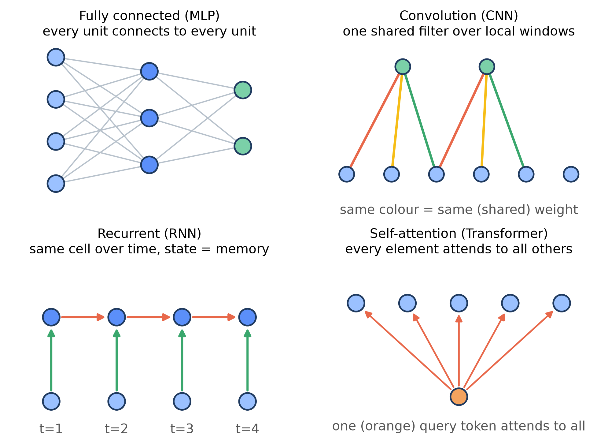
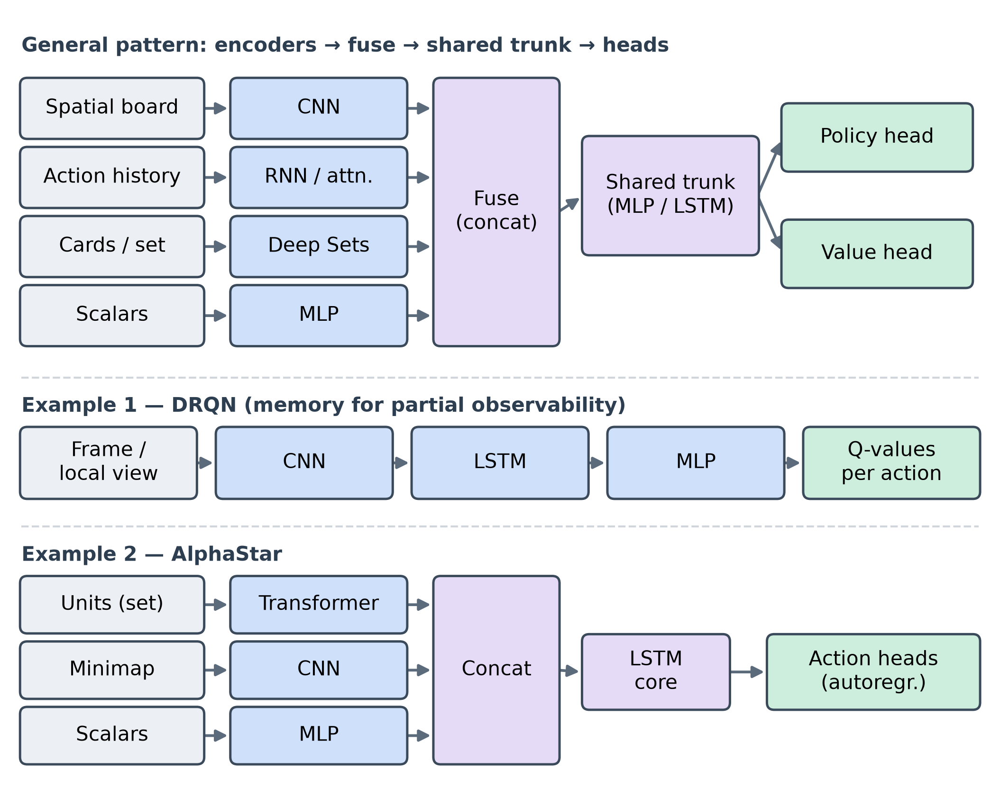
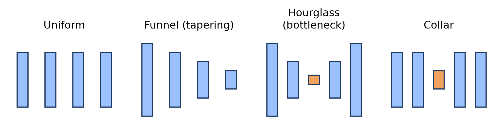

# Chapter 5 — Neural Networks for Imperfect-Information Games

This is a condensed survey of neural-network methods for imperfect-information games — the material that Chapter 5 widened from its original Deep CFR focus into a broader treatment of how neural networks are built, trained, and deployed in games where players cannot see the full state. It serves as a quick reference while reading the later chapters. Chapter 5 is a deliberate one-off deviation from the usual learning cycle — the from-scratch implementation phase is deferred and the theory is broadened in its place — so this document is a breadth-first map of the field rather than a record of code. Mathematics is kept light: key equations are stated where they sharpen intuition, but derivations and proofs are left to the cited sources. Sections on learned abstraction, evaluating neural policies, experimental architectures and a closing decision map are planned but not included in this version.

---

## Why Neural Networks {-}

Tabular CFR and its Monte Carlo variants (Chapters 2–4) store a regret value and a strategy value at each information set, so their memory cost is proportional to the number of information sets, which grows with the size of the game.[^zinkevich2007c05] The experiments in this chapter quantified this limit on Leduc poker, a game small enough to hold in a table: tabular MCCFR reached an exploitability of 0.097, whereas Deep CFR under a comparable wall-clock budget stayed above 1.1 at every network size tried. At this scale the tabular method is preferable; the neural method offers no advantage, because the table already fits.

A neural network replaces the table with a function $f_\theta$ that maps a state's features to a value or an action distribution and generalizes to states never visited during training. This inverts the cost structure: memory becomes independent of the number of information sets, at the price of more expensive iterations and weaker convergence guarantees. The two regimes meet at a crossover in game size — below it, enumeration is cheaper and exact; above it, the table cannot be constructed and function approximation is the only option. The games this research targets lie above the crossover, which is why the remainder of the chapter concerns neural methods.

## Fundamentals

### Neural Network Fundamentals

A feed-forward network is a composition of layers, each applying an affine map followed by an elementwise nonlinearity:

$$ h = \sigma(Wx + b), $$

where $x$ is the layer input, $W$ and $b$ are the trainable weight matrix and bias vector, and $\sigma$ is a fixed nonlinearity such as the rectifier $\mathrm{ReLU}(z) = \max(0, z)$. Stacking $L$ such layers gives the network function $f_\theta$, with $\theta$ collecting every $W$ and $b$. The nonlinearities are what allow the composition to represent functions that no single affine map can.

> **ReLU** (rectified linear unit): the standard activation — it passes positive values through unchanged and clamps negatives to zero, which is cheap to compute and avoids the vanishing gradients of older saturating activations.

Training requires a scalar measure of error. For a regression target — for example, a counterfactual value — the mean squared error is standard:

$$ L(\theta) = \frac{1}{N} \sum_{i=1}^{N} \big( f_\theta(x_i) - y_i \big)^2, $$

where $N$ is the number of examples in a batch, $x_i$ an input, and $y_i$ its target. When the target is an action distribution, the cross-entropy loss $-\sum_a y_a \log f_\theta(x)_a$ is used instead, with $y_a$ the target probability of action $a$.

Learning is gradient descent on this loss. Each parameter moves a short distance in the direction that most reduces the loss:

$$ \theta \leftarrow \theta - \eta \, \nabla_\theta L, $$

where $\eta$ is the learning rate and $\nabla_\theta L$ the gradient of the loss with respect to the parameters. *Backpropagation* computes that gradient: it applies the chain rule layer by layer from the output back to the input, reusing each layer's stored intermediate values, so one gradient costs about as much as one forward pass. Automatic differentiation performs this procedure mechanically.

In practice the gradient is estimated from a small random batch rather than the full dataset (*stochastic* gradient descent) — noisier, but far cheaper per step. Momentum reduces that noise by stepping with a running average of gradients, $v \leftarrow \beta v + \nabla_\theta L$ and $\theta \leftarrow \theta - \eta v$, where $\beta \in [0,1)$ sets how strongly past gradients persist. Adam, the default optimizer in the methods of this chapter, additionally divides each parameter's step by a running estimate of its gradient magnitude, which yields stable progress with little manual tuning of $\eta$.

> **Adam** (adaptive moment estimation): combines momentum with per-parameter step sizes derived from running gradient statistics, which is why it trains reliably with little tuning.

A network with sufficient capacity can fit a training batch exactly, including its noise, and then perform poorly on unseen states — *overfitting*. Regularization counters this. Weight decay adds a penalty $\lambda \lVert \theta \rVert^2$ to the loss, with $\lambda$ controlling how strongly large weights are discouraged; dropout randomly zeroes a fraction $p$ of activations during training so the network cannot depend on any single unit; and early stopping halts training once error on held-out data begins to rise.

One reinforcement-learning idea recurs throughout the chapter and is worth stating explicitly: *bootstrapping*. A temporal-difference update estimates a state's value from the network's own estimate at the next state rather than from a final outcome:

$$ V(s) \leftarrow V(s) + \alpha \big[\, r + \gamma V(s') - V(s) \,\big], $$

where $s$ and $s'$ are consecutive states, $r$ the reward, $\gamma \in [0,1]$ the discount factor, and $\alpha$ the step size; the bracketed quantity is the temporal-difference error, the gap between the current estimate and the bootstrapped target. Bootstrapping makes learning sample-efficient and, as the next section shows, also less stable. The underlying material is in Sutton & Barto (2nd ed.) chapters 9 and 11; any standard deep-learning reference covers backpropagation and optimization in full.

### Putting the Fundamentals Together on Leduc Poker

These pieces combine into the simplest neural solver for a game. Take Leduc poker, the testbed from Chapters 3–4: its information state — the player to act, the private card, the public card and the betting history — encodes as a vector of thirty numbers. A small network maps that vector to a value for each action; backpropagation with Adam fits it to target values generated during play, and light regularization prevents it from memorizing the noise in those targets. Used well, the network provides two capabilities the table lacks: it generalizes, so a value learned at one information set informs similar unseen ones, and its memory cost is fixed by the number of parameters rather than by the number of information sets.

The same machinery degrades when overdriven, and the exploration made the failure modes concrete. Capacity is the clearest. On Leduc the smallest network tested, two hidden layers of thirty-two units, reached a lower exploitability than a network several times larger, probably because at so small a budget the larger networks see too few distinct samples to train (one seed, near-flat curves, so this is a hypothesis). A learning rate set too high destabilizes the descent; excessive regularization flattens the sharp, near-deterministic strategies CFR converges to, since heavy weight decay or dropout pulls the output toward the uniform distribution. The general principle is that capacity and regularization must be matched to the amount and quality of the data rather than maximized by default — a point Section 5.2 develops into explicit sizing guidance.

### Non-Stationarity and the Deadly Triad

Combining the components above introduces instability. Sutton & Barto identify a *deadly triad*: when function approximation, bootstrapping, and off-policy learning are used together, the parameters can diverge rather than converge, because each update's bootstrapped target depends on the same parameters being modified. Any one component is safe in isolation; the combination is not. The remedies are practical rather than theoretical. A *target network* — a delayed copy of the parameters used only to compute bootstrap targets — and a *replay buffer* that decorrelates consecutive samples are together what make Deep Q-Networks trainable, and both reappear in the neural game solvers of Sections 5.3 and 5.4.

Games introduce a second source of instability absent from single-agent learning. In supervised learning the data distribution is fixed, and in single-agent reinforcement learning it stabilizes once the policy converges. In a game the opponent is also adapting, so the distribution of situations a network encounters changes as training proceeds; the function being approximated is itself moving. This non-stationarity is not incidental — it is the central difficulty of the setting this research addresses. Several methods in later sections are best understood as responses to it: self-play against frozen or time-averaged opponents restores a stationary target, population-based methods replace the moving target with an explicit set of fixed opponents, and the opponent-modeling and fast-adaptation techniques of Chapters 7 and 12 attempt to track it directly.

## Architecture & Composition

### Inductive Bias: Matching Architecture to Game Structure

Every architecture encodes assumptions about the structure of its input before it sees any data; these built-in assumptions are its *inductive bias*. A fully connected network assumes nothing — every input feature may interact with every other — which is general but data-hungry, since the network must learn any structure from scratch. Choosing an architecture whose bias matches the game's structure reduces the number of parameters and the amount of data needed to reach a given accuracy, and it improves generalization to states absent from training. The architecture decisions in the rest of Section 5.2 are, at bottom, choices of inductive bias.

Three correspondences cover most cases in imperfect-information games. When the state is spatial — a board or a grid — a convolutional network assumes that the same local pattern is meaningful wherever it appears, so a feature learned in one region transfers to others; this *translation equivariance* is why convolutions are the standard choice for boards and grids.[^lecun2015] When part of the state is an unordered collection — a hand of cards, or the set of other players — the network should be *permutation-invariant*, producing the same output regardless of the order in which those elements are presented, so that it does not expend capacity learning that the order is irrelevant. When the state is a history revealed over time, as under partial observability, a recurrent network or an attention mechanism lets the network summarize the sequence and carry forward what earlier observations implied. Matching these biases to the game is the difference between a network that learns efficiently and one that merely could in principle.

### Layer Types in Practice: MLP, CNN, RNN, Attention/Transformer

The families differ in their *wiring* — which units connect to which — and in whether the connecting weights are *shared* across positions or time. Everything else (the neuron, the nonlinearity, backpropagation) is identical. In the convolution panel, edge colour denotes the weight, so a repeated colour marks a shared weight; in the other panels colour only distinguishes kinds of connection. The paragraphs that follow read off each panel.

{width=90% fig-pos="H"}

A **fully connected layer** — the multilayer perceptron, or MLP — connects every unit to every unit in the next layer, each connection carrying its own weight. It assumes no structure and can represent any relationship in principle, but the number of weights is the product of the two layer sizes, and all structure must be learned from data. It is the right choice for a flat feature vector with no spatial or sequential meaning, such as a poker information state.

A **convolutional layer** (CNN) connects each output unit to only a small local window of the input — its *receptive field* — and applies the same small set of weights, the *filter*, at every position. Two consequences follow from this one change in wiring: the number of weights depends on the filter size rather than the input size, and a pattern learned at one location is recognized at every location (translation equivariance). Stacking convolutions enlarges the effective receptive field, so later layers combine local patterns into larger ones. This is the standard choice for boards and grids.

> **Weight sharing**: reusing the same weights at many positions (CNN) or time steps (RNN). It is what makes these layouts parameter-efficient and is the mechanism behind their equivariance.

A **recurrent layer** (RNN) applies the same cell repeatedly along a sequence: at each step it takes the current input together with the previous step's *hidden state* and produces a new hidden state, which is passed forward. Because the cell is shared across steps, the number of weights is independent of sequence length, and the hidden state acts as a memory of everything seen so far — the property needed when the state is a history revealed over time, as under partial observability. Gated variants (LSTM, GRU) add learned gates that control what to keep and what to discard, which lets them retain information across longer spans.

A **self-attention layer** (the Transformer) lets every element interact with every other directly. Each element emits a *query*, a *key*, and a *value*; the output for an element is a weighted average of all elements' values, with the weights set by the similarity between its query and each key. Because the operation ignores element order, it is permutation-equivariant, and order must be supplied explicitly through positional encodings when it matters. Attention captures long-range dependencies that a recurrent layer reaches only indirectly, at the cost of computation that grows with the square of the number of elements. It suits variable-length histories and set-valued inputs.

A genuinely unordered input — a hand of cards, or the set of other players — calls for **permutation invariance**, which comes not from a new layer type but from a layout: apply the same small network to each element, then combine the results with an order-independent operation such as a sum, mean, or maximum. This is the recipe behind Deep Sets, and it is the natural encoder for a collection whose order carries no meaning.

In practice a network rarely uses one family alone. The usual design is a pipeline: a separate *encoder* matched to each part of the input, the encoder outputs *fused* by concatenation into a shared *trunk*, and one or more *heads* that read predictions off the trunk — commonly a policy head and a value head. A Deep Recurrent Q-Network (DRQN) composes a convolutional encoder, an LSTM, and an output MLP, the recurrence supplying the memory a single feed-forward pass lacks under partial observability — the natural template for a fog-of-war grid agent.[^drqn] AlphaStar goes further, encoding a set of units with a Transformer, the spatial minimap with a CNN, and scalar statistics with an MLP, then fusing all three and passing them through an LSTM core before its action heads.[^vinyals2019c05] The practical lesson for the rest of Section 5.2 is that "which architecture" is usually "which encoder for each input, and how to combine them," rather than a single choice.

{width=94% fig-pos="H"}

### Encoding Game State & History

Before any of these architectures can run, the game state must be turned into numbers. The information state — everything the acting player may legally observe — has to become a fixed-shape tensor, and the way it is laid out determines which architecture can exploit it. Categorical facts are encoded either as *one-hot* vectors — a length-$k$ vector with a single 1 marking which of $k$ categories holds — or, when $k$ is large, as *embeddings*: short learned vectors looked up per category and trained alongside the network. Leduc poker is small enough for one-hot throughout: the player to act, the private card, the public card, and the betting history each become one-hot fields, producing OpenSpiel's thirty-dimensional vector; the pot is not a separate input because it follows from the betting history.

> **One-hot vs. embedding**: one-hot is exact but its length grows with the number of categories; an embedding compresses a large vocabulary — every card, or every board tile — into a few learned dimensions and lets similar categories share structure.

Richer inputs call for richer layouts. A spatial state is encoded as a stack of grids, one *channel* per entity type, so that a convolution can read it directly. Pommerman — a grid-based, Bomberman-style game in which agents move around a board placing bombs to destroy walls and trap opponents — is a clean example: its 11x11 board is split into a separate binary plane for each entity type (passages, wooden walls, rigid walls, bombs, flames, power-ups, the acting agent, and each opponent), stacked into an (11, 11, channels) tensor; scalar quantities such as remaining ammunition and blast range are then appended as a short vector or broadcast as constant planes. A history whose order matters is encoded as a *sequence* of per-step vectors for a recurrent layer or a Transformer, rather than flattened into one vector that discards the order. An unordered collection, such as the current set of opponents, is encoded element by element and pooled. In every case the encoding is where the inductive bias of the previous sections is actually applied: a grid is presented as a grid precisely so that a convolution's assumptions hold.

One discipline is specific to imperfect-information games and easy to violate: the encoding must contain only what the player can observe, and nothing hidden. If any privileged information — the opponent's private card, or the true contents of a fogged cell — leaks into the input tensor, the network will learn to use it and effectively see through the fog, yielding a policy that cannot be deployed against a real opponent and an exploitability figure that is meaningless. This is why frameworks such as OpenSpiel define an explicit per-player information-state representation; getting that representation right is a correctness requirement, not a tuning choice.[^openspiel]

Two smaller points complete the craft. Continuous features such as the pot or a stack size are normalized to a comparable scale before entering the network, so that no single feature dominates the gradient. And the encoder need not be designed by hand end to end: a network can learn to compress a long history into a compact summary vector — the idea behind learned abstractions and learned belief states (Chapter 6).

### Sizing & Capacity

A network's *capacity* — set by its width, the number of units per layer, and its depth, the number of layers — is the size of the family of functions it can represent. Too little capacity and the network *underfits*, unable to express the target strategy; too much and it *overfits*, fitting the noise in a limited sample rather than the underlying structure. The right capacity is the one matched to how much informative data the training procedure actually supplies — which, in a game solver, is often far less than the raw number of states suggests, because the values being fit are themselves noisy estimates.

The experiments in this chapter showed this directly. Running Deep CFR on Leduc under a fixed budget but with different network sizes, the smallest network — two hidden layers of thirty-two units — reached a lower exploitability (1.14) than a three-layer network four times wider (1.49). The likely reason is that a few thousand traversals are too few to train the larger networks; with one seed and near-flat curves this is a hypothesis, not a measured effect. A third run, two layers of sixty-four units, is left out: it stays at 1.70 at every checkpoint, the value the solver gave before its bug was fixed (Section 5.2.5), so it awaits a rerun. The lesson is not that smaller is always better, but that capacity must track the data budget: on a larger game, or with far more traversals, the ranking would likely reverse.

{width=62% fig-pos="H"}

This argues for sizing a network deliberately rather than defaulting to the largest that fits in memory. A workable recipe is to start small and increase width and depth only while a held-out metric — validation loss, or exploitability for a solver — keeps improving, stopping when it plateaus. Width lets a network represent more distinct patterns at a given level of abstraction; depth lets it compose simple patterns into more abstract ones, which is why spatial and sequential problems reward several layers while a flat feature vector often does not. Capacity should scale with the size and richness of the game, not be maximized by default.

Width need not stay constant across a network. Layers can *shrink* toward the output, compressing the input into a small summary (an encoder, or *funnel*), or *expand* from a small input to reconstruct a structured output (a decoder). Combining the two gives the *hourglass*, whose narrow middle — the *bottleneck* — forces all information through a low-dimensional code; because the network must act or reconstruct from that code, it keeps only what matters, which regularizes the model and yields a compact, reusable representation — the seed of a learned abstraction or belief state. The same pinch dropped into an otherwise uniform stack is a *collar*. The figure below sketches these profiles.

{width=100% fig-pos="H"}

The bottleneck constrains *width*; *skip (residual) connections* address *depth*, adding a layer's input to its output so gradients reach deep layers and very deep networks become trainable — the idea behind ResNets and the deep value networks of Chapter 6. Both complement the dropout, weight decay, and normalization mentioned earlier: each shapes how capacity is used, not just how much there is.[^resnet]

> **Skip (residual) connection**: a shortcut that adds a layer's input to its output, so the layer only has to learn a correction; it keeps gradients strong through deep networks and is what makes very deep models trainable.

### Training Stability & Diagnostics

Two stabilizers from the deadly-triad discussion — the target network and the replay buffer — do most of the work of keeping value-based training from diverging. Two more recur specifically in the game solvers ahead. *Reservoir sampling* maintains a fixed-size, uniformly random sample of all data seen so far, which matters when a quantity must be averaged over the entire history of training rather than over recent data alone; Deep CFR uses it so that its strategy network trains on an unbiased sample across all iterations (Section 5.3).[^deepcfr] *Variance reduction* — subtracting a baseline from sampled returns, or using control variates[^vrmccfr] — lowers the noise that sampling injects into the gradient, so the network converges from fewer samples. Input normalization and sensible weight initialization, mentioned earlier, complete the list: both keep activations and gradients in a usable range from the first step.

> **Reservoir sampling**: a method that keeps a fixed-size sample in which every item seen so far is equally likely to be retained, so a running average stays unbiased without storing all the data.

Even with these in place, a neural solver fails quietly more often than loudly, so reading the diagnostics matters. A loss that keeps moving while the evaluation metric — exploitability, for a solver — stalls is the signature of a network that is *alive but not converged*: training is working, but the budget is too small for the average strategy to settle, which is what the networks in this chapter showed on Leduc at a few thousand traversals. The opposite and more dangerous case is training that is not running at all while appearing to: in the exploration, a one-character bug in an OpenSpiel routine left the advantage networks untrained, yet the program ran to completion and produced plausible output, with exploitability simply frozen near 1.69 whatever the iteration count (a uniform random policy scores 2.37). Even after the fix, the 64×64 run sits at 1.70 at every checkpoint, the same level, so this chapter does not rely on its numbers until the run is repeated. The lesson is to confirm that the loss actually moves and that the evaluation metric responds before trusting any result — a silent no-op is indistinguishable from a hard problem unless the curves are checked.

## Neural Networks in CFR

### From Tabular CFR to Function Approximation

Tabular CFR keeps two numbers at every information set: a cumulative counterfactual regret for each action, from which the current strategy is derived by regret matching, and a cumulative strategy, whose running average is the Nash approximation the algorithm ultimately returns (Chapters 2–4). Both tables grow with the number of information sets — the wall described at the start of this chapter.

Replacing them with neural networks is conceptually simple: a function approximator takes an information-state tensor as input and predicts what the table would have stored. One network can learn the regrets — equivalently, the counterfactual advantages — that determine the current strategy; another can learn the average strategy directly. Because a network generalizes across similar information states, it never has to enumerate them, and its size is fixed by its parameters rather than by the game. The methods below differ mainly in *which* of the two tables they approximate and *how* they generate the data to train it: Deep CFR learns advantages from sampled tree traversals, while NFSP learns the average strategy from self-play without traversing the tree at all.[^deepcfr]

### Deep CFR and Its Single-Network Variants

Deep CFR (Brown et al., 2019) is the direct neural translation of MCCFR. On each iteration it traverses the game tree by external sampling, and at every information set it visits it computes the sampled counterfactual advantage of each action — how much better that action did than the current strategy on average. These (information-state, advantage) pairs go into a reservoir buffer, and an *advantage network*, one per player, is trained to predict them; the current strategy at any information set is then read off the network's predicted advantages by regret matching, exactly as the table would have been used. A separate *strategy network*, trained from its own reservoir buffer, learns the average strategy across all iterations — the Nash approximation returned at the end.

The one equation that distinguishes Deep CFR from tabular MCCFR is the advantage network's objective: a mean squared error between its prediction and the sampled advantages,

$$ L(\theta) = \frac{1}{|B|} \sum_{(I,\,\tilde{a}) \in B} \big\lVert f_\theta(I) - \tilde{a} \big\rVert^2, $$

where $B$ is a batch drawn from the reservoir, $I$ an information-state tensor, $\tilde{a}$ the vector of sampled advantages for its actions, and $f_\theta$ the advantage network (in practice the samples are weighted by iteration, mirroring linear CFR). Everything else — the traversal, the regret-matching step, the averaging — carries over unchanged from the tabular algorithm.

Two refinements followed. *Single Deep CFR* drops the separate strategy network: it keeps the advantage network of every iteration and recovers the average strategy directly from them, which removes the approximation error of the second network. It matched or slightly beat Deep CFR in exploitability on Leduc and beat it head-to-head in the larger 5-Flop Hold'em.[^sdcfr] *DREAM* makes the method model-free, so it no longer needs a perfect simulator of the game: it replaces external sampling with outcome sampling (one sampled trajectory per traversal) and adds a learned baseline as a control variate to absorb the extra variance, the same variance-reduction idea from Section 5.2.[^dream] *ESCHER* goes further and drops importance sampling altogether, estimating regret from a learned history value function; in dark chess it beat DREAM and NFSP head-to-head in over 90% of games.[^escher]

{width=50% fig-pos="H"}

On Leduc the exploration confirmed both the promise and the catch. Deep CFR was training — its advantage losses moved (and grew, because the targets are weighted by iteration) — but at 120 iterations it was still above 1.1 at every network size (1.14 at best), against 0.097 for tabular MCCFR at comparable wall-clock time. This is not in itself a defect: Leduc is small enough that the table wins outright, and Deep CFR needs a far larger sampling budget to approach Nash (40 traversals per iteration here, against 1,500 in Steinberger's Leduc setup). Its advantage appears only when the game is too large for the table to exist — the regime Section 5.3.4 makes precise.

{width=62% fig-pos="H"}

### NFSP — Neural Fictitious Self-Play

NFSP — Neural Fictitious Self-Play (Heinrich & Silver, 2016) — reaches an approximate Nash equilibrium from the reinforcement-learning side, without ever traversing the game tree. Each player keeps two networks. A *best-response network*, a DQN, learns the greedy best response to the opponent's current behaviour; an *average-policy network*, trained by supervised learning on the player's own past actions, learns the time-average of those best responses. The average policy is what converges toward Nash — the same averaging that CFR performs, reached through play rather than regret.

The two networks are tied together by the *anticipatory parameter* $\eta$: at the start of each episode the agent chooses, with probability $\eta$, to play it with its best-response network, and otherwise with its average-policy network. The fraction of best-response play keeps generating fresh, on-distribution data for the average policy to absorb, while the average policy supplies the stable opponent against which the best response is computed. No reservoir of tree traversals is required — the data comes entirely from episodes of self-play.

The price is sample efficiency. On Leduc the exploration ran NFSP for tens of thousands of episodes and saw exploitability drift around 2.5, near the uniform-random level of 2.37, rather than fall, because reaching a usable equilibrium even on this small game needs on the order of a million episodes or more — OpenSpiel's own example uses far more still. NFSP scales to large games, where its model-free simplicity is an asset, but on a teaching benchmark it converges far more slowly than either tabular CFR or Deep CFR.[^nfsp]

{width=62% fig-pos="H"}

### Trade-offs: When Neural CFR Pays Off

Stepping back: what do neural networks actually buy in CFR, and at what cost? The benefit is generalization and bounded memory — a network shares structure across similar information states and stores a strategy in a fixed number of parameters, so equilibrium computation no longer requires enumerating, or even visiting, every information set. The cost is steep per-iteration overhead and weaker guarantees: each iteration trains networks rather than incrementing counters, convergence is noisier, and the clean monotonic behaviour of tabular CFR becomes approximate. The exploration's Leduc numbers are the small-game face of this trade-off: where the table fits, it wins.[^deepcfr]

The trade-off reverses with scale. As a game grows, the tabular tables eventually do not fit in memory at all, while a network's footprint is unchanged; beyond that crossover the neural method is not merely competitive but the only option. This is why Deep CFR and its relatives matter for full-scale poker even though they lose on Leduc.

One structural caveat bounds where regret-based neural methods apply. CFR computes counterfactual values by reasoning about the whole subtree below an information set, which is cheap when the tree is *wide but shallow* — poker has an enormous number of hands but ends after a few betting rounds. In games that are *deep* — hundreds of sequential moves, as in a gridworld — that reasoning becomes prohibitively expensive, and the model-free self-play methods of Section 5.4 become the more natural fit. The regret-based family keeps growing within its niche — NeuRD, for instance, changes the softmax policy-gradient update by one line so that it follows the replicator dynamics; in the tabular case it is equivalent to softmax CFR[^neurd] — but its sweet spot remains wide, shallow, imperfect-information games.

## Other Neural Applications

### The Four SOTA Algorithm Families

Section 5.3 covered one way to put neural networks to work in imperfect-information games — approximating CFR. It is one of four broad families this chapter uses to organise current methods, and choosing among them is largely a matter of matching the family to the game's size, tree shape, and number of players.[^rudolph2026] The four are *regret-based* methods (Deep CFR, DREAM, NeuRD) from Section 5.3; *population-based* methods (PSRO and its relatives, including NFSP); *search-plus-RL* methods (ReBeL, Student of Games); and *model-free self-play* (PPO, DQN, MAPPO, QMIX). The table places each; the sections that follow take the three not yet covered in turn.

| Family | Core idea | Best for | Cost |
|:-----------------------------|:----------------------------|:--------------------------|:--------|
| Regret-based (Deep CFR, DREAM, NeuRD) | Approximate CFR with networks | Wide, shallow games; unexploitability | High |
| Population-based (PSRO, NFSP, XFP) | Best-respond to a growing opponent pool | n-player; opponent modeling | Medium |
| Search + RL (ReBeL, Student of Games) | Learned value plus online search at play | High-stakes; inference-time compute | High |
| Model-free self-play (PPO, DQN, MAPPO, QMIX) | Optimize reward via self-play | Spatial, long-horizon (grids) | Low–medium |

: Families of neural methods for imperfect-information games: core idea, where each fits, and its cost.

### Population-Based: PSRO, NFSP, XFP

Population-based methods reframe equilibrium-finding as an iterative tournament. Starting from a small pool of policies, a *meta-game* is formed by playing the pool members against one another; a new policy is then trained as an approximate best response to the current population, added back to the pool, and the process repeats. This is the idea behind PSRO (Policy-Space Response Oracles) and its scalable variants such as Pipeline PSRO; fictitious self-play, including the NFSP of Section 5.3, is the special case where the best response targets the time-average of the pool. Because the population is an explicit set of opponents rather than a single moving target, these methods extend naturally beyond two-player zero-sum into the *n*-player, opponent-modeling setting this thesis is concerned with; population training of this kind is also at the core of the league with which AlphaStar, first trained by imitating human games, reached grandmaster level in StarCraft II.[^vinyals2019c05] The price is running and storing many agents, and the equilibrium guarantees are weaker than CFR's.[^psro_ref]

### Search + RL: ReBeL & Student of Games

Search-plus-RL methods are the AlphaZero idea adapted to hidden information. In a perfect-information game one can search forward from the current position because the state is known; under imperfect information the searching player does not know the true state, so the search must range over a distribution of possible states. ReBeL (Brown et al., 2020)[^rebel] makes this precise with the *public belief state* — a probability distribution over the players' private information given everything public — and runs CFR over a small, depth-limited subgame at play time, with a learned value network supplying the leaf values. Student of Games (Schmid et al., 2023; preprint title Player of Games)[^sogc05] generalizes the recipe into one algorithm that handles both perfect and imperfect information. These systems underlie the strongest poker results (ReBeL is superhuman in heads-up no-limit hold'em) but are the most complex to build and depend on having compute available *during* play, not only during training; they are the subject of Chapter 6, so this section only places them in the landscape.

### Model-Free Self-Play: PPO, DQN, MAPPO, QMIX

Model-free self-play methods ignore the game tree entirely and optimize the reward signal directly, improving a policy from episodes of play against copies of itself. They are among the most widely used methods in multi-agent reinforcement learning: PPO[^ppoc05] and DQN[^dqnc05] for the single-agent core, and the multi-agent extensions MAPPO[^mappo] and QMIX[^qmix] for cooperative settings. Because they never reason about the subtree below a state, they are unbothered by the depth that defeats regret methods, which makes them the natural choice for spatial, long-horizon games — gridworlds, Pommerman, and the like. To cope with partial observability they rely on the recurrent and attention architectures of Section 5.2, giving the agent a memory of what the fog has hidden. Naive self-play with a single-agent algorithm can cycle and stay highly exploitable, which is why newer model-free methods change the learning dynamics (NeuRD,[^neurd] R-NaD in DeepNash,[^deepnash] magnetic mirror descent[^mmd]) so that play approaches equilibrium. A large study over five two-player zero-sum games found that the specialised methods NFSP, PSRO, ESCHER and R-NaD did not outperform generic policy-gradient methods such as PPO and MMD in exploitability.[^rudolph2026] Exploitability therefore has to be measured for every model-free agent, not assumed.

<!-- STUB (planned section "NN for Abstraction, Opponent Modeling & Belief Representation"): NN beyond solving equilibria — learned (deep) abstraction of states/actions; networks
that infer opponent type/strategy from observed play (-> Contribution #1, brief inline); learned
belief/PBS representations as compact summaries of hidden state. -->

<!-- STUB (planned section "Evaluating Neural Policies: Exploitability at Scale"): How to measure quality as games outgrow exact methods: exact NashConv (micro) ->
approximate best response by freezing the policy and training a fresh net to beat it (a lower
bound) -> alpha-Rank for n-player/cooperative settings where worst-case exploitability loses
meaning (-> Contribution #3, brief inline). -->

<!-- STUB (planned section "Generalizing Beyond Poker: Environments & Tooling"): Where this generalizes later (poker stays first). OpenSpiel imperfect-info games
(Phantom Tic-Tac-Toe, Dark Hex, Hanabi, Liar's Dice, Goofspiel); building custom OpenSpiel games
(Python pyspiel vs C++/pybind11, the critical InformationStateString); established 2D grid MARL
benchmarks (Pommerman, Melting Pot, PettingZoo/MAgent); the deep-gridworld caveat (sparse-reward
"suicide wall", why regret methods choke on long horizons). -->

<!-- Planned part, not written: "Experimental / Frontier". -->

<!-- STUB (planned section "Memory & Time"; menu, 1-2 sentences each): State-space models (S4/Mamba) for efficient long-range
sequence memory; neural ODEs / liquid time-constant networks / continuous-time RNNs ("keeping
time" with adaptive timescales); memory-augmented nets (NTM/DNC) and modern Hopfield associative
memory for explicit recall. Plausible value: compact memory of long opponent histories under
partial observability. -->

<!-- STUB (planned section "Latent Belief Models"): Recurrent world models / RSSM-style architectures that learn a latent belief state
updated over time — the neural analogue of the belief states used in ReBeL/DeepStack. Brief
inline -> Contribution #1 (richer state for adaptive play). -->

<!-- STUB (planned section "Fast Adaptation"): Meta-learning (MAML, RL^2), fast weights, and hypernetworks — adapt to a new opponent
in a handful of interactions rather than retraining. Brief inline -> Contribution #1 (real-time
opponent inference). -->

<!-- STUB (planned section "Modeling Other Minds & Relations"): Theory-of-mind networks (ToMnet) that predict other agents' policies/intentions;
attention/transformers and graph neural networks for representing opponents and relational
structure in n-player games. -->

<!-- STUB (planned section "Uncertainty & Symmetry"): Bayesian NNs / deep ensembles for calibrated uncertainty — knowing when the opponent
model is trustworthy (brief inline -> Contribution #2, safe exploitation). Equivariant/
symmetry-aware networks for generalization and robustness (brief inline -> Contribution #3). -->

<!-- STUB (planned section "Deliberately Out of Scope"): One short paragraph naming frontier areas excluded as low-plausibility for imperfect-
info games and why: spiking neural networks (neuromorphic-hardware focus), diffusion models
(generative/continuous-control oriented), capsule/vision-specific tricks. Keeps the boundary
explicit. -->

<!-- Planned part, not written: "Synthesis". -->

<!-- STUB (planned section "A Decision Map: Which NN Method for Which Game"): A single table/figure that turns the chapter into a choice: rows = game properties
(size, tree shape, players, observability, compute), columns/cells = recommended NN method
family. The practical payoff of the survey. -->

<!-- STUB (planned section "Connections & Forward Pointers"): Back-pointers to Chapter 1 (RL basics, DQN/PPO), Chapter 3 (CFR variants/MC), Chapter 4
(abstraction). Forward pointer to Chapter 6 (end-to-end architectures). Restate the stance:
poker-first now, with these neural tools generalizing to other environments later. -->

[^deepcfr]: Brown, N., Lerer, A., Gross, S. & Sandholm, T. (2019). "Deep Counterfactual Regret Minimization." *ICML*.

[^dream]: Steinberger, E., Lerer, A. & Brown, N. (2020). "DREAM: Deep Regret Minimization with Advantage Baselines and Model-free Learning." *arXiv:2006.10410*.

[^nfsp]: Heinrich, J. & Silver, D. (2016). "Deep Reinforcement Learning from Self-Play in Imperfect-Information Games." *arXiv:1603.01121*.

[^openspiel]: Lanctot, M. et al. (2019). "OpenSpiel: A Framework for Reinforcement Learning in Games." *arXiv:1908.09453*.

[^psro_ref]: Lanctot, M. et al. (2017). "A Unified Game-Theoretic Approach to Multiagent Reinforcement Learning." *NeurIPS* (PSRO).

[^resnet]: He, K., Zhang, X., Ren, S. & Sun, J. (2016). "Deep Residual Learning for Image Recognition." *CVPR*, 770–778. DOI 10.1109/CVPR.2016.90.

[^zinkevich2007c05]: Zinkevich, M., Johanson, M., Bowling, M. & Piccione, C. (2007). "Regret Minimization in Games with Incomplete Information." *Advances in Neural Information Processing Systems 20*, 1729-1736.

[^lecun2015]: LeCun, Y., Bengio, Y. & Hinton, G. (2015). "Deep learning." *Nature* 521, 436–444. DOI 10.1038/nature14539.

[^drqn]: Hausknecht, M. & Stone, P. (2015). "Deep Recurrent Q-Learning for Partially Observable MDPs." *arXiv:1507.06527*.

[^vinyals2019c05]: Vinyals, O. et al. (2019). "Grandmaster level in StarCraft II using multi-agent reinforcement learning." *Nature* 575, 350–354. DOI 10.1038/s41586-019-1724-z.

[^vrmccfr]: Schmid, M., Burch, N., Lanctot, M., Moravčík, M., Kadlec, R. & Bowling, M. (2019). "Variance Reduction in Monte Carlo Counterfactual Regret Minimization (VR-MCCFR) for Extensive Form Games Using Baselines." *AAAI* 33, 2157–2164.

[^sdcfr]: Steinberger, E. (2019). "Single Deep Counterfactual Regret Minimization." *arXiv:1901.07621*.

[^escher]: McAleer, S., Farina, G., Lanctot, M. & Sandholm, T. (2023). "ESCHER: Eschewing Importance Sampling in Games by Computing a History Value Function to Estimate Regret." *ICLR*; arXiv:2206.04122.

[^neurd]: Hennes, D. et al. (2020). "Neural Replicator Dynamics: Multiagent Learning via Hedging Policy Gradients." *AAMAS*, 492–501; arXiv:1906.00190.

[^rudolph2026]: Rudolph, M. et al. (2026). "Reevaluating Policy Gradient Methods for Imperfect-Information Games." *ICLR*; arXiv:2502.08938.

[^rebel]: Brown, N., Bakhtin, A., Lerer, A. & Gong, Q. (2020). "Combining Deep Reinforcement Learning and Search for Imperfect-Information Games." *NeurIPS 33*; arXiv:2007.13544.

[^sogc05]: Schmid, M. et al. (2023). "Student of Games: A unified learning algorithm for both perfect and imperfect information games." *Science Advances* 9(46), eadg3256. DOI 10.1126/sciadv.adg3256.

[^ppoc05]: Schulman, J., Wolski, F., Dhariwal, P., Radford, A. & Klimov, O. (2017). "Proximal Policy Optimization Algorithms." arXiv:1707.06347.

[^dqnc05]: Mnih, V. et al. (2013). "Playing Atari with Deep Reinforcement Learning." arXiv:1312.5602; Mnih, V. et al. (2015). "Human-level control through deep reinforcement learning." *Nature*, 518(7540), 529–533.

[^mappo]: Yu, C. et al. (2022). "The Surprising Effectiveness of PPO in Cooperative Multi-Agent Games." *NeurIPS Datasets and Benchmarks*; arXiv:2103.01955.

[^qmix]: Rashid, T. et al. (2018). "QMIX: Monotonic Value Function Factorisation for Deep Multi-Agent Reinforcement Learning." *ICML*; arXiv:1803.11485.

[^deepnash]: Perolat, J. et al. (2022). "Mastering the game of Stratego with model-free multiagent reinforcement learning." *Science* 378, 990–996. DOI 10.1126/science.add4679.

[^mmd]: Sokota, S. et al. (2023). "A Unified Approach to Reinforcement Learning, Quantal Response Equilibria, and Two-Player Zero-Sum Games." *ICLR*; arXiv:2206.05825.
