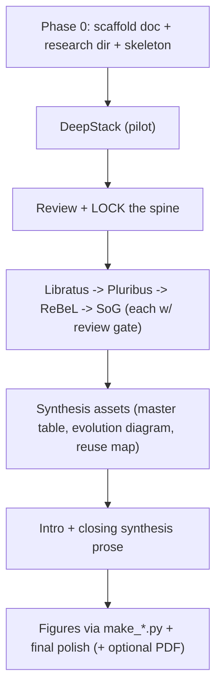

# Step 6 Chapter — Working Plan (living document)

> This is the single source of truth for building the Step 6 chapter. It is meant to be
> read and updated as we go, so that **each system can be researched and drafted in a fresh
> context window** by reading only this file. Update the Progress Tracker and Changelog
> after every subtask.

---

## Goal & framing

Chapter 6 is the **keystone** of the 15-step study plan: the point where the fundamentals of
Steps 1-5 converge into the five canonical superhuman game-AI systems, studied at an
**architectural** level (the math/algorithms live in their own technical chapters). The chapter
balances in-depth, PhD-level treatment of each system with a condensed, comparable structure so
the pros/cons and the evolutionary arc stand out. Steps 7-15 then build on the gaps identified
here.

The five systems (chronological / evolutionary order):

1. **DeepStack** (Moravcik et al., 2017)
2. **Libratus** (Brown & Sandholm, 2017/2018)
3. **Pluribus** (Brown & Sandholm, 2019)
4. **ReBeL** (Brown, Bakhtin, Lerer & Hu, 2020)
5. **Student of Games / SoG** (Schmid et al., 2023)

Depth-Limited Solving (Brown & Sandholm, 2018) is intentionally **not** a system; it appears only
as the connective theory referenced in the intro/synthesis.

---

## Progress tracker

Statuses: `pending` / `in-progress` / `awaiting-review` / `approved`.

| # | Subtask | Status | Notes |
|---|---------|--------|-------|
| 0 | Scaffold: folders + `summaryEn.md` skeleton | approved | done; research/ stubs + summary skeleton in place |
| 1 | DeepStack (**PILOT** — validate & lock the spine) | approved | Spine v2 locked & section approved (scorecard on top, +Compute & +Legacy, no glossary, hand-off moved to next section's intro); APPROVED-HIGHLIGHT wrapper added |
| 2 | Libratus | approved | section approved & wrapped in `APPROVED-HIGHLIGHT`; `research/libratus.md` filled (cited); Spine v2 reconfirmed for systems #3–#5; DeepStack + Libratus now both serve as worked examples |
| 3 | Pluribus (lean on talks/secondary sources) | approved | section approved & wrapped in `APPROVED-HIGHLIGHT`; `research/pluribus.md` filled (cited); Spine v2 holds unchanged; DeepStack + Libratus + Pluribus now all serve as worked examples |
| 4 | ReBeL (PBS focus) | approved | section approved & wrapped in `APPROVED-HIGHLIGHT`; `research/rebel.md` filled (cited); author-name correction (Gong, not "Hu") + arXiv:2007.13544 verified; Spine v2 holds; DeepStack + Libratus + Pluribus + ReBeL now all serve as worked examples |
| 5 | Student of Games (GT-CFR focus) | approved | section approved & wrapped in `APPROVED-HIGHLIGHT`; `research/student_of_games.md` filled (cited); FINAL system; PoG→SoG rename + ReBeL-author cross-check verified; the only "Perfect-info too? = YES" row; lands the arc + tees up synthesis. **All five per-system sections now complete.** |
| 6 | Synthesis assets (master table, evolution diagram, component-reuse map) | awaiting-review | master *matrix* replaced by an evolution-*delta* table per review steer (no hardline comparison; scorecards already carry per-dimension data); Figures 6.6 (evolution diagram) + 6.7 (component-reuse map) added as descriptive placeholders (Phase 8) |
| 7 | Intro + closing synthesis prose | awaiting-review | Intro (keystone framing, arc-as-trades, three axes, depth-limited solving as connective theory, opponent-blindness forward pointer) + Synthesis prose (the arc / what carries forward / why-this-matters tied to C1–C3 with hidden-benefit threads 1–3 baked in and 4–12 written compactly as trim candidates / open-problems hand-off to Steps 7–15) |
| 8 | Figures (`make_*.py`) + final polish (+ optional PDF) | awaiting-review | all 7 figures (6.1–6.7) generated via matplotlib `make_*.py` scripts in `summary/`, matching Step 5's box/arrow style; placeholders replaced with pandoc image refs; `step06_en.pdf` built (45 pages, all figures embedded); final prose polish still pending review gate |

---

## Process: review gates & the DeepStack pilot

- **Review gate after every subtask.** Each row above ends with an explicit STOP: present the
  result, wait for review/approval, then proceed. No batching ahead.
- **DeepStack is the pilot.** It is the test case for the spine (you already know it well). After
  the DeepStack section is drafted, the template is treated as provisional and **iterated against
  expectations** before applying it to the remaining four systems. Agreed changes are written back
  into "The per-system template" below so later systems inherit the finalized structure.

---

## Output target & conventions

- Single English document at `deliverables/reports/step06/summary/summaryEn.md` (Bulgarian
  deferred, mirroring Step 5).
- Mirror the style of `deliverables/reports/step05/summary/summaryEn.md`:
  - YAML frontmatter (title/subtitle/author/date/lang/vars).
  - Breadth-first academic prose; **light math** (architectural, not derivations).
  - **No `>` glossary call-outs** (dropped during the DeepStack pilot — define key terms inline, briefly).
  - Markdown comparison tables.
  - Figures via `make_*.py` scripts emitting PNGs into `summary/`, referenced with pandoc
    `{width=...}` attributes. **During drafting, each figure is left as a descriptive placeholder
    (a self-contained build spec in the prose); the PNGs + `make_*.py` are produced in Phase 8
    (subtask #8).** (Decision confirmed during the DeepStack pilot.)
  - `APPROVED-HIGHLIGHT` HTML wrapper marking finished/approved sections.
- Source material to draw on first:
  - `planning/rawStepsBg/step_06_end_to_end_game_ai.md` (richest: per-system block diagrams,
    comparison tables, key-insight notes — in Bulgarian).
  - `planning/cleanSteps/step_06_end_to_end_game_ai.md` (condensed English).

---

## The per-system template (the spine)

Applied identically to all five so comparisons pop, with one flexible deep-dive slot for
system-specific depth. **Spine v2 — locked; DeepStack pilot approved.** Changed from the original provisional
8-point list: old items 1+2 merged, old items 6+7 merged, the
per-system scorecard moved to the top, a *Compute & accessibility* and a *Legacy & modern relevance*
subsection added, figures rendered as descriptive placeholders, light math capped at ~one equation, and no
`>` glossary call-outs. Section order as drafted:

0. **Opening (bridge + identity) + "At a glance" scorecard** — for systems #2–#5, open with a 1–2 sentence
   **bridge from the previous system** (what it left open / the weakness this one targets — the forward
   hand-off lives *here*, at the start of the next section, not at the end of the prior one), then a 2–3
   sentence identity paragraph (authors, game, one-line "what if...?" hook, headline result). System #1
   (DeepStack) has no predecessor and opens with identity only. Immediately followed by the per-system
   scorecard table (the
   master-table row: Players, Game type, Blueprint?, Neural component, Search mechanism, Abstraction?,
   Perfect-info too?, Compute, Key innovation; year sits in the heading). The scorecard orients the reader
   before the prose; the synthesis (subtask #6) aggregates these rows rather than re-deriving them.
1. **The gap it closed** — the conceptual question *and* the predecessor limitation that motivated the system
   (carries the evolution narrative). For system #1 the "gap" is against the whole prior paradigm.
2. **Architecture** — offline vs online; where neural nets, CFR/MCCFR, and search sit; a **descriptive figure
   placeholder** (a self-contained build spec; rendered in Phase 8).
3. **Key innovation — deep dive** *(the one flexible-length slot, where depth lives)*, at architectural depth;
   light math capped at ~one signature equation.
4. **Caveats, dead-ends & what the paper under-describes** *(priority section)* — engineering compromises,
   approaches tried/abandoned/changed, and what the paper relegates to the supplement.
5. **Compute & accessibility** — where the cost concentrates (offline vs online) and one sentence on how
   accessible a from-scratch build is/was; feeds the scorecard's Compute row and a synthesis comparison.
6. **Strengths and limitations** — pros and cons together. The forward hand-off is *not* here; it opens the
   next system's section instead (see item 0).
7. **Legacy & modern relevance** — extrapolate the core idea: how it maps to current AI/ML, which subsystems
   are reusable today, and whether the system is obsolete or a living stepping stone.

### Pilot spine feedback — resolved (folded into the spine above)

Agreed on the DeepStack pilot: merge old items 1+2 and 6+7, move the scorecard to the top, rename the caveats
subsection, cap light math at ~one equation, treat figures as descriptive placeholders, and **drop glossary
call-outs**. Added by request: a **Compute & accessibility** subsection and a **Legacy & modern relevance**
subsection (extrapolating each system's ideas to current AI/ML — reusable vs superseded; stepping-stone vs
living). Final tweak: the **forward hand-off moves out of each section's end into the *next* section's opening
bridge** (item 0), so a section closes on "Legacy & modern relevance" and its successor opens by bridging from
it. **DeepStack pilot approved; Spine v2 locked for systems #2–#5.**

---

## Per-system research protocol (gather before writing)

For each system, before drafting, collect into `deliverables/reports/step06/research/<system>.md`:

- Primary paper(s) + the supplementary refs listed in the step file.
- Author talks / blogs cited in the source (Noam Brown talks, Yannic Kilcher SoG interview, Meta
  ReBeL blog, Science articles).
- Secondary/third-party deep-dives — especially for systems whose papers are thin on architecture
  (Pluribus).
- Extract: component breakdown, design decisions, abandoned approaches, compute/cost, evaluation
  setup, known criticisms, and **modern relevance / reusable ideas** (how the core ideas map to current
  AI/ML; what is reusable vs superseded; obsolete vs living stepping stone).
- Cite every source inline so prose claims are traceable.

---

## Project file orientation for new agents (what to read / skip)

The repo is a large PhD workspace; most of it is irrelevant to writing this chapter. Read in this
priority order and ignore the rest.

### MUST READ (in order)
1. **This file** (`CHAPTER_PLAN.md`) — the spec, the spine, the tracker, the resume steps.
2. **`summary/summaryEn.md`** — the chapter in progress (skeleton + any approved sections). This is
   what you edit.
3. **The Step 6 source content** (the raw study-step this chapter distills):
   - `planning/cleanSteps/step_06_end_to_end_game_ai.md` — English, condensed: objectives,
     methodology, the five-system framing.
   - `planning/rawStepsBg/step_06_end_to_end_game_ai.md` — Bulgarian, **richest**: per-system
     architecture block diagrams, the filled comparison tables, and "key insight" notes. Mine it
     for content/structure; render the insights in English.
4. **`../step05/summary/summaryEn.md`** — the **style reference** to imitate: prose voice, light
   math, figure handling (`make_*.py` + `{width=...}`), and the `APPROVED-HIGHLIGHT` wrapper. Match this
   register; do not copy its content. (Exception: Step 6 **drops** the `>` glossary call-outs — define terms
   inline.)
5. **`research/<system>.md`** for the system you are writing — pre-seeded primary sources + the
   extraction template. Fill it (with web research) before writing prose.

### SKIM / REFERENCE ONLY IF NEEDED
- `deliverables/terminology_EN_BG.md` — translation/glossary dictionary; use it to keep term
  usage consistent and to source glossary call-outs.
- `CLAUDE.md` — repo conventions (step naming, figure paths, build commands). Touch only for
  figures/PDF mechanics.
- `PLAN.md` — only the thesis-contribution framing (Contributions 1-3) for the synthesis hand-off.
  NOTE: §4.7 describes a literal one-page summary; this chapter deliberately follows the **Step 5
  broadened-survey precedent** (a full multi-part chapter), not the one-pager.

### IGNORE (not needed to write this chapter)
- `implementation/` — no code component in this step.
- `interactiveStudy/`, `docs/` — the web viewer and its built output.
- `scripts/` — only relevant in Phase 4 (figures / PDF build).
- `oldSources/`, `deliverables/reports/ruseMay/`, other steps' reports, `planning/rawSteps/`
  (English raw — `rawStepsBg` is richer and `cleanSteps` covers the English structure).

### Expectation
Web research is part of the job: pull the primary papers, author talks, and blogs (links are
seeded in each `research/<system>.md`), extract architectural detail + caveats + abandoned
approaches, cite sources in the notes, then write prose.

## File / folder layout (everything for this chapter in one place)

```
deliverables/reports/step06/
  CHAPTER_PLAN.md            <- this living plan (the entry point for any fresh session)
  research/
    deepstack.md
    libratus.md
    pluribus.md
    rebel.md
    student_of_games.md
  summary/
    summaryEn.md             <- the chapter being written
    make_*.py                <- figure-generating scripts
    *.png                    <- generated figures
```

---

## How to resume in a fresh context window

1. Open this file (`CHAPTER_PLAN.md`).
2. Find the first row in the Progress Tracker that is not `approved`.
3. Read "The per-system template" (it is the finalized spine after the DeepStack pilot).
4. Do the research first -> write notes into `research/<system>.md` (cite sources).
5. Draft that system's section in `summary/summaryEn.md` using the template.
6. Set the row to `awaiting-review`, update the Changelog, and STOP for review.

---

## Workflow (visual)



---

## Scope notes

- English only this pass; Bulgarian deferred.
- Architectural mindset throughout; defer derivations/proofs to the technical chapters and cite
  them.
- Caveats / evolution / abandoned-approach detail is a first-class goal, not an afterthought.

---

## Changelog

- _(init)_ Plan created. Awaiting go-ahead for Phase 0 scaffolding + DeepStack pilot.
- _(Phase 0)_ Scaffolding built: `summary/summaryEn.md` skeleton (frontmatter + intro/5-system/synthesis stubs) and `research/{deepstack,libratus,pluribus,rebel,student_of_games}.md` note stubs. DeepStack pilot is next, to be run in a fresh session.
- _(Phase 0+)_ Added "Project file orientation for new agents" (MUST READ / SKIM / IGNORE lists) so fresh sessions orient quickly without scanning the whole repo.
- _(Subtask #1 — DeepStack pilot, awaiting review)_ Web-researched DeepStack from the primary paper + its supplementary materials (and confirmed the Libratus hand-off facts); filled `research/deepstack.md` with a fully-cited extraction (architecture, design decisions, abandoned/under-described approaches, compute, evaluation, criticisms, master-table row). Drafted the DeepStack section in `summary/summaryEn.md` applying the provisional 8-point spine in the Step 5 register. **Decision:** figures are descriptive placeholders during drafting, rendered in Phase 8. Spine-change proposals recorded for the review gate. Row 1 → `awaiting-review`; STOP for review.
- _(Subtask #1 — pilot iteration after review)_ Locked **Spine v2** per review: merged old items 1+2 and 6+7, moved the per-system scorecard to the top, renamed the caveats subsection, capped light math at ~one equation, made figures descriptive placeholders, and **removed glossary call-outs**. Added two requested subsections — **Compute & accessibility** (where cost concentrates + an accessibility sentence) and **Legacy & modern relevance** (ReBeL/SoG lineage, CICERO, test-time-compute framing; reusable vs superseded) — to the DeepStack section, and extended `research/deepstack.md` with matching sources + a "Modern relevance / legacy" section. Still `awaiting-review` for final sign-off before Libratus.
- _(Subtask #1 — pilot APPROVED)_ Final pilot tweak: **removed the in-section forward hand-off** from DeepStack (subsection is now "Strengths and limitations") and moved that bridging role to the **opening of the next system's section** (spine item 0 updated; each of systems #2–#5 now opens with a 1–2 sentence bridge from its predecessor). Wrapped the approved DeepStack section in the `APPROVED-HIGHLIGHT` div, recorded the **no-glossary** convention in the conventions + orientation lists, and set row 1 → `approved`. **Spine v2 is locked**; Libratus (subtask #2) is next, to run in a fresh session.
- _(Subtask #2 — Libratus, awaiting review)_ Web-researched Libratus from the primary *Science* paper (full text), the longer IJCAI-17 systems paper, the NeurIPS-17 safe/nested subgame-solving paper, and Sandholm's CMU course notes; filled `research/libratus.md` with a fully-cited extraction (three-module architecture, the augmented-subgame / Estimated-Maxmargin theory + the ≤2Δ bound, the abstraction + improved-MCCFR blueprint, compute breakdown, the Baby Tartanian8 head-to-head + 147 mbb/g human result, caveats, modern relevance, and the Pluribus hand-off). Drafted the **Libratus section** in `summary/summaryEn.md` applying **locked Spine v2** with the approved DeepStack section as the worked example: opening bridge-from-DeepStack + identity + "At a glance" scorecard (same 9-row schema), then gap / architecture (descriptive Figure 6.2 placeholder) / key-innovation deep-dive (nested safe subgame solving; one signature equation, the ≤2Δ bound mirrored against DeepStack's k₁ε) / caveats / compute & accessibility / strengths & limitations / legacy & modern relevance. Key cross-system threads emphasized: Libratus = the *opposite* cure to DeepStack's (repair the abstraction paradigm vs discard it), **no neural network anywhere**, real-time-search-beats-bigger-blueprint (test-time-compute foreshadowing), and the head-to-head win DeepStack never reported. **Not** wrapped in `APPROVED-HIGHLIGHT` (added only on sign-off). Row 2 → `awaiting-review`; STOP for review. Next: Pluribus (subtask #3), in a fresh session.
- _(Subtask #2 — Libratus APPROVED)_ Reviewer approved all changes with no revisions. Wrapped the Libratus section in the `APPROVED-HIGHLIGHT` div, flipped its header comment to APPROVED, and set row 2 → `approved`. **Spine v2 holds unchanged** (no template edits triggered by this section). DeepStack and Libratus now both stand as worked examples of the spine for the remaining systems. Pluribus (subtask #3) is next, to run in a fresh session — note the plan's guidance to **lean on author talks / secondary sources** because the Pluribus paper is thin on architecture; the predecessor bridge is in `research/libratus.md` "Hand-off → Pluribus".
- _(Subtask #3 — Pluribus, awaiting review)_ Did the research first, then wrote. Because the *Science* paper is thin on architecture, leaned on the **supplementary materials** (the real architecture: abstraction sizes, the `MCCFR-P` negative-regret-pruning algorithm, the nested-search algorithm, the four continuation strategies, unsafe-search-from-round-start, AIVAT, hardware, per-participant table), Noam Brown's framing, the **CMU 15-888 Lecture 14** slides, the Meta AI blog, and the two companion papers (**NeurIPS-18** depth-limited solving / Modicum; **AAAI-19** Linear/Discounted CFR). Filled `research/pluribus.md` with a fully-cited extraction (every template section + the master-table row). **Correction recorded:** the `arXiv:1911.07559` link seeded for Pluribus in `planning/rawStepsBg` (and copied into the old research stubs) is **wrong** — Pluribus has no arXiv version; the relevant Brown–Sandholm arXiv IDs are 1809.04040 (Linear CFR) and 1805.08195 (depth-limited solving). Also flagged that "modified RBP" = the **modified negative-regret (regret-based) pruning** (`MCCFR-P`), not "Real-time Blueprint Pruning". Drafted the **Pluribus section** in `summary/summaryEn.md` applying **locked Spine v2** with the approved DeepStack + Libratus sections as worked examples: opening bridge-from-Libratus + identity + "At a glance" scorecard (same 9-row schema), then gap / architecture (descriptive **Figure 6.3** placeholder) / key-innovation deep-dive (depth-limited search + k=4 continuation strategies; **one** signature equation — the no-regret limit `R_iᵀ/T → 0` that certifies safety only in 2p0s) / caveats / compute & accessibility / strengths & limitations / legacy & modern relevance. Key cross-system threads emphasized: Pluribus takes Libratus's **two-player** open problem (not the neural one); **Nash is neither unique nor a safety guarantee** with >2 players, so the goal shifts from "find a Nash equilibrium" to "empirically beat humans"; **depth-limited search vs Libratus's solve-to-the-end**; the famous **~$150 / one-server** cost vs Libratus's supercomputer; and the **deliberate absence of any N-player safety guarantee = Contribution 2's target**. The forward hand-off to **ReBeL** is *not* in this section (it opens ReBeL's section in subtask #4; bridge material seeded in `research/pluribus.md` "Hand-off → ReBeL"). **Not** wrapped in `APPROVED-HIGHLIGHT` (added only on sign-off). Row 3 → `awaiting-review`; STOP for review. Next: ReBeL (subtask #4), in a fresh session.
- _(Subtask #3 — Pluribus APPROVED)_ Reviewer approved with no revisions. Wrapped the Pluribus section in the `APPROVED-HIGHLIGHT` div, flipped its header comment to APPROVED, and set row 3 → `approved`. **Spine v2 holds unchanged** (no template edits triggered by this section). DeepStack, Libratus, and Pluribus now all stand as worked examples of the spine for the remaining systems. ReBeL (subtask #4) is next, to run in a fresh session — PBS focus; the predecessor bridge is in `research/pluribus.md` "Hand-off → ReBeL" (the *generalization* gap Pluribus left open — still tabular/abstraction-based — plus its reliance on *unsafe* search with no guarantee).
- _(Subtask #4 — ReBeL, awaiting review)_ Did the research first, then wrote. Web-researched ReBeL from the **primary paper** (arXiv:2007.13544 / NeurIPS-2020 proceedings — incl. the PBS conversion §4, Theorem 1 = infostate values as a supergradient of the PBS value function, Algorithm 1 = the self-play RL+search loop, Theorem 2 = value-net error O(1/√T), **Theorem 3 = the safe-search / recovered-Nash bound**, the HUNL + Liar's Dice + TEH experiments, the head-to-head + Dong Kim results, and **Appendix D** = the domain knowledge deliberately dropped + **Appendix E** = the GPU compute), the **Meta AI ReBeL blog** (the referee/PBS intuition + the modified-RPS failure of naïve search), the **open-source repo** (Liar's Dice released; poker withheld), and **Noam Brown's ReBeL talk**. Filled `research/rebel.md` with a fully-cited extraction (every template section + the master-table row). **Corrections recorded** (per the brief's warning not to trust the planning files' framing): (1) the fourth author is **Qucheng Gong**, *not* "Hu, Q." as `planning/rawStepsBg`, `planning/cleanSteps`, and this plan's intro state — verified against arXiv, the NeurIPS proceedings, the Meta AI research page, and ML Anthology's BibTeX; correct citation is **Brown, Bakhtin, Lerer & Gong (2020)**; (2) ReBeL trains on **GPUs** (full HUNL ≈ 90 DGX-1 nodes × 8 V100 for data generation) — a sharp contrast with Pluribus's CPU-only ~$150 — while CFR itself runs on a single CPU thread and play is < 2 s/hand. Drafted the **ReBeL section** in `summary/summaryEn.md` applying **locked Spine v2** with the approved DeepStack + Libratus + Pluribus sections as worked examples: opening bridge-from-Pluribus + identity + "At a glance" scorecard (same 9-row schema) / gap / architecture (descriptive **Figure 6.4** placeholder, deferred to Phase 8) / key-innovation deep-dive (PBS + learned PBS value/policy nets + CFR run in belief space; **one** signature equation — the recovered-Nash bound ε = δC₁ + δC₂/√T, mirroring DeepStack's k₁ε + k₂/√T, Libratus's 2Δ, Pluribus's no-regret limit) / caveats / compute & accessibility / strengths & limitations / legacy & modern relevance. Key cross-system threads emphasized: ReBeL **returns to 2p0s and recovers the guarantees Pluribus gave up** while **eliminating abstraction *and* the blueprint** (the crutches Libratus *and* Pluribus relied on); PBS makes values well-defined and **formalizes/generalizes DeepStack's belief-conditional values**; "AlphaZero for imperfect information" (RL+search at train *and* test time); CFR-not-MCTS because 2p0s belief games are convex; "far less domain knowledge" = **no card/info abstraction** (Appendix D); **GPU training vs Pluribus's CPU $150**; and the **open-sourced** Liar's Dice code (accessibility contrast with the closed Libratus/Pluribus). Scorecard "Players" nuance stated precisely (guarantees are 2p0s even though the algorithm generalizes). Forward hand-off to **Student of Games** is *not* in this section (it opens SoG's section in subtask #5; bridge seeded in `research/rebel.md` "Hand-off → Student of Games"). **Not** wrapped in `APPROVED-HIGHLIGHT` (added only on sign-off). Row 4 → `awaiting-review`; STOP for review. Next: Student of Games (subtask #5), in a fresh session.
- _(Subtask #4 — ReBeL APPROVED)_ Signed off. Wrapped the ReBeL section in the `APPROVED-HIGHLIGHT` div, flipped its header comment to APPROVED, and set row 4 → `approved`. **Spine v2 holds unchanged** (no template edits triggered by this section). DeepStack, Libratus, Pluribus, and ReBeL now all stand as worked examples of the spine. The author-name correction (fourth author = **Qucheng Gong**, not "Hu") and the GPU-training contrast (vs Pluribus's CPU-only ~$150) are recorded in `research/rebel.md` + the section header. **Student of Games (subtask #5) is next and is the FINAL system**, to run in a fresh session — GT-CFR focus; the predecessor bridge is in `research/rebel.md` "Hand-off → Student of Games" (ReBeL is 2p0s-guaranteed and pitched as imperfect-information-only, with a PBS that blows up where common knowledge is scarce; SoG unifies perfect- AND imperfect-information play via Growing-Tree CFR).
- _(Subtask #5 — Student of Games, awaiting review)_ Did the research first, then wrote — using **all four** approved sections (DeepStack, Libratus, Pluribus, ReBeL) as the worked examples of the template. Web-researched SoG from the **primary paper** (Schmid et al. 2023, *Science Advances* 9(46), eadg3256; arXiv:2112.03178 — full Results + Materials & Methods: the FOSG/PBS setup, GT-CFR's regret-update + expansion phases, the CVPN, modified continual re-solving, sound self-play, **Theorem 1** = GT-CFR convergence and **Theorem 2** = continual-re-solving soundness, and the chess/Go/HUNL/Scotland-Yard + Leduc results), the **Yannic Kilcher / Martin Schmid author interview** (the GT-CFR intuition — "AlphaZero + DeepStack in one algorithm", "expand the tree, improve the policy", the two named limitations), the **VentureBeat** piece (Schmid quote + TPUv4), **the-decoder**, and the **OpenSpiel** ecosystem. Filled `research/student_of_games.md` with a fully-cited extraction (every template section + the master-table row). **Bibliographic corrections recorded** (per the brief's warning — do NOT trust the planning files): (1) arXiv:2112.03178 was **first posted in 2021 as "Player of Games (PoG)"** and **renamed "Student of Games (SoG)"** for the 2023 *Science Advances* publication — same paper, same 13 authors, same DOI; the Kilcher interview + VentureBeat use the PoG name (noted in the section header + research notes); (2) the SoG paper's **own reference list cites ReBeL as "Brown, Bakhtin, Lerer & Gong"**, independently confirming the subtask-#4 "Gong, not Hu" correction. Drafted the **Student of Games section** in `summary/summaryEn.md` applying **locked Spine v2**: opening **bridge-from-ReBeL** (what ReBeL left open: imperfect-info-only / merely *reduces* to AlphaZero / fixed depth-limited subgame / test-time search tied to training) + identity + "At a glance" scorecard (same 9-row schema) / gap / architecture (descriptive **Figure 6.5** placeholder, deferred to Phase 8) / key-innovation deep-dive (**GT-CFR**: incremental tree growth via the two alternating phases + the CVPN at the frontier + sound self-play + the `k=1`/`k=∞` switch that makes one search reduce to MCTS-like on perfect-info and CFR-like on imperfect-info; **one** signature equation — **Theorem 1**, exploitability ≲ |F|ε + |N|UA/√T, mirroring DeepStack's k₁ε + k₂/√T, Libratus's 2Δ, Pluribus's no-regret limit, and ReBeL's δC₁ + δC₂/√T, with Theorem 2's (5D+2) game-length factor in prose) / caveats / compute & accessibility / strengths & limitations / legacy & modern relevance. Key threads emphasized: SoG is the **only "Perfect-info too? = YES"** system — it **unifies perfect- AND imperfect-information play in a single algorithm** (chess, Go, HUNL poker, Scotland Yard), stated precisely (one search/network/loop; soundness covers both classes; guarantees remain **2p0s**, so unifying *information structure* ≠ unifying *player count*); the **generality-vs-peak-performance** trade-off (weaker than AlphaZero, esp. Go — lost 99.5%); the **Alberta lineage** (Bowling, Moravčík, Burch, Schmid — shared with DeepStack) vs ReBeL's FAIR lineage; **TPU-scale, AlphaZero-matched compute** (no Pluribus-style $-figure) and the **closed flagship on an open OpenSpiel substrate**; relation to **MuZero** (the known-model gap) and **CICERO** (beyond 2p0s). As the **FINAL** system there is **no forward hand-off**: the Legacy subsection **lands the chapter's three-arc architecture** and **tees up the synthesis** (subtask #6: master table, evolution diagram, component-reuse map) + the thesis hand-off to Steps 7–15 (Contribution 1 = enrich PBS with opponent-type beliefs; Contribution 2 = the multi-agent safety gap SoG's 2p0s-only guarantee re-states). **Not** wrapped in `APPROVED-HIGHLIGHT` (added only on sign-off). Row 5 → `awaiting-review`; STOP for review. Next (after sign-off): Synthesis assets (subtask #6) — the per-system sections are now complete.
- _(Subtask #5 — Student of Games APPROVED)_ Signed off. Wrapped the Student of Games section in the `APPROVED-HIGHLIGHT` div, flipped its header comment to APPROVED, and set row 5 → `approved`. **Spine v2 holds unchanged** (no template edits triggered by this section). **All five per-system sections (DeepStack, Libratus, Pluribus, ReBeL, Student of Games) are now complete and approved.** The PoG→SoG rename and the SoG-paper cross-check of the ReBeL authorship ("Brown, Bakhtin, Lerer & Gong") are recorded in `research/student_of_games.md` + the section header. **Synthesis assets (subtask #6) are next**, to run in a fresh session — the master comparison table, the evolution diagram, and the component-reuse map, aggregating the five scorecards rather than re-deriving them; the open-problems / Steps 7–15 hand-off is seeded in each section's "Legacy & modern relevance" (esp. SoG's: unification of information structure ≠ multi-agent safety, the Contribution 2 gap; PBS enrichment with opponent-type beliefs, the Contribution 1 seed).
- _(Subtasks #6 + #7 — Intro + Synthesis, awaiting review)_ Drafted both bookend sections in one pass, after a planning discussion that set the brief: **progression over comparison** ("how things progressed," not a hardline model ranking), **research-context relevance**, and **hidden benefits**. **Intro** (`## Introduction`, replacing the stub): keystone framing (Steps 1–5 converge here → Steps 7–15 build on the gaps); the five systems as a 7-year arc read as *deliberate trades, not a leaderboard* (DeepStack vs Libratus = opposite cures; Pluribus gains players but drops safety + stays tabular; ReBeL returns to 2p but recovers safety + goes neural; SoG unifies game classes but loses peak strength); the **three axes** (abstraction→neural; offline→real-time search; imperfect-only→unified); **depth-limited solving as connective theory, explicitly not a sixth system**; and a light forward pointer to the chapter's defining limitation for this thesis — **opponent-blindness**. **Synthesis** (`## Synthesis`, replacing the stub): (a) *The arc in one read* — non-monotone progression prose + an **evolution-delta table** ("what each added / gave up"), which **replaces the planned master comparison matrix** per the review steer (the per-system scorecards already carry the per-dimension data) + **Figure 6.6** evolution-diagram placeholder; (b) *What carries forward* — component-reuse prose (Step 3 CFR/MCCFR, Step 4 abstraction, Step 5 neural value/policy nets + the chapter-native primitives) + **Figure 6.7** component-reuse-map placeholder; (c) *Why this matters for our research* — opponent-blindness as the dissertation's motivating negative space, then C1 (PBS substrate + the two baked hidden benefits: PBS gives *sound-search infra for free*, and the *two-tier safe-base/adaptive-overlay* architecture), C2 (Pluribus's missing safety theorem + the baked *Nash-decay-as-license-to-exploit* reframe), C3 (exploitability yardstick + LBR-as-safety-test + AIVAT-as-instrument), followed by a compact *Further leverage points* bullet list (threads 4–12: reusable proof shape, depth-limited exploitation, build-vs-cite map, redirected self-improver, test-time-compute hook, consistency-as-safety, abstraction→type-space) explicitly flagged as **trim candidates** pending final length; (d) *Open problems + hand-off to Steps 7–15* (opponent-blindness, multiplayer safety, adaptation beyond the depth limit, real-time compute budgets → Phase D core, then Phases E–G). Both sections written in the approved register (dense prose, light math, no glossary call-outs, figures as Phase-8 placeholders) and **not** wrapped in `APPROVED-HIGHLIGHT` (added only on sign-off). Also fixed one now-stale forward reference in the approved SoG section ("master comparison table" → "evolution-delta table") so it matches the delivered synthesis. Rows 6 + 7 → `awaiting-review`; STOP for review. After sign-off, only Phase 8 remains (subtask #8: render `make_*.py` figures incl. 6.6/6.7 + final polish + optional PDF).
- _(Subtask #8 — Figures, awaiting review)_ Built all 7 figures (6.1–6.7) as `make_*.py` matplotlib scripts in `summary/`, reusing a shared `_diagram_utils.py` helper (box/arrow/panel primitives) so all figures share one visual language, matching Step 5's established box-and-arrow style (`deliverables/reports/step05/summary/make_*_figure.py`) rather than introducing a new HTML/screenshot pipeline. Each figure follows its build spec: 6.1 DeepStack (offline/online panels + shared highlighted CFV network), 6.2 Libratus (three stacked panels + feedback loop), 6.3 Pluribus (two panels + reused blueprint block), 6.4 ReBeL (training/play panels + shared PBS value/policy network + belief-state definition box), 6.5 Student of Games (GT-CFR search / sound self-play panels + shared CVPN + footer strip), 6.6 evolution arc (three-axis timeline with lineage arrows + per-system capability tags), 6.7 component-reuse map (12-row × 5-column grid with origin stars + staircase). All placeholder HTML-comment+blockquote blocks in `summaryEn.md` replaced with pandoc image references; stale "deferred to Phase 8" prose mentions cleaned up. Rebuilt `step06_en.pdf` (45 pages, 1.36 MB, all 7 images confirmed embedded via page inspection). Row 8 → `awaiting-review`; STOP for review — final prose polish and sign-off still pending.
