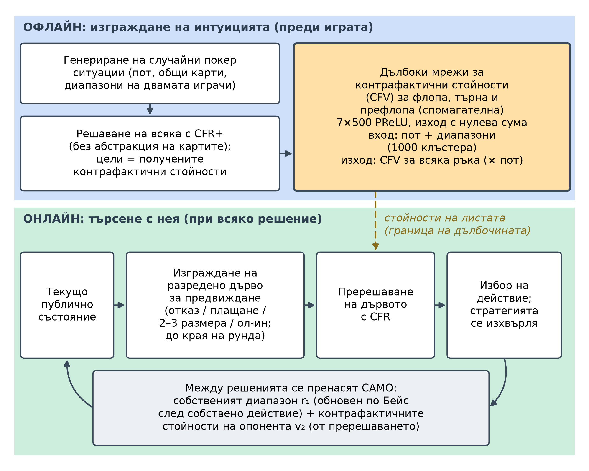
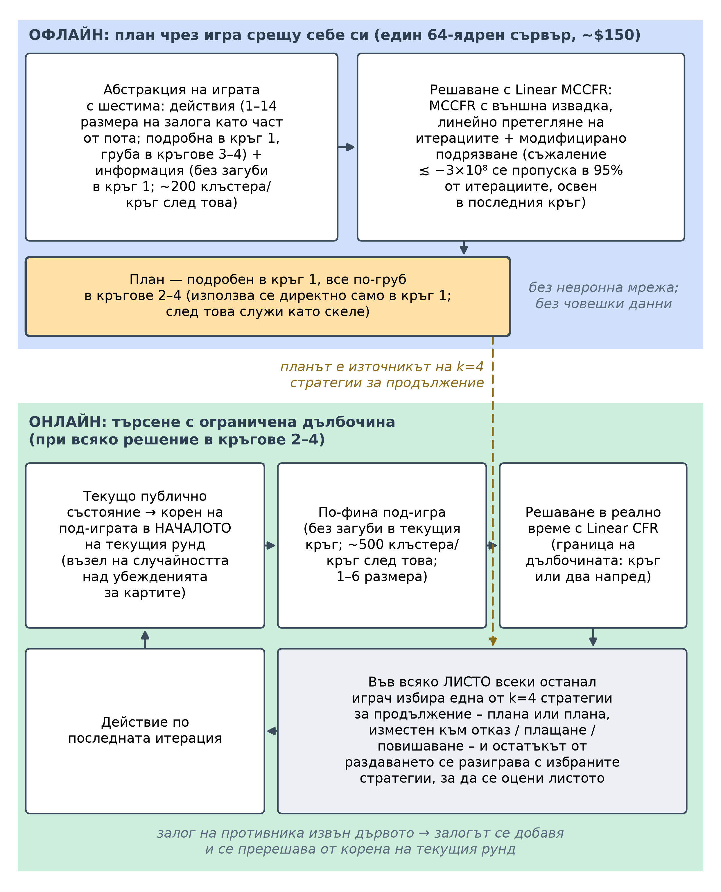
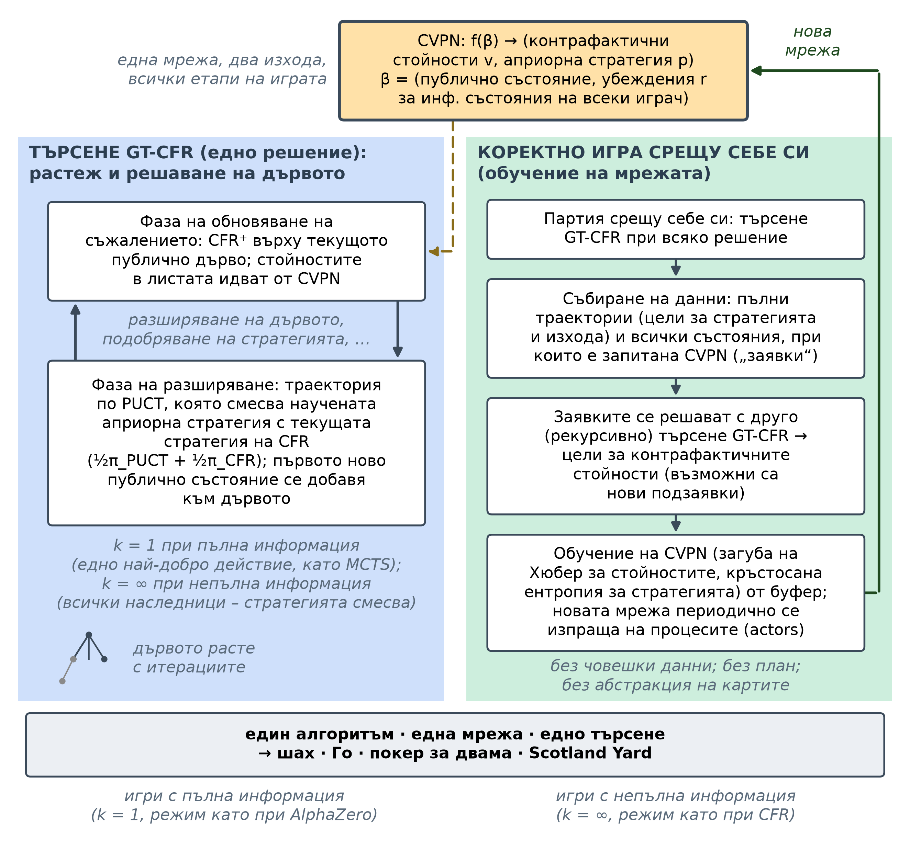

# Глава 6 – Архитектури на игрови изкуствен интелект от край до край

<!--
SKELETON / WORK IN PROGRESS.
Build order and the per-system template (the "spine") are defined in ../CHAPTER_PLAN.md.
Each system section follows the same template so cross-system comparison stands out.
Wrap finished/approved sections in the APPROVED-HIGHLIGHT markers (see Step 5 summary).
-->

<!-- INTRODUCTION - drafted (subtask #7), awaiting review. Written last, per the plan, after all five
systems were approved. Progression-first framing (the arc as trade-offs, not a leaderboard); the three axes;
depth-limited solving as connective theory (not a system); a light forward pointer to the dissertation's
direction (opponent-blindness + the safety gap), with the heavy thesis tie-in deferred to the Synthesis.
Not wrapped in APPROVED-HIGHLIGHT until sign-off. -->

## Въведение

Глава 6 е крайъгълният камък на този изследователски план. Глави 1–5 изграждат поотделно съставните елементи – игровотеоретичния речник на игрите в разгърната форма и равновесията на Наш, минимизирането на контрафактичното съжаление (CFR) и неговите **варианти на Монте Карло**, абстракцията на играта и невронните апроксиматори на функции, които заменят табличното съхранение, когато една игра го надрасне – и тази глава е мястото, където тези елементи се сглобяват в пълноценни системи от състезателно ниво. Подходът е умишлено **архитектурен**: вместо да се извеждат отново математическите зависимости, които са представени в техническите глави и цитираните статии, всяка система се разглежда на нивото на това как е *изградена* – какво изчислява **офлайн**, какво изчислява в **реално време**, къде е обучението и какво всъщност може да гарантира. Всеки раздел започва с кратка обобщаваща таблица по едни и същи девет измерения, така че системите да се сравняват с един поглед, а текстът след това проследява дизайнерските решения, инженерните компромиси и изоставените подходи зад тях.

Петте системи обхващат седем години и, прочетени в ред, проследяват еволюцията на свръхчовешкия игрови изкуствен интелект: **DeepStack** (2017), **Libratus** (2017/2018), **Pluribus** (2019), **ReBeL** (2020) и **Student of Games** (2023). Изкушаващо е да се прочете такъв списък като класация – всяка следваща по-силна от предишната – но това нито се е случило, нито така е организирана тази глава. Прогресията е последователност от *умишлени компромиси*: всяка система придобива нова способност, като се отказва от нещо друго, а най-показателните моменти са тези, в които областта прави странична стъпка или дори отстъпление. **DeepStack** и **Libratus** са почти съвременници, които предлагат *противоположни решения* на едно и също заболяване – **DeepStack** изоставя парадигмата „абстракция и план“, която доминираше в компютърния покер близо две десетилетия, докато **Libratus** я запазва и лекува единствения ѝ фатален недостатък с решаване на под-игри в реално време, което е доказуемо безопасно. **Pluribus** след това пробива *бариерата на броя играчи*, достигайки свръхчовешка игра с шестима участници, но само като се отказва изцяло от гаранции за безопасност и остава изцяло табличен. **ReBeL** се връща към двама играчи, но прави огромен скок в обобщаването – научавайки стойности на състоянието на убеждението с игра срещу себе си в стила на **AlphaZero**, премахвайки както абстракцията, така и плана, и *възстановявайки* безопасността, от която **Pluribus** се беше отказал. **Student of Games**, като завършек, обединява игра с пълна и непълна информация в един алгоритъм – и плаща за тази широта с пикова сила, губейки решително от специализиран **AlphaZero** в Го. Прочетена по този начин, главата е изследване на цената на всеки напредък, а не класация на победители.

Под отделните компромиси три оси на движение преминават през всичките пет системи и придават гръбнака на главата. Първата ос е **на представянето**: преходът от ръчно изградена *абстракция* – групиране на подобни ръце и допускане само на няколко размера залози – към *научено невронно приближение*, при което мрежата обобщава ситуации, които таблица никога не би могла да изброи. Втората е **времева**: преходът от *решаване на цялата игра офлайн* в съхранена стратегия към *научаване на компактен модел и търсене с него в реално време*, така че изчислението се извършва в момента на вземане на решение, а не е предварително заложено. Третата ос се появява едва в самия край, със Student of Games: обединяването на игра с **пълна и непълна информация** в един коректен алгоритъм, съчетаващ двете големи традиции на игровия изкуствен интелект – линията минимакс / търсене в дърво по метода Монте Карло / AlphaZero и линията CFR / покер – които са се развивали по отделни пътища в продължение на седемдесет години. Първите две оси описват четирите покер системи; третата е това, което прави петата завършек на главата.

Една идея свързва тези нишки и заслужава да бъде назована преди самите системи, именно защото тя *не е* една от тях: **ограничено по дълбочина решаване**. Формализирано от Brown, Sandholm & Amos (2018)[^brown2018dls], то е принципът, че може да се търси само малко напред в игра с непълна информация и остатъкът да се замести с *научена или предварително изчислена стойност* – при условие че заместването се извършва така, че скритата информация да не го прави невалидно. Това е теорията, която поставя в обща рамка непрекъснатото пререшаване на **DeepStack** и вложеното решаване на под-игри на **Libratus**, която стои в основата на стратегиите за продължение на **Pluribus** и която, във формата на състояние на убеждението, се превръща във вътрешния цикъл на **ReBeL** и **Student of Games**. Ние го разглеждаме като свързваща тъкан – споменавано навсякъде, където една система го реализира – а не като шеста точка, защото ограниченото по дълбочина решаване е механизмът, *чрез който* всъщност действа оста „от офлайн изчисление към търсене в реално време“.

Накрая, тъй като тази глава е връзката между основите на глави 1–5 и изследванията върху моделирането на противника и експлоатацията в глави 7–12, си струва още в началото да се посочи единствената нишка, към която синтезът се връща. Всяка система тук е, по умишлен дизайн, **„сляпа“ за противника**: всяка изчислява стратегия, която е трудна за побеждаване *в най-лош случай* и след това я прилага без да обръща внимание кой всъщност седи срещу нея – Pluribus дори не знае самоличността на своите опоненти, а и той, и Libratus съзнателно избягват да ги моделират или да се адаптират към тях – защото отклонението с цел експлоатация може да бъде контраексплоатирано и, по думите на авторите на Pluribus, защото съществуващите техники за експлоатация на противника „изискват твърде много наблюдения, за да се конкурират с човешките способности извън малките игри“; и двете статии посочват консервативната (безопасна) експлоатация като единствено изключение.[^pluribus][^libratus] Този подход, поставящ устойчивостта на първо място, е голямата сила на областта и, за дисертация относно *адаптивна* игра, нейното определящо ограничение: именно отчитането на конкретния противник, което тези системи пропускат, глави 7–12 се стремят да добавят. Затова главата завършва не с победител, а със синтез – карта на това, което петте системи споделят, какво всяка от тях е жертвала и къде всъщност се намират откритите проблеми, които мотивират останалата част от тази работа.

## DeepStack (2017)

<!-- PILOT SECTION - APPROVED (subtask #1). This section locked Spine v2 (see ../CHAPTER_PLAN.md): scorecard
on top; gap / architecture / key-innovation / caveats / compute & accessibility / strengths & limitations /
legacy & modern relevance; figures = descriptive placeholders; no glossary call-outs; the forward hand-off
opens the NEXT section, not this one. -->
<!-- APPROVED-HIGHLIGHT START (temporary; remove before final build) -->

DeepStack (Moravčík et al., 2017)[^deepstack], от компютърно-покер групата на Университета на Алберта с колаборатори в Прага, беше първата програма, която побеждава професионални покер играчи в безлимитния тексаски Холдем за двама (HUNL) – професионалисти, макар и не специалисти по HUNL – със статистическа значимост и първата, която поставя евристичното търсене – двигателят зад шахмата и Го – на теоретична основа в игра с непълна информация. В рамките на четириседмично проучване той победи група от 33 професионалисти с 492 хилядни от големия блайнд на раздаване (mbb/g, стандартната единица за темп на печалба в покера; 50 mbb/g представлява значително професионално предимство) в 44 852 раздавания и нито една известна техника не успя да открие пропуск в играта му. Неговият водещ *какво-ако* въпрос е този, който рамкира цялата тази глава: **може ли програма да играе покер по начина, по който AlphaGo играе Го – търсейки локално от текущата ситуация и доверявайки се на научена функция на стойността за всичко извън хоризонта – дори когато в покера самата ситуация е частично скрита?**

| С един поглед | DeepStack (2017) |
|--|------|
| Играчи | 2 (един срещу един) |
| Тип игра | HUNL – безлимитен тексаски Холдем за двама (игра за двама с нулева сума) |
| План (офлайн)? | Не – офлайн обучението е за мрежите за стойност, а не за съхранена стратегия |
| Невронна компонента | Дълбоки мрежи за контрафактични стойности (за флопа, търна и спомагателна); само стойности |
| Механизъм за търсене | Непрекъснато пререшаване (ограничено по дълбочина предвиждане с CFR при всяко решение) |
| Абстракция? | Никаква абстракция не ограничава играта; групиране в 1000 клъстера само на входа на мрежата, плюс разреден набор от залози и групиране на действията на ривъра при предвиждането |
| Също и с пълна информация? | Не (само непълна информация) |
| Изчислителни разходи | Предимно офлайн (~175 процесорни ядро-години за генериране на целите на мрежата за търна); по време на игра работи на един GPU, < 5 s/решение |
| Ключова иновация | Непрекъснато пререшаване + научени контрафактични стойности: първото *коректно* евристично търсене за игри с непълна информация |

: DeepStack (2017) накратко.

### Пропускът, който запълни

Всеки предишен етап в развитието на изкуствения интелект за игри – табла, шах, Го – се основаваше на *локално търсене*: от текущата позиция се разглеждат няколко хода напред и останалото се замества с евристична стойност. Тази рецепта предполага, че позицията е известна, а покерът нарушава това предположение – правилното действие зависи от вероятностното разпределение на скритите карти на опонента, което се разкрива единствено чрез неговите залози, а те от своя страна зависят рекурсивно от това какво той предполага за вашите карти. Отвореният въпрос, който DeepStack се опита да реши, е дали евристичното търсене може да бъде направено *коректно* при наличие на скрита информация в мащаба на HUNL – игра с приблизително $10^{160}$ точки на решение – сравнима по обем с Го, но с непълна информация.

Почти две десетилетия доминиращият отговор беше нещо съвсем различно: **абстракция плюс офлайн равновесие плюс транслация**. Свийте $10^{160}$ ситуациите на HUNL до приблизително $10^{14}$ абстрактни такива чрез групиране на подобни ръце (*абстракция на карти*) и позволяване само на няколко размера залози (*абстракция на действията*), решете тази по-малка игра офлайн с минимизиране на контрафактичното съжаление (CFR), за да произведете пълна стратегия – *план* – съхранете я и в момента на играта *транслирайте* всяка реална ситуация и залог на опонента към най-близката абстрактна. Компресията е със загуби и загубата се проявява като експлоатируемост – колко може да спечели опонент в най-лошия случай, основният показател за качество в областта, нула при равновесие на Наш. През 2015 г. основаната на абстракция програма Claudico загуби от професионалисти с 91 mbb/g,[^deepstack] а проверка с локален най-добър отговор (LBR, ефективно изчислима долна граница на експлоатируемостта) по-късно показа, че топ състезателните ботове са експлоатируеми с повече от 3000 mbb/g – четири пъти по-зле, отколкото ако се откажеш от всяка ръка.[^lbr] Плановете също бяха огромни (една стратегия без абстракция на картите отне около 2 TB и 14 процесорни ядро-години за изчисляване и все още беше *експлоатируема* чрез залози извън дървото), а стъпката на транслацията сама по себе си беше източник на слабост.[^deepstack] DeepStack затваря тази празнина, като изоставя цялата конструкция: никога не изгражда абстракция на цялата игра и никога не съхранява план, разсъждавайки за всяка ситуация *така както тя действително възниква* и замествайки само далечното остатъчно продължение на играта с научена оценка.

### Архитектура

DeepStack се разделя ясно на **офлайн** фаза, в която се изгражда интуицията, и **онлайн** фаза, в която с нея се търси (вж. фигурата по-долу).[^deepstack]

{width=95% fig-pos="H"}

Офлайн системата генерира милиони случайни покер ситуации и ги решава с CFR решавач, за да получи целеви *контрафактични стойности* – условни „какво-ако“ печалби за всяка възможна ръка – и тези двойки (ситуация → стойност) обучават **дълбоките мрежи за контрафактични стойности (CFV мрежи)**. Онлайн DeepStack не използва план: между отделните решения той запазва само два вектора – своя *диапазон* (разпределението върху възможните ръце, които може да държи) и *контрафактичните стойности* на опонента – а при всеки ход изпълнява CFR върху малко дърво за предвиждане, вкоренено в истинското текущо състояние, като използва CFV мрежата за изчисляване на стойностите на листата на границата на дълбочината. Тъй като CFR вече изчислява както диапазоните, така и контрафактичните стойности, той се вписва по естествен начин в този цикъл.

Това е евристично търсене с три компонента: коректно изчисляване на локална стратегия (непрекъснато пререшаване), предвиждане с ограничена дълбочина, при което научената функция на стойността замества останалата част от играта, и ограничен набор от действия за предвиждане, който поддържа всяко решаване бързо. Невронната мрежа се използва *само* на границата на дълбочината като оценител на листата; търсенето се извършва от CFR; и – най-важното – в цикъла не се прилага абстракция на цялата игра.

### Ключова иновация: непрекъснато пререшаване с научени контрафактични стойности

Приносът на DeepStack е в обединяването на две идеи, като всяка от тях прави другата осъществима.

Първата е **непрекъснатото пререшаване**: възстановяване на свежа локална стратегия при всяко решение въз основа на поддържания диапазон и вектора на контрафактичните стойности на опонента, след което тя се изхвърля, така че агентът никога не съхранява или не се ангажира с глобална стратегия. Класическото пререшаване (Burch и др., 2014) показва, че за да се възстанови стратегия за под-игра, не е необходима цялата стратегия – достатъчни са само собственият диапазон при влизане в под-играта и векторът на контрафактичните стойности на опонента. DeepStack избутва това до предела: той *никога* не съхранява стратегия за цялата игра. Всеки път, когато трябва да действа, той пререшава текущото публично състояние въз основа на тези два вектора, извършва едно действие и изхвърля стратегията.[^burch2014]

Всичко това е възможно благодарение на начина, по който се поддържат двата вектора. След всяко събитие DeepStack актуализира своите два вектора по прости правила: при **собствено действие** той заменя пререшените контрафактични стойности за избраното действие и извършва байесови актуализации на своя диапазон; при **случайно събитие** той заменя стойностите на тази карта и анулира вече невъзможните ръце; а при **действието на опонента** той не прави *абсолютно нищо*. Този последен момент е тихият майсторски ход: тъй като той проследява *стойностите* на опонента, а не неговия *диапазон*, и никога не се нуждае от конкретното действие на опонента, за да поддържа тези стойности, той заобикаля стъпката на транслация на действията, която парализира ботовете, основани на абстракция. Опонентът може да направи всеки залог с всякакъв размер; DeepStack просто пререшава от състоянието, което този залог е произвел.

Втората идея е **научената мрежа за контрафактични стойности** – „интуицията“ на DeepStack. В игра с пълна информация оценителят на листо съпоставя едно състояние към едно число; при непълна информация той трябва да съпостави *цяло публично състояние плюс диапазоните и на двамата играчи* към *вектор* от контрафактични стойности, по една за всяка ръка, защото стойностите в един възел се променят с диапазоните, които достигат до него. DeepStack научава това съпоставяне с мрежа с право разпространение от седем скрити слоя с по 500 неврона, приемайки размера на пота и двата диапазона (компресирани в 1000 клъстера от ръце) като вход и извеждайки контрафактични стойности за всяка ръка като части от пота. Специален външен слой налага ограничението за нулева сума: той формира двете имплицитни стойности на играта от диапазоните и суровите изходи и изважда половината от тяхната сума, така че оценките да са взаимно съгласувани, а цялата мрежа да остане диференцируема. С тази мрежа, която доставя стойности в края на текущия рунд за залози, ограничението по дълбочина свива пререшаваната игра от $10^{160}$ до най-много $10^{17}$ точки на решение, а описаният по-долу разреден набор от действия – до около $10^{7}$ - достатъчно малко, за да бъде решена за по-малко от пет секунди на един GPU.

Сдвояването е доказуемо коректно.[^deepstack] Ако грешката на мрежата за стойности е най-много $\epsilon$, а пререшаването изпълнява $T$ итерации на CFR, експлоатируемостта на получената стратегия е ограничена от

$$ \text{експлоатируемост} \;<\; k_1\,\epsilon \;+\; k_2/\sqrt{T}, $$

с игрово-специфични константи $k_1, k_2$. Първият член представлява цената на несъвършената интуиция, а вторият – обичайната **сходимост на CFR**. Тази граница е теоретичното ядро на статията – гаранцията, че евристичното **търсене** може да бъде пренесено в условия на **непълна информация**, без **стратегията** да стане **експлоатируема** – и същият шаблон „**ограничено по дълбочина решаване** плюс научена **стойност**“, формализиран допълнително от Brown, Sandholm & Amos през следващата година, е в основата на всяка система в тази глава.

### Уговорки, задънени улици и какво статията не описва

Чистият разказ по-горе представлява основния текст, докато инженерната реалност се съдържа в приложението, където именно акцентът върху „ограниченията и еволюцията“ оправдава своето място.

Най-важната забележка е, че **внедрената система не е тази, за която важи теоремата**. За да играе с човешка скорост, DeepStack ограничава своето предвиждане до разреден набор от залози (отказ, плащане, два или три размера на залога, ол-ин) и в статията ясно се посочва, че това „отменя свойството на коректност на Теорема 1“. Така гаранцията на внедрената система е емпирична – подкрепена от резултатите LBR по-долу – а не доказана. Второ отклонение утежнява това: доказателството за коректност предполага стойности на *най-добър отговор*, но DeepStack всъщност използва стойности от *игра срещу себе си*, които нямат теоретично обоснование, но са били по-малко експлоатируеми в ранните тестове. Доказаният алгоритъм и печелившият алгоритъм, строго погледнато, са различни алгоритми.

Абстракцията също така се промъква в периферията. DeepStack рекламира, че не използва абстракция на карти за ограничаване на играта – но *групира* ръцете в 1000 клъстера на входа на мрежата за стойности и на ривъра изцяло се отказва от мрежата, решавайки до края на играта, като използва **абстракция на действия с клъстери** за постигане на управляемост. За да ускори пререшаването, той също така започва от **предварителна оценка** на диапазона на опонента (warm start), в консервативна комбинация през повечето време, но в агресивен вариант (когато действа пръв), който „жертва гаранциите за пререшаване, когато оценката на диапазона на опонента е грешна“. И префлопът, далеч от евтин, изисква изброяване на всички 22 100 възможни флопове чрез флоп мрежата, смекчено единствено чрез кеширане на повтарящи се последователности от залагания. И накрая, изборът на приспособление за пререшаване (приспособлението CFR-D пред алтернативата с максимален марж) е направен, защото то „се представи по-добре в ранните тестове“, а не е изведено – и, отразявайки Глава 5, полезната дълбочина на мрежата беше ограничена от данните, а не от архитектурата, като грешката при валидиране се изравняваше след петия слой при бюджет от десет милиона проби. Нито едно от тези не подкопава резултата, но заедно те показват, че заглавието „коректно търсене без абстракции“ е стремеж, който имплементацията приближава, а не постига.

### Изчислителни разходи и достъпност

Разходите на DeepStack са почти изцяло **офлайн и почти изцяло в решаването с CFR, чрез което се получават целевите стойности за мрежите** – не в обучението на невронна мрежа и не във времето за игра. Генерирането на целите означаваше приблизително решаване на милиони случайни под-игри: само **мрежата за търна** изразходва около **175 процесорни ядро-години** на 6 144-ядрен клъстер, като **флоп мрежата** добави приблизително половин **GPU-година** на 20 GPU; за разлика от това, самите мрежи се обучиха за около два дни всяка на един GPU и по време на игра DeepStack работи на **един стандартен GPU с под пет секунди на решение**.[^deepstack] Формата на тази сметка е истинският урок: „интуицията“ се купува веднъж, предварително, чрез грубо **намиране на равновесие**, след което внедряването е евтино – огледален образ на система, чиито разходи идват главно от **изчисленията по време на изпълнение**. По отношение на достъпността това постави *от нулата* изграждането в обсега само на добре осигурена лаборатория по онова време (**предварителните изчислителни разходи** са в мащаба на клъстер), въпреки че обучената система след това работеше на хардуер, който всеки ентусиаст притежава; десетилетие по-късно тези **предварителни изчислителни разходи** са много по-поносими на стандартни **облачни изчисления** и с по-бързи съвременни програми за решаване, а публична референтна имплементация на **Ледюк Холдем** допълнително намалява бариерата за влизане.

### Силни страни и ограничения

Централната сила на DeepStack е **коректност с ниска експлоатируемост**: това е първият метод за търсене при непълна информация с реална гаранция, като емпирично LBR – което излага състезателните ботове като губещи хиляди mbb/g – не успява да намери начин да го победи, а самото то губи от DeepStack над 350 mbb/g.[^deepstack] Той **не изисква абстракция на цялата игра и транслация на действия**, така че залозите на опонента извън дървото се обработват точно, без закръгляне; неговата **времеемкост на играта е скромна**; и той се обучава **без човешки данни и с минимални експертни познания**. Допълнително предимство е оценъчната синергия – функцията на стойността на DeepStack съвпада с изискванията на оценяващия метод за намаляване на дисперсията AIVAT, като намалява стандартното отклонение в човешките проучвания с 85% и прави постигането на значимост възможно само в няколко хиляди раздавания.

Ограниченията определят дневния ред за останалата част от главата. DeepStack е приложим **само в игри за двама с нулева сума**; неговата **коректност** се основава на тази структура. Той запазва **рядка абстракция на залозите** при предвиждането и **абстракция на действията** на ривъра, както и наследява **грешка на приближението на мрежата за стойности** (член $k_1\epsilon$), най-голяма на флопа, където разчита най-много на мрежата. Той плаща **високите предварителни изчислителни разходи**, отбелязани по-горе, и **пререшава от нулата** при всяко решение, като е валидиран единствено срещу хора и LBR – никога в директен сблъсък срещу най-силните ботове, основани на абстракция.

### Наследство и съвременна значимост

Отстранете специфичните за покера детайли и основната идея на DeepStack е **търсене с ограничена дълбочина с научен модел на стойност в листата, адаптиран към скрита информация** – аналогът при непълна информация на търсенето с насочване по стойност зад AlphaGo и AlphaZero. Тази идея не остаря и не беше забравена; тя се превърна в шаблон. Brown, Sandholm & Amos формализираха **теорията на решаването с ограничена дълбочина** през следващата година[^brown2018dls], а парадигмата след това беше обобщена в пълни **рамки за обучение с подкрепление и търсене**: ReBeL (2020)[^brown2020rebel] преформулира научаването на стойността на листата около публични състояния на убежденията със **игра срещу себе си в стила на AlphaZero**, а Student of Games (2023)[^sog] – който споделя няколко автори с DeepStack – обедини **игра с пълна и непълна информация** в един алгоритъм. Същата „рецепта за **планиране в цикъл с научен модел на стойност**“ по-късно достигна отвъд **покера за двама с нулева сума**, например в играта на Diplomacy на човешко ниво от CICERO.[^cicero2022] Още по-широко, DeepStack е ранен и чист пример за принципа, който сега е централен за водещия изкуствен интелект: **изразходвайте изчисления в момента на вземане на решение чрез търсене, насочвано от научена интуиция, вместо да вграждате всичко в една гигантска предварително изчислена стратегия** – същата теза за „**изчисления по време на изпълнение**“ (test-time compute) зад днешните **модели за разсъждение**, с уточнението на самата област, че непълната информация се нуждаеше от търсене, *отчитащо убежденията*, именно защото обикновеното **търсене в дърво на Монте Карло**, което работи за Го, не работи за покер.

Няколко конкретни подсистеми остават използваеми и днес: самият **шаблон „ограничена дълбочина плюс научена стойност на листо“**; **диференцируемият изходен слой, който налага условието за нулева сума** в мрежите за стойности за двама играчи; **намаляване на дисперсията в стил AIVAT**, което превръща научен модел на стойност в контролна променлива за нискодисперсна оценка на всеки стохастичен агент; и малкият, но преносим трик да се изразяват стойностите като **части от пота** за обобщаване, инвариантно спрямо мащаба. Това, което е наистина остаряло, е ръчно проектираната техника *около* идеята – клъстеризацията по метода на k-средните с 1000 клъстера, отделните мрежи за всеки рунд, ръчно настроеното пререшаване – които по-общите научени представяния на ReBeL и Student of Games заменят. Честната оценка: **като внедрена покер система DeepStack е остарял, но далеч не е просто стъпало** – неговата централна парадигма спечели и сега е основна; а за тази конкретна дисертация неговото състояние (диапазон, контрафактични стойности на опонент) и границата на разпространение на грешката са директни семена за базирано на убеждения моделиране на опонента (**принос 1**) и анализ на безопасната експлоатация (**принос 2**).

<!-- APPROVED-HIGHLIGHT END -->

## Libratus (2017/2018)

<!-- SECTION - APPROVED (subtask #2). Applies locked Spine v2 (see ../CHAPTER_PLAN.md), mirroring the approved
DeepStack section: scorecard on top; gap / architecture / key-innovation / caveats / compute & accessibility /
strengths & limitations / legacy & modern relevance; figures = descriptive placeholders; no glossary call-outs;
the forward hand-off opens the NEXT (Pluribus) section, not this one. -->
<!-- APPROVED-HIGHLIGHT START (temporary; remove before final build) -->

DeepStack отговори на своето *какво-ако*, като изостави парадигмата „абстракция и план“, но все пак запази рядка абстракция на залозите в собственото си предвиждане и никога не беше изпитан в директен двубой срещу най-силните по-ранни ботове или срещу специалисти по HUNL в дълъг и строго проведен мач. Libratus (Brown & Sandholm, 2017; Carnegie Mellon)[^libratus] – на латински *балансиран*, както в приближаване към равновесие на Наш, и *силен*, заради мощната си игра – беше създаден независимо и обявен същата година, и направи противоположния залог: запази парадигмата „абстракция и план“ и излекува единствения ѝ фатален недостатък. Неговият водещ въпрос е огледален образ на този на DeepStack: **какво ще стане, ако решим груб план на цялата игра офлайн, след това го *поправим в реално време* там, където абстракцията е твърде груба – с доказуема гаранция, че поправката никога няма да ни направи по-експлоатируеми?** През януари 2017 г. Libratus стана първата програма, която победи най-добрите човешки специалисти по HUNL в дълъг мач, побеждавайки четирима професионалисти със 147 mbb/g (хилядни от големия блайнд на раздаване, единицата за темп на печалба от предишния раздел; ~50 mbb/g е значително професионално предимство) в 120 000 раздавания при 99,98% значимост – и, за разлика от DeepStack, първо победи убедително в директен двубой най-добрия дотогава изкуствен интелект за покер.

| С един поглед | Libratus (2017/2018) |
|--|------|
| Играчи | 2 (един срещу един) |
| Тип игра | HUNL – безлимитен тексаски Холдем за двама (игра за двама с нулева сума) |
| План (офлайн)? | Да – абстрахирана стратегия за цялата игра, решена офлайн с MCCFR (подробна в началото, груба в края) |
| Невронна компонента | Няма – чисто табличен CFR / абстракция (без невронни мрежи никъде) |
| Механизъм за търсене | Вложено безопасно решаване на под-игри (решаване в реално време на късната игра с CFR+ и преизпълнение за всеки залог на противника извън дървото) |
| Абстракция? | Да – абстракция на карти (търн/ривър, само в плана) + асиметрична абстракция на действията; вътре в под-игрите в реално време отпада изцяло (*без абстракция на картите*) |
| Също и с пълна информация? | Не (само непълна информация) |
| Изчислителни разходи | Високи и офлайн, *и* онлайн: ~25 милиона процесорни ядро-часа на свръхкомпютъра Bridges; ~50 възела и десетки секунди за всяко късно решение; без GPU |
| Ключова иновация | План + вложено в реално време *безопасно* решаване на под-игри + самоусъвършенстване: точни, доказуемо безопасни отговори на залози извън дървото вместо транслация на действия |

: Libratus (2017/2018) накратко.

### Пропускът, който запълни

Предишният раздел очерта парадигмата, която **DeepStack** отхвърли – абстракция плюс офлайн равновесие плюс транслация – и посочи нейния фатален недостатък. **Libratus** се насочва точно към този недостатък, без да отхвърля парадигмата. Планът се решава предварително върху *фиксирано* меню от размери на залози; по време на игра всеки залог на противника, който не е в това меню, се *транслира* – закръгля се до най-близкия размер, който ботът познава – след което ботът отговаря така, сякаш противникът е направил закръгления залог. Това закръгляне е единствената най-голяма експлоатируема слабост в покера, основан на абстракция: проверка с локален най-добър отговор показа, че водещите състезателни ботове губят хиляди mbb/g от най-лошия възможен противник, а през 2015 г. предшественикът на **Libratus** – **Claudico** – загуби първия мач *Brains vs. AI* срещу професионалисти с 91 mbb/g, отчасти защото опонентите можеха да усетят и накажат неговите граници на транслация.[^ganzfried2016reflections]

Концептуалният въпрос, на който **Libratus** отговаря, следователно е по-тесен и по-целенасочен в сравнение с този на **DeepStack**: *може ли парадигмата на абстракцията, съществуваща от десетилетия, да бъде издигната до свръхчовешко ниво чрез поправка единствено на поведението ѝ в реално време – а именно точното отговаряне на залози извън менюто вместо чрез закръгляне – и може ли тази поправка да се извърши с гаранция, че локалните корекции никога не увеличават глобалната експлоатируемост?* Отговорът е тримодулната архитектура по-долу. Докато **DeepStack** премахна напълно плана и разчиташе на научена оценъчна функция, **Libratus** запазва плана като евтин скелет и добавя решавач в реално време, който, когато противникът излезе извън дървото, изгражда и решава по-фина под-игра *съдържаща действителния залог* и вплита резултата обратно в плана. Същата година тогава предложи две противоположни решения на един и същ проблем – едно невронно и без план, друго таблично и базирано на план – и **Libratus** е доказателството, че по-старата парадигма, правилно поправена, все още беше достатъчна, за да достигне свръхчовешка игра.

### Архитектура

Libratus представлява конвейер от три модула, които функционират на три различни времеви мащаба – **офлайн** (преди мача), **онлайн** (при всяко вземане на решение) и **през нощта** (между отделните дни на игра) – и, за разлика от всички останали системи в тази глава, той не съдържа **никаква невронна мрежа** (вж. фигурата по-долу).[^libratus]

{width=95% fig-pos="H"}

**Модул 1 – планът (офлайн).** Libratus първо компресира приблизително $10^{161}$ точки на решение на HUNL (статията на DeepStack закръгля същия брой до $10^{160}$) до около $10^{12}$ чрез два вида абстракция: *абстракция на действията*, която запазва само дискретно меню от размери на залозите (главно кръгли дроби и кратни на пота, взети от размерите, предпочитани от водещите конкурентни ботове, с няколко ранни размера, настроени чрез алгоритъм за оптимизация на параметри), и *абстракция на карти*, която групира стратегически сходни ръце.[^libratusijcai] От решаващо значение е, че **не се използва абстракция на карти в първите два рунда на залагане** – достатъчно малки, за да се позволи пълна резолюция – а се групират само търнът и ривърът, и то дори там единствено в плана. След това тази абстрактна игра се решава чрез игра срещу себе си с усъвършенстван **метод Монте Карло за минимизиране на контрафактичното съжаление (MCCFR)**, който вероятностно премахва клонове с много отрицателно съжаление, което представлява приблизително трикратно ускорение и също така тихо отстранява патология на абстракциите с непълна памет, при която няколко различни ситуации споделят стратегията на един клъстер и „се борят“ за нея. Резултатът е **планът**: пълна, но неравномерна стратегия – детайлна в началото, груба в края – чиито стойности от късните рундове се използват не за игра, а единствено за *оценяване на стойността на достигане до под-игра*.

**Модул 2 – вложено безопасно решаване на под-игри (онлайн).** Libratus използва плана само в ранните кръгове. При достигане на третия рунд за залози – или всяка по-ранна точка, където останалата част от раздаването е достатъчно малка – той изоставя грубия план за късната игра и вместо това **изгражда нова, по-финозърнеста под-игра без абстракция на карти и я решава в реално време** с високо оптимизиран **CFR+** (бърз, детерминистичен вариант на CFR). Така всяко раздаване се играе поотделно в късната игра. Определящата характеристика е това, което се случва, когато противникът направи залог, който не фигурира в менюто на плана: вместо да го закръгли, Libratus решава нова под-игра, която *съдържа точно този залог*, и повтаря това за всяко следващо действие извън менюто – *вложено* решаване на под-игри. Този модул е обект на разглеждане в следващия подраздел.

**Модул 3 – модулът за самоусъвършенстване (през нощта).** Тъй като решаването в реално време се пропуска в първите два рунда (решаването толкова рано само по себе си би изисквало тежка абстракция), залозите на противника извън менюто *там* все още се закръглят. Модулът за самоусъвършенстване стеснява тази остатъчна слабост между игралните дни: той събира най-често използваните от противниците размери на залозите извън менюто, избира няколко от най-вредните пропуски, изчислява правилни игровотеоретични отговори на тях през нощта и присажда тези клонове в плана. Нарочно това **не е експлоатация на противника** – той никога не се опитва да моделира и наказва грешките на хората (което би изложило Libratus на контраексплоатация). Вместо това използва залозите на противниците единствено като насока *кои от собствените пропуски на Libratus да закърпи*, а закърпванията са универсални, подобрявайки играта срещу всеки бъдещ противник.

Класическите градивни елементи от по-ранните глави са на видно място: **абстракция на играта** и MCCFR изграждат **плана** офлайн, CFR+ извършва **решаването на под-игра** онлайн, а „търсене“ представлява **пререшаване в реално време** за всяко решение. Забележителното отсъствие – липсата на **мрежа за стойности**, на **мрежа на стратегията** и на каквото и да е научено чрез **градиентен спуск** – е архитектурният подпис, който отличава Libratus от всяка друга система в тази глава.

### Ключова иновация: вложено безопасно решаване на под-игри

Централният принос на Libratus е да направи **решаването на под-игра в реално време едновременно *безопасно* и *вложено*** – достатъчно силно, за да победи хората, и доказано неспособно да направи стратегията значително по-експлоатируема от плана, който усъвършенства. И двете прилагателни са важни и всяко от тях отстранява конкретен недостатък на по-ранните методи.

Трудността е в това, че под-игра с непълна информация *не може да бъде решена изолирано*. В шаха, когато се достигне ендшпил, той може да бъде решен самостоятелно, тъй като дъската е напълно известна. В покера правилната стратегия за една под-игра зависи от стратегиите в *други, недостигнати* под-игри, защото именно те определят разпределението на вероятностите за скритите ръце, които противникът може да държи тук. По-ранните програми за решаване в реално време заобикаляха това, като приемаха, че противникът е следвал плана до този момент – **небезопасно** решаване на под-игра – което противникът може лесно да накаже с отклонение, понякога произвеждайки усъвършенствана стратегия значително *по-лоша* от плана.

Libratus премахва това предположение с едно малко **приспособление**, *разширената под-игра*. В корена на под-играта на противника се предоставя избор за всяка ръка, която той може да държи: или да вземе фиксирана **алтернативна печалба** – оценката на плана за това колко струва тази ръка тук – или да *влезе* в детайлната под-игра и да я изиграе. Решаването на тази разширена игра принуждава усъвършенстваната стратегия на Libratus да направи противника **не по-добре от тази оценка за всяка възможна ръка**, което е точното значение на „безопасен“: локалната корекция не може да бъде експлоатирана спрямо плана, независимо какво прави противникът. Libratus изостря това с вариант, който авторите наричат **Estimated-Maxmargin** – той максимизира *най-малкия* резерв за безопасност по всички възможни ръце на противника – и с две усъвършенствания, които го правят силен, а не просто безопасен: той използва оценки на плана за стойностите на противника вместо консервативни **горни граници** (по-малко предпазлива игра) и *придава по-малка тежест на ръцете, които противникът би могъл да държи само ако е допуснал грешка по-рано* (безсмислено е да се защитаваш срещу ръка, която рационален противник никога не би довел до тази ситуация), освобождавайки капацитет за защита срещу ръцете, които той реалистично може да има.

Комбинацията идва с гаранция, която е паралелна на тази на DeepStack.[^brown2017] Ако $\sigma^{*}$ е най-малко експлоатируемата стратегия, която се различава от плана само в рамките на решените под-игри, а оценката на плана за стойностите на под-играта на противника има отклонение не повече от $\Delta$, тогава експлоатируемостта на усъвършенстваната стратегия се подчинява

$$ \text{експлоатируемост}(\sigma_{\text{усъв}}) \;\le\; \text{експлоатируемост}(\sigma^{*}) \;+\; 2\Delta. $$

Членът $2\Delta$ представлява цената на несъвършените оценки на стойностите и е структурно аналогичен на члена $k_1\epsilon$ в DeepStack – и двата определят колко една грешка в стойностите, подадени на решавача, може да повлияе върху експлоатируемостта в най-лошия случай. По този начин двете системи стигат до един и същи вид твърдение за коректност, но от противоположни посоки: $\epsilon$ при DeepStack е грешката на приближението на невронна мрежа при границата на дълбочината; $\Delta$ при Libratus е грешката на оценката на таблична схема при границата на под-играта.

„Вложено“ е втората половина. Вместо да разширява менюто за залози на плана (което би раздуло предварителното офлайн решаване), Libratus създава **отделен отговор на всеки залог извън менюто в реално време**: когато противникът направи залог с размер, който не е бил изброяван преди, той изгражда разширена под-игра, чиято алтернативна печалба е най-доброто *в менюто* действие, което противникът би могъл да предприеме вместо това, решава я и го прави отново за всеки следващ залог извън менюто по време на раздаването. В контролираните експерименти това превъзхожда предишния стандарт – закръгляне на залога до най-близкия размер в менюто – с повече от порядък по отношение на експлоатируемост в най-лошия случай (119 срещу 1465 mbb/g в докладвания тест с малки игри). И тъй като всяка под-игра се решава в движение, Libratus може също така да *променя собствените си размери на залозите* между раздаванията – той ги увеличава или намалява със случаен процент между 0 и 8% при първото решаване – така че хората никога не се сблъскват с фиксирана цел за анализ. Това е точният механизъм, чрез който най-слабото място на парадигмата на абстракцията, транслацията на действия, се отстранява от късната игра.[^brown2017]

### Уговорки, задънени улици и какво статията не описва

Както при DeepStack, ясната тримодулна структура прикрива къде всъщност се крие инженерната работа – и откровеността относно ограниченията – с изключение на това, че тук голяма част от нея дори не е в статията в *Science*, а в придружителната статия в IJCAI и в лекционните бележки на авторите.

Най-разкривателното ограничение е, че **само планът не е свръхчовешки – той дори не побеждава предишния бот**. Срещу Baby Tartanian8, победителя от състезанието през 2016 г., суровият план на Libratus не го побеждава (−8 ± 15 mbb/g при 95% доверителен интервал); едва когато вложеното решаване на под-игри беше включено, същата система спечели с 63 ± 28 mbb/g.[^libratus] С други думи, предварителната стратегия е скеле и по същество цялото предимство на Libratus идва от търсене в реално време – резултат, който тихо преформулира цялата система и предвещава обрата на областта към търсене по време на изпълнение.

Няколко други важни детайла си струва да се отбележат. **Транслацията на действия не е премахната, а само ограничена**: в първите два рунда на залагане Libratus все още закръгля залозите на опонента извън менюто, а целият модул за самоусъвършенстване съществува, за да работи върху този остатъчен проблем, по три „дупки“ на нощ, без никога да го отстранява напълно. **Безопасното решаване на под-игри трябваше да бъде преработено, за да стане изобщо приложимо** – в продължение на три години се смяташе за непрактично, тъй като в директен сблъсък учебниково-безопасното решаване губеше от теоретично необоснования *небезопасен* вариант; използването от страна на Libratus на стойностни *оценки*, а не консервативни *горни граници*, заедно с намаляването на значението на ръцете, които опонентът би държал само по грешка, направи безопасността конкурентна и дори тогава Libratus умишлено използва *небезопасен* метод за решаване веднъж, при първото си влизане в третия рунд, защото там е по-евтин и емпирично достатъчно добър. Изборът на **Estimated-Maxmargin** сам по себе си жертва малко теоретична чистота в полза на силата: използването на оценки вместо горни граници може по принцип да повиши експлоатируемостта *над* тази на плана, ограничена единствено от $2\Delta$ на теоремата. А абстракцията с непълна памет в основата означава, че няколко различни ситуации споделят една стратегия и „се борят“ за нея – известно изкривяване, което подрязването, базирано на съжаление, само частично смекчава. И накрая, **данните за изчислителните разходи почти липсват в основната статия**: водещата публикация по същество не дава никакви данни, а истинската цена (следваща) излиза наяве едва във вторичните източници, както и фактът, че **кодът никога не е бил публикуван**, оставяйки независимата проверка да се основава единствено на публикувания псевдокод.

### Изчислителни разходи и достъпност

Където сметката на DeepStack се плаща почти изцяло офлайн, а играта му е евтина, Libratus е **скъп и в двата края**. Проектът е консумирал приблизително **25 милиона процесорни ядро-часа** на свръхкомпютъра Bridges в Pittsburgh Supercomputing Center за една година – от които около 6 милиона са отишли за изграждане и решаване на плана, около 3 милиона за решаване на под-игри в реално време по време на мача, около 3 милиона за модула за самоусъвършенстване и останалите ~13 милиона за експериментални опити и оценка.[^libratusijcai] Оперативно изчисленията на плана са заемали приблизително 195 възела за периоди от една до осем седмици; всяко **решаване на под-игра в реално време е използвало около 50 възела и е отнемало порядък на десетки секунди**; модулът за самоусъвършенстване през нощта е работил върху до няколкостотин възела в продължение на часове; а стратегиите и моментните снимки са консумирали около 2,6 петабайта дисково пространство.[^sandholm2021] **Не са използвани нито графични процесори (GPU), нито обучение на невронни мрежи** – всеки ядро-час е изразходван за CFR или абстракция.

Формата на тази сметка носи поуката. Libratus не постига евтино внедряване чрез еднократно скъпо обучение, както прави DeepStack; неговите *изчислителни разходи по време на игра* сами по себе си са в мащаба на свръхкомпютър, защото силата произтича от решаването на нова под-игра при почти всяко късно решение. От гледна точка на достъпността това направи Libratus, както беше внедрен, по същество невъзможно да бъде възпроизведен извън голям център за свръхкомпютри както по време на обучението, така и по време на играта – много по-висока летва от агента на DeepStack с един GPU – а липсата на публикуван код подсили това. Основните техники са независими от приложението и работят значително по-евтино на днешния хардуер и с днешните програми за решаване, но артефактът от 2017 г. беше демонстрация на това, което е възможно при наличието на изобилни изчислителни ресурси, а не на това, което е широко достъпно.

### Силни страни и ограничения

Главното предимство на Libratus е **решителна, строго демонстрирана свръхчовешка игра**. Той е първият изкуствен интелект, който побеждава водещи специалисти по HUNL в дълъг мач – 147 mbb/g за 120 000 раздавания при 99,98% значимост, като побеждава всеки от четиримата професионалисти индивидуално – и, за разлика от DeepStack, той също така побеждава **предходния най-добър изкуствен интелект за покер в директен сблъсък** с 63 mbb/g, отделяйки своята сила от въпроса за човешкото умение. Основната му техника – **вложено безопасно решаване на под-игри** – е едновременно **доказуемо безопасна** ($2\Delta$ границата) и **емпирично с порядък по-малко експлоатируема** от транслацията на действия, която заменя, като не използва **човешки данни и никакви специфични за домейна знания**. Модулният дизайн сам по себе си е принос: евтин план, модул за решаване в реално време, който го коригира там, където е необходимо, и нощен цикъл, който закърпва собствените му слабости – всеки модул компенсира недостатъка на друг – като цялата система е с **устойчивост на първо място**, отказвайки да експлоатира опонентите, за да не бъде контраексплоатиран.

Ограниченията са също толкова ясни и подготвят останалата част от главата. Libratus е **само за игра за двама с нулева сума**; неговите гаранции за безопасност се опират на тази структура. Той остава **основан на абстракция** и все още **транслира залози извън менюто в ранните рундове**, което представлява експлоатируема слабост, която модулът за самоусъвършенстване само стеснява. Той не използва **никакво невронно обобщаване**: нищо не се прехвърля между ситуациите, планът е огромен (петабайти от съхранена стратегия), а времето за игра е в **мащаба на свръхкомпютър**, а не един GPU, както беше необходимо на DeepStack. Компромисът на Estimated-Maxmargin допуска малко, ограничено повишаване на експлоатируемостта в името на по-голяма сила; едно небезопасно решаване се промъква в конвейера и – тъй като както хората, така и изкуственият интелект се адаптираха по време на мача – дори значимостта в заглавието е, стриктно казано, „сякаш-независима“ стойност, въпреки че предимство от 147 mbb/g за 120 000 раздавания не оставя никакво реално съмнение.[^libratus]

### Наследство и съвременна значимост

Извадете абстракционния механизъм и трайната идея на Libratus е **търсене в реално време, насложено върху груба предварително изчислена стратегия, направено безопасно при скрита информация**: решавайте локалната ситуация точно в момента на вземане на решение, в съответствие с евтин глобален план, и реагирайте на това, което опонентът действително прави, а не на закръглено приближение на него. Тази идея не само оцеля – тя се превърна, заедно с непрекъснатото пререшаване на DeepStack, в половината от основата, върху която е изградена останалата част от главата. Вложеното безопасно решаване на под-игри на Libratus е пряк предшественик на търсенето в реално време в **Pluribus** (2019), то е обединено с пререшаването на DeepStack чрез теорията за **ограничено по дълбочина решаване**, публикувана от авторите през следващата година, и същият модел „усъвършенствайте глобална оценка на стойността с локално решаване“ се появява отново, сега с *научени* стойности, заменящи табличната схема, в **ReBeL** (2020).

Libratus е също така, в точен смисъл, **върхът на една парадигма, която областта след това изостави**. Той постигна свръхчовешка игра **без никакво дълбоко обучение** – чиста абстракция и CFR – и въпреки това последващите системи са всички невронни, защото ръчно създадената абстракция и петабайтовите планове нито се обобщават между ситуациите, нито се мащабират отвъд двама играчи. Честната оценка е, че Libratus е *надминат като архитектура, но оправдан като теза*: неговият залог, че **търсенето в реално време има по-голямо значение от по-голяма предварително изчислена стратегия**, беше напълно точен, дори когато залогът му върху табличната абстракция беше надминат. Тази първа теза оттогава се превърна в централна тема за най-напредналите системи с изкуствен интелект – наблюдението, че добавянето на търсене в момента на решението струва колкото 100 000-кратно мащабиране на предварителните офлайн изчисления, е ранен, конкретен пример за аргумента за „изчисления по време на изпълнение“ (test-time compute), който сега се прави за моделите за разсъждение,[^nunez2024] а разделянето план-тогава-търсене на Libratus предвещава съвременната рецепта предварително обучение и търсене.

Няколко подсистеми остават директно използваеми: **безопасно решаване на под-игри / на ендшпила** като начин за локално усъвършенстване на глобална стратегия *без да се нарушават нейните гаранции*; **помощната конструкция на разширената под-игра** – чистата конструкция „вземете известна алтернативна стойност или влезте в под-играта“ за закрепване на локално решение към глобална оценка на стойността; **подрязване, базирано на съжаление** за мащабиране на CFR; и моделът на **самоусъвършенстването**, който използва наблюдавана игра, за да открие и *поправи собствените си слабости*, вместо да експлоатира противника. Това, което наистина е остаряло, е заобикалящата го структура – ръчно настроената **абстракция на действията** и картите, много-петабайтовата **таблична схема** и внедряването с клъстер по време на игра – и всички те отпадат с научените представяния на по-късните системи. За настоящата дисертация Libratus дава две основи: неговата граница на експлоатируемостта при безопасно решаване на под-игри е шаблон за **безопасна експлоатация при грешка в стойността (Принос 2)**, а умишленият му отказ да експлоатира – „поправете собствените си слабости, не моделирайте противника“ – е точният контрапункт, спрямо който може да бъде дефинирана *ограничена, целенасочена* **адаптация към противника** (Принос 1).

<!-- APPROVED-HIGHLIGHT END -->

## Pluribus (2019)

<!-- SECTION - APPROVED (subtask #3). Applies locked Spine v2 (see ../CHAPTER_PLAN.md), mirroring the approved
DeepStack and Libratus sections: opening bridge-from-Libratus + identity + "At a glance" scorecard on top; gap /
architecture (descriptive Figure 6.3 placeholder) / key-innovation deep-dive / caveats / compute & accessibility
/ strengths & limitations / legacy & modern relevance; one signature equation; figures = descriptive
placeholders; no glossary call-outs; the forward hand-off opens the NEXT (ReBeL) section, not this one. Paper
thin on architecture -> leaned on the supplementary materials + author talks + secondary sources (cited in
../research/pluribus.md). -->
<!-- APPROVED-HIGHLIGHT START (temporary; remove before final build) -->

Libratus сложи точка на въпроса за безлимитния Холдем за двама, но неговите гаранции за безопасност – и всъщност самото значение на „решаването“ на играта – се основаваха на структурата на игра с нулева сума за двама играчи: там равновесието на Наш е непобедимо и решаването в реално време може да бъде доказуемо *безопасно* спрямо него. Холдемът, както хората всъщност го играят обаче, събира шестима. Pluribus (Brown & Sandholm, 2019; Carnegie Mellon и Facebook AI)[^pluribus] се изправи директно пред въпроса за игрите с много играчи: **какво се случва с рецептата план-плюс-търсене в реално време, когато махнете патерицата на игрите за двама и седнете на маса за шестима – обстановка, в която равновесието на Наш не е нито уникално, нито ефективно изчислимо, нито дори гаранция, че няма да загубите?** Отговорът му беше емпиричен и категоричен. В два формата – петима професионалисти, седнали с едно копие на Pluribus, и един професионалист срещу пет копия – той победи петнадесет елитни професионалисти (тринадесет, които се редуваха във формата с петима души, и двама – шампионите от WSOP и WPT Chris Ferguson и Darren Elias – във формата с един човек), печелейки около **48 хилядни от големия блайнд на раздаване** срещу петима души наведнъж (mbb/g, мерната единица за темп на печалба от предишните раздели – приблизително пет големи блайнда на сто раздавания, решаващ марж на маса с шестима) при 95% статистическа значимост. И го направи след обучение в продължение на **осем дни на един 64-ядрен сървър за около $150 облачни изчисления** – с около хиляда пъти по-малко изчисления, отколкото изразходва свръхкомпютърът на Libratus.

| С един поглед | Pluribus (2019) |
|--|------|
| Играчи | 6 (маса с шестима, 6-max) – първият свръхчовешки изкуствен интелект в която и да е еталонна игра с повече от двама играчи/отбора |
| Тип игра | 6-max NLHE – безлимитен тексаски Холдем с шестима играчи (непълна информация; с много играчи, *не* е игра за двама с нулева сума) |
| План (офлайн)? | Да – цялостен план за играта, решен офлайн чрез Linear MCCFR; използва се *директно* само в първия рунд за залози, след това служи като скеле |
| Невронна компонента | Няма – изцяло табличен CFR / абстракция (без невронни мрежи никъде, както при Libratus) |
| Механизъм за търсене | Търсене в реално време с *ограничена дълбочина* с k=4 стратегии за продължение в листата (вложени *небезопасни* решавания, пререшаване от началото на всеки рунд за залози); Linear CFR вътре в под-игрите |
| Абстракция? | Да – действия (1–14 размера на залозите в плана; 1–6 при търсене) + информационна абстракция (без загуби в първия рунд; със загуби в по-късните, по-фини при търсенето, отколкото в плана) |
| Също и с пълна информация? | Не (само непълна информация) |
| Изчислителни разходи | Забележително ниски: план ~12 400 ядро-часа / 8 дни / < 512 GB на един 64-ядрен сървър (~$144); игра на 2 процесора (28 ядра), < 128 GB, без GPU, 1–33 s/решение |
| Ключова иновация | Свръхчовешка игра с шестима играчи чрез план + търсене с ограничена дълбочина със стратегии за продължение – спечели *емпирично*, с минимален бюджет, без **гаранция за безопасност при N играчи** |

: Pluribus (2019) накратко.

### Пропускът, който запълни

Всеки свръхчовешки игрови изкуствен интелект преди Pluribus – дама, шах, Го и двете предходни покер програми – споделяше едно скрито предположение: двама играчи, нулева сума. В тази обстановка равновесието на Наш носи свойство, което го прави очевидната цел: на всеки играч, който възприеме такова равновесие, е *гарантирано, че няма да загуби* средно (по математическо очакване), независимо какво прави противникът, и ако двама играчи независимо изчислят равновесия, техните стратегии все още се комбинират в равновесие. „Решаването“ на такава игра следователно *означава* приближаване на равновесие на Наш, а DeepStack и Libratus бяха, по същество, два начина да направят точно това. Покерът с шестима играчи обезсмисля всичко това. При повече от двама играчи намирането – дори приближаването – на равновесие на Наш е изчислително непосилен проблем в общия случай; обикновено има *много* равновесия; и, фатално, ако всеки играч независимо избере едно, получената съвместна стратегия може да не бъде равновесие изобщо, така че играчът може да *загуби*, докато играе безупречна равновесна стратегия. Brown и Sandholm илюстрират това с играта „Щанд за лимонада“, в която играчите се разполагат около пръстен: има безкрайно много равновесия и независимо избраните рядко се съчетават. Заключението е рязко – в покера с много играчи равновесието на Наш *не е нито уникално, нито гаранция за безопасност*, а дефиницията на успеха в тази област от две десетилетия просто изчезва.

Pluribus затваря тази празнина, като променя целта и след това я постига. Вместо да преследва концепция на решение, на която не може да се довери, той цели единствено *емпирично и последователно да побеждава елитни хора* и предварително приема, че неговите алгоритми не носят гаранция за сближаване към равновесие извън играта за двама с нулева сума. Тази отстъпка е цялата същност – и това е точната празнина, която принос 2 на тази дисертация се стреми да запълни. Другата половина на празнината е механична. Libratus постигна свръхчовешка игра, като решаваше всяка под-игра в късната фаза *докрай* в реално време; с шестима играчи под-игрите експлодират експоненциално и решаването докрай става непрактично, докато алтернативата на DeepStack – стойности на листата, обусловени от разпределения на убеждения – вече беше скъпа в покера за двама и се влошава с увеличаване на броя играчи. Следователно Pluribus се нуждаеше от търсене в реално време, което да гледа само малко напред и да спира – в игра, в която, както показват следващите раздели, ранното спиране е точно това, което простото търсене не може безопасно да направи.

### Архитектура

Както и при Libratus, Pluribus се разделя на офлайн фаза, която изгражда план, и онлайн фаза, която извършва търсене – но балансът на силите между тях е обърнат и, отново както при Libratus, **няма невронна мрежа никъде** (вж. фигурата по-долу).

{width=95% fig-pos="H"}

Офлайн Pluribus изчислява план за цялата игра чрез игра срещу себе си, започвайки от случайна игра и подобрявайки се чрез **Монте Карло CFR (MCCFR) с външна извадка**, който при всяка итерация избира един играч за „обхождащ“ (traverser), симулира раздаване и насочва този играч към действията, които са се представили по-добре. Той абстрахира играта по два начина – ограничен брой размери на залозите (*абстракция на действията*) и групи от стратегически сходни ситуации с карти (*информационна абстракция*) – но само грубо, и използва този план *директно* само в първия от четирите кръга на залагане, където абстракцията на действията се запазва по-фина и не се използва групиране на карти. Навсякъде другаде – флоп, търн, ривър – Pluribus изхвърля грубия план локално и **търси в реално време** по-фина стратегия, точно както направи Libratus, с една решаваща разлика: той не решава до края на играта. Той разглежда само един или два кръга напред до граница на дълбочината и спира, което прави шест играчи изчислително достъпни.

Познатите градивни елементи са налице – абстракция и MCCFR изграждат плана, линейният CFR извършва онлайн решаването, а „търсенето“ е пререшаване при всяко решение – и двата архитектурни отличителни белега са *отсъствия*. Няма **невронна мрежа** (системата е изцяло таблична, като Libratus) и, за разлика от Libratus, няма **модул за самоусъвършенстване**: Pluribus никога не поправя своя план между сесиите, тъй като търсенето с ограничена дълбочина в три от четирите кръга вече извършва поправките. Две съставки правят ранното спиране коректно и те са предмет на задълбочения анализ по-долу: внимателен отговор на въпроса какво изобщо може да означава „стойност на листо“ при скрита информация, и търсене, което започва не от текущото решение, а от *началото* на текущия кръг на залагане.

### Ключова иновация: търсене с ограничена дълбочина със стратегии за продължение

Евристичното търсене в шах или Го работи, като гледа на фиксирано разстояние напред и отчита стойност от хоризонта при предположението, че и двете страни ще играят добре след това. Това предположение напълно се проваля при скрита информация, а Brown и Sandholm илюстрират провала с еднократна последователна игра „камък–ножица–хартия“: ако търсещият приеме, че противникът ще играе равновесие (всеки ход една трета от времето) отвъд хоризонта, тогава всяко действие изглежда еднакво оценено на нула и търсещият може да се установи на „винаги играй камък“ – при което противникът преминава към „винаги хартия“ и истинската стойност рязко спада. Листо в игра с непълна информация следователно няма *една-единствена стойност*: неговата стойност зависи от стратегията, която търсещият ще възприеме, което е именно това, което търсенето се опитва да определи.

Централният принос на Pluribus е начинът, по който все пак се определя стойност за листата. Когато търсенето достигне границата на дълбочината, вместо да се фиксира една стратегия за продължение, **всеки играч, който все още е в раздаването, избира измежду четири различни стратегии за продължение** за остатъка от играта и може да ги смесва. Четирите са умишлено опростени: самият план и три изместени копия, които умножават вероятността за *отказ*, за *плащане* и за *повишаване* (всеки след това се ренормализира). Тъй като противникът винаги може да премине към стратегия за продължение, която най-много наказва търсещия, небалансирана стратегия – покер еквивалентът на винаги играене на камък – вече не се възнаграждава и търсещият се насочва към баланс. Тази идея първоначално беше доказана в предшественика за двама играчи Modicum (Brown, Sandholm & Amos, 2018), който победи двама бивши шампионски бота, докато работеше на 4-ядрен лаптоп с 16 GB памет – поразителен знак, че търсенето с ограничена дълбочина със стратегии за продължение може да замести свръхкомпютър.[^brown2018dls]

Pluribus обобщава идеята от двама играчи на шестима и добавя фин, но важен обрат. В Modicum само *противникът* избираше измежду стратегии за продължение, докато търсещият винаги следваше плана – подход, който е обоснован в **игри за двама с нулева сума**, но дава инициативата на противника и оставя търсещия колеблив и с ниска стойност. Pluribus позволява на **търсещия също да избира измежду стратегиите за продължение**, което балансира играчите и, по думите на авторите, е „по-ефективно, по-лесно и по-елегантно“. Освен това той не пререшава от текущата точка за вземане на решение, а от *началото на текущия рунд за залози*, като фиксира единствено вече предприетите действия. Това „небезопасно“ търсене – наречено така, защото, за разлика от търсенето на Libratus, не дава гаранция, която да ограничава **експлоатируемостта** – е по-евтино (на маса с шестима играчите се отказват веднага от повечето ръце, така че малко от тях изобщо се нуждаят от стратегия) и, тъй като започва непосредствено след случайно събитие с множество разклонения, на практика се оказва трудно за експлоатиране.

Това, което очевидно липсва от всичко това, е една *гаранция*. DeepStack ограничи своята експлоатируемост до $k_1\epsilon + k_2/\sqrt{T}$,[^deepstack] а Libratus – до $2\Delta$;[^brown2017] Pluribus не предлага такова ограничение и пропускането е принципно, а не поради небрежност. Двигателят на CFR все още, във всяка крайна игра, свежда *средното съжаление* на всеки играч до нула,

$$ \frac{R_i^{T}}{T} \;\longrightarrow\; 0 \qquad (\text{без съжаление}), $$

но изводът, който доведе двамата предшественици от липсата на съжаление до безопасност – *играта без съжаление (no-regret) се сближава към равновесие на Наш и едно равновесие на Наш не може да бъде победено* – важи само когато има двама играчи и играта е с нулева сума. При шестима играчи първото следствие отпада (играта срещу себе си не е задължително да се доближава до равновесие), а второто е безсмислено (едно равновесие не е непобедимо). Самите итерации, които *доказаха* DeepStack и Libratus безопасни, следователно носят на Pluribus само емпирична сила: свръхчовешка на практика, без нищо сертифицирано. За да направи тези итерации достатъчно евтини за изпълнение с шестима играчи, Pluribus разчита на **линеен CFR** – претегляйки приноса на итерация $t$ чрез $t$, така че лошите ранни итерации да се изчистват около три пъти по-бързо – и на **модифицирано подрязване на действията с отрицателно съжаление**, което пропуска безнадеждни действия при повечето итерации (навсякъде с изключение на последния кръг); заедно с отложено разпределение на паметта, това са нещата, които намаляват сметката до един сървър.

### Уговорки, задънени улици и какво статията не описва

Както и при двамата предшественици, публикуваната статия е изчистеният разказ, а инженерната честност се намира в допълнителните материали – още повече тук, тъй като Pluribus е шестстранична статия в *Science*, чиято архитектура почти изцяло е прехвърлена към нейните допълнителни материали и към две придружаващи статии. Най-същественото признание е, че Pluribus използва **небезопасно** решаване на под-игра – той предполага, че опонентите са играли стратегията, която той изчислява *за* тях – което, както авторите заявяват ясно, „няма теоретични гаранции за представянето дори в игри за двама с нулева сума и има случаи, в които води до силно експлоатируеми стратегии“.[^pluribussm] Съществуват безопасни алтернативи, но при директен сблъсък те се представиха по-зле, така че Pluribus взема емпиричната победа и смекчава риска само като винаги пререшава от началото на рунда за залози. Втора слабост е наследена и никога не е напълно затворена: в *първия* рунд за залози залозите на опонента, които се отклоняват твърде много от менюто на плана, все още се **закръглят** чрез транслация на действия – същата слабост, която модулът за самоусъвършенстване на Libratus съществуваше, за да преодолее – и Pluribus, тъй като няма такъв модул, просто живее с нея.

Няколко други детайла са от значение. Основните нововъведения на Pluribus **никога не са оценени поотделно (чрез аблация)**: авторите признават, че дисперсията на безлимитния покер и цената на човешките изпитания правят „твърде скъпо“ измерването на приноса на всяко едно от тях, така че докладваните ускорения на компонентите (приблизително 3× от линейния CFR, 2× от модифицираното подрязване, повече от 2× в паметта от отложеното разпределение) са оценки, а общото предимство не е разложено. Статията за предшественика за двама играчи обаче разсейва едно изкушаващо погрешно схващане: приемането на *една-единствена* стратегия за продължение (плана) в листата – очевидното нещо за опитване – губи от Baby Tartanian8 (−10 ± 8 mbb/g) и не побеждава Slumbot (−1 ± 15), докато версията с четири стратегии за продължение побеждава и двата бота (+6 ± 5 и +11 ± 9);[^brown2018dls] наборът от стратегии за продължение върши реална работа, а не е украшение. По-малки любопитни факти допълват картината: Pluribus играе стратегията от **последната** итерация на търсенето, а не обичайната усреднена по итерациите стратегия, за да избегне остатъчни лоши действия; по време на играта срещу себе си той се научи да **избягва влизането само с плащане на блайнда („лимпинг“)**, но **залага „донк“ (с изпреварващ залог) много по-често от хората**; и – както Libratus – неговият **код никога не е бил публикуван**, оставяйки само псевдокод за независима проверка, тъй като покерът се играе комерсиално.

### Изчислителни разходи и достъпност

Историята за изчислителните разходи на Pluribus е тази, която повечето хора помнят, и тя наистина обръща с главата надолу своите предшественици. Планът беше обучен за **осем дни на един 64-ядрен сървър** за около **12 400 ядро-часа** и под 512 GB памет – приблизително **$144** при спот цени в облака – а на масата Pluribus работи на **два CPU (28 ядра) и под 128 GB, без GPU на който и да е етап**, като взема от една до тридесет и три секунди за решение и играе около два пъти по-бързо от човек.[^pluribus] В сравнение с останалите контрастът е почти комичен: AlphaGo използва 1920 CPU и 280 GPU, Deep Blue – 480 специално проектирани чипа, а Libratus – около 25 милиона ядро-часа общо (от тях около 6 милиона за плана)[^libratusijcai] и 100 процесора по време на игра. Pluribus достигна *по-труден* етап – повече играчи, по-голяма игра – за около една хилядна от изчисленията за обучение на Libratus. Докато DeepStack концентрира разходите си офлайн, а Libratus плащаше скъпо и в двата края, Pluribus е **евтин и в двата края**, и това, също толкова колкото резултатът с шестима играчи, е тезата на статията.

Това преформулира изцяло достъпността. За първи път една свръхчовешка покер система беше възпроизводима, по принцип, от един добре оборудван изследовател, а не от суперкомпютърен център – статията сама противопоставя този резултат на „всички други скорошни постижения на свръхчовешкия изкуствен интелект в игрите, които са използвали голям брой сървъри и/или ферми от графични процесори“.[^pluribus] Рязкото поевтиняване не е магия, а резултат от алгоритмите: съчетаването на търсене с ограничена дълбочина (което авторите оценяват, че спестява поне пет порядъка спрямо решаване до края), линеен CFR и агресивно подрязване и пестене на памет. Единственото уточнение е, че самият артефакт остава затворен – без код – така че „достъпен“ описва *метода*, демонстриран в мащаб на лаптоп от Modicum, повече отколкото изтегляема програма.

### Силни страни и ограничения

Главното предимство на Pluribus е просто в това, че е **първи**: първият изкуствен интелект, който постига свръхчовешко представяне в която и да е широко призната еталонна игра с повече от двама играчи или два отбора и в най-популярната форма на покера.[^pluribus] Победата беше решителна и строга – **+48 mbb/g (p = 0,028)** срещу петима елитни професионалисти на масата и **+32 mbb/g (p = 0,014)** с пет копия срещу един-единствен професионалист – измерена с намалителя на дисперсията **AIVAT** (който намали дисперсията около девет пъти) в 20 000 раздавания, срещу петнадесет професионалисти, всеки от които е спечелил над един милион долара и които имаха дни да търсят слабости; темпът на печалба почти не се колебаеше. И, подобно на Libratus, Pluribus е с **устойчивост на първо място**: той играе фиксирана стратегия и никога не моделира опонентите, нито се адаптира към тях, така че не може да бъде примамен в контраексплоатируема корекция (дори не знае самоличността им, което изключва и умишлен сговор между копията му) – дисциплина, която заедно с **липсата на човешки данни и експертни познания** запазва резултата чист.

Ограниченията са именно това, от което се отказа, за да стигне дотук. Pluribus **няма абсолютно никаква гаранция за безопасност** в обстановката с шестима играчи – няма сходимост към равновесие на Наш, няма граница на експлоатируемостта – така че неговото свръхчовешко състояние е *емпиричен* факт за петнадесет силни играчи в 20 000 раздавания, а не теорема; достатъчно координирана маса или просто различна игра не носят никаква увереност. Той разчита на **небезопасно** търсене, все още **закръгля залозите извън дървото в първия рунд**, и остава **изцяло табличен и основан на абстракция**, без нищо научено, което да обобщава в различни ситуации – планът е гигантска справочна таблица, а не модел. Статията твърди само, че „съществуват мащабни и сложни среди с много играчи и непълна информация, в които внимателно конструиран алгоритъм за игра срещу себе си с търсене може да създаде свръхчовешки стратегии“; за игри, в които играчите могат да **комуникират или да се сговарят**, тя не твърди нищо.[^pluribus] И неговият темп на печалба от 48 mbb/g на маса с шестима, макар и решителен, не е в същата „валута“ като 147-те mbb/g на Libratus в игра един срещу един – различна игра, петима опоненти, по-висока дисперсия. Повечето от тези пропуски са поправени от по-късни системи; този, който тази дисертация откроява – че **успехът в игра с много играчи дойде без никаква гаранция за безопасност** – е изричната цел на принос 2.

### Наследство и съвременна значимост

Две идеи надживяват спецификите на покера. Първата е техническа: **търсене с ограничена дълбочина, направено коректно при скрита информация чрез даване на всяко листо на малко меню от избираеми стратегии за продължение вместо една-единствена стойност** – чист начин да се погледне само малко напред в игра, където наивно не можеш. Втората е икономическа и областта я възприе най-дълбоко: Pluribus е каноничната демонстрация, че **по-труден проблем може да бъде решен с хиляда пъти *по-малко* изчисления чрез по-добри алгоритми и търсене в момента на вземане на решение**, вместо повече хардуер. Noam Brown оттогава посочи точно това – че 20 секунди търсене на раздаване са подобрили неговия покер бот толкова, колкото би го подобрило 100 000-кратно увеличаване на модела – като ранен, конкретен пример за аргумента за **„изчисления по време на изпълнение“** (test-time compute), който сега е централен за модели за разсъждение като o1.[^nunez2024] В архитектурната дъга на тази глава Pluribus е точката, в която *бариерата на броя играчи* пада; *бариерата на обобщаването*, която той оставя изправена – всичко все още е таблично и ръчно абстрахирано – е това, което **ReBeL** и **Student of Games** разрушават след това, като заменят плана с научени стойности на състоянието на убеждението.

Няколко от частите на Pluribus остават директно използваеми: конструкцията със **стратегии за продължение (листо с няколко стойности)** за стабилно търсене с ограничена дълбочина във всяка среда с непълна информация или многоагентна среда; **Линеен (дисконтиран) CFR**, вече стандартен ускорител на сходимостта и отправна точка за по-късни дисконтирани варианти на CFR; **подрязване, базирано на съжаление** за мащабиране на CFR; **AIVAT** като нискодисперсностна оценка; и обработката *добавяне на действието и пререшаване* на залозите извън дървото, наследена от Libratus. Това, което е заменено, е заобикалящата таблична конструкция – ръчно настроената абстракция и планът под формата на таблица за търсене – които научените представяния на ReBeL и SoG премахват, заедно с *небезопасното* търсене, което тези методи със състояние на убеждението правят ненужно. Честната оценка отразява тази на Libratus: **заменен като внедрена архитектура, но оправдан и изострен като теза**. За тази дисертация по-специално Pluribus е ключовият камък на принос 2 – емпиричното доказателство, че методите, съчетаващи равновесие на Наш и търсене, *работят* в игри с N играчи и непълна информация, без да предлагат **абсолютно никаква гаранция за безопасност**, което е точно пропускът, който една теория на многоагентната безопасна експлоатация трябва да затвори.

<!-- APPROVED-HIGHLIGHT END -->

## ReBeL (2020)

<!-- SECTION - APPROVED (subtask #4). Applies locked Spine v2 (see ../CHAPTER_PLAN.md), mirroring the approved
DeepStack, Libratus, and Pluribus sections: opening bridge-from-Pluribus + identity + "At a glance" scorecard on
top; gap / architecture (descriptive Figure 6.4 placeholder) / key-innovation deep-dive / caveats / compute &
accessibility / strengths & limitations / legacy & modern relevance; one signature equation (the recovered-Nash /
soundness bound, mirroring DeepStack's k₁ε + k₂/√T); figures = descriptive placeholders; no glossary call-outs;
the forward hand-off opens the NEXT (Student of Games) section, not this one. Paper is dense on theory -> leaned on
the Meta ReBeL blog + the open-source repo + Noam Brown's talk for architecture/intuition and on Appendix D for the
"far less domain knowledge" mechanics (cited in ../research/rebel.md). NOTE: the fourth author is **Qucheng Gong**,
not "Hu" as the planning files state (verified against arXiv / NeurIPS proceedings / Meta AI / ML Anthology). -->
<!-- APPROVED-HIGHLIGHT START (temporary; remove before final build) -->

Pluribus преодоля бариерата на броя играчи, но го направи, като остана точно това, което беше Libratus – гигантска, ръчно абстрахирана таблица за търсене без нищо научено, което да се прехвърля от една ситуация в друга – и постигна победата си с шестима играчи, като изцяло се отказа от безопасността, разчитайки на *небезопасно* търсене без никаква гаранция за експлоатируемост. ReBeL (Brown, Bakhtin, Lerer & Gong, 2020; Facebook AI Research)[^brown2020rebel] прави крачка назад от шестима към двама играчи и задава обратния въпрос: **какво ще стане, ако вместо ръчно да създаваме абстракция и предварително да изчисляваме план, пуснем AlphaZero – обучение с подкрепление чрез игра срещу себе си плюс търсене, както по време на обучението, така и по време на игра – в игра със скрита информация, възстановявайки гаранциите, които Pluribus отхвърли, като същевременно изцяло премахнем абстракцията?** Неговият отговор, *рекурсивно обучение на основата на убеждения* (Recursive Belief-based Learning), е по думите на авторите първият алгоритъм, който прави обучението с подкрепление и търсенето доказуемо коректни в игри с непълна информация. Трикът е да се преформулира играта като „игра с пълна информация“ върху **публични състояния на убежденията (PBS)** – вероятностни разпределения за това какво може да държи всеки играч при даденото общо знание – върху които функциите на стойността и на стратегията са добре дефинирани; след това цикъл в стил AlphaZero обучава невронна мрежа за стойности (и стратегия) върху тези състояния, като минимизирането на контрафактичното съжаление (CFR) решава под-игри с ограничена дълбочина на листата. ReBeL доказуемо клони към равновесие на Наш във всяка игра за двама с нулева сума и побеждава Донг Ким – професионалист в хедс-ъп, загубил най-малко от Libratus – със 165 mbb/g (хилядни от големия блайнд на раздаване – мерната единица от предишните раздели) в рамките на 7 500 раздавания, като използва *значително по-малко* експертни познания от всеки предишен покер изкуствен интелект – и, за разлика от затворените Libratus и Pluribus, неговата реализация (за Liar's Dice) беше **отворена**.

| С един поглед | ReBeL (2020) |
|--|------|
| Играчи | 2 (хедс-ъп) – *гаранциите* са за игра за двама с нулева сума; формализмът е за N играчи, но гаранциите и експериментите са само за двама |
| Тип игра | Произволни игри за двама с нулева сума и непълна информация; оценен върху HUNL покер и Liar's Dice (и опростения вариант turn endgame hold'em). Редуцира се до алгоритъм в стил AlphaZero при игри с пълна информация |
| План (офлайн)? | Няма съхранен план – офлайн продуктът е *научена мрежа за стойности (+ стратегия) върху PBS*, получена чрез игра срещу себе си, а не таблица на стратегиите |
| Невронна компонента | Мрежа за стойности върху PBS + (по избор) мрежа за стратегия върху PBS; MLP (GeLU/LayerNorm), за покера 6 скрити слоя по 1536 неврона; вход = убеждения върху 1326-те възможни ръце на всеки играч + общите карти + пота + флаг за залог |
| Механизъм за търсене | CFR (CFR-D / CFR-AVG; също FP/FLOP), решаващ под-игра с ограничена дълбочина и корен в PBS, като научената мрежа за стойности дава (зависещите от итерацията) стойности в листата – както по време на **обучението**, така и по време на **игра** |
| Абстракция? | Няма – няма абстракция на карти/информация (със загуби или без); мрежата за стойности я замества. Запазва се само малко (≤9) ръчно избрано меню от размери на залозите, като залозите извън дървото се добавят в реално време |
| Също и с пълна информация? | Не (представен и оценен като метод за игри с непълна информация), с уточнението, че *дегенерира* до търсене в стил AlphaZero, ако частната информация бъде премахната – пълното обединяване е претенция на Student of Games |
| Изчислителни разходи | Обучение на GPU: пълният агент за HUNL използва ~90 DGX-1 възела × 8 V100 GPU за генериране на данни чрез игра срещу себе си (за разлика от ~$150 само за CPU при Pluribus); CFR в една нишка на CPU; игра < 2 s на раздаване, ≤ 5 s на решение |
| Ключова иновация | Публични състояния на убежденията + цикъл на игра срещу себе си в стил AlphaZero, който обучава мрежа за стойности/стратегия върху PBS, а CFR работи в пространството на убежденията: по думите на авторите първото *коректно* съчетание на RL и търсене за игри с непълна информация; възстановява доказуема гаранция за равновесие на Наш при 2p0s без абстракция и без план |

: ReBeL (2020) накратко.

### Пропускът, който запълни

Предишните три системи стигнаха до една и съща рецепта – предварително изчислен план плюс търсене в реално време – а Pluribus я разшири до шестима играчи, но всяка от тях, в основата си, беше *табличен* обект: стратегия или план, съхранени върху ръчно проектирана абстракция, без нищо научено, което да се обобщава към ситуация, която никога не е била изрично решена. Само DeepStack имаше невронна компонента, но дори и той разчиташе на ръчно извлечени признаци, клъстеризация в 1000 клъстера на входа на мрежата и абстракция на ривъра. Междувременно най-успешната парадигма в изкуствения интелект за игри – съчетанието в AlphaZero на обучение с подкрепление чрез игра срещу себе си и търсене, което научава собствената си оценка от нулата и я използва както за обучение, така и за игра – беше *недостъпна* за игри с непълна информация. Отвореният въпрос, на който отговаря ReBeL, е: **може ли рецептата на AlphaZero да работи коректно в игри със скрита информация?** Дотогава алгоритмите, съчетаващи обучение с подкрепление и търсене, не са били теоретично коректни при непълна информация и не е било показано, че са успешни в такива игри.[^brown2020rebel]

Причината, поради която това не беше възможно преди, е фина и представлява концептуалната същност на цялата глава. AlphaZero предполага, че всяко състояние има една единствена добре дефинирана стойност: шахматна позиция струва толкова, колкото струва, независимо колко често достигате до нея. Скритата информация унищожава това предположение. Статията го прави нагледно с модифициран камък-ножица-хартия, в който ножицата печели (или губи) двойно: равновесието е да се хвърля камък и хартия 40% от времето и ножица 20%, и при това равновесие всяко действие има очаквана стойност нула. Ако Играч 1 извърши еднопластово търсене с предвиждане, което работи в шаха – използвайки равновесната стойност в листата – всеки ход изглежда еднакво добър, така че търсещият може да се спре на „винаги камък“, след което противникът преминава към „винаги хартия“ и истинската стойност на камъка се срива от 0 до −1. **В игра с непълна информация стойността на едно действие зависи от вероятността, с която то се изиграва**, така че състояние, дефинирано само от последователността на действията, няма единствена стойност – и търсенето в стил AlphaZero е просто некоректно. Pluribus беше закърпил симптома с избираеми стратегии за продължение в листата[^brown2018dls]; ReBeL лекува болестта, като променя това какво *е* едно „състояние“. Той предефинира състоянието така, че да включва разпределението на вероятностите върху скритата информация – *публично състояние на убежденията* – върху което, както показват следващите раздели, стойностите отново стават добре дефинирани и цялата машина на AlphaZero може да бъде прехвърлена. При това той също така премахва двете патерици, на които все още се опираха DeepStack и системите за абстракция: ръчно създадената абстракция и предварително изчисления план изчезват, заменени от функция на стойността, научена единствено от игра срещу себе си.

### Архитектура

ReBeL е най-добре да се възприема като **AlphaZero за непълна информация**: цикъл на игра срещу себе си, който обучава невронни мрежи за стойности и стратегии, при който „търсенето“, използвано както по време на обучение, така и при игра, представлява решаване с CFR на под-игра с ограничена дълбочина – но всичко се извършва върху *публични състояния на убежденията*, а не върху сурови игрови състояния, като оценителят на листата е научена мрежа за стойности, а не симулация до края на играта (rollout) (вж. фигурата по-долу).[^brown2020rebel][^bakhtin2020]

{width=96% fig-pos="H"}

Цикълът има три основни компонента. **Обучението с подкрепление чрез игра срещу себе си** е движещата сила: започвайки от коренно PBS, ReBeL построява под-игра с ограничена дълбочина, решава я, записва решените стойности и стратегия като цели на обучението, избира листо, което става следващото коренно PBS, и продължава до края на играта – след това преобучава мрежите и повтаря процеса, по същия начин както AlphaZero редува игра срещу себе си с обучение на мрежата. **Търсенето** представлява вътрешното решаване: ReBeL изпълнява CFR (конкретно CFR-D, „CFR с декомпозиция“, или неговия вариант CFR-AVG) върху ограничената по дълбочина под-игра и на всяка итерация на CFR задава стойността на всяко листо чрез заявка към **научената мрежа за стойности върху PBS** – така стойностите в листата се променят от итерация до итерация, което е именно това, което гарантира коректността на търсенето при наличие на скрита информация. **Невронните мрежи** въплъщават научената интуиция: мрежа за стойности, която съпоставя PBS със стойностите на възможните ръце на играча, и незадължителна мрежа за стратегия, която дава на CFR добра начална стратегия (warm start) и така намалява броя на необходимите итерации.

Архитектурните особености се изразяват в *липсата* на елементи, характерни за по-ранните системи. Няма **предварително изготвен план** – единствените резултати от обучението са двете мрежи. Няма **абстракция** от какъвто и да е вид: докато DeepStack, Libratus и Pluribus групираха стратегически сходни ръце, ReBeL изчислява отделна стратегия за всяко информационно състояние, като подава на мрежата единствено суровото разпределение на убежденията върху възможните 1326 ръце и на двамата играчи, плюс общите карти, пота и един флаг „дали някой е заложил този рунд“. А **търсенето с CFR** работи в **една нишка на CPU** без никаква абстракция; основните изчислителни разходи са за играта срещу себе си на GPU, чрез която се обучава мрежата за стойности (вж. *Изчислителни разходи*). Класическите градивни елементи от по-ранните глави все още са видими – **CFR** (Глава 3) изпълнява търсенето, а **невронното приближение на стойността** (Глава 5) е оценителят на листата – но сега те са обединени в един цикъл „игра срещу себе си плюс търсене“, като **публичното състояние на убежденията** (разделът по-долу) служи за представянето, което прави това обединение възможно.

### Ключова иновация: публични състояния на убежденията и научени стойности в пространството на убежденията

Приносът на ReBeL е един концептуален ход с три технически последствия. Ходът е да се спре търсенето върху **състояния** и да се започне търсене върху **убеждения за състоянията**.

**Публичното състояние на убежденията (PBS)** е сърцевината на всичко това. Блогът на Meta AI дава най-ясната интуиция.[^bakhtin2020] Вземете игра с карти и я променете така, че играчите да не могат да виждат собствените си карти – само безпристрастен съдия може; на всеки ход играч обявява, за всяка карта, която *може* да държи, вероятността, с която би предприел всяко действие, и съдията избира хода за истинската карта на играча. Тъй като стратегиите на всички играчи се приемат за общоизвестни, всеки може да проследява, чрез правилото на Бейс, вероятността всеки играч да държи всяка възможна ръка. Тази модифицирана игра е **стратегически еквивалентна** на оригиналната, но тя не съдържа *частна информация*: нейното състояние – векторът от тези вероятности – е напълно наблюдаемо за всички. ReBeL нарича това състояние публично състояние на убежденията: формално, **съвместно разпределение на вероятностите** върху възможните информационни състояния на играчите при дадени общи публични наблюдения.[^brown2020rebel] От решаващо значение е, че разглеждането на игрите с непълна информация като игри с непрекъснато състояние и пълна информация по този начин е стара идея (тя датира от работите върху децентрализирани многоагентни POMDP); постижението на ReBeL е, че за първи път я съчетава с обучение с подкрепление чрез игра срещу себе си в *състезателна* среда.

Първото следствие е, че **стойностите отново стават добре дефинирани**. Под-игра с непълна информация с корен в обикновено *публично състояние* няма единствена стойност, защото стойността ѝ зависи от скритите ръце, с които се достига до нея – което е точно причината евристичното търсене да се провали. Но под-игра с корен в *публично състояние на убежденията* има такава: в игрите за двама с нулева сума всяко публично състояние на убежденията $\beta$ има единствена стойност $V_i(\beta)$ с $V_1(\beta) = -V_2(\beta)$, определена от това, че и двамата играчи играят равновесие на Наш в под-играта от $\beta$. Това е именно свойството, на което AlphaZero разчита в шаха, сега възстановено за покера – и то *формализира и обобщава контрафактичните стойности при дадени убеждения на DeepStack*, които бяха първият пример за функция на стойността върху PBS, но бяха обучени по много по-импровизиран начин.

Второто следствие е, че **цикълът на AlphaZero** може да работи с **CFR като алгоритъм за търсене**. По принцип би могло да се стартира търсене в дърво на Монте Карло на AlphaZero директно върху играта на убежденията, но представянето на убежденията е много високодименсионно непрекъснато пространство (в малкия пример с карти от блога само пространството на действията има 156 измерения) и там търсенето с дърво е безполезно. За щастие, в игрите за двама с нулева сума тези представяния на убежденията са *изпъкнали* оптимизационни задачи, а CFR на практика е градиентен метод за решаването им. Така ReBeL търси с CFR вместо с търсене в дърво на Монте Карло – единствената съществена разлика от AlphaZero. Техническа тънкост, която статията доказва (Теорема 1), е, че количествата, които CFR действително изисква – стойностите за всяко информационно състояние – са *свръхградиент* на вдлъбнатата функция на стойността върху PBS, така че ReBeL обучава мрежа за стойности на информационните състояния, а не един скалар за всяко PBS.

Третото и най-важно следствие е, че цялата схема е **доказуемо коректна** и възстановява гаранцията, от която Pluribus се отказа. Най-дълбокият резултат засяга *етапа на игра* (test time). По време на игра срещу себе си ReBeL може да приеме, че стратегиите и на двамата играчи са общо знание, така че винаги знае истинското PBS; но срещу реален противник той не знае стратегията му и следователно не знае в кое PBS се намира, а при наивен подход това прави търсенето некоректно. Елегантното решение на ReBeL е да изпълнява *същия алгоритъм* по време на игра и **да действа според стратегията на произволно избрана итерация на CFR**. Статията доказва (Теорема 3), че това води до безопасно търсене (изиграната стратегия е равновесие на Наш *по математическо очакване*) без допълнителни ограничения, докато всеки предишен метод за „безопасно търсене“ добавяше ограничения толкова скъпи, че никога не бяха използвани изцяло в състезателен бот. Конкретно, с мрежа за стойности върху PBS, чиято грешка е най-много $\delta$ и $T$ итерации на CFR на под-игра, ReBeL играе $\varepsilon$-равновесие на Наш – такова, което никой противник не може да експлоатира за повече от $\varepsilon$ - с

$$ \varepsilon \;=\; \delta\,C_1 \;+\; \frac{\delta\,C_2}{\sqrt{T}}, $$

за специфични за играта константи $C_1, C_2$. Структурата умишлено отразява тази на $k_1\epsilon + k_2/\sqrt{T}$ от DeepStack – член за грешката в стойността плюс обичайния член за сходимостта на CFR – но докато границата на DeepStack управлява експлоатируемостта на едно пререшаване, тази на ReBeL управлява *сходимостта към равновесие на Наш на цялата игра*, и двата члена вече се мащабират с грешката на научената стойност $\delta$: с подобряването на мрежата за стойности $\delta \to 0$ и играта на ReBeL се доближава до точно равновесие на Наш. Това е точният смисъл, в който ReBeL *се връща към игрите за двама с нулева сума и възстановява теоретичните гаранции, които Pluribus се отказа да даде* – същият $1/\sqrt{T}$ гръбнак на CFR, който доказа безопасността на DeepStack и Libratus, сега обвит около стойност на състоянието на убежденията, научена чрез игра срещу себе си, вместо ръчно изградена абстракция.

### Уговорки, задънени улици и какво статията не описва

ReBeL обръща обичайния модел на тази глава: *теорията* е в основния текст, а *инженерната честност* – по-специално точният смисъл, в който се използва „значително по-малко експертни познания“ – е преместена в приложенията.

Най-важният детайл е това, което ReBeL умишлено **отхвърля**, каталогизирано в Приложение D. Всеки предишен водещ изкуствен интелект за покер, включително DeepStack, използваше **информационна абстракция**, за да групира стратегически подобни ръце; ReBeL не използва *никаква*, нито със загуби, нито без загуби, като изчислява отделна стратегия за всяко информационно състояние от суровото разпределение на убежденията. DeepStack обучаваше своята мрежа за стойности върху *случайно генерирани* PBS, извлечени от ръчно настроен генератор; ReBeL генерира своите тренировъчни PBS изцяло от игра срещу себе си, твърдейки, че случайната извадка „би била като да се научи функция на стойността за Го чрез случайно поставяне на камъни върху дъската“ – и наистина показва (фиг. 2 в статията), че мрежа за стойности, обучена върху случайни убеждения, „се проваля в научаването на нещо ценно“. Предишните агенти предварително изчисляваха точни **таблици със стойността при отиграване докрай** и решаваха *до края на играта* на третия рунд за залози (използвайки **абстракция на ривъра**, за да го направят изчислимо); ReBeL не прави нито едно от двете, като винаги решава само до края на *настоящия* рунд и сам научава дори стойностите при отиграване докрай. Резултатът е честен, но с двойно острие: ReBeL трябва да научи *шест* „слоя“ от стойности, където DeepStack се нуждаеше от три, което *увеличава* повърхността за **разпространение на грешка** – реална цена, приета в замяна на премахването на абстракцията. И не е без експертни познания: запазва ръчно избран списък с най-много осем или девет размера на залози (леко варирани по време на обучението), единствената отстъпка в полза на изчислимостта, като залозите извън дървото се обработват чрез добавянето им към под-играта и **пререшаването** ѝ, както в Libratus и Pluribus.

Няколко други важни момента трябва да се отбележат. Чистите теореми стъпват върху **идеализации**: сходимостта в Теорема 2 предполага съвършен апроксиматор на функции, а гаранциите изискват стратегиите на играчите да са общо знание (резултатът от §6 на статията премахва това предположение за *етапа на игра*, но анализът на обучението все още идеализира мрежата). Вариантът, който агентът реално използва за ефективност – модифициран **CFR-AVG** – според самите автори *не е доказано коректен* („дали тази модифицирана форма на CFR-AVG е теоретично коректна, остава отворен въпрос“)[^brown2020rebel], въпреки че се представя добре в покера – позната празнина между доказания алгоритъм и внедрения. Гаранцията за безопасно търсене също зависи от избора на *случайна* итерация на CFR, която може да се окаже много лоша в ранните етапи; това се смекчава единствено чрез използването на Linear CFR, който намалява тежестта на ранните итерации. И както при предшествениците си, по същество цялата архитектура, хиперпараметрите и най-важните данни за изчислителните разходи са представени в приложенията, а не в шестте страници основен текст – статията е по замисъл теоретична.

### Изчислителни разходи и достъпност

Профилът на разходите на ReBeL е огледален образ на този на Pluribus и контрастът е най-рязък в тази глава. Там, където интуицията на Pluribus беше план, решен чрез **CFR само с процесори на един 64‑ядрен сървър за около $150**, интуицията на ReBeL е невронна мрежа, а обучението ѝ изисква **клъстер от графични процесори**. Тясното място е генерирането на данни чрез игра срещу себе си – последователни решавания с CFR, при които на всяка итерация мрежата оценява всички листа – затова статията паралелизира генерирането на данни върху „до 128 машини с по 8 GPU всяка“, а пълният агент за HUNL в частност използва **около 90 възела DGX‑1, всеки с осем GPU Nvidia V100 с 32 GB** (общо около 700 GPU), захранвайки една единствена тренировъчна машина с над 1750 епохи от по милиони примери всяка. Това са разходи за обучение на невронна мрежа, а не за CFR: самото търсене с CFR се изпълнява в една процесорна нишка. На масата обаче ReBeL е евтин и подобен на DeepStack – средно под две секунди на раздаване и никога повече от пет секунди на решение, като под-игрите на префлопа се кешират, за да бъде още по-бърз.

Историята с достъпността се разделя на две и това е най-ясният контраст със системите за покер от по-ранен период. От една страна *методът* на ReBeL е най-общият и най-малко ръчно настроеният от четирите, и – решаващо – неговата **реализация беше с отворен код** (за Liar's Dice), докато кодът както на Libratus, така и на Pluribus остана затворен (и двете статии публикуват само псевдокод).[^brown2020rebel][^libratus][^pluribus] Това отворено издание е истинска стъпка към възпроизводимост, която системите на CMU никога не предлагаха. От друга страна, основният *покер* резултат *не* беше публикуван – авторите го задържаха с изричното основание, че ReBeL „може да изчисли стратегия за произволни размери на стакове и произволни размери на залози за секунди“, което го прави готов инструмент за измама – а възпроизвеждането на този резултат в пълния му мащаб изискваше голям парк от V100, какъвто повечето групи не притежаваха. Така че ReBeL е „отворен“ по начин, по който неговите предшественици не бяха, но отвореният артефакт е изследователската игра, а не свръхчовешкият покер бот.

### Силни страни и ограничения

Главното предимство на ReBeL е **общност, подкрепена с гаранция**. По думите на авторите това е първият алгоритъм, който прави парадигмата на AlphaZero „обучение с подкрепление + търсене“ *доказуемо коректна* в игри с непълна информация[^bakhtin2020]; той доказуемо клони към равновесие на Наш във всяка **игра за двама с нулева сума** и подкрепя теорията с резултати: побеждава предишните шампиони Slumbot (+45 mbb/g) и BabyTartanian8 (+9 mbb/g), побеждава с голяма разлика и **локалния най-добър отговор (LBR)**[^lbr], както и професионалиста в хедс-ъп Донг Ким (със 165 mbb/g в 7500 раздавания) – всичко това, използвайки *значително по-малко експертни познания от всеки предишен покер изкуствен интелект*, без **абстракция на картите** и с най-общото представяне от четирите. Същият алгоритъм, непроменен, клони към **приблизително равновесие на Наш** в Liar's Dice, демонстрирайки, че това е *рамка*, а не покер програма; в игри с пълна информация той елегантно се свежда до метод, подобен на AlphaZero. И той възстановява, за невронната ера, безопасността, която Pluribus трябваше да изостави – търсене, което е **доказуемо безопасно** по време на игра без допълнителни ограничения.

Ограниченията са точни и подготвят финалната система. Гаранциите на ReBeL важат **само за игри за двама с нулева сума**: единствената стойност на PBS, изпъкналостта, която позволява CFR да се използва като търсене, и доказателствата за коректност се основават на тази структура. Формализмът на статията е записан за N играчи, но всички експерименти и гаранции са за двама – „2 играча“ в таблицата „С един поглед“ се отнася до *гаранцията*, а не до формализма. Най-конкретната му стена на мащабиране е, че **пространството на убежденията нараства с количеството скрита информация**: входът на мрежата се мащабира с броя на информационните състояния в едно публично състояние, така че игри с голяма стратегическа дълбочина, но малко общо знание – статията посочва Reconnaissance Blind Chess (шах „на сляпо“ с разузнаване) – раздуват представянето, а добавянето на играчи само увеличава пространството на убежденията. Алгоритъмът предполага, че **точните правила на играта са известни** (разширение в стил MuZero към неизвестна динамика е посочено като бъдеща работа). Той наследява остатъчна **грешка на приближението на стойността** $\delta$, която ограничава колко близо до равновесие на Наш всъщност играе, а най-силният му емпиричен резултат се основава на **един човешки противник** в 7500 раздавания, а не на мач срещу няколко професионалисти.

### Наследство и съвременна значимост

Ако оставим покера настрана, трайната идея на ReBeL е свързана с представянето: **превърнете скритата информация в състояние на убежденията и цялата мощ на обучението с подкрепление чрез игра срещу себе си плюс търсене може да се пренесе.** Публичните състояния на убежденията оттогава са в основата и на по-късните методи за коректно търсене, например Student of Games[^sog], а ReBeL е най-ясната формулировка на „AlphaZero за непълна информация“ – търсене, вплетено както в *обучението*, така и в *играта*. Най-близкият му наследник е **Student of Games** (2023), който пренася идеята за състояние на убежденията плюс коректно търсене по-нататък в единен алгоритъм, обхващащ игри с пълна *и* непълна информация (авторите му определят ReBeL като „най-близкия“ до своя алгоритъм[^sog]); същата линия – обучение с подкрепление плюс търсене с научени модели – води и до **CICERO** (2022)[^cicero2022], агента на Meta, който играе Diplomacy на човешко ниво и планира с научени модели в игра за седем играчи със смесени мотиви и комуникация на естествен език, далеч извън гаранциите на ReBeL за двама играчи. По-широко погледнато, ReBeL принадлежи към линията работа – DeepStack, Libratus, Pluribus и сега ReBeL – която днес често се представя като ранен пример за **изчисления по време на изпълнение (test-time compute)**: изразходване на изчисления за търсене в момента на вземане на решение, насочвано от научена интуиция, вместо всичко да се влага предварително в една изчислена стратегия – същата идея, която днес е централна за моделите за разсъждение (reasoning models).

Няколко подсистеми остават директно използваеми. Най-важно е самото **представяне чрез PBS** – разпределение на убежденията върху скритите състояния на противниците при наличие на общо знание – и то представлява естествената основа за базирано на убеждение моделиране на противника: Принос 1 на тази дисертация разширява PBS, така че да включва убеждения относно *типа стратегия* на противника, а не само неговите карти. **Обучената чрез игра срещу себе си функция на стойността/стратегията върху състояния на убежденията**, схемата **CFR като търсене с научен оценител на листата**, трикът за **„безопасно търсене безплатно“** чрез произволни итерации и бързият търсач на равновесие **FLOP**, представен в статията, са всички преносими. Това, което е преодоляно, е основно ръчно изграденото скеле на DeepStack, което играта срещу себе си на ReBeL без абстракция прави излишно, а след това и самият ReBeL като *обща* рамка, която Student of Games обхваща. Честната оценка е, че **ReBeL е междинна, но все още актуална стъпка, а не крайна точка**: като внедрен покер артефакт той никога не беше пуснат и сега е засенчен, но като идея – публични състояния на убежденията плюс обучение с подкрепление и търсене в стил AlphaZero – той е основополагащ и все още актуален. За тази дисертация конкретно той действа в две посоки: от една страна е отправната точка за по-богатото състояние на убежденията в Принос 1, а от друга – доказателството, че коректността, изоставена от Pluribus, *може* да бъде възстановена – макар все още не и при повече от двама играчи, което е точно границата, която Принос 2 се стреми да премине.

<!-- APPROVED-HIGHLIGHT END -->

## Student of Games / SoG (2023)

<!-- SECTION - APPROVED (subtask #5; the FINAL system). Applies locked Spine v2 (see
../CHAPTER_PLAN.md), mirroring the approved DeepStack, Libratus, Pluribus, and ReBeL sections:
opening bridge-from-ReBeL + identity + "At a glance" scorecard on top; gap / architecture (Figure 6.5,
rendered in Phase 8) / key-innovation deep-dive (GT-CFR) / caveats / compute &
accessibility / strengths & limitations / legacy & modern relevance; one signature equation (Theorem 1,
the GT-CFR convergence bound, mirroring DeepStack's k₁ε + k₂/√T and ReBeL's δC₁ + δC₂/√T); figures now
rendered (Phase 8 complete); no glossary call-outs. SoG is the LAST system, so there is no forward hand-off;
the Legacy subsection lands the chapter's arc and tees up the synthesis (subtask #6). Paper is long and
high-level in the main text -> leaned on the Yannic Kilcher / Martin Schmid author interview + the DeepMind
framing for GT-CFR intuition and on Materials & Methods for the mechanics/theorems (cited in
../research/student_of_games.md). NOTES on bibliography (verified against the primary paper, do NOT trust
the planning files): (1) arXiv:2112.03178 was first posted in 2021 as "Player of Games (PoG)" and renamed
"Student of Games (SoG)" for the 2023 Science Advances publication - same paper, same 13 authors, same DOI;
the Kilcher interview + VentureBeat use the PoG name. (2) The SoG paper's own reference list cites ReBeL as
"Brown, Bakhtin, Lerer & Gong", independently confirming the earlier "Gong, not Hu" correction. -->
<!-- APPROVED-HIGHLIGHT START (temporary; remove before final build) -->

ReBeL възстанови коректността в покера като игра за двама с нулева сума и изостави както абстракцията, така и плана – но той остана метод с непълна информация, който просто *се свеждаше* до AlphaZero в игри с пълна информация, вместо да ги обедини, решаваше *фиксирана* под-игра с ограничена дълбочина и обвързваше търсенето си по време на игра с процедурата си за обучение. Student of Games (Schmid et al., 2023; Google DeepMind, с партньори от Университета на Алберта и EquiLibre Technologies в Прага) запълва последния пропуск в главата, като задава най-амбициозния въпрос от всички: **какво ще стане, ако един единствен алгоритъм, който се учи чрез игра срещу себе си, без човешки данни, може да играе шах, Го, покер един на един *и* Scotland Yard – разраствайки собственото си дърво за търсене според нуждите и оставайки доказуемо коректен както за игри с пълна, така и с непълна информация?** Неговият отговор обединява двете големи линии на главата – по думите на първия автор Мартин Schmid, това е „AlphaZero и DeepStack в един голям унифициран алгоритъм“[^kilcher2022]. Двигателят е **минимизирането на контрафактичното съжаление с растящо дърво (Growing-Tree CFR, GT-CFR)**: търсене, което може да бъде прекъснато във всеки момент (anytime) и изгражда дървото на играта постепенно, насочвано от мрежа за стратегия, с научена мрежа за стойности, оценяваща листата, които все още не са разширени. Върху поддървета с пълна информация GT-CFR се държи като MCTS на AlphaZero; върху тези с непълна информация – като CFR; и една единствена теорема за коректност покрива и двете. Системата достига **силно аматьорско до професионално ниво в шах и Го**, **побеждава Slumbot – най-силния публично достъпен бот за HUNL** – и **побеждава най-силния съществуващ агент за Scotland Yard**, като същевременно е **доказано, че клони към минимаксно оптимална игра с нарастването на изчислителния ресурс и точността на мрежата**. Той споделя няколко автори от DeepStack (Bowling, Moravčík, Burch, Schmid) – линията от Алберта, която започна тази глава, тук в контраст с произхода на ReBeL от Facebook/FAIR – и първоначално се появи през 2021 г. под името *Player of Games*, преди да бъде преименуван за своята публикация в *Science Advances* през 2023 г.

| С един поглед | Student of Games (2023) |
|--|------|
| Играчи | 2 (игра за двама с нулева сума) – гаранциите *и* оценката са за 2p0s (в Scotland Yard детективите действат като един отбор, т.е. като един играч); основната формализация е по-обща, но извън 2p0s гаранцията на равновесието на Наш е „по-малко смислена“ |
| Тип игра | **Както с пълна, така и с непълна информация** – единствената унифицирана система: шах + Го (пълна) и HUNL покер + Scotland Yard (непълна) |
| План (офлайн)? | Не – офлайн продуктът е научена мрежа за стойности и стратегия, а не съхранена таблица на стратегиите (както в ReBeL) |
| Невронна компонента | Една-единствена **контрафактична мрежа за стойности и стратегия (CVPN)**: една мрежа извежда контрафактични *стойности* за всяко информационно състояние и априорна *стратегия*, за всички етапи на играта |
| Механизъм за търсене | **GT-CFR** – редува фаза на обновяване на съжалението в CFR (стойности на CVPN в листата) с фаза на разширяване по PUCT в стил AlphaZero, която *разраства* публичното дърво; работи вътре в непрекъснатото пререшаване, както по време на **обучение**, така и по време на **игра** |
| Абстракция? | Няма от вида на картите/информацията (CVPN я заменя); запазва само малко *рандомизирано* меню от залози (действия) в покера (≈20 000 → 4–5 действия), както ReBeL |
| Също и с пълна информация? | **Да** – отличителният ред; единствената система в главата, демонстрирана върху игри с пълна информация, със *същия* алгоритъм и коректност, покриваща и двата класа |
| Изчислителни разходи | Обучена на TPU, умишлено съпоставена с бюджета на AlphaZero (Google TPUv4; Го е най-скъпата); докладвано *относително* спрямо AlphaZero, без една единствена сума в долари; търсенето е $O(kT^2)$ ($O(T)$ за игри с пълна информация); пълният агент/код **не** беше публикуван |
| Ключова иновация | Growing-Tree CFR + коректна игра срещу себе си: един алгоритъм за игра срещу себе си с търсене, **коректен и за двата класа игри**, който разраства дървото си постепенно с CVPN в листата и доказуемо клони към равновесие на Наш |

: Student of Games (2023) накратко.

### Пропускът, който запълни

От програмата за игра на дама на Самюъл през 50-те години насам пробивите в изкуствения интелект за игри идваха по една игра наведнъж, а двете големи традиции се развиваха поотделно.[^sog] Едната – минимакс, алфа–бета, търсене в дърво на Монте Карло и в крайна сметка AlphaZero – завладя игрите с *пълна информация*, като комбинира търсенето с научена функция на стойността, а най-общото ѝ изражение, AlphaZero, овладя шах, шоги и Го с един алгоритъм. Другата – минимизиране на контрафактичното съжаление и четирите покер системи в тази глава – завладя покера с *непълна информация* чрез игровотеоретично разсъждение. Но пътищата никога не се срещнаха. AlphaZero не можеше да играе покер: неговото търсене в дърво на Монте Карло е *некоректно* при скрита информация, по причината, която разделът за ReBeL изясни – стойността на едно състояние зависи от вероятността, с която се достига до него, така че стойностите не могат просто да бъдат върнати назад от локални поддървета. А покер системите не можеха да играят Го: те бяха изградени около структурата на залаганията на една игра. Дори ReBeL, най-общата от тези системи, беше представен и имаше гаранции само за непълна информация, *свеждайки се* до AlphaZero в случая с пълна информация, вместо наистина да обхваща и двата класа.

Отвореният въпрос, на който Student of Games отговаря, е дали *един* алгоритъм – една процедура за търсене, една архитектура на мрежата, един цикъл на игра срещу себе си – може да бъде **коректен и силен и в двата класа игри едновременно**. Трудността не е просто инженерна. Търсенето при пълна информация цели да разшири най-добрата линия дълбоко и да прочете една-единствена стойност от всяко **листо**; търсенето при непълна информация трябва да поддържа *разпределение* върху действията (за да не изтича частна информация) и да разсъждава за *убеждение* относно скритите състояния във всяко **листо**. Съгласуването на тези два подхода в един алгоритъм означава намиране на търсене, което разширява дърво по начина, по който го прави AlphaZero – насочено, асиметрично и с възможност за прекъсване във всеки момент – като същевременно изчислява *игровотеоретично коректните* величини, които CFR изчислява. Student of Games запълва този пропуск, като изгражда точно това търсене, GT-CFR, върху представянето чрез публични състояния на убежденията, което ReBeL беше въвел, и като обучава своите мрежи чрез *коректна игра срещу себе си*, чиито цели произтичат от самото търсене. Резултатът е кулминацията на главата: към линиите „от абстракция към невронни мрежи“ и „от предварително изчисление към търсене“ се добавя трета – обединяването на игрите с пълна и непълна информация.

### Архитектура

Student of Games е, по своята структура, **цикълът на игра срещу себе си на AlphaZero, при който търсенето в дърво на Монте Карло е заменено от GT-CFR и при който мрежата за стойности и стратегия е дефинирана върху публични състояния на убежденията** – офлайн фаза, която обучава мрежа чрез игра срещу себе си, и онлайн фаза, която търси с нея, но при която същото търсене вече се изпълнява и в двете фази (вж. фигурата по-долу).

{width=96% fig-pos="H"}

Представянето е наследено от линията на ReBeL: **публичното състояние на убежденията** $\beta = (s_{\text{pub}}, r)$ съчетава публичното състояние (в покера – историята на залаганията и общите карти) с **диапазон** $r$ - двойка разпределения върху информационните състояния, в които всеки играч може да се намира, без другите да знаят.[^sog] Игрите с пълна информация са просто дегенеративният случай, при който всяко публично състояние има точно *едно* информационно състояние и убеждението е точкова маса, което е именно причината едно и също представяне да може да обслужва и двата класа. Върху това представяне стъпват двата основни компонента. **Контрафактичната мрежа за стойности и стратегия (CVPN)** е *една-единствена* мрежа, която при подадено състояние на убежденията извежда както вектор от контрафактични стойности (по една за всяко информационно състояние и всеки играч), така и априорна стратегия – една мрежа, която изпълнява и двете задачи за всеки етап от играта, докато DeepStack използваше отделни мрежи само за стойности, по една за всеки рунд. **Търсенето GT-CFR** е механизмът, който превръща тази мрежа в стратегия, а цикълът на **коректна игра срещу себе си** е този, който обучава мрежата въз основа на собствения изход от търсенето. Офлайн процесите за генериране на данни (actors) играят игри чрез игра срещу себе си, изпълняват търсене GT-CFR при всяко решение и генерират два вида данни за обучение – пълни игрови траектории и състоянията на убеждението, при които мрежата е била запитана по време на търсене – докато обучаващите процеси (trainers) обучават нова CVPN и периодично я изпращат обратно. Онлайн агентът изпълнява същото търсене GT-CFR (чрез непрекъснато пререшаване), за да избере всеки ход. Класическите градивни елементи са всички видими – CFR⁺ (Глава 3) е вътрешният цикъл на търсенето, приближението на стойността и стратегията (Глава 5) е CVPN, а публичните състояния на убежденията и разлагането (линията DeepStack/ReBeL) са представянето – но свързващата новост е GT-CFR, търсенето, което *разраства* своето дърво, и коректната игра срещу себе си, което поддържа всяко търсене съгласувано с всяко друго.[^sog]

### Ключова иновация: Growing-Tree CFR и коректна игра срещу себе си

Приносът на Student of Games е търсещ алгоритъм, който за игри с непълна информация прави това, което търсенето в дърво на Монте Карло направи за игри с пълна информация – интелигентно разраства дърво към линиите, които имат значение – *без* да жертва коректността, която изисква скритата информация. Две идеи го правят работещ, а една единствена теорема го прави общ.

Първата идея е **разрастване на дървото чрез редуване на две фази**. MCTS на AlphaZero разширява един възел при всяка симулация и никога не се връща назад, защото в игра с пълна информация стойността на даден възел, след като бъде изчислена, вече не се променя – бъдещето не влияе върху миналото. При непълна информация това не е вярно: както отбелязва Schmid, наблюдението на *бъдещо* действие на противника променя вашето *убеждение* за частното състояние, което той е държал в миналото, така че всяка промяна на стратегията в дървото се разпространява навсякъде. Затова едно търсене не може просто да разширява и оценява; след всяко разширяване то трябва да преизчислява *цялото* дърво, за да го поддържа самосъгласувано. GT-CFR прави именно това. Всяка итерация изпълнява последователно две фази. **Фазата на обновяване на съжалението** извършва няколко итерации на Public-Tree CFR+ върху *текущото* дърво и където то спре – на своите гранични листа – запитва CVPN за контрафактичните стойности на под-играта отдолу, точно както решаването с ограничена дълбочина използва научена стойност на хоризонта. **Фазата на разширяване** след това разраства дървото: тя симулира една единствена траектория от корена, избирайки действия по правилото PUCT, което *смесва* априорната стратегия на мрежата с текущата стратегия на CFR, и добавя първото публично състояние, до което достига и което все още не е в дървото. Итерирането – „разшири дървото, подобри стратегията, разшири, подобри“ – дава търсене, което *може да бъде прекъснато във всеки момент* и което, подобно на MCTS, насочва изчисленията към релевантните линии, но за разлика от него на всяка стъпка търси игровотеоретично коректна стратегия.[^sog]

Втората идея е **единственият параметър, който адаптира това едно търсене към двата класа игри**. Когато разширява, AlphaZero добавя само едното най-обещаващо действие, което е идеално, когато оптималната игра може да бъде детерминистична. Но оптималната **игра с непълна информация** обикновено е *стохастична* – трябва да се смесват действия, за да се избегне изтичане на информация – така че ангажирането само с едно действие е грешно. Затова GT-CFR разширява $k$-те действия с най-голяма априорна вероятност и задава $k=1$ за игри с пълна информация (една добра линия е достатъчна; търсенето тогава на практика е това на AlphaZero) и $k=\infty$ - всички деца – за **игри с непълна информация** (така че стратегията може да смесва действия между тях). При $k=\infty$ търсенето има дори гаранция за качеството на стратегията *при краен брой итерации*, а не само асимптотична. Този един превключвател е техническото сърце на уеднаквяването: същият код се свежда до търсене, подобно на MCTS, върху шахматна позиция и до итерация, подобна на CFR, върху покер решение.

Третият елемент е **коректната игра срещу себе си**, която обучава CVPN. Подобно на AlphaZero, агентът се обучава да предсказва резултата от собственото си търсене: всяко запитване към мрежата, направено по време на търсене, дефинира под-игра, тази под-игра се пререшава чрез *друго* GT-CFR търсене и мрежата се обучава към изхода от търсенето (с по-високо качество): стойностите – чрез функцията на загуба на Хюбер (Huber loss), стратегията – чрез кръстосана ентропия, като резултатите от цялата игра осигуряват останалите целеви стойности. Думата *коректно* е ключовата: всяко търсене, използвано за генериране на данни, трябва да бъде съгласувано с мрежата и с другите търсения по траекторията (то не трябва да сглобява фрагменти от две различни равновесия), което се осигурява чрез изпълнение на търсенията върху спомагателна игра за безопасно пререшаване. Това е аналогът при непълна информация на играта срещу себе си със самоподкрепяне (bootstrapping) на AlphaZero и именно това кара научените стойности действително да клонят към игровотеоретичните.

Двойката идва с гаранция, която завършва семейството от **граници на коректност** в тази глава. Теорема 1 гласи, че съжалението на средната стратегия на GT-CFR след $T$ итерации се разделя на член, който акумулира грешката $\epsilon$ на мрежата за стойности върху *границата* на дървото (листата, които CVPN оценява) и обикновен член на съжалението на CFR върху *вътрешността* на дървото (възлите, където CFR работи); разделяйки на $T$, експлоатируемостта на средната стратегия е ограничена от

$$ \text{експлоатируемост}\big(\bar{\pi}^{T}\big) \;\lesssim\; \underbrace{|\mathcal{F}|\,\epsilon}_{\text{грешка на мрежата (граница)}} \;+\; \underbrace{\frac{|\mathcal{N}|\,U\sqrt{A}}{\sqrt{T}}}_{\text{сходимост на CFR (вътрешност)}}, $$

като $|\mathcal{F}|$ е размерът на границата, $|\mathcal{N}|$ - броят на информационните състояния във вътрешността, $U$ най-голямата разлика в стойностите и $A$ максималният брой действия. Формата вече е позната – член за грешката в стойността плюс член за сходимостта на CFR от вида $1/\sqrt{T}$, пряк структурен наследник на границите на DeepStack ($k_1\epsilon + k_2/\sqrt{T}$) и на ReBeL ($\delta C_1 + \delta C_2/\sqrt{T}$) – но две неща са отличителни. Първо, коефициентите са *размерите на растящата граница и вътрешност на дървото*, така че оценката е буквално твърдение за постепенния растеж на дървото: добавянето на възли с течение на времето не струва нищо по отношение на реда на сходимост. Второ, и решаващо, **това същото твърдение важи както за дърво на игра с пълна информация, така и за публично дърво с непълна информация** – така една и съща гаранция обхваща и двата класа. Съпътстващ резултат, Теорема 2, след това показва, че рекурсивното извикване на GT-CFR чрез непрекъснато пререшаване в рамките на цял епизод поддържа агента коректен, като експлоатируемостта нараства само *линейно* с дължината на играта (фактор приблизително $5D+2$ за $D$ стъпки на пререшаване) – свойството, което позволява на Student of Games да оцелее в хоризонта от двадесет и четири рунда на Scotland Yard. Заедно теоремите казват това, което AlphaZero можеше само да предполага: с подобряването на мрежата ($\epsilon \to 0$) и задълбочаването на търсенето ($T \to \infty$) играта клони към равновесие на Наш – вече както в покера, така и в шаха.

### Уговорки, задънени улици и какво статията не описва

В съответствие с модела на главата, основният текст в *Science Advances* разказва чистата история на високо ниво, а инженерната откровеност е в допълнителните материали: теоремите са формулирани в основния текст „само неформално“, а архитектурите, хиперпараметрите, пълният псевдокод, изчислителните разходи и доказателствата са прехвърлени към Допълнителния текст.

Основното ограничение е открито признато: **Student of Games е по-слаб от AlphaZero в шах и Го при еднакви ресурси**, а разликата не е малка в Го – най-силната му конфигурация спечели само *2 от 400* игри срещу напълно обучен AlphaZero с 8000 симулации на ход, т.е. загуби 99,5%, макар че разгроми класическата програма Pachi с над 1100 точки Ело. Авторите наричат това „цената на общността на SoG“ и формулират причината точно: CFR просто е по-малко ефективен от търсенето в дърво на Монте Карло при игри с пълна информация, така че унифицираното търсене плаща за своята широчина с пикова сила. Schmid откровено заявява, че това е умишлено – целта е един алгоритъм „по-добър от хората“ във всичко, а не най-силната шахматна програма – но това означава, че унификацията е доказателство за *коректност и компетентност* в различните класове, а не за доминация в нито един от тях.

Две стени за мащабиране са признати като реалните ограничения. Първата е **експлозията в пространството на убежденията**, която Schmid определя като основното ограничение: CVPN трябва да *изброи информационните състояния за всяко публично състояние*, така че неговата цена се мащабира с броя на частните състояния, които играч може да заеме – управляемо за 1326-те възможни ръце в покера, но „непосилно скъпо в някои игри“[^sog], където представянето „се разпада“. Това е същото ограничение на ReBeL, свързано с входа от PBS, наследено непроменено; статията предлага да се направи приближаване с генеративен модел, който *генерира извадка* от състояния на света вместо да ги изброява, но не изгражда такъв. Втората е **изискването за известен модел**: подобно на AlphaZero и ReBeL, Student of Games се нуждае от точен симулатор на правилата, което според думите на Schmid го поставя „зад линията на AlphaZero“ спрямо MuZero, който *научава* своя модел.

Няколко по-малки детайла допълват картината. Системата все още използва **рандомизирана абстракция на залозите** в покера (около двадесет хиляди действия, сведени до четири или пет) – единственото експертно познание, което не е премахнато; отстраняването му е посочено като бъдеща работа. Нейното търсене е **квадратично спрямо броя на итерациите** ($O(kT^2)$ извиквания на мрежата, тъй като дървото нараства с всяка стъпка) – неефективност, която авторите отбелязват, че може да бъде премахната чрез паралелизация, но не е била. Хиперпараметърът $c$ - колко актуализации на съжалението да се изпълняват при всяко разширяване – е признато **недостатъчно проучен** („$c = 1$ не винаги е най-добрият избор на практика“, и авторите се надяват „да проучат това по-задълбочено в бъдеще“). А чистият аргумент за сходимост на обучението е **идеализиран**, валиден само „асимптотично, когато $T \to \infty$ и при много голяма (експоненциална) памет“, така че практиката разчита на крайния капацитет на мрежата. Нито един от тези недостатъци не подкопава резултата, но заедно те определят Student of Games като първо, умишлено общо доказателство за концепция, а не като настроен и мащабируем продукт.

### Изчислителни разходи и достъпност

Разходите на Student of Games са съсредоточени **в предварителната игра срещу себе си на TPU клъстери**, и статията ги отчита *спрямо AlphaZero, а не в абсолютни стойности* – умишлен избор, който позволява честно сравнение без претенции за хардуерен рекорд. Базовата версия на AlphaZero използва 3500 паралелни процеса за генериране на данни (actors), всеки на един Google TPUv4, в продължение на 800 000 стъпки на обучение, а Student of Games „е обучен с подобно количество TPU ресурси“[^sog], като обучението по домейни варира от приблизително един милион стъпки (Го) до седемнадесет милиона (Scotland Yard). Според самия Schmid шахът и покерът могат да бъдат обучени „на няколко GPU“, докато Го „безспорно най-трудното“ е изисквало голям брой TPU – главно защото хардуерът е бил наличен, а не защото методът го е изисквал. Важно е да се отбележи, че **няма една единствена сума в долари** от рода на тази, с която Pluribus стана известен[^pluribus]: тъй като сравнението е обвързано с *бюджет за мрежови извиквания*, а не с времето за изпълнение, честният извод е „сравним с AlphaZero и значителен“ – всъщност авторите включват намаляването на тези изчислителни разходи сред своите нерешени проблеми. По време на игра търсенето може да бъде прекъснато във всеки момент и бюджетът му се настройва, но растежът му $O(kT^2)$ (който се свежда до $O(T)$ за игри с пълна информация, където всеки възел се оценява само веднъж) означава, че силните конфигурации също не са евтини.

По отношение на достъпността присъдата е смесена и заслужава да бъде изразена точно. **Пълният агент Student of Games и неговите обучени мрежи не бяха публикувани** – няма декларация за достъпност на кода освен данните в статията и допълнението – така че по оста „главен артефакт“ той е заедно със затворените Libratus и Pluribus, а не с отворения ReBeL. Това, което *е* отворено, е заобикалящата екосистема: същата група DeepMind/Alberta поддържа **OpenSpiel**, който предоставя семейството алгоритми CFR и самите еталонни игри (Ледюк Холдем, Liar's Dice, Scotland Yard), така че компонентите и средите са възпроизводими, въпреки че сглобената система не е. На практика това прави Student of Games *отворен метод върху отворена основа със затворен флагман* – разумна средна позиция, но такава, която оставя пълното възпроизвеждане на резултатите за шах/Го/покер/Scotland Yard извън обсега на типична група.

### Силни страни и ограничения

Главното предимство на Student of Games е **общност, съчетана с коректност** – комбинация, която нито една предишна система в тази глава не предлагаше. Той е *доказуемо коректен както за игри с пълна, така и за игри с непълна информация* (Теореми 1–2) и е проверен експериментално и в двата класа, като подкрепя теорията с широчина, която никой конкурент не достигна: в един-единствен дизайн достига експертно до професионално ниво в **шах и Го**, **побеждава Slumbot**, най-силния публично достъпен бот за HUNL (с около +7 mbb/g – единицата за темп на печалба от предишните раздели, която тази статия записва като mbb/hand – и, което е решаващо, локалният най-добър отговор (LBR), който открива слабости в по-слабите ботове, *не* успява да го експлоатира – SoG печели срещу него +434 mbb/g), и **побеждава PimBot**, най-силния съществуващ агент за Scotland Yard, изграден върху търсене в дърво на Монте Карло с ръчно настроени евристики, дори когато на PimBot са дадени десет милиона симулации за търсене спрямо няколкостотин на Student of Games. Той **не използва човешки данни, предварително изчислен план или абстракция на картите**, като научава всичко от игра срещу себе си; качеството му **расте** с изчислителния ресурс (повече търсене и повече обучение понижават експлоатируемостта, емпиричното лице на Теорема 1); и демонстрира, че *усъвършенства стратегията си по време на игра чрез търсене*, „за разлика от всеки чист алгоритъм за обучение с подкрепление“ – най-ясната формулировка в главата на идеята за търсенето като част от вземането на решение (search-as-inference).

Ограниченията са точната форма на неговата амбиция. Той е **по-слаб от специалистите** в техните собствени области – особено забележимо в Го – признатата цена за един алгоритъм за всичко.[^sog] Неговите гаранции, подобно на тези на ReBeL, важат само за **игри за двама с нулева сума** (детективите в Scotland Yard са обединени в един отбор, за да се вместят), така че празнината в *безопасността при много играчи*, разкрита от Pluribus, остава незасегната дори тук. Неговото **представяне на убеждения не се мащабира** до игри с огромни пространства от частни състояния и той **изисква известен модел** на средата – двете стени, които самите автори отбелязват първи. Той запазва малка **абстракция на залозите**, неговото търсене е **квадратично** по отношение на итерациите и – уникално неудобно за твърдението за обобщеност – **флагманският код никога не беше публикуван**. Честният прочит е, че Student of Games доказва, че уеднаквяването е *възможно и коректно*, и плаща цената на това доказателство в пикова сила, мащаб и възпроизводимост.

### Наследство и съвременна значимост

Student of Games е завършекът на аргумента в тази глава и обединява трите ѝ сюжетни линии едновременно. В рамките на петте системи областта премина от **ръчно изградена абстракция към научено невронно приближение** (DeepStack и ReBeL премахнаха абстракцията, от която зависеха Libratus и Pluribus), и от **решаване на всичко офлайн към обучение и търсене** (планът се сви от петабайтите на Libratus до мрежа за стойности и решаване в реално време). Student of Games добавя третото и последно уеднаквяване – **пълна и непълна информация в един алгоритъм** – и с това преформулира цялата сюжетна линия. Концептуалният извод е, че рецептата на AlphaZero (игра срещу себе си, научена мрежа за стойности и стратегия и дърво, разраствано чрез насочено търсене) никога не е била специфична за пълна информация; тя просто се нуждаеше от *коректно* търсене върху *убеждения*, а не върху състояния. Заменете **търсене в дърво на Монте Карло** с GT-CFR и го изпълнете върху публични състояния на убежденията, и същата рецепта обхваща шах и покер с една единствена гаранция за сходимост. Това е централната теза на главата, изразена буквално: един алгоритъм, една мрежа, едно търсене, четири много различни игри.[^sog]

Показателно е как SoG се съотнася със съседните направления. Student of Games е *общата* рамка, към която ReBeL насочи – той разраства своето дърво, вместо да фиксира под-игра с ограничена дълбочина, отделя търсенето по време на игра от обучението (така че, подобно на AlphaZero, може просто да търси повече по време на игра, за да играе по-силно) и е валидиран в различни класове игри, а не само върху игри с непълна информация. Най-видимият му *непокрит* съсед е **MuZero**: докато MuZero премахва нуждата на AlphaZero от известен модел чрез научаване на динамиката, Student of Games все още предполага точен симулатор, така че естествената следваща стъпка – обединяване на GT-CFR с научен модел и генеративна извадка на убеждения – би премахнала наведнъж и двете му посочени ограничения. И той се намира на една ос от **CICERO**, играча на Diplomacy на Meta, който достига човешко ниво, като пренася търсене плюс обучение в игра със седем играчи, със смесени мотиви и на естествен език: ярко напомняне, че Student of Games уеднаквява *информационната структура*, но не и *броя играчи*. Няколко от неговите части вече са използваеми сами по себе си – **GT-CFR** като прекъсваемо (anytime) търсене с нарастващо дърво, насочвано от мрежата за стратегия и приложимо за всеки клас игри; **CVPN** като обща мрежа за стойности и стратегия върху състояния на убежденията; **коректната игра срещу себе си** като начин за самоподкрепяне на целеви стойности от взаимно съгласувани под-търсения; и **независимо от домейна непрекъснато пререшаване**, което вече не се опира на специалната структура на покера.

За тази дисертация по-специално Student of Games е едновременно таван и пътепоказател. Като най-общата **рамка за коректно търсене**, базирана на PBS, тя е естественият контекст за **Принос 1**: нейното убеждение – разпределение върху възможните информационни състояния на противника – е точно субстратът, който трябва да бъде *обогатен* с убеждения относно *типа* стратегия на противника, превръщайки убеждение, насочено към равновесие на Наш, в адаптивно. И неговото внимателно ограничаване на всички гаранции до **игри за двама с нулева сума** – статията изрично посочва, че извън тях гаранцията на равновесието на Наш е „по-малко смислена“ – преформулира, от най-напредналата гледна точка в литературата, точния пропуск, към който е насочен **Принос 2**: уеднаквяването на *информационната структура* на игрите не затвори *празнината в безопасността при много агенти*, която Pluribus разкри първи. Това е най-ясният възможен преход от тази глава към останалата част от дисертацията, а **синтезът**, който следва, обединява петте системи – **таблица на еволюционните промени** за това какво всяка добави и загуби, диаграмата на еволюцията и картата за повторна употреба на компоненти – за да направи нерешените проблеми и приносите, които ги адресират, явни.

<!-- APPROVED-HIGHLIGHT END -->

<!-- SYNTHESIS - drafted (subtasks #6 + #7), awaiting review. Per the review steer: the planned MASTER
COMPARISON MATRIX is replaced by a lighter "what each system added / gave up" EVOLUTION-DELTA table (the
per-system scorecards already carry the dimension-by-dimension data); progression-first, then a dedicated
"Why this matters for our research" subsection. Hidden-benefit threads 1–3 from the planning discussion are
baked into the prose; the further threads 4–12 are written compactly, flagged as candidates, so they can be
trimmed against final chapter length. The evolution diagram (6.6) and component-reuse map (6.7) are
now rendered (Phase 8 complete). Not wrapped in
APPROVED-HIGHLIGHT until sign-off. -->

## Синтез

С петте системи на разположение синтезът ги обединява – не за да определи победител, а за да открои три основни момента: формата на седемгодишната еволюция, общите механизми, които системите използват, и нерешените проблеми, с които тази глава предава щафетата на останалата част от дисертацията. Обобщаващите таблици на всяка система вече съдържат подробностите по отделните измерения, така че тук се прави обобщение, а не повторно извеждане на тези данни.

### Развитието накратко

Прогресията е най-добре да се разглежда не като изкачване, а като разходка по трите оси от въведението, при която всяка стъпка напред по една ос беше платена с нещо друго. DeepStack и Libratus откриха този период, като атакуваха една и съща слабост – парадигмата „абстракция и план“ със загуби – от противоположни посоки: DeepStack изостави парадигмата и я замени с научени стойности и непрекъснато пререшаване, докато Libratus я запази и добави доказуемо безопасна корекция в реално време.[^deepstack][^libratus] И двете системи останаха за двама играчи и нито една не съобщи резултат по основната метрика на другата (DeepStack не игра мачове срещу други ботове, а за Libratus не е публикуван резултат срещу LBR)[^brown2020rebel], така че още в началото „по-добър“ вече беше многоизмерен. Pluribus след това придвижи оста *брой играчи* до шест – първият свръхчовешки резултат в еталонна игра с повече от двама играчи или отбора – но го направи, като се отказа напълно от безопасността и остана табличен – странично движение по оста на представянето и крачка назад по гаранциите. ReBeL обърна и двете тези отстъпки, връщайки се към двама играчи, за да *възстанови* гаранция за коректност, като същевременно стигна най-далеч по оста на представянето – публични състояния на убежденията със стойности и стратегия, обучени чрез игра срещу себе си, без абстракция и без план – а Student of Games завърши картината, като добави третата ос, обединявайки игра с пълна и непълна информация в един алгоритъм, за сметка на пиковата сила във всяка от тях. Обобщено в едно изречение: областта замени *ръчно изградена широчина* с *научена общност* и *предварително изчисление* с *търсене в реално време*, а нито една система не доминира по всички оси наведнъж.

Таблицата по-долу представя тази разходка като отчет за това какво е добавила всяка система и каква е била цената, което представлява полезното сравнение при еволюционен прочит; фиксираните стойности по измерения (играчи, тип игра, план, невронна компонента, търсене, абстракция, пълна информация, изчислителни разходи, ключова иновация) са в обобщаващата таблица на всеки раздел и тук не се повтарят.

| Система (година) | Какво добавя | Какво жертва / каква е цената |
|--|-----|-----|
| **DeepStack** (2017) | Първо *коректно* търсене с ограничена дълбочина при скрита информация; научени контрафактични стойности вместо съхранена стратегия; изоставя парадигмата „абстракция и план“ на цялата игра | Все още запазва разредена абстракция на залозите в рамките на своето предвиждане; никога не е тестван директно срещу предишни ботове; приблизително 175 CPU-години офлайн етикетиране на стойности |
| **Libratus** (2017/18) | Първа победа както срещу ботове, така и срещу хора, чрез **вложено безопасно решаване на под-игри** в реално време с доказуема граница; нощен модул за самоусъвършенстване, който запълва собствените пропуски на плана | Запазва и зависи от абстракция + петабайтов план; без невронно обобщаване; изчислителни разходи в мащаба на суперкомпютър (~25 милиона ядро-часа) |
| **Pluribus** (2019) | Първа свръхчовешка игра **с много играчи** (шестима); известна с ниската си цена (~150 долара на един сървър) | Отказва се от *всички* гаранции за безопасност (без граници за N играчи); разчита на *небезопасно* търсене; остава изцяло табличен и абстрахиран |
| **ReBeL** (2020) | „AlphaZero за непълна информация“: **публични състояния на убежденията** + научени стойности/стратегия + CFR в пространството на убежденията; *възстановява* гаранцията за 2p0s; елиминира абстракцията *и* плана; с отворен код за Liar's Dice | Гаранциите се връщат към двама играчи; експлозия в пространството на убежденията там, където общото знание е оскъдно; обучение върху GPU клъстер; изисква известен модел |
| **Student of Games** (2023) | Обединява **пълна и непълна информация** в един коректен алгоритъм (GT-CFR + една мрежа за стойности и стратегия + коректна игра срещу себе си) | По-слаб от специалистите (осезаемо при Го); гаранциите все още са 2p0s; експлозия в пространството на убежденията; изисква известен модел; основният код не е публикуван |

: Петте системи по ред: какво добавя всяка и от какво се отказва в замяна.

{width=98% fig-pos="H"}

### Какво се пренася напред

Почти нищо в тези системи не е изцяло ново; всяка от тях представлява рекомбинация на малък набор от градивни елементи, повечето от които са въведени в глави 3–5. **CFR и CFR⁺** (глава 3) са вътрешният решавач на всяка система; **Монте Карло CFR** (глава 3) обучава плановете на Libratus и Pluribus; **абстракцията на картите и на действията** (глава 4) е в основата на Libratus и Pluribus и оцелява само като остатъчно меню за залагания в ReBeL и Student of Games; а **невронното приближение на стойността – а след това на стойността и стратегията** (глава 5) е именно това, което позволява на DeepStack, ReBeL и Student of Games да премахнат абстракцията, от която зависят останалите. Върху тези главата наслагва свои собствени примитиви, всеки въведен от една система и използван повторно от нейните наследници: **решаване с ограничена дълбочина**, **непрекъснато пререшаване**, **безопасно вложено решаване на под-игри**, **публично състояние на убежденията** и **Growing-Tree CFR**. Ако се проследят *първите появи*, еволюцията в главата се преразказва чрез компонентите: блоковете се натрупват, тези от ерата на абстракцията избледняват, а научените поемат контрол.

{width=98% fig-pos="H"}

### Защо това е важно за нашето изследване

Тази глава представлява съвременното равнище, върху което дисертацията се изгражда и от което се отклонява, а нейният най-важен принос към тази работа е рамкиращ. Всяка система, разгледана тук, е **„сляпа“ за противника по замисъл**: всяка изчислява стратегия, устойчива в най-лошия случай (приближение на равновесие), и не я адаптира към конкретния противник. Статията за Pluribus го казва изрично: системата „играе фиксирана стратегия, която не се адаптира към наблюдаваните тенденции на противниците“, не знае кои са противниците ѝ, а отклонението към експлоатираща стратегия се отхвърля, защото прави самата система уязвима за експлоатация.[^pluribus] Прочетена като обзор, следователно, главата е каталог на пет системи от световна класа, които споделят точно един пропуск: нито една не се адаптира към конкретния, погрешим противник пред себе си. Именно този общ пропуск е нишата, в която работи цялата дисертация, а останалата част от този подраздел разглежда какво предлага главата за всеки от трите планирани приноса.

**За Принос 1 (Рамка за поведенческа адаптация).** Най-прекият принос на главата е **публичното състояние на убежденията (PBS)**, въведено от ReBeL и наследено от Student of Games – разпределение върху скритите състояния, които противникът може да заема при наличие на общо знание, което Принос 1 разширява, за да носи убеждения относно *типа стратегия* на противника, а не само неговите карти. Два по-малко очевидни момента изострят това. Първо, PBS е въведено, за да направи *търсенето доказуемо коректно*, а коректността е ортогонална на моделирането на противника – така че изграждането на адаптация върху PBS наследява целия механизъм за пререшаване и неговите гаранции за сходимост *непроменени*, позволявайки на адаптивното убеждение да бъде актуализирано вътре в доказуемо коректно търсене, вместо да бъде добавено отвън; адаптацията получава възможността да използва повторно не само структура от данни, но и доказателствата, прикрепени към нея. Второ, всяка система в главата споделя **двустепенна архитектура** – евтина глобална стратегия (план или научена мрежа за стойности), усъвършенствана чрез локално решаване в реално време – и собственият дизайн на дисертацията, „започнете от безопасна стратегия и се подобрявайте срещу слаби противници“, е същата двустепенна форма, при която целта на второто ниво е променена от *точност* към *ограничена експлоатация*. Следователно главата предоставя както субстрата за адаптация, така и системния скелет, в който тя се вписва.

**За Принос 2 (Многоагентна безопасна експлоатация).** Ключовият елемент е Pluribus: свръхчовешки покер за шестима играчи, постигнат *без* каквато и да е гаранция за безопасност, което е точно пропускът, който една теория за многоагентна безопасна експлоатация трябва да запълни – точка, която главата заявява директно. По-фин прочит превръща собствената уговорка на системите в оправдание за приноса. Статията за Pluribus посочва, че при повече от двама играчи равновесията на Наш не са единствени, намирането им е изчислително трудно, а независимо избрани равновесни стратегии може да не образуват равновесие – т.е. равновесната игра не гарантира, че играчът няма да загуби;[^pluribus] Student of Games ограничава гаранциите си до игри за двама с нулева сума, защото извън тях гаранцията на равновесието е „по-малко смислена“.[^sog] Ако при много играчи равновесието изначално не осигурява безопасност, тогава отказът да се експлоатира видимо слаб противник означава отказ от гаранция, която никога не е била притежавана – което преформулира умишлената експлоатация от безразсъдно отклонение от безопасността в *рационална цел*, след като безопасността е недостижима само чрез равновесие. Това е най-ясната мотивация, която литературата предлага за многоагентната експлоатация, която Принос 2 преследва.

**За Принос 3 (Методология за оценяване).** Главата стандартизира **експлоатируемостта** – най-лошата загуба спрямо **най-добре реагиращ противник** – като универсален измерител, прилаган еднакво към всичките пет системи, и тази еднородност сама по себе си представлява шаблон за **рамка за оценяване между системи**. Тя също така предоставя на дисертацията два инструмента, преназначени за нова употреба. **Локалният най-добър отговор (LBR)**, използван в цялата глава за *сертифициране* на **неексплоатируемост**, се превръща в *тест за безопасност*, когато бъде насочен към **адаптивен агент** – не става ли агентът **контраексплоатируем**, когато преследва слаб противник? – което е точно състезателната оценка от типа на „обучаващата атака“, за която настоява глава 8. А **AIVAT**, **методът за намаляване на дисперсията чрез научени стойности** зад докладваните резултати на DeepStack и Pluribus, е инструментът, който прави малкото, но *растящо* предимство на адаптацията статистически видимо въпреки огромната дисперсия в игрите с карти, където **суровите печалби** биха подвели.

*По-нататъшни опорни точки.* Следващите бележки са кратки екстраполации, а не твърдения на самите системи; всяка е идея в един ред, която следващите глави могат да развият.

- **Многократно използваема форма на доказателство (Принос 2).** Гаранциите в главата имат сходна форма – член за грешката на приближението на стойността и (без Libratus) член за сходимост от вида $1/\sqrt{T}$ (DeepStack: $k_1\epsilon + k_2/\sqrt{T}$; Libratus: $2\Delta$; ReBeL: $\delta C_1 + \delta C_2/\sqrt{T}$; SoG: $|\mathcal{F}|\epsilon + |\mathcal{N}|U\sqrt{A}/\sqrt{T}$) – което дава на Принос 2 готов шаблон за ограничаване на експлоатируемостта, *породена* от умишлено отклонение.
- **Експлоатация с ограничена дълбочина (Принос 1/Принос 2).** Многозначните листа на Pluribus ($k$ избираеми стратегии за продължение)[^brown2018dls] структурно представляват меню от поведения на противника на хоризонта; ако това меню се тълкува като *типове* противници, се получава ефективно изчислима експлоатация отвъд дълбочината на търсенето – точно проблемът, с който се занимават Milec и др. (2025), цитирани в глава 8.
- **Карта за изграждане спрямо цитиране (методология).** Подразделите „Изчислителни разходи и достъпност“ разделят областта на възпроизводимото в мащаба на една докторантура (CFR на Pluribus върху един сървър, еднонишковият CPU решавач на ReBeL, отворената среда OpenSpiel, малките игри) и на онова, което може само да се цитира (суперкомпютърът на Libratus, TPU клъстерът на SoG) – неявна обосновка да се надгражда евтината и отворена линия, вместо да се възпроизвежда някоя от водещите системи.
- **Пренасочен механизъм (рамкиране).** Самоусъвършенстването през нощта на Libratus е корекция на стратегията в мача, насочена към *собствените* му слабости; дисертацията прилага същия цикъл „наблюдение → корекция“, насочен към *противника*, така че приносът е пренасочване на доказан свръхчовешки механизъм, а не неговото изобретяване.
- **Връзка със съвременния дебат (рамкиране).** И петте системи могат да се разглеждат като ранни примери за „изчисления по време на изпълнение“ (test-time compute) – изразходване на търсене в момента на вземане на решение, вместо всичко да бъде вградено в предварително изчислена стратегия – така че представянето на адаптацията в реално време като изчисления за *адаптация* по време на изпълнение свързва тази работа със съвременния разказ за моделите на разсъждение.
- **Съгласуваност като безопасност (Принос 2).** „Коректната игра срещу себе си“ на Student of Games изисква всяко локално търсене да е съгласувано с мрежата за стойности и с предишните търсения по същата траектория.[^sog] Това напомня предлаганото в Принос 2 закотвяне на експлоатиращата стратегия към безопасния план чрез KL-регуларизация. Такова закотвяне е собствено предложение на дисертацията: в piKL котвата е стратегия, имитираща човешка игра, и регуларизацията не дава гаранция за най-лошия случай.
- **Абстракция, прехвърлена към типово пространство (Принос 3).** Урокът от глава 4, че абстракцията със загуби създава експлоатируеми шевове, се пренася от пространството на състоянията към пространството на *типовете* на противника: твърде грубият типов модел е експлоатируем по същия начин, както твърде грубата абстракция на картите, което предсказва вид провал, който Принос 3 трябва да може да улови.

### Нерешени проблеми и връзка с глави 7–12

Четири нерешени проблема произтичат пряко от синтеза и всеки от тях е отправна точка за някоя от следващите глави. Първият е самата **„слепота“ за противника**: всички най-съвременни системи изчисляват фиксирана **стратегия, оптимална в най-лошия случай**, и я играят безусловно, оставяйки празнината между статично равновесие и динамичен, **съобразен с противника начин на игра** широко отворена – предмет на глава 7 (извеждане на поведението на противника от **следи от действия**) и частта от **Принос 1**, посветена на извеждането. Вторият е **безопасността при много играчи**: Pluribus показа, че методите, съчетаващи игра срещу себе си и търсене, *печелят* в игри с N играчи и **непълна информация**, макар да нямат известни теоретични гаранции извън игрите за двама с нулева сума[^pluribus], а Student of Games потвърди, че дори най-общата **рамка за коректно търсене** все още ограничава своите гаранции до двама играчи – така че ефективно изчислима теория на *безопасната експлоатация отвъд игрите за двама с нулева сума* (глава 8, **Принос 2**) остава нерешен проблем. Третият е **адаптация отвъд границата на дълбочината**: системите за решаване в реално време в главата гледат само малко напред и коректното пренасяне на **модела на противника** отвъд този хоризонт – вместо той да се изоставя в листата – е нерешен проблем; глава 8 само го очертава чрез работата на Milec и др. (2025). Четвъртият е **бюджетът за изчисления в реално време**: разходите на системите се различават с няколко порядъка и **адаптивен агент**, който трябва да пререшава *и* да преоценява противник онлайн, наследява най-строгата версия на това ограничение.

Тези проблеми са в основата на глави 7 и 8 – ядрото на дисертацията – и се развиват в следващите глави: многоагентно обучение, популации и образуване на коалиции (глави 9–11) и модели на последователности и агенти с големи езикови модели (глава 12); междудомейнната рамка за оценяване остава за бъдеща работа. Петте системи в тази глава колективно представляват платформата, върху която стъпва настоящата дисертация, както и контрапункта, спрямо който тя се определя: тя наследява техните представяния на състояния на убежденията, тяхното търсене в реално време и тяхната дисциплина по отношение на експлоатируемостта и се стреми да добави една способност, която всички те по замисъл пропускат – способността да забележи, че противникът не играе оптимално и да предприеме действия по въпроса, без самата тя да стане експлоатируема в замяна.

[^bakhtin2020]: Bakhtin, A. (2020, 3 Dec.). "ReBeL: A general game-playing AI bot that excels at poker and more." *Meta AI blog*.

[^brown2017]: Brown, N. & Sandholm, T. (2017). "Safe and Nested Subgame Solving for Imperfect-Information Games." *NeurIPS* 30, 689–699; arXiv:1705.02955.

[^brown2018dls]: Brown, N., Sandholm, T. & Amos, B. (2018). "Depth-Limited Solving for Imperfect-Information Games." *NeurIPS* 31; arXiv:1805.08195.

[^brown2020rebel]: Brown, N., Bakhtin, A., Lerer, A. & Gong, Q. (2020). "Combining Deep Reinforcement Learning and Search for Imperfect-Information Games." *NeurIPS* 33, 17057–17069; arXiv:2007.13544.

[^burch2014]: Burch, N., Johanson, M. & Bowling, M. (2014). "Solving Imperfect Information Games Using Decomposition." *AAAI*, pp. 602–608 – пререшаване и разширената под-игра.

[^cicero2022]: Meta Fundamental AI Research Diplomacy Team (FAIR), Bakhtin, A., Brown, N., Dinan, E. et al. (2022). "Human-level play in the game of Diplomacy by combining language models with strategic reasoning." *Science*, 378(6624), 1067–1074. doi:10.1126/science.ade9097.

[^deepstack]: Moravčík, M. et al. (2017). "DeepStack: Expert-level artificial intelligence in heads-up no-limit poker." *Science*, 356(6337), 508-513.

[^ganzfried2016reflections]: Ganzfried, S. (2016). "Reflections on the First Man vs. Machine No-Limit Texas Hold 'em Competition." *ACM SIGecom Exchanges*, 14(2), 2–15; arXiv:1510.08578.

[^kilcher2022]: Kilcher, Y. (2022). "Player of Games: All the games, one algorithm! (w/ author Martin Schmid)." Video interview, YouTube. https://www.youtube.com/watch?v=U0mxx7AoNz0

[^lbr]: Lisý, V. & Bowling, M. (2017). "Equilibrium Approximation Quality of Current No-Limit Poker Bots." *AAAI Workshop on Computer Poker* – локален най-добър отговор (LBR); arXiv:1612.07547.

[^libratus]: Brown, N. & Sandholm, T. (2018). "Superhuman AI for heads-up no-limit poker: Libratus beats top professionals." *Science*, 359(6374), 418-424.

[^libratusijcai]: Brown, N. & Sandholm, T. (2017). "Libratus: The Superhuman AI for No-Limit Poker (Demonstration)." *IJCAI-17*. https://www.ijcai.org/proceedings/2017/0772

[^nunez2024]: Nuñez, M. (2024, 23 Oct.). "OpenAI's Noam Brown stuns TED AI Conference: '20 seconds of thinking worth 100 000× more data'." *VentureBeat*.

[^pluribus]: Brown, N. & Sandholm, T. (2019). "Superhuman AI for multiplayer poker." *Science*, 365(6456), 885-890.

[^pluribussm]: Brown, N. & Sandholm, T. (2019). Supplementary Materials for "Superhuman AI for multiplayer poker." *Science*, 365(6456).

[^sandholm2021]: Sandholm, T. (2021). "State-of-the-art for two-player no-limit Texas hold'em: Libratus." Lecture 13 slides, *15-888 Computational Game Solving* (Fall 2021), Carnegie Mellon University.

[^sog]: Schmid, M. et al. (2023). "Student of Games: A unified learning algorithm for both perfect and imperfect information games." *Science Advances*, 9(46), eadg3256. doi:10.1126/sciadv.adg3256 (arXiv:2112.03178, first posted in 2021 as "Player of Games").
