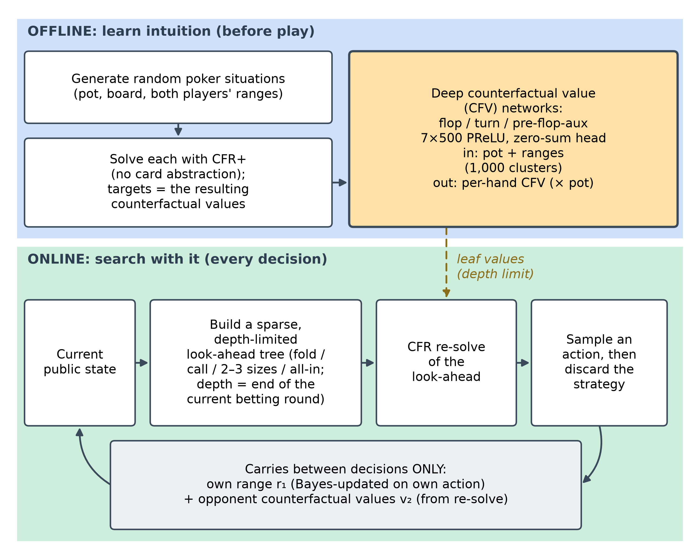
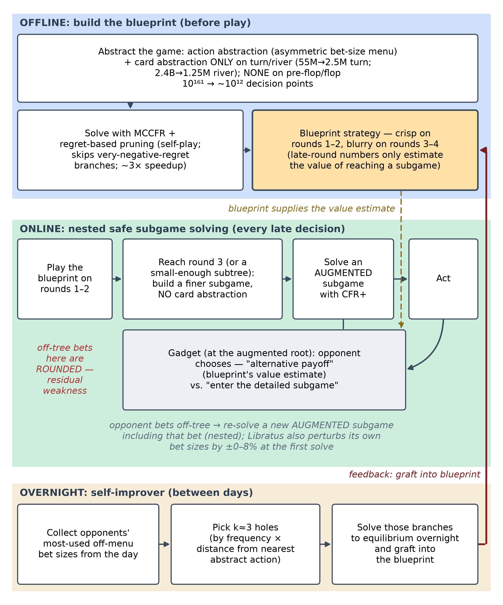
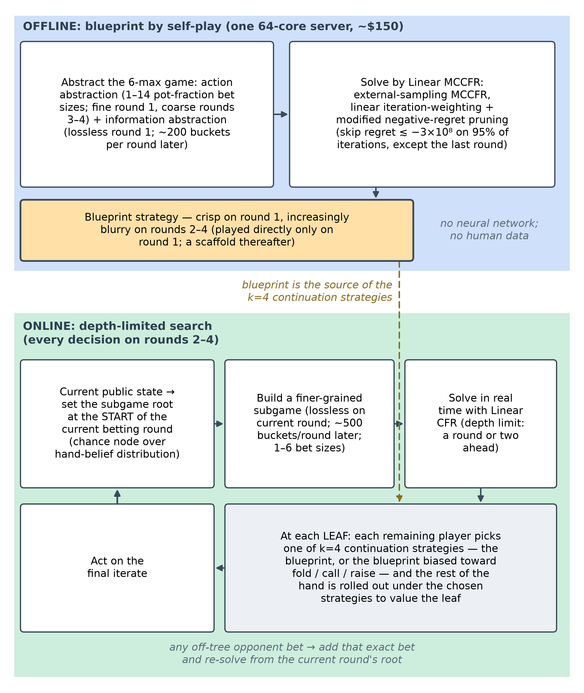
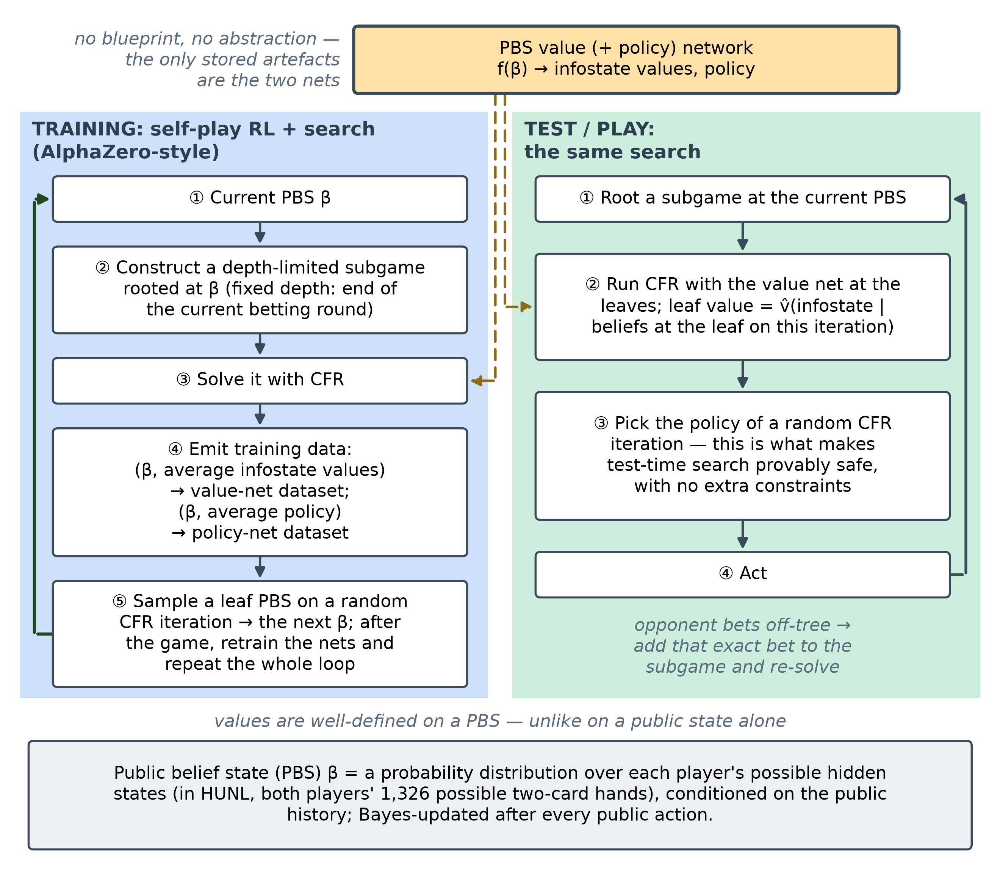
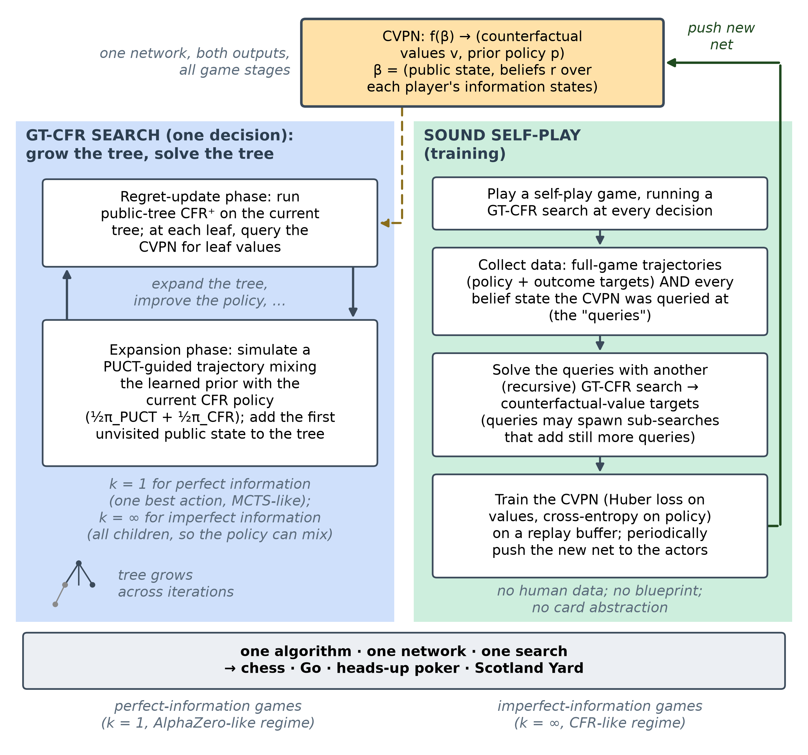
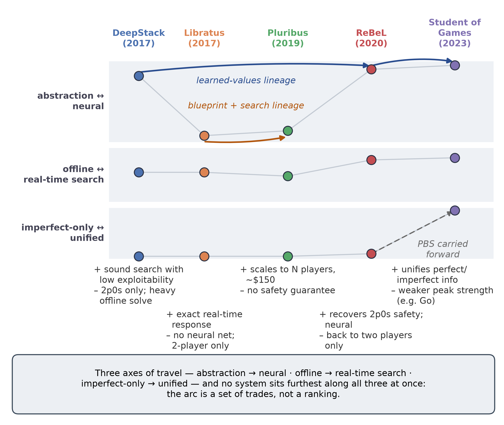
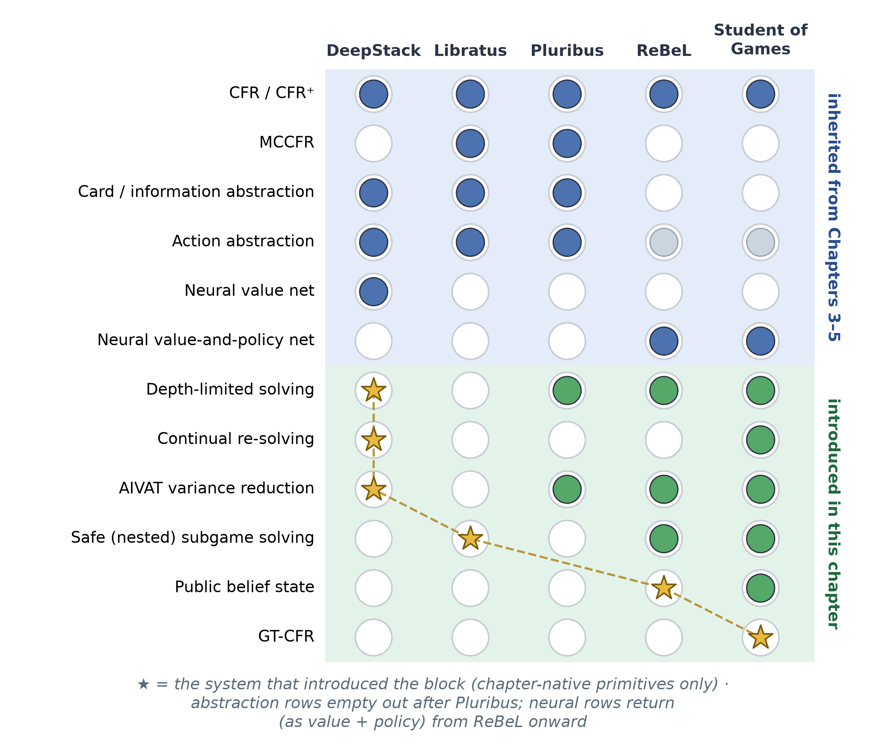

# Chapter 6 — End-to-End Game AI Architectures

<!--
SKELETON / WORK IN PROGRESS.
Build order and the per-system template (the "spine") are defined in ../CHAPTER_PLAN.md.
Each system section follows the same template so cross-system comparison stands out.
Wrap finished/approved sections in the APPROVED-HIGHLIGHT markers (see Chapter 5 summary).
-->

<!-- INTRODUCTION — drafted (subtask #7), awaiting review. Written last, per the plan, after all five
systems were approved. Progression-first framing (the arc as trade-offs, not a leaderboard); the three axes;
depth-limited solving as connective theory (not a system); a light forward pointer to the dissertation's
direction (opponent-blindness + the safety gap), with the heavy thesis tie-in deferred to the Synthesis.
Not wrapped in APPROVED-HIGHLIGHT until sign-off. -->

## Introduction

Chapter 6 is the keystone of this study plan. Chapters 1–5 assembled the parts in isolation — the
game-theoretic vocabulary of extensive-form games and Nash equilibria, counterfactual regret minimization
(CFR) and its Monte-Carlo variants, game abstraction, and the neural function approximators that replace
tabular storage once a game outgrows it — and this chapter is where those parts converge into complete,
competition-grade systems. The treatment is deliberately **architectural**: rather than re-deriving the
mathematics, which lives in the technical chapters and the cited papers, each system is studied at the level
of how it is *put together* — what it computes offline, what it computes in real time, where learning sits,
and what it can actually guarantee. A short per-system scorecard opens each section so the same nine
dimensions line up at a glance, and the prose then traces the design decisions, the engineering compromises,
and the abandoned approaches behind them.

The five systems span seven years and, read in order, trace the evolution of superhuman game AI:
**DeepStack** (2017), **Libratus** (2017/2018), **Pluribus** (2019), **ReBeL** (2020), and **Student of
Games** (2023). It is tempting to read such a list as a leaderboard — each entry strictly stronger than the
last — but that is neither what happened nor how this chapter is organized. The progression is a sequence of
*deliberate trades*: each system bought a new capability by giving something else up, and the most
instructive moments are the ones where the field stepped sideways or even backward. DeepStack and Libratus
are near-contemporaries that proposed *opposite cures* for the same disease — DeepStack discarded the
abstraction-and-blueprint paradigm that had dominated computer poker for nearly two decades, while Libratus
kept it and cured its one fatal flaw with real-time, provably safe subgame solving. Pluribus then broke the
*player-count* barrier, reaching superhuman six-player play, but only by abandoning safety guarantees
altogether and remaining entirely tabular. ReBeL stepped back to two players yet leapt forward on
generalization — learning belief-state values with AlphaZero-style self-play, dissolving both the
abstraction and the blueprint, and *recovering* the safety Pluribus had surrendered. Student of Games, the
capstone, unified perfect- and imperfect-information play in a single algorithm — and paid for that breadth
with peak strength, losing decisively to a specialist AlphaZero at Go. Read this way, the chapter is a study
of what each advance cost, not a ranking of winners.

Beneath the individual trades, three axes of motion run through all five systems and give the chapter its
spine. The first is **representational**: the move from hand-built *abstraction* — bucketing similar hands
and allowing only a few bet sizes — toward *learned neural approximation*, in which a network generalizes
across situations a table could never enumerate. The second is **temporal**: the move from *solving the
entire game offline* into a stored strategy toward *learning a compact model and searching with it in real
time*, so that computation is spent at the moment of decision rather than baked in advance. The third axis
appears only at the very end, with Student of Games: the unification of **perfect- and
imperfect-information** play in one sound algorithm, joining the two great traditions of game AI — the
minimax / Monte-Carlo-tree-search / AlphaZero line and the CFR / poker line — that had run on separate
tracks for seventy years. The first two axes describe the four poker systems; the third is what makes the
fifth the chapter's capstone.

One idea ties these threads together and deserves to be named before the systems themselves, precisely
because it is *not* one of them: **depth-limited solving**. Formalized by Brown & Sandholm (2018), it is the
principle that one may search only a little way ahead in an imperfect-information game and substitute a
*learned or precomputed value* for the remainder — provided the substitution is done so that hidden
information does not render it unsound. It is the theory that retroactively unifies DeepStack's continual
re-solving with Libratus's nested subgame solving, that underwrites Pluribus's continuation strategies, and
that, in belief-state form, becomes the inner loop of ReBeL and Student of Games. We treat it as connective
tissue — referenced wherever a system instantiates it — rather than as a sixth entry, because depth-limited
solving is the mechanism *through which* the offline-to-search axis actually operates.

Finally, because this chapter is the hinge between the fundamentals of Chapters 1–5 and the opponent-modelling
and exploitation work of Chapters 7–15, it is worth flagging at the outset the single thread the synthesis
returns to. Every system here is, by deliberate design, **opponent-blind**: each computes a strategy that is
hard to beat *in the worst case* and then plays it without regard to who is actually across the table —
Pluribus does not even know its opponents' identities, and both it and Libratus refuse on principle to model
or adapt to them, so as never to be counter-exploited in return. This robustness-first stance is the field's
great strength and, for a dissertation about *adaptive* play, its defining limitation: it is exactly the
opponent-awareness these systems omit that Chapters 7–15 set out to add. The chapter therefore closes not with
a winner but with a synthesis — a map of what the five systems share, what each gave up, and where the open
problems that motivate the rest of this work actually lie.

## DeepStack (2017)

<!-- PILOT SECTION — APPROVED (subtask #1). This section locked Spine v2 (see ../CHAPTER_PLAN.md): scorecard
on top; gap / architecture / key-innovation / caveats / compute & accessibility / strengths & limitations /
legacy & modern relevance; figures = descriptive placeholders; no glossary call-outs; the forward hand-off
opens the NEXT section, not this one. -->
<!-- APPROVED-HIGHLIGHT START (temporary; remove before final build) -->

DeepStack (Moravčík et al., 2017), from the University of Alberta computer-poker group with collaborators in
Prague, was the first program to defeat professional poker players at heads-up no-limit Texas hold'em (HUNL)
with statistical significance, and the first to put heuristic search — the engine behind chess and Go — on a
theoretically sound footing in a game of imperfect information. Over a four-week study it beat a pool of 33
professionals by 492 milli-big-blinds per game (mbb/g, the standard poker win-rate unit; 50 mbb/g is a
sizable professional edge) across 44,852 hands, and no known technique could find a flaw in its play. Its
guiding *what-if* is the one that frames this whole chapter: **could a program play poker the way AlphaGo
plays Go — searching locally from the current situation and trusting a learned value function for everything
beyond the horizon — even though, in poker, the situation is itself partly hidden?**

| At a glance | DeepStack (2017) |
|---|---|
| Players | 2 (heads-up) |
| Game type | HUNL — heads-up no-limit Texas hold'em (2-player zero-sum) |
| Blueprint (offline)? | No — offline work trains value nets, not a stored strategy |
| Neural component | Deep counterfactual value networks (flop, turn, aux); value-only |
| Search mechanism | Continual re-solving (depth-limited CFR look-ahead, every decision) |
| Abstraction? | None constrains play; 1,000-bucket clustering only at the net input, plus sparse betting + river action bucketing in look-ahead |
| Perfect-info too? | No (imperfect-information only) |
| Compute | Offline-heavy (~175 CPU-core-years to label the turn network); play-time runs on one GPU, < 5 s/decision |
| Key innovation | Continual re-solving + learned counterfactual values: the first *sound* heuristic search for imperfect-information games |

### The gap it closed

Every prior game-AI milestone — backgammon, chess, Go — rested on *local search*: from the current position,
look a few moves ahead and substitute a heuristic value for the rest. That recipe assumes the position is
known, and poker breaks the assumption — the right action depends on the distribution over the opponent's
hidden cards, revealed only through their betting, which in turn depends recursively on what they believe
about your cards. The open question DeepStack set out to answer is whether heuristic search can be made
*sound* under hidden information at the scale of HUNL, a game with roughly $10^{160}$ decision points —
comparable to Go, but imperfect-information.

For nearly two decades the dominant answer had been something else entirely: **abstraction plus offline
equilibrium plus translation**. Shrink HUNL's $10^{160}$ situations into roughly $10^{14}$ abstract ones by
bucketing similar hands (*card abstraction*) and allowing only a few bet sizes (*action abstraction*), solve
that smaller game offline with counterfactual regret minimization (CFR) to produce a complete strategy — a
*blueprint* — store it, and at play time *translate* each real situation and opponent bet into the nearest
abstract one. The compression is lossy, and the loss shows up as exploitability — how much a worst-case
opponent can win, the field's quality metric, zero at a Nash equilibrium. In 2015 the abstraction-based
program Claudico lost to professionals by 91 mbb/g, and a local-best-response probe (LBR, a tractable lower
bound on exploitability) later showed top competition bots exploitable by more than 3,000 mbb/g — four times
worse than folding every hand. Blueprints were also enormous (a single no-card-abstraction strategy took
about 2 TB and 14 CPU-years to compute and was *still* exploitable through off-tree bets), and the
translation step was itself a source of weakness. DeepStack closes this gap by discarding the whole edifice:
it never builds a full-game abstraction and never stores a blueprint, reasoning about each situation *as it
actually arises* and replacing only the distant remainder of the game with a learned estimate.

### Architecture

DeepStack splits cleanly into an **offline** phase that learns intuition and an **online** phase that
searches with it (Figure 6.1).

{width=92% fig-pos="H"}

Offline, the system generates millions of random poker situations and solves them with a CFR solver to obtain
target *counterfactual values* — conditional "what-if" payoffs for holding each possible hand — and these
(situation → value) pairs train the **deep counterfactual value (CFV) networks**. Online, DeepStack carries
no blueprint: between decisions it remembers only two vectors — its own *range* (the distribution over the
hands it could be holding) and the opponent's *counterfactual values* — and at each turn it runs CFR over a
small look-ahead tree rooted at the true current state, using a CFV network to supply leaf values at the
depth limit. CFR already computes both ranges and counterfactual values, which is why it slots so naturally
into this loop.

This is heuristic search with three ingredients: a sound local strategy computation (continual re-solving),
depth-limited look-ahead with a learned value function in place of the rest of the game, and a restricted set
of look-ahead actions to keep each solve fast. The neural network sits *only* at the depth limit as a leaf
evaluator; CFR does the searching; and — crucially — there is no full-game abstraction in the loop.

### Key innovation: continual re-solving with learned counterfactual values

DeepStack's contribution is the marriage of two ideas, each of which makes the other practical.

The first is **continual re-solving**: reconstructing a fresh local strategy at every decision from the
maintained range and opponent counterfactual-value vector, then discarding it, so the agent never stores or
commits to a global strategy. Classical re-solving (Burch et al., 2014) shows that to reconstruct a strategy
for a subgame you do not need the whole strategy — you need only your own range entering the subgame and a
vector of the opponent's counterfactual values. DeepStack pushes this to its limit: it *never* holds a
strategy for the whole game. Every time it must act, it re-solves the current public state from those two
vectors, plays one action, and throws the strategy away.

What makes this work is the bookkeeping. After each event DeepStack updates its two vectors by simple rules:
on its **own action** it swaps in the re-solved counterfactual values for the chosen action and Bayes-updates
its range; on a **chance event** it swaps in that card's values and zeroes the now-impossible hands; and on
the **opponent's action** it does *nothing at all*. That last point is the quiet masterstroke: because it
tracks the opponent's *values* rather than their *range*, and never needs the opponent's specific action to
maintain those values, it sidesteps the action-translation step that crippled abstraction-based bots. The
opponent can make any bet of any size; DeepStack simply re-solves from the state that bet produced.

The second idea is the **learned counterfactual value network** — DeepStack's "intuition." In a
perfect-information game a leaf evaluator maps one state to one number; under imperfect information it must
map a *whole public state plus both players' ranges* to a *vector* of counterfactual values, one per hand,
because the values at a node shift with the ranges that reach it. DeepStack learns this map with a feed-forward
network of seven hidden layers of 500 units, taking the pot size and the two ranges (compressed into 1,000
hand clusters) as input and emitting per-hand counterfactual values as fractions of the pot. A bespoke outer
layer enforces the zero-sum constraint: it forms the two implied game values from the ranges and raw outputs
and subtracts half their sum, so the estimates are mutually consistent and the whole thing stays
differentiable. With this network supplying values at the end of the current betting round, the depth-limited
re-solve shrinks the game from $10^{160}$ decision points to about $10^{7}$ — small enough to solve in under
five seconds on a single GPU.

The pairing is provably sound. If the value network's error is at most $\epsilon$ and the re-solve runs $T$
CFR iterations, the resulting strategy's exploitability is bounded by

$$ \text{exploitability} \;<\; k_1\,\epsilon \;+\; k_2/\sqrt{T}, $$

with game-specific constants $k_1, k_2$. The first term is the price of imperfect intuition; the second is
ordinary CFR convergence. This bound is the theoretical heart of the paper — the guarantee that heuristic
search can be carried into imperfect information without the strategy quietly becoming exploitable — and the
same depth-limit-plus-learned-value template, formalized further by Brown & Sandholm's depth-limited solving
the following year, underlies every system in this chapter.

### Caveats, dead-ends, and what the paper under-describes

The clean story above is the main text; the engineering reality lives in the supplement, and it is where the
spine's "caveats and evolution" emphasis earns its keep.

The most important asterisk is that **the deployed system is not the one the theorem covers**. To play at
human speed DeepStack restricts its look-ahead to a sparse betting set (fold, call, two or three bet sizes,
all-in), and the paper states plainly that this "voids the soundness property of Theorem 1." So the shipped
guarantee is empirical — supported by the LBR results below — not proven. A second deviation compounds this:
the soundness proof assumes *best-response* constraint values, but DeepStack actually uses *self-play* values,
which "lack a theoretical justification" yet were less exploitable in early tests. The proven algorithm and
the winning algorithm are, strictly, different algorithms.

Abstraction also creeps back at the margins. DeepStack advertises that it uses no card abstraction to
constrain play — but it *does* cluster hands into 1,000 buckets at the value network's input, and on the
river it abandons the network entirely, solving to the end of the game while using a **bucketed action
abstraction** for tractability. To speed up re-solving it also **warm-starts** the opponent's range, in a
conservative blend most of the time but in an aggressive variant (when acting first) that "sacrifices the
re-solving guarantees when the opponent's range estimate is wrong." And the pre-flop, far from cheap, requires
enumerating all 22,100 possible flops through the flop network, mitigated only by caching repeated betting
sequences. Finally, the choice of re-solving gadget (the CFR-D gadget over the max-margin alternative) was
made because it "performed better in early testing," not derived — and, echoing Chapter 5, the network's useful
depth was capped by data rather than architecture, with validation error flattening past five layers at the
ten-million-sample budget. None of these undermine the result, but together they show that the headline
"sound, abstraction-free search" is an aspiration the implementation approximates rather than attains.

### Compute & accessibility

DeepStack's cost is almost entirely **offline, and almost entirely in the CFR solving used to label the value
networks** — not in the neural training, and not in play. Generating the targets meant approximately solving
millions of random subgames: the turn network alone consumed about **175 CPU-core-years** on a 6,144-core
cluster, with the flop network adding roughly half a GPU-year on 20 GPUs; by contrast, the networks
themselves trained in about two days each on a single GPU, and at play time DeepStack runs on **one commodity
GPU at under five seconds per decision**. The shape of that bill is the real lesson: the "intuition" is bought
once, up front, by brute-force equilibrium solving, after which deployment is cheap — the mirror image of a
system whose cost is dominated by inference. In accessibility terms this put a *from-scratch* build within
reach only of a well-resourced lab at the time (the offline solve is cluster-scale), even though the trained
agent then ran on hardware any enthusiast owned; a decade on, that offline cost is far more tractable on
commodity cloud compute and with faster modern solvers, and a public reference implementation on Leduc lowers
the entry barrier further.

### Strengths and limitations

DeepStack's central strength is **soundness with low exploitability**: it is the first imperfect-information
search method with a real guarantee, and empirically LBR — which exposes competition bots as losing thousands
of mbb/g — cannot find any way to beat it, itself losing by over 350 mbb/g. It needs **no full-game
abstraction and no action translation**, so off-tree opponent bets are handled exactly rather than rounded;
its **play-time footprint is modest**; and it learns from **no human data and little domain knowledge**. A
neat bonus is evaluation synergy — DeepStack's own value function is exactly what the AIVAT variance-reduction
estimator needs, cutting the human-study standard deviation by 85% and making significance achievable in only
a few thousand hands.

The limitations set the agenda for the rest of the chapter. DeepStack is **two-player zero-sum only**; its
soundness leans on that structure. It retains a **sparse betting abstraction** in the look-ahead and an action
abstraction on the river, and it inherits **value-network approximation error** (the $k_1\epsilon$ term),
worst on the flop where it leans hardest on the network. It pays the **heavy offline cost** noted above and
**re-solves from scratch** at every decision, and it was validated only against humans and LBR — never
head-to-head against the strongest abstraction bots.

### Legacy and modern relevance

Strip away the poker specifics and DeepStack's core idea is **depth-limited search with a learned value
function at the leaves, adapted to hidden information** — the imperfect-information counterpart of the
value-guided search behind AlphaGo and AlphaZero. That idea did not age into obsolescence; it became the
template. Brown & Sandholm formalized the depth-limited-solving theory the next year, and the paradigm was
then generalized into full reinforcement-learning-plus-search frameworks: ReBeL (2020) recast the leaf-value
learning around public belief states with AlphaZero-style self-play, and Student of Games (2023) — which
shares several DeepStack authors — unified perfect- and imperfect-information play in a single algorithm. The
same "planning in the loop with a learned value model" recipe later reached beyond two-player zero-sum poker,
for instance in CICERO's human-level Diplomacy play. More broadly still, DeepStack is an early, clean instance
of the principle now central to frontier AI: **spend compute at decision time via search guided by learned
intuition, rather than baking everything into one giant precomputed policy** — the same "test-time compute"
thesis behind today's reasoning models, with the field's own caveat (voiced by Noam Brown) that imperfect
information needed *belief-aware* search precisely because the plain Monte-Carlo tree search that works for Go
does not work for poker.

Several concrete subsystems remain reusable today: the depth-limit-plus-learned-leaf-value pattern itself; the
differentiable **zero-sum-consistency output head** for two-player value networks; **AIVAT-style variance
reduction**, which turns a learned value model into a control variate for low-variance evaluation of any
stochastic agent; and the small but transferable trick of expressing values as **fractions of the pot** for
scale-invariant generalization. What is genuinely superseded is the hand-engineered machinery *around* the
idea — the 1,000-bucket k-means clustering, the separate per-round networks, the hand-tuned re-solving
gadget — which the more general learned representations of ReBeL and Student of Games replace. The honest
verdict: **as a deployed poker system DeepStack is superseded, but it is far from a mere stepping stone** —
its central paradigm won and is now mainstream, and for this thesis specifically its (range, opponent
counterfactual values) state and its error-propagation bound are direct seeds for belief-based opponent
modelling (Contribution 1) and safe-exploitation analysis (Contribution 2).

<!-- APPROVED-HIGHLIGHT END -->

## Libratus (2017/2018)

<!-- SECTION — APPROVED (subtask #2). Applies locked Spine v2 (see ../CHAPTER_PLAN.md), mirroring the approved
DeepStack section: scorecard on top; gap / architecture / key-innovation / caveats / compute & accessibility /
strengths & limitations / legacy & modern relevance; figures = descriptive placeholders; no glossary call-outs;
the forward hand-off opens the NEXT (Pluribus) section, not this one. -->
<!-- APPROVED-HIGHLIGHT START (temporary; remove before final build) -->

DeepStack answered its *what-if* by throwing the abstraction-and-blueprint edifice away — yet it still kept a
sparse betting abstraction inside its own look-ahead, and it was never tested head-to-head against the
strongest prior bots or against HUNL specialists in a long, rigorous match. Libratus (Brown & Sandholm,
2017; Carnegie Mellon) — Latin for *balanced*, as in approximating a Nash equilibrium, and *forceful*, for
its play — was built independently and announced the same year, and it made the opposite bet: keep the
abstraction-and-blueprint paradigm and cure its one fatal disease. Its guiding question is the mirror image
of DeepStack's: **what if we solve a coarse blueprint of the whole game offline, then *repair it in real
time* wherever the abstraction is too crude — with a provable guarantee that the repair never leaves us more
exploitable?** In January 2017 Libratus became the first program to beat top human HUNL specialists in a long
match, defeating four professionals by 147 mbb/g (milli-big-blinds per game, the win-rate unit from the
previous section; ~50 mbb/g is a sizable professional edge) over 120,000 hands at 99.98% significance — and,
unlike DeepStack, it first dismantled the prior best poker AI head-to-head.

| At a glance | Libratus (2017/2018) |
|---|---|
| Players | 2 (heads-up) |
| Game type | HUNL — heads-up no-limit Texas hold'em (2-player zero-sum) |
| Blueprint (offline)? | Yes — an abstracted full-game strategy solved offline with MCCFR (detailed early, coarse late) |
| Neural component | None — purely tabular CFR / abstraction (no neural networks anywhere) |
| Search mechanism | Nested safe subgame solving (real-time CFR+ re-solve of the late game, re-run for every off-tree opponent bet) |
| Abstraction? | Yes — card abstraction (turn/river, blueprint only) + asymmetric action abstraction; dissolved to *no card abstraction* inside the real-time subgames |
| Perfect-info too? | No (imperfect-information only) |
| Compute | Offline- *and* online-heavy: ~25M CPU core-hours on the Bridges supercomputer; ~50 nodes and tens of seconds per late decision; no GPUs |
| Key innovation | Blueprint + real-time nested *safe* subgame solving + self-improvement: exact, provably-safe responses to off-tree bets in place of action translation |

### The gap it closed

The previous section laid out the paradigm DeepStack discarded — abstraction plus offline equilibrium plus
translation — and named its fatal flaw. Libratus targets exactly that flaw without discarding the paradigm.
The blueprint is solved in advance over a *fixed* menu of bet sizes; at play time any opponent bet that is
not on that menu is *translated* — rounded to the nearest size the bot knows — after which the bot replies as
though the opponent had made the rounded bet. That rounding is the single largest exploitable seam in
abstraction-based poker: a local-best-response probe had shown the leading competition bots losing thousands
of mbb/g to a worst-case adversary, and in 2015 Libratus's own predecessor Claudico lost the first
*Brains vs. AI* match to professionals by 91 mbb/g, in good part because opponents could feel out and punish
its translation boundaries.

The conceptual question Libratus answers is therefore narrower and more surgical than DeepStack's: *can the
decades-old abstraction paradigm be made superhuman by repairing only its real-time behaviour — responding to
off-menu bets exactly rather than by rounding — and can that repair be done with a guarantee that local fixes
never increase global exploitability?* The answer is the three-module architecture below. Where DeepStack
removed the blueprint entirely and leaned on a learned value function, Libratus keeps the blueprint as a
cheap scaffold and adds a real-time solver that, whenever the opponent steps off the tree, builds and solves
a finer subgame *containing the actual bet* and stitches the result back into the blueprint. The same year,
then, produced two opposite cures for the same disease — one neural and blueprint-free, one tabular and
blueprint-based — and Libratus is the proof that the older paradigm, properly repaired, was still enough to
reach superhuman play.

### Architecture

Libratus is a pipeline of three modules that operate on three different timescales — **offline** (before the
match), **online** (during each decision), and **overnight** (between days of play) — and, unlike every other
system in this chapter, it contains **no neural network at all** (Figure 6.2).

{width=95% fig-pos="H"}

**Module 1 — the blueprint (offline).** Libratus first compresses HUNL's roughly $10^{161}$ decision points
to about $10^{12}$ with two kinds of abstraction: an *action abstraction* that keeps only a discrete menu of
bet sizes (mostly round fractions and multiples of the pot, drawn from the sizes top competition bots
favour, with a few early sizes tuned by a parameter-optimization algorithm), and a *card abstraction* that
groups strategically similar hands. Crucially it uses **no card abstraction on the first two betting rounds**
— small enough to afford full resolution — and buckets only the turn and river, and even there only in the
blueprint. It then solves this abstract game by self-play with an improved **Monte Carlo counterfactual
regret minimization (MCCFR)** that probabilistically prunes very-negative-regret branches, a roughly
three-fold speedup that also quietly heals a pathology of imperfect-recall abstractions, in which several
distinct situations share one bucket's strategy and "fight" over it. The result is the **blueprint**: a
complete but uneven strategy — detailed early, coarse late — whose late-round numbers are used not to play
but only to *estimate the value of reaching a subgame*.

**Module 2 — nested safe subgame solving (online).** Libratus plays the blueprint only in the early rounds.
On reaching the third betting round — or any earlier point where the rest of the hand is small enough — it
discards the coarse late-game blueprint and instead **builds a fresh, finer-grained subgame with no card
abstraction and solves it in real time** with a heavily optimized **CFR+** (a fast, deterministic CFR
variant). Each hand is thus played individually in the late game. The defining feature is what happens when
the opponent makes a bet that is not on the blueprint's menu: rather than round it, Libratus solves a new
subgame that *contains that exact bet*, and repeats this for every subsequent off-menu action — *nested*
subgame solving. This is the module that the next subsection dissects.

**Module 3 — the self-improver (overnight).** Because real-time solving is skipped on the first two rounds
(solving so early would itself demand heavy abstraction), off-menu opponent bets *there* are still rounded.
The self-improver narrows this residual seam between days: it tallies the opponents' most-used off-menu bet
sizes, chooses a few of the most damaging holes, computes proper game-theoretic responses to them overnight,
and grafts those branches into the blueprint. Pointedly, this is **not opponent exploitation** — it never
tries to model and punish the humans' mistakes (which would expose Libratus to counter-exploitation).
Instead it uses the opponents' bets only as a hint about *which of Libratus's own holes to patch*, and the
patches are universal, improving play against any future opponent.

The classic building blocks of earlier chapters sit in plain view: game abstraction and MCCFR build the
blueprint offline, CFR+ does the online subgame solving, and "search" is the per-decision real-time re-solve.
The conspicuous absence — no value network, no policy network, nothing learned by gradient descent — is the
architectural signature that separates Libratus from every other system in this chapter.

### Key innovation: nested safe subgame solving

Libratus's central contribution is making **real-time subgame solving both *safe* and *nested*** — strong
enough to beat humans and provably unable to make the strategy much more exploitable than the blueprint it
refines. Both adjectives matter, and each fixes a specific prior failure.

The difficulty is that an imperfect-information subgame *cannot be solved in isolation*. In chess, once you
reach an endgame you can solve it on its own, because the board is fully known. In poker the right strategy
for a subgame depends on the strategies in *other, unreached* subgames, because those determine the
probability distribution over the hidden hands the opponent could hold here. Earlier real-time solvers
sidestepped this by assuming the opponent had played the blueprint up to this point — **unsafe** subgame
solving — which the opponent can punish simply by deviating, sometimes producing a refined strategy far
*worse* than the blueprint.

Libratus's **safe** subgame solving removes that assumption with a small gadget, the *augmented subgame*. At
the root of the subgame the opponent is handed a choice for every hand they might hold: either take a fixed
**alternative payoff** — the blueprint's estimate of what that hand is worth here — or *enter* the detailed
subgame and play it out. Solving this augmented game forces Libratus's refined strategy to make the opponent
**no better off than that estimate for every possible hand**, which is exactly the meaning of "safe": the
local repair cannot be exploited relative to the blueprint, whatever the opponent does. Libratus sharpens
this with a variant the authors call **Estimated-Maxmargin** — it maximizes the *smallest* safety margin
across all opponent hands — and with two refinements that make it strong rather than merely safe: it uses
blueprint *estimates* of opponent values instead of conservative *upper bounds* (less timid play), and it
*de-emphasizes hands the opponent could only hold by having made an earlier mistake* (it is pointless to
defend against a hand a rational opponent would never have brought to this spot), freeing capacity to defend
against the hands they realistically have.

The pairing comes with a guarantee that parallels DeepStack's. If $\sigma^{*}$ is the least-exploitable
strategy that differs from the blueprint only inside the solved subgames, and the blueprint's estimate of
the opponent's subgame values is off by at most $\Delta$, then the refined strategy's exploitability obeys

$$ \text{exploitability}(\sigma_{\text{refined}}) \;\le\; \text{exploitability}(\sigma^{*}) \;+\; 2\Delta. $$

The $2\Delta$ term is the price of imperfect value *estimates*, and it is the structural twin of DeepStack's
$k_1\epsilon$ term — both bound how much an error in the values handed to the solver can cost in worst-case
exploitability. The two systems thus arrive at the same kind of soundness statement from opposite directions:
DeepStack's $\epsilon$ is a *neural network's* approximation error at the depth limit; Libratus's $\Delta$ is
a *tabular blueprint's* estimation error at the subgame boundary.

"Nested" is the second half. Rather than expand the blueprint's bet menu (which would balloon the offline
solve), Libratus crafts a **distinct response to each off-menu bet in real time**: when the opponent bets a
size it has never enumerated, it builds an augmented subgame whose alternative payoff is the best *in-menu*
action the opponent could have taken instead, solves it, and does so afresh for every later off-menu bet down
the hand. In the controlled experiments this beat the previous standard — rounding the bet to the nearest
menu size — by more than an order of magnitude in worst-case exploitability (119 versus 1465 mbb/g in the
reported small-game test). And because each subgame is solved live, Libratus can also *change its own bet
sizes* between hands — it perturbs them by a random 0–8% at the first solve — so the humans never face a
fixed target to dissect. This is the precise mechanism by which the abstraction paradigm's worst weakness,
action translation, is excised from the late game.

### Caveats, dead-ends, and what the paper under-describes

As with DeepStack, the clean three-module story hides where the engineering — and the honesty about
limitations — actually lives, except that here much of it is not even in the *Science* paper but in the
companion IJCAI paper and the authors' course notes.

The most revealing caveat is that **the blueprint alone is not superhuman — it does not even beat the prior
bot**. Against Baby Tartanian8, the 2016 competition winner, Libratus's raw blueprint *lost* by 8 mbb/g; only
when nested subgame solving was switched on did the same system win by 63 mbb/g. The offline strategy, in
other words, is a scaffold, and essentially all of Libratus's edge comes from real-time search — a result
that quietly reframes the whole system and foreshadows the field's pivot toward search-at-inference.

Several other asterisks matter. **Action translation is not eliminated, only contained**: on the first two
betting rounds Libratus still rounds off-menu opponent bets, and the entire self-improver module exists to
chip away at that residual seam, three holes per night, never closing it. **Safe subgame solving had to be
re-engineered to be usable at all** — for three years it was considered impractical because, in head-to-head
play, textbook-safe solving lost to the theoretically unjustified *unsafe* variant; Libratus's use of value
*estimates* rather than conservative *bounds*, together with its de-emphasis of hands an opponent would only
hold by mistake, is what made safety competitive, and even so Libratus deliberately uses *unsafe* solving
once, at its first entry into the third round, because it is cheaper and empirically fine there. The **Estimated-Maxmargin** choice itself trades a little theoretical purity for strength: using
estimates rather than upper bounds can in principle push exploitability *above* the blueprint's, bounded only
by the $2\Delta$ of the theorem. And the imperfect-recall abstraction underneath it all means several
distinct situations share a strategy and "fight" over it — a known distortion the regret-based pruning only
partly mitigates. Finally, the **compute is almost absent from the main paper**: the headline article gives
essentially no figures, and the true cost (next) surfaces only in the secondary sources, as does the fact
that the **code was never released**, leaving independent verification to rest on the published pseudocode.

### Compute & accessibility

Where DeepStack's bill is paid almost entirely offline and its play is cheap, Libratus is **expensive at
both ends**. The project consumed roughly **25 million CPU core-hours** on the Bridges supercomputer at the
Pittsburgh Supercomputing Center over a year — of which about 6 million went to building and solving the
blueprint, about 3 million to real-time subgame solving during the match, about 3 million to the
self-improver, and the remaining ~13 million to exploratory experiments and evaluation. Operationally the
blueprint runs occupied roughly 195 nodes for one to eight weeks at a time; each **real-time subgame solve
used about 50 nodes and took on the order of tens of seconds**; the overnight self-improver ran on up to
several hundred nodes for hours; and the strategies and snapshots consumed about 2.6 petabytes of disk.
There were **no GPUs and no neural training anywhere** — every core-hour is CFR or abstraction.

The shape of that bill is the lesson. Libratus does not buy cheap deployment with an expensive one-time
training run, the way DeepStack does; its *play-time* cost is itself supercomputer-scale, because the
strength comes from solving a fresh subgame at almost every late decision. In accessibility terms this made
Libratus, as deployed, essentially impossible to reproduce outside a major supercomputing centre at *both*
training and play time — a far higher bar than DeepStack's single-GPU agent — and the absence of any code
release reinforced that. The underlying techniques are application-independent and run far more cheaply on
modern hardware and solvers today, but the 2017 artefact was a demonstration of what was possible with
abundant compute, not of what was broadly attainable.

### Strengths and limitations

Libratus's signal strength is **decisive, rigorously demonstrated superhuman play**. It is the first AI to
beat top HUNL *specialists* in a long match — 147 mbb/g over 120,000 hands at 99.98% significance, beating
each of the four professionals individually — and, unlike DeepStack, it also beat the **prior best poker AI
head-to-head** by 63 mbb/g, disentangling its strength from the question of human skill. Its core technique,
nested safe subgame solving, is both **provably safe** (the $2\Delta$ bound) and **empirically an order of
magnitude less exploitable** than the action translation it replaces, and it uses **no human data and no
domain-specific knowledge**. The modular design is itself a contribution: a cheap blueprint, a real-time
solver that repairs it where it matters, and an overnight loop that patches its own holes — each module
covering another's weakness — and the whole system is **robustness-first**, refusing to exploit opponents so
as never to be counter-exploited.

The limitations are equally clear and set up the rest of the chapter. Libratus is **two-player zero-sum
only**; its safety guarantees lean on that structure. It remains **abstraction-based**, and still **translates
off-menu bets on the early rounds**, an exploitable seam the self-improver only narrows. It uses **no neural
generalization** whatsoever: nothing transfers across situations, the blueprint is enormous (petabytes of
stored strategy), and play time is **supercomputer-scale** rather than the single GPU DeepStack needed. The
Estimated-Maxmargin trade-off accepts a small, bounded rise in exploitability for strength, one unsafe solve
slips into the pipeline, and — because both humans and AI adapted over the match — even the headline
significance is, strictly, an "as-if-independent" figure, though a 147 mbb/g margin over 120,000 hands leaves
no real doubt.

### Legacy and modern relevance

Strip away the abstraction machinery and Libratus's enduring idea is **real-time search layered on a coarse
precomputed strategy, made safe under hidden information**: solve the local situation exactly at decision
time, consistently with a cheap global plan, and respond to whatever the opponent actually does rather than
to a rounded approximation of it. That idea did not just survive — it became, with DeepStack's continual
re-solving, half of the foundation the rest of the chapter is built on. Libratus's nested safe subgame
solving is the direct ancestor of the real-time search in **Pluribus** (2019), it is unified with DeepStack's
re-solving by the **depth-limited solving** theory the authors published the following year, and the same
"refine a global value estimate with a local solve" pattern reappears, now with *learned* values replacing
the tabular blueprint, in **ReBeL** (2020).

Libratus is also, in a precise sense, the **high-water mark of a paradigm that the field then left behind**.
It reached superhuman play with **no deep learning at all** — pure abstraction and CFR — and yet the
subsequent systems are all neural, because hand-crafted abstraction and petabyte blueprints neither generalize
across situations nor scale beyond two players. The honest verdict is that Libratus is *superseded as an
architecture but vindicated as a thesis*: its bet that **real-time search matters more than a bigger
precomputed strategy** was exactly right, even as its bet on tabular abstraction was overtaken. That first
thesis has since become a central theme of frontier AI — the observation that adding search at decision time
was worth far more than scaling the offline computation is an early, concrete instance of the "test-time
compute" argument now made for reasoning models, and Libratus's blueprint-then-search split prefigures the
modern pretrain-then-search recipe.

Several subsystems remain directly reusable: **safe subgame / endgame solving** as a way to locally refine a
global policy *without breaking its guarantees*; the **augmented-subgame gadget** — the clean "take a known
alternative value or enter the subgame" construction for pinning a local solution to a global value estimate;
**regret-based pruning** for scaling CFR; and the **self-improver pattern** of using observed play to find and
*fix one's own holes* rather than to exploit the opponent. What is genuinely obsolete is the surrounding
edifice — the hand-tuned card and action abstraction, the multi-petabyte tabular blueprint, and the
cluster-at-play-time deployment — all of which the learned representations of later systems dissolve. For this
thesis specifically, Libratus contributes two seeds: its safe-subgame-solving exploitability bound is a
template for **safe exploitation under value error (Contribution 2)**, and its deliberate refusal to exploit —
"fix your own weaknesses, do not model the opponent" — is the precise foil against which a *bounded,
deliberate* opponent adaptation (Contribution 1) can be defined.

<!-- APPROVED-HIGHLIGHT END -->

## Pluribus (2019)

<!-- SECTION — APPROVED (subtask #3). Applies locked Spine v2 (see ../CHAPTER_PLAN.md), mirroring the approved
DeepStack and Libratus sections: opening bridge-from-Libratus + identity + "At a glance" scorecard on top; gap /
architecture (descriptive Figure 6.3 placeholder) / key-innovation deep-dive / caveats / compute & accessibility
/ strengths & limitations / legacy & modern relevance; one signature equation; figures = descriptive
placeholders; no glossary call-outs; the forward hand-off opens the NEXT (ReBeL) section, not this one. Paper
thin on architecture -> leaned on the supplementary materials + author talks + secondary sources (cited in
../research/pluribus.md). -->
<!-- APPROVED-HIGHLIGHT START (temporary; remove before final build) -->

Libratus settled two-player no-limit hold'em, but its safety guarantees — and indeed the very meaning of
"solving" the game — rested on two-player zero-sum structure: there a Nash equilibrium is unbeatable, and a
real-time solve could be made provably *safe* against it. Poker as humans actually play it, though, seats six.
Pluribus (Brown & Sandholm, 2019; Carnegie Mellon and Facebook AI) confronted the multiplayer question
directly: **what becomes of the blueprint-plus-real-time-search recipe when you remove the two-player crutch
and sit at a six-handed table — a setting where a Nash equilibrium is neither unique, nor efficiently
computable, nor even a guarantee that you will not lose?** Its answer was empirical and emphatic. Across two
formats — five professionals seated with one copy of Pluribus, and one professional against five copies — it
beat a rotating cast of thirteen elite pros, several of them World Series or World Poker Tour champions,
winning by about **48 milli-big-blinds per game** against five humans at once (mbb/g, the win-rate unit from
the previous sections — roughly five big blinds per hundred hands, a decisive six-handed margin) at 95%
statistical significance. And it did so after training for **eight days on a single 64-core server for about
$150 of cloud compute** — on the order of a thousandth of what the supercomputer behind Libratus consumed.

| At a glance | Pluribus (2019) |
|---|---|
| Players | 6 (six-max) — the first superhuman AI in any benchmark game with more than two players/teams |
| Game type | 6-max NLHE — six-player no-limit Texas hold'em (imperfect-information; multiplayer, *not* 2-player zero-sum) |
| Blueprint (offline)? | Yes — a full-game blueprint solved offline by Linear MCCFR; played *directly* only on the first betting round, a scaffold thereafter |
| Neural component | None — purely tabular CFR / abstraction (no neural networks anywhere, as in Libratus) |
| Search mechanism | Real-time *depth-limited* search with k=4 continuation strategies at the leaves (nested *unsafe* solving, re-solved from the start of each betting round); Linear CFR inside subgames |
| Abstraction? | Yes — action (1–14 blueprint bet sizes; 1–6 in search) + information abstraction (lossless first round; lossy buckets later, finer in search than in the blueprint) |
| Perfect-info too? | No (imperfect-information only) |
| Compute | Famously cheap: blueprint ~12,400 core-hours / 8 days / < 512 GB on one 64-core server (~$144); play on 2 CPUs (28 cores), < 128 GB, no GPUs, 1–33 s/decision |
| Key innovation | Superhuman six-player play via blueprint + depth-limited search with continuation strategies — won *empirically*, on a tiny budget, with **no N-player safety guarantee** |

### The gap it closed

Every superhuman game AI before Pluribus — checkers, chess, Go, and both prior poker programs — shared a
hidden assumption: two players, zero sum. In that setting a Nash equilibrium carries a property that makes it
the obvious target: any player who adopts one is *guaranteed not to lose* in expectation, whatever the
opponent does, and if two players independently compute equilibria, their strategies still combine into an
equilibrium. "Solving" such a game therefore *means* approximating a Nash equilibrium, and DeepStack and
Libratus were, at bottom, two ways to do exactly that. Six-handed poker dissolves all of it. With more than
two players, finding — even approximating — a Nash equilibrium is computationally intractable in general;
there are typically *many* equilibria; and, fatally, if each player independently selects one, the resulting
joint strategy need not be an equilibrium at all, so a player can *lose* while playing an impeccable
equilibrium strategy. Brown and Sandholm illustrate this with the Lemonade Stand Game, in which players space
themselves around a ring: there are infinitely many equilibria, and independently chosen ones rarely mesh. The
conclusion is stark — in multiplayer poker a Nash equilibrium is *neither unique nor a safety guarantee*, and
the field's two-decade definition of success simply evaporates.

Pluribus closes this gap by changing the goal and then meeting it. Rather than chase a solution concept it
cannot trust, it aims only to *empirically and consistently defeat elite humans*, and it accepts up front that
its algorithms carry no guarantee of converging to an equilibrium outside two-player zero-sum play. That
concession is the entire point — and it is the precise gap this thesis's Contribution 2 sets out to fill. The
other half of the gap is mechanical. Libratus reached superhuman play by solving every late-game subgame *to
the end* in real time; with six players the subgames explode exponentially and solving to the end becomes
infeasible, while DeepStack's alternative — leaf values conditioned on belief distributions — was already
costly in two-player poker and worsens as players multiply. Pluribus therefore needed a real-time search that
looks only a little way ahead and stops — in a game where, as the next sections show, stopping early is exactly
what naïve search cannot safely do.

### Architecture

Like Libratus, Pluribus splits into an offline phase that builds a blueprint and an online phase that searches
— but the balance of power between them is inverted, and, again like Libratus, there is **no neural network
anywhere** (Figure 6.3).

{width=95% fig-pos="H"}

Offline, Pluribus computes a blueprint for the whole game by self-play, starting from random play and improving
through an **external-sampling Monte Carlo CFR (MCCFR)** that, each iteration, picks one player as the
"traverser," simulates a hand, and nudges that player toward the actions that did better. It abstracts the game
two ways — a handful of bet sizes (*action abstraction*) and buckets of strategically similar card situations
(*information abstraction*) — but only coarsely, and it plays this blueprint *directly* in just the first of
the four betting rounds, where the action abstraction is kept fine and no card bucketing is used. Everywhere
else — flop, turn, river — Pluribus discards the coarse blueprint locally and **searches in real time** for a
finer strategy, exactly as Libratus did, with one decisive difference: it does not solve to the end of the
game. It looks only a round or two ahead to a depth limit and stops, which is what makes six players
affordable.

The familiar building blocks are all in view — abstraction and MCCFR build the blueprint, Linear CFR does the
online solving, and "search" is the per-decision re-solve — and the two architectural signatures are both
*absences*. There is **no neural network** (the system is purely tabular, like Libratus), and, unlike Libratus,
there is **no self-improver**: Pluribus never patches its blueprint between sessions, because depth-limited
search on three of the four rounds already does the repairing. Two ingredients make stopping early sound, and
they are the subject of the deep dive below: a careful answer to what a "leaf value" can even mean under hidden
information, and a search that begins not at the current decision but at the *start* of the current betting
round.

### Key innovation: depth-limited search with continuation strategies

Heuristic search in chess or Go works by looking a fixed distance ahead and reading a value off the horizon, on
the assumption that both sides play well from there. That assumption fails completely under hidden information,
and Brown and Sandholm make the failure vivid with a one-shot sequential Rock–Paper–Scissors: if the searcher
assumes the opponent will play the equilibrium (each throw one-third of the time) beyond the horizon, then
every action looks equally valued at zero, so the searcher might settle on "always play Rock" — whereupon the
opponent switches to always Paper and the true value plummets. A leaf in an imperfect-information game therefore
has *no single value*: its worth depends on the strategy the searcher will adopt, which is precisely what the
search is trying to determine.

Pluribus's central contribution is the way it gives leaves a value anyway. When search reaches the depth limit,
instead of freezing one continuation, **each player still in the hand chooses among four different continuation
strategies** for the remainder of the game, and may mix over them. The four are deliberately simple: the
blueprint itself, and three biased copies that multiply the probability of *folding*, of *calling*, and of
*raising* (each then renormalized). Because an opponent can always switch to whichever continuation punishes
the searcher most, an unbalanced strategy — the poker equivalent of always playing Rock — is no longer
rewarded, and the searcher is driven toward balance. This idea was first proven in a two-player precursor,
Modicum (Brown, Sandholm & Amos, 2018), which beat two former champion bots while running on a 4-core laptop
with 16 GB of memory — a striking sign that depth-limited search with continuation strategies could stand in
for a supercomputer.

Pluribus generalizes the idea from two players to six and adds a subtle but important twist. In Modicum only
the *opponent* chose among continuation strategies while the searcher always played the blueprint — sound in
two-player zero-sum, but it hands the opponent the initiative and leaves the searcher timid and low-value.
Pluribus lets the **searcher choose among the continuation strategies too**, which balances the players and, in
the authors' words, is "more effective, easier, and more elegant." It also re-solves not from the current
decision point but from the *start of the current betting round*, holding fixed only the actions it has already
taken. This "unsafe" search — so named because, unlike Libratus's, it carries no exploitability guarantee — is
cheaper (most six-handed hands are folded immediately, so few need a strategy at all) and, because it begins
just after a high-branching chance event, turns out to be hard to exploit in practice.

What is conspicuously missing from all of this is a *guarantee*. DeepStack bounded its exploitability by
$k_1\epsilon + k_2/\sqrt{T}$ and Libratus by $2\Delta$; Pluribus offers no such bound, and the omission is
principled rather than careless. CFR's engine still does, in any finite game, drive each player's *average
regret* to zero,

$$ \frac{R_i^{T}}{T} \;\longrightarrow\; 0 \qquad (\text{no-regret}), $$

but the inference that carried the two predecessors from no-regret to safety — *no-regret play converges to a
Nash equilibrium, and a Nash equilibrium cannot be beaten* — holds only when there are two players and the game
is zero-sum. With six players the first implication fails (self-play need not approach an equilibrium) and the
second is meaningless (an equilibrium is not unbeatable). The very iterations that *proved* DeepStack and
Libratus safe therefore buy Pluribus only empirical strength: superhuman in practice, with nothing certified.
To make those iterations cheap enough to run six-handed, Pluribus leans on **Linear CFR** — weighting iteration
$t$'s contribution by $t$ so the bad early iterations wash out about three times faster — and a **modified
negative-regret pruning** that skips hopeless actions on most iterations (everywhere but the final round);
together with lazy memory allocation, these are what shrink the bill to a single server.

### Caveats, dead-ends, and what the paper under-describes

As with both predecessors, the published article is the clean story and the engineering honesty lives in the
supplement — only more so here, because Pluribus is a six-page *Science* paper whose architecture is almost
entirely relegated to its supplementary materials and to two companion papers. The most consequential admission
is that Pluribus uses **unsafe** subgame solving — it assumes opponents have played the strategy it computes
*for* them — which, the authors state plainly, "lacks theoretical guarantees on performance even in two-player
zero-sum games and there are cases where it leads to highly exploitable strategies." Safe alternatives exist,
but in head-to-head play they did worse, so Pluribus takes the empirical win and mitigates the risk only by
always re-solving from the start of the betting round. A second seam is inherited and never fully closed: on
the *first* betting round, opponent bets too far off the blueprint's menu are still **rounded** by action
translation — the very weakness Libratus's self-improver existed to chip at — and Pluribus, having no
self-improver, simply lives with it.

Several other asterisks matter. Pluribus's headline innovations are **never individually ablated**: the authors
concede that the variance of no-limit poker and the cost of human trials make it "too expensive" to measure
each one's contribution, so the reported component speedups (roughly 3× from Linear CFR, 2× from the modified
pruning, more than 2× in memory from lazy allocation) are estimates, and the overall winning margin is not
decomposed. The supplement does, however, dispatch one tempting misconception: assuming a *single* blueprint
continuation at the leaves — the obvious thing to try, and the way the underlying study notes sometimes gloss
the method — was shown in the two-player precursor to *lose* to both champion bots (by 10 and 1 mbb/g), whereas
the four-continuation version *won* (by 6 and 11); the continuation-strategy set is doing real work, not
decoration. Smaller curiosities round out the picture: Pluribus plays its **final** search iterate rather than
the usual time-average, to avoid residual bad actions; it learned to **abandon "limping"** during self-play yet
**"donk-bets" far more than humans do**; and — like Libratus — its **code was never released**, leaving only
pseudocode for independent verification, because poker is played commercially.

### Compute & accessibility

Pluribus's compute story is the one most people remember, and it genuinely inverts its predecessors'. The
blueprint was trained in **eight days on a single 64-core server** for about **12,400 core-hours** and under
512 GB of memory — roughly **$144** at cloud spot prices — and at the table Pluribus runs on **two CPUs (28
cores) and under 128 GB, with no GPUs at any point**, taking one to thirty-three seconds per decision and
playing about twice as fast as a human. Set against the field the contrast is almost comic: AlphaGo used 1,920
CPUs and 280 GPUs, Deep Blue 480 custom chips, and Libratus around fifteen million core-hours to build its
blueprint and a roughly hundred-CPU cluster to play. Pluribus reached a *harder* milestone — more players, a
larger game — for on the order of a thousandth of Libratus's training compute. Where DeepStack concentrated its
cost offline and Libratus paid heavily at both ends, Pluribus is **cheap at both ends**, and that, as much as
the six-player result, is the paper's thesis.

This reframes accessibility entirely. For the first time a superhuman poker system was reproducible, in
principle, by a single well-equipped researcher rather than a supercomputing centre — the authors explicitly
present it as a rebuttal to the worry that frontier game-AI would belong only to teams with millions of dollars
of hardware. The collapse is not magic but algorithmic: the compounding of depth-limited search (which the
authors estimate saves at least five orders of magnitude over solving to the end), Linear CFR, and aggressive
pruning and memory thrift. The one caveat is that the artefact itself stays closed — no code — so "accessible"
describes the *method*, demonstrated at laptop scale by Modicum, more than a downloadable program.

### Strengths and limitations

Pluribus's signal strength is simply that it is **first**: the first AI to reach superhuman performance in any
widely recognized benchmark game with more than two players or two teams, and in poker's most popular form. The
win was decisive and rigorous — **+48 mbb/g (p = 0.028)** against five elite pros at the table, and **+32 mbb/g
(p = 0.014)** with five copies against a lone pro — measured with the **AIVAT** variance reducer (which cut
variance about ninefold) over tens of thousands of hands, against thirteen professionals who had each won over
a million dollars and who had days to hunt for weaknesses; the win rate barely wavered. A later rematch even
beat **Linus Loeliger**, widely regarded as the best six-max cash player alive. And, like Libratus, Pluribus is
**robustness-first**: it plays a fixed strategy, never models or adapts to opponents, and does not even know
their identities, so it cannot be lured into a counter-exploitable adjustment — a discipline that, with **no
human data and no domain knowledge**, keeps the result clean.

The limitations are precisely what it gave up to get there. Pluribus has **no safety guarantee whatsoever** in
the six-player setting — no Nash convergence, no exploitability bound — so its superhuman status is an
*empirical* fact about thirteen strong humans over tens of thousands of hands, not a theorem; a sufficiently
coordinated table, or simply a different game, carries no assurance. It leans on **unsafe** search, still
**rounds off-tree bets on the first round**, and remains **purely tabular and abstraction-based**, with nothing
learned that generalizes across situations — the blueprint is a giant lookup table, not a model. The authors
add that the whole approach may not survive where players can **communicate and collude**, which poker largely
forbids. And its 48-mbb/g six-handed win rate, though decisive, is not the same currency as Libratus's 147
heads-up — different game, five opponents, higher variance. Most of these gaps are picked up by later systems;
the one this thesis singles out — that **multiplayer success came with no safety guarantee at all** — is the
explicit target of Contribution 2.

### Legacy and modern relevance

Two ideas outlast the poker specifics. The first is technical: **depth-limited search made sound under hidden
information by giving each leaf a small menu of selectable continuation strategies rather than a single value**
— a clean way to look only a little way ahead in a game where, naïvely, you cannot. The second is economic, and
the field absorbed it most deeply: Pluribus is the canonical demonstration that **a harder problem can be
solved with a thousandfold *less* compute through better algorithms and search at decision time**, rather than
more hardware. Noam Brown has since pointed to exactly this — that adding real-time search was worth as much as
an enormous scaling of the precomputed strategy — as an early, concrete instance of the **"test-time compute"**
argument now central to reasoning models such as o1. In the architectural arc of this chapter, Pluribus is the
point where the *player-count* barrier falls; the *generalization* barrier it leaves standing — everything is
still tabular and hand-abstracted — is what **ReBeL** and **Student of Games** dismantle next, by replacing the
blueprint with learned belief-state values.

Several of Pluribus's parts remain directly reusable: the **continuation-strategy (multi-valued leaf)**
construction for robust depth-limited search in any hidden-information or multi-agent setting; **Linear
(discounted) CFR**, now a standard convergence accelerator and the launch point for later discounted-CFR
variants; **regret-based pruning** for scaling CFR; **AIVAT** as a low-variance evaluator; and the
*add-the-action-and-re-solve* handling of off-tree bets inherited from Libratus. What is superseded is the
surrounding tabular edifice — hand-tuned abstraction and a lookup-table blueprint — which the learned
representations of ReBeL and SoG dissolve, along with the *unsafe* search those belief-state methods make
unnecessary. The honest verdict mirrors Libratus's: **superseded as a deployed architecture, but vindicated and
sharpened as a thesis**. For this dissertation specifically, Pluribus is the keystone of Contribution 2 — the
empirical proof that Nash-and-search methods *work* in N-player imperfect-information games while offering **no
safety guarantee at all**, which is exactly the gap a theory of multi-agent safe exploitation must close.

<!-- APPROVED-HIGHLIGHT END -->

## ReBeL (2020)

<!-- SECTION — APPROVED (subtask #4). Applies locked Spine v2 (see ../CHAPTER_PLAN.md), mirroring the approved
DeepStack, Libratus, and Pluribus sections: opening bridge-from-Pluribus + identity + "At a glance" scorecard on
top; gap / architecture (descriptive Figure 6.4 placeholder) / key-innovation deep-dive / caveats / compute &
accessibility / strengths & limitations / legacy & modern relevance; one signature equation (the recovered-Nash /
soundness bound, mirroring DeepStack's k₁ε + k₂/√T); figures = descriptive placeholders; no glossary call-outs;
the forward hand-off opens the NEXT (Student of Games) section, not this one. Paper is dense on theory -> leaned on
the Meta ReBeL blog + the open-source repo + Noam Brown's talk for architecture/intuition and on Appendix D for the
"far less domain knowledge" mechanics (cited in ../research/rebel.md). NOTE: the fourth author is **Qucheng Gong**,
not "Hu" as the planning files state (verified against arXiv / NeurIPS proceedings / Meta AI / ML Anthology). -->
<!-- APPROVED-HIGHLIGHT START (temporary; remove before final build) -->

Pluribus broke the player-count barrier, but it did so while remaining exactly what Libratus was — a giant,
hand-abstracted lookup table with nothing learned that transfers from one situation to the next — and it bought
its six-handed win by giving up safety altogether, leaning on *unsafe* search with no exploitability guarantee of
any kind. ReBeL (Brown, Bakhtin, Lerer & Gong, 2020; Facebook AI Research) steps back from six players to two and
asks the opposite question: **what if, instead of hand-crafting an abstraction and precomputing a blueprint, we
ran AlphaZero — self-play reinforcement learning plus search, at both training and test time — in a game of
hidden information, recovering the very guarantees Pluribus discarded while throwing the abstraction out
entirely?** Its answer, *Recursive Belief-based Learning*, is the first algorithm to make reinforcement learning
*and* search provably sound in imperfect-information games. The trick is to recast the game as a
"perfect-information" game over **public belief states** — probability distributions over what each player might
be holding, given common knowledge — on which value and policy functions are well-defined; an AlphaZero-style
loop then trains a neural value (and policy) network on those states, with counterfactual regret minimization
(CFR) solving depth-limited subgames at the leaves. ReBeL provably converges to a Nash equilibrium in any
two-player zero-sum game, beat the top human heads-up specialist Dong Kim by 165 mbb/g (milli-big-blinds per
game, the win-rate unit from the previous sections) over 7,500 hands while using *far less* domain knowledge than
any prior poker AI — and, unlike the closed Libratus and Pluribus, its implementation (for Liar's Dice) was
**open-sourced**.

| At a glance | ReBeL (2020) |
|---|---|
| Players | 2 (heads-up) — *guarantees* are two-player zero-sum; the algorithm generalizes to more players but **without** the guarantees |
| Game type | General 2p0s imperfect-information; evaluated on HUNL poker + Liar's Dice (and turn endgame hold'em). Reduces to an AlphaZero-like algorithm in perfect-information games |
| Blueprint (offline)? | No stored blueprint — the offline product is a *learned PBS value (+ policy) network* from self-play, not a strategy table |
| Neural component | PBS value network + (optional) PBS policy network; MLP (GeLU/LayerNorm), 6×1536 hidden for poker, input = belief over each player's 1,326 hands + board + pot + bet flag |
| Search mechanism | CFR (CFR-D / CFR-AVG; also FP/FLOP) solving a depth-limited subgame rooted at a PBS, with the learned value net supplying (iteration-dependent) leaf values — at **both** training and test time |
| Abstraction? | None — no card/information abstraction (lossy or lossless); the value net replaces it. Keeps only a small (≤9) hand-chosen bet-size menu, with off-tree bets added live |
| Perfect-info too? | No (presented/evaluated as imperfect-information), with the nuance that it *degenerates* to AlphaZero-style search if private information is removed — full unification is Student of Games' claim |
| Compute | GPU-trained: full HUNL used ~90 DGX-1 nodes × 8 V100 GPUs for self-play data generation (a contrast with Pluribus's CPU-only ~$150); CFR on a single CPU thread; play < 2 s/hand, ≤ 5 s/decision |
| Key innovation | Public belief states + an AlphaZero-style self-play loop training a PBS value/policy net with CFR run in belief space: the first *sound* RL+Search for imperfect-information games, recovering a provable 2p0s Nash guarantee with no abstraction or blueprint |

### The gap it closed

The previous three systems converged on one recipe — a precomputed strategy plus real-time search — and Pluribus
pushed it to six players, but every one of them was, underneath, a *tabular* object: a strategy or blueprint
stored over a hand-engineered abstraction, with nothing learned that generalizes to a situation never explicitly
solved. DeepStack alone had a neural component, yet even it leaned on hand-crafted features, a 1,000-bucket
clustering at the network's input, and an abstraction on the river. Meanwhile the most successful paradigm in all
of game AI — AlphaZero's marriage of self-play reinforcement learning with search, which learns its own
evaluation from scratch and reuses it both to train and to play — had been *unavailable* for imperfect
information. The open question ReBeL answers is the one Noam Brown calls the field's "holy grail": **can the
AlphaZero recipe be made to work, soundly, in games of hidden information?**

The reason it could not, before, is subtle and is the conceptual crux of the whole chapter. AlphaZero assumes
each state has a single well-defined value: a chess position is worth what it is worth, regardless of how often
you reach it. Hidden information destroys that assumption. The paper makes it vivid with a modified
Rock–Paper–Scissors in which scissors wins (or loses) double: the equilibrium is to throw rock and paper 40% of
the time and scissors 20%, and at that equilibrium every action has expected value zero. If Player 1 runs the
one-ply lookahead search that works in chess — substituting the equilibrium value at the leaves — every move
looks equally good, so the searcher might settle on "always rock", whereupon the opponent switches to "always
paper" and rock's true value collapses from 0 to −1. **In an imperfect-information game the value of an action
depends on the probability with which it is played**, so a state defined by the sequence of actions alone has no
unique value — and AlphaZero-style search is simply unsound. Pluribus had patched the symptom with selectable
continuation strategies at the leaves; ReBeL cures the disease by changing what a "state" *is*. It redefines the
state to include the probability distribution over the hidden information — a *public belief state* — on which,
as the next sections show, values become well-defined again and the entire AlphaZero machinery can be ported
across. In doing so it also dissolves the two crutches DeepStack and the abstraction systems still leaned on:
the hand-crafted abstraction and the precomputed blueprint both disappear, replaced by a value function learned
purely from self-play.

### Architecture

ReBeL is best read as **AlphaZero for imperfect information**: a self-play loop that trains neural value and
policy networks, where the "search" used during both training and play is CFR solving a depth-limited subgame —
but everything operates on *public belief states* rather than raw game states, and the leaf evaluator is a
learned value network rather than a rollout (Figure 6.4).

{width=96% fig-pos="H"}

The loop has three moving parts. **Self-play reinforcement learning** drives the whole thing: starting from a
root PBS, ReBeL constructs a depth-limited subgame, solves it, records the solved values and policy as training
targets, samples a leaf to become the next root, and continues to the end of the game — then retrains the
networks and iterates, exactly as AlphaZero alternates self-play with network training. **Search** is the
inner solve: ReBeL runs CFR (specifically CFR-D, "CFR with decomposition", or its variant CFR-AVG) over the
depth-limited subgame, and on every CFR iteration it sets each leaf's value by querying the **learned PBS value
network** — so the leaf values shift from iteration to iteration, which is precisely what keeps the search sound
under hidden information. The **neural networks** are the learned intuition: a value network that maps a PBS to
the values of the player's possible hands, and an optional policy network that warm-starts CFR to cut the number
of iterations needed.

The architectural signatures are all *absences* relative to the earlier systems. There is **no precomputed
blueprint** — the only artefacts carried out of training are the two networks. There is **no abstraction** of
any kind: where DeepStack, Libratus, and Pluribus all bucketed strategically similar hands, ReBeL computes a
distinct policy for every infostate, feeding the network only the raw belief distribution over both players'
1,326 possible hands plus the board, pot, and a single "has anyone bet this round" flag. And the CFR search runs
on a **single CPU thread** with no abstraction at all; the heavy compute is the GPU self-play that trains the
value net (a balance discussed under *Compute*). The classic building blocks of the earlier chapters are still
visible — CFR (Chapter 3) is the search engine and neural value approximation (Chapter 5) is the leaf evaluator — but
they are now fused into a single self-play-plus-search loop, with the public belief state (the section below) as
the representation that makes the fusion possible.

### Key innovation: public belief states and learned values in belief space

ReBeL's contribution is one conceptual move with three technical consequences. The move is to stop searching over
*states* and start searching over *beliefs about states*.

The **public belief state (PBS)** is the heart of it. The Meta AI blog gives the cleanest intuition. Take a card
game and modify it so the players cannot see their own cards — only an impartial referee can; on each turn a
player announces, for every card they *might* hold, the probability with which they would take each action, and
the referee samples the move for the player's true card. Because all players' strategies are assumed common
knowledge, everyone can track, via Bayes' rule, the probability that each player holds each possible hand. This
modified game is **strategically identical** to the original, yet it contains *no private information*: its state
— the vector of those probabilities — is fully observed by everyone. ReBeL calls that state a public belief
state: formally, a joint probability distribution over the players' possible infostates, given the common
public observations. Crucially, viewing imperfect-information games as continuous-state perfect-information games
this way is an old idea (it goes back to work on cooperative POMDPs); ReBeL's achievement is being the first to
combine it with self-play reinforcement learning in an *adversarial* setting.

The first consequence is that **values become well-defined again**. An imperfect-information subgame rooted at a
mere *public state* has no unique value, because its worth depends on the hidden hands that reach it — which is
exactly why heuristic search failed. But a subgame rooted at a *public belief state* does have one: in
two-player zero-sum games every PBS $\beta$ carries a unique value $V_i(\beta)$ with $V_1(\beta) = -V_2(\beta)$,
defined by both players playing a Nash equilibrium in the subgame from $\beta$. This is precisely the property
AlphaZero relies on in chess, now recovered for poker — and it *formalizes and generalizes DeepStack's
belief-conditional counterfactual values*, which were the first instance of a PBS value function but were trained
in a much more ad-hoc way.

The second consequence is that the AlphaZero loop can run, with **CFR as the search algorithm**. One could in
principle run AlphaZero's Monte-Carlo tree search directly on the belief game, but the belief representation is a
very high-dimensional continuous space (in the blog's small card example the action space alone has 156
dimensions), and tree search is hopeless there. The saving grace is that in two-player zero-sum games these
belief representations are *convex* optimization problems, and CFR is effectively a gradient-based solver for
them. So ReBeL searches with CFR rather than MCTS — the one substantive difference from AlphaZero. A technical
subtlety the paper proves (Theorem 1) is that the quantities CFR actually needs, the per-infostate values, are a
*supergradient* of the concave PBS value function, so ReBeL learns an infostate-value network rather than a
single scalar per PBS.

The third consequence — and the headline — is that the whole thing is **provably sound**, recovering the
guarantee Pluribus surrendered. The deepest result concerns *test time*. During self-play ReBeL can assume both
players' policies are common knowledge, so it always knows the true PBS; but against a real opponent it does not
know their policy and therefore does not know which PBS it is in, which naively breaks search. ReBeL's elegant fix
is to run *the same algorithm* at test time and **act according to the policy of a randomly chosen CFR
iteration**. The paper proves (Theorem 3) that this yields safe search — a Nash equilibrium *in expectation* —
with no extra constraints, where every prior "safe search" method bolted on constraints so costly they were
never fully used in a competitive bot. Concretely, with a PBS value network whose error is at most $\delta$ and
$T$ CFR iterations per subgame, ReBeL plays an $\varepsilon$-Nash equilibrium — one no opponent can exploit for
more than $\varepsilon$ — with

$$ \varepsilon \;=\; \delta\,C_1 \;+\; \frac{\delta\,C_2}{\sqrt{T}}, $$

for game-specific constants $C_1, C_2$. The structure deliberately echoes DeepStack's $k_1\epsilon + k_2/\sqrt{T}$
— a value-error term plus an ordinary CFR-convergence term — but where DeepStack's bound governed the
exploitability of a single re-solve, ReBeL's governs *convergence to a Nash equilibrium of the whole game*, and
both terms now scale with the learned value's error $\delta$: as the value network improves, $\delta \to 0$ and
ReBeL's play approaches an exact Nash equilibrium. This is the precise sense in which ReBeL *returns to
two-player zero-sum and recovers the theoretical guarantees Pluribus gave up* — the same $1/\sqrt{T}$ CFR
backbone that proved DeepStack and Libratus safe, now wrapped around a self-play-learned belief-state value
instead of a hand-built abstraction.

### Caveats, dead-ends, and what the paper under-describes

ReBeL inverts the usual pattern of this chapter: the *theory* is in the main text and the *engineering honesty*
— especially the precise sense in which it uses "far less domain knowledge" — is relegated to the appendices.

The most important detail is what ReBeL deliberately **throws away**, catalogued in Appendix D. Every prior top
poker AI, DeepStack included, used **information abstraction** to bucket strategically similar hands; ReBeL uses
*none*, lossy or lossless, computing a unique policy per infostate from the raw belief distribution. DeepStack
trained its value net on *randomly generated* PBSs drawn from a hand-tuned sampler; ReBeL generates its training
PBSs purely from self-play, arguing that random sampling "would be like learning a value function for Go by
randomly placing stones on the board" — and indeed it shows (Figure 2) that a value net trained on random
beliefs "fails to learn anything valuable." Prior agents precomputed exact all-in equity tables and solved
*to the end of the game* on the third betting round (using river abstraction to make that tractable); ReBeL does
neither, always solving only to the end of the *current* round and learning even the all-in values itself. The
upshot is honest but double-edged: ReBeL must learn *six* "layers" of values where DeepStack needed three, which
*increases* the surface for error propagation — a real cost accepted in exchange for shedding the abstraction.
And it is not domain-knowledge-free: it keeps a hand-chosen menu of at most eight or nine bet sizes (perturbed
during training), the one concession to tractability, with off-tree bets handled by adding them to the subgame
and re-solving, à la Libratus and Pluribus.

Several other asterisks matter. The clean theorems rest on **idealizations**: Theorem 2's convergence assumes a
perfect function approximator, and the guarantees assume players' policies are common knowledge (the §6 result
removes the *test-time* version of that assumption, but the training analysis still idealizes the network). The
variant the agent actually runs for efficiency, a modified **CFR-AVG**, is by the authors' own admission *not
known to be theoretically sound* — "whether or not this modified form of CFR-AVG is theoretically sound remains
an open question" — even though it performs well in poker, a familiar gap between the proven algorithm and the
shipped one. The safe-search guarantee also depends on picking a *random* CFR iteration, which could land on a
terrible early one; this is mitigated only by using Linear CFR, which down-weights early iterations. And as with
its predecessors, essentially all of the architecture, hyperparameters, and the all-important compute figures
live in the appendices rather than the six pages of main text — the paper is, by design, a theory paper.

### Compute & accessibility

ReBeL's cost profile is the mirror image of Pluribus's, and the contrast is the sharpest in the chapter. Where
Pluribus's intuition was a blueprint solved by **CPU-only CFR on a single 64-core server for about $150**,
ReBeL's intuition is a neural network, and training it is **GPU-cluster-scale**. The bottleneck is generating
self-play data — sequential CFR solves whose every iteration evaluates all leaf nodes through the network — so
the paper parallelizes data generation across "up to 128 machines with 8 GPUs each", and the full HUNL agent in
particular used **about 90 DGX-1 nodes, each with eight 32 GB Nvidia V100 GPUs** (on the order of 700 GPUs),
feeding a single training machine over 1,750 epochs of millions of examples apiece. This is squarely a
deep-learning training bill, not a CFR bill: the CFR search itself runs on a single CPU thread. At the table,
though, ReBeL is cheap and DeepStack-like — under two seconds per hand on average and never more than five
seconds per decision, with preflop subgames cached to go faster still.

The accessibility story splits in two, and it is the cleanest contrast with the earlier poker systems. On the
one hand ReBeL's *method* is the most general and least hand-tuned of the four, and — decisively — its
**implementation was open-sourced** (for Liar's Dice), where the code for both Libratus and Pluribus was kept
closed. That open release is a genuine step toward reproducibility that the CMU systems never offered. On the
other hand, the headline *poker* result was *not* released — the authors withheld it on the explicit grounds
that ReBeL "can compute a policy for arbitrary stack sizes and arbitrary bet sizes in seconds", making it a
ready-made cheating tool — and reproducing that result at full strength required a large V100 fleet most groups
did not have. So ReBeL is "open" in a way its predecessors were not, but the open artefact is the research game,
not the superhuman poker bot.

### Strengths and limitations

ReBeL's signal strength is **generality with a guarantee**. It is the first algorithm to make the AlphaZero
RL+Search paradigm *sound* in imperfect-information games, it provably converges to a Nash equilibrium in any
two-player zero-sum game, and it backs the theory with results: it beat the prior champions Slumbot (+45 mbb/g)
and BabyTartanian8 (+9 mbb/g), drove the local-best-response probe to a large loss, and beat the top human
specialist Dong Kim by 165 mbb/g over 7,500 hands — all while using *far less domain knowledge than any prior
poker AI*, with no card abstraction and the most general representation of the four. The same algorithm, unchanged,
converges to approximate Nash in Liar's Dice, demonstrating that this is a *framework* and not a poker program;
in perfect-information games it gracefully reduces to an AlphaZero-like method. And it recovers, for the neural
era, the safety that Pluribus had to abandon — search that is provably safe at test time with no bolt-on
constraints.

The limitations are precise and they set up the final system. ReBeL's guarantees are **two-player zero-sum
only**: the unique PBS value, the convexity that licenses CFR-as-search, and the soundness proofs all lean on
that structure, and although the algorithm has been run with more players, the theory does not follow it there —
the scorecard's "2 players" is a statement about the *guarantee*, not the code. Its most concrete scaling wall is
that the **PBS grows with the amount of hidden information**: the network's input scales with the number of
infostates in a public state, so games with great strategic depth but little common knowledge — the paper names
Recon Blind Chess — blow the representation up, and adding players only makes the belief space larger. It assumes
the **exact rules of the game are known** (a MuZero-style extension to unknown dynamics is flagged as future
work), it inherits a residual **value-approximation error** $\delta$ that bounds how close to Nash it actually
plays, and its strongest empirical result rests on a **single human opponent** over 7,500 hands rather than a
multi-pro field.

### Legacy and modern relevance

Strip away the poker and ReBeL's enduring idea is a representational one: **convert hidden information into a
belief state and the full power of self-play reinforcement learning plus search transfers across.** Public belief
states are now the standard substrate for sound search in imperfect-information games, and ReBeL is the cleanest
statement of "AlphaZero for imperfect information" — search woven into *both* training and play. Its direct
descendant is **Student of Games** (2023), which carries the belief-state-plus-sound-search idea further into a
single algorithm spanning perfect *and* imperfect information; the same RL-plus-search-with-learned-models
lineage also runs into **CICERO** (2022), Meta's human-level Diplomacy agent, which plans with learned models in
a seven-player, mixed-motive, natural-language game far outside ReBeL's two-player guarantees. More broadly,
ReBeL belongs to the line of work — DeepStack, Libratus, Pluribus, and now ReBeL — that Noam Brown points to as
an early, concrete instance of **test-time compute**: spending computation on search at decision time, guided by
learned intuition, rather than baking everything into one precomputed policy, the same thesis now central to
reasoning models.

Several subsystems remain directly reusable. The **PBS representation** itself is the most important — a belief
distribution over opponents' hidden states given common knowledge — and it is the natural seed for belief-based
opponent modelling: this thesis's Contribution 1 extends PBS to carry beliefs about the opponent's *strategy
type*, not just their cards. The **self-play-trained value/policy function on belief states**, the pattern of
**CFR-as-search with a learned leaf evaluator**, the **random-iteration "safe search for free"** trick, and the
simple fast equilibrium finder **FLOP** the paper introduces are all transferable. What is superseded is mostly
DeepStack's hand-engineered scaffolding, which ReBeL's no-abstraction self-play dissolves, and then ReBeL itself
as the *general* framework, which Student of Games subsumes. The honest verdict is that **ReBeL is a living
stepping stone, not an endpoint**: as a deployed poker artefact it was never released and is now eclipsed, but as
an idea — public belief states plus AlphaZero-style RL and search — it is foundational and very much alive. For
this thesis specifically it cuts two ways at once: it is the starting point for Contribution 1's richer belief
state, and it is the proof that the soundness Pluribus abandoned *can* be recovered — just not yet beyond two
players, which is exactly the frontier Contribution 2 sets out to cross.

<!-- APPROVED-HIGHLIGHT END -->

## Student of Games / SoG (2023)

<!-- SECTION — APPROVED (subtask #5; the FINAL system). Applies locked Spine v2 (see
../CHAPTER_PLAN.md), mirroring the approved DeepStack, Libratus, Pluribus, and ReBeL sections:
opening bridge-from-ReBeL + identity + "At a glance" scorecard on top; gap / architecture (Figure 6.5,
rendered in Phase 8) / key-innovation deep-dive (GT-CFR) / caveats / compute &
accessibility / strengths & limitations / legacy & modern relevance; one signature equation (Theorem 1,
the GT-CFR convergence bound, mirroring DeepStack's k₁ε + k₂/√T and ReBeL's δC₁ + δC₂/√T); figures now
rendered (Phase 8 complete); no glossary call-outs. SoG is the LAST system, so there is no forward hand-off;
the Legacy subsection lands the chapter's arc and tees up the synthesis (subtask #6). Paper is long and
high-level in the main text -> leaned on the Yannic Kilcher / Martin Schmid author interview + the DeepMind
framing for GT-CFR intuition and on Materials & Methods for the mechanics/theorems (cited in
../research/student_of_games.md). NOTES on bibliography (verified against the primary paper, do NOT trust
the planning files): (1) arXiv:2112.03178 was first posted in 2021 as "Player of Games (PoG)" and renamed
"Student of Games (SoG)" for the 2023 Science Advances publication — same paper, same 13 authors, same DOI;
the Kilcher interview + VentureBeat use the PoG name. (2) The SoG paper's own reference list cites ReBeL as
"Brown, Bakhtin, Lerer & Gong", independently confirming the earlier "Gong, not Hu" correction. -->
<!-- APPROVED-HIGHLIGHT START (temporary; remove before final build) -->

ReBeL recovered soundness for two-player zero-sum poker and discarded both the abstraction and the
blueprint — but it remained an imperfect-information method that merely *reduced* to AlphaZero in
perfect-information games rather than unifying the two, solved a *fixed* depth-limited subgame, and tied its
test-time search to its training procedure. Student of Games (Schmid et al., 2023; Google DeepMind, with
collaborators at the University of Alberta and EquiLibre Technologies in Prague) closes the last gap in the
chapter by asking the most ambitious question of all: **what if a single algorithm, learning from self-play
with no human data, could play chess, Go, heads-up poker, *and* Scotland Yard — growing its own search tree
as needed and remaining provably sound for perfect- and imperfect-information games alike?** Its answer
fuses the chapter's two great lineages — it is, in first author Martin Schmid's words, "AlphaZero and
DeepStack in a single big unified algorithm." The engine is **Growing-Tree counterfactual regret
minimization (GT-CFR)**: an anytime search that builds the game tree incrementally, guided by a policy
network, with a learned value network evaluating the leaves it has not yet expanded. On perfect-information
subtrees GT-CFR behaves like AlphaZero's MCTS; on imperfect-information ones it behaves like CFR; and a
single soundness theorem covers both. The system reaches **strong amateur-to-professional play in chess and
Go**, **beats Slumbot — the strongest openly available heads-up no-limit bot** — and **defeats the
state-of-the-art Scotland Yard agent**, all while being **proven to converge toward minimax-optimal play as
computation and network accuracy grow**. It shares several DeepStack authors (Bowling, Moravčík, Burch,
Schmid) — the Alberta lineage that began this chapter, here in contrast to ReBeL's Facebook/FAIR
provenance — and it first appeared in 2021 under the name *Player of Games* before being renamed for its
2023 *Science Advances* publication.

| At a glance | Student of Games (2023) |
|---|---|
| Players | 2 (two-player zero-sum) — guarantees *and* evaluation are 2p0s (Scotland Yard's detectives count as one team); the underlying formalism is more general, but Nash is "less meaningful" beyond 2p0s |
| Game type | **Both perfect- and imperfect-information** — the only unified system: chess + Go (perfect) and HUNL poker + Scotland Yard (imperfect) |
| Blueprint (offline)? | No — the offline product is a learned value+policy network, not a stored strategy table (as in ReBeL) |
| Neural component | A single **counterfactual value-and-policy network (CVPN)**: one net outputs per-infostate counterfactual *values* and a prior *policy*, for all game stages |
| Search mechanism | **GT-CFR** — alternates a CFR regret-update phase (CVPN values at the leaves) with an AlphaZero-style PUCT expansion phase that *grows* the public tree; run inside continual re-solving, at **both** training and test time |
| Abstraction? | None of the card/information kind (the CVPN replaces it); keeps only a small *randomized betting* (action) menu in poker (≈20,000 → 4–5 actions), like ReBeL |
| Perfect-info too? | **Yes** — the distinguishing row; the only system in the chapter demonstrated on perfect-information games, with the *same* algorithm and soundness covering both classes |
| Compute | TPU-trained, deliberately matched to AlphaZero's budget (Google TPUv4; Go the most expensive); reported *relative* to AlphaZero, no single dollar figure; search is $O(kT^2)$ ($O(T)$ for perfect-info); the full agent/code was **not** released |
| Key innovation | Growing-Tree CFR + sound self-play: one self-play-with-search algorithm, **sound for both game classes**, that grows its tree incrementally with a CVPN at the leaves and provably converges to Nash |

### The gap it closed

For seventy years, the two great traditions of game AI ran on separate tracks. One — minimax, alpha–beta,
Monte-Carlo tree search, and ultimately AlphaZero — conquered *perfect-information* games by combining
search with a learned value function, and its single most general expression, AlphaZero, mastered chess,
shogi, and Go with one algorithm. The other — counterfactual regret minimization and the four poker systems
of this chapter — conquered *imperfect-information* poker through game-theoretic reasoning. But the tracks
never met. AlphaZero could not play poker: its Monte-Carlo tree search is *unsound* under hidden
information, for the reason the ReBeL section made precise — the value of a state depends on the probability
with which you reach it, so values cannot simply be backed up from local subtrees. And the poker systems
could not play Go: they were built around the betting structure of one game. Even ReBeL, the most general of
them, was presented and guaranteed only for imperfect information, *reducing* to AlphaZero in the
perfect-information case rather than genuinely spanning both.

The open question Student of Games answers is whether a *single* algorithm — one search procedure, one
network architecture, one self-play loop — can be **sound and strong across both game classes at once**.
The difficulty is not merely engineering. A perfect-information search wants to expand the one best line
deeply and read a single value off each leaf; an imperfect-information search must keep a *distribution*
over actions (so as not to leak private information) and must reason about a *belief* over hidden states at
every leaf. Reconciling these in one algorithm means finding a search that grows a tree the way AlphaZero
does — guided, asymmetric, anytime — while computing the *game-theoretically sound* quantities that CFR
does. Student of Games closes the gap by building exactly that search, GT-CFR, on top of the public-belief-
state representation ReBeL had established, and by training its networks through a *sound self-play* loop
whose targets come from the search itself. The result is the chapter's capstone: the point where the
abstraction-to-neural and offline-to-search arcs are joined by a third — perfect and imperfect information,
unified.

### Architecture

Student of Games is, structurally, **AlphaZero's self-play loop with Monte-Carlo tree search replaced by
GT-CFR and with the value/policy network defined over public belief states** — an offline phase that learns
a network by self-play and an online phase that searches with it, but where the same search now runs in both
phases (Figure 6.5).

{width=96% fig-pos="H"}

The representation is inherited from the ReBeL lineage: a **public belief state** $\beta = (s_{\text{pub}},
r)$ pairs the public state (in poker, the betting history and board) with a **range** $r$ — a pair of
distributions over the information states each player could privately occupy. Perfect-information games are
simply the degenerate case in which every public state has exactly *one* information state and the belief is
a point mass, which is precisely why one representation can serve both classes. On this representation sit
the two components. The **counterfactual value-and-policy network (CVPN)** is a *single* network that, given
a belief state, emits both a vector of counterfactual values (one per information state, per player) and a
prior policy — one network doing both jobs, for every stage of the game, where DeepStack used separate
value-only networks per round. The **GT-CFR search** is the engine that turns that network into a strategy,
and the **sound self-play** loop is what trains the network from the search's own output. Offline, actors
play self-play games, run a GT-CFR search at every decision, and emit two kinds of training data — full-game
trajectories and the belief states the network was queried at during search — while trainers fit a new CVPN
and periodically push it back. Online, the agent runs the very same GT-CFR search (via continual re-solving)
to choose each move. The classic building blocks are all visible — CFR⁺ (Chapter 3) is the search's inner
loop, value-and-policy approximation (Chapter 5) is the CVPN, and public belief states and decomposition (the
DeepStack/ReBeL lineage) are the representation — but the binding novelty is GT-CFR, the search that *grows*
its tree, and the sound self-play that keeps every search consistent with every other.

### Key innovation: Growing-Tree CFR and sound self-play

Student of Games' contribution is a search algorithm that does for imperfect information what Monte-Carlo
tree search did for perfect information — grow a tree intelligently toward the lines that matter — *without*
sacrificing the soundness that hidden information demands. Two ideas make it work, and a single theorem
makes it general.

The first idea is **growing the tree by alternating two phases**. AlphaZero's MCTS expands one node per
simulation and never looks back, because in a perfect-information game the value of a node, once computed,
never changes — the future does not alter the past. Under imperfect information this fails: as Schmid puts
it, observing an opponent's *future* action changes your *belief* about the private state they held in the
past, so changing the strategy anywhere in the tree ripples everywhere. A search therefore cannot just
expand-and-evaluate; after each expansion it must re-solve the *whole* tree to keep it self-consistent.
GT-CFR does exactly this. Each iteration runs two phases in turn. The **regret-update phase** runs several
iterations of public-tree CFR⁺ over the *current* tree, and wherever the tree stops — at its frontier
leaves — it queries the CVPN for the counterfactual values of the subgame below, exactly as depth-limited
solving uses a learned value at the horizon. The **expansion phase** then grows the tree: it simulates a
single trajectory from the root, choosing actions by a PUCT rule that *mixes* the network's prior with the
current CFR policy, and appends the first public state it reaches that is not yet in the tree. Iterating —
"expand the tree, improve the policy, expand, improve" — yields an *anytime* search that, like MCTS, pours
computation into the relevant lines, but that, unlike MCTS, is solving for a game-theoretically sound
strategy at every step.

The second idea is the **single knob that adapts this one search to both game classes**. When it expands,
AlphaZero adds only the single most promising action, which is ideal when optimal play can be deterministic.
But optimal imperfect-information play is generally *stochastic* — you must mix actions to avoid leaking
information — so committing to one action is wrong. GT-CFR therefore expands the top-$k$ actions by prior,
and sets $k=1$ for perfect-information games (one good line suffices; the search is then essentially
AlphaZero's) and $k=\infty$ — all children — for imperfect-information games (so the policy can mix over
them). With $k=\infty$ the search even gains a *finite-time* guarantee on policy quality, not merely an
in-the-limit one. This one switch is the technical heart of the unification: the same code reduces to
MCTS-like search on a chess position and to CFR-like iteration on a poker decision.

The third element is **sound self-play**, which trains the CVPN. Like AlphaZero, the agent is trained to
predict the result of its own search: each network query made during a search defines a subgame, that
subgame is re-solved by *another* GT-CFR search, and the network is trained toward the search's
(higher-quality) output — values by a Huber loss, policy by cross-entropy, with full-game outcomes
supplying the remaining value targets. The word *sound* is the load-bearing one: every search used to
generate data must be consistent with the network and with the other searches along the trajectory (it must
not be assembling fragments of two different equilibria), which is enforced by running the searches on a
safe re-solving auxiliary game. This is the imperfect-information analogue of AlphaZero's bootstrapped
self-play, and it is what makes the learned values actually converge to the game-theoretic ones.

The pairing comes with a guarantee that completes the chapter's family of soundness bounds. Theorem 1 states
that the regret of GT-CFR's average policy after $T$ iterations splits into a term that accumulates the
value network's $\epsilon$-error over the tree's *frontier* (the leaves the CVPN evaluates) and an ordinary
CFR regret term over the tree's *interior* (the nodes where CFR runs); dividing by $T$, the average policy's
exploitability is bounded by

$$ \text{exploitability}\big(\bar{\pi}^{T}\big) \;\lesssim\; \underbrace{|\mathcal{F}|\,\epsilon}_{\text{value-net error (frontier)}} \;+\; \underbrace{\frac{|\mathcal{N}|\,U\!A}{\sqrt{T}}}_{\text{CFR convergence (interior)}}, $$

with $|\mathcal{F}|$ and $|\mathcal{N}|$ the frontier and interior sizes, $U$ the largest value gap, and $A$
the maximum number of actions. The shape is by now familiar — a value-error term plus a $1/\sqrt{T}$
CFR-convergence term, the direct structural heir of DeepStack's $k_1\epsilon + k_2/\sqrt{T}$ and ReBeL's
$\delta C_1 + \delta C_2/\sqrt{T}$ — but two things are distinctive. First, the coefficients are the *sizes
of the growing tree's frontier and interior*, so the bound is literally a statement about incremental tree
growth: adding nodes over time costs nothing in convergence order. Second, and decisively, **this same
statement holds whether the tree is a perfect-information game tree or an imperfect-information public
tree** — it is the one soundness guarantee that spans both classes. A companion result, Theorem 2, then
shows that invoking GT-CFR recursively through continual re-solving over a whole episode keeps the agent
sound, with exploitability growing only *linearly* in the game length (a factor of roughly $5D+2$ for $D$
re-solving steps) — the property that lets Student of Games survive Scotland Yard's twenty-four-round
horizon. Together the theorems say what AlphaZero could only assume: as the network improves ($\epsilon \to
0$) and search deepens ($T \to \infty$), play converges to a Nash equilibrium — now for poker and chess
alike.

### Caveats, dead-ends, and what the paper under-describes

True to the chapter's pattern, the *Science Advances* main text is the clean, high-level story and the
engineering honesty lives in the supplement, the theorems being stated there "only informally" with the
architectures, hyperparameters, full pseudocode, compute, and proofs all relegated to the Supplementary
Text.

The headline caveat is openly owned: **Student of Games is weaker than AlphaZero in chess and Go given the
same resources**, and the gap is not small in Go — its strongest configuration won just *2 of 400* games
against a mid-training AlphaZero, i.e. it lost 99.5%, even while crushing the classical program Pachi by
over 1,100 Elo. The authors call this "the price of SoG's generality" and hypothesize the cause precisely:
CFR is simply less efficient than Monte-Carlo tree search on perfect-information games, so the unified
search pays for its breadth with peak strength. Schmid is candid that this is by design — the goal is one
algorithm "better than humans" at everything, not the best chess engine — but it means the unification is a
proof of *soundness and competence* across classes, not of dominance in either.

Two scaling walls are acknowledged as the real limits. The first is the **belief-space blow-up**, which
Schmid names as the main limitation: the CVPN must *enumerate the information states per public state*, so
its cost scales with the number of private states a player could occupy — manageable for poker's 1,326
hands, but "prohibitively expensive in some games", where the representation "falls apart". This is exactly
ReBeL's PBS-input limitation inherited intact; the paper floats approximating it with a generative model
that *samples* world states rather than enumerating them, but does not build one. The second is the
**known-model requirement**: like AlphaZero and ReBeL, Student of Games needs a perfect simulator of the
rules, placing it, in Schmid's words, "behind the AlphaZero lineage" relative to MuZero, which *learns* its
model.

Several smaller asterisks round out the picture. The system still keeps a **randomized betting abstraction**
in poker (about twenty thousand actions reduced to four or five), the one piece of domain knowledge it has
not shed, flagged as removable future work. Its search is **quadratic in the number of iterations** ($O(kT^2)$
network calls, since the tree grows each step), an inefficiency the authors note could be parallelized away
but was not. The hyperparameter $c$ — how many regret updates to run per expansion — is admittedly
**under-explored** ("$c=1$ is not always best in practice … we hope to explore this more thoroughly"). And
the clean training-convergence argument is **idealized**, holding only "asymptotically, as $T \to \infty$
and with very large (exponential) memory", so practice rests on the network's finite capacity. None of these
dents the result, but together they mark Student of Games as a first, deliberately general proof of concept
rather than a tuned, scalable product.

### Compute & accessibility

Student of Games' cost is concentrated **offline, in TPU-scale self-play training**, and the paper reports
it *relative to AlphaZero rather than in absolute terms* — a deliberate choice to enable a fair comparison
without claiming a hardware record. The AlphaZero baseline used 3,500 concurrent actors each on a single
Google TPUv4 over 800,000 training steps, and Student of Games "was trained using a similar amount of TPU
resources", with per-domain training running from roughly a million steps (Go) to seventeen million
(Scotland Yard). Schmid's own gloss is that chess and poker are trainable "on a few GPUs", while Go "by far
the hardest" consumed a large TPU pool — chiefly because the hardware was available, not because the method
demanded it. There is, pointedly, **no single dollar figure** of the kind Pluribus made famous: because the
comparison is pinned to *network-call budget* rather than wall-clock, the honest summary is "comparable to
AlphaZero, and substantial" — indeed the authors list reducing this compute among their open problems. At
play time the search is anytime and tunable, but its $O(kT^2)$ growth (reducing to $O(T)$ for
perfect-information games, where a node need only be evaluated once) means strong configurations are not
cheap either.

On accessibility the verdict is mixed and worth stating precisely. The **full Student of Games agent and its
trained networks were not released** — there is no code-availability statement beyond data in the paper and
supplement — so on the headline-artefact axis it sits with the closed Libratus and Pluribus rather than the
open ReBeL. What *is* open is the surrounding ecosystem: the same DeepMind/Alberta group maintains
**OpenSpiel**, which ships the CFR family and the benchmark games themselves (Leduc, Liar's Dice, Scotland
Yard), so the components and environments are reproducible even though the assembled system is not. In
practice this makes Student of Games an *open method on an open substrate with a closed flagship* — a
reasonable middle ground, but one that leaves full replication of the chess/Go/poker/Scotland-Yard results
beyond a typical group's reach.

### Strengths and limitations

Student of Games' signal strength is **generality with soundness** — a combination no prior system in the
chapter offered. It is the first algorithm to be *provably sound across both perfect- and
imperfect-information games* (Theorems 1–2), and it backs the theory with breadth no competitor matched: in
a single design it reaches expert-to-professional level in **chess and Go**, **beats Slumbot**, the strongest
openly available heads-up no-limit bot (by about +7 mbb/g — the win-rate unit from the previous sections,
which this paper writes as mbb/hand — and crucially it is *not* exploited by the local-best-response probe
that catches weaker bots, which it beats by +434 mbb/g), and **defeats PimBot**, the state-of-the-art Scotland Yard agent
built on Monte-Carlo tree search with hand-tuned heuristics, even when PimBot is given ten million search
simulations to Student of Games' few hundred. It uses **no human data, no precomputed blueprint, and no card
abstraction**, learning everything from self-play; it **scales** with compute (more search and more training
both lower exploitability, the empirical face of Theorem 1); and it demonstrably *refines its policy at test
time through search*, "unlike any pure reinforcement-learning algorithm" — the clearest statement in the
chapter of search-as-inference.

The limitations are the precise shape of its ambition. It is **weaker than the specialists** in their home
domains — markedly so in Go — the acknowledged price of one algorithm for everything. Its guarantees, like
ReBeL's, hold only for **two-player zero-sum** play (Scotland Yard's detectives are pooled into a single
team to fit), so the *multiplayer* safety gap Pluribus exposed remains untouched even here. Its **belief
representation does not scale** to games with vast private-state spaces, and it **requires a known model** of
the environment, the two walls its own authors flag first. It retains a small **betting abstraction**, its
search is **quadratic** in iterations, and — uniquely awkward for a generality claim — the **flagship code
was never released**. The honest reading is that Student of Games proves the unification is *possible and
sound*, and pays for that proof in peak strength, scale, and reproducibility.

### Legacy and modern relevance

Student of Games is the capstone of this chapter's argument, and it lands all three of its arcs at once.
Across the five systems the field moved from **hand-built abstraction to learned neural approximation**
(DeepStack and ReBeL dissolved the abstraction that Libratus and Pluribus depended on), and from **solving
everything offline to learning-and-searching** (the blueprint shrank from Libratus's petabytes to a value
network and a real-time solve). Student of Games adds the third and final unification — **perfect and
imperfect information in one algorithm** — and in doing so reframes the whole arc. The conceptual takeaway is
that AlphaZero's recipe (self-play, a learned value-and-policy network, and a tree grown by guided search)
was never specific to perfect information; it only needed a *sound* search over *beliefs* rather than states.
Swap Monte-Carlo tree search for GT-CFR and run it over public belief states, and the same recipe spans
chess and poker with a single convergence guarantee. That is the chapter's central thesis made literal: one
algorithm, one network, one search, four very different games.

Its relationships to the surrounding frontier are clarifying. Student of Games is the *general* framework
ReBeL pointed toward — it grows its tree instead of fixing a depth-limited subgame, decouples test-time
search from training (so, like AlphaZero, it can simply search harder at test time for stronger play), and
is validated across game classes rather than on imperfect information alone. Its most visible *unmet*
neighbour is **MuZero**: where MuZero removed AlphaZero's need for a known model by learning the dynamics,
Student of Games still assumes a perfect simulator, so the natural next chapter — uniting GT-CFR with a learned
model and a generative belief sampler — would dissolve both of its named limitations at once. And it sits
one axis away from **CICERO**, Meta's human-level Diplomacy player, which carries search-plus-learning into a
seven-player, mixed-motive, natural-language game: a vivid reminder that Student of Games unifies *information
structure* but not *player count*. Several of its parts are already reusable in their own right — **GT-CFR**
as an anytime, policy-guided growing-tree search for any game class; the **CVPN** as a single value-and-policy
head over belief states; **sound self-play** as a way to bootstrap targets from mutually consistent
sub-searches; and a **domain-independent continual re-solving** that no longer leans on poker's special
structure.

For this thesis specifically, Student of Games is both a ceiling and a signpost. As the most general
PBS-based sound-search framework, it is the natural context for **Contribution 1**: its belief — a
distribution over the opponent's possible information states — is exactly the substrate to be *enriched* with
beliefs about the opponent's strategy *type*, turning a Nash-seeking belief into an adaptive one. And its
careful restriction of all guarantees to two-player zero-sum play — the paper is explicit that Nash is "less
meaningful" beyond it — re-states, from the most advanced vantage point in the literature, the exact gap
**Contribution 2** targets: unifying the *information structure* of games did nothing to close the
*multi-agent safety* gap that Pluribus first exposed. That is the cleanest possible hand-off from this
chapter to the rest of the dissertation, and the synthesis that follows draws the five systems together —
an evolution-delta table of what each added and gave up, the evolution diagram, and the component-reuse
map — to make the open problems, and the contributions that address them, explicit.

<!-- APPROVED-HIGHLIGHT END -->

<!-- SYNTHESIS — drafted (subtasks #6 + #7), awaiting review. Per the review steer: the planned MASTER
COMPARISON MATRIX is replaced by a lighter "what each system added / gave up" EVOLUTION-DELTA table (the
per-system scorecards already carry the dimension-by-dimension data); progression-first, then a dedicated
"Why this matters for our research" subsection. Hidden-benefit threads 1–3 from the planning discussion are
baked into the prose; the further threads 4–12 are written compactly, flagged as candidates, so they can be
trimmed against final chapter length. The evolution diagram (6.6) and component-reuse map (6.7) are
now rendered (Phase 8 complete). Not wrapped in
APPROVED-HIGHLIGHT until sign-off. -->

## Synthesis

With all five systems in hand, the synthesis draws them together — not to crown a winner, but to make three
things explicit: the shape of the seven-year arc, the machinery the systems share, and the open problems
that hand this chapter off to the rest of the dissertation. The per-system scorecards already supply the
dimension-by-dimension detail, so what follows aggregates rather than re-derives them.

### The arc in one read

The progression is best read not as a climb but as a walk across the three axes of the introduction, in
which every step forward on one axis was paid for somewhere else. DeepStack and Libratus opened the decade
by attacking the same weakness — the lossy abstraction-and-blueprint paradigm — from opposite directions:
DeepStack threw the paradigm out and replaced it with learned values and continual re-solving, while
Libratus kept it and added a provably safe real-time repair. Both stayed two-player and neither reported the
other's headline result, so even at the start "better" was already multi-dimensional. Pluribus then advanced
the *player-count* axis to six, the first superhuman result in any benchmark game beyond two players or
teams, but did so by giving up safety entirely and remaining tabular — a sideways move on the
representational axis and a backward one on guarantees. ReBeL reversed both of those concessions, returning
to two players to *recover* a soundness guarantee while pushing the representational axis the furthest yet —
public belief states with self-play-trained value and policy networks, no abstraction and no blueprint —
and Student of Games completed the picture by adding the third axis, unifying perfect- and
imperfect-information play in one algorithm, at the cost of peak strength in each. The honest one-line
summary is that the field traded *hand-built breadth* for *learned generality* and *offline precomputation*
for *real-time search*, and that no single system dominates on every axis at once.

The table below captures that walk as a ledger of what each system added and what it cost, which is the
useful comparison for an evolutionary reading; the fixed per-dimension values (players, game type,
blueprint, neural component, search, abstraction, perfect-information, compute, key innovation) are in each
section's scorecard and are not repeated here.

| System (year) | What it added | What it gave up / what it cost |
|---|---|---|
| **DeepStack** (2017) | First *sound* depth-limited search under hidden information; learned counterfactual values in place of a stored strategy; discards the full-game abstraction-and-blueprint paradigm | Still keeps a sparse betting abstraction inside its look-ahead; never tested head-to-head against prior bots; ~175 CPU-core-years of offline value labelling |
| **Libratus** (2017/18) | First head-to-head *and* human win, via real-time **nested safe subgame solving** with a provable bound; an overnight self-improver that patches its own holes | Keeps and depends on abstraction + a petabyte blueprint; no neural generalization; supercomputer-scale (~25M core-hours) |
| **Pluribus** (2019) | First superhuman **multiplayer** (six-player) play; famously cheap (~$150 on a single server) | Drops *all* safety guarantees (no N-player bound); relies on *unsafe* search; remains fully tabular and abstracted |
| **ReBeL** (2020) | "AlphaZero for imperfect information": **public belief states** + learned value/policy + CFR in belief space; *recovers* the 2p0s guarantee; eliminates abstraction *and* blueprint; open-sources Liar's Dice | Guarantees retreat to two players; the PBS blows up where common knowledge is scarce; GPU-cluster training; needs a known model |
| **Student of Games** (2023) | Unifies **perfect- and imperfect-information** play in one sound algorithm (GT-CFR + a single value-and-policy net + sound self-play) | Weaker than the specialists (markedly at Go); guarantees still 2p0s; belief-space blow-up; known-model requirement; flagship code unreleased |

{width=98% fig-pos="H"}

### What carries forward

Almost nothing in these systems is wholly new; each is a recombination of a small set of building blocks,
most of them introduced in Chapters 3–5. **CFR and CFR⁺** (Chapter 3) are the inner solver of every system;
**Monte-Carlo CFR** (Chapter 3) trains the blueprints of Libratus and Pluribus; **card and action abstraction**
(Chapter 4) underpin Libratus and Pluribus and survive only as a vestigial betting menu in ReBeL and Student of
Games; and **neural value — then value-and-policy — approximation** (Chapter 5) is precisely what lets
DeepStack, ReBeL, and Student of Games dissolve the abstraction the others depend on. Onto these the chapter
layers its own native primitives, each introduced by one system and reused by its successors:
**depth-limited solving**, **continual re-solving**, **safe nested subgame solving**, the **public belief
state**, and **Growing-Tree CFR**. Read down the list of *first appearances* and the chapter's evolution
restates itself in components: the blocks accumulate, the abstraction-era ones fade, and the learned ones
take over.

{width=90% fig-pos="H"}

### Why this matters for our research

This chapter is the state of the art the dissertation builds on and departs from, and its single most
important contribution to that work is a framing one. Every system surveyed here is **opponent-blind by
design**: each computes a worst-case-robust strategy and plays it unconditionally, and the two multiplayer-
and human-tested systems make the stance explicit — they refuse to model or adapt to opponents so as never
to be counter-exploited, and Pluribus does not even know who it is playing. Read as a survey, then, the
chapter is a catalogue of five world-class systems that share exactly one omission: none adapts to the
specific, fallible opponent in front of it. That shared omission is the opening this entire dissertation
occupies, and the rest of this subsection reads the chapter's assets against the three planned
contributions.

**For Contribution 1 (Behavioral Adaptation Framework).** The chapter's most direct gift is the **public
belief state (PBS)** introduced by ReBeL and inherited by Student of Games — a distribution over the hidden
states an opponent could occupy given common knowledge, which Contribution 1 widens to carry beliefs about
the opponent's *strategy type*, not merely their cards. Two less obvious points sharpen this. First, the PBS
was invented to make *search sound*, and soundness is orthogonal to opponent modelling — so building
adaptation on a PBS inherits the entire re-solving machinery and its convergence guarantees *unchanged*,
letting an adaptive belief be updated inside a provably sound search rather than bolted on outside one;
adaptation gets to reuse not just a data structure but the proofs attached to it. Second, every system in
the chapter shares a **two-tier architecture** — a cheap global policy (a blueprint, or a learned value
network) refined by a real-time local solve — and the dissertation's own design, "start from a safe strategy
and improve against weak opponents," is that same two-tier shape with the second tier's objective changed
from *accuracy* to *bounded exploitation*. The chapter thus supplies both the substrate for adaptation and
the system skeleton it slots into.

**For Contribution 2 (Multi-Agent Safe Exploitation).** The keystone is Pluribus: superhuman six-player
poker reached with *no* safety guarantee of any kind, which is exactly the gap a theory of multi-agent safe
exploitation must close — a point the chapter states outright. A subtler reading turns the systems' own
caveat into the contribution's justification. Pluribus and Student of Games both restrict their guarantees
to two-player zero-sum play and concede that beyond it a Nash equilibrium is neither unique, nor efficiently
computable, nor even a guarantee against losing. If equilibrium buys no safety in the multiplayer setting to
begin with, then declining to exploit a visibly weak opponent forfeits a guarantee one never possessed —
which reframes deliberate exploitation from a reckless departure from safety into the *rational objective*
once safety is unattainable by equilibrium alone. That is the cleanest motivation the literature offers for
the multi-agent exploitation Contribution 2 pursues.

**For Contribution 3 (Evaluation Methodology).** The chapter standardizes on **exploitability** — the
worst-case loss to a best-responding adversary — as the universal yardstick, applied identically to all five
systems, and that uniformity is itself the template for a cross-system evaluation framework. It also hands
the dissertation two instruments, repurposed. The **local-best-response (LBR) probe**, used throughout the
chapter to *certify* unexploitability, becomes a *safety stress-test* when pointed at an adaptive agent —
does chasing a weak opponent make you counter-exploitable? — which is precisely the adversarial,
teaching-attack-style evaluation Chapter 8 calls for. And **AIVAT**, the learned-value variance reducer behind
DeepStack's and Pluribus's reported results, is the instrument that makes a small but *growing* adaptation
edge statistically visible against the brutal variance of card games, where raw winnings would mislead.

*Further leverage points (candidate — to keep or trim against final length).* The following are compact
extrapolations rather than claims already made by the systems; each is a one-line seed for later chapters.

- **A reusable proof shape (C2).** Every guarantee in the chapter has the same form — a value-approximation
  term plus a $1/\sqrt{T}$ convergence term (DeepStack's $k_1\epsilon + k_2/\sqrt{T}$, Libratus's $2\Delta$,
  ReBeL's $\delta C_1 + \delta C_2/\sqrt{T}$, SoG's $|\mathcal{F}|\epsilon + |\mathcal{N}|UA/\sqrt{T}$) —
  giving Contribution 2 a ready template for bounding the exploitability *incurred* by a deliberate
  deviation.
- **Depth-limited exploitation (C1/C2).** Pluribus's multi-valued leaves ($k$ selectable continuation
  strategies) are structurally a menu of opponent behaviours at the horizon; reinterpreting that menu as
  opponent *types* yields tractable exploitation past the search depth — the exact problem Chapter 8's
  "adapting beyond the depth limit" takes up.
- **A build-vs-cite map (methodology).** The "Compute & accessibility" subsections sort the field into what
  is reproducible at PhD scale (Pluribus's single-server CFR, ReBeL's single-thread CPU solver, the open
  OpenSpiel substrate, small games) versus what is cite-only (Libratus's supercomputer, SoG's TPU pool) —
  the implicit rationale for building on the cheap, open lineage (the ReBeL-Lite-on-Leduc task) rather than
  reproducing a flagship.
- **A redirected mechanism (framing).** Libratus's overnight self-improvement is in-match strategy revision
  aimed at its *own* weaknesses; the dissertation runs the same observe-then-revise loop aimed at the
  *opponent's*, so the contribution is redirecting a proven superhuman mechanism, not inventing one.
- **A frontier-narrative hook (framing).** All five systems are now cited as early instances of "test-time
  compute" — spending search at decision time rather than baking everything into a precomputed policy — so
  framing real-time adaptation as test-time *adaptation* compute connects this work to the contemporary
  reasoning-model story.
- **Consistency-as-safety (C2).** Student of Games' "sound self-play" requires every local search to stay
  *consistent with* a safe reference, conceptually the same constraint as the KL-regularized (PiKL)
  exploitation Contribution 2 will use — an analogy worth borrowing.
- **Abstraction transferred to type-space (C3).** Chapter 4's lesson that lossy abstraction creates exploitable
  seams carries from state-space to opponent-*type* space: a too-coarse type model is exploitable the way a
  too-coarse card abstraction is, predicting a failure mode for Contribution 3 to catch.

### Open problems and the hand-off to Chapters 7–15

Four open problems fall directly out of the synthesis, and each is the seed of a later chapter. The first is
**opponent-blindness** itself: the entire frontier computes a fixed, worst-case-optimal strategy and plays
it unconditionally, leaving the gap between static equilibrium and dynamic, opponent-aware play wide open —
the subject of Chapter 7 (inferring opponent behaviour from action traces) and the inference half of
Contribution 1. The second is **multiplayer safety**: Pluribus proved that Nash-and-search methods *win* in
N-player imperfect-information games while offering no safety guarantee at all, and Student of Games
confirmed that even the most general sound-search framework still restricts its guarantees to two players —
so a tractable theory of *safe exploitation beyond two-player zero-sum* (Chapter 8, Contribution 2) remains
genuinely open. The third is **adaptation beyond the depth limit**: the chapter's real-time solvers all look
only a little way ahead, and carrying an opponent model soundly past that horizon — rather than discarding
it at the leaf — is an unsolved problem Chapter 8 takes up directly. The fourth is **real-time compute
budgets**: the systems' costs range over six orders of magnitude, and an adaptive agent that must re-solve
*and* re-estimate an opponent online inherits the tightest version of that constraint.

These problems define Phase D (Chapters 7–8), the thesis-critical core, and they ramify through the phases that
follow — multi-agent dynamics and coalition formation (Phase E), the data-driven behavioural pipelines that
ground the models in real traces (Phase F), and the cross-domain evaluation framework that closes the plan
(Phase G). The five systems of this chapter are, collectively, the platform this dissertation stands on and
the foil it defines itself against: it inherits their belief-state representations, their real-time search,
and their exploitability discipline, and it sets out to add the one capability they all, by design, leave
out — the ability to notice that an opponent is not playing optimally, and to do something about it without
becoming exploitable in turn.
