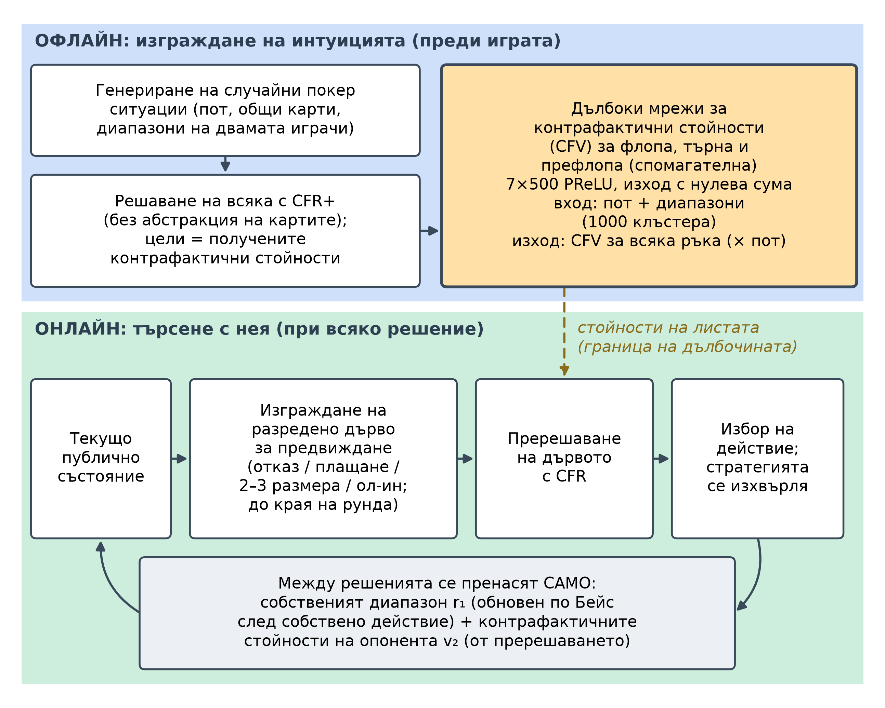
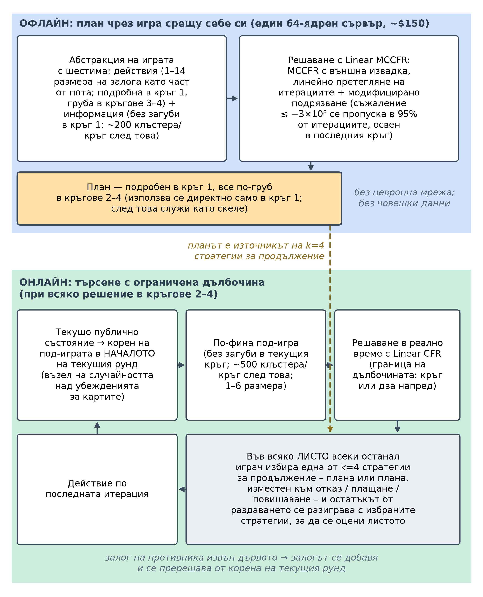
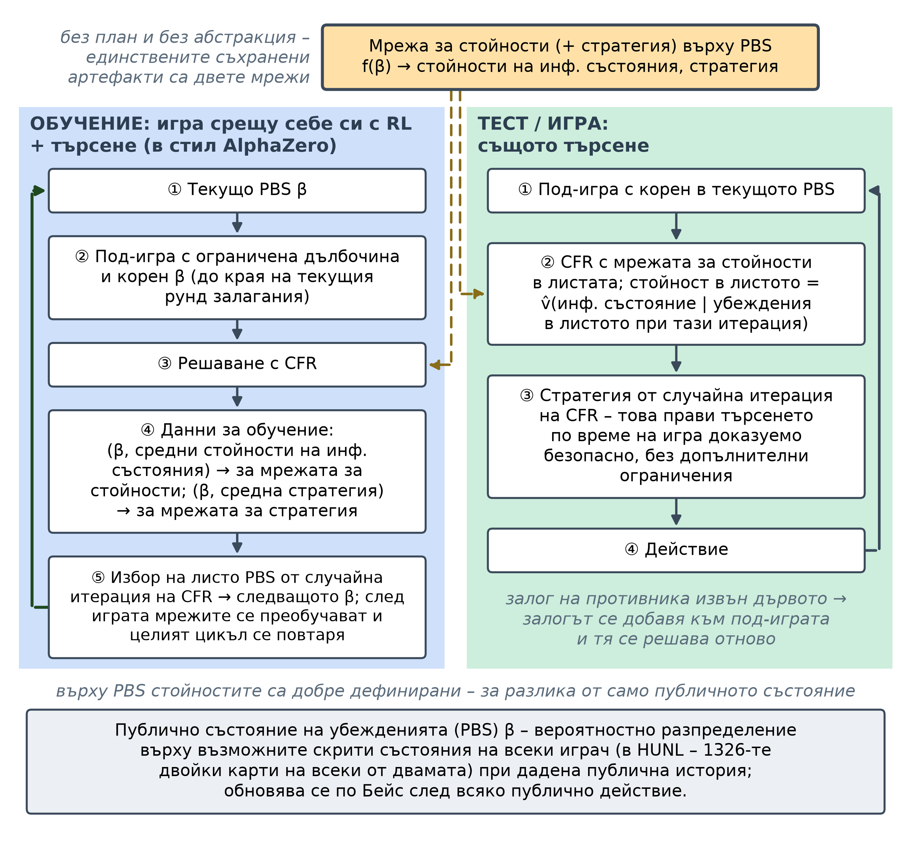
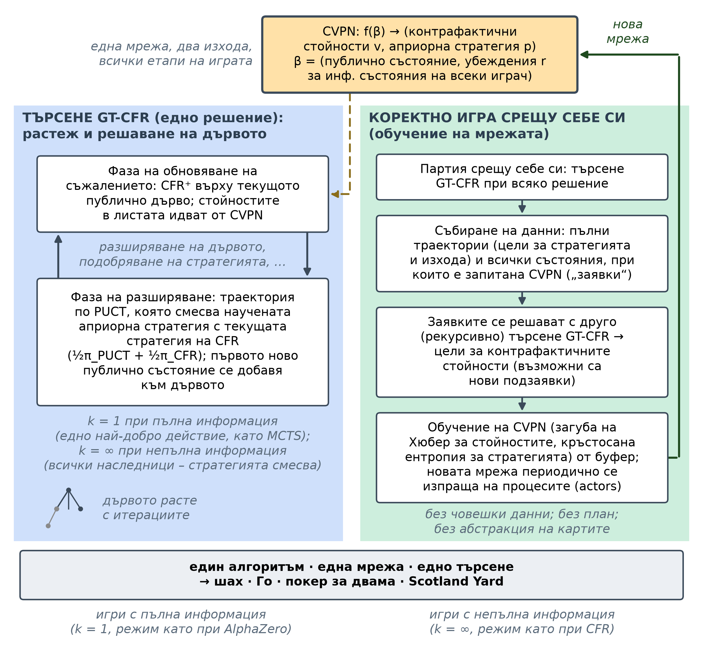
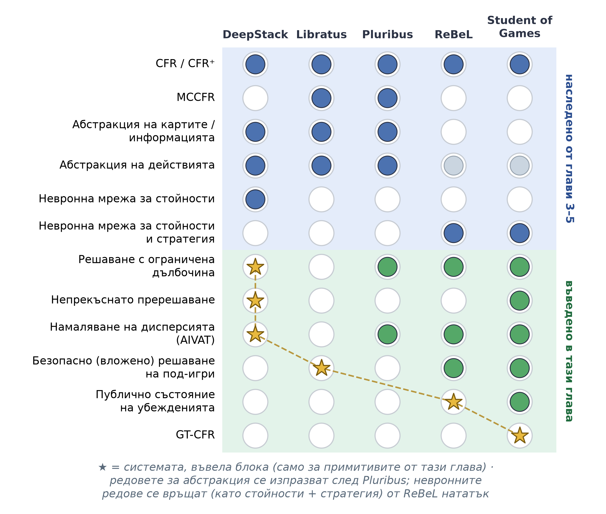

# Глава 6 – Архитектури на игрови изкуствен интелект от край до край

<!--
SKELETON / WORK IN PROGRESS.
Build order and the per-system template (the "spine") are defined in ../CHAPTER_PLAN.md.
Each system section follows the same template so cross-system comparison stands out.
Wrap finished/approved sections in the APPROVED-HIGHLIGHT markers (see Step 5 summary).
-->

## Въведение

Глава 6 е крайъгълният камък на този изследователски план. Глави 1–5 изграждат поотделно съставните елементи – игровотеоретичния речник на игрите в разгърната форма и равновесията на Наш, минимизирането на контрафактичното съжаление (CFR) и неговите **варианти на Монте Карло**, абстракцията на играта и невронните апроксиматори на функции, които заменят табличното съхранение, когато една игра го надрасне – и тази глава е мястото, където тези елементи се сглобяват в пълноценни системи от състезателно ниво. Подходът е умишлено **архитектурен**: вместо да се извеждат отново математическите зависимости, които са представени в техническите глави и цитираните статии, всяка система се разглежда на нивото на това как е *изградена* – какво изчислява **офлайн**, какво изчислява в **реално време**, къде е обучението и какво всъщност може да гарантира. Всеки раздел започва с кратка обобщаваща таблица по едни и същи девет измерения, така че системите да се сравняват с един поглед.

Петте системи обхващат седем години и, прочетени в ред, проследяват еволюцията на свръхчовешкия игрови изкуствен интелект: **DeepStack** (2017), **Libratus** (2017/2018), **Pluribus** (2019), **ReBeL** (2020) и **Student of Games** (2023). Изкушаващо е да се прочете такъв списък като класация – всяка следваща по-силна от предишната – но това нито се е случило, нито така е организирана тази глава. Прогресията е последователност от *умишлени компромиси*: всяка система придобива нова способност, като се отказва от нещо друго. Прочетена по този начин, главата е изследване на цената на всеки напредък, а не класация на победители.

Под отделните компромиси три оси на движение преминават през всичките пет системи и придават гръбнака на главата. Първата ос е **на представянето**: преходът от ръчно изградена *абстракция* – групиране на подобни ръце и допускане само на няколко размера залози – към *научено невронно приближение*, при което мрежата обобщава ситуации, които таблица никога не би могла да изброи. Втората е **времева**: преходът от *решаване на цялата игра офлайн* в съхранена стратегия към *научаване на компактен модел и търсене с него в реално време*. Третата ос се появява едва в самия край, със Student of Games: обединяването на игра с **пълна и непълна информация** в един коректен алгоритъм, съчетаващ двете големи традиции на игровия изкуствен интелект – линията минимакс / търсене в дърво по метода Монте Карло / AlphaZero и линията CFR / покер.

Една идея свързва тези нишки и заслужава да бъде назована преди самите системи, именно защото тя *не е* една от тях: **ограничено по дълбочина решаване**. Формализирано от Brown, Sandholm & Amos (2018)[^brown2018dls], то е принципът, че може да се търси само малко напред в игра с непълна информация и остатъкът да се замести с *научена или предварително изчислена стойност* – при условие че заместването се извършва така, че скритата информация да не го прави невалидно. Това е теорията, която поставя в обща рамка непрекъснатото пререшаване на **DeepStack** и вложеното решаване на под-игри на **Libratus**, която стои в основата на стратегиите за продължение на **Pluribus** и която, във формата на състояние на убеждението, се превръща във вътрешния цикъл на **ReBeL** и **Student of Games**. Ние го разглеждаме като свързваща тъкан – споменавано навсякъде, където една система го реализира – а не като шеста точка.

Накрая, още в началото си струва да се посочи единствената нишка, към която синтезът се връща. Всяка система тук е, по умишлен дизайн, **„сляпа“ за противника**: всяка изчислява стратегия, която е трудна за побеждаване *в най-лош случай* и след това я прилага без да обръща внимание кой всъщност седи срещу нея – защото отклонението с цел експлоатация може да бъде контраексплоатирано и, по думите на авторите на Pluribus, защото съществуващите техники за експлоатация на противника „изискват твърде много наблюдения, за да се конкурират с човешките способности извън малките игри“; и двете статии посочват консервативната (безопасна) експлоатация като единствено изключение.[^pluribus][^libratus] Този подход, поставящ устойчивостта на първо място, е голямата сила на областта и, за дисертация относно *адаптивна* игра, нейното определящо ограничение: именно отчитането на конкретния противник, което тези системи пропускат, глави 7–12 се стремят да добавят.

## DeepStack (2017)

DeepStack (Moravčík et al., 2017)[^deepstack], от компютърно-покер групата на Университета на Алберта с колаборатори в Прага, беше първата програма, която побеждава професионални покер играчи в безлимитния тексаски Холдем за двама (HUNL) – професионалисти, макар и не специалисти по HUNL – със статистическа значимост и първата, която поставя евристичното търсене – двигателят зад шахмата и Го – на теоретична основа в игра с непълна информация. В рамките на четириседмично проучване той победи група от 33 професионалисти с 492 хилядни от големия блайнд на раздаване (mbb/g, стандартната единица за темп на печалба в покера; 50 mbb/g представлява значително професионално предимство) в 44 852 раздавания и нито една известна техника не успя да открие пропуск в играта му. Въпросът, от който тръгва DeepStack, рамкира цялата тази глава: **може ли програма да играе покер по начина, по който AlphaGo играе Го – търсейки локално от текущата ситуация и доверявайки се на научена функция на стойността за всичко извън хоризонта – дори когато в покера самата ситуация е частично скрита?**

| С един поглед | DeepStack (2017) |
|--|------|
| Играчи | 2 (един срещу един) |
| Тип игра | HUNL – безлимитен тексаски Холдем за двама (игра за двама с нулева сума) |
| План (офлайн)? | Не – офлайн обучението е за мрежите за стойност, а не за съхранена стратегия |
| Невронна компонента | Дълбоки мрежи за контрафактични стойности (за флопа, търна и спомагателна); само стойности |
| Механизъм за търсене | Непрекъснато пререшаване (ограничено по дълбочина предвиждане с CFR при всяко решение) |
| Абстракция? | Никаква абстракция не ограничава играта; групиране в 1000 клъстера само на входа на мрежата, плюс разреден набор от залози и групиране на действията на ривъра при предвиждането |
| Също и с пълна информация? | Не (само непълна информация) |
| Изчислителни разходи | Предимно офлайн (~175 процесорни ядро-години за генериране на целите на мрежата за търна); по време на игра работи на един GPU, < 5 s/решение |
| Ключова иновация | Непрекъснато пререшаване + научени контрафактични стойности: първото *коректно* евристично търсене за игри с непълна информация |

: DeepStack (2017) накратко.

### Пропускът, който запълни

Всеки предишен етап в развитието на изкуствения интелект за игри – табла, шах, Го – се основаваше на *локално търсене*: от текущата позиция се разглеждат няколко хода напред и останалото се замества с евристична стойност. Тази рецепта предполага, че позицията е известна, а покерът нарушава това предположение – правилното действие зависи от вероятностното разпределение на скритите карти на опонента, което се разкрива единствено чрез неговите залози. Отвореният въпрос, който DeepStack се опита да реши, е дали евристичното търсене може да бъде направено *коректно* при наличие на скрита информация в мащаба на HUNL – игра с приблизително $10^{160}$ точки на решение.

Почти две десетилетия доминиращият отговор беше нещо съвсем различно: **абстракция плюс офлайн равновесие плюс транслация**, както в Глава 4 – свиване на $10^{160}$ ситуациите на HUNL до приблизително $10^{14}$ абстрактни, решаване на тази по-малка игра офлайн с CFR в съхранен *план* и *транслиране* по време на игра на всяка реална ситуация и залог на опонента към най-близката абстрактна. Компресията е със загуби и загубата се проявява като експлоатируемост – колко може да спечели опонент в най-лошия случай, основният показател за качество в областта, нула при равновесие на Наш. През 2015 г. основаната на абстракция програма Claudico загуби от професионалисти с 91 mbb/g,[^deepstack] а проверка с локален най-добър отговор (LBR, ефективно изчислима долна граница на експлоатируемостта) по-късно показа, че топ състезателните ботове са експлоатируеми с повече от 3000 mbb/g – четири пъти по-зле, отколкото ако се откажеш от всяка ръка.[^lbr] DeepStack затваря тази празнина, като изоставя цялата конструкция: никога не изгражда абстракция на цялата игра и никога не съхранява план, разсъждавайки за всяка ситуация *така както тя действително възниква* и замествайки само далечното остатъчно продължение на играта с научена оценка.

### Архитектура

DeepStack се разделя ясно на **офлайн** фаза, в която се изгражда интуицията, и **онлайн** фаза, в която с нея се търси (вж. фигурата по-долу).[^deepstack]

{width=95% fig-pos="H"}

Офлайн системата генерира милиони случайни покер ситуации и ги решава с CFR решавач, за да получи целеви *контрафактични стойности* – хипотетичните печалби, ако агентът държи всяка от възможните ръце – и тези двойки (ситуация → стойност) обучават **дълбоките мрежи за контрафактични стойности (CFV мрежи)**. Онлайн DeepStack не използва план: между отделните решения той запазва само два вектора – своя *диапазон* (разпределението върху възможните ръце, които може да държи) и *контрафактичните стойности* на опонента – а при всеки ход изпълнява CFR върху малко дърво за предвиждане, вкоренено в истинското текущо състояние, като използва CFV мрежата за изчисляване на стойностите на листата на границата на дълбочината. Невронната мрежа се използва *само* на границата на дълбочината като оценител на листата; търсенето се извършва от CFR; и – най-важното – в цикъла не се прилага абстракция на цялата игра.

### Ключова иновация: непрекъснато пререшаване с научени контрафактични стойности

Приносът на DeepStack е в обединяването на две идеи, като всяка от тях прави другата осъществима.

Първата е **непрекъснатото пререшаване**: възстановяване на свежа локална стратегия при всяко решение въз основа на поддържания диапазон и вектора на контрафактичните стойности на опонента, след което тя се изхвърля, така че агентът никога не съхранява или не се ангажира с глобална стратегия. Класическото пререшаване (Burch и др., 2014) показва, че за да се възстанови стратегия за под-игра, не е необходима цялата стратегия – достатъчни са само собственият диапазон при влизане в под-играта и векторът на контрафактичните стойности на опонента.[^burch2014]

Всичко това е възможно благодарение на начина, по който се поддържат двата вектора. След всяко събитие DeepStack актуализира своите два вектора по прости правила: при **собствено действие** той заменя пререшените контрафактични стойности за избраното действие и извършва байесови актуализации на своя диапазон; при **случайно събитие** той заменя стойностите на тази карта и анулира вече невъзможните ръце; а при **действието на опонента** той не прави *абсолютно нищо*. Този последен момент е тихият майсторски ход: тъй като той проследява *стойностите* на опонента, а не неговия *диапазон*, и никога не се нуждае от конкретното действие на опонента, за да поддържа тези стойности, той заобикаля стъпката на транслация на действията, която парализира ботовете, основани на абстракция. Опонентът може да направи всеки залог с всякакъв размер; DeepStack просто пререшава от състоянието, което този залог е произвел.

Втората идея е **научената мрежа за контрафактични стойности** – „интуицията“ на DeepStack. В игра с пълна информация оценителят на листо съпоставя едно състояние към едно число; при непълна информация той трябва да съпостави *цяло публично състояние плюс диапазоните и на двамата играчи* към *вектор* от контрафактични стойности, по една за всяка ръка, защото стойностите в един възел се променят с диапазоните, които достигат до него. С тази мрежа, която доставя стойности в края на текущия рунд за залози, ограничението по дълбочина свива пререшаваната игра от $10^{160}$ до най-много $10^{17}$ точки на решение, а описаният по-долу разреден набор от действия – до около $10^{7}$ – достатъчно малко, за да бъде решена за по-малко от пет секунди на един GPU.

Сдвояването е доказуемо коректно.[^deepstack] Ако грешката на мрежата за стойности е най-много $\epsilon$, а пререшаването изпълнява $T$ итерации на CFR, експлоатируемостта на получената стратегия е ограничена от

$$ \text{експлоатируемост} \;<\; k_1\,\epsilon \;+\; k_2/\sqrt{T}, $$

с игрово-специфични константи $k_1, k_2$. Първият член представлява цената на несъвършената интуиция, а вторият – обичайната **сходимост на CFR**. Тази граница е теоретичното ядро на статията – гаранцията, че евристичното **търсене** може да бъде пренесено в условия на **непълна информация**, без **стратегията** да стане **експлоатируема**.

### Уговорки, задънени улици и какво статията не описва

Най-важната забележка е, че **внедрената система не е тази, за която важи теоремата**. За да играе с човешка скорост, DeepStack ограничава своето предвиждане до разреден набор от залози (отказ, плащане, два или три размера на залога, ол-ин) и в статията ясно се посочва, че това „отменя свойството на коректност на Теорема 1“. Така гаранцията на внедрената система е емпирична – подкрепена от резултатите LBR по-долу – а не доказана. Второ отклонение утежнява това: доказателството за коректност предполага стойности на *най-добър отговор*, но DeepStack всъщност използва стойности от *игра срещу себе си*, които нямат теоретично обоснование, но са били по-малко експлоатируеми в ранните тестове. Доказаният алгоритъм и печелившият алгоритъм, строго погледнато, са различни алгоритми.

Абстракцията също така се промъква в периферията. DeepStack рекламира, че не използва абстракция на карти за ограничаване на играта – но *групира* ръцете в 1000 клъстера на входа на мрежата за стойности и на ривъра изцяло се отказва от мрежата, решавайки до края на играта, като използва **абстракция на действия с клъстери** за постигане на управляемост. Нито едно от двете не подкопава резултата, но заедно те показват, че заглавието „коректно търсене без абстракции“ е стремеж, който имплементацията приближава, а не постига.

### Изчислителни разходи и достъпност

Разходите на DeepStack са почти изцяло **офлайн и почти изцяло в решаването с CFR, чрез което се получават целевите стойности за мрежите**: само **мрежата за търна** изразходва около **175 процесорни ядро-години** на 6 144-ядрен клъстер, докато по време на игра DeepStack работи на **един стандартен GPU с под пет секунди на решение**.[^deepstack] Така изграждането *от нулата* беше по онова време в обсега само на добре осигурена лаборатория, макар че публична референтна имплементация на **Ледюк Холдем** намалява бариерата за влизане.

### Силни страни и ограничения

Централната сила на DeepStack е **коректност с ниска експлоатируемост**: това е първият метод за търсене при непълна информация с реална гаранция, като емпирично LBR – което излага състезателните ботове като губещи хиляди mbb/g – не успява да намери начин да го победи, а самото то губи от DeepStack над 350 mbb/g.[^deepstack] Той **не изисква абстракция на цялата игра и транслация на действия**, така че залозите на опонента извън дървото се обработват точно, без закръгляне. Допълнително предимство е оценъчната синергия – функцията на стойността на DeepStack съвпада с изискванията на оценяващия метод за намаляване на дисперсията AIVAT, като намалява стандартното отклонение в човешките проучвания с 85% и прави постигането на значимост възможно само в няколко хиляди раздавания.

Ограниченията определят дневния ред за останалата част от главата. DeepStack е приложим **само в игри за двама с нулева сума**; неговата **коректност** се основава на тази структура. Той **пререшава от нулата** при всяко решение и е валидиран единствено срещу хора и LBR – никога в директен сблъсък срещу най-силните ботове, основани на абстракция.

### Наследство и съвременна значимост

Отстранете специфичните за покера детайли и основната идея на DeepStack е **търсене с ограничена дълбочина с научен модел на стойност в листата, адаптиран към скрита информация** – аналогът при непълна информация на търсенето с насочване по стойност зад AlphaGo и AlphaZero. Тази идея не остаря и не беше забравена; тя се превърна в шаблон: ReBeL (2020)[^brown2020rebel] преформулира научаването на стойността на листата около публични състояния на убежденията със **игра срещу себе си в стила на AlphaZero**, а Student of Games (2023)[^sog] – който споделя няколко автори с DeepStack – обедини **игра с пълна и непълна информация** в един алгоритъм. **Намаляването на дисперсията в стил AIVAT**, което превръща научен модел на стойност в контролна променлива за нискодисперсна оценка на всеки стохастичен агент, остава пряко използваемо; ръчно проектираната техника *около* идеята – клъстеризацията по метода на k-средните с 1000 клъстера, отделните мрежи за всеки рунд, ръчно настроеното пререшаване – е това, което ReBeL и Student of Games заменят. Честната оценка: **като внедрена покер система DeepStack е остарял, но далеч не е просто стъпало** – неговата централна парадигма спечели и сега е основна; а за тази конкретна дисертация неговото състояние (диапазон, контрафактични стойности на опонент) и границата на разпространение на грешката са директни семена за базирано на убеждения моделиране на опонента (**принос 1**) и анализ на безопасната експлоатация (**принос 2**).

## Libratus (2017/2018)

DeepStack отговори на своя водещ въпрос, като изостави парадигмата „абстракция и план“, но все пак запази рядка абстракция на залозите в собственото си предвиждане и никога не беше изпитан в директен двубой срещу най-силните по-ранни ботове или срещу специалисти по HUNL в дълъг и строго проведен мач. Libratus (Brown & Sandholm, 2017; Carnegie Mellon)[^libratus] беше създаден независимо и обявен същата година, и направи противоположния залог: запази парадигмата „абстракция и план“ и излекува единствения ѝ фатален недостатък. Неговият водещ въпрос е огледален образ на този на DeepStack: **какво ще стане, ако решим груб план на цялата игра офлайн, след това го *поправим в реално време* там, където абстракцията е твърде груба – с доказуема гаранция, че поправката никога няма да ни направи по-експлоатируеми?** През януари 2017 г. Libratus стана първата програма, която победи най-добрите човешки специалисти по HUNL в дълъг мач, побеждавайки четирима професионалисти със 147 mbb/g в 120 000 раздавания при 99,98% значимост – и, за разлика от DeepStack, първо победи убедително в директен двубой най-добрия дотогава изкуствен интелект за покер.

| С един поглед | Libratus (2017/2018) |
|--|------|
| Играчи | 2 (един срещу един) |
| Тип игра | HUNL – безлимитен тексаски Холдем за двама (игра за двама с нулева сума) |
| План (офлайн)? | Да – абстрахирана стратегия за цялата игра, решена офлайн с MCCFR (подробна в началото, груба в края) |
| Невронна компонента | Няма – чисто табличен CFR / абстракция (без невронни мрежи никъде) |
| Механизъм за търсене | Вложено безопасно решаване на под-игри (решаване в реално време на късната игра с CFR+ и преизпълнение за всеки залог на противника извън дървото) |
| Абстракция? | Да – абстракция на карти (търн/ривър, само в плана) + асиметрична абстракция на действията; вътре в под-игрите в реално време отпада изцяло (*без абстракция на картите*) |
| Също и с пълна информация? | Не (само непълна информация) |
| Изчислителни разходи | Високи и офлайн, *и* онлайн: ~25 милиона процесорни ядро-часа на свръхкомпютъра Bridges; ~50 възела и десетки секунди за всяко късно решение; без GPU |
| Ключова иновация | План + вложено в реално време *безопасно* решаване на под-игри + самоусъвършенстване: точни, доказуемо безопасни отговори на залози извън дървото вместо транслация на действия |

: Libratus (2017/2018) накратко.

### Пропускът, който запълни

Предишният раздел очерта парадигмата, която **DeepStack** отхвърли – абстракция плюс офлайн равновесие плюс транслация – и посочи нейния фатален недостатък. **Libratus** се насочва точно към този недостатък, без да отхвърля парадигмата. Планът се решава предварително върху *фиксирано* меню от размери на залози; по време на игра всеки залог на противника, който не е в това меню, се *транслира* – закръгля се до най-близкия размер, който ботът познава. Това закръгляне е единствената най-голяма експлоатируема слабост в покера, основан на абстракция: през 2015 г. предшественикът на **Libratus** – **Claudico** – загуби първия мач *Brains vs. AI* срещу професионалисти с 91 mbb/g, отчасти защото опонентите можеха да усетят и накажат неговите граници на транслация.[^ganzfried2016reflections] Същата година тогава предложи две противоположни решения на един и същ проблем – едно невронно и без план, друго таблично и базирано на план – и **Libratus** е доказателството, че по-старата парадигма, правилно поправена, все още беше достатъчна, за да достигне свръхчовешка игра.

### Архитектура

Libratus представлява конвейер от три модула, които функционират на три различни времеви мащаба – **офлайн** (преди мача), **онлайн** (при всяко вземане на решение) и **през нощта** (между отделните дни на игра) – и, за разлика от всички останали системи в тази глава, той не съдържа **никаква невронна мрежа** (вж. фигурата по-долу).[^libratus]

{width=95% fig-pos="H"}

**Модул 1 – планът (офлайн).** Libratus първо компресира приблизително $10^{161}$ точки на решение на HUNL до около $10^{12}$ чрез *абстракция на действията*, която запазва само дискретно меню от размери на залозите, и *абстракция на карти*, която групира стратегически сходни ръце и се прилага само за търна и ривъра и само в плана.[^libratusijcai] След това тази абстрактна игра се решава чрез игра срещу себе си с усъвършенстван **метод Монте Карло за минимизиране на контрафактичното съжаление (MCCFR)**, който вероятностно премахва клонове с много отрицателно съжаление. Резултатът е **планът**: пълна, но неравномерна стратегия – детайлна в началото, груба в края – чиито стойности от късните рундове се използват не за игра, а единствено за *оценяване на стойността на достигане до под-игра*.

**Модул 2 – вложено безопасно решаване на под-игри (онлайн).** Libratus използва плана само в ранните кръгове. При достигане на третия рунд за залози – или всяка по-ранна точка, където останалата част от раздаването е достатъчно малка – той изоставя грубия план за късната игра и вместо това **изгражда нова, по-финозърнеста под-игра без абстракция на карти и я решава в реално време** с високо оптимизиран **CFR+** (бърз, детерминистичен вариант на CFR). Когато противникът направи залог, който не фигурира в менюто на плана, вместо да го закръгли, Libratus решава нова под-игра, която *съдържа точно този залог*, и повтаря това за всяко следващо действие извън менюто – *вложено* решаване на под-игри.

**Модул 3 – модулът за самоусъвършенстване (през нощта).** Тъй като решаването в реално време се пропуска в първите два рунда, залозите на противника извън менюто *там* все още се закръглят. Модулът за самоусъвършенстване стеснява тази остатъчна слабост между игралните дни: през нощта той изчислява правилни игровотеоретични отговори на няколко от най-вредните пропуски и присажда тези клонове в плана. Нарочно това **не е експлоатация на противника** – той никога не се опитва да моделира и наказва грешките на хората (което би изложило Libratus на контраексплоатация). Вместо това използва залозите на противниците единствено като насока *кои от собствените пропуски на Libratus да закърпи*, а закърпванията са универсални, подобрявайки играта срещу всеки бъдещ противник.

### Ключова иновация: вложено безопасно решаване на под-игри

Централният принос на Libratus е да направи **решаването на под-игра в реално време едновременно *безопасно* и *вложено*** – достатъчно силно, за да победи хората, и доказано неспособно да направи стратегията значително по-експлоатируема от плана, който усъвършенства.

Както в Глава 4, под-игра с непълна информация *не може да бъде решена изолирано*: правилната ѝ стратегия зависи от стратегиите в *други, недостигнати* под-игри, а по-ранните програми за решаване в реално време, които просто приемаха, че противникът е следвал плана до този момент – **небезопасно** решаване на под-игра – можеха да бъдат наказани с всяко отклонение. Libratus премахва това предположение с едно малко **приспособление**, *разширената под-игра*. В корена на под-играта на противника се предоставя избор за всяка ръка, която той може да държи: или да вземе фиксирана **алтернативна печалба** – оценката на плана за това колко струва тази ръка тук – или да *влезе* в детайлната под-игра и да я изиграе. Решаването на тази разширена игра принуждава усъвършенстваната стратегия на Libratus да направи противника **не по-добре от тази оценка за всяка възможна ръка**, което е точното значение на „безопасен“. Libratus изостря това с вариант, който авторите наричат **Estimated-Maxmargin** – той максимизира *най-малкия* резерв за безопасност по всички възможни ръце на противника – като използва оценки на плана за стойностите на противника вместо консервативни **горни граници** и придава по-малка тежест на ръцете, които противникът би могъл да държи само ако е допуснал грешка по-рано.

Комбинацията идва с гаранция, която е паралелна на тази на DeepStack.[^brown2017] Ако $\sigma^{*}$ е най-малко експлоатируемата стратегия, която се различава от плана само в рамките на решените под-игри, а оценката на плана за стойностите на под-играта на противника има отклонение не повече от $\Delta$, тогава експлоатируемостта на усъвършенстваната стратегия се подчинява

$$ \text{експлоатируемост}(\sigma_{\text{усъв}}) \;\le\; \text{експлоатируемост}(\sigma^{*}) \;+\; 2\Delta. $$

Членът $2\Delta$ представлява цената на несъвършените оценки на стойностите и е структурно аналогичен на члена $k_1\epsilon$ в DeepStack – и двата определят колко една грешка в стойностите, подадени на решавача, може да повлияе върху експлоатируемостта в най-лошия случай.

„Вложено“ е втората половина. Вместо да разширява менюто за залози на плана (което би раздуло предварителното офлайн решаване), Libratus създава **отделен отговор на всеки залог извън менюто в реално време**: когато противникът направи залог с размер, който не е бил изброяван преди, той изгражда разширена под-игра, чиято алтернативна печалба е най-доброто *в менюто* действие, което противникът би могъл да предприеме вместо това, решава я и го прави отново за всеки следващ залог извън менюто по време на раздаването. В контролираните експерименти това превъзхожда предишния стандарт – закръгляне на залога до най-близкия размер в менюто – с повече от порядък по отношение на експлоатируемост в най-лошия случай (119 срещу 1465 mbb/g в докладвания тест с малки игри).[^brown2017]

### Уговорки, задънени улици и какво статията не описва

Най-разкривателното ограничение е, че **само планът не е свръхчовешки – той дори не побеждава предишния бот**. Срещу Baby Tartanian8, победителя от състезанието през 2016 г., суровият план на Libratus не го побеждава (−8 ± 15 mbb/g при 95% доверителен интервал); едва когато вложеното решаване на под-игри беше включено, същата система спечели с 63 ± 28 mbb/g.[^libratus] С други думи, предварителната стратегия е скеле и по същество цялото предимство на Libratus идва от търсене в реално време.

Няколко други важни детайла си струва да се отбележат. **Транслацията на действия не е премахната, а само ограничена**: в първите два рунда на залагане Libratus все още закръгля залозите на опонента извън менюто, а целият модул за самоусъвършенстване съществува, за да работи върху този остатъчен проблем, по три „дупки“ на нощ, без никога да го отстранява напълно. **Безопасното решаване на под-игри трябваше да бъде преработено, за да стане изобщо приложимо** – в продължение на три години се смяташе за непрактично, тъй като в директен сблъсък учебниково-безопасното решаване губеше от теоретично необоснования *небезопасен* вариант – и дори тогава Libratus умишлено използва *небезопасен* метод за решаване веднъж, при първото си влизане в третия рунд, защото там е по-евтин и емпирично достатъчно добър. Използването на оценки вместо горни граници може по принцип да повиши експлоатируемостта *над* тази на плана, ограничена единствено от $2\Delta$ на теоремата. И накрая, истинската цена на изчисленията излиза наяве едва във вторичните източници, а **кодът никога не е бил публикуван**, оставяйки независимата проверка да се основава единствено на публикувания псевдокод.

### Изчислителни разходи и достъпност

Където сметката на DeepStack се плаща почти изцяло офлайн, а играта му е евтина, Libratus е **скъп и в двата края**. Проектът е консумирал приблизително **25 милиона процесорни ядро-часа** на свръхкомпютъра Bridges в Pittsburgh Supercomputing Center за една година – от които около 6 милиона са отишли за изграждане и решаване на плана, около 3 милиона за решаване на под-игри в реално време по време на мача, около 3 милиона за модула за самоусъвършенстване и останалите ~13 милиона за експериментални опити и оценка.[^libratusijcai] Всяко **решаване на под-игра в реално време е използвало около 50 възела и е отнемало порядък на десетки секунди**, без GPU никъде,[^sandholm2021] което направи Libratus, както беше внедрен, по същество невъзможен за възпроизвеждане извън голям център за свръхкомпютри.

### Силни страни и ограничения

Главното предимство на Libratus е **решителна, строго демонстрирана свръхчовешка игра**: той побеждава всеки от четиримата професионалисти индивидуално и, за разлика от DeepStack, побеждава и **предходния най-добър изкуствен интелект за покер в директен сблъсък** с 63 mbb/g, отделяйки своята сила от въпроса за човешкото умение. Ограниченията му – само за игра за двама с нулева сума, основан на абстракция, все още транслира залози извън менюто в ранните рундове, никакво невронно обобщаване и игра в мащаба на свръхкомпютър – подготвят останалата част от главата, а тъй като както хората, така и изкуственият интелект се адаптираха по време на мача, дори значимостта в заглавието е, стриктно казано, „сякаш-независима“ стойност, въпреки че предимство от 147 mbb/g за 120 000 раздавания не оставя никакво реално съмнение.[^libratus]

### Наследство и съвременна значимост

Извадете абстракционния механизъм и трайната идея на Libratus е **търсене в реално време, насложено върху груба предварително изчислена стратегия, направено безопасно при скрита информация**: решавайте локалната ситуация точно в момента на вземане на решение, в съответствие с евтин глобален план, и реагирайте на това, което опонентът действително прави, а не на закръглено приближение на него. Вложеното безопасно решаване на под-игри на Libratus е пряк предшественик на търсенето в реално време в **Pluribus** (2019), а същият модел „усъвършенствайте глобална оценка на стойността с локално решаване“ се появява отново, сега с *научени* стойности, заменящи табличната схема, в **ReBeL** (2020). Честната оценка е, че Libratus е *надминат като архитектура, но оправдан като теза*: неговият залог, че **търсенето в реално време има по-голямо значение от по-голяма предварително изчислена стратегия**, беше напълно точен, дори когато залогът му върху табличната абстракция беше надминат. За настоящата дисертация Libratus дава две основи: неговата граница на експлоатируемостта при безопасно решаване на под-игри е шаблон за **безопасна експлоатация при грешка в стойността (Принос 2)**, а умишленият му отказ да експлоатира – „поправете собствените си слабости, не моделирайте противника“ – е точният контрапункт, спрямо който може да бъде дефинирана *ограничена, целенасочена* **адаптация към противника** (Принос 1).

## Pluribus (2019)

Libratus сложи точка на въпроса за безлимитния Холдем за двама, но неговите гаранции за безопасност – и всъщност самото значение на „решаването“ на играта – се основаваха на структурата на игра с нулева сума за двама играчи. Холдемът, както хората всъщност го играят обаче, събира шестима. Pluribus (Brown & Sandholm, 2019; Carnegie Mellon и Facebook AI)[^pluribus] се изправи директно пред въпроса за игрите с много играчи: **какво се случва с рецептата план-плюс-търсене в реално време, когато махнете патерицата на игрите за двама и седнете на маса за шестима – обстановка, в която равновесието на Наш не е нито уникално, нито ефективно изчислимо, нито дори гаранция, че няма да загубите?** Отговорът му беше емпиричен и категоричен. В два формата – петима професионалисти, седнали с едно копие на Pluribus, и един професионалист срещу пет копия – той победи петнадесет елитни професионалисти, печелейки около **48 хилядни от големия блайнд на раздаване** срещу петима души наведнъж (приблизително пет големи блайнда на сто раздавания, решаващ марж на маса с шестима) при 95% статистическа значимост. И го направи след обучение в продължение на **осем дни на един 64-ядрен сървър за около $150 облачни изчисления** – с около хиляда пъти по-малко изчисления, отколкото изразходва свръхкомпютърът на Libratus.

| С един поглед | Pluribus (2019) |
|--|------|
| Играчи | 6 (маса с шестима, 6-max) – първият свръхчовешки изкуствен интелект в която и да е еталонна игра с повече от двама играчи/отбора |
| Тип игра | 6-max NLHE – безлимитен тексаски Холдем с шестима играчи (непълна информация; с много играчи, *не* е игра за двама с нулева сума) |
| План (офлайн)? | Да – цялостен план за играта, решен офлайн чрез Linear MCCFR; използва се *директно* само в първия рунд за залози, след това служи като скеле |
| Невронна компонента | Няма – изцяло табличен CFR / абстракция (без невронни мрежи никъде, както при Libratus) |
| Механизъм за търсене | Търсене в реално време с *ограничена дълбочина* с k=4 стратегии за продължение в листата (вложени *небезопасни* решавания, пререшаване от началото на всеки рунд за залози); Linear CFR вътре в под-игрите |
| Абстракция? | Да – действия (1–14 размера на залозите в плана; 1–6 при търсене) + информационна абстракция (без загуби в първия рунд; със загуби в по-късните, по-детайлни при търсенето, отколкото в плана) |
| Също и с пълна информация? | Не (само непълна информация) |
| Изчислителни разходи | Забележително ниски: план ~12 400 ядро-часа / 8 дни / < 512 GB на един 64-ядрен сървър (~$144); игра на 2 процесора (28 ядра), < 128 GB, без GPU, 1–33 s/решение |
| Ключова иновация | Свръхчовешка игра с шестима играчи чрез план + търсене с ограничена дълбочина със стратегии за продължение – спечели *емпирично*, с минимален бюджет, без **гаранция за безопасност при N играчи** |

: Pluribus (2019) накратко.

### Пропускът, който запълни

Всеки свръхчовешки игрови изкуствен интелект преди Pluribus – дама, шах, Го и двете предходни покер програми – споделяше едно скрито предположение: двама играчи, нулева сума. В тази обстановка равновесието на Наш носи свойство, което го прави очевидната цел: на всеки играч, който възприеме такова равновесие, е *гарантирано, че няма да загуби* средно (по математическо очакване), независимо какво прави противникът, и ако двама играчи независимо изчислят равновесия, техните стратегии все още се комбинират в равновесие. При повече от двама играчи намирането – дори приближаването – на равновесие на Наш е изчислително непосилен проблем в общия случай; обикновено има *много* равновесия; и, фатално, ако всеки играч независимо избере едно, получената съвместна стратегия може да не бъде равновесие изобщо, така че играчът може да *загуби*, докато играе безупречна равновесна стратегия. Заключението е рязко – в покера с много играчи равновесието на Наш *не е нито уникално, нито гаранция за безопасност*, а дефиницията на успеха в тази област от две десетилетия просто изчезва.

Pluribus затваря тази празнина, като променя целта и след това я постига: той цели единствено *емпирично и последователно да побеждава елитни хора* и предварително приема, че неговите алгоритми не носят гаранция за сближаване към равновесие извън играта за двама с нулева сума. Тази отстъпка е цялата същност – и това е точната празнина, която принос 2 на тази дисертация се стреми да запълни. Другата половина на празнината е механична: с шестима играчи решаването на всяка под-игра в късната фаза *докрай* в реално време, както правеше Libratus, става непрактично, така че Pluribus се нуждаеше от търсене в реално време, което да гледа само малко напред и да спира.

### Архитектура

Както и при Libratus, Pluribus се разделя на офлайн фаза, която изгражда план, и онлайн фаза, която извършва търсене – но балансът на силите между тях е обърнат и, отново както при Libratus, **няма невронна мрежа никъде** (вж. фигурата по-долу).

{width=95% fig-pos="H"}

Офлайн Pluribus изчислява план за цялата игра чрез игра срещу себе си с **Монте Карло CFR (MCCFR) с външна извадка**, като абстрахира играта само грубо, и използва този план *директно* само в първия от четирите кръга на залагане. Навсякъде другаде – флоп, търн, ривър – Pluribus изхвърля грубия план локално и **търси в реално време** по-детайлна стратегия, точно както направи Libratus, с една решаваща разлика: той не решава до края на играта. Той разглежда само един или два кръга напред до граница на дълбочината и спира, което прави шест играчи изчислително достъпни. За разлика от Libratus, няма **модул за самоусъвършенстване**: Pluribus никога не поправя своя план между сесиите, тъй като търсенето с ограничена дълбочина в три от четирите кръга вече извършва поправките.

### Ключова иновация: търсене с ограничена дълбочина със стратегии за продължение

Евристичното търсене в шах или Го работи, като гледа на фиксирано разстояние напред и отчита стойност от хоризонта при предположението, че и двете страни ще играят добре след това. Това предположение напълно се проваля при скрита информация, а Brown и Sandholm илюстрират провала с еднократна последователна игра „камък–ножица–хартия“: ако търсещият приеме, че противникът ще играе равновесие (всеки ход една трета от времето) отвъд хоризонта, тогава всяко действие изглежда еднакво оценено на нула и търсещият може да се установи на „винаги играй камък“ – при което противникът преминава към „винаги хартия“ и истинската стойност рязко спада. Листо в игра с непълна информация следователно няма *една-единствена стойност*: неговата стойност зависи от стратегията, която търсещият ще възприеме, което е именно това, което търсенето се опитва да определи.

Централният принос на Pluribus е начинът, по който все пак се определя стойност за листата. Когато търсенето достигне границата на дълбочината, вместо да се фиксира една стратегия за продължение, **всеки играч, който все още е в раздаването, избира измежду четири различни стратегии за продължение** за остатъка от играта и може да ги смесва. Четирите са умишлено опростени: самият план и три изместени копия, които умножават вероятността за *отказ*, за *плащане* и за *повишаване* (всеки след това се ренормализира). Тъй като противникът винаги може да премине към стратегия за продължение, която най-много наказва търсещия, небалансирана стратегия – покер еквивалентът на винаги играене на камък – вече не се възнаграждава и търсещият се насочва към баланс. Тази идея първоначално беше доказана в предшественика за двама играчи Modicum (Brown, Sandholm & Amos, 2018), който победи двама бивши шампионски бота, докато работеше на 4-ядрен лаптоп с 16 GB памет.[^brown2018dls]

Pluribus обобщава идеята от двама играчи на шестима. В Modicum само *противникът* избираше измежду стратегии за продължение, докато търсещият винаги следваше плана; Pluribus позволява на **търсещия също да избира измежду стратегиите за продължение**, което балансира играчите. Освен това той не пререшава от текущата точка за вземане на решение, а от *началото на текущия рунд за залози*, като фиксира единствено вече предприетите действия. Това „небезопасно“ търсене – наречено така, защото, за разлика от търсенето на Libratus, не дава гаранция, която да ограничава **експлоатируемостта** – е по-евтино и, тъй като започва непосредствено след случайно събитие с множество разклонения, на практика се оказва трудно за експлоатиране.

Това, което очевидно липсва от всичко това, е една *гаранция*. DeepStack ограничи своята експлоатируемост до $k_1\epsilon + k_2/\sqrt{T}$,[^deepstack] а Libratus – до $2\Delta$;[^brown2017] Pluribus не предлага такова ограничение и пропускането е принципно, а не поради небрежност. Двигателят на CFR все още, във всяка крайна игра, свежда *средното съжаление* на всеки играч до нула,

$$ \frac{R_i^{T}}{T} \;\longrightarrow\; 0 \qquad (\text{без съжаление}), $$

но изводът, който доведе двамата предшественици от липсата на съжаление до безопасност – *играта без съжаление (no-regret) се сближава към равновесие на Наш и едно равновесие на Наш не може да бъде победено* – важи само когато има двама играчи и играта е с нулева сума. При шестима играчи първото следствие отпада (играта срещу себе си не е задължително да се доближава до равновесие), а второто е безсмислено (едно равновесие не е непобедимо). Самите итерации, които *доказаха* DeepStack и Libratus безопасни, следователно носят на Pluribus само емпирична сила: свръхчовешка на практика, без нищо сертифицирано.

### Уговорки, задънени улици и какво статията не описва

Най-същественото признание е, че Pluribus използва **небезопасно** решаване на под-игра – той предполага, че опонентите са играли стратегията, която той изчислява *за* тях – което, както авторите заявяват ясно, „няма теоретични гаранции за представянето дори в игри за двама с нулева сума и има случаи, в които води до силно експлоатируеми стратегии“.[^pluribussm] Съществуват безопасни алтернативи, но при директен сблъсък те се представиха по-зле, така че Pluribus взема емпиричната победа и смекчава риска само като винаги пререшава от началото на рунда за залози. Втора слабост е наследена и никога не е напълно затворена: в *първия* рунд за залози залозите на опонента, които се отклоняват твърде много от менюто на плана, все още се **закръглят** чрез транслация на действия, и Pluribus, тъй като няма модул за самоусъвършенстване, просто живее с нея.

Основните нововъведения на Pluribus **никога не са оценени поотделно (чрез аблация)** – авторите признават, че измерването на приноса на всяко едно от тях е „твърде скъпо“ – но статията за предшественика за двама играчи показва, че приемането на *една-единствена* стратегия за продължение (плана) в листата губи от Baby Tartanian8 (−10 ± 8 mbb/g) и не побеждава Slumbot (−1 ± 15), докато версията с четири стратегии за продължение побеждава и двата бота (+6 ± 5 и +11 ± 9);[^brown2018dls] наборът от стратегии за продължение върши реална работа, а не е украшение. По-малки любопитни факти допълват картината: Pluribus играе стратегията от **последната** итерация на търсенето, а не обичайната усреднена по итерациите стратегия, за да избегне остатъчни лоши действия; по време на играта срещу себе си той се научи да **избягва влизането само с плащане на блайнда („лимпинг“)**, но **залага „донк“ (с изпреварващ залог) много по-често от хората**; и – както Libratus – неговият **код никога не е бил публикуван**, оставяйки само псевдокод за независима проверка, тъй като покерът се играе комерсиално.

### Изчислителни разходи и достъпност

Планът беше обучен за **осем дни на един 64-ядрен сървър** за около **12 400 ядро-часа** и под 512 GB памет – приблизително **$144** при спот цени в облака – а на масата Pluribus работи на **два CPU (28 ядра) и под 128 GB, без GPU на който и да е етап**.[^pluribus] Докато DeepStack концентрира разходите си офлайн, а Libratus плащаше скъпо и в двата края, Pluribus е **евтин и в двата края**. Рязкото поевтиняване не е магия, а резултат от алгоритмите: съчетаването на търсене с ограничена дълбочина (което авторите оценяват, че спестява поне пет порядъка спрямо решаване до края), линеен CFR и агресивно подрязване и пестене на памет. Тъй като код не е публикуван обаче, „достъпен“ описва *метода*, демонстриран в мащаб на лаптоп от Modicum, повече отколкото изтегляема програма.

### Силни страни и ограничения

Главното предимство на Pluribus е просто в това, че е **първи**: първият изкуствен интелект, който постига свръхчовешко представяне в която и да е широко призната еталонна игра с повече от двама играчи или два отбора и в най-популярната форма на покера.[^pluribus] Победата беше решителна и строга – **+48 mbb/g (p = 0,028)** срещу петима елитни професионалисти на масата и **+32 mbb/g (p = 0,014)** с пет копия срещу един-единствен професионалист – измерена с намалителя на дисперсията **AIVAT** (който намали дисперсията около девет пъти) в 20 000 раздавания.

Ограниченията са именно това, от което се отказа, за да стигне дотук. Pluribus **няма абсолютно никаква гаранция за безопасност** в обстановката с шестима играчи – няма сходимост към равновесие на Наш, няма граница на експлоатируемостта – така че неговото свръхчовешко състояние е *емпиричен* факт за петнадесет силни играчи в 20 000 раздавания, а не теорема. Статията твърди само, че „съществуват мащабни и сложни среди с много играчи и непълна информация, в които внимателно конструиран алгоритъм за игра срещу себе си с търсене може да създаде свръхчовешки стратегии“.[^pluribus] И неговият темп на печалба от 48 mbb/g на маса с шестима, макар и решителен, не е в същата „валута“ като 147-те mbb/g на Libratus в игра един срещу един – различна игра, петима опоненти, по-висока дисперсия.

### Наследство и съвременна значимост

Две идеи надживяват спецификите на покера. Първата е техническа: **търсене с ограничена дълбочина, направено коректно при скрита информация чрез даване на всяко листо на малко меню от избираеми стратегии за продължение вместо една-единствена стойност**. Втората е икономическа: Pluribus е каноничната демонстрация, че **по-труден проблем може да бъде решен с хиляда пъти *по-малко* изчисления чрез по-добри алгоритми и търсене в момента на вземане на решение**, вместо повече хардуер. В архитектурната дъга на тази глава Pluribus е точката, в която *бариерата на броя играчи* пада; *бариерата на обобщаването*, която той оставя изправена – всичко все още е таблично и ръчно абстрахирано – е това, което **ReBeL** и **Student of Games** разрушават след това, като заменят плана с научени стойности на състоянието на убеждението. За тази дисертация по-специално Pluribus е ключовият камък на принос 2 – емпиричното доказателство, че методите, съчетаващи равновесие на Наш и търсене, *работят* в игри с N играчи и непълна информация, без да предлагат **абсолютно никаква гаранция за безопасност**, което е точно пропускът, който една теория на многоагентната безопасна експлоатация трябва да затвори.

## ReBeL (2020)

Pluribus преодоля бариерата на броя играчи, но го направи, като остана точно това, което беше Libratus – гигантска, ръчно абстрахирана таблица за търсене без нищо научено, което да се прехвърля от една ситуация в друга – и постигна победата си с шестима играчи, като изцяло се отказа от безопасността. ReBeL (Brown, Bakhtin, Lerer & Gong, 2020; Facebook AI Research)[^brown2020rebel] прави крачка назад от шестима към двама играчи и задава обратния въпрос: **какво ще стане, ако вместо ръчно да създаваме абстракция и предварително да изчисляваме план, пуснем AlphaZero – обучение с подкрепление чрез игра срещу себе си плюс търсене, както по време на обучението, така и по време на игра – в игра със скрита информация, възстановявайки гаранциите, които Pluribus отхвърли?** Неговият отговор, *рекурсивно обучение на основата на убеждения* (Recursive Belief-based Learning), е по думите на авторите първият алгоритъм, който прави обучението с подкрепление и търсенето доказуемо коректни в игри с непълна информация. Трикът е да се преформулира играта като „игра с пълна информация“ върху **публични състояния на убежденията (PBS)** – вероятностни разпределения за това какво може да държи всеки играч при даденото общо знание – върху които функциите на стойността и на стратегията са добре дефинирани; след това цикъл в стил AlphaZero обучава невронна мрежа за стойности (и стратегия) върху тези състояния, като минимизирането на контрафактичното съжаление (CFR) решава под-игри с ограничена дълбочина на листата. ReBeL доказуемо клони към равновесие на Наш във всяка игра за двама с нулева сума и побеждава Донг Ким – професионалист в хедс-ъп, загубил най-малко от Libratus – със 165 mbb/g в рамките на 7 500 раздавания, като използва *значително по-малко* експертни познания от всеки предишен покер изкуствен интелект – и, за разлика от затворените Libratus и Pluribus, неговата реализация (за Liar's Dice) беше **отворена**.

| С един поглед | ReBeL (2020) |
|--|------|
| Играчи | 2 (хедс-ъп) – *гаранциите* са за игра за двама с нулева сума; формализмът е за N играчи, но гаранциите и експериментите са само за двама |
| Тип игра | Произволни игри за двама с нулева сума и непълна информация; оценен върху HUNL покер и Liar's Dice (и опростения вариант turn endgame hold'em). Редуцира се до алгоритъм в стил AlphaZero при игри с пълна информация |
| План (офлайн)? | Няма съхранен план – офлайн продуктът е *научена мрежа за стойности (+ стратегия) върху PBS*, получена чрез игра срещу себе си, а не таблица на стратегиите |
| Невронна компонента | Мрежа за стойности върху PBS + (по избор) мрежа за стратегия върху PBS; MLP (GeLU/LayerNorm), за покера 6 скрити слоя по 1536 неврона; вход = убеждения върху 1326-те възможни ръце на всеки играч + общите карти + пота + флаг за залог |
| Механизъм за търсене | CFR (CFR-D / CFR-AVG; също FP/FLOP), решаващ под-игра с ограничена дълбочина и корен в PBS, като научената мрежа за стойности дава (зависещите от итерацията) стойности в листата – както по време на **обучението**, така и по време на **игра** |
| Абстракция? | Няма – няма абстракция на карти/информация (със загуби или без); мрежата за стойности я замества. Запазва се само малко (≤9) ръчно избрано меню от размери на залозите, като залозите извън дървото се добавят в реално време |
| Също и с пълна информация? | Не (представен и оценен като метод за игри с непълна информация), с уточнението, че *дегенерира* до търсене в стил AlphaZero, ако частната информация бъде премахната – пълното обединяване е претенция на Student of Games |
| Изчислителни разходи | Обучение на GPU: пълният агент за HUNL използва ~90 DGX-1 възела × 8 V100 GPU за генериране на данни чрез игра срещу себе си (за разлика от ~$150 само за CPU при Pluribus); CFR в една нишка на CPU; игра < 2 s на раздаване, ≤ 5 s на решение |
| Ключова иновация | Публични състояния на убежденията + цикъл на игра срещу себе си в стил AlphaZero, който обучава мрежа за стойности/стратегия върху PBS, а CFR работи в пространството на убежденията: по думите на авторите първото *коректно* съчетание на RL и търсене за игри с непълна информация; възстановява доказуема гаранция за равновесие на Наш при 2p0s без абстракция и без план |

: ReBeL (2020) накратко.

### Пропускът, който запълни

Libratus и Pluribus бяха, в основата си, *таблични* обекти – стратегия или план, съхранени върху ръчно проектирана абстракция; само DeepStack имаше невронна компонента, но дори и той разчиташе на клъстеризация в 1000 клъстера на входа на мрежата и абстракция на ривъра. Междувременно най-успешната парадигма в изкуствения интелект за игри – съчетанието в AlphaZero на обучение с подкрепление чрез игра срещу себе си и търсене – беше *недостъпна* за игри с непълна информация: дотогава алгоритмите, съчетаващи обучение с подкрепление и търсене, не са били теоретично коректни при непълна информация и не е било показано, че са успешни в такива игри.[^brown2020rebel]

Причината е концептуалната същност на цялата глава. AlphaZero предполага, че всяко състояние има една единствена добре дефинирана стойност, а скритата информация унищожава това предположение. Примерът в статията е модифициран камък-ножица-хартия, в който ножицата печели (или губи) двойно: равновесието е да се хвърля камък и хартия 40% от времето и ножица 20%, и при това равновесие всяко действие има очаквана стойност нула. Еднопластово търсене в стила на шаха, което използва равновесната стойност в листата, намира всеки ход еднакво добър и може да се спре на „винаги камък“, след което противникът преминава към „винаги хартия“ и истинската стойност на камъка се срива от 0 до −1. **В игра с непълна информация стойността на едно действие зависи от вероятността, с която то се изиграва**, така че състояние, дефинирано само от последователността на действията, няма единствена стойност. Pluribus беше закърпил симптома с избираеми стратегии за продължение в листата[^brown2018dls]; ReBeL лекува болестта, като предефинира състоянието така, че да включва разпределението на вероятностите върху скритата информация – *публично състояние на убежденията* – върху което стойностите отново стават добре дефинирани. Ръчно създадената абстракция и предварително изчисленият план изчезват, заменени от функция на стойността, научена единствено от игра срещу себе си.

### Архитектура

ReBeL е най-добре да се възприема като **AlphaZero за непълна информация**: цикъл на игра срещу себе си, който обучава невронни мрежи за стойности и стратегии, при който „търсенето“, използвано както по време на обучение, така и при игра, представлява решаване с CFR на под-игра с ограничена дълбочина, а всичко се извършва върху *публични състояния на убежденията*, а не върху сурови игрови състояния (вж. фигурата по-долу).[^brown2020rebel][^bakhtin2020]

{width=96% fig-pos="H"}

Започвайки от коренно PBS, ReBeL построява под-игра с ограничена дълбочина, решава я с CFR (конкретно CFR-D, „CFR с декомпозиция“, или неговия вариант CFR-AVG), записва решените стойности и стратегия като цели на обучението, избира листо, което става следващото коренно PBS, и продължава до края на играта – след това преобучава мрежите и повтаря процеса, по същия начин както AlphaZero редува игра срещу себе си с обучение на мрежата. На всяка итерация на CFR стойността на всяко листо идва от **научената мрежа за стойности върху PBS** – така стойностите в листата се променят от итерация до итерация, което е именно това, което гарантира коректността на търсенето при наличие на скрита информация; незадължителна мрежа за стратегия дава на CFR добра начална стратегия (warm start) и така намалява броя на необходимите итерации. Няма **предварително изготвен план** – единствените резултати от обучението са двете мрежи – и няма **абстракция** от какъвто и да е вид: ReBeL изчислява отделна стратегия за всяко информационно състояние, като подава на мрежата единствено суровото разпределение на убежденията върху възможните 1326 ръце и на двамата играчи, плюс общите карти, пота и един флаг „дали някой е заложил този рунд“. CFR (Глава 3) изпълнява търсенето, а невронното приближение на стойността (Глава 5) е оценителят на листата – сега обединени в един цикъл „игра срещу себе си плюс търсене“.

### Ключова иновация: публични състояния на убежденията и научени стойности в пространството на убежденията

Приносът на ReBeL е един концептуален ход с три технически последствия: да се спре търсенето върху *състояния* и да се започне търсене върху *убеждения за състоянията*.

**Публичното състояние на убежденията (PBS)** е сърцевината на всичко това, а блогът на Meta AI дава най-ясната интуиция.[^bakhtin2020] Вземете игра с карти и я променете така, че играчите да не могат да виждат собствените си карти – само безпристрастен съдия може; на всеки ход играч обявява, за всяка карта, която *може* да държи, вероятността, с която би предприел всяко действие, и съдията избира хода за истинската карта на играча. Тъй като стратегиите на всички играчи се приемат за общоизвестни, всеки може да проследява, чрез правилото на Бейс, вероятността всеки играч да държи всяка възможна ръка. Тази модифицирана игра е **стратегически еквивалентна** на оригиналната, но тя не съдържа *частна информация*: нейното състояние – векторът от тези вероятности – е напълно наблюдаемо за всички. ReBeL нарича това състояние публично състояние на убежденията: формално, съвместно разпределение на вероятностите върху възможните информационни състояния на играчите при дадени общи публични наблюдения.[^brown2020rebel] Разглеждането на игрите с непълна информация като игри с непрекъснато състояние и пълна информация е стара идея (тя датира от работите върху децентрализирани многоагентни POMDP); постижението на ReBeL е, че за първи път я съчетава с обучение с подкрепление чрез игра срещу себе си в *състезателна* среда.

Първото следствие е, че **стойностите отново стават добре дефинирани**: в игрите за двама с нулева сума всяко публично състояние на убежденията $\beta$ има единствена стойност $V_i(\beta)$ с $V_1(\beta) = -V_2(\beta)$, определена от това, че и двамата играчи играят равновесие на Наш в под-играта от $\beta$. Това формализира и обобщава контрафактичните стойности при дадени убеждения на DeepStack – първия пример за функция на стойността върху PBS. Второто следствие е, че цикълът на AlphaZero може да работи с **CFR като алгоритъм за търсене**: представянето на убежденията е много високодименсионно непрекъснато пространство, в което търсенето с дърво е безполезно, но в игрите за двама с нулева сума то поставя *изпъкнала* оптимизационна задача, а CFR на практика е градиентен метод за решаването ѝ – единствената съществена разлика от AlphaZero.

Третото и най-важно следствие е, че цялата схема е **доказуемо коректна**. По време на игра срещу себе си ReBeL може да приеме, че стратегиите и на двамата играчи са общо знание, така че винаги знае истинското PBS; срещу реален противник това не е така и при наивен подход търсенето става некоректно. Решението на ReBeL е да изпълнява *същия алгоритъм* по време на игра и **да действа според стратегията на произволно избрана итерация на CFR**. Статията доказва (Теорема 3), че това води до безопасно търсене (изиграната стратегия е равновесие на Наш *по математическо очакване*) без допълнителни ограничения, докато всеки предишен метод за „безопасно търсене“ добавяше ограничения толкова скъпи, че никога не бяха използвани изцяло в състезателен бот. С мрежа за стойности върху PBS, чиято грешка е най-много $\delta$, и $T$ итерации на CFR на под-игра ReBeL играе $\varepsilon$-равновесие на Наш – такова, което никой противник не може да експлоатира за повече от $\varepsilon$ – с

$$ \varepsilon \;=\; \delta\,C_1 \;+\; \frac{\delta\,C_2}{\sqrt{T}}, $$

за специфични за играта константи $C_1, C_2$. Структурата отразява тази на $k_1\epsilon + k_2/\sqrt{T}$ от DeepStack, но докато границата на DeepStack управлява едно пререшаване, тази на ReBeL управлява *сходимостта към равновесие на Наш на цялата игра*, а двата члена се мащабират с грешката на научената стойност $\delta$: с подобряването на мрежата за стойности играта на ReBeL се доближава до точно равновесие на Наш. Това е точният смисъл, в който ReBeL се връща към игрите за двама с нулева сума и възстановява гаранциите, от които Pluribus се отказа.

### Уговорки, задънени улици и какво статията не описва

*Теорията* е в основния текст, а *инженерната честност* – в приложенията. Приложение D каталогизира това, което ReBeL умишлено **отхвърля**. Той не използва *никаква* информационна абстракция, нито със загуби, нито без загуби. DeepStack обучаваше своята мрежа за стойности върху *случайно генерирани* PBS, извлечени от ръчно настроен генератор; ReBeL генерира своите тренировъчни PBS изцяло от игра срещу себе си, твърдейки, че случайната извадка „би била като да се научи функция на стойността за Го чрез случайно поставяне на камъни върху дъската“ – и показва (фиг. 2 в статията), че мрежа за стойности, обучена върху случайни убеждения, „се проваля в научаването на нещо ценно“. Той се отказва и от предварително изчислените таблици със стойността при отиграване докрай, и от решаването *до края на играта* на третия рунд за залози, като винаги решава само до края на *настоящия* рунд. Резултатът е с двойно острие: ReBeL трябва да научи *шест* „слоя“ от стойности, където DeepStack се нуждаеше от три, което *увеличава* повърхността за разпространение на грешка. И не е без експертни познания: запазва ръчно избран списък с най-много осем или девет размера на залози, като залозите извън дървото се добавят към под-играта и тя се пререшава, както в Libratus и Pluribus.

Чистите теореми стъпват върху **идеализации**: сходимостта в Теорема 2 предполага съвършен апроксиматор на функции. Вариантът, който агентът реално използва за ефективност – модифициран **CFR-AVG** – според самите автори *не е доказано коректен* („дали тази модифицирана форма на CFR-AVG е теоретично коректна, остава отворен въпрос“)[^brown2020rebel], въпреки че се представя добре в покера – позната празнина между доказания алгоритъм и внедрения. А гаранцията за безопасно търсене зависи от избора на *случайна* итерация на CFR, която може да се окаже много лоша в ранните етапи; това се смекчава единствено чрез използването на Linear CFR, който намалява тежестта на ранните итерации.

### Изчислителни разходи и достъпност

Докато планът на Pluribus идваше от CFR само с процесори на един сървър за около $150, интуицията на ReBeL е невронна мрежа, обучена в мащаба на **клъстер от графични процесори**: пълният агент за HUNL използва **около 90 възела DGX-1, всеки с осем GPU Nvidia V100 с 32 GB**, за генериране на данни чрез игра срещу себе си, докато самото търсене с CFR се изпълнява в една процесорна нишка, а играта отнема средно под две секунди на раздаване. **Реализацията му беше с отворен код** (за Liar's Dice), докато Libratus и Pluribus публикуваха само псевдокод,[^brown2020rebel][^libratus][^pluribus] но покер агентът беше задържан, защото ReBeL „може да изчисли стратегия за произволни размери на стакове и произволни размери на залози за секунди“, което го прави готов инструмент за измама – отвореният артефакт е изследователската игра, а не свръхчовешкият покер бот.

### Силни страни и ограничения

ReBeL подкрепя теорията си с резултати: побеждава предишните шампиони Slumbot (+45 mbb/g) и BabyTartanian8 (+9 mbb/g), побеждава с голяма разлика локалния най-добър отговор (LBR)[^lbr] и побеждава Донг Ким със 165 mbb/g в 7 500 раздавания, без абстракция на картите. Същият алгоритъм, непроменен, клони към приблизително равновесие на Наш в Liar's Dice, а в игри с пълна информация се свежда до метод, подобен на AlphaZero – *рамка*, а не покер програма.

Ограниченията подготвят финалната система. Гаранциите на ReBeL важат **само за игри за двама с нулева сума**: единствената стойност на PBS, изпъкналостта, която позволява CFR да се използва като търсене, и доказателствата за коректност се основават на тази структура (формализмът е записан за N играчи, но всички експерименти и гаранции са за двама). Най-конкретната му стена на мащабиране е, че **пространството на убежденията нараства с количеството скрита информация**: входът на мрежата се мащабира с броя на информационните състояния в едно публично състояние, така че игри с голяма стратегическа дълбочина, но малко общо знание – статията посочва Reconnaissance Blind Chess – раздуват представянето, а добавянето на играчи само увеличава пространството на убежденията. Алгоритъмът предполага също, че **точните правила на играта са известни** (разширение в стил MuZero е посочено като бъдеща работа), наследява остатъчна **грешка на приближението на стойността** $\delta$, а най-силният му емпиричен резултат се основава на **един човешки противник** в 7 500 раздавания.

### Наследство и съвременна значимост

Трайната идея на ReBeL е свързана с представянето: **превърнете скритата информация в състояние на убежденията и цялата мощ на обучението с подкрепление чрез игра срещу себе си плюс търсене може да се пренесе.** Най-близкият му наследник е Student of Games, чиито автори определят ReBeL като „най-близкия“ до своя алгоритъм[^sog]; линията „обучение с подкрепление плюс търсене с научени модели“ води и до CICERO (2022)[^cicero2022] – агент за Diplomacy със седем играчи, далеч извън гаранциите на ReBeL за двама играчи. Представянето чрез PBS, обучената чрез игра срещу себе си функция на стойността/стратегията върху състояния на убежденията, схемата „CFR като търсене с научен оценител на листата“, трикът за „безопасно търсене безплатно“ чрез произволни итерации и бързият търсач на равновесие FLOP остават използваеми. За тази дисертация ReBeL действа в две посоки: PBS е отправната точка за Принос 1, който го разширява, така че да включва убеждения относно *типа стратегия* на противника, а не само неговите карти; а ReBeL е доказателството, че коректността, изоставена от Pluribus, *може* да бъде възстановена – макар все още не и при повече от двама играчи, което е точно границата, която Принос 2 се стреми да премине.

## Student of Games / SoG (2023)

ReBeL възстанови коректността в покера като игра за двама с нулева сума, но остана метод с непълна информация, който просто *се свеждаше* до AlphaZero в игри с пълна информация, решаваше *фиксирана* под-игра с ограничена дълбочина и обвързваше търсенето си по време на игра с процедурата си за обучение. Student of Games (Schmid et al., 2023; Google DeepMind, с партньори от Университета на Алберта и EquiLibre Technologies в Прага) задава най-амбициозния въпрос в главата: **какво ще стане, ако един единствен алгоритъм, който се учи чрез игра срещу себе си, без човешки данни, може да играе шах, Го, покер един на един *и* Scotland Yard – разраствайки собственото си дърво за търсене според нуждите и оставайки доказуемо коректен както за игри с пълна, така и с непълна информация?** Неговият двигател е **минимизирането на контрафактичното съжаление с растящо дърво (Growing-Tree CFR, GT-CFR)**: търсене, което може да бъде прекъснато във всеки момент (anytime) и изгражда дървото на играта постепенно, насочвано от мрежа за стратегия, с научена мрежа за стойности, оценяваща листата, които все още не са разширени. Върху поддървета с пълна информация GT-CFR се държи като MCTS на AlphaZero; върху тези с непълна информация – като CFR; и една единствена теорема за коректност покрива и двете. Системата достига **силно аматьорско до професионално ниво в шах и Го**, **побеждава Slumbot – най-силния публично достъпен бот за HUNL** – и **побеждава най-силния съществуващ агент за Scotland Yard**, като същевременно е **доказано, че клони към минимаксно оптимална игра с нарастването на изчислителния ресурс и точността на мрежата**. Той споделя няколко автори от DeepStack (Bowling, Moravčík, Burch, Schmid) и първоначално се появи през 2021 г. под името *Player of Games*.

| С един поглед | Student of Games (2023) |
|--|------|
| Играчи | 2 (игра за двама с нулева сума) – гаранциите *и* оценката са за 2p0s (в Scotland Yard детективите действат като един отбор, т.е. като един играч); основната формализация е по-обща, но извън 2p0s гаранцията на равновесието на Наш е „по-малко смислена“ |
| Тип игра | **Както с пълна, така и с непълна информация** – единствената унифицирана система: шах + Го (пълна) и HUNL покер + Scotland Yard (непълна) |
| План (офлайн)? | Не – офлайн продуктът е научена мрежа за стойности и стратегия, а не съхранена таблица на стратегиите (както в ReBeL) |
| Невронна компонента | Една-единствена **контрафактична мрежа за стойности и стратегия (CVPN)**: една мрежа извежда контрафактични *стойности* за всяко информационно състояние и априорна *стратегия*, за всички етапи на играта |
| Механизъм за търсене | **GT-CFR** – редува фаза на обновяване на съжалението в CFR (стойности на CVPN в листата) с фаза на разширяване по PUCT в стил AlphaZero, която *разраства* публичното дърво; работи вътре в непрекъснатото пререшаване, както по време на **обучение**, така и по време на **игра** |
| Абстракция? | Няма от вида на картите/информацията (CVPN я заменя); запазва само малко *рандомизирано* меню от залози (действия) в покера (≈20 000 → 4–5 действия), както ReBeL |
| Също и с пълна информация? | **Да** – отличителният ред; единствената система в главата, демонстрирана върху игри с пълна информация, със *същия* алгоритъм и коректност, покриваща и двата класа |
| Изчислителни разходи | Обучена на TPU, умишлено съпоставена с бюджета на AlphaZero (Google TPUv4; Го е най-скъпата); докладвано *относително* спрямо AlphaZero, без една единствена сума в долари; търсенето е $O(kT^2)$ ($O(T)$ за игри с пълна информация); пълният агент/код **не** беше публикуван |
| Ключова иновация | Growing-Tree CFR + коректна игра срещу себе си: един алгоритъм за игра срещу себе си с търсене, **коректен и за двата класа игри**, който разраства дървото си постепенно с CVPN в листата и доказуемо клони към равновесие на Наш |

: Student of Games (2023) накратко.

### Пропускът, който запълни

От програмата за игра на дама на Самюъл през 50-те години насам двете големи традиции в изкуствения интелект за игри се развиваха поотделно.[^sog] Едната – минимакс, алфа–бета, търсене в дърво на Монте Карло и в крайна сметка AlphaZero – завладя игрите с *пълна информация*, като комбинира търсенето с научена функция на стойността; другата – минимизиране на контрафактичното съжаление и покер системите в тази глава – завладя покера с непълна информация чрез игровотеоретично разсъждение. AlphaZero не можеше да играе покер, защото неговото търсене в дърво е *некоректно* при скрита информация по причината, която разделът за ReBeL изясни; покер системите не можеха да играят Го, тъй като бяха изградени около структурата на залаганията на една игра; а дори ReBeL имаше гаранции само за непълна информация. Отвореният въпрос, на който Student of Games отговаря, е дали *един* алгоритъм – една процедура за търсене, една архитектура на мрежата, един цикъл на игра срещу себе си – може да бъде **коректен и силен и в двата класа игри едновременно**. Трудността не е просто инженерна: търсенето при пълна информация цели да разшири най-добрата линия дълбоко и да прочете една-единствена стойност от всяко листо, докато търсенето при непълна информация трябва да поддържа *разпределение* върху действията (за да не изтича частна информация) и да разсъждава за *убеждение* относно скритите състояния във всяко листо. Student of Games запълва пропуска с търсене, GT-CFR, което разширява дърво по начина, по който го прави AlphaZero – насочено, асиметрично и с възможност за прекъсване във всеки момент – като същевременно изчислява игровотеоретично коректните величини, които изчислява CFR; то стъпва върху представянето чрез публични състояния на убежденията на ReBeL и се обучава чрез *коректна игра срещу себе си*.

### Архитектура

Student of Games е, по своята структура, **цикълът на игра срещу себе си на AlphaZero, при който търсенето в дърво на Монте Карло е заменено от GT-CFR и при който мрежата за стойности и стратегия е дефинирана върху публични състояния на убежденията**, като същото търсене се изпълнява и офлайн, и онлайн (вж. фигурата по-долу).

{width=96% fig-pos="H"}

**Публичното състояние на убежденията** $\beta = (s_{\text{pub}}, r)$ съчетава публичното състояние (в покера – историята на залаганията и общите карти) с **диапазон** $r$ – двойка разпределения върху информационните състояния, в които всеки играч може да се намира, без другите да знаят.[^sog] Игрите с пълна информация са просто дегенеративният случай, при който всяко публично състояние има точно *едно* информационно състояние и убеждението е точкова маса, което е именно причината едно и също представяне да може да обслужва и двата класа. **Контрафактичната мрежа за стойности и стратегия (CVPN)** е *една-единствена* мрежа, която при подадено състояние на убежденията извежда както вектор от контрафактични стойности (по една за всяко информационно състояние и всеки играч), така и априорна стратегия, за всеки етап от играта, докато DeepStack използваше отделни мрежи само за стойности, по една за всеки рунд. Офлайн процесите за генериране на данни (actors) генерират данни чрез игра срещу себе си с търсене GT-CFR при всяко решение, докато обучаващите процеси (trainers) обучават нова CVPN; онлайн агентът изпълнява същото търсене (чрез непрекъснато пререшаване), за да избере всеки ход. CFR⁺ (Глава 3) е вътрешният цикъл на търсенето, а приближението на стойността и стратегията (Глава 5) е CVPN; свързващата новост е GT-CFR, търсенето, което *разраства* своето дърво, и коректната игра срещу себе си, която поддържа всяко търсене съгласувано с всяко друго.[^sog]

### Ключова иновация: Growing-Tree CFR и коректна игра срещу себе си

Приносът на Student of Games е търсещ алгоритъм, който за игри с непълна информация прави това, което търсенето в дърво на Монте Карло направи за игри с пълна информация – интелигентно разраства дърво към линиите, които имат значение – *без* да жертва коректността, която изисква скритата информация.

Първата идея е **разрастване на дървото чрез редуване на две фази**. MCTS на AlphaZero разширява един възел при всяка симулация и никога не се връща назад, защото в игра с пълна информация стойността на даден възел, след като бъде изчислена, вече не се променя – бъдещето не влияе върху миналото. При непълна информация това не е вярно: както отбелязва Schmid, наблюдението на *бъдещо* действие на противника променя вашето *убеждение* за частното състояние, което той е държал в миналото, така че всяка промяна на стратегията в дървото се разпространява навсякъде и след всяко разширяване *цялото* дърво трябва да се пререши. Затова всяка итерация на GT-CFR изпълнява последователно две фази. **Фазата на обновяване на съжалението** извършва няколко итерации на Public-Tree CFR+ върху *текущото* дърво и в неговите гранични листа запитва CVPN за контрафактичните стойности на под-играта отдолу, точно както решаването с ограничена дълбочина използва научена стойност на хоризонта. **Фазата на разширяване** след това симулира една единствена траектория от корена, избирайки действия по правилото PUCT, което *смесва* априорната стратегия на мрежата с текущата стратегия на CFR, и добавя първото публично състояние, до което достига и което все още не е в дървото. Резултатът е търсене, което *може да бъде прекъснато във всеки момент* и което, подобно на MCTS, насочва изчисленията към релевантните линии, но за разлика от него на всяка стъпка търси игровотеоретично коректна стратегия.[^sog]

Втората идея е **единственият параметър, който адаптира това едно търсене към двата класа игри**. Когато разширява, AlphaZero добавя само едното най-обещаващо действие, което е идеално, когато оптималната игра може да бъде детерминистична; оптималната игра с непълна информация обаче обикновено е *стохастична*, така че ангажирането само с едно действие е грешно. Затова GT-CFR разширява $k$-те действия с най-голяма априорна вероятност, като $k=1$ за игри с пълна информация (търсенето тогава на практика е това на AlphaZero) и $k=\infty$ – всички деца – за игри с непълна информация, при които търсенето има дори гаранция за качеството на стратегията *при краен брой итерации*. Така същият код се свежда до търсене, подобно на MCTS, върху шахматна позиция и до итерация, подобна на CFR, върху покер решение.

Третият елемент е **коректната игра срещу себе си**, която обучава CVPN. Подобно на AlphaZero, агентът се обучава да предсказва резултата от собственото си търсене: всяко запитване към мрежата, направено по време на търсене, дефинира под-игра, тази под-игра се пререшава чрез *друго* GT-CFR търсене и мрежата се обучава към изхода от търсенето (стойностите – чрез функцията на загуба на Хюбер (Huber loss), стратегията – чрез кръстосана ентропия). Думата *коректно* е ключовата: всяко търсене, използвано за генериране на данни, трябва да бъде съгласувано с мрежата и с другите търсения по траекторията (то не трябва да сглобява фрагменти от две различни равновесия), което се осигурява чрез изпълнение на търсенията върху спомагателна игра за безопасно пререшаване.

Теорема 1 завършва семейството от граници на коректност в тази глава: съжалението на средната стратегия на GT-CFR след $T$ итерации се разделя на член, който акумулира грешката $\epsilon$ на мрежата за стойности върху *границата* на дървото, и обикновен член на съжалението на CFR върху *вътрешността* на дървото; разделяйки на $T$, експлоатируемостта на средната стратегия е ограничена от

$$ \text{експлоатируемост}\big(\bar{\pi}^{T}\big) \;\lesssim\; \underbrace{|\mathcal{F}|\,\epsilon}_{\text{грешка на мрежата (граница)}} \;+\; \underbrace{\frac{|\mathcal{N}|\,U\sqrt{A}}{\sqrt{T}}}_{\text{сходимост на CFR (вътрешност)}}, $$

като $|\mathcal{F}|$ е размерът на границата, $|\mathcal{N}|$ – броят на информационните състояния във вътрешността, $U$ най-голямата разлика в стойностите и $A$ максималният брой действия. Формата е пряк структурен наследник на границите на DeepStack ($k_1\epsilon + k_2/\sqrt{T}$) и на ReBeL ($\delta C_1 + \delta C_2/\sqrt{T}$), с две отлики: коефициентите са *размерите на растящата граница и вътрешност на дървото*, така че добавянето на възли с течение на времето не струва нищо по отношение на реда на сходимост; и, решаващо, **това същото твърдение важи както за дърво на игра с пълна информация, така и за публично дърво с непълна информация**. Теорема 2 добавя, че извикването на GT-CFR чрез непрекъснато пререшаване в рамките на цял епизод поддържа агента коректен, като експлоатируемостта нараства само *линейно* с дължината на играта (фактор приблизително $5D+2$ за $D$ стъпки на пререшаване) – свойството, което позволява на Student of Games да оцелее в хоризонта от двадесет и четири рунда на Scotland Yard. С подобряването на мрежата ($\epsilon \to 0$) и задълбочаването на търсенето ($T \to \infty$) играта клони към равновесие на Наш – както в покера, така и в шаха.

### Уговорки, задънени улици и какво статията не описва

Основният текст формулира теоремите „само неформално“; архитектурите, хиперпараметрите, псевдокодът, изчислителните разходи и доказателствата са в Допълнителния текст. Основното ограничение е открито признато: **Student of Games е по-слаб от AlphaZero в шах и Го при еднакви ресурси**, а разликата не е малка в Го – най-силната му конфигурация спечели само *2 от 400* игри срещу напълно обучен AlphaZero с 8000 симулации на ход, макар че разгроми класическата програма Pachi с над 1100 точки Ело. Авторите наричат това „цената на общността на SoG“ и я отдават на това, че CFR е по-малко ефективен от търсенето в дърво на Монте Карло при игри с пълна информация: унификацията е доказателство за *коректност и компетентност* в различните класове, а не за доминация в нито един от тях.

Две стени за мащабиране са реалните ограничения. Първата е **експлозията в пространството на убежденията**, която Schmid определя като основното ограничение: CVPN трябва да *изброи информационните състояния за всяко публично състояние* – управляемо за 1326-те възможни ръце в покера, но „непосилно скъпо в някои игри“[^sog]. Това е същото ограничение на ReBeL, свързано с входа от PBS, наследено непроменено; статията предлага генеративен модел, който *генерира извадка* от състояния на света вместо да ги изброява, но не изгражда такъв. Втората е **изискването за известен модел**: подобно на AlphaZero и ReBeL, Student of Games се нуждае от точен симулатор на правилата, за разлика от MuZero, който *научава* своя модел. По-малки детайли: в покера остава **рандомизирана абстракция на залозите** (около двадесет хиляди действия, сведени до четири или пет), търсенето е **квадратично спрямо броя на итерациите** ($O(kT^2)$ извиквания на мрежата), а аргументът за сходимост на обучението е валиден само „асимптотично, когато $T \to \infty$ и при много голяма (експоненциална) памет“. Заедно те определят Student of Games като първо, умишлено общо доказателство за концепция, а не като настроен и мащабируем продукт.

### Изчислителни разходи и достъпност

Обучението е игра срещу себе си в мащаба на TPU клъстери и е отчетено *спрямо AlphaZero*, а не в абсолютни стойности: базовата версия на AlphaZero използва 3500 паралелни процеса за генериране на данни (actors), всеки на един Google TPUv4, а Student of Games „е обучен с подобно количество TPU ресурси“[^sog] – няма една единствена сума в долари от рода на тази, с която Pluribus стана известен. Пълният агент и неговите обучени мрежи **не бяха публикувани**, макар че **OpenSpiel** на същата група предоставя семейството алгоритми CFR и еталонните игри: *отворен метод върху отворена основа със затворен флагман*.

### Силни страни и ограничения

Широчината подкрепя теорията. В един-единствен дизайн Student of Games достига експертно до професионално ниво в **шах и Го**, **побеждава Slumbot** (с около +7 mbb/g, които тази статия записва като mbb/hand) и **побеждава PimBot**, най-силния съществуващ агент за Scotland Yard, дори когато на PimBot са дадени десет милиона симулации за търсене спрямо няколкостотин на Student of Games – без човешки данни, предварително изчислен план или абстракция на картите, като експлоатируемостта му намалява с нарастването на търсенето и обучението, което е емпиричното лице на Теорема 1. Ограниченията са точната форма на неговата амбиция: той е **по-слаб от специалистите** в техните собствени области; гаранциите му важат само за **игри за двама с нулева сума** (детективите в Scotland Yard са обединени в един отбор), така че празнината в *безопасността при много играчи*, разкрита от Pluribus, остава незасегната дори тук; неговото **представяне на убеждения не се мащабира** до огромни пространства от частни състояния; той **изисква известен модел**; и **флагманският код никога не беше публикуван**.

### Наследство и съвременна значимост

Student of Games обединява трите сюжетни линии на главата едновременно: от ръчно изградена абстракция към научено приближение, от решаване офлайн към обучение и търсене и накрая **пълна и непълна информация в един алгоритъм**. Концептуалният извод е, че рецептата на AlphaZero (игра срещу себе си, научена мрежа за стойности и стратегия и дърво, разраствано чрез насочено търсене) никога не е била специфична за пълна информация; тя просто се нуждаеше от *коректно* търсене върху *убеждения*, а не върху състояния. Заменете търсенето в дърво на Монте Карло с GT-CFR, изпълнете го върху публични състояния на убежденията и същата рецепта обхваща шах и покер с една единствена гаранция за сходимост.[^sog] Непокритите му съседи очертават границата: **MuZero** научава модела, който Student of Games все още предполага, а **CICERO** пренася търсене плюс обучение в игра със седем играчи и смесени мотиви – Student of Games уеднаквява *информационната структура*, но не и *броя играчи*. GT-CFR, CVPN и коректната игра срещу себе си са използваеми и сами по себе си.

За тази дисертация Student of Games е едновременно таван и пътепоказател. Неговото убеждение – разпределение върху възможните информационни състояния на противника – е точно субстратът, който **Принос 1** предлага да бъде *обогатен* с убеждения относно *типа* стратегия на противника, превръщайки убеждение, насочено към равновесие на Наш, в адаптивно. А внимателното ограничаване на всички гаранции до игри за двама с нулева сума – статията изрично посочва, че извън тях гаранцията на равновесието на Наш е „по-малко смислена“ – преформулира, от най-напредналата гледна точка в литературата, точния пропуск, към който е насочен **Принос 2**: уеднаквяването на *информационната структура* на игрите не затвори *празнината в безопасността при много агенти*, която Pluribus разкри първи.

## Синтез

Синтезът обединява петте системи – не за да определи победител, а за да открои формата на еволюцията, общите механизми и нерешените проблеми, които тази глава предава на останалата част от дисертацията.

### Развитието накратко

По трите оси от въведението всяка стъпка напред по една ос беше платена с нещо друго. DeepStack и Libratus атакуваха парадигмата „абстракция и план“ със загуби от противоположни посоки.[^deepstack][^libratus] И двете системи останаха за двама играчи и нито една не съобщи резултат по основната метрика на другата (DeepStack не игра мачове срещу други ботове, а за Libratus не е публикуван резултат срещу LBR)[^brown2020rebel], така че още в началото „по-добър“ вече беше многоизмерен. Pluribus придвижи оста *брой играчи* до шест, като се отказа напълно от безопасността и остана табличен; ReBeL се върна към двама играчи, за да *възстанови* гаранция за коректност, като стигна най-далеч по оста на представянето; а Student of Games добави третата ос, обединявайки игра с пълна и непълна информация, за сметка на пиковата сила. Областта замени *ръчно изградена широчина* с *научена общност* и *предварително изчисление* с *търсене в реално време*, а нито една система не доминира по всички оси наведнъж. Таблицата представя какво е добавила всяка система и каква е била цената; стойностите по отделните измерения са в обобщаващата таблица на всеки раздел.

| Система (година) | Какво добавя | Какво жертва / каква е цената |
|--|-----|-----|
| **DeepStack** (2017) | Първо *коректно* търсене с ограничена дълбочина при скрита информация; научени контрафактични стойности вместо съхранена стратегия; изоставя парадигмата „абстракция и план“ на цялата игра | Все още запазва разредена абстракция на залозите в рамките на своето предвиждане; никога не е тестван директно срещу предишни ботове; приблизително 175 CPU-години офлайн етикетиране на стойности |
| **Libratus** (2017/18) | Първа победа както срещу ботове, така и срещу хора, чрез **вложено безопасно решаване на под-игри** в реално време с доказуема граница; нощен модул за самоусъвършенстване, който запълва собствените пропуски на плана | Запазва и зависи от абстракция + петабайтов план; без невронно обобщаване; изчислителни разходи в мащаба на суперкомпютър (~25 милиона ядро-часа) |
| **Pluribus** (2019) | Първа свръхчовешка игра **с много играчи** (шестима); известна с ниската си цена (~150 долара на един сървър) | Отказва се от *всички* гаранции за безопасност (без граници за N играчи); разчита на *небезопасно* търсене; остава изцяло табличен и абстрахиран |
| **ReBeL** (2020) | „AlphaZero за непълна информация“: **публични състояния на убежденията** + научени стойности/стратегия + CFR в пространството на убежденията; *възстановява* гаранцията за 2p0s; елиминира абстракцията *и* плана; с отворен код за Liar's Dice | Гаранциите се връщат към двама играчи; експлозия в пространството на убежденията там, където общото знание е оскъдно; обучение върху GPU клъстер; изисква известен модел |
| **Student of Games** (2023) | Обединява **пълна и непълна информация** в един коректен алгоритъм (GT-CFR + една мрежа за стойности и стратегия + коректна игра срещу себе си) | По-слаб от специалистите (осезаемо при Го); гаранциите все още са 2p0s; експлозия в пространството на убежденията; изисква известен модел; основният код не е публикуван |

: Петте системи по ред: какво добавя всяка и от какво се отказва в замяна.

{width=98% fig-pos="H"}

### Какво се пренася напред

Почти нищо в тези системи не е изцяло ново. **CFR и CFR⁺** (глава 3) са вътрешният решавач на всяка система; **Монте Карло CFR** (глава 3) обучава плановете на Libratus и Pluribus; **абстракцията на картите и на действията** (глава 4) е в основата на Libratus и Pluribus и оцелява само като остатъчно меню за залагания в ReBeL и Student of Games; а **невронното приближение на стойността – а след това на стойността и стратегията** (глава 5) е именно това, което позволява на DeepStack, ReBeL и Student of Games да премахнат абстракцията, от която зависят останалите. Върху тези главата наслагва свои собствени примитиви, всеки въведен от една система и използван повторно от нейните наследници: **решаване с ограничена дълбочина**, **непрекъснато пререшаване**, **безопасно вложено решаване на под-игри**, **публично състояние на убежденията** и **Growing-Tree CFR**.

{width=98% fig-pos="H"}

### Защо това е важно за нашето изследване

Всяка система, разгледана тук, е **„сляпа“ за противника по замисъл**: всяка изчислява стратегия, устойчива в най-лошия случай (приближение на равновесие), и не я адаптира към конкретния противник. Статията за Pluribus го казва изрично: системата „играе фиксирана стратегия, която не се адаптира към наблюдаваните тенденции на противниците“, не знае кои са противниците ѝ, а отклонението към експлоатираща стратегия се отхвърля, защото прави самата система уязвима за експлоатация.[^pluribus] Така пет системи от световна класа споделят точно един пропуск – нито една не се адаптира към конкретния, погрешим противник пред себе си – и именно този пропуск е нишата, в която работи дисертацията.

**За Принос 1 (Рамка за поведенческа адаптация).** Най-прекият принос на главата е **публичното състояние на убежденията (PBS)**, въведено от ReBeL и наследено от Student of Games, което Принос 1 разширява, за да носи убеждения относно *типа стратегия* на противника, а не само неговите карти. PBS е въведено, за да направи *търсенето доказуемо коректно*, а коректността е ортогонална на моделирането на противника – така че изграждането на адаптация върху PBS наследява механизма за пререшаване и неговите гаранции за сходимост *непроменени*, позволявайки на адаптивното убеждение да бъде актуализирано вътре в доказуемо коректно търсене, вместо да бъде добавено отвън. И всяка система в главата споделя **двустепенна архитектура** – евтина глобална стратегия (план или научена мрежа за стойности), усъвършенствана чрез локално решаване в реално време – която е собственият дизайн на дисертацията, „започнете от безопасна стратегия и се подобрявайте срещу слаби противници“, с цел на второто ниво, променена от *точност* към *ограничена експлоатация*.

**За Принос 2 (Многоагентна безопасна експлоатация).** Ключовият елемент е Pluribus: свръхчовешки покер за шестима играчи, постигнат *без* каквато и да е гаранция за безопасност. По-задълбочен прочит превръща собствената уговорка на системите в оправдание за приноса. Статията за Pluribus посочва, че при повече от двама играчи равновесията на Наш не са единствени, намирането им е изчислително трудно, а независимо избрани равновесни стратегии може да не образуват равновесие – т.е. равновесната игра не гарантира, че играчът няма да загуби;[^pluribus] Student of Games ограничава гаранциите си до игри за двама с нулева сума, защото извън тях гаранцията на равновесието е „по-малко смислена“.[^sog] Ако при много играчи равновесието изначално не осигурява безопасност, тогава отказът да се експлоатира видимо слаб противник означава отказ от гаранция, която никога не е била притежавана – което преформулира умишлената експлоатация от безразсъдно отклонение от безопасността в *рационална цел*, след като безопасността е недостижима само чрез равновесие.

**За Принос 3 (Методология за оценяване).** Главата стандартизира **експлоатируемостта** – най-лошата загуба спрямо най-добре реагиращ противник – прилагана еднакво към всичките пет системи, и тази еднородност е шаблон за рамка за оценяване между системи. Два инструмента се пренасят, преназначени за нова употреба. **Локалният най-добър отговор (LBR)**, използван в цялата глава за *сертифициране* на неексплоатируемост, се превръща в *тест за безопасност*, когато бъде насочен към адаптивен агент – не става ли агентът контраексплоатируем, когато преследва слаб противник? – което е точно състезателната оценка от типа на „обучаващата атака“, за която настоява глава 8. А **AIVAT**, методът за намаляване на дисперсията чрез научени стойности зад докладваните резултати на DeepStack и Pluribus, прави малкото, но *растящо* предимство на адаптацията статистически видимо там, където суровите печалби биха подвели.

*По-нататъшни опорни точки.* Следващите бележки са кратки екстраполации, а не твърдения на самите системи.

- **Многократно използваема форма на доказателство (Принос 2).** Гаранциите в главата имат сходна форма – член за грешката на приближението на стойността и (без Libratus) член за сходимост от вида $1/\sqrt{T}$ (DeepStack: $k_1\epsilon + k_2/\sqrt{T}$; Libratus: $2\Delta$; ReBeL: $\delta C_1 + \delta C_2/\sqrt{T}$; SoG: $|\mathcal{F}|\epsilon + |\mathcal{N}|U\sqrt{A}/\sqrt{T}$) – което дава на Принос 2 готов шаблон за ограничаване на експлоатируемостта, *породена* от умишлено отклонение.
- **Експлоатация с ограничена дълбочина (Принос 1/Принос 2).** Многозначните листа на Pluribus ($k$ избираеми стратегии за продължение)[^brown2018dls] структурно представляват меню от поведения на противника на хоризонта; ако това меню се тълкува като *типове* противници, се получава ефективно изчислима експлоатация отвъд дълбочината на търсенето – точно проблемът, с който се занимават Milec и др. (2025), цитирани в глава 8.
- **Абстракция, прехвърлена към типово пространство (Принос 3).** Урокът от глава 4, че абстракцията със загуби създава експлоатируеми шевове, се пренася от пространството на състоянията към пространството на *типовете* на противника: твърде грубият типов модел е експлоатируем по същия начин, както твърде грубата абстракция на картите, което предсказва вид провал, който Принос 3 трябва да може да улови.

### Нерешени проблеми и връзка с глави 7–12

Четири нерешени проблема произтичат пряко от синтеза и всеки от тях е отправна точка за някоя от следващите глави. Първият е самата **„слепота“ за противника**: всички най-съвременни системи изчисляват фиксирана стратегия, оптимална в най-лошия случай, и я играят безусловно, оставяйки празнината между статично равновесие и динамичен, съобразен с противника начин на игра широко отворена – предмет на глава 7 (извеждане на поведението на противника от следи от действия) и частта от Принос 1, посветена на извеждането. Вторият е **безопасността при много играчи**: Pluribus показа, че методите, съчетаващи игра срещу себе си и търсене, *печелят* в игри с N играчи и непълна информация, макар да нямат известни теоретични гаранции извън игрите за двама с нулева сума[^pluribus], а Student of Games потвърди, че дори най-общата рамка за коректно търсене все още ограничава своите гаранции до двама играчи – така че ефективно изчислима теория на *безопасната експлоатация отвъд игрите за двама с нулева сума* (глава 8, Принос 2) остава нерешен проблем. Третият е **адаптация отвъд границата на дълбочината**: системите за решаване в реално време в главата гледат само малко напред и коректното пренасяне на модела на противника отвъд този хоризонт – вместо той да се изоставя в листата – е нерешен проблем; глава 8 само го очертава чрез работата на Milec и др. (2025). Четвъртият е **бюджетът за изчисления в реално време**: разходите на системите се различават с няколко порядъка и адаптивен агент, който трябва да пререшава *и* да преоценява противник онлайн, наследява най-строгата версия на това ограничение.

Тези проблеми са в основата на глави 7 и 8 – ядрото на дисертацията – и се пренасят в многоагентното обучение, популациите и образуването на коалиции (глави 9–11) и моделите на последователности и агентите с големи езикови модели (глава 12); междудомейнната рамка за оценяване остава за бъдеща работа. Петте системи са платформата, върху която стъпва дисертацията, и контрапунктът, спрямо който тя се определя: тя наследява техните представяния на състояния на убежденията, тяхното търсене в реално време и тяхната дисциплина по отношение на експлоатируемостта и се стреми да добави една способност, която всички те по замисъл пропускат – способността да забележи, че противникът не играе оптимално и да предприеме действия по въпроса, без самата тя да стане експлоатируема в замяна.

[^bakhtin2020]: Bakhtin, A. (2020, 3 Dec.). "ReBeL: A general game-playing AI bot that excels at poker and more." *Meta AI blog*.

[^brown2017]: Brown, N. & Sandholm, T. (2017). "Safe and Nested Subgame Solving for Imperfect-Information Games." *NeurIPS* 30, 689–699; arXiv:1705.02955.

[^brown2018dls]: Brown, N., Sandholm, T. & Amos, B. (2018). "Depth-Limited Solving for Imperfect-Information Games." *NeurIPS* 31; arXiv:1805.08195.

[^brown2020rebel]: Brown, N., Bakhtin, A., Lerer, A. & Gong, Q. (2020). "Combining Deep Reinforcement Learning and Search for Imperfect-Information Games." *NeurIPS* 33, 17057–17069; arXiv:2007.13544.

[^burch2014]: Burch, N., Johanson, M. & Bowling, M. (2014). "Solving Imperfect Information Games Using Decomposition." *AAAI*, pp. 602–608 – пререшаване и разширената под-игра.

[^cicero2022]: Meta Fundamental AI Research Diplomacy Team (FAIR), Bakhtin, A., Brown, N., Dinan, E. et al. (2022). "Human-level play in the game of Diplomacy by combining language models with strategic reasoning." *Science*, 378(6624), 1067–1074. doi:10.1126/science.ade9097.

[^deepstack]: Moravčík, M. et al. (2017). "DeepStack: Expert-level artificial intelligence in heads-up no-limit poker." *Science*, 356(6337), 508-513.

[^ganzfried2016reflections]: Ganzfried, S. (2016). "Reflections on the First Man vs. Machine No-Limit Texas Hold 'em Competition." *ACM SIGecom Exchanges*, 14(2), 2–15; arXiv:1510.08578.

[^lbr]: Lisý, V. & Bowling, M. (2017). "Equilibrium Approximation Quality of Current No-Limit Poker Bots." *AAAI Workshop on Computer Poker* – локален най-добър отговор (LBR); arXiv:1612.07547.

[^libratus]: Brown, N. & Sandholm, T. (2018). "Superhuman AI for heads-up no-limit poker: Libratus beats top professionals." *Science*, 359(6374), 418-424.

[^libratusijcai]: Brown, N. & Sandholm, T. (2017). "Libratus: The Superhuman AI for No-Limit Poker (Demonstration)." *IJCAI-17*. https://www.ijcai.org/proceedings/2017/0772

[^pluribus]: Brown, N. & Sandholm, T. (2019). "Superhuman AI for multiplayer poker." *Science*, 365(6456), 885-890.

[^pluribussm]: Brown, N. & Sandholm, T. (2019). Supplementary Materials for "Superhuman AI for multiplayer poker." *Science*, 365(6456).

[^sandholm2021]: Sandholm, T. (2021). "State-of-the-art for two-player no-limit Texas hold'em: Libratus." Lecture 13 slides, *15-888 Computational Game Solving* (Fall 2021), Carnegie Mellon University.

[^sog]: Schmid, M. et al. (2023). "Student of Games: A unified learning algorithm for both perfect and imperfect information games." *Science Advances*, 9(46), eadg3256. doi:10.1126/sciadv.adg3256 (arXiv:2112.03178, first posted in 2021 as "Player of Games").

