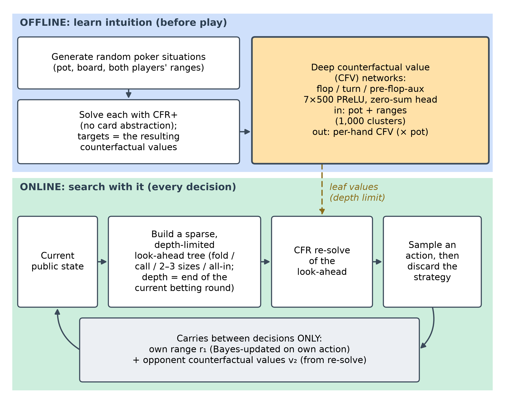
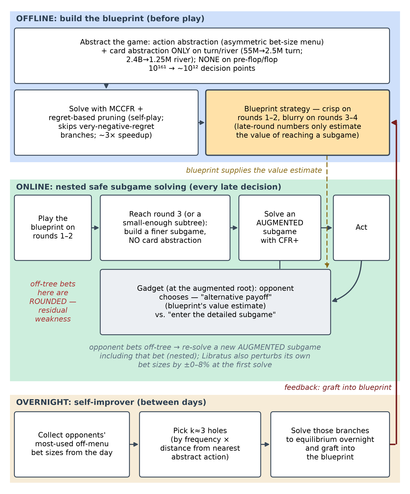
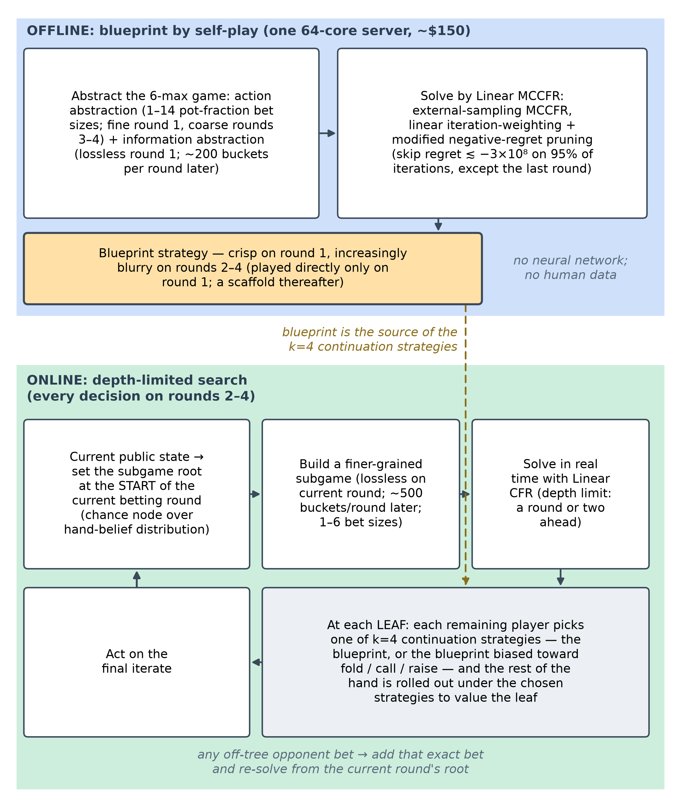
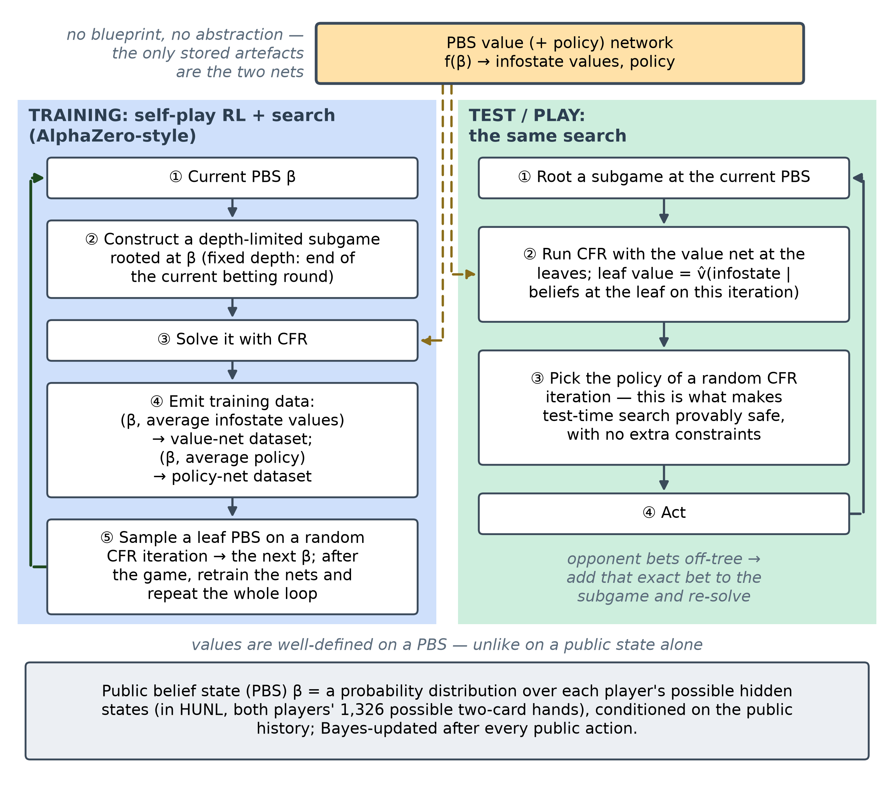
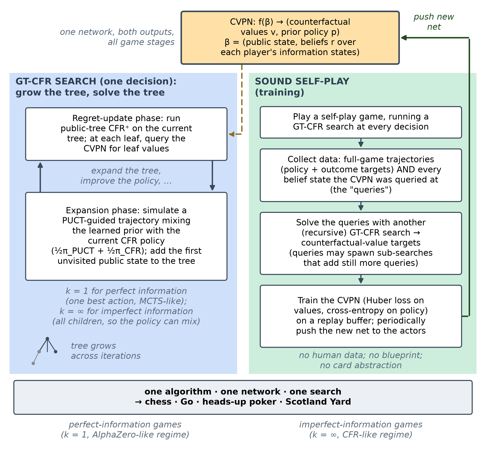
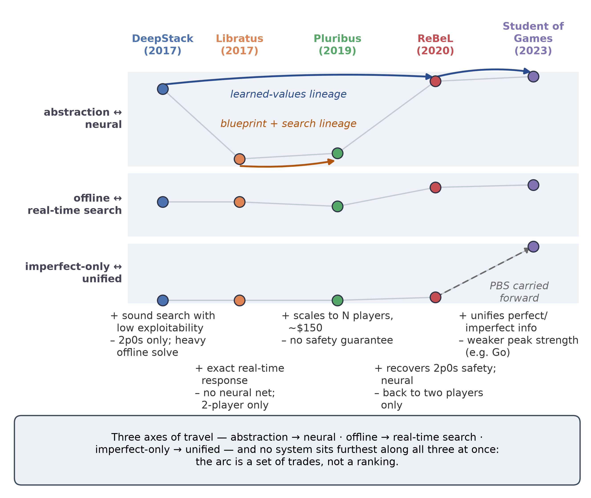
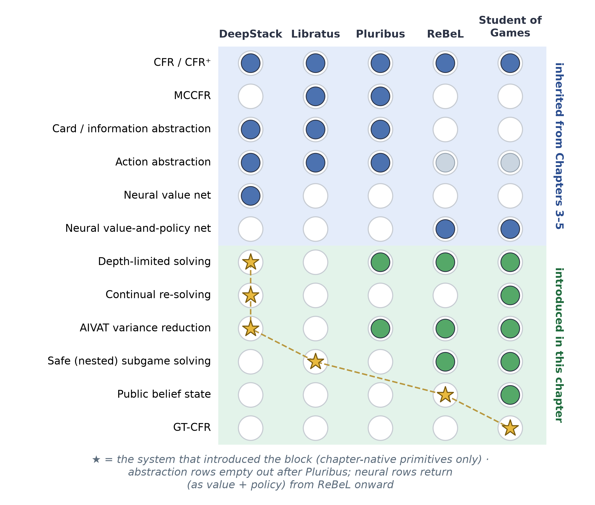

# Chapter 6 — End-to-End Game AI Architectures

<!--
SKELETON / WORK IN PROGRESS.
Build order and the per-system template (the "spine") are defined in ../CHAPTER_PLAN.md.
Each system section follows the same template so cross-system comparison stands out.
Wrap finished/approved sections in the APPROVED-HIGHLIGHT markers (see Chapter 5 summary).
-->

## Introduction

Chapter 6 is the keystone of this study plan. Chapters 1–5 assembled the parts in isolation — the
game-theoretic vocabulary of extensive-form games and Nash equilibria, counterfactual regret minimization
(CFR) and its Monte-Carlo variants, game abstraction, and the neural function approximators that replace
tabular storage once a game outgrows it — and this chapter is where those parts converge into complete,
competition-grade systems. The treatment is deliberately **architectural**: rather than re-deriving the
mathematics, which lives in the technical chapters and the cited papers, each system is studied at the level
of how it is *put together* — what it computes offline, what it computes in real time, where learning sits,
and what it can actually guarantee. A short per-system scorecard opens each section so the same nine
dimensions line up at a glance.

The five systems span seven years and, read in order, trace the evolution of superhuman game AI:
**DeepStack** (2017), **Libratus** (2017/2018), **Pluribus** (2019), **ReBeL** (2020), and **Student of
Games** (2023). It is tempting to read such a list as a leaderboard — each entry strictly stronger than the
last — but that is neither what happened nor how this chapter is organized. The progression is a sequence of
*deliberate trades*: each system bought a new capability by giving something else up. Read this way, the
chapter is a study of what each advance cost, not a ranking of winners.

Beneath the individual trades, three axes of motion run through all five systems and give the chapter its
spine. The first is **representational**: the move from hand-built *abstraction* — bucketing similar hands
and allowing only a few bet sizes — toward *learned neural approximation*, in which a network generalizes
across situations a table could never enumerate. The second is **temporal**: the move from *solving the
entire game offline* into a stored strategy toward *learning a compact model and searching with it in real
time*. The third axis
appears only at the very end, with Student of Games: the unification of **perfect- and
imperfect-information** play in one sound algorithm, joining the two great traditions of game AI — the
minimax / Monte-Carlo-tree-search / AlphaZero line and the CFR / poker line.

One idea ties these threads together and deserves to be named before the systems themselves, precisely
because it is *not* one of them: **depth-limited solving**. Formalized by Brown, Sandholm & Amos (2018)[^brown2018dls], it is the
principle that one may search only a little way ahead in an imperfect-information game and substitute a
*learned or precomputed value* for the remainder — provided the substitution is done so that hidden
information does not render it unsound. It is the theory that places DeepStack's continual re-solving and Libratus's nested subgame solving in a common framework, that underwrites Pluribus's continuation strategies, and
that, in belief-state form, becomes the inner loop of ReBeL and Student of Games. We treat it as connective
tissue — referenced wherever a system instantiates it — rather than as a sixth entry.

Finally, it is worth flagging at the outset the single thread the synthesis returns to. Every system here is,
by deliberate design, **opponent-blind**: each computes a strategy that is hard to beat *in the worst case*
and then plays it without regard to who is actually across the table — because an exploitative deviation can itself be counter-exploited and, in the words of Pluribus's authors, because existing opponent-exploitation techniques "require too many samples to be competitive with human ability outside of small games"; both papers name conservative (safe) exploitation as the only exception.[^pluribus][^libratus] This robustness-first stance is the field's
great strength and, for a dissertation about *adaptive* play, its defining limitation: it is exactly the
opponent-awareness these systems omit that Chapters 7–12 set out to add.

## DeepStack (2017)

DeepStack (Moravčík et al., 2017)[^deepstack], from the University of Alberta computer-poker group with collaborators in
Prague, was the first program to defeat professional poker players at heads-up no-limit Texas hold'em (HUNL) — professionals, though not HUNL specialists — with statistical significance, and the first to put heuristic search — the engine behind chess and Go — on a
theoretically sound footing in a game of imperfect information. Over a four-week study it beat a pool of 33
professionals by 492 milli-big-blinds per game (mbb/g, the standard poker win-rate unit; 50 mbb/g is a
sizable professional edge) across 44,852 hands, and no known technique could find a flaw in its play. Its
guiding *what-if* is the one that frames this whole chapter: **could a program play poker the way AlphaGo
plays Go — searching locally from the current situation and trusting a learned value function for everything
beyond the horizon — even though, in poker, the situation is itself partly hidden?**

| At a glance | DeepStack (2017) |
|--|------|
| Players | 2 (heads-up) |
| Game type | HUNL — heads-up no-limit Texas hold'em (2-player zero-sum) |
| Blueprint (offline)? | No — offline work trains value nets, not a stored strategy |
| Neural component | Deep counterfactual value networks (flop, turn, aux); value-only |
| Search mechanism | Continual re-solving (depth-limited CFR look-ahead, every decision) |
| Abstraction? | None constrains play; 1,000-bucket clustering only at the net input, plus sparse betting + river action bucketing in look-ahead |
| Perfect-info too? | No (imperfect-information only) |
| Compute | Offline-heavy (~175 CPU-core-years to label the turn network); play-time runs on one GPU, < 5 s/decision |
| Key innovation | Continual re-solving + learned counterfactual values: the first *sound* heuristic search for imperfect-information games |

: DeepStack (2017) at a glance.

### The gap it closed

Every prior game-AI milestone — backgammon, chess, Go — rested on *local search*: from the current position,
look a few moves ahead and substitute a heuristic value for the rest. That recipe assumes the position is
known, and poker breaks the assumption — the right action depends on the distribution over the opponent's
hidden cards, revealed only through their betting. The open question DeepStack set out to answer is whether heuristic search can be made
*sound* under hidden information at the scale of HUNL, a game with roughly $10^{160}$ decision points.

For nearly two decades the dominant answer had been something else entirely: **abstraction plus offline
equilibrium plus translation**, as in Chapter 4 — shrink HUNL's $10^{160}$ situations into roughly $10^{14}$
abstract ones, solve that smaller game offline with CFR into a stored *blueprint*, and at play time
*translate* each real situation and opponent bet into the nearest abstract one. The compression is lossy, and the loss shows up as exploitability — how much a worst-case
opponent can win, the field's quality metric, zero at a Nash equilibrium. In 2015 the abstraction-based
program Claudico lost to professionals by 91 mbb/g,[^deepstack] and a local-best-response probe (LBR, a tractable lower
bound on exploitability) later showed top competition bots exploitable by more than 3,000 mbb/g — four times worse than folding every hand.[^lbr] DeepStack closes this gap by discarding the whole edifice:
it never builds a full-game abstraction and never stores a blueprint, reasoning about each situation *as it
actually arises* and replacing only the distant remainder of the game with a learned estimate.

### Architecture

DeepStack splits cleanly into an **offline** phase that learns intuition and an **online** phase that
searches with it (see the figure below).[^deepstack]

{width=95% fig-pos="H"}

Offline, the system generates millions of random poker situations and solves them with a CFR solver to obtain
target *counterfactual values* — conditional "what-if" payoffs for holding each possible hand — and these
(situation → value) pairs train the **deep counterfactual value (CFV) networks**. Online, DeepStack carries
no blueprint: between decisions it remembers only two vectors — its own *range* (the distribution over the
hands it could be holding) and the opponent's *counterfactual values* — and at each turn it runs CFR over a
small look-ahead tree rooted at the true current state, using a CFV network to supply leaf values at the
depth limit. The neural network sits *only* at the depth limit as a leaf
evaluator; CFR does the searching; and — crucially — there is no full-game abstraction in the loop.

### Key innovation: continual re-solving with learned counterfactual values

DeepStack's contribution is the marriage of two ideas, each of which makes the other practical.

The first is **continual re-solving**: reconstructing a fresh local strategy at every decision from the
maintained range and opponent counterfactual-value vector, then discarding it, so the agent never stores or
commits to a global strategy. Classical re-solving (Burch et al., 2014) shows that to reconstruct a strategy
for a subgame you do not need the whole strategy — you need only your own range entering the subgame and a
vector of the opponent's counterfactual values.[^burch2014]

What makes this work is the bookkeeping. After each event DeepStack updates its two vectors by simple rules:
on its **own action** it swaps in the re-solved counterfactual values for the chosen action and Bayes-updates
its range; on a **chance event** it swaps in that card's values and zeroes the now-impossible hands; and on
the **opponent's action** it does *nothing at all*. That last point is the quiet masterstroke: because it
tracks the opponent's *values* rather than their *range*, and never needs the opponent's specific action to
maintain those values, it sidesteps the action-translation step that crippled abstraction-based bots. The
opponent can make any bet of any size; DeepStack simply re-solves from the state that bet produced.

The second idea is the **learned counterfactual value network** — DeepStack's "intuition." In a
perfect-information game a leaf evaluator maps one state to one number; under imperfect information it must
map a *whole public state plus both players' ranges* to a *vector* of counterfactual values, one per hand,
because the values at a node shift with the ranges that reach it. With this network supplying values at the end of the current betting round, the depth limit shrinks the re-solved game from $10^{160}$ decision points to at most $10^{17}$, and the sparse action set described below to about $10^{7}$ — small enough to solve in under
five seconds on a single GPU.

The pairing is provably sound.[^deepstack] If the value network's error is at most $\epsilon$ and the re-solve runs $T$
CFR iterations, the resulting strategy's exploitability is bounded by

$$ \text{exploitability} \;<\; k_1\,\epsilon \;+\; k_2/\sqrt{T}, $$

with game-specific constants $k_1, k_2$. The first term is the price of imperfect intuition; the second is
ordinary CFR convergence. This bound is the theoretical heart of the paper — the guarantee that heuristic
search can be carried into imperfect information without the strategy quietly becoming exploitable.

### Caveats, dead-ends, and what the paper under-describes

The most important asterisk is that **the deployed system is not the one the theorem covers**. To play at
human speed DeepStack restricts its look-ahead to a sparse betting set (fold, call, two or three bet sizes,
all-in), and the paper states plainly that this "voids the soundness property of Theorem 1." So the shipped
guarantee is empirical — supported by the LBR results below — not proven. A second deviation compounds this:
the soundness proof assumes *best-response* constraint values, but DeepStack actually uses *self-play* values,
which lack a theoretical justification yet were less exploitable in early tests. The proven algorithm and
the winning algorithm are, strictly, different algorithms.

Abstraction also creeps back at the margins. DeepStack advertises that it uses no card abstraction to
constrain play — but it *does* cluster hands into 1,000 buckets at the value network's input, and on the
river it abandons the network entirely, solving to the end of the game while using a **bucketed action
abstraction** for tractability. Neither undermines the result, but together they show that the headline
"sound, abstraction-free search" is an aspiration the implementation approximates rather than attains.

### Compute & accessibility

DeepStack's cost is almost entirely **offline, and almost entirely in the CFR solving used to label the value
networks**: the turn network alone consumed about **175 CPU-core-years** on a 6,144-core cluster, while at
play time DeepStack runs on **one commodity GPU at under five seconds per decision**.[^deepstack] A from-scratch
build was thus within reach only of a well-resourced lab at the time, though a public reference implementation
on Leduc lowers the entry barrier.

### Strengths and limitations

DeepStack's central strength is **soundness with low exploitability**: it is the first imperfect-information
search method with a real guarantee, and empirically LBR — which exposes competition bots as losing thousands
of mbb/g — cannot find any way to beat it, itself losing by over 350 mbb/g.[^deepstack] It needs **no full-game
abstraction and no action translation**, so off-tree opponent bets are handled exactly rather than rounded. A
neat bonus is evaluation synergy — DeepStack's own value function is exactly what the AIVAT variance-reduction
estimator needs, cutting the human-study standard deviation by 85% and making significance achievable in only
a few thousand hands.

The limitations set the agenda for the rest of the chapter. DeepStack is **two-player zero-sum only**; its
soundness leans on that structure. It **re-solves from scratch** at every decision, and it was validated only
against humans and LBR — never head-to-head against the strongest abstraction bots.

### Legacy and modern relevance

Strip away the poker specifics and DeepStack's core idea is **depth-limited search with a learned value
function at the leaves, adapted to hidden information** — the imperfect-information counterpart of the
value-guided search behind AlphaGo and AlphaZero. That idea did not age into obsolescence; it became the
template: ReBeL (2020)[^brown2020rebel] recast the leaf-value
learning around public belief states with AlphaZero-style self-play, and Student of Games (2023)[^sog] — which shares several DeepStack authors — unified perfect- and imperfect-information play in a single algorithm.
**AIVAT-style variance reduction**, which turns a learned value model into a control variate for low-variance
evaluation of any stochastic agent, remains directly reusable; the hand-engineered machinery *around* the
idea — the 1,000-bucket k-means clustering, the separate per-round networks, the hand-tuned re-solving
gadget — is what ReBeL and Student of Games replace. The honest
verdict: **as a deployed poker system DeepStack is superseded, but it is far from a mere stepping stone** —
its central paradigm won and is now mainstream, and for this thesis specifically its (range, opponent
counterfactual values) state and its error-propagation bound are direct seeds for belief-based opponent
modelling (Contribution 1) and safe-exploitation analysis (Contribution 2).

## Libratus (2017/2018)

DeepStack answered its *what-if* by throwing the abstraction-and-blueprint edifice away — yet it still kept a
sparse betting abstraction inside its own look-ahead, and it was never tested head-to-head against the
strongest prior bots or against HUNL specialists in a long, rigorous match. Libratus (Brown & Sandholm, 2017; Carnegie Mellon)[^libratus] was built independently and announced the same year, and it made the opposite bet: keep the
abstraction-and-blueprint paradigm and cure its one fatal disease. Its guiding question is the mirror image
of DeepStack's: **what if we solve a coarse blueprint of the whole game offline, then *repair it in real
time* wherever the abstraction is too crude — with a provable guarantee that the repair never leaves us more
exploitable?** In January 2017 Libratus became the first program to beat top human HUNL specialists in a long
match, defeating four professionals by 147 mbb/g over 120,000 hands at 99.98% significance — and,
unlike DeepStack, it first dismantled the prior best poker AI head-to-head.

| At a glance | Libratus (2017/2018) |
|--|------|
| Players | 2 (heads-up) |
| Game type | HUNL — heads-up no-limit Texas hold'em (2-player zero-sum) |
| Blueprint (offline)? | Yes — an abstracted full-game strategy solved offline with MCCFR (detailed early, coarse late) |
| Neural component | None — purely tabular CFR / abstraction (no neural networks anywhere) |
| Search mechanism | Nested safe subgame solving (real-time CFR+ re-solve of the late game, re-run for every off-tree opponent bet) |
| Abstraction? | Yes — card abstraction (turn/river, blueprint only) + asymmetric action abstraction; dissolved to *no card abstraction* inside the real-time subgames |
| Perfect-info too? | No (imperfect-information only) |
| Compute | Offline- *and* online-heavy: ~25M CPU core-hours on the Bridges supercomputer; ~50 nodes and tens of seconds per late decision; no GPUs |
| Key innovation | Blueprint + real-time nested *safe* subgame solving + self-improvement: exact, provably-safe responses to off-tree bets in place of action translation |

: Libratus (2017/2018) at a glance.

### The gap it closed

The previous section laid out the paradigm DeepStack discarded — abstraction plus offline equilibrium plus
translation — and named its fatal flaw. Libratus targets exactly that flaw without discarding the paradigm.
The blueprint is solved in advance over a *fixed* menu of bet sizes; at play time any opponent bet that is
not on that menu is *translated* — rounded to the nearest size the bot knows. That rounding is the single largest exploitable seam in
abstraction-based poker: in 2015 Libratus's own predecessor Claudico lost the first
*Brains vs. AI* match to professionals by 91 mbb/g, in good part because opponents could feel out and punish
its translation boundaries.[^ganzfried2016reflections] The same year, then, produced two opposite cures for the same disease — one neural and blueprint-free, one tabular and
blueprint-based — and Libratus is the proof that the older paradigm, properly repaired, was still enough to
reach superhuman play.

### Architecture

Libratus is a pipeline of three modules that operate on three different timescales — **offline** (before the
match), **online** (during each decision), and **overnight** (between days of play) — and, unlike every other
system in this chapter, it contains **no neural network at all** (see the figure below).[^libratus]

{width=95% fig-pos="H"}

**Module 1 — the blueprint (offline).** Libratus first compresses HUNL's roughly $10^{161}$ decision points to about $10^{12}$ with an *action abstraction* that keeps only a discrete menu of
bet sizes and a *card abstraction* that groups strategically similar hands, used only on the turn and river and only in the blueprint.[^libratusijcai] It then solves this abstract game by self-play with an improved **Monte Carlo counterfactual
regret minimization (MCCFR)** that probabilistically prunes very-negative-regret branches. The result is the **blueprint**: a
complete but uneven strategy — detailed early, coarse late — whose late-round numbers are used not to play
but only to *estimate the value of reaching a subgame*.

**Module 2 — nested safe subgame solving (online).** Libratus plays the blueprint only in the early rounds.
On reaching the third betting round — or any earlier point where the rest of the hand is small enough — it
discards the coarse late-game blueprint and instead **builds a fresh, finer-grained subgame with no card
abstraction and solves it in real time** with a heavily optimized **CFR+** (a fast, deterministic CFR
variant). When the
opponent makes a bet that is not on the blueprint's menu, rather than round it, Libratus solves a new
subgame that *contains that exact bet*, and repeats this for every subsequent off-menu action — *nested*
subgame solving.

**Module 3 — the self-improver (overnight).** Because real-time solving is skipped on the first two rounds,
off-menu opponent bets *there* are still rounded. The self-improver narrows this residual seam between days:
it computes proper game-theoretic responses to a few of the most damaging holes overnight and grafts those
branches into the blueprint. Pointedly, this is **not opponent exploitation** — it never
tries to model and punish the humans' mistakes (which would expose Libratus to counter-exploitation).
Instead it uses the opponents' bets only as a hint about *which of Libratus's own holes to patch*, and the
patches are universal, improving play against any future opponent.

### Key innovation: nested safe subgame solving

Libratus's central contribution is making **real-time subgame solving both *safe* and *nested*** — strong
enough to beat humans and provably unable to make the strategy much more exploitable than the blueprint it
refines.

As in Chapter 4, an imperfect-information subgame *cannot be solved in isolation*: its right strategy depends
on the strategies in *other, unreached* subgames, and earlier real-time solvers that simply assumed the
opponent had played the blueprint up to this point — **unsafe** subgame solving — could be punished by any
deviation. Libratus's **safe** subgame solving removes that assumption with a small gadget, the *augmented subgame*. At
the root of the subgame the opponent is handed a choice for every hand they might hold: either take a fixed
**alternative payoff** — the blueprint's estimate of what that hand is worth here — or *enter* the detailed
subgame and play it out. Solving this augmented game forces Libratus's refined strategy to make the opponent
**no better off than that estimate for every possible hand**, which is exactly the meaning of "safe". Libratus sharpens
this with a variant the authors call **Estimated-Maxmargin** — it maximizes the *smallest* safety margin
across all opponent hands — using blueprint *estimates* of opponent values instead of conservative *upper
bounds* and de-emphasizing hands the opponent could only hold by having made an earlier mistake.

The pairing comes with a guarantee that parallels DeepStack's.[^brown2017] If $\sigma^{*}$ is the least-exploitable
strategy that differs from the blueprint only inside the solved subgames, and the blueprint's estimate of
the opponent's subgame values is off by at most $\Delta$, then the refined strategy's exploitability obeys

$$ \text{exploitability}(\sigma_{\text{refined}}) \;\le\; \text{exploitability}(\sigma^{*}) \;+\; 2\Delta. $$

The $2\Delta$ term is the price of imperfect value *estimates*, and it is the structural twin of DeepStack's
$k_1\epsilon$ term — both bound how much an error in the values handed to the solver can cost in worst-case
exploitability.

"Nested" is the second half. Rather than expand the blueprint's bet menu (which would balloon the offline
solve), Libratus crafts a **distinct response to each off-menu bet in real time**: when the opponent bets a
size it has never enumerated, it builds an augmented subgame whose alternative payoff is the best *in-menu*
action the opponent could have taken instead, solves it, and does so afresh for every later off-menu bet down
the hand. In the controlled experiments this beat the previous standard — rounding the bet to the nearest
menu size — by more than an order of magnitude in worst-case exploitability (119 versus 1465 mbb/g in the
reported small-game test).[^brown2017]

### Caveats, dead-ends, and what the paper under-describes

The most revealing caveat is that **the blueprint alone is not superhuman — it does not even beat the prior
bot**. Against Baby Tartanian8, the 2016 competition winner, Libratus's raw blueprint did not beat it (−8 ± 15 mbb/g, 95% CI); only when nested subgame solving was switched on did the same system win, by 63 ± 28 mbb/g.[^libratus] The offline strategy, in
other words, is a scaffold, and essentially all of Libratus's edge comes from real-time search.

Several other asterisks matter. **Action translation is not eliminated, only contained**: on the first two
betting rounds Libratus still rounds off-menu opponent bets, and the entire self-improver module exists to
chip away at that residual seam, three holes per night, never closing it. **Safe subgame solving had to be
re-engineered to be usable at all** — for three years it was considered impractical because, in head-to-head
play, textbook-safe solving lost to the theoretically unjustified *unsafe* variant — and even so Libratus deliberately uses *unsafe* solving
once, at its first entry into the third round, because it is cheaper and empirically fine there. Using
estimates rather than upper bounds can in principle push exploitability *above* the blueprint's, bounded only
by the $2\Delta$ of the theorem. Finally, the true compute surfaces only in the secondary sources, and the **code was never released**, leaving independent verification to rest on the published pseudocode.

### Compute & accessibility

Where DeepStack's bill is paid almost entirely offline and its play is cheap, Libratus is **expensive at
both ends**. The project consumed roughly **25 million CPU core-hours** on the Bridges supercomputer at the
Pittsburgh Supercomputing Center over a year — of which about 6 million went to building and solving the
blueprint, about 3 million to real-time subgame solving during the match, about 3 million to the
self-improver, and the remaining ~13 million to exploratory experiments and evaluation.[^libratusijcai] Each
**real-time subgame solve used about 50 nodes and took on the order of tens of seconds**, with no GPUs anywhere,[^sandholm2021]
which made Libratus, as deployed, essentially impossible to reproduce outside a major supercomputing centre.

### Strengths and limitations

Libratus's signal strength is **decisive, rigorously demonstrated superhuman play**: it beat each of the four
professionals individually and, unlike DeepStack, also beat the **prior best poker AI head-to-head** by
63 mbb/g, disentangling its strength from the question of human skill. Its limitations — two-player zero-sum
only, abstraction-based, still translating off-menu bets on the early rounds, no neural generalization, and
supercomputer-scale play — set up the rest of the chapter, and because both humans and AI adapted over the match, even the headline
significance is, strictly, an "as-if-independent" figure, though a 147 mbb/g margin over 120,000 hands leaves no real doubt.[^libratus]

### Legacy and modern relevance

Strip away the abstraction machinery and Libratus's enduring idea is **real-time search layered on a coarse
precomputed strategy, made safe under hidden information**: solve the local situation exactly at decision
time, consistently with a cheap global plan, and respond to whatever the opponent actually does rather than
to a rounded approximation of it. Libratus's nested safe subgame
solving is the direct ancestor of the real-time search in **Pluribus** (2019), and the same
"refine a global value estimate with a local solve" pattern reappears, now with *learned* values replacing
the tabular blueprint, in **ReBeL** (2020). The honest verdict is that Libratus is *superseded as an
architecture but vindicated as a thesis*: its bet that **real-time search matters more than a bigger
precomputed strategy** was exactly right, even as its bet on tabular abstraction was overtaken. For this
thesis specifically, Libratus contributes two seeds: its safe-subgame-solving exploitability bound is a
template for **safe exploitation under value error (Contribution 2)**, and its deliberate refusal to exploit —
"fix your own weaknesses, do not model the opponent" — is the precise foil against which a *bounded,
deliberate* opponent adaptation (Contribution 1) can be defined.

## Pluribus (2019)

Libratus settled two-player no-limit hold'em, but its safety guarantees — and indeed the very meaning of
"solving" the game — rested on two-player zero-sum structure. Poker as humans actually play it, though, seats six.
Pluribus (Brown & Sandholm, 2019; Carnegie Mellon and Facebook AI)[^pluribus] confronted the multiplayer question
directly: **what becomes of the blueprint-plus-real-time-search recipe when you remove the two-player crutch
and sit at a six-handed table — a setting where a Nash equilibrium is neither unique, nor efficiently
computable, nor even a guarantee that you will not lose?** Its answer was empirical and emphatic. Across two
formats — five professionals seated with one copy of Pluribus, and one professional against five copies — it
beat fifteen elite professionals, winning by about **48 milli-big-blinds per game** against five humans at once (roughly five big blinds per hundred hands, a decisive six-handed margin) at 95%
statistical significance. And it did so after training for **eight days on a single 64-core server for about
$150 of cloud compute** — on the order of a thousandth of what the supercomputer behind Libratus consumed.

| At a glance | Pluribus (2019) |
|--|------|
| Players | 6 (six-max) — the first superhuman AI in any benchmark game with more than two players/teams |
| Game type | 6-max NLHE — six-player no-limit Texas hold'em (imperfect-information; multiplayer, *not* 2-player zero-sum) |
| Blueprint (offline)? | Yes — a full-game blueprint solved offline by Linear MCCFR; played *directly* only on the first betting round, a scaffold thereafter |
| Neural component | None — purely tabular CFR / abstraction (no neural networks anywhere, as in Libratus) |
| Search mechanism | Real-time *depth-limited* search with k=4 continuation strategies at the leaves (nested *unsafe* solving, re-solved from the start of each betting round); Linear CFR inside subgames |
| Abstraction? | Yes — action (1–14 blueprint bet sizes; 1–6 in search) + information abstraction (lossless first round; lossy buckets later, finer in search than in the blueprint) |
| Perfect-info too? | No (imperfect-information only) |
| Compute | Famously cheap: blueprint ~12,400 core-hours / 8 days / < 512 GB on one 64-core server (~$144); play on 2 CPUs (28 cores), < 128 GB, no GPUs, 1–33 s/decision |
| Key innovation | Superhuman six-player play via blueprint + depth-limited search with continuation strategies — won *empirically*, on a tiny budget, with **no N-player safety guarantee** |

: Pluribus (2019) at a glance.

### The gap it closed

Every superhuman game AI before Pluribus — checkers, chess, Go, and both prior poker programs — shared a
hidden assumption: two players, zero sum. In that setting a Nash equilibrium carries a property that makes it
the obvious target: any player who adopts one is *guaranteed not to lose* in expectation, whatever the
opponent does, and if two players independently compute equilibria, their strategies still combine into an
equilibrium. With more than
two players, finding — even approximating — a Nash equilibrium is computationally intractable in general;
there are typically *many* equilibria; and, fatally, if each player independently selects one, the resulting
joint strategy need not be an equilibrium at all, so a player can *lose* while playing an impeccable
equilibrium strategy. The
conclusion is stark — in multiplayer poker a Nash equilibrium is *neither unique nor a safety guarantee*, and
the field's two-decade definition of success simply evaporates.

Pluribus closes this gap by changing the goal and then meeting it: it aims only to *empirically and consistently defeat elite humans*, and it accepts up front that
its algorithms carry no guarantee of converging to an equilibrium outside two-player zero-sum play. That
concession is the entire point — and it is the precise gap this thesis's Contribution 2 sets out to fill. The
other half of the gap is mechanical: with six players, solving every late-game subgame *to the end* in real
time, as Libratus did, becomes infeasible, so Pluribus needed a real-time search that looks only a little way
ahead and stops.

### Architecture

Like Libratus, Pluribus splits into an offline phase that builds a blueprint and an online phase that searches
— but the balance of power between them is inverted, and, again like Libratus, there is **no neural network
anywhere** (see the figure below).

{width=95% fig-pos="H"}

Offline, Pluribus computes a blueprint for the whole game by self-play with an **external-sampling Monte Carlo
CFR (MCCFR)**, abstracting the game only coarsely, and it plays this blueprint *directly* in just the first of
the four betting rounds. Everywhere
else — flop, turn, river — Pluribus discards the coarse blueprint locally and **searches in real time** for a
finer strategy, exactly as Libratus did, with one decisive difference: it does not solve to the end of the
game. It looks only a round or two ahead to a depth limit and stops, which is what makes six players
affordable. Unlike Libratus, there is **no self-improver**: Pluribus never patches its blueprint between
sessions, because depth-limited search on three of the four rounds already does the repairing.

### Key innovation: depth-limited search with continuation strategies

Heuristic search in chess or Go works by looking a fixed distance ahead and reading a value off the horizon, on
the assumption that both sides play well from there. That assumption fails completely under hidden information,
and Brown and Sandholm make the failure vivid with a one-shot sequential Rock–Paper–Scissors: if the searcher
assumes the opponent will play the equilibrium (each throw one-third of the time) beyond the horizon, then
every action looks equally valued at zero, so the searcher might settle on "always play Rock" — whereupon the
opponent switches to always Paper and the true value plummets. A leaf in an imperfect-information game therefore
has *no single value*: its worth depends on the strategy the searcher will adopt, which is precisely what the
search is trying to determine.

Pluribus's central contribution is the way it gives leaves a value anyway. When search reaches the depth limit,
instead of freezing one continuation, **each player still in the hand chooses among four different continuation
strategies** for the remainder of the game, and may mix over them. The four are deliberately simple: the
blueprint itself, and three biased copies that multiply the probability of *folding*, of *calling*, and of
*raising* (each then renormalized). Because an opponent can always switch to whichever continuation punishes
the searcher most, an unbalanced strategy — the poker equivalent of always playing Rock — is no longer
rewarded, and the searcher is driven toward balance. This idea was first proven in a two-player precursor,
Modicum (Brown, Sandholm & Amos, 2018), which beat two former champion bots while running on a 4-core laptop
with 16 GB of memory.[^brown2018dls]

Pluribus generalizes the idea from two players to six. In Modicum only
the *opponent* chose among continuation strategies while the searcher always played the blueprint; Pluribus
lets the **searcher choose among the continuation strategies too**, which balances the players. It also re-solves not from the current
decision point but from the *start of the current betting round*, holding fixed only the actions it has already
taken. This "unsafe" search — so named because, unlike Libratus's, it carries no exploitability guarantee — is
cheaper and, because it begins
just after a high-branching chance event, turns out to be hard to exploit in practice.

What is conspicuously missing from all of this is a *guarantee*. DeepStack bounded its exploitability by $k_1\epsilon + k_2/\sqrt{T}$[^deepstack] and Libratus by $2\Delta$;[^brown2017] Pluribus offers no such bound, and the omission is
principled rather than careless. CFR's engine still does, in any finite game, drive each player's *average
regret* to zero,

$$ \frac{R_i^{T}}{T} \;\longrightarrow\; 0 \qquad (\text{no-regret}), $$

but the inference that carried the two predecessors from no-regret to safety — *no-regret play converges to a
Nash equilibrium, and a Nash equilibrium cannot be beaten* — holds only when there are two players and the game
is zero-sum. With six players the first implication fails (self-play need not approach an equilibrium) and the
second is meaningless (an equilibrium is not unbeatable). The very iterations that *proved* DeepStack and
Libratus safe therefore buy Pluribus only empirical strength: superhuman in practice, with nothing certified.

### Caveats, dead-ends, and what the paper under-describes

The most consequential admission
is that Pluribus uses **unsafe** subgame solving — it assumes opponents have played the strategy it computes
*for* them — which, the authors state plainly, "lacks theoretical guarantees on performance even in two-player
zero-sum games and there are cases where it leads to highly exploitable strategies."[^pluribussm] Safe alternatives exist,
but in head-to-head play they did worse, so Pluribus takes the empirical win and mitigates the risk only by
always re-solving from the start of the betting round. A second seam is inherited and never fully closed: on
the *first* betting round, opponent bets too far off the blueprint's menu are still **rounded** by action
translation, and Pluribus, having no
self-improver, simply lives with it.

Pluribus's headline innovations are **never individually ablated** — the authors
concede that measuring each one's contribution is "too expensive" — but the two-player precursor paper does show that a *single* blueprint continuation at the leaves lost to Baby Tartanian8 (−10 ± 8 mbb/g) and did not beat Slumbot (−1 ± 15), whereas the four-continuation version beat both (+6 ± 5 and +11 ± 9);[^brown2018dls] the continuation-strategy set is doing real work, not decoration. Smaller curiosities round out the picture: Pluribus plays its **final** search iterate rather than
the usual time-average, to avoid residual bad actions; it learned to **abandon "limping"** during self-play yet
**"donk-bets" far more than humans do**; and — like Libratus — its **code was never released**, leaving only
pseudocode for independent verification, because poker is played commercially.

### Compute & accessibility

The
blueprint was trained in **eight days on a single 64-core server** for about **12,400 core-hours** and under
512 GB of memory — roughly **$144** at cloud spot prices — and at the table Pluribus runs on **two CPUs (28
cores) and under 128 GB, with no GPUs at any point**.[^pluribus] Where DeepStack concentrated its
cost offline and Libratus paid heavily at both ends, Pluribus is **cheap at both ends**. The collapse is not magic but algorithmic: the compounding of depth-limited search (which the
authors estimate saves at least five orders of magnitude over solving to the end), Linear CFR, and aggressive
pruning and memory thrift. With no code released, though, "accessible"
describes the *method*, demonstrated at laptop scale by Modicum, more than a downloadable program.

### Strengths and limitations

Pluribus's signal strength is simply that it is **first**: the first AI to reach superhuman performance in any
widely recognized benchmark game with more than two players or two teams, and in poker's most popular form.[^pluribus] The
win was decisive and rigorous — **+48 mbb/g (p = 0.028)** against five elite pros at the table, and **+32 mbb/g
(p = 0.014)** with five copies against a lone pro — measured with the **AIVAT** variance reducer (which cut
variance about ninefold) over 20,000 hands.

The limitations are precisely what it gave up to get there. Pluribus has **no safety guarantee whatsoever** in
the six-player setting — no Nash convergence, no exploitability bound — so its superhuman status is an
*empirical* fact about fifteen strong humans over 20,000 hands, not a theorem. The paper claims only that "there are large-scale, complex multiplayer imperfect-information settings in which a carefully constructed self-play-with-search algorithm can produce superhuman strategies".[^pluribus] And its 48-mbb/g six-handed win rate, though decisive, is not the same currency as Libratus's 147
heads-up — different game, five opponents, higher variance.

### Legacy and modern relevance

Two ideas outlast the poker specifics. The first is technical: **depth-limited search made sound under hidden
information by giving each leaf a small menu of selectable continuation strategies rather than a single value**.
The second is economic: Pluribus is the canonical demonstration that **a harder problem can be
solved with a thousandfold *less* compute through better algorithms and search at decision time**, rather than
more hardware. In the architectural arc of this chapter, Pluribus is the
point where the *player-count* barrier falls; the *generalization* barrier it leaves standing — everything is
still tabular and hand-abstracted — is what **ReBeL** and **Student of Games** dismantle next, by replacing the
blueprint with learned belief-state values. For this dissertation specifically, Pluribus is the keystone of Contribution 2 — the
empirical proof that Nash-and-search methods *work* in N-player imperfect-information games while offering **no
safety guarantee at all**, which is exactly the gap a theory of multi-agent safe exploitation must close.

## ReBeL (2020)

Pluribus broke the player-count barrier while remaining exactly what Libratus was — a giant, hand-abstracted
lookup table with nothing learned that transfers from one situation to the next — and it bought its six-handed
win by giving up safety altogether. ReBeL (Brown, Bakhtin, Lerer & Gong, 2020; Facebook AI Research)[^brown2020rebel]
steps back from six players to two and asks the opposite question: **what if, instead of hand-crafting an
abstraction and precomputing a blueprint, we ran AlphaZero — self-play reinforcement learning plus search, at
both training and test time — in a game of hidden information, recovering the very guarantees Pluribus
discarded?** Its answer, *Recursive Belief-based Learning*, is, by its authors' account, the first algorithm to
make reinforcement learning *and* search provably sound in imperfect-information games. The trick is to recast
the game as a "perfect-information" game over **public belief states** — probability distributions over what
each player might be holding, given common knowledge — on which value and policy functions are well-defined; an
AlphaZero-style loop then trains a neural value (and policy) network on those states, with counterfactual regret
minimization (CFR) solving depth-limited subgames at the leaves. ReBeL provably converges to a Nash equilibrium
in any two-player zero-sum game, beat Dong Kim — a heads-up professional who had done best of the four humans
against Libratus — by 165 mbb/g over 7,500 hands while using *far less* domain knowledge than any prior poker AI,
and, unlike the closed Libratus and Pluribus, its implementation (for Liar's Dice) was **open-sourced**.

| At a glance | ReBeL (2020) |
|--|------|
| Players | 2 (heads-up) — *guarantees* are two-player zero-sum; the formalism is N-player, but guarantees and experiments are two-player only |
| Game type | General 2p0s imperfect-information; evaluated on HUNL poker + Liar's Dice (and turn endgame hold'em). Reduces to an AlphaZero-like algorithm in perfect-information games |
| Blueprint (offline)? | No stored blueprint — the offline product is a *learned PBS value (+ policy) network* from self-play, not a strategy table |
| Neural component | PBS value network + (optional) PBS policy network; MLP (GeLU/LayerNorm), 6×1536 hidden for poker, input = belief over each player's 1,326 hands + board + pot + bet flag |
| Search mechanism | CFR (CFR-D / CFR-AVG; also FP/FLOP) solving a depth-limited subgame rooted at a PBS, with the learned value net supplying (iteration-dependent) leaf values — at **both** training and test time |
| Abstraction? | None — no card/information abstraction (lossy or lossless); the value net replaces it. Keeps only a small (≤9) hand-chosen bet-size menu, with off-tree bets added live |
| Perfect-info too? | No (presented/evaluated as imperfect-information), with the nuance that it *degenerates* to AlphaZero-style search if private information is removed — full unification is Student of Games' claim |
| Compute | GPU-trained: full HUNL used ~90 DGX-1 nodes × 8 V100 GPUs for self-play data generation (a contrast with Pluribus's CPU-only ~$150); CFR on a single CPU thread; play < 2 s/hand, ≤ 5 s/decision |
| Key innovation | Public belief states + an AlphaZero-style self-play loop training a PBS value/policy net with CFR run in belief space: by its authors' account the first *sound* RL+Search for imperfect-information games, recovering a provable 2p0s Nash guarantee with no abstraction or blueprint |

: ReBeL (2020) at a glance.

### The gap it closed

Libratus and Pluribus were, underneath, *tabular* objects — a strategy or blueprint stored over a
hand-engineered abstraction; DeepStack alone had a neural component, and even it leaned on a 1,000-bucket
clustering at the network's input and an abstraction on the river. Meanwhile AlphaZero's marriage of self-play
reinforcement learning with search, the most successful paradigm in game AI, had been *unavailable* for
imperfect information: prior RL+Search algorithms were "not theoretically sound in imperfect-information games
and have not been shown to be successful in such settings".[^brown2020rebel]

The reason is the conceptual crux of the whole chapter. AlphaZero assumes each state has a single well-defined
value, and hidden information destroys that assumption. The paper's example is a modified Rock–Paper–Scissors in
which scissors wins (or loses) double: the equilibrium throws rock and paper 40% of the time and scissors 20%,
and at that equilibrium every action has expected value zero. A one-ply chess-style search that substitutes the
equilibrium value at the leaves therefore finds every move equally good and might settle on "always rock" —
whereupon the opponent switches to "always paper" and rock's true value collapses from 0 to −1. **In an
imperfect-information game the value of an action depends on the probability with which it is played**, so a
state defined by the sequence of actions alone has no unique value. Pluribus had patched the symptom with
selectable continuation strategies at the leaves[^brown2018dls]; ReBeL cures the disease by redefining the state
to include the probability distribution over the hidden information — a *public belief state* — on which values
become well-defined again. The hand-crafted abstraction and the precomputed blueprint both disappear, replaced by
a value function learned purely from self-play.

### Architecture

ReBeL is best read as **AlphaZero for imperfect information**: a self-play loop that trains neural value and
policy networks, where the "search" used during both training and play is CFR solving a depth-limited subgame,
and everything operates on *public belief states* rather than raw game states (see the figure below).[^brown2020rebel][^bakhtin2020]

{width=96% fig-pos="H"}

Starting from a root PBS, ReBeL constructs a depth-limited subgame, solves it with CFR (specifically CFR-D, "CFR
with decomposition", or its variant CFR-AVG), records the solved values and policy as training targets, samples a
leaf to become the next root, and continues to the end of the game — then retrains the networks and iterates,
exactly as AlphaZero alternates self-play with network training. On every CFR iteration each leaf's value comes
from the **learned PBS value network**, so the leaf values shift from iteration to iteration, which is precisely
what keeps the search sound under hidden information; an optional policy network warm-starts CFR to cut the
number of iterations. There is **no precomputed blueprint** — the only artefacts carried out of training are the
two networks — and **no abstraction** of any kind: ReBeL computes a distinct policy for every infostate, feeding
the network only the raw belief distribution over both players' 1,326 possible hands plus the board, pot, and a
single "has anyone bet this round" flag. CFR (Chapter 3) is the search engine and neural value approximation
(Chapter 5) the leaf evaluator, now fused into a single self-play-plus-search loop.

### Key innovation: public belief states and learned values in belief space

ReBeL's contribution is one conceptual move with three technical consequences: stop searching over *states* and
start searching over *beliefs about states*.

The **public belief state (PBS)** is the heart of it, and the Meta AI blog gives the cleanest intuition.[^bakhtin2020]
Take a card game and modify it so the players cannot see their own cards — only an impartial referee can; on each
turn a player announces, for every card they *might* hold, the probability with which they would take each
action, and the referee samples the move for the player's true card. Because all players' strategies are assumed
common knowledge, everyone can track, via Bayes' rule, the probability that each player holds each possible hand.
This modified game is **strategically identical** to the original, yet it contains *no private information*: its
state — the vector of those probabilities — is fully observed by everyone. ReBeL calls that state a public belief
state: formally, a joint probability distribution over the players' possible infostates, given the common public
observations.[^brown2020rebel] Viewing imperfect-information games as continuous-state perfect-information games
is an old idea (it goes back to work on decentralized multi-agent POMDPs); ReBeL's achievement is being the first
to combine it with self-play reinforcement learning in an *adversarial* setting.

The first consequence is that **values become well-defined again**: in two-player zero-sum games every PBS
$\beta$ carries a unique value $V_i(\beta)$ with $V_1(\beta) = -V_2(\beta)$, defined by both players playing a
Nash equilibrium in the subgame from $\beta$. This formalizes and generalizes DeepStack's belief-conditional
counterfactual values, the first instance of a PBS value function. The second is that the AlphaZero loop can run
with **CFR as the search algorithm**: the belief representation is a very high-dimensional continuous space in
which tree search is hopeless, but in two-player zero-sum games it poses a *convex* optimization problem and CFR
is effectively a gradient-based solver for it — the one substantive difference from AlphaZero.

The third consequence, and the headline, is that the whole thing is **provably sound**. During self-play ReBeL
can assume both players' policies are common knowledge, so it always knows the true PBS; against a real opponent
it does not, which naively breaks search. ReBeL's fix is to run *the same algorithm* at test time and **act
according to the policy of a randomly chosen CFR iteration**. The paper proves (Theorem 3) that this yields safe
search — a Nash equilibrium *in expectation* — with no extra constraints, where every prior "safe search" method
bolted on constraints so costly they were never fully used in a competitive bot. With a PBS value network whose
error is at most $\delta$ and $T$ CFR iterations per subgame, ReBeL plays an $\varepsilon$-Nash equilibrium — one
no opponent can exploit for more than $\varepsilon$ — with

$$ \varepsilon \;=\; \delta\,C_1 \;+\; \frac{\delta\,C_2}{\sqrt{T}}, $$

for game-specific constants $C_1, C_2$. The structure echoes DeepStack's $k_1\epsilon + k_2/\sqrt{T}$, but where
DeepStack's bound governed a single re-solve, ReBeL's governs *convergence to a Nash equilibrium of the whole
game*, and both terms scale with the learned value's error $\delta$: as the value network improves, ReBeL's play
approaches an exact Nash equilibrium. This is the precise sense in which ReBeL returns to two-player zero-sum and
recovers the guarantees Pluribus gave up.

### Caveats, dead-ends, and what the paper under-describes

The *theory* is in the main text; the *engineering honesty* is in the appendices. Appendix D catalogues what ReBeL
deliberately **throws away**. It uses *no* information abstraction, lossy or lossless. Where DeepStack trained
its value net on *randomly generated* PBSs drawn from a hand-tuned sampler, ReBeL generates its training PBSs
purely from self-play, arguing that random sampling "would be like learning a value function for Go by randomly
placing stones on the board" — and it shows (Figure 2 of the paper) that a value net trained on random beliefs
"fails to learn anything valuable." It also drops the precomputed all-in equity tables and the solving to the
end of the game on the third betting round, always solving only to the end of the *current* round. The upshot is
double-edged: ReBeL must learn *six* "layers" of values where DeepStack needed three, which *increases* the
surface for error propagation. And it is not domain-knowledge-free: it keeps a hand-chosen menu of at most eight
or nine bet sizes, with off-tree bets added to the subgame and re-solved, à la Libratus and Pluribus.

The clean theorems rest on **idealizations**: Theorem 2's convergence assumes a perfect function approximator.
The variant the agent actually runs for efficiency, a modified **CFR-AVG**, is by the authors' own admission *not
known to be theoretically sound* — "whether or not this modified form of CFR-AVG is theoretically sound remains
an open question"[^brown2020rebel] — even though it performs well in poker, a familiar gap between the proven
algorithm and the shipped one. And the safe-search guarantee depends on picking a *random* CFR iteration, which
could land on a terrible early one; this is mitigated only by Linear CFR, which down-weights early iterations.

### Compute & accessibility

Where Pluribus's blueprint came from CPU-only CFR on a single server for about $150, ReBeL's intuition is a
neural network trained at **GPU-cluster scale**: the full HUNL agent used **about 90 DGX-1 nodes, each with eight
32 GB Nvidia V100 GPUs**, to generate self-play data, while the CFR search itself runs on a single CPU thread and
play takes under two seconds per hand. Its **implementation was open-sourced** (for Liar's Dice), where Libratus
and Pluribus published only pseudocode,[^brown2020rebel][^libratus][^pluribus] but the poker agent was withheld
because ReBeL "can compute a policy for arbitrary stack sizes and arbitrary bet sizes in seconds", making it a
ready-made cheating tool — the open artefact is the research game, not the superhuman poker bot.

### Strengths and limitations

ReBeL backs its theory with results: it beat the prior champions Slumbot (+45 mbb/g) and BabyTartanian8
(+9 mbb/g), drove the local-best-response (LBR) probe[^lbr] to a large loss, and beat Dong Kim by 165 mbb/g over
7,500 hands, with no card abstraction. The same algorithm, unchanged, converges to approximate Nash in Liar's
Dice, and in perfect-information games it reduces to an AlphaZero-like method — a *framework*, not a poker
program.

The limitations set up the final system. ReBeL's guarantees are **two-player zero-sum only**: the unique PBS
value, the convexity that licenses CFR-as-search, and the soundness proofs all lean on that structure (the
notation is written for N agents, but every experiment and guarantee is two-player). Its most concrete scaling
wall is that the **PBS grows with the amount of hidden information**: the network's input scales with the number
of infostates in a public state, so games with great strategic depth but little common knowledge — the paper
names Recon Blind Chess — blow the representation up, and adding players only makes the belief space larger. It
also assumes the **exact rules of the game are known** (a MuZero-style extension is flagged as future work),
inherits a residual **value-approximation error** $\delta$, and its strongest empirical result rests on a
**single human opponent** over 7,500 hands.

### Legacy and modern relevance

ReBeL's enduring idea is representational: **convert hidden information into a belief state and the full power
of self-play reinforcement learning plus search transfers across.** Its closest descendant is Student of Games,
whose authors call ReBeL "the most closely related algorithm"[^sog]; the RL-plus-search-with-learned-models
lineage also runs into CICERO (2022)[^cicero2022], a seven-player Diplomacy agent far outside ReBeL's two-player
guarantees. The PBS representation, the self-play-trained value/policy function on belief states, CFR-as-search
with a learned leaf evaluator, the random-iteration "safe search for free" trick, and the fast equilibrium finder
FLOP all remain reusable. For this thesis ReBeL cuts two ways: the PBS is the starting point for Contribution 1,
which extends it to carry beliefs about the opponent's *strategy type*, not just their cards; and ReBeL is the
proof that the soundness Pluribus abandoned *can* be recovered — just not yet beyond two players, which is
exactly the frontier Contribution 2 sets out to cross.

## Student of Games / SoG (2023)

ReBeL recovered soundness for two-player zero-sum poker, but it remained an imperfect-information method that
merely *reduced* to AlphaZero in perfect-information games, solved a *fixed* depth-limited subgame, and tied its
test-time search to its training procedure. Student of Games (Schmid et al., 2023; Google DeepMind, with
collaborators at the University of Alberta and EquiLibre Technologies in Prague) asks the most ambitious question
of the chapter: **what if a single algorithm, learning from self-play with no human data, could play chess, Go,
heads-up poker, *and* Scotland Yard — growing its own search tree as needed and remaining provably sound for
perfect- and imperfect-information games alike?** Its engine is **Growing-Tree counterfactual regret
minimization (GT-CFR)**: an anytime search that builds the game tree incrementally, guided by a policy network,
with a learned value network evaluating the leaves it has not yet expanded. On perfect-information subtrees
GT-CFR behaves like AlphaZero's MCTS; on imperfect-information ones it behaves like CFR; and a single soundness
theorem covers both. The system reaches **strong amateur-to-professional play in chess and Go**, **beats Slumbot
— the strongest openly available heads-up no-limit bot** — and **defeats the state-of-the-art Scotland Yard
agent**, all while being **proven to converge toward minimax-optimal play as computation and network accuracy
grow**. It shares several DeepStack authors (Bowling, Moravčík, Burch, Schmid) and first appeared in 2021 under
the name *Player of Games*.

| At a glance | Student of Games (2023) |
|--|------|
| Players | 2 (two-player zero-sum) — guarantees *and* evaluation are 2p0s (Scotland Yard's detectives count as one team); the underlying formalism is more general, but beyond 2p0s the Nash guarantee is "less meaningful" |
| Game type | **Both perfect- and imperfect-information** — the only unified system: chess + Go (perfect) and HUNL poker + Scotland Yard (imperfect) |
| Blueprint (offline)? | No — the offline product is a learned value+policy network, not a stored strategy table (as in ReBeL) |
| Neural component | A single **counterfactual value-and-policy network (CVPN)**: one net outputs per-infostate counterfactual *values* and a prior *policy*, for all game stages |
| Search mechanism | **GT-CFR** — alternates a CFR regret-update phase (CVPN values at the leaves) with an AlphaZero-style PUCT expansion phase that *grows* the public tree; run inside continual re-solving, at **both** training and test time |
| Abstraction? | None of the card/information kind (the CVPN replaces it); keeps only a small *randomized betting* (action) menu in poker (≈20,000 → 4–5 actions), like ReBeL |
| Perfect-info too? | **Yes** — the distinguishing row; the only system in the chapter demonstrated on perfect-information games, with the *same* algorithm and soundness covering both classes |
| Compute | TPU-trained, deliberately matched to AlphaZero's budget (Google TPUv4; Go the most expensive); reported *relative* to AlphaZero, no single dollar figure; search is $O(kT^2)$ ($O(T)$ for perfect-info); the full agent/code was **not** released |
| Key innovation | Growing-Tree CFR + sound self-play: one self-play-with-search algorithm, **sound for both game classes**, that grows its tree incrementally with a CVPN at the leaves and provably converges to Nash |

: Student of Games (2023) at a glance.

### The gap it closed

Since Samuel's checkers program of the 1950s the two great traditions of game AI ran on separate tracks.[^sog]
One — minimax, alpha–beta, Monte-Carlo tree search, and ultimately AlphaZero — conquered *perfect-information*
games by combining search with a learned value function; the other — counterfactual regret minimization and the
poker systems of this chapter — conquered imperfect-information poker through game-theoretic reasoning.
AlphaZero could not play poker, because its tree search is *unsound* under hidden information for the reason the
ReBeL section made precise; the poker systems could not play Go, being built around the betting structure of one
game; and even ReBeL was guaranteed only for imperfect information. The open question Student of Games answers is
whether a *single* algorithm — one search procedure, one network architecture, one self-play loop — can be
**sound and strong across both game classes at once**. The difficulty is not merely engineering: a
perfect-information search wants to expand the one best line deeply and read a single value off each leaf, while
an imperfect-information search must keep a *distribution* over actions (so as not to leak private information)
and reason about a *belief* over hidden states at every leaf. Student of Games closes the gap with a search,
GT-CFR, that grows a tree the way AlphaZero does — guided, asymmetric, anytime — while computing the
game-theoretically sound quantities CFR does, built on ReBeL's public-belief-state representation and trained
through a *sound self-play* loop.

### Architecture

Student of Games is, structurally, **AlphaZero's self-play loop with Monte-Carlo tree search replaced by GT-CFR
and with the value/policy network defined over public belief states**, the same search running both offline and
online (see the figure below).

{width=96% fig-pos="H"}

A **public belief state** $\beta = (s_{\text{pub}}, r)$ pairs the public state (in poker, the betting history and
board) with a **range** $r$ — a pair of distributions over the information states each player could privately
occupy.[^sog] Perfect-information games are simply the degenerate case in which every public state has exactly
*one* information state and the belief is a point mass, which is precisely why one representation can serve both
classes. The **counterfactual value-and-policy network (CVPN)** is a *single* network that, given a belief state,
emits both a vector of counterfactual values (one per information state, per player) and a prior policy, for every
stage of the game, where DeepStack used separate value-only networks per round. Offline, actors generate
self-play data with a GT-CFR search at every decision while trainers fit a new CVPN; online, the agent runs the
very same search (via continual re-solving) to choose each move. CFR⁺ (Chapter 3) is the search's inner
loop and value-and-policy approximation (Chapter 5) is the CVPN; the binding novelty is GT-CFR, the search that
*grows* its tree, and the sound self-play that keeps every search consistent with every other.[^sog]

### Key innovation: Growing-Tree CFR and sound self-play

Student of Games' contribution is a search algorithm that does for imperfect information what Monte-Carlo tree
search did for perfect information — grow a tree intelligently toward the lines that matter — *without*
sacrificing the soundness that hidden information demands.

The first idea is **growing the tree by alternating two phases**. AlphaZero's MCTS expands one node per
simulation and never looks back, because in a perfect-information game the value of a node, once computed, never
changes — the future does not alter the past. Under imperfect information this fails: as Schmid puts it,
observing an opponent's *future* action changes your *belief* about the private state they held in the past, so
changing the strategy anywhere in the tree ripples everywhere, and after each expansion the *whole* tree must be
re-solved. Each GT-CFR iteration therefore runs two phases in turn. The **regret-update phase** runs several
iterations of public-tree CFR⁺ over the *current* tree and, at its frontier leaves, queries the CVPN for the
counterfactual values of the subgame below, exactly as depth-limited solving uses a learned value at the horizon.
The **expansion phase** then simulates a single trajectory from the root, choosing actions by a PUCT rule that
*mixes* the network's prior with the current CFR policy, and appends the first public state it reaches that is
not yet in the tree. The result is an *anytime* search that, like MCTS, pours computation into the relevant lines,
but that, unlike MCTS, is solving for a game-theoretically sound strategy at every step.[^sog]

The second idea is the **single knob that adapts this one search to both game classes**. AlphaZero adds only the
single most promising action when it expands, which is ideal when optimal play can be deterministic; optimal
imperfect-information play is generally *stochastic*, so committing to one action is wrong. GT-CFR therefore
expands the top-$k$ actions by prior, with $k=1$ for perfect-information games (the search is then essentially
AlphaZero's) and $k=\infty$ — all children — for imperfect-information games, where the search even gains a
*finite-time* guarantee on policy quality. The same code thus reduces to MCTS-like search on a chess position and
to CFR-like iteration on a poker decision.

The third element is **sound self-play**, which trains the CVPN. Like AlphaZero, the agent is trained to predict
the result of its own search: each network query made during a search defines a subgame, that subgame is re-solved
by *another* GT-CFR search, and the network is trained toward the search's output (values by a Huber loss, policy
by cross-entropy). The word *sound* is the load-bearing one: every search used to generate data must be
consistent with the network and with the other searches along the trajectory (it must not be assembling fragments
of two different equilibria), which is enforced by running the searches on a safe re-solving auxiliary game.

Theorem 1 completes the chapter's family of soundness bounds: the regret of GT-CFR's average policy after $T$ iterations splits into a term that accumulates the value network's
$\epsilon$-error over the tree's *frontier* and an ordinary CFR regret term over the tree's *interior*; dividing by
$T$, the average policy's exploitability is bounded by

$$ \text{exploitability}\big(\bar{\pi}^{T}\big) \;\lesssim\; \underbrace{|\mathcal{F}|\,\epsilon}_{\text{value-net error (frontier)}} \;+\; \underbrace{\frac{|\mathcal{N}|\,U\sqrt{A}}{\sqrt{T}}}_{\text{CFR convergence (interior)}}, $$

with $|\mathcal{F}|$ the frontier size and $|\mathcal{N}|$ the number of information states in the interior, $U$
the largest value gap, and $A$ the maximum number of actions. The shape is the direct heir of DeepStack's
$k_1\epsilon + k_2/\sqrt{T}$ and ReBeL's $\delta C_1 + \delta C_2/\sqrt{T}$, with two distinctions: the
coefficients are the *sizes of the growing tree's frontier and interior*, so adding nodes over time costs nothing
in convergence order; and, decisively, **the same statement holds whether the tree is a perfect-information game
tree or an imperfect-information public tree**. Theorem 2 adds that invoking GT-CFR through continual re-solving
over a whole episode keeps the agent sound, with exploitability growing only *linearly* in the game length (a
factor of roughly $5D+2$ for $D$ re-solving steps) — the property that lets Student of Games survive Scotland
Yard's twenty-four-round horizon. As the network improves ($\epsilon \to 0$) and search deepens
($T \to \infty$), play converges to a Nash equilibrium — for poker and chess alike.

### Caveats, dead-ends, and what the paper under-describes

The main text states the theorems "only informally"; the architectures, hyperparameters, pseudocode, compute, and
proofs live in the Supplementary Text. The headline caveat is openly owned: **Student of Games is weaker than
AlphaZero in chess and Go given the same resources**, and the gap is not small in Go — its strongest configuration
won just *2 of 400* games against a fully trained AlphaZero searching 8,000 simulations per move, even while
crushing the classical program Pachi by over 1,100 Elo. The authors call this "the price of SoG's generality" and
attribute it to CFR being less efficient than Monte-Carlo tree search on perfect-information games: the
unification is a proof of *soundness and competence* across classes, not of dominance in either.

Two scaling walls are the real limits. The first is the **belief-space blow-up**, which Schmid names as the main
limitation: the CVPN must *enumerate the information states per public state*, manageable for poker's 1,326 hands
but "prohibitively expensive in some games"[^sog]. This is ReBeL's PBS-input limitation inherited intact; the
paper floats a generative model that *samples* world states rather than enumerating them, but does not build one.
The second is the **known-model requirement**: like AlphaZero and ReBeL, Student of Games needs a perfect
simulator of the rules, unlike MuZero, which *learns* its model. Smaller asterisks: a **randomized betting
abstraction** remains in poker (about twenty thousand actions reduced to four or five), the search is **quadratic
in the number of iterations** ($O(kT^2)$ network calls), and the training-convergence argument holds only
"asymptotically, as $T \to \infty$ and with very large (exponential) memory". Together these mark Student of Games
as a first, deliberately general proof of concept rather than a tuned, scalable product.

### Compute & accessibility

Training is TPU-scale self-play, reported *relative to AlphaZero* rather than in absolute terms: the AlphaZero
baseline used 3,500 concurrent actors each on a single Google TPUv4, and Student of Games "was trained using a
similar amount of TPU resources"[^sog] — there is no single dollar figure of the kind Pluribus made famous. The
full agent and its trained networks were **not released**, though the same group's **OpenSpiel** ships the CFR
family and the benchmark games: an *open method on an open substrate with a closed flagship*.

### Strengths and limitations

The breadth backs the theory. In a single design Student of Games reaches expert-to-professional level in **chess
and Go**, **beats Slumbot** (by about +7 mbb/g, which this paper writes as mbb/hand), and **defeats PimBot**, the
state-of-the-art Scotland Yard agent, even when PimBot is given ten million search simulations to Student of
Games' few hundred — with no human data, no precomputed blueprint, and no card abstraction, and with
exploitability falling as search and training grow, the empirical face of Theorem 1. The limitations are the
shape of its ambition: it is **weaker than the specialists** in their home domains; its guarantees hold only for
**two-player zero-sum** play (Scotland Yard's detectives are pooled into a single team), so the *multiplayer*
safety gap Pluribus exposed remains untouched even here; its **belief representation does not scale** to vast
private-state spaces; it **requires a known model**; and the **flagship code was never released**.

### Legacy and modern relevance

Student of Games lands all three of the chapter's arcs at once: from hand-built abstraction to learned
approximation, from offline solving to learning-and-searching, and finally **perfect and imperfect information
in one algorithm**. The conceptual takeaway is that AlphaZero's recipe (self-play, a learned value-and-policy
network, and a tree grown by guided search) was never specific to perfect information; it only needed a *sound*
search over *beliefs* rather than states. Swap Monte-Carlo tree search for GT-CFR, run it over public belief
states, and the same recipe spans chess and poker with a single convergence guarantee.[^sog] Its unmet neighbours
mark the frontier: **MuZero** learned the model Student of Games still assumes, and **CICERO** carries
search-plus-learning into a seven-player, mixed-motive game — Student of Games unifies *information structure* but
not *player count*. GT-CFR, the CVPN, and sound self-play are reusable in their own right.

For this thesis, Student of Games is both a ceiling and a signpost. Its belief — a distribution over the
opponent's possible information states — is exactly the substrate **Contribution 1** proposes to *enrich* with
beliefs about the opponent's strategy *type*, turning a Nash-seeking belief into an adaptive one. And its careful
restriction of all guarantees to two-player zero-sum play — the paper is explicit that Nash is "less meaningful"
beyond it — restates, from the most advanced vantage point in the literature, the exact gap **Contribution 2**
targets: unifying the *information structure* of games did nothing to close the *multi-agent safety* gap that
Pluribus first exposed.

## Synthesis

The synthesis draws the five systems together — not to crown a winner, but to make explicit the shape of the arc,
the shared machinery, and the open problems handed to the rest of the dissertation.

### The arc in one read

Across the three axes of the introduction, every step forward on one axis was paid for somewhere else. DeepStack
and Libratus attacked the lossy abstraction-and-blueprint paradigm from opposite directions.[^deepstack][^libratus]
Both stayed two-player and neither reported a result on the other's headline metric (DeepStack played no
head-to-head matches against other bots, and no LBR result was reported for Libratus)[^brown2020rebel], so even at
the start "better" was already multi-dimensional. Pluribus advanced the *player-count* axis to six by giving up
safety entirely and remaining tabular; ReBeL returned to two players to *recover* a soundness guarantee while
pushing the representational axis the furthest yet; and Student of Games added the third axis, unifying perfect-
and imperfect-information play, at the cost of peak strength. The field traded *hand-built breadth* for *learned
generality* and *offline precomputation* for *real-time search*, and no single system dominates on every axis at
once. The table records what each system added and what it cost; the per-dimension values are in each section's
scorecard.

| System (year) | What it added | What it gave up / what it cost |
|--|-----|-----|
| **DeepStack** (2017) | First *sound* depth-limited search under hidden information; learned counterfactual values in place of a stored strategy; discards the full-game abstraction-and-blueprint paradigm | Still keeps a sparse betting abstraction inside its look-ahead; never tested head-to-head against prior bots; ~175 CPU-core-years of offline value labelling |
| **Libratus** (2017/18) | First head-to-head *and* human win, via real-time **nested safe subgame solving** with a provable bound; an overnight self-improver that patches its own holes | Keeps and depends on abstraction + a petabyte blueprint; no neural generalization; supercomputer-scale (~25M core-hours) |
| **Pluribus** (2019) | First superhuman **multiplayer** (six-player) play; famously cheap (~$150 on a single server) | Drops *all* safety guarantees (no N-player bound); relies on *unsafe* search; remains fully tabular and abstracted |
| **ReBeL** (2020) | "AlphaZero for imperfect information": **public belief states** + learned value/policy + CFR in belief space; *recovers* the 2p0s guarantee; eliminates abstraction *and* blueprint; open-sources Liar's Dice | Guarantees retreat to two players; the PBS blows up where common knowledge is scarce; GPU-cluster training; needs a known model |
| **Student of Games** (2023) | Unifies **perfect- and imperfect-information** play in one sound algorithm (GT-CFR + a single value-and-policy net + sound self-play) | Weaker than the specialists (markedly at Go); guarantees still 2p0s; belief-space blow-up; known-model requirement; flagship code unreleased |

: The five systems in sequence: what each added, and what it gave up for it.

{width=98% fig-pos="H"}

### What carries forward

Almost nothing in these systems is wholly new. **CFR and CFR⁺** (Chapter 3) are the inner solver of every system;
**Monte-Carlo CFR** (Chapter 3) trains the blueprints of Libratus and Pluribus; **card and action abstraction**
(Chapter 4) underpin Libratus and Pluribus and survive only as a vestigial betting menu in ReBeL and Student of
Games; and **neural value — then value-and-policy — approximation** (Chapter 5) is what lets DeepStack, ReBeL, and
Student of Games dissolve the abstraction the others depend on. Onto these the chapter layers its own primitives,
each introduced by one system and reused by its successors: **depth-limited solving**, **continual re-solving**,
**safe nested subgame solving**, the **public belief state**, and **Growing-Tree CFR**.

{width=98% fig-pos="H"}

### Why this matters for our research

Every system surveyed here is **opponent-blind by design**: each computes a worst-case-robust (approximately
equilibrium) strategy and does not adapt it to the particular opponent. The Pluribus paper says so explicitly:
Pluribus "plays a fixed strategy that does not adapt to the observed tendencies of the opponents", does not know
who its opponents are, and exploitative deviation is rejected because it "opens oneself up to
exploitation".[^pluribus] Five world-class systems thus share exactly one omission — none adapts to the specific,
fallible opponent in front of it — and that omission is the opening this dissertation occupies.

**For Contribution 1 (Behavioral Adaptation Framework).** The chapter's most direct gift is the **public belief
state (PBS)** introduced by ReBeL and inherited by Student of Games, which Contribution 1 widens to carry beliefs
about the opponent's *strategy type*, not merely their cards. The PBS was invented to make *search sound*, and
soundness is orthogonal to opponent modelling — so adaptation built on a PBS inherits the re-solving machinery and
its convergence guarantees *unchanged*, letting an adaptive belief be updated inside a provably sound search
rather than bolted on outside one. And every system shares a **two-tier architecture** — a cheap global policy (a
blueprint, or a learned value network) refined by a real-time local solve — which is the dissertation's own
"start from a safe strategy and improve against weak opponents" with the second tier's objective changed from
*accuracy* to *bounded exploitation*.

**For Contribution 2 (Multi-Agent Safe Exploitation).** The keystone is Pluribus: superhuman six-player poker
reached with *no* safety guarantee of any kind. A subtler reading turns the systems' own caveat into the
contribution's justification. Pluribus's paper argues that beyond two-player zero-sum a Nash equilibrium is neither
unique nor efficiently computable, and that independently chosen equilibrium strategies need not form an
equilibrium, so equilibrium play guarantees nothing;[^pluribus] Student of Games restricts its guarantees to
two-player zero-sum play because beyond it the guarantee is "less meaningful".[^sog] If equilibrium buys no safety
in the multiplayer setting to begin with, then declining to exploit a visibly weak opponent forfeits a guarantee
one never possessed — which reframes deliberate exploitation from a reckless departure from safety into the
*rational objective* once safety is unattainable by equilibrium alone.

**For Contribution 3 (Evaluation Methodology).** The chapter standardizes on **exploitability** — the worst-case
loss to a best-responding adversary — applied identically to all five systems, and that uniformity is the template
for a cross-system evaluation framework. Two instruments carry over, repurposed. The **local-best-response (LBR)
probe**, used throughout the chapter to *certify* unexploitability, becomes a *safety stress-test* when pointed at
an adaptive agent — does chasing a weak opponent make you counter-exploitable? — which is the teaching-attack-style
evaluation Chapter 8 calls for. And **AIVAT**, the learned-value variance reducer behind DeepStack's and Pluribus's
reported results, makes a small but *growing* adaptation edge statistically visible where raw winnings would
mislead.

*Further leverage points.* The following are compact extrapolations rather than claims made by the systems.

- **A reusable proof shape (C2).** The guarantees in the chapter share a similar form — a value-approximation term and (except for Libratus) a $1/\sqrt{T}$ convergence term (DeepStack: $k_1\epsilon + k_2/\sqrt{T}$; Libratus: $2\Delta$; ReBeL: $\delta C_1 + \delta C_2/\sqrt{T}$; SoG: $|\mathcal{F}|\epsilon + |\mathcal{N}|U\sqrt{A}/\sqrt{T}$) —
  giving Contribution 2 a ready template for bounding the exploitability *incurred* by a deliberate
  deviation.
- **Depth-limited exploitation (C1/C2).** Pluribus's multi-valued leaves ($k$ selectable continuation strategies)[^brown2018dls] are structurally a menu of opponent behaviours at the horizon; reinterpreting that menu as
  opponent *types* yields tractable exploitation past the search depth — the problem Milec et al. (2025), cited in Chapter 8, take up.
- **Abstraction transferred to type-space (C3).** Chapter 4's lesson that lossy abstraction creates exploitable
  seams carries from state-space to opponent-*type* space: a too-coarse type model is exploitable the way a
  too-coarse card abstraction is, predicting a failure mode for Contribution 3 to catch.

### Open problems and the hand-off to Chapters 7–12

Four open problems fall directly out of the synthesis, and each is the seed of a later chapter. The first is
**opponent-blindness** itself: the entire frontier computes a fixed, worst-case-optimal strategy and plays it
unconditionally, leaving the gap between static equilibrium and dynamic, opponent-aware play wide open — the
subject of Chapter 7 (inferring opponent behaviour from action traces) and the inference half of Contribution 1.
The second is **multiplayer safety**: Pluribus showed that self-play-plus-search methods *win* in N-player
imperfect-information games although they have no known theoretical guarantees outside two-player zero-sum
games[^pluribus], and Student of Games confirmed that even the most general sound-search framework still restricts
its guarantees to two players — so a tractable theory of *safe exploitation beyond two-player zero-sum* (Chapter 8,
Contribution 2) remains genuinely open. The third is **adaptation beyond the depth limit**: the chapter's
real-time solvers all look only a little way ahead, and carrying an opponent model soundly past that horizon —
rather than discarding it at the leaf — is an unsolved problem; Chapter 8 only points to it (Milec et al., 2025).
The fourth is **real-time compute budgets**: the systems' costs differ by several orders of magnitude, and an
adaptive agent that must re-solve *and* re-estimate an opponent online inherits the tightest version of that
constraint.

These problems underlie Chapters 7 and 8, the thesis-critical core, and carry into multi-agent learning,
populations and coalition formation (Chapters 9–11) and sequence models and LLM agents (Chapter 12); the
cross-domain evaluation framework remains future work. The five systems are the platform this dissertation stands
on and the foil it defines itself against: it inherits their belief-state representations, their real-time search,
and their exploitability discipline, and it sets out to add the one capability they all, by design, leave out —
the ability to notice that an opponent is not playing optimally, and to do something about it without becoming
exploitable in turn.

[^bakhtin2020]: Bakhtin, A. (2020, 3 Dec.). "ReBeL: A general game-playing AI bot that excels at poker and more." *Meta AI blog*.

[^brown2017]: Brown, N. & Sandholm, T. (2017). "Safe and Nested Subgame Solving for Imperfect-Information Games." *NeurIPS* 30, 689–699; arXiv:1705.02955.

[^brown2018dls]: Brown, N., Sandholm, T. & Amos, B. (2018). "Depth-Limited Solving for Imperfect-Information Games." *NeurIPS* 31; arXiv:1805.08195.

[^brown2020rebel]: Brown, N., Bakhtin, A., Lerer, A. & Gong, Q. (2020). "Combining Deep Reinforcement Learning and Search for Imperfect-Information Games." *NeurIPS* 33, 17057–17069; arXiv:2007.13544.

[^burch2014]: Burch, N., Johanson, M. & Bowling, M. (2014). "Solving Imperfect Information Games Using Decomposition." *AAAI*, pp. 602–608 — re-solving and the augmented subgame.

[^cicero2022]: Meta Fundamental AI Research Diplomacy Team (FAIR), Bakhtin, A., Brown, N., Dinan, E. et al. (2022). "Human-level play in the game of Diplomacy by combining language models with strategic reasoning." *Science*, 378(6624), 1067–1074. doi:10.1126/science.ade9097.

[^deepstack]: Moravčík, M. et al. (2017). "DeepStack: Expert-level artificial intelligence in heads-up no-limit poker." *Science*, 356(6337), 508–513.

[^ganzfried2016reflections]: Ganzfried, S. (2016). "Reflections on the First Man vs. Machine No-Limit Texas Hold 'em Competition." *ACM SIGecom Exchanges*, 14(2), 2–15; arXiv:1510.08578.

[^lbr]: Lisý, V. & Bowling, M. (2017). "Equilibrium Approximation Quality of Current No-Limit Poker Bots." *AAAI Workshop on Computer Poker* — local best response (LBR); arXiv:1612.07547.

[^libratus]: Brown, N. & Sandholm, T. (2018). "Superhuman AI for heads-up no-limit poker: Libratus beats top professionals." *Science*, 359(6374), 418–424.

[^libratusijcai]: Brown, N. & Sandholm, T. (2017). "Libratus: The Superhuman AI for No-Limit Poker (Demonstration)." *IJCAI-17*. https://www.ijcai.org/proceedings/2017/0772

[^pluribus]: Brown, N. & Sandholm, T. (2019). "Superhuman AI for multiplayer poker." *Science*, 365(6456), 885–890.

[^pluribussm]: Brown, N. & Sandholm, T. (2019). Supplementary Materials for "Superhuman AI for multiplayer poker." *Science*, 365(6456).

[^sandholm2021]: Sandholm, T. (2021). "State-of-the-art for two-player no-limit Texas hold'em: Libratus." Lecture 13 slides, *15-888 Computational Game Solving* (Fall 2021), Carnegie Mellon University.

[^sog]: Schmid, M. et al. (2023). "Student of Games: A unified learning algorithm for both perfect and imperfect information games." *Science Advances*, 9(46), eadg3256. doi:10.1126/sciadv.adg3256 (arXiv:2112.03178, first posted in 2021 as "Player of Games").

