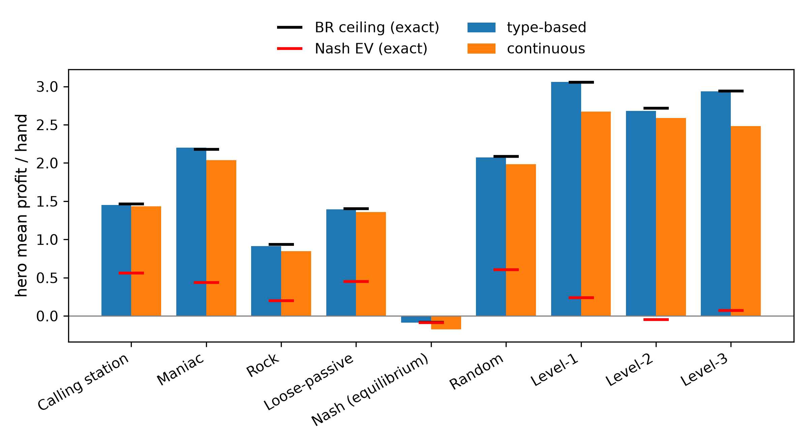
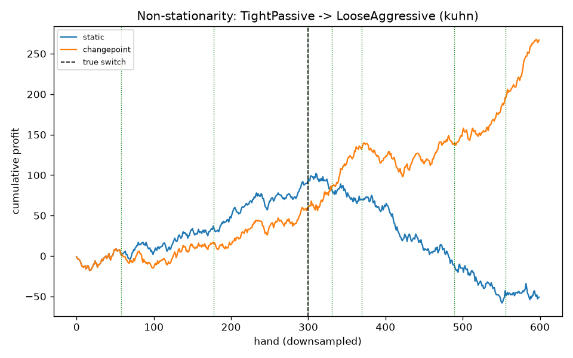
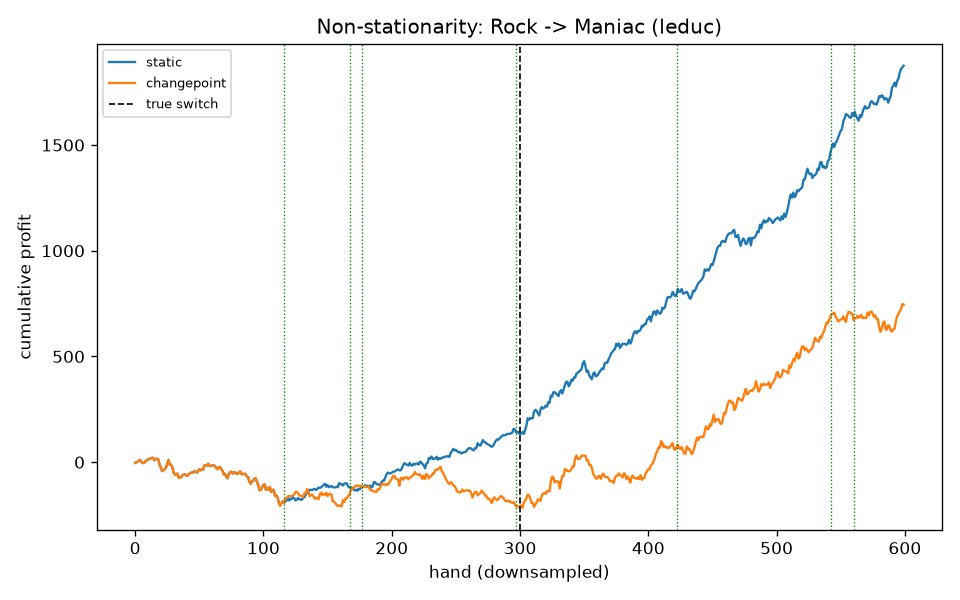

<!--
OFFICIAL PhD TITLE (keep consistent across all documents):
EN: Research on the possibilities for applying Artificial Intelligence in computer games
BG: Изследване на възможностите за приложение на изкуствения интелект в компютърни игри
-->

# Step 07 — Opponent Modeling in Imperfect-Information Games

**Games:** Kuhn Poker (3-card, 2-player) and Leduc Hold'em (6-card, 2-round) — the smallest exact-solvable imperfect-information testbeds, reusing the Step 02 Kuhn engine + CFR solver and the Step 03 Leduc engine.
**PhD connection:** **Contribution #1 (Behavioral Adaptation Framework)** — an opponent model is the *sensor* that turns observed actions into an estimate of the opponent's strategy; the adaptive exploiter is a first *actuator*, which Step 08 formalizes into safe (KL-regularized) exploitation.
**Scope of results:** Part I is a sequence of seeded Kuhn-Poker experiments that build intuition. Part II is a full evaluation on both games (5 seeds, 20 000-hand matches, Nash baselines at 200 000 / 40 000 CFR iterations). All figures are measured from these runs and are bounded, wherever possible, by *exact* analytical references rather than simulated ones.

> **How to read this report.** Both parts follow the same arc: **what we test → how we test it → results → conclusions.** **Part I (§1–§6)** studies the type-based Bayesian model in isolation on Kuhn — what an opponent "type" looks like, why modeling is worth doing, and how the belief-update loop behaves (including where it fails). **Part II (§7–§13)** evaluates the full system — three opponent models and an adaptive exploiter — on Kuhn and Leduc. §14 lists reproduction commands.

---

# PART I — EXPLORATION ON KUHN POKER

## 1. What this step is about

A **Nash-equilibrium** strategy is built never to lose in the long run, *no matter who it plays*. That safety has a price: it plays identically against a world champion and against someone who folds every time you bet. **Opponent modeling** is the act of *watching how a specific opponent actually plays* and updating a belief about their strategy, so we can **deviate from Nash to exploit their mistakes** — bluff more against someone who folds too much, value-bet thinner against someone who calls too much.

The technique explored first is the **type-based (Bayesian) model**: rather than learn a strategy from a blank slate, we keep a belief — a probability distribution — over a small set of predefined opponent **types**, and update it after every observed action via Bayes' rule:

> posterior(type)  ∝  prior(type)  ×  P(observed action | that type)

An action a type calls impossible drives that type toward zero; an action it predicts well boosts it. Over many hands the belief concentrates on the best-fitting type, and we best-respond to it. All numbers in Part I are measured from seeded, reproducible Kuhn runs.

### 1.1 The opponent "type zoo"

Four ground-truth types serve both as the opponents we play against and as the candidate hypotheses the detector reasons over:

| Type | Behavior |
|------|----------|
| **AlwaysCall** | Calling station — never bets, never folds (checks an open pot, calls any bet). |
| **TightPassive** | Rock — only commits chips with the nuts (K); folds everything else. The most exploitable type. |
| **LooseAggressive** | Maniac — always bets / calls, regardless of hand. |
| **Nash** | Balanced equilibrium play (from the Step 02 CFR solver); mixes its actions; unexploitable. |

---

## 2. Experiment 1 — Behavioral fingerprints

**What we test.** Does each type leave a distinct, recoverable signature in its actions?

**How.** Play each type against a 50/50 "prober" (to force every information set to be visited) and record the empirical `P(bet)` at each info set next to the type's true `P(bet)`.

**Results.** The four fingerprints are visibly distinct and the empirical frequencies track the true probabilities at well-visited info sets: **LooseAggressive** ≈ 1.0 everywhere; **TightPassive** ≈ 0 except with K; **AlwaysCall** ≈ 0 when checking into an open pot but ≈ 1.0 when facing a bet; **Nash** fractional and mixed.


**Conclusion.** Recovering a type's fingerprint from observed actions is the whole modeling task, and it is feasible — but info sets with few visits have noisy empirical frequencies, which is exactly what makes modeling hard on little data.

---

## 3. Experiment 2 — The exploitation opportunity (why bother)

**What we test.** How much value does modeling actually unlock over blind Nash play?

**How.** For each type and seat, compute *exactly* (i) the Nash hero's expected value, (ii) the best-response EV (the exploitation ceiling, assuming the type is known perfectly), and (iii) the gap between them. The gap is the money Nash leaves on the table.

| Opponent | Seat | Nash EV | Best-response EV | Gap |
|----------|:----:|--------:|-----------------:|----:|
| AlwaysCall | 0 | +0.119 | +0.333 | **0.215** |
| AlwaysCall | 1 | +0.220 | +0.333 | **0.113** |
| TightPassive | 0 | −0.060 | +0.167 | **0.227** |
| TightPassive | 1 | +0.055 | +0.333 | **0.278** |
| LooseAggressive | 0 | +0.121 | +0.333 | **0.213** |
| LooseAggressive | 1 | +0.116 | +0.333 | **0.217** |
| Nash | 0 | −0.055 | −0.052 | 0.004 |
| Nash | 1 | +0.055 | +0.060 | 0.005 |

**Results.** Against the three exploitable types the gap is large (0.11–0.28 per hand); against **Nash the gap is ≈ 0** — as it must be, since Nash is unexploitable and best response cannot beat the game value. Concretely, the computed best response to **TightPassive bluffs**: it bets the weakest hand (Jack) into an open pot, because that type folds everything but the King.

**Conclusion.** The value of opponent modeling is real and measurable, and exploiting a rock means *bluffing more*. (The −1/18 ≈ −0.056 seat-0 disadvantage of Kuhn's first player explains the small negative Nash EVs — that is the game, not an error.)

---

## 4. Experiment 3 — The Bayesian type detector (the core loop)

**What we test.** Starting from an even prior, can the belief-update loop identify the opponent from behavior alone — and what happens when the opponent matches *no* type?

**How.** Maintain a posterior over the four types; after each observed opponent action multiply in its likelihood under each type and renormalize (in log-space, with a small ε = 0.02 likelihood smoothing so no single "impossible" action permanently kills a candidate). Run several hidden opponents and watch the posterior evolve hand by hand.

### 4.1 In-set opponents — fast, correct, stable

When the hidden opponent genuinely **is** one of the four candidates, the posterior concentrates correctly and locks in:

- **Hidden = TightPassive:** posterior piles onto TightPassive and locks at ≈ 1.0 by hand ~18. (Nash is the slow-to-die rival, because a rock and equilibrium play overlap on many hands.)
- **Hidden = AlwaysCall:** locks by hand ~4 (a very distinctive type).


### 4.2 Out-of-set opponent — "no honest home"

The instructive case is a hidden opponent that is a **50/50 per-action blend** of TightPassive and LooseAggressive — deliberately *none* of the four types. One might expect the posterior to "split between the two nearest types." **It does not.** The detector commits hard to a *single* type at a time and jumps:

> AlwaysCall (hands 1–2) → LooseAggressive (hands ~5–40) → **Nash (hand ~43+, ≈ 1.0)**.


This is *correct* Bayesian behavior, and the reason is the central lesson of the phase:

- The blend plays a true `(0.5, 0.5)` on middling hands (J/Q) and always bets the King. Every time it bets a J/Q, the rock (which never does) takes a likelihood penalty; every time it checks a J/Q, the maniac (which always bets) takes one.
- The two deterministic extremes are therefore each contradicted about half the time. **Nash is the only candidate that assigns real probability to *both* betting and checking a middling hand**, so it is the only story never fatally contradicted — and a product-of-likelihoods posterior concentrates on the single best explanation, not a blend.

**Conclusion.** A small stereotype menu has *no honest way to say "none of the above."* Faced with an opponent it cannot represent, it commits — confidently — to the nearest *mixed* type rather than reporting genuine uncertainty. Two points sharpen this. First, the posterior is a **relative, normalized** quantity — the four bars are forced to sum to 1, so `P(Nash)=1.0` means "best fit *among these four*," **not** "good fit in absolute terms." Measuring the winner's absolute fit (geometric-mean probability it assigns to each observed action) exposes the difference: the winning Nash model scores **0.74 per action against a true Nash opponent but only 0.31 against the mixture** — equally confident on paper, far worse underneath. Second, the honest fix is to stop asking "which one type?" and ask "what *mixture* of types?" — Experiment 4 (§5), and the motivation for the **continuous** and **consistent** models in Part II.

### 4.3 How robust is that convergence? — a 500-hand stress test

Because §4.2 lands on Nash, a natural question is whether, over a long match, the belief can still "fall" away from Nash. We ran the mixture scenario for **500 hands across 300 random seeds** and separated two phenomena a naive metric conflates — *slow convergence* versus *falling after convergence*.

| Measurement (300 seeds × 500 hands) | Result |
|---|---|
| Final winner at hand 500 is Nash | **300 / 300 (100%)** |
| After Nash *permanently* takes the lead, it later dips below 0.5 | **0 / 300 (never)** |
| A *wrong* type still led past hand 100 | 40 / 300 (~13%) |
| A *wrong* type still led past hand 200 | 14 / 300 (~5%) |
| Hand at which Nash locks in for good | median **23** · 90th-pct **125** · worst **461** |

**Results.** Nash never *falls*: once it takes the lead for good it stays pinned at ≈ 1.0. The real risk is the opposite — **slow convergence with a confident wrong answer in the meantime.** In a sizeable minority of runs the maniac (LooseAggressive) owns the belief at ≈ 1.0 for well over a hundred hands before Nash overtakes, purely because an early run of bet-heavy hands looked exactly like "always bets." The chart below (the most volatile seed found) shows LooseAggressive holding ≈ 1.0 from hand ~35 to ~220, then a sharp cliff to Nash for the remainder:


**Conclusion.** Among the four candidates, Nash is the one *closest* (minimum KL divergence) to the true blended strategy, so every deterministic type eventually meets a contradiction it cannot survive. Nash is the unique long-run winner — "long run" just occasionally means 200+ hands. Best-responding hard to an early, confident-but-wrong belief would mean adjusting to beat a phantom.

---

## 5. Experiment 4 — Recovering the blend (mixture modeling with EM)

**What we test.** §4 showed that asking *"which single type are you?"* collapses a blended opponent onto the nearest mixed type (Nash) and hides a poor absolute fit. Can we instead ask *"what **mixture** of types are you?"* and recover the actual blend?

**How.** Fit **mixing weights** `π` over the same four fixed types by **Expectation–Maximization**: each observed action is *softly credited* to the types in proportion to how well each explains it (E-step), and the weights are the average credit (M-step), iterated to convergence.

- E-step: `responsibility(type | action) ∝ π(type) × P(action | type)`
- M-step: `π(type) = mean responsibility over all observations`

A tempting shortcut — a **hard** per-hand tally (pick the single best-fitting type each hand, then count) — does **not** work: it is confounded by *type overlap* (e.g. `AlwaysCall` and `TightPassive` both check a weak hand, so the argmax cannot separate them). The soft, iterated EM version deconfounds them.

**Results.** Re-fitting the weights after every hand (warm-started from the previous estimate) gives a per-hand trajectory — the mixture analogue of §4's posterior-over-time charts. The two active components climb to their true weights while the other two decay to zero, whereas the old single-type posterior instead reports Nash ≈ 1.0 throughout:

| Hidden opponent | Method | AlwaysCall | TightPassive | LooseAggressive | Nash |
|---|---|---:|---:|---:|---:|
| 50 / 50 blend | global posterior (old) | 0.00 | 0.00 | 0.00 | **1.00** ✗ |
| | **EM weights** @250 hands | 0.00 | **0.51** | **0.49** | 0.00 ✓ |
| | *true blend* | 0.00 | *0.50* | *0.50* | 0.00 |
| 70 / 30 blend | global posterior (old) | 0.00 | 0.00 | 0.00 | **1.00** ✗ |
| | **EM weights** @250 hands | 0.00 | **0.66** | **0.34** | 0.00 ✓ |
| | *true blend* | 0.00 | *0.70* | *0.30* | 0.00 |

*(The small residual error at 250 hands is sampling noise; a longer run tightens it — 4,000 hands gives 0.50/0.50 and 0.69/0.31.)*


**Conclusion.** EM recovers not only *which* types are present but *in what proportion* — an interpretable, honest description ("≈ 70 % rock + 30 % maniac") where the single-type model gave a confident wrong answer. This mirrors opponent modeling's foundational work (Bayes' Bluff, Southey et al. 2005), which maintains a *distribution over* opponent strategies rather than committing to one. Part II generalizes this further — a **continuous** per-information-set estimator (a Dirichlet count per situation, which represents *any* strategy, including a blend) and a **consistent** sequence-form estimator (Ganzfried 2025). Experiment 4 is the smallest, most readable rung on that ladder.

---

## 6. What Part I establishes

The exploration surfaces, with a concrete measured face, the tension that Steps 07–08 exist to resolve:

1. **The value is real (Exp. 2):** blind Nash leaves 0.1–0.3 per hand on the table against exploitable opponents — modeling is worth doing.
2. **A model can be confident *and* wrong for a long time (Exp. 3):** in ~13% of 500-hand runs the detector confidently believed the wrong type past hand 100, and a stereotype menu cannot represent an out-of-menu opponent (Exp. 3–4).
3. **Therefore exploitation must be regularized.** One must not best-respond to whatever the model currently believes; the lean toward exploitation has to be bounded (e.g. KL-regularized) and scaled to how *earned* the read is. Part I turns that abstract principle into a demonstrated failure mode; Part II measures it at full scale, and Step 08 builds the safe actuator.

---

# PART II — FULL SYSTEM EVALUATION ON KUHN & LEDUC

## 7. What we test, and how

Part II evaluates a complete opponent-modeling system — **three interchangeable opponent models** feeding **one adaptive exploiter** — on both games, against exact analytical yardsticks.

**The three models** (all share a single interface: consume observed hands → emit a predicted opponent policy):

- **Type-based** — a Dirichlet-multinomial posterior over a fixed menu of opponent types (the Part I model, scaled up); reports a MAP type and a model-averaged policy.
- **Continuous** — a per-information-set Dirichlet estimate (count what the opponent did at each situation, smoothed). It can represent *any* strategy; hidden cards (folds) are handled by spreading soft/EM counts over the consistent deals.
- **Consistent** — the Ganzfried (2025) sequence-form maximum-a-posteriori estimate, solved as a small convex program. Estimating one globally consistent strategy (rather than each info set independently) is designed to use partial-observability evidence more cleanly.

**The exploiter.** Every *k* hands it rebuilds the hero policy as an exact best response to the model's current estimate, optionally blended toward Nash by a safety weight, and optionally forgetting the model when a change is detected (Bayesian online change-point detection on an aggression signal). Because all three models feed the *same* exact best response, exploitation is compared apples-to-apples.

**Exact yardsticks.** Both games are small enough to solve exactly, so every simulated curve is bracketed by two analytical references computed by hand-verified math, not simulation: `nash_ev` (what safe equilibrium play earns against that opponent — you cannot do worse if the read is useless) and `ceiling` (the exact best-response value — the most that is extractable). A good exploiter sits between them and climbs toward the ceiling. The apparatus itself is trustworthy: our solver reproduces the exact Kuhn Nash value of −1/18 (NashConv ≈ 0.002, i.e. essentially unexploitable), and an exact best response beats uniform play by the predicted margins (Kuhn +0.500, Leduc +2.087).

**The three studies.**

1. **Detection** — can each model recover *who* it is playing? For the type-based model we report the posterior on the true type and whether the MAP is correct; for all models we report the mean total-variation (TV) distance between the estimated and true opponent strategy (lower = better recovery).
2. **Exploitation** — how much does best-responding to each model actually win, measured against the exact `nash_ev` and `ceiling`?
3. **Non-stationarity** — when the opponent switches style mid-match, does change-point forgetting recover faster than a model that never forgets?

**Sample sizes.** Detection: 5 seeds × 4 000 hands per type. Exploitation: 5 seeds × 20 000-hand matches, refitting every 200 hands. Non-stationarity: a 20 000-hand match with the style switch at hand 10 000. Nash baselines use 200 000 (Kuhn) / 40 000 (Leduc) CFR iterations.

**One deliberate caveat — the consistent model is not run in the exploitation loop.** It refits its convex program from scratch each time the exploiter updates, and that cost grows with the number of hands already observed (from a fraction of a second early to ~12 s per refit near 20 000 hands), which makes a full online match impractical. We therefore evaluate the consistent model on **strategy recovery (detection)**, where its sequence-form MAP is designed to shine, and let the type-based and continuous models carry the exploitation comparison. (On Leduc the sequence-form program is large, so consistent detection is reported on Kuhn only.)

---

## 8. Detection — who is the opponent?

**Type-based detection is essentially perfect**: the posterior concentrates fully on the true type and the MAP is correct (TV distance 0.000) — with **one instructive exception**. On Kuhn the higher Level-k opponents collide: Level-2 and Level-3 converge to the *same* behavioral policy, so the posterior splits 0.50/0.50 between them and the MAP for the true Level-3 lands on Level-2. This is not an error — two types that play identically are genuinely indistinguishable *by their actions*, which is all a type detector observes. The **continuous** and **consistent** models, which estimate the actual policy rather than a label, recover both cleanly (TV ≈ 0.005).

The **continuous** model's mean TV to the truth is small on Kuhn (0.006–0.030) but larger on Leduc (0.11–0.36): Leduc has far more information sets and heavier partial observability, so a free-form per-info-set estimator needs many more hands to converge, and rarely-visited info sets dominate the residual error. The **consistent** model (Kuhn) matches or beats the continuous model's recovery (TV ≈ 0.004–0.021), as its sequence-form MAP is designed to.

**Conclusion.** Recovery works, and the model classes order as theory predicts: a well-specified type menu is unbeatable *when the opponent is in the menu*; strategy-estimating models are needed otherwise and pay a data cost that grows with the size of the game.

---

## 9. Exploitation — how much does modeling win?

Realized mean profit per hand over 20 000-hand matches (×5 seeds), against the exact best-response **ceiling**. The type-based model tracks the ceiling almost exactly on both games; the continuous model matches it on Kuhn and tracks close on Leduc, sitting below for the hardest-to-fit types (the undersampling of §8).

**Kuhn** (ceiling / type-based / continuous):

| Opponent | ceiling | type-based | continuous |
|---|---:|---:|---:|
| AlwaysPass | 0.975 | 0.966 | 0.966 |
| AlwaysBet | 0.333 | 0.335 | 0.335 |
| LooseAggressive | 0.333 | 0.337 | 0.330 |
| TightPassive | 0.167 | 0.168 | 0.168 |
| **Nash** | −0.055 | −0.055 | −0.053 |

**Leduc** (ceiling / type-based / continuous):

| Opponent | ceiling | type-based | continuous |
|---|---:|---:|---:|
| Level1 | 3.056 | 3.061 | 2.672 |
| Maniac | 2.177 | 2.199 | 2.038 |
| CallingStation | 1.464 | 1.451 | 1.434 |
| Rock | 0.937 | 0.912 | 0.848 |
| **Nash** | −0.083 | −0.085 | **−0.175** |



**Results — two carry the message:**

1. **You cannot exploit an equilibrium.** Against the Nash opponent every model earns ≈ the (negative) Nash EV, never more — the exact ceiling *is* essentially the game value. This confirms the exploitation is real, not an artifact.
2. **A confident-but-underfit model makes *you* exploitable.** On Leduc the continuous model *loses* to Nash (−0.175 vs the −0.083 ceiling): with imperfect data it best-responds to a *wrong* estimate of an unexploitable opponent, opening a leak in its own play.

**Conclusion.** When the model class fits, best response reaches the exact extractable ceiling — modeling delivers the full theoretical value. When it does not (continuous on Leduc's many info sets), two costs appear: money left on the table against exploitable opponents, and — more dangerously — a *negative* result against an opponent who cannot be exploited at all. That second cost is the exploitation-vs-safety tension in numbers, and the direct motivation for Step 08's KL-regularized safe exploitation.

---

## 10. Non-stationarity — adapting to a mid-match switch

**What we test.** The opponent switches style at hand 10 000 of 20 000. We compare a **static** continuous model against one with **change-point forgetting** (detect a style change → reset the model → drop to safe play → re-learn).

The result is **scenario-dependent**, which is itself the finding:

| Game | Switch (at hand 10k of 20k) | static (after switch) | change-point (after switch) |
|---|---|---:|---:|
| Kuhn | TightPassive → LooseAggressive | **−0.116** | **+0.226** |
| Leduc | Rock → Maniac | **+1.940** | **+0.525** |





- **Kuhn — change-point wins.** The stale anti-rock strategy (bluff-heavy) *actively loses* to the new maniac (who calls everything), so the static model goes negative; detecting the switch and re-learning recovers to +0.23.
- **Leduc — change-point loses.** The maniac leaks 2+/hand, so the continuously-adapting static model exploits it well without any reset; meanwhile the detector fires many **false positives** during the stable phase (60–61 resets against a single true switch), each dropping to safe play and discarding data.

**Conclusion.** Change-point forgetting rescues you exactly when a stale model is *harmful*, but its naive form — a low-signal detector that false-triggers, plus a full reset-to-safe on every detection — can underperform simple continuous adaptation when the new opponent is exploitable enough that staleness costs little. The *reaction* to a detected change matters as much as the detection: cheaper responses (partial forgetting instead of a hard reset; a less trigger-happy detector) are the clear next step.

---

## 11. Are the sample sizes adequate?

Because every experiment logs its per-seed values, adequacy can be quantified rather than assumed. The short answer: **more than adequate for detection and exploitation; under-powered for non-stationarity.**

**Exploitation — comfortably adequate.** The standard error (SE) of the mean profit/hand across the 5 seeds is tiny relative to the effects claimed:

| Game | typical SE (per-hand) | type-based gap to ceiling | continuous shortfall vs type-based |
|---|---|---|---|
| Kuhn | 0.000–0.005 | within ≈ 1 SE everywhere | ≤ 1 SE (they coincide) |
| Leduc | 0.007–0.040 | within ≈ 1 SE everywhere | **5–20 SE** (e.g. Level1 3.061 vs 2.672, Δ = 0.389 at SE ≈ 0.02–0.04) |

So (1) the type-based model is **statistically indistinguishable from the exact ceiling** on every type in both games — "modeling reaches the ceiling" is not seed luck; and (2) the continuous model's Leduc shortfall (§9) is a **real ~5–20 σ effect**, as is its Nash self-leak (−0.175 vs −0.083, a 0.092 gap at SE ≈ 0.015 ≈ 6 σ). The sample resolves every difference the report leans on.

**Detection — adequate for the claims made.** Type-based posteriors are saturated and the continuous/consistent TV distances are stable and ordered as predicted. We report point TVs rather than error bars; a fuller version would repeat detection across seeds and publish TV confidence bands.

**Non-stationarity — under-powered.** This experiment runs a single fixed RNG seed, so each number is one realization (`n = 1`, no error bar). The *direction* of the finding is robust — the mechanisms are structural and the 60–61-reset count against one true switch is unambiguous — but the *magnitudes* (+0.226, +0.525, +1.940) should be read as illustrative. Repeating it over the same 5 seeds is the single most valuable cheap upgrade.

---

## 12. Limitations

Ranked by how much they qualify the conclusions:

1. **Non-stationarity is `n = 1` (§11).** The finding holds; the magnitudes are single realizations. Looping over the existing 5 seeds fixes it in minutes of compute.
2. **The change-point detector is too trigger-happy (§10).** ~1 false reset per ~330 hands in a stationary regime — a genuine defect in the naive detector + hard-reset design, and the reason change-point loses on Leduc.
3. **Consistent-model exploitation is unmeasured by design (§7).** Excluding it keeps the online matches tractable, but the exploitation comparison is type-based vs continuous only; the consistent model is characterised on recovery instead.
4. **Leduc consistent detection is deferred** — the sequence-form program is large there, so cross-game recovery for the consistent model rests on Kuhn.
5. **Well-specified detection is an easy case.** Every true type is also a candidate, so posterior = 1.000 is *expected*; it validates the machinery, not robustness to an opponent *outside* the menu — precisely where the continuous/consistent models should earn their keep (and where continuous visibly struggles on Leduc).
6. **Two small games, self-play data.** Kuhn/Leduc are exact-solvable *because* they are tiny; the partial-observability and undersampling effects that dominate Leduc will only intensify in larger games. This is a controlled proof-of-concept, not a scaling claim.

---

## 13. Conclusions and research directions

**Conclusions.** A good opponent model is *necessary but not sufficient* for profitable, safe adaptation. When the model class fits the opponent, best-responding to it reaches the exact extractable ceiling (type-based on both games; continuous on Kuhn) — the full theoretical value of modeling is realized. But under partial observability and limited data (continuous on Leduc), an underfit model both leaves money on the table and, against an unexploitable opponent, best-responds to a phantom and *loses*. Non-stationarity adds a second edge: forgetting a stale model helps only when staleness is actively harmful, and a careless detector's false resets can cost more than they save. Across all three studies the same principle recurs: exploitation must be scaled to how well-earned the read is.

**Research directions** (each now motivated by a measured effect above):

- **Safe (KL-regularized) exploitation.** The continuous model's Nash self-leak (§9) is the exploitation-vs-safety tension made empirical — the concrete hand-off into **Step 08** and thesis **Contribution #2**: bound the best response's deviation from Nash by the model's own confidence, so an underfit model cannot open a leak.
- **Confidence-scaled forgetting instead of a hard reset (§10).** A forgetting factor, or a reset whose depth scales with detection confidence, should dominate the current reset-to-safe.
- **A better change-point signal (§10, §12).** Per-info-set likelihood-ratio monitoring or a multivariate detector over several behavioral features would cut the false-positive rate that currently sinks change-point on Leduc.
- **Misspecified / out-of-menu opponents (§12).** Because well-specified detection is saturated, the interesting regime is opponents *not* in the menu (mixtures, drift, adversarial). This is where the non-parametric and sequence-form models should separate from type-based, and where a "none of my types fit" detector (open-world type discovery) becomes its own question — the smallest version of which Part I (§4.2, §5) already exhibits on Kuhn.
- **Online/incremental consistent model (§7).** Warm-starting the convex solve from the previous fit and caching hand-terms incrementally could bring the sequence-form model into the online exploitation loop, turning a detection-only method into a usable real-time exploiter.
- **Undersampling-aware recovery (§8).** The Leduc continuous shortfall is dominated by rarely-visited info sets; priors that share statistics across related info sets (hierarchical / abstraction-based smoothing) are the natural fix and connect opponent modeling to the abstraction literature.

---

## 14. Reproduction

**Part I — exploration experiments** (from repo root, `.venv` active; each prints tables to stdout and writes figures under `implementation/step07/exploration/figures/`):

```bash
python implementation/step07/exploration/behavioral_fingerprints.py  # Exp 1
python implementation/step07/exploration/exploitation_opportunity.py # Exp 2 (Nash EV vs BR EV)
python implementation/step07/exploration/bayesian_type_detector.py   # Exp 3 (5 hidden opponents)
python implementation/step07/exploration/mixture_recovery.py         # Exp 4 (EM, 50/50 & 70/30)
python implementation/step07/exploration/robustness_sweep.py         # §4.3 sweep (500 hands × 300 seeds)
```

**Part II — full evaluation** (from `implementation/step07/implementation/`, `.venv` active; needs numpy, scipy, matplotlib):

```bash
python tournament.py --config smoke   # quick Kuhn pass (~3 s)
python tournament.py --config scale   # full run: Kuhn ~2 min, Leduc ~14 min
```

Results write to `results/*.json` and plots to `plots/*.png`. *Figures reproduced in this report live in `deliverables/reports/step07/figures/` (exploration figures under their original names; evaluation figures prefixed `impl_`).*
