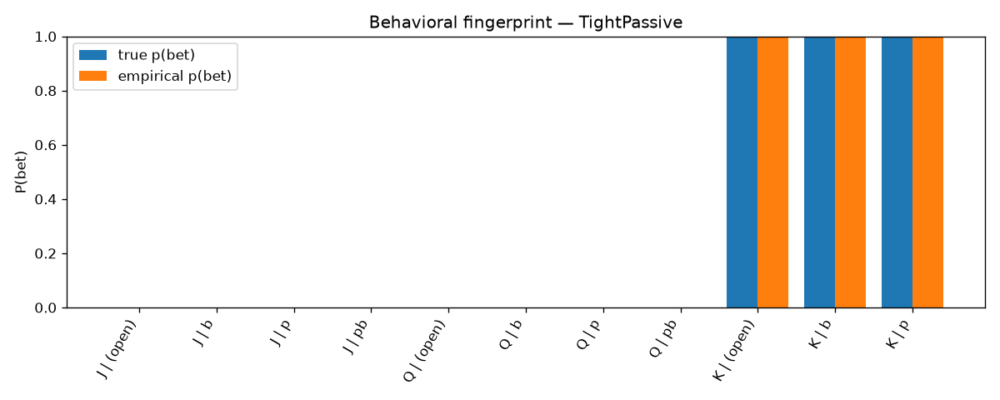
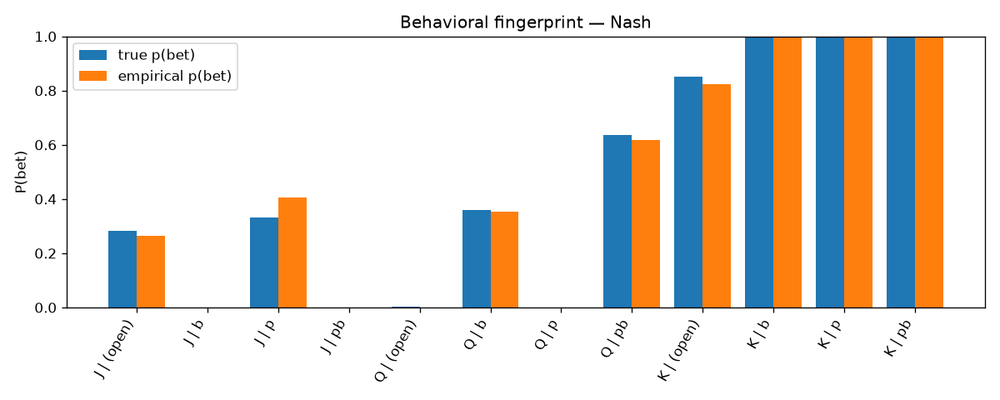
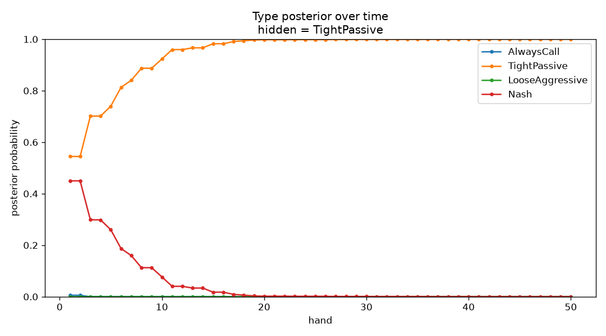
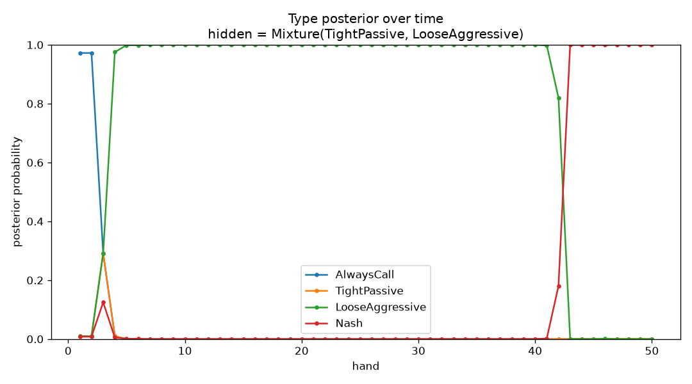
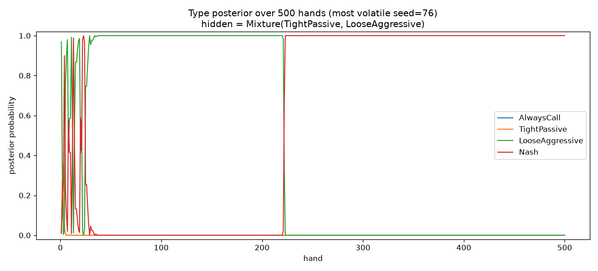
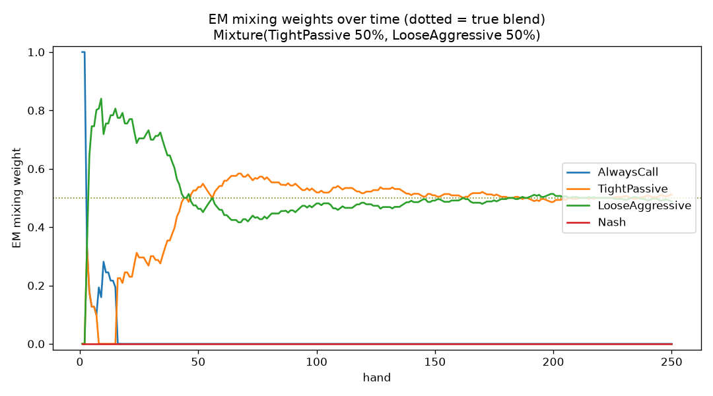
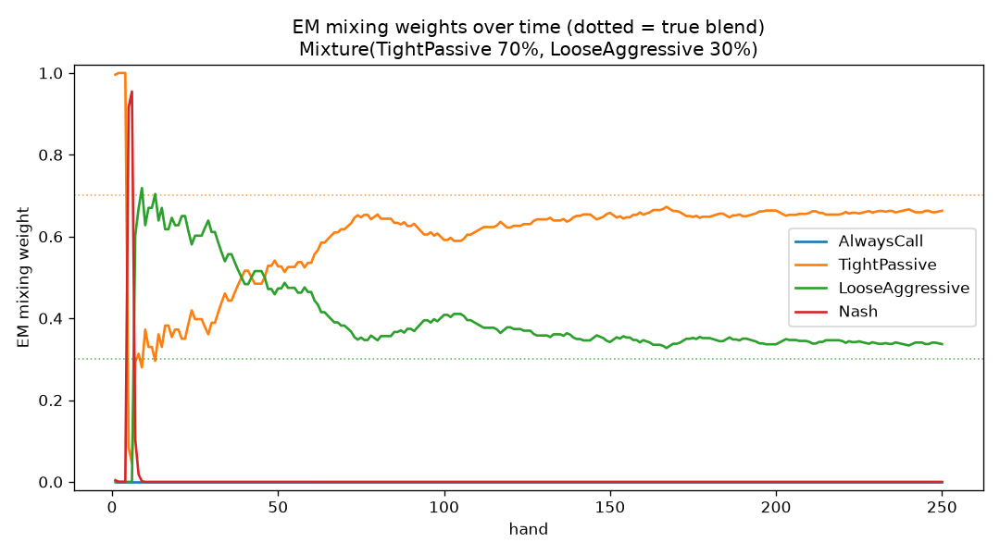

<!--
OFFICIAL PhD TITLE (keep consistent across all documents):
EN: Research on the possibilities for applying Artificial Intelligence in computer games
BG: Изследване на възможностите за приложение на изкуствения интелект в компютърни игри
-->

# Step 07 — Opponent Modeling: Exploration-Phase Report

**Environment:** July 2026
**Game:** Kuhn Poker (3-card, 2-player) — the smallest exact-solvable imperfect-information testbed
**Phase covered:** Phase 2 (Exploration) — seeded, fast experiments that build intuition before the formal implementation
**Foundation reused:** the validated Step 02 Kuhn engine and CFR solver (imported, never copied)
**PhD connection:** First half of **Contribution #1 (Behavioral Adaptation Framework)** — the opponent model is the *sensor* that turns observed actions into an estimate of the opponent's strategy; Step 08 builds the *safe actuator* that exploits it.
**Status:** All exploration experiments run and verified ✓ · Implementation phase (Phase 4) written but not yet validated.

---

## 1. What this step is about

A **Nash-equilibrium** strategy is built never to lose in the long run, *no matter who it plays*. That safety has a price: it plays identically against a world champion and against someone who folds every time you bet. **Opponent modeling** is the act of *watching how a specific opponent actually plays* and updating a belief about their strategy, so we can **deviate from Nash to exploit their mistakes** — bluff more against someone who folds too much, value-bet thinner against someone who calls too much.

The technique explored here is the **explicit type-based (Bayesian) model**: instead of learning a strategy from a blank slate, we keep a belief — a probability distribution — over a small set of predefined opponent **types**, and update it after every observed action via Bayes' rule:

> posterior(type)  ∝  prior(type)  ×  P(observed action | that type)

An action a type calls impossible drives that type toward zero; an action it predicts well boosts it. Over many hands the belief concentrates on the best-fitting type, and we best-respond to it.

This report covers the **exploration phase**: three small Kuhn-Poker experiments that make the idea concrete — *what* an opponent type looks like, *why* it is worth modeling, and *how* the belief-update loop behaves, including where it breaks. Every number below is a **measured result** from a real run (seeded, reproducible), not a prediction.

### 1.1 The opponent "type zoo"

Four ground-truth types serve both as the opponents we play against and as the candidate hypotheses the detector reasons over:

| Type | Behavior |
|------|----------|
| **AlwaysCall** | Calling station — never bets, never folds (checks an open pot, calls any bet). |
| **TightPassive** | Rock — only commits chips with the nuts (K); folds everything else. The most exploitable type. |
| **LooseAggressive** | Maniac — always bets / calls, regardless of hand. |
| **Nash** | Balanced equilibrium play (from the Step 02 CFR solver); mixes its actions; unexploitable. |

---

## 2. Experiment 1 — Behavioral fingerprints

**Question:** does each type leave a distinct, recoverable signature in its actions?

**Method:** play each type against a 50/50 "prober" (to force every information set to be visited) and record the empirical `P(bet)` at each info set next to the type's true `P(bet)`.

**Result.** The four fingerprints are visibly distinct and the empirical frequencies track the true probabilities at well-visited info sets:

- **LooseAggressive** ≈ 1.0 everywhere; **TightPassive** ≈ 0 except with K; **AlwaysCall** ≈ 0 when checking into an open pot but ≈ 1.0 when facing a bet; **Nash** fractional and mixed.





**Takeaway.** Recovering a type's fingerprint from observed actions is the whole modeling task, and it is feasible — but info sets with few visits have noisy empirical frequencies, which is exactly what makes modeling hard on little data.

---

## 3. Experiment 2 — The exploitation opportunity (why bother)

**Question:** how much value does modeling actually unlock over blind Nash play?

**Method:** for each type and seat, compute *exactly* (i) the Nash hero's expected value, (ii) the best-response EV (the exploitation ceiling, assuming the type is known perfectly), and (iii) the gap between them. The gap is the money Nash leaves on the table.

| Opponent | Seat | Nash EV | Best-response EV | Gap |
|----------|:----:|--------:|-----------------:|----:|
| AlwaysCall | 0 | +0.119 | +0.333 | **0.215** |
| AlwaysCall | 1 | +0.220 | +0.333 | **0.113** |
| TightPassive | 0 | −0.060 | +0.167 | **0.227** |
| TightPassive | 1 | +0.055 | +0.333 | **0.278** |
| LooseAggressive | 0 | +0.121 | +0.333 | **0.213** |
| LooseAggressive | 1 | +0.116 | +0.333 | **0.217** |
| Nash | 0 | −0.055 | −0.052 | 0.004 |
| Nash | 1 | +0.055 | +0.060 | 0.005 |

**Result.** Against the three exploitable types the gap is large (0.11–0.28 per hand); against **Nash the gap is ≈ 0** — as it must be, since Nash is unexploitable and best response cannot beat the game value. Concretely, the computed best response to **TightPassive bluffs**: it bets the weakest hand (Jack) into an open pot, because that type folds everything but the King.

**Takeaway.** The value of opponent modeling is real and measurable, and exploiting a rock means *bluffing more*. (The −1/18 ≈ −0.056 seat-0 disadvantage of Kuhn's first player explains the small negative Nash EVs — that is the game, not an error.)

---

## 4. Experiment 3 — The Bayesian type detector (the core loop)

**Question:** starting from an even prior, can the belief-update loop identify the opponent from behavior alone — and what happens when the opponent matches *no* type?

**Method:** maintain a posterior over the four types; after each observed opponent action multiply in its likelihood under each type and renormalize (in log-space, with a small ε = 0.02 likelihood smoothing so no single "impossible" action permanently kills a candidate). Run several hidden opponents and watch the posterior evolve hand by hand.

### 4.1 In-set opponents — fast, correct, stable

When the hidden opponent genuinely **is** one of the four candidates, the posterior concentrates correctly and locks in:

- **Hidden = TightPassive:** posterior piles onto TightPassive and locks at ≈ 1.0 by hand ~18. (Nash is the slow-to-die rival, because a rock and equilibrium play overlap on many hands.)
- **Hidden = AlwaysCall:** locks by hand ~4 (a very distinctive type).



### 4.2 Out-of-set opponent — "no honest home"

The instructive case is a hidden opponent that is a **50/50 per-action blend** of TightPassive and LooseAggressive — deliberately *none* of the four types. The naive expectation was that the posterior would "split between the two nearest types." **It does not.** The detector commits hard to a *single* type at a time and jumps:

> AlwaysCall (hands 1–2) → LooseAggressive (hands ~5–40) → **Nash (hand ~43+, ≈ 1.0)**.



This is *correct* Bayesian behavior, not a bug — and the reason is worth stating precisely, because it is the central lesson of the phase:

- The blend plays a true `(0.5, 0.5)` on middling hands (J/Q) and always bets the King. Every time it bets a J/Q, the rock (which never does) takes a likelihood penalty; every time it checks a J/Q, the maniac (which always bets) takes one.
- The two deterministic extremes are therefore each contradicted about half the time. **Nash is the only candidate that assigns real probability to *both* betting and checking a middling hand**, so it is the only story never fatally contradicted — and a product-of-likelihoods posterior concentrates on the single best explanation, not a blend.

**Takeaway.** A four-stereotype model has *no honest way to say "none of the above."* Faced with an opponent it cannot represent, it commits — confidently — to the nearest *mixed* type rather than reporting genuine uncertainty. Two things are worth stressing. First, the posterior is a **relative, normalized** quantity — the four bars are forced to sum to 1, so `P(Nash)=1.0` means "best fit *among these four*," **not** "good fit in absolute terms." Measuring the winner's absolute fit (geometric-mean probability it assigns to each observed action) exposes the difference: the winning Nash model scores **0.74 per action against a true Nash opponent but only 0.31 against the mixture** — equally confident on paper, but a far worse fit underneath. Second, the honest fix is to stop asking "which one type?" and start asking "what *mixture* of types?" — which is Experiment 4 (§5), and the motivation for the **continuous** and **consistent** models built in the implementation phase (Phase 4).

### 4.3 How robust is that convergence? — a 500-hand stress test

Because §4.2 lands on Nash, a natural question is: *over a long match, can the belief still "fall" away from Nash?* We ran the mixture scenario for **500 hands across 300 random seeds** and separated two phenomena that a naive metric conflates — *slow convergence* versus *falling after convergence*.

| Measurement (300 seeds × 500 hands) | Result |
|---|---|
| Final winner at hand 500 is Nash | **300 / 300 (100%)** |
| After Nash *permanently* takes the lead, it later dips below 0.5 | **0 / 300 (never)** |
| A *wrong* type still led past hand 100 | 40 / 300 (~13%) |
| A *wrong* type still led past hand 200 | 14 / 300 (~5%) |
| Hand at which Nash locks in for good | median **23** · 90th-pct **125** · worst **461** |

**Result.** Nash never *falls*: once it takes the lead for good it stays pinned at ≈ 1.0. The real risk is the opposite — **slow convergence with a confident wrong answer in the meantime.** In a sizeable minority of runs the maniac (LooseAggressive) owns the belief at ≈ 1.0 for well over a hundred hands before Nash overtakes, purely because an early run of bet-heavy hands looked exactly like "always bets." The chart below (the most volatile seed found) shows LooseAggressive holding ≈ 1.0 from hand ~35 to ~220, then a sharp cliff to Nash for the remainder:



**Why it can never end wrong.** Among the four candidates, Nash is the one *closest* (minimum KL divergence) to the true blended strategy, so every deterministic type eventually meets a contradiction it cannot survive. Nash is the unique long-run winner — "long run" just occasionally means 200+ hands.

---

## 5. Experiment 4 — Recovering the blend (mixture modeling with EM)

**Question:** §4 showed that asking *"which single type are you?"* collapses a blended opponent onto the nearest mixed type (Nash) and hides a poor absolute fit. Can we instead ask *"what **mixture** of types are you?"* and recover the actual blend?

**Method.** Fit **mixing weights** `π` over the same four fixed types by **Expectation–Maximization**: each observed action is *softly credited* to the types in proportion to how well each explains it (E-step), and the weights are the average credit (M-step), iterated to convergence.

- E-step: `responsibility(type | action) ∝ π(type) × P(action | type)`
- M-step: `π(type) = mean responsibility over all observations`

A tempting shortcut — a **hard** per-hand tally (pick the single best-fitting type each hand, then count) — does **not** work: it is confounded by *type overlap* (e.g. `AlwaysCall` and `TightPassive` both check a weak hand, so the argmax cannot separate them). The soft, iterated EM version deconfounds them.

**Result.** We re-fit the weights after every hand (warm-started from the previous estimate) to get a **per-hand trajectory** — the mixture analogue of §4's posterior-over-time charts. The two active components climb to their true weights while the other two decay to zero, whereas the old single-type posterior instead reports Nash ≈ 1.0 throughout:

| Hidden opponent | Method | AlwaysCall | TightPassive | LooseAggressive | Nash |
|---|---|---:|---:|---:|---:|
| 50 / 50 blend | global posterior (old) | 0.00 | 0.00 | 0.00 | **1.00** ✗ |
| | **EM weights** @250 hands | 0.00 | **0.51** | **0.49** | 0.00 ✓ |
| | *true blend* | 0.00 | *0.50* | *0.50* | 0.00 |
| 70 / 30 blend | global posterior (old) | 0.00 | 0.00 | 0.00 | **1.00** ✗ |
| | **EM weights** @250 hands | 0.00 | **0.66** | **0.34** | 0.00 ✓ |
| | *true blend* | 0.00 | *0.70* | *0.30* | 0.00 |

*(The small residual error at 250 hands is sampling noise; a longer run tightens it — 4,000 hands gives 0.50/0.50 and 0.69/0.31.)*





**Takeaway.** EM recovers not only *which* types are present but *in what proportion* — an interpretable, honest description ("≈ 70 % rock + 30 % maniac") where the single-type model gave a confident wrong answer. This is standard practice: mixture models fit by EM are the classical tool for "the data is a blend of latent sources," and opponent modeling's foundational work (Bayes' Bluff, Southey et al. 2005) already maintains a *distribution over* opponent strategies rather than committing to one. The implementation phase generalizes this further — a **continuous** per-information-set estimator (a Dirichlet count per situation, which represents *any* strategy including a blend) and a **consistent** sequence-form estimator (Ganzfried 2025) with convergence guarantees. Experiment 4 is the smallest, most readable rung on that ladder.

---

## 6. Why this matters for the thesis

The exploration phase already surfaces the tension that Steps 07–08 exist to resolve, and gives it a concrete, measured face:

1. **The value is real (Exp. 2):** blind Nash leaves 0.1–0.3 per hand on the table against exploitable opponents — modeling is worth doing.
2. **But a model can be confident *and wrong* for a long time (Exp. 3):** in ~13% of 500-hand runs the detector confidently believed the wrong type past hand 100. Best-responding hard to that belief would mean adjusting to beat a phantom — and, per the safety half of the dial, *making ourselves exploitable in the process*.
3. **This is the direct argument for Step 08's safe exploitation.** One must not best-respond to whatever the model currently believes; the lean toward exploitation has to be regularized (e.g. KL-bounded) and scaled to how *earned* the read is. The exploration phase turns that abstract principle into a demonstrated failure mode.

This report covers the **sensor** (building the read). Step 08 builds the **actuator** (exploiting it without becoming exploitable).

---

## 7. Methodology note — prediction vs. observed reality

Per the project's implementation workflow, "expected outcomes" written before a run are *predictions to verify*, not results. Two predictions in this phase did not survive contact with a real run: the Experiment-3 "split between the two nearest types" (§4.2), and an implicit assumption that a confident belief is a settled one (§4.3). In both cases we first ruled out an implementation bug, confirmed the observed behavior was the mathematically correct outcome, and then **kept the original prediction on record alongside an explanation of what really happened and why the confusion arose.** The gap between prediction and reality was the most instructive part of the phase: the "split" the single-type detector *couldn't* produce (§4.2) is exactly what the mixture model *does* produce once the question is reframed (§5) — the failed prediction directly motivated the follow-up experiment. That is the point of running the experiments at all.

---

## 8. Reproduction

```bash
# From repo root, with .venv activated:

# Self-test of the shared helpers (exact payoffs, EV, best response, Nash):
python implementation/step07/exploration/kuhn_tools.py

# Experiment 1 — behavioral fingerprints:
python implementation/step07/exploration/behavioral_fingerprints.py

# Experiment 2 — the exploitation gap (Nash EV vs best-response EV):
python implementation/step07/exploration/exploitation_opportunity.py

# Experiment 3 — the Bayesian type detector (five hidden-opponent scenarios):
python implementation/step07/exploration/bayesian_type_detector.py

# Experiment 4 — mixture recovery via EM (50/50 and 70/30 blends):
python implementation/step07/exploration/mixture_recovery.py

# §4.3 robustness sweep — 500 hands x 300 seeds (reproduces the table + the 500-hand chart):
python implementation/step07/exploration/robustness_sweep.py
```

Each script prints tables to stdout and saves JSON caches + PNG figures to `implementation/step07/exploration/figures/`; the per-experiment scripts run in under a second (Kuhn is tiny and exact-solvable), and the robustness sweep takes a few seconds.

*Figures reproduced in this report are copied to `deliverables/reports/step07/figures/`.*
