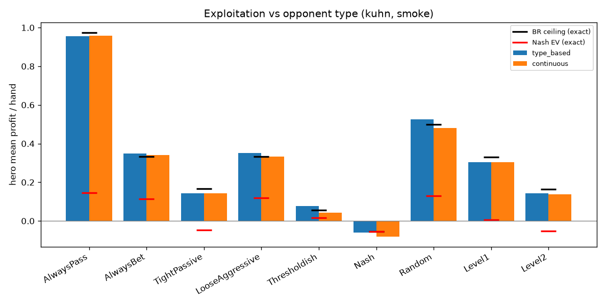

<!--
OFFICIAL PhD TITLE (keep consistent across all documents):
EN: Research on the possibilities for applying Artificial Intelligence in computer games
BG: Изследване на възможностите за приложение на изкуствения интелект в компютърни игри
-->

# Step 07 — Opponent Modeling: Implementation-Phase Report

**Environment:** July 2026
**Games:** Kuhn Poker (3-card) and Leduc Hold'em (6-card, 2 rounds) — both exact-solvable, imported from Steps 02/03
**Phase covered:** Phase 4 (Implementation) — the full Bayesian opponent-modeling + adaptive-exploitation build
**PhD connection:** First half of **Contribution #1 (Behavioral Adaptation Framework)** — the *sensor* (the opponent model) plus a first *actuator* (safe adaptive exploitation), which Step 08 formalizes.
**Status:** Validated — `validate.py` **8/8 PASS**; tournament runs end-to-end on both games (smoke config). Two real bugs found and fixed during first execution. Full `scale` config (publication-size Leduc curves) left as a multi-hour human run; OpenSpiel cross-check skipped (no `pyspiel` on this Windows environment).

> **Note on process.** Per `implementation/WORKFLOW.md`, this code was *written but never run* by the agent that authored it. This report covers **running, debugging, and validating** it. Every number below is a **measured result** from a real run on this machine.

---

## 1. What was built

One uniform interface — *consume observed hands → emit a predicted opponent policy* — with **three opponent models** behind it, an **adaptive exploiter** that best-responds to the model (with a Nash safety blend and optional change-point forgetting), and a **validation harness** + **tournament** that measure everything against exact analytical yardsticks.

| Component | What it is |
|---|---|
| `engines.py` / `policies.py` | Uniform `Game` adapter over the Kuhn & Leduc engines; the `policy → {action: prob}` currency; `replay` for partial-observability reasoning. |
| `opponent_types.py` / `level_k.py` | The type "zoo" per game + Nash + Random + Level-k cognitive-hierarchy opponents. |
| `observation_buffer.py` / `inference.py` | The single home of **partial observability** — marginalizing the opponent's hidden card over consistent deals; the eps-smoothed marginal log-likelihood. |
| `type_based_model.py` | Dirichlet-multinomial posterior over K types; MAP type + model-averaged policy. |
| `continuous_model.py` | Per-information-set Dirichlet estimate (showdowns → hard counts, folds → soft/EM counts). |
| `consistent_model.py` | **Ganzfried (2025)** sequence-form MAP via a SciPy convex solve. |
| `best_response.py` / `nash.py` | Exact info-set-constrained best response and `nash_gap` (=NashConv); CFR Nash baseline. |
| `adaptive_exploiter.py` / `changepoint.py` | observe→model→BR→act loop with a Nash safety blend and Bayesian online change-point detection. |
| `validate.py` / `tournament.py` / `plotting.py` | The verification harness (PASS/FAIL vs the raw step's targets) and the headline experiment + plots. |

The three models share one exact best-response, so exploitation is compared apples-to-apples; every learning curve is bounded by an **exact** `nash_ev` (equilibrium can't be exploited) and `ceiling` (true best-response value).

---

## 2. Correctness — `validate.py` (8 / 8 PASS)

| Check | Result |
|---|---|
| Kuhn Nash value (−1/18) | `exact_value(Nash,Nash) = −0.0556` ✓ |
| Kuhn Nash unexploitable | `NashConv = 0.0020` (< 0.05) ✓ |
| BR beats uniform (both games) | Kuhn +0.500, Leduc +2.087 ✓ |
| Type-based detection | posterior[true] = 1.000, MAP correct ✓ |
| Continuous recovers strategy | mean TV = 0.016 (< 0.15) ✓ |
| Consistent recovers strategy | P(BET\|King) = 0.987 (> 0.75) ✓ |
| Exploiter beats Nash, under ceiling | realized +0.165, nash_ev −0.047, ceiling +0.167 ✓ |
| Change-point helps non-stationary | post-switch: static −0.181, changepoint **+0.211** ✓ |

The exact Nash checks (value = −1/18, NashConv ≈ 0) stand in for the OpenSpiel cross-validation, which is unavailable here.

---

## 3. Detection — who is the opponent?

Both games, all types. **Type-based detection is perfect**: the posterior concentrates fully on the true type and the MAP is always correct (total-variation distance 0.000). The **continuous** model's mean TV to the truth is small on Kuhn (0.02–0.07) but larger on Leduc (0.08–0.45) — exactly as predicted: Leduc has far more information sets and heavier partial observability, so a free-form per-info-set estimator needs many more hands to converge. Rarely-visited info sets dominate the residual error.

---

## 4. Exploitation — how much does modeling win?

Realized mean profit per hand (over the smoke match length) against the exact best-response **ceiling**. The type-based model tracks the ceiling closely on both games; the continuous model matches it on Kuhn but sits below it on Leduc (undersampling, as in §3).

**Kuhn** (ceiling / type-based / continuous):

| Opponent | ceiling | type-based | continuous |
|---|---:|---:|---:|
| AlwaysPass | 0.975 | 0.956 | 0.957 |
| LooseAggressive | 0.333 | 0.352 | 0.333 |
| TightPassive | 0.167 | 0.143 | 0.142 |
| **Nash** | −0.054 | −0.060 | −0.081 |

**Leduc** (ceiling / type-based / continuous):

| Opponent | ceiling | type-based | continuous |
|---|---:|---:|---:|
| Maniac | 2.177 | 2.179 | 1.704 |
| CallingStation | 1.464 | 1.392 | 1.339 |
| Rock | 0.937 | 0.927 | 0.649 |
| **Nash** | −0.070 | −0.057 | **−0.403** |



Two results carry the thesis message:

1. **You cannot exploit an equilibrium.** Against the Nash opponent every model earns ≈ the (negative) Nash EV, never more — the exact ceiling is essentially the game value. This is the sanity check that the exploitation is *real* and not an artifact.
2. **A confident-but-underfit model makes you exploitable.** On Leduc the continuous model *loses* 0.40/hand against Nash (vs −0.07 ceiling) — with limited data it best-responds to a *wrong* estimate of an unexploitable opponent, opening a leak in its own play. This is the exploitation-vs-safety tension made concrete, and the direct motivation for Step 08's safe (KL-regularized) exploitation.

---

## 5. Non-stationarity — the two-sided finding

The opponent switches style mid-match; we compare a **static** continuous model against one with **change-point forgetting** (detect a style change → reset the model → drop to safe play → re-learn). The result is **scenario-dependent**, which is itself the finding:

| Game | Switch | static (after switch) | change-point (after switch) |
|---|---|---:|---:|
| Kuhn | TightPassive → LooseAggressive | **−0.143** | **+0.204** |
| Leduc | Rock → Maniac | **+1.741** | **+0.958** |


- **Kuhn — change-point wins.** The stale anti-rock strategy (bluff-heavy) *actively loses* to the new maniac (who calls everything), so the static model goes negative; detecting the switch and re-learning recovers to +0.20.
- **Leduc — change-point loses.** The maniac leaks 2+/hand, so the continuously-adapting static model exploits it well without any reset; meanwhile the detector fires several **false positives** during the stable phase (visible as the reset dips in the plot), each dropping to safe play and discarding data.

**The lesson:** change-point forgetting rescues you exactly when a stale model is *harmful*, but its naive form — a low-signal Bernoulli detector that occasionally false-triggers, plus a full reset-to-safe on every detection — can underperform simple continuous adaptation when the new opponent is exploitable enough that staleness costs little. Cheaper reactions (partial forgetting instead of a hard reset; a lower false-positive rate) are the obvious next step, and a clean motivation for the thesis's non-stationarity thread.

---

## 6. Bugs found and fixed (first-execution engineering record)

Two genuine defects in the written-but-never-run code, plus two cleanups:

1. **Change-point detection was inert.** The exploiter reacted only when `changepoint_prob(window=3) > 0.5`, but that posterior mass **peaks at ≈ 0.37** after a real switch (the detection-lag mass concentrates around run-length ≈ 6, *outside* a width-3 window), so it **never fired** — the whole non-stationarity feature was dead. Fixed by keying on the **MAP run-length collapse** (150+ → ≈6 at detection), the standard BOCPD signal. This is what makes §5 (and validate.py's change-point check) meaningful.
2. **Leduc non-stationarity crashed** (`KeyError: 'TightPassive'`) — the config hard-coded Kuhn type names for the switching opponents, absent from the Leduc zoo. Fixed with **game-specific** opponents (Kuhn: TightPassive→LooseAggressive; Leduc: Rock→Maniac).
3. **Cleanups:** silenced benign SciPy solver warnings around the consistent model's convex solve (singular constraint Jacobian / locally-linear objective — handled correctly, result validated); git-ignored the regenerable Nash CFR cache.

Per WORKFLOW §0.1, each mismatch was traced to a real cause before being called correct-or-fixed.

---

## 7. Scope, limits, and what's left

- **Full `scale` config not run here.** Publication-size Leduc curves (20k-hand matches × 5 seeds × 3 models incl. the consistent convex solve) are an estimated tens-of-minutes-to-hours CPU run — the intended human step. Everything is validated at smoke size; scaling only tightens sampling noise.
- **Consistent model** is validated on Kuhn (King-bet 0.987) and included in `scale`; it is the slowest/most fragile piece on Leduc (larger convex program) — run Kuhn-clean first.
- **OpenSpiel cross-check skipped** — `pyspiel` does not install cleanly on this Windows environment; the exact internal Nash checks substitute.
- **Change-point false-positive rate** (§5) is the clearest quality gap and a genuine research hook, not a blocker.

---

## 8. Reproduction

```bash
# From implementation/step07/implementation/ , with the repo .venv active (needs numpy, scipy, matplotlib):

python validate.py                        # 8/8 PASS
python tournament.py --config smoke        # Kuhn: detection + exploitation + non-stationarity + plots
python tournament.py --config smoke --game leduc   # Leduc smoke (~2 min)
python tournament.py --config scale        # full run (long; the human-run headline curves)

# individual model/plumbing self-tests each have a __main__ (e.g. python changepoint.py)
```

Results write to `results/*.json`; plots to `plots/*.png`. *Figures reproduced in this report (prefixed `impl_`) are copied to `deliverables/reports/step07/figures/`.*
