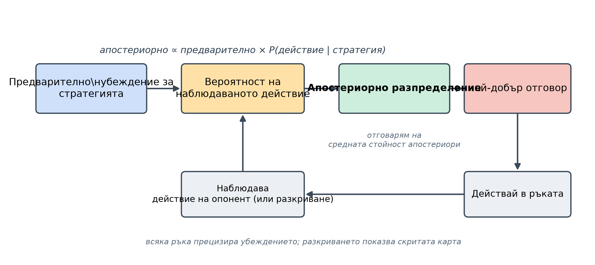
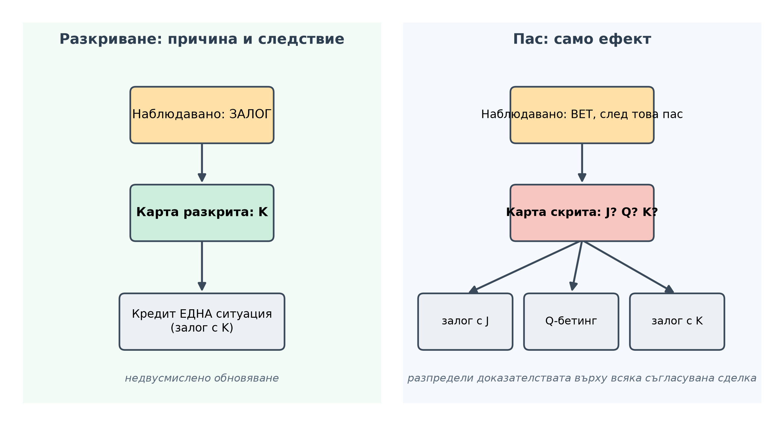
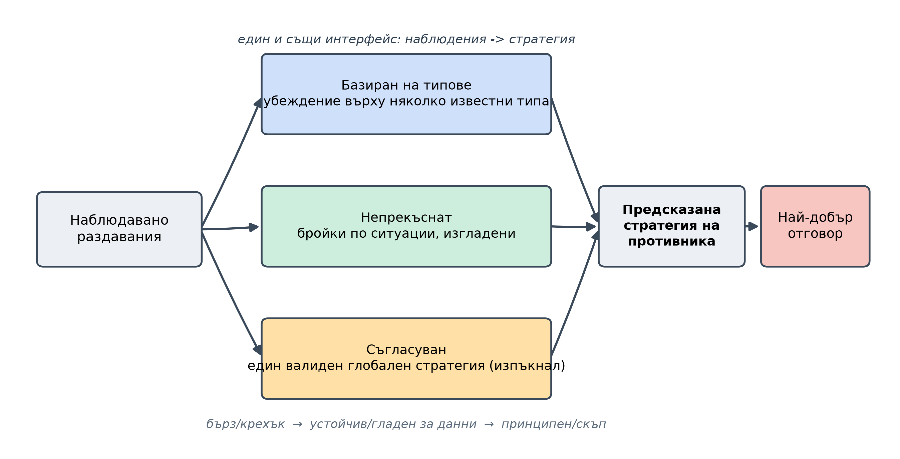
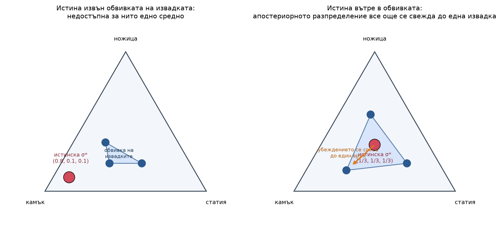
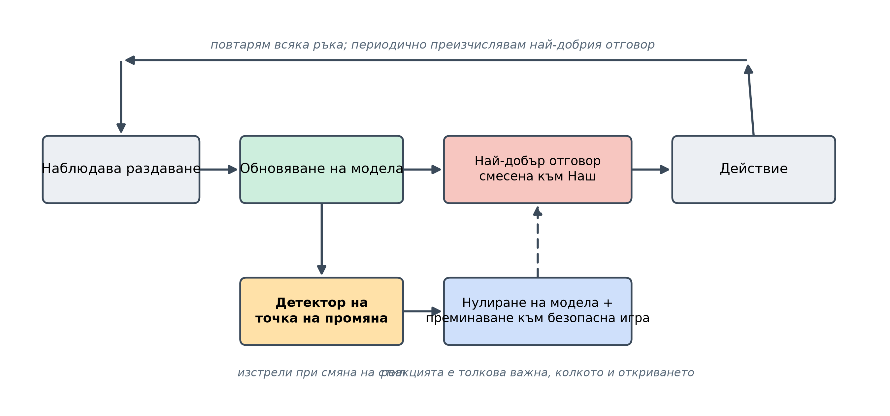

<!--
OFFICIAL PhD TITLE (keep consistent across all documents):
EN: Research on the possibilities for applying Artificial Intelligence in computer games
BG: Изследване на възможностите за приложение на изкуствения интелект в компютърни игри
-->

---
title: "Глава 7 Обобщение - Моделиране на противника в игри с непълна информация"
subtitle: "Изследване върху възможностите за прилагане на изкуствен интелект в компютърните игри"
author: "Alexander Andreev"
date: "July 2026"
lang: bg
vars:
  research_focus: "Adaptive Strategy Learning in Multi-Agent Imperfect-Information Environments"
---

# Глава 7 - Моделиране на противника в игри с непълна информация

Това е цялостна глава за моделиране на противника: формулировката на проблема, математическият му апарат, семейството от методи и набор от контролирани експерименти, проведени върху две малки покер игри. Главата е написана така, че да бъде разбираема и без предварителна познатост с програмния код на проекта. Всички представени експериментални резултати са получени от възпроизводими изпълнения на двете тестови среди (Кун покер и Ледюк холдем) и, когато е възможно, са ограничени чрез *точни* аналитични препратки вместо симулирани такива.

**Къде се вписва това в дисертацията.** Игровотеоретичен агент, изчислен в по-ранните стъпки, определя *равновесие на Наш* - стратегия, която не може да бъде победена в дългосрочен план. Настоящата глава изгражда противоположната способност: **сензор**, който наблюдава как *конкретен* противник действително играе и превръща тези наблюдения в оценка на неговата стратегия, така че агентът да може да се отклони от равновесието с цел да накаже грешките на този противник. Този сензор представлява първата половина от рамката за поведенческа адаптация на дисертацията (Принос №1). Втората половина - как да се експлоатира *безопасно*, без да се създаде уязвимост в собствената игра - е формализирана в Глава 8.

---

## Защо е необходимо моделиране на противника

**Равновесна стратегия на Наш** е изградена така, че в дългосрочен план никога да не води до загуба, *независимо срещу кого се играе*. В **игра за двама с нулева сума** тази гаранция е реална и ценна: една равновесна стратегия има фиксирана *стойност* и нито един противник - колкото и да е умен - не може да я свали под нея. Но същото свойство представлява и **ограничение**. Една равновесна стратегия играе **идентично** както срещу световен шампион, така и срещу някой, който се отказва всеки път при направен залог. Тя никога не се адаптира, тъй като именно липсата на адаптация е основната ѝ характеристика.

Този отказ да се адаптира има цена и тази цена е измерима. **Моделирането на противника** е актът на наблюдение на действията на конкретен противник, формиране на убеждение относно неговата стратегия и **отклонение от равновесие на Наш с цел експлоатиране на модела** - блъфиране повече срещу някой, който се отказва твърде често, залагане за стойност по-тънко срещу някой, който плаща твърде често.

Най-ясният начин да се види стойността е чрез картина „камък-ножица-хартия“. Вашият противник тайно хвърля камък 70% от времето. Безопасната стратегия е да **рандомизирам** равномерно и да **изравнявам** резултата завинаги. Но ако *забележите* пристрастието, хвърляте повече хартия и започвате да печелите. Две неща правят тази глава цяла в миниатюра: трябва да **изведа** пристрастието от шумен поток от хвърляния (няколко не са достатъчни) и ако се **ангажирам прекалено** с хартия, ставате предвидими и те ви смазват с ножица. Извеждането на пристрастието е моделиране на противника; знанието докъде да се наклоните е компромисът между експлоатация и безопасност, който преминава през всичко по-долу.


### Колко е заложено - измерено в Кун покер

Кун покер е най-малката нетривиална покер игра: тесте от три карти (Вале, Дама, Поп), по една карта на всеки, един рунд за залози. Тя е достатъчно малка, за да бъде решена *точно*, което ни позволява да изчислим стойността на моделирането, вместо да я предполагаме. За всеки от няколко постоянни противникови стила ние изчислихме три точни величини:

- **Нашева очаквана стойност** - това, което равновесната стратегия носи срещу този противник (на ръка);
- **Стойност на най-добрия отговор** - това, което стратегия, която *познава противника перфектно*, носи: точният таван за експлоатация;
- **разликата** между тях - сумата, която равновесната игра оставя неизползвана.

| Противник (Кун) | Нашева очаквана стойност | Стойност на най-добрия отговор | Пропуснато от експлоатация |
|---|--:|--:|--:|
| Пасивен играч (никога не се отказва) | +0.119 | +0.333 | **0.215** |
| Камък (ангажира се само с Поп) | -0.060 | +0.167 | **0.227** |
| Маниак (винаги залага/плаща) | +0.121 | +0.333 | **0.213** |
| Равновесие на Наш (равновесна игра) | -0.055 | -0.052 | 0.004 |

Срещу трите експлоатируеми стила разликата е огромна - **от 0.11 до 0.28 на ръка**, в игра, чиято цялостна равновесна стойност е около една двадесета от фиш. Срещу наш противник разликата е по същество **нула**, точно както изисква теорията: не можете да експлоатирате равновесие, защото най-добрият отговор не може да надмине стойността на играта. (Малките отрицателни Нашеви стойности са известният недостатък на първия играч в Кун покер от $-1/18 \approx -0.056$ - това е характеристика на самата игра, а не грешка.)

Два урока вече се открояват. Първо, **моделирането си струва**: стойността е значителна и реална. Второ, **експлоатацията е еднопосочна** - точният най-добър отговор на „камък“ *блъфира повече* (той залага най-слабата ръка в отворен пот, защото „камъкът“ се отказва от всичко освен Поп). Останалата част от тази глава е посветена на това как да реализираме тази стойност, без да я губим.[^southey2005]

---

## Байсовото ядро - убеждение, доказателство и реакция

Под всеки метод в тази глава стои един цикъл, който е добре да бъде обяснен с прости думи преди въвеждането на каквито и да било означения. Представете си, че сте детектив. Започвате с предположение за начина, по който играе противникът (**предварително убеждение**). Всяко негово **действие** е следа: то прави някои обяснения по-вероятни, а други - по-малко вероятни. Вие включвате тази следа в подозренията си (**апостериорно разпределение**) и повтаряте процеса. **Моделиране на противника** *представлява* именно този цикъл:

$$\text{belief about their strategy} \;\to\; \text{see an action} \;\to\; \text{update belief} \;\to\; \text{best-respond} \;\to\; \text{repeat.}$$

Формално, обновяването се извършва по правилото на Бейс. Ако $\sigma$ обозначава кандидат-стратегия на противника и $a$ е действието, което току-що беше наблюдавано,

$$P(\sigma \mid a) \;\propto\; P(\sigma)\;\cdot\;P(a \mid \sigma),$$

с думи: **апостериорното $\propto$ предварителното убеждение $\times$ колко добре дадена стратегия обяснява току-що извършеното действие**. Действие, което кандидатът смята за невъзможно, намалява вероятността му към нула; действие, което предвижда добре, я увеличава. След множество раздавания убеждението се съсредоточава върху най-подходящото обяснение.



### Зоологическа градина от типове

Най-простият начин да направим това конкретно е да разсъждаваме върху малък набор от предварително дефинирани противникови **типове**, вместо върху цялото безкрайно множество стратегии. В рамките на главата използваме повтарящ се набор от типове, всеки от които изпълнява двойна роля - като противник, срещу когото да играем, и като хипотеза, която детекторът обмисля:

| Тип | Поведение |
|---|---|
| **Пасивен играч** | Никога не залага, никога не се отказва - проверява, когато има възможност, и плаща всеки залог. |
| **Камък** (стегнат-пасивен) | Вкарва жетони само с най-добрата ръка; се отказва от всичко останало. Най-експлоатируемият тип. |
| **Маниак** (разпуснат-агресивен) | Винаги залага или плаща, независимо от ръката си. |
| **Наш равновесие** | Балансирана равновесна игра; използва смесени стратегии; неексплоатируем. |

### Актуализацията, изчислена на ръка

Механиката е най-лесна за разбиране, когато сами завъртите механизма веднъж. Да предположим, че трима кандидати залагат определена ръка с вероятност $0.8$, $0.5$ и $0.1$ съответно, като започвате от равномерно априорно разпределение $(\tfrac13,\tfrac13,\tfrac13)$. Наблюдавате **залог**:

$$
\text{posterior} \propto \left(\tfrac13\cdot 0.8,\; \tfrac13\cdot 0.5,\; \tfrac13\cdot 0.1\right)
= (0.267, 0.167, 0.033) \xrightarrow{\text{normalize}} (0.571, 0.357, 0.071).
$$

Наблюдаваме **втори** залог и отново умножаваме по $(0.8, 0.5, 0.1)$:

$$(0.711, 0.278, 0.011).$$

Убеждението се натрупва върху типа играчи, които правят чести **залози**, и би го направило *още по-бързо*, колкото повече кандидатите се разминават в мненията си. Тази интуиция „колко много се разминават“ се появява отново в раздел 6 като обяснение защо някои опоненти се идентифицират след четири **раздавания**, а други - след двеста.

### Защо дирихле и защо ви е нужна само средната стойност

Два факта от литературата оформят всеки практически модел. Първо, когато оценявате разпределение на действия чрез броене, естественото предварително убеждение е **дирихле** разпределението, защото то е *спрегнатото* предварително убеждение на **мултиномиалната**: актуализирането на дирихле с наблюдавани броеве води до друго дирихле разпределение, при което броевете просто се **добавят** към **псевдоброевете** на предварителното убеждение. Няма нужда от интеграл или **симулация** - средната стойност апостериори на действие $i$ е

$$\mathbb{E}[p_i] \;=\; \frac{\alpha_i + n_i}{\sum_j (\alpha_j + n_j)},$$

където $\alpha_i$ представляват предварителни псевдоброеве (които едновременно изпълняват ролята на *изглаждане*, като предотвратяват стойността нула за което и да е действие), а $n_i$ са наблюдаваните броеве. Тази **затворена форма** съответства на „**непрекъснатия**“ модел, разгледан в Раздел 4.

Второ - и това е единственият най-често използван резултат в областта - за да изберете **оптимален отговор**, никога не е необходимо цялото **апостериорно разпределение** върху стратегиите; достатъчна е само неговата **средна стойност**. Вашата **очаквана печалба** срещу *разпределение* на стратегиите на опонента е равна на вашата **печалба** срещу единствената осреднена стратегия. Това свежда **неразрешим** интеграл върху **пространството на стратегиите** до „**оптимално отговарям** на един осреднен опонент“ и именно това прави **байесовата експлоатация** практична. (Раздел 5 се връща към това: отговарянето на средната стойност е **оптимален по отношение на изплащането**, но, както се оказва, може да не *сходява* към **истинската стратегия** на опонента - тънкостта, която работата от 2025 г. разрешава.)[^ganzfried2016]

---

## Виждане през ключалка - проблемът с частичната наблюдаемост

Има причина моделирането на противника в покера да е по-трудно от броенето на честоти в „камък-ножица-хартия“ и това заслужава отделен раздел, тъй като определя характеристиките на всеки следващ модел.

В покера наблюдавате **действия** - залог, кол, пас - но **не** и частната ръка, която ги е породила. Един и същ „залог“ може да произтича както от силна ръка, така и от блъф. Единственото изключение е **разкриването**, когато картите се показват в края на ръката, ако тя не е приключила с пас. По този начин всяка ръка попада в една от двете доказателствени категории:

- **Разкриване - причина и следствие.** Виждате както действията на противника, *така и* частната ръка зад тях. Можете да свържете поведението с точната ситуация, която го е породила. Това представлява златния стандарт за наблюдение.
- **Пас - само следствие.** Ръката завършва без разкриване на картите. Видяхте *какво* са направили, но не и *какво са държали*, така че не можете да сте сигурни коя ситуация е причината за това.



Следствието е истински теоретичен лимит, а не неудобство при имплементацията: **без никога да наблюдавате частната информация на противника, не можете да научите повече от своето предварително убеждение**. Ако единственото, което виждате, са пасове, повече **раздавания** не помага - доказателството е фундаментално двусмислено. Разкриването е именно информацията, която премахва тази двусмисленост.

Как се справя моделът с пас? Като разсъждава върху **всички възможни раздавания, които противникът би могъл да държи**. Конкретно, той изброява раздаванията, съгласувани с това, което действително е било видяно, преиграва решенията на противника при всяка хипотетична тайна карта и разпределя доказателствата между тях - като претегля всяка хипотеза според нейната правдоподобност. Разкриването свежда този набор до една-единствена възможност; пасът го оставя разпределен. Този ход „маргинализиране върху скритата карта“ е техническото ядро на всеки модел в следващите два раздела и - неслучайно - формалният обект, около който е изградена теорията на съгласуваността от раздел 5.

---

## Три модела с единен интерфейс

Няма един-единствен **модел на противника**. Има семейство, което прави компромис между скорост на сходимост, устойчивост към изненади, интерпретируемост и изчислителна мощност. Този проект имплементира и сравнява три точки от този спектър, умишлено изградени зад **общ интерфейс** - всеки приема поток от наблюдавани раздавания и генерира прогнозирана стратегия на противника - така че *същият* последващ най-добър отговор може да бъде приложен към всичките три и сравнението да е „ябълки с ябълки“.



- **Базиран на типове.** Поддържа убеждение (разпределение на вероятностите) върху фиксирано меню от типове противници, актуализира го чрез правилото на Бейс (Раздел 2) и докладва апостериорно претеглената средна стратегия. Той се сближава *изключително* бързо **когато противникът е в менюто** и изходът му е интерпретируем („80% камък, 20% маниак“). Неговата слабост също е ясна: ако реалният противник не прилича на нито един от типовете, моделът няма честен начин да го каже (Раздел 6).
- **Непрекъснат.** Премахва менюто. Оценява вероятностите за действията на противника *директно във всяка ситуация* чрез броене на това, което те са направили там, изгладено с дирихле предварително разпределение (Раздел 2). Той може да представи **всяка** стратегия, включително смеси и нови стилове, така че е устойчивият избор срещу непознати противници. Цената е данни: той научава всяка ситуация независимо, без споделяне на структура, така че се нуждае от много повече наблюдения - и, както показва Раздел 7, този глад има зъби в по-голямата игра.
- **Съгласуван.** Оценява една единствена *глобално съгласувана* стратегия - такава, която е гарантирано да бъде валидна стратегия върху цялото дърво на играта - вместо всяка ситуация поотделно. Това е най-принципиалният модел и най-новият; той е достатъчно важен и централен за тезата, за да получи собствен раздел (Раздел 5).

Следващата таблица служи като **пътна карта** за по-нататъшната работа:

| Модел | Представлява | Сближаване | Устойчив на непознати противници? | Интерпретируемост | Изчислителна мощност |
|---|---|---|---|---|---|
| Базиран на типове | няколко известни типа | най-бързо | не | висока (именувани типове) | евтина |
| Непрекъснат | всяка стратегия за конкретна ситуация | по-бавно (жаден за данни) | да | средна (за конкретна ситуация) | евтина |
| Съгласуван | една валидна глобална стратегия | доказуемо към истината | да | средна | скъпа (оптимизация) |

Очевидният въпрос - *кой от тях трябва да използва дисертацията?* - няма единствен отговор и това само по себе си е откритие. Естествената **цел** е **хибриден подход**: да се разчита на структурни априорни знания (типове), когато данните са оскъдни, и да се сходява към съгласуваната оценка при натрупването на доказателства. Тази глава изгражда и измерва крайните точки, така че хибридният модел да има стабилна основа, върху която да стъпи.[^bard2013]

---

## Проблемът на съгласуваността и решението във **последователна форма**

Този раздел представлява теоретичната граница на разглежданата стъпка и е частта, която дисертацията най-пряко доразвива. Той поставя въпрос, който по-ранните модели подценяват: *ако даден модел добре описва наблюдаваното поведение, означава ли това непременно, че сме възстановили истинската стратегия на опонента?* Изненадващият отговор е **не - дори при наличие на безкрайни данни** - и съществува принципно решение.

### Недостатъкът: напасването към **средна стойност** не е равносилно на откриване на истината

Класическата байесова рецепта отговаря на **средната стойност** на апостериорното разпределение на стратегията (Раздел 2). Един метод за моделиране на противника ще наречем **съгласуван**, ако неговата оценка се сближава със същинската стратегия на опонента $\sigma^*$ при натрупване на наблюдения срещу постоянен противник. Бихме очаквали класическата рецепта да бъде съгласувана, но тя не е.

Най-ясният контрапример е камък-ножица-хартия. Да предположим, че моделиращият разсъждава върху множество от *извадени* кандидатски стратегии и винаги реагира на някаква тяхна средна стойност. Ако истинската стратегия $\sigma^* = (0.8, 0.1, 0.1)$ лежи **извън** областта, до която тези извадки могат да се комбинират, моделът - тъй като винаги е претеглена средна стойност на извадките - просто **не може да я достигне**, независимо колко много данни постъпват. Това е интуитивно. По-дълбокият резултат е, че методът може да се провали **дори когато истината лежи вътре** в достижимата област: ако истинската стратегия се намира в центъра на три извадки, чиято средна стойност съвпада с нея, задното тегло върху единствената най-добре пасваща извадка нараства неограничено спрямо останалите, така че асимптотично убеждението **колабира върху една извадка**, вместо да се установи на истинската смес. Колкото по-плътно моделът напасва данните, толкова повече се сближава с *грешната* стратегия.



Това е важно, защото обезсилва интуитивната представа за „сигурност чрез натрупване на повече данни“. Съгласуваността не е автоматична; тя трябва да бъде изградена.

### Решението: изпъкнала програмираща задача в последователна форма

Лекарството преформулира оценката така, че „валидна стратегия“ и „съответства на наблюденията“ да се превърнат в ограничения на една единствена, добре дефинирана оптимизация. Ключовата промяна на променливите е **последователната форма**: вместо вероятности за действие във всяка ситуация, стратегията на опонента се представя чрез **реализационни тегла** $y_r$ върху последователности от действия. Законните стратегии тогава са именно тези, които удовлетворяват набор от **линейни** ограничения $Fy = f,\; y \ge 0$ - полиномиални по размер на дървото на играта, вместо експоненциални.

Частичната наблюдаемост (Раздел 3) се въвежда чрез **функция на наблюдаемост**: за всяка наблюдавана ръка множеството от траектории, съгласувани с това, което действително е било видяно (пас скрива картата на опонента и допуска множество траектории; разкриването я показва и допуска само една). Вероятността на едно наблюдение представлява сума от реализации на тегла върху това съгласувано множество. Поставянето на **дирихле предварително разпределение** върху теглата и максимизирането на **логаритъма на задната вероятност** води до програмата

$$
\max_{y}\; \sum_r (\alpha_r - 1)\log y_r \;+\; \sum_t \log\!\Big(\!\!\sum_{r \in o(\ell_t)} q_r\, y_r\Big)
\qquad \text{s.t.}\quad Fy = f,\; y \ge 0,
$$

където $o(\ell_t)$ е множеството от съгласувани траектории за наблюдение $t$ и $q_r$ са (нормализирани) вероятности на случайността. Решаващото свойство е, че когато $\alpha_r \ge 1$ тази целева функция е **вдлъбната** - първият член е вдлъбнат, вторият е логаритъм на афинна функция, а ограниченията са афинни - така че това е **изпъкнал** проблем без **локални оптимуми**. Всеки решавач, който намери локален оптимум, е намерил глобалния. Достатъчен е стандартен **проектиран градиентен метод**: извършва се стъпка на градиента, след което резултатът се проектира обратно върху множеството от ограничения. В псевдокод цикълът е елементарен, което е и целта -

```text
initialize y feasible (F y = f, y >= 0)
repeat until converged:
    g  <- gradient of the (negative) log-posterior at y
    z  <- y - eta * g                      # gradient step
    y  <- project z onto { y : F y = f, y >= 0 }   # convex projection
```

Този метод връща **модата** на апостериорното разпределение (неговата единствена най-вероятна точка), а не средната стойност. Това е ключовият компромис: модата е *съгласувана* - при леки условия (истината има положителна предварителна плътност, различни стратегии водят до различими наблюдения и всяка ситуация на противника се посещава безкрайно често) оценката доказано се сближава към $\sigma^*$ - докато оптималната по отношение на изплащането средна стойност обикновено е неразрешима за точно изчисляване. Следователно основната ос на дизайна, върху която стъпва целият процес, е **средна стойност срещу мода**: оптимална по отношение на изплащането, но неразрешима, спрямо разрешима и съгласувана.

### Какво установихме, откровено казано

Ние внедрихме този съгласуван оценител и проверихме неговата работа при възстановяване на стратегия в играта Кун, където той се представя според очакванията: възстановената стратегия е много близка до истинската (разстоянието по вариация е приблизително **0.004 до 0.021**), като съвпада или превъзхожда резултатите от възстановяването на непрекъснатия модел в същата игра. Това потвърждава както правилната работа на механизма, така и валидността на теорията върху малката тестова среда.

Ние **не** го стартирахме в рамките на онлайн цикъла на експлоатация, нито върху по-голямата игра. Причината е същата, която и самата литература посочва: оценката представлява решението на оптимизация, която се **пререшава с натрупването на наблюдения**, като цената ѝ нараства с историята - от части от секундата в началото до много секунди за преобучаване след изиграването на десетки хиляди раздавания. За мач в реално време, раздаване по раздаване, това е непрактично в наивната му форма. Вместо да го разглеждаме като пропуск, ние приемаме това за *емпиричен отговор* на въпрос, който стъпката поставя изрично - *достатъчно ли бързо е конвексното решаване при всяка актуализация за игра в реално време?* - а именно **не, без инкрементални методи** (топло стартиране на всяко решаване от последното и кеширане на термините за всяко раздаване), което е точно видът приближение, с който се занимава Глава 8. Разбирането и резултатът от възстановяването са това, от което тезата се нуждае от този модел сега; онлайн инженерството остава за бъдеща работа.[^ganzfried2025]

---

## Когато моделът е уверен, но греши

Раздел 5 беше за фин провал при безкрайни данни. Този раздел разглежда груб провал при крайни данни и именно той най-пряко мотивира *безопасната* експлоатация. Това е различен провал от несъответствието: тук проблемът е **неправилно зададено меню** - противник, който типово базираният модел просто не може да представи - и как се държи моделът, когато бъде притиснат в ъгъла.

Изградихме скрит противник, който представлява 50/50 смес от действията на „камък“ и „маниак“ - съзнателно **нито един** от четирите кандидата. Очаквано е апостериорното разпределение да разпредели убеждението си между двата най-близки типа. Това обаче не се случва. Апостериорното разпределение, изчислено като произведение на вероятностите, се концентрира върху *единственото най-добро обяснение*, поради което убеждението прескача от един тип към друг и в крайна сметка твърдо се ангажира с **Нашево равновесие** - единственият кандидат, който приписва реална вероятност както на залагане, така и на проверка със средна ръка и по този начин никога не е категорично опроверган. В резултат моделът става **уверен** (апостериорното разпределение е близо до 1.0 върху един тип) и същевременно **грешен** (този тип не отговаря на действителния противник).

Това разкрива един капан, който си струва да бъде изказан ясно: апостериорното разпределение е **относителна** величина. „Деветдесет и пет процента хипотеза на Наш“ означава „най-добро приближение *сред тези четири кандидата*“, а не „добро приближение в абсолютен смисъл“. Измерването на *абсолютното* приближение на победителя издава играта - същата хипотеза на Наш, която се представя добре срещу истинско равновесие на Наш противник, се представя значително по-зле срещу тази смес, като същевременно отчита еднаква увереност на хартия. Малкото стереотипно меню няма честен начин да каже „нито едно от горните“.

### Колко дълго може да остане грешен? Обхождане за устойчивост

Тъй като уверено-грешните убеждения са опасни, подложихме феномена на стрес-тест върху **300 случайни семена от по 500 раздавания**, като разграничихме две неща, които една **наивна метрика** обединява: *бавна **сходимост*** и *отпадане след **сходимостта***.

| Измерване (300 семена x 500 раздавания) | Резултат |
|---|---|
| Правилен дългосрочен победител до раздаване 500 | **300 / 300 (100%)** |
| Някога отстъпва, след като трайно поеме лидерството | **0 / 300 (никога)** |
| Грешен тип все още води след раздаване 100 | 40 / 300 (~13%) |
| Грешен тип все още води след раздаване 200 | 14 / 300 (~5%) |
| Раздаване, на което истината окончателно се установява | медиана **23** - 90-ти персентил **125** - най-лош случай **461** |

Добрата новина е, че убеждението в крайна сметка винаги се установява върху най-близката представима стратегия и след като се заключи, никога не отстъпва. Тревожната новина са средните редове: в значителен малък брой случаи моделът поддържаше **уверено грешно убеждение за повече от сто раздавания** - достатъчно дълго, за да може един най-добре реагиращ агент, който експлоатира твърдо това убеждение, да се е настройвал да победи илюзия. Това е емпиричното проявление на напрежението между експлоатацията и безопасността: на модела може да се вярва *в крайна сметка*, но „в крайна сметка“ понякога е след 200 раздавания, а действието въз основа на междинното убеждение, сякаш то е сигурно, е начинът, по който самият агент се наранява.

Честният поправка не е по-голямо меню - тя е да спрем да питаме „кой единствен тип?“ и да се опрем на модели, които могат да представят смеси (непрекъснатите и съгласуваните модели от Раздели 4–5), и да **мащабираме степента на експлоатация според това колко добре е заслужено прочитането**. Този принцип е нишката, която преминава през следващите два раздела и към Глава 8.

---

## От модела до печалбата - най-добрият отговор, таванът и самонанесеното изтичане

Моделът е полезен единствено ако действията, основани на него, носят печалба. За да измерим това по ясен начин, подаваме оценката на всеки модел в **същия** точен най-добър отговор и играем пълни мачове и в двете игри, като поставяме всеки резултат между два аналитични критерия, изчислени чрез ръчно проверена математика, а не чрез симулация:

- **Нашева очаквана стойност** - това, което безопасната равновесна игра носи срещу този опонент (не можете да се представите по-зле от тази стойност, ако прочитът е безполезен);
- **таван** - точната стойност на най-добрия отговор, максималното, което може да бъде извлечено при пълно познаване на опонента.

Добрият експлоататор се намира между двете и се стреми към тавана. Първо, проверка за коректност, че апаратът е надежден: решавачът възпроизвежда точната равновесна стойност на Кун $-1/18$ (остатъчна експлоатируемост $\approx 0.002$, по същество неексплоатируем), а точен най-добър отговор превъзхожда равномерната игра с предвидените разлики (+0.500 при Кун, +2.087 при Ледюк).

**Кун - и двата модела достигат тавана.**

| Опонент | таван | базиран на типове | непрекъснат |
|---|--:|--:|--:|
| Камък | 0.167 | 0.168 | 0.168 |
| Маниак | 0.333 | 0.337 | 0.330 |
| **Нашево равновесие** | -0.055 | -0.055 | -0.053 |

(Чист опонент „винаги пас на залог“ е още по-експлоатируем - таван от 0.975, достигнат до 0.966 - но той не е сред повтарящите се типове, дефинирани по-горе, и поради това е пропуснат тук с цел съгласуваност.)

**Ледюк - започва да се проявява значението на класа на модела.** Ледюк Холдем добавя втори рунд за залози и една споделена обща карта, което води до приблизително два порядъка повече ситуации в сравнение с Кун - все още точно решима, но вече достатъчно голяма, за да различи моделите.

| Опонент | таван | базиран на типове | непрекъснат |
|---|--:|--:|--:|
| Ниво-1 | 3.056 | 3.061 | 2.672 |
| Маниак | 2.177 | 2.199 | 2.038 |
| Пасивен играч | 1.464 | 1.451 | 1.434 |
| Камък | 0.937 | 0.912 | 0.848 |
| **Нашево равновесие** | -0.083 | -0.085 | **-0.175** |


Два резултата подчертават извода, като вторият е от съществено значение:

1. **Не можете да експлоатирате равновесие.** Срещу нашов противник всеки модел реализира приблизително (отрицателната) стойност на играта и не повече. Таванът *по същество представлява* стойността на играта. Това потвърждава, че наблюдаваната експлоатация другаде е реална, а не артефакт на средата за тестване.  
2. **Уверен, но недообучен модел ви прави уязвими.** В Ледюк непрекъснатият модел *губи* от Нашево равновесие - $-0.175$ при таван от $-0.083$. С несъвършени данни за множеството ситуации в Ледюк той реагира най-добре на *грешна* оценка на противник, който изобщо не подлежи на експлоатация, и по този начин създава **изтичане** в собствената си игра. Подбирането на ограничена извадка, което само му коства малко срещу експлоатируеми опоненти, се превръща в активно вредно срещу неексплоатируем такъв.

Това е напрежението между експлоатацията и безопасността, изразено в едно число. Когато класът на модел съвпада, най-добрият отговор извлича пълната теоретична стойност; когато не съвпада, агентът както оставя пари на масата *и* - по-опасно - връща част от тях обратно. Тази втора цена е именно това, което предпазният механизъм от Глава 8 (ограничаване на отклонението от Нашево равновесие чрез собствената увереност на модела) съществува, за да предотврати.

Разликите тук не се дължат на начална случайност. При пет различни начални числа стандартната грешка на печалбата на ръка е незначителна в сравнение с наблюдаваните ефекти: типово базираният модел е статистически неразличим от тавана за всеки тип и в двете игри, а недостигът на непрекъснатия модел в Ледюк и неговото изтичане при Нашево равновесие са многократно по-големи от стандартната грешка.[^ganzfried2015]

---

## Адаптиране към промяна - нестационарни опоненти

Досега всичко се основаваше на постоянен противник. Реалните опоненти обаче се променят и адаптират, а модел, който е учил търпеливо десет хиляди раздавания, става безполезен в момента, в който неговият обект промени стила си - той вече *уверено* описва играч, който вече не съществува. Това е откритата граница, към която дисертацията е насочена да атакува, и стъпката включва първата контролирана сонда.

Пълният адаптивен агент изпълнява цикъла от Раздел 2 от край до край: **наблюдава** раздавания, **актуализира** модела, периодично преизгражда стратегията на героя като най-добър отговор на текущата оценка (по избор смесена към Наш равновесие за безопасност) и **действа**. За да се справи с промяната, той добавя детектор: лек статистически монитор върху агресията на опонента, който следи за промяна в режима и при задействане **нулира** модела и преминава към безопасна игра, докато отново се учи.



Сменихме стила на опонента в средата на мач от 20,000 раздавания и сравнихме **статичен** модел (който никога не забравя) с такъв, който прилага **забравяне на точка на промяна**. Резултатът е **сценарийно-зависим**, и именно това представлява откритието:

| Игра | Смяна на стила (в средата) | статичен (след смяната) | точка на промяна (след смяната) |
|---|---|--:|--:|
| Кун | камък → маниак | **-0.116** | **+0.226** |
| Ледюк | камък → маниак | **+1.940** | **+0.525** |

- **В Кун забравянето печели.** Стратегията, научена срещу „камък“, е блъф-ориентирана; пусната срещу маниак, който вдига всичко, тя *активно губи* (статичният модел отива на отрицателна печалба). Откриването на смяната и преобучаването възстановява до здравословна печалба.
- **В Ледюк забравянето губи.** Маниакът там изпуска по над два жетона на ръка, така че непрекъснато адаптиращ се модел го експлоатира щедро без никакво нулиране - докато детекторът, твърде нетърпелив, задейства десетки **фалшиви аларми** по време на стабилните периоди (около шестдесет нулирания срещу една истинска промяна), всяко от които изхвърля трудно спечелени данни и преминава към безопасна игра.

Урокът не е „откриването на промени е добро“ или „лошо“ - той е, че **реакцията при открита промяна има толкова голямо значение, колкото и самото откриване**. Детектор, който задейства твърде често, съчетан с пълно връщане в безопасен режим, може да струва повече от остарялост, когато новият опонент е достатъчно експлоатируем, така че остарялостта е евтина. По-евтини и по-меки реакции - частично забравяне вместо твърдо нулиране, по-малко чувствителен детектор - са ясна следваща стъпка и те се свързват директно с експлоатацията с мащабирана увереност от Глава 8. (Този експеримент беше проведен при едно начално число, така че възприемайте *посоката* като стабилна, а точните величини - като илюстративни.)

---

## Връзки и бъдещи насоки

**Какво установява тази глава.** Добрият модел на противника е *необходим, но не и достатъчен* за печеливша и безопасна адаптация. Когато класът на модела съответства на противника, най-добрият отговор достига точния извличащ таван - реализира се пълната теоретична стойност на моделирането. Но при частична наблюдаемост и ограничени данни, недообученият модел както оставя пари на масата, така и срещу противник, който не може да бъде експлоатиран, реагира най-добре на химера и *губи*. Нестационарността добавя втори аспект: забравянето на остарял модел е полезно само когато остарялостта е активно вредна, а фалшивите аларми на небрежен детектор могат да струват повече, отколкото спестяват. Един принцип се повтаря през всичко това: **експлоатацията трябва да бъде мащабирана според това колко добре е заслужено прочетеното.**

**Обратни връзки.** Тази глава е огледален образ на работата по равновесие, която я предшества. Докато една равновесна стратегия *игнорира* идентичността на противника по замисъл, моделът на противника е механизмът, който я *използва* - двата са крайните точки на спектъра безопасност–изследване. Механизмът за извадка, използван в предишните глави за обхождане на дърво на играта според *текущата* стратегия, се появява отново тук, за да разсъждава върху действията на противника според *изведения* модел. А идеята за групиране на много конкретни ситуации в няколко представителни категории - абстракция - е именно това, което типово базираният модел прави в пространство на стратегиите.

**Напред към Глава 8 и дисертацията.** Тази глава изгради **сензора**, а Глава 8 изгражда **изпълнителния механизъм** - механизма, който превръща модела в *безопасна* експлоатация, като ограничава доколко се отклонявам от равновесие според това колко е заслужено прочетеното. Самопричиненото изтичане на **непрекъснатия** модел срещу **Наш равновесие** (Раздел 7) е емпиричният случай за този механизъм; увереното, но грешно обхождане (Раздел 6) определя неговия бюджет; теорията на съгласуваността (Раздел 5) е принципният гръбнак, върху който рамката се разширява.[^shoham2008]

<!-- Бележки към източниците. Заглавията на чуждоезични източници не се
     превеждат (правило 7 от terminology_EN_BG.md). -->

[^southey2005]: Southey, F. et al. (2005). "Bayes' Bluff: Opponent Modelling in Poker." *UAI*.

[^ganzfried2016]: Ganzfried, S. & Sun, Q. (2016/2018). "Bayesian Opponent Exploitation in Imperfect-Information Games." *IEEE CIG*. (Theorem 2.1: respond to the posterior mean.)

[^bard2013]: Bard, N. (2013). "Online Implicit Agent Modelling." *AAMAS* - ос „явни срещу неявни“, която рамкира тази таксономия.

[^ganzfried2025]: Ganzfried, S. (2025). "Consistent Opponent Modeling in Imperfect-Information Games." *arXiv:2508.17671*.

[^ganzfried2015]: Ganzfried, S. & Sandholm, T. (2015). "Safe Opponent Exploitation." *ACM EC* - безопасната половина от скалата и основата за Глава 8.

[^shoham2008]: Shoham, Y. & Leyton-Brown, K. (2008). *Multiagent Systems*, Ch. 7 "Learning and Teaching" - рамката за учене в повтарящи се игри под всички горепосочени, включително напрежението, че вашите действия както *експлоатират*, така и *обучават* опонента.
