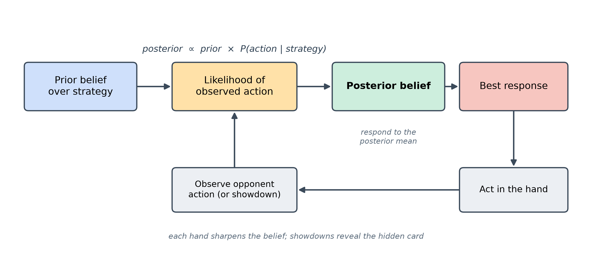
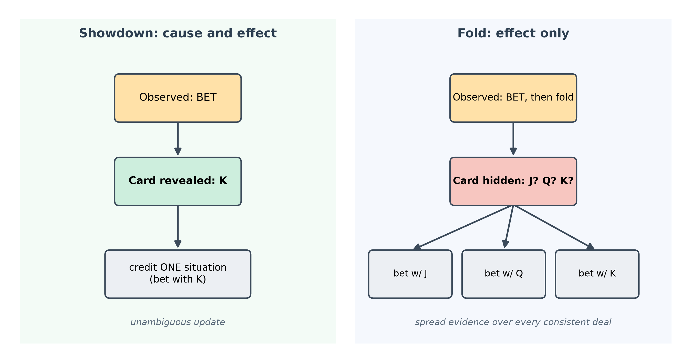
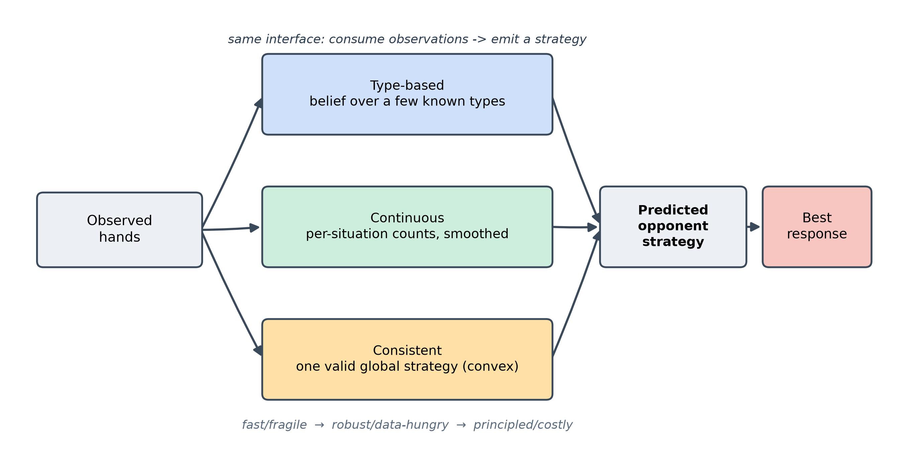
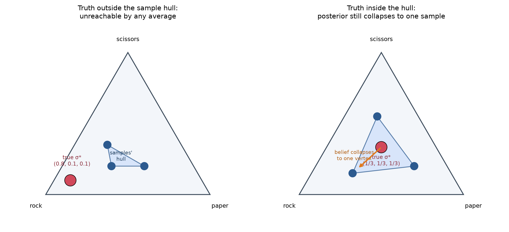
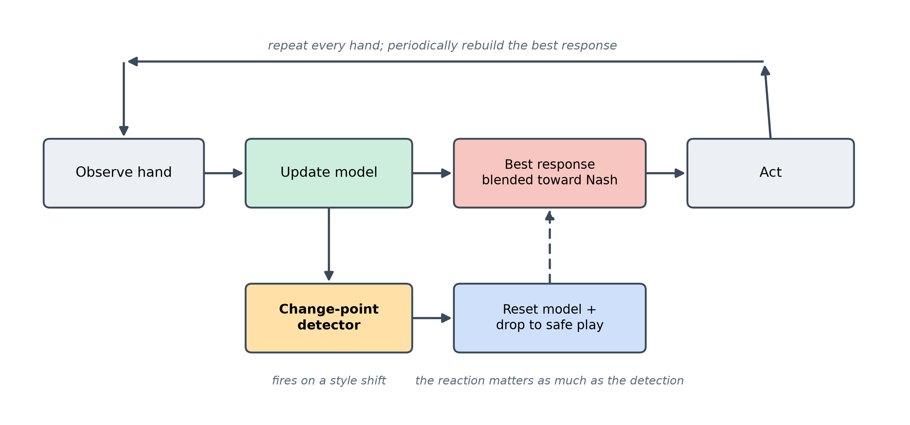

<!--
OFFICIAL PhD TITLE (keep consistent across all documents):
EN: Research on the possibilities for applying Artificial Intelligence in computer games
BG: Изследване на възможностите за приложение на изкуствения интелект в компютърни игри
-->
---
title: "Step 7 Summary — Opponent Modeling in Imperfect-Information Games"
subtitle: "Research on the possibilities for applying Artificial Intelligence in computer games"
author: "Alexander Andreev"
date: "July 2026"
lang: en
vars:
  research_focus: "Adaptive Strategy Learning in Multi-Agent Imperfect-Information Environments"
---

# Step 7 — Opponent Modeling in Imperfect-Information Games

This is a ground-up chapter on opponent modeling: the problem, the mathematics, the family of
methods, and a set of controlled experiments run on two small poker games. It serves two
purposes — a self-contained refresher while later steps build on it, and a primary source for
the Step 15 public synthesis. It is written to be read on its own; no prior familiarity with
the project's code is assumed. All experimental numbers reported here were measured on
reproducible runs of the two testbeds (Kuhn Poker and Leduc Hold'em) and are bounded, wherever
possible, by *exact* analytical references rather than simulated ones.

**Where this sits in the thesis.** A game-theoretic agent from the earlier steps computes a
*Nash equilibrium* — a strategy that cannot be beaten in the long run. This step builds the
opposite capability: a **sensor** that watches how a *specific* opponent actually plays and
turns those observations into an estimate of their strategy, so the agent can deviate from
equilibrium to punish that opponent's mistakes. That sensor is the first half of the thesis's
Behavioral Adaptation Framework (Contribution #1). The second half — how to exploit *safely*,
without opening a hole in your own play — is formalized in Step 8.

---

## 1. Why Opponent Modeling — the money Nash leaves on the table

A **Nash equilibrium** strategy is built never to lose in the long run, *no matter who it
plays*. In a two-player zero-sum game that guarantee is real and valuable: an equilibrium
strategy has a fixed *value*, and no opponent — however clever — can push you below it. But the
same property is also a limitation. An equilibrium strategy plays **identically** against a
world champion and against someone who folds every single time you bet. It never adapts,
because adaptation is exactly what it was designed not to need.

That refusal to adapt has a price, and the price is measurable. **Opponent modeling** is the
act of watching a specific opponent's actions, forming a belief about their strategy, and
**deviating from Nash to exploit the pattern** — bluffing more against someone who folds too
much, value-betting thinner against someone who calls too much.

The cleanest way to see the value is a *rock-paper-scissors* picture. Your opponent secretly
throws rock 70% of the time. The safe strategy is to randomize evenly and break even forever.
But if you *notice* the bias, you throw paper more and start winning. Two things make this the
whole step in miniature: you must **infer** the bias from a noisy stream of throws (a few
aren't enough), and if you **over-commit** to paper you become predictable and they crush you
with scissors. Inferring the bias is opponent modeling; knowing how far to lean is the
exploitation-versus-safety tradeoff that runs through everything below.


### How much is at stake — measured on Kuhn Poker

Kuhn Poker is the smallest non-trivial poker game: a three-card deck (Jack, Queen, King), one
card each, a single betting round. It is small enough to solve *exactly*, which lets us compute
the value of modeling rather than guess at it. For each of several fixed opponent styles we
computed three exact quantities:

- **Nash EV** — what an equilibrium strategy earns against that opponent (per hand);
- **Best-response EV** — what a strategy that *knows the opponent perfectly* earns: the exact
  ceiling on exploitation;
- **the gap** between them — the money equilibrium play leaves on the table.

| Opponent (Kuhn) | Nash EV | Best-response EV | Exploitation gap |
|---|--:|--:|--:|
| Calling station (never folds) | +0.119 | +0.333 | **0.215** |
| Rock (only commits with the King) | -0.060 | +0.167 | **0.227** |
| Maniac (always bets/calls) | +0.121 | +0.333 | **0.213** |
| Nash (equilibrium play) | -0.055 | -0.052 | 0.004 |

Against the three exploitable styles the gap is enormous — **0.11 to 0.28 per hand**, on a game
whose entire equilibrium value is about one twentieth of a chip. Against a Nash opponent the gap
is essentially **zero**, exactly as theory demands: you cannot exploit an equilibrium, because
best response cannot beat the game value. (The small negative Nash EVs are Kuhn's known
first-player disadvantage of $-1/18 \approx -0.056$ — that is the game, not an error.)

Two lessons are already visible. First, **modeling is worth doing**: the value is large and
real. Second, **exploitation is directional** — the exact best response to a rock *bluffs more*
(it bets the weakest hand into an open pot, because the rock folds everything but the King). The
rest of this chapter is about earning that value without giving it back.

> **Read more:** Southey, F. et al. (2005). "Bayes' Bluff: Opponent Modelling in Poker." *UAI*.

---

## 2. The Bayesian Core — belief, evidence, response

Underneath every method in this chapter is one loop, and it is worth stating in plain language
before any notation. You are a detective. You start with a hunch about how the opponent plays (a
**prior**). Each action they take is a clue: it makes some explanations more likely and others
less. You fold the clue into your suspicion (the **posterior**), and repeat. Opponent modeling
*is* this loop:

$$\text{belief about their strategy} \;\to\; \text{see an action} \;\to\; \text{update belief} \;\to\; \text{best-respond} \;\to\; \text{repeat.}$$

Formally, the update is Bayes' rule. If $\sigma$ denotes a candidate opponent strategy and $a$
the action just observed,

$$P(\sigma \mid a) \;\propto\; P(\sigma)\;\cdot\;P(a \mid \sigma),$$

in words: **posterior $\propto$ prior $\times$ how well that strategy explains what they just
did**. An action a candidate calls impossible drives its probability toward zero; an action it
predicts well boosts it. Over many hands the belief concentrates on the best-fitting
explanation.



### The type "zoo"

The simplest way to make this concrete is to reason over a small menu of predefined opponent
**types** rather than the whole infinite space of strategies. Throughout the chapter we use a
recurring cast, each of which serves double duty — as an opponent to play against, and as a
hypothesis the detector reasons over:

| Type | Behavior |
|---|---|
| **Calling station** | Never bets, never folds — checks when it can, calls any bet. |
| **Rock** (tight-passive) | Commits chips only with the best hand; folds everything else. The most exploitable type. |
| **Maniac** (loose-aggressive) | Always bets or calls, regardless of hand. |
| **Nash** | Balanced equilibrium play; mixes its actions; unexploitable. |

### The update, worked by hand

The mechanics are easiest to trust when you turn the crank once yourself. Suppose three
candidate types bet a particular hand with probability $0.8$, $0.5$, and $0.1$ respectively, and
you start from a uniform prior $(\tfrac13,\tfrac13,\tfrac13)$. You observe a **bet**:

$$
\text{posterior} \propto \left(\tfrac13\cdot 0.8,\; \tfrac13\cdot 0.5,\; \tfrac13\cdot 0.1\right)
= (0.267, 0.167, 0.033) \xrightarrow{\text{normalize}} (0.571, 0.357, 0.071).
$$

Observe a **second** bet and multiply by $(0.8, 0.5, 0.1)$ again:

$$(0.711, 0.278, 0.011).$$

The belief piles onto the bet-happy type, and it would do so *faster* the more the candidates
disagree. That "how much they disagree" intuition returns in Section 6 as the reason some
opponents are identified in four hands and others take two hundred.

### Why Dirichlet, and why you only ever need the mean

Two facts from the literature shape every practical model. First, when you estimate an action
distribution by counting, the natural prior is the **Dirichlet** distribution, because it is the
*conjugate* prior of the multinomial: updating a Dirichlet with observed counts yields another
Dirichlet, with the counts simply **added** to the prior's pseudo-counts. No integral, no
simulation — the posterior mean of action $i$ is

$$\mathbb{E}[p_i] \;=\; \frac{\alpha_i + n_i}{\sum_j (\alpha_j + n_j)},$$

where $\alpha_i$ are prior pseudo-counts (which double as *smoothing*, keeping no action at
exactly zero) and $n_i$ are observed counts. This closed form *is* the "continuous" model of
Section 4.

Second — and this is the single most reused result in the area — to choose an optimal response
you never need the whole posterior distribution over strategies; you only need its **mean**.
Your expected payoff against a *distribution* of opponent strategies equals your payoff against
the single averaged strategy. That collapses an intractable integral over strategy space into
"best-respond to one averaged opponent," and it is what makes Bayesian exploitation practical.
(Section 5 revisits this: responding to the mean is payoff-optimal but, as it turns out, can fail
to *converge* to the opponent's true strategy — the subtlety the 2025 work resolves.)

> **Read more:** Ganzfried, S. & Sun, Q. (2016/2018). "Bayesian Opponent Exploitation in Imperfect-Information Games." *IEEE CIG*. (Theorem 2.1: respond to the posterior mean.)

---

## 3. Seeing Through a Keyhole — the partial-observability problem

There is a reason opponent modeling in poker is harder than counting frequencies in
rock-paper-scissors, and it deserves its own section because it shapes every model that follows.

In poker you observe **actions** — bet, call, fold — but **not** the private hand that produced
them. The same "bet" can come from a monster or a bluff. The one exception is a **showdown**,
where cards are revealed at the end of a hand that goes to the end without a fold. So every hand
falls into one of two evidential categories:

- **Showdown — cause and effect.** You see both the opponent's actions *and* the private hand
  behind them. You can attribute the behavior to the exact situation that produced it. This is
  the gold-standard observation.
- **Fold — effect only.** The hand ends without revealing cards. You saw *what* they did but not
  *what they held*, so you cannot be sure which situation to credit.



The consequence is a genuine theoretical limit, not an implementation nuisance: **without ever
observing the opponent's private information, you cannot learn beyond your prior.** If folds are
all you ever see, more hands do not help — the evidence is fundamentally ambiguous. Showdowns
are precisely the information that breaks the ambiguity.

How does a model cope with a fold? By reasoning over **all the hands the opponent might have
held**. Concretely, it enumerates the deals consistent with what was actually seen, replays the
opponent's decisions under each hypothetical private card, and spreads the evidence across them —
weighting each hypothesis by how plausible it is. A showdown collapses that set to a single
possibility; a fold leaves it spread. This "marginalize over the hidden card" move is the
technical heart of every model in the next two sections, and — not coincidentally — the formal
object the consistency theory of Section 5 is built around.

---

## 4. Three Models, One Interface

There is no single "opponent model." There is a family, trading off convergence speed,
robustness to surprises, interpretability, and compute. This project implements and compares
three points on that spectrum, deliberately built behind **one shared interface** — each
consumes a stream of observed hands and emits a predicted opponent strategy — so that the *same*
downstream best response can be applied to all three and the comparison is apples-to-apples.



- **Type-based.** Maintain a belief (a probability distribution) over a fixed menu of opponent
  types, update it by Bayes' rule (Section 2), and report the posterior-weighted average
  strategy. It converges *extremely* fast **when the opponent is in the menu**, and its output
  is interpretable ("80% rock, 20% maniac"). Its weakness is equally clear: if the real opponent
  resembles none of the types, the model has no honest way to say so (Section 6).
- **Continuous.** Drop the menu. Estimate the opponent's action probabilities *directly at each
  situation* by counting what they did there, smoothed by a Dirichlet prior (Section 2). It can
  represent **any** strategy, including blends and novel styles, so it is the robust choice
  against unknown opponents. The cost is data: it learns each situation independently, with no
  structural sharing, so it needs many more observations — and, as Section 7 shows, that hunger
  has teeth on the larger game.
- **Consistent.** Estimate a single *globally consistent* strategy — one guaranteed to be a
  valid strategy over the whole game tree — rather than each situation in isolation. This is the
  most principled model and the most recent; it is important enough, and central enough to the
  thesis, to get its own section (Section 5).

The following table is the mental map to carry forward:

| Model | Represents | Converges | Robust to out-of-menu? | Interpretable | Compute |
|---|---|---|---|---|---|
| Type-based | a few known types | fastest | no | high (named types) | cheap |
| Continuous | any per-situation strategy | slower (data-hungry) | yes | medium (per-situation) | cheap |
| Consistent | one valid global strategy | provably to the truth | yes | medium | expensive (optimization) |

The obvious question — *which one should the thesis use?* — does not have a single answer, and
that is itself a finding. The natural target is a **hybrid**: lean on structural priors (types)
when data is sparse, and converge toward the consistent estimate as evidence accumulates. This
chapter builds and measures the endpoints so that the hybrid has firm ground to stand on.

> **Read more:** Bard, N. (2013). "Online Implicit Agent Modelling." *AAMAS* — the explicit-vs-implicit axis that frames this taxonomy.

---

## 5. The Consistency Problem and the Sequence-Form Fix

This section is the theoretical frontier of the step and the piece the thesis most directly
extends. It answers a question the earlier models quietly beg: *if a model fits the observed
behavior well, have we actually recovered the opponent's true strategy?* The surprising answer
is **not necessarily — even with infinite data** — and there is a principled fix.

### The flaw: fitting the mean is not the same as finding the truth

The classical Bayesian recipe responds to the posterior **mean** strategy (Section 2). Call an
opponent-modeling method **consistent** if its estimate converges to the opponent's true
strategy $\sigma^*$ as observations accumulate against a fixed opponent. One would hope the
classical recipe is consistent. It is not.

The cleanest counterexample is rock-paper-scissors. Suppose the modeler reasons over a set of
*sampled* candidate strategies and always responds to some average of them. If the true strategy
$\sigma^* = (0.8, 0.1, 0.1)$ lies **outside** the region those samples can combine to, the
model — being always a weighted average of the samples — simply **cannot reach it**, no matter
how much data arrives. That much is intuitive. The deeper result is that the method can fail
**even when the truth lies inside** the achievable region: with the true strategy sitting at the
center of three samples that average to it, the posterior weight on the single best-fitting
sample grows without bound relative to the others, so asymptotically the belief **collapses onto
one sample** rather than settling on the true mixture. Fitting the data ever more tightly, the
model converges to the *wrong* strategy.



This matters because it undercuts the intuitive safety net "just collect more data." Consistency
is not automatic; it has to be engineered.

### The fix: a convex program in sequence form

The remedy reformulates the estimate so that "a valid strategy" and "fits the observations" become
constraints in a single, well-behaved optimization. The key change of variables is the
**sequence form**: instead of per-situation action probabilities, represent the opponent's
strategy by **realization weights** $y_r$ over action *sequences*. The legal strategies are then
exactly those satisfying a set of **linear** constraints $Fy = f,\; y \ge 0$ — polynomial in the
size of the game tree, rather than exponential.

Partial observability (Section 3) enters through an **observability function**: for each observed
hand, the set of trajectories consistent with what you actually saw (a fold hides the opponent's
card and admits many trajectories; a showdown reveals it and admits one). The likelihood of an
observation is a sum of realization weights over that consistent set. Putting a Dirichlet prior
on the weights and maximizing the log-posterior gives the program

$$
\max_{y}\; \sum_r (\alpha_r - 1)\log y_r \;+\; \sum_t \log\!\Big(\!\!\sum_{r \in o(\ell_t)} q_r\, y_r\Big)
\qquad \text{s.t.}\quad Fy = f,\; y \ge 0,
$$

where $o(\ell_t)$ is the consistent-trajectory set for observation $t$ and $q_r$ are (normalized)
chance probabilities. The decisive property: when $\alpha_r \ge 1$ this objective is **concave**
— the first term is concave, the second is a log of an affine function, and the constraints are
affine — so it is a **convex** problem with **no local optima**. Any solver that finds a local
optimum has found the global one. A standard **projected gradient** scheme suffices: take a
gradient step, then project back onto the constraint set. In pseudocode the loop is unremarkable,
which is the point —

```text
initialize y feasible (F y = f, y >= 0)
repeat until converged:
    g  <- gradient of the (negative) log-posterior at y
    z  <- y - eta * g                      # gradient step
    y  <- project z onto { y : F y = f, y >= 0 }   # convex projection
```

This method returns the **mode** of the posterior (its single most probable point), not the
mean. That is the crucial trade: the mode is *consistent* — under mild conditions (the truth has
positive prior density, distinct strategies produce distinguishable observations, and every
opponent situation is visited infinitely often) the estimate provably converges to $\sigma^*$ —
whereas the payoff-optimal mean is generally intractable to compute exactly. So the design axis
underneath the whole step is **mean versus mode**: payoff-optimal-but-intractable versus
tractable-and-consistent.

### What we found, honestly

We implemented this consistent estimator and verified it on Kuhn strategy recovery, where it
performs as advertised: its recovered strategy sits very close to the truth (total-variation
distance roughly **0.004 to 0.021**), matching or beating the continuous model's recovery on the
same game. That confirms the machinery and the theory on the small testbed.

We did **not** run it inside the online exploitation loop, nor on the larger game. The reason is
the reason the literature itself flags: the estimate is the solution of an optimization that is
**re-solved as observations accumulate**, and that cost grows with history — from a fraction of a
second early on to many seconds per refit once tens of thousands of hands are in hand. For a
real-time, hand-by-hand match that is impractical in its naive form. Rather than a gap, we treat
this as the *empirical answer* to a question the step poses explicitly — *is a per-update convex
solve fast enough for real-time play?* — namely **not without incremental methods** (warm-starting
each solve from the last, caching the per-hand terms), which is exactly the kind of approximation
Step 8 takes up. The understanding and the recovery result are what the thesis needs from this
model now; the online engineering is future work.

> **Read more:** Ganzfried, S. (2025). "Consistent Opponent Modeling in Imperfect-Information Games." *arXiv:2508.17671*.

---

## 6. When a Model Is Confident and Wrong

Section 5 was about a subtle failure with infinite data. This section is about a blunt failure
with finite data, and it is the one that most directly motivates *safe* exploitation. It is a
different failure from inconsistency: here the problem is a **misspecified menu** — an opponent
the type-based model simply cannot represent — and how the model behaves when cornered.

We built a hidden opponent that is a 50/50 per-action blend of the rock and the maniac —
deliberately **none** of the four candidate types. A reasonable guess is that the posterior
would split its belief between the two nearest types. It does not. A product-of-likelihoods
posterior concentrates on the *single best explanation*, so the belief lurches from one type to
another and finally commits, hard, to **Nash** — the one candidate that assigns real probability
to *both* betting and checking a middling hand, and so is never fatally contradicted. The model
ends up **confident** (posterior near 1.0 on a single type) and **wrong** (that type is not what
it is playing).

This exposes a trap worth stating plainly: the posterior is a **relative** quantity. "Ninety-five
percent Nash" means "best fit *among these four candidates*," not "good fit in absolute terms."
Measuring the winner's *absolute* fit gives the game away — the same Nash hypothesis that scores
well against a genuine Nash opponent scores far worse against this blend, while reporting equal
confidence on paper. A small stereotype menu has no honest way to say "none of the above."

### How long can it stay wrong? A robustness sweep

Because confidently-wrong beliefs are dangerous, we stress-tested the phenomenon over **300
random seeds of 500 hands each**, separating two things a naive metric conflates: *slow
convergence* from *falling after convergence*.

| Measurement (300 seeds x 500 hands) | Result |
|---|---|
| Correct long-run winner by hand 500 | **300 / 300 (100%)** |
| Ever falls back after taking the lead for good | **0 / 300 (never)** |
| A wrong type still leading past hand 100 | 40 / 300 (~13%) |
| A wrong type still leading past hand 200 | 14 / 300 (~5%) |
| Hand at which the truth locks in for good | median **23** - 90th pct **125** - worst **461** |

The good news: the belief eventually lands on the closest representable strategy every time, and
once it locks in it never falls. The sobering news is the middle rows: in a meaningful minority
of runs the model held a **confident wrong belief for well over a hundred hands** — long enough
that an agent best-responding hard to it would have been adjusting to beat a phantom. This is the
empirical face of the exploitation-versus-safety tension: a model can be trusted *eventually*,
but "eventually" is sometimes 200 hands away, and acting on the interim belief as if it were
certain is how you hurt yourself.

The honest fix is not a bigger menu — it is to stop asking "which single type?" and to lean on
models that can represent blends (the continuous and consistent models of Sections 4-5), and to
**scale how hard you exploit to how well-earned the read is**. That principle is the through-line
into the next two sections and into Step 8.

---

## 7. From Model to Money — best response, the ceiling, and a self-inflicted leak

A model is only useful if acting on it wins. To measure that cleanly we feed each model's
estimate into the **same** exact best response and play full matches on both games, bracketing
every result between two analytical yardsticks computed by hand-verified math, not simulation:

- **Nash EV** — what safe equilibrium play earns against that opponent (you cannot do worse than
  this if the read is useless);
- **ceiling** — the exact best-response value, the most that is extractable if you knew the
  opponent perfectly.

A good exploiter sits between the two and climbs toward the ceiling. First, a sanity check that
the apparatus is trustworthy: the solver reproduces Kuhn's exact equilibrium value of $-1/18$
(residual exploitability $\approx 0.002$, essentially unexploitable), and an exact best response
beats uniform play by the predicted margins (+0.500 on Kuhn, +2.087 on Leduc).

**Kuhn — both models reach the ceiling.**

| Opponent | ceiling | type-based | continuous |
|---|--:|--:|--:|
| Rock | 0.167 | 0.168 | 0.168 |
| Maniac | 0.333 | 0.337 | 0.330 |
| **Nash** | -0.055 | -0.055 | -0.053 |

(A pure "always fold to a bet" opponent is even more exploitable — a ceiling of 0.975, reached to
within 0.966 — but it is not one of the recurring types defined above, so it is omitted here for
consistency.)

**Leduc — the model class starts to matter.** Leduc Hold'em adds a second betting round and a
shared community card, roughly two orders of magnitude more situations than Kuhn — still exactly
solvable, but large enough to separate the models.

| Opponent | ceiling | type-based | continuous |
|---|--:|--:|--:|
| Level-1 | 3.056 | 3.061 | 2.672 |
| Maniac | 2.177 | 2.199 | 2.038 |
| Calling station | 1.464 | 1.451 | 1.434 |
| Rock | 0.937 | 0.912 | 0.848 |
| **Nash** | -0.083 | -0.085 | **-0.175** |


Two results carry the message, and the second is the important one:

1. **You cannot exploit an equilibrium.** Against the Nash opponent every model earns
   approximately the (negative) game value and never more. The ceiling *is* essentially the game
   value. This confirms the exploitation elsewhere is real and not an artifact of the harness.
2. **A confident-but-underfit model makes *you* exploitable.** On Leduc the continuous model
   *loses* to Nash — $-0.175$ against a $-0.083$ ceiling. With imperfect data over Leduc's many
   situations it best-responds to a *wrong* estimate of an opponent who cannot be exploited at
   all, and in doing so opens a leak in its **own** play. The undersampling that merely costs it
   a little against exploitable opponents turns actively harmful against an unexploitable one.

This is the exploitation-versus-safety tension in a single number. When the model class fits,
best response extracts the full theoretical value; when it does not, the agent both leaves money
on the table *and* — more dangerously — hands some back. That second cost is precisely what
Step 8's safety mechanism (bounding the deviation from Nash by the model's own confidence) exists
to prevent.

The differences here are not seed luck. Across five seeds the standard error of per-hand profit
is tiny relative to the effects: the type-based model is statistically indistinguishable from the
ceiling on every type in both games, and the continuous model's Leduc shortfall and its Nash
self-leak are many standard errors wide.

> **Read more:** Ganzfried, S. & Sandholm, T. (2015). "Safe Opponent Exploitation." *ACM EC* — the safety half of the dial, and the anchor for Step 8.

---

## 8. Adapting to Change — non-stationary opponents

Everything so far assumed a fixed opponent. Real opponents drift and adapt, and a model that
learned patiently for ten thousand hands is worse than useless the moment its subject changes
style — it is now *confidently* describing a person who no longer exists. This is the open
frontier the thesis is positioned to attack, and the step includes a first controlled probe.

The full adaptive agent runs the loop of Section 2 end to end: **observe** hands, **update** the
model, periodically rebuild the hero strategy as a best response to the current estimate
(optionally blended toward Nash for safety), and **act**. To handle change, it adds a detector:
a lightweight statistical monitor on the opponent's aggression that watches for a regime shift
and, on firing, **resets** the model and drops back to safe play while it re-learns.



We switched the opponent's style at the midpoint of a 20,000-hand match and compared a **static**
model (never forgets) against one with **change-point forgetting**. The result is
**scenario-dependent**, and that is exactly the finding:

| Game | Style switch (at the midpoint) | static (after switch) | change-point (after switch) |
|---|---|--:|--:|
| Kuhn | rock -> maniac | **-0.116** | **+0.226** |
| Leduc | rock -> maniac | **+1.940** | **+0.525** |

- **On Kuhn, forgetting wins.** The strategy learned against a rock is bluff-heavy; unleashed on
  a maniac who calls everything, it *actively loses* (the static model goes negative). Detecting
  the switch and re-learning recovers to a healthy profit.
- **On Leduc, forgetting loses.** The maniac there leaks over two chips a hand, so a
  continuously-adapting model exploits it handsomely without any reset — while the detector, too
  eager, fires dozens of **false alarms** during the stable stretches (around sixty resets
  against a single true change), each one throwing away hard-won data and dropping to safe play.

The lesson is not "change detection is good" or "bad" — it is that **the reaction to a detected
change matters as much as the detection**. A trigger-happy detector paired with a full
reset-to-safe can cost more than staleness when the new opponent is exploitable enough that
staleness is cheap. Cheaper, gentler responses — partial forgetting instead of a hard reset, a
less nervous detector — are the clear next step, and they connect directly to Step 8's
confidence-scaled exploitation. (This experiment was run at a single seed, so read the *direction*
as robust and the exact magnitudes as illustrative.)

---

## 9. Connections and Forward Pointers

**What this step establishes.** A good opponent model is *necessary but not sufficient* for
profitable, safe adaptation. When the model class fits the opponent, best response reaches the
exact extractable ceiling — the full theoretical value of modeling is realized. But under
partial observability and limited data, an underfit model both leaves money on the table and,
against an opponent who cannot be exploited, best-responds to a phantom and *loses*.
Non-stationarity adds a second edge: forgetting a stale model helps only when staleness is
actively harmful, and a careless detector's false alarms can cost more than they save. One
principle recurs across all of it: **exploitation must be scaled to how well-earned the read is.**

**Backward connections.** This step is the mirror image of the equilibrium work that preceded it.
Where an equilibrium strategy *ignores* the opponent's identity by design, an opponent model is
the machinery that *uses* it — the two are the endpoints of the safety-exploitation spectrum. The
sampling machinery that earlier steps used to traverse a game tree according to the *current*
strategy reappears here to reason over an opponent's actions according to the *inferred* model.
And the idea of grouping many concrete situations into a few representative buckets — abstraction
— is exactly what the type-based model does in strategy space.

**Forward to Step 8 and the thesis.** This step built the **sensor**; Step 8 builds the
**actuator** — the mechanism that turns a model into *safe* exploitation, bounding how far you
deviate from equilibrium by how much your read has earned. The continuous model's self-inflicted
leak against Nash (Section 7) is the empirical case for that mechanism; the confident-but-wrong
sweep (Section 6) sets its budget; the consistency theory (Section 5) is the principled backbone
the framework extends.

**Open questions carried forward.**

- *Consistency at real-time speed.* The consistent model is principled and accurate but its
  per-update convex solve does not yet fit an online match. Incremental solving (warm starts,
  cached terms) or Step 8's subgame approximations are the routes to a usable real-time version.
- *Non-stationarity, properly.* All three models assume a stationary opponent for their
  guarantees. Confidence-scaled forgetting and better change signals are the immediate next work;
  a full theoretical treatment is a thesis-scale target.
- *Out-of-menu opponents.* Well-specified detection is the easy case. The interesting regime is
  opponents *outside* any menu — mixtures, drift, adversaries — where the non-parametric and
  sequence-form models should separate from the type-based one, and where an explicit "none of my
  types fit" signal becomes its own research question.
- *From one opponent to many.* Against several opponents at once, the jointly-optimal response is
  not the combination of individual best responses, and the convex guarantee of Section 5 no
  longer holds. Multi-opponent modeling is the bridge to the later multi-agent steps.

> **Read more:** Shoham, Y. & Leyton-Brown, K. (2008). *Multiagent Systems*, Ch. 7 "Learning and Teaching" — the learning-in-repeated-games framing under all of the above, including the tension that your actions both *exploit* and *teach* the opponent.
