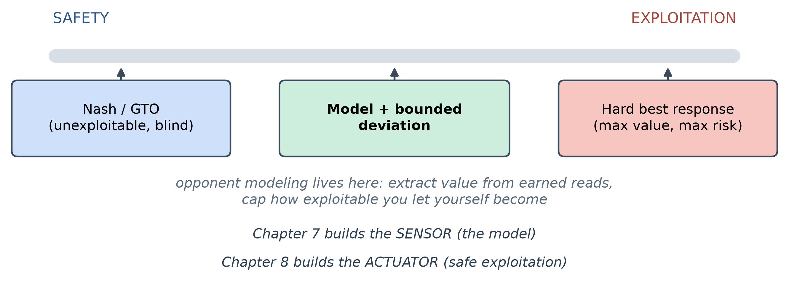
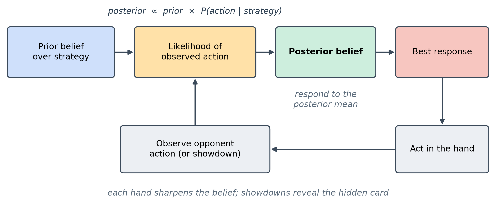
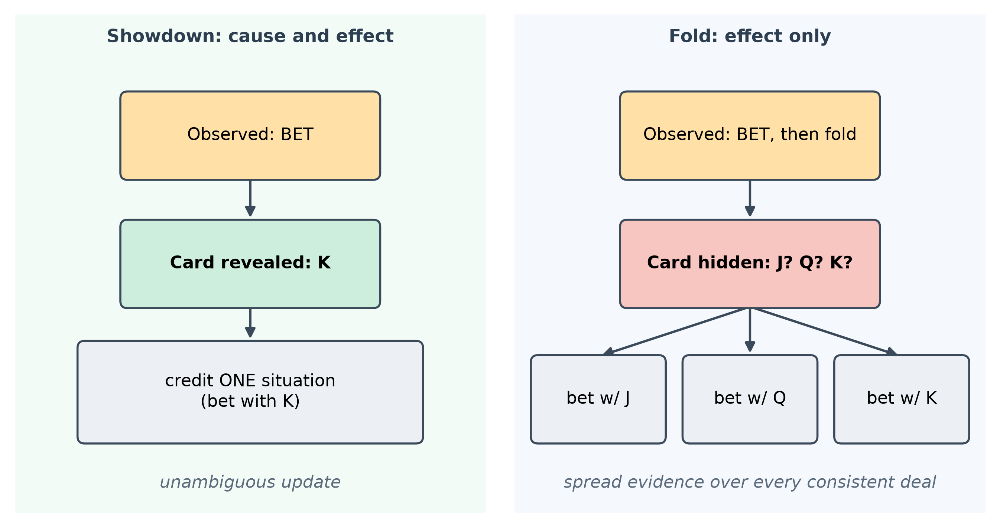
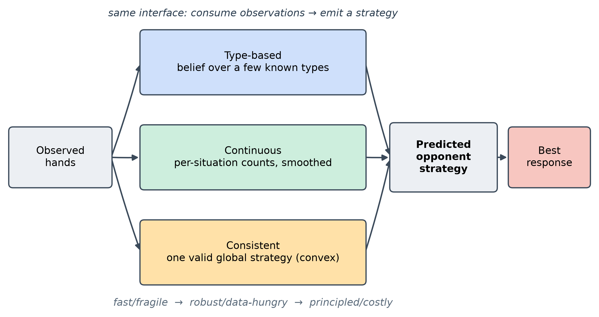
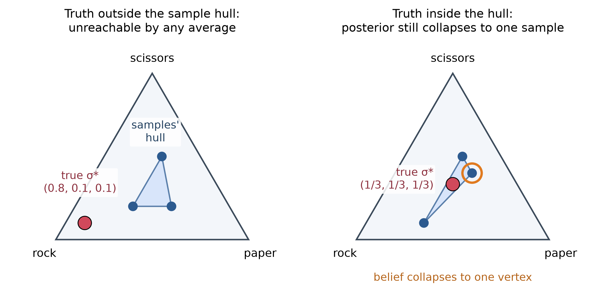
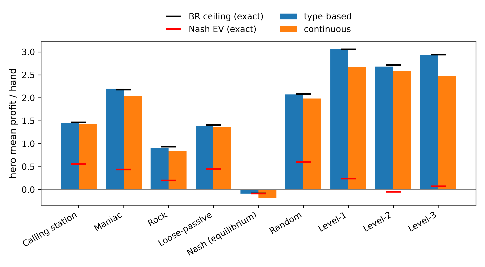
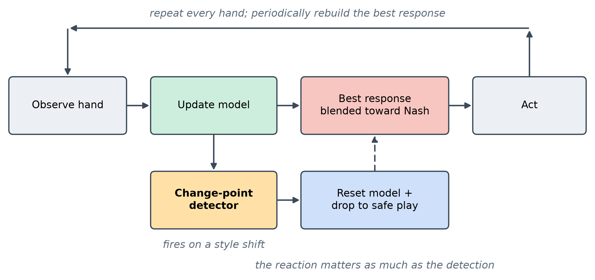

<!--
OFFICIAL PhD TITLE (keep consistent across all documents):
EN: Research on the possibilities for applying Artificial Intelligence in computer games
BG: Изследване на възможностите за приложение на изкуствения интелект в компютърни игри
-->
---
title: "Chapter 7 Summary — Opponent Modeling in Imperfect-Information Games"
subtitle: "Research on the possibilities for applying Artificial Intelligence in computer games"
author: "Alexander Andreev"
date: "July 2026"
lang: en
vars:
  research_focus: "Adaptive Strategy Learning in Multi-Agent Imperfect-Information Environments"
---

# Chapter 7 — Opponent Modeling in Imperfect-Information Games

This is a ground-up chapter on opponent modeling: the problem, the mathematics, the family of
methods, and a set of controlled experiments on Kuhn Poker and Leduc Hold'em, bounded wherever
possible by *exact* analytical references rather than simulated ones.

**Where this sits in the thesis.** A game-theoretic agent from the earlier chapters computes a
*Nash equilibrium*. This chapter builds the opposite capability: a **sensor** that watches how a
*specific* opponent actually plays and turns those observations into an estimate of their
strategy, so the agent can deviate from equilibrium to punish that opponent's mistakes. That
sensor is the first half of the thesis's Behavioral Adaptation Framework (Contribution #1); the
second half, *safe* exploitation, is Chapter 8.

---

## Why Opponent Modeling

A **Nash equilibrium** strategy is built never to lose in the long run, *no matter who it
plays*. For the same reason it plays **identically** against a world champion and against someone
who folds every single time you bet.

**Opponent modeling** is the
act of watching a specific opponent's actions, forming a belief about their strategy, and
**deviating from Nash to exploit the pattern** — bluffing more against someone who folds too
much, value-betting thinner against someone who calls too much.

The cleanest way to see the value is a *rock-paper-scissors* picture. Your opponent secretly
throws rock 70% of the time. The safe strategy is to randomize evenly and break even forever.
But if you *notice* the bias, you throw paper more and start winning. Two things make this the whole chapter in miniature: you must **infer** the bias from a noisy stream of throws, and if you **over-commit** to paper you become predictable and they crush you
with scissors. Inferring the bias is opponent modeling; knowing how far to lean is the
exploitation-versus-safety tradeoff that runs through everything below.

### How much is at stake — measured on Kuhn Poker

Kuhn Poker (Section 2.8) is small enough to solve *exactly*. For each of several fixed opponent styles we
computed the **Nash EV** (what an equilibrium strategy earns against that opponent, per hand), the
**best-response EV** (the exact ceiling on exploitation) and **the gap** between them — the money
equilibrium play leaves on the table.

| Opponent (Kuhn) | Nash EV | Best-response EV | Exploitation gap |
|---|--:|--:|--:|
| Calling station (never folds) | +0.119 | +0.333 | **0.215** |
| Rock (only commits with the King) | -0.060 | +0.167 | **0.227** |
| Maniac (always bets/calls) | +0.121 | +0.333 | **0.213** |
| Nash (equilibrium play) | -0.055 | -0.052 | 0.004 |

: Exploitation headroom in Kuhn: Nash EV, best-response EV, and the gap between them, per opponent type.

Against the three exploitable styles the gap is enormous — **about 0.21–0.23 per hand** (0.11–0.28 across both seats), on a game
whose entire equilibrium value is about one twentieth of a chip. Against a Nash opponent the gap
is essentially **zero**, exactly as theory demands: you cannot exploit an equilibrium, because
best response cannot beat the game value. (The small negative Nash EVs are Kuhn's known
first-player disadvantage of $-1/18 \approx -0.056$; the equilibrium is a 20,000-iteration CFR approximation, so it can dip a few thousandths below.)

Two lessons are already visible. First, **modeling is worth doing**: the value is large and
real. Second, **exploitation is directional** — the exact best response to a rock *bluffs more*
(it bets the weakest hand into an open pot, because the rock folds everything but the King).[^southey2005]

---

## The Bayesian Core — belief, evidence, response

Underneath every method in this chapter is one loop. You are a detective. You start with a hunch
about how the opponent plays (a **prior**). Each action they take is a clue: it makes some
explanations more likely and others less. You fold the clue into your suspicion (the
**posterior**), and repeat. Opponent modeling *is* this loop:

$$\text{belief about their strategy} \;\to\; \text{see an action} \;\to\; \text{update belief} \;\to\; \text{best-respond} \;\to\; \text{repeat.}$$

Formally, the update is Bayes' rule. If $\sigma$ denotes a candidate opponent strategy and $a$
the action just observed,

$$P(\sigma \mid a) \;\propto\; P(\sigma)\;\cdot\;P(a \mid \sigma),$$

in words: **posterior $\propto$ prior $\times$ how well that strategy explains what they just
did**. Over many hands the belief concentrates on the best-fitting explanation.

### The type "zoo"

The simplest way to make this concrete is to reason over a small menu of predefined opponent
**types**, a recurring cast that serves double duty — as opponents to play against, and as
hypotheses the detector reasons over:

| Type | Behavior |
|---|---|
| **Calling station** | Never bets, never folds — checks when it can, calls any bet. |
| **Rock** (tight-passive) | Commits chips only with the best hand; folds everything else. The most exploitable type. |
| **Maniac** (loose-aggressive) | Always bets or calls, regardless of hand. |
| **Nash** | Balanced equilibrium play; mixes its actions; unexploitable. |

: The opponent type zoo: the behaviour of each fixed style.

### The update, worked by hand

The mechanics are easiest to trust when you turn the crank once yourself. Suppose three
candidate types bet a particular hand with probability $0.8$, $0.5$, and $0.1$ respectively, and
you start from a uniform prior $(\tfrac13,\tfrac13,\tfrac13)$. You observe a **bet**:

$$
\text{posterior} \propto \left(\tfrac13\cdot 0.8,\; \tfrac13\cdot 0.5,\; \tfrac13\cdot 0.1\right)
= (0.267, 0.167, 0.033) \xrightarrow{\text{normalize}} (0.571, 0.357, 0.071).
$$

Observe a **second** bet and multiply by $(0.8, 0.5, 0.1)$ again:

$$(0.711, 0.278, 0.011).$$

The belief piles onto the bet-happy type, and it would do so *faster* the more the candidates
disagree. That "how much they disagree" intuition returns in Section 6 as the reason some
opponents are identified in four hands and others take two hundred.

### Why Dirichlet, and why you only ever need the mean

When you estimate an action
distribution by counting, the natural prior is the **Dirichlet** distribution, because it is the
*conjugate* prior of the multinomial: the observed counts are simply **added** to the prior's
pseudo-counts, so the posterior mean of action $i$ is

$$\mathbb{E}[p_i] \;=\; \frac{\alpha_i + n_i}{\sum_j (\alpha_j + n_j)},$$

where $\alpha_i$ are prior pseudo-counts (which double as *smoothing*, keeping no action at
exactly zero) and $n_i$ are observed counts. This closed form *is* the "continuous" model of
Section 4.

To choose an optimal response you never need the whole posterior distribution over
strategies; you only need its **mean**: your expected payoff against a *distribution* of opponent
strategies equals your payoff against the single averaged strategy. (Section 5 revisits this:
responding to the mean is payoff-optimal but can fail to *converge* to the opponent's true
strategy.)[^ganzfried2016]

---

## Seeing Through a Keyhole — the partial-observability problem

In poker you observe **actions** — bet, call, fold — but **not** the private hand that produced
them. The same "bet" can come from a monster or a bluff. The one exception is a **showdown**,
where cards are revealed at the end of a hand that goes to the end without a fold. A showdown
gives **cause and effect**: you see the actions *and* the private hand behind them, the
gold-standard observation. A fold gives **effect only**: you saw *what* they did but not *what
they held*.

The consequence is a genuine theoretical limit, not an implementation nuisance: **without ever observing the opponent's private information, you can learn how often they take each action but not which hands produce it**: many strategies yield the same action frequencies, and more hands cannot tell them apart.

How does a model cope with a fold? By reasoning over **all the hands the opponent might have
held**: it replays the opponent's decisions under each hypothetical private card and spreads the
evidence across them, weighting each hypothesis by how plausible it is. This "marginalize over
the hidden card" move is the technical heart of every model in the next two sections, and the
formal object the consistency theory of Section 5 is built around.

---

## Three Models, One Interface

There is no single "opponent model." There is a family, trading off convergence speed,
robustness to surprises, interpretability, and compute. This project implements three points on
that spectrum behind **one shared interface** — each consumes a stream of observed hands and
emits a predicted opponent strategy — so that the *same* downstream best response can be applied
to all three.

- **Type-based.** A Bayesian belief over a fixed menu of types (Section 2); fastest and
  interpretable ("80% rock, 20% maniac") **when the opponent is in the menu**, with no honest way
  to say so when it resembles none of them (Section 6).
- **Continuous.** Dirichlet-smoothed counts *at each situation* (Section 2); it can represent
  **any** strategy, but learns each situation independently and so needs many more observations —
  a hunger that, as Section 7 shows, has teeth on the larger game.
- **Consistent.** A single *globally consistent* strategy, valid over the whole game tree; the
  most principled and most recent model (Section 5).

| Model | Represents | Converges | Robust to out-of-menu? | Interpretable | Compute |
|---|---|---|---|---|---|
| Type-based | a few known types | fastest | no | high (named types) | cheap |
| Continuous | any per-situation strategy | slower (data-hungry) | yes | medium (per-situation) | cheap |
| Consistent | one valid global strategy | provably to the truth | yes | medium | expensive (optimization) |

: The three opponent models compared on representation, convergence, robustness, interpretability and cost.

No single model wins, and that is itself a finding. The natural target is a **hybrid**: lean on structural priors (types)
when data is sparse, and converge toward the consistent estimate as evidence accumulates.[^bard2013]

---

## The Consistency Problem and the Sequence-Form Fix

This section is the theoretical frontier of the chapter and the piece the thesis most directly
extends. It answers a question the earlier models quietly beg: *if a model fits the observed
behavior well, have we actually recovered the opponent's true strategy?* The surprising answer
is **not necessarily — even with infinite data** — and there is a principled fix.[^ganzfried2025]

### The flaw: fitting the mean is not the same as finding the truth

The classical Bayesian recipe responds to the posterior **mean** strategy (Section 2). Call an
opponent-modeling method **consistent** if its estimate converges to the opponent's true
strategy $\sigma^*$ as observations accumulate against a fixed opponent. The classical recipe is
not.

The cleanest counterexample is rock-paper-scissors. Suppose the modeler reasons over a set of
*sampled* candidate strategies and always responds to some average of them. If the true strategy
$\sigma^* = (0.8, 0.1, 0.1)$ lies **outside** the region those samples can combine to, the
model — being always a weighted average of the samples — simply **cannot reach it**, no matter
how much data arrives. The deeper result is that the method can fail
**even when the truth lies inside** the achievable region: with the true strategy sitting at the
center of three samples that average to it, the posterior weight on the single best-fitting
sample grows without bound relative to the others, so asymptotically the belief **collapses onto
one sample** rather than settling on the true mixture.[^ganzfried2025] Fitting the data ever more tightly, the
model converges to the *wrong* strategy.

This undercuts the intuitive safety net "just collect more data." Consistency is not automatic;
it has to be engineered.

### The fix: a convex program in sequence form

The key change of variables is the
**sequence form**: instead of per-situation action probabilities, represent the opponent's
strategy by **realization weights** $y_r$ over action *sequences*. The legal strategies are then
exactly those satisfying a set of **linear** constraints $Fy = f,\; y \ge 0$ — polynomial in the
size of the game tree, rather than exponential.

Partial observability (Section 3) enters through an **observability function**: for each observed
hand, the set of trajectories consistent with what you actually saw. Putting a Dirichlet prior on the weights and maximizing the log-posterior gives the
program

$$
\max_{y}\; \sum_r (\alpha_r - 1)\log y_r \;+\; \sum_t \log\!\Big(\!\!\sum_{r \in o(\ell_t)} q_r\, y_r\Big)
\qquad \text{s.t.}\quad Fy = f,\; y \ge 0,
$$

where $o(\ell_t)$ is the consistent-trajectory set for observation $t$ and $q_r$ are (normalized)
chance probabilities. When $\alpha_r \ge 1$ this objective is **concave** and the constraints are
affine, so it is a **convex** problem with **no local optima**; a standard **projected gradient**
scheme (a gradient step, then a projection back onto the constraint set) finds the global one.

This method returns the **mode** of the posterior (its single most probable point), not the
mean. That is the crucial trade: the mode is *consistent* — under standard conditions (the true strategy lies in the interior of the set of valid strategies and has positive prior density, distinct strategies produce distinguishable observations, and every opponent situation is visited infinitely often) the estimate provably converges to $\sigma^*$[^ganzfried2025] —
whereas the payoff-optimal mean is generally intractable to compute exactly. So the design axis
underneath the whole chapter is **mean versus mode**: payoff-optimal-but-intractable versus
tractable-and-consistent.

### What we found, honestly

We implemented this consistent estimator and verified it on Kuhn strategy recovery, where it
performs as advertised: its recovered strategy sits very close to the truth (total-variation
distance roughly **0.004 to 0.021**), matching or beating the continuous model's recovery on the
same game.

We did **not** run it inside the online exploitation loop, nor on the larger game. The estimate is the solution of an optimization that is
**re-solved as observations accumulate**, and that cost grows with history — from a fraction of a
second early on to many seconds per refit once tens of thousands of hands are in hand. We treat this as the
*empirical answer* to a question the chapter poses explicitly — *is a per-update convex solve
fast enough for real-time play?* — namely **not without incremental methods** (warm-starting
each solve from the last, caching the per-hand terms). The understanding and the recovery result
are what the thesis needs from this model now; the online engineering is future work.[^ganzfried2025]

---

## When a Model Is Confident and Wrong

Section 5 was about a subtle failure with infinite data. This section is about a blunt failure
with finite data, and it is the one that most directly motivates *safe* exploitation: a
**misspecified menu** — an opponent the type-based model simply cannot represent.

We built a hidden opponent that is a 50/50 per-action blend of the rock and the maniac —
deliberately **none** of the four candidate types. A reasonable guess is that the posterior
would split its belief between the two nearest types. It does not. A product-of-likelihoods
posterior concentrates on the *single best explanation*, so the belief lurches from one type to
another and finally commits, hard, to **Nash** — the one candidate that assigns real probability
to *both* betting and checking a middling hand, and so is never fatally contradicted. The model
ends up **confident** (posterior near 1.0 on a single type) and **wrong** (that type is not what
it is playing).

This exposes a trap worth stating plainly: the posterior is a **relative** quantity. "Ninety-five
percent Nash" means "best fit *among these four candidates*," not "good fit in absolute terms."
Measuring the winner's *absolute* fit gives the game away — the same Nash hypothesis that scores
well against a genuine Nash opponent scores far worse against this blend, while reporting equal
confidence on paper.

### How long can it stay wrong? A robustness sweep

We stress-tested the phenomenon over **300 random seeds of 500 hands each**, separating two things
a naive metric conflates: *slow convergence* from *falling after convergence*.

| Measurement (300 seeds x 500 hands) | Result |
|---|---|
| Correct long-run winner by hand 500 | **300 / 300 (100%)** |
| Ever falls back after taking the lead for good | **0 / 300 (never)** |
| A wrong type still leading past hand 100 | 40 / 300 (~13%) |
| A wrong type still leading past hand 200 | 14 / 300 (~5%) |
| Hand at which the truth locks in for good | median **23** - 90th pct **125** - worst **461** |

: Detector reliability over 300 seeds of 500 hands each.

The good news: the belief eventually lands on the closest representable strategy every time, and
once it locks in it never falls. The sobering news is the middle rows: in a meaningful minority
of runs the model held a **confident wrong belief for well over a hundred hands**. A model can
be trusted *eventually*, but "eventually" is sometimes 200 hands away.

The honest fix is not a bigger menu — it is to lean on models that can represent blends (the
continuous and consistent models of Sections 4-5), and to **scale how hard you exploit to how
well-earned the read is**. That principle is the through-line into Chapter 8.

---

## From Model to Money — best response, the ceiling, and a self-inflicted leak

To measure whether acting on a model wins, we feed each model's
estimate into the **same** exact best response and play full matches on both games, bracketing
every result between two analytical yardsticks: the **Nash EV** (what safe equilibrium play earns
against that opponent) and the **ceiling** (the exact best-response value, the most that is
extractable if you knew the opponent perfectly).

**Kuhn — both models reach the ceiling** (rock: ceiling 0.167, type-based 0.168, continuous
0.168; maniac: 0.333, 0.337, 0.330; Nash: −0.055, −0.055, −0.053).

**Leduc — the model class starts to matter.** Leduc Hold'em (Section 3.4) is still exactly
solvable, but large enough to separate the models.

| Opponent | ceiling | type-based | continuous |
|---|--:|--:|--:|
| Level-1 | 3.056 | 3.061 | 2.672 |
| Maniac | 2.177 | 2.199 | 2.038 |
| Calling station | 1.464 | 1.451 | 1.434 |
| Rock | 0.937 | 0.912 | 0.848 |
| **Nash** | -0.083 | -0.085 | **-0.175** |

: Leduc: the exploitation ceiling against what each model actually realised.

("Level-1" is an opponent that best-responds to a uniformly random player; on Leduc the type-based model's menu holds nine types, all shown in the next figure.)

Two results carry the message, and the second is the important one:

1. **You cannot exploit an equilibrium.** Against the Nash opponent every model earns
   approximately the (negative) game value and never more. This confirms the exploitation
   elsewhere is real and not an artifact of the harness.
2. **A confident-but-underfit model makes *you* exploitable.** On Leduc the continuous model
   *loses* to Nash — $-0.175$ against a $-0.083$ ceiling. With imperfect data over Leduc's many
   situations it best-responds to a *wrong* estimate of an opponent who cannot be exploited at
   all, and in doing so opens a leak in its **own** play.

When the model class fits,
best response extracts the full theoretical value; when it does not, the agent both leaves money
on the table *and* — more dangerously — hands some back. That second cost is precisely what
Chapter 8's safety mechanism (bounding the deviation from Nash by the model's own confidence) exists
to prevent.

The differences here are not seed luck. Across five seeds the standard error of per-hand profit
is tiny relative to the effects: the type-based model stays within 3% of the ceiling on every type in both games (and within two standard errors on nearly all), and the continuous model's Leduc shortfall and its Nash
self-leak are many standard errors wide.[^ganzfried2015]

---

## Adapting to Change — non-stationary opponents

Everything so far assumed a fixed opponent. Real opponents drift and adapt, and a model that
learned patiently for ten thousand hands is worse than useless the moment its subject changes
style — it is now *confidently* describing a person who no longer exists.

The adaptive agent runs the loop of Section 2: **observe** hands, **update** the
model, periodically rebuild the hero strategy as a best response to the current estimate, and
**act**. To handle change, it adds a
lightweight monitor on the opponent's aggression (Bayesian online change-point detection[^adams2007])
that, on firing, **resets** the model and drops back to safe play while it re-learns.

We switched the opponent's style at the midpoint of a 20,000-hand match and compared a **static**
model (never forgets) against one with **change-point forgetting**. The result is
**scenario-dependent**:

| Game | Style switch (at the midpoint) | static (after switch) | change-point (after switch) |
|---|---|--:|--:|
| Kuhn | rock -> maniac | **-0.106 ± 0.007** | **+0.211 ± 0.008** |
| Leduc | rock -> maniac | **+1.834 ± 0.054** | **+0.552 ± 0.017** |

: Static against change-point forgetting, after a mid-match style switch.

- **On Kuhn, forgetting wins.** The strategy learned against a rock is bluff-heavy; unleashed on
  a maniac who calls everything, it *actively loses*. Detecting
  the switch and re-learning recovers to a healthy profit.
- **On Leduc, forgetting loses.** The maniac there leaks over two chips a hand, so a
  continuously-adapting model exploits it handsomely without any reset — while the detector, too
  eager, fires dozens of **false alarms** during the stable stretches (around sixty resets
  against a single true change), each one throwing away hard-won data and dropping to safe play.

The lesson is that **the reaction to a detected change matters as much as the detection**. A
trigger-happy detector paired with a full reset-to-safe can cost more than staleness when the new
opponent is exploitable enough that staleness is cheap. Gentler responses — partial forgetting
instead of a hard reset, a less nervous detector — are the clear next step, and they connect
directly to Chapter 8's confidence-scaled exploitation. (Values are means over five seeds ± standard error; every seed agrees on the direction of the effect.)

---

## Connections and Forward Pointers

**What this chapter establishes.** A good opponent model is *necessary but not sufficient* for
profitable, safe adaptation. When the model class fits the opponent, best response reaches the
exact extractable ceiling. But under partial observability and limited data, an underfit model
both leaves money on the table and, against an opponent who cannot be exploited, best-responds to
a phantom and *loses*. Forgetting a stale model helps only when staleness is actively harmful.
One principle recurs across all of it: **exploitation must be scaled to how well-earned the read
is.**

**Forward to Chapter 8 and the thesis.** This chapter built the **sensor**; Chapter 8 builds the
**actuator** — the mechanism that turns a model into *safe* exploitation, bounding how far you
deviate from equilibrium by how much your read has earned. The continuous model's self-inflicted
leak against Nash (Section 7) is the empirical case for that mechanism; the confident-but-wrong
sweep (Section 6) sets its budget; the consistency theory (Section 5) is the principled backbone
the framework extends.[^shoham2008]

<!-- Source footnotes. Definitions may sit anywhere at top level; keeping them
     together here keeps the prose readable and the EN/BG pair easy to compare. -->

[^southey2005]: Southey, F. et al. (2005). "Bayes' Bluff: Opponent Modelling in Poker." *UAI*.

[^ganzfried2016]: Ganzfried, S. & Sun, Q. (2018). "Bayesian Opponent Exploitation in Imperfect-Information Games." *IEEE Conference on Computational Intelligence and Games (CIG)*, DOI 10.1109/CIG.2018.8490452; preprint arXiv:1603.03491 (2016). (Theorem 2.1: respond to the posterior mean.)

[^bard2013]: Bard, N., Johanson, M., Burch, N. & Bowling, M. (2013). "Online Implicit Agent Modelling." *AAMAS*, 255–262 — the explicit-vs-implicit axis that frames this taxonomy.

[^ganzfried2025]: Ganzfried, S. (2025). "Consistent Opponent Modeling in Imperfect-Information Games." *arXiv:2508.17671*.

[^ganzfried2015]: Ganzfried, S. & Sandholm, T. (2015). "Safe Opponent Exploitation." *ACM Transactions on Economics and Computation* 3(2), DOI 10.1145/2716322 — the paper that characterizes when "exploit but never lose to the baseline" is possible; the safety half of the dial and the anchor for Chapter 8.

[^adams2007]: Adams, R. P. & MacKay, D. J. C. (2007). "Bayesian Online Changepoint Detection." *arXiv:0710.3742*.

[^shoham2008]: Shoham, Y. & Leyton-Brown, K. (2008). *Multiagent Systems: Algorithmic, Game-Theoretic, and Logical Foundations*. Ch. 3 (normal-form games); Ch. 4 (computing solution concepts of normal-form games, §4.1 — linear programming for zero-sum games); Ch. 5 (extensive-form games; §5.2 — imperfect-information games and the sequence form, the machinery underneath every LP in Chapter 8); Ch. 7 "Learning and Teaching", the learning-in-repeated-games framing, including the tension that your actions both *exploit* and *teach* the opponent. Free: <http://www.masfoundations.org/download.html>
