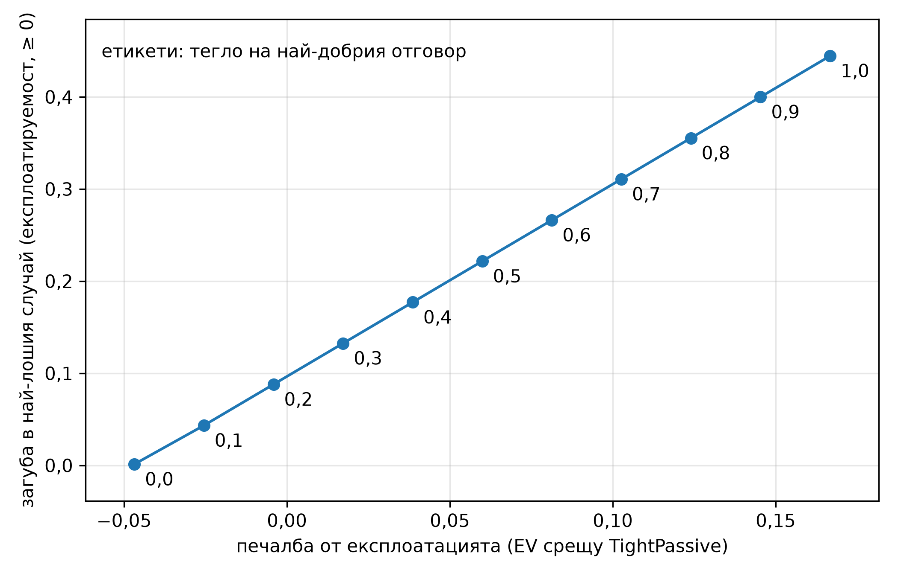

<!--
OFFICIAL PhD TITLE (keep consistent across all documents):
EN: Research on the possibilities for applying Artificial Intelligence in computer games
BG: Изследване на възможностите за приложение на изкуствения интелект в компютърни игри
-->

# Глава 08 – Безопасна експлоатация в игри с непълна информация

**Игри:** Кун покер (3 карти, 2 играчи) и Ледюк Холдем (6 карти, 2 рунда на залагане) – най-малките точно решими тестови среди с непълна информация, които използват изцяло повторно стека от Глава 07 (двигателя за Кун покер от Глава 02 + CFR решавач, двигателя за Ледюк от Глава 03, както и кода за точен най-добър отговор/експлоатируемост и зоопарка от типове противници от Глава 07).

**Връзка с дисертацията:** това е втората половина на **Принос №1 (Рамка за поведенческа адаптация)** и отправната точка за **Принос №2 (Многоагентна безопасна експлоатация)**. Глава 07 изгради *сензора* – модел на противника, който превръща наблюдаваните действия в оценка на стратегията; Глава 08 изгражда *изпълнителния механизъм*, който превръща тази оценка в печалба **без да става експлоатируем**, и определя точно къде предположението за игра с нулева сума се включва в гаранциите за безопасност (точката, от която тръгва дисертацията).

**Обхват на резултатите:** всяко число в този доклад е **измерено от реално изпълнение** и прочетено от артефактите от изпълнението под `implementation/step08/implementation/results/`, `.../plots/` и `.../exploration/figures/`. Когато това е възможно, симулираната стойност е оградена от *точно* аналитично сравнение (стойността на играта, точната стойност на най-добрия отговор), а не от друга симулация. Две прогнози от фаза 4 бяха **опровергани** от изпълненията; съгласно работния процес на проекта, те са запазени в първоначалния си вид и съпоставени с действително настъпилото (§7, §10).

> **Как да се чете този доклад.** И двете части следват една и съща дъга: **какво тестваме → как го тестваме → резултати → заключения.** **Част I (§1–§4)** прави компромиса между експлоатация и безопасност видим върху Кун с две малки серии експерименти с фиксирани начални числа. **Част II (§5–§13)** оценява цялата система – един двигател за линейно програмиране в последователна форма и пет семейства решавачи за безопасна експлоатация – върху Кун и Ледюк спрямо точни еталони. §14 изброява команди за възпроизвеждане.

---

# ЧАСТ I – КОМПРОМИСЪТ, ВИДИМ ВЪРХУ КУН

## 1. За какво става дума в тази глава

Стратегия в **равновесие на Наш** никога не губи в дългосрочен план срещу *никого*, но и никога не *наказва* слаб противник – тя играе еднакво както срещу световен шампион, така и срещу някой, който се отказва всеки път при **залог**. Глава 07 показа, че добрият **модел на противника** отключва печалба от 0,1–0,3 на раздаване срещу експлоатируеми противници, но също така и че най-добрият отговор на несъвършен модел може да създаде уязвимост в собствената игра (непрекъснатият модел *загуби* срещу „Наш“ в Ледюк). **Безопасна експлоатация** е дисциплината, която разрешава това напрежение: насочете се към **експлоатацията** на модела, но ограничете доколко **най-лошият възможен противник** може да ви накаже.

Формално, всеки метод в тази глава представлява една и съща **оптимизационна задача с ограничения**:

> максимизиране на очакваната стойност на собствения агент спрямо модела на противника **при ограничение**: стойността му в най-лошия случай да не пада под прага на безопасност.

Очакваната стойност е *линейна* спрямо плана за реализация на агента в последователна форма, така че това е задача на линейното програмиране (LP); петте семейства методи се различават единствено по **какъв е прагът на безопасност**:

| Метод | Праг на безопасност | Произход |
|---|---|---|
| **ограничен отговор по Наш (RNR)** | настройваем чрез параметър *p* (Наш при *p*=0 → най-добър отговор при *p*=1) | Johanson 2007 |
| **Най-добро равновесие** (`ganzfried`) | ≥ стойността на играта `v*`, наложена на стратегията за всяко раздаване | Ganzfried & Sandholm 2015 (техният базов вариант „най-добро равновесие“) |
| **Prime-safe** | ≥ `v* − ε`, където ε = експлоатируемостта на базовата линия | Jeary & Turrini 2023 |
| **SES (под-игра)** | ≥ стойността на плана, наложена *локално* върху една под-игра чрез приспособление (тук реализирано като безопасност на адаптацията по Ge и др.) | Liu и др. 2022 |
| **безопасност на адаптацията** | най-лошият случай ≥ най-лошият случай на плана (т.е. не по-експлоатируем от плана) | Ge и др. 2024 |

Бележка за „най-доброто равновесие“. Ganzfried и Sandholm определят безопасността за повтарящата се игра (средно поне `v*` на раздаване). Наложен на стратегията за всяко отделно раздаване, както тук, прагът допуска само равновесни стратегии, така че LP-задачата връща равновесието, което печели най-много срещу модела: техния базов вариант „най-добро равновесие“, а не алгоритмите им за безопасна експлоатация. Те (RWYWE, BEFFE) се отклоняват извън равновесието, като рискуват само вече натрупаните „подаръци“: RWYWE е същата LP-задача с праг `v* − k_t` за всяко раздаване, който се мени според натрупаните подаръци. Тези алгоритми са доказуемо безопасни и могат да експлоатират повече. Глава 15 реализира RWYWE върху тази LP-задача и го изпитва по протокола от Глава 14: печалбата му спрямо плана е +0,062 (Кун) и +0,113 (Ледюк) жетона на раздаване срещу +0,020 и +0,047 за най-доброто равновесие, а нито един от 120-те му мача при обучаващи атаки не завършва под стойността на играта. Това е само 14–30 % от печалбата на RNR при *p* = 0,5, защото малко подаръци могат да бъдат доказани, когато картите на противника се виждат само ако раздаването стигне до разкриване на картите.

Част I изследва *наивния* край на това меню – поведенческо смесване на равновесието на Наш и най-добрия отговор – именно за да покаже защо са необходими строго обоснованите LP-методи от Част II. Всички числа в Част I са измерени при изпълнения в Кун с фиксирани начални числа; собственият агент е играч 0, чиято стойност на играта в Кун е **−1/18 ≈ −0,056** (така че „експлоатация“ означава надминаване на тази стойност срещу даден противник, а абсолютните числа могат да останат отрицателни срещу стегнат противник).

---

## 2. Експеримент 1 – наивната граница между равновесието на Наш и най-добрия отговор

**Какво тестваме.** Ако просто смесите равновесието на Наш и пълния най-добър отговор спрямо слаб противник – `(1−λ)·nash + λ·full_br` – каква крива на компромис ще се получи между *печалбата* и *собствената ви експлоатируемост*?

**Как.** Изменете λ от 0 (чисто равновесие на Наш) до 1 (чист най-добър отговор) срещу силно експлоатируемия тип `TightPassive` и изчислете, **точно**, печалбата на агента (EV спрямо стегнато-пасивен) и загубата в най-лошия случай (разликата между стойността на играта и стойността на агента в най-лошия случай). Данни: `exploration/figures/pareto_curve_kuhn.json`.

| λ (тегло върху пълен най-добър отговор) | печалба (EV спрямо стегнато-пасивен) | загуба в най-лошия случай (експлоатируемост) |
|---:|---:|---:|
| 0,0 (равновесие на Наш) | −0,047 | 0,001 |
| 0,3 | +0,017 | 0,133 |
| 0,5 | +0,060 | 0,222 |
| 0,7 | +0,103 | 0,311 |
| 1,0 (пълен най-добър отговор) | +0,167 | 0,444 |



**Резултати.** Смесената стратегия проследява гладка, монотонна линия: всяко увеличение на печалбата е съпроводено с почти пропорционално нарастване на експлоатируемостта. Пълният най-добър отговор носи най-голяма печалба (+0,167), но е максимално експлоатируем (най-лошата загуба е 0,444 – тоест противник може да свали агента до −0,5); равновесието на Наш е неексплоатируемо, но не носи допълнителна печалба.

**Заключение.** Компромисът е реален и непрекъснат, но равномерното смесване е *груб* инструмент – то мащабира отклонението навсякъде наведнъж. Стойността на LP методите от Част II се състои в това, че те избират *къде* да се отклоняват, постигайки същата печалба при по-ниска експлоатируемост (§7). Тази крива е базовата линия, която те трябва да надминат.

---

## 3. Експеримент 2 – наивната серия по бюджета на RNR (и една уговорка)

**Какво тестваме.** Същото смесване, преформулирано като неформалния „ограничен отговор по Наш“ от първоначалните бележки: мащабирайте отклонението с *p* и наблюдавайте как печалбата и експлоатируемостта нарастват. Съществува ли *бюджет* за евтина ранна експлоатация?

**Как.** Изменение на *p* ∈ {0, …, 1} срещу стегнато-пасивен; записване на печалбата и експлоатируемостта. Данни: `exploration/figures/rnr_playground_kuhn.json`.


**Резултати.** Печалбата се покачва плавно от −0,047 (при *p*=0) до +0,167 (при *p*=1), а експлоатируемостта нараства синхронно от приблизително 0 до 0,444. Наблюдава се скромен ранен „бюджет“: първите увеличения на *p* носят печалба при все още ниска стойност на експлоатируемостта.

> **Уговорка (наивен ≠ каноничен RNR).** Това p-смесване е описанието от ден 2 на първоначалните бележки и е добър инструмент за интуиция, но то **не е** ограниченият отговор по Наш на Johanson. Каноничният RNR търси *равновесието срещу p-ограничен противник* – максиминна LP-задача, реализирана в Част II. Част II (§7) показва, че двете се държат **напълно различно** в Кун: каноничната версия превключва скокообразно, а не плавно. Ние ги запазваме и двете и ги обозначаваме, вместо да ги смесваме.

**Заключение.** Интуицията за „бюджет“ се потвърждава при наивното смесване, но Част II показва, че принципният алгоритъм в малка игра се държи по различен начин – конкретен пример защо интуитивната серия не бива да се приема за самия алгоритъм, който то илюстрира.

---

## 4. Какво установява Първа част

1. **Компромисът между експлоатация и безопасност представлява реална, измерима зависимост** (Експеримент 1): по-голяма печалба води до по-висока собствена експлоатируемост, почти пропорционално, при наивното смесване.
2. **Пълният най-добър отговор е рисков** – той е максимално изгоден спрямо модела, но същевременно максимално експлоатируем (най-лошият случай −0,5 в Кун), което е основната причина да бъде въведен праг на безопасност.
3. **Интуитивната серия не е самият алгоритъм** (Експеримент 2): наивното смесване изглежда гладко, но каноничният RNR, който то илюстрира, не е (§7). Част II заменя грубото смесване с LP методи, които разпределят бюджета за експлоатируемост *там, където осигуряват най-голяма печалба*.

---

# ЧАСТ II – ПЪЛНА ОЦЕНКА НА СИСТЕМАТА ВЪРХУ КУН И ЛЕДЮК

## 5. Какво тестваме и как

Част II оценява пълната система за безопасна експлоатация – **един двигател за линейно програмиране в последователна форма** и **пет семейства решавачи**, изградени върху него – и на двете игри, спрямо точни аналитични критерии.

**Един двигател.** `HeroTreeplex` изброява плана за реализация на агента в последователна форма (като използва повторно дървовидния политоп, treeplex, от Глава 07), превръща „очаквана стойност срещу постоянен противник“ в линейна цел `c·x` и налага прага на безопасност чрез **генериране на ограничения (метод на двойния предсказвач / метод на отсичащите равнини)**: решава LP-задачата → прочита стратегията на агента → извиква **точния най-добър отговор** от Глава 07 като противник в най-лошия случай → ако най-лошият случай е под прага, добавя линейното отсичащо ограничение и решава отново. Петте семейства се различават единствено по прага (§1). Това означава, че една проверена елементарна операция (точният най-добър отговор от Глава 07) захранва както целта, така и всяка проверка за безопасност.

**Точни критерии.** И двете игри са достатъчно малки, за да бъдат решавани напълно, така че докладваната печалба и най-лошият случай на всеки решавач се изчисляват върху пълното дърво – без извадка. Двата опорни пункта са **стойността на играта** (`v*` – безопасната базова линия) и **точният пълен най-добър отговор** (таванът на експлоатацията). Безопасният метод се намира между тях; небезопасният има стойност в най-лошия случай под `v*`.

**Методите** (идентификатори като низове, както се появяват в таблиците с резултати): `nash` (базова линия, без адаптация), `full_br` (максимизиране на EV спрямо модела, без безопасност), `rnr_0.5` (каноничен RNR при p=0,5), `ganzfried` (най-добро равновесие: праг = `v*`), `prime_safe` (праг = `v*−ε`), `adaptation` (праг = най-лошият случай на плана), `ses_subgame` (под-игра с приспособление; при Кун под-играта е цялата игра, така че съвпада с решаване чрез адаптация).

**Трите изследвания.**

1. **Таблица „Точен метод × тип противник“** – за всеки тип противник се решава всеки метод срещу *перфектен* модел на този тип и се отчита експлоатационната EV (печалба), стойността в най-лошия случай (безопасност) и дали тя е над прага на Наш.
2. **Ефективна граница** – каноничният RNR при различни *p*, наивното смесване и работните точки на най-доброто равновесие / prime-safe / адаптацията, всички върху един график „експлоатация срещу експлоатируемост“.
3. **Обучаваща атака (онлайн)** – измамлив противник примамва със слаб стил, след което разкрива силен; модел от Глава 7 подава на всеки решавач по *k* раздавания; проследяваме осъществената печалба и броя на нарушенията на безопасността.

**Конфигурации и времена за изпълнение** (измерени). Кун `smoke` (30 000 итерации на CFR): **1,4 s**. Кун `scale` (200 000 итерации на CFR, добавя `AlwaysBet`/`AlwaysPass`/`ses_subgame`, обучаваща атака с 5 начални числа × 20 000 раздавания): **10,3 s**. Ледюк `bounded_scale` (човешки добавена конфигурация: лимит от 40 итерации за генериране на ограничения, `leduc_tol = 0.01`, SES върху под-играта „поп на масата“): **минути** (индивидуални клетки на SES 10–79 s). Всичко е ограничено от CPU / LP – CFR, най-добър отговор за цялото дърво и малки LP-задачи със SciPy HiGHS – така че GPU е без значение, както беше предвидено. Измерени стойности на игрите: Кун `v* = −0.0556` (≈ −1/18 ✓), Ледюк `v* = −0.0862`.

> **Не е уловено.** Не са запазени журнал за преминати и непреминати тестове от `validate.py` и артефакт за кръстосана проверка на OpenSpiel от тези изпълнения, така че тези конкретни изходни данни на рамката не се докладват; точните таблици по-долу потвърждават повечето цели за валидиране директно (§11).

---

## 6. Подробната таблица метод × противник (Кун)

Основният резултат е представен чрез решаване на всеки метод срещу перфектен модел на всеки противник, като се оценяват печалбата (EV) и безопасността (най-лошият случай), при праг на Наш `v* = −0.056`. Данните са извлечени от файла `results/kuhn_scale.json`.

| Противник | метрика | nash | full_br | rnr_0.5 | **най-добро равн.** | prime_safe | adaptation | ses_subgame |
|---|---|---:|---:|---:|---:|---:|---:|---:|
| **TightPassive** | EV | −0,047 | **+0,167** | −0,044 | −0,044 | −0,040 | −0,040 | −0,040 |
| | най-лош случай | −0,056 | **−0,500** | −0,056 | −0,056 | −0,063 | −0,063 | −0,063 |
| **LooseAggressive** | EV | +0,118 | +0,333 | +0,278 | **+0,131** | +0,151 | +0,151 | +0,151 |
| | най-лош случай | −0,056 | −0,167 | −0,111 | −0,056 | −0,063 | −0,063 | −0,063 |
| **AlwaysBet** | EV | +0,113 | +0,333 | +0,333 | **+0,115** | +0,131 | +0,131 | +0,131 |
| | най-лош случай | −0,056 | −0,167 | −0,167 | −0,056 | −0,063 | −0,063 | −0,063 |
| **AlwaysPass** (най-експлоатируем) | EV | +0,146 | **+0,975** | +0,975 | **+0,222** | +0,266 | +0,266 | +0,266 |
| | най-лош случай | −0,056 | −0,500 | −0,333 | −0,056 | −0,063 | −0,063 | −0,063 |
| **„Наш“** (контролен) | EV | −0,056 | −0,055 | −0,056 | −0,056 | −0,055 | −0,055 | −0,055 |
| | най-лош случай | −0,056 | −0,333 | −0,056 | −0,056 | −0,063 | −0,063 | −0,063 |


**Резултатите – три ключови извода.**

1. **`full_br` е поучителната история.** Той винаги печели най-много срещу фиксиран модел (до **+0,975** срещу `AlwaysPass`), но стойността му в най-лошия случай се срива до **−0,5** – противник може да го накаже катастрофално. Това е единственият метод, който е небезопасен срещу *всеки* противник (`rnr_0.5` е небезопасен срещу три). Именно тази опасност главата трябва да предотврати.
2. **Най-доброто равновесие (`ganzfried`) е безопасно и все пак печели – но съвсем малко.** Срещу *всеки* противник стойността му в най-лошия случай остава на прага на Наш (безопасно в рамките на 1e-3) **и** печели повече от стратегията на Наш срещу всеки експлоатируем тип – най-ярко **+0,222 срещу +0,146 за Наш** срещу `AlwaysPass` и +0,131 срещу +0,118 срещу `LooseAggressive`. Може да се експлоатира, като доказуемо никога не се пада под равновесната стойност, но съвсем малко: срещу четирите експлоатируеми типа в таблицата печалбата спрямо Наш е 0,002–0,076 на раздаване, т.е. 1–9% от онова, което печели пълният най-добър отговор, защото прагът `v*` за всяко отделно раздаване допуска само равновесни стратегии (§1).
3. **`rnr_0.5` е безопасен само при малки уязвимости на противника.** Срещу `TightPassive` той е безопасен, но срещу силно експлоатируемите `AlwaysPass`/`AlwaysBet` той вече е *преминал* към пълен най-добър отговор (EV, идентична с тази на `full_br`, стойност в най-лошия случай −0,33 / −0,17 – небезопасен). RNR преходът е **зависим от противника** – един глобален *p* не е настройка за безопасност (§7).

**`prime_safe` / `adaptation` / `ses_subgame`** съвпадат при Кун (всички са насочени към един и същ праг – коригирания с ε, който е и прагът на плана, – а под-играта на SES в Кун е цялата игра). Стойността им в най-лошия случай е −0,063 = `v* − 0.008` и са маркирани като „небезопасни“ *единствено* защото флагът ги сравнява с `v*`, докато по замисъл те легитимно се насочват към по-нисък праг (§8).

> **Бележка за точността на измерването.** При бързата проверка `smoke` (30 000 итерации на CFR) дори стратегията на Наш е маркирана като „небезопасна“ (стойност в най-лошия случай −0,0568, т.е. 0,0013 под точната `v*`, малко над допустимото отклонение 1e-3) – чист артефакт на приближението чрез CFR. При `scale` (200 000 итерации) недостигът на Наш спада до 3e-4 и той правилно е маркиран като безопасен. Урок за тестовата среда: допустимото отклонение на флага за безопасност трябва да надвишава собствената грешка на приближението на базовата линия, в противен случай базовата линия няма да издържи собствената си проверка.

---

## 7. Ефективната граница – и скокообразното превключване

Серията по параметъра *p* на каноничния RNR срещу стегнато-пасивен, заедно с наивното смесване и трите работни точки на LP-методите (от `results/pareto_kuhn.json`):

| p | каноничен RNR – EV | каноничен RNR – експлоатируемост | наивно смесване – EV | наивно смесване – експлоатируемост |
|---:|---:|---:|---:|---:|
| 0,0 | −0,044 | ~0,000 | −0,047 | 0,000 |
| 0,3 | −0,044 | ~0,000 | +0,017 | 0,133 |
| 0,6 | −0,044 | ~0,000 | +0,081 | 0,266 |
| **0,7** | **+0,167** | **0,444** | +0,103 | 0,311 |
| 1,0 | +0,167 | 0,444 | +0,167 | 0,444 |

Работни точки: най-доброто равновесие `ganzfried` (EV −0,044, експлоатируемост 0,0005); `prime_safe` / адаптация (EV −0,040, експлоатируемост 0,0079); измерена стойност на `ε = 0.0074`.


### Предсказване ↔ реалност: каноничният RNR превключва скокообразно, а не по гладка граница

- **Предсказване (Фаза 4):** *„серията по RNR е монотонна и каноничният RNR доминира наивното смесване навсякъде.“*  
- **Какво всъщност се случи:** Каноничният RNR е **стъпаловидна функция**. За *p* ∈ [0, 0,6] тя връща *същата* безопасна стратегия (EV −0,044, експлоатируемост ≈ 0); при *p* ≈ 0,7 тя преминава направо към *пълния* най-добър отговор (EV +0,167, експлоатируемост 0,444). Между изпробваните стойности (през 0,1) **няма междинни точки**.  
- **Защо (проверено разсъждение).** Целевата функция на каноничния RNR `max_x [ p·EV(model) + (1−p)·min_{σ'} EV(x, σ') ]` е *линейна* спрямо плана за реализация на агента върху *политоп*, така че нейният оптимум е **връх**, който се сменя само когато *p* премине критично съотношение. Политопът на стратегиите на Кун е малък (малко върхове), така че преходът е единичен скок. Гладката граница на RNR при Johanson е явление от големи игри или от варианта със смещение към данните (много върхове или отделно *p* за всяко информационно множество); тя не се появява в толкова малка игра. **Наивното смесване** *проследява* гладка линия – именно защото интерполира две фиксирани стратегии – но е доминирана в безопасния ъгъл (при експлоатируемост ≈ 0 LP методите достигат EV −0,044 срещу −0,047 на смесването) и купува печалбата си във вътрешността с голям разход за експлоатируемост.
- **Скокообразно е съответствието между *p* и стратегията, а не границата.** Смесването на двете RNR стратегии (Johanson и др. дефинират такова смесване) достига всяка точка от отсечката между двата ъгъла, защото EV е линейна по смесването, а стойността в най-лошия случай е вдлъбната. При двата намерени върха превключването става при *p* ≈ 0,68; евентуален междинен връх би бил оптимален само за *p* между 0,6 и 0,7, където серията не е проверявала. Срещу стегнато-пасивен отсечката подобрява наивното смесване само с около 0,002, така че в тази игра изборът *къде* да се отклониш почти не носи предимство пред равномерното смесване (Johanson и др. отчитат силно вдлъбнати граници в голяма абстрахирана игра на Холдем). Кун показва друго: *p* не е плавна скала – прагът на превключване се измества според това колко експлоатируем е противникът (§6: `rnr_0.5` вече е при пълния BR срещу `AlwaysPass`). Затова най-доброто равновесие – което ограничава *стойността*, а не *p* – е по-добрата основа.

---

## 8. Prime-safe / адаптация и измереният ε-бюджет

Prime-safe и адаптацията понижават прага на безопасност от `v*` до `v* − ε`, където **ε е собствената експлоатируемост на базовата линия, измерена при CFR, спрян преждевременно** (никога измислена). Изпълнението измерва `ε = 0.0074`, а стойността в най-лошия случай при prime-safe/адаптацията е −0,063 = `v* − 0.0079` срещу всеки противник – в съответствие с коригирания с ε праг до закръгляне. Изразходвайки този бюджет, те печелят малко повече от най-доброто равновесие: **+0,266 срещу +0,222** срещу `AlwaysPass`, +0,151 срещу +0,131 срещу `LooseAggressive` (§6). Те са маркирани като „небезопасни“ в таблицата само защото флагът ги сравнява с `v*`; спрямо собствения им ε-праг те са безопасни по конструкция. Prime-safe и адаптацията съвпадат по конструкция: ε се определя като `v*` минус стойността на базовата линия в най-лошия случай, така че `v* − ε` *е* точно тази стойност, а изпълнението използва една и съща стратегия (CFR, спрян преждевременно) като базова линия за prime-safe и като план за адаптацията. Праговете на Jeary и Turrini и на Ge и др. съвпадат винаги, когато двете са една и съща стратегия; разликата е в приложението (експлоатация в цялата игра срещу повторно решаване на под-игри), а не в прага.

**Заключение.** Механизмът prime-safe функционира точно според замисъла си: несъвършена (ε-експлоатируема) базова линия се *измерва* коректно и прагът на безопасност се понижава именно с тази стойност – превръщайки гаранцията на Ganzfried и Sandholm, която „изисква точно равновесие на Наш“, в такава, приложима към приблизителните базови линии, каквито всяка реална система неизбежно притежава.

---

## 9. Обучаващата атака – защо осъществената печалба е грешната гледна точка

**Какво тестваме.** Измамлив противник играе слабата примамка `TightPassive` в първите 10 000 раздавания, след което „разкрива“ силна игра (`Nash`) за още 10 000; на всеки 500 раздавания непрекъснатият модел от Глава 7 подава обновената си оценка на всеки решавач (5 начални числа). Осигурява ли прагът на безопасност защита на безопасните методи, когато противникът промени поведението си? Данните са от `results/kuhn_scale.json`.

| метод | средно на раздаване (общо) | средно на раздаване (след смяната) | нарушения на безопасността / начално число |
|---|---:|---:|---|
| full_br | **+0,051** | −0,061 | **40, 40, 40, 40, 40** |
| най-добро равн. (`ganzfried`) | −0,048 | −0,055 | **0, 0, 0, 0, 0** |
| adaptation | −0,046 | −0,055 | 40, 40, 40, 40, 40 |
| nash | −0,051 | −0,061 | 0, 0, 0, 0, 0 |


### Прогноза ↔ реалност: „разкриващ“ противник, който играе равновесие на Наш, е твърде мек, за да накаже full_br

- **Прогноза (Фаза 4):** *„средната стойност на безопасните методи след превключването остава близо до базовата; тази на full_br е ясно по-лоша; брой нарушения на безопасността = 0 за безопасните методи, > 0 за full_br.“*
- **Какво всъщност се случи.** Половината с *брой нарушения на безопасността* се потвърди **напълно**: `full_br` наруши прага на Наш при **40/40** повторни настройки, най-доброто равновесие (`ganzfried`) при **0/40**. Но средната печалба на `full_br` след смяната (−0,061) е само *незначително* по-лоша от стойността на играта (−0,056), и той завършва с **огромна нетна печалба** общо (+0,051 на раздаване) – защото „разкриващият“ противник е *„Наш“*, който си връща само ≈ стойността на играта на раздаване, така че неочакваната печалба от фазата с примамката не бива върната в рамките на 10 000 раздавания.
- **Защо (проверено разсъждение).** Най-лошият случай за една стратегия се реализира от противник, който *играе най-добър отговор срещу нея* (това е причината `full_br` да стигне до −0,5 в §6). Стационарният противник, който играе равновесие на Наш, **не е** такъв противник, така че експериментът с онлайн осъществена печалба никога не задейства риска, който излага точната колона на най-лошия случай. Следователно измерването на обучаващата атака чрез печалбата срещу „Наш“ *подценява* опасността.
- **Коригиран извод.** Честният разграничителен сигнал тук е **точният най-лош случай / брой нарушения на безопасността** (full_br 40, най-доброто равновесие 0), а не осъществената печалба. За да накаже `full_br` *в печалбата*, разкриването трябва да бъде **адаптивен контраексплоататор** (най-добър отговор на остарелия модел на експлоататора), а не фиксиран „Наш“. Това е конкретното усъвършенстване за следващото изпълнение (§13).
- **Нюанс в дизайна, а не грешка.** `adaptation` показва 40 нарушения, докато `nash` показва 0 (в мащаб): адаптацията умишлено се насочва към праг *под* `v*` (§8), така че използваната стратегия задейства брояча, отчитан спрямо `v*`, при всяка повторна настройка – по замисъл. Нулата на Наш (в пълен мащаб) потвърждава, че 10-те „нарушения“ при бързата проверка бяха артефактът от точността на CFR от §6.

---

## 10. Ледюк – основният извод: при лимит 40 итерации глобалните решавачи не достигат сходимост, а SES (лимит 400) достига

Изпълнението в **Ледюк** е конфигурацията с човешко разширение **`bounded_scale`**: **лимит на итерациите от 40** за цикъла на генериране на ограничения, `leduc_tol = 0.01` и под-играта на SES, зададена като „поп на масата“ (`leduc_flop_rank(King)` – експлоатация само след като на масата се появи поп). За всяка клетка е записано дали решаването е **достигнало сходимост**, или лимита (**capped**). От `results/leduc_bounded_scale.json`; праг на Наш `v* = −0.086`.

| Противник | метрика | nash | full_br | **ses_subgame** | най-добро равн. | prime_safe | adaptation |
|---|---|---:|---:|---:|---:|---:|---:|
| **Rock** | EV | +0,201 | +0,937 | **+0,247** | +0,624 | +0,635 | +0,635 |
| | най-лош случай | −0,089 | −1,633 | **−0,130** | −0,838 | −0,744 | −0,744 |
| | сходим? | ✓ | ✓ | **✓ (194 итерации)** | ✗ лимит | ✗ лимит | ✗ лимит |
| **Maniac** | EV | +0,438 | +2,177 | **+0,682** | +1,806 | +1,842 | +1,842 |
| | най-лош случай | −0,089 | −1,100 | **−0,130** | −0,638 | −0,657 | −0,657 |
| | сходим? | ✓ | ✓ | **✓ (211 итерации)** | ✗ лимит | ✗ лимит | ✗ лимит |
| **Разпуснато-пасивен** (`LoosePassive`) | EV | +0,449 | +1,405 | **+0,559** | +1,306 | +1,309 | +1,309 |
| | най-лош случай | −0,089 | **−4,200** | **−0,133** | −1,239 | −1,334 | −1,334 |
| | сходим? | ✓ | ✓ | ✗ (400 итерации) | ✗ лимит | ✗ лимит | ✗ лимит |
| **Пасивен играч** (`CallingStation`) | EV | +0,559 | +1,464 | **+0,663** | +1,342 | +1,363 | +1,363 |
| | най-лош случай | −0,089 | −1,000 | **−0,130** | −0,915 | −0,686 | −0,686 |
| | сходим? | ✓ | ✓ | **✓ (350 итерации)** | ✗ лимит | ✗ лимит | ✗ лимит |
| **„Наш“** (контролен) | EV | −0,086 | −0,083 | −0,091 | −0,083 | −0,083 | −0,083 |
| | най-лош случай | −0,089 | −0,842 | −0,129 | −0,376 | −0,325 | −0,325 |

### Предсказване ↔ реалност: при лимит от 40 итерации глобалната безопасност не се пренася в Ледюк

- **Предсказване (Фаза 4):** *„Ganzfried: най-лош случай ≥ v* в рамките на допустимото отклонение (безопасно).“* И точка №1 в списъка на README за реализацията с най-вероятните слаби места: *„сходимост на генерирането на ограничения + обусловеност на LP-задачата.“*
- **Какво всъщност се случи.** В Ледюк **глобалните** решавачи (най-доброто равновесие `ganzfried`, `prime_safe`, `adaptation`, `rnr_0.5`) **всички достигнаха лимита от 40 итерации, без да достигнат сходимост**, оставяйки стойности за най-лошия случай от **−0,64 до −1,33** (нарушения на безопасността от 0,55–1,25) – грубо небезопасни. Потвърденият в Кун резултат „най-доброто равновесие е безопасно“ **не се пренесе** в Ледюк при лимит от 40 итерации.
- **Защо (проверено разсъждение).** Методът на отсичащите равнини добавя по едно отсичащо ограничение (от най-добрия отговор на противника) на итерация; при по-голямото дърво на Ледюк множеството от релевантни чисти най-добри отговори е голямо, така че 40 ограничения са далеч недостатъчни, за да фиксират истинския най-лош случай, и главната LP-задача продължава да връща оптимистични, но небезопасни стратегии. Това е точно режимът на отказ, сигнализиран преди изпълнението – сега потвърден с числа.
- **Положителният резултат.** **Методът на под-играта (SES) достигна сходимост** при 3 от 4 експлоатируеми противници (194 / 211 / 350 итерации), защото решава наново само под-играта „поп на масата“, като останалата част от дървото е фиксирана към плана – много по-малка LP-задача с много по-малко множество от отговори на противника. Той извлича реална стойност (**+0,25 до +0,68** срещу слабите типове – повече от стратегията на Наш) при най-лош случай ≈ **−0,13**, което е **с порядък по-близо до безопасно**, отколкото глобалните методи (−0,13 срещу −0,64…−1,33). Сравнението обаче не е при равни условия: глобалните решавачи са спрени след 40 итерации (около 2,5 s на клетка), а SES е имал лимит 400 и е използвал 194–400 итерации (30–79 s на клетка). Резултатът показва, че глобалният цикъл е бавен и небезопасен *в рамките на този бюджет*, а не че не може да достигне безопасност при по-голям. Глава 14 решава въпроса за мащабирането: нейната еднократно решавана двойнствена LP-задача, която заменя цикъла, решава задачата за пълния Ледюк за 0,02–0,04 s, така че препятствието е било в цикъла, а не в глобалната задача.
- **Честна уговорка относно SES.** Неговата остатъчна експлоатируемост (≈ 0,043) все още надвишава допустимото отклонение за Ледюк от 0,01, така че и той е *маркиран като небезопасен*, а при `LoosePassive` изпълни 400 итерации, без да достигне сходимост. Това нарушение обаче се мери спрямо `v*`. Собственият праг на SES е стойността в най-лошия случай на плана – тук спряното преждевременно CFR (−0,120 според бележките от изпълнението), а не равновесието на Наш (−0,089) – и трите клетки със сходимост са с 0,010 под него, т.е. точно на границата на допустимото отклонение 0,01. Следователно SES е спазил своя праг в рамките на допустимото отклонение, а остатъкът се дължи главно на експлоатируемостта на самия план; дали методът е *доказуемо* безопасен, ще покаже повторно изпълнение с по-малко допустимо отклонение.
- **Какво означава това.** Това е разграничението между **глобална спрямо локална безопасност** – въведено във фазите на интуиция и четене като теория – което се появява *емпирично* в игра, толкова малка, колкото Ледюк. Това е конкретната, измерена мотивация за методи на под-игри в реално време (SES / OX-Search) и за замяна на метода на отсичащите равнини с точна двойнствена LP-задача, решавана еднократно. Тестова среда толкова малка се оказа достатъчно голяма, за да разкрие стената при мащабирането.

### Укрепване на решавача по време на изпълненията

Резултатите от Ледюк съдържаха полета, които кодът от Фаза 4 не излъчваше, така че решавачът беше укрепен по време на изпълнението – съответстващо на очакваното отстраняване на грешки: малък резерв за допустимост върху отсичанията (`_FEAS_SLACK = 5e-4`, така че приблизителен праг на Наш, който леко надвишава истинския максимин, не прави главната LP-задача недопустима), изрично обработване на недопустимост (запазване на последната допустима стратегия), проследяване на `converged` / `capped` / `iterations` за всяка клетка и драйверът `bounded_scale` за Ледюк Холдем с предикат за SES „поп на масата“. Това са точно смекчаващите мерки, към които сочи списъкът „вероятно ще се счупи“ в README файла на имплементацията.

---

## 11. Достоверни ли са резултатите?

Три независими проверки подкрепят числата, с две уговорки.

- **Точните опорни точки възпроизвеждат известната теория.** Измерената стойност на играта Кун е **−0,0556** (≈ −1/18, известният недостатък на първия играч ✓); стойността на Ледюк е −0,0862. Срещу противника „Наш“ всеки метод печели ≈ стойността на играта и не повече (§6, §10) – както трябва да бъде, тъй като равновесие не може да бъде експлоатирано; когато едно число е съвсем малко над своя таван, това е шум от краен брой проби, а не реално нарушение.
- **Вътрешна съгласуваност на LP двигателя.** Всеки решавач, който трябва да достигне пълната стойност на най-добрия отговор, го прави: `full_br` и постпреходният `rnr` достигат точно +0,167 (Кун, стегнато-пасивен) и големите стойности на най-добрия отговор за Ледюк, което е възможно само ако векторът на печалбата в последователна форма `c·x` съвпада с точния най-добър отговор – централното условие за коректност на двигателя.
- **Сходимостта вече е наблюдаема.** Флаговете `converged` / `capped` (Ледюк) правят единственото място, където методът може да се провали безшумно – липса на сходимост при генерирането на ограничения – изрично в изхода, вместо скрито.

**Уговорки.** (1) Не е запазен журнал за преминати и непреминати тестове от `validate.py` и не е създаден артефакт за кръстосана проверка на OpenSpiel, поради което тези два изхода от системата за тестване остават непотвърдени чрез артефакти тук (може да се повтори изпълнението за потвърждение). (2) Ледюк беше стартиран единствено в конфигурацията `bounded_scale` с ограничен мащаб и брой итерации, така че числата на глобалните решавачи за Ледюк отразяват *бюджет*, а не решение със сходимост – те показват, че методът е бавен/небезопасен **в рамките на 40 итерации**, но не и че никога не би могъл да достигне безопасност при значително по-голям брой итерации.

---

## 12. Ограничения

Подредени според това доколко ограничават изводите:

1. **Глобалната безопасна експлоатация не достигна сходимост в Ледюк (§10).** При лимит от 40 итерации методът на отсичащите равнини оставя най-доброто равновесие/prime-safe/адаптацията силно небезопасни. Това е най-ясната празнина и основната изследователска отправна точка – да се реши с точна двойнствена LP-задача или със значително по-голям бюджет и да се провери дали методът е „бавен“, или „структурно блокиран“. (Еднократно решаваната двойнствена LP-задача от Глава 14 го решава: пълният Ледюк за 0,02–0,04 s.)
2. **Остатъчна експлоатируемост на SES (§10).** SES достига сходимост; нарушението му от ≈ 0,04 се мери спрямо `v*`, а спрямо собствения си праг (стойността на плана в най-лошия случай) клетките със сходимост са точно на границата на допустимото отклонение 0,01. Дали методът е *доказуемо* безопасен, ще покаже повторно изпълнение с по-малко допустимо отклонение.
3. **Обучаващата атака наказва твърде слабо (§9).** Стационарният „разкриващ“ противник, който играе равновесие на Наш, не задейства най-лошия случай, така че осъществената печалба не успява да отдели безопасните от небезопасните – само броят нарушения го прави. Необходим е адаптивен наказващ противник, за да се покаже, че един безопасен метод *надминава* full_br при измама.
4. **Две малки игри; перфектни модели в точната таблица.** Таблиците от §6/§10 решават срещу *перфектен* модел на всеки тип (офлайн случай); онлайн случаят с обучаван модел е само обучаващата атака. Кун/Ледюк са точно решими *защото* са малки; стената на сходимостта, която се появява в Ледюк, ще се влоши още повече при увеличаване на мащаба – това е контролирано доказателство за концепция, а не твърдение за мащабиране.
5. **Непотвърдени кръстосани проверки (§11).** `validate.py` и сравнението с OpenSpiel не бяха уловени като артефакти.

---

## 13. Заключения и насоки за бъдещи изследвания

**Заключения.** Безопасната експлоатация е една идея – *максимизиране на стойността спрямо модела при спазване на праг на безопасност* – и в напълно решима игра тя работи точно както казва теорията: **най-доброто равновесие (базовият вариант на Ganzfried и Sandholm) е безопасно срещу всеки противник и печели повече от Наш срещу всеки експлоатируем** (+0,222 спрямо +0,146 срещу `AlwaysPass`), макар и само с 0,002–0,076 на раздаване, докато наивният най-добър отговор носи повече печалба, но е катастрофално експлоатируем (стойност в най-лошия случай −0,5). Prime-safe и адаптацията разширяват това към несъвършени базови линии, като изразходват *измерен* ε-бюджет под `v*`. Но най-ценният резултат от главата е отрицателен и емпиричен: в игра толкова малка като **Ледюк** *глобалното* решаване за безопасна експлоатация не достигна сходимост при лимит от 40 итерации, докато *локалният* метод на под-играта (SES, лимит 400) достигна – разликата между глобалната и локалната безопасност, измерена при неравни бюджети. Две прогнози от фаза 4 (гладка граница на RNR; най-доброто равновесие е безопасно в Ледюк) бяха опровергани и съпоставени с резултата; съпоставките са по-поучителни, отколкото биха били самите прогнози.

**Насоки за бъдещи изследвания** (мотивирани от установените ефекти по-горе):

- **По-силният базов метод за двама играчи (§1).** Реализирайте алгоритъма RWYWE на Ganzfried и Sandholm, който рискува натрупаните подаръци – съществуващата LP-задача с праг `v* − k_t` за всяко раздаване, който се мени според натрупаните подаръци, – като базов метод за Принос №2 и повторете сравнението в Кун/Ледюк, като в Ледюк глобалните решавачи и решаването на под-игри получат равни бюджети. Глава 15 реализира и измерва RWYWE (резултатите са в §1); точната двойнствена LP-задача от Глава 14 прави повторението при равни бюджети излишно.

- **Мащабируема безопасност – централната следваща задача (§10).** Заменете метода на отсичащите равнини с **точна двойнствена LP-задача, решавана еднократно**, за ограничението за най-лошия случай, *или* изберете **локална безопасност на ниво под-игра** (SES / OX-Search) като мащабируем път. Липсата на сходимост в Ледюк (при неравни бюджети) е довод в полза на второто. Глава 14 избра първия път: нейната еднократно решавана двойнствена LP-задача решава пълния Ледюк за 0,02–0,04 s.
- **Остатъчната експлоатируемост на SES (§10).** Разликата от 0,04 се мери спрямо `v*`; спрямо собствения си праг (на плана) SES е на границата на допустимото отклонение 0,01. Повторно изпълнение с по-малко допустимо отклонение ще покаже дали методът на под-играта е доказуемо или само приблизително безопасен.
- **Наказваща обучаваща атака (§9).** Заменете „разкриващия“ противник „Наш“ с адаптивен контраексплоататор, така че осъществената печалба да потвърждава най-лошия случай и да се покаже, че безопасният метод *надминава* full_br при измама.
- **Безопасност при N играчи – принос №2 на дисертацията.** Всяка гаранция тук се основава на факта, валиден за игри с нулева сума за двама играчи, че равновесната стратегия на Наш осигурява `v*` срещу всеки противник; при N > 2 такава опора `v*` няма. Понятия за безопасност при N играчи съществуват, но са или много консервативни (максимин срещу координирана коалиция, Celli и Gatti 2018), или по принцип неосигурими (равният дял – справедлива цел, която не може да бъде гарантирана срещу противници с различни фиксирани стратегии, Ge и др. 2025). Отвореният проблем, който тази глава прави прецизен, е експлоатацията с ограничена загуба спрямо базова линия, изпитана и срещу противници в сговор.
- **Затворете цикъла на валидиране (§11).** Стартирайте и архивирайте `validate.py` и кръстосаната проверка на OpenSpiel; повторете глобалните решавачи за Ледюк с голям бюджет / точна двойнствена задача, за да различите „бавен“ от „структурно небезопасен“.

---

## 14. Възпроизвеждане

**Част I – изследване** (от `implementation/step08/exploration/`, `.venv` активна; всяка отпечатва таблици в стандартния изход и записва фигури под `exploration/figures/`):

```bash
python pareto_curve.py               # Exp 1 - naive Nash/BR frontier
python rnr_playground.py             # Exp 2 - naive RNR p-sweep
python exploitation_safety_playground.py   # Nash vs BR vs blend, all metrics
python naive_exploit_danger.py       # why full BR is dangerous
python subgame_peek.py               # blueprint vs local exploit (Leduc)
```

**Част II – цялостна оценка** (от `implementation/step08/implementation/`, `.venv` активна; изисква numpy, scipy, matplotlib):

```bash
python tournament.py --config smoke   # quick Kuhn pass (~1.4 s)
python tournament.py --config scale   # Kuhn full run (~10 s): table + teaching attack
python pareto.py --config scale       # the exploitation-safety frontier
python validate.py                    # PASS/FAIL vs the raw-step targets
python compare_openspiel.py           # OpenSpiel NashConv cross-validation (needs open_spiel)
# Leduc used a human-added bounded_scale driver (40-iter cap, King-flop SES); see results/leduc_bounded_scale.json
```

Резултатите се записват във файлове с разширение `results/*.json`, а графиките – в `plots/*.png`. *Фигурите, възпроизведени в този доклад, се намират в `deliverables/reports/step08/figures/` (фигурите за изследване са под оригиналните си имена; фигурите за оценка имат префикс `impl_`). Пълната проверена консолидация с регистър на прогноза↔реалност е достъпна в `implementation/step08/consolidation/report.md`.*
