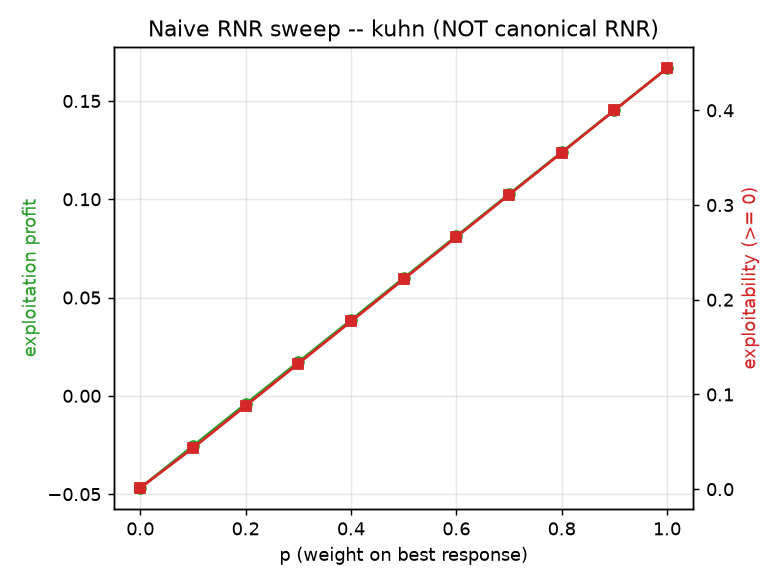
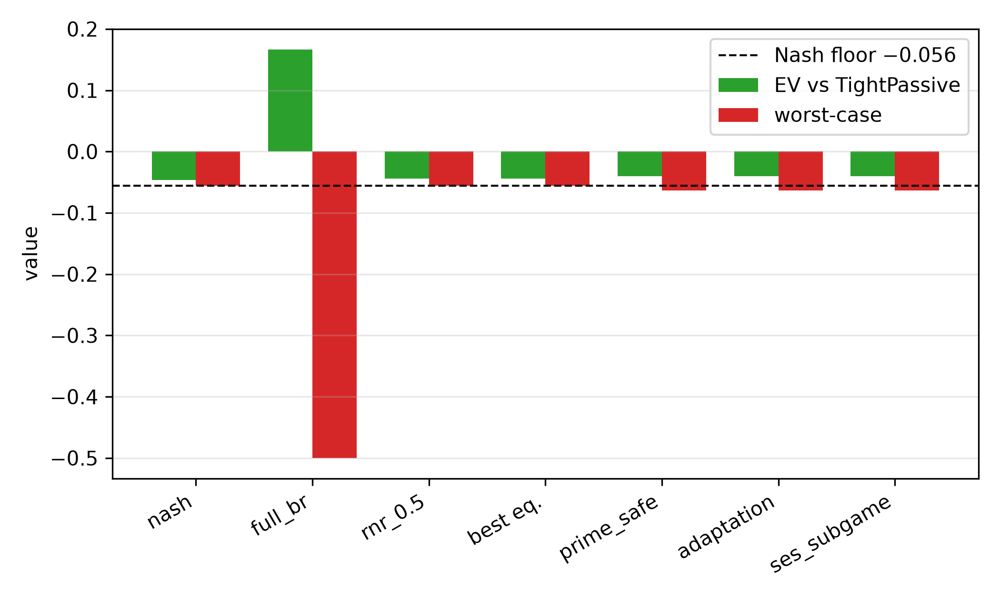

<!--
OFFICIAL PhD TITLE (keep consistent across all documents):
EN: Research on the possibilities for applying Artificial Intelligence in computer games
BG: Изследване на възможностите за приложение на изкуствения интелект в компютърни игри
-->

# Chapter 08 — Safe Exploitation in Imperfect-Information Games

**Games:** Kuhn Poker (3-card, 2-player) and Leduc Hold'em (6-card, 2-round) — the smallest exact-solvable imperfect-information testbeds, reusing the Chapter 07 stack wholesale (the Chapter 02 Kuhn engine + CFR solver, the Chapter 03 Leduc engine, and Chapter 07's exact best-response / exploitability code and opponent-type zoo).

**PhD connection:** the **second half of Contribution #1 (Behavioral Adaptation Framework)** and the launch point for **Contribution #2 (Multi-Agent Safe Exploitation)**. Chapter 07 built the *sensor* (an opponent model that turns observed actions into a strategy estimate); Chapter 08 builds the *actuator* — turning that estimate into profit **without becoming exploitable** — and pins down exactly where the two-player zero-sum assumption enters the safety guarantees (the thesis attack point).

**Scope of results:** every number in this report is **measured from a real run** and read from the run artifacts under `implementation/step08/implementation/results/`, `.../plots/`, and `.../exploration/figures/`. Wherever possible a simulated number is bracketed by an *exact* analytical reference (the Nash game value, the exact best-response value) rather than another simulation. Two Phase-4 predictions were **contradicted** by the runs; per the project workflow they are kept as stated and reconciled with what actually happened (§7, §10).

> **How to read this report.** Both parts follow the same arc: **what we test → how we test it → results → conclusions.** **Part I (§1–§4)** makes the exploitation-safety tradeoff visible on Kuhn with two small seeded sweeps. **Part II (§5–§13)** evaluates the full system — one sequence-form LP engine and five safe-exploitation solver families — on Kuhn and Leduc against exact yardsticks. §14 lists reproduction commands.

---

# PART I — THE TRADEOFF, MADE VISIBLE ON KUHN

## 1. What this chapter is about

A **Nash-equilibrium** strategy never loses in the long run against *anyone*, but it also never *punishes* a weak opponent — it plays identically against a world champion and against someone who folds every time you bet. Chapter 07 showed that a good opponent model unlocks 0.1–0.3 per hand against exploitable opponents, but also that best-responding to an imperfect model can open a leak in your own play (the continuous model *lost* to Nash on Leduc). **Safe exploitation** is the discipline that resolves that tension: lean toward exploiting the model, but bound how much a worst-case adversary can punish you.

Formally, every method in this chapter is the **same constrained optimization**:

> maximize the hero's expected value against the opponent model, **subject to** a safety floor on the hero's worst-case value.

The expected value is *linear* in the hero's sequence-form realization plan, so this is a linear program; the five method families differ only in **what the safety floor is**:

| Method | Safety floor | Origin |
|---|---|---|
| **Restricted Nash Response (RNR)** | tunable via a parameter *p* (Nash at *p*=0 → best response at *p*=1) | Johanson 2007 |
| **Ganzfried** | ≥ the Nash game value `v*` | Ganzfried & Sandholm 2015 |
| **Prime-safe** | ≥ `v* − ε`, with ε = the baseline's own exploitability | Jeary & Turrini 2023 |
| **SES (subgame)** | ≥ the blueprint value, enforced *locally* on one subgame via a gadget | Liu et al. 2022 |
| **Adaptation safety** | worst-case ≥ blueprint worst-case (i.e. no more exploitable than the blueprint) | Ge et al. 2024 |

Part I probes the *naive* end of this menu — a behavioral blend of Nash and best response — precisely to show why the principled LP methods of Part II are needed. All Part I numbers are measured from seeded Kuhn runs; the hero is player 0, whose Kuhn game value is **−1/18 ≈ −0.056** (so "exploitation" means beating that value against a given opponent, and absolute numbers can stay negative against a tight opponent).

---

## 2. Experiment 1 — the naive Nash/best-response frontier

**What we test.** If you simply blend Nash and the full best response to a weak opponent — `(1−λ)·Nash + λ·BR` — what tradeoff curve do you trace between *profit* and *your own exploitability*?

**How.** Sweep λ from 0 (pure Nash) to 1 (pure best response) against the very exploitable `TightPassive` type, and compute, **exactly**, the hero's profit (EV vs TightPassive) and worst-case loss (game value minus the hero's worst-case value). Data: `exploration/figures/pareto_curve_kuhn.json`.

| λ (weight on BR) | profit (EV vs TightPassive) | worst-case loss (exploitability) |
|---:|---:|---:|
| 0.0 (Nash) | −0.047 | 0.001 |
| 0.3 | +0.017 | 0.133 |
| 0.5 | +0.060 | 0.222 |
| 0.7 | +0.103 | 0.311 |
| 1.0 (full BR) | +0.167 | 0.444 |


**Results.** The blend traces a smooth, monotone line: each increment of profit costs a near-proportional increment of exploitability. Full best response wins the most (+0.167) but is maximally exploitable (worst-case loss 0.444 — i.e. an adversary can drive the hero down to −0.5); Nash is unexploitable but wins nothing extra.

**Conclusion.** The tradeoff is real and continuous, but a uniform blend is a *blunt* instrument — it scales deviation everywhere at once. The value of Part II's LP methods is that they choose *where* to deviate, buying the same profit at less exploitability (§7). This curve is the baseline they must beat.

---

## 3. Experiment 2 — the naive RNR budget sweep (and a flag)

**What we test.** The same blend, re-parameterized as the raw step's informal "Restricted Nash Response": scale deviation by *p* and watch profit and exploitability grow. Is there a *budget* of cheap early exploitation?

**How.** Sweep *p* ∈ {0, …, 1} against TightPassive; record profit and exploitability. Data: `exploration/figures/rnr_playground_kuhn.json`.



**Results.** Profit rises smoothly from −0.047 (p=0) to +0.167 (p=1); exploitability rises in lockstep from ≈0 to 0.444. There is a modest early "budget": the first increments of *p* buy profit while exploitability is still small.

> **Flag (naive ≠ canonical RNR).** This p-blend is the raw step's Day-2 *description*, and it is a fine intuition tool, but it is **not** Johanson's Restricted Nash Response. Canonical RNR solves for the *equilibrium against a p-restricted opponent* — a max-min linear program, implemented in Part II. Part II (§7) shows the two behave **completely differently** on Kuhn: the canonical version is bang-bang, not smooth. We keep both and label them, rather than conflate them.

**Conclusion.** The "budget" intuition holds for the naive blend, but Part II shows it is not how the principled algorithm behaves in a small game — a concrete example of why an intuition sweep must not be mistaken for the algorithm it illustrates.

---

## 4. What Part I establishes

1. **The exploitation-safety tradeoff is a real, measurable curve** (Exp. 1): more profit ⇒ more of your own exploitability, near-proportionally, for the naive blend.
2. **Full best response is dangerous** — maximally profitable against the model but maximally exploitable (worst-case −0.5 on Kuhn), which is the entire reason a safety floor is needed.
3. **An intuition sweep is not the algorithm** (Exp. 2): the naive p-blend is smooth, but the canonical RNR it stands in for is not (§7). Part II replaces the blunt blend with LP methods that spend the exploitability budget *where it buys the most profit*.

---

# PART II — FULL SYSTEM EVALUATION ON KUHN & LEDUC

## 5. What we test, and how

Part II evaluates the complete safe-exploitation system — **one sequence-form LP engine** and **five solver families** built on it — on both games, against exact analytical yardsticks.

**The one engine.** A `HeroTreeplex` enumerates the hero's sequence-form realization plan (reusing Chapter 07's treeplex), turns "EV against a fixed opponent" into a linear objective `c·x`, and imposes the safety floor by **constraint generation (a double-oracle / cutting-plane loop)**: solve the LP → read the hero policy → call Chapter 07's **exact best response** as the worst-case opponent → if the worst case is below the floor, add the linear cut and re-solve. The five families differ only in the floor (§1). This means one validated primitive (Chapter 07's exact best response) powers both the objective and every safety check.

**Exact yardsticks.** Both games are small enough to solve exactly, so every solver's reported profit and worst-case are computed on the full tree — no sampling. The two anchors are the **Nash game value** (`v*` — the safe baseline) and the **exact full best-response value** (the exploitation ceiling). A safe method sits between them; an unsafe one has a worst-case below `v*`.

**The methods** (string ids as they appear in the result tables): `nash` (baseline, no adaptation), `full_br` (maximize EV vs the model, no safety), `rnr_0.5` (canonical RNR at p=0.5), `ganzfried` (floor = `v*`), `prime_safe` (floor = `v*−ε`), `adaptation` (floor = blueprint worst-case), `ses_subgame` (subgame gadget; on Kuhn the subgame is the whole game, so it coincides with an adaptation solve).

**The three studies.**

1. **Exact method × opponent table** — for each opponent type, solve each method against a *perfect* model of that type and report exploitation EV (profit), worst-case value (safety), and whether the worst-case meets the Nash floor.
2. **The efficient frontier** — canonical RNR swept over *p*, the naive blend, and the Ganzfried / prime-safe / adaptation operating points, all on one exploitation-vs-exploitability plot.
3. **Teaching attack (online)** — a deceptive opponent baits with a weak style then reveals a strong one; a Step-7 model feeds each solver every *k* hands; we track realized profit and safety-violation counts.

**Configurations and runtimes** (measured). Kuhn `smoke` (30 000 CFR iters): **1.4 s**. Kuhn `scale` (200 000 CFR iters, adds `AlwaysBet`/`AlwaysPass`/`ses_subgame`, teaching attack over 5 seeds × 20 000 hands): **10.3 s**. Leduc `bounded_scale` (a human-added config: a 40-iteration cap on constraint generation, `leduc_tol = 0.01`, SES on the King-flop subgame): **minutes** (individual SES cells 10–79 s). Everything is CPU / LP-bound — CFR, full-tree best response, and small SciPy HiGHS linear programs — so the GPU is irrelevant, as predicted. Measured game values: Kuhn `v* = −0.0556` (≈ −1/18 ✓), Leduc `v* = −0.0862`.

> **Not captured.** No `validate.py` PASS/FAIL log and no OpenSpiel cross-check artifact were saved from these runs, so those specific harness outputs are not reported; the exact tables below substantiate most validation targets directly (§11).

---

## 6. The exact method × opponent table (Kuhn)

The core deliverable: each method solved against a perfect model of each opponent, scored on profit (EV) and safety (worst-case), with the Nash floor at `v* = −0.056`. From `results/kuhn_scale.json`.

| Opponent | metric | nash | full_br | rnr_0.5 | **ganzfried** | prime_safe | adaptation | ses_subgame |
|---|---|---:|---:|---:|---:|---:|---:|---:|
| **TightPassive** | EV | −0.047 | **+0.167** | −0.044 | −0.044 | −0.040 | −0.040 | −0.040 |
| | worst-case | −0.056 | **−0.500** | −0.056 | −0.056 | −0.063 | −0.063 | −0.063 |
| **LooseAggressive** | EV | +0.118 | +0.333 | +0.278 | **+0.131** | +0.151 | +0.151 | +0.151 |
| | worst-case | −0.056 | −0.167 | −0.111 | −0.056 | −0.063 | −0.063 | −0.063 |
| **AlwaysBet** | EV | +0.113 | +0.333 | +0.333 | **+0.115** | +0.131 | +0.131 | +0.131 |
| | worst-case | −0.056 | −0.167 | −0.167 | −0.056 | −0.063 | −0.063 | −0.063 |
| **AlwaysPass** (most exploitable) | EV | +0.146 | **+0.975** | +0.975 | **+0.222** | +0.266 | +0.266 | +0.266 |
| | worst-case | −0.056 | −0.500 | −0.333 | −0.056 | −0.063 | −0.063 | −0.063 |
| **Nash** (control) | EV | −0.056 | −0.055 | −0.056 | −0.056 | −0.055 | −0.055 | −0.055 |
| | worst-case | −0.056 | −0.333 | −0.056 | −0.056 | −0.063 | −0.063 | −0.063 |



**Results — three carry the message.**

1. **`full_br` is the cautionary tale.** It always wins the most against a fixed model (up to **+0.975** vs `AlwaysPass`), but its worst-case collapses to **−0.5** — an adversary can punish it catastrophically. This is the danger the whole step exists to prevent.
2. **`ganzfried` is the safe-and-profitable sweet spot.** Against *every* opponent its worst-case stays at the Nash floor (safe within 1e-3) **and** it beats Nash's own EV on every exploitable type — most strikingly **+0.222 vs Nash's +0.146** against `AlwaysPass`, and +0.131 vs +0.118 against `LooseAggressive`. This is the central validated result of the chapter: you can exploit meaningfully while provably never dropping below equilibrium value.
3. **`rnr_0.5` is safe only for mild leaks.** Against `TightPassive` it is safe, but against the highly exploitable `AlwaysPass`/`AlwaysBet` it has *already jumped* to full best response (EV identical to `full_br`, worst-case −0.33 / −0.17, unsafe). The RNR transition is **opponent-dependent** — a single global *p* is not a safety setting (§7).

**`prime_safe` / `adaptation` / `ses_subgame`** coincide on Kuhn (all target the same ε-adjusted / blueprint floor, and Kuhn's SES subgame is the whole game). They sit at worst-case −0.063 = `v* − 0.008`, flagged "unsafe" *only* because the flag compares to `v*` while they legitimately target a lower floor by design (§8).

> **A measurement-resolution note.** In the `smoke` run (30 000 CFR iters) even the Nash policy is flagged "unsafe" (worst-case −0.0568, i.e. 0.0013 below the exact `v*`, just over the 1e-3 tolerance) — a pure CFR-approximation artifact. At `scale` (200 000 iters) Nash's shortfall drops to 3e-4 and it is correctly flagged safe. Lesson for the harness: the safe-flag tolerance must exceed the baseline's own approximation error, or the baseline trips its own test.

---

## 7. The efficient frontier — and the bang-bang surprise

Sweeping the canonical RNR parameter *p* against TightPassive, alongside the naive blend and the three LP operating points (from `results/pareto_kuhn.json`):

| p | canonical RNR — EV | canonical — exploitability | naive blend — EV | naive — exploitability |
|---:|---:|---:|---:|---:|
| 0.0 | −0.044 | ~0.000 | −0.047 | 0.000 |
| 0.3 | −0.044 | ~0.000 | +0.017 | 0.133 |
| 0.6 | −0.044 | ~0.000 | +0.081 | 0.266 |
| **0.7** | **+0.167** | **0.444** | +0.103 | 0.311 |
| 1.0 | +0.167 | 0.444 | +0.167 | 0.444 |

Operating points: `ganzfried` (EV −0.044, exploitability 0.0005); `prime_safe` / `adaptation` (EV −0.040, exploitability 0.0079); measured `ε = 0.0074`.


### Prediction ↔ reality: canonical RNR is bang-bang, not a smooth frontier

- **Prediction (Phase 4):** *"the RNR sweep is monotone, and canonical RNR dominates the naive blend everywhere."*
- **What actually happened:** canonical RNR is a **step function**. For *p* ∈ [0, 0.6] it returns the *same* safe strategy (EV −0.044, exploitability ≈ 0); at *p* ≈ 0.7 it jumps straight to the *full* best response (EV +0.167, exploitability 0.444). There are **no intermediate points**.
- **Why (verified reasoning).** The canonical RNR objective `max_x [ p·EV(model) + (1−p)·min_{σ'} EV(x, σ') ]` is *linear* in the hero realization plan over a *polytope*, so its optimum is a **vertex** that switches only when *p* crosses a critical ratio. Kuhn's strategy polytope is tiny (few vertices), so the transition is a single jump. Johanson's smooth RNR frontier is a large-game / data-biased phenomenon (many vertices, or a per-info-set *p*); it does not appear in a game this small. The **naive blend** *does* trace a smooth line — precisely because it interpolates two fixed strategies — but it is dominated at the safe corner (at exploitability ≈ 0 the LP methods reach EV −0.044 vs the blend's −0.047) and buys its interior profit at a steep exploitability cost.
- **The takeaway survives, refined.** "Choose *where* to deviate, not *how much* uniformly" still holds — Ganzfried sits at the efficient safe corner and the naive blend is dominated there. But the *mechanism* ("a smooth tunable RNR knob") is a big-game artifact; in Kuhn the honest picture is a discrete safe-vertex → BR-vertex switch, whose threshold moves with how exploitable the opponent is (§6: `rnr_0.5` is already at full BR vs `AlwaysPass`). This is exactly why Ganzfried — which constrains the *value* rather than a *p* — is the better primitive.

---

## 8. Prime-safe / adaptation and the measured ε-budget

Prime-safe and adaptation lower the safety floor from `v*` to `v* − ε`, where **ε is the baseline's own exploitability, measured from an early-stopped CFR run** (never fabricated). The run measured `ε = 0.0074`, and the prime-safe/adaptation worst-case came out at −0.063 = `v* − 0.0079` across every opponent — matching the ε-adjusted floor to rounding. Spending that budget, they earn slightly more than Ganzfried: **+0.266 vs +0.222** against `AlwaysPass`, +0.151 vs +0.131 against `LooseAggressive` (§6). They are flagged "unsafe" in the table only because the flag references `v*`; against their *own* ε-floor they are safe by construction. Prime-safe and adaptation coincide here because, for this baseline, `v* − ε = worst_case_value(blueprint)` — the two floors are equal (a fact the reading phase flagged, now confirmed by the run rather than assumed).

**Conclusion.** The prime-safe mechanism works exactly as designed: an imperfect (ε-exploitable) baseline is honestly *measured*, and the safety floor is relaxed by precisely that amount — converting Ganzfried's "needs a perfect Nash" guarantee into one usable with the approximate baselines any real system has.

---

## 9. The teaching attack — why realized profit is the wrong lens

**What we test.** A deceptive opponent plays the weak `TightPassive` bait for the first 10 000 hands, then switches to a strong `Nash` "reveal" for 10 000 more; a Step-7 continuous model feeds each solver every 500 hands (5 seeds). Does the safety floor protect the safe methods when the opponent turns on them? From `results/kuhn_scale.json`.

| method | mean/hand (all) | mean/hand (after switch) | safety violations / seed |
|---|---:|---:|---|
| full_br | **+0.051** | −0.061 | **40, 40, 40, 40, 40** |
| ganzfried | −0.048 | −0.055 | **0, 0, 0, 0, 0** |
| adaptation | −0.046 | −0.055 | 40, 40, 40, 40, 40 |
| nash | −0.051 | −0.061 | 0, 0, 0, 0, 0 |


### Prediction ↔ reality: a Nash revealer is too gentle to punish full_br

- **Prediction (Phase 4):** *"safe methods' post-switch mean stays near baseline; full_br's is clearly worse; safety violations = 0 for safe methods, > 0 for full_br."*
- **What actually happened.** The *safety-violation* half held **cleanly**: `full_br` violated the Nash floor at **40/40** refits, `ganzfried` at **0/40**. But `full_br`'s post-switch rate (−0.061) is only *marginally* worse than the game value (−0.056), and it ends **hugely net-positive** overall (+0.051/hand) — because the "reveal" opponent is *Nash*, which only wins back ≈ the game value per hand, so the bait-phase windfall is never clawed back within 10 000 hands.
- **Why (verified reasoning).** A strategy's worst-case is realized by an opponent that *best-responds to it* (that is what drives `full_br` to −0.5 in §6). A stationary Nash reveal is **not** that adversary, so the online realized-profit experiment never triggers the risk that the exact worst-case column exposes. Measuring the teaching attack by profit-vs-Nash therefore *understates* the danger.
- **Corrected takeaway.** The honest separating signal here is the **exact worst-case / safety-violation count** (full_br 40, ganzfried 0), not realized profit. To make the teaching attack punish `full_br` *in profit*, the reveal must be an **adaptive counter-exploiter** (a best response to the exploiter's stale model), not a fixed Nash. That is the concrete refinement for the next run (§13).
- **A design nuance, not a bug.** `adaptation` shows 40 violations while `nash` shows 0 (at scale): adaptation deliberately targets a floor *below* `v*` (§8), so its played strategy trips the `v*`-referenced counter every refit — by design. Nash's 0 (at scale) confirms the smoke-run's 10 "violations" were the CFR-resolution artifact of §6.

---

## 10. Leduc — the headline finding: global safe-exploitation does not converge, but SES does

The Leduc run is the human-extended **`bounded_scale`** config: a **40-iteration cap** on the constraint-generation loop, `leduc_tol = 0.01`, and the SES subgame set to the King-flop (`leduc_flop_rank(King)` — exploit only after a King appears on the board). Each cell records whether the solve **converged** or hit the cap (**capped**). From `results/leduc_bounded_scale.json`; Nash floor `v* = −0.086`.

| Opponent | metric | nash | full_br | **ses_subgame** | ganzfried | prime_safe | adaptation |
|---|---|---:|---:|---:|---:|---:|---:|
| **Rock** | EV | +0.201 | +0.937 | **+0.247** | +0.624 | +0.635 | +0.635 |
| | worst-case | −0.089 | −1.633 | **−0.130** | −0.838 | −0.744 | −0.744 |
| | converged? | ✓ | ✓ | **✓ (194 it)** | ✗ capped | ✗ capped | ✗ capped |
| **Maniac** | EV | +0.438 | +2.177 | **+0.682** | +1.806 | +1.842 | +1.842 |
| | worst-case | −0.089 | −1.100 | **−0.130** | −0.638 | −0.657 | −0.657 |
| | converged? | ✓ | ✓ | **✓ (211 it)** | ✗ capped | ✗ capped | ✗ capped |
| **LoosePassive** | EV | +0.449 | +1.405 | **+0.559** | +1.306 | +1.309 | +1.309 |
| | worst-case | −0.089 | **−4.200** | **−0.133** | −1.239 | −1.334 | −1.334 |
| | converged? | ✓ | ✓ | ✗ (400 it) | ✗ capped | ✗ capped | ✗ capped |
| **CallingStation** | EV | +0.559 | +1.464 | **+0.663** | +1.342 | +1.363 | +1.363 |
| | worst-case | −0.089 | −1.000 | **−0.130** | −0.915 | −0.686 | −0.686 |
| | converged? | ✓ | ✓ | **✓ (350 it)** | ✗ capped | ✗ capped | ✗ capped |
| **Nash** (control) | EV | −0.086 | −0.083 | −0.091 | −0.083 | −0.083 | −0.083 |
| | worst-case | −0.089 | −0.842 | −0.129 | −0.376 | −0.325 | −0.325 |

### Prediction ↔ reality: global safety does not scale to Leduc as written

- **Prediction (Phase 4):** *"Ganzfried: worst-case ≥ v* within tolerance (safe)."* And the implementation README's #1 likely-to-break item: *"constraint-generation convergence + LP conditioning."*
- **What actually happened.** On Leduc the **global** solvers (`ganzfried`, `prime_safe`, `adaptation`, `rnr_0.5`) **all hit the 40-iteration cap without converging**, leaving worst-case values of **−0.64 to −1.33** (safety violations of 0.55–1.25) — grossly unsafe. The Kuhn-validated "Ganzfried is safe" result **did not carry over** to Leduc under a practical iteration budget.
- **Why (verified reasoning).** The cutting-plane loop adds one adversary best-response cut per iteration; on Leduc's larger tree the set of relevant pure best responses is large, so 40 cuts are nowhere near enough to pin the true worst case, and the master keeps returning optimistic-but-unsafe strategies. This is precisely the failure mode flagged before the run — now confirmed with numbers.
- **The positive result.** The **subgame method (SES) converged** on 3 of 4 exploitable opponents (194 / 211 / 350 iterations), because it re-solves only the King-flop subgame with the rest of the tree pinned to the blueprint — a far smaller LP with a far smaller adversary set. It extracts real value (**+0.25 to +0.68** vs the weak types, beating Nash) at worst-case ≈ **−0.13**, an **order of magnitude closer to safe** than the global methods (−0.13 vs −0.64…−1.33).
- **Honest caveat on SES.** Its residual exploitability (≈ 0.043) still exceeds the 0.01 Leduc tolerance, so it too is *flagged unsafe*, and on `LoosePassive` it ran 400 iterations without converging. Whether that residual 0.04 is (a) the gadget legitimately bounding to an already-below-`v*` blueprint (Nash's own worst-case is −0.089, itself 0.003 below `v*`), (b) a convergence-tolerance artifact, or (c) a small leak in the outside-subgame pinning, is the top item to investigate before citing SES as provably "safe."
- **What this means.** This is the **global-vs-local safety** distinction — introduced in the intuition and reading phases as theory — appearing *empirically* at a scale as small as Leduc. It is the concrete, measured motivation for real-time subgame methods (SES / OX-Search) and for replacing the cutting-plane loop with an exact one-shot dual LP. A testbed this small was large enough to reveal the scaling wall.

### Solver hardening the runs forced

The Leduc results carry fields the Phase-4 code did not emit, so the solver was hardened during execution — matching the anticipated debugging: a small feasibility slack on the cuts (`_FEAS_SLACK = 5e-4`, so an approximate-Nash floor that slightly overshoots the true max-min does not make the master infeasible), explicit infeasibility handling (keep the last feasible strategy), per-cell `converged` / `capped` / `iterations` tracking, and the `bounded_scale` Leduc driver with a King-flop SES predicate. These are exactly the mitigations the implementation README's "likely to break" list pointed at.

---

## 11. Are the results trustworthy?

Three independent checks support the numbers, with two caveats.

- **The exact anchors reproduce known theory.** The measured Kuhn game value is **−0.0556** (≈ −1/18, the known first-player disadvantage ✓); the Leduc value is −0.0862. Against the Nash opponent every method earns ≈ the game value and no more (§6, §10) — as it must, since an equilibrium cannot be exploited; where a number sits a hair above its ceiling it is finite-sample noise, not a real breach.
- **Internal consistency of the LP engine.** Every solver that should reach the full best-response value does: `full_br` and post-transition `rnr` reach exactly +0.167 (Kuhn TightPassive) and the large Leduc BR values, which is only possible if the sequence-form payoff vector `c·x` matches the exact best response — the engine's central correctness condition.
- **Convergence is now observable.** The `converged` / `capped` flags (Leduc) make the one place the method can silently fail — constraint-generation non-convergence — explicit in the output rather than hidden.

**Caveats.** (1) No `validate.py` PASS/FAIL log and no OpenSpiel cross-check artifact were saved, so those two harness outputs are unverified from artifacts here (re-run to close). (2) Leduc was run only in the iteration-capped `bounded_scale` config, so the global solvers' Leduc numbers reflect a *budget*, not a converged solve — they show the method is slow/unsafe **within 40 iterations**, not that it can never reach safety given far more.

---

## 12. Limitations

Ranked by how much they qualify the conclusions:

1. **Global safe-exploitation did not converge on Leduc (§10).** Under a 40-iteration cap the cutting-plane loop leaves Ganzfried/prime-safe/adaptation grossly unsafe. This is the clearest gap and the main research hook — resolve with an exact dual-LP or a much larger budget, and confirm whether it is "slow" or "structurally stuck."
2. **SES residual exploitability (§10).** SES converges but sits ≈ 0.04 above the 0.01 Leduc tolerance; whether the gadget-as-implemented is *provably* safe or only *approximately* so is unresolved.
3. **The teaching attack under-punishes (§9).** A stationary Nash reveal does not trigger the worst-case, so realized profit fails to separate safe from unsafe — only the violation count does. An adaptive punisher is needed to show a safe method *out-earning* full_br under deception.
4. **Two small games; perfect models in the exact table.** The §6/§10 tables solve against a *perfect* model of each type (the offline case); the online, learned-model case is only the teaching attack. Kuhn/Leduc are exact-solvable *because* they are tiny; the convergence wall that appears on Leduc will only worsen at scale — this is a controlled proof-of-concept, not a scaling claim.
5. **Unverified cross-checks (§11).** `validate.py` and the OpenSpiel comparison were not captured as artifacts.

---

## 13. Conclusions and research directions

**Conclusions.** Safe exploitation is one idea — *maximize value against the model subject to a safety floor* — and on a fully-solvable game it works exactly as the theory says: **Ganzfried is safe against every opponent while beating equilibrium value on every exploitable one** (+0.222 vs +0.146 against `AlwaysPass`), where naive best response earns more but is ruinously exploitable (worst-case −0.5). Prime-safe/adaptation extend this to imperfect baselines by spending a *measured* ε-budget below `v*`. But the step's most valuable result is negative and empirical: on a game as small as **Leduc**, the *global* safe-exploitation solve does **not** converge within a practical iteration budget, while the *local* subgame method (SES) does — the global-vs-local safety gap, measured. Two Phase-4 predictions (smooth RNR frontier; Ganzfried safe on Leduc) were contradicted and reconciled; the reconciliations are more instructive than the predictions would have been.

**Research directions** (each motivated by a measured effect above):

- **Scalable safety — the central next chapter (§10).** Replace the cutting-plane loop with the **exact one-shot dual LP** for the worst-case constraint, *or* commit to **local / subgame** safety (SES / OX-Search) as the scalable path. The Leduc non-convergence is direct evidence for the latter.
- **Resolve the SES gadget's residual exploitability (§10).** Determine whether the 0.04 gap is a blueprint-bounding effect, a tolerance artifact, or a pinning leak — this decides whether the subgame method is provably or only approximately safe.
- **A punishing teaching attack (§9).** Replace the Nash reveal with an adaptive counter-exploiter so realized profit corroborates the worst-case view, and a safe method can be shown to *out-earn* full_br under deception.
- **N-player safety — thesis Contribution #2.** Every guarantee here rests on the two-player zero-sum fact that a Nash strategy secures `v*` against any opponent; for N > 2 there is no such `v*` anchor. Extending a value-anchored safety notion to the multi-agent case (or finding a structural substitute, e.g. coalition structure) is the open thesis problem this chapter makes precise.
- **Close the validation loop (§11).** Run and archive `validate.py` and the OpenSpiel cross-check; re-run the Leduc global solvers with a large budget / exact dual to distinguish "slow" from "structurally unsafe."

---

## 14. Reproduction

**Part I — exploration** (from `implementation/step08/exploration/`, `.venv` active; each prints tables to stdout and writes figures under `exploration/figures/`):

```bash
python pareto_curve.py               # Exp 1 — naive Nash/BR frontier
python rnr_playground.py             # Exp 2 — naive RNR p-sweep
python exploitation_safety_playground.py   # Nash vs BR vs blend, all metrics
python naive_exploit_danger.py       # why full BR is dangerous
python subgame_peek.py               # blueprint vs local exploit (Leduc)
```

**Part II — full evaluation** (from `implementation/step08/implementation/`, `.venv` active; needs numpy, scipy, matplotlib):

```bash
python tournament.py --config smoke   # quick Kuhn pass (~1.4 s)
python tournament.py --config scale   # Kuhn full run (~10 s): table + teaching attack
python pareto.py --config scale       # the exploitation-safety frontier
python validate.py                    # PASS/FAIL vs the raw-step targets
python compare_openspiel.py           # OpenSpiel NashConv cross-validation (needs open_spiel)
# Leduc used a human-added bounded_scale driver (40-iter cap, King-flop SES); see results/leduc_bounded_scale.json
```

Results write to `results/*.json` and plots to `plots/*.png`. *Figures reproduced in this report live in `deliverables/reports/step08/figures/` (exploration figures under their original names; evaluation figures prefixed `impl_`). The full verified consolidation, with the prediction↔reality ledger, is at `implementation/step08/consolidation/report.md`.*
