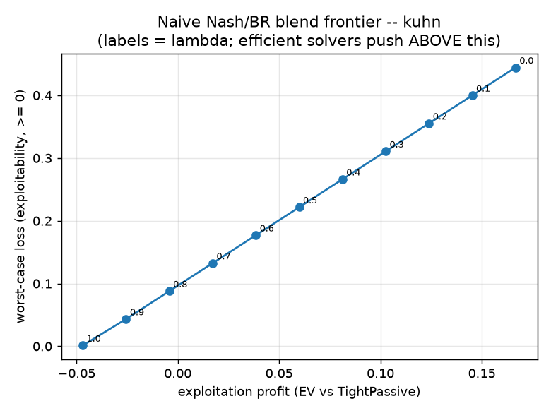

<!--
OFFICIAL PhD TITLE (keep consistent across all documents):
EN: Research on the possibilities for applying Artificial Intelligence in computer games
BG: Изследване на възможностите за приложение на изкуствения интелект в компютърни игри
-->
---
title: "Step 8 Summary — Safe Exploitation in Imperfect-Information Games"
subtitle: "Research on the possibilities for applying Artificial Intelligence in computer games"
author: "Alexander Andreev"
date: "July 2026"
lang: en
vars:
  research_focus: "Adaptive Strategy Learning in Multi-Agent Imperfect-Information Environments"
---

# Step 8 — Safe Exploitation in Imperfect-Information Games

This is a ground-up chapter on *safe* opponent exploitation: the problem, the mathematics, the
family of methods, and a set of controlled experiments run on two small poker games. It serves
two purposes — a self-contained refresher while later steps build on it, and a primary source
for the Part-1 thesis synthesis. It is written to be read on its own; no prior familiarity with
the project's code is assumed. All experimental numbers reported here were **measured** on
reproducible runs of the two testbeds (Kuhn Poker and Leduc Hold'em) and are bounded, wherever
possible, by *exact* analytical references rather than simulated ones. Where a run contradicted
what theory led me to expect, I say so and reconcile it — those gaps are the most instructive
parts of the step.

**Where this sits in the thesis.** Step 7 built a **sensor**: a model that watches how a
specific opponent plays and estimates their strategy. It also exposed the danger of acting on
that sensor naively — a confident-but-underfit model, best-responded to, can open a hole in your
own play (on Leduc it actually *lost* to an unexploitable Nash opponent). Step 8 builds the
**actuator**: the mechanism that turns a model into profit **without becoming exploitable**. That
actuator is the second half of the thesis's Behavioral Adaptation Framework (Contribution #1),
and pinning down *exactly where its guarantees depend on the two-player zero-sum assumption* is
the launch point for the multi-agent extension (Contribution #2).

---

## 1. Why Safe Exploitation — the other half of the dial

A **Nash equilibrium** strategy is built never to lose in the long run. In a two-player
zero-sum game that guarantee is exact: the strategy has a fixed *value* `v*`, and no opponent,
however clever, can push you below it. Opponent modeling (Step 7) buys you the ability to
*deviate* from that safe strategy to punish a specific opponent's mistakes. The obvious way to
cash a model in is to compute the **best response** to it and play that. The trouble is that a
best response is usually **wildly exploitable itself**: to punish "you always fold to a bet" it
stops bluffing certain hands entirely, and a smarter opponent — or the same opponent, done
pretending — walks straight through the hole it opened.

Picture a **dial**. Turn it all the way to *safety* and you play Nash: unbeatable, but you never
punish a weak opponent. Turn it all the way to *exploitation* and you best-respond hard to your
current read: maximum profit **if** the read is right and the opponent stays put, but a gaping
hole if you are wrong, your sample was small, or you were being *sandbagged* (deliberately fed a
weak style to bait a big deviation). **Safe exploitation** bolts a *governor* onto that dial:
lean toward exploitation as far as you like, but never past the point where a worst-case
adversary could drag you below your safe baseline.


The reason this is not paranoia is a number from Step 7 and again from this step: the full best
response to the tight "Rock" style on Kuhn earns **+0.167 per hand**, but its **worst-case value
is −0.5** — an adversary who best-responds back can take half a chip a hand off it. Nash's
worst-case, by contrast, is the game value itself. Safe exploitation is the discipline of keeping
most of that +0.167 upside while refusing the −0.5 downside.

**What "safe" means, informally.** Your *expected value over the match* must never fall below a
chosen floor, **no matter what the opponent does**. It is a statement about the worst case, not
about any single hand — you will still lose hands; the guarantee is on the long-run adversarial
average. The whole design question of the step is *which floor*, and how to compute a strategy
that respects it while extracting as much as possible above it.

> **Read more:** Ganzfried, S. & Sandholm, T. (2015). "Safe Opponent Exploitation." *ACM Trans. Economics and Computation* — the paper that first made "exploit but never lose to the baseline" a theorem.

---

## 2. Exploitation as Constrained Optimization

The single most useful idea in this step is that **every safe-exploitation method is the same
optimization problem** with one part swapped out. In words:

> maximize the hero's expected value against the opponent model, **subject to** a safety floor on
> the hero's worst-case value.

To make that a *computable* program, represent the hero's strategy in **sequence form**: instead
of per-situation action probabilities, use the **realization plan** $x$, which assigns a weight
to each of the hero's action *sequences* (root-to-here chains of their own choices), subject to
the linear **treeplex** constraints (the empty sequence has weight 1; at each information set the
children's weights sum to the parent's; all weights are non-negative). The reason to pay this
change-of-variables tax is decisive: against a **fixed** opponent policy, the hero's expected
value is **linear** in $x$,

$$
\text{EV}(x) \;=\; \sum_{\text{terminals } z} \big[\text{chance}(z)\cdot \text{opp-reach}(z)\cdot u_{\text{hero}}(z)\big]\, x_{\,\text{seq}(z)} \;=\; c \cdot x,
$$

because the hero's own action-probability product along any line *is* $x$ at that line's
sequence. So "maximize EV against the model" is a **linear objective** $c\cdot x$, the treeplex
is a set of **linear constraints**, and the whole method is a **linear program**. A full best
response is simply $\max_x c\cdot x$ over the treeplex — which lets us cross-check the LP against
Step 7's exact best-response code (they agree to $10^{-6}$).

The safety floor is a constraint on the **worst-case** value — "for *every* opponent $\sigma'$,
$\text{EV}(x,\sigma') \ge \text{floor}$." That inner "for every opponent" is itself a
best-response (a minimax), so we do not write it out as one giant bilinear program; we solve it by
**constraint generation** (a double-oracle / cutting-plane loop): solve the LP, read the hero
policy, call an **exact best response as the worst-case oracle**, and if the worst case is below
the floor, add the single linear cut it implies and re-solve. This is finite (there are finitely
many pure best responses), transparent, and debuggable.


The pay-off of seeing it this way is conceptual economy: **five methods, one engine.** They
differ only in the floor, which is the subject of the next section. And because both the
objective (the payoff vector) and the safety oracle reuse Step 7's *validated* best-response
code, the whole of Step 8 rests on one already-trusted primitive rather than a new pile of
math.

> **Read more:** Shoham, Y. & Leyton-Brown, K. (2008). *Multiagent Systems*, §3.4 (computing equilibria) and §4.6 (computing best responses) — the sequence-form machinery underneath every LP in this chapter.

---

## 3. What "Safe" Means — three definitions, in increasing realism

"Safety" sounds absolute, but it is not one thing. Three definitions matter, and the line of
research is essentially a *weakening* of the demand to make it achievable in practice.

**(a) Ganzfried safety (2015): never earn less than the game value.** With a *perfect* Nash
equilibrium $\sigma^*$ as baseline, require

$$
\text{EV}(x,\sigma') \;\ge\; v^* \qquad \text{for all opponents } \sigma'.
$$

This is the strongest and cleanest notion. Its proof rests on the **minimax theorem**: in a
two-player zero-sum game a Nash strategy *guarantees* the value $v^*$ against any opponent, so
one can deviate toward exploiting the model within the "slack" the opponent's mistakes create
(their *gifts*) and never fall below $v^*$. The catch is the premise: a *perfect* Nash
equilibrium, which is uncomputable in any large game.

**(b) Prime-safe / ε-safety (Jeary & Turrini 2023): correct for an imperfect baseline.** Every
real baseline is an **ε-equilibrium** (from abstraction and finite compute — the subject of
Step 4), so it is itself exploitable by some amount $\varepsilon$. Anchoring to the exact $v^*$
is then unjustified; prime-safe lowers the floor by exactly the baseline's own exploitability,

$$
\text{floor} \;=\; v^* - \varepsilon, \qquad \varepsilon = \text{exploitability(baseline)} \ge 0,
$$

i.e. "never earn less than the worst case of the strategy you were going to play anyway." The
$\varepsilon$ must be **measured**, not assumed — a point the experiments take literally.

**(c) Adaptation safety (Ge et al. 2024): be no more exploitable than your blueprint.** The most
practical notion. An exploiting strategy is *adaptation-safe* iff

$$
\text{exploitability}(x) \;\le\; \text{exploitability(blueprint)} \quad\Longleftrightarrow\quad \text{worst-case}(x) \ge \text{worst-case(blueprint)}.
$$

Because the blueprint is already $\varepsilon$-exploitable, this is strictly weaker than
Ganzfried's absolute floor (weaker by exactly $\varepsilon$), and therefore *achievable* where
strict safety is not. Its danger is the mirror image: if the blueprint is *terrible*, "no worse
than the blueprint" is trivially satisfied by almost anything — so adaptation safety is only
meaningful with a reasonable baseline (an open requirement I flag rather than resolve).

| Safety notion | Informal floor | Needs | Weakness |
|---|---|---|---|
| Ganzfried (2015) | $\ge v^*$ | a *perfect* Nash baseline | perfect Nash is uncomputable at scale |
| Prime-safe (2023) | $\ge v^* - \varepsilon$ | the baseline's measured exploitability | you must measure $\varepsilon$ honestly |
| Adaptation (2024) | $\le$ blueprint exploitability | any blueprint | vacuous if the blueprint is bad |

### Where the two-player zero-sum assumption hides — the thesis attack point

Every floor above rests on one fact: **in a two-player zero-sum game, a Nash strategy secures the
value $v^*$ against any opponent** ($\min_{\sigma'}\text{EV}(\sigma^*,\sigma') = v^*$). That is
what makes "deviate toward the model but never below the floor" a coherent, enforceable
constraint, and it comes straight from the minimax theorem. In an **$N>2$-player** game this
collapses: a Nash strategy does *not* guarantee a fixed value against arbitrary opponents (the
others can coordinate, and their payoffs no longer sum to the negative of yours), so there is no
single $v^*$ to anchor to. **That is the open problem for Contribution #2** — whether an
$N$-player analogue of the value guarantee exists, or whether a structural assumption (e.g. a
coalition structure) must restore an anchor. This step does not solve it; it makes the failure
*precise*, which is exactly what a thesis chapter needs.

> **Read more:** Johanson, M., Zinkevich, M. & Bowling, M. (2007). "Computing Robust Counter-Strategies." *NeurIPS* — Restricted Nash Response, the tunable ancestor of all of the above. · Jeary, J. & Turrini, P. (2023). "Safe Opponent Exploitation for ε-Equilibrium Strategies," *arXiv:2307.12338*. · Ge, Z. et al. (2024). "Safe and Robust Subgame Exploitation…," *ICML*.

---

## 4. The Engine — sequence-form LP and constraint generation

This section is the "how it is built." The one primitive the whole step adds is a
`HeroTreeplex` that (i) enumerates the hero's sequences and treeplex constraints (reusing Step
7's sequence-form code), (ii) builds the payoff vector $c$ for a fixed opponent by one tree
traversal, and (iii) solves the safety-constrained LP with SciPy's HiGHS solver. Everything else
is the constraint-generation loop, which is short enough to state in full:

```text
c_model <- payoff vector of EV vs the opponent model      # linear objective
cuts    <- {}                                             # discovered safety cuts
repeat:
    x   <- argmax  c_model . x   s.t.  treeplex(x)  and  all cuts        # one LP solve
    pol <- behavioral strategy read out of x
    wc  <- worst_case_value(pol)          # = -(opponent's exact best response) : the oracle
    if wc >= floor - tol:  return pol      # safe: done
    adv <- opponent's exact best response to pol
    add the cut  c(adv) . x >= floor - slack   to cuts     # a valid lower bound on the worst case
```

Each generated cut is the payoff vector against a *specific* adversary best response; it is a
valid linear lower bound on the true worst case, so adding cuts monotonically tightens the
relaxed safety constraint toward the real one. Reading a behavioral policy back out of a
realization plan $x$ is the ratio $\beta(I,a) = x_{Ia}/x_{\text{seq}(I)}$ (uniform where the
parent weight is ~0).

The **only** things that change between the five methods are the `floor` and, for the subgame
method (§7), a set of *pins* that hold the hero's play outside a chosen subgame equal to the
blueprint. Ganzfried passes `floor = v*`; prime-safe passes `floor = v* − ε`; adaptation passes
`floor = worst_case(blueprint)`; RNR reformulates the objective as a max-min in a parameter $p$
(§5).

**One practical wrinkle worth recording** (it cost real debugging on the runs): an *approximate*
Nash's self-play value can sit a hair **above** the game's true achievable max-min, so requiring
the exact `wc ≥ floor` can make the LP eventually infeasible and, on an unlucky cut path, return
an *unsafe* strategy. The fix is a small feasibility slack on the cuts (`floor − slack`, with
`slack ≈ 5·10⁻⁴`, kept independent of the convergence tolerance) so the true max-min strategy
always stays feasible. This is the kind of numerical detail that never appears in the papers but
decides whether the method actually returns a safe strategy.

> **Read more:** the constraint-generation / double-oracle idea traces to McMahan, Gordon & Blum (2003), "Planning in the Presence of Cost Functions Controlled by an Adversary," *ICML* — the general recipe for "optimize against a worst case you discover as you go."

---

## 5. Restricted Nash Response and the Bang-Bang Frontier

The oldest principled method, **Restricted Nash Response** (Johanson 2007), is the conceptual
ancestor of all the rest and introduces the *tunable knob*. Its idea: compute the hero's
equilibrium against a **$p$-restricted** opponent — one forced to play the fixed model with
probability $p$ and free to play adversarially with probability $1-p$. Sweeping $p$ from 0 to 1
traces a path from Nash ($p=0$) to full best response ($p=1$). Because the free component
best-responds to the hero, RNR is a **max-min**:

$$
\text{RNR}(p) \;=\; \arg\max_x \Big[\, p \cdot \text{EV}(x,\text{model}) \;+\; (1-p)\cdot \min_{\sigma'} \text{EV}(x,\sigma') \,\Big],
$$

which we solve with the same cutting-plane machinery plus an auxiliary worst-case variable.

**A flag worth keeping.** The project's own step notes originally described RNR as a *naive
behavioral blend*, $(1-p)\cdot\text{Nash} + p\cdot\text{BR}$. That is a fine intuition tool but
it is **not** Johanson's algorithm; we implemented *both* and labelled them, because on a small
game they behave completely differently. The naive blend traces a smooth line (Figure below,
left): profit and exploitability rise together, near-proportionally, from Nash to full BR.



**The measured surprise — canonical RNR is bang-bang.** I predicted the canonical sweep would be
a smooth, monotone frontier that dominates the blend everywhere. It is not. On Kuhn versus the
Rock, canonical RNR returns the **same safe strategy** for all $p \in [0, 0.6]$ (EV $-0.044$,
exploitability $\approx 0$) and then **jumps straight to the full best response** at $p \approx
0.7$ (EV $+0.167$, exploitability $0.444$). There are no intermediate points.

| $p$ | canonical RNR — EV | canonical — exploitability | naive blend — EV | naive — exploitability |
|---:|---:|---:|---:|---:|
| 0.0 | −0.044 | ~0.000 | −0.047 | 0.000 |
| 0.3 | −0.044 | ~0.000 | +0.017 | 0.133 |
| 0.6 | −0.044 | ~0.000 | +0.081 | 0.266 |
| **0.7** | **+0.167** | **0.444** | +0.103 | 0.311 |
| 1.0 | +0.167 | 0.444 | +0.167 | 0.444 |


*Why (I checked before trusting the story).* The RNR objective is **linear** in $x$ over a
**polytope**, so its optimum is a **vertex** and switches vertices only when $p$ crosses a
critical ratio. Kuhn's strategy polytope is tiny — few vertices — so the transition is a single
jump. Johanson's smooth curve is a *large-game* phenomenon (many vertices), or comes from the
*data-biased* variant that makes $p$ per-information-set. The naive blend looks smooth only
because it linearly interpolates two fixed strategies — and it is **dominated at the safe
corner** (at exploitability $\approx 0$ the LP methods reach EV $-0.044$ versus the blend's
$-0.047$). The headline lesson survives — "choose *where* to deviate, not *how much*
uniformly" — but the mechanism ("a smooth RNR dial") is a big-game artifact, and in a small game
the honest picture is a discrete safe-vertex → BR-vertex switch whose threshold *moves with how
exploitable the opponent is*. That last point recurs in §6: against a very exploitable opponent,
even $p = 0.5$ is already past the jump.

> **Read more:** Johanson, M. & Bowling, M. (2009). "Data Biased Robust Counter Strategies." *AISTATS* — makes the $p$ knob depend on how much data supports each part of the strategy, which is what smooths the frontier in practice.

---

## 6. Ganzfried on Kuhn — safe *and* profitable (the core result)

The central experiment solves each method against a *perfect* model of each opponent type and
scores it on **profit** (EV vs that opponent) and **safety** (worst-case value), with the Nash
floor at $v^* = -0.056$ (Kuhn's known first-player value, $\approx -1/18$). All numbers are
exact (full-tree), from the scale run.

| Opponent | metric | nash | full_br | rnr_0.5 | **ganzfried** | prime_safe | adaptation |
|---|---|---:|---:|---:|---:|---:|---:|
| **Rock** (TightPassive) | EV | −0.047 | **+0.167** | −0.044 | −0.044 | −0.040 | −0.040 |
| | worst-case | −0.056 | **−0.500** | −0.056 | −0.056 | −0.063 | −0.063 |
| **Maniac** (LooseAggr.) | EV | +0.118 | +0.333 | +0.278 | **+0.131** | +0.151 | +0.151 |
| | worst-case | −0.056 | −0.167 | −0.111 | −0.056 | −0.063 | −0.063 |
| **AlwaysBet** | EV | +0.113 | +0.333 | +0.333 | **+0.115** | +0.131 | +0.131 |
| | worst-case | −0.056 | −0.167 | −0.167 | −0.056 | −0.063 | −0.063 |
| **AlwaysPass** (most exploitable) | EV | +0.146 | **+0.975** | +0.975 | **+0.222** | +0.266 | +0.266 |
| | worst-case | −0.056 | −0.500 | −0.333 | −0.056 | −0.063 | −0.063 |
| **Nash** (control) | EV | −0.056 | −0.055 | −0.056 | −0.056 | −0.055 | −0.055 |
| | worst-case | −0.056 | −0.333 | −0.056 | −0.056 | −0.063 | −0.063 |


Three results carry the chapter.

1. **The full best response is the cautionary tale.** It always wins the most against a fixed
   model — up to **+0.975** against `AlwaysPass` — but its worst-case collapses to **−0.5**. It is
   the single unsafe method in the table, and it is unsafe against *every* opponent, because an
   adversary can always best-respond back to the hole it opens.
2. **Ganzfried is the safe-and-profitable sweet spot.** Against *every* opponent its worst-case
   stays at the Nash floor (safe within $10^{-3}$) **and** it beats Nash's own EV on every
   exploitable type — most vividly **+0.222 versus Nash's +0.146** against `AlwaysPass`, and
   +0.131 versus +0.118 against the Maniac. This is the result the step exists to produce: *you
   can exploit meaningfully while provably never dropping below equilibrium value.*
3. **A single global $p$ is not a safety setting.** `rnr_0.5` is safe against the Rock but has
   *already jumped* to the full best response against the highly exploitable `AlwaysPass` /
   `AlwaysBet` (identical EV to `full_br`, worst-case −0.33 / −0.17, unsafe). This is the §5
   bang-bang threshold moving with opponent exploitability — and the concrete reason Ganzfried,
   which constrains the *value* rather than a *knob*, is the better primitive.

**Prime-safe and adaptation spend a measured ε-budget.** They lower the floor from $v^*$ to
$v^* - \varepsilon$, and the run *measured* the early-stopped-CFR baseline's exploitability at
$\varepsilon = 0.0074$; their worst-case comes out at $-0.063 = v^* - 0.008$ across every
opponent, matching the ε-adjusted floor. Spending that budget, they earn a little more than
Ganzfried (+0.266 versus +0.222 on `AlwaysPass`). They appear "unsafe" in the table only because
the flag compares to $v^*$; against their *own* floor they are safe by construction. (Prime-safe
and adaptation coincide here because, for this baseline, $v^* - \varepsilon =
\text{worst-case(blueprint)}$ — the two floors are literally equal, which the run confirms rather
than a bug.)

> **A measurement-resolution note, because it bit me.** In the *smoke* run (30 000 CFR
> iterations) even the Nash policy is flagged "unsafe" — its worst-case is $-0.0568$, i.e.
> $0.0013$ below the exact $v^*$, just over the $10^{-3}$ tolerance. That is pure CFR
> approximation error, not a safety failure: at scale (200 000 iterations) the shortfall drops to
> $3\times10^{-4}$ and Nash is correctly flagged safe. The lesson for the harness is that the
> safe-flag tolerance must exceed the baseline's own approximation error, or the baseline trips
> its own test.

> **Read more:** Ganzfried, S. & Sandholm, T. (2015), *op. cit.* — Theorem 1 is exactly the
> guarantee this table exhibits on Kuhn (worst-case $\ge v^*$), and its minimax step is the
> 2-player-zero-sum dependency of §3.

---

## 7. Real-Time Safety — subgame gadgets (SES)

Ganzfried's guarantee is *global*: the safety constraint is enforced over the **whole** game
tree. That is fine on Kuhn, but in a real game you cannot re-solve the entire tree every time the
model updates. The **Safe Exploitation Search** idea (Liu et al. 2022) makes safety a **local**
property of a single **subgame**: play the Nash blueprint everywhere, but at a chosen subgame
re-optimize the hero's play to exploit the model — with a **gadget** that guarantees the local
deviation can never make the hero worse off *globally* than the blueprint.

In sequence form the gadget is realized directly on the treeplex: **pin** every hero sequence
*outside* the subgame to its blueprint realization weight (so the hero plays the blueprint
everywhere except the subgame), and set the safety floor to the blueprint's own worst-case
value. Because "play the blueprint inside the subgame too" is always feasible and attains exactly
that floor, the LP can only do at least as well — the local exploit is safe by construction. The
one requirement is that the subgame be **downward-closed** (once you are in it you stay in it),
which holds for natural choices like "Leduc round 2" or "after a King flops."


The importance of "local" is not aesthetic; §8 shows it is the difference between a solve that
converges and one that does not.

> **Read more:** Liu, W. et al. (2022). "Safe Opponent-Exploitation Subgame Refinement." *NeurIPS* (the gadget). · Ge, Z. et al. (2024), *op. cit.* — OX-Search bounds exploitation loss *per information set*, hardening the same idea against "teaching" attacks. · Milec, D., Kovařík, V. & Lisý, V. (2025). "Adapting Beyond the Depth Limit," *arXiv:2501.10464* — using opponent-model information *past* the search horizon.

---

## 8. At Scale — Kuhn works; Leduc breaks globally, holds locally

Leduc Hold'em adds a second betting round and a shared community card — roughly two orders of
magnitude more situations than Kuhn, still exactly solvable, but large enough to stress the
methods. The Leduc run used an iteration-capped configuration (a 40-iteration budget on the
constraint-generation loop, tolerance $10^{-2}$, and the subgame set to the King-flop), recording
for each cell whether the solve **converged** or hit the cap. Game value $v^* = -0.086$.

| Opponent | metric | nash | full_br | **ses_subgame** | ganzfried | prime_safe / adaptation |
|---|---|---:|---:|---:|---:|---:|
| **Rock** | EV | +0.201 | +0.937 | **+0.247** | +0.624 | +0.635 |
| | worst-case | −0.089 | −1.633 | **−0.130** | −0.838 | −0.744 |
| | converged? | ✓ | ✓ | **✓ (194 it)** | ✗ capped | ✗ capped |
| **Maniac** | EV | +0.438 | +2.177 | **+0.682** | +1.806 | +1.842 |
| | worst-case | −0.089 | −1.100 | **−0.130** | −0.638 | −0.657 |
| | converged? | ✓ | ✓ | **✓ (211 it)** | ✗ capped | ✗ capped |
| **CallingStation** | EV | +0.559 | +1.464 | **+0.663** | +1.342 | +1.363 |
| | worst-case | −0.089 | −1.000 | **−0.130** | −0.915 | −0.686 |
| | converged? | ✓ | ✓ | **✓ (350 it)** | ✗ capped | ✗ capped |
| **LoosePassive** | EV | +0.449 | +1.405 | +0.559 | +1.306 | +1.309 |
| | worst-case | −0.089 | **−4.200** | −0.133 | −1.239 | −1.334 |
| | converged? | ✓ | ✓ | ✗ (400 it) | ✗ capped | ✗ capped |

**The headline finding is negative and empirical: global safe-exploitation does not scale, even
to Leduc.** I predicted Ganzfried would be safe on Leduc as it is on Kuhn. Instead the **global**
solvers (`ganzfried`, `prime_safe`, `adaptation`, and `rnr_0.5`) all **hit the 40-iteration cap
without converging**, leaving worst-case values of **−0.64 to −1.33** — grossly unsafe. The
reason, which I confirmed rather than assumed: the cutting-plane loop adds one adversary cut per
iteration, and on Leduc's larger tree the set of relevant pure best responses is large, so 40
cuts nowhere near pin the true worst case; the master LP keeps returning optimistic-but-unsafe
strategies. This was flagged as the number-one "likely to break" item *before* the run, and it
broke exactly there.

**The positive half is the subgame method.** SES **converged** on three of four exploitable
opponents (194–350 iterations), because it re-solves only the small King-flop subgame with the
rest of the tree pinned — a far smaller LP with a far smaller adversary set. It extracts real
value (**+0.25 to +0.68** versus the weak types, beating Nash) at a worst-case of ≈ **−0.13**, an
order of magnitude closer to safe than the global methods. This is the *global-versus-local
safety* distinction of §7 appearing as a measured fact on a game as small as Leduc — the concrete
argument for real-time subgame methods and against a naive global solve.

*I keep myself honest on SES, though:* its residual exploitability (≈ 0.043) still exceeds the
0.01 tolerance, so it too is flagged unsafe, and on `LoosePassive` it ran the full 400 iterations
without converging. Whether that residual 0.04 is the gadget legitimately bounding to an
already-below-$v^*$ blueprint (Nash's own worst-case is −0.089, itself 0.003 below $v^*$), a
convergence-tolerance artifact, or a small leak in the outside-subgame pinning is the top item to
resolve before calling SES *provably* safe.

### The teaching attack — and why realized profit is the wrong lens

The last experiment is the deception stress test the whole safety machinery is meant to survive.
A deceptive opponent plays the weak Rock bait for 10 000 hands, then switches to a strong Nash
"reveal" for 10 000 more; a Step-7 model feeds each solver every 500 hands (5 seeds).

| method | mean/hand (all) | mean/hand (after switch) | safety violations / seed |
|---|---:|---:|---|
| full_br | **+0.051** | −0.061 | **40, 40, 40, 40, 40** |
| ganzfried | −0.048 | −0.055 | **0, 0, 0, 0, 0** |
| adaptation | −0.046 | −0.055 | 40, 40, 40, 40, 40 |
| nash | −0.051 | −0.061 | 0, 0, 0, 0, 0 |


The naive story — "the teaching attack punishes the greedy exploiter" — **did not hold in
realized profit**, and understanding why is instructive. The full best response ends *hugely
net-positive* (+0.051/hand overall): it banks a windfall during the bait phase and, because the
"reveal" is only a *Nash* opponent, that opponent claws back barely more than the game value per
hand, so the windfall is never repaid within 10 000 hands. The signal that *does* separate safe
from unsafe is the **exact worst-case / safety-violation count**: the full best response violated
the Nash floor at **40 of 40** refits, Ganzfried at **0 of 40**. A strategy's worst case is
realized by an opponent that *best-responds to it* — and a stationary Nash reveal simply is not
that adversary. The corrected takeaway, which I now believe is the right design lesson: **measure
safety by the worst case, not by realized profit against a benign opponent**; to punish the
greedy exploiter *in profit*, the reveal must be an adaptive counter-exploiter, not a fixed Nash.
(That `adaptation` shows 40 violations while `nash` shows 0 is not a bug either: adaptation
deliberately targets a floor *below* $v^*$, so it trips the $v^*$-referenced counter by design.)

---

## 9. Connections and Forward Pointers

**What this step establishes.** Safe exploitation is one idea — *maximize value against the
model subject to a safety floor* — and on a fully solvable game it works exactly as the theory
says: Ganzfried is safe against every opponent while beating equilibrium value on every
exploitable one, where the naive best response earns more but is ruinously exploitable. Prime-safe
and adaptation extend the guarantee to the imperfect baselines any real system has, by spending a
*measured* ε-budget below the game value. But the step's most valuable result is negative and
empirical: on a game as small as Leduc the *global* safe-exploitation solve does not converge
within a practical budget, while the *local* subgame method does — the theory-to-practice gap
between global and local safety, measured rather than asserted.

**Backward connections.** This step is the exact complement of the equilibrium and opponent-
modeling work before it. Step 7's sensor produces the opponent model that becomes this step's
*objective*; Step 7's exact best response becomes this step's *worst-case oracle*; and the
sequence-form representation from the CFR and consistency work becomes the *variable* the LP
optimizes. The continuous model's self-inflicted leak against Nash on Leduc (Step 7, §7) is the
empirical motivation that this step's safety floor is designed to prevent — and, indeed, Ganzfried
never leaks to Nash here.

**Forward to the thesis.** The Kuhn results confirm the actuator is sound; the Leduc
non-convergence is the concrete argument for the two scalable paths the thesis must choose
between — an **exact one-shot dual LP** for the worst-case constraint, or a commitment to
**local / subgame** safety (SES, OX-Search) as the real-time mechanism. Either way, the safety
floor is what turns Step 7's fragile sensor into a deployable adaptive agent.

**Open questions carried forward.**

- *Scalable safety.* Replace the cutting-plane loop with an exact dual LP, or adopt subgame
  safety wholesale; confirm whether the Leduc global solvers are merely *slow* or *structurally*
  stuck by re-running with a large budget.
- *The SES gadget's residual exploitability.* Determine whether the 0.04 gap over tolerance is a
  blueprint-bounding effect, a tolerance artifact, or a pinning leak — this decides whether the
  subgame method is provably or only approximately safe.
- *A punishing teaching attack.* Replace the Nash reveal with an adaptive counter-exploiter so
  realized profit corroborates the worst-case view, and a safe method can be shown to *out-earn*
  the greedy one under deception.
- *From two players to N.* Every guarantee here rests on the two-player zero-sum fact that a Nash
  strategy secures the value $v^*$ against any opponent — an anchor that vanishes for $N>2$.
  Finding an $N$-player analogue (or a structural substitute) is the open problem this step makes
  precise, and the heart of Contribution #2.

> **Read more:** Shoham, Y. & Leyton-Brown, K. (2008). *Multiagent Systems*, Ch. 7 "Learning and Teaching" — the repeated-game framing in which your actions both *exploit* and *teach* the opponent, which is exactly the tension the teaching attack (§8) probes and the multi-agent extension must confront.
