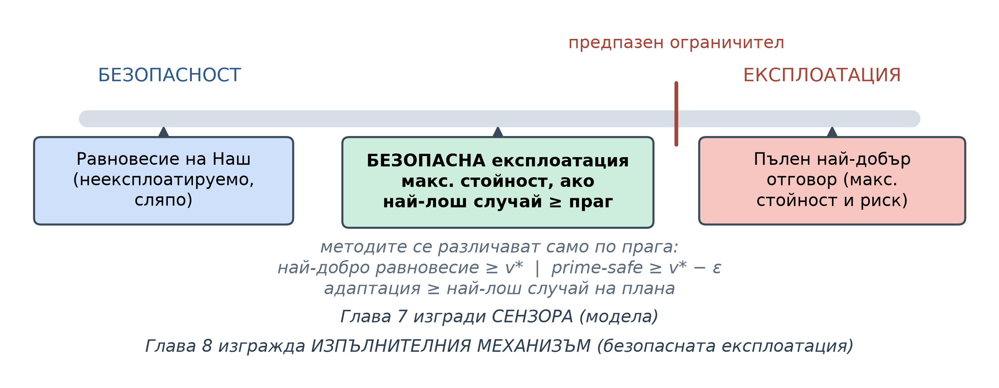
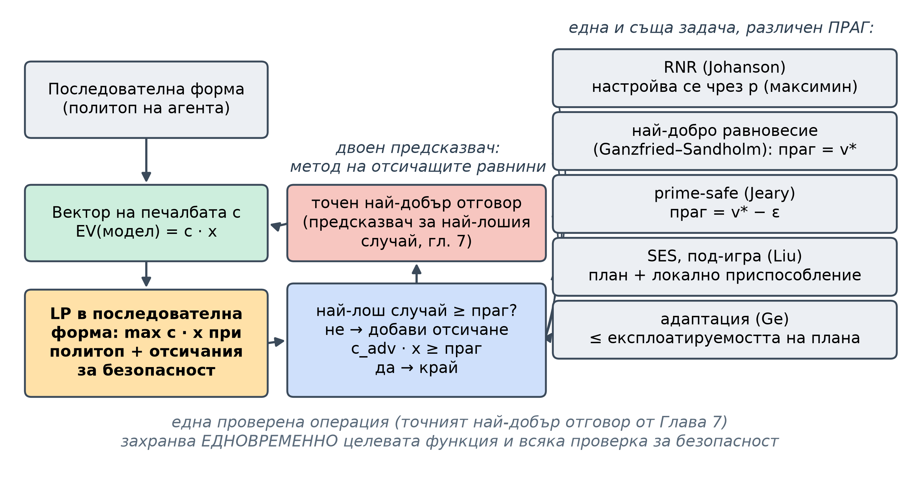
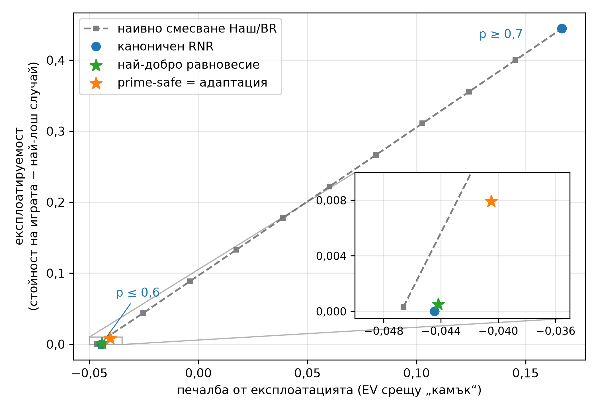
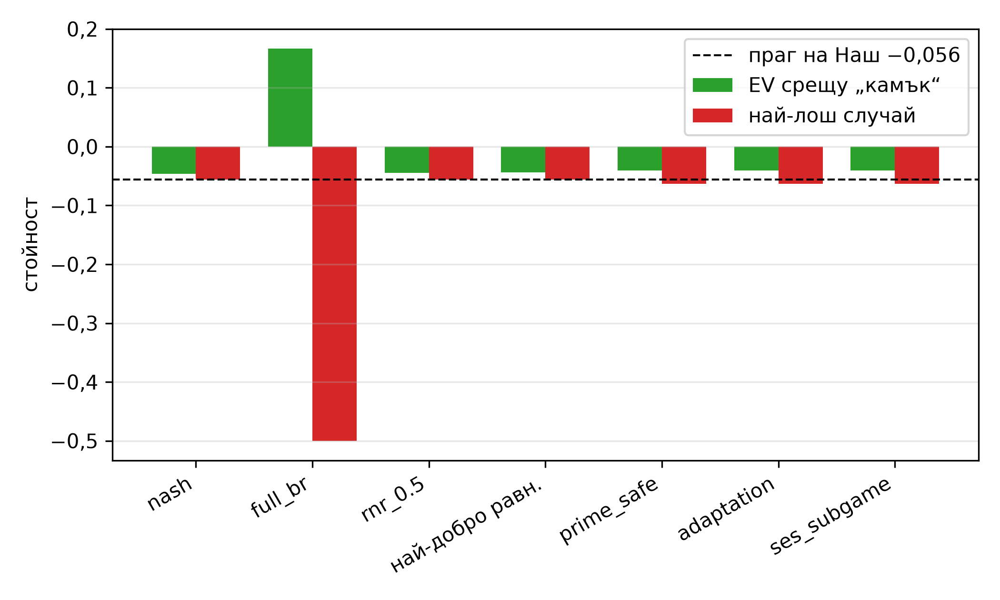
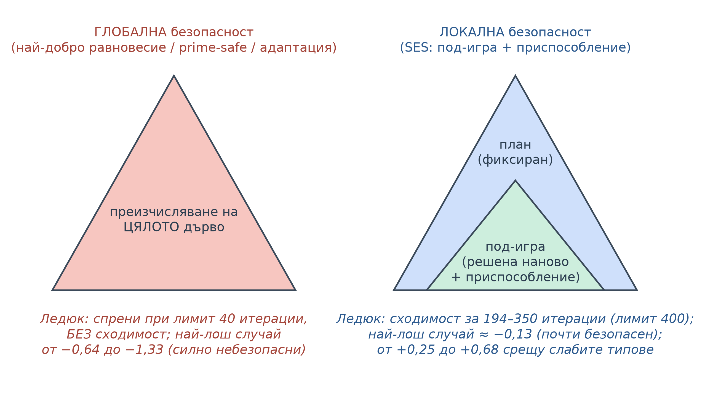
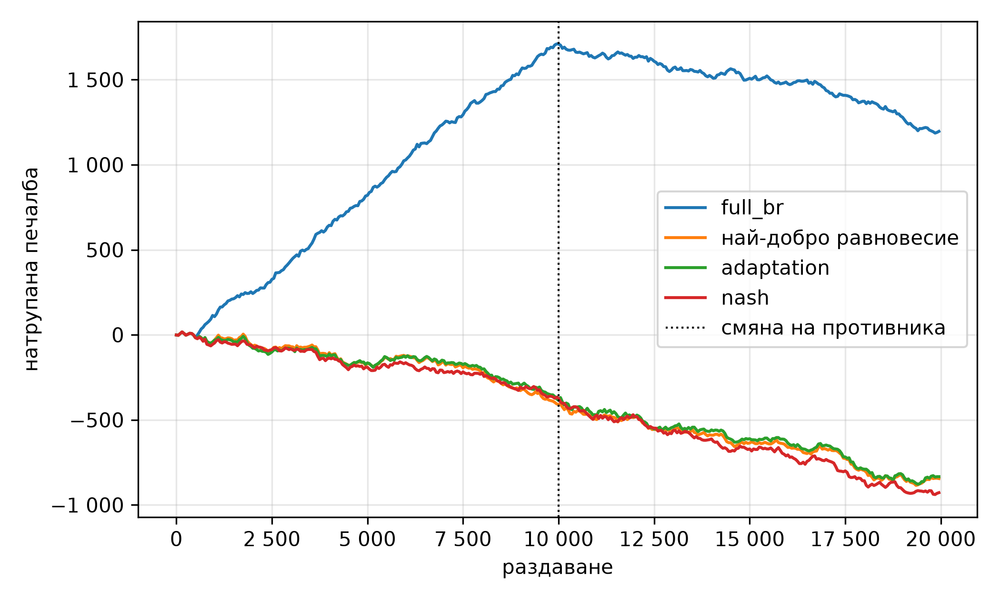

<!--
OFFICIAL PhD TITLE (keep consistent across all documents):
EN: Research on the possibilities for applying Artificial Intelligence in computer games
BG: Изследване на възможностите за приложение на изкуствения интелект в компютърни игри
-->

---
title: "Глава 8 Обобщение – Безопасна експлоатация в игри с непълна информация"
subtitle: "Изследване върху възможностите за прилагане на изкуствен интелект в компютърните игри"
author: "Alexander Andreev"
date: "July 2026"
lang: bg
vars:
  research_focus: "Adaptive Strategy Learning in Multi-Agent Imperfect-Information Environments"
---

# Глава 8 – Безопасна експлоатация в игри с непълна информация

Тази глава въвежда *безопасната* експлоатация на противника: формулировката на проблема, математическият апарат, семейството от методи и контролирани експерименти върху Кун покер и Ледюк Холдем. Всички числа са **измерени** при възпроизводими изпълнения и където е възможно, са поставени в *точни* аналитични граници. Когато резултатът противоречи на онова, което теорията ме е карала да очаквам, казвам го изрично и обяснявам разминаването.

**Къде се вписва това в дисертацията.** Глава 7 изгради **сензор**: модел, който оценява стратегията на конкретен противник. Глава 8 изгражда **изпълнителен механизъм**: механизма, който превръща модел в печалба, **без да става експлоатируем**. Той е втората половина на рамката за поведенческа адаптация (принос №1), а определянето *точно къде неговите гаранции зависят от предположението за игра с нулева сума за двама играчи* е отправната точка за многоагентното разширение (принос №2).

---

## Защо безопасната експлоатация – другата половина на скалата

Стратегия в **равновесие на Наш** е изградена така, че никога да не губи в дългосрочен план: в игра с нулева сума за двама играчи тя има фиксирана *стойност* `v*` и никой противник не може да ви свали под нея. Моделирането на противника (Глава 7) ви дава възможността да се *отклоните* от тази безопасна стратегия, за да накажете грешките на конкретен противник. Очевидният начин да реализирате печалба от модел е да играете **най-добър отговор** към него. Проблемът е, че най-добрият отговор обикновено сам по себе си е **силно експлоатируем**: за да накаже „винаги се отказваш при залог“, той напълно спира да блъфира с определени карти, а по-умен противник – или същият противник, след като спре да се преструва – минава право през отворения пробив.

Представете си **скала**. Докрай към *безопасност* е равновесието на Наш: непобедимо, но без да наказва слаб противник. Докрай към *експлоатация* е чист най-добър отговор на текущата ви преценка: максимална печалба, **ако** преценката е вярна, но сериозен риск, ако грешите, извадката ви е малка или противникът нарочно ви е подвел (показвал ви е слаб стил, за да ви примами към голямо отклонение). **Безопасната експлоатация** поставя *ограничител* върху тази скала: можете да се наклоните към експлоатацията колкото желаете, но никога не бива да минавате отвъд точката, в която най-неблагоприятният противник може да ви свали под вашата безопасна базова линия.

Това не е прекомерна предпазливост: пълният най-добър отговор на стегнатия стил Rock в Кун носи **+0,167 на раздаване**, но стойността му в най-лошия случай е **−0,5** – противник, който на свой ред играе най-добър отговор срещу него, може да му взема по половин жетон на раздаване, докато стойността в най-лошия случай при равновесие на Наш е самата стойност на играта. Безопасната експлоатация взема от този потенциал толкова, колкото позволяват грешките на противника, без да се поема рискът от −0,5.

**Какво означава „безопасен“ в неформален план.** Вашата *очаквана стойност за целия мач* никога не бива да пада под избран праг, **независимо какво прави противникът**. Целият въпрос на дизайна в тази глава е *какъв праг* да бъде избран и как да се извлече възможно най-много над него.[^ganzfried2015]

---

## Експлоатацията като оптимизация с ограничения

Най-полезната идея в тази глава е, че **всеки метод за безопасна експлоатация е една и съща оптимизационна задача**, в която се сменя само една част:

> максимизиране на очакваната стойност на собствения агент спрямо модела на противника **при ограничение**: стойността му в най-лошия случай да не пада под прага на безопасност.

За да се превърне това в *изчислима* задача, представете стратегията на агента в **последователната форма** от раздел 7.5: **планът за реализация** $x$ присвоява тегло на всяка от последователностите от действия на агента, подчинени на линейните ограничения на **дървовидния политоп** (treeplex). Тогава срещу **фиксирана** стратегия на противника очакваната стойност на агента е **линейна** по $x$,

$$
\text{EV}(x) \;=\; \sum_{z \in Z} \big[\pi_c(z)\cdot \pi_{-h}(z)\cdot u_h(z)\big]\, x_{\,\text{seq}(z)} \;=\; c \cdot x,
$$

където $Z$ са крайните състояния, $\pi_c(z)$ е вероятността на случайните ходове, $\pi_{-h}(z)$ – вероятността на ходовете на противника, а $u_h(z)$ – печалбата на агента. Така „максимизиране на очакваната стойност спрямо модела“ е **линейна целева функция** $c\cdot x$ при линейни ограничения, а целият метод е **задача на линейното програмиране (LP)**. Пълният най-добър отговор е просто $\max_x c\cdot x$ върху дървовидния политоп – което ни позволява да проверим LP-задачата спрямо кода за точен най-добър отговор от Глава 7 (те съвпадат до $10^{-6}$).

Прагът на безопасност – „за *всеки* противник $\sigma'$, $\text{EV}(x,\sigma') \ge \text{праг}$“ – съдържа вътрешна задача за най-добър отговор (минимакс), поради което вместо една гигантска билинейна задача използваме **генериране на ограничения** (метод на двойния предсказвач / метод на отсичащите равнини): решаваме LP-задачата, извикваме **точния най-добър отговор като предсказвач за най-лошия случай** и ако стойността в най-лошия случай е под прага, добавяме единственото линейно отсичащо ограничение, което той поражда, и решаваме отново. Процедурата е крайна (съществува краен брой чисти най-добри отговори), прозрачна и лесна за отстраняване на грешки.

Ползата е **пет метода, един двигател**: те се различават единствено по прага и всички се опират на *проверения* код за най-добър отговор от Глава 7.[^shoham2008]

---

## Какво означава „безопасен“ – три определения с нарастваща степен на реализъм

„Безопасността“ звучи като абсолютна характеристика, но всъщност не е еднозначна. От значение са три различни определения, а изследователската линия по същество представлява *отслабване* на изискването, за да стане то приложимо в практиката.

**(а) Безопасност по Ganzfried и Sandholm (2015): никога да не се печели по-малко от стойността на играта.** Определението им се отнася до повтарящата се игра: средно поне $v^*$ на раздаване, каквото и да прави противникът. Тук то се налага на стратегията за всяко отделно раздаване, с точно равновесие на Наш $\sigma^*$ като базова линия:

$$
\text{EV}(x,\sigma') \;\ge\; v^* \qquad \text{за всеки противник } \sigma'.
$$

Това е най-силното и най-чистото понятие и се опира на **теоремата за минимакса**. На прага за всяко отделно раздаване обаче отговарят само равновесните стратегии, затова методът избира онази равновесна стратегия, която печели най-много срещу модела (вариантът „най-добро равновесие“ при Ganzfried и Sandholm; по-нататък методът се нарича **най-доброто равновесие**, в кода `ganzfried`). Уловката е в предпоставката: нужно е точно равновесие на Наш, а то е практически неизчислимо във всяка голяма игра.

*Какво биха добавили пълните алгоритми.* Техният алгоритъм RWYWE (Risk What You've Won in Expectation – „рискувай средно спечеленото дотук“) понижава прага при всяко раздаване до $v^* - k_t$, където $k_t$ е средната стойност на натрупаните дотук *подаръци* (грешките на противника), а BEFFE играе най-доброто равновесие, докато натрупаните подаръци не покрият пълна експлоатация; и двата алгоритъма са доказуемо безопасни в повтарящата се игра. Глава 15 реализира RWYWE – естествения базов метод за двама играчи за Принос №2 – по протокола от Глава 14: печалбата му спрямо плана е +0,062 (Кун) и +0,113 (Ледюк) жетона на раздаване срещу +0,020 и +0,047 за най-доброто равновесие, а нито един от 120-те му мача при обучаващи атаки не завършва под стойността на играта. Това е само 14–30 % от печалбата на RNR при *p* = 0,5, защото малко подаръци могат да бъдат доказани, когато картите на противника се виждат само ако раздаването стигне до разкриване на картите.

**(б) Безопасност prime-safe (Jeary & Turrini 2023): корекция за несъвършена базова линия.** Всяка реална базова линия е **ε-равновесие** (поради абстракция и ограничени изчислителни ресурси, Глава 4), така че самата тя е експлоатируема в известна степен $\varepsilon$. Методът prime-safe понижава прага точно с експлоатируемостта на самата базова линия,

$$
\text{праг} \;=\; v^*-\varepsilon, \qquad \varepsilon = \text{експлоатируемост(базова линия)} \ge 0,
$$

т.е. „никога не печели по-малко от стойността в най-лошия случай на стратегията, която така или иначе щеше да играеш“. $\varepsilon$ трябва да бъде **измерена**, а не приета наготово – точка, която експериментите приемат буквално.

**(в) Безопасност на адаптацията (Ge и др. 2024): да не бъдеш по-експлоатируем от своя план (blueprint).** Най-практичното понятие. Една експлоатираща стратегия е *безопасна за адаптация*, ако и само ако

$$
\begin{aligned}
&\text{експлоатируемост}(x) \;\le\; \text{експлоатируемост(план)} \\
\Longleftrightarrow\quad &\text{най-лош случай}(x) \;\ge\; \text{най-лош случай(план)}.
\end{aligned}
$$

Това е по-слабо от абсолютния праг на Ganzfried и Sandholm (точно с $\varepsilon$) и следователно *постижимо* там, където строгата безопасност не е. Опасността му е огледален образ: ако планът е *ужасен*, почти всичко го удовлетворява, така че безопасността на адаптацията има смисъл само при разумна базова линия (отворено изискване, което отбелязвам, вместо да реша).

| Понятие за безопасност | Неформален праг | Изисква | Слабост |
|---|---|---|---|
| Ganzfried и Sandholm (2015) | $\ge v^*$ | *точно* равновесие на Наш като базова линия | точното равновесие на Наш е практически неизчислимо в големи игри |
| Prime-safe (2023) | $\ge v^* - \varepsilon$ | измерената експлоатируемост на базовата линия | трябва честно да измерите $\varepsilon$ |
| Адаптация (2024) | $\le$ експлоатируемостта на плана | произволен план | безсъдържателно, ако планът е лош |

: Три понятия за безопасност: прагът, който всяко гарантира, какво изисква и къде е слабо.

### Къде се крие предположението за игра с нулева сума за двама играчи – точката, от която тръгва дисертацията

Всеки от горните прагове се основава на един факт: **в игра с нулева сума за двама играчи равновесната стратегия на Наш гарантира стойността $v^*$ срещу всеки противник** ($\min_{\sigma'}\text{EV}(\sigma^*,\sigma') = v^*$). Именно това прави „отклонявай се към модела, но никога под прага“ последователно и приложимо ограничение, което произтича директно от теоремата за минимакса. В игра с $N>2$ играчи това се срива: равновесната стратегия на Наш *не* гарантира фиксирана стойност срещу произволни противници (печалбата на отделния противник вече не е равна на вашата със знак минус – в игра с нулева сума това важи само за сумата от печалбите на всички противници, – затова противниците могат да действат координирано срещу вас, а различните равновесия ви носят различни печалби), така че няма единна $v^*$, към която да се закотви. Равновесията в игри с повече от двама играчи не са „нито единствени, нито неексплоатируеми“.[^ge2025] Понятия за безопасност при $N$ играчи съществуват, но са или много консервативни (максиминната стойност срещу координирана коалиция[^celli2018]), или цел, която по принцип не може да бъде гарантирана (равният дял – справедливата част $C/n$ – доказано не може да бъде осигурен срещу противници с различни фиксирани стратегии[^ge2025]). **Това е отвореният проблем за Принос №2** – експлоатация на слаби противници в малки игри с $N$ играчи при ограничена загуба спрямо базова линия, включително срещу противници, действащи в сговор. Тази глава не го решава; тя прави провала *прецизен*.[^johanson2007][^jeary2023][^safe2024]

---

## Линейно програмиране в последователна форма и генериране на ограничения

Реализацията (`HeroTreeplex` върху кода в последователна форма от Глава 7, решавачът HiGHS на SciPy и пълният цикъл на генериране на ограничения) е описана в доклада. Всяко генерирано ограничение представлява вектора на печалбата спрямо *конкретен* най-добър отговор на противника – валидна линейна долна граница на истинския най-лош случай, поради което добавянето на ограничения монотонно затяга релаксираното ограничение за безопасност. Между методите се мени само прагът: най-доброто равновесие използва $v^*$, prime-safe – $v^* - \varepsilon$, адаптацията – стойността в най-лошия случай на плана, а RNR – максимин по параметъра $p$ (§ 8.5); методът на под-игра (§ 8.7) добавя *фиксирани тегла*, които задържат играта на агента извън под-играта такава, каквато е в плана.

**Една числова особеност решава безопасността.** Стойността, която *приблизителното* равновесие на Наш постига срещу самото себе си, може да бъде съвсем малко **над** истинската максиминна стойност на играта, така че изискването за точно `wc ≥ floor` може да направи LP-задачата недопустима (без допустимо решение) и, при неблагоприятна поредица от отсичащи ограничения, да върне *небезопасна* стратегия. Малък резерв за допустимост в ограниченията (`floor − slack`, като `slack ≈ 5·10⁻⁴`, независим от допустимата грешка при сходимост) запазва истинската максиминна стратегия допустима.[^gordon2003]

---

## Ограничен отговор по Наш и скокообразното превключване

Един от най-ранните строго обосновани методи, **ограниченият отговор по Наш** (Johanson 2007; близък до ε-безопасните стратегии на McCracken и Bowling от 2004 г.), въвежда *настройваемия параметър*: да се изчисли равновесието на агента срещу **$p$-ограничен** противник – такъв, който е принуден да играе фиксирания модел с вероятност $p$ и е свободен да играе противнически с вероятност $1-p$. При изменение на $p$ от 0 до 1 се проследява път от равновесието на Наш ($p=0$) до пълния най-добър отговор ($p=1$). Тъй като свободният компонент дава най-добър отговор на агента, RNR е **максимин**:

$$
\text{RNR}(p) \;=\; \arg\max_x \Big[\, p \cdot \text{EV}(x,\text{модел}) \;+\; (1-p)\cdot \min_{\sigma'} \text{EV}(x,\sigma') \,\Big],
$$

който решаваме със същия метод на отсичащите равнини плюс допълнителна променлива за най-лошия случай.

**Уговорка, която си струва да се запомни.** В първоначалните бележки на проекта RNR беше описан като *наивно смесване*, $(1-p)\cdot\text{Наш} + p\cdot\text{BR}$. Това **не е** алгоритъмът на Johanson; реализирахме и обозначихме *и двата*. Наивното смесване проследява плавна крива (сивата линия на следващата фигура): печалбата и експлоатируемостта се увеличават заедно – от равновесието на Наш до пълния най-добър отговор.

**Измерената изненада – каноничният RNR превключва скокообразно.** Предвидих гладка, монотонна граница, която доминира смесването навсякъде. Вместо това в Кун срещу Rock каноничният RNR връща **една и съща безопасна стратегия** за всички $p \in [0, 0{,}6]$ (EV $-0{,}044$, експлоатируемост $\approx 0$) и след това **преминава направо към пълния най-добър отговор** при $p \approx 0{,}7$ (EV $+0{,}167$, експлоатируемост $0{,}444$), без междинни точки между изпробваните стойности на $p$ (през 0,1).

| $p$ | каноничен RNR – EV | каноничен RNR – експлоатируемост | наивно смесване – EV | наивно смесване – експлоатируемост |
|---:|---:|---:|---:|---:|
| 0,0 | −0,044 | ~0,000 | −0,047 | 0,000 |
| 0,3 | −0,044 | ~0,000 | +0,017 | 0,133 |
| 0,6 | −0,044 | ~0,000 | +0,081 | 0,266 |
| **0,7** | **+0,167** | **0,444** | +0,103 | 0,311 |
| 1,0 | +0,167 | 0,444 | +0,167 | 0,444 |

: Ограничен отговор по Наш по стойността на параметъра на смесване: каноничната форма срещу наивно смесване.

*Защо (проверих, преди да се доверя на обяснението).* Целевата функция на RNR е **линейна** по $x$ върху **политоп**, така че нейният оптимум е **връх** и сменя върховете само когато $p$ премине през критично съотношение; политопът на стратегиите в Кун е малък – малко върхове – така че преходът е единичен скок. Гладката крива на Johanson е явление от *големи игри* (много върхове) или идва от варианта *със смещение към данните* (data-biased), който задава отделно $p$ за всяко информационно множество. Наивното смесване е **доминирано в безопасния ъгъл** (при експлоатируемост $\approx 0$ LP-методите достигат EV $-0{,}044$ спрямо $-0{,}047$ на смесването). Скокообразно обаче е само съответствието между $p$ и стратегията, а не самата граница: смесването на двете RNR стратегии достига всяка точка от отсечката между двата ъгъла, защото очакваната стойност е линейна по смесването, а стойността в най-лошия случай е вдлъбната. Превключването става при $p \approx 0{,}68$, а евентуален междинен връх би бил оптимален само за $p$ между 0,6 и 0,7 – стойности, които серията не е включвала. В Кун срещу Rock тази отсечка подобрява наивното смесване само с около 0,002, така че тук изборът *къде* да се отклониш почти не носи предимство; силно вдлъбнати граници Johanson и др. отчитат в голяма абстрахирана игра на Холдем. Малката игра показва друго: $p$ не е плавна скала – прагът на превключване *се измества според това колко експлоатируем е противникът*, което се повтаря в § 8.6.[^johanson2009]

---

## Най-доброто равновесие в Кун – безопасно, но само малко по-печелившо (основният резултат)

Централният експеримент решава всеки метод срещу *точен* модел на всеки тип противник и го оценява по **печалба** (EV срещу този противник) и **безопасност** (стойност в най-лошия случай), като прагът на Наш е $v^* = -0{,}056$ (стойността на Кун за първия играч, $\approx -1/18$). Всички числа са точни (пълно дърво) и са от изпълнението в пълен мащаб (*scale*).

| Противник | метрика | nash | full_br | rnr_0.5 | **най-добро равн.** | prime_safe | adaptation |
|-----------|---------|----:|-----:|-----:|------:|------:|------:|
| **Rock** (стегнато-пасивен) | EV | −0,047 | **+0,167** | −0,044 | −0,044 | −0,040 | −0,040 |
| | най-лош случай | −0,056 | **−0,500** | −0,056 | −0,056 | −0,063 | −0,063 |
| **Maniac** (разпуснато-агресивен) | EV | +0,118 | +0,333 | +0,278 | **+0,131** | +0,151 | +0,151 |
| | най-лош случай | −0,056 | −0,167 | −0,111 | −0,056 | −0,063 | −0,063 |
| **AlwaysBet** | EV | +0,113 | +0,333 | +0,333 | **+0,115** | +0,131 | +0,131 |
| | най-лош случай | −0,056 | −0,167 | −0,167 | −0,056 | −0,063 | −0,063 |
| **AlwaysPass** (най-експлоатируем) | EV | +0,146 | **+0,975** | +0,975 | **+0,222** | +0,266 | +0,266 |
| | най-лош случай | −0,056 | −0,500 | −0,333 | −0,056 | −0,063 | −0,063 |
| **„Наш“** (контролен) | EV | −0,056 | −0,055 | −0,056 | −0,056 | −0,055 | −0,055 |
| | най-лош случай | −0,056 | −0,333 | −0,056 | −0,056 | −0,063 | −0,063 |

: Кун: очаквана стойност и стойност в най-лошия случай за всеки метод срещу всеки противник („най-добро равн.“ е базовият вариант „най-добро равновесие“ на Ganzfried и Sandholm, в кода `ganzfried`).

(`ses_subgame` не е показан: в Кун под-играта е цялата игра и методът съвпада с адаптацията.)

Три основни резултата обобщават тази глава.

1. **Пълният най-добър отговор е поучителният пример.** Той винаги печели най-много срещу фиксиран модел – до **+0,975** срещу `AlwaysPass` – но стойността му в най-лошия случай се срива до **−0,5**. Това е единственият метод, който е небезопасен срещу *всеки* противник (`rnr_0.5` е небезопасен срещу три от петте), защото противникът винаги може да отговори с най-добър отговор на уязвимостта, която той създава.
2. **Най-доброто равновесие е безопасно и все пак печели – но съвсем малко.** Срещу *всеки* противник стойността му в най-лошия случай остава на прага на Наш (безопасно в рамките на $10^{-3}$) **и** печели повече от стратегията на Наш срещу всеки експлоатируем тип – най-ярко **+0,222 срещу +0,146 за Наш** срещу `AlwaysPass` и +0,131 срещу +0,118 при Maniac. *Може да се експлоатира, като доказуемо никога не се пада под равновесната стойност* – но само малко: срещу четирите експлоатируеми типа най-доброто равновесие печели с 0,002–0,076 на раздаване повече от Наш, т.е. 1–9 % от онова, което печели пълният най-добър отговор, защото прагът $v^*$ за всяко отделно раздаване допуска само равновесни стратегии (§ 8.3).
3. **Един глобален $p$ не е настройка за безопасност.** `rnr_0.5` е безопасен срещу Rock, но *вече е скочил* до пълния най-добър отговор срещу силно експлоатируемите `AlwaysPass` / `AlwaysBet` (същата стойност като `full_br`, стойност в най-лошия случай −0,33 / −0,17 – небезопасен). Това е прагът на превключване от § 8.5, който се измества според експлоатируемостта на противника – и конкретната причина най-доброто равновесие, което ограничава *стойността*, а не параметър, да е по-добрата основа.

**Prime-safe и адаптацията изразходват измерен ε-бюджет.** При изпълнението експлоатируемостта на базовата линия (CFR, спрян преждевременно) е *измерена*: $\varepsilon = 0{,}0074$; стойността им в най-лошия случай излиза $-0{,}063 = v^* - 0{,}008$ срещу всеки противник, което съответства на коригирания с ε праг, и те печелят малко повече от най-доброто равновесие (+0,266 спрямо +0,222 срещу `AlwaysPass`). Те изглеждат „небезопасни“ в таблицата само защото флагът ги сравнява с $v^*$; спрямо *собствения* си праг те са безопасни по конструкция. Двата метода съвпадат, защото една и съща стратегия (CFR, спрян преждевременно) служи и като базова линия за prime-safe, и като план за адаптацията.[^ganzfried2015]

---

## Безопасност в реално време – решаване на под-игри (SES)

Гаранцията на най-доброто равновесие е *глобална*: ограничението за безопасност се прилага върху **цялото** дърво на играта, а в реална игра не можете да го решавате наново всеки път, когато моделът се актуализира. Идеята за **търсене на безопасна експлоатация** (Liu и др. 2022) прави безопасността **локално** свойство на една единствена **под-игра**: играйте навсякъде плана (равновесието на Наш), но в избрана под-игра оптимизирайте отново играта на агента, за да експлоатира модела – с **приспособление**, което ограничава отгоре колко локалното отклонение може да увеличи експлоатируемостта (границата расте с нивото на експлоатация и с грешката на модела на противника). По-строгата гаранция, използвана тук – никога да не си по-експлоатируем от плана, – е безопасността на адаптацията на Ge и др., която техният метод OX-Search постига при повторното решаване на под-игри.

Реализацията налага тази гаранция директно върху дървовидния политоп: **фиксирайте** всяка последователност на агента *извън* под-играта на теглото, което тя има в плана, и задайте прага на безопасност равен на стойността в най-лошия случай на самия план. Тъй като „играйте плана и вътре в под-играта“ винаги е допустимо и достига точно този праг, локалната експлоатация е безопасна по конструкция. Единственото изискване е под-играта да бъде **затворена надолу** (веднъж влезли в нея, оставате в нея), което важи за естествени избори като „втори рунд в Ледюк“ или „след като се падне поп“.

§ 8.8 показва защо „локално“ е важно: в Ледюк решаването на под-игра достига сходимост в рамките на своя бюджет, а глобалното – не.[^liu2022][^search2024][^milec2025]

---

## В мащаб – Кун работи; Ледюк се разпада глобално, но се задържа локално

Ледюк Холдем (раздел 3.4) е все още точно решима игра, но достатъчно голяма, за да натовари методите. Изпълнението ограничи цикъла на генериране на ограничения до 40 итерации (допустимо отклонение $10^{-2}$, под-игра „поп на масата“), като за всяка клетка е записано дали решаването е **достигнало сходимост**, или лимита. Стойност на играта $v^* = -0{,}086$.

| Противник | метрика | nash | full_br | **ses_subgame** | най-добро равн. | prime_safe / adaptation |
|-----------|---------|-----:|-----:|-------:|------:|-------:|
| **Rock** | EV | +0,201 | +0,937 | **+0,247** | +0,624 | +0,635 |
| | най-лош случай | −0,089 | −1,633 | **−0,130** | −0,838 | −0,744 |
| | сходим? | ✓ | ✓ | **✓ (194 ит.)** | ✗ лимит | ✗ лимит |
| **Maniac** | EV | +0,438 | +2,177 | **+0,682** | +1,806 | +1,842 |
| | най-лош случай | −0,089 | −1,100 | **−0,130** | −0,638 | −0,657 |
| | сходим? | ✓ | ✓ | **✓ (211 ит.)** | ✗ лимит | ✗ лимит |
| **Пасивен играч** (`CallingStation`) | EV | +0,559 | +1,464 | **+0,663** | +1,342 | +1,363 |
| | най-лош случай | −0,089 | −1,000 | **−0,130** | −0,915 | −0,686 |
| | сходим? | ✓ | ✓ | **✓ (350 ит.)** | ✗ лимит | ✗ лимит |
| **Разпуснато-пасивен** (`LoosePassive`) | EV | +0,449 | +1,405 | +0,559 | +1,306 | +1,309 |
| | най-лош случай | −0,089 | **−4,200** | −0,133 | −1,239 | −1,334 |
| | сходим? | ✓ | ✓ | ✗ (400 ит.) | ✗ лимит | ✗ лимит |

: Ледюк: методът с под-игри срещу глобалните решавачи („ит.“ – итерации; „лимит“ – спрян при лимита от 40 итерации).

**Основната констатация е отрицателна и емпирична: при лимит от 40 итерации глобалното решаване не достига сходимост дори в Ледюк.** Предвидих, че най-доброто равновесие ще бъде безопасно в Ледюк, както в Кун. Вместо това **глобалните** решавачи (най-доброто равновесие `ganzfried`, `prime_safe`, `adaptation` и `rnr_0.5`) всички достигнаха лимита, оставяйки стойности в най-лошия случай от **−0,64 до −1,33** – силно небезопасни. Причината, която потвърдих, вместо да предполагам: методът на отсичащите равнини добавя по едно отсичащо ограничение на итерация и в Ледюк множеството от релевантни чисти най-добри отговори е голямо, така че 40 отсичащи ограничения изобщо не фиксират истинския най-лош случай; главната LP-задача продължава да връща оптимистични, но небезопасни стратегии.

**Положителната половина е методът на под-играта.** SES **достигна сходимост** при трима от четиримата експлоатируеми противници (194–350 итерации), тъй като решава наново само малката под-игра „поп на масата“ – значително по-малка LP-задача с далеч по-малко множество от отговори на противника. Той извлича реална стойност (**+0,25 до +0,68** – повече от стратегията на Наш) при стойност в най-лошия случай ≈ **−0,13**, което е с порядък по-близо до безопасността в сравнение с глобалните методи: разграничението *глобална срещу локална безопасност* от § 8.7 като измерим факт. Сравнението обаче не е при равни условия: глобалните решавачи са спрени след 40 итерации (около 2,5 s на клетка), а SES е имал лимит 400 и е използвал 194–400 итерации (30–79 s на клетка). Следователно глобалният цикъл е бавен и небезопасен *в рамките на този бюджет*, но не непременно при по-голям. Глава 14 решава въпроса за мащабирането: нейната еднократно решавана двойнствена LP-задача, която заменя цикъла, решава задачата за пълния Ледюк за 0,02–0,04 s, така че препятствието е било в цикъла, а не в глобалната задача.

*За SES обаче трябва да се отбележи:* неговата остатъчна експлоатируемост (≈ 0,043) надвишава допустимото отклонение от 0,01, така че и той е маркиран като небезопасен, а при `LoosePassive` изпълни всичките 400 итерации, без да достигне сходимост. Но собственият праг на SES е стойността в най-лошия случай на плана – спряното преждевременно CFR (−0,120), а не равновесието на Наш (−0,089) – и трите клетки със сходимост са с 0,010 под този праг, т.е. точно на границата на допустимото отклонение. Следователно SES е спазил своя праг, а остатъкът се дължи главно на експлоатируемостта на самия план; дали методът е *доказуемо* безопасен, ще покаже повторно изпълнение с по-малко допустимо отклонение.

### Обучаващата атака – и защо осъществената печалба е погрешен критерий

Последният експеримент е проверка при измама – изпитанието, което системата за безопасност трябва да издържи. Измамлив противник играе слабия стил Rock като примамка в продължение на 10 000 раздавания, след което „разкрива“ силната си игра и още 10 000 раздавания играе равновесие на Наш; на всеки 500 раздавания моделът от Глава 7 подава обновената си оценка на всеки решавач (5 начални числа).

| метод | средно на раздаване (общо) | средно на раздаване (след смяната) | нарушения на безопасността / начално число |
|---|---:|---:|---|
| full_br | **+0,051** | −0,061 | **40, 40, 40, 40, 40** |
| най-добро равн. (`ganzfried`) | −0,048 | −0,055 | **0, 0, 0, 0, 0** |
| adaptation | −0,046 | −0,055 | 40, 40, 40, 40, 40 |
| nash | −0,051 | −0,061 | 0, 0, 0, 0, 0 |

: Обучаващата атака: реализирана печалба и нарушения на безопасността по метод.

Наивният разказ – „обучаващата атака наказва алчния експлоататор“ – **не се потвърди по отношение на осъществената печалба**. Пълният най-добър отговор завършва *със значителна печалба* (+0,051 на раздаване общо): той реализира неочаквана печалба по време на примамката, а „разкриващият“ противник „Наш“ си връща едва малко повече от стойността на играта на раздаване, така че тази печалба не бива върната в рамките на 10 000 раздавания. Това, което *наистина* отличава безопасните от небезопасните методи, е **точната стойност в най-лошия случай / броят нарушения на безопасността**: пълният най-добър отговор наруши прага на Наш в **40 от 40** повторни настройки, а най-доброто равновесие – в **0 от 40**. Най-лошият случай за една стратегия се реализира от противник, който *играе най-добър отговор срещу нея* – а стационарният противник, който след „разкриването“ играе равновесие на Наш, просто не е такъв противник. Урокът при проектирането: **измервайте безопасността чрез най-лошия случай, а не чрез осъществената печалба срещу безобиден противник**; за да накажете алчния експлоататор *по отношение на печалбата*, разкриващият противник трябва да бъде адаптивен контраексплоататор, а не фиксирано равновесие на Наш. (40-те нарушения на адаптацията са по замисъл: тя умишлено се насочва към праг *под* $v^*$, така че задейства брояча, който се отчита спрямо $v^*$.)

---

## Връзки и бъдещи насоки

**Какво установява тази глава.** Безопасната експлоатация е една идея – *максимизиране на стойността спрямо модела при спазване на праг на безопасност*. В напълно решима игра най-доброто равновесие е безопасно срещу всеки противник и срещу всеки експлоатируем противник печели малко повече от стратегията на Наш, докато наивният най-добър отговор носи повече печалба, но е катастрофално експлоатируем; prime-safe и адаптацията разширяват гаранцията към несъвършени базови линии, като изразходват *измерен* ε-бюджет. Най-ценният резултат е отрицателен: в Ледюк глобалното решаване не достигна сходимост при лимит от 40 итерации, докато локалният метод на под-играта (с лимит 400) достигна, макар и при неравни бюджети.

**Обратни връзки.** Сензорът от Глава 7 дава *целевата функция* на тази глава, точният най-добър отговор от Глава 7 е *предсказвачът за най-лошия случай*, а последователната форма е *променливата*, която LP-задачата оптимизира. Прагът на безопасност е предназначен да предотврати именно самонанесената уязвимост на непрекъснатия модел срещу „Наш“ в Ледюк (Глава 7, § 7.7).

**Напред към дисертацията.** Липсата на сходимост в Ледюк е аргумент за два мащабируеми пътя: **точна двойнствена LP-задача, решавана еднократно**, за ограничението за най-лошия случай, или **локална безопасност на ниво под-игра** (SES, OX-Search) в реално време; Глава 14 избра първия (пълният Ледюк за 0,02–0,04 s). RWYWE (§ 8.3) – по-силният базов метод за двама играчи за Принос №2 – изисква само съществуващата LP-задача с праг, който се мени според натрупаните подаръци, и Глава 15 го реализира и измерва. И в двата случая прагът на безопасност е това, което превръща крехкия сензор от Глава 7 в приложим адаптивен агент.

<!-- Бележки към източниците. Заглавията на чуждоезични източници не се
     превеждат (правило 7 от terminology_EN_BG.md). -->

[^ganzfried2015]: Ganzfried, S. & Sandholm, T. (2015). "Safe Opponent Exploitation." *ACM Transactions on Economics and Computation* 3(2), статия 8. DOI 10.1145/2716322 – статията, която показва, че в повтаряща се игра за двама с нулева сума отклонението от равновесието може да е безопасно точно когато противникът прави „подаръци“, и дава алгоритми, които рискуват само вече спечеленото; безопасната половина от скалата и основата за Глава 8.

[^shoham2008]: Shoham, Y. & Leyton-Brown, K. (2008). *Multiagent Systems: Algorithmic, Game-Theoretic, and Logical Foundations*. Гл. 3 (игри в нормална форма); гл. 4 (изчисляване на решения на игри в нормална форма; §4.1 – линейно програмиране за игри с нулева сума); гл. 5 (игри в разгърната форма; §5.2 – игри с непълна информация и последователната форма, механизмът под всяка LP-задача в Глава 8); гл. 7 "Learning and Teaching" – рамката за учене в повтарящи се игри, включително напрежението, че действията едновременно *експлоатират* и *обучават* противника. Свободно достъпна: <http://www.masfoundations.org/download.html>

[^johanson2007]: Johanson, M., Zinkevich, M. & Bowling, M. (2007). "Computing Robust Counter-Strategies." *NIPS 2007*, 721–728 – ограниченият отговор по Наш (RNR), настройваемият предшественик на методите по-горе.

[^jeary2023]: Jeary, L. & Turrini, P. (2023). "Safe Opponent Exploitation For Epsilon Equilibrium Strategies." *arXiv:2307.12338*.

[^safe2024]: Ge, Z., Xu, Z., Ding, T., Meng, L., An, B., Li, W. & Gao, Y. (2024). "Safe and Robust Subgame Exploitation in Imperfect Information Games." *ICML*, PMLR 235, 15255–15270.

[^ge2025]: Ge, J., Wang, Y., Li, W. & Jin, C. (2025). "Securing Equal Share: A Principled Approach for Learning Multiplayer Symmetric Games." *ICML*; arXiv:2406.04201.

[^celli2018]: Celli, A. & Gatti, N. (2018). "Computational Results for Extensive-Form Adversarial Team Games." *AAAI* 32(1). DOI 10.1609/aaai.v32i1.11462.

[^gordon2003]: Идеята за генериране на ограничения / двоен предсказвач идва от McMahan, H. B., Gordon, G. J. & Blum, A. (2003). "Planning in the Presence of Cost Functions Controlled by an Adversary." *ICML* – общата рецепта за „оптимизиране срещу най-лош случай, който се открива в хода на решаването“.

[^johanson2009]: Johanson, M. & Bowling, M. (2009). "Data Biased Robust Counter Strategies." *AISTATS*, PMLR 5, 264–271 – прави параметъра $p$ зависим от това колко данни подкрепят всяка част от стратегията – и именно това изглажда границата на практика.

[^liu2022]: Liu, M., Wu, C., Liu, Q., Jing, Y., Yang, J., Tang, P. & Zhang, C. (2022). "Safe Opponent-Exploitation Subgame Refinement." *NeurIPS* – търсене на безопасна експлоатация (SES) с приспособление; добавената експлоатируемост е ограничена отгоре (теорема 4.1).

[^search2024]: Ge, Z. et al. (2024), *op. cit.* – OX-Search: повторно решаване на под-игри с приспособление, което гарантира, че експлоатируемостта не надвишава тази на плана (безопасност на адаптацията, теорема 4.3); може да се прилага вложено при всяко ново информационно множество и е насочено срещу противник, който първо „обучава“ модела, а после го експлоатира; изпитано в Ледюк и Flop Hold'em, за двама играчи.

[^milec2025]: Milec, D., Kovařík, V. & Lisý, V. (2025). "Adapting Beyond the Depth Limit: Counter Strategies in Large Imperfect Information Games." *AAMAS 2025* (разширено резюме), 2675–2677; arXiv:2501.10464 – използване на информация от модел на противника *отвъд* хоризонта на търсене.
