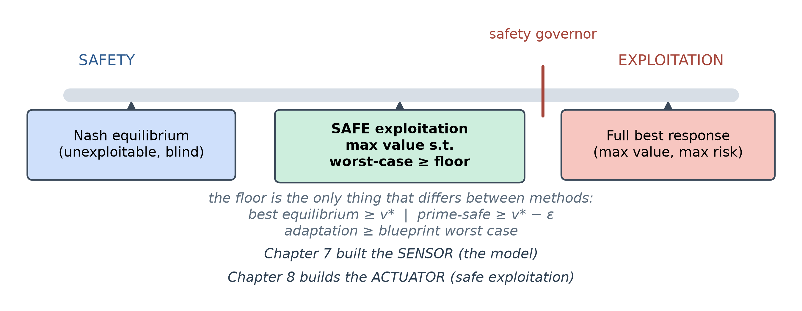
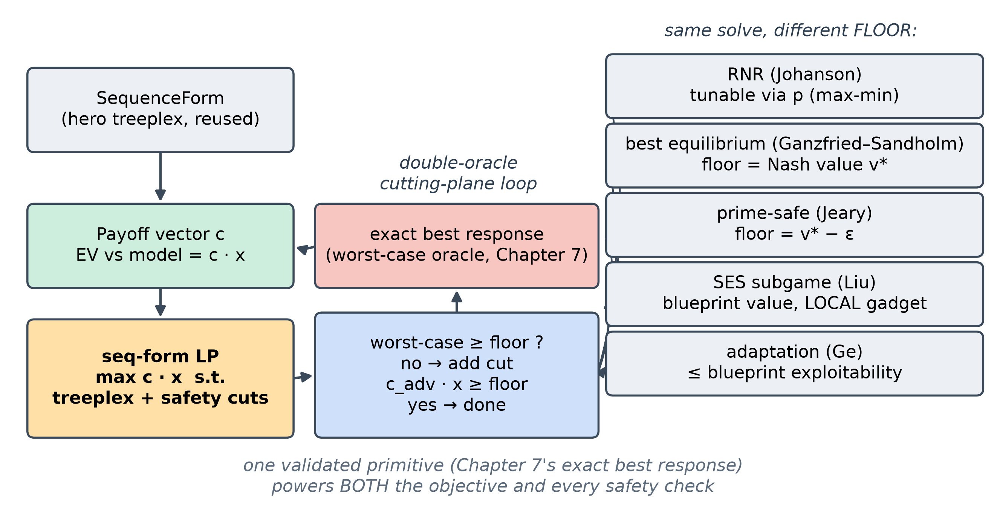
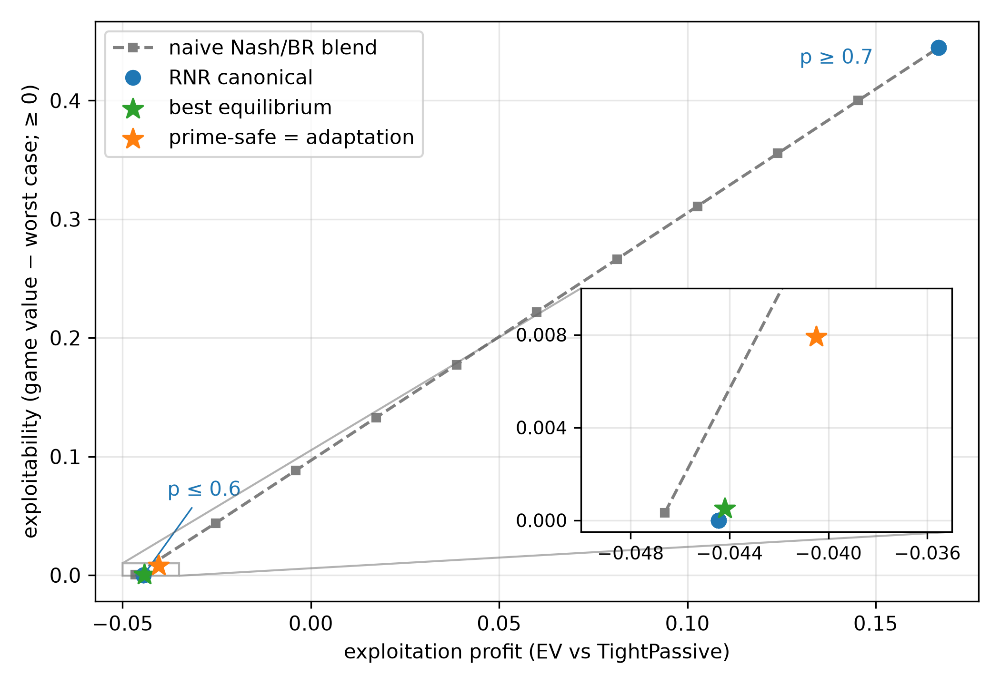
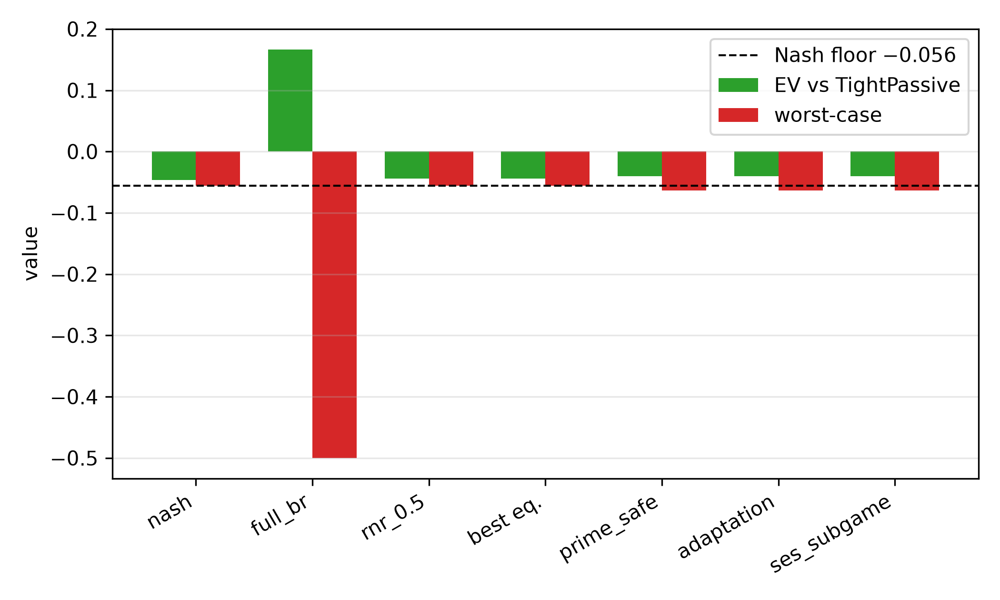
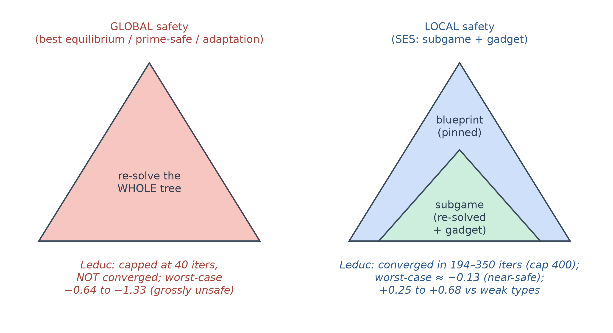
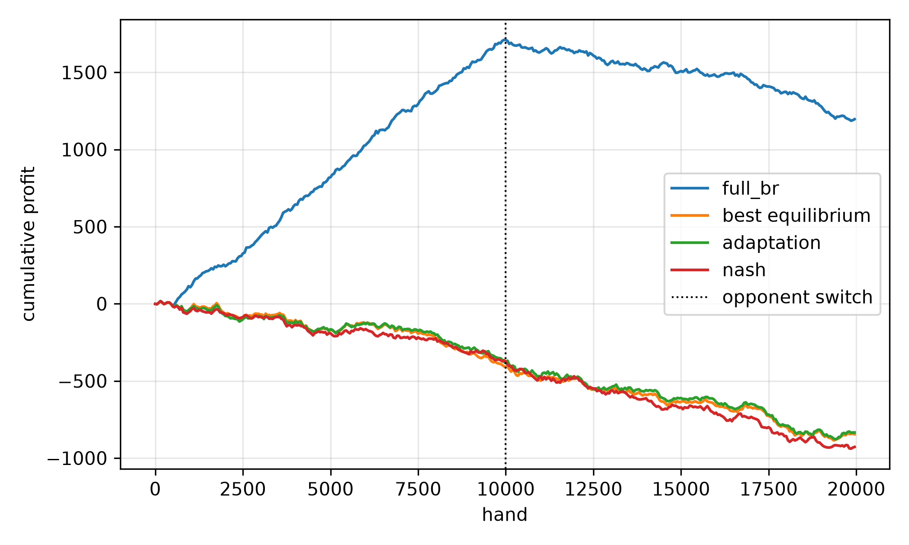

<!--
OFFICIAL PhD TITLE (keep consistent across all documents):
EN: Research on the possibilities for applying Artificial Intelligence in computer games
BG: Изследване на възможностите за приложение на изкуствения интелект в компютърни игри
-->
---
title: "Chapter 8 Summary — Safe Exploitation in Imperfect-Information Games"
subtitle: "Research on the possibilities for applying Artificial Intelligence in computer games"
author: "Alexander Andreev"
date: "July 2026"
lang: en
vars:
  research_focus: "Adaptive Strategy Learning in Multi-Agent Imperfect-Information Environments"
---

# Chapter 8 — Safe Exploitation in Imperfect-Information Games

This chapter covers *safe* opponent exploitation: the problem, the mathematics, the family of
methods, and controlled experiments on Kuhn Poker and Leduc Hold'em. All numbers were **measured**
on reproducible runs and bounded, wherever possible, by *exact* analytical references. Where a run
contradicted what theory led me to expect, I say so and reconcile it.

**Where this sits in the thesis.** Chapter 7 built a **sensor**: a model that estimates a specific
opponent's strategy. Chapter 8 builds the **actuator**: the mechanism that turns a model into
profit **without becoming exploitable**. It is the second half of the Behavioral Adaptation
Framework (Contribution #1), and pinning down *exactly where its guarantees depend on the
two-player zero-sum assumption* is the launch point for the multi-agent extension (Contribution #2).

---

## Why Safe Exploitation — the other half of the dial

A **Nash equilibrium** strategy is built never to lose in the long run: in a two-player zero-sum
game it has a fixed *value* `v*`, and no opponent can push you below it. Opponent modeling
(Chapter 7) lets you *deviate* from that safe strategy to punish a specific opponent's mistakes.
The obvious way to cash a model in is to play the **best response** to it. The trouble is that a
best response is usually **wildly exploitable itself**: to punish "you always fold to a bet" it
stops bluffing certain hands entirely, and a smarter opponent — or the same opponent, done
pretending — walks straight through the hole it opened.

Picture a **dial**. All the way to *safety* is Nash: unbeatable, but it never punishes a weak
opponent. All the way to *exploitation* is a hard best response to your current read: maximum
profit **if** the read is right, but a gaping hole if you are wrong, your sample was small, or you
were being *sandbagged* (fed a weak style to bait a big deviation). **Safe exploitation** bolts a *governor* onto that dial:
lean toward exploitation as far as you like, but never past the point where a worst-case
adversary could drag you below your safe baseline.

This is not paranoia: the full best response to the tight "Rock" style on Kuhn earns **+0.167 per
hand**, but its **worst-case value is −0.5** — an adversary who best-responds back can take half a
chip a hand off it, while Nash's worst case is the game value itself. Safe exploitation takes as
much of that upside as the opponent's mistakes allow while refusing the −0.5 downside.

**What "safe" means, informally.** Your *expected value over the match* must never fall below a
chosen floor, **no matter what the opponent does**. The design question of the chapter is *which
floor*, and how to extract as much as possible above it.[^ganzfried2015]

---

## Exploitation as Constrained Optimization

The single most useful idea in this chapter is that **every safe-exploitation method is the same
optimization problem** with one part swapped out:

> maximize the hero's expected value against the opponent model, **subject to** a safety floor on
> the hero's worst-case value.

To make that computable, represent the hero's strategy in the **sequence form** of Section 7.5:
the **realization plan** $x$ assigns a weight to each of the hero's action sequences, subject to
the linear **treeplex** constraints. Against a **fixed** opponent policy, the hero's expected
value is then **linear** in $x$,

$$
\text{EV}(x) \;=\; \sum_{z \in Z} \big[\pi_c(z)\cdot \pi_{-h}(z)\cdot u_h(z)\big]\, x_{\,\text{seq}(z)} \;=\; c \cdot x,
$$

where $Z$ is the set of terminal states, $\pi_c(z)$ the probability of the chance moves,
$\pi_{-h}(z)$ the probability of the opponent's moves and $u_h(z)$ the hero's payoff. So "maximize
EV against the model" is a **linear objective** $c\cdot x$ over linear constraints, and the whole
method is a **linear program**. A full best response is simply $\max_x c\cdot x$ over the treeplex,
which cross-checks the LP against Chapter 7's exact best-response code (they agree to $10^{-6}$).

The safety floor — "for *every* opponent $\sigma'$, $\text{EV}(x,\sigma') \ge \text{floor}$" — hides
an inner best response (a minimax), so instead of one giant bilinear program we use **constraint
generation** (a double-oracle / cutting-plane loop): solve the LP, call an **exact best response as
the worst-case oracle**, and if the worst case is below the floor, add the single linear cut it
implies and re-solve. This is finite (there are finitely many pure best responses), transparent,
and debuggable.

The pay-off is **five methods, one engine**, differing only in the floor, all resting on Chapter
7's *validated* best-response code.[^shoham2008]

---

## What "Safe" Means — three definitions, in increasing realism

"Safety" sounds absolute, but it is not one thing. Three definitions matter, and the line of
research is essentially a *weakening* of the demand to make it achievable in practice.

**(a) Ganzfried–Sandholm safety (2015): never earn less than the game value.** Their definition
is over the repeated game: at least $v^*$ per hand in expectation, whatever the opponent does.
Here it is imposed on each hand's strategy, with an exact Nash equilibrium $\sigma^*$ as baseline:

$$
\text{EV}(x,\sigma') \;\ge\; v^* \qquad \text{for all opponents } \sigma'.
$$

This is the strongest and cleanest notion, and it rests on the **minimax theorem**. Only
equilibrium strategies meet this per-hand floor, so the method picks the equilibrium strategy that
does best against the model (Ganzfried and Sandholm's "best equilibrium" baseline; below it is
called **best equilibrium**, code id `ganzfried`). The catch is the premise: an exact Nash
equilibrium, which is not computable in practice in any large game.

*What the full algorithms would add.* Their RWYWE ("risk what you've won in expectation") lowers
the floor each hand to $v^* - k_t$, where $k_t$ is the *gift* (the opponent's mistakes) banked in
expectation so far, and BEFFE plays best equilibrium until the banked gifts cover full
exploitation; both are provably safe over the repeated game; implementing and testing them is future work (RWYWE is the natural
two-player baseline for Contribution #2).

**(b) Prime-safe / ε-safety (Jeary & Turrini 2023): correct for an imperfect baseline.** Every
real baseline is an **ε-equilibrium** (from abstraction and finite compute, Chapter 4), so it is
itself exploitable by some $\varepsilon$. Prime-safe lowers the floor by exactly the baseline's own
exploitability,

$$
\text{floor} \;=\; v^* - \varepsilon, \qquad \varepsilon = \text{exploitability(baseline)} \ge 0,
$$

i.e. "never earn less than the worst case of the strategy you were going to play anyway." The
$\varepsilon$ must be **measured**, not assumed — a point the experiments take literally.

**(c) Adaptation safety (Ge et al. 2024): be no more exploitable than your blueprint.** The most
practical notion. An exploiting strategy is *adaptation-safe* iff

$$
\text{exploitability}(x) \;\le\; \text{exploitability(blueprint)} \quad\Longleftrightarrow\quad \text{worst-case}(x) \ge \text{worst-case(blueprint)}.
$$

This is weaker than Ganzfried and Sandholm's absolute floor (by exactly $\varepsilon$), and
therefore *achievable* where strict safety is not. Its danger is the mirror image: if the
blueprint is *terrible*, almost anything satisfies it, so adaptation safety is only meaningful with
a reasonable baseline (an open requirement I flag rather than resolve).

| Safety notion | Informal floor | Needs | Weakness |
|---|---|---|---|
| Ganzfried–Sandholm (2015) | $\ge v^*$ | an *exact* Nash baseline | an exact Nash equilibrium is not computable in practice in large games |
| Prime-safe (2023) | $\ge v^* - \varepsilon$ | the baseline's measured exploitability | you must measure $\varepsilon$ honestly |
| Adaptation (2024) | $\le$ blueprint exploitability | any blueprint | vacuous if the blueprint is bad |

: Three safety notions: the floor each guarantees, what it requires, and where it is weak.

### Where the two-player zero-sum assumption hides — the thesis attack point

Every floor above rests on one fact: **in a two-player zero-sum game, a Nash strategy secures the
value $v^*$ against any opponent** ($\min_{\sigma'}\text{EV}(\sigma^*,\sigma') = v^*$). That is
what makes "deviate toward the model but never below the floor" a coherent, enforceable
constraint, and it comes straight from the minimax theorem. In an **$N>2$-player** game this
collapses: a Nash strategy does *not* guarantee a fixed value against arbitrary opponents (no
single opponent's payoff is the negative of yours any more — in a zero-sum game that holds only
for the opponents' payoffs taken together — so the opponents can act in concert against you, and
different equilibria pay you differently), so there is no single $v^*$ to anchor to. Equilibria
in games with more than two players are "neither unique nor non-exploitable".[^ge2025] $N$-player
safety notions do exist, but they are either very conservative (the maxmin value against a
coordinated coalition[^celli2018]) or a target that cannot be secured in general (equal share,
the fair share $C/n$, is provably not securable against opponents with different fixed
strategies[^ge2025]). **That is the open problem for Contribution #2** — exploiting weak
opponents in small $N$-player games with a bounded loss relative to a baseline strategy,
including against colluding opponents. This chapter does not solve it; it makes the failure
*precise*.[^johanson2007][^jeary2023][^safe2024]

---

## Sequence-Form LP and Constraint Generation

The implementation (a `HeroTreeplex` on top of Chapter 7's sequence-form code, SciPy's HiGHS
solver, and the full constraint-generation loop) is described in the report. Each generated cut
is the payoff vector against a *specific* adversary best response, a valid linear lower bound on
the true worst case, so adding cuts monotonically tightens the relaxed safety constraint. Only the
floor changes between methods: best equilibrium uses $v^*$, prime-safe $v^* - \varepsilon$,
adaptation the blueprint's worst case, and RNR a max-min in $p$ (§ 8.5); the subgame method
(§ 8.7) adds *pins* that hold the hero's play outside the subgame at the blueprint.

**One numerical wrinkle decides safety.** An *approximate* Nash's self-play value can sit a hair
**above** the game's true max-min, so requiring the exact `wc ≥ floor` can make the LP infeasible
and, on an unlucky cut path, return an *unsafe* strategy. A small feasibility slack on the cuts
(`floor − slack`, with `slack ≈ 5·10⁻⁴`, independent of the convergence tolerance) keeps the true
max-min strategy feasible.[^gordon2003]

---

## Restricted Nash Response and the Bang-Bang Switch

One of the earliest principled methods, **Restricted Nash Response** (Johanson 2007; close to the
ε-safe strategies of McCracken and Bowling, 2004), introduces the *tunable knob*: compute the
hero's equilibrium against a **$p$-restricted** opponent, forced to play the fixed model with
probability $p$ and free to play adversarially with probability $1-p$. Sweeping $p$ from 0 to 1
traces a path from Nash ($p=0$) to full best response ($p=1$). Because the free component
best-responds to the hero, RNR is a **max-min**:

$$
\text{RNR}(p) \;=\; \arg\max_x \Big[\, p \cdot \text{EV}(x,\text{model}) \;+\; (1-p)\cdot \min_{\sigma'} \text{EV}(x,\sigma') \,\Big],
$$

which we solve with the same cutting-plane machinery plus an auxiliary worst-case variable.

**A flag worth keeping.** The project's own step notes originally described RNR as a *naive
behavioral blend*, $(1-p)\cdot\text{Nash} + p\cdot\text{BR}$. That is **not** Johanson's
algorithm; we implemented and labelled *both*. The naive blend traces a smooth line (grey in the
next figure): profit and exploitability rise together from Nash to full BR.

**The measured surprise — canonical RNR is bang-bang.** I predicted a smooth, monotone frontier
that dominates the blend everywhere. On Kuhn versus the Rock, canonical RNR instead returns the **same safe strategy** for all $p \in [0, 0.6]$ (EV $-0.044$,
exploitability $\approx 0$) and then **jumps straight to the full best response** at $p \approx
0.7$ (EV $+0.167$, exploitability $0.444$), with no intermediate points between the sampled values
of $p$ (steps of 0.1).

| $p$ | canonical RNR — EV | canonical — exploitability | naive blend — EV | naive — exploitability |
|---:|---:|---:|---:|---:|
| 0.0 | −0.044 | ~0.000 | −0.047 | 0.000 |
| 0.3 | −0.044 | ~0.000 | +0.017 | 0.133 |
| 0.6 | −0.044 | ~0.000 | +0.081 | 0.266 |
| **0.7** | **+0.167** | **0.444** | +0.103 | 0.311 |
| 1.0 | +0.167 | 0.444 | +0.167 | 0.444 |

: Restricted Nash Response across the mixing parameter: the canonical form against a naive blend.

*Why (I checked before trusting the story).* The RNR objective is **linear** in $x$ over a
**polytope**, so its optimum is a **vertex** and switches vertices only when $p$ crosses a
critical ratio; Kuhn's tiny polytope has few vertices, so the transition is a single jump.
Johanson's smooth curve is a *large-game* phenomenon (many vertices), or comes from the
*data-biased* variant that makes $p$ per-information-set. The naive blend is **dominated at the
safe corner** (at exploitability $\approx 0$ the LP methods reach EV $-0.044$ versus the blend's
$-0.047$). What is bang-bang is the map from $p$ to a strategy, not the frontier: mixing the two
RNR strategies reaches every point on the chord, because EV is linear in the mixture and the worst
case is concave. The switch happens at $p \approx 0.68$; any further vertex would be optimal only
for $p$ between 0.6 and 0.7, which the sweep did not sample. Against the Rock the chord improves
on the naive blend by only ≈ 0.002, so here choosing *where* to deviate buys almost nothing;
Johanson et al. report strongly concave frontiers in a large abstracted hold'em game. What the
small game does show is that $p$ is not a dial: the switching threshold *moves with how
exploitable the opponent is*, which recurs in § 8.6.[^johanson2009]

---

## Best Equilibrium on Kuhn — safe, but only a little more profitable (the core result)

The central experiment solves each method against a *perfect* model of each opponent type and
scores it on **profit** (EV vs that opponent) and **safety** (worst-case value), with the Nash
floor at $v^* = -0.056$ (Kuhn's first-player value, $\approx -1/18$). All numbers are exact
(full-tree), from the scale run.

| Opponent | metric | nash | full_br | rnr_0.5 | **best eq.** | prime_safe | adaptation |
|-----------|---------|----:|-----:|-----:|------:|------:|------:|
| **Rock** (TightPassive) | EV | −0.047 | **+0.167** | −0.044 | −0.044 | −0.040 | −0.040 |
| | worst-case | −0.056 | **−0.500** | −0.056 | −0.056 | −0.063 | −0.063 |
| **Maniac** (LooseAggr.) | EV | +0.118 | +0.333 | +0.278 | **+0.131** | +0.151 | +0.151 |
| | worst-case | −0.056 | −0.167 | −0.111 | −0.056 | −0.063 | −0.063 |
| **AlwaysBet** | EV | +0.113 | +0.333 | +0.333 | **+0.115** | +0.131 | +0.131 |
| | worst-case | −0.056 | −0.167 | −0.167 | −0.056 | −0.063 | −0.063 |
| **AlwaysPass** (most exploitable) | EV | +0.146 | **+0.975** | +0.975 | **+0.222** | +0.266 | +0.266 |
| | worst-case | −0.056 | −0.500 | −0.333 | −0.056 | −0.063 | −0.063 |
| **Nash** (control) | EV | −0.056 | −0.055 | −0.056 | −0.056 | −0.055 | −0.055 |
| | worst-case | −0.056 | −0.333 | −0.056 | −0.056 | −0.063 | −0.063 |

: Kuhn: expected value and worst-case value for every method against every opponent ("best eq." is the best-equilibrium baseline, code id `ganzfried`).

(`ses_subgame` is not shown: on Kuhn the subgame is the whole game and the method coincides with
adaptation.)

Three results carry the chapter.

1. **The full best response is the cautionary tale.** It always wins the most against a fixed
   model — up to **+0.975** against `AlwaysPass` — but its worst case collapses to **−0.5**. It is
   the only method that is unsafe against *every* opponent (`rnr_0.5` is unsafe against three),
   because an adversary can always best-respond back to the hole it opens.
2. **Best equilibrium is safe and still profitable — but only slightly.** Against *every*
   opponent its worst case stays at the Nash floor (safe within $10^{-3}$) **and** it beats Nash's
   own EV on every exploitable type — most vividly **+0.222 versus Nash's +0.146** against
   `AlwaysPass`, and +0.131 versus +0.118 against the Maniac. *You can exploit while provably
   never dropping below equilibrium value* — but only a little: against the four exploitable types
   best equilibrium gains 0.002–0.076 per hand over Nash, 1–9 % of what the full best response
   gains, because a per-hand floor at $v^*$ admits only equilibrium strategies (§ 8.3).
3. **A single global $p$ is not a safety setting.** `rnr_0.5` is safe against the Rock but has
   *already jumped* to the full best response against the highly exploitable `AlwaysPass` /
   `AlwaysBet` (identical EV to `full_br`, worst case −0.33 / −0.17, unsafe). This is the
   switching threshold of § 8.5 moving with opponent exploitability, and the concrete reason best
   equilibrium, which constrains the *value* rather than a *knob*, is the better primitive.

**Prime-safe and adaptation spend a measured ε-budget.** The run *measured* the
early-stopped-CFR baseline's exploitability at $\varepsilon = 0.0074$; their worst case comes out
at $-0.063 = v^* - 0.008$ against every opponent, matching the ε-adjusted floor, and they earn a
little more than best equilibrium (+0.266 versus +0.222 on `AlwaysPass`). They look "unsafe" in
the table only because the flag compares to $v^*$; against their *own* floor they are safe by
construction. They coincide because the same early-stopped CFR strategy serves as the prime-safe
baseline and the adaptation blueprint.[^ganzfried2015]

---

## Real-Time Safety — subgame gadgets (SES)

The guarantee of best equilibrium is *global*: the safety constraint is enforced over the
**whole** game tree, which a real game cannot re-solve every time the model updates. The **Safe
Exploitation Search** idea (Liu et al. 2022) makes safety a **local** property of a single
**subgame**: play the blueprint everywhere, but at a chosen subgame re-optimize the hero's play to
exploit the model — with a **gadget** that bounds how much the local deviation can add to
exploitability (the bound grows with the exploitation level and the error of the opponent model).
The stricter guarantee used here — never more exploitable than the blueprint — is Ge et al.'s
adaptation safety, which their OX-Search achieves for subgame re-solving.

The implementation enforces it directly on the treeplex: **pin** every hero sequence *outside* the
subgame to its blueprint realization weight, and set the safety floor to the blueprint's own
worst-case value. Because "play the blueprint inside the subgame too" is always feasible and
attains exactly that floor, the local exploit is safe by construction. The one requirement is that
the subgame be **downward-closed** (once you are in it you stay in it), which holds for natural
choices like "Leduc round 2" or "after a King flops."

§ 8.8 shows why "local" matters: on Leduc the subgame solve converged within its budget and the
global solves did not converge within theirs.[^liu2022][^search2024][^milec2025]

---

## At Scale — Kuhn works; Leduc breaks globally, holds locally

Leduc Hold'em (Section 3.4) is still exactly solvable, but large enough to stress the methods. The
run capped the constraint-generation loop at 40 iterations (tolerance $10^{-2}$, subgame set to the
King-flop) and recorded for each cell whether the solve **converged** or hit the cap. Game value
$v^* = -0.086$.

| Opponent | metric | nash | full_br | **ses_subgame** | best eq. | prime_safe / adaptation |
|-----------|---------|-----:|-----:|-------:|------:|-------:|
| **Rock** | EV | +0.201 | +0.937 | **+0.247** | +0.624 | +0.635 |
| | worst-case | −0.089 | −1.633 | **−0.130** | −0.838 | −0.744 |
| | converged? | ✓ | ✓ | **✓ (194 it)** | ✗ capped | ✗ capped |
| **Maniac** | EV | +0.438 | +2.177 | **+0.682** | +1.806 | +1.842 |
| | worst-case | −0.089 | −1.100 | **−0.130** | −0.638 | −0.657 |
| | converged? | ✓ | ✓ | **✓ (211 it)** | ✗ capped | ✗ capped |
| **CallingStation** | EV | +0.559 | +1.464 | **+0.663** | +1.342 | +1.363 |
| | worst-case | −0.089 | −1.000 | **−0.130** | −0.915 | −0.686 |
| | converged? | ✓ | ✓ | **✓ (350 it)** | ✗ capped | ✗ capped |
| **LoosePassive** | EV | +0.449 | +1.405 | +0.559 | +1.306 | +1.309 |
| | worst-case | −0.089 | **−4.200** | −0.133 | −1.239 | −1.334 |
| | converged? | ✓ | ✓ | ✗ (400 it) | ✗ capped | ✗ capped |

: Leduc: the subgame method against the global solvers.

**The headline finding is negative and empirical: within a 40-iteration cap, the global solve did
not converge even on Leduc.** I predicted best equilibrium would be safe on Leduc as it is on
Kuhn. Instead the **global** solvers (best equilibrium `ganzfried`, `prime_safe`, `adaptation`,
and `rnr_0.5`) all hit the cap, leaving worst-case values of **−0.64 to −1.33** — grossly unsafe.
The reason, which I confirmed rather than assumed: the loop adds one adversary cut per iteration,
and on Leduc the set of relevant pure best responses is large, so 40 cuts nowhere near pin the
true worst case and the master LP keeps returning optimistic-but-unsafe strategies.

**The positive half is the subgame method.** SES **converged** on three of four exploitable
opponents (194–350 iterations), because it re-solves only the small King-flop subgame — a far
smaller LP with a far smaller adversary set. It extracts real value (**+0.25 to +0.68**, beating
Nash) at a worst case of ≈ **−0.13**, an order of magnitude closer to safe than the global
methods: the *global-versus-local* distinction of § 8.7 as a measured fact. The comparison is not
at equal budgets, though: the global solvers were stopped after 40 iterations (about 2.5 s per
cell), while SES had a cap of 400 and used 194–400 iterations (30–79 s per cell). So the global
loop is slow and unsafe *within this budget*, not necessarily with a larger one. Chapter 14
settles the scaling question: its one-shot dual LP, which replaces the loop, solves the full-Leduc
problem in 0.02–0.04 s, so the wall was the loop's, not the global problem's.

*I keep myself honest on SES, though:* its residual exploitability (≈ 0.043) exceeds the 0.01
tolerance, so it too is flagged unsafe, and on `LoosePassive` it ran all 400 iterations without
converging. But SES's own floor is the blueprint's worst case — the early-stopped CFR baseline
(−0.120), not Nash (−0.089) — and the three converged cells sit 0.010 below it, exactly at the
tolerance. So SES held its gadget floor, and the residual is mostly the blueprint's own
exploitability; a rerun with a tighter tolerance would show whether it is *provably* safe.

### The teaching attack — and why realized profit is the wrong lens

The last experiment is the deception stress test the safety machinery is meant to survive. A
deceptive opponent plays the weak Rock bait for 10 000 hands, then switches to a strong Nash
"reveal" for 10 000 more; a Chapter 7 model feeds each solver every 500 hands (5 seeds).

| method | mean/hand (all) | mean/hand (after switch) | safety violations / seed |
|---|---:|---:|---|
| full_br | **+0.051** | −0.061 | **40, 40, 40, 40, 40** |
| best eq. (`ganzfried`) | −0.048 | −0.055 | **0, 0, 0, 0, 0** |
| adaptation | −0.046 | −0.055 | 40, 40, 40, 40, 40 |
| nash | −0.051 | −0.061 | 0, 0, 0, 0, 0 |

: The teaching attack: realised profit and safety violations per method.

The naive story — "the teaching attack punishes the greedy exploiter" — **did not hold in
realized profit**. The full best response ends *hugely net-positive* (+0.051/hand overall): it
banks a windfall during the bait, and a *Nash* revealer claws back barely more than the game value
per hand, so the windfall is never repaid within 10 000 hands. What *does* separate safe from
unsafe is the **exact worst-case / safety-violation count**: the full best response violated the
Nash floor at **40 of 40** refits, best equilibrium at **0 of 40**. A strategy's worst case is
realized by an opponent that *best-responds to it*, and a stationary Nash reveal is not that
adversary. The design lesson:
**measure safety by the worst case, not by realized profit against a benign opponent**; to punish
the greedy exploiter *in profit*, the reveal must be an adaptive counter-exploiter, not a fixed
Nash. (Adaptation's 40 violations are by design: it targets a floor *below* $v^*$, so it trips the
$v^*$-referenced counter.)

---

## Connections and Forward Pointers

**What this chapter establishes.** Safe exploitation is one idea — *maximize value against the
model subject to a safety floor*. On a fully solvable game best equilibrium is safe against every
opponent while earning slightly more than Nash against every exploitable one, where the naive best
response earns more but is ruinously exploitable; prime-safe and adaptation extend the guarantee
to imperfect baselines by spending a *measured* ε-budget. The most valuable result is negative:
on Leduc the *global* solve did not converge within a 40-iteration cap while the *local* subgame
method (cap 400) did, if under unequal budgets.

**Backward connections.** Chapter 7's sensor supplies this chapter's *objective*, its exact best
response is the *worst-case oracle*, and the sequence form is the *variable* the LP optimizes. The
continuous model's self-inflicted leak against Nash on Leduc (Chapter 7, § 7.7) is what the safety
floor is designed to prevent.

**Forward to the thesis.** The Leduc non-convergence argues for two scalable paths: an **exact
one-shot dual LP** for the worst-case constraint, or **local / subgame** safety (SES, OX-Search)
in real time; Chapter 14 took the first (full Leduc in 0.02–0.04 s). RWYWE (§ 8.3), the stronger
two-player baseline for Contribution #2, needs only the existing LP with a floor that moves with
the banked gifts; implementing it is future work. Either way, the safety floor is what turns
Chapter 7's fragile sensor into a deployable adaptive agent.

<!-- Source footnotes. Definitions may sit anywhere at top level; keeping them
     together here keeps the prose readable and the EN/BG pair easy to compare. -->

[^ganzfried2015]: Ganzfried, S. & Sandholm, T. (2015). "Safe Opponent Exploitation." *ACM Transactions on Economics and Computation* 3(2), Article 8. DOI 10.1145/2716322 — the paper that shows that, in a repeated two-player zero-sum game, deviating from equilibrium can be safe exactly when the opponent makes "gifts", and gives algorithms that risk only what has already been won; the safety half of the dial and the anchor for Chapter 8.

[^shoham2008]: Shoham, Y. & Leyton-Brown, K. (2008). *Multiagent Systems: Algorithmic, Game-Theoretic, and Logical Foundations*. Ch. 3 (normal-form games); Ch. 4 (computing solution concepts of normal-form games; §4.1, linear programming for zero-sum games); Ch. 5 (extensive-form games; §5.2, imperfect-information games and the sequence form, the machinery underneath every LP in Chapter 8); Ch. 7 "Learning and Teaching", the learning-in-repeated-games framing, including the tension that your actions both *exploit* and *teach* the opponent. Free: <http://www.masfoundations.org/download.html>

[^johanson2007]: Johanson, M., Zinkevich, M. & Bowling, M. (2007). "Computing Robust Counter-Strategies." *NIPS 2007*, 721–728 — Restricted Nash Response, the tunable ancestor of the methods above.

[^jeary2023]: Jeary, L. & Turrini, P. (2023). "Safe Opponent Exploitation For Epsilon Equilibrium Strategies." *arXiv:2307.12338*.

[^safe2024]: Ge, Z., Xu, Z., Ding, T., Meng, L., An, B., Li, W. & Gao, Y. (2024). "Safe and Robust Subgame Exploitation in Imperfect Information Games." *ICML*, PMLR 235, 15255–15270.

[^ge2025]: Ge, J., Wang, Y., Li, W. & Jin, C. (2025). "Securing Equal Share: A Principled Approach for Learning Multiplayer Symmetric Games." *ICML*; arXiv:2406.04201.

[^celli2018]: Celli, A. & Gatti, N. (2018). "Computational Results for Extensive-Form Adversarial Team Games." *AAAI* 32(1). DOI 10.1609/aaai.v32i1.11462.

[^gordon2003]: The constraint-generation / double-oracle idea traces to McMahan, H. B., Gordon, G. J. & Blum, A. (2003). "Planning in the Presence of Cost Functions Controlled by an Adversary." *ICML* — the general recipe for "optimize against a worst case you discover as you go."

[^johanson2009]: Johanson, M. & Bowling, M. (2009). "Data Biased Robust Counter Strategies." *AISTATS*, PMLR 5, 264–271 — makes the $p$ knob depend on how much data supports each part of the strategy, which is what smooths the frontier in practice.

[^liu2022]: Liu, M., Wu, C., Liu, Q., Jing, Y., Yang, J., Tang, P. & Zhang, C. (2022). "Safe Opponent-Exploitation Subgame Refinement." *NeurIPS* — Safe Exploitation Search (SES) with a gadget; the added exploitability is bounded from above (Theorem 4.1).

[^search2024]: Ge, Z. et al. (2024), *op. cit.* — OX-Search: subgame re-solving with a gadget that keeps the refined strategy no more exploitable than the blueprint (adaptation safety, Theorem 4.3), applicable in nested fashion at each newly reached information set; motivated by the "being taught and exploited" problem; tested on Leduc and Flop Hold'em, two-player.

[^milec2025]: Milec, D., Kovařík, V. & Lisý, V. (2025). "Adapting Beyond the Depth Limit: Counter Strategies in Large Imperfect Information Games." *AAMAS 2025* (extended abstract), 2675–2677; arXiv:2501.10464 — using opponent-model information *past* the search horizon.
