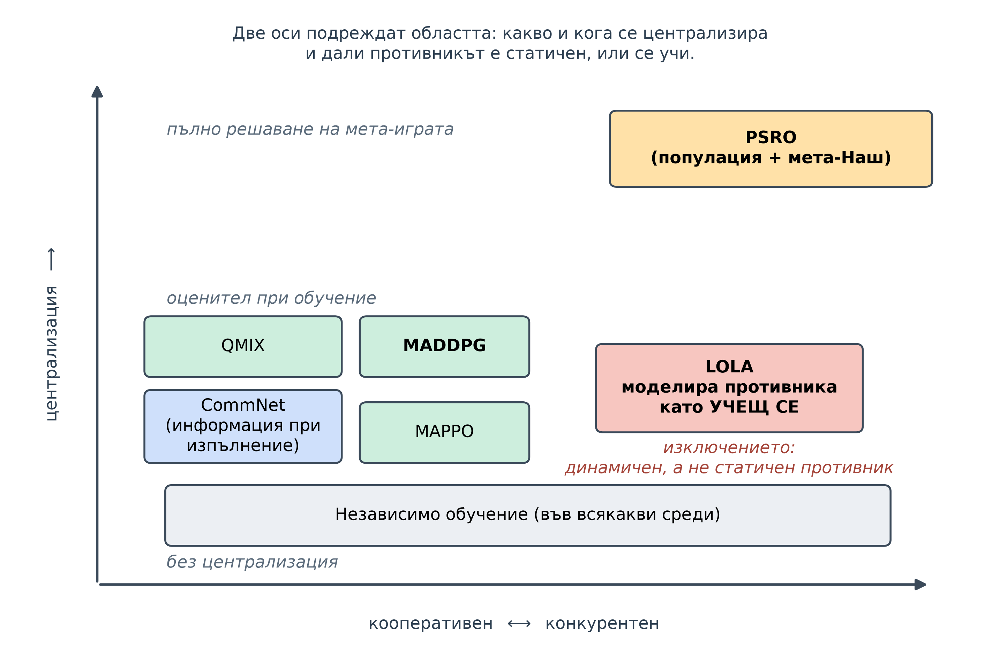
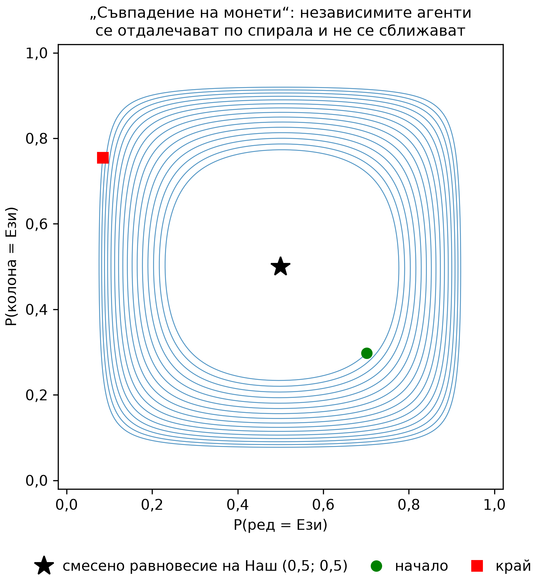
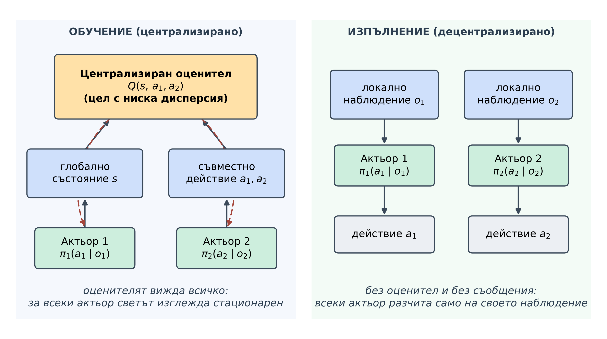
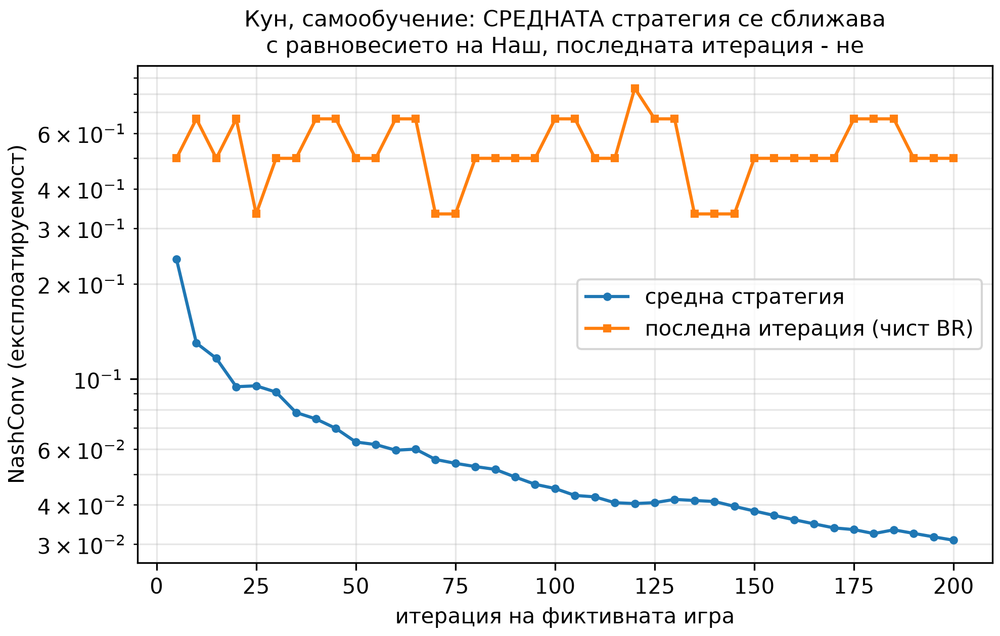
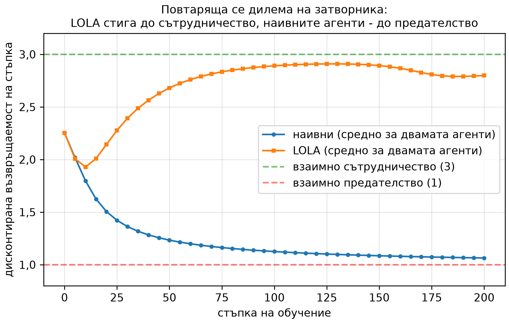

<!--
OFFICIAL PhD TITLE (keep consistent across all documents):
EN: Research on the possibilities for applying Artificial Intelligence in computer games
BG: Изследване на възможностите за приложение на изкуствения интелект в компютърни игри
-->

---
title: "Глава 9 Обобщение – Многоагентно обучение с подкрепление: координация, конкуренция и комуникация"
subtitle: "Изследване върху възможностите за прилагане на изкуствен интелект в компютърните игри"
author: "Alexander Andreev"
date: "July 2026"
lang: bg
vars:
  research_focus: "Adaptive Strategy Learning in Multi-Agent Imperfect-Information Environments"
---

# Глава 9 – Многоагентно обучение с подкрепление: координация, конкуренция и комуникация

Тази глава разглежда многоагентното обучение с подкрепление (MARL): проблемът, който го отличава, математиката, която го рамкира, методите, които се използват за решаването му, и контролирани експерименти в малки, точно решими игри. **Всички експериментални числа са измерени** при възпроизводими изпълнения и, където това е възможно, са поставени в *точни* граници (равновесия на Наш, точни стойности на най-добрия отговор), а не в граници, получени от други симулации. Когато дадено изпълнение противоречи на очакването ми, запазвам очакването и го съпоставям с получения резултат – тези разминавания са най-поучителните части.

**Къде се вписва това в дисертацията.** Глави 2–8 работят почти изцяло в рамките на **игри за двама с нулева сума** (Pluribus в Глава 6 е изключението, което се отказва от гаранциите): има стойност $v^*$, равновесната стратегия на Наш я осигурява срещу *всеки* противник и CFR доказуемо се сближава към нея. Глава 9 е повратната точка към **многоагентния** свят, където тези три удобства отслабват или изчезват. Тя предлага три връзки с дисертацията. **LOLA** (Foerster и др., 2018) – диференциране през *стъпката на обучение* на противника – може да се разглежда като *динамично* моделиране на противника, допълнение към статичната преценка за противника от Глава 7, насочено към противник, който се променя (Принос №1). **PSRO** – игра, която се играе върху *популация от стратегии* – е кандидат-рамка за безопасна експлоатация там, където няма теорема за минимакса (Принос №2), и обща многоагентна *методология за оценяване* (Принос №3). Липсващата минимаксна опора при $N>2$, където се нарушава всяка гаранция за игри с двама играчи, е назована тук и оставена като отворен проблем, към който е насочена дисертацията.

---

## Защо многоагентното обучение с подкрепление е различен проблем

Един агент (Глава 1) се учи в **непроменяща се** среда: стационарен MDP, чиято фиксирана оптимална стойност $Q^*$ той може да достигне чрез сходимост. Глави 2–8 вместо това изчисляваха **равновесия** – стратегии, които са оптимални срещу *съвършено рационален* противник, който вече е завършил своите разсъждения.

Многоагентното обучение с подкрепление се намира между тези два подхода и е по-трудно и от двете. Няколко агента **се учат едновременно в споделена среда**, така че от гледната точка на всеки един агент „средата“ – която вече *включва и другите агенти* – **непрекъснато се изменя**, докато всички се обновяват. Това е **нестационарност**: ефективните преходи и награди на агент $i$ зависят от стратегиите $\pi_{-i}$ на другите агенти, които се променят при всяко обновяване, така че целта $Q^*$, която агентът преследва, самата тя е в движение. Това също така поражда два проблема, които просто не съществуват за агент, който действа сам: **координация** (как агентите, които си сътрудничат, се научават да действат заедно, без някой да им казва как?) и **разпределяне на заслугата** (когато отборът успее, чии действия са имали значение?).

Образ, който си струва да запомните: **учене на танц с партньор, който също се учи да танцува.** Ако стъпките на вашия партньор бяха фиксирани, бихте могли да научите наизуст последователност от стъпки, която им подхожда – това е едноагентното обучение с подкрепление. Ако вашият партньор беше безупречен професионалист, бихте могли да изучите известния му стил и да се подготвите с перфектен отговор – това е изчисляване на равновесие. Но когато *и двамата* се подобрявате в реално време, всяка промяна, която правите, променя това, което другият трябва да направи, и обратното; вие си стъпвате един на друг по краката, прекоригирате и осцилирате – докато или не намерите общ ритъм (координирано равновесие), или не започнете да се въртите в кръг безкрайно (както в „съвпадение на монети“, Matching Pennies, раздел 9.4). Цялата област е изкуството да *подредите картите така, че синхронизацията да се случва надеждно.*[^zhang2021]

---

## Марковски игри – мостът между глави 2–8 и MARL

Глави 2–8 разсъждаваха върху **игри в екстензивна форма (EFGs)**: дърво на играта, **информационни множества** и контрафактични стойности, подавани към CFR. Стандартната формализация на MARL е **марковската (стохастична) игра** и изясняването на връзката не позволява преминаването да изглежда като започване отначало. **Марковската игра** е наредената n-торка

$$ \big(\, \mathcal{S},\ \{\mathcal{A}_i\}_{i=1}^{N},\ P,\ \{R_i\}_{i=1}^{N},\ \{\Omega_i\},\ O,\ \gamma \,\big), $$

с множество състояния $s\in\mathcal{S}$, по едно множество действия $\mathcal{A}_i$ за всеки агент, закон за преход $P(s' \mid s, a_1,\dots,a_N)$, управляван от **съвместното** действие, наградите на отделните агенти $R_i(s,a_1,\dots,a_N)$ и (при частично наблюдавания случай) наблюдения $o_i = O_i(s)$. Всеки агент има стратегия $\pi_i(a_i \mid o_i)$; заедно те формират **съвместна стратегия** $\pi=(\pi_1,\dots,\pi_N)$. Специалните случаи са именно предишните глави:

- $N=1$ възстановява обикновено **MDP** (Глава 1).
- $N=2$ и едно състояние дава **матрична игра** (с нулева сума при $R_1=-R_2$; тестовата среда на тази глава, раздел 9.4).
- Последователна игра с непълна информация и нулева сума дава **EFG** (глави 2–8): марковска игра, при която „**състоянието**“ е *история*, а **частичната наблюдаемост** се изразява чрез **информационно множество**.

Това, което преминава през моста, е *речникът*: поведенческата стратегия на EFG в информационно множество е точно стратегията в марковската игра $\pi_i(a_i\mid o_i)$, информационното множество се превръща в наблюдението $o_i$, а контрафактичната стойност на история става оценка на централизиран оценител в състояние. Това, което **не** преминава през моста, са *гаранциите*. Контрафактичното разлагане на CFR изисква дърво на играта с пълна памет, каквото общите марковски игри (с цикли и едновременни ходове) не предоставят, а при $N>2$ играчи CFR губи гаранцията за сходимост към равновесие на Наш дори в дърво с пълна памет (Abou Risk и Szafron, 2010),[^abourisk2010] така че MARL се връща към обучение чрез градиент/стойност, чиято сходимост не е гарантирана (оттук и цикличността в раздел 9.4). Най-съществено, изчезва **опората на минимаксната стойност**: в игра за двама с нулева сума равновесната стратегия на Наш гарантира $v^*$ срещу всеки противник – фактът, на който се крепи безопасната експлоатация в Глава 8 – и за $N>2$ няма такава единична стойност. Именно тази липсваща опора е празнината, която наследява Принос №2.[^littman1994]

---

## Семейството от методи

Всеки метод тук представлява различно структурно решение на въпроса „другите агенти се учат, докато аз се уча“.[^albrecht2024] MADDPG и MAPPO са двата варианта на централизирано обучение с децентрализирано изпълнение (CTDE), изпитани тук; варианти с факторизиране на стойността като QMIX[^rashid2018] не се използват.

| Подход | Какво прави | Кога да го използвате | Основна слабост |
|---|---|---|---|
| **Независимо обучение (IL)** | всеки агент използва собствен алгоритъм за едноагентно обучение и третира останалите като част от средата | бърза базова линия; почти стационарни среди | нестационарност $\to$ цикличност, провал на координацията |
| **MADDPG** (CTDE) | **оценителят** на всеки агент вижда наблюденията и действията на всички агенти по време на обучението; всеки **актьор** вижда само собственото си наблюдение при изпълнение | смесени кооперативно-конкурентни задачи; каноничният CTDE шаблон | входът на оценителя нараства с $N$; актьорското обновяване е сложно за настройка |
| **MAPPO** (CTDE) | обикновен PPO с **централизирана функция на стойността** $V(s)$ на глобалното състояние и споделени параметри | кооперативен MARL, когато искате проста и надеждна базова линия | висока цена на данните при обучение по текущата стратегия (on-policy); „прост“, но чувствителен към настройката |
| **PSRO** | поддържа популация от стратегии; намира **мета-Наш** сместа върху нея; обучава **най-добър отговор** на тази смес; добавя го; цикълът се повтаря | конкурентни/общи игри; когато искате игровотеоретична цел на сходимост | пълен най-добър отговор във всеки кръг; приблизителният предсказвач отслабва гаранцията |
| **LOLA** | оптимизира, като приема, че противникът ще направи **една стъпка на обучение**; диференцира *през* неговото обновяване | диференцируеми игри с двама играчи, в които наивното обучение се проваля (IPD) | предполага, че знаете и можете да диференцирате обновяването на противника |
| **CommNet** | агентите излъчват **диференцируемо съобщение**; всеки получава **средното** от останалите и го подава на входа на своята стратегия | кооперативни задачи с частична наблюдаемост | усредняването губи информацията *кой* какво е казал |

: Семействата методи в MARL: какво прави всеки, кога да се използва и основната му слабост.

Две оси пресичат таблицата. **Какво е централизирано и кога?** Нищо при IL; оценителят само по време на обучение при CTDE; цялостното решаване на мета-играта между кръговете при PSRO; информацията по време на изпълнение при CommNet. **Статичен ли е противникът, или учещ се агент?** Всичко освен LOLA третира стратегията на противника като фиксирана, докато агентът ѝ отговаря; LOLA предвижда *следващото обновяване* на противника.

---

## Независимо обучение и начините, по които то се проваля

Най-ясният начин да се разбере *защо* останалата част от областта изобщо съществува, е чрез изпълнението на контролен експеримент, който води до провал. При независимото обучение всеки агент се поставя в собствен градиентен цикъл и се приема, че останалите агенти са част от средата. Върху четири канонични $2\times2$ матрични игри – всяка от които представлява различен качествен случай – това води до четири различни изхода.

Игрите и техните аналитични равновесия на Наш (обективна истина): **дилемата на затворника** (предателството строго доминира, така че единственото равновесие е взаимно предателство); **„съвпадение на монети“** (Matching Pennies; игра с нулева сума; единственото равновесие е напълно смесеното $(\tfrac12,\tfrac12)$ със стойност 0); **лов на елен** (две чисти равновесия на Наш – доминиращото по печалба (Елен, Елен) и рисково доминиращото (Заек, Заек) – плюс едно смесено); **битка на половете** (две чисти равновесия на Наш, които не са съгласни кое да изберат, плюс едно смесено). Два независими градиентни агента с точни градиенти (чиста динамика без шум) дават следните измерени резултати:

| Игра | Измерен резултат | NashConv | Съвпада ли с аналитичното равновесие на Наш? |
|---|---|---|---|
| дилемата на затворника | $x \to [0{,}001,\,0{,}999]$ (предателство) | $0{,}0013$ | да – равновесието при доминиращи стратегии |
| лов на елен | всички начални числа $\to$ (Заек, Заек) | $0{,}0013$ | да – *рисково доминиращото* чисто равновесие на Наш |
| битка на половете | всички начални числа $\to$ едно чисто равновесие на Наш | $0{,}0013$ | да – чисто равновесие на Наш |
| „съвпадение на монети“ | **не се сближава** (последната итерация се отклонява към границата) | от $1{,}4$ до $1{,}8$ | не – никога не се установява |

: Независими обучаващи се агенти в четири матрични игри, сравнени с аналитичното равновесие на Наш.

В три от четирите игри агентите се сближават с истинско равновесие на Наш, а интересните детайли са в „как“. В **лов на елен** агентите надеждно избират **рисково доминиращото** равновесие (Заек), въпреки че „Елен“ носи по-голяма печалба – едностранният ход към „Елен“ се наказва, така че градиентната динамика се плъзга към безопасния ъгъл. В **битка на половете** всяко начално число води до *едно и също* чисто равновесие: координацията е решена, но не по начин, разнообразен според началните числа. Това са проблемите с избора на равновесие и координацията, представени в конкретен вид.

Играта „съвпадение на монети“ е показателна: тя **никога не се сближава с равновесие**, което е именно същината на проблема.[^singh2000]

> **Съпоставка (запазена прогноза $\to$ какво всъщност се случи).** Прогнозирах, че в „съвпадение на монети“ траекторията ще опише чиста орбита с приблизително постоянен радиус около $(\tfrac12,\tfrac12)$. И двата вида обучаващи се агенти не успяха да **се сближат с равновесие** – но нито един не описа чиста орбита. Агентът с градиентен метод с проекция (IGA) от изследователските скриптове *спираловидно се отдалечава* (разстоянието до равновесието на Наш нарасна през времевите прозорци от $0{,}30$ до $0{,}48$); агентът със softmax параметризация от имплементацията *се отклонява към ъглите* (последни профили като $x=[0{,}96,0{,}04]$, $y=[0{,}03,0{,}97]$, NashConv $\approx 1{,}8$). Затворената орбита е верният модел само за непрекъснатата динамика (Singh и др., 2000); при фиксирана стъпка $0{,}1$ всяко обновяване излиза леко навън от кривата и траекторията се отдалечава по спирала към границата. **Изводът остава непроменен и дори е по-ясен**: при наивно едновременно учене *последната итерация* не се сближава с равновесие в игра само със смесено равновесие – това, което се сближава, е *средното по времето* (раздел 9.6).

---

## Централизирано обучение, децентрализирано изпълнение (CTDE)

Първата структурна корекция запазва изпълнението реалистично – всеки агент все още действа въз основа на собственото си наблюдение – като същевременно дава на *обучаващия се агент* привилегирован достъп до информация по време на обучение. В **MADDPG** (Lowe и др., 2017) актьорът $\pi_i(a_i \mid o_i)$ на всеки агент вижда само собственото си наблюдение, но централизираният оценител $Q_i(s, a_1,\dots,a_N)$ вижда глобалното състояние и действието на *всеки* агент. Оценителят за всеки агент, който наблюдава само $o_i$, се сблъсква с нестационарен, частично наблюдаван свят, така че неговата целева стойност е шумна; оценителят, който отчита цялата информация, вижда (почти) детерминистична целева стойност и дава обучаващ сигнал със значително по-ниска дисперсия. **MAPPO** (Yu и др., 2022) е минималната версия – обикновен PPO с една централизирана функция на стойността $V(s)$ на глобалното състояние – и е силна базова линия, която често не отстъпва на по-сложни методи.

**Има ли централизираният оценител действително по-ниска дисперсия?** Измерено в едностъпкова кооперативна „референциална“ задача (говорителят вижда целта, слушателят – не, а двамата трябва да я назоват), след обучение до сходимост:

| Оценител | Краен остатък (грешка на функцията на стойността) |
|---|---|
| централизиран $Q(s,a_1,\dots,a_N)$ | $3{,}2\times10^{-11}$ |
| независим $Q_i(o_i)$ | $0{,}077$ |

: Централизиран срещу независим оценител: краен остатък на грешката на функцията на стойността.

Централизираният оценител свежда остатъка си практически до нула – наградата е детерминистична функция на неговите входове – докато независимият оценител не може да види целта и остава блокиран в прогнозирането на базовата честота. Следователно централизираният оценител напасва целевата си стойност много по-точно. Това само по себе си не означава по-ниска дисперсия на градиента на стратегията: при сходили оценители централизираният оценител може дори да я увеличи (Lyu и др., 2021).[^lyu2021] А по-точният оценител не е същото като решаването на координацията и именно тук една прогноза се провали.

> **Съпоставка (запазена прогноза $\to$ какво всъщност се случи).** Прогнозирах, че в играта **„изкачване“** на Claus и Boutilier[^claus1998] – кооперативна матрична игра без състояние, чийто оптимум (11) е фланкиран от $-30$ санкции за некоординация, с „безопасен“ атрактор при 5 – централизираният оценител ще избяга от капана и ще достигне оптимума, побеждавайки независимите обучаващи се агенти. Това не се случи. Измерени награди при алчна стратегия: **независими обучаващи се агенти 7, MADDPG 5, MAPPO 7** (оптимум 11, безопасна стойност 5). Нито един метод не достигна оптимума, а MADDPG всъщност *изостана* както спрямо IL, така и спрямо MAPPO. (Използваният вариант на MADDPG за дискретни действия заменя детерминистичния градиент на стратегията с контрафактична базова линия в стила на COMA (Foerster и др., 2018),[^foerster2018coma] затова резултатът се отнася до този вариант, а не до MADDPG в оригиналния му вид, и обновяването на актьора му трябва да бъде проверено първо.) Честното тълкуване: по-точният оценител **не е достатъчен**, за да преодолее относителното свръхобобщаване[^matignon2012] и трудното изследване, което санкциите от $-30$ налагат – агентите няма да опитат рискованото съвместно действие достатъчно дълго, за да открият 11. **CTDE осигурява по-добър оценител, но не и автоматична координация.**

Методологическа бележка, която си струва да се запомни: и двата ефекта на CTDE по-горе, както и ползата от комуникацията (раздел 9.7), бяха **невидими при бързата конфигурация за проверка (smoke)** и се проявиха едва след обучение в по-голямата конфигурация в пълен мащаб (scale). Бързата проверка показва, че кодът работи; за да се наблюдават явленията, е необходимо обучение до сходимост.[^lowe2017]

---

## PSRO – теория на игрите върху популация от стратегии

Втората структурна корекция е водещата нишка на главата и прекият наследник на **итерирания най-добър отговор** от Глава 2. **PSRO** (Policy-Space Response Oracles; Lanctot и др., 2017) разглежда цели стратегии като атомите на една по-висша игра. То поддържа **популация** от стратегии за всеки играч, изгражда емпиричната матрица на печалбите на **мета-играта** между популациите, решава **мета-Наш равновесие** върху нея, обучава **най-добър отговор** (предсказвач) на мета-Наш сместа на противника и добавя този отговор към популацията; цикълът се повтаря. То обединява играта срещу себе си, фиктивната игра и метода на **двойния предсказвач** в една рамка, а неговата метрика за прогрес е *експлоатируемост* – същата NashConv, използвана в Глави 2–8.

Имплементацията е точна, а не приблизителна: предсказвачът е **точният най-добър отговор** от Глава 7 за Кун и Ледюк, приложен към мета-Наш сместа на противника, сведена (съгласно теоремата на Кун[^kuhn1953]) до една поведенческа стратегия.

**Защо популация, а не просто последната стратегия от играта срещу себе си?** Защото играта срещу себе си се сближава в *средното*, а не в последната итерация. Измерено върху **Кун** при игра срещу себе си по метода на фиктивната игра: експлоатируемостта на **средната** итерация спадна от $0{,}24$ до $0{,}031$ за 200 итерации, докато експлоатируемостта на **последната** итерация продължи да осцилира между $0{,}33$ и $0{,}83$. Мета-сместа на PSRO е популационната версия на осредняването, върху което се основават CFR и фиктивната игра.

**Сходимост на PSRO, измерена** (експлоатируемост = NashConv на мета-Наш сместа в цялата игра):

| Игра | Траектория на експлоатируемостта | Извод |
|---|---|---|
| Кун покер | $0{,}917 \to \sim\!2\times10^{-16}$ до кръг 6 | сближава се до машинна нула |
| матрична игра („съвпадение на монети“) | $2{,}0 \to 0$ до кръг 2 | сближава се |
| камък-ножица-хартия (изследване) | $2{,}0 \to 0{,}017$; популация $\to$ {R,P,S}, смес $\to$ равномерна | сближава се |
| Ледюк Холдем | $4{,}75 \to 2{,}16$ за 20 кръга | намалява, но е далеч над целта |
| Goofspiel ($K=3$, бърза проверка) | $1{,}33 \to 0$ | сближава се |
| Goofspiel ($K=4$) | колебае се $1{,}24 \leftrightarrow 2{,}0$ (8 кръга) | не се установява |

: Траектория на експлоатируемостта при PSRO, по семейство игри.

При малките игри популацията бързо обхваща необходимите стратегии и експлоатируемостта рязко спада. Два резултата не се развиха според очакванията.[^lanctot2017]

> **Съпоставка 1 (Ледюк).** Прогнозирах, че PSRO ще намали експлоатируемостта на Ледюк под $0{,}5$ в рамките на 20 итерации. Измерено, тя спадна от $4{,}75$ до $2{,}16$ – след силни колебания през първите осем кръга (до $6{,}83$) следва ясно намаление, но стойността остава далеч от $0{,}5$. Това е **истинска бавна сходимост**, а не грешка: игровото дърво на Ледюк е много по-голямо от това на Кун и популация от 20 *чисти* най-добри отговора е твърде малка, за да приближи добре неговото смесено равновесие на Наш. Изводът – експлоатируемостта намалява с нарастването на популацията – остава валиден; *скоростта* е стената на мащабиране и тя се вписва в откритието от Глава 8 за глобално спрямо локално мащабиране.

> **Съпоставка 2 (Goofspiel $K=4$).** Прогнозирах ненарастваща експлоатируемост. При $K=3$ (бърза проверка) тя се сближи до $0$ напълно; при $K=4$ тя осцилира между $\sim\!1{,}2$ и $2{,}0$ и не се установява. Това е единственият резултат, който все още не мога да обясня, и съгласно работния процес аз го **документирам, а не го коригирам**. Подозрения: драйверът на PSRO за Goofspiel никога не премахва дублиращите се стратегии за най-добър отговор, а популация от чисти стратегии вероятно е твърде слаба за смесения мета-Наш на по-голямата игра. Маркирано като отворен елемент в кода, а не като валидиран резултат.

---

## Научена комуникация (CommNet)

CTDE централизира информацията по време на *обучение*; комуникацията я централизира по време на *изпълнение* чрез канал, който агентите **научават**. В **CommNet** (Sukhbaatar и др., 2016) всеки агент кодира своето наблюдение, излъчва **съобщение** и получава **средната стойност** на съобщенията на останалите като допълнителен вход за своята стратегия. При обучение от край до край протоколът възниква: в референциалната задача говорителят (който единствен вижда целта) трябва да се научи да я кодира, а слушателят – да я декодира.

Тестът е показателен, тъй като без канал слушателят е ограничен единствено до чисто отгатване, $1/K$. Измерено (конфигурация в пълен мащаб, $K=5$, при което таванът при случайно отгатване е $0{,}2$):

| Канал | Отборна награда (алчна стратегия) |
|---|---|
| с комуникация | $0{,}795$ |
| без комуникация | $0{,}204$ |

: Научена комуникация: отборна награда при включен и изключен канал.

С канала слушателят се издига далеч над тавана от $1/K$; без него той остава точно на тавана. Комуникацията върши реална работа – и бележката от раздел 9.5 важи и тук: при конфигурацията за бърза проверка и двете числа бяха $0{,}24$, а ползата се появи едва в пълен мащаб.[^sukhbaatar2016]

---

## LOLA – моделиране на противника като учещ се агент

Всеки метод досега разглежда стратегията на противника като фиксирана, докато агентът реагира. **LOLA** (обучение с осъзнаване за ученето на противника; Foerster и др., 2018) е изключението и е този, който е най-пряко свързан с дисертацията. Всеки агент се оптимизира спрямо стратегията, която противникът ще има *след една стъпка на обучение*, като диференцира *през* тази стъпка. Допълнителният член представлява смесена втора производна – как актуализацията на стратегията на противника зависи от *моите* параметри – и именно той превръща егоистичните агенти в кооперативни.

Класическата демонстрация е **повтарящата се дилема на затворника** с памет 1 (пет вероятности за сътрудничество на агент; затворена форма на дисконтираната възвръщаемост). Наивните градиентни агенти, всеки от които максимизира собствената си възвръщаемост спрямо текущата стратегия на другия, стигат до взаимно предателство, докато агентите с **LOLA**, всеки от които отчита предстоящото обновяване на другия, достигат взаимно сътрудничество. Измерено (дисконтирана възвръщаемост на стъпка; пълно сътрудничество $\approx 3$, взаимно предателство $\approx 1$):

| Обучаващи се | Възвръщаемост |
|---|---|
| наивни срещу наивни | $1{,}04$ |
| LOLA срещу LOLA | $2{,}82$ |

: LOLA срещу наивни обучаващи се агенти в повтарящата се дилема на затворника.

Сътрудничеството възниква там, където наивното обучение води до предателство (моята прогноза за $\approx 3$ беше малко завишена; $2{,}82$ е близо до пълно сътрудничество). Вградена проверка за коректност потвърждава механизма: при скорост на обучение при предвиждане, зададена на нула, градиентът на LOLA се редуцира точно до наивния градиент, така че сътрудничеството произтича именно от члена за предвиждане от втори ред.

Концептуално това представлява **динамично** моделиране на противника: Глава 7 извежда *текущата* стратегия на противника; LOLA предвижда неговата *траектория на обучение*. Съчетаването на двете – статична преценка, която задава началото на динамичното предвиждане – е кандидат за Принос №1, а не нещо вече решено.[^foerster2018]

---

## Честни бележки, ограничения и връзка със следващите глави

**Какво не се разви според прогнозата.** (1) В „съвпадение на монети“ при фиксирана стъпка траекторията се отдалечава по спирала към границата, вместо да обикаля. (2) PSRO при Ледюк спира при $\sim\!2{,}16$ след 20 кръга, а не $<0{,}5$ – стената на мащабиране на популацията с чисти стратегии. (3) Goofspiel $K=4$ се колебае – необяснена аномалия в кода, документирана, но не поправена. (4) При играта „изкачване“ нито един метод не достигна оптимума и MADDPG изостана от IL. Двата елемента на кода (Goofspiel $K=4$; контрафактична базова линия на MADDPG) трябва да бъдат разгледани, преди тези части да бъдат използвани отново, а твърденията за невронните мрежи почиват на числата в пълен мащаб, а не на тези от бързата проверка.

**Доверие.** Всяка цел на равновесие е *точна* (аналитично равновесие на Наш за матричните игри; точен най-добър отговор и NashConv от Глава 7 за Кун/Ледюк/Goofspiel), така че игровотеоретичните резултати се ограничават от обективната истина. Невронните резултати представляват качествени неравенства (централизиран $<$ независим; с комуникация $>$ без комуникация), по конструкция чувствителни към началното число и версията. Графиките са генерирани от JSON файловете с резултати, записани в хранилището (вж. `../figures/README.md`).

**Връзки с предходните и следващите глави.** PSRO представлява итериран най-добър отговор от Глава 2, издигнат до ниво популация, и използва модула за точен най-добър отговор от Глава 7; стената при Ледюк отеква откритието от Глава 8. Напред трите връзки с дисертацията вече са конкретни: LOLA като динамично моделиране на противника (Принос №1), мета-играта на PSRO като методология за оценяване (Принос №3) и, преди всичко, **липсващата минимаксна опора при $N>2$** (Принос №2).

---

## Основни изводи за синтеза на дисертацията

- **Нестационарността е *основният проблем* и тя е структурна, а не въпрос на изчислителен бюджет** – в „съвпадение на монети“ последната итерация не се сближава, колкото и дълго да продължи обучението.
- **CTDE осигурява по-добър оценител, но не и координация**: остатък $3{,}2\times10^{-11}$ спрямо $0{,}077$, а играта „изкачване“ остана нерешена.
- **PSRO е мостът между теорията на игрите и MARL**: Кун до експлоатируемост, равна на машинната нула, RPS – до равномерна смес; Ледюк намалява, но достига стената на мащабиране, която мотивира мащабируемите методи в дисертацията.
- **Играта срещу себе си и PSRO успяват чрез средното и популацията, а не чрез последната итерация** (средната NashConv на Кун $0{,}24\to0{,}031$, докато последната итерация се колебае) – причината да съществува популация.
- **LOLA разглежда противника като учещ се агент** и превръща предателството в IPD в сътрудничество ($1{,}04\to2{,}82$) – динамичното допълнение към статичния модел на противника от Глава 7 (Принос №1).
- **Липсата на минимаксна стойност при $N>2$ е отворената врата към дисертацията** (Принос №2): речникът на глави 2–8 преминава в MARL, но опората на безопасността – не.

<!-- Бележки към източниците. Заглавията на чуждоезични източници не се
     превеждат (правило 7 от terminology_EN_BG.md). -->

[^zhang2021]: Zhang, K., Yang, Z. & Başar, T. (2021). "Multi-Agent Reinforcement Learning: A Selective Overview of Theories and Algorithms." *Handbook of RL and Control* – §1–2 за нестационарността и таксономията, използвана тук.

[^littman1994]: Littman, M. L. (1994). "Markov Games as a Framework for Multi-Agent Reinforcement Learning." *ICML* – статията, която въведе тази рамка и алгоритъма minimax-Q.

[^albrecht2024]: Albrecht, S. V., Christianos, F. & Schäfer, L. (2024). *Multi-Agent Reinforcement Learning: Foundations and Modern Approaches* (MIT Press), гл. 5 и 9 – съвременно учебно изложение на тези предизвикателства и методи.

[^singh2000]: Singh, S., Kearns, M. & Mansour, Y. (2000). "Nash Convergence of Gradient Dynamics in General-Sum Games." *UAI* – анализ на това защо градиентното изкачване циклира, вместо да се сближи с равновесие, в игри като „съвпадение на монети“.

[^lowe2017]: Lowe, R. et al. (2017). "Multi-Agent Actor-Critic for Mixed Cooperative-Competitive Environments." *NeurIPS* (MADDPG); и Yu, C., Velu, A., Vinitsky, E., Gao, J., Wang, Y., Bayen, A. & Wu, Y. (2022). "The Surprising Effectiveness of PPO in Cooperative, Multi-Agent Games." *NeurIPS Datasets and Benchmarks Track*. arXiv:2103.01955 (MAPPO).

[^lanctot2017]: Lanctot, M. et al. (2017). "A Unified Game-Theoretic Approach to Multiagent Reinforcement Learning." *NeurIPS* (PSRO). Свързани: McMahan, H. B., Gordon, G. & Blum, A. (2003). "Planning in the Presence of Cost Functions Controlled by an Adversary." *ICML* (методът на двойния предсказвач, който PSRO обобщава); Tuyls, K. et al. (2020). "Bounds and dynamics for empirical game theoretic analysis." *Autonomous Agents and Multi-Agent Systems* 34(1), art. 7. DOI 10.1007/s10458-019-09432-y (EGTA).

[^sukhbaatar2016]: Sukhbaatar, S., Szlam, A. & Fergus, R. (2016). "Learning Multiagent Communication with Backpropagation." *NeurIPS* (CommNet).

[^foerster2018]: Foerster, J., Chen, R. Y., Al-Shedivat, M., Whiteson, S., Abbeel, P. & Mordatch, I. (2018). "Learning with Opponent-Learning Awareness." *AAMAS*, 122–130. arXiv:1709.04326 (LOLA).

[^abourisk2010]: Abou Risk, N. & Szafron, D. (2010). "Using Counterfactual Regret Minimization to Create Competitive Multiplayer Poker Agents." *AAMAS*, 159–166 – гаранцията за сходимост на CFR обхваща игрите за двама с нулева сума и пълна памет; при повече играчи тя се губи.

[^lyu2021]: Lyu, X., Xiao, Y., Daley, B. & Amato, C. (2021). "Contrasting Centralized and Decentralized Critics in Multi-Agent Reinforcement Learning." *AAMAS*, 844–852. arXiv:2102.04402 – при сходили оценители по текущата стратегия централизираният оценител дава на децентрализираните актьори обновявания с по-висока дисперсия. Версия в списание: Lyu, X., Baisero, A., Xiao, Y., Daley, B. & Amato, C. (2023). *JAIR* 77, 295–354. DOI 10.1613/jair.1.14386.

[^claus1998]: Claus, C. & Boutilier, C. (1998). "The Dynamics of Reinforcement Learning in Cooperative Multiagent Systems." *AAAI*, 746–752.

[^matignon2012]: Matignon, L., Laurent, G. J. & Le Fort-Piat, N. (2012). "Independent reinforcement learners in cooperative Markov games: a survey regarding coordination problems." *Knowledge Engineering Review* 27(1), 1–31. DOI 10.1017/S0269888912000057.

[^foerster2018coma]: Foerster, J., Farquhar, G., Afouras, T., Nardelli, N. & Whiteson, S. (2018). "Counterfactual Multi-Agent Policy Gradients." *AAAI* 32(1). DOI 10.1609/aaai.v32i1.11794 (COMA).

[^rashid2018]: Rashid, T., Samvelyan, M., Schroeder de Witt, C., Farquhar, G., Foerster, J. & Whiteson, S. (2018). "QMIX: Monotonic Value Function Factorisation for Deep Multi-Agent Reinforcement Learning." *ICML*. arXiv:1803.11485.

[^kuhn1953]: Kuhn, H. W. (1953). "Extensive Games and the Problem of Information." *Contributions to the Theory of Games II*, 193–216. DOI 10.1515/9781400881970-012.
