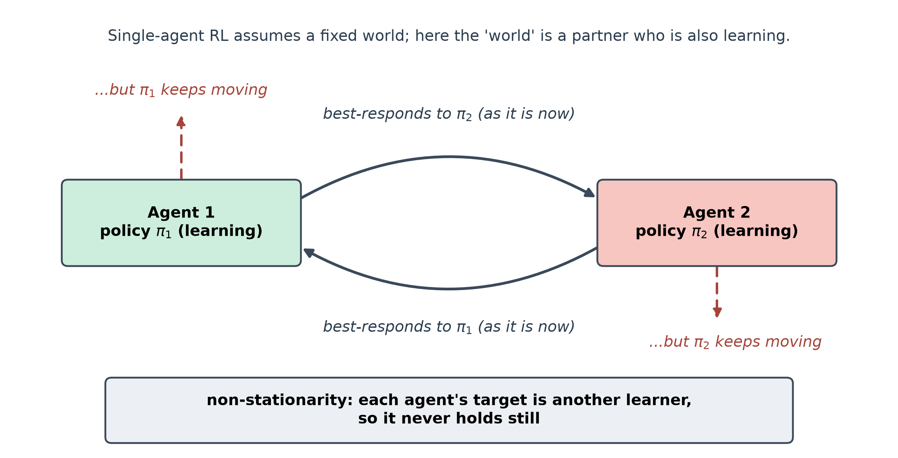
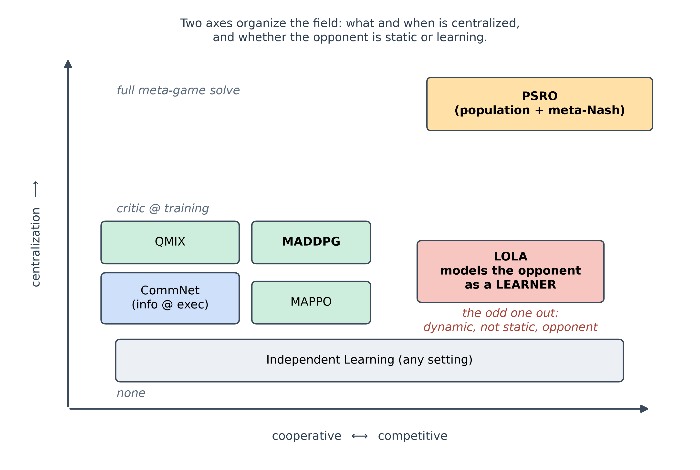
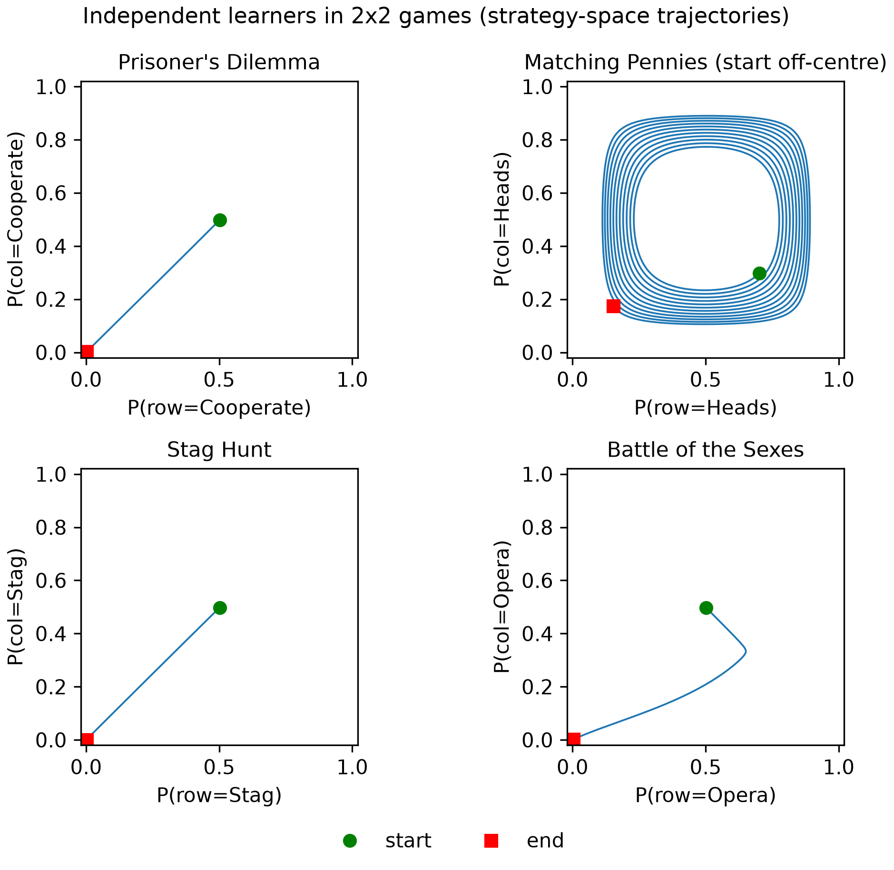
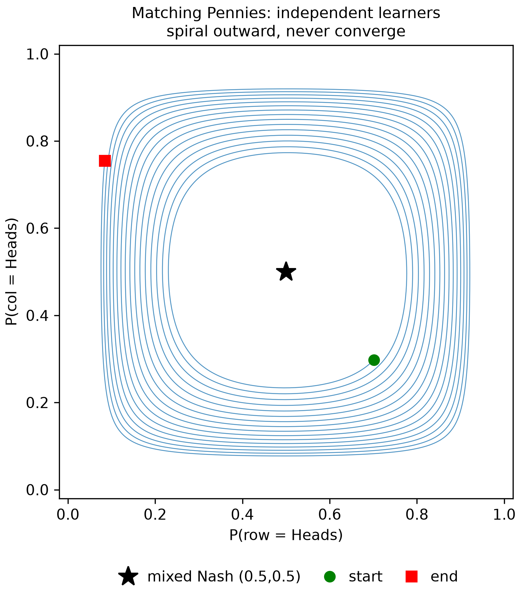
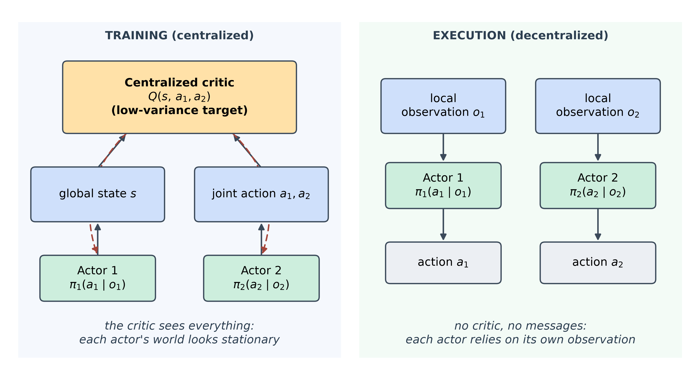
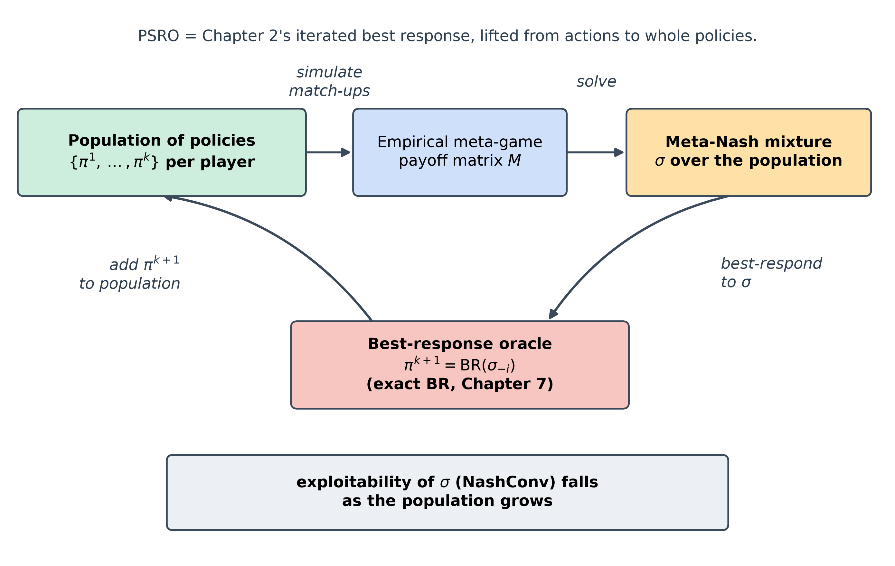
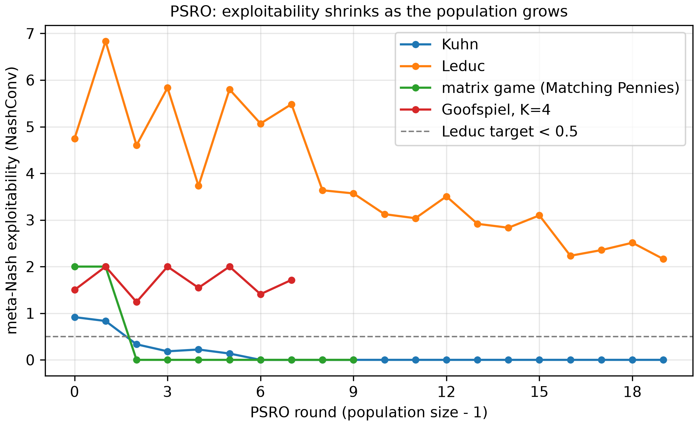
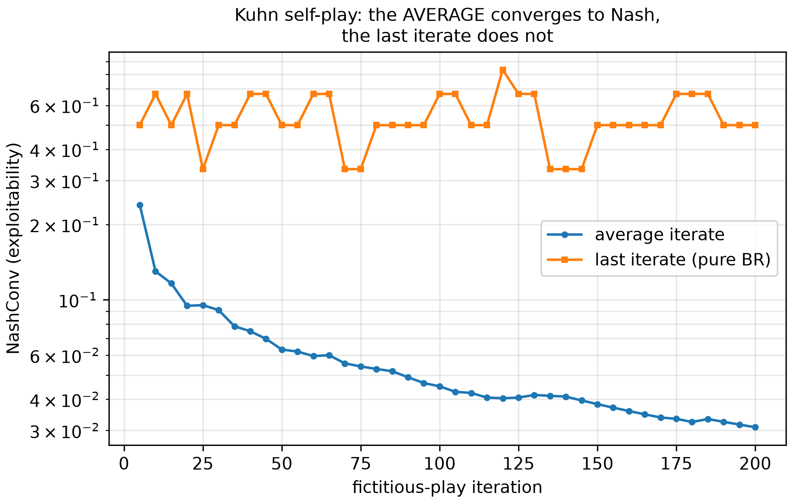
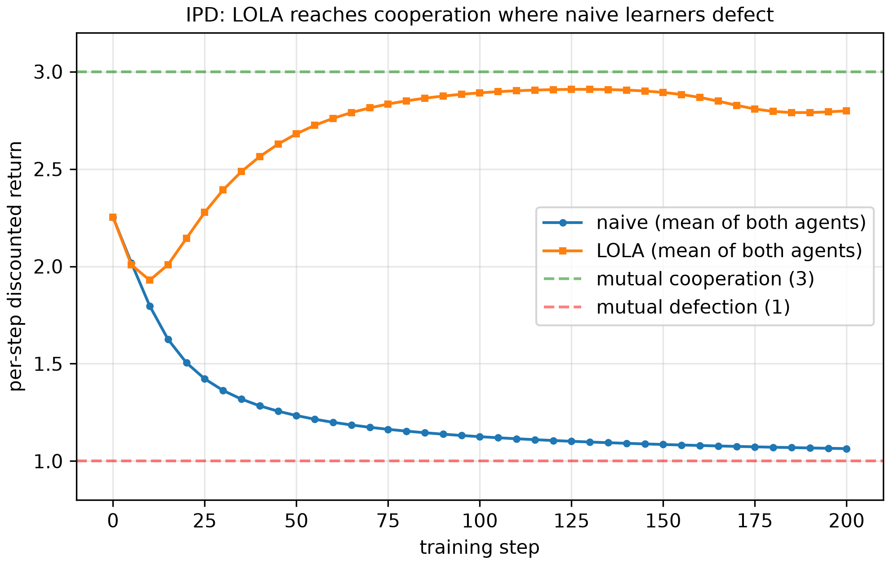

<!--
OFFICIAL PhD TITLE (keep consistent across all documents):
EN: Research on the possibilities for applying Artificial Intelligence in computer games
BG: Изследване на възможностите за приложение на изкуствения интелект в компютърни игри
-->
---
title: "Chapter 9 Summary — Multi-Agent Reinforcement Learning"
subtitle: "Research on the possibilities for applying Artificial Intelligence in computer games"
author: "Alexander Andreev"
date: "July 2026"
lang: en
vars:
  research_focus: "Adaptive Strategy Learning in Multi-Agent Imperfect-Information Environments"
---

# Chapter 9 — Multi-Agent Reinforcement Learning: Coordination, Competition, and Communication

This chapter covers multi-agent reinforcement learning (MARL): the problem that makes it
different, the mathematics that frames it, the methods that attack it, and controlled experiments
on small, exactly-solvable games. **All experimental numbers were measured** on reproducible runs
and, wherever possible, are bounded by *exact* references (Nash equilibria, exact best-response
values) rather than by other simulations. Where a run contradicted my expectation, I keep the
expectation and reconcile it with what happened — those gaps are the most instructive parts.

**Where this sits in the thesis.** Chapters 2–8 worked almost entirely inside **two-player zero-sum**
games (Pluribus in Chapter 6 being the exception that gave up the guarantees): there is a value $v^*$, a Nash strategy secures it against *any* opponent, and CFR
provably converges to it. Chapter 9 is the pivot into the **multi-agent** world, where those three
comforts weaken or vanish. It carries three thesis hooks. **LOLA** (Foerster et al., 2018) — differentiating through an
opponent's *learning step* — can be read as *dynamic* opponent modeling, the moving-target complement to
Chapter 7's static read (Contribution #1). **PSRO** — a game played over a *population of
policies* — is both a candidate framework for safe exploitation where there is no minimax theorem
(Contribution #2) and a general multi-agent *evaluation methodology* (Contribution #3). The
missing minimax anchor for $N>2$, where every two-player guarantee breaks, is named here and left
open for the thesis to attack.

---

## Why multi-agent RL is a different problem

A single agent (Chapter 1) learns against a **fixed** world: a stationary MDP, whose fixed optimal
value $Q^*$ it can converge toward. Chapters 2–8 instead computed **equilibria** — strategies
optimal against a *perfectly rational* opponent who has already finished reasoning.

Multi-agent RL sits between these two and is harder than both. Several agents **learn at the
same time in a shared world**, so from any one agent's seat the "environment" — which now
*includes the other agents* — **keeps changing** as everyone updates. This is
**non-stationarity**: agent $i$'s effective transitions and rewards depend on the others' policies
$\pi_{-i}$, which move every update, so the target $Q^*$ it chases is itself in motion. It also
creates two problems a lone agent never has: **coordination** (how do cooperating agents learn to
act together without being told how?) and **credit assignment** (when the team succeeds, whose
actions mattered?).

A picture to hold onto: **learning to dance with a partner who is also learning to dance.** If
your partner's steps were fixed, you could memorize a routine that fits them — that is
single-agent RL. If your partner were a flawless professional, you could study their known
style and prepare the perfect counter — that is equilibrium computation. But when *both* of you
are improving in real time, every adjustment you make changes what they should do, and
vice-versa; you step on each other's toes, over-correct, and oscillate — until you either lock
into a shared rhythm (a coordinated equilibrium) or cycle forever (as in Matching Pennies,
Section 9.4). The entire field is the art of *stacking the deck so the synchronization happens
reliably.*[^zhang2021]

---

## Markov games — the bridge from Chapters 2–8 to MARL

Chapters 2–8 reasoned about **extensive-form games (EFGs)**: a game tree, **information sets**,
and counterfactual values feeding CFR. MARL's standard formalism is the **Markov (stochastic)
game**, and stating the connection keeps the switch from feeling like starting over. A **Markov
game** is the tuple

$$ \big(\, \mathcal{S},\ \{\mathcal{A}_i\}_{i=1}^{N},\ P,\ \{R_i\}_{i=1}^{N},\ \{\Omega_i\},\ O,\ \gamma \,\big), $$

with states $s\in\mathcal{S}$, one action set $\mathcal{A}_i$ per agent, a transition law
$P(s' \mid s, a_1,\dots,a_N)$ driven by the **joint** action, per-agent rewards
$R_i(s,a_1,\dots,a_N)$, and (in the partially observed case) observations $o_i = O_i(s)$. Each
agent has a policy $\pi_i(a_i \mid o_i)$; together they form a **joint policy**
$\pi=(\pi_1,\dots,\pi_N)$. The special cases are exactly the previous chapters:

- $N=1$ recovers an ordinary **MDP** (Chapter 1).
- $N=2$ and a single state give a **matrix game** (zero-sum when $R_1=-R_2$; this chapter's testbed, Section 9.4).
- Sequential, imperfect-information, zero-sum gives an **EFG** (Chapters 2–8): a Markov game whose
  "state" is a *history* and whose partial observability is precisely an **information set**.

What survives the bridge is the *vocabulary*: the EFG's behavioral strategy at an information set
is exactly the Markov-game policy $\pi_i(a_i\mid o_i)$, the information set becomes the observation
$o_i$, and the counterfactual value of a history becomes a centralized critic's estimate at a
state. What does **not** survive is the *guarantees*. CFR's counterfactual decomposition needs a
game tree with perfect recall, which general Markov games (loops, simultaneous moves) do not
provide; and with $N>2$ players CFR loses its guarantee of converging to a Nash equilibrium even on
such a tree (Abou Risk & Szafron, 2010),[^abourisk2010] so MARL falls back to gradient/value
learning whose convergence is not guaranteed (hence the cycling of Section 9.4). Most
consequentially, the **minimax value anchor** disappears: in two-player zero-sum a Nash strategy
guarantees $v^*$ against any opponent — the fact that made Chapter 8's safe exploitation
coherent — and for $N>2$ there is no such single value. That missing anchor is the precise gap
Contribution #2 inherits.[^littman1994]

---

## The family of methods

Every method here is a different structural answer to "the other agents are learning while I
learn."[^albrecht2024] MADDPG and MAPPO are the two variants of centralized training with
decentralized execution (CTDE) tested here; value-factorization variants such as QMIX[^rashid2018]
are not used.

| Approach | What it does | Reach for it when | Main weakness |
|---|---|---|---|
| **Independent Learning (IL)** | each agent runs its own single-agent RL, treating others as environment | a quick baseline; near-stationary settings | non-stationarity $\to$ cycling, coordination failure |
| **MADDPG** (CTDE) | each agent's **critic** sees all agents' obs+actions at training; each **actor** sees only its own obs at execution | mixed cooperative-competitive tasks; the canonical CTDE template | critic input grows with $N$; the actor update is fiddly |
| **MAPPO** (CTDE) | plain PPO with a **centralized value** $V(\text{global state})$ and shared parameters | cooperative MARL where you want a simple, strong baseline | on-policy sample cost; "simple" but tuning-sensitive |
| **PSRO** | maintain a population of policies; solve a **meta-Nash** over it; train a **best response** to that mixture; add it; repeat | competitive/general games; when you want a game-theoretic convergence target | a full best response per round; an approximate oracle weakens the guarantee |
| **LOLA** | optimize assuming the opponent takes **one learning step**; differentiate *through* their update | 2-player differentiable games where naive learning fails (IPD) | assumes you know and can differentiate the opponent's update |
| **CommNet** | agents broadcast a **differentiable message**; each receives the **mean** of the others' and feeds it into its policy | cooperative tasks with partial observability | mean pooling discards *who* said what |

: The MARL method families: what each does, when to reach for it, and its main weakness.

Two axes cut across the table. **What is centralized, and when?** Nothing for IL; the
critic at training only for CTDE; a whole meta-game solve between rounds for PSRO; information at
execution for CommNet. **Is the opponent static or a learner?** Everything except LOLA treats the
opponent's strategy as fixed while you respond; LOLA anticipates the opponent's *next update*.

---

## Independent learning and its failure modes

The cleanest way to see *why* the rest of the field exists is to run the control that fails.
Independent learning drops each agent into its own gradient loop and pretends the others are
part of the floor. On four canonical $2\times2$ matrix games — each a different qualitative case
— it produces four different fates.

The games and their analytic Nash equilibria (ground truth): **Prisoner's Dilemma** (Defect
strictly dominates, so the unique Nash is mutual Defect); **Matching Pennies** (zero-sum; unique
fully mixed Nash $(\tfrac12,\tfrac12)$, value 0); **Stag Hunt** (two pure Nash — the
payoff-dominant (Stag, Stag) and the risk-dominant (Hare, Hare) — plus a mixed one); **Battle of
the Sexes** (two pure Nash that disagree on which to pick, plus a mixed one). Two independent
gradient learners with exact gradients (clean, noise-free dynamics) give, measured:

| Game | Measured outcome | NashConv | Matches analytic Nash? |
|---|---|---|---|
| Prisoner's Dilemma | $x \to [0.001,\,0.999]$ (Defect) | $0.0013$ | yes — the dominant-strategy equilibrium |
| Stag Hunt | all seeds $\to$ (Hare, Hare) | $0.0013$ | yes — the *risk-dominant* pure Nash |
| Battle of the Sexes | all seeds $\to$ one pure Nash | $0.0013$ | yes — a pure Nash |
| Matching Pennies | **does not converge** (last iterate drifts to the boundary) | $1.4$–$1.8$ | no — it never settles |

: Independent learners on four matrix games, against the analytic Nash equilibrium.

Three of the four converge to a genuine Nash, and the interesting details are in the "how." In
Stag Hunt the learners reliably pick the **risk-dominant** equilibrium (Hare) even though Stag
pays more — a unilateral move toward Stag is punished, so gradient dynamics slide to the safe
corner. In Battle of the Sexes every seed lands on the *same* pure equilibrium: coordination is
solved, but not in a seed-diverse way. These are the coordination and equilibrium-selection
problems made concrete.

Matching Pennies is the headline: it **never converges**, which is exactly the point.[^singh2000]

> **Reconciliation (kept prediction $\to$ what actually happened).** I predicted Matching
> Pennies would trace a clean orbit at roughly constant radius around $(\tfrac12,\tfrac12)$.
> Two learners, run two ways, both failed to converge — but neither orbited cleanly. The
> projected-gradient (IGA) learner of the exploration scripts *spirals outward* (distance-to-Nash
> grew across time-windows from $0.30$ to $0.48$); the softmax-logit learner of the
> implementation *drifts to the corners* (final profiles like $x=[0.96,0.04]$, $y=[0.03,0.97]$,
> NashConv $\approx 1.8$). The closed orbit is the right picture only for the continuous-time
> dynamics (Singh et al., 2000); with a fixed step of $0.1$ each update lands slightly outside
> the curve, so the trajectory spirals out to the boundary. The **lesson is unchanged and
> arguably sharper**: under naive simultaneous learning the *last iterate* does not converge in a
> game with only a mixed equilibrium — what converges is the *time-average* (Section 9.6).

---

## Centralized training, decentralized execution (CTDE)

The first structural fix keeps execution realistic — each agent still acts on its own
observation — while giving the *learner* a privileged view during training. In **MADDPG** (Lowe et
al., 2017) each agent's **actor** $\pi_i(a_i \mid o_i)$ sees only its own observation, but a
**centralized critic** $Q_i(s, a_1,\dots,a_N)$ sees the global state and *every* agent's action. A
per-agent critic watching only $o_i$ faces a non-stationary, partially-observed world, so its
value target is noisy; a critic conditioned on everything sees a (near-)deterministic target and
is a far lower-variance teacher. **MAPPO** (Yu et al., 2022) is the minimal version — plain PPO
with one centralized value $V(\text{global state})$ — and a strong baseline, often competitive
with more elaborate methods.

**Does the centralized critic actually have lower variance?** Measured on a one-step cooperative
"referential" task (a speaker sees a target, a listener does not, both must name it), and
trained to convergence:

| Critic | Final residual (value loss) |
|---|---|
| centralized $Q(s,\text{joint }a)$ | $3.2\times10^{-11}$ |
| independent $Q_i(o_i)$ | $0.077$ |

: Centralised against independent critics: the final value-loss residual.

The centralized critic drives its residual to essentially zero — the reward is a deterministic
function of its inputs — while the independent critic cannot see the target and is stuck
predicting the base rate. So the centralized critic fits its value target far more precisely.
That alone does not mean lower policy-gradient variance: with converged critics a centralized
critic can even increase it (Lyu et al., 2021).[^lyu2021] And a better-fitted critic is **not**
the same as solving coordination, which is where a prediction broke.

> **Reconciliation (kept prediction $\to$ what actually happened).** I predicted that on the
> Claus–Boutilier **climbing game**[^claus1998] — a stateless cooperative matrix game whose optimum (11) is
> flanked by $-30$ miscoordination penalties, with a "safe" attractor at 5 — the centralized
> critic would escape the trap and reach the optimum, beating independent learners. It did not.
> Measured greedy rewards: **independent learners 7, MADDPG 5, MAPPO 7** (optimum 11, safe 5).
> No method reached the optimum, and MADDPG actually *underperformed* both IL and MAPPO. (The
> discrete-action MADDPG variant used here replaces the deterministic policy gradient with a
> COMA-style counterfactual baseline (Foerster et al., 2018),[^foerster2018coma] so the result
> speaks for that variant, not for MADDPG as published, and its actor update is the piece to
> scrutinize next.) The honest reading: a more precise critic is **not sufficient** to overcome
> relative over-generalization[^matignon2012] plus the hard-exploration risk of the $-30$
> penalties — the agents will not try the risky joint action long enough to discover the 11.
> **CTDE buys a better critic, not automatic coordination.**

A methodological note to carry forward: both CTDE effects above, and the communication benefit
(Section 9.7), were **invisible at the fast "smoke" configuration** and appeared only when trained
at the larger "scale" configuration. The smoke config proves the code runs; the phenomena need
training to convergence.[^lowe2017]

---

## PSRO — game theory over a population of policies

The second structural fix is the through-line of the chapter and the direct descendant of Chapter 2's
iterated best response. **PSRO** (Policy-Space Response Oracles; Lanctot et al., 2017) treats
whole policies as the atoms of a higher game. It maintains a **population** of policies per
player, builds the empirical **meta-game** payoff matrix between the populations, solves a
**meta-Nash** over it, trains a **best response** (the "oracle") to the opponent's meta-Nash
mixture, and adds that response to the population — repeat. It unifies self-play, fictitious
play, and the double-oracle method under one framework, and its progress metric is
*exploitability* — the same NashConv used throughout Chapters 2–8.

The implementation is exact rather than approximate: the oracle is Chapter 7's **exact best
response** on Kuhn and Leduc, applied to the opponent's meta-Nash mixture collapsed (by Kuhn's
theorem[^kuhn1953]) to a single behavioral policy.

**Why a population and not just the last self-play policy?** Because self-play converges in the
*average*, not the last iterate. Measured on Kuhn with fictitious-play self-play: the
**average**-iterate exploitability fell from $0.24$ to $0.031$ over 200 iterations, while the
**last**-iterate exploitability kept oscillating between $0.33$ and $0.83$. PSRO's meta-mixture is
the population-level version of the averaging that CFR and fictitious play rely on.

**PSRO convergence, measured** (exploitability = NashConv of the meta-Nash mixture in the full
game):

| Game | Exploitability trajectory | Verdict |
|---|---|---|
| Kuhn Poker | $0.917 \to \sim\!2\times10^{-16}$ by round 6 | converges to machine zero |
| matrix (Matching Pennies) | $2.0 \to 0$ by round 2 | converges |
| Rock–Paper–Scissors (exploration) | $2.0 \to 0.017$; population $\to$ {R,P,S}, mixture $\to$ uniform | converges |
| Leduc Hold'em | $4.75 \to 2.16$ over 20 rounds | decreases, but far above target |
| Goofspiel ($K=3$, smoke config) | $1.33 \to 0$ | converges |
| Goofspiel ($K=4$) | oscillates $1.24 \leftrightarrow 2.0$ (8 rounds) | does not settle |

: PSRO exploitability trajectory, per game family.

On the small games the population quickly spans the strategies needed and exploitability
collapses. Two results did not go as predicted.[^lanctot2017]

> **Reconciliation 1 (Leduc).** I predicted PSRO would drive Leduc exploitability below $0.5$
> within 20 iterations. Measured, it fell from $4.75$ to $2.16$ — after strong oscillation over
> the first eight rounds (up to $6.83$) a clear decline follows, but it stays nowhere near $0.5$.
> This is **genuine slow convergence**, not a bug: Leduc's tree is far larger than Kuhn's, and a
> population of 20 *pure* best responses is too small to closely approximate its mixed Nash. The
> lesson — exploitability decreases as the population grows — holds; the *rate* is the scaling
> wall, and it rhymes with Chapter 8's global-vs-local scaling finding.

> **Reconciliation 2 (Goofspiel $K=4$).** I predicted non-increasing exploitability. At $K=3$
> (smoke config) it converged to $0$ cleanly; at $K=4$ it oscillates between $\sim\!1.2$ and $2.0$
> and does not settle. This is the one result I cannot yet explain, and per the workflow I am
> **documenting it, not fixing it**. Suspects: the Goofspiel PSRO driver never de-duplicates
> best-response policies, and a pure-strategy population is likely too weak for the larger game's
> mixed meta-Nash. Flagged as an open code item, not a validated result.

---

## Learned communication (CommNet)

CTDE centralizes information at *training*; communication centralizes it at *execution*, through
a channel the agents **learn**. In **CommNet** (Sukhbaatar et al., 2016) each agent encodes its
observation, emits a **message**, and receives the **mean** of the others' messages as extra
policy input. Trained end-to-end, the protocol emerges: on the referential task, the speaker (who
alone sees the target) must learn to encode it and the listener to decode it.

The test is sharp because without a channel the listener is capped at pure guessing, $1/K$.
Measured (scale config, $K=5$, so the guessing ceiling is $0.2$):

| Channel | Greedy team reward |
|---|---|
| communication ON | $0.795$ |
| communication OFF | $0.204$ |

: Learned communication: team reward with the channel on and off.

With the channel the listener climbs well above the $1/K$ ceiling; without it, it sits exactly at
the ceiling. Communication is doing real work — and the Section 9.5 note applies: at the smoke
configuration both numbers were $0.24$, and the benefit appeared only at scale.[^sukhbaatar2016]

---

## LOLA — modeling the opponent as a learner

Every method so far treats the opponent's strategy as fixed while you respond. **LOLA** (Learning
with Opponent-Learning Awareness; Foerster et al., 2018) is the exception, and the one most
directly connected to the thesis. Each agent optimizes against the policy the opponent will hold
*after one learning step*, and differentiates *through* that step. The extra term is a mixed
second derivative — how the opponent's update depends on *my* parameters — and it is what turns
self-interested agents cooperative.

The classic demonstration is the memory-1 **Iterated Prisoner's Dilemma** (five cooperation
probabilities per agent; closed-form discounted return). Naive gradient learners, each
maximizing its own return against the other's current policy, converge to **mutual defection**;
LOLA learners, each accounting for the other's upcoming update, reach **mutual cooperation**.
Measured (per-step discounted return; full cooperation $\approx 3$, mutual defection $\approx 1$):

| Learners | Return |
|---|---|
| naive vs naive | $1.04$ |
| LOLA vs LOLA | $2.82$ |

: LOLA against naive learners on the iterated Prisoner's Dilemma.

Cooperation emerges where naive learning defects (my prediction of $\approx 3$ was slightly
high; $2.82$ is near-cooperation). A built-in check confirms the mechanism: with the look-ahead
learning rate set to zero, LOLA's gradient reduces exactly to the naive gradient, so the
cooperation comes from the second-order look-ahead term.

Conceptually this is **dynamic** opponent modeling: Chapter 7 inferred an opponent's *current*
strategy; LOLA anticipates their *learning trajectory*. Combining the two — a static read that
seeds a dynamic look-ahead — is a candidate for Contribution #1, not a solved thing.[^foerster2018]

---

## Honest notes, limitations, and where this hands off

**What did not go as predicted.** (1) Matching Pennies at a fixed step spirals to the boundary
rather than orbiting. (2) PSRO on Leduc stalls at $\sim\!2.16$ after 20 rounds, not $<0.5$ — the
pure-population scaling wall. (3) Goofspiel $K=4$ oscillates — an unexplained code anomaly,
documented, not fixed. (4) On the climbing game no method reached the optimum and MADDPG trailed
IL. The two code items (Goofspiel $K=4$; MADDPG's counterfactual baseline) must be investigated
before those pieces are reused, and the neural claims rest on the scale numbers, not the smoke
ones.

**Trust.** Every equilibrium target is *exact* (analytic Nash for the matrix games; Chapter 7's
exact best response and NashConv for Kuhn/Leduc/Goofspiel), so the game-theoretic results are
bounded by ground truth. The neural results are qualitative inequalities (central $<$ independent;
comm ON $>$ comm OFF), seed- and version-sensitive by construction. The figures are generated from
the committed JSON results (see `../figures/README.md`).

**Backward and forward connections.** PSRO is Chapter 2's iterated best response lifted to a
population and reuses Chapter 7's exact best-response engine; the Leduc wall echoes Chapter 8.
Forward, the three hooks are concrete: LOLA as dynamic opponent modeling (Contribution #1), PSRO's
meta-game as an evaluation methodology (Contribution #3), and, above all, the **missing $N>2$
minimax anchor** (Contribution #2).

---

## Key takeaways for the thesis synthesis

- **Non-stationarity is *the* problem**, and it is structural, not a compute-budget issue —
  in Matching Pennies the last iterate does not converge no matter how long you train.
- **CTDE buys a better critic, not coordination**: residual $3.2\times10^{-11}$ vs $0.077$, yet
  the climbing game stayed unsolved.
- **PSRO is the game-theory ↔ MARL bridge**: Kuhn to machine-zero exploitability, RPS to uniform;
  Leduc declines but hits the scaling wall that motivates the thesis's scalable methods.
- **Self-play/PSRO succeed in the average/population, not the last iterate** (Kuhn average
  NashConv $0.24\to0.031$ while the last iterate oscillates) — the reason a population exists.
- **LOLA reframes the opponent as a learner** and turns IPD defection into cooperation
  ($1.04\to2.82$) — the dynamic complement to Chapter 7's static opponent model (Contribution #1).
- **The $N>2$ minimax gap is the open door to the thesis** (Contribution #2): the vocabulary of
  Chapters 2–8 crosses into MARL, but the safety anchor does not.

<!-- Source footnotes. Definitions may sit anywhere at top level; keeping them
     together here keeps the prose readable and the EN/BG pair easy to compare. -->

[^zhang2021]: Zhang, K., Yang, Z. & Başar, T. (2021). "Multi-Agent Reinforcement Learning: A Selective Overview of Theories and Algorithms." *Handbook of RL and Control* — §1–2 for non-stationarity and the taxonomy used here.

[^littman1994]: Littman, M. L. (1994). "Markov Games as a Framework for Multi-Agent Reinforcement Learning." *ICML* — the paper that introduced this framing and the minimax-Q algorithm.

[^albrecht2024]: Albrecht, S. V., Christianos, F. & Schäfer, L. (2024). *Multi-Agent Reinforcement Learning: Foundations and Modern Approaches* (MIT Press), Ch. 5 and 9 — a current textbook treatment of these challenges and methods.

[^singh2000]: Singh, S., Kearns, M. & Mansour, Y. (2000). "Nash Convergence of Gradient Dynamics in General-Sum Games." *UAI* — the analysis of why gradient ascent cycles rather than converges in games like Matching Pennies.

[^lowe2017]: Lowe, R. et al. (2017). "Multi-Agent Actor-Critic for Mixed Cooperative-Competitive Environments." *NeurIPS* (MADDPG); and Yu, C., Velu, A., Vinitsky, E., Gao, J., Wang, Y., Bayen, A. & Wu, Y. (2022). "The Surprising Effectiveness of PPO in Cooperative, Multi-Agent Games." *NeurIPS Datasets and Benchmarks Track*. arXiv:2103.01955 (MAPPO).

[^lanctot2017]: Lanctot, M. et al. (2017). "A Unified Game-Theoretic Approach to Multiagent Reinforcement Learning." *NeurIPS* (PSRO). Related: McMahan, H. B., Gordon, G. & Blum, A. (2003). "Planning in the Presence of Cost Functions Controlled by an Adversary." *ICML* (the double-oracle method PSRO generalizes); Tuyls, K. et al. (2020). "Bounds and dynamics for empirical game theoretic analysis." *Autonomous Agents and Multi-Agent Systems* 34(1), art. 7. DOI 10.1007/s10458-019-09432-y (EGTA).

[^sukhbaatar2016]: Sukhbaatar, S., Szlam, A. & Fergus, R. (2016). "Learning Multiagent Communication with Backpropagation." *NeurIPS* (CommNet).

[^foerster2018]: Foerster, J., Chen, R. Y., Al-Shedivat, M., Whiteson, S., Abbeel, P. & Mordatch, I. (2018). "Learning with Opponent-Learning Awareness." *AAMAS*, 122–130. arXiv:1709.04326 (LOLA).

[^abourisk2010]: Abou Risk, N. & Szafron, D. (2010). "Using Counterfactual Regret Minimization to Create Competitive Multiplayer Poker Agents." *AAMAS*, 159–166 — CFR's convergence guarantee covers two-player zero-sum games with perfect recall; with more players it is lost.

[^lyu2021]: Lyu, X., Xiao, Y., Daley, B. & Amato, C. (2021). "Contrasting Centralized and Decentralized Critics in Multi-Agent Reinforcement Learning." *AAMAS*, 844–852. arXiv:2102.04402 — with converged on-policy critics, a centralized critic gives the decentralized actors higher-variance updates. Journal version: Lyu, X., Baisero, A., Xiao, Y., Daley, B. & Amato, C. (2023). *JAIR* 77, 295–354. DOI 10.1613/jair.1.14386.

[^claus1998]: Claus, C. & Boutilier, C. (1998). "The Dynamics of Reinforcement Learning in Cooperative Multiagent Systems." *AAAI*, 746–752.

[^matignon2012]: Matignon, L., Laurent, G. J. & Le Fort-Piat, N. (2012). "Independent reinforcement learners in cooperative Markov games: a survey regarding coordination problems." *Knowledge Engineering Review* 27(1), 1–31. DOI 10.1017/S0269888912000057.

[^foerster2018coma]: Foerster, J., Farquhar, G., Afouras, T., Nardelli, N. & Whiteson, S. (2018). "Counterfactual Multi-Agent Policy Gradients." *AAAI* 32(1). DOI 10.1609/aaai.v32i1.11794 (COMA).

[^rashid2018]: Rashid, T., Samvelyan, M., Schroeder de Witt, C., Farquhar, G., Foerster, J. & Whiteson, S. (2018). "QMIX: Monotonic Value Function Factorisation for Deep Multi-Agent Reinforcement Learning." *ICML*. arXiv:1803.11485.

[^kuhn1953]: Kuhn, H. W. (1953). "Extensive Games and the Problem of Information." *Contributions to the Theory of Games II*, 193–216. DOI 10.1515/9781400881970-012.
