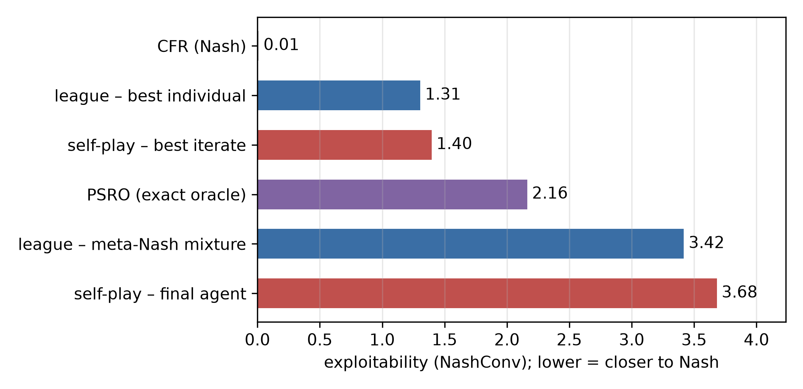

<!--
OFFICIAL PhD TITLE (keep consistent across all documents):
EN: Research on the possibilities for applying Artificial Intelligence in computer games
BG: Изследване на възможностите за приложение на изкуствения интелект в компютърни игри
-->

# Стъпка 10 - Обучение, базирано на популации и еволюционна теория на игрите: Експериментален доклад

**Тестови среди:** четири симетрични матрични игри за еволюционно-динамичната половина (Дилемата на затворника, Ястреб–Гълъб, Камък–Ножица–Хартия, Лов на елен); синтетична стълбица на чистото умение; мета-играта на най-добър отговор PSRO върху Ледюк Холдем; и малка **PBT лига** в стил alphaStar от невронни PPO агенти, играещи Ледюк Холдем. Двигателят за Ледюк, точният предсказвач за най-добър отговор и NashConv/експлоатируемост са взети от стъпка 07 (използвани изцяло); PSRO и решавачът на мета-Наш са от стъпка 09. Невронните агенти се обучават с pyTorch, след което се извличат към *таблични* политики, така че **точният** най-добър отговор от стъпка 07 да може да ги оценява.

**Връзка с дисертацията:** популационното ниво на тезата. Три връзки: **основните експлоатьори като автоматизирани моделиращи съперника** (Принос №1, популационният лифт на байесовото четене от стъпка 07); **AlphaStar League като механизъм за безопасна експлоатация на популацията, чиято гаранция липсва** (Принос №2); и **EGTA / мета-Наш като методология за оценяване на популацията** (Принос №3).

**Обхват на резултатите:** всяко число в този доклад е **измерено от реален прогон** и извлечено от артефактите в `implementation/step10/implementation/results/{smoke,scale}_results.json` и `implementation/step10/exploration/figures/*.json`. Еволюционните резултати са съпоставени с *аналитични* препратки (ESS / наш равновесие за всяка матрична игра), а резултатите от лигата - с **точния** експлоатируемост от стъпка 07. Три прогнози от фаза 4 бяха **опровергани** от прогона в мащаб; съгласно РАБОТЕН ПРОЦЕС §0.1 те се запазват така, както са формулирани и се съгласуват с действително настъпилото (§8).

> **Как да се чете този доклад.** И двете части следват една и съща дъга: **какво тестваме -> как -> резултати -> заключение.** **Част I (§1-§3)** използва еволюционна теория на игрите като *диагностичен обектив*: репликаторна динамика върху решими матрични игри, след това транзитивното/цикличното разлагане „пумпал“. **Част II (§4-§7)** изгражда и оценява **PBT лигата**: динамика на обучението, EGTA/мета-Наш, разнообразие + Elo и директен сблъсък срещу PSRO / самообучение / CFR-Nash. §8 съгласува трите опровергани прогнози; §9-§11 обхващат доверие, ограничения и насоки; §12 изброява командите за възпроизвеждане.

---

# ЧАСТ I - ЕВОЛЮЦИОННА ТЕОРИЯ НА ИГРИТЕ КАТО ДИАГНОСТИЧЕН ОБЕКТИВ

## 1. Какво разглежда тази стъпка

Стъпки 2–9 разглеждаха равновесията на *фиксирана* игра. Стъпка 10 преминава към по-високо ниво - **популации от стратегии, които се променят във времето**, и поставя два въпроса, на които един агент не може да отговори: *кои стратегии нарастват?* (репликаторна динамика) и *тази игра изобщо ли има „най-добра“ стратегия или само колело от броячи?* (транзитивно/циклично разлагане). Тези два инструмента представляват диагностиката, необходима за обучението, базирано на популации в Част II - защото дали една самообучаваща се популация ще сходява или ще циклира зависи от структурата на играта, а не от скоростта на обучение. Всички еволюционни числа в Част I са детерминистични (фиксирани начални стойности, точна динамика), така че въпросът „сходи ли?“ има еднозначен отговор.

---

## 2. Експеримент 1 - репликаторна динамика върху четири матрични игри

**Какво тестваме.** Възпроизвеждат ли репликаторната динамика еволюционния *аналитичен* резултат за всяка игра - сходимост към доминираща стратегия, към вътрешно ESS, към басейнозависим чисто ESS или неконвергентна орбита? (Проверка на суровите стъпки, L530–533.)

**Как.** Дискретна интеграция на репликатора на Ойлер от инициализирано начало от вътрешността; „сходим“ означава, че последната итерация е спряла да се променя; „орбитален радиус“ е разстоянието, което траекторията поддържа от равномерната точка. Аналитично равновесие на Еволюционно стабилни стратегии/Наш служи като референтна стойност. Данни: `results/smoke_results.json` (блок „replicator“), фазови портрети в `exploration/figures/replicator_playground.json`.

| Игра | Аналитична референция | Начало $x_0$ | Краен $x$ | Сходим? | Орбитален радиус |
|---|---|---:|---:|:--:|---:|
| Дилемата на затворника | Дефектът доминира; уникално ESS $(0,1)$ | $[0.666,0.334]$ | $[0.0, 1.0]$ | да | $0.707$ |
| Ястреб-гълъб | вътрешно ESS $p(\text{Hawk})=V/C=0.5$ | $[0.548,0.452]$ | $[0.5, 0.5]$ | да | $0.0$ |
| Камък-ножица-хартия | Наш равновесие = равномерно; **няма ESS** (център) | $[0.347,0.385,0.268]$ | $[0.299,0.288,0.413]$ | **не** | $0.095$ |
| Лов на елен ($x_0=[0.8,0.2]$) | две чисто ESS (басейнозависим) | $[0.8,0.2]$ | $[1.0, 0.0]$ | да | $0.707$ |
| Лов на елен ($x_0=[0.2,0.8]$) | две чисто ESS (басейнозависим) | $[0.2,0.8]$ | $[0.0, 1.0]$ | да | $0.707$ |

**Резултати.** И четирите съвпадат напълно с теорията. Дилемата на затворника се свежда до all-Defect (доминиращата стратегия). Ястреб–гълъб сходява към вътрешната смесена ESS точно при $0.5$ (орбитален радиус $0.0$ - тя *достига* равновесната точка). Камък–ножица–хартия **не сходява**: тя обикаля около равновесната точка с постоянен радиус ($0.095$), тъй като вътрешната неподвижна точка е център, а не атрактор. Лов на елен попада върху *различни* чисто ESS в зависимост от началото - $[0.8,0.2]\to$ all-Stag, $[0.2,0.8]\to$ all-Hare - двата басейна се проявяват ясно.

**Заключение.** Репликаторната динамика представлява непрекъсната идеализация на подбора на популация, а нейните равновесни точки съответстват точно на nash/ESS. Тази, която *не сходява* - RPS - е основната причина за съществуването на Част II: циклична игра няма стабилна популация, поради което самообучаваща се популация в нея ще се върти, вместо да достигне равновесие.


---

## 3. Експеримент 2 - пумпалът: транзитивна спрямо циклична структура

**Какво тестваме.** Можем ли да разложим матрицата на печалбата на една игра на **транзитивен** (скала на уменията) компонент и **цикличен** (камък-ножица-хартия) компонент, и дали това разлагане правилно идентифицира чистите случаи и диагностицира реални популации? (проверка на суровите стъпки, L532, L534.)

**Как.** Комбинаторно-**Hodge** разлагане (на база разлика в рейтингите) на антисиметризираната матрица на печалбата, което отчита транзитивно и циклично съотношение (ортогонални величини, които се събират квадратурно до 1). Допълнително представяме **sVD rank-1** транзитивното съотношение, изчислено чрез суровите стъпки за RPS, с цел да документираме неговия известен провал. Данни: `results/{smoke,scale}_results.json` (блок `spinning_top`), `exploration/figures/game_landscape.json`.

| Популация | Транзитивно съотношение (Hodge) | Циклично съотношение (Hodge) | Трицикли | Бележка |
|---|---:|---:|---:|---|
| Камък-ножица-хартия | $0.0$ | $1.0$ | $1$ | sVD rank-1 неправилно дава $0.707$ |
| Чиста скала на уменията | $1.0$ | $0.0$ | $0$ | монотонна сила |
| Мета-игра PSRO-Ледюк (smoke, 8 рунда) | $0.457$ | $0.890$ | - | предимно циклична |
| Мета-игра PSRO-Ледюк (мащаб, 20 рунда) | $0.411$ | $0.912$ | $27$ | предимно циклична |
| Моментна снимка на лигата мета-игра (smoke / мащаб) | $0.981$ / $0.937$ | - | - | предимно транзитивна |

**Резултати.** Разлагането на Ходж точно определя чистите случаи: RPS е $0.0$ транзитивен / $1.0$ цикличен (един трицикъл), а скалата на уменията е $1.0$/$0.0$. Методът **sVD rank-1**, предложен вместо това от суровите стъпки, неправилно отчита RPS като $\approx0.707$ транзитивен - грешно, тъй като антисиметрично приближение с ранг 1 не може да представи чист цикъл; за диагнозата се използва именно методът на Ходж. Двете *реални* популации се различават рязко: **мета-играта на най-добър отговор PSRO върху Ледюк е предимно циклична** ($\approx0.41$–$0.46$ транзитивен, 27 трицикли), докато **моментната снимка на лигата мета-игра е предимно транзитивна** ($\approx0.94$–$0.98$).

**Заключение.** Транзитивното/цикличното съотношение представлява *предварителна диагностика на обучението*. Две популации, извлечени от една и съща игра (Ледюк), имат противоположна структура в зависимост от начина им на формиране (най-добри отговори спрямо моментни снимки на обучението - виж §8.2). Това е именно инструментът, който предсказва дали наивното самообучение/PBT ще сходи или ще циклира, и това е диагностиката, която дисертацията прилага в следващите стъпки.


---

# ЧАСТ II - ЛИГАТА С PBT

## 4. Какво представлява лигата и как се оценява

Втората половина изгражда малка **AlphaStar-style League** върху Ледюк Холдем с три типа агенти - **основни** агенти (продуктът), **основни експлоатьори** (търсят слабости в настоящите основни) и **експлоатьори в лигата** (търсят слабости навсякъде във замразената история) - плюс периодично **замразяване** на снимки в музей и **PFSP** сдвояване (по-често срещане с по-трудни опоненти). Агентите са **невронни PPO мрежи** върху **кодиране на информационно състояние** за Ледюк; PBT копира най-добрите агенти (експлоатация) и променя тяхната **скорост на обучение / ентропия** (изследване). От решаващо значение е, че всяка мрежа се извлича в **таблична стратегия**, така че **точният** най-добър отговор от Стъпка 07 измерва нейната **експлоатируемост** - същият NashConv показател, използван още от Стъпка 2. Две конфигурации: **smoke** (7 активни агенти, 15 епохи) и **scale** (8 активни агенти, 120 епохи, 48 замразени снимки).

---

## 5. Експеримент 3 - динамика на обучението в лига

**Какво тестваме.** Намалява ли експлоатируемостта на лигата по време на обучението и отразява ли мета-Наш равновесието на популацията това подобрение? (Проверка на суровите стъпки, L535, L537.)

**Как.** На всяка епоха се записва минималната експлоатируемост сред основните агенти и експлоатируемостта на текущата мета-Наш смес; също така се записват транзитивното съотношение на мета-играта в моментната снимка на лигата и крайното ЕЛО. Данни: `results/{smoke,scale}_results.json` (блок `league`).

| Метрика | Smoke (15 епохи) | Scale (120 епохи) |
|---|---|---|
| минимална експлоатируемост при основен отговор | $4.67 \to 3.04$ (монотонно, завършва на мин) | $4.73 \to$ **мин $\approx1.21$** (еп ~64) $\to$ **$2.05$** (еп 119) |
| експлоатируемост на мета-Наш равновесие | $4.73 \to 3.04$ | $5.01 \to$ мин $\approx1.32$ (плато $1.60$) $\to$ **$2.96$** (еп 119) |
| транзитивно съотношение на мета-играта в лигата | $0.981$ | $0.937$ |
| крайно ело на активните агенти | $1176$–$1211$ | $1198$–$1210$ |

**Резултати.** Smoke показва ясно монотонно намаляване и достига своя минимум ($3.04$) - но 15 епохи са твърде кратки, за да се разкрие какво следва. Мащабът обаче показва друго: експлоатируемостта спада рязко до минимум около епоха 60–65 (**мин-основен $\approx1.21$**, мета-Наш достига дъно $\approx1.32$ и след това се задържа на $\approx1.60$ плато), а впоследствие **регресира** обратно до $\approx2.05$ (мин-основен) и $\approx2.96$ (мета-Наш) към епоха 119. Разпределението на ЕЛО е стеснено (всички активни агенти са в рамките на $\approx15$ точки), което съответства на популация с близко поведение.

**Заключение.** Лигата действително води до силно ранно подобрение - но подобрението **не е монотонно при мащаб**: под постоянен натиск на експлоатьорите, активните основни агенти ги преследват и губят позиции спрямо абсолютната експлоатируемост в късния етап на обучението. Най-добрите агенти се улавят като *замразени моментни снимки* по средата на изпълнението. Тази немонотонност е честното заключение от мащабния експеримент и е разгледана в §8.3.


---

## 6. Експеримент 4 - EGTA, мета-Наш и разнообразие

**Какво изследваме.** (a) Дали мета-Наш равновесието на финалната популация е по-малко експлоатируемо от всеки отделен агент (очакваната стойност за стъпка, L536)? (b) Колко разнообразна е популацията (ефективен размер, поведенческо групиране, покритие на експлоатация - L538)?

**Как.** Изграждане на емпирична симетрична матрица на печалбата върху всички агенти (живи и замразени), определяне на мета-Наш сместа, свеждането ѝ до една поведенческа стратегия и измерване на нейната точна експлоатируемост спрямо най-добрия индивид. Разнообразие: ефективен размер на популацията (коефициент на участие на мета-Наш тегла), клъстеризация на поведенчески стратегии чрез единична връзка и покритие на експлоатация. Данни: `results/{smoke,scale}_results.json` (`league.egta`, `league.diversity`). Игрова интуиция: `exploration/figures/mini_pbt.json`.

*(a) Мета-Наш спрямо най-добрия индивид:*

| Конфигурация | експлоатируемост на мета-Наш равновесие | най-добър индивид | мета-Наш $\le$ най-добър? |
|---|---:|---:|:--:|
| Smoke | $2.665$ | $2.665$ | **да** (всички тегла върху най-добрия агент) |
| Scale | $3.418$ | $1.305$ | **не** (разпределение на тегла `0.645`+опашка) |

*(б) Разнообразието:*

| Метрика | Smoke | Мащаб |
|---|---|---|
| агенти / активни (участие) | $16$ / $1$ ($1.00$) | $56$ / $3$ ($1.92$) |
| поведенчески клъстери (праг $0.30$) | $1$ (максимално разстояние между двойки $0.255$) | $1$ (максимално разстояние между двойки $0.484$) |
| покритие на експлоатация | $0.625$ | $0.571$ |

**Резултати.** (а) В smoke мета-Наш равновесието поставя всички тегла върху единствения най-добър агент, така че мета-Наш $=$ най-добър $=2.665$ (прогнозата се потвърждава тривиално). При мащаб мета-Наш равновесието разпределя тегла и неговата колапсирала смес е *повече* експлоатируема ($3.418$), отколкото най-добрият единичен член ($1.305$) - прогнозата **не се потвърждава** (§8.1). (б) Популацията е само слабо разнообразна: коефициентът на участие нараства от $1$ до $1.9$, но поведенческото групиране колапсира всичко в един **единствен клъстер** и при двата мащаба (въпреки че максималното разстояние между двойки в популацията при мащаб $0.484$ надвишава прага от $0.30$ - единичната връзка обединява веригата). Играчката mini-PBT прави механизма ясен: при транзитивен дилемата на затворника разнообразието колапсира до $0$; при цикличен RPS то се върти безкрайно ($0.07$–$0.29$).

**Заключение.** EGTA предоставя експлоатируемост на ниво популация, но се открояват два извода: смесването на поведенчески стратегии чрез мета-Наш равновесието **не** гарантира по-малко експлоатируем резултат (§8.1), а разнообразието в PBT тук е *на ниво тегло*, а не *на ниво поведение* - агентите са почти идентични, така че „популацията“ е по-оскъдна, отколкото размерът ѝ предполага.


---

## 7. Експеримент 5 - сравнение между лига, PSRO, самообучение и cFR-Nash

**Какво тестваме.** Как се сравнява лигата с алтернативните методи - точен PSRO, обикновено самообучение и cFR-Nash - по отношение на експлоатируемостта в Ледюк? (проверка на суровите стъпки, ред L539.)

**Как.** Изпълнете всеки метод до бюджета в неговата конфигурация и отчетете крайната експлоатируемост. Записът за лигата е нейният **най-добър индивид** (най-силната замразена моментна снимка); PSRO използва точния BR предсказвач; cFR-Nash представлява долната граница на Наш. Данни: `results/{smoke,scale}_results.json` (`league`, `baselines`).

| Метод | Smoke | Scale | Бележка |
|---|---:|---:|---|
| CFR-Nash (долна граница) | $0.033$ (2k итерации) | $0.0099$ (20k итерации) | приблизително равновесие на Наш, целевата долна граница |
| **Лига - най-добър индивид** | $2.665$ | **$1.305$** | най-силната замразена моментна снимка |
| PSRO (точен BR двигател) | $3.037$ (12 рунда) | $2.163$ (20 рунда) | Стъпка 09's стената на Ледюк |
| Самообучение | $3.140$ | $3.683$ | обикновен най-добър отговор към последната итерация |
| Лига - мета-Наш смес | $2.665$ | $3.418$ | виж §8.1 |

**Резултати.** В мащаб **най-добрият индивид** на лигата ($1.305$) е най-силният сред научените методи - по-добър от точния PSRO ($2.163$) и самообучението ($3.683$) - въпреки че всички остават далеч над долната граница на CFR-Nash ($0.0099$). **Мета-Наш сместа** на лигата ($3.418$), напротив, е *най-слабата*, дори по-лоша от самообучението (§8.1). Самообучението всъщност се *влошава* при преминаване от smoke към scale, което е съгласувано с несходимост при последна итерация.

**Заключение.** Лигата се оказва добър производител на силни индивиди - най-добрата ѝ моментна снимка превъзхожда PSRO и самообучението - но сместа не е такава, като нито един от научените методи не достига долната граница на exact-CFR за Ледюк. От една лига следва да се изпрати избран член, а не мета-Наш сместа (§8.1).



---

## 8. Съгласуване на прогноза <-> реалност

Съгласно РАБОТЕН ПРОЦЕС §0.1, опроверганите прогнози от фаза 4 се запазват и се съгласуват, а не се редактират мълчаливо. Три пропуски.

1. **Мета-Наш на лигата $\le$ най-добър индивид (§6a).** *Предвидено* (суров стъпков изходен контролен списък, L536): мета-Наш е по-малко експлоатируем от всеки отделен агент. *Измерено:* вярно при smoke ($2.665=2.665$, всички тегла върху най-добрия агент), **невярно при мащаб** ($3.418 > 1.305$). *Съгласуване:* не е грешка в смесването - идентичният път на кода `mixture_behavioral_policy` даде мета $=$ най-добър при smoke. Мета-Наш минимизира **мета-игрово съжаление** (победа срещу популацията), което е *различна цел* от минимизиране на **пълната експлоатируемост на играта*; и реализационно претеглена смес от поведенчески стратегии може да бъде *повече* експлоатируема от своите компоненти, защото сместа въвежда „разкриващи“ знаци в информационен набор, които най-добрият отговорчик наказва. Урокът се обръща и изостря: оценката на популацията трябва да измерва експлоатируемостта на колапсирала смес директно и, на практика, да изпраща избран член, а не самата смес.

2. **Мета-играта на Ледюк е транзитивна (§3).** *Предвидено:* интуитивният документ представи покера като скала на уменията. *Измерено:* мета-играта с **най-добри отговори** на PSRO е предимно циклична ($\approx0.41$-$0.46$ транзитивна, 27 трицикли), докато мета-играта с **моментни снимки** на лигата е предимно транзитивна ($\approx0.94$-$0.98$). *Съгласуване:* не е грешка - популация от най-добри отговори циклира (А побеждава сместа, Б побеждава А, по-късен най-добър отговор побеждава Б; пумпалът на Балдуци), докато популация от моментни снимки на траекториите на обучение формира стълба, защото по-късните моментни снимки са предимно по-силни. Структурата е свойство на *популацията*, а не само на играта; и двете измервания са верни и поучителни.

3. **Експлоатируемостта на лигата намалява монотонно (§5).** *Предвидено:* монотонно намаляване. *Измерено:* при smoke ($15$ епохи) намалява чисто и завършва в своя минимум ($3.04$); при мащаб ($120$ епохи) спада до минимум около епоха 60 (мин-основни $\approx1.21$, мета-Наш $\approx1.32$/плато $1.60$) и след това **регресира** до $\approx2.05$ / $\approx2.96$ към епоха 119. *Съгласуване:* честна, вероятно реална нестабилност при обучението, видима едва когато обучението е достатъчно дълго - под постоянен натиск на експлоатьорите активните основни агенти преследват своите експлоатьори и губят позиции в абсолютната експлоатируемост (разместване / частично забравяне). Най-добрите агенти са замразените моментни снимки от средата на изпълнението, което е точно причината най-добрият индивидуален показател (§7) да е силен, докато късните активни агенти не са. Документирано, но не поправено; естественото средство за защита е съхраняване на най-добрия модел / регуляризация на популацията (§11). Това отразява методологичното правило от Стъпка 09: **мащабът разкрива онова, което smoke скрива.**

---

## 9. Достоверност и достатъчност на извадката

- **Еволюционните резултати са ограничени от аналитични референции.** Всеки изход на репликатора се проверява спрямо аналитичното равновесие на Еволюционно стабилни стратегии/Наш на играта; съотношенията на пумпала се проверяват спрямо чистите случаи (RPS $=0.0$, скала на уменията $=1.0$). Те са детерминистични и абсолютно възпроизводими.
- **Експлоатируемостта на лигата е *точният* NashConv от Стъпка 07**, а не симулация: всяка невронна стратегия се извлича в таблична стратегия и се оценява чрез точен най-добър отговор, така че въпросът „колко експлоатируем е този агент/смес?“ е проверен на място, а не оценен.
- **Обучението на невронна мрежа е чувствително към seed и използваната библиотека.** Лигата представлява едно PBT изпълнение за всяка конфигурация; *качествените* констатации (ранно подобрение; най-добрият индивид < PSRO < самообучение; късна регресия при мащаб; мета-Наш > най-добър член при мащаб) са надеждните твърдения, а не величините с трети знак след десетичната запетая.
- **Метриките за разнообразие са чувствителни към прагове.** Резултатът от единствената група зависи от прага на $0.30$ единична връзка; той трябва да се чете като „поведенчески сходни“, а не „доказуемо една стратегия“.

---

## 10. Ограничения (подредени според степента на влияние върху заключенията)

1. **Регресия при късно обучение при мащаб (§5, §8.3)** - лигата не показва монотонно подобрение; докато съхраняване на най-добрия модел/регуляризация не бъдат добавени и изпълнението не бъде повторено, твърдението „лигата се подобрява“ е валидно единствено за *първата половина* от обучението и за *замразения най-добър*, а не за активните агенти.
2. **Мета-Наш смес по-експлоатируема от най-добрия член (§6a, §8.1)** - това означава, че оценката на популацията не трябва да представя сместа като силата на лигата; правилният артефакт е избраният член.
3. **Ниско поведенческо разнообразие (§6b)** - коефициентът на участие $1.9$ и единственият поведенчески клъстер показват, че „популацията“ е почти дегенерирала; ползите от разнообразието, които AlphaStar докладва при ~600 агента, не се проявяват в този мащаб.
4. **Еднократно изпълнение на невронните резултати (§9)** - посоката е надеждна, но величината е несигурна.
5. **Игрови мащаб през цялото време** - Ледюк и малки матрични игри; нищо оттук не трябва да се екстраполира към дълбоко обучение с подкрепление в лиги с мащаба на AlphaStar.

---

## 11. Заключения и насоки за бъдещи изследвания

**Заключения.** Част I представя диагнозата: репликаторната динамика възпроизвежда всяко аналитично равновесие на Еволюционно стабилни стратегии/Наш (включително неконвергиращата орбита на RPS), а декомпозицията тип пумпал на Ходж ясно разграничава уменията от циклите - показвайки, че *същата* игра (Ледюк) е цикличена като популация на най-добри отговори, но транзитивна като моментна популация. Част II изгражда лигата и я оценява чрез точна експлоатируемост: тя създава силни *индивиди* (най-добър моментен модел $1.305$, побеждаващ PSRO $2.163$ и самообучение $3.683$), но три прогнози се оказаха неверни - мета-Наш сместа е *по-* експлоатируема от най-добрия си член в мащаб, мета-играта на най-добър отговор за Ледюк е *циклична*, а не транзитивна, и експлоатируемостта на лигата *регресира* късно при дълго обучение. Популационният механизъм функционира, но не предоставя гаранция за монотонност или безопасност - което представлява самата празнина в тезата.

**Насоки за бъдещи изследвания** (всяка е свързана с измерен ефект):

- *Съхраняване на най-добрия модел / регуляризация на популацията* - насочено е директно към късната регресия (§8.3); повторно изпълнение, за да се установи дали празнината в гаранциите е проблем на обучението или на дизайна.
- *Докладване на избрания елемент или метарешавател с регуляризация за разнообразие* - провалът на мета-Наш-смесването (§8.1) мотивира или изпращане на най-добър устойчив на отговор елемент, или промяна на метацелта.
- *Прилагане на транзитивната/циклична диагностика към игрите всеки срещу всеки в стъпка 11* - директно тестване на прогнозата за „голям цикличен компонент“, където се очаква наивният PBT да проявява цикъл.
- *Формализиране на безопасността на популацията без минимакс котва (Принос №2)* - експлоатационният механизъм е евристичен; §8.1/§8.3 показват, че той не гарантира неексплоатируема популация.

---

## 12. Възпроизвеждане на резултатите

От `implementation/step10/implementation/`, с активирана проектна виртуална среда `.venv`:

```bash
# validation harness (PASS/FAIL/SKIP against the raw-step targets)
python validate.py

# full comparison runs -> results/{smoke,scale}_results.json
python tournament.py --config smoke
python tournament.py --config scale

# plots from a results JSON -> plots/*.png  (needs matplotlib)
python plotting.py --config scale
```

От `implementation/step10/exploration/` (фигурите от Част I и съответните JSON файлове):

```bash
python replicator_playground.py     # replicator phase portraits + JSON
python game_landscape.py            # transitive/cyclic ratios (RPS / skill / PSRO-Leduc)
python mini_pbt.py                  # diversity collapse vs churn
python psro_population_peek.py      # PSRO population dynamics on Leduc
```

Семената са фиксирани в `config.py` (реализация) и в конфигурацията на всеки сценарий за изследване. Еволюционните резултати и тези от пумпал са точно възпроизводими; резултатите от невронната лига са посокоустойчиви при различни семена. Всички числа в този доклад са прочетени от `results/{smoke,scale}_results.json` и `exploration/figures/*.json`.
