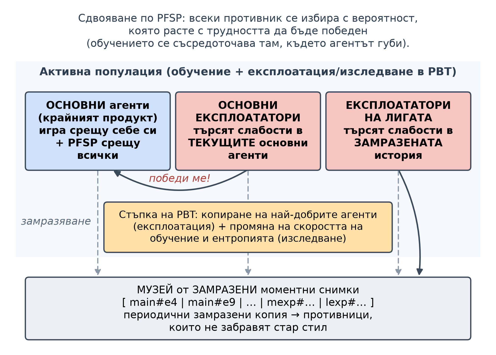
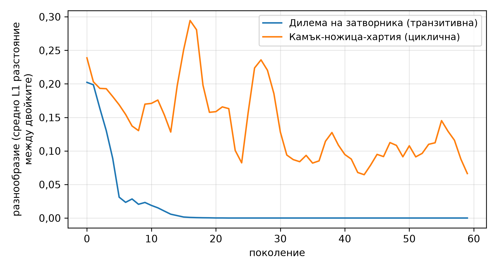
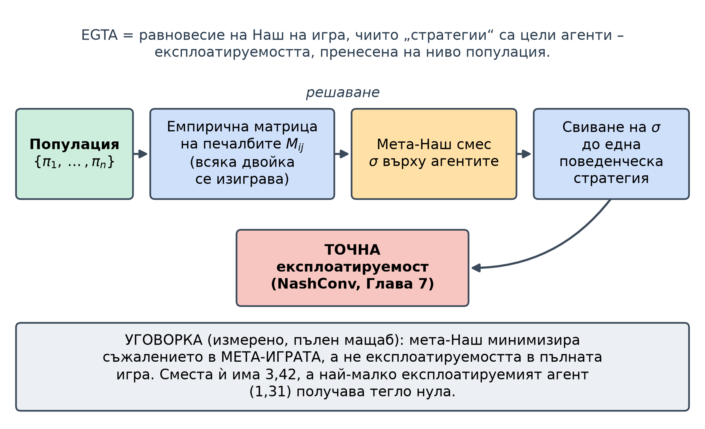

<!--
OFFICIAL PhD TITLE (keep consistent across all documents):
EN: Research on the possibilities for applying Artificial Intelligence in computer games
BG: Изследване на възможностите за приложение на изкуствения интелект в компютърни игри
-->

---
title: "Глава 10 Обобщение – Обучение на базата на популации и еволюционна теория на игрите"
subtitle: "Изследване върху възможностите за прилагане на изкуствен интелект в компютърните игри"
author: "Alexander Andreev"
date: "July 2026"
lang: bg
vars:
  research_focus: "Adaptive Strategy Learning in Multi-Agent Imperfect-Information Environments"
---

# Глава 10 – Обучение на базата на популации и еволюционна теория на игрите

Тази глава изгражда от основите темата за обучение и оценка на **популации** от агенти: еволюционната математика, която определя дали дадена популация изобщо може да се установи в равновесие, транзитивната/циклична структура, която решава дали процесът на игра срещу себе си ще се сближи или ще се завърти, и малка **лига** в стила на AlphaStar, изградена върху решим вариант на покер. **Всички експериментални резултати, представени тук, са получени** от възпроизводими изпълнения и, когато е възможно, са съпоставени с *точни* еталонни стойности (аналитичните ESS и равновесия на Наш за матричните игри; точният най-добър отговор от Глава 7 за Ледюк). Когато дадено изпълнение противоречи на очакванията ми, запазвам очакването и го съпоставям с получените резултати.

**Място в дисертацията.** Глави 2–8 решават *една* фиксирана игра; Глава 9 добавя *втори* обучаващ се агент; Глава 10 преминава към *цяла популация*. Три връзки с приносите на дисертацията: **основните експлоататори** на практика са автоматизирани модели на противника (Принос №1); **лигата на AlphaStar** използва експлоататори, за да направи основните агенти устойчиви – механизъм, близък до безопасната експлоатация на ниво популация, но устойчивостта му е показана само емпирично, без формална гаранция[^vinyals2019] – точно тук се намира Принос №2; а **EGTA / мета-Наш** е методологията за оценяване на популацията (Принос №3).

---

## Защо популации – и защо структурата определя всичко

Играта срещу себе си има известен **режим на отказ**: играч, който тренира единствено срещу самия себе си, може да се върти в кръг. Ако играта е **камък-ножица-хартия**, „да станеш по-добър“ няма смисъл – камък побеждава ножица, губи от хартия и подобряването срещу един противник просто те прави по-лош срещу друг. Най-важната идея в тази глава е, че игрите имат два вида структура, смесени заедно: **транзитивна** част (истинска **стълбица на уменията** – съществува *по-добър играч*) и **циклична** част (**кръг от контрастратегии** – има само *какво побеждава какво*). Дали една **популация, обучавана чрез игра срещу себе си** ще се сближи до нещо добро или ще се върти вечно, зависи от това *коя част е доминираща*, а не от **скоростта на обучение**.

Една представа, която да запомните: **доджо**. **Основните** ученици са това, което се опитвате да създадете. Поддържате зала, пълна със **спаринг партньори**, чиято единствена задача е да откриват и наказват конкретна слабост в настоящите ученици (експлоататори). И поддържате **музей на минали шампиони** – замразени „снимки“ – така че никой да не печели, като забрави как да победи стар стил. Обучението тогава представлява цикъл: учениците тренират помежду си, по-силните се копират и леко се изменят (**обучение на базата на популации**), а периодично копие на всички се замразява в музея. Лигата е това доджо, превърнато в математическа форма.[^vinyals2019]

---

## Семейството от методи

| Подход | Какво прави | Кога да се използва | Основна слабост |
|---|---|---|---|
| **Игра срещу себе си** | обучава последната стратегия срещу самата себе си | транзитивни игри; бърза базова линия | зацикля в цикличните игри; последната итерация не се сближава |
| **PSRO** | популация + мета-Наш + предсказвач за най-добър отговор; добавя най-добрия отговор, повтаря | търси се игровотеоретична цел | пълен най-добър отговор на всеки кръг; *сместа* не е решението (вж. §10.7) |
| **PBT** | копира по-приспособените агенти (експлоатация) + променя хиперпараметри (изследване) | онлайн търсене на хиперпараметри | може да загуби разнообразието си или да регресира (вж. §10.5) |
| **Лига в стила на AlphaStar** | PBT с три типа агенти (основни агенти / основни експлоататори / експлоататори на лигата) + замразяване + PFSP | нетранзитивни игри, където играта срещу себе си зацикля | големи изчислителни разходи; евристичен метод без гаранция за безопасност |

: Семействата методи, базирани на популации: какво прави всеки, кога да се използва и основната му слабост.

Два диагностични инструмента са общи за всички тях: **репликаторната динамика** (§10.3) показва къде една популация може да се *установи*, а **декомпозицията „пумпал“** (§10.4) измерва доколко тя е транзитивна или циклична – заедно те предсказват, *преди* да бъдат направени изчислителните разходи, дали лигата от §10.5 ще се установи или ще се завърти. Линията е следната: PBT[^jaderberg2017] и PSRO[^lanctot2017] (2017) → лигата на AlphaStar, достигнала ниво „гросмайстор“ в StarCraft II – над 99,8% от класираните човешки играчи (2019)[^vinyals2019] → „пумпалът“ (2020)[^czarnecki2020]. Такива популации се оценяват с емпиричен теоретико-игрови анализ (EGTA)[^wellman2006][^tuyls2020].

---

## Репликаторна динамика – къде една популация може да се установи

**Репликаторното уравнение** е най-простият модел на подбора: делът на дадена стратегия нараства пропорционално на това колко тя превъзхожда средната за популацията.

$$ \dot{x}_i = x_i\,\big[\,f_i(x) - \bar f(x)\,\big], \qquad \bar f(x)=\sum_j x_j f_j(x). $$

Всяко равновесие на Наш е точка на покой, но не и обратното – например всяка чиста стратегия също е точка на покой. Устойчивите точки на покой обаче винаги са равновесия на Наш, а всяка **еволюционно стабилна стратегия (ESS)** – стратегия, която, възприета от цялата популация, не може да бъде изместена от малък дял мутанти – е асимптотично устойчива[^hofbauer2003]. PBT лигата прави същото дискретно: копира по-успешните агенти (подбор) и внася малки случайни промени в тях (мутация).

При четири канонични симетрични игри (динамиката е детерминистична) измерените резултати съвпадат напълно с теорията:

| Игра | Аналитичен еталон | Измерено крайно състояние | Сходим? |
|---|---|---|:--:|
| Дилемата на затворника | предателството доминира; ESS $(0, 1)$ | $[0{,}0, 1{,}0]$ | да |
| Ястреб-гълъб | вътрешна ESS $p(\text{ястреб})=V/C=0{,}5$ | $[0{,}5, 0{,}5]$ (орбитален радиус $0{,}0$) | да |
| Камък-ножица-хартия | равновесие на Наш = равномерна стратегия; **няма ESS** | обикаля около центъра на разстояние $0{,}095$ | **не** |
| Лов на елен | две чисти ESS (според басейна на привличане) | $[0{,}8, 0{,}2]\to[1, 0]$; $[0{,}2, 0{,}8]\to[0, 1]$ | да |

: Репликаторна динамика върху четири симетрични игри, спрямо аналитичния еталон.

**Камък-ножица-хартия никога не се сближава** – вътрешната ѝ неподвижна точка е *център*, така че популацията обикаля около нея завинаги (в непрекъснато време орбитите са затворени; явният метод на Ойлер ги превръща в бавно разширяваща се спирала). Този последен ред е цялата мотивация за останалата част от главата: цикличната игра няма стабилна популация.[^hofbauer1998]

---

## „Пумпалът“ – транзитивна и циклична структура

Ако цикличните игри са проблемът, необходимо е да *измерим* степента им на цикличност. **Декомпозицията „пумпал“** разделя матрицата на печалбите на **транзитивна** компонента (стълбица на уменията, изразена чрез рейтинг на всяка стратегия) и **циклична** компонента (остатъкът – частта „камък-ножица-хартия“)[^balduzzi2018]. Името идва от формата, която Czarnecki и др. откриват при реални игри: те са най-широки (най-циклични) при стратегиите със средна сила и се стесняват към крайностите на уменията[^czarnecki2020].

Реализацията използва **комбинаторното разлагане на Ходж** (по разлики в рейтингите)[^balduzzi2018], а не декомпозицията чрез SVD с ранг 1 от първоначалния план, която неправилно дава транзитивно съотношение $\approx0{,}707$ за „камък-ножица-хартия“ – и за чиста стълбица на уменията (сингулярните стойности на антисиметрична матрица винаги са по двойки). Разлагането на Ходж дава $0{,}0$ за „камък-ножица-хартия“ и $1{,}0$ за стълбицата. Двете *реални* популации са основният извод – и те си противоречат в рамките на една и съща игра.[^balduzzi2019]

> **Съпоставка (запазена прогноза → какво всъщност се случи).** Бях приел, че покерът е стълбица на уменията, и очаквах мета-играта на Ледюк да бъде предимно транзитивна. Измерванията показват, че тя зависи изцяло от това *коя популация се разлага*. Популация от **най-добри отговори** (PSRO) е предимно **циклична** (транзитивно съотношение $\approx0{,}45$, циклично $0{,}89$–$0{,}91$, 27 цикъла от три стратегии): най-добрият отговор побеждава текущата смес, по-нов най-добър отговор побеждава *него*, и така нататък – „пумпалът“ на Czarnecki и др. в действие. Популация от **моментни снимки на траекториите на обучение** (лигата) е предимно **транзитивна** ($\approx0{,}94$–$0{,}98$), защото по-късните моментни снимки обикновено са по-силни от по-ранните. Нито едното не е грешка; съотношението транзитивно/циклично е свойство на *популацията*, а изборът как да изградите популацията е избор дали ще видите кръг или стълбица.

---

## PBT лига в стила на AlphaStar

С помощта на диагнозата изграждаме доджото върху **Ледюк Холдем**: невронни PPO агенти от три типа – **основни** агенти (продуктът; те играят срещу всички чрез PFSP игра срещу себе си), **основни експлоататори** (търсят слабости в *текущите* основни агенти) и **експлоататори на лигата** (търсят слабости в *замразената история*). PBT копира най-добрите агенти и променя тяхната скорост на обучение / ентропия; периодично замразени моментни снимки се добавят в музея; сдвояването по **PFSP** (приоритизирана фиктивна игра срещу себе си, Prioritized Fictitious Self-Play) избира противниците толкова по-често, колкото по-трудно е да бъдат победени. Всяка невронна мрежа се извлича до **таблична** стратегия, така че **точният** най-добър отговор от Глава 7 да измерва нейната експлоатируемост – същият NashConv, използван още от Глава 2 (сумата от печалбите на двата най-добри отговора; в конвенцията на OpenSpiel експлоатируемостта е половината от нея).

Подобрява ли се лигата? Резултатите от двете конфигурации (бърза проверка: 7 агента, 15 епохи; пълен мащаб: 8 агента, 120 епохи, 48 замразени моментни снимки) са следните:

| Показател | Бърза проверка | Пълен мащаб |
|---|---|---|
| минимална експлоатируемост сред основните агенти | $4{,}67 \to 3{,}04$ (най-ниската стойност е в края) | $4{,}73 \to$ **мин $\approx1{,}21$** → **$2{,}05$** |
| експлоатируемост на мета-Наш сместа | $4{,}73 \to 3{,}04$ | $5{,}01 \to$ мин $\approx1{,}32$ (плато $1{,}60$) → **$2{,}96$** |
| краен рейтинг по Ело (активни агенти) | $1176$–$1211$ | $1198$–$1210$ |

: Показатели от обучението на лигата при двата мащаба.

(Стойността $2{,}96$ е за мета-Наш сместа на популацията в началото на епоха 119, преди последната стъпка на обучение; стойността $3{,}418$ в §10.7 е за крайната популация от 56 агента.)

> **Съпоставка (запазена прогноза → какво всъщност се случи).** Очаквах *монотонно* намаляване на експлоатируемостта. При бързата проверка (15 епохи) очакването се потвърждава, а при пълния мащаб (120 епохи) – не: експлоатируемостта спада рязко през първите около 15 епохи и е най-ниска около епохи 20–40 (мета-Наш сместа достига $\approx1{,}32$ в епоха 21, а най-добрата моментна снимка е от епоха 29; единичният минимум сред основните агенти, $\approx1{,}21$, е в епоха 66). След плато ($\approx1{,}60$ за мета-Наш сместа) тя **нараства отново** до $\approx2{,}05$ / $\approx2{,}96$ в епоха 119. Най-добрите агенти са *замразените моментни снимки* от първата половина на обучението; *активните* основни агенти се влошават към края – стратегиите им непрекъснато се сменят и част от наученото се забравя. Играта срещу себе си, която няма експлоататори, също се влошава след епоха 100, така че натискът на експлоататорите не е единственото обяснение. Възможното решение (непроверено тук) е запазване на най-добрата моментна снимка или регуляризация на популацията. Както в Глава 9: **пълният мащаб разкрива това, което бързата проверка скрива.**

---

## Разнообразие – наистина ли популацията е разнообразна?

Лигата е толкова добра, колкото и *разнообразието* от стратегии, които съдържа. Според **ефективния размер на популацията** (коефициентът на участие на мета-Наш теглата), **поведенческата клъстеризация** и **покритието на експлоатация** популацията е само слабо разнообразна: коефициентът на участие нараства от $1{,}0$ (бърза проверка) до $1{,}9$ (пълен мащаб), но поведенческата клъстеризация свежда всичко до **един клъстер** и при двата мащаба – дори при пълен мащаб, където максималното поведенческо разстояние между двойки ($0{,}48$) надвишава прага за клъстеризация ($0{,}30$), методът на единичното свързване обединява агентите във верига. Разнообразието тук е *на ниво тегла*, а не *на ниво поведение* (агентите играят почти еднакво). Механизмът се проявява най-ясно при мини-PBT върху матрични игри:

Транзитивните игри *унищожават* разнообразието (има една най-добра стратегия и всички се сближават към нея), а цикличните игри го *налагат*. Лигата в Ледюк е близо до транзитивния край – затова разнообразието ѝ е ниско и затова ползите от разнообразието, описани за AlphaStar, където по време на обучението са създадени близо 900 различни агента, не се проявяват в този мащаб.[^vinyals2019]

---

## EGTA – оценка на популацията и неочаквано откритие

Последният инструмент е **емпиричният теоретико-игрови анализ (EGTA)**: цели агенти (стратегии за цялата игра) се разглеждат като „чисти стратегии“ на игра от по-високо ниво, всяка двойка агенти се изиграва, за да се попълни емпиричната матрица на печалбите, намира се **мета-Наш** сместа на тази матрица и тя се оценява – така експлоатируемостта се пренася на ниво популация.

Първоначалният план очакваше мета-Наш сместа на лигата да бъде *по-малко* експлоатируема от всеки отделен член. Измерено:

| Конфигурация | експлоатируемост на мета-Наш сместа | най-добър отделен агент | мета-Наш ≤ най-добрия? |
|---|---:|---:|:--:|
| Бърза проверка | $2{,}665$ | $2{,}665$ | **да** (цялото тегло е върху най-добрия агент) |
| Пълен мащаб | $3{,}418$ | $1{,}305$ | **не** |

: Експлоатируемост на мета-Наш сместа спрямо най-добрия отделен агент, по конфигурация.

> **Съпоставка (запазена прогноза → какво всъщност се случи).** Бързата проверка потвърди очакването тривиално: мета-Наш даде *цялото* тегло на единствения най-добър агент, така че сместа = най-добрия = $2{,}665$. При пълния мащаб мета-Наш разпределя теглото ($0{,}645$ върху един агент и по-малки тегла върху още два), а сместа, сведена до една поведенческа стратегия, има експлоатируемост $3{,}418$ – **по-висока** от тази на най-добрата отделна моментна снимка ($1{,}305$). Това не е грешка в смесването: същият код дава смес = най-добрия при бързата проверка, а сместа е по-малко експлоатируема от всеки от трите си компонента ($3{,}558$, $3{,}932$ и $4{,}262$). Причината е в целта: мета-Наш минимизира **съжалението в мета-играта** (доколко добре се представя *срещу популацията*), а не **експлоатируемостта в пълната игра**, затова най-малко експлоатируемите агенти получиха тегло нула. Като резултат от лигата трябва да се използва избран член, устойчив срещу най-добър отговор, а не мета-Наш сместа.

Как се представя лигата спрямо останалите методи по експлоатируемост в Ледюк?

| Метод (пълен мащаб) | Експлоатируемост (NashConv) |
|---|---:|
| CFR, равновесие на Наш (долна граница) | $0{,}0099$ |
| **Лига – най-добър отделен агент (за цялото обучение)** | **$1{,}305$** |
| Игра срещу себе си – най-добра итерация (епоха 100) | $1{,}396$ |
| PSRO (точен предсказвач за най-добър отговор) | $2{,}163$ |
| Лига – мета-Наш смес | $3{,}418$ |
| Игра срещу себе си – краен агент | $3{,}683$ |

: Експлоатируемост в Ледюк (NashConv) по метод; при играта срещу себе си са дадени и крайният агент, и най-добрата итерация.

Най-добрият отделен агент на лигата е най-добрият резултат сред методите, основани на обучение, но предимството му трябва да се чете внимателно: при играта срещу себе си най-добрата итерация е $1{,}396$ и едва накрая се влошава до $3{,}683$, а PSRO достига $2{,}163$ – по едно изпълнение за всеки метод, и всички остават далеч над долната граница, зададена от CFR. Мета-Наш сместа на лигата ($3{,}418$) е по-добра само от крайния агент на играта срещу себе си. Затова като резултат от лигата трябва да се използва избран отделен агент, а не сместа.[^lanctot2017]

---

## Честни бележки, ограничения и предаване на щафетата

**Какво се потвърди.** Репликаторната динамика възпроизвежда всеки аналитичен резултат за матричните игри[^hofbauer2003]; разлагането на Ходж правилно определя чистите случаи; лигата дава отделен агент с експлоатируемост $1{,}305$; а EGTA дава работеща мярка за експлоатируемост на ниво популация.

**Какво не се получи и защо това има значение.** Три уговорки остават валидни и за следващите глави. (1) При пълен мащаб експлоатируемостта на лигата **нараства отново в края на обучението** ($4{,}73\to\approx1{,}21\to\approx2{,}05$); най-добрите агенти са замразени моментни снимки. (2) При пълен мащаб **мета-Наш сместа е по-експлоатируема от най-добрия член на популацията** ($3{,}42$ срещу $1{,}31$), защото не му дава никакво тегло – изборът на мета-Наш не гарантира устойчивост. (3) Мета-играта на Ледюк е **циклична като популация от най-добри отговори**, но **транзитивна като популация от моментни снимки**. И един методологичен извод: късната регресия и слабостта на сместа не се виждат при бързата проверка.

**Доверие.** Всяка еволюционна цел е *аналитична*, а всяка стойност на експлоатируемостта в лигата е *точният* NashConv от Глава 7, изчислен върху таблично извлечените стратегии. Невронните резултати идват от едно изпълнение на PBT за всяка конфигурация: надеждни са *посоките* (ранно подобрение; най-добрата моментна снимка < PSRO < крайния агент на играта срещу себе си; късна регресия; мета-Наш сместа > най-добрия член на популацията), а не точните стойности до третия десетичен знак.

**Връзки с предходните и следващите глави.** С предходните: лигата е асинхронен вариант на PSRO от Глава 9 с невронни предсказвачи и изцяло използва точния най-добър отговор от Глава 7; „мета-Наш на популация“ е равновесието на Наш от Глава 2, пренесено едно ниво по-горе. Със следващите: основните експлоататори на практика са автоматизирани модели на противника (Принос №1); EGTA/мета-Наш е методологията за оценяване (Принос №3); а липсващата гаранция на лигата – тя може да се влоши и сместа ѝ може да е експлоатируема – е популационната форма на **липсващата опора за безопасност при $N>2$ играчи** (Принос №2). Транзитивната/цикличната диагностика предсказва, че коалиционните игри всеки срещу всеки от Глава 11 ще бъдат силно циклични, така че наивното PBT там ще зацикли.

---

## Основни изводи за синтеза на дисертацията

- **Структурата определя сходимостта.** Транзитивното/цикличното съотношение („пумпал“) е *диагностика преди обучението*: транзитивните игри се установяват (и потискат разнообразието), цикличните игри се въртят (и налагат разнообразие). Измерено транзитивно съотношение: „камък-ножица-хартия“ $0{,}0$, стълбица на уменията $1{,}0$, PSRO в Ледюк $\approx0{,}45$ (циклична), моментни снимки на лигата $\approx0{,}94$–$0{,}98$ (транзитивна).
- **Лигата произвежда силни отделни агенти, но не носи гаранция.** Най-добрата моментна снимка ($1{,}305$) е по-добра от PSRO ($2{,}163$) и сравнима с най-добрата итерация на играта срещу себе си ($1{,}396$; крайният ѝ агент е $3{,}683$) – по едно изпълнение за всеки метод; въпреки това експлоатируемостта *нараства отново* към края ($\to2{,}05$), а мета-Наш *сместа* ($3{,}42$) е по-лоша от най-добрия член на популацията ($1{,}31$): мета-Наш оптимизира съжалението в мета-играта, а не експлоатируемостта в пълната игра, затова експлоатируемостта на сместа трябва да се измерва пряко, а като резултат да се използва избран отделен агент.
- **Точната оценка е опората.** Оценяването на таблично извлечените невронни стратегии с точния най-добър отговор от Глава 7 прави всяко твърдение за популацията проверимо спрямо точни стойности.
- **Липсата на гаранция за безопасност на ниво популация е отворен проблем (Принос №2):** механизмът с експлоататори в лигата на AlphaStar е аналог на ниво популация на безопасната експлоатация от Глава 8, но е евристичен: устойчивостта му е показана само емпирично[^vinyals2019], а в малката лига от тази глава той не осигури нито монотонно подобрение, нито неексплоатируема смес.

<!-- Бележки към източниците. Заглавията на чуждоезични източници не се
     превеждат (правило 7 от terminology_EN_BG.md). -->

[^balduzzi2019]: Balduzzi, D. et al. (2019). "Open-ended Learning in Symmetric Zero-sum Games." *ICML* – разлагане на функционалните игри на транзитивна и циклична част; PSRO$_{rN}$.

[^hofbauer1998]: Hofbauer, J. & Sigmund, K. (1998). *Evolutionary Games and Population Dynamics* (Cambridge) – репликаторна динамика, ESS и центъра при „камък-ножица-хартия“; вж. също обзора на Bloembergen, Tuyls, Hennes & Kaisers (JAIR 53, 659–697, 2015), който свързва репликаторната динамика с многоагентното обучение.

[^vinyals2019]: Vinyals, O. et al. (2019). "Grandmaster level in StarCraft II using multi-agent reinforcement learning." *Nature* 575(7782), 350–354. DOI 10.1038/s41586-019-1724-z (AlphaStar; лигата и PFSP).

[^lanctot2017]: Lanctot, M. et al. (2017). "A Unified Game-Theoretic Approach to Multiagent Reinforcement Learning." *NeurIPS* (PSRO). Вж. също: McMahan, H. B., Gordon, G. & Blum, A. (2003). "Planning in the Presence of Cost Functions Controlled by an Adversary." *ICML*, 536–543 (методът на двойния предсказвач, който PSRO обобщава).

[^hofbauer2003]: Hofbauer, J. & Sigmund, K. (2003). "Evolutionary game dynamics." *Bulletin of the American Mathematical Society* 40(4), 479–519 – т.нар. „фолклорна теорема“ за репликаторната динамика (§2.3), асимптотичната устойчивост на ESS (§2.6) и затворените орбити при „камък-ножица-хартия“ (теорема 2).

[^balduzzi2018]: Balduzzi, D., Tuyls, K., Pérolat, J. & Graepel, T. (2018). "Re-evaluating Evaluation." *NeurIPS*; arXiv:1806.02643 – разлагане на Ходж на антисиметричната матрица на печалбите на транзитивна и циклична компонента; усредняване по Наш.

[^czarnecki2020]: Czarnecki, W. M., Gidel, G., Tracey, B., Tuyls, K., Omidshafiei, S., Balduzzi, D. & Jaderberg, M. (2020). "Real World Games Look Like Spinning Tops." *NeurIPS*; arXiv:2004.09468 – геометрията „пумпал“ и защо обучението изисква популации.

[^jaderberg2017]: Jaderberg, M., Dalibard, V., Osindero, S., Czarnecki, W. M. et al. (2017). "Population Based Training of Neural Networks." *arXiv:1711.09846*.

[^wellman2006]: Wellman, M. P. (2006). "Methods for Empirical Game-Theoretic Analysis." *AAAI*, 1552–1555.

[^tuyls2020]: Tuyls, K., Pérolat, J., Lanctot, M., Hughes, E., Everett, R., Leibo, J. Z., Szepesvári, C. & Graepel, T. (2020). "Bounds and dynamics for empirical game theoretic analysis." *Autonomous Agents and Multi-Agent Systems* 34(1), 7. DOI 10.1007/s10458-019-09432-y.
