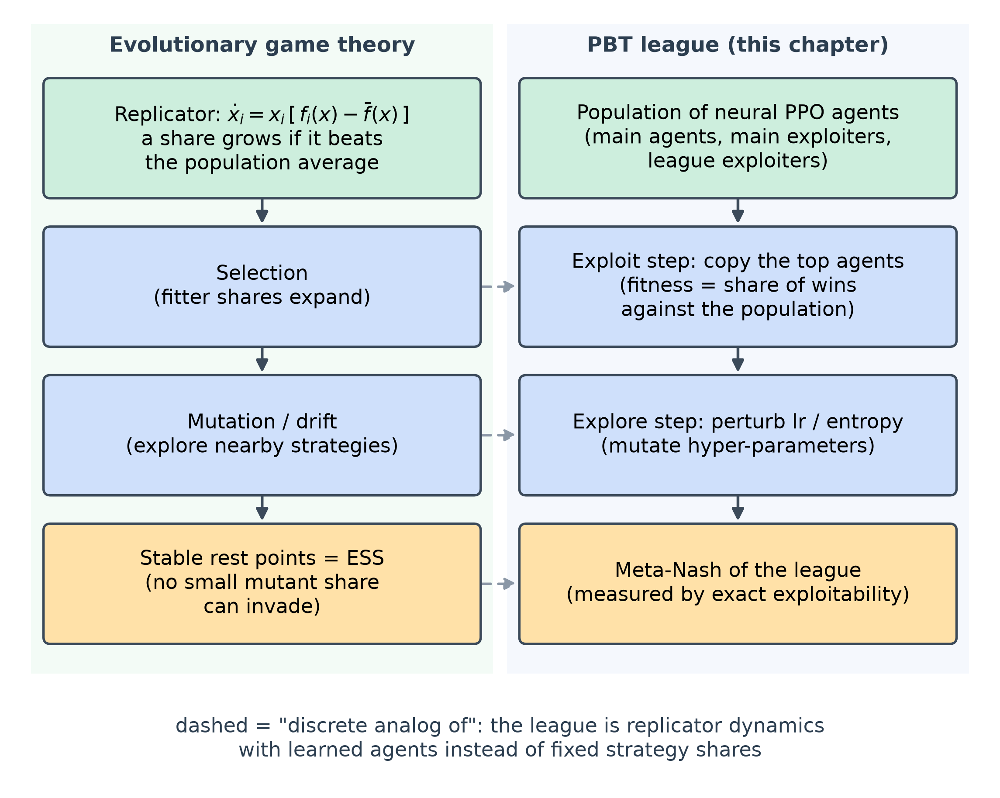
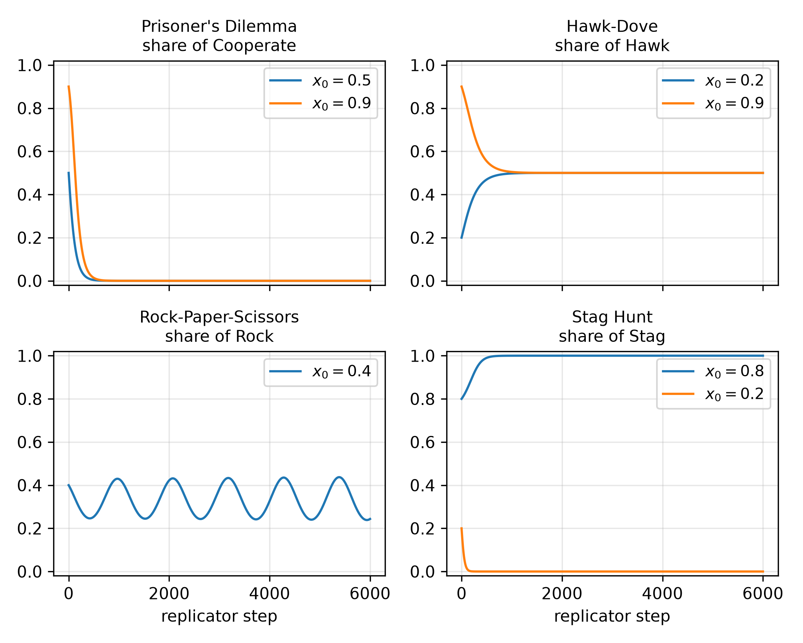
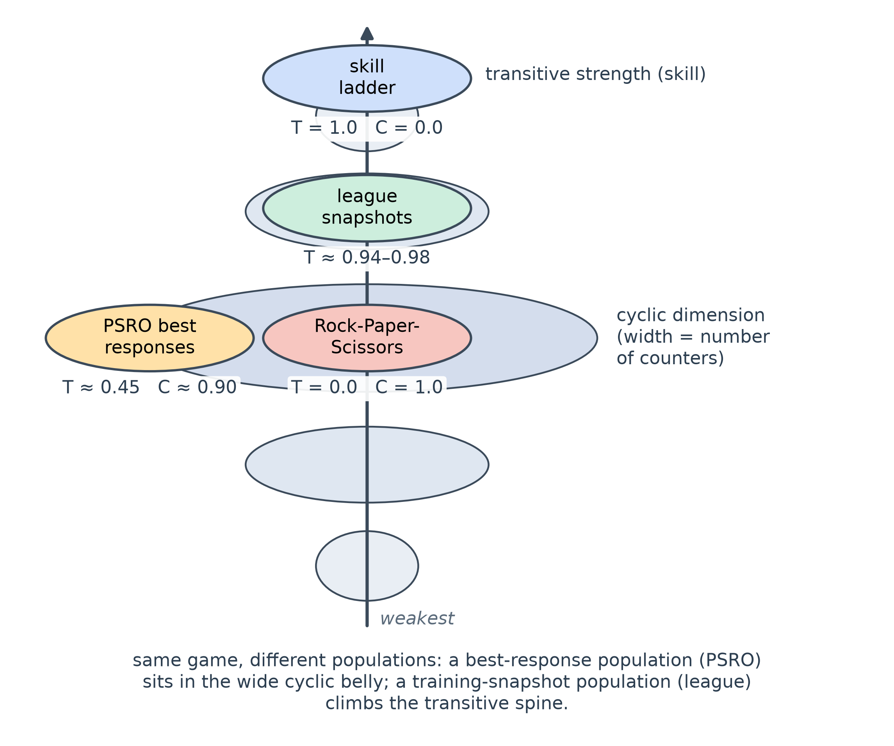
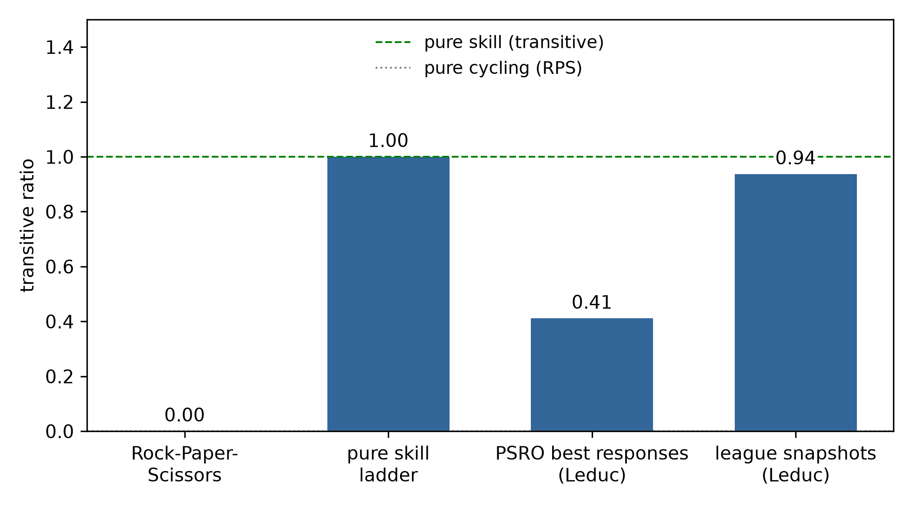
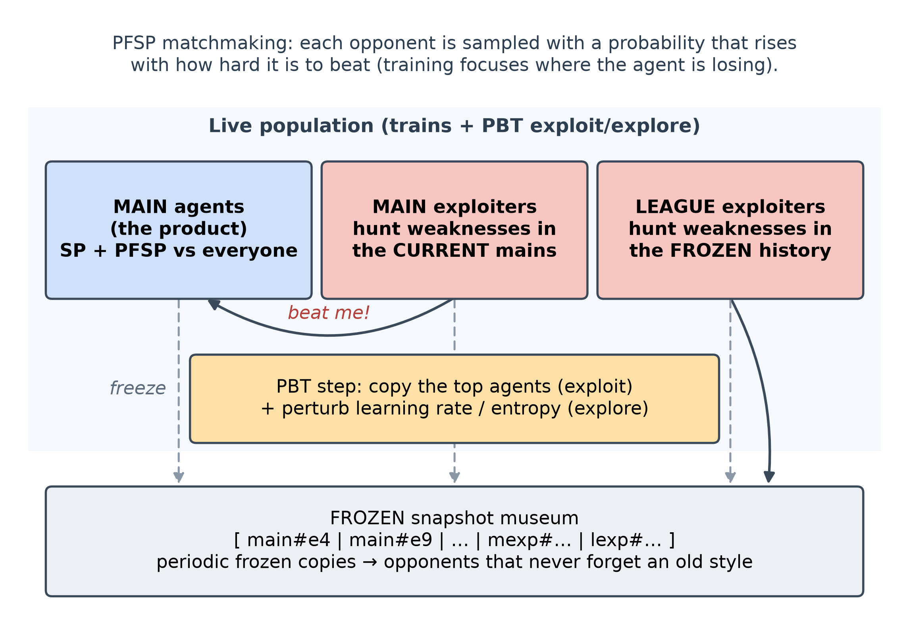
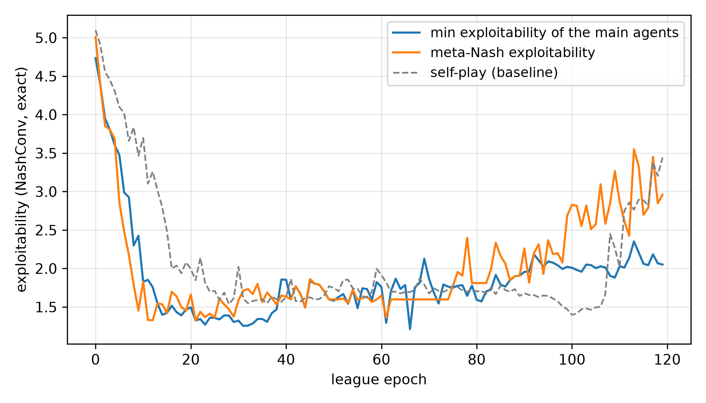
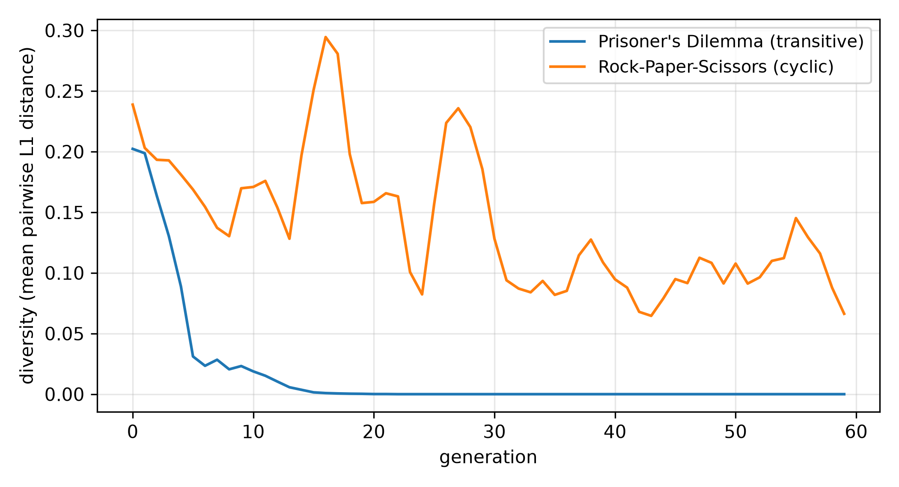
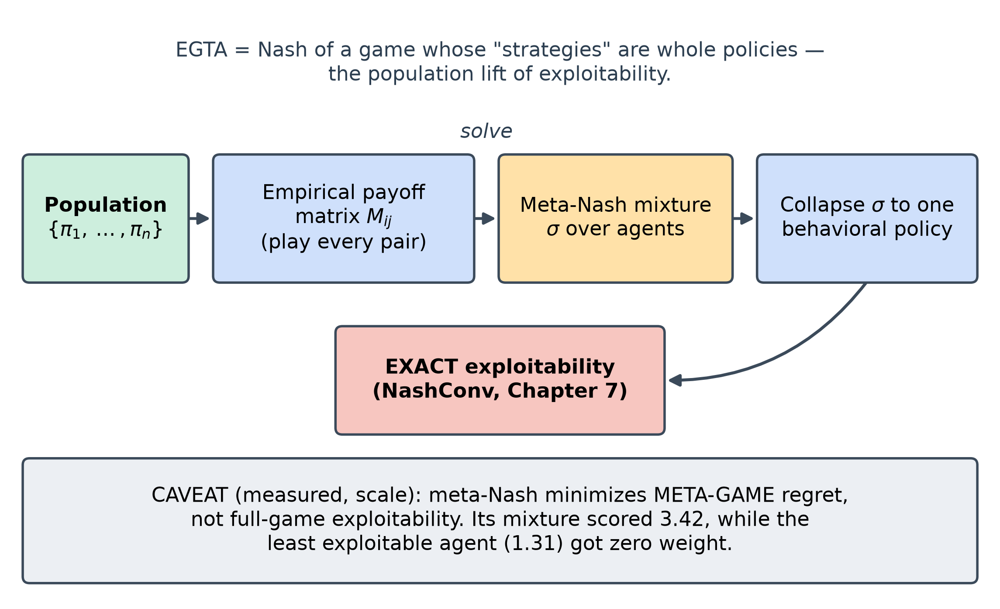
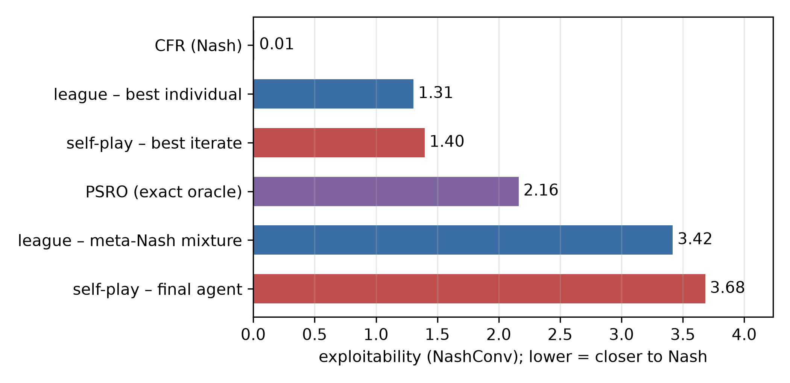

<!--
OFFICIAL PhD TITLE (keep consistent across all documents):
EN: Research on the possibilities for applying Artificial Intelligence in computer games
BG: Изследване на възможностите за приложение на изкуствения интелект в компютърни игри
-->
---
title: "Chapter 10 Summary — Population-Based Training and Evolutionary Game Theory"
subtitle: "Research on the possibilities for applying Artificial Intelligence in computer games"
author: "Alexander Andreev"
date: "July 2026"
lang: en
vars:
  research_focus: "Adaptive Strategy Learning in Multi-Agent Imperfect-Information Environments"
---

# Chapter 10 — Population-Based Training and Evolutionary Game Theory

This is a ground-up chapter on training and evaluating **populations** of agents: the evolutionary
mathematics that says whether a population can settle at all, the transitive/cyclic structure that
decides whether self-training converges or spins, and a small AlphaStar-style **league** built on a
solvable poker game.
**All experimental numbers reported here were measured** on reproducible runs and, wherever
possible, are bounded by *exact* references (analytic ESS/Nash for the matrix games; Chapter 7's exact
best response for Leduc). Where a run contradicted my expectation, I keep the expectation and
reconcile it with what happened.

**Where this sits in the thesis.** Chapters 2-8 solved *one* fixed game; Chapter 9 added a *second*
learner; Chapter 10 goes to a *whole population*. Three thesis hooks: **main exploiters** are
automated opponent modelers (Contribution #1); the **AlphaStar league** uses exploiters to make its
main agents robust — close to population-level safe exploitation, but its robustness is supported
only empirically, with no formal guarantee[^vinyals2019] — exactly where Contribution #2 lives; and
**EGTA / meta-Nash** is the population evaluation methodology (Contribution #3).

---

## Why populations — and why structure decides everything

Self-play has a famous failure mode: a player that only ever trains against its current self can go
around in circles. If the game is **rock-paper-scissors**, "get better" has no meaning — Rock beats
Scissors, loses to Paper, and improving against one opponent just makes you worse against another.
The single most important idea in this chapter is that games have two kinds of structure mixed
together: a **transitive** part (a genuine skill ladder — there *is* a better player) and a **cyclic**
part (a wheel of counters — there is only *what beats what*). Whether a self-training population
converges to something good or spins forever is decided by *which part dominates*, not by the
learning rate.

A picture to hold onto: a **dojo**. The **main** students are what you are trying to produce. You
keep a room full of **sparring partners** whose entire job is to find and punish a specific weakness
in the current students (exploiters). And you keep a **museum of past champions** — frozen snapshots —
so nobody wins by forgetting how to beat an old style. Training is then a loop: students spar, the
strong ones get copied and slightly mutated (population-based training), and periodically a copy of
everyone is frozen into the museum. The league is that dojo, made mathematical.[^vinyals2019]

---

## The family of methods

| Approach | What it does | Reach for it when | Main weakness |
|---|---|---|---|
| **Self-play** | train the latest policy against itself | transitive games; a quick baseline | cycles in cyclic games; last iterate does not converge |
| **PSRO** | population + meta-Nash + best-response oracle; add the BR, repeat | want a game-theoretic target | a full best response per round; the *mixture* is not the answer (see §10.7) |
| **PBT** | copy the fitter agents (exploit) + perturb hyper-parameters (explore) | online hyper-parameter search | can collapse diversity or regress (see §10.5) |
| **AlphaStar league** | PBT with main / main-exploiter / league-exploiter types + freezing + PFSP | non-transitive games where self-play cycles | much compute; heuristic, no safety guarantee |

: The population-based method families: what each does, when to reach for it, and its main weakness.

Two diagnostics cut across them: **replicator dynamics** (§10.3) say where a population can *rest*,
and the **spinning-top decomposition** (§10.4) measures how transitive vs cyclic it is — together they
predict, *before* you spend the compute, whether the league in §10.5 will settle or spin. The line
runs PBT[^jaderberg2017] and PSRO[^lanctot2017] (2017) → AlphaStar's league, Grandmaster in StarCraft
II, above 99.8% of ranked human players (2019)[^vinyals2019] → the spinning top (2020);[^czarnecki2020]
such populations are evaluated with EGTA.[^wellman2006][^tuyls2020]

---

## Replicator dynamics — where a population can rest

The **replicator equation** is the simplest model of selection: a strategy's share grows in
proportion to how much it beats the *population average*,

$$ \dot{x}_i = x_i\,\big[\,f_i(x) - \bar f(x)\,\big], \qquad \bar f(x)=\sum_j x_j f_j(x). $$

Every Nash equilibrium is a rest point, but not conversely (every pure strategy is one too); stable
rest points are Nash equilibria, and every **evolutionarily stable strategy (ESS)** — one that, adopted
by the whole population, cannot be invaded by a small mutant share — is asymptotically
stable.[^hofbauer2003] A PBT league does the same discretely: copy the fitter agents (selection) and
perturb them (mutation).

On four canonical symmetric games (deterministic dynamics), the measured results match theory
exactly:

| Game | Analytic reference | Measured final | Converged? |
|---|---|---|:--:|
| Prisoner's Dilemma | Defect dominates; ESS $(0,1)$ | $[0.0,1.0]$ | yes |
| Hawk-Dove | interior ESS $p(\text{Hawk})=V/C=0.5$ | $[0.5,0.5]$ (orbit radius $0.0$) | yes |
| Rock-Paper-Scissors | Nash = uniform; **no ESS** | orbits centre, radius $0.095$ | **no** |
| Stag Hunt | two pure ESS (basin-dependent) | $[0.8,0.2]\to[1,0]$; $[0.2,0.8]\to[0,1]$ | yes |

: Replicator dynamics on four symmetric games, against the analytic reference.

**Rock-Paper-Scissors never converges** — its interior fixed point is a *centre*, so the population
orbits it forever (closed in continuous time; explicit Euler turns them into a slowly widening
spiral). That last row is the whole motivation for the rest of the chapter: a cyclic game has no
stable population.[^hofbauer1998]

---

## The spinning top — transitive vs cyclic structure

If cyclic games are the problem, we need to *measure* how cyclic a game is. The **spinning-top
decomposition** splits a payoff matrix into a **transitive** component (a skill ladder, captured by
per-strategy ratings) and a **cyclic** remainder (the rock-paper-scissors part).[^balduzzi2018] The
name is the shape Czarnecki et al. found in real games: widest (most cyclic) at intermediate strength,
narrow towards the extremes of skill.[^czarnecki2020]

The implementation uses the **combinatorial-Hodge** (ratings-difference) method,[^balduzzi2018] not
the SVD rank-1 decomposition the original plan suggested, which wrongly reports Rock-Paper-Scissors —
and a pure skill ladder — as $\approx0.707$ transitive (the singular values of an antisymmetric matrix
come in equal pairs). Hodge gives RPS $0.0$ and the ladder $1.0$. The two *real* populations are the
headline — and they disagree, on the same game.[^balduzzi2019]

> **Reconciliation (kept prediction → what actually happened).** I framed poker as a skill ladder and
> expected Leduc's meta-game to be mostly transitive. Measured, it depends entirely on *which
> population you decompose*. A population of **best responses** (PSRO) is mostly **cyclic**
> ($\approx0.45$ transitive, cyclic $0.89$-$0.91$, 27 three-cycles): the best response beats the
> current mixture, a newer best response beats *that*, and so on — Czarnecki et al.'s spinning top in
> action. A population of **training-trajectory snapshots** (the league) is mostly **transitive**
> ($\approx0.94$-$0.98$), because later snapshots are usually stronger than earlier ones. Neither is a
> bug; the transitive/cyclic ratio is a property of the *population*, and choosing how you build the
> population is choosing whether you see a wheel or a ladder.

---

## The AlphaStar-style PBT league

With the diagnostic in hand, we build the dojo on **Leduc Hold'em**: neural PPO agents of three
types — **main** agents (the product; they play everyone via PFSP self-play), **main exploiters** (hunt
weaknesses in the *current* mains) and **league exploiters** (hunt weaknesses in the *frozen
history*). PBT copies the top agents and perturbs their learning rate / entropy; frozen snapshots
periodically join the museum; **PFSP** (prioritized fictitious self-play) samples opponents more often
the harder they are to beat. Every network is extracted to a **tabular** policy so Chapter 7's
**exact** best response measures its exploitability — the NashConv used since Chapter 2 (the sum of
the two best-response gains; OpenSpiel's exploitability is half of it).

Does it improve? Measured, over two configs (smoke: 7 agents, 15 epochs; scale: 8 agents, 120 epochs,
48 frozen snapshots):

| Metric | Smoke | Scale |
|---|---|---|
| min-main exploitability | $4.67 \to 3.04$ (ends at min) | $4.73 \to$ **min $\approx1.21$** → **$2.05$** |
| meta-Nash exploitability | $4.73 \to 3.04$ | $5.01 \to$ min $\approx1.32$ (plateau $1.60$) → **$2.96$** |
| final Elo (live agents) | $1176$-$1211$ | $1198$-$1210$ |

: League training metrics at both scales.

(The $2.96$ is the meta-Nash of the population at the start of epoch 119, before its last training
step; the $3.418$ in §10.7 is the final 56-agent population.)

> **Reconciliation (kept prediction → what actually happened).** I predicted a *monotone* decrease in
> exploitability. Smoke's 15 epochs oblige; scale's 120 do not: exploitability falls steeply within
> ~15 epochs, is lowest around epochs 20–40 (meta-Nash $\approx1.32$ at epoch 21; best snapshot from
> epoch 29; the lowest min-main value, $\approx1.21$, at epoch 66), holds a $\approx1.60$ meta-Nash
> plateau, and then **regresses** to $\approx2.05$ / $\approx2.96$ by epoch 119. The best agents are
> the *frozen snapshots* from the first half; the *live* mains get worse late (churn / partial
> forgetting). Self-play, which has no exploiters, also degrades after epoch 100, so exploiter
> pressure is not the only explanation. The remedy (untested here) is best-snapshot retention /
> population regularization. As in Chapter 9: **scale reveals what smoke hides.**

---

## Diversity — is the population actually diverse?

A league is only as good as the *variety* of strategies it holds. Measured by the **effective
population size** (participation ratio of the meta-Nash weights), **behavioral clustering** and
**exploit coverage**, the population is only weakly diverse: the participation ratio rises from
$1.0$ (smoke) to $1.9$ (scale), but behavioral clustering finds a **single cluster** at both scales —
even at scale, where the maximum pairwise behavioral distance ($0.48$) exceeds the clustering
threshold ($0.30$), single-linkage merges the chain. Diversity here is *weight-level*, not
*behavior-level* (the agents play near-identically). The mechanism is clearest on a mini-PBT over
matrix games:

Transitive games *kill* diversity (there is one best, everyone converges to it); cyclic games *force*
it. The Leduc league sits near the transitive end, which is exactly why its diversity is thin — and
why the diversity benefits reported for AlphaStar, whose league created almost 900 distinct players,
do not materialize at this scale.[^vinyals2019]

---

## EGTA — evaluating the population, and a surprise

The last tool is **empirical game-theoretic analysis (EGTA)**: treat whole policies as the
"strategies" of a higher game, play every pair to fill an empirical payoff matrix, solve its
**meta-Nash** mixture, and score it — the population lift of exploitability.

The original plan expected the league's meta-Nash to be *less* exploitable than any single member.
Measured:

| Config | meta-Nash exploitability | best individual | meta-Nash ≤ best? |
|---|---:|---:|:--:|
| Smoke | $2.665$ | $2.665$ | **yes** (all weight on the best agent) |
| Scale | $3.418$ | $1.305$ | **no** |

: Meta-Nash exploitability against the best individual agent, per configuration.

> **Reconciliation (kept prediction → what actually happened).** Smoke confirmed the expectation
> trivially — the meta-Nash put *all* weight on the single best agent, so meta = best = $2.665$. At
> scale the meta-Nash spreads weight ($0.645$ on one agent, smaller weights on two others), and the
> collapsed behavioral mixture scores $3.418$ — **worse** than the best single snapshot ($1.305$). Not
> a mixing bug: the identical code path gave meta = best in smoke, and the mixture is *less*
> exploitable than each of its three components ($3.558$, $3.932$, $4.262$). The cause is the
> objective: the meta-Nash minimizes **meta-game regret** (doing well *against the population*), not
> **full-game exploitability**, so the least exploitable agents received zero weight. A league should
> *ship* a selected, best-response-robust member — not the meta-Nash mixture.

How does the league compare to the alternatives on Leduc exploitability?

| Method (scale) | Exploitability (NashConv) |
|---|---:|
| CFR-Nash (the floor) | $0.0099$ |
| **League — best individual (best of the run)** | **$1.305$** |
| Self-play — best iterate (epoch 100) | $1.396$ |
| PSRO (exact best-response oracle) | $2.163$ |
| League — meta-Nash mixture | $3.418$ |
| Self-play — final agent | $3.683$ |

: Leduc exploitability (NashConv) by method; for self-play both the final agent and the best iterate are shown.

The league's **best individual** is the best learned result, but its lead needs a careful reading:
self-play's best iterate is $1.396$ before it degrades to $3.683$, and PSRO reaches $2.163$ — one run
each, all far above the CFR-Nash floor. The league's **mixture** ($3.418$) beats only the final
self-play agent. Ship a selected member, not the mixture.[^lanctot2017]

---

## Honest notes, limitations, and where this hands off

**What held up.** Replicator dynamics reproduce every analytic outcome of the matrix
games;[^hofbauer2003] the Hodge decomposition labels the pure cases correctly; the league produces an
individual agent at $1.305$; and EGTA gives a working population-level exploitability.

**What did not, and why it matters.** Three honest caveats travel forward. (1) The league's
exploitability **regresses late** at scale ($4.73\to\approx1.21\to\approx2.05$); the best agents are
frozen snapshots. (2) The **meta-Nash mixture
is more exploitable than the population's best member** at scale ($3.42$ vs $1.31$), because it gives
that member no weight — choosing by meta-Nash does not guarantee robustness. (3) Leduc's meta-game is
**cyclic as a best-response population** but **transitive as a snapshot population**. And a
methodological point: the late regression and the mixture's weakness are both invisible at the fast
smoke config.

**Trust.** Every evolutionary target is *analytic*, and every league exploitability is Chapter 7's
*exact* NashConv on tabular-extracted policies. The neural results are a single PBT run per config:
the *directions* (early improvement; best snapshot < PSRO < final self-play agent; late regression;
meta-Nash mixture > the population's best member) are the trustworthy claims, not the third-decimal
magnitudes.

**Backward and forward connections.** Backward: the league is Chapter 9's PSRO made asynchronous with
neural oracles, and it reuses Chapter 7's exact best response wholesale; the "meta-Nash of a population"
is Chapter 2's Nash lifted one level. Forward: main exploiters are automated opponent modelers
(Contribution #1); EGTA/meta-Nash is the evaluation methodology (Contribution #3); and the league's
missing guarantee — it can regress and its mixture can be exploitable — is the population form of the
**missing $N>2$ safety anchor** (Contribution #2). The transitive/cyclic diagnostic predicts Chapter 11's FFA coalition games will be strongly cyclic, so naive PBT there will cycle.

---

## Key takeaways for the thesis synthesis

- **Structure decides convergence.** The transitive/cyclic (spinning-top) ratio is a *pre-training
  diagnostic*: transitive games settle (and kill diversity), cyclic games spin (and force diversity).
  Measured: RPS $0.0$ transitive, skill ladder $1.0$, PSRO-Leduc $\approx0.45$ (cyclic), league
  snapshots $\approx0.94$-$0.98$ (transitive).
- **The league produces strong individuals but carries no guarantee.** Best snapshot $1.305$ beats
  PSRO $2.163$ and matches self-play's best iterate ($1.396$; its final agent is $3.683$) — one run
  each — yet exploitability *regresses* late ($\to2.05$) and the meta-Nash *mixture* ($3.42$) is worse
  than the population's best member ($1.31$): meta-Nash optimizes meta-game regret, not full-game
  exploitability, so score the collapsed mixture directly and ship a selected member.
- **Exact evaluation is the anchor.** Grading tabular-extracted neural policies with Chapter 7's exact best response ground-truths every population claim.
- **The population-safety gap is the open door (Contribution #2):** the AlphaStar exploiter mechanism
  is the population analog of Chapter 8's safe exploitation, but it is heuristic — its robustness is
  shown only empirically,[^vinyals2019] and in this chapter's small league it guaranteed neither
  monotone improvement nor a non-exploitable mixture.

<!-- Source footnotes. Definitions may sit anywhere at top level; keeping them
     together here keeps the prose readable and the EN/BG pair easy to compare. -->

[^balduzzi2019]: Balduzzi, D. et al. (2019). "Open-ended Learning in Symmetric Zero-sum Games." *ICML* — the transitive/cyclic decomposition of functional-form games; PSRO$_{rN}$.

[^hofbauer1998]: Hofbauer, J. & Sigmund, K. (1998). *Evolutionary Games and Population Dynamics* (Cambridge) — replicator dynamics, ESS, and the RPS centre; see also the Bloembergen, Tuyls, Hennes & Kaisers survey (JAIR 53, 659–697, 2015) connecting replicator dynamics to multi-agent learning.

[^vinyals2019]: Vinyals, O. et al. (2019). "Grandmaster level in StarCraft II using multi-agent reinforcement learning." *Nature* 575(7782), 350–354. DOI 10.1038/s41586-019-1724-z (AlphaStar; the league and PFSP).

[^lanctot2017]: Lanctot, M. et al. (2017). "A Unified Game-Theoretic Approach to Multiagent Reinforcement Learning." *NeurIPS* (PSRO). See also: McMahan, H. B., Gordon, G. & Blum, A. (2003). "Planning in the Presence of Cost Functions Controlled by an Adversary." *ICML*, 536–543 (the double-oracle method PSRO generalizes).

[^hofbauer2003]: Hofbauer, J. & Sigmund, K. (2003). "Evolutionary game dynamics." *Bulletin of the American Mathematical Society* 40(4), 479–519 — the "folk theorem" of replicator dynamics (§2.3), asymptotic stability of an ESS (§2.6), and the closed orbits of rock-paper-scissors (Theorem 2).

[^balduzzi2018]: Balduzzi, D., Tuyls, K., Pérolat, J. & Graepel, T. (2018). "Re-evaluating Evaluation." *NeurIPS*; arXiv:1806.02643 — the Hodge decomposition of an antisymmetric payoff matrix into transitive and cyclic components; Nash averaging.

[^czarnecki2020]: Czarnecki, W. M., Gidel, G., Tracey, B., Tuyls, K., Omidshafiei, S., Balduzzi, D. & Jaderberg, M. (2020). "Real World Games Look Like Spinning Tops." *NeurIPS*; arXiv:2004.09468 — the spinning-top geometry and why training needs populations.

[^jaderberg2017]: Jaderberg, M., Dalibard, V., Osindero, S., Czarnecki, W. M. et al. (2017). "Population Based Training of Neural Networks." *arXiv:1711.09846*.

[^wellman2006]: Wellman, M. P. (2006). "Methods for Empirical Game-Theoretic Analysis." *AAAI*, 1552–1555.

[^tuyls2020]: Tuyls, K., Pérolat, J., Lanctot, M., Hughes, E., Everett, R., Leibo, J. Z., Szepesvári, C. & Graepel, T. (2020). "Bounds and dynamics for empirical game theoretic analysis." *Autonomous Agents and Multi-Agent Systems* 34(1), 7. DOI 10.1007/s10458-019-09432-y.
